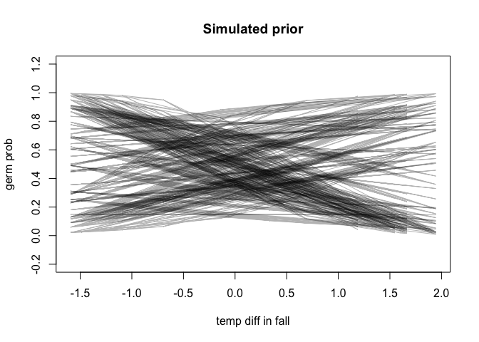
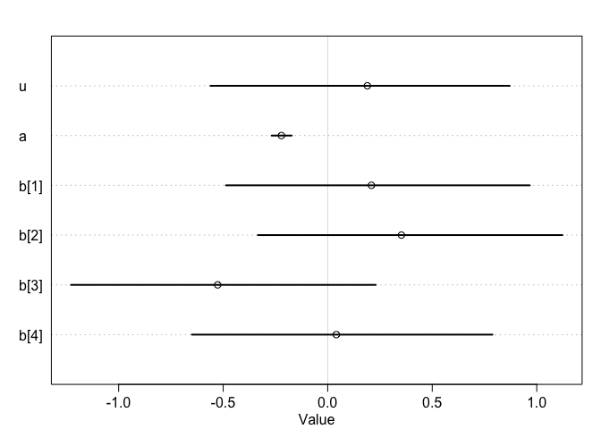
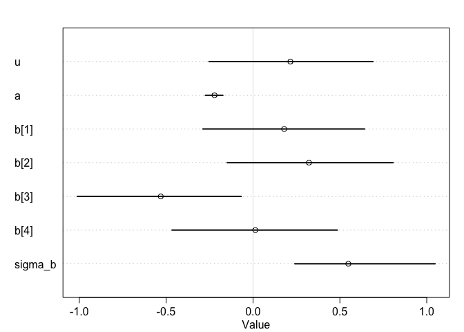
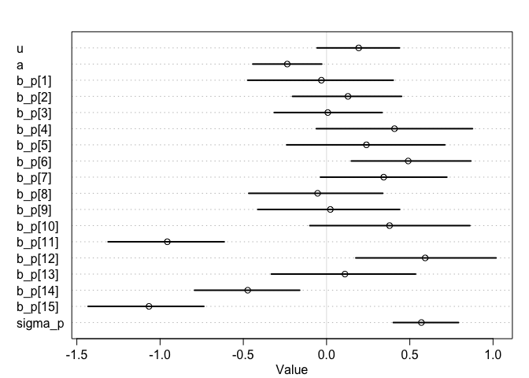
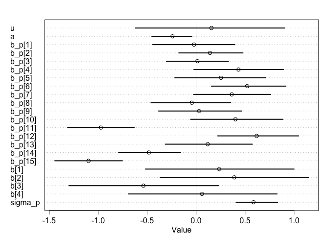
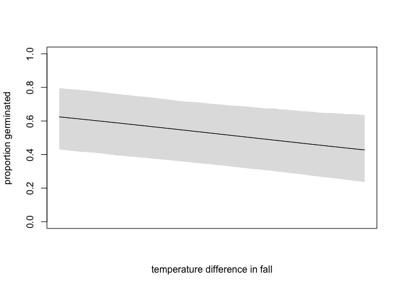

```r
data = read.csv("/Users/rongkui/Desktop/StatisticalRethinking/clarkia_transplant_data.csv")
head(data)
```

```
##   temperature_diff_fall blk nov_germ pop    dam   sire nov_size mar_surv
## 1             1.1878937   1        0  AY   AY29   AY44       NA        0
## 2             1.1878937   3        1  AY   AY35   AY29        5        1
## 3             1.6650067   3        0  BB   BB44   BB37       NA        0
## 4             1.9434353   3        1  BC   BC54   BC37        1        1
## 5            -1.4869126   3        1  AR   AR37   AR46        1        0
## 6             0.6972648   4        1  AD AD71.3 AD75.1        1        0
##   mar_size fruit_count total_est_seeds temperature_diff_annual
## 1       NA           0               0               1.0756389
## 2        2           0               0               1.0756389
## 3       NA           0               0               1.5792800
## 4        6           0               0               1.8116999
## 5       NA           0               0              -0.6419634
## 6       NA           0               0               0.6501248
##   precip_diff_spring first_fl_julian last_fl_julian
## 1           22.53600              NA             NA
## 2           22.53600              NA             NA
## 3           12.02783              NA             NA
## 4           13.35525              NA             NA
## 5           28.62542              NA             NA
## 6            6.50400              NA             NA
```


1. Fit a simple model with effects of temperature difference (temperature_diff_fall) on November germination (nov_germ). Temperature difference is already centered and scaled (i.e., negative values are the smallest temperature differences). Make sure to use the appropriate likelihood for the germination data (0 = no germ, 1  = germ).   


```r
library(rethinking)
```

```
## Loading required package: rstan
```

```
## Loading required package: StanHeaders
```

```
## Loading required package: ggplot2
```

```
## rstan (Version 2.19.2, GitRev: 2e1f913d3ca3)
```

```
## For execution on a local, multicore CPU with excess RAM we recommend calling
## options(mc.cores = parallel::detectCores()).
## To avoid recompilation of unchanged Stan programs, we recommend calling
## rstan_options(auto_write = TRUE)
```

```
## Loading required package: parallel
```

```
## Loading required package: dagitty
```

```
## rethinking (Version 1.92)
```

```
## 
## Attaching package: 'rethinking'
```

```
## The following object is masked from 'package:stats':
## 
##     rstudent
```

```r
d = list(
  tdf = data$temperature_diff_fall,
  ng = data$nov_germ
)

mod1 = ulam(
  alist(
    ng ~ dbinom(1, p),
    logit(p) <- u + a * tdf,
    u ~ dnorm(0, 1),
    a ~ dnorm(0, 1)
  ), data = d, chains = 4, cores = 4, log_lik = TRUE
)
precis(mod1, depth = 2)
```

```
##         mean         sd       5.5%      94.5%    n_eff      Rhat
## u  0.2059448 0.03627653  0.1478242  0.2652302 1376.326 0.9996115
## a -0.2148410 0.03079538 -0.2634086 -0.1660508 1258.224 0.9992362
```

2. Simulate from your priors to see if you've chosen reasonable priors, adjust them if necessary.


```r
set.seed(1)
prior = extract.prior(mod1)
```

```
## 
## SAMPLING FOR MODEL '12f9877d66637f7fe4c73419ada347dd' NOW (CHAIN 1).
## Chain 1: 
## Chain 1: Gradient evaluation took 0.000151 seconds
## Chain 1: 1000 transitions using 10 leapfrog steps per transition would take 1.51 seconds.
## Chain 1: Adjust your expectations accordingly!
## Chain 1: 
## Chain 1: 
## Chain 1: Iteration:    1 / 2000 [  0%]  (Warmup)
## Chain 1: Iteration:  200 / 2000 [ 10%]  (Warmup)
## Chain 1: Iteration:  400 / 2000 [ 20%]  (Warmup)
## Chain 1: Iteration:  600 / 2000 [ 30%]  (Warmup)
## Chain 1: Iteration:  800 / 2000 [ 40%]  (Warmup)
## Chain 1: Iteration: 1000 / 2000 [ 50%]  (Warmup)
## Chain 1: Iteration: 1001 / 2000 [ 50%]  (Sampling)
## Chain 1: Iteration: 1200 / 2000 [ 60%]  (Sampling)
## Chain 1: Iteration: 1400 / 2000 [ 70%]  (Sampling)
## Chain 1: Iteration: 1600 / 2000 [ 80%]  (Sampling)
## Chain 1: Iteration: 1800 / 2000 [ 90%]  (Sampling)
## Chain 1: Iteration: 2000 / 2000 [100%]  (Sampling)
## Chain 1: 
## Chain 1:  Elapsed Time: 0.769672 seconds (Warm-up)
## Chain 1:                0.806793 seconds (Sampling)
## Chain 1:                1.57647 seconds (Total)
## Chain 1:
```

```r
plot( NULL , xlim=c(min(data$temperature_diff_fall),max(data$temperature_diff_fall)) , ylim=c(-0.2,1.2) ,
xlab="temp diff in fall" , ylab="germ prob", main = "Simulated prior" )
tdf_seq <- sample(data$temperature_diff_fall, 50)
mu <- link( mod1 , post=prior , data=data.frame(tdf = tdf_seq) )
for ( i in 1:50 ) lines( tdf_seq , mu[i,] , col = col.alpha("black",0.3) )
```

<!-- -->

These blocks were set up in the field, and had differences in soil depth, slope, and competitive environment. So maybe a model that includes block will describe the data better.

3. Fit a model that includes an effect of block (blk), with no pooling.    


```r
d = list(
  tdf = data$temperature_diff_fall,
  ng = data$nov_germ,
  blk = data$blk
)

mod3 = ulam(
  alist(ng ~ dbinom(1, p),
        logit(p) <- u + a * tdf + b[blk],
        u ~ dnorm(0,1),
        a  ~ dnorm(0,1), 
        b[blk] ~ dnorm(0, 1)), 
  data = d, chains = 4, cores = 4, log_lik = TRUE
)
```

```
## Warning: Bulk Effective Samples Size (ESS) is too low, indicating posterior means and medians may be unreliable.
## Running the chains for more iterations may help. See
## http://mc-stan.org/misc/warnings.html#bulk-ess
```

```
## Warning: Tail Effective Samples Size (ESS) is too low, indicating posterior variances and tail quantiles may be unreliable.
## Running the chains for more iterations may help. See
## http://mc-stan.org/misc/warnings.html#tail-ess
```

```r
precis(mod3, depth = 2)
```

```
##             mean         sd       5.5%      94.5%    n_eff     Rhat
## u     0.18981548 0.44787768 -0.5607223  0.8704981 330.9621 1.012334
## a    -0.22141678 0.02967231 -0.2683118 -0.1721651 658.4825 1.005270
## b[1]  0.20911093 0.45280862 -0.4866089  0.9665073 342.6762 1.011317
## b[2]  0.35273294 0.45085887 -0.3338622  1.1229711 329.9593 1.012292
## b[3] -0.52635982 0.45057936 -1.2280098  0.2295143 337.0501 1.010968
## b[4]  0.04143747 0.44972834 -0.6498454  0.7881851 336.2586 1.012303
```

```r
plot(mod3, depth = 2)
```

<!-- -->

```r
compare(mod1, mod3)
```

```
##          WAIC    pWAIC   dWAIC       weight       SE      dSE
## mod3 4354.892 4.823714  0.0000 1.000000e+00 24.69288       NA
## mod1 4436.513 2.030181 81.6212 1.888781e-18 16.80772 18.58866
```

> So the block effects are real. 

4. Fit a model that includes block, and allows partial pooling.    


```r
mod4 = ulam(
  alist(
    ng ~ dbinom(1, p),
        logit(p) <- u + a * tdf + b[blk],
        u ~ dnorm(0,1),
        a  ~ dnorm(0,1), 
        b[blk] ~ dnorm(0, sigma_b), 
        sigma_b ~ dexp(1)),
  data = d, chains = 4, cores = 4, log_lik = TRUE
)
```

```
## Warning: Bulk Effective Samples Size (ESS) is too low, indicating posterior means and medians may be unreliable.
## Running the chains for more iterations may help. See
## http://mc-stan.org/misc/warnings.html#bulk-ess
```

```
## Warning: Tail Effective Samples Size (ESS) is too low, indicating posterior variances and tail quantiles may be unreliable.
## Running the chains for more iterations may help. See
## http://mc-stan.org/misc/warnings.html#tail-ess
```

```r
precis(mod4, depth = 2)
```

```
##                mean         sd       5.5%       94.5%    n_eff     Rhat
## u        0.21509406 0.29506536 -0.2535504  0.69052819 233.9101 1.011767
## a       -0.22177896 0.03147219 -0.2743046 -0.17350864 704.0992 1.000799
## b[1]     0.17912722 0.29893587 -0.2888559  0.64241134 238.7482 1.011617
## b[2]     0.32190935 0.30096108 -0.1487235  0.80667442 246.4491 1.011431
## b[3]    -0.53132815 0.30002491 -1.0118479 -0.06800006 246.9882 1.011112
## b[4]     0.01297507 0.30087078 -0.4667234  0.48526766 241.2854 1.011648
## sigma_b  0.54854144 0.29143516  0.2404418  1.04820216 353.2846 1.005423
```

```r
plot(mod4, depth = 2)
```

<!-- -->

```r
compare(mod4, mod3)
```

```
##          WAIC    pWAIC     dWAIC    weight       SE       dSE
## mod3 4354.892 4.823714 0.0000000 0.5741378 24.69288        NA
## mod4 4355.489 5.076068 0.5975075 0.4258622 24.32430 0.6077397
```


The experiment included many individuals from each of the 15 populations. So, each individual is not an independent representative of a given temperature, but might be similar to other plants from that population for reasons besides temperature.  

5. Build a model that accounts for this by including population (pop) and allowing partial pooling between populations A) without block, 


```r
d = list(
  tdf = data$temperature_diff_fall,
  ng = data$nov_germ,
  blk = data$blk,
  pop = data$pop
)

mod5a = ulam(
  alist(ng ~ dbinom(1, p),
        logit(p) <- u + a * tdf + b_p[pop],
        u ~ dnorm(0,1),
        a  ~ dnorm(0,1), 
        b_p[pop] ~ dnorm(0, sigma_p),
        sigma_p ~ dexp(1)), 
  data = d, chains = 4, cores = 4, log_lik = TRUE
)
```

```
## Warning: Bulk Effective Samples Size (ESS) is too low, indicating posterior means and medians may be unreliable.
## Running the chains for more iterations may help. See
## http://mc-stan.org/misc/warnings.html#bulk-ess
```

```r
precis(mod5a, depth = 2)
```

```
##                 mean        sd        5.5%       94.5%    n_eff      Rhat
## u        0.193034430 0.1565059 -0.05697869  0.43788396 341.8992 1.0089594
## a       -0.236066904 0.1345865 -0.44298722 -0.02885067 326.5484 1.0208392
## b_p[1]  -0.031145039 0.2761468 -0.47370872  0.40052168 438.5091 1.0140761
## b_p[2]   0.128692932 0.2086605 -0.20447631  0.45028392 478.0732 1.0021295
## b_p[3]   0.007330997 0.2009640 -0.31416289  0.33343809 488.7672 1.0052035
## b_p[4]   0.408066057 0.2962545 -0.06124054  0.87636056 390.1737 1.0147036
## b_p[5]   0.239460644 0.3005961 -0.23946128  0.71031405 369.0972 1.0202483
## b_p[6]   0.490343105 0.2269755  0.14875133  0.86654860 396.7515 1.0149280
## b_p[7]   0.343287653 0.2389482 -0.03657447  0.72247596 442.2672 1.0056413
## b_p[8]  -0.053778303 0.2545695 -0.46724946  0.33757877 385.4682 1.0144707
## b_p[9]   0.022806042 0.2732665 -0.41284026  0.43897353 414.8774 1.0080496
## b_p[10]  0.378435812 0.3042274 -0.10033407  0.86078091 423.7394 1.0092096
## b_p[11] -0.956477193 0.2219810 -1.31201100 -0.61494951 504.5290 1.0048948
## b_p[12]  0.592385308 0.2682109  0.17588689  1.01806721 445.7678 1.0061295
## b_p[13]  0.110330407 0.2822355 -0.33155942  0.53468299 455.1241 1.0096427
## b_p[14] -0.473603190 0.1991180 -0.79310432 -0.16132604 450.5386 1.0077380
## b_p[15] -1.066639455 0.2241213 -1.43227687 -0.73710907 515.2960 1.0019310
## sigma_p  0.569579321 0.1308134  0.40093886  0.79265295 911.7762 0.9993757
```

```r
plot(mod5a, depth = 2)
```

<!-- -->

and B) with block included as in the model above. How does including population affect the temperature estimate?   


```r
mod5b = ulam(
  alist(ng ~ dbinom(1, p),
        logit(p) <- u + a * tdf + b_p[pop] + b[blk],
        u ~ dnorm(0,1),
        a  ~ dnorm(0,1), 
        b_p[pop] ~ dnorm(0, sigma_p),
        b[blk] ~ dnorm(0, 1),
        sigma_p ~ dexp(1)), 
  data = d, chains = 4, cores = 4, log_lik = TRUE
)
precis(mod5b, depth = 2)
```

```
##                mean        sd        5.5%       94.5%    n_eff     Rhat
## u        0.15625002 0.4787725 -0.61990925  0.90426342 424.9827 1.009531
## a       -0.24132535 0.1301283 -0.45167377 -0.04398294 478.1139 1.002735
## b_p[1]  -0.02142476 0.2706614 -0.44309213  0.39439132 543.7659 1.003251
## b_p[2]   0.14114440 0.2085299 -0.17702008  0.47802461 492.2991 1.005499
## b_p[3]   0.01358512 0.2016189 -0.30296852  0.32925643 597.1505 1.001656
## b_p[4]   0.43243268 0.2950333 -0.02262883  0.89111445 601.5411 1.001792
## b_p[5]   0.25360873 0.2970433 -0.21757192  0.71059437 500.7234 1.003242
## b_p[6]   0.52164774 0.2368058  0.15548260  0.91577454 548.9359 1.003750
## b_p[7]   0.36318986 0.2417119 -0.02563518  0.76219826 519.2409 1.003892
## b_p[8]  -0.04420604 0.2544702 -0.46027044  0.35334839 538.9716 1.002072
## b_p[9]   0.02987676 0.2703742 -0.38351612  0.46421329 484.7754 1.003596
## b_p[10]  0.40128236 0.2985887 -0.05624334  0.88607066 448.6883 1.004353
## b_p[11] -0.97274976 0.2123716 -1.31123541 -0.63198696 678.2557 1.002802
## b_p[12]  0.61780130 0.2668088  0.21982720  1.04704145 479.6486 1.004799
## b_p[13]  0.11842180 0.2861773 -0.31451459  0.57374939 587.5962 1.002288
## b_p[14] -0.48262359 0.2047432 -0.79092779 -0.15764964 540.0651 1.004036
## b_p[15] -1.09815653 0.2159510 -1.44239810 -0.75249342 595.4856 1.003854
## b[1]     0.23479653 0.4794177 -0.51793197  1.00038976 405.1987 1.008256
## b[2]     0.38957846 0.4791588 -0.36637896  1.14717835 409.5169 1.007959
## b[3]    -0.53797266 0.4787635 -1.29846892  0.22800206 409.4129 1.007021
## b[4]     0.05997666 0.4785946 -0.69105175  0.82638855 401.9787 1.007241
## sigma_p  0.58557341 0.1378283  0.40838847  0.83248958 722.1585 1.004387
```

```r
plot(mod5b, depth = 2)
```

<!-- -->

6. Compare the five models you built using WAIC. Which fits best?


```r
compare(mod1, mod3, mod4, mod5a, mod5b)
```

```
##           WAIC     pWAIC     dWAIC       weight       SE      dSE
## mod5b 4184.805 17.315731   0.00000 1.000000e+00 34.82555       NA
## mod5a 4271.562 14.411469  86.75687 1.448720e-19 30.00809 18.89133
## mod3  4354.892  4.823714 170.08617 1.164819e-37 24.69288 25.75980
## mod4  4355.489  5.076068 170.68367 8.639954e-38 24.32430 25.73734
## mod1  4436.513  2.030181 251.70736 2.200089e-55 16.80772 31.00610
```

> Model5b wins by a landslide.   

7. Plot effects of temperature difference for the average block,       

```r
post5b = extract.samples(mod5b)
p_link_bbar <- function( tdf ) {
  logodds <- with( post5b , u + as.vector(a * tdf) )
  return( inv_logit(logodds) )
}

seq = seq( min(data$temperature_diff_fall), max(data$temperature_diff_fall), length.out = 2000)

p_raw <- sapply(seq, function(i) p_link_bbar( i ))
p_mu <- apply(p_raw, 2, mean)
p_ci <- apply(p_raw, 2, PI)
plot( NULL , xlab="temperature difference in fall" , ylab="proportion germinated" , ylim=c(0,1) , xaxt="n" , xlim = c(min(data$temperature_diff_fall), max(data$temperature_diff_fall)) )
lines( seq , p_mu )
shade( p_ci , seq )
```

<!-- -->

and also make a plot that includes the variability across blocks.    

> Oops the final model I made did not have a sigma_block (aka did not pool across block).   


```r
b_sim <- with( post5b , rnorm( length(post5b$u) , 0 , 1 ) )
p_link_bsim <- function( tdf ) {
  logodds <- with( post5b , u + as.vector(a * tdf) + b_sim)
  return( inv_logit(logodds) )
}

#seq = seq( min(data$temperature_diff_fall), max(data$temperature_diff_fall), length.out = 2000)

p_raw_sim <- sapply(seq, function(i) p_link_bsim( i ))
p_mu_sim <- apply(p_raw, 2, mean)
p_ci_sim <- apply(p_raw, 2, PI)
plot( NULL , xlab="temperature difference in fall" , ylab="proportion germinated" , ylim=c(0,1) , xaxt="n" , xlim = c(min(data$temperature_diff_fall), max(data$temperature_diff_fall)) )
lines( seq , p_mu_sim )
shade( p_ci_sim , seq )
```

<!-- -->

