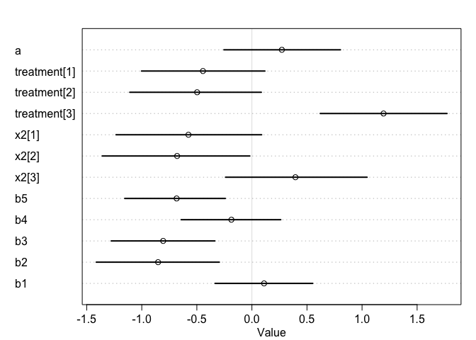
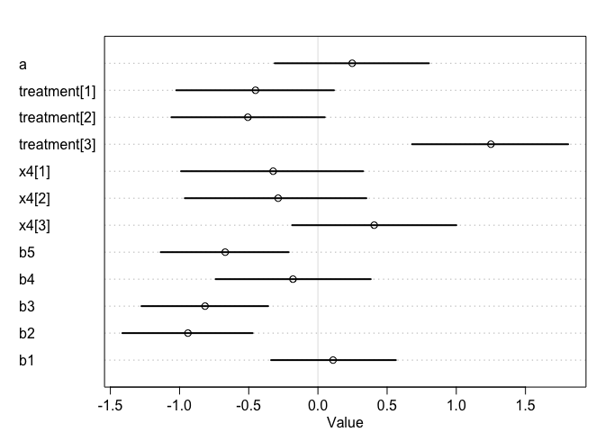
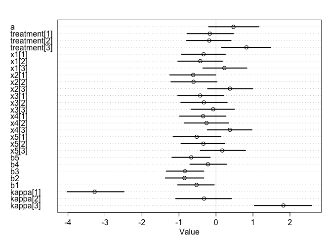

### Q1:     
a. Load the dataset. Look for column "Score" for the response variable we are interested in. A developmental score of 1 or 2 indicates vegetative growth, while a score of 3, 4, or 5 indicates reproductive growth. Create a "Reproduction" column with values 0 and 1, where 0 indicates vegetative growth and 1 indicates reproductive growth. 

```r
nb = read.csv("/Users/rongkui/Desktop/Lab/Aim1_Photoperiod/ShortDay2019/Nightbreak/Nightbreak_02_08_20.csv")
head(nb)
nb['repro'] = ifelse(nb$Score > 2, 1, 0) 
nb[c("loc1","loc2","loc3","loc4","loc5")] = do.call(rbind, strsplit(as.character(nb$Geno), ""))
nb = nb[,c("RIL","Treatment","Rep","Plot","Date","loc1","loc2","loc3","loc4","loc5","Score","repro")]
nb = nb[complete.cases(nb),]
nb[nb$Score < 1,"Score"] = 1
nb2 = nb[,-which(colnames(nb)=="repro")]
nb2 = nb2[order(nb2$Treatment, nb2$Rep, nb2$Plot),]
write.csv(nb2, file = "/Users/rongkui/Desktop/StatisticalRethinking/Nightbreak_02_08_20_Rclub.csv", row.names = FALSE)
```


```r
nb = read.csv("/Users/rongkui/Desktop/StatisticalRethinking/Nightbreak_02_08_20_Rclub.csv")
#nb
nb['repro'] = ifelse(nb$Score > 2, 1, 0) 
```


b. (optional) Take a look at columns "loc1" through "loc5". The levels "A" or "P" indicate which parental allele the RIL has inherited. Can you think of a reason why there are 32 lines in this experiment? 


### Q2:    
Using the "Reproduction" column you created in Q1a as the response variable, fit a simple model with effects of genotype ("RIL") and treatment ("Treatment") on the rate of transitioning to reproductive growth by 2/8/20. (Things you might want to consider: appropriate likelihood function, intersection term).     
 

```r
library(rethinking)
```

```
## Loading required package: rstan
```

```
## Loading required package: StanHeaders
```

```
## Loading required package: ggplot2
```

```
## rstan (Version 2.19.3, GitRev: 2e1f913d3ca3)
```

```
## For execution on a local, multicore CPU with excess RAM we recommend calling
## options(mc.cores = parallel::detectCores()).
## To avoid recompilation of unchanged Stan programs, we recommend calling
## rstan_options(auto_write = TRUE)
```

```
## Loading required package: parallel
```

```
## Loading required package: dagitty
```

```
## rethinking (Version 1.92)
```

```
## 
## Attaching package: 'rethinking'
```

```
## The following object is masked from 'package:stats':
## 
##     rstudent
```

```r
d = list(
  g = nb$RIL,
  pheno = nb$repro,
  trt = nb$Treatment
)


mod = ulam(
  alist(
    pheno ~ dbinom(1, p),
    logit(p) <- a + treatment[trt] + geno[g],
    a ~ dnorm(0,0.5),
    treatment[trt] ~ dnorm(0,0.5),
    geno[g] ~ dnorm(0, 0.5)
    ), data = d, cores = 4, chains = 4, log_lik = TRUE
)

precis(mod, depth = 2)
```

```
##                     mean        sd        5.5%       94.5%    n_eff      Rhat
## a            -0.56434384 0.2960538 -1.03269109 -0.09621365 1685.592 0.9990081
## treatment[1] -0.78961140 0.3353092 -1.33866027 -0.26582754 2424.343 0.9986162
## treatment[2] -0.82146629 0.3474504 -1.38400957 -0.27910541 2244.474 0.9986442
## treatment[3]  1.06689712 0.3301010  0.53745853  1.58670303 1991.421 1.0001886
## geno[1]      -0.21464615 0.4613202 -0.92902286  0.51563259 5777.996 0.9983860
## geno[2]      -0.20874870 0.4380428 -0.88738329  0.46412770 4162.724 1.0001389
## geno[3]      -0.40637778 0.4467492 -1.12023005  0.31090704 3331.085 0.9995110
## geno[4]      -0.02222482 0.4360735 -0.71878689  0.65836999 4196.546 0.9997252
## geno[5]      -0.42355559 0.4460403 -1.14053290  0.27596612 4137.103 0.9989546
## geno[6]      -0.41278872 0.4403978 -1.12732385  0.28300662 4437.974 0.9986792
## geno[7]       0.74713114 0.4452127  0.06102820  1.44069732 4522.821 0.9987129
## geno[8]       0.75335234 0.4454342  0.05991798  1.48848804 4826.752 0.9987394
## geno[9]      -0.01808823 0.4308330 -0.70916656  0.66454989 3822.704 0.9983304
## geno[10]      0.75916719 0.4495745  0.03053564  1.46775606 3799.065 0.9990860
## geno[11]     -0.01597836 0.4343175 -0.71617766  0.65468686 5276.163 0.9986941
## geno[12]     -0.01566674 0.4450701 -0.74259688  0.70098358 3617.898 0.9984904
## geno[13]     -0.02294615 0.4483896 -0.75320756  0.69541758 3591.084 0.9982419
## geno[14]     -0.01458529 0.4414456 -0.71005224  0.70377306 3655.320 0.9989840
## geno[15]      0.14720694 0.4505246 -0.58367483  0.87508943 3408.046 1.0000615
## geno[16]     -0.02712118 0.4527627 -0.74332820  0.68414093 3486.017 0.9984336
## geno[17]     -0.01067810 0.4394285 -0.73865496  0.67538233 3296.109 0.9986887
## geno[18]     -0.01965703 0.4367529 -0.70323888  0.65846849 4493.298 0.9985660
## geno[19]     -0.40402409 0.4568499 -1.14620803  0.30654373 4552.706 0.9992261
## geno[20]     -0.21244727 0.4422423 -0.92843617  0.50452763 4425.545 0.9986972
## geno[21]     -0.03018273 0.4348961 -0.72543376  0.66258683 3701.838 0.9990582
## geno[22]     -0.42020565 0.4790104 -1.18916344  0.34865897 4575.446 0.9988325
## geno[23]      0.76298379 0.4193560  0.07842213  1.46250667 4677.229 0.9989865
## geno[24]     -0.02478059 0.4388142 -0.72575706  0.67802401 5451.563 0.9990678
## geno[25]     -0.05873560 0.4708059 -0.81585615  0.68895150 3870.580 0.9987236
## geno[26]     -0.40871482 0.4236151 -1.10020594  0.26187909 3682.497 0.9995687
## geno[27]     -0.01457568 0.4398173 -0.72695378  0.68998492 4198.309 0.9988237
## geno[28]     -0.20592024 0.4471568 -0.90601617  0.49187197 4574.052 0.9989760
## geno[29]     -0.41983653 0.4288226 -1.12746764  0.27029619 3580.826 0.9984701
## geno[30]     -0.02310508 0.4376941 -0.70298525  0.65475950 4572.383 0.9991663
## geno[31]     -0.41655845 0.4624477 -1.14788460  0.29145356 3994.565 0.9985134
## geno[32]      0.76154270 0.4392956  0.05749869  1.47610517 4602.988 0.9986233
```

```r
plot(mod, depth = 2)
```

<!-- -->


### Q3:
Because we are more interested in the effects of individual loci than the performance of specific genotypes, fit a model with additive effects of the five loci and effect of treatment.  

```r
d2 = list(
  l1 = ifelse(nb$loc1 == 'A', 1, 0),
  l2 = ifelse(nb$loc2 == 'A', 1, 0),
  l3 = ifelse(nb$loc3 == 'A', 1, 0),
  l4 = ifelse(nb$loc4 == 'A', 1, 0),
  l5 = ifelse(nb$loc5 == 'A', 1, 0),
  pheno = nb$repro,
  trt = nb$Treatment
)

mod2 = ulam(
  alist(
    pheno ~ dbinom(1, p),
    logit(p) <- a + treatment[trt] + b1*l1 + b2*l2 + b3*l3 + b4*l4 + b5*l5,
    a ~ dnorm(0,0.5),
    treatment[trt] ~ dnorm(0,0.5),
    c(b1, b2, b3, b4, b5) ~ dnorm(0, 0.5)
    ), data = d2, cores = 4, chains = 4, log_lik = TRUE
)
precis(mod2, depth = 2)
```

```
##                    mean        sd       5.5%        94.5%    n_eff      Rhat
## a             0.2528543 0.3401849 -0.2885085  0.790276965 1550.100 1.0022462
## treatment[1] -0.5347051 0.3387970 -1.0789015  0.003994062 1788.803 0.9991792
## treatment[2] -0.5884572 0.3540378 -1.1458546 -0.027241521 1769.511 0.9999915
## treatment[3]  1.3952294 0.3474520  0.8420898  1.949228144 1595.855 0.9988123
## b5           -0.6857994 0.2812190 -1.1272657 -0.228021302 3118.556 0.9989977
## b4           -0.1830878 0.2811263 -0.6313489  0.276240228 2766.076 1.0001453
## b3           -0.7955295 0.2784785 -1.2327403 -0.358830851 2794.559 0.9997938
## b2           -0.9308745 0.2842860 -1.3810633 -0.483405896 2494.818 1.0001125
## b1            0.1134948 0.2849129 -0.3416140  0.569960219 2972.668 1.0009302
```

```r
plot(mod2, depth = 2)
```

<!-- -->


### Q4:    
Now let's look at some interaction terms. Can you fit a model that takes into account interaction effects between treatment and allele types at the five loci? How do you interpret the output? (I built a somewhat "ugly" model for this question. I'm excited to see what y'all's models look like.)

```r
mod3 = ulam(
  alist(
    pheno ~ dbinom(1, p),
    logit(p) <- a + treatment[trt] + b1*l1 + b2*l2 + b3*l3 + b4*l4 + b5*l5 + x1[trt]*l1 + x2[trt]*l2 + x3[trt]*l3 + x4[trt]*l4 + x5[trt]*l5,
    a ~ dnorm(0,0.5),
    treatment[trt] ~ dnorm(0,0.5),
    x1[trt] ~ dnorm(0, 0.5), 
    x2[trt] ~ dnorm(0, 0.5), 
    x3[trt] ~ dnorm(0, 0.5), 
    x4[trt] ~ dnorm(0, 0.5), 
    x5[trt] ~ dnorm(0, 0.5),
    c(b1, b2, b3, b4, b5) ~ dnorm(0, 0.5)
    ), data = d2, cores = 4, chains = 4, log_lik = TRUE
)
precis(mod3, depth = 2)
```

```
##                     mean        sd       5.5%       94.5%    n_eff      Rhat
## a             0.33358771 0.3498764 -0.2208373  0.90149710 1647.727 0.9987042
## treatment[1] -0.21728553 0.4021162 -0.8725307  0.43868878 1816.345 1.0005021
## treatment[2] -0.30396251 0.4048556 -0.9532239  0.34681799 1671.335 0.9996074
## treatment[3]  0.84489104 0.3983069  0.2159205  1.49087252 1891.455 1.0009334
## x1[1]        -0.01631531 0.3971341 -0.6324151  0.61310534 1932.719 1.0001729
## x1[2]         0.02546595 0.4173508 -0.6357478  0.69061453 1964.825 0.9986439
## x1[3]         0.11992989 0.3888764 -0.5100061  0.74031748 2170.853 0.9990555
## x2[1]        -0.54268337 0.4170180 -1.1953380  0.11135604 2186.494 1.0006713
## x2[2]        -0.65947417 0.4329785 -1.3481216  0.01864953 2591.715 0.9987070
## x2[3]         0.31915006 0.4052431 -0.3449273  0.93993766 2498.912 0.9998185
## x3[1]        -0.41861196 0.4292597 -1.1025183  0.26394829 1760.559 1.0005635
## x3[2]        -0.37677238 0.4252890 -1.0431601  0.30133499 2203.666 0.9995010
## x3[3]         0.08779959 0.4144336 -0.5775342  0.76052287 1618.617 1.0012403
## x4[1]        -0.26656891 0.4096052 -0.9337626  0.38423828 2259.848 1.0001119
## x4[2]        -0.22778268 0.4212910 -0.9093259  0.44598468 2433.717 0.9989931
## x4[3]         0.30900319 0.3906530 -0.3281092  0.92934924 1970.004 1.0018624
## x5[1]        -0.45875031 0.4271086 -1.1324883  0.22521263 2182.383 0.9988935
## x5[2]        -0.41731958 0.4193131 -1.0908581  0.23056405 2371.951 1.0012464
## x5[3]         0.24982176 0.3965166 -0.3846709  0.89063178 1520.492 1.0035310
## b5           -0.62352868 0.3349545 -1.1509469 -0.08721910 1511.198 1.0012121
## b4           -0.18733466 0.3420585 -0.7386588  0.35926288 1827.674 1.0007548
## b3           -0.73440019 0.3581225 -1.3105100 -0.15485580 1827.763 1.0012604
## b2           -0.88199133 0.3597460 -1.4545901 -0.31285824 1911.765 0.9989644
## b1            0.09322367 0.3391462 -0.4452472  0.63279228 1642.256 0.9995140
```

```r
plot(mod3, depth = 2)
```

<!-- -->

```r
compare(mod, mod3)
```

```
##          WAIC    pWAIC    dWAIC    weight        SE      dSE
## mod3 164.4017 7.494783 0.000000 0.8895059 10.938207       NA
## mod  168.5731 6.419814 4.171408 0.1104941  8.877865 5.410508
```


```r
mod4 = ulam(
  alist(
    pheno ~ dbinom(1, p),
    logit(p) <- a + treatment[trt] + b1*l1 + b2*l2 + b3*l3 + b4*l4 + b5*l5 + x1[trt]*l1,
    a ~ dnorm(0,0.5),
    treatment[trt] ~ dnorm(0,0.5),
    x1[trt] ~ dnorm(0, 1), 
    c(b1, b2, b3, b4, b5) ~ dnorm(0, 0.5)
    ), data = d2, cores = 4, chains = 4, log_lik = TRUE
)
precis(mod4, depth = 2)
```

```
##                     mean        sd       5.5%       94.5%    n_eff      Rhat
## a             0.26758135 0.3347375 -0.2795124  0.81226334 1730.845 1.0004676
## treatment[1] -0.46078317 0.3598176 -1.0381302  0.11730386 1957.520 0.9995458
## treatment[2] -0.54097586 0.3755224 -1.1552863  0.05799941 2242.082 0.9993262
## treatment[3]  1.26251980 0.3648930  0.7041764  1.83684864 1931.121 1.0008014
## x1[1]        -0.19004195 0.5771120 -1.1551904  0.71930663 2012.488 1.0019028
## x1[2]        -0.12135875 0.5864881 -1.0531203  0.77826525 1899.023 0.9994857
## x1[3]         0.44079138 0.5562329 -0.4318044  1.30781282 1895.858 1.0056842
## b5           -0.69133565 0.2937493 -1.1571722 -0.20820578 2372.776 1.0001201
## b4           -0.17458664 0.2776294 -0.6090931  0.26577380 2098.075 0.9992548
## b3           -0.81250784 0.2933432 -1.2930782 -0.33053828 2616.733 0.9990209
## b2           -0.95286645 0.2890268 -1.4174848 -0.49155061 2827.561 0.9990803
## b1            0.03727018 0.3998269 -0.5789023  0.69668916 1672.374 1.0029113
```

```r
plot(mod4, depth = 2)
```

<!-- -->

```r
compare(mod, mod2, mod3, mod4)
```

```
##          WAIC    pWAIC    dWAIC     weight        SE      dSE
## mod3 164.4017 7.494783 0.000000 0.79953937 10.938207       NA
## mod  168.5731 6.419814 4.171408 0.09931850  8.877865 5.410508
## mod2 168.8083 4.336082 4.406594 0.08829989 10.406003 3.064616
## mod4 172.6643 5.933368 8.262592 0.01284224 11.241631 3.070720
```


```r
mod5 = ulam(
  alist(
    pheno ~ dbinom(1, p),
    logit(p) <- a + treatment[trt] + b1*l1 + b2*l2 + b3*l3 + b4*l4 + b5*l5 + x2[trt]*l2,
    a ~ dnorm(0,0.5),
    treatment[trt] ~ dnorm(0,0.5),
    x2[trt] ~ dnorm(0, 0.5), 
    c(b1, b2, b3, b4, b5) ~ dnorm(0, 0.5)
    ), data = d2, cores = 4, chains = 4, log_lik = TRUE
)
plot(mod5, depth = 2)
```

<!-- -->


```r
mod6 = ulam(
  alist(
    pheno ~ dbinom(1, p),
    logit(p) <- a + treatment[trt] + b1*l1 + b2*l2 + b3*l3 + b4*l4 + b5*l5 + x3[trt]*l3,
    a ~ dnorm(0,0.5),
    treatment[trt] ~ dnorm(0,0.5),
    x3[trt] ~ dnorm(0, 0.5), 
    c(b1, b2, b3, b4, b5) ~ dnorm(0, 0.5)
    ), data = d2, cores = 4, chains = 4, log_lik = TRUE
)
plot(mod6, depth = 2)
```

<!-- -->


```r
mod7 = ulam(
  alist(
    pheno ~ dbinom(1, p),
    logit(p) <- a + treatment[trt] + b1*l1 + b2*l2 + b3*l3 + b4*l4 + b5*l5 + x4[trt]*l4,
    a ~ dnorm(0,0.5),
    treatment[trt] ~ dnorm(0,0.5),
    x4[trt] ~ dnorm(0, 0.5), 
    c(b1, b2, b3, b4, b5) ~ dnorm(0, 0.5)
    ), data = d2, cores = 4, chains = 4, log_lik = TRUE
)
plot(mod7, depth = 2)
```

<!-- -->


```r
mod8 = ulam(
  alist(
    pheno ~ dbinom(1, p),
    logit(p) <- a + treatment[trt] + b1*l1 + b2*l2 + b3*l3 + b4*l4 + b5*l5 + x5[trt]*l5,
    a ~ dnorm(0,0.5),
    treatment[trt] ~ dnorm(0,0.5),
    x5[trt] ~ dnorm(0, 0.5), 
    c(b1, b2, b3, b4, b5) ~ dnorm(0, 0.5)
    ), data = d2, cores = 4, chains = 4, log_lik = TRUE
)
plot(mod8, depth = 2)
```

<!-- -->


```r
nb[nb$RIL == 'PI',]
```

```
##     RIL         Treatment Rep Plot   Date loc1 loc2 loc3 loc4 loc5 Score repro
## 6    PI           Control   1    6 2/8/20    P    P    P    P    P     3     1
## 47   PI           Control   2   15 2/8/20    P    P    P    P    P     3     1
## 70   PI Control_NoCurtain   1    6 2/8/20    P    P    P    P    P     3     1
## 101  PI Control_NoCurtain   2    7 2/8/20    P    P    P    P    P     3     1
## 152  PI        NightBreak   1   26 2/8/20    P    P    P    P    P     4     1
## 167  PI        NightBreak   2    9 2/8/20    P    P    P    P    P     4     1
```

### Q5:
By simplifying the developmental score phenotype into a binary variable that indicates whether a plant has entered reproductive growth, we run the risk of losing potentially important information. Re-fit your favorite model from Q4 with the ordered categorical outcome variable of "Score." Do you observe any changes in your results? If so, why do you think it happened?

```r
d3 = list(
  l1 = ifelse(nb$loc1 == 'A', 1, 0),
  l2 = ifelse(nb$loc2 == 'A', 1, 0),
  l3 = ifelse(nb$loc3 == 'A', 1, 0),
  l4 = ifelse(nb$loc4 == 'A', 1, 0),
  l5 = ifelse(nb$loc5 == 'A', 1, 0),
  pheno_q = nb$Score,
  trt = nb$Treatment
)

mod9 = ulam(
  alist(
    pheno_q ~ dordlogit( phi , kappa ),
    phi <- a + treatment[trt] + b1*l1 + b2*l2 + b3*l3 + b4*l4 + b5*l5 + x1[trt]*l1 + x2[trt]*l2 + x3[trt]*l3 + x4[trt]*l4 + x5[trt]*l5,
    a ~ dnorm(0,0.5),
    treatment[trt] ~ dnorm(0,0.5),
    x1[trt] ~ dnorm(0, 0.5), 
    x2[trt] ~ dnorm(0, 0.5), 
    x3[trt] ~ dnorm(0, 0.5), 
    x4[trt] ~ dnorm(0, 0.5), 
    x5[trt] ~ dnorm(0,0.5),
    c(b1, b2, b3, b4, b5) ~ dnorm(0, 0.5),
    kappa ~ dnorm(0,1)
    ), data = d3, cores = 4, chains = 4, log_lik = TRUE
)

precis(mod9, depth = 2)
```

```
##                     mean        sd       5.5%       94.5%    n_eff      Rhat
## a             0.47353672 0.4201476 -0.1989519  1.15996906 2785.916 0.9992577
## treatment[1] -0.16666477 0.3812224 -0.7807337  0.47145845 2654.252 0.9998841
## treatment[2] -0.18113303 0.3735651 -0.7915480  0.40591944 3068.285 0.9985234
## treatment[3]  0.82317504 0.4131018  0.1521050  1.47372466 3087.582 0.9999520
## x1[1]        -0.33517116 0.3749103 -0.9315748  0.25308371 3036.162 0.9986611
## x1[2]        -0.42462413 0.3750110 -1.0300580  0.17472932 3188.733 0.9988853
## x1[3]         0.22726333 0.3748951 -0.3537775  0.83320346 2455.711 0.9982446
## x2[1]        -0.61531084 0.3834338 -1.2466458 -0.01010272 2981.861 1.0023232
## x2[2]        -0.60639266 0.3845493 -1.2155817  0.02587692 3288.811 0.9990060
## x2[3]         0.37686913 0.3761214 -0.2244407  0.99121994 2341.219 1.0009772
## x3[1]        -0.42465251 0.3804701 -1.0289554  0.20637663 2526.436 0.9991925
## x3[2]        -0.32775700 0.3912367 -0.9475163  0.30091047 2388.537 0.9982297
## x3[3]        -0.07474752 0.3646553 -0.6719556  0.50021153 2932.863 0.9989159
## x4[1]        -0.34710214 0.3909133 -0.9827984  0.26339764 3693.690 0.9998574
## x4[2]        -0.25587421 0.3748703 -0.8598479  0.34472371 2704.327 0.9994530
## x4[3]         0.37572567 0.3689847 -0.2332366  0.96935676 2168.437 1.0000435
## x5[1]        -0.52103583 0.3963536 -1.1574224  0.13298442 3536.535 0.9997647
## x5[2]        -0.34005346 0.3759132 -0.9433385  0.23642366 2381.875 0.9998761
## x5[3]         0.17093450 0.3859006 -0.4238692  0.79639316 2583.614 0.9988354
## b5           -0.66803171 0.3172150 -1.1870084 -0.15843513 2359.090 0.9994714
## b4           -0.21656948 0.3092455 -0.7024645  0.28217190 1811.484 1.0020382
## b3           -0.83756587 0.3126438 -1.3426458 -0.32841544 1974.730 0.9997374
## b2           -0.85120757 0.3225308 -1.3699572 -0.32685395 2186.552 1.0008084
## b1           -0.52410005 0.3111972 -1.0346217 -0.04697402 2078.940 0.9984048
## kappa[1]     -3.27935264 0.4849301 -4.0221488 -2.48517601 2625.411 0.9997647
## kappa[2]     -0.32185647 0.4595114 -1.0878896  0.41620911 3032.156 0.9997530
## kappa[3]      1.82286025 0.4860435  1.0404385  2.58946219 3060.096 0.9998741
```

```r
plot(mod9, depth = 2)
```

<!-- -->


```r
compare(mod9, mod3)
```

```
##          WAIC     pWAIC    dWAIC       weight       SE      dSE
## mod3 164.4017  7.494783   0.0000 1.000000e+00 10.93821       NA
## mod9 349.1081 11.039636 184.7064 7.789698e-41 12.34279 10.29719
```

> loc1 vs loc3?


```r
library(ggplot2)
ggplot(nb, aes(x = Score)) +
  geom_histogram(aes(fill = Treatment), bins = 7, position = 'dodge') +
  facet_grid(loc1 ~ .)
```

<!-- -->


```r
ggplot(nb, aes(x = Score)) +
  geom_histogram(aes(fill = Treatment), bins = 7, position = 'dodge') +
  facet_grid(loc3 ~ .)
```

<!-- -->

### Q6:
Each "Plot" # correspond to a specific spot on a bench. In other words, the same plot # indicates equivalent locations on their respective benches even across different treatments and replicates. Update your favorite model from Q4 or Q5 using hierarchical modeling that allow partial pooling across plots. Compare the models. What do they say and which model do you prefer?    


```r
d3 = list(
  l1 = ifelse(nb$loc1 == 'A', 1, 0),
  l2 = ifelse(nb$loc2 == 'A', 1, 0),
  l3 = ifelse(nb$loc3 == 'A', 1, 0),
  l4 = ifelse(nb$loc4 == 'A', 1, 0),
  l5 = ifelse(nb$loc5 == 'A', 1, 0),
  pheno_q = nb$Score,
  trt = nb$Treatment,
  rep = nb$Rep
)

mod10 = ulam(
  alist(
    pheno_q ~ dordlogit( phi , kappa ),
    phi <- a + treatment[trt] + b1*l1 + b2*l2 + b3*l3 + b4*l4 + b5*l5 + x1[trt]*l1 + x2[trt]*l2 + x3[trt]*l3 + x4[trt]*l4 + x5[trt]*l5 + b_r[rep],
    a ~ dnorm(0,0.5),
    treatment[trt] ~ dnorm(0,0.5),
    x1[trt] ~ dnorm(0, 0.5), 
    x2[trt] ~ dnorm(0, 0.5), 
    x3[trt] ~ dnorm(0, 0.5), 
    x4[trt] ~ dnorm(0, 0.5), 
    x5[trt] ~ dnorm(0, 0.5),
    b_r[rep] ~ dnorm(0, sigma_r),
    sigma_r ~ dexp(1),     
    c(b1, b2, b3, b4, b5) ~ dnorm(0,0.5), 
    kappa ~ dnorm(0,1)), data = d3, cores = 4, chains = 4, log_lik = TRUE
)
```

```
## Warning: There were 54 divergent transitions after warmup. Increasing adapt_delta above 0.95 may help. See
## http://mc-stan.org/misc/warnings.html#divergent-transitions-after-warmup
```

```
## Warning: Examine the pairs() plot to diagnose sampling problems
```

```
## Warning: Bulk Effective Samples Size (ESS) is too low, indicating posterior means and medians may be unreliable.
## Running the chains for more iterations may help. See
## http://mc-stan.org/misc/warnings.html#bulk-ess
```

```
## Warning: Tail Effective Samples Size (ESS) is too low, indicating posterior variances and tail quantiles may be unreliable.
## Running the chains for more iterations may help. See
## http://mc-stan.org/misc/warnings.html#tail-ess
```

```r
#precis(mod10, depth = 2)
plot(mod10, depth = 2)
```

<!-- -->


### Q7 (optional):
a. What can we conclude regarding treatment effect?   
b. What can we conclude regarding differential response to nightbreak treatment?   
c. If we concluded that there are differential responses to nightbreak across genotypes, which genetic loci contributed to the differential responses, and which ones did not?    

### Q8 (non existent) some posterior

```r
kA <- 0 # value for action
kC <- 1 # value for contact
kI <- 0:1 # values of intention to calculate over
trt = 1:3
pdat <- data.frame(l1 = 1, l2 = 1, l3 = 1, l4 = 1, l5 = 1, trt = 1:3, rep = 2)
phi <- link( mod10 , data=pdat )
post = extract.samples(mod10)
plot(NULL, xlim = c(1,3), ylim = c(0, 1))
for (s in 1:50) {
  pk = pordlogit(1:4, phi[s,], post$kappa[s,])
  for (i in 1:3) {
    lines(trt, pk[,i], col = col.alpha("black",0.1) )
  }
}
```

<!-- -->


