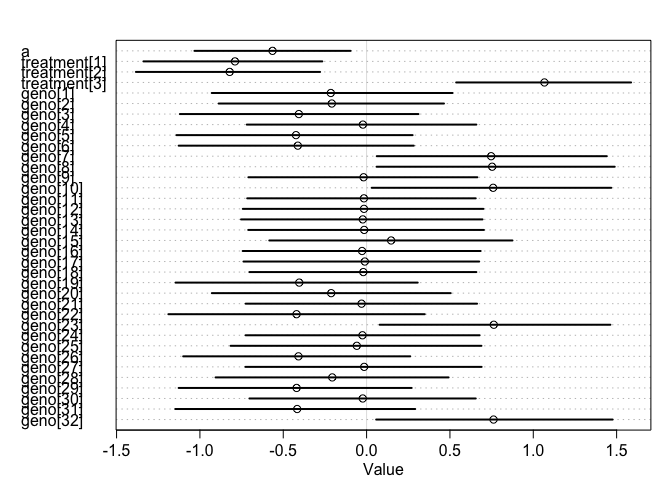
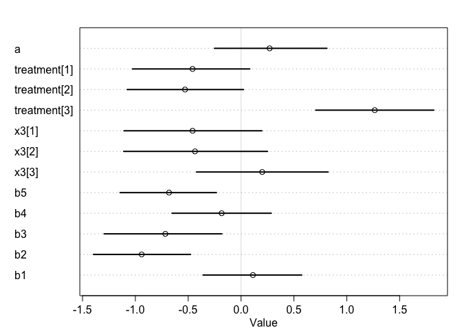
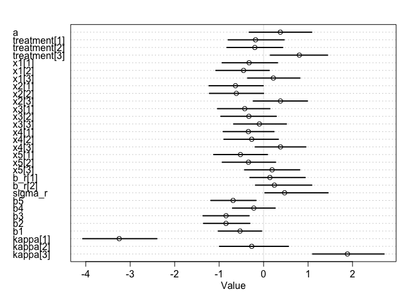

### Q1:     
a. Load the dataset. Look for column "Score" for the response variable we are interested in. A developmental score of 1 or 2 indicates vegetative growth, while a score of 3, 4, or 5 indicates reproductive growth. Create a "Reproduction" column with values 0 and 1, where 0 indicates vegetative growth and 1 indicates reproductive growth. 

```r
nb = read.csv("/Users/rongkui/Desktop/Lab/Aim1_Photoperiod/ShortDay2019/Nightbreak/Nightbreak_02_08_20.csv")
head(nb)
nb['repro'] = ifelse(nb$Score > 2, 1, 0) 
nb[c("loc1","loc2","loc3","loc4","loc5")] = do.call(rbind, strsplit(as.character(nb$Geno), ""))
nb = nb[,c("RIL","Treatment","Rep","Plot","Date","loc1","loc2","loc3","loc4","loc5","Score","repro")]
nb = nb[complete.cases(nb),]
nb[nb$Score < 1,"Score"] = 1
nb2 = nb[,-which(colnames(nb)=="repro")]
nb2 = nb2[order(nb2$Treatment, nb2$Rep, nb2$Plot),]
write.csv(nb2, file = "/Users/rongkui/Desktop/StatisticalRethinking/Nightbreak_02_08_20_Rclub.csv", row.names = FALSE)
```


```r
nb = read.csv("/Users/rongkui/Desktop/StatisticalRethinking/Nightbreak_02_08_20_Rclub.csv")
#nb
nb['repro'] = ifelse(nb$Score > 2, 1, 0) 
```


b. (optional) Take a look at columns "loc1" through "loc5". The levels "A" or "P" indicate which parental allele the RIL has inherited. Can you think of a reason why there are 32 lines in this experiment? 


### Q2:    
Using the "Reproduction" column you created in Q1a as the response variable, fit a simple model with effects of genotype ("RIL") and treatment ("Treatment") on the rate of transitioning to reproductive growth by 2/8/20. (Things you might want to consider: appropriate likelihood function, intersection term).     
 

```r
library(rethinking)
```

```
## Loading required package: rstan
```

```
## Loading required package: StanHeaders
```

```
## Loading required package: ggplot2
```

```
## rstan (Version 2.19.2, GitRev: 2e1f913d3ca3)
```

```
## For execution on a local, multicore CPU with excess RAM we recommend calling
## options(mc.cores = parallel::detectCores()).
## To avoid recompilation of unchanged Stan programs, we recommend calling
## rstan_options(auto_write = TRUE)
```

```
## Loading required package: parallel
```

```
## Loading required package: dagitty
```

```
## rethinking (Version 1.92)
```

```
## 
## Attaching package: 'rethinking'
```

```
## The following object is masked from 'package:stats':
## 
##     rstudent
```

```r
d = list(
  g = nb$RIL,
  pheno = nb$repro,
  trt = nb$Treatment
)


mod = ulam(
  alist(
    pheno ~ dbinom(1, p),
    logit(p) <- a + treatment[trt] + geno[g],
    a ~ dnorm(0,1),
    treatment[trt] ~ dnorm(0,1),
    geno[g] ~ dnorm(0, 1)
    ), data = d, cores = 4, chains = 4, log_lik = TRUE
)

precis(mod, depth = 2)
```

```
##                       mean        sd       5.5%       94.5%     n_eff      Rhat
## a            -0.7370553573 0.5245285 -1.5782684  0.11338521  774.3051 1.0000847
## treatment[1] -1.1158600800 0.5774705 -2.0229153 -0.18558958  859.9287 1.0025312
## treatment[2] -1.2046723931 0.5817060 -2.1167574 -0.28579596 1037.4709 1.0009173
## treatment[3]  1.6302720747 0.5491645  0.7502967  2.51214519  935.4741 1.0005672
## geno[1]      -0.5218501258 0.7560869 -1.7039502  0.67812366 2234.5622 0.9990181
## geno[2]      -0.5632296008 0.7583374 -1.7563094  0.61518121 2707.6698 0.9999662
## geno[3]      -1.1335623371 0.7802561 -2.4306158  0.08536633 2696.2224 0.9993729
## geno[4]      -0.0244324451 0.7155004 -1.1426376  1.11025651 2892.4634 0.9984396
## geno[5]      -1.1670286857 0.7975320 -2.4627942  0.04780649 3192.6697 0.9999833
## geno[6]      -1.1295993591 0.8053767 -2.4953699  0.13366196 3802.8205 0.9987593
## geno[7]       2.0169450963 0.7396998  0.8611561  3.26023127 2639.3807 0.9989181
## geno[8]       2.0027547409 0.7318392  0.8371887  3.19731534 3547.8072 0.9995785
## geno[9]      -0.0104478857 0.7466440 -1.2358550  1.14562928 1953.6248 1.0017060
## geno[10]      2.0341217608 0.7172226  0.8533356  3.17283693 2523.2280 0.9991087
## geno[11]     -0.0154505892 0.7221587 -1.1840681  1.11715844 2703.7668 0.9987080
## geno[12]     -0.0171517145 0.6992148 -1.1328614  1.11423608 2429.2701 0.9996650
## geno[13]      0.0013685922 0.7476022 -1.2497880  1.13889836 2390.5856 1.0025745
## geno[14]      0.0094695131 0.7521523 -1.1941924  1.19489412 2946.1467 1.0001329
## geno[15]      0.5222951753 0.8053898 -0.7409862  1.81244691 2419.0017 0.9990329
## geno[16]     -0.0007345332 0.7617683 -1.2002490  1.21536052 3220.9504 1.0003051
## geno[17]     -0.0052728208 0.7611082 -1.2018561  1.16568063 3397.6215 0.9988105
## geno[18]     -0.0174194248 0.7491516 -1.1803245  1.15999843 3052.4046 0.9993535
## geno[19]     -1.1252551034 0.7954002 -2.3706118  0.10010951 2569.2922 0.9993580
## geno[20]     -0.5677948867 0.7634828 -1.7868501  0.60654038 3152.4179 0.9994964
## geno[21]     -0.0335635875 0.7147093 -1.2016637  1.12261660 2489.8172 0.9992686
## geno[22]     -1.1577656357 0.8249750 -2.5178265  0.18988320 2916.8972 0.9991064
## geno[23]      2.0269324221 0.7596641  0.8507400  3.22201561 2951.0503 0.9988081
## geno[24]      0.0152349850 0.7301894 -1.1603883  1.14390142 2900.9924 0.9992349
## geno[25]     -0.1163027531 0.8398989 -1.5177451  1.18222830 2792.0101 1.0003110
## geno[26]     -1.1395733933 0.7908722 -2.4079869  0.08624503 2898.2330 0.9986322
## geno[27]      0.0075422419 0.7428970 -1.2045617  1.16982172 2604.5407 0.9994639
## geno[28]     -0.5613618257 0.7667552 -1.7881182  0.65037490 2966.5478 0.9993571
## geno[29]     -1.1362291938 0.7691503 -2.3989548  0.05329995 3470.3048 0.9993766
## geno[30]      0.0009783134 0.7469916 -1.2028100  1.14554563 3891.7069 0.9985668
## geno[31]     -1.1480275481 0.8208179 -2.4675018  0.14328051 2563.3352 0.9990069
## geno[32]      2.0339606154 0.7204344  0.9227626  3.21940206 2710.1744 0.9985123
```

```r
plot(mod, depth = 2)
```

<!-- -->


### Q3:
Because we are more interested in the effects of individual loci than the performance of specific genotypes, fit a model with additive effects of the five loci and effect of treatment.  

```r
d2 = list(
  l1 = ifelse(nb$loc1 == 'A', 1, 0),
  l2 = ifelse(nb$loc2 == 'A', 1, 0),
  l3 = ifelse(nb$loc3 == 'A', 1, 0),
  l4 = ifelse(nb$loc4 == 'A', 1, 0),
  l5 = ifelse(nb$loc5 == 'A', 1, 0),
  pheno = nb$repro,
  trt = nb$Treatment
)

mod2 = ulam(
  alist(
    pheno ~ dbinom(1, p),
    logit(p) <- a + treatment[trt] + b1*l1 + b2*l2 + b3*l3 + b4*l4 + b5*l5,
    a ~ dnorm(0,1),
    treatment[trt] ~ dnorm(0,1),
    c(b1, b2, b3, b4, b5) ~ dnorm(0, 1)
    ), data = d2, cores = 4, chains = 4, log_lik = TRUE
)
precis(mod2, depth = 2)
```

```
##                    mean        sd       5.5%      94.5%    n_eff      Rhat
## a             0.7016710 0.5921678 -0.2446093  1.6721900 1021.681 1.0058552
## treatment[1] -0.6278855 0.5713930 -1.5620097  0.2958594 1087.786 1.0030738
## treatment[2] -0.7197430 0.5915432 -1.6809980  0.2538402 1022.709 1.0035897
## treatment[3]  2.0881569 0.5826647  1.1901480  3.0277020 1044.039 1.0034182
## b5           -1.0941096 0.3668162 -1.6896647 -0.5270735 1515.352 1.0016626
## b4           -0.3201650 0.3738700 -0.9096426  0.2833257 1908.116 0.9992796
## b3           -1.2888117 0.3734187 -1.8961708 -0.7086931 1788.413 1.0006174
## b2           -1.4857194 0.3811758 -2.0921665 -0.8816828 1488.372 1.0014596
## b1            0.1574916 0.3667286 -0.4316103  0.7472352 1962.276 0.9995104
```

```r
plot(mod2, depth = 2)
```

<!-- -->


### Q4:    
Now let's look at some interaction terms. Can you fit a model that takes into account interaction effects between treatment and allele types at the five loci? How do you interpret the output? (I built a somewhat "ugly" model for this question. I'm excited to see what y'all's models look like.)

```r
mod3 = ulam(
  alist(
    pheno ~ dbinom(1, p),
    logit(p) <- a + treatment[trt] + b1*l1 + b2*l2 + b3*l3 + b4*l4 + b5*l5 + x1[trt]*l1 + x2[trt]*l2 + x3[trt]*l3 + x4[trt]*l4 + x5[trt]*l5,
    a ~ dnorm(0,1),
    treatment[trt] ~ dnorm(0,1),
    x1[trt] ~ dnorm(0, 1), 
    x2[trt] ~ dnorm(0, 1), 
    x3[trt] ~ dnorm(0, 1), 
    x4[trt] ~ dnorm(0, 1), 
    x5[trt] ~ dnorm(0,1),
    c(b1, b2, b3, b4, b5) ~ dnorm(0, 1)
    ), data = d2, cores = 4, chains = 4, log_lik = TRUE
)
precis(mod3, depth = 2)
```

```
##                     mean        sd       5.5%       94.5%    n_eff      Rhat
## a             0.80559117 0.5879247 -0.1349145  1.73018766 1696.237 1.0023718
## treatment[1] -0.05411561 0.6819922 -1.1509365  0.99516924 1949.921 0.9992075
## treatment[2] -0.30075075 0.6960444 -1.4332588  0.81113396 1921.554 1.0024295
## treatment[3]  1.18591157 0.6844467  0.1057772  2.30807430 1863.233 1.0013944
## x1[1]         0.08005810 0.7207822 -1.0640245  1.25561116 1894.391 1.0017006
## x1[2]         0.23141536 0.7222569 -0.9183015  1.39178387 2297.059 0.9993170
## x1[3]        -0.14636317 0.6723079 -1.2250188  0.93448884 1689.136 1.0004977
## x2[1]        -0.93519051 0.7437012 -2.1393118  0.23267390 2448.256 0.9996756
## x2[2]        -1.28309925 0.7695805 -2.5129583 -0.11302028 2699.001 0.9993026
## x2[3]         0.69809323 0.6506773 -0.3236104  1.79766559 2222.446 1.0010950
## x3[1]        -0.68506862 0.7642939 -1.9319088  0.54919807 2657.090 0.9991234
## x3[2]        -0.60661953 0.7542008 -1.8044761  0.54521017 2436.192 1.0006437
## x3[3]         0.13603497 0.6765297 -0.9279269  1.18829714 1743.753 0.9997431
## x4[1]        -0.43587949 0.7229546 -1.5767536  0.74825435 2194.459 0.9987906
## x4[2]        -0.30312270 0.7281330 -1.4229527  0.89722947 2302.042 0.9991492
## x4[3]         0.36501008 0.6587451 -0.6837639  1.40256596 1879.860 0.9986209
## x5[1]        -0.75591292 0.7221424 -1.9385818  0.37135495 2385.355 0.9988607
## x5[2]        -0.66390185 0.7361879 -1.8226835  0.52437969 2031.654 1.0001812
## x5[3]         0.44534907 0.6561420 -0.5759326  1.49685140 1951.149 0.9993514
## b5           -1.06839089 0.5862812 -1.9795806 -0.09950801 1699.807 1.0011337
## b4           -0.31306682 0.5710454 -1.2174735  0.61402067 1549.853 0.9988811
## b3           -1.18779154 0.6121114 -2.1497112 -0.17479768 1610.441 0.9985687
## b2           -1.49802941 0.5841831 -2.4730130 -0.57260354 1965.498 0.9996061
## b1            0.16644265 0.5992969 -0.7925745  1.12276081 1382.756 1.0006062
```

```r
plot(mod3, depth = 2)
```

<!-- -->

```r
compare(mod, mod3)
```

```
##         WAIC    pWAIC    dWAIC       weight        SE      dSE
## mod  128.315 10.20646  0.00000 9.999998e-01  8.222487       NA
## mod3 159.435 11.61865 31.11994 1.747392e-07 12.998944 8.450678
```


```r
mod4 = ulam(
  alist(
    pheno ~ dbinom(1, p),
    logit(p) <- a + treatment[trt] + b1*l1 + b2*l2 + b3*l3 + b4*l4 + b5*l5 + x1[trt]*l1,
    a ~ dnorm(0,1),
    treatment[trt] ~ dnorm(0,1),
    x1[trt] ~ dnorm(0, 1), 
    c(b1, b2, b3, b4, b5) ~ dnorm(0, 1)
    ), data = d2, cores = 4, chains = 4, log_lik = TRUE
)
precis(mod4, depth = 2)
```

```
##                     mean        sd       5.5%      94.5%    n_eff      Rhat
## a             0.71408894 0.5884915 -0.2197543  1.6527143 1299.592 1.0000339
## treatment[1] -0.61126491 0.6108443 -1.5664606  0.3976214 1365.537 0.9990615
## treatment[2] -0.76307503 0.6094443 -1.7291752  0.1975135 1406.529 1.0008179
## treatment[3]  2.07889375 0.6291006  1.0634428  3.0798673 1373.663 1.0011223
## x1[1]        -0.03113830 0.6946217 -1.1205640  1.0410933 1690.078 0.9990957
## x1[2]         0.08913780 0.6898716 -1.0242971  1.1876627 1759.325 0.9990738
## x1[3]         0.03668223 0.6695572 -1.0571259  1.0728241 1424.880 0.9991028
## b5           -1.10205777 0.3859620 -1.7028246 -0.4920794 2218.689 0.9985705
## b4           -0.31846228 0.3564188 -0.8971045  0.2326062 2077.511 0.9987991
## b3           -1.29351728 0.3850251 -1.9481223 -0.6787508 1931.565 1.0002410
## b2           -1.47291983 0.3955926 -2.1168529 -0.8386892 1924.664 1.0001917
## b1            0.11499139 0.5919500 -0.7972376  1.0900055 1374.464 0.9992009
```

```r
plot(mod4, depth = 2)
```

<!-- -->

```r
compare(mod, mod2, mod3, mod4)
```

```
##          WAIC     pWAIC    dWAIC       weight        SE      dSE
## mod  128.3150 10.206461  0.00000 9.999997e-01  8.222487       NA
## mod3 159.4350 11.618652 31.11994 1.747391e-07 12.998944 8.450678
## mod2 161.0539  6.437468 32.73891 7.777429e-08 12.803526 8.321612
## mod4 163.5498  7.610191 35.23482 2.232835e-08 12.969323 8.450880
```


```r
mod5 = ulam(
  alist(
    pheno ~ dbinom(1, p),
    logit(p) <- a + treatment[trt] + b1*l1 + b2*l2 + b3*l3 + b4*l4 + b5*l5 + x2[trt]*l2,
    a ~ dnorm(0,1),
    treatment[trt] ~ dnorm(0,1),
    x2[trt] ~ dnorm(0, 1), 
    c(b1, b2, b3, b4, b5) ~ dnorm(0, 1)
    ), data = d2, cores = 4, chains = 4, log_lik = TRUE
)
plot(mod5, depth = 2)
```

<!-- -->


```r
mod6 = ulam(
  alist(
    pheno ~ dbinom(1, p),
    logit(p) <- a + treatment[trt] + b1*l1 + b2*l2 + b3*l3 + b4*l4 + b5*l5 + x3[trt]*l3,
    a ~ dnorm(0,1),
    treatment[trt] ~ dnorm(0,1),
    x3[trt] ~ dnorm(0, 1), 
    c(b1, b2, b3, b4, b5) ~ dnorm(0, 1)
    ), data = d2, cores = 4, chains = 4, log_lik = TRUE
)
plot(mod6, depth = 2)
```

<!-- -->


```r
mod7 = ulam(
  alist(
    pheno ~ dbinom(1, p),
    logit(p) <- a + treatment[trt] + b1*l1 + b2*l2 + b3*l3 + b4*l4 + b5*l5 + x4[trt]*l4,
    a ~ dnorm(0,1),
    treatment[trt] ~ dnorm(0,1),
    x4[trt] ~ dnorm(0, 1), 
    c(b1, b2, b3, b4, b5) ~ dnorm(0, 1)
    ), data = d2, cores = 4, chains = 4, log_lik = TRUE
)
plot(mod7, depth = 2)
```

<!-- -->


```r
mod8 = ulam(
  alist(
    pheno ~ dbinom(1, p),
    logit(p) <- a + treatment[trt] + b1*l1 + b2*l2 + b3*l3 + b4*l4 + b5*l5 + x5[trt]*l5,
    a ~ dnorm(0,1),
    treatment[trt] ~ dnorm(0,1),
    x5[trt] ~ dnorm(0, 1), 
    c(b1, b2, b3, b4, b5) ~ dnorm(0, 1)
    ), data = d2, cores = 4, chains = 4, log_lik = TRUE
)
plot(mod8, depth = 2)
```

<!-- -->


```r
nb[nb$RIL == 'PI',]
```

```
##     RIL         Treatment Rep Plot   Date loc1 loc2 loc3 loc4 loc5 Score repro
## 6    PI           Control   1    6 2/8/20    P    P    P    P    P     3     1
## 47   PI           Control   2   15 2/8/20    P    P    P    P    P     3     1
## 70   PI Control_NoCurtain   1    6 2/8/20    P    P    P    P    P     3     1
## 101  PI Control_NoCurtain   2    7 2/8/20    P    P    P    P    P     3     1
## 152  PI        NightBreak   1   26 2/8/20    P    P    P    P    P     4     1
## 167  PI        NightBreak   2    9 2/8/20    P    P    P    P    P     4     1
```

### Q5:
By simplifying the developmental score phenotype into a binary variable that indicates whether a plant has entered reproductive growth, we run the risk of losing potentially important information. Re-fit your favorite model from Q4 with the ordered categorical outcome variable of "Score." Do you observe any changes in your results? If so, why do you think it happened?

```r
d3 = list(
  l1 = ifelse(nb$loc1 == 'A', 1, 0),
  l2 = ifelse(nb$loc2 == 'A', 1, 0),
  l3 = ifelse(nb$loc3 == 'A', 1, 0),
  l4 = ifelse(nb$loc4 == 'A', 1, 0),
  l5 = ifelse(nb$loc5 == 'A', 1, 0),
  pheno_q = nb$Score,
  trt = nb$Treatment
)

mod9 = ulam(
  alist(
    pheno_q ~ dordlogit( phi , kappa ),
    phi <- a + treatment[trt] + b1*l1 + b2*l2 + b3*l3 + b4*l4 + b5*l5 + x1[trt]*l1 + x2[trt]*l2 + x3[trt]*l3 + x4[trt]*l4 + x5[trt]*l5,
    a ~ dnorm(0,1),
    treatment[trt] ~ dnorm(0,1),
    x1[trt] ~ dnorm(0, 1), 
    x2[trt] ~ dnorm(0, 1), 
    x3[trt] ~ dnorm(0, 1), 
    x4[trt] ~ dnorm(0, 1), 
    x5[trt] ~ dnorm(0,1),
    c(b1, b2, b3, b4, b5) ~ dnorm(0, 1),
    kappa ~ dnorm(0,1.5)
    ), data = d3, cores = 4, chains = 4, log_lik = TRUE
)

precis(mod9, depth = 2)
```

```
##                     mean        sd       5.5%       94.5%    n_eff      Rhat
## a             1.00570538 0.7317740 -0.1528223  2.16977575 1832.884 1.0008525
## treatment[1] -0.02776909 0.6688327 -1.0762691  1.05062597 1694.093 0.9991673
## treatment[2] -0.13044739 0.6665875 -1.1929489  0.93488870 1610.778 1.0005701
## treatment[3]  1.00600920 0.6715319 -0.0499205  2.04161226 1629.335 0.9983169
## x1[1]        -0.41161284 0.6599306 -1.4587289  0.63795901 2042.552 0.9990687
## x1[2]        -0.57471636 0.6279988 -1.5776928  0.39629825 1673.102 0.9990252
## x1[3]         0.28136804 0.6361430 -0.7536396  1.26809830 1881.094 1.0007200
## x2[1]        -0.91947440 0.6207967 -1.8668739  0.05671789 1558.177 1.0013346
## x2[2]        -0.89207912 0.6329518 -1.8989776  0.11293706 1763.347 1.0014679
## x2[3]         0.62271549 0.6342894 -0.4202407  1.61727350 1596.831 1.0003570
## x3[1]        -0.57206013 0.6160036 -1.5623763  0.38386657 1554.266 0.9995903
## x3[2]        -0.36993513 0.5975734 -1.3293140  0.58927916 1831.742 0.9992716
## x3[3]        -0.18122361 0.5981729 -1.1433872  0.78326092 1549.661 0.9995625
## x4[1]        -0.46460509 0.6109006 -1.4420598  0.46613499 1660.443 0.9995695
## x4[2]        -0.33861273 0.6269964 -1.3337883  0.65235622 1708.332 0.9987681
## x4[3]         0.50680726 0.6242158 -0.5217104  1.52210775 1559.696 1.0003869
## x5[1]        -0.75474038 0.6412988 -1.7874503  0.26590534 1500.530 1.0003168
## x5[2]        -0.41247951 0.6414001 -1.4658845  0.62408533 1474.015 1.0003428
## x5[3]         0.26835069 0.6230528 -0.7033307  1.26522235 1425.129 1.0018773
## b5           -0.96754107 0.5405372 -1.8261799 -0.09131707 1222.716 1.0022801
## b4           -0.32828900 0.5390058 -1.1807867  0.53911885 1340.301 1.0008696
## b3           -1.18248722 0.5332502 -2.0383745 -0.33465137 1472.660 0.9996800
## b2           -1.19134877 0.5487403 -2.0678457 -0.30916750 1311.617 1.0018291
## b1           -0.76975574 0.5577002 -1.6281730  0.13189668 1635.897 0.9997402
## kappa[1]     -3.86520314 0.7632167 -5.0496222 -2.69116557 1822.099 0.9994265
## kappa[2]     -0.31428824 0.7209414 -1.4718565  0.81504891 1965.595 0.9993947
## kappa[3]      2.12761590 0.7445556  0.9260752  3.27420302 2152.579 0.9999418
```

```r
plot(mod9, depth = 2)
```

<!-- -->


```r
compare(mod9, mod3)
```

```
##          WAIC    pWAIC    dWAIC       weight       SE      dSE
## mod3 159.4350 11.61865   0.0000 1.000000e+00 12.99894       NA
## mod9 346.4768 17.20810 187.0419 2.423132e-41 14.95757 13.49484
```

> loc1 vs loc3?


```r
library(ggplot2)
ggplot(nb, aes(x = Score)) +
  geom_histogram(aes(fill = Treatment), bins = 7, position = 'dodge') +
  facet_grid(loc1 ~ .)
```

<!-- -->


```r
ggplot(nb, aes(x = Score)) +
  geom_histogram(aes(fill = Treatment), bins = 7, position = 'dodge') +
  facet_grid(loc3 ~ .)
```

<!-- -->

### Q6:
Each "Plot" # correspond to a specific spot on a bench. In other words, the same plot # indicates equivalent locations on their respective benches even across different treatments and replicates. Update your favorite model from Q4 or Q5 using hierarchical modeling that allow partial pooling across plots. Compare the models. What do they say and which model do you prefer?    


```r
d3 = list(
  l1 = ifelse(nb$loc1 == 'A', 1, 0),
  l2 = ifelse(nb$loc2 == 'A', 1, 0),
  l3 = ifelse(nb$loc3 == 'A', 1, 0),
  l4 = ifelse(nb$loc4 == 'A', 1, 0),
  l5 = ifelse(nb$loc5 == 'A', 1, 0),
  pheno_q = nb$Score,
  trt = nb$Treatment,
  plot = nb$Plot
)

mod10 = ulam(
  alist(
    pheno_q ~ dordlogit( phi , kappa ),
    phi <- a + treatment[trt] + b1*l1 + b2*l2 + b3*l3 + b4*l4 + b5*l5 + x1[trt]*l1 + x2[trt]*l2 + x3[trt]*l3 + x4[trt]*l4 + x5[trt]*l5 + b_p[plot],
    a ~ dnorm(0,1),
    treatment[trt] ~ dnorm(0,1),
    x1[trt] ~ dnorm(0, 1), 
    x2[trt] ~ dnorm(0, 1), 
    x3[trt] ~ dnorm(0, 1), 
    x4[trt] ~ dnorm(0, 1), 
    x5[trt] ~ dnorm(0, 1),
    b_p[plot] ~ dnorm(0, sigma_p),
    sigma_p ~ dexp(1),     
    c(b1, b2, b3, b4, b5) ~ dnorm(0,1), 
    kappa ~ dnorm(0,1.5)), data = d3, cores = 4, chains = 4, log_lik = TRUE
)
```

```
## Warning: There were 2 chains where the estimated Bayesian Fraction of Missing Information was low. See
## http://mc-stan.org/misc/warnings.html#bfmi-low
```

```
## Warning: Examine the pairs() plot to diagnose sampling problems
```

```
## Warning: Bulk Effective Samples Size (ESS) is too low, indicating posterior means and medians may be unreliable.
## Running the chains for more iterations may help. See
## http://mc-stan.org/misc/warnings.html#bulk-ess
```

```
## Warning: Tail Effective Samples Size (ESS) is too low, indicating posterior variances and tail quantiles may be unreliable.
## Running the chains for more iterations may help. See
## http://mc-stan.org/misc/warnings.html#tail-ess
```

```r
#precis(mod10, depth = 2)
plot(mod10, depth = 2)
```

<!-- -->


### Q7 (optional):
a. What can we conclude regarding treatment effect?   
b. What can we conclude regarding differential response to nightbreak treatment?   
c. If we concluded that there are differential responses to nightbreak across genotypes, which genetic loci contributed to the differential responses, and which ones did not?    

### Q8 (non existent) some posterior

```r
kA <- 0 # value for action
kC <- 1 # value for contact
kI <- 0:1 # values of intention to calculate over
trt = 1:3
pdat <- data.frame(l1 = 1, l2 = 1, l3 = 1, l4 = 1, l5 = 1, trt = 1:3, plot = 2)
phi <- link( mod10 , data=pdat )
post = extract.samples(mod10)
plot(NULL, xlim = c(1,3), ylim = c(0, 1))
for (s in 1:50) {
  pk = pordlogit(1:4, phi[s,], post$kappa[s,])
  for (i in 1:3) {
    lines(trt, pk[,i], col = col.alpha("black",0.1) )
  }
}
```

<!-- -->


