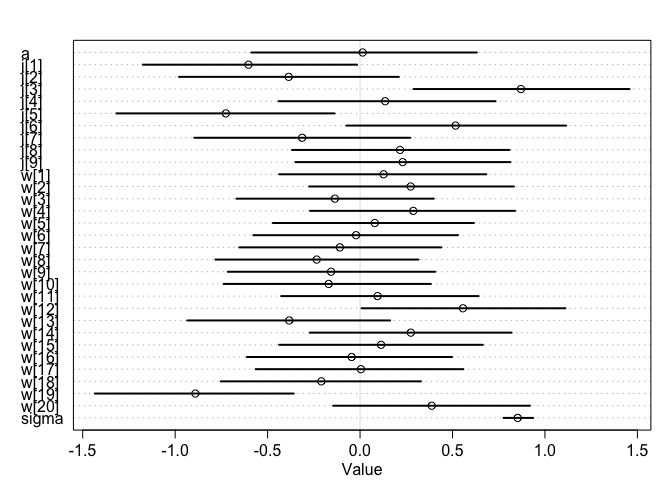

### Question 1   

```r
library(rethinking)
```

```
## Loading required package: rstan
```

```
## Loading required package: StanHeaders
```

```
## Loading required package: ggplot2
```

```
## rstan (Version 2.19.2, GitRev: 2e1f913d3ca3)
```

```
## For execution on a local, multicore CPU with excess RAM we recommend calling
## options(mc.cores = parallel::detectCores()).
## To avoid recompilation of unchanged Stan programs, we recommend calling
## rstan_options(auto_write = TRUE)
```

```
## Loading required package: parallel
```

```
## Loading required package: dagitty
```

```
## rethinking (Version 1.90)
```

```
## 
## Attaching package: 'rethinking'
```

```
## The following object is masked from 'package:stats':
## 
##     rstudent
```

```r
data("Wines2012")
dim(Wines2012)
```

```
## [1] 180   6
```

```r
head(Wines2012)
```

```
##             judge flight wine score wine.amer judge.amer
## 1 Jean-M Cardebat  white   A1    10         1          0
## 2 Jean-M Cardebat  white   B1    13         1          0
## 3 Jean-M Cardebat  white   C1    14         0          0
## 4 Jean-M Cardebat  white   D1    15         0          0
## 5 Jean-M Cardebat  white   E1     8         1          0
## 6 Jean-M Cardebat  white   F1    13         1          0
```


```r
wines_slim = list(
  judge = match(Wines2012$judge, unique(Wines2012$judge)),
  wine = match(Wines2012$wine, unique(Wines2012$wine)),
  score_std = scale(Wines2012$score)
)
  
m1 <- ulam(
  alist(
    score_std ~ dnorm( mu , sigma ) ,
    mu <- a + j[judge] + w[wine],
    a ~ dnorm(0,1),
    j[judge] ~ dnorm( 0 , 1 ) ,
    w[wine] ~ dnorm( 0, 1 ),
    sigma ~ dexp(1)),
  data=wines_slim, chains=4, core = 4, iter = 2000)
#traceplot(m1)
precis(m1, depth = 2)
```

```
##               mean         sd         5.5%       94.5%     n_eff     Rhat
## a      0.014182007 0.37976622 -0.587834633  0.63132542  513.3624 1.004743
## j[1]  -0.603443417 0.36688736 -1.175297168 -0.01607567  724.3653 1.005429
## j[2]  -0.385889298 0.37044281 -0.978853909  0.20938185  733.0928 1.005645
## j[3]   0.870041218 0.36603276  0.288895488  1.45723143  718.2663 1.006833
## j[4]   0.136031404 0.37093142 -0.440900885  0.73256398  730.5079 1.006369
## j[5]  -0.725937136 0.37288777 -1.318279506 -0.13791857  736.9323 1.006504
## j[6]   0.516746074 0.36904028 -0.073839310  1.11481136  733.6846 1.005129
## j[7]  -0.313171803 0.36884028 -0.896370282  0.27207223  727.9149 1.007653
## j[8]   0.216180853 0.37072485 -0.368256908  0.80836748  737.9802 1.006248
## j[9]   0.230591130 0.36548657 -0.349829596  0.81281122  729.0644 1.008300
## w[1]   0.127297679 0.35160248 -0.437238506  0.68271796 1329.3282 1.003761
## w[2]   0.273695462 0.34111623 -0.275383229  0.83174310 1276.7300 1.003985
## w[3]  -0.136270808 0.33813946 -0.668554893  0.39882541 1102.2397 1.005615
## w[4]   0.287910001 0.35251886 -0.270280365  0.83819805 1190.9861 1.003876
## w[5]   0.079612789 0.34142945 -0.471322212  0.61583686 1090.8150 1.005657
## w[6]  -0.021620078 0.34676699 -0.577218134  0.52963958 1316.4002 1.003748
## w[7]  -0.109583087 0.34088353 -0.653299594  0.43956369 1312.1713 1.003883
## w[8]  -0.234608376 0.34535640 -0.782159126  0.31555780 1233.1235 1.003514
## w[9]  -0.156933518 0.35312363 -0.715499132  0.40616765 1493.8873 1.003028
## w[10] -0.169611450 0.34934514 -0.737837508  0.38265609 1426.6071 1.004454
## w[11]  0.094782540 0.33731087 -0.426833067  0.64057988 1262.5000 1.004328
## w[12]  0.556646946 0.34679894  0.008274394  1.11051426 1309.9132 1.003884
## w[13] -0.383192197 0.34473274 -0.934497043  0.16229580 1233.7573 1.004493
## w[14]  0.274461105 0.34240675 -0.271402361  0.81963459 1461.7894 1.002968
## w[15]  0.113652944 0.34496712 -0.438098130  0.66373168 1379.9857 1.004475
## w[16] -0.045407388 0.34466450 -0.612301594  0.49740066 1256.6053 1.005513
## w[17]  0.004688207 0.34823797 -0.563930105  0.55858260 1328.8768 1.005663
## w[18] -0.209388617 0.34134923 -0.753208419  0.32933922 1324.1379 1.003681
## w[19] -0.890545610 0.33777976 -1.434693208 -0.35888535 1320.7878 1.003457
## w[20]  0.387761617 0.33531856 -0.145582196  0.91880437 1290.1039 1.003874
## sigma  0.852591391 0.05122009  0.776234507  0.93662827 3693.0470 0.999713
```

```r
plot(m1, depth = 2)
```

<!-- -->

> Judges 1 (Jean-M Cardebat) and 5 (Robert Hodgson) tend to give low scores; judges 3 (John Foy) and 6 (Linda Murphy) tend to give high scores. 


```r
library(ggplot2)
ggplot(Wines2012, aes(x = judge, y = score, fill = wine)) +
  geom_col() +
  theme(axis.text.x = element_text(angle = 45))
```

<!-- -->

> Wine 13 (C2) and 19 (I2) seem to be the worst. Wine 12 (B2) and 20 (J2) seem to be the best.    


```r
ggplot(Wines2012, aes(x = wine, y = score, fill = judge)) +
  geom_col() +
  theme(axis.text.x = element_text(angle = 45))
```

<!-- -->

### Question 2:   


```r
wines_slim2 = list(
  flight = match(Wines2012$flight, unique(Wines2012$flight)),
  wine_amer = match(Wines2012$wine.amer, unique(Wines2012$wine.amer)),
  judge_amer = match(Wines2012$judge.amer, unique(Wines2012$judge.amer)),
  score_std = scale(Wines2012$score)
)
  
m2 <- ulam(
  alist(
    score_std ~ dnorm( mu , sigma ) ,
    mu <- a + f[flight] + j[judge_amer] + w[wine_amer],
    a ~ dnorm(0,1),
    f[flight] ~ dnorm( 0 , 1 ),
    j[judge_amer] ~ dnorm( 0 , 1 ),
    w[wine_amer] ~ dnorm( 0, 1 ),
    sigma ~ dexp(1)),
  data=wines_slim2, chains=4, core = 4, iter = 2000)
traceplot(m2)
precis(m2, depth = 2)
```

```
##               mean         sd       5.5%     94.5%    n_eff      Rhat
## a      0.001192672 0.76459023 -1.2241407 1.2029647 2397.258 0.9996739
## f[1]  -0.002733382 0.65361290 -1.0094933 1.0445142 2031.642 1.0005946
## f[2]  -0.008329936 0.64967700 -1.0147720 1.0392804 2066.531 1.0001676
## j[1]  -0.111757007 0.65966498 -1.1877691 0.9491271 2330.449 1.0005824
## j[2]   0.134944148 0.66064468 -0.9179867 1.2116681 2302.394 1.0008501
## w[1]  -0.097775467 0.64609538 -1.1024105 0.9521131 2358.890 1.0008704
## w[2]   0.094144218 0.65237212 -0.9505740 1.1545307 2376.621 1.0009554
## sigma  1.001009290 0.05378811  0.9201043 1.0920251 3042.925 1.0012105
```

```r
plot(m2, depth = 2)
```

<!-- -->

> Nothing really jumps out.   

### Question 3: I am really confused.    

```r
m3 <- ulam(
  alist(
    score_std ~ dnorm( mu , sigma ) ,
    mu <- a + fj[flight*judge_amer] + jw[judge_amer*wine_amer] + fw[flight*wine_amer],
    a ~ dnorm(0,1),
    fj[flight*judge_amer] ~ dnorm( 0 , 1 ),
    jw[judge_amer*wine_amer] ~ dnorm( 0 , 1 ),
    fw[flight*wine_amer] ~ dnorm( 0, 1 ),
    sigma ~ dexp(1)),
  data=wines_slim2, chains=4, core = 4, iter = 4000)
traceplot(m3)
precis(m3, depth = 3)
link(m3, )
```

