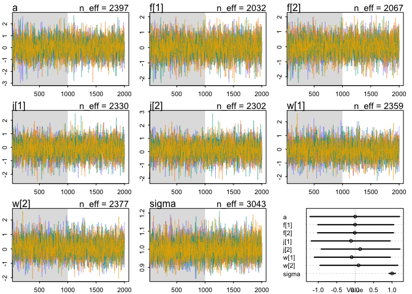

### Question 1   

```r
library(rethinking)
```

```
## Loading required package: rstan
```

```
## Loading required package: StanHeaders
```

```
## Loading required package: ggplot2
```

```
## rstan (Version 2.19.2, GitRev: 2e1f913d3ca3)
```

```
## For execution on a local, multicore CPU with excess RAM we recommend calling
## options(mc.cores = parallel::detectCores()).
## To avoid recompilation of unchanged Stan programs, we recommend calling
## rstan_options(auto_write = TRUE)
```

```
## Loading required package: parallel
```

```
## Loading required package: dagitty
```

```
## rethinking (Version 1.90)
```

```
## 
## Attaching package: 'rethinking'
```

```
## The following object is masked from 'package:stats':
## 
##     rstudent
```

```r
data("Wines2012")
dim(Wines2012)
```

```
## [1] 180   6
```

```r
head(Wines2012)
```

```
##             judge flight wine score wine.amer judge.amer
## 1 Jean-M Cardebat  white   A1    10         1          0
## 2 Jean-M Cardebat  white   B1    13         1          0
## 3 Jean-M Cardebat  white   C1    14         0          0
## 4 Jean-M Cardebat  white   D1    15         0          0
## 5 Jean-M Cardebat  white   E1     8         1          0
## 6 Jean-M Cardebat  white   F1    13         1          0
```


```r
wines_slim = list(
  judge = match(Wines2012$judge, unique(Wines2012$judge)),
  wine = match(Wines2012$wine, unique(Wines2012$wine)),
  score_std = scale(Wines2012$score)
)
  
m1 <- ulam(
  alist(
    score_std ~ dnorm( mu , sigma ) ,
    mu <- a + j[judge] + w[wine],
    a ~ dnorm(0,1),
    j[judge] ~ dnorm( 0 , 1 ) ,
    w[wine] ~ dnorm( 0, 1 ),
    sigma ~ dexp(1)),
  data=wines_slim, chains=4, core = 4, iter = 2000)
#traceplot(m1)
precis(m1, depth = 2)
```

```
##               mean         sd        5.5%       94.5%     n_eff      Rhat
## a      0.011146442 0.37697450 -0.58673104  0.62041074  602.1320 1.0056061
## j[1]  -0.606204216 0.35947918 -1.17434369 -0.02280651  723.5015 1.0028734
## j[2]  -0.391434461 0.35611275 -0.95638682  0.18207327  809.2110 1.0016221
## j[3]   0.870108215 0.35607815  0.30089164  1.42814677  765.5497 1.0018709
## j[4]   0.132515667 0.34863213 -0.40437215  0.69775148  748.3521 1.0018784
## j[5]  -0.731906925 0.35275029 -1.29017369 -0.16590421  779.3331 1.0025970
## j[6]   0.516799979 0.35491403 -0.04360177  1.09042934  780.0999 1.0013868
## j[7]  -0.313574430 0.34866074 -0.86843358  0.24735295  752.8911 1.0030214
## j[8]   0.215430534 0.35865902 -0.35369759  0.79327950  713.5210 1.0016075
## j[9]   0.226261750 0.35382916 -0.33329590  0.79888533  783.8198 1.0016910
## w[1]   0.141162079 0.32851197 -0.38520150  0.66856042 1451.4706 1.0014877
## w[2]   0.277137969 0.33624087 -0.24762829  0.82699383 1401.2362 1.0005265
## w[3]  -0.127637582 0.34237690 -0.66605463  0.41796369 1394.4665 1.0011706
## w[4]   0.301675808 0.33787316 -0.25204706  0.83634628 1427.0224 1.0009663
## w[5]   0.086088005 0.34260925 -0.45024665  0.64674288 1363.3933 1.0006439
## w[6]  -0.013642683 0.33605293 -0.54687836  0.52867519 1351.4899 1.0015339
## w[7]  -0.110013054 0.33506662 -0.64529854  0.41299577 1471.3201 1.0020622
## w[8]  -0.224891612 0.33905766 -0.76233029  0.32849996 1351.1707 1.0011642
## w[9]  -0.144615392 0.33533926 -0.67918933  0.39209667 1400.3806 1.0014421
## w[10] -0.164232116 0.33553016 -0.69839240  0.37307540 1357.2937 1.0014005
## w[11]  0.107071485 0.33961738 -0.44164322  0.64923352 1298.6196 1.0023183
## w[12]  0.564568364 0.34370533  0.01457738  1.11451711 1482.1555 1.0013052
## w[13] -0.378606309 0.33840150 -0.92224394  0.16518300 1319.8766 1.0013606
## w[14]  0.273354026 0.34804596 -0.29008870  0.83119905 1438.4041 1.0029143
## w[15]  0.123719432 0.34088686 -0.42832635  0.65366089 1365.0329 1.0016223
## w[16] -0.038995903 0.34392187 -0.59943166  0.50538825 1350.4069 1.0012865
## w[17]  0.008821443 0.34543554 -0.52729474  0.55808932 1499.7321 1.0011936
## w[18] -0.201676051 0.33921794 -0.74470837  0.32892244 1359.7835 1.0016761
## w[19] -0.882376188 0.33827055 -1.42913568 -0.34897322 1502.4171 1.0026804
## w[20]  0.389262993 0.34121813 -0.14192937  0.93196530 1343.2746 1.0020375
## sigma  0.850915772 0.04923011  0.77617981  0.93429364 3783.7241 0.9998321
```

> Judges 1 (Jean-M Cardebat) and 5 (Robert Hodgson) tend to give low scores; judges 3 (John Foy) and 6 (Linda Murphy) tend to give high scores. 


```r
library(ggplot2)
ggplot(Wines2012, aes(x = judge, y = score, fill = wine)) +
  geom_col() +
  theme(axis.text.x = element_text(angle = 45))
```

<!-- -->

> Wine 13 (C2) and 19 (I2) seem to be the worst. Wine 12 (B2) and 20 (J2) seem to be the best.    


```r
ggplot(Wines2012, aes(x = wine, y = score, fill = judge)) +
  geom_col() +
  theme(axis.text.x = element_text(angle = 45))
```

<!-- -->

### Question 2:   


```r
wines_slim2 = list(
  flight = match(Wines2012$flight, unique(Wines2012$flight)),
  wine_amer = match(Wines2012$wine.amer, unique(Wines2012$wine.amer)),
  judge_amer = match(Wines2012$judge.amer, unique(Wines2012$judge.amer)),
  score_std = scale(Wines2012$score)
)
  
m2 <- ulam(
  alist(
    score_std ~ dnorm( mu , sigma ) ,
    mu <- a + f[flight] + j[judge_amer] + w[wine_amer],
    a ~ dnorm(0,1),
    f[flight] ~ dnorm( 0 , 1 ),
    j[judge_amer] ~ dnorm( 0 , 1 ),
    w[wine_amer] ~ dnorm( 0, 1 ),
    sigma ~ dexp(1)),
  data=wines_slim2, chains=4, core = 4, iter = 2000)
traceplot(m2)
precis(m2, depth = 2)
```

```
##              mean         sd       5.5%     94.5%    n_eff     Rhat
## a      0.03129055 0.76820489 -1.1979559 1.2503817 2202.348 1.001915
## f[1]  -0.01455486 0.63428444 -1.0291333 0.9946935 2275.534 1.000431
## f[2]  -0.01853703 0.63183949 -1.0260101 0.9836473 2292.495 1.000275
## j[1]  -0.13472307 0.64251982 -1.1499074 0.8940718 1891.876 1.000287
## j[2]   0.11277887 0.63885239 -0.8873402 1.1300401 1880.192 1.000690
## w[1]  -0.09422018 0.64526699 -1.1456977 0.9302067 1907.178 1.001549
## w[2]   0.09439711 0.64347968 -0.9468329 1.1002436 1961.865 1.001447
## sigma  1.00067467 0.05496349  0.9175679 1.0911879 3033.948 1.000612
```

<!-- -->

> Nothing really jumps out.   

### Question 3: I am really confused.    

```r
m3 <- ulam(
  alist(
    score_std ~ dnorm( mu , sigma ) ,
    mu <- a + fj[flight*judge_amer] + jw[judge_amer*wine_amer] + fw[flight*wine_amer],
    a ~ dnorm(0,1),
    fj[flight*judge_amer] ~ dnorm( 0 , 1 ),
    jw[judge_amer*wine_amer] ~ dnorm( 0 , 1 ),
    fw[flight*wine_amer] ~ dnorm( 0, 1 ),
    sigma ~ dexp(1)),
  data=wines_slim2, chains=4, core = 4, iter = 4000)
traceplot(m3)
precis(m3, depth = 3)
link(m3, )
```

