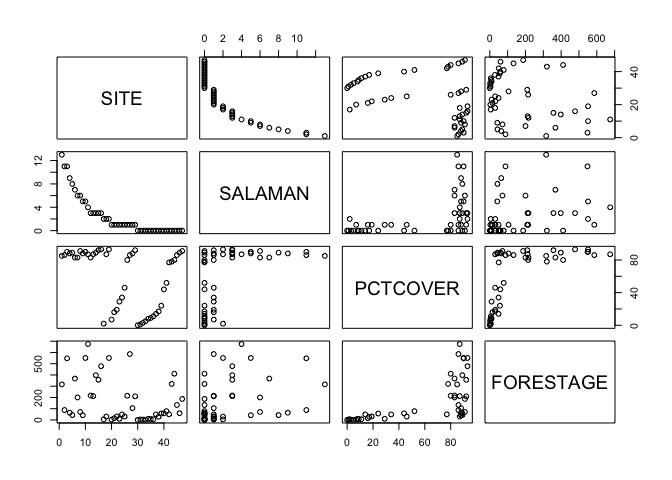
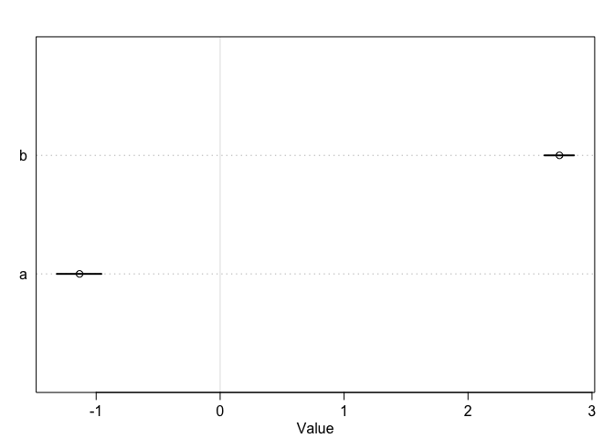
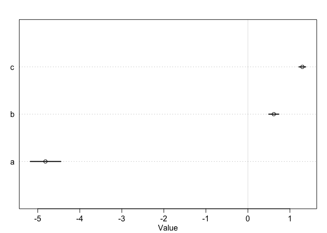

#### 10E4.   
Why do Poisson regressions sometimes require the use of an offset? Provide an example.    
> An *offset* is used when exposure varies across observations. When the length of observation, area of sampling, or intensity of sampling varies, the counts we observe also naturally vary. Since a Poisson distribution assumes that the rate of events is constant in time (or space), it’s easy to handle this.What we do is to add the logarithm of the exposure to the linear model. The term we add is typically called an offset.

#### 10M2.     
If a coefficient in a Poisson regression has value 1.7, what does this imply about the change in the outcome?    

```r
exp(1.7)
```

```
## [1] 5.473947
```

> It means the outcome is 5.5 times more likely to happen.   

#### 10M3.       
Explain why the logit link is appropriate for a binomial generalized linear model.     

> In a binomial GLM we are typically modeling the p parameter with a linear model. The p parameter, probability, must be constrained to the interval [0, 1], and the logit link function ensures this constraint.    

#### 10M4.     
Explain why the log link is appropriate for a Poisson generalized linear model.     

> Lambda has to be possitive in a Poisson distribution. The log function makes sure that this is the case.   

#### 10H4.     
The data contained in data(salamanders) are counts of salamanders (*Plethodon elongatus*) from 47 different 49m2 plots in northern California. The column SALAMAN is the count in each plot, and the columns PCTCOVER and FORESTAGE are percent of ground cover and age of trees in the plot, respectively. You will model SALAMAN as a Poisson variable.      


```r
library(rethinking)
```

```
## Loading required package: rstan
```

```
## Loading required package: StanHeaders
```

```
## Loading required package: ggplot2
```

```
## rstan (Version 2.19.2, GitRev: 2e1f913d3ca3)
```

```
## For execution on a local, multicore CPU with excess RAM we recommend calling
## options(mc.cores = parallel::detectCores()).
## To avoid recompilation of unchanged Stan programs, we recommend calling
## rstan_options(auto_write = TRUE)
```

```
## Loading required package: parallel
```

```
## Loading required package: dagitty
```

```
## rethinking (Version 1.92)
```

```
## 
## Attaching package: 'rethinking'
```

```
## The following object is masked from 'package:stats':
## 
##     rstudent
```

```r
data("salamanders")
data = salamanders
head(data)
```

```
##   SITE SALAMAN PCTCOVER FORESTAGE
## 1    1      13       85       316
## 2    2      11       86        88
## 3    3      11       90       548
## 4    4       9       88        64
## 5    5       8       89        43
## 6    6       7       83       368
```

```r
pairs(data)
```

<!-- -->

(a) Model the relationship between density and percent cover, using a log-link (same as the example in the book and lecture). Use weakly informative priors of your choosing. Check the quadratic approximation again, by comparing map to map2stan. Then plot the expected counts and their 89% interval against percent cover. In which ways does the model do a good job? In which ways does it do a bad job?      


```r
d = list(
  SLMD = data$SALAMAN,
  PC = data$PCTCOVER,
  FORA = data$FORESTAGE
)

mod.a_q <- quap(
  alist(
  SLMD ~ dpois( lambda ),
  log(lambda) <- a + b*PC,
  a ~ dnorm( 0 , 1 ),
  b ~ dnorm( 0 , 1 )
  ), data=d )

precis(mod.a_q)
```

```
##          mean          sd        5.5%       94.5%
## a -1.22514759 0.381970643 -1.83561045 -0.61468473
## b  0.02942962 0.004564991  0.02213388  0.03672535
```

```r
WAIC(mod.a_q)
```

```
##       WAIC      lppd  penalty  std_err
## 1 213.3072 -102.1127 4.540909 25.91565
```


```r
mod.a_u <- ulam(
  alist(
  SLMD ~ dpois( lambda ),
  log(lambda) <- a + b*PC,
  a ~ dnorm( 0 , 1 ),
  b ~ dnorm( 0 , 1 )
  ), data=d, log_lik = TRUE)
```

```
## 
## SAMPLING FOR MODEL 'a1d21383dbe9a20cce9ccd9070996ea1' NOW (CHAIN 1).
## Chain 1: 
## Chain 1: Gradient evaluation took 2.5e-05 seconds
## Chain 1: 1000 transitions using 10 leapfrog steps per transition would take 0.25 seconds.
## Chain 1: Adjust your expectations accordingly!
## Chain 1: 
## Chain 1: 
## Chain 1: Iteration:   1 / 1000 [  0%]  (Warmup)
## Chain 1: Iteration: 100 / 1000 [ 10%]  (Warmup)
## Chain 1: Iteration: 200 / 1000 [ 20%]  (Warmup)
## Chain 1: Iteration: 300 / 1000 [ 30%]  (Warmup)
## Chain 1: Iteration: 400 / 1000 [ 40%]  (Warmup)
## Chain 1: Iteration: 500 / 1000 [ 50%]  (Warmup)
## Chain 1: Iteration: 501 / 1000 [ 50%]  (Sampling)
## Chain 1: Iteration: 600 / 1000 [ 60%]  (Sampling)
## Chain 1: Iteration: 700 / 1000 [ 70%]  (Sampling)
## Chain 1: Iteration: 800 / 1000 [ 80%]  (Sampling)
## Chain 1: Iteration: 900 / 1000 [ 90%]  (Sampling)
## Chain 1: Iteration: 1000 / 1000 [100%]  (Sampling)
## Chain 1: 
## Chain 1:  Elapsed Time: 0.081851 seconds (Warm-up)
## Chain 1:                0.047383 seconds (Sampling)
## Chain 1:                0.129234 seconds (Total)
## Chain 1:
```

```
## Warning: Bulk Effective Samples Size (ESS) is too low, indicating posterior means and medians may be unreliable.
## Running the chains for more iterations may help. See
## http://mc-stan.org/misc/warnings.html#bulk-ess
```

```
## Warning: Tail Effective Samples Size (ESS) is too low, indicating posterior variances and tail quantiles may be unreliable.
## Running the chains for more iterations may help. See
## http://mc-stan.org/misc/warnings.html#tail-ess
```

```r
precis(mod.a_u)
```

```
##          mean          sd        5.5%       94.5%    n_eff     Rhat
## a -1.33718913 0.414645769 -2.08213305 -0.71651744 57.80046 1.019547
## b  0.03073057 0.004997969  0.02312002  0.03951009 58.20857 1.018756
```

```r
WAIC(mod.a_u)
```

```
##       WAIC      lppd penalty  std_err
## 1 212.3721 -102.2015  3.9846 25.85766
```


```r
compare(mod.a_q, mod.a_u)
```

```
## Warning in compare(mod.a_q, mod.a_u): Not all model fits of same class.
## This is usually a bad idea, because it implies they were fit by different algorithms.
## Check yourself, before you wreck yourself.
```

```
##             WAIC    pWAIC     dWAIC    weight       SE       dSE
## mod.a_u 212.3721 3.984600 0.0000000 0.5845994 25.85766        NA
## mod.a_q 213.0555 4.326166 0.6833666 0.4154006 25.97334 0.7430139
```

> QUAP is slightly better. 

(b) Can you improve the model by using the other predictor, FORESTAGE? Try any models you think useful. Can you explain why FORESTAGE helps or does not help with prediction?   


```r
mod.a_u2 <- ulam(
  alist(
  SLMD ~ dpois( lambda ),
  log(lambda) <- a + b*PC + c*FORA,
  a ~ dnorm( 0 , 1 ),
  b ~ dnorm( 0 , 1 ),
  c ~ dnorm( 0, 1)
  ), data=d, log_lik = TRUE)
```

```
## 
## SAMPLING FOR MODEL '1b7b7687d03aa26cc6b036a2acb705e0' NOW (CHAIN 1).
## Chain 1: Rejecting initial value:
## Chain 1:   Log probability evaluates to log(0), i.e. negative infinity.
## Chain 1:   Stan can't start sampling from this initial value.
## Chain 1: 
## Chain 1: Gradient evaluation took 1.8e-05 seconds
## Chain 1: 1000 transitions using 10 leapfrog steps per transition would take 0.18 seconds.
## Chain 1: Adjust your expectations accordingly!
## Chain 1: 
## Chain 1: 
## Chain 1: Iteration:   1 / 1000 [  0%]  (Warmup)
## Chain 1: Iteration: 100 / 1000 [ 10%]  (Warmup)
## Chain 1: Iteration: 200 / 1000 [ 20%]  (Warmup)
## Chain 1: Iteration: 300 / 1000 [ 30%]  (Warmup)
## Chain 1: Iteration: 400 / 1000 [ 40%]  (Warmup)
## Chain 1: Iteration: 500 / 1000 [ 50%]  (Warmup)
## Chain 1: Iteration: 501 / 1000 [ 50%]  (Sampling)
## Chain 1: Iteration: 600 / 1000 [ 60%]  (Sampling)
## Chain 1: Iteration: 700 / 1000 [ 70%]  (Sampling)
## Chain 1: Iteration: 800 / 1000 [ 80%]  (Sampling)
## Chain 1: Iteration: 900 / 1000 [ 90%]  (Sampling)
## Chain 1: Iteration: 1000 / 1000 [100%]  (Sampling)
## Chain 1: 
## Chain 1:  Elapsed Time: 0.171809 seconds (Warm-up)
## Chain 1:                1.67425 seconds (Sampling)
## Chain 1:                1.84606 seconds (Total)
## Chain 1:
```

```
## Warning: There were 209 transitions after warmup that exceeded the maximum treedepth. Increase max_treedepth above 10. See
## http://mc-stan.org/misc/warnings.html#maximum-treedepth-exceeded
```

```
## Warning: Examine the pairs() plot to diagnose sampling problems
```

```
## Warning: The largest R-hat is 1.32, indicating chains have not mixed.
## Running the chains for more iterations may help. See
## http://mc-stan.org/misc/warnings.html#r-hat
```

```
## Warning: Bulk Effective Samples Size (ESS) is too low, indicating posterior means and medians may be unreliable.
## Running the chains for more iterations may help. See
## http://mc-stan.org/misc/warnings.html#bulk-ess
```

```
## Warning: Tail Effective Samples Size (ESS) is too low, indicating posterior variances and tail quantiles may be unreliable.
## Running the chains for more iterations may help. See
## http://mc-stan.org/misc/warnings.html#tail-ess
```

```r
precis(mod.a_u2)
```

```
##            mean           sd          5.5%       94.5%      n_eff      Rhat
## a -0.0341127319 0.0295964412 -0.0722495258 0.014821236   4.137876 1.4193686
## b  0.0150136482 0.0021173434  0.0116728422 0.018391372 256.947171 1.0243941
## c  0.0001183498 0.0005244159 -0.0008003488 0.000920469 324.617424 0.9990945
```

```r
compare(mod.a_u, mod.a_u2)
```

```
##              WAIC    pWAIC    dWAIC       weight       SE     dSE
## mod.a_u  212.3721 3.984600  0.00000 9.999493e-01 25.85766      NA
## mod.a_u2 232.1507 7.727154 19.77855 5.071322e-05 25.60604 7.31466
```

> previous one was better.    

#### Week6 PDF 3    

The data in data(Primates301) were first introduced at the end of Chapter 7. In this problem, you will consider how brain size is associated with social learning. There are three parts.     

First, model the number of observations of social_learning for each species as a function of the log brain size. Use a Poisson distribution for the social_learning outcome variable. Interpret the resulting posterior.     


```r
data(Primates301)
data_p = Primates301
d2 <- data_p[ complete.cases( data_p$social_learning , data_p$brain , data_p$research_effort ) , ]
dat <- list(
    S = d2$social_learning,
    B = scale(log(d2$brain)),
    R = log(d2$research_effort)
)

PDF3.1 <- ulam(
    alist(
        S ~ dpois( lambda ),
        log(lambda) <- a + b*B,
        c(a,b) ~ normal(0,0.5)
        ), data=dat , chains=4 , cores=4 , log_lik = TRUE)

precis( PDF3.1 )
```

```
##        mean         sd      5.5%      94.5%    n_eff     Rhat
## b  2.737342 0.07337247  2.616663  2.8549667 455.6468 1.004659
## a -1.134105 0.11280348 -1.317007 -0.9582155 446.5247 1.004610
```

```r
plot(PDF3.1, depth = 2)
```

<!-- -->

Second, some species are studied much more than others. So the number of reported instances of social_learning could be a product of research eff ort. Use the research_effort variable, specifi cally its logarithm, as an additional predictor variable. Interpret the coeffi cient for log research_effort. Does this model disagree with the previous one?


```r
PDF3.2 <- ulam(
    alist(
        S ~ poisson( lambda ),
        log(lambda) <- a + b*B + c*R,
        c(a,b,c) ~ normal(0,0.5)
), data=dat , chains=4 , cores=4, log_lik = TRUE)
precis( PDF3.2 )
```

```
##         mean         sd       5.5%      94.5%    n_eff     Rhat
## c  1.2966050 0.05208659  1.2138861  1.3754162 422.5428 1.008676
## b  0.6169065 0.07545128  0.4967812  0.7344092 470.5776 1.017281
## a -4.8176429 0.23480817 -5.1775346 -4.4518573 462.4848 1.005242
```

```r
plot(PDF3.2)
```

<!-- -->


```r
compare(PDF3.1, PDF3.2)
```

```
##             WAIC     pWAIC    dWAIC        weight       SE      dSE
## PDF3.2  596.4356  55.75194   0.0000  1.000000e+00 175.4287       NA
## PDF3.1 1443.5794 147.52247 847.1438 1.109328e-184 490.0305 379.2513
```

> model 2 is much much better. 

Third, draw a DAG to represent how you think the variables social_learning, brain, and research_effort interact. Justify the DAG with the measured associations in the two models above (and any other models you used).    


```r
library(dagitty)
library(ggdag)
```

```
## 
## Attaching package: 'ggdag'
```

```
## The following object is masked from 'package:ggplot2':
## 
##     expand_scale
```

```
## The following object is masked from 'package:stats':
## 
##     filter
```

```r
dag <- dagitty("dag{B -> R -> S; B->S }")
tidy_dagitty(dag)
```

```
## # A DAG with 3 nodes and 3 edges
## #
## # A tibble: 4 x 8
##   name      x     y direction to     xend  yend circular
##   <chr> <dbl> <dbl> <fct>     <chr> <dbl> <dbl> <lgl>   
## 1 B      4.43  3.52 ->        R      4.76  4.46 FALSE   
## 2 B      4.43  3.52 ->        S      3.78  4.28 FALSE   
## 3 R      4.76  4.46 ->        S      3.78  4.28 FALSE   
## 4 S      3.78  4.28 <NA>      <NA>  NA    NA    FALSE
```

