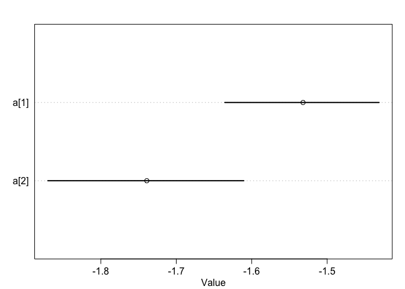
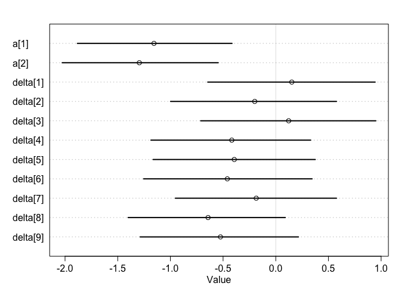

```r
library(rethinking)
```

```
## Loading required package: rstan
```

```
## Loading required package: StanHeaders
```

```
## Loading required package: ggplot2
```

```
## rstan (Version 2.19.2, GitRev: 2e1f913d3ca3)
```

```
## For execution on a local, multicore CPU with excess RAM we recommend calling
## options(mc.cores = parallel::detectCores()).
## To avoid recompilation of unchanged Stan programs, we recommend calling
## rstan_options(auto_write = TRUE)
```

```
## Loading required package: parallel
```

```
## Loading required package: dagitty
```

```
## rethinking (Version 1.90)
```

```
## 
## Attaching package: 'rethinking'
```

```
## The following object is masked from 'package:stats':
## 
##     rstudent
```


### 10E1.    
If an event has probability 0.35, what are the log-odds of this event?    


```r
log_odds = logit(0.35)
```

> The log-odds of this event is -0.6190392.   

### 10E2.    
If an event has log-odds 3.2, what is the probability of this event?     

```r
prob = inv_logit(3.2)
```

> The probability is 0.9608343.    

### 10E3.     
Suppose that a coefficient in a logistic regression has value 1.7. What does this imply about the proportional change in odds of the outcome?    

```r
odds_increase = exp(1.7)
```

> $log(odds_1) - log(odds_2) = 1.7$   
> $log(\frac{odds_1}{odds_2}) = 1.7$   
> $\frac{odds_1}{odds_2} = e^{1.7}$    
> The odds of the outcome increase by 5.4739474.     

### 10M1.    
As explained in the chapter, binomial data can be organized in aggregated and disaggregated forms, without any impact on inference. But the likelihood of the data does change when the data are converted between the two formats. Can you explain why?

> When we de-aggregate the outcomes, the order of events matters, maybe? Like the likelihoods of all different permutations sum up to the likelihood of the aggregated event?   

### Additional question 1   

```r
data("NWOGrants")
head(NWOGrants)
```

```
##          discipline gender applications awards
## 1 Chemical sciences      m           83     22
## 2 Chemical sciences      f           39     10
## 3 Physical sciences      m          135     26
## 4 Physical sciences      f           39      9
## 5           Physics      m           67     18
## 6           Physics      f            9      2
```

```r
d = NWOGrants
d$gid <- ifelse( d$gender=="m" , 1 , 2 )
head(d)
```

```
##          discipline gender applications awards gid
## 1 Chemical sciences      m           83     22   1
## 2 Chemical sciences      f           39     10   2
## 3 Physical sciences      m          135     26   1
## 4 Physical sciences      f           39      9   2
## 5           Physics      m           67     18   1
## 6           Physics      f            9      2   2
```

```r
d_slim = list(
  gid = d$gid,
  applications = d$applications,
  awards = d$awards
)

m1.1 <- ulam(
  alist(
  awards ~ dbinom( applications , p ) ,
  logit(p) <- a[gid] ,
  a[gid] ~ dnorm( 0 , 1.5 )
) , data=d_slim, chains=4, core = 4, iter = 2000)

precis( m1.1 , depth=2 )
```

```
##           mean         sd      5.5%     94.5%    n_eff      Rhat
## a[1] -1.531979 0.06409202 -1.635617 -1.431304 2922.646 0.9994618
## a[2] -1.739061 0.08098216 -1.870177 -1.610609 3146.278 0.9993294
```

```r
plot(m1.1, depth = 2)
```

<!-- -->


```r
d_slim = list(
  discipline = rep( 1:9 , each=2 ),
  gid = d$gid,
  applications = d$applications,
  awards = d$awards
)

m1.2 <- ulam(
  alist(
  awards ~ dbinom( applications , p ) ,
  logit(p) <- a[gid] + delta[discipline] ,
  a[gid] ~ dnorm( 0 , 1.5 ),
  delta[discipline] ~ dnorm( 0 , 1.5 )
) , data=d_slim, chains=4, core = 4, iter = 4000)

precis( m1.2 , depth=2 )
```

```
##                mean        sd       5.5%       94.5%    n_eff     Rhat
## a[1]     -1.1559696 0.4639692 -1.8826634 -0.41511360 522.6113 1.009662
## a[2]     -1.2948653 0.4675978 -2.0270362 -0.54643037 526.2949 1.009814
## delta[1]  0.1520274 0.4963185 -0.6453734  0.94340285 605.6234 1.008860
## delta[2] -0.1997175 0.4947966 -0.9983340  0.57652137 593.0087 1.008373
## delta[3]  0.1223786 0.5197991 -0.7126131  0.95003857 664.2461 1.008008
## delta[4] -0.4172539 0.4806080 -1.1849015  0.33127208 554.3869 1.009179
## delta[5] -0.3937482 0.4873189 -1.1643006  0.37499099 588.9846 1.008877
## delta[6] -0.4595607 0.4991619 -1.2541830  0.34478120 604.4879 1.008818
## delta[7] -0.1853928 0.4828224 -0.9528083  0.57626236 554.5454 1.009133
## delta[8] -0.6422617 0.4725916 -1.4010063  0.09024641 534.5528 1.009376
## delta[9] -0.5247510 0.4753646 -1.2868972  0.21509690 550.9381 1.009533
```

```r
plot(m1.2, depth = 2)
```

<!-- -->


