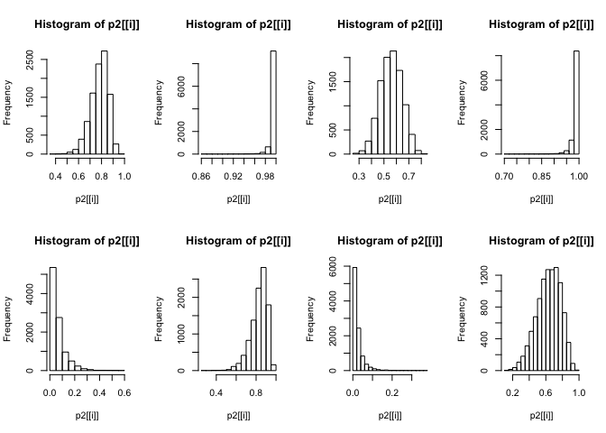

10H3

```r
library(rethinking)
```

```
## Loading required package: rstan
```

```
## Loading required package: StanHeaders
```

```
## Loading required package: ggplot2
```

```
## rstan (Version 2.19.2, GitRev: 2e1f913d3ca3)
```

```
## For execution on a local, multicore CPU with excess RAM we recommend calling
## options(mc.cores = parallel::detectCores()).
## To avoid recompilation of unchanged Stan programs, we recommend calling
## rstan_options(auto_write = TRUE)
```

```
## Loading required package: parallel
```

```
## Loading required package: dagitty
```

```
## rethinking (Version 1.92)
```

```
## 
## Attaching package: 'rethinking'
```

```
## The following object is masked from 'package:stats':
## 
##     rstudent
```

```r
library(MASS)
data("eagles")
head(eagles)
```

```
##    y  n P A V
## 1 17 24 L A L
## 2 29 29 L A S
## 3 17 27 L I L
## 4 20 20 L I S
## 5  1 12 S A L
## 6 15 16 S A S
```

```r
d = list(
  y = eagles$y,
  n = eagles$n,
  pr = ifelse(eagles$P == 'L', 1, 2),
  v = ifelse(eagles$V == 'L', 1, 2),
  a = ifelse(eagles$A == 'A', 1, 2)
)

m10.3 <- map2stan(
  alist(
  y ~ dbinom( n , p ),
  logit(p) <- alpha + b_pr[pr] + b_v[v] + b_a[a],
  alpha ~ dnorm(0, 10),
  b_pr[pr] ~ dnorm(0, 5),
  b_v[v] ~ dnorm(0, 5),
  b_a[a] ~ dnorm(0, 5)
) , data=d, chains=4, core = 4, iter = 4000)
```

```
## Computing WAIC
```

```r
plot(m10.3)
precis(m10.3 , depth=2)
```

```
##               mean       sd      5.5%    94.5%    n_eff     Rhat
## alpha    0.7177197 5.228600 -7.663083 8.945574 3663.848 1.000619
## b_pr[1]  2.5006212 3.401484 -2.977052 7.954691 3765.628 1.000689
## b_pr[2] -2.3722117 3.400841 -7.805370 2.991186 3795.184 1.000888
## b_v[1]  -2.5336755 3.355795 -7.947328 2.765056 3845.826 1.000292
## b_v[2]   2.7617279 3.379855 -2.692355 8.166219 3958.032 1.000039
## b_a[1]   0.7066324 3.370881 -4.766309 6.044497 3926.655 1.001485
## b_a[2]  -0.4319607 3.371265 -5.865359 4.843156 3908.187 1.001478
```

<!-- -->


```r
m10.3.1 <- map(
  alist(
  y ~ dbinom( n , p ),
  logit(p) <- alpha + b_pr[pr] + b_v[v] + b_a[a],
  alpha ~ dnorm(0, 10),
  b_pr[pr] ~ dnorm(0, 5),
  b_v[v] ~ dnorm(0, 5),
  b_a[a] ~ dnorm(0, 5)
) , data=d)
precis(m10.3.1 , depth=2 )
```

```
##               mean       sd      5.5%    94.5%
## alpha    0.7040982 5.227360 -7.650233 9.058430
## b_pr[1]  2.2791905 3.405358 -3.163229 7.721610
## b_pr[2] -2.1031737 3.405212 -7.545360 3.339012
## b_v[1]  -2.2847482 3.408482 -7.732161 3.162665
## b_v[2]   2.4607682 3.411640 -2.991691 7.913228
## b_a[1]   0.6322774 3.381807 -4.772503 6.037058
## b_a[2]  -0.4562735 3.382030 -5.861410 4.948863
```

(b) Now interpret the estimates. If the quadratic approximation turned out okay, then it’s okay to
use the map estimates. Otherwise stick to map2stan estimates. Then plot the posterior predictions.
Compute and display both (1) the predicted probability of success and its 89% interval for each row (i)
in the data, as well as (2) the predicted success count and its 89% interval. What different information
does each type of posterior prediction provide?     

```r
d_ind = list(
  n = eagles$n,
  pr = ifelse(eagles$P == 'L', 1, 2),
  v = ifelse(eagles$V == 'L', 1, 2),
  a = ifelse(eagles$A == 'A', 1, 2)
)
post_pred = extract.samples(m10.3)
p = list()
par(mfrow = c(2,4))
for (i in 1:8) {
  p[[i]] = inv_logit(post_pred$alpha + post_pred$b_pr[,d_ind$pr[i]] + post_pred$b_v[,d_ind$v[i]] + post_pred$b_a[,d_ind$a[i]])
  hist(p[[i]])
}
```

<!-- -->

```r
y = list()
par(mfrow = c(2,4))
for (i in 1:8) {
  y[[i]] = rbinom(d_ind$n[i], prob = inv_logit(post_pred$alpha + post_pred$b_pr[,d_ind$pr[i]] + post_pred$b_v[,d_ind$v[i]] + post_pred$b_a[,d_ind$a[i]]), size = 10000)
  hist(y[[i]])
}
```

<!-- -->


```r
post_pred2 = extract.samples(m10.3.1)
p2 = list()
par(mfrow = c(2,4))
for (i in 1:8) {
  p2[[i]] = inv_logit(post_pred2$alpha + post_pred2$b_pr[,d_ind$pr[i]] + post_pred2$b_v[,d_ind$v[i]] + post_pred2$b_a[,d_ind$a[i]])
  hist(p2[[i]])
}
```

<!-- -->

```r
y2 = list()
par(mfrow = c(2,4))
for (i in 1:8) {
  y2[[i]] = rbinom(d_ind$n[i], prob = inv_logit(post_pred2$alpha + post_pred2$b_pr[,d_ind$pr[i]] + post_pred2$b_v[,d_ind$v[i]] + post_pred2$b_a[,d_ind$a[i]]), size = 10000)
  hist(y2[[i]])
}
```

<!-- -->

(c) Now try to improve the model. Consider an interaction between the pirate’s size and age (immature or adult). Compare this model to the previous one, using WAIC. Interpret.    

```r
d_c = list(
  y = eagles$y,
  n = eagles$n,
  pr = ifelse(eagles$P == 'L', 1, 2),
  v = ifelse(eagles$V == 'L', 1, 2),
  a = ifelse(eagles$A == 'A', 1, 2),
  inter = c(1, 1, 2, 2, 3, 3, 4, 4)
)

m10.3.c = map2stan(
  alist(
  y ~ dbinom( n , p ),
  logit(p) <- alpha + b_pr[pr] + b_v[v] + b_a[a] + b_inter[inter],
  alpha ~ dnorm(0, 10),
  b_pr[pr] ~ dnorm(0, 5),
  b_v[v] ~ dnorm(0, 5),
  b_a[a] ~ dnorm(0, 5),
  b_inter[inter] ~ dnorm(0, 5)
) , data=d_c, chains=4, core = 4, iter = 4000)
```

```
## Computing WAIC
```

```r
#plot(m10.3.c)
precis(m10.3.c , depth=2)
```

```
##                  mean       sd      5.5%    94.5%    n_eff      Rhat
## alpha       0.6100230 5.450073 -7.886426 9.384774 6267.859 1.0000415
## b_pr[1]     1.9582711 3.910650 -4.307095 8.252663 7741.196 1.0000733
## b_pr[2]    -1.9009273 3.955515 -8.273641 4.467512 7070.835 0.9998270
## b_v[1]     -2.8385847 3.433440 -8.390480 2.602175 6120.825 0.9997502
## b_v[2]      3.1171464 3.419422 -2.442917 8.549591 6232.380 0.9998910
## b_a[1]      0.7985038 3.973839 -5.514569 7.150181 6725.142 1.0009683
## b_a[2]     -0.7938587 3.989574 -7.122777 5.611291 7387.909 1.0002500
## b_inter[1]  0.4155416 3.781224 -5.695265 6.371015 7428.002 1.0004079
## b_inter[2]  1.6162509 3.781696 -4.344679 7.658724 7192.380 0.9997349
## b_inter[3]  0.5011874 3.759750 -5.439841 6.492607 7440.573 1.0000481
## b_inter[4] -2.4489534 3.921017 -8.804178 3.831983 7328.015 1.0006334
```

```r
compare(m10.3, m10.3.c)
```

```
##             WAIC    pWAIC   dWAIC    weight       SE      dSE
## m10.3.c 95.71787 5.939564 0.00000 0.8474747 14.29424       NA
## m10.3   99.14773 4.360228 3.42986 0.1525253 13.78096 6.822227
```

> Interaction seems to be important.  

11E3. When count data are zero-inflated, using a model that ignores zero-inflation will tend to induce which kind of inferential error?     

> Underestimation of key parameters? Overdispersion? Hiding effects of interest or producing spurious inferences?   

11E4. Over-dispersion is common in count data. Give an example of a natural process that might
produce over-dispersed counts. Can you also give an example of a process that might produce underdispersed
counts?    

> In the case of flower opening time (i.e. hour of day when flowers open), existing heterogeneity of duration of flower opening introduces over-dispersion of flower count.   

> I would imagine covariation between parameters can produce underdispersion of data. This could come from negative feedback loops common in biological processes. For example, plants that flower earlier in the day might have longer opening durationss, while later flowering plants havd shorter opening durations.     

11H6. The data in data(Fish) are records of visits to a national park. See ?Fish for details. The
question of interest is how many fish an average visitor takes per hour, when fishing. The problem is
that not everyone tried to fish, so the fish_caught numbers are zero-inflated. As with the monks
example in the chapter, there is a process that determines who is fishing (working) and another process
that determines fish per hour (manuscripts per day), conditional on fishing (working). We want
to model both. Otherwise we’ll end up with an underestimate of rate of fish extraction from the park.     

You will model these data using zero-inflated Poisson GLMs. Predict fish_caught as a function
of any of the other variables you think are relevant. One thing you must do, however, is use a proper
Poisson offset/exposure in the Poisson portion of the zero-inflated model. Then use the hours variable
to construct the offset. This will adjust the model for the differing amount of time individuals
spent in the park.    


```r
data(Fish)
head(Fish)
```

```
##   fish_caught livebait camper persons child  hours
## 1           0        0      0       1     0 21.124
## 2           0        1      1       1     0  5.732
## 3           0        1      0       1     0  1.323
## 4           0        1      1       2     1  0.548
## 5           1        1      0       1     0  1.695
## 6           0        1      1       4     2  0.493
```

```r
f = list(
  fish = Fish$fish_caught,
  l = ifelse(Fish$livebait == 1, 1, 2),
  camp = ifelse(Fish$camper ==1, 1, 2),
  per = Fish$persons,
  ch = Fish$child, 
  log_h = log(Fish$hours)
)
m11.6 <- ulam(
  alist(
    fish ~ dzipois( p , lambda ),
    logit(p) <- ap,
    log(lambda) <- log_h + b_l[l] + b_c[camp] + b_p*per + b_ch*ch,
    ap ~ dnorm( 0 , 1 ),
    b_l[l] ~ dnorm( 0 , 1 ),
    b_c[camp] ~ dnorm( 0 , 1 ),
    b_p ~ dnorm( 0 , 1 ),
    b_ch ~ dnorm( 0 , 1 )
  ) , data=f, chains = 4, core = 4, iter = 4000)
precis(m11.6)
```

```
## 4 vector or matrix parameters hidden. Use depth=2 to show them.
```

```
##            mean         sd       5.5%      94.5%    n_eff      Rhat
## ap   -1.2471787 0.26228641 -1.6847894 -0.8495852 4989.385 0.9997865
## b_p   0.7067324 0.04177136  0.6410070  0.7750195 5506.597 1.0008202
## b_ch  0.5309861 0.08410374  0.3957444  0.6667014 5846.720 1.0005807
```


11H1. In 2014, a paper was published that was entitled “Female hurricanes are deadlier than male
hurricanes.”180 As the title suggests, the paper claimed that hurricanes with female names have caused
greater loss of life, and the explanation given is that people unconsciously rate female hurricanes as
less dangerous and so are less likely to evacuate.
Statisticians severely criticized the paper after publication. Here, you’ll explore the complete data
used in the paper and consider the hypothesis that hurricanes with female names are deadlier. Load
the data with:


```r
data(Hurricanes)
head(Hurricanes)
```

```
##       name year deaths category min_pressure damage_norm female femininity
## 1     Easy 1950      2        3          960        1590      1    6.77778
## 2     King 1950      4        3          955        5350      0    1.38889
## 3     Able 1952      3        1          985         150      0    3.83333
## 4  Barbara 1953      1        1          987          58      1    9.83333
## 5 Florence 1953      0        1          985          15      1    8.33333
## 6    Carol 1954     60        3          960       19321      1    8.11111
```

```r
?Hurricanes
```

In this problem, you’ll focus on predicting deaths using femininity of each hurricane’s name.
Fit and interpret the simplest possible model, a Poisson model of deaths using femininity as a
predictor. You can use map or map2stan. Compare the model to an intercept-only Poisson model of
deaths. How strong is the association between femininity of name and deaths? Which storms does
the model fit (retrodict) well? Which storms does it fit poorly?     


```r
h <- list( 
  d = Hurricanes$deaths,
  f = Hurricanes$femininity
)
m11.1 <- map2stan(
  alist(
    d ~ dpois( lambda ),
    lambda <- exp(f^b_f),
    b_f ~ dnorm(0,1)
), data=h , log_lik=TRUE )
```

```
## 
## SAMPLING FOR MODEL 'b7c3a153cd7c1540c25c57f7dae13c4d' NOW (CHAIN 1).
## Chain 1: 
## Chain 1: Gradient evaluation took 2.7e-05 seconds
## Chain 1: 1000 transitions using 10 leapfrog steps per transition would take 0.27 seconds.
## Chain 1: Adjust your expectations accordingly!
## Chain 1: 
## Chain 1: 
## Chain 1: Iteration:    1 / 2000 [  0%]  (Warmup)
## Chain 1: Iteration:  200 / 2000 [ 10%]  (Warmup)
## Chain 1: Iteration:  400 / 2000 [ 20%]  (Warmup)
## Chain 1: Iteration:  600 / 2000 [ 30%]  (Warmup)
## Chain 1: Iteration:  800 / 2000 [ 40%]  (Warmup)
## Chain 1: Iteration: 1000 / 2000 [ 50%]  (Warmup)
## Chain 1: Iteration: 1001 / 2000 [ 50%]  (Sampling)
## Chain 1: Iteration: 1200 / 2000 [ 60%]  (Sampling)
## Chain 1: Iteration: 1400 / 2000 [ 70%]  (Sampling)
## Chain 1: Iteration: 1600 / 2000 [ 80%]  (Sampling)
## Chain 1: Iteration: 1800 / 2000 [ 90%]  (Sampling)
## Chain 1: Iteration: 2000 / 2000 [100%]  (Sampling)
## Chain 1: 
## Chain 1:  Elapsed Time: 0.057506 seconds (Warm-up)
## Chain 1:                0.057177 seconds (Sampling)
## Chain 1:                0.114683 seconds (Total)
## Chain 1:
```

```
## Computing WAIC
```

```r
precis(m11.1, 2)
```

```
##          mean          sd      5.5%     94.5%    n_eff     Rhat
## b_f 0.5276169 0.003556919 0.5222402 0.5335192 294.0104 1.005055
```

```r
m11.1.1 <- map2stan(
  alist(
    d ~ dpois( lambda ),
    lambda ~ dexp(1)
), data=h)
```

```
## 
## SAMPLING FOR MODEL 'c50def5ee57ec9f2efb1b89e8b5997ba' NOW (CHAIN 1).
## Chain 1: 
## Chain 1: Gradient evaluation took 7e-06 seconds
## Chain 1: 1000 transitions using 10 leapfrog steps per transition would take 0.07 seconds.
## Chain 1: Adjust your expectations accordingly!
## Chain 1: 
## Chain 1: 
## Chain 1: Iteration:    1 / 2000 [  0%]  (Warmup)
## Chain 1: Iteration:  200 / 2000 [ 10%]  (Warmup)
## Chain 1: Iteration:  400 / 2000 [ 20%]  (Warmup)
## Chain 1: Iteration:  600 / 2000 [ 30%]  (Warmup)
## Chain 1: Iteration:  800 / 2000 [ 40%]  (Warmup)
## Chain 1: Iteration: 1000 / 2000 [ 50%]  (Warmup)
## Chain 1: Iteration: 1001 / 2000 [ 50%]  (Sampling)
## Chain 1: Iteration: 1200 / 2000 [ 60%]  (Sampling)
## Chain 1: Iteration: 1400 / 2000 [ 70%]  (Sampling)
## Chain 1: Iteration: 1600 / 2000 [ 80%]  (Sampling)
## Chain 1: Iteration: 1800 / 2000 [ 90%]  (Sampling)
## Chain 1: Iteration: 2000 / 2000 [100%]  (Sampling)
## Chain 1: 
## Chain 1:  Elapsed Time: 0.011626 seconds (Warm-up)
## Chain 1:                0.011699 seconds (Sampling)
## Chain 1:                0.023325 seconds (Total)
## Chain 1:
```

```
## Computing WAIC
```

```
## Error in .local(fit, data, n, ...) : 
##   There appear to be no linear models here
```

```r
precis(m11.1.1, 2)
```

```
##            mean        sd     5.5%    94.5%    n_eff      Rhat
## lambda 20.44013 0.4999285 19.63247 21.21025 278.3514 0.9997028
```

11H2. Counts are nearly always over-dispersed relative to Poisson. So fit a gamma-Poisson (aka
negative-binomial) model to predict deaths using femininity. Show that the over-dispersed model
no longer shows as precise a positive association between femininity and deaths, with an 89% interval
that overlaps zero. Can you explain why the association diminished in strength?      


