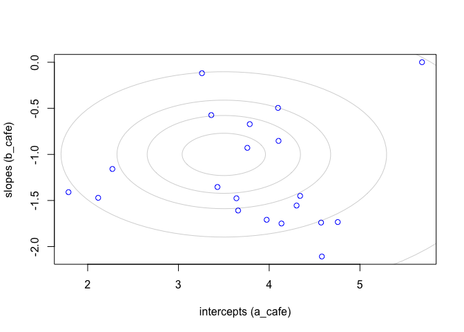
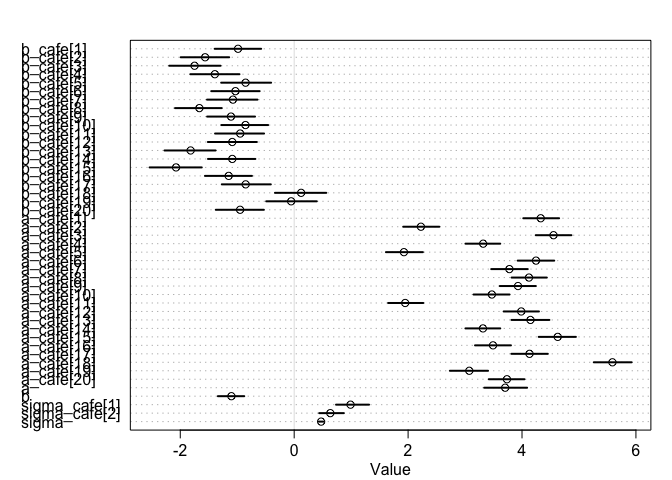
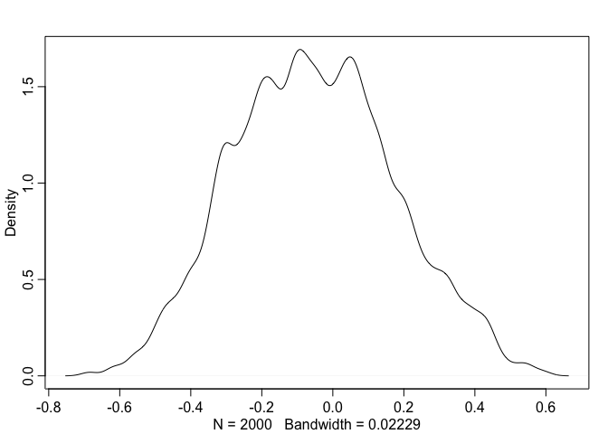
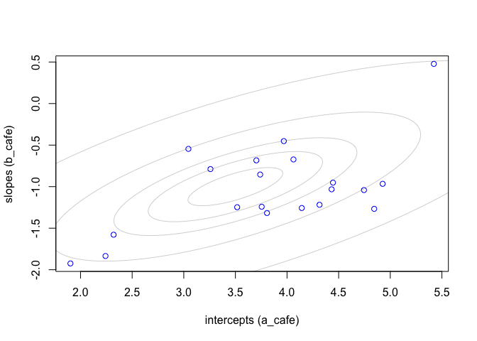

### 14E1
Add to the following model varying slopes on the predictor x.    
yi ~ Normal(mu_i, sigma)   
mu_i = alpha_group[i] + beta * xi   
alpha_group ~ Normal(alpha, sigma_alpha)    
alpha ~ Normal(0, 10)    
beta ~ Normal(0, 1)    
sigma ~ HalfCauchy(0, 2)     
sigma_alpha ~ HalfCauchy(0, 2)    

> New model:    
> yi ~ Normal(mu_i, sigma)   
> mu_i = alpha_group[i] + beta[i] * xi    
> [alpha_group[i], beta[i]] ~ MVNormal([alpha, beta], S)   
> S = (sigma_alpha, 0, 0, sigma_beta)_2x2 R (sigma_alpha, 0, 0, sigma_beta)_2x2    
> alpha ~ Normal(0, 10)    
> beta ~ Normal(0, 1)    
> sigma ~ HalfCauchy(0, 2)    
> sigma_alpha ~ HalfCauchy(0, 2)    
> sigma_beta ~ HalfCauchy(0, 2)    
> R ~ LKJcorr(2)    

The syntax for the multi-variate normal:     

```r
c(a_group, beta)[i] ~ multi_normal(c(a,b), Rho, sigma_i)
sigma_i ~ exponential(i)
Rho ~ lkj_corr(2)
```

### 14E2
Think up a context in which varying intercepts will be positively correlated with varying
slopes. Provide a mechanistic explanation for the correlation.    

> "The rich gets richer"... something like that I guess? The response variable would be amount of asset a person owns at different time points. 

### 14E3
When is it possible for a varying slopes model to have fewer effective parameters (as estimated
by WAIC or DIC) than the corresponding model with fixed (unpooled) slopes? Explain.    

> When the correlation is high...?    

### 14M1
Repeat the café robot simulation from the beginning of the chapter. This time, set rho to zero,
so that there is no correlation between intercepts and slopes. How does the posterior distribution of
the correlation reflect this change in the underlying simulation?     


```r
library(rethinking)
```

```
## Loading required package: rstan
```

```
## Loading required package: StanHeaders
```

```
## Loading required package: ggplot2
```

```
## rstan (Version 2.19.3, GitRev: 2e1f913d3ca3)
```

```
## For execution on a local, multicore CPU with excess RAM we recommend calling
## options(mc.cores = parallel::detectCores()).
## To avoid recompilation of unchanged Stan programs, we recommend calling
## rstan_options(auto_write = TRUE)
```

```
## Loading required package: parallel
```

```
## Loading required package: dagitty
```

```
## rethinking (Version 1.92)
```

```
## 
## Attaching package: 'rethinking'
```

```
## The following object is masked from 'package:stats':
## 
##     rstudent
```

```r
a <- 3.5 # average morning wait time 
b <- (-1) # average difference afternoon wait time
sigma_a <- 1 # std dev in intercepts
sigma_b <- 0.5 # std dev in slopes
rho <- 0 # correlation between intercepts and slopes
Mu <- c( a , b )
cov_ab <- sigma_a*sigma_b*rho
Sigma <- matrix( c(sigma_a^2,cov_ab,cov_ab,sigma_b^2) , ncol=2 )
sigmas <- c(sigma_a,sigma_b) # standard deviations 14.5
Rho <- matrix( c(1,rho,rho,1) , nrow=2 ) # correlation matrix
# now matrix multiply to get covariance matrix
Sigma <- diag(sigmas) %*% Rho %*% diag(sigmas)
N_cafes <- 20
library(MASS) 
set.seed(5) # used to replicate example
vary_effects <- mvrnorm( N_cafes , Mu , Sigma )
a_cafe <- vary_effects[,1] 
b_cafe <- vary_effects[,2]
plot( a_cafe , b_cafe , col='blue' , xlab="intercepts (a_cafe)" , ylab="slopes (b_cafe)" )
# overlay population distribution
library(ellipse)
```

```
## 
## Attaching package: 'ellipse'
```

```
## The following object is masked from 'package:rethinking':
## 
##     pairs
```

```
## The following object is masked from 'package:graphics':
## 
##     pairs
```

```r
for ( l in c(0.1,0.3,0.5,0.8,0.99) ) {
  lines(ellipse(Sigma,centre=Mu,level=l),col=col.alpha("black",0.2))
}
```

<!-- -->


```r
set.seed(22) 
N_visits <- 10
afternoon <- rep(0:1,N_visits*N_cafes/2)
cafe_id <- rep( 1:N_cafes , each=N_visits )
mu <- a_cafe[cafe_id] + b_cafe[cafe_id]*afternoon
sigma <- 0.5 # std dev within cafes
wait <- rnorm( N_visits*N_cafes , mu , sigma )
d <- data.frame( cafe=cafe_id , afternoon=afternoon , wait=wait )
```


```r
m14m1 <- ulam( 
  alist(
    wait ~ normal( mu , sigma ),
    mu <- a_cafe[cafe] + b_cafe[cafe]*afternoon,
    c(a_cafe,b_cafe)[cafe] ~ multi_normal( c(a,b) , Rho , sigma_cafe ),
    a ~ normal(5,2),
    b ~ normal(-1,0.5),
    sigma_cafe ~ exponential(1),
    sigma ~ exponential(1),
    Rho ~ lkj_corr(2)
  ) , data=d , chains=4 , cores=4 )
```

```
## Trying to compile a simple C file
```

```
## Running /Library/Frameworks/R.framework/Resources/bin/R CMD SHLIB foo.c
## clang -I"/Library/Frameworks/R.framework/Resources/include" -DNDEBUG   -I"/Library/Frameworks/R.framework/Versions/3.6/Resources/library/Rcpp/include/"  -I"/Library/Frameworks/R.framework/Versions/3.6/Resources/library/RcppEigen/include/"  -I"/Library/Frameworks/R.framework/Versions/3.6/Resources/library/RcppEigen/include/unsupported"  -I"/Library/Frameworks/R.framework/Versions/3.6/Resources/library/BH/include" -I"/Library/Frameworks/R.framework/Versions/3.6/Resources/library/StanHeaders/include/src/"  -I"/Library/Frameworks/R.framework/Versions/3.6/Resources/library/StanHeaders/include/"  -I"/Library/Frameworks/R.framework/Versions/3.6/Resources/library/rstan/include" -DEIGEN_NO_DEBUG  -D_REENTRANT  -DBOOST_DISABLE_ASSERTS -DBOOST_PENDING_INTEGER_LOG2_HPP -include stan/math/prim/mat/fun/Eigen.hpp   -isysroot /Library/Developer/CommandLineTools/SDKs/MacOSX.sdk -I/usr/local/include  -fPIC  -Wall -g -O2  -c foo.c -o foo.o
## In file included from <built-in>:1:
## In file included from /Library/Frameworks/R.framework/Versions/3.6/Resources/library/StanHeaders/include/stan/math/prim/mat/fun/Eigen.hpp:13:
## In file included from /Library/Frameworks/R.framework/Versions/3.6/Resources/library/RcppEigen/include/Eigen/Dense:1:
## In file included from /Library/Frameworks/R.framework/Versions/3.6/Resources/library/RcppEigen/include/Eigen/Core:88:
## /Library/Frameworks/R.framework/Versions/3.6/Resources/library/RcppEigen/include/Eigen/src/Core/util/Macros.h:613:1: error: unknown type name 'namespace'
## namespace Eigen {
## ^
## /Library/Frameworks/R.framework/Versions/3.6/Resources/library/RcppEigen/include/Eigen/src/Core/util/Macros.h:613:16: error: expected ';' after top level declarator
## namespace Eigen {
##                ^
##                ;
## In file included from <built-in>:1:
## In file included from /Library/Frameworks/R.framework/Versions/3.6/Resources/library/StanHeaders/include/stan/math/prim/mat/fun/Eigen.hpp:13:
## In file included from /Library/Frameworks/R.framework/Versions/3.6/Resources/library/RcppEigen/include/Eigen/Dense:1:
## /Library/Frameworks/R.framework/Versions/3.6/Resources/library/RcppEigen/include/Eigen/Core:96:10: fatal error: 'complex' file not found
## #include <complex>
##          ^~~~~~~~~
## 3 errors generated.
## make: *** [foo.o] Error 1
```

```
## Warning: The largest R-hat is NA, indicating chains have not mixed.
## Running the chains for more iterations may help. See
## http://mc-stan.org/misc/warnings.html#r-hat
```

```
## Warning: Bulk Effective Samples Size (ESS) is too low, indicating posterior means and medians may be unreliable.
## Running the chains for more iterations may help. See
## http://mc-stan.org/misc/warnings.html#bulk-ess
```

```
## Warning: Tail Effective Samples Size (ESS) is too low, indicating posterior variances and tail quantiles may be unreliable.
## Running the chains for more iterations may help. See
## http://mc-stan.org/misc/warnings.html#tail-ess
```


```r
precis(m14m1, depth = 2)
```

```
## 4 matrix parameters hidden. Use depth=3 to show them.
```

```
##                      mean         sd       5.5%      94.5%    n_eff      Rhat
## b_cafe[1]     -0.98596107 0.25828723 -1.3958046 -0.5802381 2435.762 0.9996921
## b_cafe[2]     -1.56350747 0.26799419 -1.9920995 -1.1417117 2129.778 0.9993315
## b_cafe[3]     -1.74941056 0.27711009 -2.1932136 -1.2934312 2040.342 1.0011315
## b_cafe[4]     -1.39259717 0.26428444 -1.8221939 -0.9608407 2539.740 1.0006779
## b_cafe[5]     -0.85335417 0.27660696 -1.2818833 -0.4052067 2596.645 0.9992754
## b_cafe[6]     -1.03133754 0.26680322 -1.4551003 -0.6065376 2422.504 1.0012794
## b_cafe[7]     -1.07498534 0.26894643 -1.5301918 -0.6444209 2722.951 0.9993239
## b_cafe[8]     -1.66445054 0.26016755 -2.0917012 -1.2717742 2339.395 0.9989143
## b_cafe[9]     -1.10919161 0.26809012 -1.5284955 -0.6876333 2628.822 0.9985047
## b_cafe[10]    -0.85529150 0.25999713 -1.2797066 -0.4573110 2525.216 0.9994057
## b_cafe[11]    -0.94760852 0.26463942 -1.3889695 -0.5291015 2384.293 1.0004092
## b_cafe[12]    -1.08742629 0.26893126 -1.5157392 -0.6555696 2891.661 0.9993974
## b_cafe[13]    -1.81837917 0.27635295 -2.2766096 -1.3805488 2338.586 0.9999314
## b_cafe[14]    -1.08697881 0.26570531 -1.5132444 -0.6816811 2238.318 1.0017046
## b_cafe[15]    -2.07409647 0.28874623 -2.5382686 -1.6226744 2263.874 0.9984662
## b_cafe[16]    -1.14997379 0.26259722 -1.5665682 -0.7415313 2186.203 0.9988406
## b_cafe[17]    -0.85199238 0.27027460 -1.2705697 -0.4104914 2777.390 0.9998992
## b_cafe[18]     0.12181891 0.28579845 -0.3371224  0.5629582 1920.181 0.9986622
## b_cafe[19]    -0.05316183 0.27962748 -0.4907338  0.3960120 1909.497 0.9993862
## b_cafe[20]    -0.94984196 0.26208946 -1.3762873 -0.5332092 2701.101 0.9995156
## a_cafe[1]      4.32827601 0.19565871  4.0225775  4.6509531 2375.912 1.0008125
## a_cafe[2]      2.22489750 0.19860960  1.9147126  2.5478418 2133.587 0.9985177
## a_cafe[3]      4.55284143 0.19662517  4.2412292  4.8673451 2353.179 0.9999635
## a_cafe[4]      3.31839726 0.19145327  3.0071157  3.6176964 2577.071 1.0006250
## a_cafe[5]      1.92705442 0.20200796  1.6112193  2.2595180 2683.451 0.9991324
## a_cafe[6]      4.24574227 0.19989180  3.9240632  4.5653565 2409.955 0.9998680
## a_cafe[7]      3.77847935 0.19969067  3.4596032  4.1006438 2486.623 0.9988925
## a_cafe[8]      4.12226657 0.19229645  3.8176474  4.4348297 2433.556 0.9988021
## a_cafe[9]      3.92960680 0.19523273  3.6100373  4.2416827 2645.899 0.9987091
## a_cafe[10]     3.47068321 0.19784771  3.1493716  3.7812779 2478.130 0.9992888
## a_cafe[11]     1.94885385 0.19439648  1.6496768  2.2661169 2535.591 0.9993977
## a_cafe[12]     3.98659363 0.19498513  3.6778536  4.2968623 3032.141 0.9991794
## a_cafe[13]     4.14882067 0.20328663  3.8152033  4.4804710 2318.736 1.0003616
## a_cafe[14]     3.31465217 0.19529739  3.0065542  3.6180751 2187.666 0.9999875
## a_cafe[15]     4.62675387 0.20850003  4.2936668  4.9457750 2193.491 0.9986774
## a_cafe[16]     3.49105552 0.19465970  3.1752816  3.8055602 2244.110 0.9994325
## a_cafe[17]     4.13171677 0.20050061  3.8133728  4.4529689 2607.546 1.0007566
## a_cafe[18]     5.58759724 0.20680049  5.2602542  5.9241134 2218.843 0.9986734
## a_cafe[19]     3.07453668 0.20861320  2.7334269  3.4029715 2341.946 1.0002899
## a_cafe[20]     3.73570239 0.19853664  3.4173048  4.0428921 2428.696 0.9994130
## a              3.70453752 0.23097778  3.3363158  4.0891803 2560.775 0.9988050
## b             -1.10224404 0.14583446 -1.3394553 -0.8768603 2314.846 1.0006035
## sigma_cafe[1]  0.98935331 0.18953132  0.7349355  1.3141944 1650.015 1.0007010
## sigma_cafe[2]  0.63428291 0.13751053  0.4394742  0.8710274 1481.079 1.0006510
## sigma          0.47323809 0.02711395  0.4319419  0.5187312 2101.595 0.9999038
```

```r
plot(m14m1, depth = 2)
```

```
## 4 matrix parameters hidden. Use depth=3 to show them.
```

<!-- -->


```r
post <- extract.samples(m14m1)
dens( post$Rho[,1,2] )
```

<!-- -->

> posterior of rho is about 0. 

### 14M2
Fit this multilevel model to the simulated café data:
Wi ~ Normal(mu_i, sigma)   
mu_i = alpha_café[i] + beta_café[i] * Ai    
alpha_café ~ Normal(alpha, sigma_alpha)     
beta_café ~ Normal(beta, sigma_beta)    
alpha ~ Normal(0, 10)     
beta ~ Normal(0, 10)     
sigma_alpha ~ HalfCauchy(0, 1)    
sigma_beta ~ HalfCauchy(0, 1)    
sigma ~ HalfCauchy(0, 1)    
Use WAIC to compare this model to the model from the chapter, the one that uses a multi-variate
Gaussian prior. Explain the result.      

```r
m14.1 <- ulam( 
  alist(
    wait ~ normal( mu , sigma ),
    mu <- a_cafe[cafe] + b_cafe[cafe]*afternoon,
    c(a_cafe,b_cafe)[cafe] ~ multi_normal( c(a,b) , Rho , sigma_cafe ),
    a ~ normal(5,2),
    b ~ normal(-1,0.5),
    sigma_cafe ~ exponential(1),
    sigma ~ exponential(1),
    Rho ~ lkj_corr(2)
  ) , data=d , chains=4 , cores=4, log_lik = TRUE)
```

```
## Trying to compile a simple C file
```

```
## Running /Library/Frameworks/R.framework/Resources/bin/R CMD SHLIB foo.c
## clang -I"/Library/Frameworks/R.framework/Resources/include" -DNDEBUG   -I"/Library/Frameworks/R.framework/Versions/3.6/Resources/library/Rcpp/include/"  -I"/Library/Frameworks/R.framework/Versions/3.6/Resources/library/RcppEigen/include/"  -I"/Library/Frameworks/R.framework/Versions/3.6/Resources/library/RcppEigen/include/unsupported"  -I"/Library/Frameworks/R.framework/Versions/3.6/Resources/library/BH/include" -I"/Library/Frameworks/R.framework/Versions/3.6/Resources/library/StanHeaders/include/src/"  -I"/Library/Frameworks/R.framework/Versions/3.6/Resources/library/StanHeaders/include/"  -I"/Library/Frameworks/R.framework/Versions/3.6/Resources/library/rstan/include" -DEIGEN_NO_DEBUG  -D_REENTRANT  -DBOOST_DISABLE_ASSERTS -DBOOST_PENDING_INTEGER_LOG2_HPP -include stan/math/prim/mat/fun/Eigen.hpp   -isysroot /Library/Developer/CommandLineTools/SDKs/MacOSX.sdk -I/usr/local/include  -fPIC  -Wall -g -O2  -c foo.c -o foo.o
## In file included from <built-in>:1:
## In file included from /Library/Frameworks/R.framework/Versions/3.6/Resources/library/StanHeaders/include/stan/math/prim/mat/fun/Eigen.hpp:13:
## In file included from /Library/Frameworks/R.framework/Versions/3.6/Resources/library/RcppEigen/include/Eigen/Dense:1:
## In file included from /Library/Frameworks/R.framework/Versions/3.6/Resources/library/RcppEigen/include/Eigen/Core:88:
## /Library/Frameworks/R.framework/Versions/3.6/Resources/library/RcppEigen/include/Eigen/src/Core/util/Macros.h:613:1: error: unknown type name 'namespace'
## namespace Eigen {
## ^
## /Library/Frameworks/R.framework/Versions/3.6/Resources/library/RcppEigen/include/Eigen/src/Core/util/Macros.h:613:16: error: expected ';' after top level declarator
## namespace Eigen {
##                ^
##                ;
## In file included from <built-in>:1:
## In file included from /Library/Frameworks/R.framework/Versions/3.6/Resources/library/StanHeaders/include/stan/math/prim/mat/fun/Eigen.hpp:13:
## In file included from /Library/Frameworks/R.framework/Versions/3.6/Resources/library/RcppEigen/include/Eigen/Dense:1:
## /Library/Frameworks/R.framework/Versions/3.6/Resources/library/RcppEigen/include/Eigen/Core:96:10: fatal error: 'complex' file not found
## #include <complex>
##          ^~~~~~~~~
## 3 errors generated.
## make: *** [foo.o] Error 1
```

```
## Warning: The largest R-hat is NA, indicating chains have not mixed.
## Running the chains for more iterations may help. See
## http://mc-stan.org/misc/warnings.html#r-hat
```

```
## Warning: Bulk Effective Samples Size (ESS) is too low, indicating posterior means and medians may be unreliable.
## Running the chains for more iterations may help. See
## http://mc-stan.org/misc/warnings.html#bulk-ess
```

```
## Warning: Tail Effective Samples Size (ESS) is too low, indicating posterior variances and tail quantiles may be unreliable.
## Running the chains for more iterations may help. See
## http://mc-stan.org/misc/warnings.html#tail-ess
```

```r
m14m2 = ulam(
  alist(
    wait ~ normal( mu , sigma ),
    mu <- a_cafe[cafe] + b_cafe[cafe]*afternoon,
    a_cafe[cafe] ~ dnorm(alpha, sigma_alpha),
    b_cafe[cafe] ~ dnorm(beta, sigma_beta),
    c(alpha, beta) ~ dnorm(0,10),
    c(sigma, sigma_alpha, sigma_beta) ~ dexp(1)
  ), data=d , chains=4 , cores=4, log_lik = TRUE)
```

```
## Trying to compile a simple C file
```

```
## Running /Library/Frameworks/R.framework/Resources/bin/R CMD SHLIB foo.c
## clang -I"/Library/Frameworks/R.framework/Resources/include" -DNDEBUG   -I"/Library/Frameworks/R.framework/Versions/3.6/Resources/library/Rcpp/include/"  -I"/Library/Frameworks/R.framework/Versions/3.6/Resources/library/RcppEigen/include/"  -I"/Library/Frameworks/R.framework/Versions/3.6/Resources/library/RcppEigen/include/unsupported"  -I"/Library/Frameworks/R.framework/Versions/3.6/Resources/library/BH/include" -I"/Library/Frameworks/R.framework/Versions/3.6/Resources/library/StanHeaders/include/src/"  -I"/Library/Frameworks/R.framework/Versions/3.6/Resources/library/StanHeaders/include/"  -I"/Library/Frameworks/R.framework/Versions/3.6/Resources/library/rstan/include" -DEIGEN_NO_DEBUG  -D_REENTRANT  -DBOOST_DISABLE_ASSERTS -DBOOST_PENDING_INTEGER_LOG2_HPP -include stan/math/prim/mat/fun/Eigen.hpp   -isysroot /Library/Developer/CommandLineTools/SDKs/MacOSX.sdk -I/usr/local/include  -fPIC  -Wall -g -O2  -c foo.c -o foo.o
## In file included from <built-in>:1:
## In file included from /Library/Frameworks/R.framework/Versions/3.6/Resources/library/StanHeaders/include/stan/math/prim/mat/fun/Eigen.hpp:13:
## In file included from /Library/Frameworks/R.framework/Versions/3.6/Resources/library/RcppEigen/include/Eigen/Dense:1:
## In file included from /Library/Frameworks/R.framework/Versions/3.6/Resources/library/RcppEigen/include/Eigen/Core:88:
## /Library/Frameworks/R.framework/Versions/3.6/Resources/library/RcppEigen/include/Eigen/src/Core/util/Macros.h:613:1: error: unknown type name 'namespace'
## namespace Eigen {
## ^
## /Library/Frameworks/R.framework/Versions/3.6/Resources/library/RcppEigen/include/Eigen/src/Core/util/Macros.h:613:16: error: expected ';' after top level declarator
## namespace Eigen {
##                ^
##                ;
## In file included from <built-in>:1:
## In file included from /Library/Frameworks/R.framework/Versions/3.6/Resources/library/StanHeaders/include/stan/math/prim/mat/fun/Eigen.hpp:13:
## In file included from /Library/Frameworks/R.framework/Versions/3.6/Resources/library/RcppEigen/include/Eigen/Dense:1:
## /Library/Frameworks/R.framework/Versions/3.6/Resources/library/RcppEigen/include/Eigen/Core:96:10: fatal error: 'complex' file not found
## #include <complex>
##          ^~~~~~~~~
## 3 errors generated.
## make: *** [foo.o] Error 1
```


```r
compare(m14.1, m14m2)
```

```
##           WAIC    pWAIC      dWAIC    weight       SE       dSE
## m14m2 306.3261 33.50400 0.00000000 0.5018891 17.77947        NA
## m14.1 306.3413 33.69231 0.01511251 0.4981109 17.82262 0.6050437
```

> They are quite similar when rho = 0. Re-doing simulation with a stronger correlation:   


```r
a <- 3.5 # average morning wait time 
b <- (-1) # average difference afternoon wait time
sigma_a <- 1 # std dev in intercepts
sigma_b <- 0.5 # std dev in slopes
rho <- 0.7 # correlation between intercepts and slopes
Mu <- c( a , b )
cov_ab <- sigma_a*sigma_b*rho
Sigma <- matrix( c(sigma_a^2,cov_ab,cov_ab,sigma_b^2) , ncol=2 )
sigmas <- c(sigma_a,sigma_b) # standard deviations 14.5
Rho <- matrix( c(1,rho,rho,1) , nrow=2 ) # correlation matrix
# now matrix multiply to get covariance matrix
Sigma <- diag(sigmas) %*% Rho %*% diag(sigmas)
N_cafes <- 20
library(MASS) 
set.seed(5) # used to replicate example
vary_effects <- mvrnorm( N_cafes , Mu , Sigma )
a_cafe <- vary_effects[,1] 
b_cafe <- vary_effects[,2]
plot( a_cafe , b_cafe , col='blue' , xlab="intercepts (a_cafe)" , ylab="slopes (b_cafe)" )
# overlay population distribution
library(ellipse)
for ( l in c(0.1,0.3,0.5,0.8,0.99) ) {
  lines(ellipse(Sigma,centre=Mu,level=l),col=col.alpha("black",0.2))
}
```

<!-- -->

```r
set.seed(22) 
N_visits <- 10
afternoon <- rep(0:1,N_visits*N_cafes/2)
cafe_id <- rep( 1:N_cafes , each=N_visits )
mu <- a_cafe[cafe_id] + b_cafe[cafe_id]*afternoon
sigma <- 0.5 # std dev within cafes
wait <- rnorm( N_visits*N_cafes , mu , sigma )
d_r0.7 <- data.frame( cafe=cafe_id , afternoon=afternoon , wait=wait )
```


```r
m14.1_r0.7 <- ulam( 
  alist(
    wait ~ normal( mu , sigma ),
    mu <- a_cafe[cafe] + b_cafe[cafe]*afternoon,
    c(a_cafe,b_cafe)[cafe] ~ multi_normal( c(a,b) , Rho , sigma_cafe ),
    a ~ normal(5,2),
    b ~ normal(-1,0.5),
    sigma_cafe ~ exponential(1),
    sigma ~ exponential(1),
    Rho ~ lkj_corr(2)
  ) , data=d_r0.7 , chains=4 , cores=4, log_lik = TRUE)
```

```
## recompiling to avoid crashing R session
```

```
## Trying to compile a simple C file
```

```
## Running /Library/Frameworks/R.framework/Resources/bin/R CMD SHLIB foo.c
## clang -I"/Library/Frameworks/R.framework/Resources/include" -DNDEBUG   -I"/Library/Frameworks/R.framework/Versions/3.6/Resources/library/Rcpp/include/"  -I"/Library/Frameworks/R.framework/Versions/3.6/Resources/library/RcppEigen/include/"  -I"/Library/Frameworks/R.framework/Versions/3.6/Resources/library/RcppEigen/include/unsupported"  -I"/Library/Frameworks/R.framework/Versions/3.6/Resources/library/BH/include" -I"/Library/Frameworks/R.framework/Versions/3.6/Resources/library/StanHeaders/include/src/"  -I"/Library/Frameworks/R.framework/Versions/3.6/Resources/library/StanHeaders/include/"  -I"/Library/Frameworks/R.framework/Versions/3.6/Resources/library/rstan/include" -DEIGEN_NO_DEBUG  -D_REENTRANT  -DBOOST_DISABLE_ASSERTS -DBOOST_PENDING_INTEGER_LOG2_HPP -include stan/math/prim/mat/fun/Eigen.hpp   -isysroot /Library/Developer/CommandLineTools/SDKs/MacOSX.sdk -I/usr/local/include  -fPIC  -Wall -g -O2  -c foo.c -o foo.o
## In file included from <built-in>:1:
## In file included from /Library/Frameworks/R.framework/Versions/3.6/Resources/library/StanHeaders/include/stan/math/prim/mat/fun/Eigen.hpp:13:
## In file included from /Library/Frameworks/R.framework/Versions/3.6/Resources/library/RcppEigen/include/Eigen/Dense:1:
## In file included from /Library/Frameworks/R.framework/Versions/3.6/Resources/library/RcppEigen/include/Eigen/Core:88:
## /Library/Frameworks/R.framework/Versions/3.6/Resources/library/RcppEigen/include/Eigen/src/Core/util/Macros.h:613:1: error: unknown type name 'namespace'
## namespace Eigen {
## ^
## /Library/Frameworks/R.framework/Versions/3.6/Resources/library/RcppEigen/include/Eigen/src/Core/util/Macros.h:613:16: error: expected ';' after top level declarator
## namespace Eigen {
##                ^
##                ;
## In file included from <built-in>:1:
## In file included from /Library/Frameworks/R.framework/Versions/3.6/Resources/library/StanHeaders/include/stan/math/prim/mat/fun/Eigen.hpp:13:
## In file included from /Library/Frameworks/R.framework/Versions/3.6/Resources/library/RcppEigen/include/Eigen/Dense:1:
## /Library/Frameworks/R.framework/Versions/3.6/Resources/library/RcppEigen/include/Eigen/Core:96:10: fatal error: 'complex' file not found
## #include <complex>
##          ^~~~~~~~~
## 3 errors generated.
## make: *** [foo.o] Error 1
```

```
## Warning: The largest R-hat is NA, indicating chains have not mixed.
## Running the chains for more iterations may help. See
## http://mc-stan.org/misc/warnings.html#r-hat
```

```
## Warning: Bulk Effective Samples Size (ESS) is too low, indicating posterior means and medians may be unreliable.
## Running the chains for more iterations may help. See
## http://mc-stan.org/misc/warnings.html#bulk-ess
```

```
## Warning: Tail Effective Samples Size (ESS) is too low, indicating posterior variances and tail quantiles may be unreliable.
## Running the chains for more iterations may help. See
## http://mc-stan.org/misc/warnings.html#tail-ess
```

```r
m14m2_r0.7 = ulam(
  alist(
    wait ~ normal( mu , sigma ),
    mu <- a_cafe[cafe] + b_cafe[cafe]*afternoon,
    a_cafe[cafe] ~ dnorm(alpha, sigma_alpha),
    b_cafe[cafe] ~ dnorm(beta, sigma_beta),
    c(alpha, beta) ~ dnorm(0,10),
    c(sigma, sigma_alpha, sigma_beta) ~ dexp(1)
  ), data=d_r0.7 , chains=4 , cores=4, log_lik = TRUE)
```

```
## recompiling to avoid crashing R session
## Trying to compile a simple C file
```

```
## Running /Library/Frameworks/R.framework/Resources/bin/R CMD SHLIB foo.c
## clang -I"/Library/Frameworks/R.framework/Resources/include" -DNDEBUG   -I"/Library/Frameworks/R.framework/Versions/3.6/Resources/library/Rcpp/include/"  -I"/Library/Frameworks/R.framework/Versions/3.6/Resources/library/RcppEigen/include/"  -I"/Library/Frameworks/R.framework/Versions/3.6/Resources/library/RcppEigen/include/unsupported"  -I"/Library/Frameworks/R.framework/Versions/3.6/Resources/library/BH/include" -I"/Library/Frameworks/R.framework/Versions/3.6/Resources/library/StanHeaders/include/src/"  -I"/Library/Frameworks/R.framework/Versions/3.6/Resources/library/StanHeaders/include/"  -I"/Library/Frameworks/R.framework/Versions/3.6/Resources/library/rstan/include" -DEIGEN_NO_DEBUG  -D_REENTRANT  -DBOOST_DISABLE_ASSERTS -DBOOST_PENDING_INTEGER_LOG2_HPP -include stan/math/prim/mat/fun/Eigen.hpp   -isysroot /Library/Developer/CommandLineTools/SDKs/MacOSX.sdk -I/usr/local/include  -fPIC  -Wall -g -O2  -c foo.c -o foo.o
## In file included from <built-in>:1:
## In file included from /Library/Frameworks/R.framework/Versions/3.6/Resources/library/StanHeaders/include/stan/math/prim/mat/fun/Eigen.hpp:13:
## In file included from /Library/Frameworks/R.framework/Versions/3.6/Resources/library/RcppEigen/include/Eigen/Dense:1:
## In file included from /Library/Frameworks/R.framework/Versions/3.6/Resources/library/RcppEigen/include/Eigen/Core:88:
## /Library/Frameworks/R.framework/Versions/3.6/Resources/library/RcppEigen/include/Eigen/src/Core/util/Macros.h:613:1: error: unknown type name 'namespace'
## namespace Eigen {
## ^
## /Library/Frameworks/R.framework/Versions/3.6/Resources/library/RcppEigen/include/Eigen/src/Core/util/Macros.h:613:16: error: expected ';' after top level declarator
## namespace Eigen {
##                ^
##                ;
## In file included from <built-in>:1:
## In file included from /Library/Frameworks/R.framework/Versions/3.6/Resources/library/StanHeaders/include/stan/math/prim/mat/fun/Eigen.hpp:13:
## In file included from /Library/Frameworks/R.framework/Versions/3.6/Resources/library/RcppEigen/include/Eigen/Dense:1:
## /Library/Frameworks/R.framework/Versions/3.6/Resources/library/RcppEigen/include/Eigen/Core:96:10: fatal error: 'complex' file not found
## #include <complex>
##          ^~~~~~~~~
## 3 errors generated.
## make: *** [foo.o] Error 1
```


```r
compare(m14.1_r0.7, m14m2_r0.7)
```

```
##                WAIC    pWAIC    dWAIC    weight       SE      dSE
## m14.1_r0.7 302.9010 31.66304 0.000000 0.5843905 17.86829       NA
## m14m2_r0.7 303.5826 32.89633 0.681647 0.4156095 17.67620 1.869308
```

> Hmmm still...? Did I do something wrong...?
