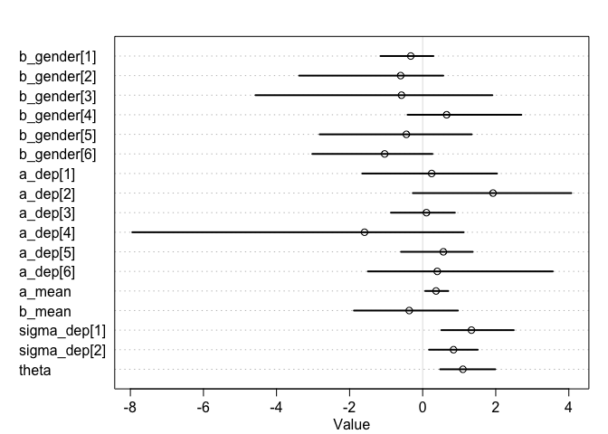
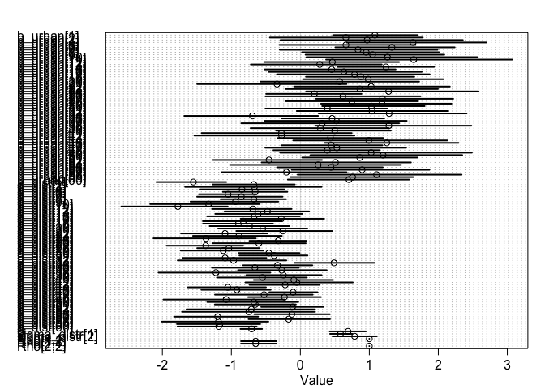
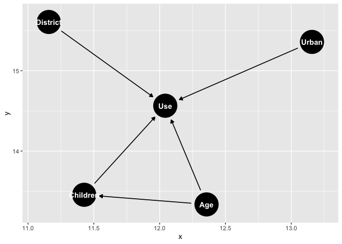

```r
library(rethinking)
```

```
## Loading required package: rstan
```

```
## Loading required package: StanHeaders
```

```
## Loading required package: ggplot2
```

```
## rstan (Version 2.19.3, GitRev: 2e1f913d3ca3)
```

```
## For execution on a local, multicore CPU with excess RAM we recommend calling
## options(mc.cores = parallel::detectCores()).
## To avoid recompilation of unchanged Stan programs, we recommend calling
## rstan_options(auto_write = TRUE)
```

```
## Loading required package: parallel
```

```
## Loading required package: dagitty
```

```
## rethinking (Version 1.92)
```

```
## 
## Attaching package: 'rethinking'
```

```
## The following object is masked from 'package:stats':
## 
##     rstudent
```


#### 14M3    

Re-estimate the varying slopes model for the UCBadmit data, now using a non-centered parameterization. Compare the efficiency of the forms of the model, using n_eff. Which is better? Which chain sampled faster?     


```r
data(UCBadmit)
d <- UCBadmit
d$gid <- ifelse( d$applicant.gender=="male" , 0 , 1 )
dat <- list( A=d$admit , N=d$applications , gid=d$gid , dep = d$dept )
m14m3.1 <- ulam(
  alist(
    A ~ dbetabinom( N , pbar , theta ),
    logit(pbar) <- a_dep[dep] + b_gender[dep]*gid,
    c(a_dep, b_gender)[dep] ~ multi_normal( c(a_mean, b_mean) , Rho , sigma_dep ) ,
    a_mean ~ normal(0.4, 0.25),
    b_mean ~ normal(0, 1),
    sigma_dep ~ exponential(1),
    Rho ~ lkj_corr(2),
    theta ~ exponential(1)
  ), data=dat , chains=4, cores = 4, log_lik = TRUE)
```

```
## Trying to compile a simple C file
```

```
## Running /Library/Frameworks/R.framework/Resources/bin/R CMD SHLIB foo.c
## clang -I"/Library/Frameworks/R.framework/Resources/include" -DNDEBUG   -I"/Library/Frameworks/R.framework/Versions/3.6/Resources/library/Rcpp/include/"  -I"/Library/Frameworks/R.framework/Versions/3.6/Resources/library/RcppEigen/include/"  -I"/Library/Frameworks/R.framework/Versions/3.6/Resources/library/RcppEigen/include/unsupported"  -I"/Library/Frameworks/R.framework/Versions/3.6/Resources/library/BH/include" -I"/Library/Frameworks/R.framework/Versions/3.6/Resources/library/StanHeaders/include/src/"  -I"/Library/Frameworks/R.framework/Versions/3.6/Resources/library/StanHeaders/include/"  -I"/Library/Frameworks/R.framework/Versions/3.6/Resources/library/rstan/include" -DEIGEN_NO_DEBUG  -D_REENTRANT  -DBOOST_DISABLE_ASSERTS -DBOOST_PENDING_INTEGER_LOG2_HPP -include stan/math/prim/mat/fun/Eigen.hpp   -isysroot /Library/Developer/CommandLineTools/SDKs/MacOSX.sdk -I/usr/local/include  -fPIC  -Wall -g -O2  -c foo.c -o foo.o
## In file included from <built-in>:1:
## In file included from /Library/Frameworks/R.framework/Versions/3.6/Resources/library/StanHeaders/include/stan/math/prim/mat/fun/Eigen.hpp:13:
## In file included from /Library/Frameworks/R.framework/Versions/3.6/Resources/library/RcppEigen/include/Eigen/Dense:1:
## In file included from /Library/Frameworks/R.framework/Versions/3.6/Resources/library/RcppEigen/include/Eigen/Core:88:
## /Library/Frameworks/R.framework/Versions/3.6/Resources/library/RcppEigen/include/Eigen/src/Core/util/Macros.h:613:1: error: unknown type name 'namespace'
## namespace Eigen {
## ^
## /Library/Frameworks/R.framework/Versions/3.6/Resources/library/RcppEigen/include/Eigen/src/Core/util/Macros.h:613:16: error: expected ';' after top level declarator
## namespace Eigen {
##                ^
##                ;
## In file included from <built-in>:1:
## In file included from /Library/Frameworks/R.framework/Versions/3.6/Resources/library/StanHeaders/include/stan/math/prim/mat/fun/Eigen.hpp:13:
## In file included from /Library/Frameworks/R.framework/Versions/3.6/Resources/library/RcppEigen/include/Eigen/Dense:1:
## /Library/Frameworks/R.framework/Versions/3.6/Resources/library/RcppEigen/include/Eigen/Core:96:10: fatal error: 'complex' file not found
## #include <complex>
##          ^~~~~~~~~
## 3 errors generated.
## make: *** [foo.o] Error 1
```

```
## Warning: There were 2000 transitions after warmup that exceeded the maximum treedepth. Increase max_treedepth above 10. See
## http://mc-stan.org/misc/warnings.html#maximum-treedepth-exceeded
```

```
## Warning: Examine the pairs() plot to diagnose sampling problems
```

```
## Warning: The largest R-hat is NA, indicating chains have not mixed.
## Running the chains for more iterations may help. See
## http://mc-stan.org/misc/warnings.html#r-hat
```

```
## Warning: Bulk Effective Samples Size (ESS) is too low, indicating posterior means and medians may be unreliable.
## Running the chains for more iterations may help. See
## http://mc-stan.org/misc/warnings.html#bulk-ess
```

```
## Warning: Tail Effective Samples Size (ESS) is too low, indicating posterior variances and tail quantiles may be unreliable.
## Running the chains for more iterations may help. See
## http://mc-stan.org/misc/warnings.html#tail-ess
```

```r
precis(m14m3.1, depth  = 2)
```

```
## 4 matrix parameters hidden. Use depth=3 to show them.
```

```
##                    mean        sd        5.5%     94.5%    n_eff      Rhat
## b_gender[1]  -0.3259933 0.4417611 -1.15573340 0.2934036 2.763068  2.244305
## b_gender[2]  -0.6033646 1.2965445 -3.38132497 0.5644050 2.664743  2.443261
## b_gender[3]  -0.5791411 2.0352464 -4.57583312 1.9070455 2.128360  4.860579
## b_gender[4]   0.6562180 1.0351368 -0.41392813 2.6992530 2.178921  4.733308
## b_gender[5]  -0.4461392 1.4485153 -2.81903934 1.3411274 2.022092 11.082037
## b_gender[6]  -1.0405165 1.1196558 -3.02114312 0.2672458 2.102663  5.667660
## a_dep[1]      0.2453718 1.1434946 -1.65118138 2.0343005 2.143565  5.163811
## a_dep[2]      1.9252657 1.7411152 -0.26902237 4.0684483 2.237625  6.968156
## a_dep[3]      0.1027655 0.5220799 -0.86700520 0.8814865 6.101356  2.002673
## a_dep[4]     -1.5911803 3.4732848 -7.94827567 1.1220701 2.022744 13.637423
## a_dep[5]      0.5662062 0.6877374 -0.59161228 1.3699804 2.537408  2.764115
## a_dep[6]      0.3989731 1.7880112 -1.49801478 3.5607533 2.037943 10.020988
## a_mean        0.3659613 0.1864141  0.06957546 0.7011823 3.086199  2.775599
## b_mean       -0.3679037 0.8628682 -1.88011917 0.9650910 2.167166  4.637242
## sigma_dep[1]  1.3342979 0.7151478  0.50985918 2.4928310 2.090386  7.245510
## sigma_dep[2]  0.8448356 0.4401789  0.17460030 1.5071258 3.801623  1.705392
## theta         1.1010433 0.4896865  0.47874787 1.9870613 8.826598  2.153111
```

```r
plot(m14m3.1, depth  = 2)
```

```
## 4 matrix parameters hidden. Use depth=3 to show them.
```

<!-- -->


```r
m14m3.2 <- ulam( 
  alist(
    A ~ dbetabinom( N , pbar , theta ),
    logit(pbar) <- a_dep[dep] + b_gender[dep]*gid,
    # L ~ binomial(1,p),
    # logit(p) <- g[tid] + alpha[actor,tid] + beta[block_id,tid],
    
    # adaptive priors - non-centered
    # transpars> matrix[actor,4]:alpha <-
    # compose_noncentered( sigma_actor , L_Rho_actor , z_actor ),
    # transpars> matrix[block_id,4]:beta <-
    # compose_noncentered( sigma_block , L_Rho_block , z_block ),
    # matrix[4,actor]:z_actor ~ normal( 0 , 1 ),
    # matrix[4,block_id]:z_block ~ normal( 0 , 1 ),
    
    transpars> matrix[dep,6]:a_dep <- compose_noncentered( sigma_dep , L_Rho_dep , z_dep ),
    transpars> matrix[dep,6]:b_gender <- compose_noncentered( sigma_gender , L_Rho_gender, z_gender ),
    matrix[6,dep]:z_dep ~ normal( 0 , 1 ),
    matrix[6,dep]:z_gender ~ normal( 0 , 1 ),
    
    # fixed priors
    vector[6]:sigma_dep ~ dexp(1),
    cholesky_factor_corr[6]:L_Rho_dep ~ lkj_corr_cholesky( 2 ),
    vector[6]:sigma_gender ~ dexp(1),
    cholesky_factor_corr[6]:L_Rho_gender ~ lkj_corr_cholesky( 2 ),
    theta ~ dexp(1),
    
    # compute ordinary correlation matrixes from Cholesky factors
    gq> matrix[6,6]:Rho_dep <<- multiply_lower_tri_self_transpose(L_Rho_dep),
    gq> matrix[6,6]:Rho_gender <<- multiply_lower_tri_self_transpose(L_Rho_gender),
  ) , data=dat , chains=4 , cores=4 , log_lik=TRUE )
```


#### PDF 1      

1. Revisit the Bangladesh fertility data, `data(bangladesh)`. Fit a model with both varying intercepts by district_id and varying slopes of urban (as a 0/1 indicator variable) by district_id. You are still predicting use.contraception. Inspect the correlation between the intercepts and slopes. Can you interpret this correlation, in terms of what it tells you about the pattern of contraceptive use in the sample? It might help to plot the varying effect estimates for both the intercepts and slopes, by district. Then you can visualize the correlation and maybe more easily think through what it means to have a particular correlation. Plotting predicted proportion of women using contraception, in each district, with urban women on one axis and rural on the other, might also help.      


```r
data(bangladesh)
b = bangladesh
head(b)
```

```
##   woman district use.contraception living.children age.centered urban
## 1     1        1                 0               4      18.4400     1
## 2     2        1                 0               1      -5.5599     1
## 3     3        1                 0               3       1.4400     1
## 4     4        1                 0               4       8.4400     1
## 5     5        1                 0               1     -13.5590     1
## 6     6        1                 0               1     -11.5600     1
```

```r
dat_b <- list( use = b$use.contraception , distr = as.factor(b$district), urban = b$urban )
m14pdf1 <- ulam(
  alist(
    use ~ dbinom( 1, p ),
    logit(p) <- a_dist[distr] + b_urban[distr]*urban,
    c(a_dist,b_urban)[distr] ~ multi_normal( c(a, b) , Rho , sigma_distr),
    a ~ normal(0, 1),
    b ~ normal(0,1),
    sigma_distr ~ exponential(1),
    Rho ~ lkj_corr(2)
  ),data=dat_b , chains=4, cores = 4, log_lik = TRUE)
```

```
## Trying to compile a simple C file
```

```
## Running /Library/Frameworks/R.framework/Resources/bin/R CMD SHLIB foo.c
## clang -I"/Library/Frameworks/R.framework/Resources/include" -DNDEBUG   -I"/Library/Frameworks/R.framework/Versions/3.6/Resources/library/Rcpp/include/"  -I"/Library/Frameworks/R.framework/Versions/3.6/Resources/library/RcppEigen/include/"  -I"/Library/Frameworks/R.framework/Versions/3.6/Resources/library/RcppEigen/include/unsupported"  -I"/Library/Frameworks/R.framework/Versions/3.6/Resources/library/BH/include" -I"/Library/Frameworks/R.framework/Versions/3.6/Resources/library/StanHeaders/include/src/"  -I"/Library/Frameworks/R.framework/Versions/3.6/Resources/library/StanHeaders/include/"  -I"/Library/Frameworks/R.framework/Versions/3.6/Resources/library/rstan/include" -DEIGEN_NO_DEBUG  -D_REENTRANT  -DBOOST_DISABLE_ASSERTS -DBOOST_PENDING_INTEGER_LOG2_HPP -include stan/math/prim/mat/fun/Eigen.hpp   -isysroot /Library/Developer/CommandLineTools/SDKs/MacOSX.sdk -I/usr/local/include  -fPIC  -Wall -g -O2  -c foo.c -o foo.o
## In file included from <built-in>:1:
## In file included from /Library/Frameworks/R.framework/Versions/3.6/Resources/library/StanHeaders/include/stan/math/prim/mat/fun/Eigen.hpp:13:
## In file included from /Library/Frameworks/R.framework/Versions/3.6/Resources/library/RcppEigen/include/Eigen/Dense:1:
## In file included from /Library/Frameworks/R.framework/Versions/3.6/Resources/library/RcppEigen/include/Eigen/Core:88:
## /Library/Frameworks/R.framework/Versions/3.6/Resources/library/RcppEigen/include/Eigen/src/Core/util/Macros.h:613:1: error: unknown type name 'namespace'
## namespace Eigen {
## ^
## /Library/Frameworks/R.framework/Versions/3.6/Resources/library/RcppEigen/include/Eigen/src/Core/util/Macros.h:613:16: error: expected ';' after top level declarator
## namespace Eigen {
##                ^
##                ;
## In file included from <built-in>:1:
## In file included from /Library/Frameworks/R.framework/Versions/3.6/Resources/library/StanHeaders/include/stan/math/prim/mat/fun/Eigen.hpp:13:
## In file included from /Library/Frameworks/R.framework/Versions/3.6/Resources/library/RcppEigen/include/Eigen/Dense:1:
## /Library/Frameworks/R.framework/Versions/3.6/Resources/library/RcppEigen/include/Eigen/Core:96:10: fatal error: 'complex' file not found
## #include <complex>
##          ^~~~~~~~~
## 3 errors generated.
## make: *** [foo.o] Error 1
```

```
## Warning: The largest R-hat is NA, indicating chains have not mixed.
## Running the chains for more iterations may help. See
## http://mc-stan.org/misc/warnings.html#r-hat
```

```
## Warning: Bulk Effective Samples Size (ESS) is too low, indicating posterior means and medians may be unreliable.
## Running the chains for more iterations may help. See
## http://mc-stan.org/misc/warnings.html#bulk-ess
```

```
## Warning: Tail Effective Samples Size (ESS) is too low, indicating posterior variances and tail quantiles may be unreliable.
## Running the chains for more iterations may help. See
## http://mc-stan.org/misc/warnings.html#tail-ess
```

```r
#precis(m14pdf1, depth  = 3)
plot(m14pdf1, depth  = 3)
```

<!-- -->

Plotting predicted proportion of women using contraception, in each district, with urban women on one axis and rural on the other.      


```r
datp <- list(
  distr=rep(1:61,each=2) ,
  urban=rep(c(0,1),times=61))

p_post <- link( m14pdf1 , data=datp )
p_mu <- apply( p_post , 2 , mean )
p_ci <- apply( p_post , 2 , PI )
```


#### PDF 2      

2. Now consider the predictor variables age.centered and living.children, also contained in data(bangladesh). Suppose that age influences contraceptive use (changing attitudes) and number of children (older people have had more time
to have kids). Number of children may also directly influence contraceptive use. Draw a DAG that reflects these hypothetical relationships. Then build models needed to evaluate the DAG. You will need at least two models. Retain district and urban, as in Problem 1. What do you conclude about the causal influence of age and children?     


```r
library(dagitty)
library(ggdag)
```

```
## 
## Attaching package: 'ggdag'
```

```
## The following object is masked from 'package:stats':
## 
##     filter
```

```r
dag = dagitty("dag{ 
              District -> Use 
              Urban -> Use
              Age -> Use
              Age -> Children
              Children -> Use}")
ggdag(dag)
```

<!-- -->
##### To evaluate the Children -> Use relation:   


```r
dat_b <- list( U = b$use.contraception , distr = b$district, urban = b$urban , A = b$age.centered, C = b$living.children)

m14pdf2.1 <- ulam(
  alist(
    U ~ dbinom(1, p),
    logit(p) <- a_dist[distr] + b_urban[distr]*urban,
    c(p, children) ~ multi_normal( c(mup,muC) , Rho , Sigma ),
    muU <- aU + bCU*C + bAU*A,
    muC <- aC + bAC*A,
    c(aU,aC) ~ normal( 0 , 0.2 ),
    c(bEW,bQE) ~ normal( 0 , 0.5 ),
    Rho ~ lkj_corr( 2 ),
    Sigma ~ exponential( 1 )
  ), data=dat_b , chains=4 , cores=4, log_lik = TRUE )
precis( m14pdf2.1 , depth=3 )
```

