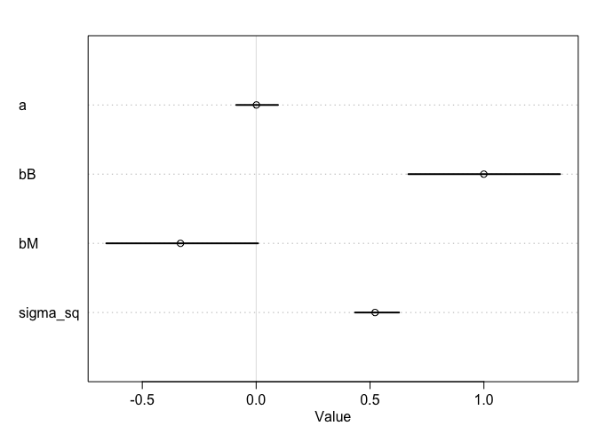
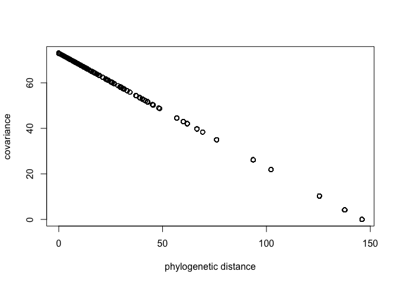

```r
library(rethinking)
```

```
## Loading required package: rstan
```

```
## Loading required package: StanHeaders
```

```
## Loading required package: ggplot2
```

```
## rstan (Version 2.19.3, GitRev: 2e1f913d3ca3)
```

```
## For execution on a local, multicore CPU with excess RAM we recommend calling
## options(mc.cores = parallel::detectCores()).
## To avoid recompilation of unchanged Stan programs, we recommend calling
## rstan_options(auto_write = TRUE)
```

```
## Loading required package: parallel
```

```
## Loading required package: dagitty
```

```
## rethinking (Version 1.92)
```

```
## 
## Attaching package: 'rethinking'
```

```
## The following object is masked from 'package:stats':
## 
##     rstudent
```

## 14M5


```r
data("Primates301")
data("Primates301_nex")
d <- Primates301 
d$name <- as.character(d$name)
dstan <- d[ complete.cases( d$group_size , d$body , d$brain ) , ]
spp_obs <- dstan$name
```

### No phylogenetic information

```r
dat_list <- list( 
  N_spp = nrow(dstan),
  M = standardize(log(dstan$body)),
  B = standardize(log(dstan$brain)),
  G = standardize(log(dstan$group_size)),
  Imat = diag( nrow(dstan) )
)
m14M5_1 <- ulam(
  alist(
    G ~ multi_normal( mu , SIGMA ),
    mu <- a + bM*M + bB*B,
    matrix[N_spp,N_spp]: SIGMA <- Imat * sigma_sq,
    a ~ normal( 0 , 1 ),
    c(bM,bB) ~ normal( 0 , 0.5 ),
    sigma_sq ~ exponential( 1 )
  ), data=dat_list , chains=4 , cores=4 )
```

```
## Trying to compile a simple C file
```

```
## Running /Library/Frameworks/R.framework/Resources/bin/R CMD SHLIB foo.c
## clang -I"/Library/Frameworks/R.framework/Resources/include" -DNDEBUG   -I"/Library/Frameworks/R.framework/Versions/3.6/Resources/library/Rcpp/include/"  -I"/Library/Frameworks/R.framework/Versions/3.6/Resources/library/RcppEigen/include/"  -I"/Library/Frameworks/R.framework/Versions/3.6/Resources/library/RcppEigen/include/unsupported"  -I"/Library/Frameworks/R.framework/Versions/3.6/Resources/library/BH/include" -I"/Library/Frameworks/R.framework/Versions/3.6/Resources/library/StanHeaders/include/src/"  -I"/Library/Frameworks/R.framework/Versions/3.6/Resources/library/StanHeaders/include/"  -I"/Library/Frameworks/R.framework/Versions/3.6/Resources/library/rstan/include" -DEIGEN_NO_DEBUG  -D_REENTRANT  -DBOOST_DISABLE_ASSERTS -DBOOST_PENDING_INTEGER_LOG2_HPP -include stan/math/prim/mat/fun/Eigen.hpp   -isysroot /Library/Developer/CommandLineTools/SDKs/MacOSX.sdk -I/usr/local/include  -fPIC  -Wall -g -O2  -c foo.c -o foo.o
## In file included from <built-in>:1:
## In file included from /Library/Frameworks/R.framework/Versions/3.6/Resources/library/StanHeaders/include/stan/math/prim/mat/fun/Eigen.hpp:13:
## In file included from /Library/Frameworks/R.framework/Versions/3.6/Resources/library/RcppEigen/include/Eigen/Dense:1:
## In file included from /Library/Frameworks/R.framework/Versions/3.6/Resources/library/RcppEigen/include/Eigen/Core:88:
## /Library/Frameworks/R.framework/Versions/3.6/Resources/library/RcppEigen/include/Eigen/src/Core/util/Macros.h:613:1: error: unknown type name 'namespace'
## namespace Eigen {
## ^
## /Library/Frameworks/R.framework/Versions/3.6/Resources/library/RcppEigen/include/Eigen/src/Core/util/Macros.h:613:16: error: expected ';' after top level declarator
## namespace Eigen {
##                ^
##                ;
## In file included from <built-in>:1:
## In file included from /Library/Frameworks/R.framework/Versions/3.6/Resources/library/StanHeaders/include/stan/math/prim/mat/fun/Eigen.hpp:13:
## In file included from /Library/Frameworks/R.framework/Versions/3.6/Resources/library/RcppEigen/include/Eigen/Dense:1:
## /Library/Frameworks/R.framework/Versions/3.6/Resources/library/RcppEigen/include/Eigen/Core:96:10: fatal error: 'complex' file not found
## #include <complex>
##          ^~~~~~~~~
## 3 errors generated.
## make: *** [foo.o] Error 1
```

```r
precis( m14M5_1 )
```

```
##                  mean         sd        5.5%       94.5%    n_eff     Rhat
## a         0.001102919 0.05672548 -0.08750239 0.095669840 1237.015 1.000550
## bB        0.999671102 0.20680557  0.66833093 1.334470836 1073.469 1.000442
## bM       -0.332352828 0.20739474 -0.65810606 0.008091357 1048.761 1.001293
## sigma_sq  0.522206676 0.06175518  0.43433956 0.627633649 1329.748 1.000268
```


```r
plot(precis( m14M5_1 ))
```

<!-- -->

> Negatively correlated with brain size; positively correlated with body size. 

### With phylogenetic information

#### Calculate phylogentic distancee

```r
library(ape)
```

```
## 
## Attaching package: 'ape'
```

```
## The following object is masked from 'package:dagitty':
## 
##     edges
```

```r
tree_trimmed <- keep.tip( Primates301_nex, spp_obs )
Rbm <- corBrownian( phy=tree_trimmed )
V <- vcv(Rbm)
Dmat <- cophenetic( tree_trimmed )
plot( Dmat , V , xlab="phylogenetic distance" , ylab="covariance" )
```

<!-- -->

> Linear


```r
# put species in right order
dat_list$V <- V[ spp_obs , spp_obs ]
# convert to correlation matrix
dat_list$R <- dat_list$V / max(V)
# Brownian motion model
m14M5_2 <- ulam(
  alist(
    G ~ multi_normal( mu , SIGMA ),
    mu <- a + bM*M + bB*B,
    matrix[N_spp,N_spp]: SIGMA <- R * sigma_sq,
    a ~ normal( 0 , 1 ),
    c(bM,bB) ~ normal( 0 , 0.5 ),
    sigma_sq ~ exponential( 1 )
  ), data=dat_list , chains=4 , cores=4 )
```

```
## Trying to compile a simple C file
```

```
## Running /Library/Frameworks/R.framework/Resources/bin/R CMD SHLIB foo.c
## clang -I"/Library/Frameworks/R.framework/Resources/include" -DNDEBUG   -I"/Library/Frameworks/R.framework/Versions/3.6/Resources/library/Rcpp/include/"  -I"/Library/Frameworks/R.framework/Versions/3.6/Resources/library/RcppEigen/include/"  -I"/Library/Frameworks/R.framework/Versions/3.6/Resources/library/RcppEigen/include/unsupported"  -I"/Library/Frameworks/R.framework/Versions/3.6/Resources/library/BH/include" -I"/Library/Frameworks/R.framework/Versions/3.6/Resources/library/StanHeaders/include/src/"  -I"/Library/Frameworks/R.framework/Versions/3.6/Resources/library/StanHeaders/include/"  -I"/Library/Frameworks/R.framework/Versions/3.6/Resources/library/rstan/include" -DEIGEN_NO_DEBUG  -D_REENTRANT  -DBOOST_DISABLE_ASSERTS -DBOOST_PENDING_INTEGER_LOG2_HPP -include stan/math/prim/mat/fun/Eigen.hpp   -isysroot /Library/Developer/CommandLineTools/SDKs/MacOSX.sdk -I/usr/local/include  -fPIC  -Wall -g -O2  -c foo.c -o foo.o
## In file included from <built-in>:1:
## In file included from /Library/Frameworks/R.framework/Versions/3.6/Resources/library/StanHeaders/include/stan/math/prim/mat/fun/Eigen.hpp:13:
## In file included from /Library/Frameworks/R.framework/Versions/3.6/Resources/library/RcppEigen/include/Eigen/Dense:1:
## In file included from /Library/Frameworks/R.framework/Versions/3.6/Resources/library/RcppEigen/include/Eigen/Core:88:
## /Library/Frameworks/R.framework/Versions/3.6/Resources/library/RcppEigen/include/Eigen/src/Core/util/Macros.h:613:1: error: unknown type name 'namespace'
## namespace Eigen {
## ^
## /Library/Frameworks/R.framework/Versions/3.6/Resources/library/RcppEigen/include/Eigen/src/Core/util/Macros.h:613:16: error: expected ';' after top level declarator
## namespace Eigen {
##                ^
##                ;
## In file included from <built-in>:1:
## In file included from /Library/Frameworks/R.framework/Versions/3.6/Resources/library/StanHeaders/include/stan/math/prim/mat/fun/Eigen.hpp:13:
## In file included from /Library/Frameworks/R.framework/Versions/3.6/Resources/library/RcppEigen/include/Eigen/Dense:1:
## /Library/Frameworks/R.framework/Versions/3.6/Resources/library/RcppEigen/include/Eigen/Core:96:10: fatal error: 'complex' file not found
## #include <complex>
##          ^~~~~~~~~
## 3 errors generated.
## make: *** [foo.o] Error 1
```

```r
precis( m14M5_2 )
```

```
##                 mean        sd        5.5%     94.5%    n_eff      Rhat
## a        -0.46880434 0.5810080 -1.38751157 0.4464259 1557.783 0.9992514
## bB       -0.06841093 0.2643734 -0.48123919 0.3468605 1159.012 1.0005894
## bM        0.34088890 0.2218402 -0.01380676 0.6993797 1108.170 1.0012384
## sigma_sq  2.70671180 0.2973869  2.26943135 3.2010337 1504.859 1.0016936
```

> Stronger positive correlation with body size, nearly non brain size effect. 


## 14H2

```r
data(Oxboys)
head(Oxboys)
```

```
##   Subject     age height Occasion
## 1       1 -1.0000  140.5        1
## 2       1 -0.7479  143.4        2
## 3       1 -0.4630  144.8        3
## 4       1 -0.1643  147.1        4
## 5       1 -0.0027  147.7        5
## 6       1  0.2466  150.2        6
```

```r
d = list(
  height = Oxboys$height,
  age = Oxboys$age,
  subject = Oxboys$Subject)

m14H2 <- ulam( 
  alist(
    height ~ normal( mu , sigma ),
    mu <- a_sub[subject] + b_sub[subject]*age,
    c(a_sub,b_sub)[subject] ~ multi_normal( c(a,b) , Rho , sigma_subject),
    a ~ normal(149,5),
    b ~ normal(0,1),
    sigma_subject ~ exponential(1),
    sigma ~ exponential(1),
    Rho ~ lkj_corr(2)
  ) , data=d , chains=4 , cores=4 , log_lik = TRUE)
```

```
## Trying to compile a simple C file
```

```
## Running /Library/Frameworks/R.framework/Resources/bin/R CMD SHLIB foo.c
## clang -I"/Library/Frameworks/R.framework/Resources/include" -DNDEBUG   -I"/Library/Frameworks/R.framework/Versions/3.6/Resources/library/Rcpp/include/"  -I"/Library/Frameworks/R.framework/Versions/3.6/Resources/library/RcppEigen/include/"  -I"/Library/Frameworks/R.framework/Versions/3.6/Resources/library/RcppEigen/include/unsupported"  -I"/Library/Frameworks/R.framework/Versions/3.6/Resources/library/BH/include" -I"/Library/Frameworks/R.framework/Versions/3.6/Resources/library/StanHeaders/include/src/"  -I"/Library/Frameworks/R.framework/Versions/3.6/Resources/library/StanHeaders/include/"  -I"/Library/Frameworks/R.framework/Versions/3.6/Resources/library/rstan/include" -DEIGEN_NO_DEBUG  -D_REENTRANT  -DBOOST_DISABLE_ASSERTS -DBOOST_PENDING_INTEGER_LOG2_HPP -include stan/math/prim/mat/fun/Eigen.hpp   -isysroot /Library/Developer/CommandLineTools/SDKs/MacOSX.sdk -I/usr/local/include  -fPIC  -Wall -g -O2  -c foo.c -o foo.o
## In file included from <built-in>:1:
## In file included from /Library/Frameworks/R.framework/Versions/3.6/Resources/library/StanHeaders/include/stan/math/prim/mat/fun/Eigen.hpp:13:
## In file included from /Library/Frameworks/R.framework/Versions/3.6/Resources/library/RcppEigen/include/Eigen/Dense:1:
## In file included from /Library/Frameworks/R.framework/Versions/3.6/Resources/library/RcppEigen/include/Eigen/Core:88:
## /Library/Frameworks/R.framework/Versions/3.6/Resources/library/RcppEigen/include/Eigen/src/Core/util/Macros.h:613:1: error: unknown type name 'namespace'
## namespace Eigen {
## ^
## /Library/Frameworks/R.framework/Versions/3.6/Resources/library/RcppEigen/include/Eigen/src/Core/util/Macros.h:613:16: error: expected ';' after top level declarator
## namespace Eigen {
##                ^
##                ;
## In file included from <built-in>:1:
## In file included from /Library/Frameworks/R.framework/Versions/3.6/Resources/library/StanHeaders/include/stan/math/prim/mat/fun/Eigen.hpp:13:
## In file included from /Library/Frameworks/R.framework/Versions/3.6/Resources/library/RcppEigen/include/Eigen/Dense:1:
## /Library/Frameworks/R.framework/Versions/3.6/Resources/library/RcppEigen/include/Eigen/Core:96:10: fatal error: 'complex' file not found
## #include <complex>
##          ^~~~~~~~~
## 3 errors generated.
## make: *** [foo.o] Error 1
```

```
## Warning: The largest R-hat is NA, indicating chains have not mixed.
## Running the chains for more iterations may help. See
## http://mc-stan.org/misc/warnings.html#r-hat
```

```
## Warning: Bulk Effective Samples Size (ESS) is too low, indicating posterior means and medians may be unreliable.
## Running the chains for more iterations may help. See
## http://mc-stan.org/misc/warnings.html#bulk-ess
```

```
## Warning: Tail Effective Samples Size (ESS) is too low, indicating posterior variances and tail quantiles may be unreliable.
## Running the chains for more iterations may help. See
## http://mc-stan.org/misc/warnings.html#tail-ess
```


```r
precis(m14H2, depth = 3)
```

```
##                         mean           sd        5.5%      94.5%    n_eff
## b_sub[1]           7.1088970 3.364997e-01   6.5630147   7.647000 3769.474
## b_sub[2]           5.4387043 3.358537e-01   4.9124700   5.966956 4453.398
## b_sub[3]           4.8776375 3.387746e-01   4.3300278   5.413746 3997.917
## b_sub[4]           9.2877465 3.399933e-01   8.7369874   9.816286 4503.560
## b_sub[5]           6.2504546 3.354482e-01   5.7029011   6.786102 4324.901
## b_sub[6]           4.0597588 3.270334e-01   3.5472722   4.586108 3483.006
## b_sub[7]           5.0350228 3.316435e-01   4.5035182   5.571586 5639.331
## b_sub[8]           6.4336747 3.278314e-01   5.9161484   6.951108 4952.355
## b_sub[9]           5.9378095 3.388071e-01   5.4036490   6.488532 5872.893
## b_sub[10]          3.7227632 3.446847e-01   3.1603090   4.267344 4028.509
## b_sub[11]          8.3773463 3.354601e-01   7.8472036   8.918802 3650.644
## b_sub[12]          7.0180256 3.531821e-01   6.4588789   7.566084 5187.304
## b_sub[13]          8.4069403 3.339200e-01   7.8963186   8.949314 4720.894
## b_sub[14]          8.5872132 3.350672e-01   8.0531493   9.119679 3691.470
## b_sub[15]          7.0272038 3.291388e-01   6.5247623   7.557908 3699.594
## b_sub[16]          4.6147735 3.486473e-01   4.0662965   5.159484 4632.713
## b_sub[17]          8.4292532 3.220068e-01   7.9092075   8.949888 3879.950
## b_sub[18]          5.9783836 3.296848e-01   5.4410607   6.500959 3270.370
## b_sub[19]          8.9997988 3.303209e-01   8.4649513   9.522336 4273.928
## b_sub[20]          4.4874454 3.560766e-01   3.9304403   5.069739 4762.167
## b_sub[21]          7.4142788 3.342477e-01   6.8807625   7.948854 4582.592
## b_sub[22]          8.0090091 3.292077e-01   7.4861005   8.535727 4498.369
## b_sub[23]          7.1276306 3.362155e-01   6.5749610   7.673181 5205.882
## b_sub[24]          6.7484505 3.388697e-01   6.2169875   7.288428 5856.496
## b_sub[25]          4.0569878 3.226286e-01   3.5576905   4.568711 4544.513
## b_sub[26]          5.5293520 3.386433e-01   5.0111923   6.075834 5088.149
## a_sub[1]         148.1284170 2.296615e-01 147.7583533 148.490886 6525.627
## a_sub[2]         142.8604724 2.210528e-01 142.5050798 143.210049 4154.158
## a_sub[3]         155.6320934 2.202704e-01 155.2811065 155.980298 4347.133
## a_sub[4]         165.0604761 2.320494e-01 164.6915073 165.424563 4347.146
## a_sub[5]         151.4168022 2.224860e-01 151.0586390 151.779896 4656.312
## a_sub[6]         146.7813557 2.158034e-01 146.4209871 147.125145 4609.070
## a_sub[7]         146.1224205 2.107946e-01 145.7894187 146.450713 4144.698
## a_sub[8]         148.2903036 2.181673e-01 147.9388363 148.635035 4512.598
## a_sub[9]         138.1564263 2.285066e-01 137.7968408 138.530393 3632.949
## a_sub[10]        130.2749785 2.157760e-01 129.9248948 130.613756 4405.227
## a_sub[11]        150.0577119 2.198707e-01 149.6958611 150.414601 3458.317
## a_sub[12]        156.7954241 2.223857e-01 156.4460674 157.148596 4944.711
## a_sub[13]        156.0657740 2.207652e-01 155.7224056 156.406862 4762.676
## a_sub[14]        159.4650807 2.156220e-01 159.1112281 159.804974 4479.591
## a_sub[15]        144.2869422 2.186599e-01 143.9432975 144.632690 6116.909
## a_sub[16]        147.5444077 2.281812e-01 147.1757104 147.901862 4426.410
## a_sub[17]        142.9919462 2.226529e-01 142.6313205 143.345619 5937.044
## a_sub[18]        151.1757866 2.181753e-01 150.8263316 151.521052 4899.584
## a_sub[19]        164.5624546 2.235853e-01 164.2122233 164.914392 5314.549
## a_sub[20]        151.4596804 2.128101e-01 151.1317119 151.799741 4072.230
## a_sub[21]        150.5254151 2.151997e-01 150.1864244 150.862086 4771.972
## a_sub[22]        154.5660155 2.084827e-01 154.2313127 154.902296 4240.952
## a_sub[23]        151.0704435 2.201532e-01 150.7151842 151.436667 5150.816
## a_sub[24]        153.1356711 2.241632e-01 152.7711686 153.492245 4599.905
## a_sub[25]        139.2145694 2.316584e-01 138.8341805 139.580761 4145.056
## a_sub[26]        138.0098158 2.256750e-01 137.6429923 138.366252 5561.487
## a                147.9210643 1.458678e+00 145.5248179 150.146812 2607.390
## b                  5.8219587 3.762258e-01   5.1586779   6.378170 1983.780
## sigma_subject[1]   7.3856095 8.595706e-01   6.1350329   8.857476 2538.434
## sigma_subject[2]   1.7539127 2.647515e-01   1.3856188   2.219662 1986.477
## sigma              0.6634021 3.446234e-02   0.6100678   0.720150 2155.111
## Rho[1,1]           1.0000000 0.000000e+00   1.0000000   1.000000      NaN
## Rho[1,2]           0.5293210 1.302350e-01   0.3045470   0.712618 2445.828
## Rho[2,1]           0.5293210 1.302350e-01   0.3045470   0.712618 2445.828
## Rho[2,2]           1.0000000 7.677729e-17   1.0000000   1.000000 1772.428
##                       Rhat
## b_sub[1]         0.9984544
## b_sub[2]         0.9990013
## b_sub[3]         0.9996656
## b_sub[4]         0.9986146
## b_sub[5]         0.9995004
## b_sub[6]         0.9986942
## b_sub[7]         0.9986242
## b_sub[8]         0.9989976
## b_sub[9]         0.9990430
## b_sub[10]        0.9988023
## b_sub[11]        0.9989455
## b_sub[12]        0.9987151
## b_sub[13]        0.9987349
## b_sub[14]        0.9985165
## b_sub[15]        0.9985536
## b_sub[16]        0.9988167
## b_sub[17]        0.9990679
## b_sub[18]        0.9996577
## b_sub[19]        0.9990971
## b_sub[20]        0.9991392
## b_sub[21]        0.9987419
## b_sub[22]        0.9984833
## b_sub[23]        0.9987104
## b_sub[24]        0.9987371
## b_sub[25]        1.0003547
## b_sub[26]        0.9986979
## a_sub[1]         0.9987567
## a_sub[2]         0.9995534
## a_sub[3]         0.9984274
## a_sub[4]         0.9992724
## a_sub[5]         1.0004555
## a_sub[6]         0.9980444
## a_sub[7]         0.9990930
## a_sub[8]         0.9996429
## a_sub[9]         0.9990939
## a_sub[10]        0.9989846
## a_sub[11]        0.9988369
## a_sub[12]        0.9987193
## a_sub[13]        0.9991244
## a_sub[14]        0.9984156
## a_sub[15]        0.9991007
## a_sub[16]        0.9983034
## a_sub[17]        0.9987334
## a_sub[18]        0.9982585
## a_sub[19]        0.9986873
## a_sub[20]        0.9993871
## a_sub[21]        0.9982339
## a_sub[22]        0.9984123
## a_sub[23]        0.9987798
## a_sub[24]        0.9985872
## a_sub[25]        0.9984326
## a_sub[26]        0.9988925
## a                0.9989978
## b                1.0001868
## sigma_subject[1] 0.9993680
## sigma_subject[2] 0.9998708
## sigma            0.9993161
## Rho[1,1]               NaN
## Rho[1,2]         0.9996404
## Rho[2,1]         0.9996404
## Rho[2,2]         0.9979980
```

> How to see how much variaton is explained by each variable??

## 14H3:

There is positive correlation between intercepts (Rho[1,2]). Taller boys tend to also grow faster...?

