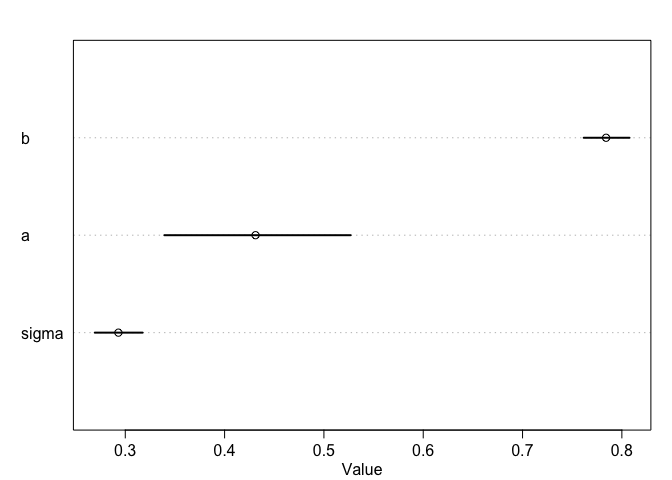
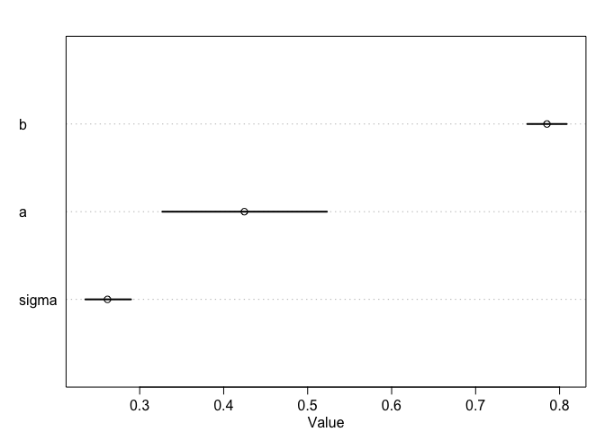
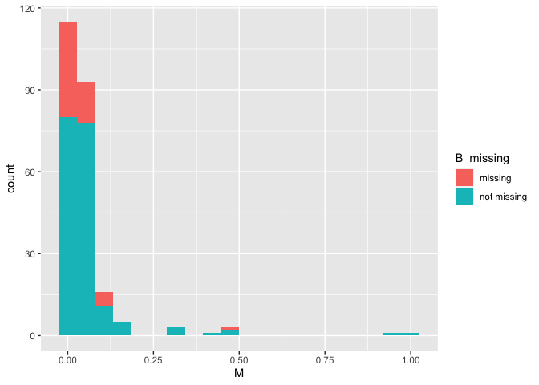
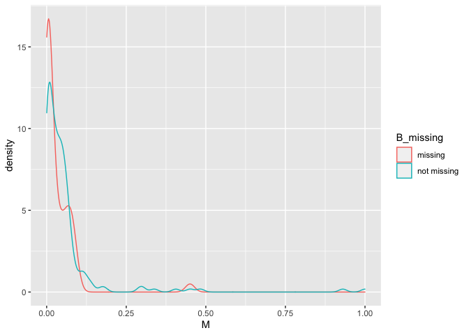
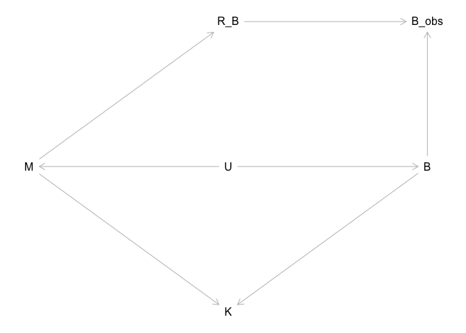
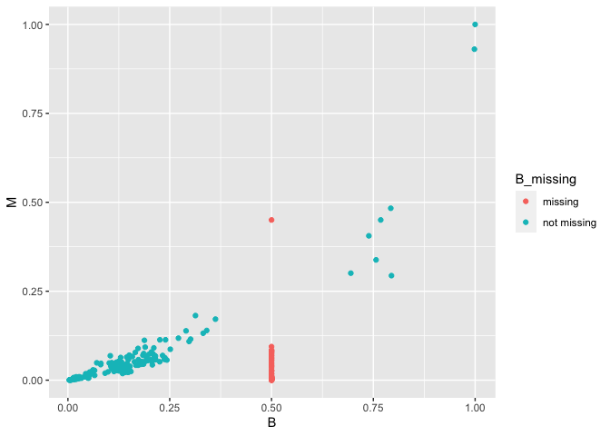
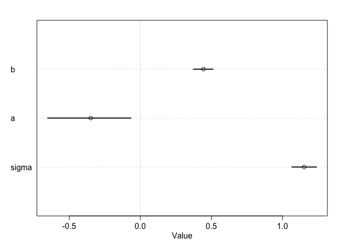

## Question 1


```r
library(rethinking)
```

```
## Loading required package: rstan
```

```
## Loading required package: StanHeaders
```

```
## Loading required package: ggplot2
```

```
## rstan (Version 2.19.3, GitRev: 2e1f913d3ca3)
```

```
## For execution on a local, multicore CPU with excess RAM we recommend calling
## options(mc.cores = parallel::detectCores()).
## To avoid recompilation of unchanged Stan programs, we recommend calling
## rstan_options(auto_write = TRUE)
```

```
## Loading required package: parallel
```

```
## Loading required package: dagitty
```

```
## rethinking (Version 1.92)
```

```
## 
## Attaching package: 'rethinking'
```

```
## The following object is masked from 'package:stats':
## 
##     rstudent
```

```r
data(Primates301)
d = Primates301
cc = complete.cases(d$brain, d$body)

B = d$brain[cc]
M = d$body[cc]
B = B/max(B)
M = M/max(M)
Bse = B*0.1
Mse = M*0.1
```


```r
dat_list = list(B = B, M = M)
m1.1 <- ulam(
  alist(
    B ~ dlnorm(mu, sigma),
    mu <- a + b*log(M),
    c(a,b) ~ normal(0,1),
    sigma ~ exponential(1)
  ), data = dat_list, cores = 4, chains = 4, log_lik = TRUE
)
```

```
## Trying to compile a simple C file
```

```
## Running /Library/Frameworks/R.framework/Resources/bin/R CMD SHLIB foo.c
## clang -I"/Library/Frameworks/R.framework/Resources/include" -DNDEBUG   -I"/Library/Frameworks/R.framework/Versions/3.6/Resources/library/Rcpp/include/"  -I"/Library/Frameworks/R.framework/Versions/3.6/Resources/library/RcppEigen/include/"  -I"/Library/Frameworks/R.framework/Versions/3.6/Resources/library/RcppEigen/include/unsupported"  -I"/Library/Frameworks/R.framework/Versions/3.6/Resources/library/BH/include" -I"/Library/Frameworks/R.framework/Versions/3.6/Resources/library/StanHeaders/include/src/"  -I"/Library/Frameworks/R.framework/Versions/3.6/Resources/library/StanHeaders/include/"  -I"/Library/Frameworks/R.framework/Versions/3.6/Resources/library/rstan/include" -DEIGEN_NO_DEBUG  -D_REENTRANT  -DBOOST_DISABLE_ASSERTS -DBOOST_PENDING_INTEGER_LOG2_HPP -include stan/math/prim/mat/fun/Eigen.hpp   -isysroot /Library/Developer/CommandLineTools/SDKs/MacOSX.sdk -I/usr/local/include  -fPIC  -Wall -g -O2  -c foo.c -o foo.o
## In file included from <built-in>:1:
## In file included from /Library/Frameworks/R.framework/Versions/3.6/Resources/library/StanHeaders/include/stan/math/prim/mat/fun/Eigen.hpp:13:
## In file included from /Library/Frameworks/R.framework/Versions/3.6/Resources/library/RcppEigen/include/Eigen/Dense:1:
## In file included from /Library/Frameworks/R.framework/Versions/3.6/Resources/library/RcppEigen/include/Eigen/Core:88:
## /Library/Frameworks/R.framework/Versions/3.6/Resources/library/RcppEigen/include/Eigen/src/Core/util/Macros.h:613:1: error: unknown type name 'namespace'
## namespace Eigen {
## ^
## /Library/Frameworks/R.framework/Versions/3.6/Resources/library/RcppEigen/include/Eigen/src/Core/util/Macros.h:613:16: error: expected ';' after top level declarator
## namespace Eigen {
##                ^
##                ;
## In file included from <built-in>:1:
## In file included from /Library/Frameworks/R.framework/Versions/3.6/Resources/library/StanHeaders/include/stan/math/prim/mat/fun/Eigen.hpp:13:
## In file included from /Library/Frameworks/R.framework/Versions/3.6/Resources/library/RcppEigen/include/Eigen/Dense:1:
## /Library/Frameworks/R.framework/Versions/3.6/Resources/library/RcppEigen/include/Eigen/Core:96:10: fatal error: 'complex' file not found
## #include <complex>
##          ^~~~~~~~~
## 3 errors generated.
## make: *** [foo.o] Error 1
```

```r
plot(precis(m1.1))
```

<!-- -->


```r
dat_list2 = list(B = B, M = M, Bse = Bse, Mse = Mse, N = length(B))
m1.2 <- ulam(
  alist(
    B ~ dnorm( B_est, Bse),
    vector[N]:B_est ~ dlnorm(mu, sigma),
    mu <- a + b*log(M_est[i]),
    M ~ dnorm(M_est, Mse),
    vector[N]:M_est ~ dexp(5),
    c(a,b) ~ normal(0,1),
    sigma ~ exponential(1)
  ), data = dat_list2, cores = 4, chains = 4, log_lik = TRUE
)
```

```
## Trying to compile a simple C file
```

```
## Running /Library/Frameworks/R.framework/Resources/bin/R CMD SHLIB foo.c
## clang -I"/Library/Frameworks/R.framework/Resources/include" -DNDEBUG   -I"/Library/Frameworks/R.framework/Versions/3.6/Resources/library/Rcpp/include/"  -I"/Library/Frameworks/R.framework/Versions/3.6/Resources/library/RcppEigen/include/"  -I"/Library/Frameworks/R.framework/Versions/3.6/Resources/library/RcppEigen/include/unsupported"  -I"/Library/Frameworks/R.framework/Versions/3.6/Resources/library/BH/include" -I"/Library/Frameworks/R.framework/Versions/3.6/Resources/library/StanHeaders/include/src/"  -I"/Library/Frameworks/R.framework/Versions/3.6/Resources/library/StanHeaders/include/"  -I"/Library/Frameworks/R.framework/Versions/3.6/Resources/library/rstan/include" -DEIGEN_NO_DEBUG  -D_REENTRANT  -DBOOST_DISABLE_ASSERTS -DBOOST_PENDING_INTEGER_LOG2_HPP -include stan/math/prim/mat/fun/Eigen.hpp   -isysroot /Library/Developer/CommandLineTools/SDKs/MacOSX.sdk -I/usr/local/include  -fPIC  -Wall -g -O2  -c foo.c -o foo.o
## In file included from <built-in>:1:
## In file included from /Library/Frameworks/R.framework/Versions/3.6/Resources/library/StanHeaders/include/stan/math/prim/mat/fun/Eigen.hpp:13:
## In file included from /Library/Frameworks/R.framework/Versions/3.6/Resources/library/RcppEigen/include/Eigen/Dense:1:
## In file included from /Library/Frameworks/R.framework/Versions/3.6/Resources/library/RcppEigen/include/Eigen/Core:88:
## /Library/Frameworks/R.framework/Versions/3.6/Resources/library/RcppEigen/include/Eigen/src/Core/util/Macros.h:613:1: error: unknown type name 'namespace'
## namespace Eigen {
## ^
## /Library/Frameworks/R.framework/Versions/3.6/Resources/library/RcppEigen/include/Eigen/src/Core/util/Macros.h:613:16: error: expected ';' after top level declarator
## namespace Eigen {
##                ^
##                ;
## In file included from <built-in>:1:
## In file included from /Library/Frameworks/R.framework/Versions/3.6/Resources/library/StanHeaders/include/stan/math/prim/mat/fun/Eigen.hpp:13:
## In file included from /Library/Frameworks/R.framework/Versions/3.6/Resources/library/RcppEigen/include/Eigen/Dense:1:
## /Library/Frameworks/R.framework/Versions/3.6/Resources/library/RcppEigen/include/Eigen/Core:96:10: fatal error: 'complex' file not found
## #include <complex>
##          ^~~~~~~~~
## 3 errors generated.
## make: *** [foo.o] Error 1
```

```r
plot(precis(m1.2, deepth = 1))
```

```
## 364 vector or matrix parameters hidden. Use depth=2 to show them.
```

<!-- -->


```r
compare(m1.1, m1.2)
```

```
##               WAIC        pWAIC        dWAIC weight           SE          dSE
## m1.1 -8.694465e+02 2.563857e+00 0.000000e+00      1 3.779243e+01           NA
## m1.2  1.700443e+13 8.502027e+12 1.700443e+13      0 8.652678e+12 8.676547e+12
```


## Question 2


```r
cc = complete.cases(d$body)
M = d$body[cc]
M = M/max(M)
B = d$brain[cc]
B = B/max(B, na.rm = TRUE)
library(ggplot2)
plot_missing = data.frame(M = M, B = B, B_missing = ifelse(is.na(B), "missing", "not missing"))
ggplot(plot_missing, aes(x = M) ) +
  geom_histogram(aes(fill = B_missing), bins = 20)
```

<!-- -->


```r
ggplot(plot_missing, aes(x = M) ) +
  geom_density(aes(color = B_missing))
```

<!-- -->

> Maybe missing value enriched with smaller M...? That would make this a MAR scenario:


```r
library(dagitty)
library(ggdag)
```

```
## 
## Attaching package: 'ggdag'
```

```
## The following object is masked from 'package:stats':
## 
##     filter
```

```r
g = dagitty('dag{
  M [pos = "0,1"]
  U [pos = "1,1"]
  B [pos = "2,1"]
  R_B [pos = "1,0"]
  B_obs [pos = "2,0"]
  K [pos = "1,2"]

  M <- U -> B
  M -> K <- B
  M -> R_B -> B_obs <- B
            }')
plot(g)
```

<!-- -->

> Imputation:  


```r
plot_missing$B[is.na(plot_missing$B)] = 0.5
ggplot(plot_missing, aes(x = B, y = M)) +
  geom_jitter(aes(color = B_missing))
```

<!-- -->

> I really am not sure if I personally would use this imputation... I would probably just drop the missing values. 


```r
imp_dat = list(M = plot_missing$M, B = plot_missing$B)
m2.1 <- ulam(
  alist(
    B ~ dlnorm(mu, sigma),
    mu <- a + b*log(M),
    c(a,b) ~ normal(0,1),
    sigma ~ exponential(1)
  ), data = imp_dat, cores = 4, chains = 4, log_lik = TRUE
)
```

```
## Trying to compile a simple C file
```

```
## Running /Library/Frameworks/R.framework/Resources/bin/R CMD SHLIB foo.c
## clang -I"/Library/Frameworks/R.framework/Resources/include" -DNDEBUG   -I"/Library/Frameworks/R.framework/Versions/3.6/Resources/library/Rcpp/include/"  -I"/Library/Frameworks/R.framework/Versions/3.6/Resources/library/RcppEigen/include/"  -I"/Library/Frameworks/R.framework/Versions/3.6/Resources/library/RcppEigen/include/unsupported"  -I"/Library/Frameworks/R.framework/Versions/3.6/Resources/library/BH/include" -I"/Library/Frameworks/R.framework/Versions/3.6/Resources/library/StanHeaders/include/src/"  -I"/Library/Frameworks/R.framework/Versions/3.6/Resources/library/StanHeaders/include/"  -I"/Library/Frameworks/R.framework/Versions/3.6/Resources/library/rstan/include" -DEIGEN_NO_DEBUG  -D_REENTRANT  -DBOOST_DISABLE_ASSERTS -DBOOST_PENDING_INTEGER_LOG2_HPP -include stan/math/prim/mat/fun/Eigen.hpp   -isysroot /Library/Developer/CommandLineTools/SDKs/MacOSX.sdk -I/usr/local/include  -fPIC  -Wall -g -O2  -c foo.c -o foo.o
## In file included from <built-in>:1:
## In file included from /Library/Frameworks/R.framework/Versions/3.6/Resources/library/StanHeaders/include/stan/math/prim/mat/fun/Eigen.hpp:13:
## In file included from /Library/Frameworks/R.framework/Versions/3.6/Resources/library/RcppEigen/include/Eigen/Dense:1:
## In file included from /Library/Frameworks/R.framework/Versions/3.6/Resources/library/RcppEigen/include/Eigen/Core:88:
## /Library/Frameworks/R.framework/Versions/3.6/Resources/library/RcppEigen/include/Eigen/src/Core/util/Macros.h:613:1: error: unknown type name 'namespace'
## namespace Eigen {
## ^
## /Library/Frameworks/R.framework/Versions/3.6/Resources/library/RcppEigen/include/Eigen/src/Core/util/Macros.h:613:16: error: expected ';' after top level declarator
## namespace Eigen {
##                ^
##                ;
## In file included from <built-in>:1:
## In file included from /Library/Frameworks/R.framework/Versions/3.6/Resources/library/StanHeaders/include/stan/math/prim/mat/fun/Eigen.hpp:13:
## In file included from /Library/Frameworks/R.framework/Versions/3.6/Resources/library/RcppEigen/include/Eigen/Dense:1:
## /Library/Frameworks/R.framework/Versions/3.6/Resources/library/RcppEigen/include/Eigen/Core:96:10: fatal error: 'complex' file not found
## #include <complex>
##          ^~~~~~~~~
## 3 errors generated.
## make: *** [foo.o] Error 1
```

```r
plot(precis(m2.1))
```

<!-- -->


```r
compare(m1.1, m2.1)
```

```
## Warning in compare(m1.1, m2.1): Different numbers of observations found for at least two models.
## Model comparison is valid only for models fit to exactly the same observations.
## Number of observations for each model:
## m1.1 182 
## m2.1 238
```

```
## Warning in ic_ptw1 - ic_ptw2: longer object length is not a multiple of shorter
## object length
```

```
##           WAIC    pWAIC    dWAIC        weight       SE      dSE
## m1.1 -869.4465 2.563857   0.0000  1.000000e+00 37.79243       NA
## m2.1 -272.3661 4.032269 597.0803 2.216417e-130 50.00940 56.55741
```

> The original model is better. 
