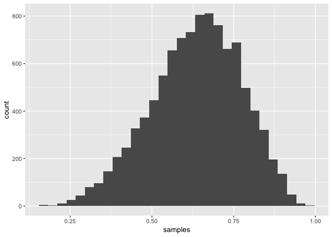
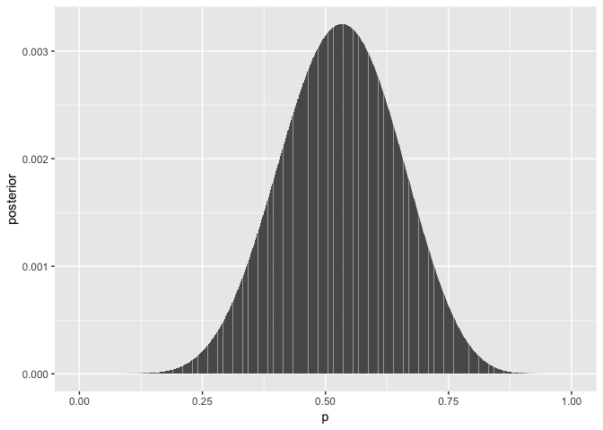
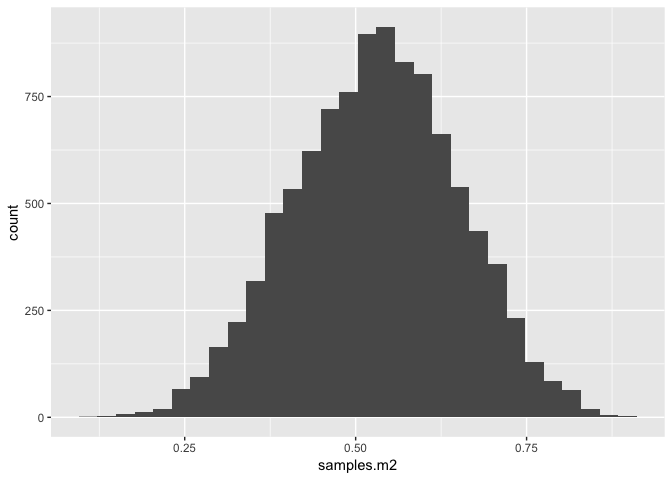
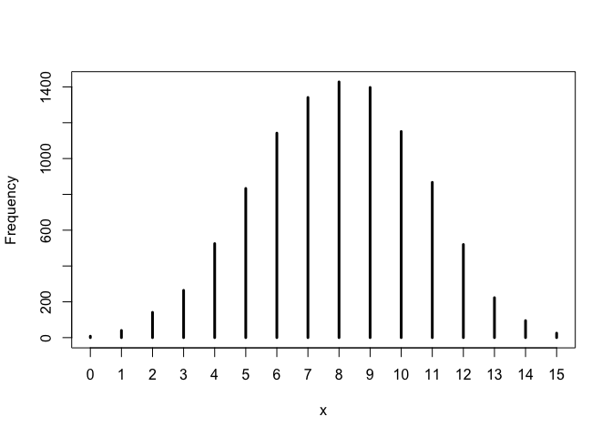
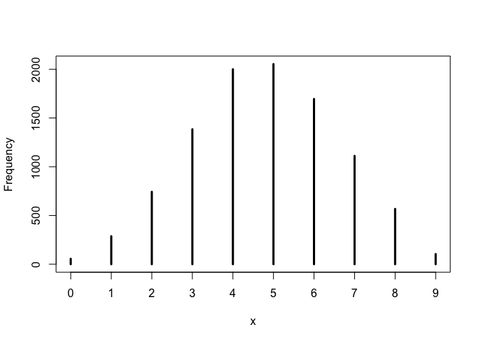

### Easy.   

These problems use the samples from the posterior distribution for the globe tossing example. This code will give you a specific set of samples, so that you can check your answers exactly.    

R code 3.27    

```r
p_grid <- seq(from=0 , to=1 , length.out=1000) 
prior <- rep(1 , 1000)
likelihood <- dbinom( 6 , size=9 , prob=p_grid )
posterior <- likelihood * prior
posterior <- posterior / sum(posterior)
set.seed(100)
samples <- sample( p_grid , prob=posterior , size=1e4 , replace=TRUE )
```

Use the values in samples to answer the questions that follow.   
#### 3E1. How much posterior probability lies below p = 0.2?   

```r
library(ggplot2)
ggplot(data.frame(samples), aes(x = samples)) +
  geom_histogram()
```

```
## `stat_bin()` using `bins = 30`. Pick better value with `binwidth`.
```

<!-- -->

```r
p_lt_0.2 = sum(samples < 0.2)/length(samples)
```

> 5\times 10^{-4} of posterior probability lies below p = 0.2.    

#### 3E2. How much posterior probability lies above p = 0.8?   


```r
p_gt_0.8 = sum(samples > 0.8)/length(samples)
```

> 0.1117 of posterior probability lies above p = 0.8.     

#### 3E3. How much posterior probability lies between p = 0.2 and p = 0.8?   


```r
p_gt_0.2_lt_0.8 = sum(samples > 0.2 & samples < 0.8)/length(samples)
```

> 0.8878 of posterior probability lies between p = 0.2 and p = 0.8.    

#### 3E4. 20% of the posterior probability lies below which value of p?   


```r
quant20 = quantile(samples, 0.2)
```

> 20% of the posterior probability lies below 0.5195195.   

#### 3E5. 20% of the posterior probability lies above which value of p?     


```r
quant80 = quantile(samples, 0.8)
```

> 20% of the posterior probability lies above 0.7567568.   

#### 3E6. Which values of p contain the narrowest interval equal to 66% of the posterior probability?     


```r
library(rethinking)
```

```
## Loading required package: rstan
```

```
## Loading required package: StanHeaders
```

```
## rstan (Version 2.18.2, GitRev: 2e1f913d3ca3)
```

```
## For execution on a local, multicore CPU with excess RAM we recommend calling
## options(mc.cores = parallel::detectCores()).
## To avoid recompilation of unchanged Stan programs, we recommend calling
## rstan_options(auto_write = TRUE)
```

```
## Loading required package: parallel
```

```
## rethinking (Version 1.88)
```

```r
HPDI66 = HPDI(samples , prob=0.66)
```

> (0.5205205, 0.7847848) contains the narrowest interval equal to 66% of the posterior probability.    

#### 3E7. Which values of p contain 66% of the posterior probability, assuming equal posterior probability both below and above the interval?    


```r
PI66 = PI(samples , prob=0.66)
```

> (0.5005005, 0.7687688) contains 66% of the posterior probability assuming equal posterior probability both below and above the interval.    


### Medium    
#### 3M1. Suppose the globe tossing data had turned out to be 8 water in 15 tosses. Construct the posterior distribution, using grid approximation. Use the same flat prior as before.    


```r
likelihood.m1 <- dbinom(8 , size=15 , prob=p_grid)
posterior.m1 <- likelihood.m1 * prior
posterior.m1 <- posterior.m1 / sum(posterior.m1)
ggplot(data.frame(posterior = posterior.m1, p = p_grid), aes(x = p, y = posterior)) +
  geom_col()
```

<!-- -->


#### 3M2. Draw 10,000 samples from the grid approximation from above. Then use the samples to calculate the 90% HPDI for p.   


```r
samples.m2 = sample( p_grid , prob=posterior.m1 , size=1e4 , replace=TRUE)
ggplot(data.frame(samples.m2), aes(x = samples.m2)) +
  geom_histogram()
```

```
## `stat_bin()` using `bins = 30`. Pick better value with `binwidth`.
```

<!-- -->

```r
HPDI90 = HPDI(samples.m2 , prob=0.90)
```

> (0.3383383, 0.7317317) is the 90% HPDI for p.    

#### 3M3. Construct a posterior predictive check for this model and data. This means simulate the distribution of samples, averaging over the posterior uncertainty in p. What is the probability of observing 8 water in 15 tosses?   


```r
w = rbinom(1e4 , size= 15, prob=samples.m2)
simplehist(w)
```

<!-- -->

```r
prob8 = sum(w == 8)/length(w)
```

> The probability of observing 8 water in 15 tosses is 0.1428.  

#### 3M4. Using the posterior distribution constructed from the new (8/15) data, now calculate the probability of observing 6 water in 9 tosses.      


```r
w4 = rbinom(1e4 , size= 9, prob=samples.m2)
simplehist(w4)
```

<!-- -->

```r
prob6 = sum(w4 == 6)/length(w4)
```

> The probability of observing 6 water in 9 tosses is 0.1695.  
