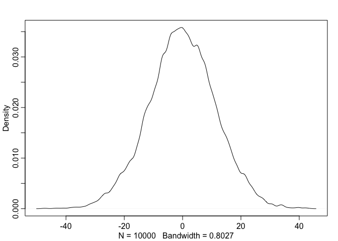

### Easy   

#### 4E1. In the model definition below, which line is the likelihood?   
$y_i$ ~ Normal($\mu$, $\sigma$)   
$\mu$ ~ Normal(0, 10)     
$\sigma$ ~ Uniform(0, 10)     

> The first line, $y_i$ ~ Normal($\mu$, $\sigma$)   

#### 4E2. In the model definition just above, how many parameters are in the posterior distribution?   

> Two, $\mu$ and $\sigma$.

#### 4E3. Using the model definition above, write down the appropriate form of Bayes’ theorem that
includes the proper likelihood and priors.    

P($\mu, \sigma$ | y) = $\frac{\Pi_i Normal(y_i|\mu, \sigma)Normal(\mu | 0, 10)Uniform(\sigma|0,10)}{\int \int \Pi_i Normal(y_i|\mu, \sigma)Normal(\mu | 0, 10)Uniform(\sigma|0,10)d\mu d\sigma}$

#### 4E4. In the model definition below, which line is the linear model?
$y_i$ ~ Normal($\mu$, $\sigma$)      
$\mu_i = \alpha + \beta x_i$   
$\alpha$ ~ Normal(0, 10)   
$\beta$ ~ Normal(0, 1)     
$\sigma$ ~ Uniform(0, 10)     

> The second line, $\mu_i = \alpha + \beta x_i$     

#### 4E5. In the model definition just above, how many parameters are in the posterior distribution?    

> Three, $\alpha$, $\beta$, and $\sigma$.    

### Medium    
#### 4M1. For the model definition below, simulate observed heights from the prior (not the posterior).      
$y_i$ ~ Normal($\mu$, $\sigma$)    
$\mu$ ~ Normal(0, 10)      
$\sigma$ ~ Uniform(0, 10)     


```r
library(rethinking)
```

```
## Loading required package: rstan
```

```
## Loading required package: ggplot2
```

```
## Loading required package: StanHeaders
```

```
## rstan (Version 2.18.2, GitRev: 2e1f913d3ca3)
```

```
## For execution on a local, multicore CPU with excess RAM we recommend calling
## options(mc.cores = parallel::detectCores()).
## To avoid recompilation of unchanged Stan programs, we recommend calling
## rstan_options(auto_write = TRUE)
```

```
## Loading required package: parallel
```

```
## rethinking (Version 1.88)
```

```r
sample_mu = rnorm(1e4, 0,10)
sample_sigma = runif(1e4, 0, 10)
prior_y = rnorm(1e4, sample_mu, sample_sigma)
dens(prior_y)
```

<!-- -->

#### 4M2. Translate the model just above into a quap formula.      

```r
ylist = alist(
  y ~ dnorm(mu, sigma), 
  mu ~ dnorm(0,10),
  sigma ~ dunif(0,10)
)
```

#### 4M3. Translate the quap model formula below into a mathematical model definition.    

```r
flist <- alist(
y ~ dnorm( mu , sigma ),
mu <- a + b*x,
a ~ dnorm( 0 , 50 ),
b ~ dunif( 0 , 10 ),
sigma ~ dunif( 0 , 50 )
)
```

$y_i$ ~ Normal($\mu$, $\sigma$)      
$\mu_i = \alpha + \beta x_i$   
$\alpha$ ~ Normal(0, 50)   
$\beta$ ~ Uniform(0, 10)      
$\sigma$ ~ Uniform(0, 50)   

#### 4M4. A sample of students is measured for height each year for 3 years. After the third year, you want to fit a linear regression predicting height using year as a predictor. Write down the mathematical model definition for this regression, using any variable names and priors you choose. Be prepared to defend your choice of priors.

$h_i$ ~ Normal($\mu$, $\sigma$), $H_i$: height of the i-th student;      
- I think it makes sense to believe that height follows a normal distribution;   
$\mu_i = \alpha + \beta y_i$ $Y_i$: year of the i-th student;   
- linear model that assumes linear relationship between average height and student year. *Only makes sense for younger students*;   
$\alpha$ ~ Normal(158, 4)   
- I looked up average high school student height. I think 158 is a good estimate. 158 +/- 2*4 should be able to capture all possible average heights for (high school) students;    
$\beta$ ~ log-normal(0, 1)     
- log-normal distribution to ensure positive correlation bewteen height and year;   
$\sigma$ ~ Uniform(0, 5)     
- idk... just a wild guess.  


