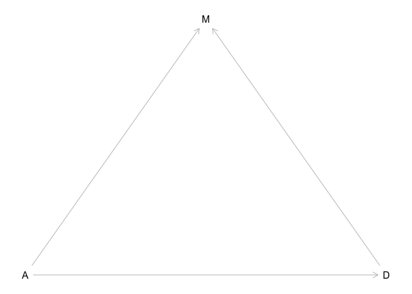
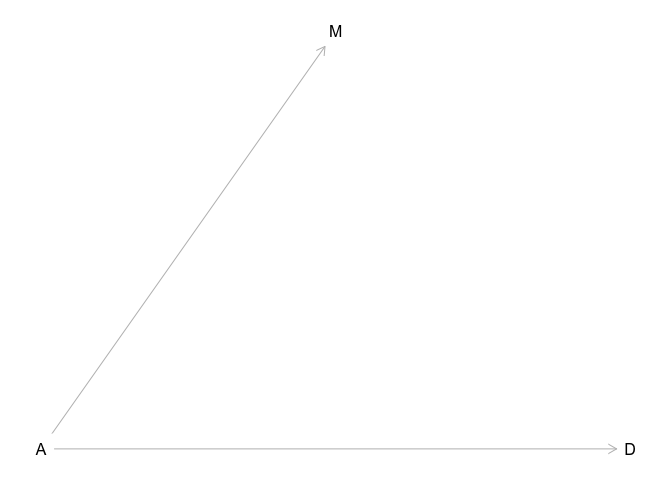
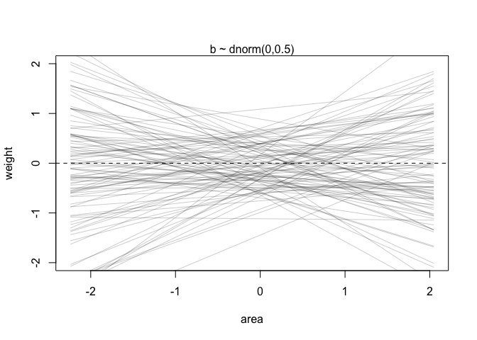
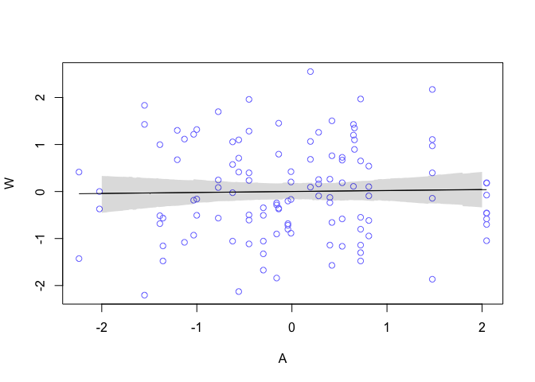
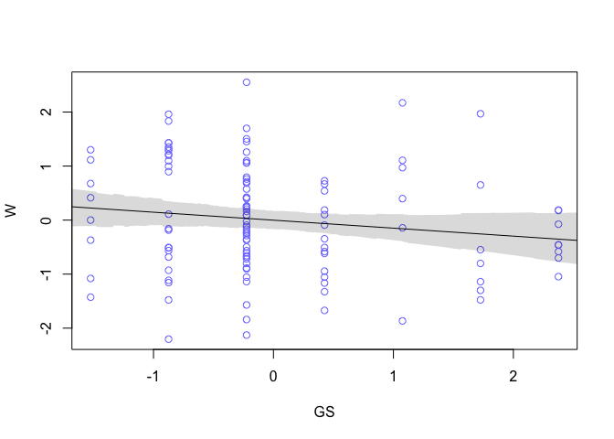
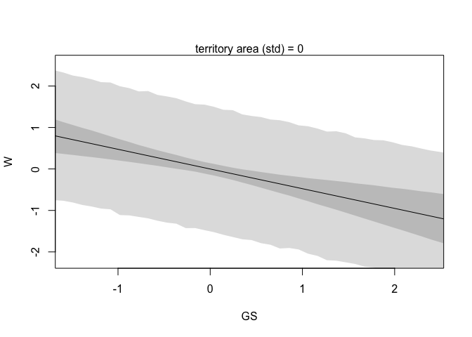

### Easy
#### 5E1. 
Which of the linear models below are multiple linear regressions?

$$
(1) \mu_i = \alpha + x_i \\
(2) \mu_i = \beta_xx_i + \beta_zz_i \\
(3) \mu_i = \alpha + \beta(x_i - z_i)\\
(4) \mu_i = \alpha + \beta_xx_i + \beta_zz_i
$$

> (2) and (4).  

#### 5E3. 
Write down a multiple regression to evaluate the claim: Neither amount of funding nor size of laboratory is by itself a good predictor of time to PhD degree; but together these variables are both positively associated with time to degree. Write down the model definition and indicate which side of zero each slope parameter should be on.

> $\mu_i = \beta(x_i \times z_i)$, $\beta$ is positive.  

### Medium   

#### 5M2. 
Invent your own example of a masked relationship. An outcome variable should be correlated with both predictor variables, but in opposite directions. And the two predictor variables should be correlated with one another.      

> The effect of climate change on photosynthesis rate: 

> Two predictor variables: higher atmospheric CO2 content ~ higher temperature. 
> Higher atmospheric CO2 = higher Rubisco activity = elevated photosynthesis level;
> Higher temperature = higher O2 affinity of Rubisco = higher rate of photorespiration = reduced photosynthesis level.    

#### 5M3. 
It is sometimes observed that the best predictor of fire risk is the presence of firefighters— States and localities with many firefighters also have more fires. Presumably firefighters do not cause fires. Nevertheless, this is not a spurious correlation. Instead fires cause firefighters. Consider the same reversal of causal inference in the context of the divorce and marriage data. How might a high divorce rate cause a higher marriage rate? Can you think of a way to evaluate this relationship, using multiple regression?    

> Divorce causes re-marriage. If all marriages are logged equally, ie 1st, 2nd, 3rd etc. marriages all contribute equally to marriage rate, then high divorce rate causes high marriage rate.   

> Since we already know that age of marriage has causal correlation with divorce rate, to evaluate the causal relationship bewtween divorce rate and marriage rate, we can to test this DAG:    
A -> M, D -> M, A -> D     
against this DAG:     
A -> M, A -> D


```r
library(dagitty)
dag5m3.0 <- dagitty( "dag {
A -> M
D -> M
A -> D
}")
coordinates(dag5m3.0) <- list( x=c(A=0,D=2,M=1) , y=c(A=1,D=1,M=0) )
plot( dag5m3.0 )
```

<!-- -->


```r
dag5m3.1 <- dagitty( "dag {
A -> M
A -> D
}")
coordinates(dag5m3.1) <- list( x=c(A=0,D=2,M=1) , y=c(A=1,D=1,M=0) )
plot( dag5m3.1 )
```

<!-- -->

> To do so we need to do regressions: 
1. M = $\beta_A$A  
2. M ~ $\beta_D$D   
3. M ~ $\beta_A$A + $\beta_D$D   

> If the third model makes $\beta_D$ disappear, we know there might not be causal correlation between divorce rate and marriage rate. If $\beta_D$ is still different from 0 in model 3, we might conclude that divorce rate has causal correlation with marriage rate.   

#### 5M4. 
In the divorce data, States with high numbers of Mormons (members of The Church of Jesus Christ of Latter-day Saints, LDS) have much lower divorce rates than the regression models expected. Find a list of LDS population by State and use those numbers as a predictor variable, predicting divorce rate using marriage rate, median age at marriage, and percent LDS population (possibly standardized). You may want to consider transformations of the raw percent LDS variable.     

Load and merge datasets: 

```r
library(rethinking)
```

```
## Loading required package: rstan
```

```
## Loading required package: ggplot2
```

```
## Loading required package: StanHeaders
```

```
## rstan (Version 2.18.2, GitRev: 2e1f913d3ca3)
```

```
## For execution on a local, multicore CPU with excess RAM we recommend calling
## options(mc.cores = parallel::detectCores()).
## To avoid recompilation of unchanged Stan programs, we recommend calling
## rstan_options(auto_write = TRUE)
```

```
## Loading required package: parallel
```

```
## rethinking (Version 1.88)
```

```r
data("WaffleDivorce")
d = WaffleDivorce
head(d)
```

```
##     Location Loc Population MedianAgeMarriage Marriage Marriage.SE Divorce
## 1    Alabama  AL       4.78              25.3     20.2        1.27    12.7
## 2     Alaska  AK       0.71              25.2     26.0        2.93    12.5
## 3    Arizona  AZ       6.33              25.8     20.3        0.98    10.8
## 4   Arkansas  AR       2.92              24.3     26.4        1.70    13.5
## 5 California  CA      37.25              26.8     19.1        0.39     8.0
## 6   Colorado  CO       5.03              25.7     23.5        1.24    11.6
##   Divorce.SE WaffleHouses South Slaves1860 Population1860 PropSlaves1860
## 1       0.79          128     1     435080         964201           0.45
## 2       2.05            0     0          0              0           0.00
## 3       0.74           18     0          0              0           0.00
## 4       1.22           41     1     111115         435450           0.26
## 5       0.24            0     0          0         379994           0.00
## 6       0.94           11     0          0          34277           0.00
```

```r
mormons = read.csv("/Users/rongkui/Desktop/StatisticalRethinking/RethinkingV2_Rongkui.Han/Mormons.csv", header = TRUE, stringsAsFactors = FALSE)
head(mormons)
```

```
##   Rank Location Percentage.of.Mormon.Residents
## 1    1     Utah                           0.68
## 2    2    Idaho                           0.26
## 3    3  Wyoming                           0.12
## 4    4   Nevada                           0.06
## 5    5  Arizona                           0.06
## 6    6   Hawaii                           0.05
```

```r
library(dplyr)
```

```
## 
## Attaching package: 'dplyr'
```

```
## The following objects are masked from 'package:stats':
## 
##     filter, lag
```

```
## The following objects are masked from 'package:base':
## 
##     intersect, setdiff, setequal, union
```

```r
dm = merge(d, mormons, by = "Location")
head(dm)
```

```
##     Location Loc Population MedianAgeMarriage Marriage Marriage.SE Divorce
## 1    Alabama  AL       4.78              25.3     20.2        1.27    12.7
## 2     Alaska  AK       0.71              25.2     26.0        2.93    12.5
## 3    Arizona  AZ       6.33              25.8     20.3        0.98    10.8
## 4   Arkansas  AR       2.92              24.3     26.4        1.70    13.5
## 5 California  CA      37.25              26.8     19.1        0.39     8.0
## 6   Colorado  CO       5.03              25.7     23.5        1.24    11.6
##   Divorce.SE WaffleHouses South Slaves1860 Population1860 PropSlaves1860
## 1       0.79          128     1     435080         964201           0.45
## 2       2.05            0     0          0              0           0.00
## 3       0.74           18     0          0              0           0.00
## 4       1.22           41     1     111115         435450           0.26
## 5       0.24            0     0          0         379994           0.00
## 6       0.94           11     0          0          34277           0.00
##   Rank Percentage.of.Mormon.Residents
## 1   30                           0.01
## 2    8                           0.05
## 3    5                           0.06
## 4   22                           0.01
## 5   13                           0.02
## 6   12                           0.03
```

```r
mormons$Location[(mormons$Location %in% dm$Location)==FALSE] #nevada is not in the wattledivorce dataset. 
```

```
## [1] "Nevada"
```


```r
dm$D = scale(dm$Divorce)
dm$M = scale(dm$Marriage)
dm$A = scale(dm$MedianAgeMarriage)
dm$LDS = scale(dm$Percentage.of.Mormon.Residents)
dm = dm[,c("Location","D","M","A","LDS")]
head(dm)
```

```
##     Location          D           M          A         LDS
## 1    Alabama  1.6542053  0.02264406 -0.6062895 -0.23832741
## 2     Alaska  1.5443643  1.54980162 -0.6866993  0.15560220
## 3    Arizona  0.6107159  0.04897436 -0.2042408  0.25408460
## 4   Arkansas  2.0935693  1.65512283 -1.4103870 -0.23832741
## 5 California -0.9270579 -0.26698927  0.5998567 -0.13984501
## 6   Colorado  1.0500799  0.89154405 -0.2846505 -0.04136261
```


```r
m.5m3 = quap(
  alist(
    D ~ dnorm(mu, sigma),
    mu <- a + bM*M + bA*A + bL*LDS,
    a ~ dnorm(0,0.2),
    bM ~ dnorm(0,0.5),
    bA ~ dnorm(0,0.5),
    bL ~ dnorm(0,0.5),
    sigma ~ dexp(1)
  ), data = dm
)
precis(m.5m3)
```

```
##                mean         sd       5.5%      94.5%
## a     -1.999063e-07 0.09231445 -0.1475365  0.1475361
## bM     3.175340e-02 0.14805881 -0.2048732  0.2683800
## bA    -6.890474e-01 0.14527917 -0.9212316 -0.4568632
## bL    -3.030067e-01 0.12056156 -0.4956874 -0.1103261
## sigma  7.358356e-01 0.07306384  0.6190655  0.8526058
```
 

### Hard. 
All three exercises below use the same data, `data(foxes)` (part of `rethinking`). The urban fox (*Vulpes vulpes*) is a successful exploiter of human habitat. Since urban foxes move in packs and defend territories, data on habitat quality and population density is also included. The data frame has five columns:   
(1) group: Number of the social group the individual fox belongs to   
(2) avgfood: The average amount of food available in the territory   
(3) groupsize: The number of foxes in the social group   
(4) area: Size of the territory   
(5) weight: Body weight of the individual fox   
   
#### 5H1. 
Fit two bivariate Gaussian regressions, using quap: (1) body weight as a linear function of territory size (area), and (2) body weight as a linear function of groupsize. Plot the results of these regressions, displaying the MAP regression line and the 95% interval of the mean. Is either variable important for predicting fox body weight?   


```r
data("foxes")
head(foxes)
```

```
##   group avgfood groupsize area weight
## 1     1    0.37         2 1.09   5.02
## 2     1    0.37         2 1.09   2.84
## 3     2    0.53         2 2.05   5.33
## 4     2    0.53         2 2.05   6.07
## 5     3    0.49         2 2.12   5.85
## 6     3    0.49         2 2.12   3.25
```

```r
foxes$W = scale(foxes$weight)
foxes$A = scale(foxes$area)
foxes$GS = scale(foxes$groupsize)
```

(1) W ~ A:    
Prior predictive simulation:    

```r
set.seed(2971)
N = 100 # 100 lines
a_sim = rnorm(N , 0 , 0.5)
b_sim = rnorm(N , 0 , 0.5)
plot(NULL , xlim=range(foxes$A) , ylim=c(-2,2), xlab="area" , ylab="weight")
abline(h=0 , lty=2)
abline(h=272 , lty=1 , lwd=0.5)
mtext("b ~ dnorm(0,0.5)")
xbar = mean(foxes$A)
for (i in 1:N) {
  curve(a_sim[i] + b_sim[i]*(x - xbar), from=min(foxes$A), to=max(foxes$A), add=TRUE, col=col.alpha("black",0.2))
  }
```

<!-- -->

Calculate posterior:

```r
m.5h1.1 = quap(
  alist(
    W ~ dnorm(mu, sigma),
    mu <- a + bA*A,
    a ~ dnorm(0, 0.5),
    bA ~ dnorm(0, 0.5),
    sigma ~ dexp(1)
  ), data = foxes)
precis(m.5h1.1)
```

```
##               mean         sd       5.5%     94.5%
## a     3.391627e-08 0.09051600 -0.1446620 0.1446621
## bA    1.883365e-02 0.09089578 -0.1264354 0.1641027
## sigma 9.912656e-01 0.06466641  0.8879162 1.0946150
```

Plot:

```r
post <- extract.samples( m.5h1.1 )
a_map <- mean(post$a)
bA_map <- mean(post$bA)
A_seq = seq(from = -2, to = 2, by = 0.01)
mu = link(m.5h1.1, data = data.frame(A = A_seq))
mu.mean = apply(mu, 2, mean)
mu.HPDI = apply(mu, 2, HPDI, prob = 0.95)
plot(W ~ A , data=foxes , col=rangi2)
lines(A_seq, mu.mean)
shade(mu.HPDI, A_seq)
curve( a_map + bA_map*(x - xbar) , add=TRUE )
```

<!-- -->

(2) W ~ GS:   
Calculate posterior:

```r
m.5h1.2 = quap(
  alist(
    W ~ dnorm(mu, sigma),
    mu <- a + bGS*GS,
    a ~ dnorm(0, 0.5),
    bGS ~ dnorm(0, 0.5),
    sigma ~ dexp(1)
  ), data = foxes)
precis(m.5h1.2)
```

```
##                mean         sd       5.5%       94.5%
## a     -4.405074e-05 0.08940762 -0.1429347  0.14284659
## bGS   -1.558095e-01 0.08978541 -0.2993039 -0.01231505
## sigma  9.787239e-01 0.06386842  0.8766498  1.08079797
```

Plot:

```r
post2 <- extract.samples(m.5h1.2)
a_map <- mean(post2$a)
bGS_map <- mean(post2$bGS)
GS_seq = seq(from = -2, to = 3, by = 0.01)
mu2 = link(m.5h1.2, data = data.frame(GS = GS_seq))
mu2.mean = apply(mu2, 2, mean)
mu2.HPDI = apply(mu2, 2, HPDI, prob = 0.95)
xbar = mean(foxes$GS)
plot(W ~ GS , data=foxes , col=rangi2)
lines(GS_seq, mu2.mean)
shade(mu2.HPDI, GS_seq)
```

<!-- -->

> Group size is important.  

#### 5H2. 
Now fit a multiple linear regression with weight as the outcome and both area and groupsize as predictor variables. Plot the predictions of the model for each predictor, holding the other predictor constant at its mean. What does this model say about the importance of each variable? Why do you get different results than you got in the exercise just above?    


```r
m.5h2 = quap(
  alist(
    W ~ dnorm(mu, sigma),
    mu <- a + bA*A + bGS*GS,
    a ~ dnorm(0, 0.5),
    bA ~ dnorm(0, 0.5),
    bGS ~ dnorm(0, 0.5),
    sigma ~ dexp(1)
  ), data = foxes)
precis(m.5h2)
```

```
##                mean         sd       5.5%      94.5%
## a     -1.281704e-06 0.08614653 -0.1376801  0.1376775
## bA     4.058461e-01 0.14535817  0.1735357  0.6381565
## bGS   -4.819843e-01 0.14536827 -0.7143109 -0.2496577
## sigma  9.419121e-01 0.06158864  0.8434816  1.0403427
```

Holding territory area as constant:   

```r
# prepare new counterfactual data
GS_seq = seq(from=-2 , to=3 , length.out=50)
pred_data = data.frame( GS = GS_seq , A = 0 )
# compute counterfactual mean divorce (mu)
mu_counter <- link( m.5h2 , data=pred_data )
mu_mean_counter <- apply( mu_counter , 2 , mean )
mu_PI_counter <- apply( mu_counter , 2 , PI )
# simulate counterfactual divorce outcomes
W_sim <- sim( m.5h2 , data=pred_data , n=1e4 )
W_PI <- apply( W_sim , 2 , PI )
# display predictions, hiding raw data with type="n"
plot( W ~ GS , data=foxes , type="n" )
mtext( "territory area (std) = 0" )
lines(GS_seq , mu_mean_counter )
shade( mu_PI_counter , GS_seq )
shade( W_PI , GS_seq )
```

<!-- -->

Holding group size as constant:   

```r
# prepare new counterfactual data
A_seq = seq(from=-2 , to=3 , length.out=50)
pred_data2 = data.frame( GS = 0 , A = A_seq )
# compute counterfactual mean divorce (mu)
mu_counter2 <- link( m.5h2 , data=pred_data2 )
mu_mean_counter2 <- apply( mu_counter2 , 2 , mean )
mu_PI_counter2 <- apply( mu_counter2 , 2 , PI )
# simulate counterfactual divorce outcomes
W_sim2 <- sim( m.5h2 , data=pred_data2 , n=1e4 )
W_PI2 <- apply( W_sim2 , 2 , PI )
# display predictions, hiding raw data with type="n"
plot( W ~ A , data=foxes , type="n" )
mtext( "territory area (std) = 0" )
lines(A_seq , mu_mean_counter2 )
shade( mu_PI_counter2 , A_seq )
shade( W_PI2 , A_seq )
```

<!-- -->

> Masking effect between the two variables?
