### 8E4   
Explain the difference between the effective number of samples, n_eff as calculated by Stan, and the actual number of samples.    

> n_eff is usually smaller than the actual number of samples. It reduces the number of samples based on the level of autocorrelation betweeen consecutive samples.  

> n_eff can apparently be larger than the actual sample size becuase the sampling can be better than random. 

### 8M3    
Re-estimate one of the Stan models from the chapter, but at different numbers of warmup iterations.
Be sure to use the same number of sampling iterations in each case. Compare the n_eff
values. How much warmup is enough?    


```r
library(rethinking)
```

```
## Loading required package: rstan
```

```
## Loading required package: StanHeaders
```

```
## Loading required package: ggplot2
```

```
## rstan (Version 2.19.2, GitRev: 2e1f913d3ca3)
```

```
## For execution on a local, multicore CPU with excess RAM we recommend calling
## options(mc.cores = parallel::detectCores()).
## To avoid recompilation of unchanged Stan programs, we recommend calling
## rstan_options(auto_write = TRUE)
```

```
## Loading required package: parallel
```

```
## Loading required package: dagitty
```

```
## rethinking (Version 1.90)
```

```
## 
## Attaching package: 'rethinking'
```

```
## The following object is masked from 'package:stats':
## 
##     rstudent
```

```r
data(rugged)
d <- rugged
d$log_gdp <- log(d$rgdppc_2000)
dd <- d[ complete.cases(d$rgdppc_2000) , ]
dd$log_gdp_std <- dd$log_gdp / mean(dd$log_gdp)
dd$rugged_std <- dd$rugged / max(dd$rugged)
dd$cid <- ifelse( dd$cont_africa==1 , 1 , 2 )

dat_slim <- list(
  log_gdp_std = dd$log_gdp_std,
  rugged_std = dd$rugged_std,
  cid = as.integer( dd$cid )
)

m8m3.1 <- rethinking::ulam(
  alist(
    log_gdp_std ~ dnorm( mu , sigma ) ,
    mu <- a[cid] + b[cid]*( rugged_std - 0.215 ) ,
    a[cid] ~ dnorm( 1 , 0.1 ) ,
    b[cid] ~ dnorm( 0 , 0.3 ) ,
    sigma ~ dexp( 1 )
  ), data=dat_slim, chains=4, iter = 10000, warmup=1000, log_lik = TRUE)
```

```
## 
## SAMPLING FOR MODEL 'bb40ad6ecc73307845e2f6ff30698be8' NOW (CHAIN 1).
## Chain 1: 
## Chain 1: Gradient evaluation took 2.4e-05 seconds
## Chain 1: 1000 transitions using 10 leapfrog steps per transition would take 0.24 seconds.
## Chain 1: Adjust your expectations accordingly!
## Chain 1: 
## Chain 1: 
## Chain 1: Iteration:    1 / 10000 [  0%]  (Warmup)
## Chain 1: Iteration: 1000 / 10000 [ 10%]  (Warmup)
## Chain 1: Iteration: 1001 / 10000 [ 10%]  (Sampling)
## Chain 1: Iteration: 2000 / 10000 [ 20%]  (Sampling)
## Chain 1: Iteration: 3000 / 10000 [ 30%]  (Sampling)
## Chain 1: Iteration: 4000 / 10000 [ 40%]  (Sampling)
## Chain 1: Iteration: 5000 / 10000 [ 50%]  (Sampling)
## Chain 1: Iteration: 6000 / 10000 [ 60%]  (Sampling)
## Chain 1: Iteration: 7000 / 10000 [ 70%]  (Sampling)
## Chain 1: Iteration: 8000 / 10000 [ 80%]  (Sampling)
## Chain 1: Iteration: 9000 / 10000 [ 90%]  (Sampling)
## Chain 1: Iteration: 10000 / 10000 [100%]  (Sampling)
## Chain 1: 
## Chain 1:  Elapsed Time: 0.108748 seconds (Warm-up)
## Chain 1:                0.788225 seconds (Sampling)
## Chain 1:                0.896973 seconds (Total)
## Chain 1: 
## 
## SAMPLING FOR MODEL 'bb40ad6ecc73307845e2f6ff30698be8' NOW (CHAIN 2).
## Chain 2: 
## Chain 2: Gradient evaluation took 1.4e-05 seconds
## Chain 2: 1000 transitions using 10 leapfrog steps per transition would take 0.14 seconds.
## Chain 2: Adjust your expectations accordingly!
## Chain 2: 
## Chain 2: 
## Chain 2: Iteration:    1 / 10000 [  0%]  (Warmup)
## Chain 2: Iteration: 1000 / 10000 [ 10%]  (Warmup)
## Chain 2: Iteration: 1001 / 10000 [ 10%]  (Sampling)
## Chain 2: Iteration: 2000 / 10000 [ 20%]  (Sampling)
## Chain 2: Iteration: 3000 / 10000 [ 30%]  (Sampling)
## Chain 2: Iteration: 4000 / 10000 [ 40%]  (Sampling)
## Chain 2: Iteration: 5000 / 10000 [ 50%]  (Sampling)
## Chain 2: Iteration: 6000 / 10000 [ 60%]  (Sampling)
## Chain 2: Iteration: 7000 / 10000 [ 70%]  (Sampling)
## Chain 2: Iteration: 8000 / 10000 [ 80%]  (Sampling)
## Chain 2: Iteration: 9000 / 10000 [ 90%]  (Sampling)
## Chain 2: Iteration: 10000 / 10000 [100%]  (Sampling)
## Chain 2: 
## Chain 2:  Elapsed Time: 0.124678 seconds (Warm-up)
## Chain 2:                0.813442 seconds (Sampling)
## Chain 2:                0.93812 seconds (Total)
## Chain 2: 
## 
## SAMPLING FOR MODEL 'bb40ad6ecc73307845e2f6ff30698be8' NOW (CHAIN 3).
## Chain 3: 
## Chain 3: Gradient evaluation took 1.9e-05 seconds
## Chain 3: 1000 transitions using 10 leapfrog steps per transition would take 0.19 seconds.
## Chain 3: Adjust your expectations accordingly!
## Chain 3: 
## Chain 3: 
## Chain 3: Iteration:    1 / 10000 [  0%]  (Warmup)
## Chain 3: Iteration: 1000 / 10000 [ 10%]  (Warmup)
## Chain 3: Iteration: 1001 / 10000 [ 10%]  (Sampling)
## Chain 3: Iteration: 2000 / 10000 [ 20%]  (Sampling)
## Chain 3: Iteration: 3000 / 10000 [ 30%]  (Sampling)
## Chain 3: Iteration: 4000 / 10000 [ 40%]  (Sampling)
## Chain 3: Iteration: 5000 / 10000 [ 50%]  (Sampling)
## Chain 3: Iteration: 6000 / 10000 [ 60%]  (Sampling)
## Chain 3: Iteration: 7000 / 10000 [ 70%]  (Sampling)
## Chain 3: Iteration: 8000 / 10000 [ 80%]  (Sampling)
## Chain 3: Iteration: 9000 / 10000 [ 90%]  (Sampling)
## Chain 3: Iteration: 10000 / 10000 [100%]  (Sampling)
## Chain 3: 
## Chain 3:  Elapsed Time: 0.116323 seconds (Warm-up)
## Chain 3:                0.865475 seconds (Sampling)
## Chain 3:                0.981798 seconds (Total)
## Chain 3: 
## 
## SAMPLING FOR MODEL 'bb40ad6ecc73307845e2f6ff30698be8' NOW (CHAIN 4).
## Chain 4: 
## Chain 4: Gradient evaluation took 1.2e-05 seconds
## Chain 4: 1000 transitions using 10 leapfrog steps per transition would take 0.12 seconds.
## Chain 4: Adjust your expectations accordingly!
## Chain 4: 
## Chain 4: 
## Chain 4: Iteration:    1 / 10000 [  0%]  (Warmup)
## Chain 4: Iteration: 1000 / 10000 [ 10%]  (Warmup)
## Chain 4: Iteration: 1001 / 10000 [ 10%]  (Sampling)
## Chain 4: Iteration: 2000 / 10000 [ 20%]  (Sampling)
## Chain 4: Iteration: 3000 / 10000 [ 30%]  (Sampling)
## Chain 4: Iteration: 4000 / 10000 [ 40%]  (Sampling)
## Chain 4: Iteration: 5000 / 10000 [ 50%]  (Sampling)
## Chain 4: Iteration: 6000 / 10000 [ 60%]  (Sampling)
## Chain 4: Iteration: 7000 / 10000 [ 70%]  (Sampling)
## Chain 4: Iteration: 8000 / 10000 [ 80%]  (Sampling)
## Chain 4: Iteration: 9000 / 10000 [ 90%]  (Sampling)
## Chain 4: Iteration: 10000 / 10000 [100%]  (Sampling)
## Chain 4: 
## Chain 4:  Elapsed Time: 0.105283 seconds (Warm-up)
## Chain 4:                0.938963 seconds (Sampling)
## Chain 4:                1.04425 seconds (Total)
## Chain 4:
```

```r
show( m8m3.1 )
```

```
## Hamiltonian Monte Carlo approximation
## 36000 samples from 4 chains
## 
## Sampling durations (seconds):
##         warmup sample total
## chain:1   0.11   0.79  0.90
## chain:2   0.12   0.81  0.94
## chain:3   0.12   0.87  0.98
## chain:4   0.11   0.94  1.04
## 
## Formula:
## log_gdp_std ~ dnorm(mu, sigma)
## mu <- a[cid] + b[cid] * (rugged_std - 0.215)
## a[cid] ~ dnorm(1, 0.1)
## b[cid] ~ dnorm(0, 0.3)
## sigma ~ dexp(1)
```

```r
precis(m8m3.1)
```

```
## 4 vector or matrix parameters hidden. Use depth=2 to show them.
```

```
##            mean          sd      5.5%   94.5%    n_eff      Rhat
## sigma 0.1116241 0.006181097 0.1022533 0.12188 45531.36 0.9999781
```

```r
pairs(m8m3.1)
```

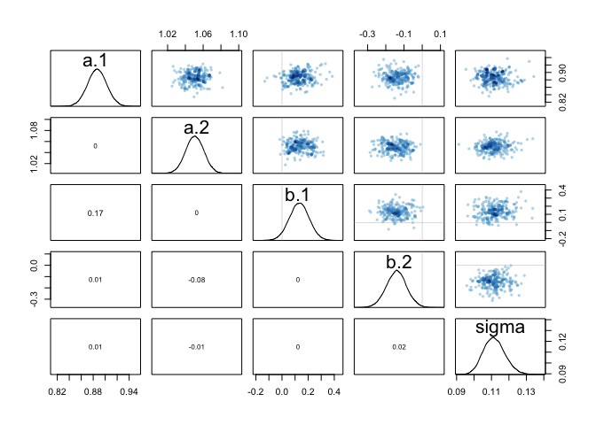<!-- -->


```r
m8m3.2 <- rethinking::ulam(
  alist(
    log_gdp_std ~ dnorm( mu , sigma ) ,
    mu <- a[cid] + b[cid]*( rugged_std - 0.215 ) ,
    a[cid] ~ dnorm( 1 , 0.1 ) ,
    b[cid] ~ dnorm( 0 , 0.3 ) ,
    sigma ~ dexp( 1 )
  ), data=dat_slim, chains=4, iter = 10000, warmup=2000, log_lik = TRUE)
```

```
## recompiling to avoid crashing R session
```

```
## 
## SAMPLING FOR MODEL 'bb40ad6ecc73307845e2f6ff30698be8' NOW (CHAIN 1).
## Chain 1: 
## Chain 1: Gradient evaluation took 3.9e-05 seconds
## Chain 1: 1000 transitions using 10 leapfrog steps per transition would take 0.39 seconds.
## Chain 1: Adjust your expectations accordingly!
## Chain 1: 
## Chain 1: 
## Chain 1: Iteration:    1 / 10000 [  0%]  (Warmup)
## Chain 1: Iteration: 1000 / 10000 [ 10%]  (Warmup)
## Chain 1: Iteration: 2000 / 10000 [ 20%]  (Warmup)
## Chain 1: Iteration: 2001 / 10000 [ 20%]  (Sampling)
## Chain 1: Iteration: 3000 / 10000 [ 30%]  (Sampling)
## Chain 1: Iteration: 4000 / 10000 [ 40%]  (Sampling)
## Chain 1: Iteration: 5000 / 10000 [ 50%]  (Sampling)
## Chain 1: Iteration: 6000 / 10000 [ 60%]  (Sampling)
## Chain 1: Iteration: 7000 / 10000 [ 70%]  (Sampling)
## Chain 1: Iteration: 8000 / 10000 [ 80%]  (Sampling)
## Chain 1: Iteration: 9000 / 10000 [ 90%]  (Sampling)
## Chain 1: Iteration: 10000 / 10000 [100%]  (Sampling)
## Chain 1: 
## Chain 1:  Elapsed Time: 0.204596 seconds (Warm-up)
## Chain 1:                0.79815 seconds (Sampling)
## Chain 1:                1.00275 seconds (Total)
## Chain 1: 
## 
## SAMPLING FOR MODEL 'bb40ad6ecc73307845e2f6ff30698be8' NOW (CHAIN 2).
## Chain 2: 
## Chain 2: Gradient evaluation took 1.4e-05 seconds
## Chain 2: 1000 transitions using 10 leapfrog steps per transition would take 0.14 seconds.
## Chain 2: Adjust your expectations accordingly!
## Chain 2: 
## Chain 2: 
## Chain 2: Iteration:    1 / 10000 [  0%]  (Warmup)
## Chain 2: Iteration: 1000 / 10000 [ 10%]  (Warmup)
## Chain 2: Iteration: 2000 / 10000 [ 20%]  (Warmup)
## Chain 2: Iteration: 2001 / 10000 [ 20%]  (Sampling)
## Chain 2: Iteration: 3000 / 10000 [ 30%]  (Sampling)
## Chain 2: Iteration: 4000 / 10000 [ 40%]  (Sampling)
## Chain 2: Iteration: 5000 / 10000 [ 50%]  (Sampling)
## Chain 2: Iteration: 6000 / 10000 [ 60%]  (Sampling)
## Chain 2: Iteration: 7000 / 10000 [ 70%]  (Sampling)
## Chain 2: Iteration: 8000 / 10000 [ 80%]  (Sampling)
## Chain 2: Iteration: 9000 / 10000 [ 90%]  (Sampling)
## Chain 2: Iteration: 10000 / 10000 [100%]  (Sampling)
## Chain 2: 
## Chain 2:  Elapsed Time: 0.214747 seconds (Warm-up)
## Chain 2:                0.787105 seconds (Sampling)
## Chain 2:                1.00185 seconds (Total)
## Chain 2: 
## 
## SAMPLING FOR MODEL 'bb40ad6ecc73307845e2f6ff30698be8' NOW (CHAIN 3).
## Chain 3: 
## Chain 3: Gradient evaluation took 1.2e-05 seconds
## Chain 3: 1000 transitions using 10 leapfrog steps per transition would take 0.12 seconds.
## Chain 3: Adjust your expectations accordingly!
## Chain 3: 
## Chain 3: 
## Chain 3: Iteration:    1 / 10000 [  0%]  (Warmup)
## Chain 3: Iteration: 1000 / 10000 [ 10%]  (Warmup)
## Chain 3: Iteration: 2000 / 10000 [ 20%]  (Warmup)
## Chain 3: Iteration: 2001 / 10000 [ 20%]  (Sampling)
## Chain 3: Iteration: 3000 / 10000 [ 30%]  (Sampling)
## Chain 3: Iteration: 4000 / 10000 [ 40%]  (Sampling)
## Chain 3: Iteration: 5000 / 10000 [ 50%]  (Sampling)
## Chain 3: Iteration: 6000 / 10000 [ 60%]  (Sampling)
## Chain 3: Iteration: 7000 / 10000 [ 70%]  (Sampling)
## Chain 3: Iteration: 8000 / 10000 [ 80%]  (Sampling)
## Chain 3: Iteration: 9000 / 10000 [ 90%]  (Sampling)
## Chain 3: Iteration: 10000 / 10000 [100%]  (Sampling)
## Chain 3: 
## Chain 3:  Elapsed Time: 0.200678 seconds (Warm-up)
## Chain 3:                0.753622 seconds (Sampling)
## Chain 3:                0.9543 seconds (Total)
## Chain 3: 
## 
## SAMPLING FOR MODEL 'bb40ad6ecc73307845e2f6ff30698be8' NOW (CHAIN 4).
## Chain 4: 
## Chain 4: Gradient evaluation took 1.4e-05 seconds
## Chain 4: 1000 transitions using 10 leapfrog steps per transition would take 0.14 seconds.
## Chain 4: Adjust your expectations accordingly!
## Chain 4: 
## Chain 4: 
## Chain 4: Iteration:    1 / 10000 [  0%]  (Warmup)
## Chain 4: Iteration: 1000 / 10000 [ 10%]  (Warmup)
## Chain 4: Iteration: 2000 / 10000 [ 20%]  (Warmup)
## Chain 4: Iteration: 2001 / 10000 [ 20%]  (Sampling)
## Chain 4: Iteration: 3000 / 10000 [ 30%]  (Sampling)
## Chain 4: Iteration: 4000 / 10000 [ 40%]  (Sampling)
## Chain 4: Iteration: 5000 / 10000 [ 50%]  (Sampling)
## Chain 4: Iteration: 6000 / 10000 [ 60%]  (Sampling)
## Chain 4: Iteration: 7000 / 10000 [ 70%]  (Sampling)
## Chain 4: Iteration: 8000 / 10000 [ 80%]  (Sampling)
## Chain 4: Iteration: 9000 / 10000 [ 90%]  (Sampling)
## Chain 4: Iteration: 10000 / 10000 [100%]  (Sampling)
## Chain 4: 
## Chain 4:  Elapsed Time: 0.199645 seconds (Warm-up)
## Chain 4:                0.743573 seconds (Sampling)
## Chain 4:                0.943218 seconds (Total)
## Chain 4:
```

```r
show( m8m3.2 )
```

```
## Hamiltonian Monte Carlo approximation
## 32000 samples from 4 chains
## 
## Sampling durations (seconds):
##         warmup sample total
## chain:1   0.20   0.80  1.00
## chain:2   0.21   0.79  1.00
## chain:3   0.20   0.75  0.95
## chain:4   0.20   0.74  0.94
## 
## Formula:
## log_gdp_std ~ dnorm(mu, sigma)
## mu <- a[cid] + b[cid] * (rugged_std - 0.215)
## a[cid] ~ dnorm(1, 0.1)
## b[cid] ~ dnorm(0, 0.3)
## sigma ~ dexp(1)
```

```r
precis(m8m3.2)
```

```
## 4 vector or matrix parameters hidden. Use depth=2 to show them.
```

```
##            mean          sd      5.5%     94.5%    n_eff     Rhat
## sigma 0.1115905 0.006127686 0.1022458 0.1217591 42774.87 1.000025
```

```r
pairs(m8m3.2)
```

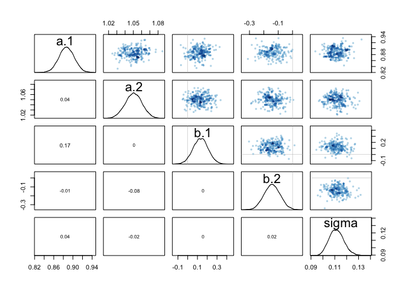<!-- -->


```r
m8m3.3 <- rethinking::ulam(
  alist(
    log_gdp_std ~ dnorm( mu , sigma ) ,
    mu <- a[cid] + b[cid]*( rugged_std - 0.215 ) ,
    a[cid] ~ dnorm( 1 , 0.1 ) ,
    b[cid] ~ dnorm( 0 , 0.3 ) ,
    sigma ~ dexp( 1 )
  ), data=dat_slim, chains=4, iter = 10000, warmup=5000, log_lik = TRUE)
```

```
## recompiling to avoid crashing R session
```

```
## 
## SAMPLING FOR MODEL 'bb40ad6ecc73307845e2f6ff30698be8' NOW (CHAIN 1).
## Chain 1: 
## Chain 1: Gradient evaluation took 4.3e-05 seconds
## Chain 1: 1000 transitions using 10 leapfrog steps per transition would take 0.43 seconds.
## Chain 1: Adjust your expectations accordingly!
## Chain 1: 
## Chain 1: 
## Chain 1: Iteration:    1 / 10000 [  0%]  (Warmup)
## Chain 1: Iteration: 1000 / 10000 [ 10%]  (Warmup)
## Chain 1: Iteration: 2000 / 10000 [ 20%]  (Warmup)
## Chain 1: Iteration: 3000 / 10000 [ 30%]  (Warmup)
## Chain 1: Iteration: 4000 / 10000 [ 40%]  (Warmup)
## Chain 1: Iteration: 5000 / 10000 [ 50%]  (Warmup)
## Chain 1: Iteration: 5001 / 10000 [ 50%]  (Sampling)
## Chain 1: Iteration: 6000 / 10000 [ 60%]  (Sampling)
## Chain 1: Iteration: 7000 / 10000 [ 70%]  (Sampling)
## Chain 1: Iteration: 8000 / 10000 [ 80%]  (Sampling)
## Chain 1: Iteration: 9000 / 10000 [ 90%]  (Sampling)
## Chain 1: Iteration: 10000 / 10000 [100%]  (Sampling)
## Chain 1: 
## Chain 1:  Elapsed Time: 0.507237 seconds (Warm-up)
## Chain 1:                0.476948 seconds (Sampling)
## Chain 1:                0.984185 seconds (Total)
## Chain 1: 
## 
## SAMPLING FOR MODEL 'bb40ad6ecc73307845e2f6ff30698be8' NOW (CHAIN 2).
## Chain 2: 
## Chain 2: Gradient evaluation took 1.3e-05 seconds
## Chain 2: 1000 transitions using 10 leapfrog steps per transition would take 0.13 seconds.
## Chain 2: Adjust your expectations accordingly!
## Chain 2: 
## Chain 2: 
## Chain 2: Iteration:    1 / 10000 [  0%]  (Warmup)
## Chain 2: Iteration: 1000 / 10000 [ 10%]  (Warmup)
## Chain 2: Iteration: 2000 / 10000 [ 20%]  (Warmup)
## Chain 2: Iteration: 3000 / 10000 [ 30%]  (Warmup)
## Chain 2: Iteration: 4000 / 10000 [ 40%]  (Warmup)
## Chain 2: Iteration: 5000 / 10000 [ 50%]  (Warmup)
## Chain 2: Iteration: 5001 / 10000 [ 50%]  (Sampling)
## Chain 2: Iteration: 6000 / 10000 [ 60%]  (Sampling)
## Chain 2: Iteration: 7000 / 10000 [ 70%]  (Sampling)
## Chain 2: Iteration: 8000 / 10000 [ 80%]  (Sampling)
## Chain 2: Iteration: 9000 / 10000 [ 90%]  (Sampling)
## Chain 2: Iteration: 10000 / 10000 [100%]  (Sampling)
## Chain 2: 
## Chain 2:  Elapsed Time: 0.488517 seconds (Warm-up)
## Chain 2:                0.478907 seconds (Sampling)
## Chain 2:                0.967424 seconds (Total)
## Chain 2: 
## 
## SAMPLING FOR MODEL 'bb40ad6ecc73307845e2f6ff30698be8' NOW (CHAIN 3).
## Chain 3: 
## Chain 3: Gradient evaluation took 1.5e-05 seconds
## Chain 3: 1000 transitions using 10 leapfrog steps per transition would take 0.15 seconds.
## Chain 3: Adjust your expectations accordingly!
## Chain 3: 
## Chain 3: 
## Chain 3: Iteration:    1 / 10000 [  0%]  (Warmup)
## Chain 3: Iteration: 1000 / 10000 [ 10%]  (Warmup)
## Chain 3: Iteration: 2000 / 10000 [ 20%]  (Warmup)
## Chain 3: Iteration: 3000 / 10000 [ 30%]  (Warmup)
## Chain 3: Iteration: 4000 / 10000 [ 40%]  (Warmup)
## Chain 3: Iteration: 5000 / 10000 [ 50%]  (Warmup)
## Chain 3: Iteration: 5001 / 10000 [ 50%]  (Sampling)
## Chain 3: Iteration: 6000 / 10000 [ 60%]  (Sampling)
## Chain 3: Iteration: 7000 / 10000 [ 70%]  (Sampling)
## Chain 3: Iteration: 8000 / 10000 [ 80%]  (Sampling)
## Chain 3: Iteration: 9000 / 10000 [ 90%]  (Sampling)
## Chain 3: Iteration: 10000 / 10000 [100%]  (Sampling)
## Chain 3: 
## Chain 3:  Elapsed Time: 0.487385 seconds (Warm-up)
## Chain 3:                0.508786 seconds (Sampling)
## Chain 3:                0.996171 seconds (Total)
## Chain 3: 
## 
## SAMPLING FOR MODEL 'bb40ad6ecc73307845e2f6ff30698be8' NOW (CHAIN 4).
## Chain 4: 
## Chain 4: Gradient evaluation took 4.3e-05 seconds
## Chain 4: 1000 transitions using 10 leapfrog steps per transition would take 0.43 seconds.
## Chain 4: Adjust your expectations accordingly!
## Chain 4: 
## Chain 4: 
## Chain 4: Iteration:    1 / 10000 [  0%]  (Warmup)
## Chain 4: Iteration: 1000 / 10000 [ 10%]  (Warmup)
## Chain 4: Iteration: 2000 / 10000 [ 20%]  (Warmup)
## Chain 4: Iteration: 3000 / 10000 [ 30%]  (Warmup)
## Chain 4: Iteration: 4000 / 10000 [ 40%]  (Warmup)
## Chain 4: Iteration: 5000 / 10000 [ 50%]  (Warmup)
## Chain 4: Iteration: 5001 / 10000 [ 50%]  (Sampling)
## Chain 4: Iteration: 6000 / 10000 [ 60%]  (Sampling)
## Chain 4: Iteration: 7000 / 10000 [ 70%]  (Sampling)
## Chain 4: Iteration: 8000 / 10000 [ 80%]  (Sampling)
## Chain 4: Iteration: 9000 / 10000 [ 90%]  (Sampling)
## Chain 4: Iteration: 10000 / 10000 [100%]  (Sampling)
## Chain 4: 
## Chain 4:  Elapsed Time: 0.510334 seconds (Warm-up)
## Chain 4:                0.506816 seconds (Sampling)
## Chain 4:                1.01715 seconds (Total)
## Chain 4:
```

```r
show( m8m3.3 )
```

```
## Hamiltonian Monte Carlo approximation
## 20000 samples from 4 chains
## 
## Sampling durations (seconds):
##         warmup sample total
## chain:1   0.51   0.48  0.98
## chain:2   0.49   0.48  0.97
## chain:3   0.49   0.51  1.00
## chain:4   0.51   0.51  1.02
## 
## Formula:
## log_gdp_std ~ dnorm(mu, sigma)
## mu <- a[cid] + b[cid] * (rugged_std - 0.215)
## a[cid] ~ dnorm(1, 0.1)
## b[cid] ~ dnorm(0, 0.3)
## sigma ~ dexp(1)
```

```r
precis(m8m3.3)
```

```
## 4 vector or matrix parameters hidden. Use depth=2 to show them.
```

```
##            mean          sd     5.5%     94.5%    n_eff      Rhat
## sigma 0.1116105 0.006128616 0.102279 0.1217701 27260.89 0.9998332
```

```r
pairs(m8m3.3)
```

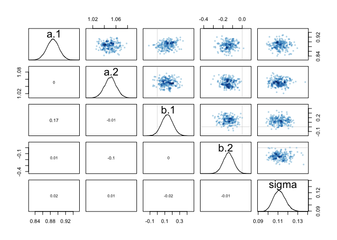<!-- -->


```r
traceplot(m8m3.1)
traceplot(m8m3.2)
```

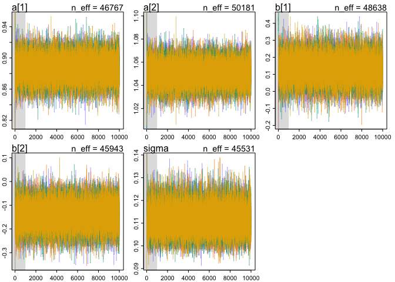<!-- -->

```r
traceplot(m8m3.3)
```

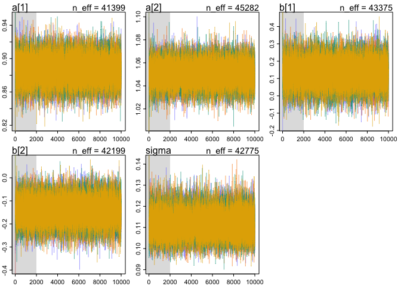<!-- -->

```r
trankplot(m8m3.1)
```

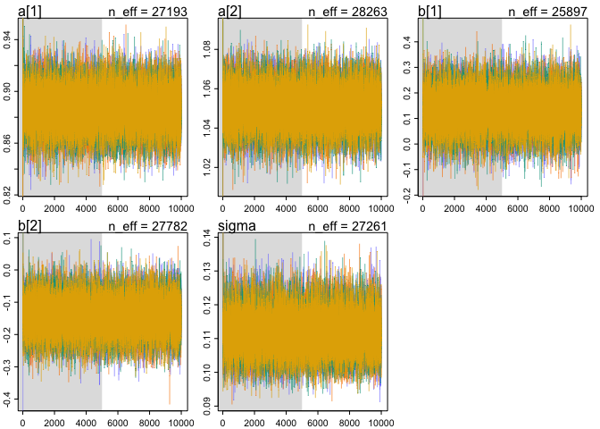<!-- -->

```r
trankplot(m8m3.2)
```

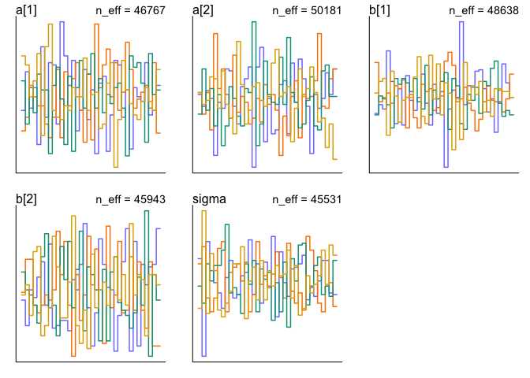<!-- -->

```r
trankplot(m8m3.3)
```

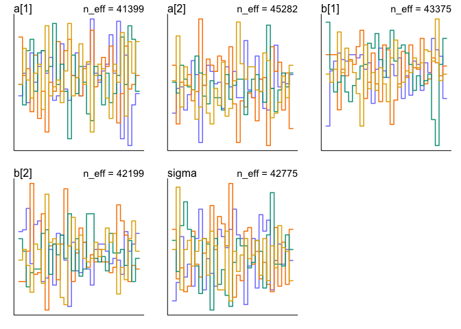<!-- -->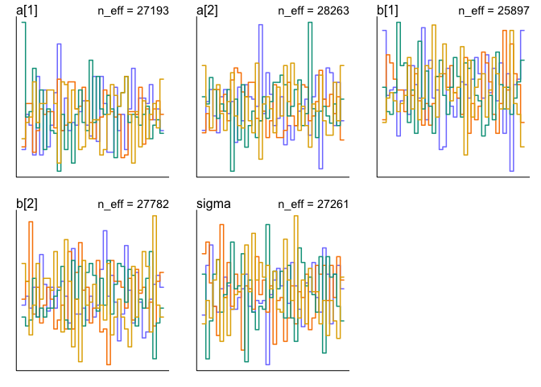<!-- -->


```r
compare(m8m3.1, m8m3.2, m8m3.3)
```

```
##             WAIC    pWAIC       dWAIC    weight       SE        dSE
## m8m3.3 -259.3486 4.902875 0.000000000 0.3390300 14.59814         NA
## m8m3.1 -259.3479 4.900408 0.000789828 0.3388962 14.59784 0.03475268
## m8m3.2 -259.2460 4.958931 0.102615839 0.3220738 14.61352 0.03198280
```


### 8H3    
Sometimes changing a prior for one parameter has unanticipated effects on other parameters.
This is because when a parameter is highly correlated with another parameter in the posterior, the prior influences both parameters. Here’s an example to work and think through.   
Go back to the leg length example in Chapter 5. Here is the code again, which simulates height and leg lengths for 100 imagined individuals:   


```r
N <- 100 # number of individuals
height <- rnorm(N,10,2) # sim total height of each
leg_prop <- runif(N,0.4,0.5) # leg as proportion of height
leg_left <- leg_prop*height + # sim left leg as proportion + error
rnorm( N , 0 , 0.02 )
leg_right <- leg_prop*height + # sim right leg as proportion + error
rnorm( N , 0 , 0.02 )
# combine into data frame
d <- data.frame(height,leg_left,leg_right)
```

And below is the model you fit before, resulting in a highly correlated posterior for the two beta parameters. This time, fit the model using map2stan:   

```r
m5.8s <- map2stan( 
  alist(
    height ~ dnorm( mu , sigma ) ,
    mu <- a + bl*leg_left + br*leg_right ,
    a ~ dnorm( 10 , 100 ) ,
    bl ~ dnorm( 2 , 10 ) ,
    br ~ dnorm( 2 , 10 ) ,
    sigma ~ dcauchy( 0 , 1 )
  ) ,
  data=d, chains=4, start=list(a=10,bl=0,br=0,sigma=1) )
```

```
## 
## SAMPLING FOR MODEL '8beb02c4b0e51feccf78f1b051630de6' NOW (CHAIN 1).
## Chain 1: 
## Chain 1: Gradient evaluation took 2e-05 seconds
## Chain 1: 1000 transitions using 10 leapfrog steps per transition would take 0.2 seconds.
## Chain 1: Adjust your expectations accordingly!
## Chain 1: 
## Chain 1: 
## Chain 1: Iteration:    1 / 2000 [  0%]  (Warmup)
## Chain 1: Iteration:  200 / 2000 [ 10%]  (Warmup)
## Chain 1: Iteration:  400 / 2000 [ 20%]  (Warmup)
## Chain 1: Iteration:  600 / 2000 [ 30%]  (Warmup)
## Chain 1: Iteration:  800 / 2000 [ 40%]  (Warmup)
## Chain 1: Iteration: 1000 / 2000 [ 50%]  (Warmup)
## Chain 1: Iteration: 1001 / 2000 [ 50%]  (Sampling)
## Chain 1: Iteration: 1200 / 2000 [ 60%]  (Sampling)
## Chain 1: Iteration: 1400 / 2000 [ 70%]  (Sampling)
## Chain 1: Iteration: 1600 / 2000 [ 80%]  (Sampling)
## Chain 1: Iteration: 1800 / 2000 [ 90%]  (Sampling)
## Chain 1: Iteration: 2000 / 2000 [100%]  (Sampling)
## Chain 1: 
## Chain 1:  Elapsed Time: 5.02116 seconds (Warm-up)
## Chain 1:                5.95062 seconds (Sampling)
## Chain 1:                10.9718 seconds (Total)
## Chain 1: 
## 
## SAMPLING FOR MODEL '8beb02c4b0e51feccf78f1b051630de6' NOW (CHAIN 2).
## Chain 2: 
## Chain 2: Gradient evaluation took 1.5e-05 seconds
## Chain 2: 1000 transitions using 10 leapfrog steps per transition would take 0.15 seconds.
## Chain 2: Adjust your expectations accordingly!
## Chain 2: 
## Chain 2: 
## Chain 2: Iteration:    1 / 2000 [  0%]  (Warmup)
## Chain 2: Iteration:  200 / 2000 [ 10%]  (Warmup)
## Chain 2: Iteration:  400 / 2000 [ 20%]  (Warmup)
## Chain 2: Iteration:  600 / 2000 [ 30%]  (Warmup)
## Chain 2: Iteration:  800 / 2000 [ 40%]  (Warmup)
## Chain 2: Iteration: 1000 / 2000 [ 50%]  (Warmup)
## Chain 2: Iteration: 1001 / 2000 [ 50%]  (Sampling)
## Chain 2: Iteration: 1200 / 2000 [ 60%]  (Sampling)
## Chain 2: Iteration: 1400 / 2000 [ 70%]  (Sampling)
## Chain 2: Iteration: 1600 / 2000 [ 80%]  (Sampling)
## Chain 2: Iteration: 1800 / 2000 [ 90%]  (Sampling)
## Chain 2: Iteration: 2000 / 2000 [100%]  (Sampling)
## Chain 2: 
## Chain 2:  Elapsed Time: 4.63335 seconds (Warm-up)
## Chain 2:                5.43358 seconds (Sampling)
## Chain 2:                10.0669 seconds (Total)
## Chain 2: 
## 
## SAMPLING FOR MODEL '8beb02c4b0e51feccf78f1b051630de6' NOW (CHAIN 3).
## Chain 3: 
## Chain 3: Gradient evaluation took 9e-06 seconds
## Chain 3: 1000 transitions using 10 leapfrog steps per transition would take 0.09 seconds.
## Chain 3: Adjust your expectations accordingly!
## Chain 3: 
## Chain 3: 
## Chain 3: Iteration:    1 / 2000 [  0%]  (Warmup)
## Chain 3: Iteration:  200 / 2000 [ 10%]  (Warmup)
## Chain 3: Iteration:  400 / 2000 [ 20%]  (Warmup)
## Chain 3: Iteration:  600 / 2000 [ 30%]  (Warmup)
## Chain 3: Iteration:  800 / 2000 [ 40%]  (Warmup)
## Chain 3: Iteration: 1000 / 2000 [ 50%]  (Warmup)
## Chain 3: Iteration: 1001 / 2000 [ 50%]  (Sampling)
## Chain 3: Iteration: 1200 / 2000 [ 60%]  (Sampling)
## Chain 3: Iteration: 1400 / 2000 [ 70%]  (Sampling)
## Chain 3: Iteration: 1600 / 2000 [ 80%]  (Sampling)
## Chain 3: Iteration: 1800 / 2000 [ 90%]  (Sampling)
## Chain 3: Iteration: 2000 / 2000 [100%]  (Sampling)
## Chain 3: 
## Chain 3:  Elapsed Time: 5.19701 seconds (Warm-up)
## Chain 3:                12.363 seconds (Sampling)
## Chain 3:                17.56 seconds (Total)
## Chain 3: 
## 
## SAMPLING FOR MODEL '8beb02c4b0e51feccf78f1b051630de6' NOW (CHAIN 4).
## Chain 4: 
## Chain 4: Gradient evaluation took 8.6e-05 seconds
## Chain 4: 1000 transitions using 10 leapfrog steps per transition would take 0.86 seconds.
## Chain 4: Adjust your expectations accordingly!
## Chain 4: 
## Chain 4: 
## Chain 4: Iteration:    1 / 2000 [  0%]  (Warmup)
## Chain 4: Iteration:  200 / 2000 [ 10%]  (Warmup)
## Chain 4: Iteration:  400 / 2000 [ 20%]  (Warmup)
## Chain 4: Iteration:  600 / 2000 [ 30%]  (Warmup)
## Chain 4: Iteration:  800 / 2000 [ 40%]  (Warmup)
## Chain 4: Iteration: 1000 / 2000 [ 50%]  (Warmup)
## Chain 4: Iteration: 1001 / 2000 [ 50%]  (Sampling)
## Chain 4: Iteration: 1200 / 2000 [ 60%]  (Sampling)
## Chain 4: Iteration: 1400 / 2000 [ 70%]  (Sampling)
## Chain 4: Iteration: 1600 / 2000 [ 80%]  (Sampling)
## Chain 4: Iteration: 1800 / 2000 [ 90%]  (Sampling)
## Chain 4: Iteration: 2000 / 2000 [100%]  (Sampling)
## Chain 4: 
## Chain 4:  Elapsed Time: 9.84159 seconds (Warm-up)
## Chain 4:                8.15124 seconds (Sampling)
## Chain 4:                17.9928 seconds (Total)
## Chain 4:
```

```
## Warning: There were 2317 transitions after warmup that exceeded the maximum treedepth. Increase max_treedepth above 10. See
## http://mc-stan.org/misc/warnings.html#maximum-treedepth-exceeded
```

```
## Warning: Examine the pairs() plot to diagnose sampling problems
```

```
## Computing WAIC
```

```r
pairs(m5.8s)
```

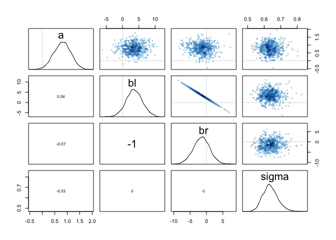<!-- -->

Compare the posterior distribution produced by the code above to the posterior distribution produced when you change the prior for br so that it is strictly positive:   

```r
m5.8s2 <- map2stan(
alist(
height ~ dnorm( mu , sigma ) ,
mu <- a + bl*leg_left + br*leg_right ,
a ~ dnorm( 10 , 100 ) ,
bl ~ dnorm( 2 , 10 ) ,
br ~ dnorm( 2 , 10 ) & T[0,] ,
sigma ~ dcauchy( 0 , 1 )
) ,
data=d, chains=4,
start=list(a=10,bl=0,br=0,sigma=1) )
```

```
## 
## SAMPLING FOR MODEL '43a0307fbb5f2cc68a33973847484868' NOW (CHAIN 1).
## Chain 1: 
## Chain 1: Gradient evaluation took 2.5e-05 seconds
## Chain 1: 1000 transitions using 10 leapfrog steps per transition would take 0.25 seconds.
## Chain 1: Adjust your expectations accordingly!
## Chain 1: 
## Chain 1: 
## Chain 1: Iteration:    1 / 2000 [  0%]  (Warmup)
## Chain 1: Iteration:  200 / 2000 [ 10%]  (Warmup)
## Chain 1: Iteration:  400 / 2000 [ 20%]  (Warmup)
## Chain 1: Iteration:  600 / 2000 [ 30%]  (Warmup)
## Chain 1: Iteration:  800 / 2000 [ 40%]  (Warmup)
## Chain 1: Iteration: 1000 / 2000 [ 50%]  (Warmup)
## Chain 1: Iteration: 1001 / 2000 [ 50%]  (Sampling)
## Chain 1: Iteration: 1200 / 2000 [ 60%]  (Sampling)
## Chain 1: Iteration: 1400 / 2000 [ 70%]  (Sampling)
## Chain 1: Iteration: 1600 / 2000 [ 80%]  (Sampling)
## Chain 1: Iteration: 1800 / 2000 [ 90%]  (Sampling)
## Chain 1: Iteration: 2000 / 2000 [100%]  (Sampling)
## Chain 1: 
## Chain 1:  Elapsed Time: 2.30465 seconds (Warm-up)
## Chain 1:                1.9639 seconds (Sampling)
## Chain 1:                4.26855 seconds (Total)
## Chain 1: 
## 
## SAMPLING FOR MODEL '43a0307fbb5f2cc68a33973847484868' NOW (CHAIN 2).
## Chain 2: 
## Chain 2: Gradient evaluation took 9e-06 seconds
## Chain 2: 1000 transitions using 10 leapfrog steps per transition would take 0.09 seconds.
## Chain 2: Adjust your expectations accordingly!
## Chain 2: 
## Chain 2: 
## Chain 2: Iteration:    1 / 2000 [  0%]  (Warmup)
## Chain 2: Iteration:  200 / 2000 [ 10%]  (Warmup)
## Chain 2: Iteration:  400 / 2000 [ 20%]  (Warmup)
## Chain 2: Iteration:  600 / 2000 [ 30%]  (Warmup)
## Chain 2: Iteration:  800 / 2000 [ 40%]  (Warmup)
## Chain 2: Iteration: 1000 / 2000 [ 50%]  (Warmup)
## Chain 2: Iteration: 1001 / 2000 [ 50%]  (Sampling)
## Chain 2: Iteration: 1200 / 2000 [ 60%]  (Sampling)
## Chain 2: Iteration: 1400 / 2000 [ 70%]  (Sampling)
## Chain 2: Iteration: 1600 / 2000 [ 80%]  (Sampling)
## Chain 2: Iteration: 1800 / 2000 [ 90%]  (Sampling)
## Chain 2: Iteration: 2000 / 2000 [100%]  (Sampling)
## Chain 2: 
## Chain 2:  Elapsed Time: 2.21488 seconds (Warm-up)
## Chain 2:                2.1125 seconds (Sampling)
## Chain 2:                4.32738 seconds (Total)
## Chain 2: 
## 
## SAMPLING FOR MODEL '43a0307fbb5f2cc68a33973847484868' NOW (CHAIN 3).
## Chain 3: 
## Chain 3: Gradient evaluation took 9e-06 seconds
## Chain 3: 1000 transitions using 10 leapfrog steps per transition would take 0.09 seconds.
## Chain 3: Adjust your expectations accordingly!
## Chain 3: 
## Chain 3: 
## Chain 3: Iteration:    1 / 2000 [  0%]  (Warmup)
## Chain 3: Iteration:  200 / 2000 [ 10%]  (Warmup)
## Chain 3: Iteration:  400 / 2000 [ 20%]  (Warmup)
## Chain 3: Iteration:  600 / 2000 [ 30%]  (Warmup)
## Chain 3: Iteration:  800 / 2000 [ 40%]  (Warmup)
## Chain 3: Iteration: 1000 / 2000 [ 50%]  (Warmup)
## Chain 3: Iteration: 1001 / 2000 [ 50%]  (Sampling)
## Chain 3: Iteration: 1200 / 2000 [ 60%]  (Sampling)
## Chain 3: Iteration: 1400 / 2000 [ 70%]  (Sampling)
## Chain 3: Iteration: 1600 / 2000 [ 80%]  (Sampling)
## Chain 3: Iteration: 1800 / 2000 [ 90%]  (Sampling)
## Chain 3: Iteration: 2000 / 2000 [100%]  (Sampling)
## Chain 3: 
## Chain 3:  Elapsed Time: 2.41237 seconds (Warm-up)
## Chain 3:                2.73886 seconds (Sampling)
## Chain 3:                5.15123 seconds (Total)
## Chain 3: 
## 
## SAMPLING FOR MODEL '43a0307fbb5f2cc68a33973847484868' NOW (CHAIN 4).
## Chain 4: 
## Chain 4: Gradient evaluation took 8e-06 seconds
## Chain 4: 1000 transitions using 10 leapfrog steps per transition would take 0.08 seconds.
## Chain 4: Adjust your expectations accordingly!
## Chain 4: 
## Chain 4: 
## Chain 4: Iteration:    1 / 2000 [  0%]  (Warmup)
## Chain 4: Iteration:  200 / 2000 [ 10%]  (Warmup)
## Chain 4: Iteration:  400 / 2000 [ 20%]  (Warmup)
## Chain 4: Iteration:  600 / 2000 [ 30%]  (Warmup)
## Chain 4: Iteration:  800 / 2000 [ 40%]  (Warmup)
## Chain 4: Iteration: 1000 / 2000 [ 50%]  (Warmup)
## Chain 4: Iteration: 1001 / 2000 [ 50%]  (Sampling)
## Chain 4: Iteration: 1200 / 2000 [ 60%]  (Sampling)
## Chain 4: Iteration: 1400 / 2000 [ 70%]  (Sampling)
## Chain 4: Iteration: 1600 / 2000 [ 80%]  (Sampling)
## Chain 4: Iteration: 1800 / 2000 [ 90%]  (Sampling)
## Chain 4: Iteration: 2000 / 2000 [100%]  (Sampling)
## Chain 4: 
## Chain 4:  Elapsed Time: 2.15972 seconds (Warm-up)
## Chain 4:                1.69449 seconds (Sampling)
## Chain 4:                3.85421 seconds (Total)
## Chain 4:
```

```
## Warning: There were 1940 divergent transitions after warmup. Increasing adapt_delta above 0.95 may help. See
## http://mc-stan.org/misc/warnings.html#divergent-transitions-after-warmup
```

```
## Warning: There were 11 transitions after warmup that exceeded the maximum treedepth. Increase max_treedepth above 10. See
## http://mc-stan.org/misc/warnings.html#maximum-treedepth-exceeded
```

```
## Warning: Examine the pairs() plot to diagnose sampling problems
```

```
## Warning: Bulk Effective Samples Size (ESS) is too low, indicating posterior means and medians may be unreliable.
## Running the chains for more iterations may help. See
## http://mc-stan.org/misc/warnings.html#bulk-ess
```

```
## Warning: Tail Effective Samples Size (ESS) is too low, indicating posterior variances and tail quantiles may be unreliable.
## Running the chains for more iterations may help. See
## http://mc-stan.org/misc/warnings.html#tail-ess
```

```
## Computing WAIC
```

```
## Warning in map2stan(alist(height ~ dnorm(mu, sigma), mu <- a + bl * leg_left + : There were 1940 divergent iterations during sampling.
## Check the chains (trace plots, n_eff, Rhat) carefully to ensure they are valid.
```

```r
pairs(m5.8s2)
```

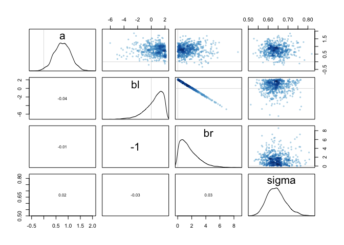<!-- -->

Note that T[0,] on the right-hand side of the prior for br. What the T[0,] does is truncate the normal distribution so that it has positive probability only above zero. In other words, that prior ensures that the posterior distribution for br will have no probability mass below zero.     
Compare the two posterior distributions for m5.8s and m5.8s2. What has changed in the posterior distribution of both beta parameters? Can you explain the change induced by the change in prior?     

> In the second run, the posteriod distributions for bl and br become non-symmetric but mirror image of each other. This is caused by the new prior for br. The new prior made the posterior of br right skewed. Due to the strong negative correlation between br and bl, the posterior of bl is now left skewed.  

### 8H4   

For the two models fit in the previous problem, use DIC or WAIC to compare the effective
numbers of parameters for each model. Which model has more effective parameters? Why?   

```r
compare(m5.8s, m5.8s2, WAIC = TRUE)
```

```
##            WAIC    pWAIC     dWAIC    weight       SE      dSE
## m5.8s  196.4395 3.328133 0.0000000 0.5461823 10.85083       NA
## m5.8s2 196.8100 2.643645 0.3705146 0.4538177 10.52843 2.495121
```

```r
compare(m5.8s, m5.8s2, WAIC = FALSE) #didn't seem to have worked. 
```

```
##            WAIC    pWAIC     dWAIC    weight       SE      dSE
## m5.8s  196.4395 3.328133 0.0000000 0.5461823 10.85083       NA
## m5.8s2 196.8100 2.643645 0.3705146 0.4538177 10.52843 2.495121
```

> pWAIC tells us number of effective parameters. The first model has more effective parameters (effective parameter: panelty term in WAIC). This means that the first model has a higher penalty term.   

> reduced posterior variance in br due to reduced posterior variance -> smaller WAIC. 
