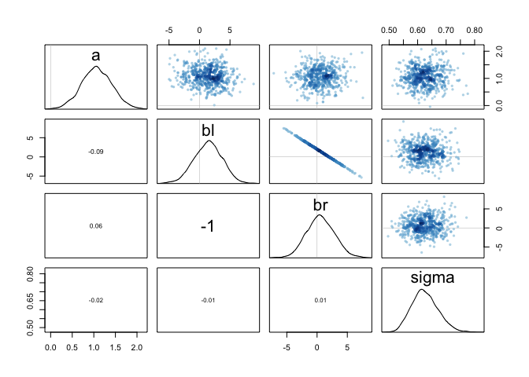
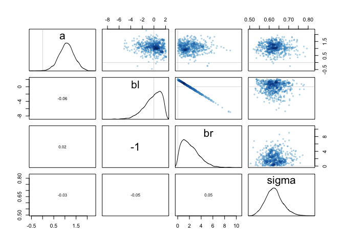

### 8E4   
Explain the difference between the effective number of samples, n_eff as calculated by Stan, and the actual number of samples.    

> n_eff is usually smaller than the actual number of samples. It reduces the number of samples based on the level of autocorrelation betweeen consecutive samples.  

### 8M3    
Re-estimate one of the Stan models from the chapter, but at different numbers of warmup iterations.
Be sure to use the same number of sampling iterations in each case. Compare the n_eff
values. How much warmup is enough?    


```r
library(rethinking)
```

```
## Loading required package: rstan
```

```
## Loading required package: StanHeaders
```

```
## Loading required package: ggplot2
```

```
## rstan (Version 2.19.2, GitRev: 2e1f913d3ca3)
```

```
## For execution on a local, multicore CPU with excess RAM we recommend calling
## options(mc.cores = parallel::detectCores()).
## To avoid recompilation of unchanged Stan programs, we recommend calling
## rstan_options(auto_write = TRUE)
```

```
## Loading required package: parallel
```

```
## Loading required package: dagitty
```

```
## rethinking (Version 1.90)
```

```
## 
## Attaching package: 'rethinking'
```

```
## The following object is masked from 'package:stats':
## 
##     rstudent
```

```r
data(rugged)
d <- rugged
d$log_gdp <- log(d$rgdppc_2000)
dd <- d[ complete.cases(d$rgdppc_2000) , ]
dd$log_gdp_std <- dd$log_gdp / mean(dd$log_gdp)
dd$rugged_std <- dd$rugged / max(dd$rugged)
dd$cid <- ifelse( dd$cont_africa==1 , 1 , 2 )

dat_slim <- list(
  log_gdp_std = dd$log_gdp_std,
  rugged_std = dd$rugged_std,
  cid = as.integer( dd$cid )
)

m8m3.1 <- rethinking::ulam(
  alist(
    log_gdp_std ~ dnorm( mu , sigma ) ,
    mu <- a[cid] + b[cid]*( rugged_std - 0.215 ) ,
    a[cid] ~ dnorm( 1 , 0.1 ) ,
    b[cid] ~ dnorm( 0 , 0.3 ) ,
    sigma ~ dexp( 1 )
  ), data=dat_slim, chains=1, iter = 10000, warmup=1000)
```

```
## 
## SAMPLING FOR MODEL 'f3314e777e4c586121dcc9de98266129' NOW (CHAIN 1).
## Chain 1: 
## Chain 1: Gradient evaluation took 2.4e-05 seconds
## Chain 1: 1000 transitions using 10 leapfrog steps per transition would take 0.24 seconds.
## Chain 1: Adjust your expectations accordingly!
## Chain 1: 
## Chain 1: 
## Chain 1: Iteration:    1 / 10000 [  0%]  (Warmup)
## Chain 1: Iteration: 1000 / 10000 [ 10%]  (Warmup)
## Chain 1: Iteration: 1001 / 10000 [ 10%]  (Sampling)
## Chain 1: Iteration: 2000 / 10000 [ 20%]  (Sampling)
## Chain 1: Iteration: 3000 / 10000 [ 30%]  (Sampling)
## Chain 1: Iteration: 4000 / 10000 [ 40%]  (Sampling)
## Chain 1: Iteration: 5000 / 10000 [ 50%]  (Sampling)
## Chain 1: Iteration: 6000 / 10000 [ 60%]  (Sampling)
## Chain 1: Iteration: 7000 / 10000 [ 70%]  (Sampling)
## Chain 1: Iteration: 8000 / 10000 [ 80%]  (Sampling)
## Chain 1: Iteration: 9000 / 10000 [ 90%]  (Sampling)
## Chain 1: Iteration: 10000 / 10000 [100%]  (Sampling)
## Chain 1: 
## Chain 1:  Elapsed Time: 0.100105 seconds (Warm-up)
## Chain 1:                0.643803 seconds (Sampling)
## Chain 1:                0.743908 seconds (Total)
## Chain 1:
```

```r
show( m8m3.1 )
```

```
## Hamiltonian Monte Carlo approximation
## 9000 samples from 1 chain
## 
## Sampling durations (seconds):
##         warmup sample total
## chain:1    0.1   0.64  0.74
## 
## Formula:
## log_gdp_std ~ dnorm(mu, sigma)
## mu <- a[cid] + b[cid] * (rugged_std - 0.215)
## a[cid] ~ dnorm(1, 0.1)
## b[cid] ~ dnorm(0, 0.3)
## sigma ~ dexp(1)
```

```r
precis(m8m3.1)
```

```
## 4 vector or matrix parameters hidden. Use depth=2 to show them.
```

```
##            mean          sd      5.5%     94.5%    n_eff     Rhat
## sigma 0.1116166 0.006309683 0.1019712 0.1221545 12362.78 1.000253
```

```r
pairs(m8m3.1)
```

<!-- -->


```r
m8m3.2 <- rethinking::ulam(
  alist(
    log_gdp_std ~ dnorm( mu , sigma ) ,
    mu <- a[cid] + b[cid]*( rugged_std - 0.215 ) ,
    a[cid] ~ dnorm( 1 , 0.1 ) ,
    b[cid] ~ dnorm( 0 , 0.3 ) ,
    sigma ~ dexp( 1 )
  ), data=dat_slim, chains=1, iter = 10000, warmup=2000)
```

```
## recompiling to avoid crashing R session
```

```
## 
## SAMPLING FOR MODEL 'f3314e777e4c586121dcc9de98266129' NOW (CHAIN 1).
## Chain 1: 
## Chain 1: Gradient evaluation took 3.5e-05 seconds
## Chain 1: 1000 transitions using 10 leapfrog steps per transition would take 0.35 seconds.
## Chain 1: Adjust your expectations accordingly!
## Chain 1: 
## Chain 1: 
## Chain 1: Iteration:    1 / 10000 [  0%]  (Warmup)
## Chain 1: Iteration: 1000 / 10000 [ 10%]  (Warmup)
## Chain 1: Iteration: 2000 / 10000 [ 20%]  (Warmup)
## Chain 1: Iteration: 2001 / 10000 [ 20%]  (Sampling)
## Chain 1: Iteration: 3000 / 10000 [ 30%]  (Sampling)
## Chain 1: Iteration: 4000 / 10000 [ 40%]  (Sampling)
## Chain 1: Iteration: 5000 / 10000 [ 50%]  (Sampling)
## Chain 1: Iteration: 6000 / 10000 [ 60%]  (Sampling)
## Chain 1: Iteration: 7000 / 10000 [ 70%]  (Sampling)
## Chain 1: Iteration: 8000 / 10000 [ 80%]  (Sampling)
## Chain 1: Iteration: 9000 / 10000 [ 90%]  (Sampling)
## Chain 1: Iteration: 10000 / 10000 [100%]  (Sampling)
## Chain 1: 
## Chain 1:  Elapsed Time: 0.183526 seconds (Warm-up)
## Chain 1:                0.678745 seconds (Sampling)
## Chain 1:                0.862271 seconds (Total)
## Chain 1:
```

```r
show( m8m3.2 )
```

```
## Hamiltonian Monte Carlo approximation
## 8000 samples from 1 chain
## 
## Sampling durations (seconds):
##         warmup sample total
## chain:1   0.18   0.68  0.86
## 
## Formula:
## log_gdp_std ~ dnorm(mu, sigma)
## mu <- a[cid] + b[cid] * (rugged_std - 0.215)
## a[cid] ~ dnorm(1, 0.1)
## b[cid] ~ dnorm(0, 0.3)
## sigma ~ dexp(1)
```

```r
precis(m8m3.2)
```

```
## 4 vector or matrix parameters hidden. Use depth=2 to show them.
```

```
##            mean          sd      5.5%     94.5%    n_eff      Rhat
## sigma 0.1115258 0.006202575 0.1020446 0.1217671 9840.414 0.9999773
```

```r
pairs(m8m3.2)
```

<!-- -->


```r
m8m3.3 <- rethinking::ulam(
  alist(
    log_gdp_std ~ dnorm( mu , sigma ) ,
    mu <- a[cid] + b[cid]*( rugged_std - 0.215 ) ,
    a[cid] ~ dnorm( 1 , 0.1 ) ,
    b[cid] ~ dnorm( 0 , 0.3 ) ,
    sigma ~ dexp( 1 )
  ), data=dat_slim, chains=1, iter = 10000, warmup=5000)
```

```
## recompiling to avoid crashing R session
```

```
## 
## SAMPLING FOR MODEL 'f3314e777e4c586121dcc9de98266129' NOW (CHAIN 1).
## Chain 1: 
## Chain 1: Gradient evaluation took 2.1e-05 seconds
## Chain 1: 1000 transitions using 10 leapfrog steps per transition would take 0.21 seconds.
## Chain 1: Adjust your expectations accordingly!
## Chain 1: 
## Chain 1: 
## Chain 1: Iteration:    1 / 10000 [  0%]  (Warmup)
## Chain 1: Iteration: 1000 / 10000 [ 10%]  (Warmup)
## Chain 1: Iteration: 2000 / 10000 [ 20%]  (Warmup)
## Chain 1: Iteration: 3000 / 10000 [ 30%]  (Warmup)
## Chain 1: Iteration: 4000 / 10000 [ 40%]  (Warmup)
## Chain 1: Iteration: 5000 / 10000 [ 50%]  (Warmup)
## Chain 1: Iteration: 5001 / 10000 [ 50%]  (Sampling)
## Chain 1: Iteration: 6000 / 10000 [ 60%]  (Sampling)
## Chain 1: Iteration: 7000 / 10000 [ 70%]  (Sampling)
## Chain 1: Iteration: 8000 / 10000 [ 80%]  (Sampling)
## Chain 1: Iteration: 9000 / 10000 [ 90%]  (Sampling)
## Chain 1: Iteration: 10000 / 10000 [100%]  (Sampling)
## Chain 1: 
## Chain 1:  Elapsed Time: 0.399859 seconds (Warm-up)
## Chain 1:                0.379191 seconds (Sampling)
## Chain 1:                0.77905 seconds (Total)
## Chain 1:
```

```r
show( m8m3.3 )
```

```
## Hamiltonian Monte Carlo approximation
## 5000 samples from 1 chain
## 
## Sampling durations (seconds):
##         warmup sample total
## chain:1    0.4   0.38  0.78
## 
## Formula:
## log_gdp_std ~ dnorm(mu, sigma)
## mu <- a[cid] + b[cid] * (rugged_std - 0.215)
## a[cid] ~ dnorm(1, 0.1)
## b[cid] ~ dnorm(0, 0.3)
## sigma ~ dexp(1)
```

```r
precis(m8m3.3)
```

```
## 4 vector or matrix parameters hidden. Use depth=2 to show them.
```

```
##            mean          sd      5.5%     94.5%    n_eff     Rhat
## sigma 0.1115055 0.006201455 0.1021034 0.1218238 6267.993 1.000286
```

```r
pairs(m8m3.3)
```

<!-- -->

### 8H3    
Sometimes changing a prior for one parameter has unanticipated effects on other parameters.
This is because when a parameter is highly correlated with another parameter in the posterior, the prior influences both parameters. Here’s an example to work and think through.   
Go back to the leg length example in Chapter 5. Here is the code again, which simulates height and leg lengths for 100 imagined individuals:   


```r
N <- 100 # number of individuals
height <- rnorm(N,10,2) # sim total height of each
leg_prop <- runif(N,0.4,0.5) # leg as proportion of height
leg_left <- leg_prop*height + # sim left leg as proportion + error
rnorm( N , 0 , 0.02 )
leg_right <- leg_prop*height + # sim right leg as proportion + error
rnorm( N , 0 , 0.02 )
# combine into data frame
d <- data.frame(height,leg_left,leg_right)
```

And below is the model you fit before, resulting in a highly correlated posterior for the two beta parameters. This time, fit the model using map2stan:   

```r
m5.8s <- map2stan( 
  alist(
    height ~ dnorm( mu , sigma ) ,
    mu <- a + bl*leg_left + br*leg_right ,
    a ~ dnorm( 10 , 100 ) ,
    bl ~ dnorm( 2 , 10 ) ,
    br ~ dnorm( 2 , 10 ) ,
    sigma ~ dcauchy( 0 , 1 )
  ) ,
  data=d, chains=4, start=list(a=10,bl=0,br=0,sigma=1) )
```

```
## 
## SAMPLING FOR MODEL '5fd4fe2576442c190613a438eaf0d671' NOW (CHAIN 1).
## Chain 1: 
## Chain 1: Gradient evaluation took 1.8e-05 seconds
## Chain 1: 1000 transitions using 10 leapfrog steps per transition would take 0.18 seconds.
## Chain 1: Adjust your expectations accordingly!
## Chain 1: 
## Chain 1: 
## Chain 1: Iteration:    1 / 2000 [  0%]  (Warmup)
## Chain 1: Iteration:  200 / 2000 [ 10%]  (Warmup)
## Chain 1: Iteration:  400 / 2000 [ 20%]  (Warmup)
## Chain 1: Iteration:  600 / 2000 [ 30%]  (Warmup)
## Chain 1: Iteration:  800 / 2000 [ 40%]  (Warmup)
## Chain 1: Iteration: 1000 / 2000 [ 50%]  (Warmup)
## Chain 1: Iteration: 1001 / 2000 [ 50%]  (Sampling)
## Chain 1: Iteration: 1200 / 2000 [ 60%]  (Sampling)
## Chain 1: Iteration: 1400 / 2000 [ 70%]  (Sampling)
## Chain 1: Iteration: 1600 / 2000 [ 80%]  (Sampling)
## Chain 1: Iteration: 1800 / 2000 [ 90%]  (Sampling)
## Chain 1: Iteration: 2000 / 2000 [100%]  (Sampling)
## Chain 1: 
## Chain 1:  Elapsed Time: 4.94005 seconds (Warm-up)
## Chain 1:                5.59505 seconds (Sampling)
## Chain 1:                10.5351 seconds (Total)
## Chain 1: 
## 
## SAMPLING FOR MODEL '5fd4fe2576442c190613a438eaf0d671' NOW (CHAIN 2).
## Chain 2: 
## Chain 2: Gradient evaluation took 8e-06 seconds
## Chain 2: 1000 transitions using 10 leapfrog steps per transition would take 0.08 seconds.
## Chain 2: Adjust your expectations accordingly!
## Chain 2: 
## Chain 2: 
## Chain 2: Iteration:    1 / 2000 [  0%]  (Warmup)
## Chain 2: Iteration:  200 / 2000 [ 10%]  (Warmup)
## Chain 2: Iteration:  400 / 2000 [ 20%]  (Warmup)
## Chain 2: Iteration:  600 / 2000 [ 30%]  (Warmup)
## Chain 2: Iteration:  800 / 2000 [ 40%]  (Warmup)
## Chain 2: Iteration: 1000 / 2000 [ 50%]  (Warmup)
## Chain 2: Iteration: 1001 / 2000 [ 50%]  (Sampling)
## Chain 2: Iteration: 1200 / 2000 [ 60%]  (Sampling)
## Chain 2: Iteration: 1400 / 2000 [ 70%]  (Sampling)
## Chain 2: Iteration: 1600 / 2000 [ 80%]  (Sampling)
## Chain 2: Iteration: 1800 / 2000 [ 90%]  (Sampling)
## Chain 2: Iteration: 2000 / 2000 [100%]  (Sampling)
## Chain 2: 
## Chain 2:  Elapsed Time: 4.81267 seconds (Warm-up)
## Chain 2:                5.21715 seconds (Sampling)
## Chain 2:                10.0298 seconds (Total)
## Chain 2: 
## 
## SAMPLING FOR MODEL '5fd4fe2576442c190613a438eaf0d671' NOW (CHAIN 3).
## Chain 3: 
## Chain 3: Gradient evaluation took 8e-06 seconds
## Chain 3: 1000 transitions using 10 leapfrog steps per transition would take 0.08 seconds.
## Chain 3: Adjust your expectations accordingly!
## Chain 3: 
## Chain 3: 
## Chain 3: Iteration:    1 / 2000 [  0%]  (Warmup)
## Chain 3: Iteration:  200 / 2000 [ 10%]  (Warmup)
## Chain 3: Iteration:  400 / 2000 [ 20%]  (Warmup)
## Chain 3: Iteration:  600 / 2000 [ 30%]  (Warmup)
## Chain 3: Iteration:  800 / 2000 [ 40%]  (Warmup)
## Chain 3: Iteration: 1000 / 2000 [ 50%]  (Warmup)
## Chain 3: Iteration: 1001 / 2000 [ 50%]  (Sampling)
## Chain 3: Iteration: 1200 / 2000 [ 60%]  (Sampling)
## Chain 3: Iteration: 1400 / 2000 [ 70%]  (Sampling)
## Chain 3: Iteration: 1600 / 2000 [ 80%]  (Sampling)
## Chain 3: Iteration: 1800 / 2000 [ 90%]  (Sampling)
## Chain 3: Iteration: 2000 / 2000 [100%]  (Sampling)
## Chain 3: 
## Chain 3:  Elapsed Time: 4.82322 seconds (Warm-up)
## Chain 3:                5.85771 seconds (Sampling)
## Chain 3:                10.6809 seconds (Total)
## Chain 3: 
## 
## SAMPLING FOR MODEL '5fd4fe2576442c190613a438eaf0d671' NOW (CHAIN 4).
## Chain 4: 
## Chain 4: Gradient evaluation took 1.5e-05 seconds
## Chain 4: 1000 transitions using 10 leapfrog steps per transition would take 0.15 seconds.
## Chain 4: Adjust your expectations accordingly!
## Chain 4: 
## Chain 4: 
## Chain 4: Iteration:    1 / 2000 [  0%]  (Warmup)
## Chain 4: Iteration:  200 / 2000 [ 10%]  (Warmup)
## Chain 4: Iteration:  400 / 2000 [ 20%]  (Warmup)
## Chain 4: Iteration:  600 / 2000 [ 30%]  (Warmup)
## Chain 4: Iteration:  800 / 2000 [ 40%]  (Warmup)
## Chain 4: Iteration: 1000 / 2000 [ 50%]  (Warmup)
## Chain 4: Iteration: 1001 / 2000 [ 50%]  (Sampling)
## Chain 4: Iteration: 1200 / 2000 [ 60%]  (Sampling)
## Chain 4: Iteration: 1400 / 2000 [ 70%]  (Sampling)
## Chain 4: Iteration: 1600 / 2000 [ 80%]  (Sampling)
## Chain 4: Iteration: 1800 / 2000 [ 90%]  (Sampling)
## Chain 4: Iteration: 2000 / 2000 [100%]  (Sampling)
## Chain 4: 
## Chain 4:  Elapsed Time: 5.05829 seconds (Warm-up)
## Chain 4:                5.2303 seconds (Sampling)
## Chain 4:                10.2886 seconds (Total)
## Chain 4:
```

```
## Warning: There were 2152 transitions after warmup that exceeded the maximum treedepth. Increase max_treedepth above 10. See
## http://mc-stan.org/misc/warnings.html#maximum-treedepth-exceeded
```

```
## Warning: Examine the pairs() plot to diagnose sampling problems
```

```
## Computing WAIC
```

```r
pairs(m5.8s)
```

<!-- -->

Compare the posterior distribution produced by the code above to the posterior distribution produced when you change the prior for br so that it is strictly positive:   

```r
m5.8s2 <- map2stan(
alist(
height ~ dnorm( mu , sigma ) ,
mu <- a + bl*leg_left + br*leg_right ,
a ~ dnorm( 10 , 100 ) ,
bl ~ dnorm( 2 , 10 ) ,
br ~ dnorm( 2 , 10 ) & T[0,] ,
sigma ~ dcauchy( 0 , 1 )
) ,
data=d, chains=4,
start=list(a=10,bl=0,br=0,sigma=1) )
```

```
## 
## SAMPLING FOR MODEL 'ebbe4969a3b353f43617416ec4fa67ae' NOW (CHAIN 1).
## Chain 1: 
## Chain 1: Gradient evaluation took 1.8e-05 seconds
## Chain 1: 1000 transitions using 10 leapfrog steps per transition would take 0.18 seconds.
## Chain 1: Adjust your expectations accordingly!
## Chain 1: 
## Chain 1: 
## Chain 1: Iteration:    1 / 2000 [  0%]  (Warmup)
## Chain 1: Iteration:  200 / 2000 [ 10%]  (Warmup)
## Chain 1: Iteration:  400 / 2000 [ 20%]  (Warmup)
## Chain 1: Iteration:  600 / 2000 [ 30%]  (Warmup)
## Chain 1: Iteration:  800 / 2000 [ 40%]  (Warmup)
## Chain 1: Iteration: 1000 / 2000 [ 50%]  (Warmup)
## Chain 1: Iteration: 1001 / 2000 [ 50%]  (Sampling)
## Chain 1: Iteration: 1200 / 2000 [ 60%]  (Sampling)
## Chain 1: Iteration: 1400 / 2000 [ 70%]  (Sampling)
## Chain 1: Iteration: 1600 / 2000 [ 80%]  (Sampling)
## Chain 1: Iteration: 1800 / 2000 [ 90%]  (Sampling)
## Chain 1: Iteration: 2000 / 2000 [100%]  (Sampling)
## Chain 1: 
## Chain 1:  Elapsed Time: 2.78842 seconds (Warm-up)
## Chain 1:                3.59527 seconds (Sampling)
## Chain 1:                6.3837 seconds (Total)
## Chain 1: 
## 
## SAMPLING FOR MODEL 'ebbe4969a3b353f43617416ec4fa67ae' NOW (CHAIN 2).
## Chain 2: 
## Chain 2: Gradient evaluation took 3.1e-05 seconds
## Chain 2: 1000 transitions using 10 leapfrog steps per transition would take 0.31 seconds.
## Chain 2: Adjust your expectations accordingly!
## Chain 2: 
## Chain 2: 
## Chain 2: Iteration:    1 / 2000 [  0%]  (Warmup)
## Chain 2: Iteration:  200 / 2000 [ 10%]  (Warmup)
## Chain 2: Iteration:  400 / 2000 [ 20%]  (Warmup)
## Chain 2: Iteration:  600 / 2000 [ 30%]  (Warmup)
## Chain 2: Iteration:  800 / 2000 [ 40%]  (Warmup)
## Chain 2: Iteration: 1000 / 2000 [ 50%]  (Warmup)
## Chain 2: Iteration: 1001 / 2000 [ 50%]  (Sampling)
## Chain 2: Iteration: 1200 / 2000 [ 60%]  (Sampling)
## Chain 2: Iteration: 1400 / 2000 [ 70%]  (Sampling)
## Chain 2: Iteration: 1600 / 2000 [ 80%]  (Sampling)
## Chain 2: Iteration: 1800 / 2000 [ 90%]  (Sampling)
## Chain 2: Iteration: 2000 / 2000 [100%]  (Sampling)
## Chain 2: 
## Chain 2:  Elapsed Time: 2.65861 seconds (Warm-up)
## Chain 2:                2.95912 seconds (Sampling)
## Chain 2:                5.61773 seconds (Total)
## Chain 2: 
## 
## SAMPLING FOR MODEL 'ebbe4969a3b353f43617416ec4fa67ae' NOW (CHAIN 3).
## Chain 3: 
## Chain 3: Gradient evaluation took 8e-06 seconds
## Chain 3: 1000 transitions using 10 leapfrog steps per transition would take 0.08 seconds.
## Chain 3: Adjust your expectations accordingly!
## Chain 3: 
## Chain 3: 
## Chain 3: Iteration:    1 / 2000 [  0%]  (Warmup)
## Chain 3: Iteration:  200 / 2000 [ 10%]  (Warmup)
## Chain 3: Iteration:  400 / 2000 [ 20%]  (Warmup)
## Chain 3: Iteration:  600 / 2000 [ 30%]  (Warmup)
## Chain 3: Iteration:  800 / 2000 [ 40%]  (Warmup)
## Chain 3: Iteration: 1000 / 2000 [ 50%]  (Warmup)
## Chain 3: Iteration: 1001 / 2000 [ 50%]  (Sampling)
## Chain 3: Iteration: 1200 / 2000 [ 60%]  (Sampling)
## Chain 3: Iteration: 1400 / 2000 [ 70%]  (Sampling)
## Chain 3: Iteration: 1600 / 2000 [ 80%]  (Sampling)
## Chain 3: Iteration: 1800 / 2000 [ 90%]  (Sampling)
## Chain 3: Iteration: 2000 / 2000 [100%]  (Sampling)
## Chain 3: 
## Chain 3:  Elapsed Time: 2.62589 seconds (Warm-up)
## Chain 3:                3.04029 seconds (Sampling)
## Chain 3:                5.66618 seconds (Total)
## Chain 3: 
## 
## SAMPLING FOR MODEL 'ebbe4969a3b353f43617416ec4fa67ae' NOW (CHAIN 4).
## Chain 4: 
## Chain 4: Gradient evaluation took 1.2e-05 seconds
## Chain 4: 1000 transitions using 10 leapfrog steps per transition would take 0.12 seconds.
## Chain 4: Adjust your expectations accordingly!
## Chain 4: 
## Chain 4: 
## Chain 4: Iteration:    1 / 2000 [  0%]  (Warmup)
## Chain 4: Iteration:  200 / 2000 [ 10%]  (Warmup)
## Chain 4: Iteration:  400 / 2000 [ 20%]  (Warmup)
## Chain 4: Iteration:  600 / 2000 [ 30%]  (Warmup)
## Chain 4: Iteration:  800 / 2000 [ 40%]  (Warmup)
## Chain 4: Iteration: 1000 / 2000 [ 50%]  (Warmup)
## Chain 4: Iteration: 1001 / 2000 [ 50%]  (Sampling)
## Chain 4: Iteration: 1200 / 2000 [ 60%]  (Sampling)
## Chain 4: Iteration: 1400 / 2000 [ 70%]  (Sampling)
## Chain 4: Iteration: 1600 / 2000 [ 80%]  (Sampling)
## Chain 4: Iteration: 1800 / 2000 [ 90%]  (Sampling)
## Chain 4: Iteration: 2000 / 2000 [100%]  (Sampling)
## Chain 4: 
## Chain 4:  Elapsed Time: 2.89856 seconds (Warm-up)
## Chain 4:                2.61146 seconds (Sampling)
## Chain 4:                5.51002 seconds (Total)
## Chain 4:
```

```
## Warning: There were 1546 divergent transitions after warmup. Increasing adapt_delta above 0.95 may help. See
## http://mc-stan.org/misc/warnings.html#divergent-transitions-after-warmup
```

```
## Warning: There were 168 transitions after warmup that exceeded the maximum treedepth. Increase max_treedepth above 10. See
## http://mc-stan.org/misc/warnings.html#maximum-treedepth-exceeded
```

```
## Warning: Examine the pairs() plot to diagnose sampling problems
```

```
## Computing WAIC
```

```
## Warning in map2stan(alist(height ~ dnorm(mu, sigma), mu <- a + bl * leg_left + : There were 1546 divergent iterations during sampling.
## Check the chains (trace plots, n_eff, Rhat) carefully to ensure they are valid.
```

```r
pairs(m5.8s2)
```

<!-- -->

Note that T[0,] on the right-hand side of the prior for br. What the T[0,] does is truncate the normal distribution so that it has positive probability only above zero. In other words, that prior ensures that the posterior distribution for br will have no probability mass below zero.     
Compare the two posterior distributions for m5.8s and m5.8s2. What has changed in the posterior distribution of both beta parameters? Can you explain the change induced by the change in prior?     

> In the second run, the posteriod distributions for bl and br become non-symmetric but mirror image of each other. This is caused by the new prior for br. The new prior made the posterior of br right skewed. Due to the strong negative correlation between br and bl, the posterior of bl is now left skewed.  

### 8H4   

For the two models fit in the previous problem, use DIC or WAIC to compare the effective
numbers of parameters for each model. Which model has more effective parameters? Why?   

```r
compare(m5.8s, m5.8s2, WAIC = TRUE)
```

```
##            WAIC    pWAIC     dWAIC    weight       SE      dSE
## m5.8s2 192.2575 3.142497 0.0000000 0.5890032 12.11240       NA
## m5.8s  192.9772 3.606468 0.7196926 0.4109968 11.92602 1.073291
```

```r
compare(m5.8s, m5.8s2, WAIC = FALSE) #didn't seem to have worked. 
```

```
##            WAIC    pWAIC     dWAIC    weight       SE      dSE
## m5.8s2 192.2575 3.142497 0.0000000 0.5890032 12.11240       NA
## m5.8s  192.9772 3.606468 0.7196926 0.4109968 11.92602 1.073291
```

> pWAIC tells us number of effective parameters. The first model has more effective parameters (effective parameter: panelty term in WAIC). This means that the first model has a higher penalty term.    
