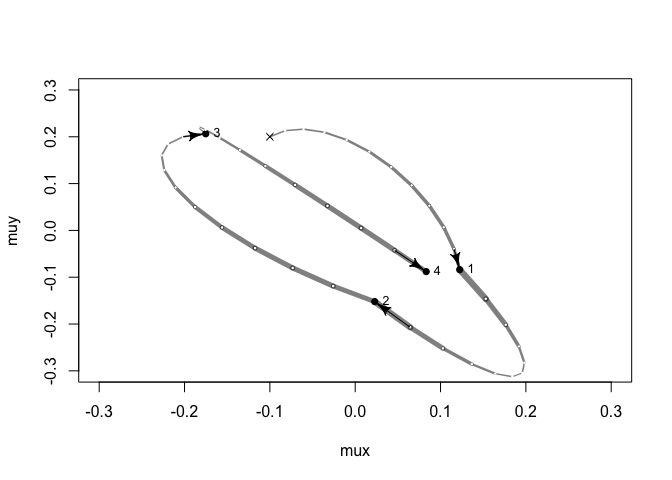
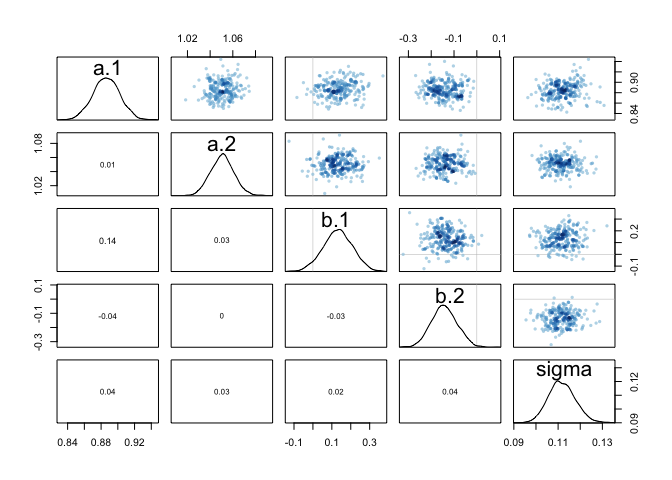
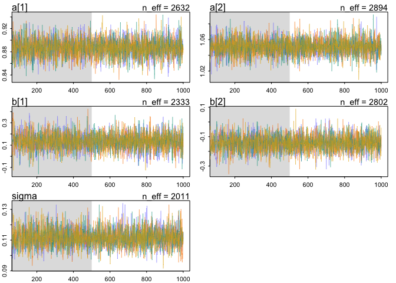
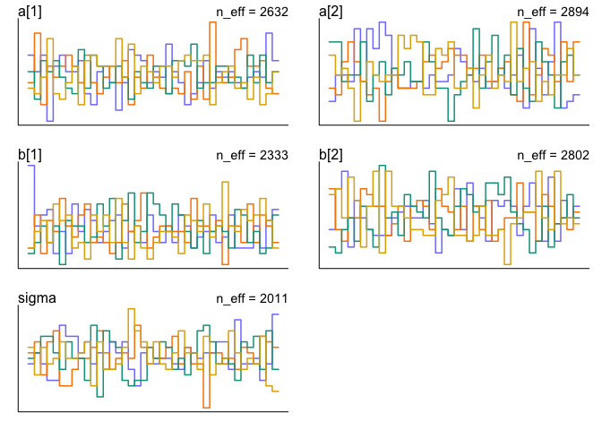
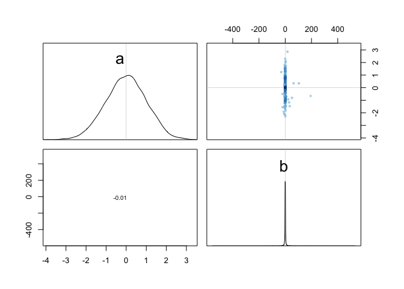
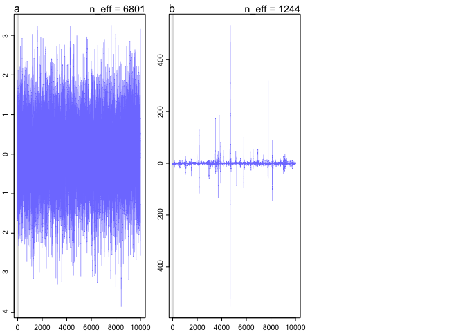
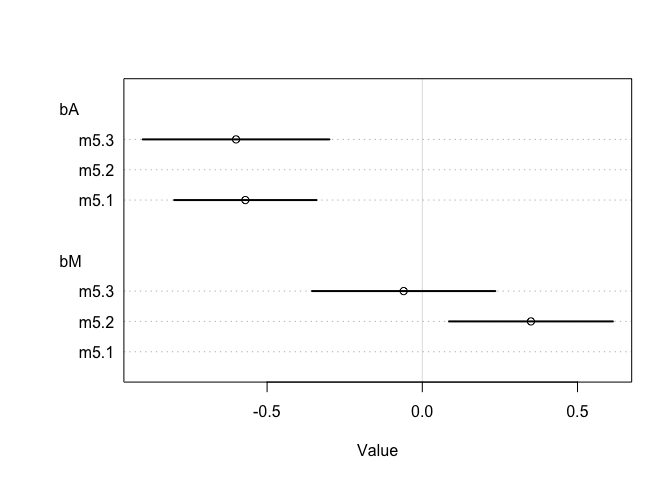
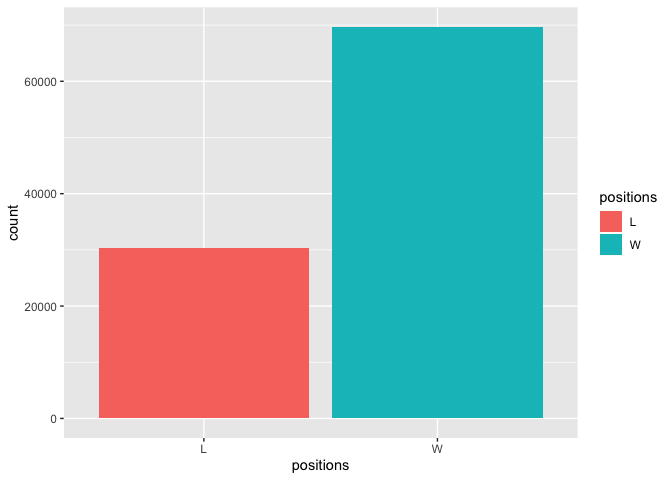

```r
library(rethinking)
```

```
## Loading required package: rstan
```

```
## Loading required package: StanHeaders
```

```
## Loading required package: ggplot2
```

```
## rstan (Version 2.19.2, GitRev: 2e1f913d3ca3)
```

```
## For execution on a local, multicore CPU with excess RAM we recommend calling
## options(mc.cores = parallel::detectCores()).
## To avoid recompilation of unchanged Stan programs, we recommend calling
## rstan_options(auto_write = TRUE)
```

```
## Loading required package: parallel
```

```
## rethinking (Version 1.88)
```


## Textbook exercises
### 9.3

```r
# U: negative log probability
myU4 <- function(q, a = 0, b = 1, k = 0, d = 1) {
  muy <- q[1]
  mux <- q[2]
  U <- sum(dnorm(y, muy, 1, log = TRUE)) + sum(dnorm(x, mux, 1, log = TRUE)) + dnorm(muy, a, b, log = TRUE) + dnorm(mux, k, d, log = TRUE)
  return(-U)
}
```


```r
# gradient function
# need vector of partial derivatives of U with respect to vector q
myU_grad4 <- function( q , a=0 , b=1 , k=0 , d=1 ) {
muy <- q[1]
mux <- q[2]
G1 <- sum( y - muy ) + (a - muy)/b^2 #dU/dmuy
G2 <- sum( x - mux ) + (k - mux)/d^2 #dU/dmuy
return( c( -G1 , -G2 ) ) # negative bc energy is neg-log-prob
}#
# test data
set.seed(7)
y <- rnorm(50)
x <- rnorm(50)
x <- as.numeric(scale(x))
y <- as.numeric(scale(y))
```


```r
library(shape) # for fancy arrows
Q <- list()
Q$q <- c(-0.1,0.2)
pr <- 0.3
plot( NULL , ylab="muy" , xlab="mux" , xlim=c(-pr,pr) , ylim=c(-pr,pr) )
step <- 0.03
L <- 11 # 0.03/28 for U-turns --- 11 for working example
n_samples <- 4
path_col <- col.alpha("black",0.5)
points( Q$q[1] , Q$q[2] , pch=4 , col="black" )
for ( i in 1:n_samples ) {
  Q <- HMC2( myU4 , myU_grad4 , step , L , Q$q )
  if ( n_samples < 10 ) {
    for ( j in 1:L ) {
      K0 <- sum(Q$ptraj[j,]^2)/2 # kinetic energy
      lines( Q$traj[j:(j+1),1] , Q$traj[j:(j+1),2] , col=path_col , lwd=1+2*K0 )
    }
    points( Q$traj[1:L+1,] , pch=16 , col="white" , cex=0.35 )
    Arrows( Q$traj[L,1] , Q$traj[L,2] , Q$traj[L+1,1] , Q$traj[L+1,2] ,
    arr.length=0.35 , arr.adj = 0.7 )
    text( Q$traj[L+1,1] , Q$traj[L+1,2] , i , cex=0.8 , pos=4 , offset=0.4 )
  }
  points( Q$traj[L+1,1] , Q$traj[L+1,2] , pch=ifelse( Q$accept==1 , 16 , 1 ) ,
  col=ifelse( abs(Q$dH)>0.1 , "red" , "black" ) )
}
```

<!-- -->


```r
HMC2 <- function (U, grad_U, epsilon, L, current_q) { 
  q = current_q
  p = rnorm(length(q),0,1) # random flick - p is momentum.
  current_p = p
  # Make a half step for momentum at the beginning
  p = p - epsilon * grad_U(q) / 2
  # initialize bookkeeping - saves trajectory
  qtraj <- matrix(NA,nrow=L+1,ncol=length(q))
  ptraj <- qtraj
  qtraj[1,] <- current_q
  ptraj[1,] <- p
  # Alternate full steps for position and momentum 9.7
  for ( i in 1:L ) {
    q = q + epsilon * p # Full step for the position
    # Make a full step for the momentum, except at end of trajectory
    if ( i!=L ) {
      p = p - epsilon * grad_U(q)
      ptraj[i+1,] <- p
    }
  qtraj[i+1,] <- q
  }
  # Make a half step for momentum at the end
  p = p - epsilon * grad_U(q) / 2
  ptraj[L+1,] <- p
  # Negate momentum at end of trajectory to make the proposal symmetric
  p = -p
  # Evaluate potential and kinetic energies at start and end of trajectory
  current_U = U(current_q)
  current_K = sum(current_p^2) / 2
  proposed_U = U(q)
  proposed_K = sum(p^2) / 2
  # Accept or reject the state at end of trajectory, returning either
  # the position at the end of the trajectory or the initial position
  accept <- 0
  if (runif(1) < exp(current_U-proposed_U+current_K-proposed_K)) {
    new_q <- q # accept
    accept <- 1
  } else new_q <- current_q # reject
  return(list( q=new_q, traj=qtraj, ptraj=ptraj, accept=accept ))
}
```

### 9.4   

```r
data(rugged)
d <- rugged
d$log_gdp <- log(d$rgdppc_2000)
dd <- d[ complete.cases(d$rgdppc_2000) , ]
dd$log_gdp_std <- dd$log_gdp / mean(dd$log_gdp)
dd$rugged_std <- dd$rugged / max(dd$rugged)
dd$cid <- ifelse( dd$cont_africa==1 , 1 , 2 )
head(dd)
```

```
##    isocode isonum              country rugged rugged_popw rugged_slope
## 3      AGO     24               Angola  0.858       0.714        2.274
## 5      ALB      8              Albania  3.427       1.597       10.451
## 8      ARE    784 United Arab Emirates  0.769       0.316        2.112
## 9      ARG     32            Argentina  0.775       0.220        2.268
## 10     ARM     51              Armenia  2.688       0.934        8.178
## 12     ATG     28  Antigua and Barbuda  0.006       0.003        0.012
##    rugged_lsd rugged_pc land_area     lat     lon    soil desert tropical
## 3       0.228     4.906    124670 -12.299  17.551  26.676  0.425   44.346
## 5       1.006    62.133      2740  41.143  20.070  68.088  0.000    0.000
## 8       0.191     6.142      8360  23.913  54.331   0.000 77.280    0.000
## 9       0.226     9.407    273669 -35.396 -65.170  35.678  0.000    0.000
## 10      0.799    50.556      2820  40.294  44.938  30.148  0.000    0.000
## 12      0.003     0.000        44  17.271 -61.800 100.000  0.000  100.000
##    dist_coast near_coast gemstones rgdppc_2000 rgdppc_1950_m rgdppc_1975_m
## 3       0.428    13.1587     47756    1794.729      1051.822      1073.036
## 5       0.048    94.6919         0    3703.113      1001.339      2289.472
## 8       0.065    75.7464         0   20604.460     15797.558     25465.002
## 9       0.352    13.0167         0   12173.680      4986.725      8122.497
## 10      0.348     0.0000         0    2421.985            NA            NA
## 12      0.001   100.0000         0   10022.030            NA            NA
##    rgdppc_2000_m rgdppc_1950_2000_m q_rule_law cont_africa cont_asia
## 3        765.215           1106.763     -1.567           1         0
## 5       2741.420           1931.784     -0.820           0         0
## 8      17567.883          20119.992      0.913           0         1
## 9       8543.558           6926.810      0.033           0         0
## 10      4565.035                 NA     -0.453           0         1
## 12            NA                 NA      0.990           0         0
##    cont_europe cont_oceania cont_north_america cont_south_america
## 3            0            0                  0                  0
## 5            1            0                  0                  0
## 8            0            0                  0                  0
## 9            0            0                  0                  1
## 10           0            0                  0                  0
## 12           0            0                  1                  0
##    legor_gbr legor_fra legor_soc legor_deu legor_sca colony_esp colony_gbr
## 3          0         1         0         0         0          0          0
## 5          0         0         1         0         0          0          0
## 8          1         0         0         0         0          0          1
## 9          0         1         0         0         0          1          0
## 10         0         0         1         0         0          0          0
## 12         1         0         0         0         0          0          1
##    colony_fra colony_prt colony_oeu africa_region_n africa_region_s
## 3           0          1          0               0               0
## 5           0          0          0               0               0
## 8           0          0          0               0               0
## 9           0          0          0               0               0
## 10          0          0          0               0               0
## 12          0          0          0               0               0
##    africa_region_w africa_region_e africa_region_c slave_exports
## 3                0               0               1       3610000
## 5                0               0               0             0
## 8                0               0               0             0
## 9                0               0               0             0
## 10               0               0               0             0
## 12               0               0               0             0
##    dist_slavemkt_atlantic dist_slavemkt_indian dist_slavemkt_saharan
## 3                   5.669                6.981                 4.926
## 5                      NA                   NA                    NA
## 8                      NA                   NA                    NA
## 9                      NA                   NA                    NA
## 10                     NA                   NA                    NA
## 12                     NA                   NA                    NA
##    dist_slavemkt_redsea pop_1400 european_descent  log_gdp log_gdp_std
## 3                 3.872  1223208            2.000 7.492609   0.8797119
## 5                    NA   200000          100.000 8.216929   0.9647547
## 8                    NA    19200            0.000 9.933263   1.1662705
## 9                    NA   276632           89.889 9.407032   1.1044854
## 10                   NA   105743            0.500 7.792343   0.9149038
## 12                   NA      747               NA 9.212541   1.0816501
##      rugged_std cid
## 3  0.1383424702   1
## 5  0.5525636891   2
## 8  0.1239922606   2
## 9  0.1249596904   2
## 10 0.4334085779   2
## 12 0.0009674299   2
```


```r
m8.5 <- quap(
  alist(
    log_gdp_std ~ dnorm( mu , sigma ) ,
    mu <- a[cid] + b[cid]*( rugged_std - 0.215 ) ,
    a[cid] ~ dnorm( 1 , 0.1 ) ,
    b[cid] ~ dnorm( 0 , 0.3 ) ,
    sigma ~ dexp( 1 )
  ) ,
  data=dd )
precis( m8.5 , depth=2 )
```

```
##             mean          sd        5.5%       94.5%
## a[1]   0.8865640 0.015674552  0.86151302  0.91161495
## a[2]   1.0505666 0.009935872  1.03468714  1.06644602
## b[1]   0.1324981 0.074199237  0.01391344  0.25108286
## b[2]  -0.1426057 0.054745410 -0.23009945 -0.05511197
## sigma  0.1094859 0.005934188  0.10000194  0.11896990
```


```r
dat_slim <- list(
  log_gdp_std = dd$log_gdp_std,
  rugged_std = dd$rugged_std,
  cid = as.integer( dd$cid )
)
str(dat_slim)
```

```
## List of 3
##  $ log_gdp_std: num [1:170] 0.88 0.965 1.166 1.104 0.915 ...
##  $ rugged_std : num [1:170] 0.138 0.553 0.124 0.125 0.433 ...
##  $ cid        : int [1:170] 1 2 2 2 2 2 2 2 2 1 ...
```


```r
m9.1 <- ulam(
  alist(
    log_gdp_std ~ dnorm( mu , sigma ) ,
    mu <- a[cid] + b[cid]*( rugged_std - 0.215 ) ,
    a[cid] ~ dnorm( 1 , 0.1 ) ,
    b[cid] ~ dnorm( 0 , 0.3 ) ,
    sigma ~ dexp( 1 )
) ,
  data=dat_slim , chains=1 )
```

```
## 
## SAMPLING FOR MODEL 'f3314e777e4c586121dcc9de98266129' NOW (CHAIN 1).
## Chain 1: 
## Chain 1: Gradient evaluation took 3.2e-05 seconds
## Chain 1: 1000 transitions using 10 leapfrog steps per transition would take 0.32 seconds.
## Chain 1: Adjust your expectations accordingly!
## Chain 1: 
## Chain 1: 
## Chain 1: Iteration:   1 / 1000 [  0%]  (Warmup)
## Chain 1: Iteration: 100 / 1000 [ 10%]  (Warmup)
## Chain 1: Iteration: 200 / 1000 [ 20%]  (Warmup)
## Chain 1: Iteration: 300 / 1000 [ 30%]  (Warmup)
## Chain 1: Iteration: 400 / 1000 [ 40%]  (Warmup)
## Chain 1: Iteration: 500 / 1000 [ 50%]  (Warmup)
## Chain 1: Iteration: 501 / 1000 [ 50%]  (Sampling)
## Chain 1: Iteration: 600 / 1000 [ 60%]  (Sampling)
## Chain 1: Iteration: 700 / 1000 [ 70%]  (Sampling)
## Chain 1: Iteration: 800 / 1000 [ 80%]  (Sampling)
## Chain 1: Iteration: 900 / 1000 [ 90%]  (Sampling)
## Chain 1: Iteration: 1000 / 1000 [100%]  (Sampling)
## Chain 1: 
## Chain 1:  Elapsed Time: 0.053001 seconds (Warm-up)
## Chain 1:                0.039871 seconds (Sampling)
## Chain 1:                0.092872 seconds (Total)
## Chain 1:
```


```r
precis( m9.1 , depth=2 )
```

```
##             mean          sd         5.5%       94.5%     n_eff      Rhat
## a[1]   0.8860990 0.016537044  0.860576911  0.91209321 1016.8675 0.9980422
## a[2]   1.0506146 0.010506523  1.033408162  1.06839283  725.2722 0.9996669
## b[1]   0.1329012 0.074947791  0.009523092  0.25097881  549.8046 0.9980158
## b[2]  -0.1457210 0.056933640 -0.235654751 -0.05168819  483.7326 0.9981320
## sigma  0.1116095 0.006497798  0.102177700  0.12257692  440.4089 0.9981033
```


```r
m9.1 <- ulam( 
  alist(
    log_gdp_std ~ dnorm( mu , sigma ) ,
    mu <- a[cid] + b[cid]*( rugged_std - 0.215 ) ,
    a[cid] ~ dnorm( 1 , 0.1 ) ,
    b[cid] ~ dnorm( 0 , 0.3 ) ,
    sigma ~ dexp( 1 )
  ) ,
  data=dat_slim , chains=4 , cores=4 , iter=1000 )
```

```
## recompiling to avoid crashing R session
```

```r
show(m9.1)
```

```
## Hamiltonian Monte Carlo approximation
## 2000 samples from 4 chains
## 
## Sampling durations (seconds):
##         warmup sample total
## chain:1   0.10   0.06  0.16
## chain:2   0.10   0.06  0.17
## chain:3   0.10   0.06  0.16
## chain:4   0.09   0.06  0.16
## 
## Formula:
## log_gdp_std ~ dnorm(mu, sigma)
## mu <- a[cid] + b[cid] * (rugged_std - 0.215)
## a[cid] ~ dnorm(1, 0.1)
## b[cid] ~ dnorm(0, 0.3)
## sigma ~ dexp(1)
```


```r
precis(m9.1, 2)
```

```
##             mean          sd         5.5%       94.5%    n_eff      Rhat
## a[1]   0.8864428 0.016284165  0.859943580  0.91291113 2632.242 0.9986519
## a[2]   1.0507178 0.010446356  1.034351525  1.06743151 2894.188 1.0000595
## b[1]   0.1316973 0.077286606  0.004242543  0.25560170 2333.190 0.9998321
## b[2]  -0.1426273 0.056011176 -0.229962049 -0.05168892 2801.616 1.0007067
## sigma  0.1117562 0.006122426  0.102490248  0.12173577 2010.857 0.9996732
```


```r
pairs(m9.1)
```

<!-- -->


```r
traceplot(m9.1, n_cols = 2)
trankplot(m9.1, n_cols = 2)
```

<!-- --><!-- -->

## Homework
### 8E3
> Discrete parameters. Discrete parameters don't form a surface the ball can glide one.   

### 8M1

Re-estimate the terrain ruggedness model from the chapter, but now using a uniform prior and
an exponential prior for the standard deviation, sigma. The uniform prior should be dunif(0,10)
and the exponential should be dexp(1). Do the different priors have any detectible influence on the
posterior distribution?    

```r
m8m1 <- ulam( 
  alist(
    log_gdp_std ~ dnorm( mu , sigma ) ,
    mu ~ dunif( 0,10) ,
    sigma ~ dexp( 1 )
  ) ,
  data=dat_slim , chains=4 , cores=4 , iter=1000 )
```


```r
precis(m8m1)
```

```
##            mean          sd      5.5%     94.5%    n_eff      Rhat
## mu    1.0001520 0.010351460 0.9834197 1.0168231 1249.524 0.9995832
## sigma 0.1381543 0.007471941 0.1268933 0.1511649 1432.627 0.9992071
```

### 8M2   
The Cauchy and exponential priors from the terrain ruggedness model are very weak. They can be made more informative by reducing their scale. Compare the dcauchy and dexp priors for progressively smaller values of the scaling parameter. As these priors become stronger, how does each influence the posterior distribution?   


```r
m8m2.1 <- ulam( 
  alist(
    log_gdp_std ~ dnorm( mu , sigma ) ,
    mu ~ dcauchy(0 , scale = 1) ,
    sigma ~ dexp( 1 )
  ) ,
  data=dat_slim , chains=4 , cores=4 , iter=1000 , log_lik = TRUE )

m8m2.2 <- ulam( 
  alist(
    log_gdp_std ~ dnorm( mu , sigma ) ,
    mu ~ dcauchy(0 , scale = 0.75) ,
    sigma ~ dexp( 0.75 )
  ) ,
  data=dat_slim , chains=4 , cores=4 , iter=1000 , log_lik = TRUE )

m8m2.3 <- ulam( 
  alist(
    log_gdp_std ~ dnorm( mu , sigma ) ,
    mu ~ dcauchy(0 , scale = 0.5) ,
    sigma ~ dexp( 0.5 )
  ) ,
  data=dat_slim , chains=4 , cores=4 , iter=1000 , log_lik = TRUE )
```


```r
precis(m8m2.1)
```

```
##            mean          sd      5.5%    94.5%    n_eff     Rhat
## mu    0.9994244 0.010479071 0.9825326 1.015344 1339.359 1.000104
## sigma 0.1377274 0.007762475 0.1256538 0.150616 1063.677 1.004052
```

```r
precis(m8m2.2)
```

```
##            mean          sd      5.5%     94.5%     n_eff     Rhat
## mu    0.9995382 0.010105895 0.9837245 1.0156359 1575.4576 1.000553
## sigma 0.1380074 0.007874403 0.1258386 0.1509038  986.7328 1.002299
```

```r
precis(m8m2.3)
```

```
##            mean          sd      5.5%     94.5%    n_eff     Rhat
## mu    0.9999317 0.010735666 0.9825513 1.0163918 1367.887 1.000117
## sigma 0.1381927 0.007248904 0.1265118 0.1501938 1213.002 1.000158
```

```r
WAIC(m8m2.1)
```

```
## [1] -190.9435
## attr(,"lppd")
## [1] 96.9671
## attr(,"pWAIC")
## [1] 1.495335
## attr(,"se")
## [1] 12.96525
```

```r
WAIC(m8m2.2)
```

```
## [1] -191.064
## attr(,"lppd")
## [1] 96.95496
## attr(,"pWAIC")
## [1] 1.422958
## attr(,"se")
## [1] 12.90984
```

```r
WAIC(m8m2.3)
```

```
## [1] -191.0611
## attr(,"lppd")
## [1] 96.99028
## attr(,"pWAIC")
## [1] 1.459715
## attr(,"se")
## [1] 12.86733
```

```r
compare(m8m2.1, m8m2.2, m8m2.3)
```

```
##             WAIC    pWAIC       dWAIC    weight       SE        dSE
## m8m2.2 -191.0640 1.422958 0.000000000 0.3401230 12.90984         NA
## m8m2.3 -191.0611 1.459715 0.002864043 0.3396363 12.86733 0.09386829
## m8m2.1 -190.9435 1.495335 0.120468361 0.3202408 12.96525 0.05722789
```

### 8H1    

```r
mp <- ulam( 
  alist(
    a ~ dnorm(0,1),
    b ~ dcauchy(0,1)
  ),
  data=list(y=1),
  start=list(a=0,b=0),
  iter=1e4, warmup=100 )
```

```
## Cautionary note:
```

```
## Variable y contains only integers but is not type 'integer'. If you intend it as an index variable, you should as.integer() it before passing to ulam.
```

```
## 
## SAMPLING FOR MODEL 'dea43e6a0d28d00b4b55906af184e5c1' NOW (CHAIN 1).
## Chain 1: 
## Chain 1: Gradient evaluation took 7e-06 seconds
## Chain 1: 1000 transitions using 10 leapfrog steps per transition would take 0.07 seconds.
## Chain 1: Adjust your expectations accordingly!
## Chain 1: 
## Chain 1: 
## Chain 1: WARNING: There aren't enough warmup iterations to fit the
## Chain 1:          three stages of adaptation as currently configured.
## Chain 1:          Reducing each adaptation stage to 15%/75%/10% of
## Chain 1:          the given number of warmup iterations:
## Chain 1:            init_buffer = 15
## Chain 1:            adapt_window = 75
## Chain 1:            term_buffer = 10
## Chain 1: 
## Chain 1: Iteration:    1 / 10000 [  0%]  (Warmup)
## Chain 1: Iteration:  101 / 10000 [  1%]  (Sampling)
## Chain 1: Iteration: 1100 / 10000 [ 11%]  (Sampling)
## Chain 1: Iteration: 2100 / 10000 [ 21%]  (Sampling)
## Chain 1: Iteration: 3100 / 10000 [ 31%]  (Sampling)
## Chain 1: Iteration: 4100 / 10000 [ 41%]  (Sampling)
## Chain 1: Iteration: 5100 / 10000 [ 51%]  (Sampling)
## Chain 1: Iteration: 6100 / 10000 [ 61%]  (Sampling)
## Chain 1: Iteration: 7100 / 10000 [ 71%]  (Sampling)
## Chain 1: Iteration: 8100 / 10000 [ 81%]  (Sampling)
## Chain 1: Iteration: 9100 / 10000 [ 91%]  (Sampling)
## Chain 1: Iteration: 10000 / 10000 [100%]  (Sampling)
## Chain 1: 
## Chain 1:  Elapsed Time: 0.001726 seconds (Warm-up)
## Chain 1:                0.262745 seconds (Sampling)
## Chain 1:                0.264471 seconds (Total)
## Chain 1:
```

```
## Warning: There were 4 transitions after warmup that exceeded the maximum treedepth. Increase max_treedepth above 10. See
## http://mc-stan.org/misc/warnings.html#maximum-treedepth-exceeded
```

```
## Warning: Examine the pairs() plot to diagnose sampling problems
```

```r
precis(mp)
```

```
##           mean        sd      5.5%    94.5%    n_eff      Rhat
## a -0.005393256  1.011194 -1.640303 1.592877 6800.739 0.9999086
## b  0.362342239 21.093688 -5.744745 5.777318 1243.762 1.0002100
```

```r
pairs(mp)
```

```
## Warning in KernSmooth::bkde2D(x, bandwidth = bandwidth, gridsize = nbin, :
## Binning grid too coarse for current (small) bandwidth: consider increasing
## 'gridsize'
```

<!-- -->

```r
traceplot(mp)
```

<!-- -->

> The model is sampling from the prior distributions of a and b.   
> A cauchy distribution has heavier tails than a normal distribution with the same mode, hence the extreme sample values.   

### 8H2    

```r
data(WaffleDivorce)
d <- WaffleDivorce
# standardize variables
d$A <- scale( d$MedianAgeMarriage )
d$D <- scale( d$Divorce )
d$M <- scale( d$Marriage ) 

m5.1 <- map2stan(
  alist(
    D ~ dnorm( mu , sigma ) ,
    mu <- a + bA * A ,
    a ~ dnorm( 0 , 0.2 ) ,
    bA ~ dnorm( 0 , 0.5 ) ,
    sigma ~ dexp( 1 )
  ) , data = d )
```

```
## Warning in map2stan(alist(D ~ dnorm(mu, sigma), mu <- a + bA * A, a ~
## dnorm(0, : Stripping scale attributes from variable A
```

```
## Warning in map2stan(alist(D ~ dnorm(mu, sigma), mu <- a + bA * A, a ~
## dnorm(0, : Stripping scale attributes from variable D
```

```
## Warning in map2stan(alist(D ~ dnorm(mu, sigma), mu <- a + bA * A, a ~
## dnorm(0, : Stripping scale attributes from variable M
```

```
## Warning: Variable 'Marriage.SE' contains dots '.'.
## Will attempt to remove dots internally.
```

```
## Warning: Variable 'Divorce.SE' contains dots '.'.
## Will attempt to remove dots internally.
```

```
## 
## SAMPLING FOR MODEL 'a736c6aaa834cc42d1e2b51ce1fdfff2' NOW (CHAIN 1).
## Chain 1: 
## Chain 1: Gradient evaluation took 2.3e-05 seconds
## Chain 1: 1000 transitions using 10 leapfrog steps per transition would take 0.23 seconds.
## Chain 1: Adjust your expectations accordingly!
## Chain 1: 
## Chain 1: 
## Chain 1: Iteration:    1 / 2000 [  0%]  (Warmup)
## Chain 1: Iteration:  200 / 2000 [ 10%]  (Warmup)
## Chain 1: Iteration:  400 / 2000 [ 20%]  (Warmup)
## Chain 1: Iteration:  600 / 2000 [ 30%]  (Warmup)
## Chain 1: Iteration:  800 / 2000 [ 40%]  (Warmup)
## Chain 1: Iteration: 1000 / 2000 [ 50%]  (Warmup)
## Chain 1: Iteration: 1001 / 2000 [ 50%]  (Sampling)
## Chain 1: Iteration: 1200 / 2000 [ 60%]  (Sampling)
## Chain 1: Iteration: 1400 / 2000 [ 70%]  (Sampling)
## Chain 1: Iteration: 1600 / 2000 [ 80%]  (Sampling)
## Chain 1: Iteration: 1800 / 2000 [ 90%]  (Sampling)
## Chain 1: Iteration: 2000 / 2000 [100%]  (Sampling)
## Chain 1: 
## Chain 1:  Elapsed Time: 0.038796 seconds (Warm-up)
## Chain 1:                0.035461 seconds (Sampling)
## Chain 1:                0.074257 seconds (Total)
## Chain 1:
```

```
## Computing WAIC
```

```r
m5.2 <- map2stan(
  alist(
    D ~ dnorm( mu , sigma ) ,
    mu <- a + bM * M ,
    a ~ dnorm( 0 , 0.2 ) ,
    bM ~ dnorm( 0 , 0.5 ) ,
  sigma ~ dexp( 1 )
  ) , data = d )
```

```
## Warning in map2stan(alist(D ~ dnorm(mu, sigma), mu <- a + bM * M, a ~
## dnorm(0, : Stripping scale attributes from variable A
```

```
## Warning in map2stan(alist(D ~ dnorm(mu, sigma), mu <- a + bM * M, a ~
## dnorm(0, : Stripping scale attributes from variable D
```

```
## Warning in map2stan(alist(D ~ dnorm(mu, sigma), mu <- a + bM * M, a ~
## dnorm(0, : Stripping scale attributes from variable M
```

```
## Warning: Variable 'Marriage.SE' contains dots '.'.
## Will attempt to remove dots internally.
## Warning: Variable 'Divorce.SE' contains dots '.'.
## Will attempt to remove dots internally.
```

```
## 
## SAMPLING FOR MODEL '0bc2084e3d33be46792d46eb5900edc5' NOW (CHAIN 1).
## Chain 1: 
## Chain 1: Gradient evaluation took 2e-05 seconds
## Chain 1: 1000 transitions using 10 leapfrog steps per transition would take 0.2 seconds.
## Chain 1: Adjust your expectations accordingly!
## Chain 1: 
## Chain 1: 
## Chain 1: Iteration:    1 / 2000 [  0%]  (Warmup)
## Chain 1: Iteration:  200 / 2000 [ 10%]  (Warmup)
## Chain 1: Iteration:  400 / 2000 [ 20%]  (Warmup)
## Chain 1: Iteration:  600 / 2000 [ 30%]  (Warmup)
## Chain 1: Iteration:  800 / 2000 [ 40%]  (Warmup)
## Chain 1: Iteration: 1000 / 2000 [ 50%]  (Warmup)
## Chain 1: Iteration: 1001 / 2000 [ 50%]  (Sampling)
## Chain 1: Iteration: 1200 / 2000 [ 60%]  (Sampling)
## Chain 1: Iteration: 1400 / 2000 [ 70%]  (Sampling)
## Chain 1: Iteration: 1600 / 2000 [ 80%]  (Sampling)
## Chain 1: Iteration: 1800 / 2000 [ 90%]  (Sampling)
## Chain 1: Iteration: 2000 / 2000 [100%]  (Sampling)
## Chain 1: 
## Chain 1:  Elapsed Time: 0.037486 seconds (Warm-up)
## Chain 1:                0.029148 seconds (Sampling)
## Chain 1:                0.066634 seconds (Total)
## Chain 1:
```

```
## Computing WAIC
```

```r
m5.3 <- map2stan(
  alist(
    D ~ dnorm( mu , sigma ) ,
    mu <- a + bM*M + bA*A ,
    a ~ dnorm( 0 , 0.2 ) ,
    bM ~ dnorm( 0 , 0.5 ) ,
    bA ~ dnorm( 0 , 0.5 ) ,
    sigma ~ dexp( 1 )
  ) , data = d )
```

```
## Warning in map2stan(alist(D ~ dnorm(mu, sigma), mu <- a + bM * M + bA * :
## Stripping scale attributes from variable A
```

```
## Warning in map2stan(alist(D ~ dnorm(mu, sigma), mu <- a + bM * M + bA * :
## Stripping scale attributes from variable D
```

```
## Warning in map2stan(alist(D ~ dnorm(mu, sigma), mu <- a + bM * M + bA * :
## Stripping scale attributes from variable M
```

```
## Warning: Variable 'Marriage.SE' contains dots '.'.
## Will attempt to remove dots internally.
## Warning: Variable 'Divorce.SE' contains dots '.'.
## Will attempt to remove dots internally.
```

```
## 
## SAMPLING FOR MODEL '0795d81ae996d507017b5fa361426ae7' NOW (CHAIN 1).
## Chain 1: 
## Chain 1: Gradient evaluation took 1.5e-05 seconds
## Chain 1: 1000 transitions using 10 leapfrog steps per transition would take 0.15 seconds.
## Chain 1: Adjust your expectations accordingly!
## Chain 1: 
## Chain 1: 
## Chain 1: Iteration:    1 / 2000 [  0%]  (Warmup)
## Chain 1: Iteration:  200 / 2000 [ 10%]  (Warmup)
## Chain 1: Iteration:  400 / 2000 [ 20%]  (Warmup)
## Chain 1: Iteration:  600 / 2000 [ 30%]  (Warmup)
## Chain 1: Iteration:  800 / 2000 [ 40%]  (Warmup)
## Chain 1: Iteration: 1000 / 2000 [ 50%]  (Warmup)
## Chain 1: Iteration: 1001 / 2000 [ 50%]  (Sampling)
## Chain 1: Iteration: 1200 / 2000 [ 60%]  (Sampling)
## Chain 1: Iteration: 1400 / 2000 [ 70%]  (Sampling)
## Chain 1: Iteration: 1600 / 2000 [ 80%]  (Sampling)
## Chain 1: Iteration: 1800 / 2000 [ 90%]  (Sampling)
## Chain 1: Iteration: 2000 / 2000 [100%]  (Sampling)
## Chain 1: 
## Chain 1:  Elapsed Time: 0.0498 seconds (Warm-up)
## Chain 1:                0.053164 seconds (Sampling)
## Chain 1:                0.102964 seconds (Total)
## Chain 1:
```

```
## Computing WAIC
```

```r
plot( coeftab(m5.1,m5.2,m5.3), par=c("bA","bM") )
```

<!-- -->

```r
compare(m5.1,m5.2,m5.3)
```

```
##          WAIC    pWAIC     dWAIC       weight        SE       dSE
## m5.1 125.8355 3.701560  0.000000 0.7059228318 12.828157        NA
## m5.3 127.5920 4.686036  1.756559 0.2933089450 12.548121 0.8637724
## m5.2 139.4818 3.064850 13.646362 0.0007682233  9.950463 9.3441417
```

> Model 5.1 is better. Smaller WAIC, higher model weight.   

### Optional: 8H6   

```r
num_tosses <- 1e5
positions <- rep(0,num_tosses)
set.seed(1)
current <- sample(c('W','L'), 1)
for ( i in 1:num_tosses) {
  # record current position
  positions[i] <- current
  # flip coin to generate proposal
  proposal <- sample(c('W','L'), 1)
  # now make sure he loops around the archipelago
  if ( proposal == 'W' ) prob_move <- 0.7
  if ( proposal == 'L' ) prob_move <- 0.3
  # move?
  current <- ifelse( runif(1) < prob_move , proposal , current )
}
#positions
library(ggplot2)
pos = as.data.frame(positions)
ggplot(pos, aes(x = positions, fill = positions)) +
  geom_bar()
```

<!-- -->


