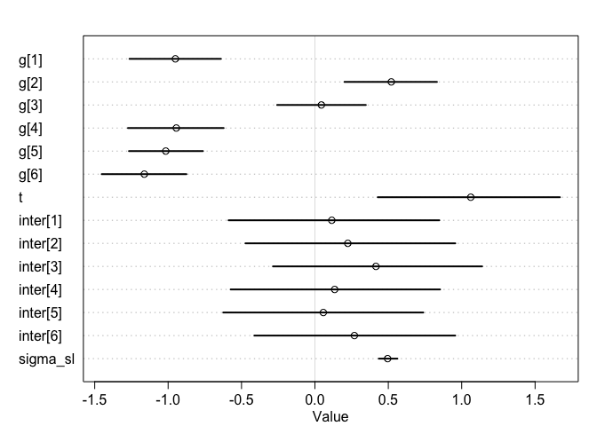
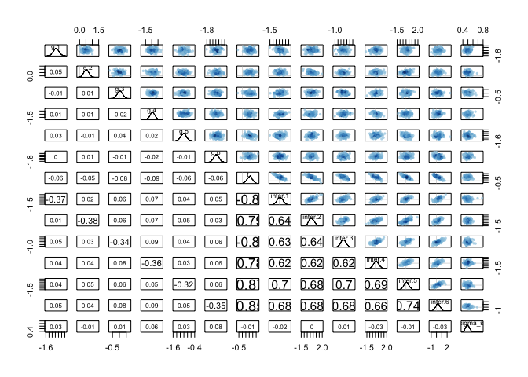
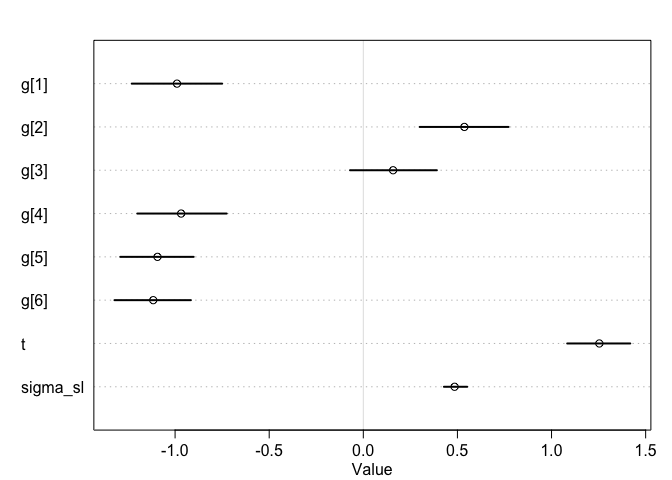
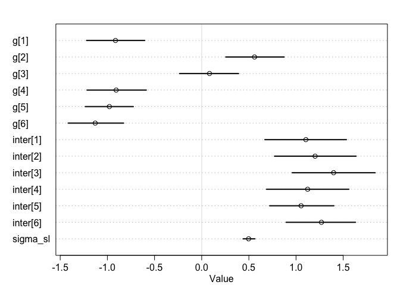
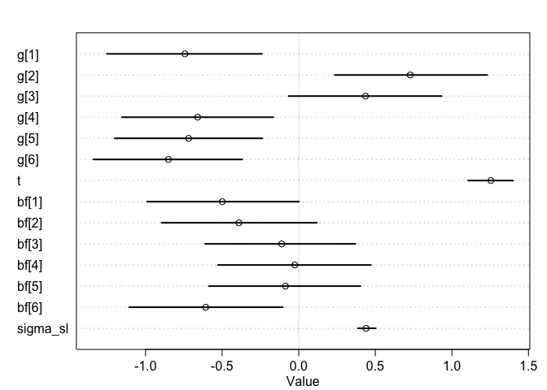
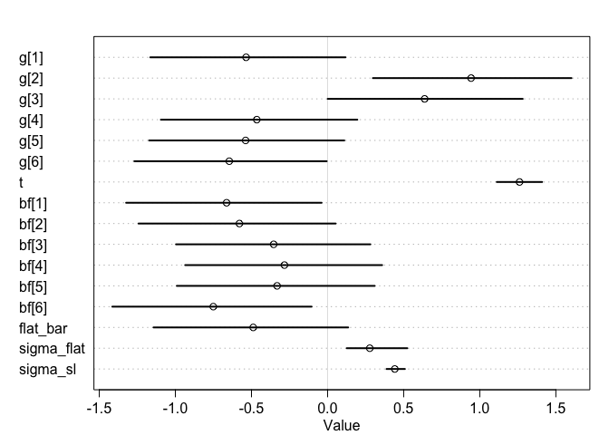
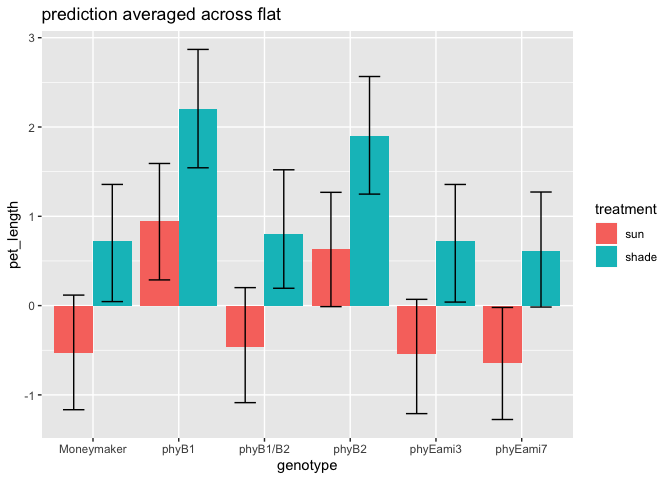
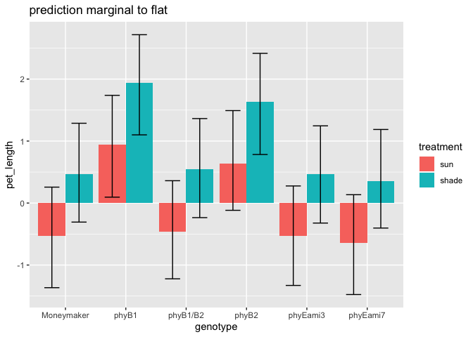
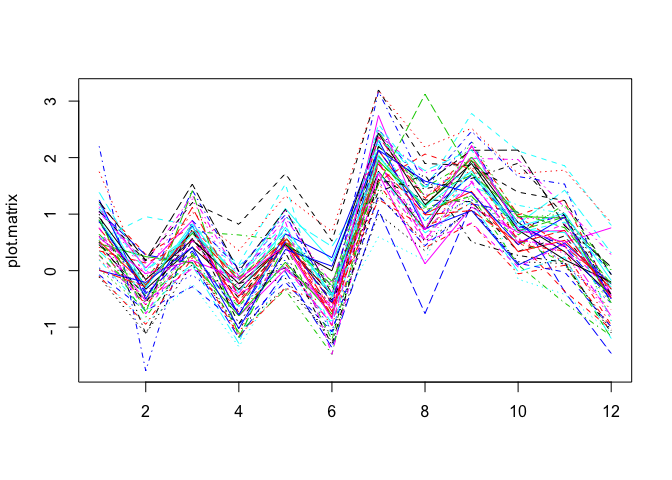
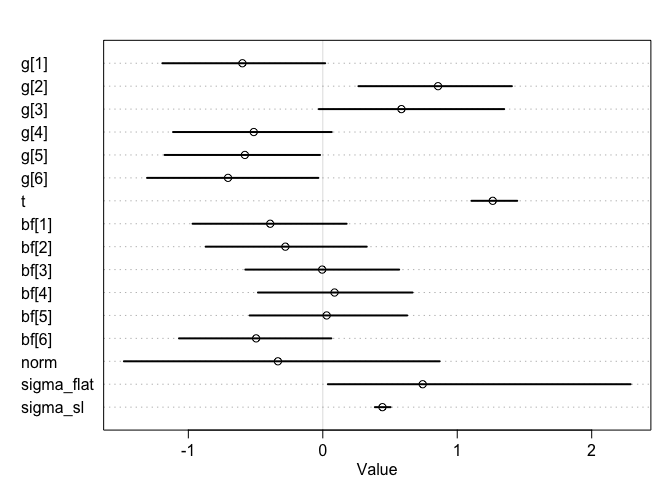

```r
data = read.csv("/Users/rongkui/Desktop/StatisticalRethinking/figure4phyE.csv")
head(data)
```

```
##   genotype treatment flat day   epi  int1  int2  int3  pet1  pet2  pet3  pet4
## 1 phyB1/B2     shade    1  21 24.03  3.18  0.00  0.00 14.11  4.88  0.00  0.00
## 2 phyB1/B2     shade    1  28 47.37 21.67 11.27  3.13 31.05 26.81 11.10  2.61
## 3 phyB1/B2     shade    1  35 58.83 40.60 72.29 52.70 42.15 49.60 49.58 30.49
## 4 phyB1/B2     shade    1  21 29.85  2.39  2.41  0.00 14.44 11.55  0.00  0.00
## 5 phyB1/B2     shade    1  28 59.69  3.36 25.52  6.62 35.10 29.15 20.05  9.39
## 6 phyB1/B2     shade    1  35 69.55  4.91 56.64 35.52 49.81 34.65 47.58 40.54
```

### Q1

#### a) subset the data for day 35     


```r
library(tidyverse)
```

```
## ── Attaching packages ───────────────────────────────────────────────────────────────────────────────────────────────────── tidyverse 1.3.0 ──
```

```
## ✓ ggplot2 3.2.1     ✓ purrr   0.3.3
## ✓ tibble  2.1.3     ✓ dplyr   0.8.3
## ✓ tidyr   1.0.2     ✓ stringr 1.4.0
## ✓ readr   1.3.1     ✓ forcats 0.4.0
```

```
## ── Conflicts ──────────────────────────────────────────────────────────────────────────────────────────────────────── tidyverse_conflicts() ──
## x dplyr::filter() masks stats::filter()
## x dplyr::lag()    masks stats::lag()
```

```r
data = data[data$day == 35,]
```

#### b) create a new column "stem_length" that is the sum of epi, int1, int2, and int3    

```r
data["stem_length"] = (data$epi + data$int1 + data$int2 + data$int3)
```

#### c) although flats are listed as 1-6, flats in sun and shade are separate. Create a new column "flat2" that corrects for this.    

```r
data['flat2'] = ifelse(data$treatment == 'shade', data$flat + 6, data$flat)
data
```

```
##       genotype treatment flat day   epi  int1   int2  int3  pet1  pet2  pet3
## 3     phyB1/B2     shade    1  35 58.83 40.60  72.29 52.70 42.15 49.60 49.58
## 6     phyB1/B2     shade    1  35 69.55  4.91  56.64 35.52 49.81 34.65 47.58
## 9     phyB1/B2     shade    2  35 70.22 62.61  59.66 31.25 46.28 56.79 47.93
## 12    phyB1/B2     shade    3  35 54.60 38.64  67.62 35.19 39.11 66.57 68.85
## 15    phyB1/B2     shade    3  35 58.16 55.31 104.74 39.97 44.85 65.33 60.64
## 18    phyB1/B2     shade    5  35 59.88 58.67  74.77 33.33 36.40 39.28 50.71
## 21    phyB1/B2       sun    1  35 37.38 28.14  32.34 15.44 32.52 39.85 45.45
## 24    phyB1/B2       sun    1  35 66.53 36.08  25.82 19.14 50.46 49.34 49.63
## 27    phyB1/B2       sun    2  35 43.99  3.02  37.02 12.15 36.14 40.57 29.88
## 30    phyB1/B2       sun    3  35 67.73 41.21  30.41 20.60 45.82 53.15 44.34
## 33    phyB1/B2       sun    3  35 59.90 45.39  39.43 22.26 51.76 53.40 58.32
## 36    phyB1/B2       sun    5  35 71.59 31.63  45.72 23.95 44.29 65.48 43.06
## 39    phyEami3     shade    1  35 17.56 21.75  18.68 29.44 38.45 40.36 50.76
## 42    phyEami3     shade    2  35 60.65 13.49  47.05 24.56 74.41 91.35 70.59
## 45    phyEami3     shade    5  35 42.75 54.18  51.92 41.96 69.90 85.70 81.31
## 48    phyEami3     shade    5  35 43.62 40.79  32.68 32.72 64.56 81.16 78.71
## 51    phyEami3     shade    6  35 41.19 52.25  41.95 30.71 81.25 92.87 88.74
## 54    phyEami3     shade    6  35 49.12 48.29  48.01 29.91 85.22 95.14 93.37
## 57    phyEami3       sun    1  35 31.98 12.13  19.42 20.50 71.52 62.23 75.68
## 60    phyEami3       sun    2  35 26.98 28.51  15.66 12.88 64.46 70.37 52.62
## 63    phyEami3       sun    5  35 30.78 24.65  26.90 17.85 68.64 74.43 77.20
## 66    phyEami3       sun    5  35 33.30 34.98  28.85 20.25 74.46 78.72 65.91
## 69    phyEami3       sun    6  35 21.76 17.73  18.67 16.03 59.47 70.26 64.29
## 72    phyEami3       sun    6  35 31.21 24.81  20.44 15.66 45.60 79.99 61.02
## 75    phyEami3     shade    1  35 36.27 34.18  35.25 23.27 72.18 88.05 88.93
## 78    phyEami3     shade    1  35 40.50 32.05  25.95 10.15 55.29 60.69 44.11
## 81    phyEami3     shade    4  35 43.22 60.46  37.06 31.78 82.63 64.16 65.35
## 84    phyEami3     shade    5  35 47.20 45.87  38.28 31.63 90.24 95.05 57.90
## 87    phyEami3     shade    5  35 43.48 38.52  39.61 26.87 91.87 87.50 51.00
## 90    phyEami3     shade    6  35 26.36 43.50  29.08 18.76 51.06 36.75 18.52
## 93    phyEami3       sun    1  35 38.93 30.66  19.53  9.02 57.52 65.66 45.75
## 96    phyEami3       sun    1  35 33.25 30.30  14.89 16.07 76.00 78.24 49.58
## 99    phyEami3       sun    6  35 24.67 27.51  10.75  8.79 55.79 36.44 25.96
## 102   phyEami7     shade    2  35 39.16 31.13  40.15 24.13 53.58 64.96 64.12
## 105   phyEami7     shade    2  35 27.71 29.05  31.93 21.61 70.73 71.80 68.93
## 108   phyEami7     shade    3  35 43.18 44.59  50.15 25.79 80.63 87.41 72.11
## 111   phyEami7     shade    4  35 37.34 40.13  61.11 35.06 74.65 89.41 84.21
## 114   phyEami7     shade    5  35 25.82 32.72  41.66 25.35 67.24 75.55 70.26
## 117   phyEami7     shade    6  35 27.59 35.70  50.44 33.24 56.79 91.48 75.32
## 120   phyEami7       sun    2  35 26.56 18.81  23.98 18.02 57.68 63.26 67.39
## 123   phyEami7       sun    4  35 32.10 21.65  20.50 18.04 60.90 57.37 58.29
## 126   phyEami7       sun    6  35 11.45 10.87  11.71 17.68 41.37 62.04 47.85
## 129   phyEami7     shade    1  35 34.30 34.04  45.64 29.77 65.37 87.39 82.99
## 132   phyEami7     shade    2  35 46.25 33.13  47.56 36.13 69.77 73.84 85.15
## 135   phyEami7     shade    3  35 38.46 35.26  54.85 37.66 74.16 71.33 79.65
## 138   phyEami7     shade    3  35 36.76 39.48  42.52 29.26 78.22 74.06 66.15
## 141   phyEami7     shade    4  35 47.56 46.46  28.00 25.43 80.42 64.91 56.05
## 144   phyEami7     shade    6  35 29.42 40.07  62.20 40.67 71.27 96.23 98.57
## 147   phyEami7       sun    1  35 28.06 19.25  26.02 17.02 63.45 61.96 61.73
## 150   phyEami7       sun    3  35 26.62 21.88  23.86 13.92 73.37 65.36 51.99
## 153   phyEami7       sun    3  35 27.00 17.45  19.92 12.96 69.70 49.96 44.68
## 156   phyEami7       sun    4  35 27.57 23.13  25.27 15.62 77.17 65.88 55.88
## 159      phyB1     shade    2  35 82.17  3.58  87.24 42.02 38.49 28.94 75.31
## 162      phyB1     shade    4  35 60.60 58.80  67.75 30.47 41.27 67.16 58.19
## 165      phyB1     shade    4  35 79.68 63.22  64.79 56.70 59.69 58.25 78.14
## 168      phyB1     shade    4  35 87.74 71.27  65.01 30.20 47.51 72.81 57.57
## 171      phyB1     shade    5  35 67.48 59.78  55.99 39.32 53.20 47.26 70.95
## 174      phyB1     shade    6  35 54.60 56.93  55.58 33.68 52.64 53.34 73.45
## 177      phyB1       sun    2  35 77.45 48.23  35.37 29.88 62.41 45.15 62.16
## 180      phyB1       sun    4  35 61.53 45.64  26.77 22.77 38.00 46.46 40.77
## 183      phyB1       sun    4  35 60.07 40.88  46.98 25.08 45.00 60.06 54.68
## 186      phyB1       sun    4  35 58.24 52.78  51.41 37.72 56.85 60.45 80.31
## 189      phyB1       sun    5  35 63.68 33.62  31.73 24.88 51.16 60.36 57.04
## 192      phyB1       sun    6  35 49.30 41.33  25.77 11.59 37.45 32.16 24.27
## 195      phyB2     shade    1  35 29.90 40.47  54.81 33.43 59.38 94.54 77.88
## 198      phyB2     shade    3  35 36.26 64.08  56.68 33.64 68.29 72.61 81.11
## 201      phyB2     shade    4  35 30.14 50.90  43.25 33.25 51.08 47.12 54.85
## 204      phyB2     shade    5  35 40.00 64.82  55.96 36.71 63.58 84.62 62.24
## 207      phyB2     shade    6  35 27.36 45.84  32.90 14.12 61.19 48.15 39.51
## 210      phyB2     shade    6  35 36.20 35.99  18.06  9.16 52.41 50.81 40.60
## 213      phyB2       sun    1  35 33.30 31.52  28.37 15.48 65.90 63.81 48.57
## 216      phyB2       sun    3  35 26.41 28.04  29.20 19.28 60.33 60.06 52.71
## 219      phyB2       sun    4  35 30.86 33.96  22.30 14.17 58.71 43.24 47.30
## 222      phyB2       sun    5  35 24.80 31.72  28.52 12.52 56.94 67.33 51.92
## 225      phyB2       sun    6  35 10.94 15.30  19.20 19.15 56.21 47.69 45.67
## 228      phyB2       sun    6  35 21.46 23.32  23.33 16.90 58.45 82.19 56.51
## 231 Moneymaker     shade    1  35 37.80 46.85  48.61 30.14 68.06 83.27 70.19
## 234 Moneymaker     shade    2  35 41.90 43.18  39.16 26.85 67.35 92.68 62.96
## 237 Moneymaker     shade    2  35 30.30 33.38  43.58 31.57 62.62 94.58 83.10
## 240 Moneymaker     shade    3  35 31.30 53.73  46.52 27.33 56.16 87.10 60.80
## 243 Moneymaker     shade    3  35 39.25 39.20  43.86 14.73 61.31  0.00 46.11
## 246 Moneymaker     shade    4  35 43.74 52.95  40.77 28.62 65.32 75.91 58.40
## 249 Moneymaker       sun    1  35 24.50 31.22  20.77 15.68 66.18 89.30 56.91
## 252 Moneymaker       sun    2  35 25.58 27.93  22.92 15.83 68.57 73.96 67.40
## 255 Moneymaker       sun    2  35 26.16 19.68  21.28 29.02 62.64 61.92 74.27
## 258 Moneymaker       sun    3  35 31.02 29.54  17.75 14.53 67.43 69.29 56.67
## 261 Moneymaker       sun    3  35 33.56 25.40  19.31  9.76 58.06 61.62 30.21
## 264 Moneymaker       sun    4  35 31.69 29.34  21.61 12.91 66.04 57.87 37.26
##      pet4 stem_length flat2
## 3   30.49      224.42     7
## 6   40.54      166.62     7
## 9   28.40      223.74     8
## 12  53.21      196.05     9
## 15  43.54      258.18     9
## 18  33.98      226.65    11
## 21  42.38      113.30     1
## 24  38.70      147.57     1
## 27  27.69       96.18     2
## 30  17.87      159.95     3
## 33  37.05      166.98     3
## 36  22.30      172.89     5
## 39  72.12       87.43     7
## 42  58.01      145.75     8
## 45  40.02      190.81    11
## 48  62.76      149.81    11
## 51  46.56      166.10    12
## 54  38.98      175.33    12
## 57  57.52       84.03     1
## 60  41.95       84.03     2
## 63  36.30      100.18     5
## 66  31.22      117.38     5
## 69  34.13       74.19     6
## 72  23.78       92.12     6
## 75  43.68      128.97     7
## 78  16.67      108.65     7
## 81  39.17      172.52    10
## 84  56.46      162.98    11
## 87  42.85      148.48    11
## 90  11.66      117.70    12
## 93  32.15       98.14     1
## 96  32.63       94.51     1
## 99  11.97       71.72     6
## 102 19.67      134.57     8
## 105 30.59      110.30     8
## 108 33.61      163.71     9
## 111 45.45      173.64    10
## 114 38.04      125.55    11
## 117 61.10      146.97    12
## 120 32.52       87.37     2
## 123 46.57       92.29     4
## 126 56.35       51.71     6
## 129 35.85      143.75     7
## 132 51.56      163.07     8
## 135 37.36      166.23     9
## 138 30.94      148.02     9
## 141 28.35      147.45    10
## 144 44.42      172.36    12
## 147 44.50       90.35     1
## 150 18.66       86.28     3
## 153 19.48       77.33     3
## 156 27.46       91.59     4
## 159 69.52      215.01     8
## 162 41.29      217.62    10
## 165 48.95      264.39    10
## 168 30.27      254.22    10
## 171 30.34      222.57    11
## 174 61.80      200.79    12
## 177 55.62      190.93     2
## 180 38.10      156.71     4
## 183 31.36      173.01     4
## 186 37.22      200.15     4
## 189 27.25      153.91     5
## 192 17.70      127.99     6
## 195 37.71      158.61     7
## 198 44.84      190.66     9
## 201 24.57      157.54    10
## 204 50.75      197.49    11
## 207 24.98      120.22    12
## 210 10.83       99.41    12
## 213 41.15      108.67     1
## 216 30.75      102.93     3
## 219 26.18      101.29     4
## 222 21.08       97.56     5
## 225 43.00       64.59     6
## 228 40.32       85.01     6
## 231 29.46      163.40     7
## 234 29.62      151.09     8
## 237 58.89      138.83     8
## 240 25.80      158.88     9
## 243 13.55      137.04     9
## 246 27.20      166.08    10
## 249 44.68       92.17     1
## 252 32.26       92.26     2
## 255 31.91       96.14     2
## 258 22.97       92.84     3
## 261 19.11       88.03     3
## 264 23.66       95.55     4
```

```r
mean(data$stem_length)
```

```
## [1] 141.2442
```

Ultimately you want to know if any of the mutants have a different length from Moneymaker, in sun or in shade, or if the response to shade differs.    

### Q2
#### a) don't include flat.  Determine whether genotype, treatment, and their interaction are important predictors of stem_length     


```r
library(rethinking)
```

```
## Loading required package: rstan
```

```
## Loading required package: StanHeaders
```

```
## rstan (Version 2.19.2, GitRev: 2e1f913d3ca3)
```

```
## For execution on a local, multicore CPU with excess RAM we recommend calling
## options(mc.cores = parallel::detectCores()).
## To avoid recompilation of unchanged Stan programs, we recommend calling
## rstan_options(auto_write = TRUE)
```

```
## 
## Attaching package: 'rstan'
```

```
## The following object is masked from 'package:tidyr':
## 
##     extract
```

```
## Loading required package: parallel
```

```
## Loading required package: dagitty
```

```
## rethinking (Version 1.92)
```

```
## 
## Attaching package: 'rethinking'
```

```
## The following object is masked from 'package:purrr':
## 
##     map
```

```
## The following object is masked from 'package:stats':
## 
##     rstudent
```

```r
d = list(
  geno = as.numeric(data$genotype),
  trt = ifelse(data$treatment == "shade", 1, 0),
  sl = scale(data$stem_length)
)

mod2a = ulam(
  alist(
    sl ~ dnorm(mu, sigma_sl),
    mu <- g[geno] + t*trt + inter[geno]*trt,
    g[geno]  ~ dnorm(0,1),
    t ~ dnorm(0,1),
    inter[geno] ~ dnorm(0,1),
    sigma_sl ~ dexp(1)
  ), data = d, chains = 4, cores = 4, iter = 2000, log_lik = TRUE
)
```


```r
precis(mod2a, depth = 2)
```

```
##                 mean         sd       5.5%      94.5%    n_eff      Rhat
## g[1]     -0.95064738 0.19312830 -1.2631655 -0.6404403 5062.943 0.9998560
## g[2]      0.52029293 0.19912075  0.2012477  0.8314696 4305.406 1.0005485
## g[3]      0.04404739 0.19143151 -0.2574581  0.3469558 4586.931 0.9996048
## g[4]     -0.94432275 0.20262758 -1.2737568 -0.6215923 4195.985 1.0002253
## g[5]     -1.01612233 0.15943174 -1.2668069 -0.7627076 4766.751 1.0001830
## g[6]     -1.16234124 0.18054976 -1.4524659 -0.8752455 5106.695 0.9993140
## t         1.06175394 0.38421697  0.4280549  1.6690374 1021.972 0.9997329
## inter[1]  0.11489331 0.45033656 -0.5880948  0.8475820 1259.496 0.9998744
## inter[2]  0.22412239 0.45510522 -0.4730287  0.9564085 1262.663 0.9997444
## inter[3]  0.41580540 0.44477538 -0.2859050  1.1394658 1264.694 0.9997705
## inter[4]  0.13473809 0.44685920 -0.5740849  0.8527942 1252.359 1.0002921
## inter[5]  0.05742511 0.42227877 -0.6246874  0.7384088 1200.482 0.9999844
## inter[6]  0.26908086 0.42862392 -0.4128013  0.9561638 1161.362 1.0000701
## sigma_sl  0.49543171 0.04078688  0.4352675  0.5621408 3957.256 0.9994856
```

```r
plot(mod2a, depth = 2)
```

<!-- -->


```r
pairs(mod2a) #strong negative correlation between treatment effect and interaction effect
```

<!-- -->

> Nothing seemed to have any effect...? Try without interaction   


```r
mod2a2 = ulam(
  alist(
    sl ~ dnorm(mu, sigma_sl),
    mu <- g[geno] + t*trt,
    g[geno]  ~ dnorm(0, 1),
    t ~ dnorm(0,1),
    sigma_sl ~ dexp(1)
  ), data = d, chains = 4, cores = 4, iter = 2000, log_lik = TRUE
)
```


```r
precis(mod2a2, depth = 2)
```

```
##                mean         sd        5.5%      94.5%    n_eff      Rhat
## g[1]     -0.9898866 0.15073548 -1.23028294 -0.7500495 2908.435 0.9992072
## g[2]      0.5368592 0.14612190  0.29942851  0.7716627 2878.895 0.9998560
## g[3]      0.1582131 0.14555533 -0.07054618  0.3907819 2790.978 1.0004447
## g[4]     -0.9678867 0.14813126 -1.20071306 -0.7260669 2683.462 1.0003976
## g[5]     -1.0934626 0.12244895 -1.29128432 -0.9012959 2587.764 0.9997131
## g[6]     -1.1160906 0.12633845 -1.32195045 -0.9161112 2459.271 1.0001170
## t         1.2539492 0.10335917  1.08333704  1.4181947 1695.680 1.0001056
## sigma_sl  0.4849814 0.03864461  0.42832688  0.5517157 3066.827 1.0019345
```

```r
plot(mod2a2, depth = 2)
```

<!-- -->


```r
compare(mod2a, mod2a2)
```

```
##            WAIC     pWAIC   dWAIC     weight       SE      dSE
## mod2a2 129.7062  7.674333 0.00000 0.98561266 14.20500       NA
## mod2a  138.1601 11.613308 8.45383 0.01438734 13.59318 2.738746
```

> The one without interaction is much better. 

##### OR, you can keep the interaction and drop the main:    

```r
mod2a3 = ulam(
  alist(
    sl ~ dnorm(mu, sigma_sl),
    mu <- g[geno] + inter[geno]*trt,
    g[geno]  ~ dnorm(0, 1),
    inter[geno] ~ dnorm(0,1),
    sigma_sl ~ dexp(1)
  ), data = d, chains = 4, cores = 4, iter = 2000, log_lik = TRUE
)
```


```r
precis(mod2a3, depth = 2)
```

```
##                mean         sd       5.5%      94.5%    n_eff      Rhat
## g[1]     -0.9141574 0.19739885 -1.2206472 -0.6045965 3915.519 0.9997831
## g[2]      0.5601550 0.19218562  0.2550266  0.8735372 3885.977 0.9992769
## g[3]      0.0827506 0.19628527 -0.2350976  0.3909407 3713.642 1.0015131
## g[4]     -0.9066508 0.19734560 -1.2164309 -0.5868738 3612.664 1.0006306
## g[5]     -0.9787303 0.15914196 -1.2344957 -0.7248425 3585.895 0.9994003
## g[6]     -1.1288199 0.18263988 -1.4159596 -0.8280286 3462.628 1.0003776
## inter[1]  1.1044360 0.27449805  0.6694561  1.5343567 3963.718 0.9993535
## inter[2]  1.2020905 0.26777302  0.7717083  1.6369604 3765.140 0.9992907
## inter[3]  1.3988111 0.27448970  0.9599603  1.8389536 3971.078 1.0008782
## inter[4]  1.1230850 0.27487087  0.6869581  1.5600224 3604.741 0.9997441
## inter[5]  1.0538842 0.21376699  0.7209528  1.4016130 3657.287 0.9992191
## inter[6]  1.2696794 0.23047836  0.8950347  1.6310074 3470.421 1.0007974
## sigma_sl  0.4975240 0.03949603  0.4389085  0.5642982 3477.263 0.9996618
```

```r
plot(mod2a3, depth = 2)
```

<!-- -->


```r
compare(mod2a, mod2a2, mod2a3)
```

```
##            WAIC     pWAIC    dWAIC     weight       SE      dSE
## mod2a2 129.7062  7.674333 0.000000 0.97495497 14.20500       NA
## mod2a  138.1601 11.613308 8.453830 0.01423177 13.59318 2.738746
## mod2a3 138.7095 11.476109 9.003236 0.01081326 13.46847 2.838306
```

> the main effect model is still better. But I guess it depends on what you are interested in. mod2a3 gives you a read out on response to shade in every genotype. 

#### b) starting with your best model from a), include flat without pooling     


```r
d2 = list(
  geno = as.numeric(data$genotype),
  trt = ifelse(data$treatment == "shade", 1, 0),
  flat = data$flat,
  sl = scale(data$stem_length)
)

mod2b = ulam(
  alist(
    sl ~ dnorm(mu, sigma_sl),
    mu <- g[geno] + t*trt + bf[flat],
    g[geno]  ~ dnorm(0, 1),
    t ~ dnorm(0,1),
    bf[flat] ~dnorm(0,1),
    sigma_sl ~ dexp(1)
  ), data = d2, chains = 4, cores = 4, iter = 2000, log_lik = TRUE
)
```


```r
precis(mod2b, depth = 2)
```

```
##                 mean         sd        5.5%        94.5%     n_eff     Rhat
## g[1]     -0.74276690 0.31597464 -1.25260183 -0.240457439  593.6274 1.006816
## g[2]      0.72788795 0.31365006  0.23553557  1.230981130  559.8381 1.006235
## g[3]      0.43592656 0.31357749 -0.06568751  0.933445138  587.6642 1.005072
## g[4]     -0.65942713 0.31065675 -1.15328528 -0.166045587  572.2782 1.006725
## g[5]     -0.71905065 0.30398871 -1.20153165 -0.237442720  560.3967 1.007554
## g[6]     -0.85055248 0.30459002 -1.34182281 -0.368023941  539.8956 1.006790
## t         1.25408600 0.09203524  1.10718502  1.399016735 1876.2552 1.000768
## bf[1]    -0.49891306 0.30890382 -0.98995658  0.001550197  555.2792 1.005669
## bf[2]    -0.39060476 0.31279431 -0.89524758  0.117983304  569.5176 1.006777
## bf[3]    -0.11130515 0.30887019 -0.61143727  0.369904818  570.7856 1.006084
## bf[4]    -0.02540435 0.31451463 -0.52709392  0.470813421  568.4615 1.006559
## bf[5]    -0.08655069 0.31118767 -0.58596354  0.402805184  586.7364 1.006133
## bf[6]    -0.60756624 0.30998466 -1.10620317 -0.104463763  590.2593 1.005846
## sigma_sl  0.44004775 0.03707093  0.38602359  0.502335427 1526.7754 1.003283
```

```r
plot(mod2b, depth = 2)
```

<!-- -->

> There does seem to be a flat effect


```r
compare(mod2b, mod2a2)
```

```
##            WAIC     pWAIC    dWAIC      weight       SE      dSE
## mod2b  117.0856 11.520696  0.00000 0.998185804 13.07893       NA
## mod2a2 129.7062  7.674333 12.62059 0.001814196 14.20500 8.023377
```

> mod2b wins by a landslide. 

#### c) starting with your best model from a), use a hierarchical model that allows partial pooling across flats     


```r
mod2c = ulam(
  alist(
    sl ~ dnorm(mu, sigma_sl),
    mu <- g[geno] + t*trt + bf[flat],
    g[geno]  ~ dnorm(0, 1),
    t ~ dnorm(0,1),
    bf[flat] ~ dnorm(flat_bar,sigma_flat),
    flat_bar ~ dnorm(0,1), 
    c(sigma_sl, sigma_flat) ~ dexp(1)
  ), data = d2, chains = 4, cores = 4, iter = 2000, log_lik = TRUE
)
```

```
## Warning: There were 4 divergent transitions after warmup. Increasing adapt_delta above 0.95 may help. See
## http://mc-stan.org/misc/warnings.html#divergent-transitions-after-warmup
```

```
## Warning: Examine the pairs() plot to diagnose sampling problems
```


```r
precis(mod2c, depth = 2)
```

```
##                  mean         sd         5.5%        94.5%     n_eff      Rhat
## g[1]       -0.5352853 0.40715289 -1.164867226  0.117824655  511.6754 1.0062001
## g[2]        0.9431077 0.41214930  0.297778601  1.602770450  507.5705 1.0082964
## g[3]        0.6377102 0.40966391  0.001385696  1.282279633  523.5540 1.0068481
## g[4]       -0.4649514 0.40807145 -1.095269683  0.195494977  512.6527 1.0068292
## g[5]       -0.5385288 0.40490285 -1.172412893  0.109872864  505.8904 1.0072029
## g[6]       -0.6458842 0.40598019 -1.269673380 -0.005704414  502.0010 1.0071898
## t           1.2613813 0.09331705  1.112060949  1.409821621 1900.8481 0.9999733
## bf[1]      -0.6634984 0.40766736 -1.323664166 -0.039166801  513.4160 1.0067781
## bf[2]      -0.5791422 0.40912301 -1.242099574  0.053094596  503.5073 1.0068153
## bf[3]      -0.3542948 0.40920682 -0.995993602  0.281451032  495.3262 1.0069601
## bf[4]      -0.2834264 0.41304517 -0.935658003  0.358638656  496.8709 1.0084209
## bf[5]      -0.3315997 0.41109436 -0.990661794  0.309713921  504.3544 1.0083877
## bf[6]      -0.7508324 0.41107605 -1.414522800 -0.104875982  510.2515 1.0082372
## flat_bar   -0.4885578 0.40937514 -1.143359605  0.135528359  516.5608 1.0079976
## sigma_flat  0.2773169 0.13031158  0.126096102  0.523847809 1488.1729 1.0020689
## sigma_sl    0.4418628 0.03795113  0.387399332  0.508155155 1779.2560 1.0009407
```

```r
plot(mod2c, depth = 2)
```

<!-- -->

### Q3) Compare the models, which is preferred?


```r
compare(mod2b, mod2c)
```

```
##           WAIC    pWAIC      dWAIC    weight       SE      dSE
## mod2c 117.0304 11.11941 0.00000000 0.5069095 13.44007       NA
## mod2b 117.0856 11.52070 0.05527977 0.4930905 13.07893 1.836044
```

> mod2b is slightly better. 

> We could center the pooleed effect at 0 and only look at sigma_fl


```r
mod2c2 = ulam(
  alist(
    sl ~ dnorm(mu, sigma_sl),
    mu <- g[geno] + t*trt + bf[flat],
    g[geno]  ~ dnorm(0, 1),
    t ~ dnorm(0,1),
    bf[flat] ~ dnorm(0,sigma_flat),
    c(sigma_sl, sigma_flat) ~ dexp(1)
  ), data = d2, chains = 4, cores = 4, iter = 2000, log_lik = TRUE
)
```


```r
compare(mod2c, mod2c2)
```

```
##            WAIC    pWAIC     dWAIC    weight       SE       dSE
## mod2c  117.0304 11.11941 0.0000000 0.5210982 13.44007        NA
## mod2c2 117.1992 11.22764 0.1688858 0.4789018 13.53868 0.3923148
```

> about the same

### Q4) Using the hierarchical model, make posterior predictions
#### a) for average cluster      


```r
post <- extract.samples(mod2c)
str(post)
```

```
## List of 6
##  $ g         : num [1:4000, 1:6] -0.544 -0.314 -0.494 -0.283 -0.919 ...
##  $ t         : num [1:4000(1d)] 1.38 1.13 1.27 1.3 1.37 ...
##  $ bf        : num [1:4000, 1:6] -0.837 -0.838 -0.493 -1.126 -0.513 ...
##  $ flat_bar  : num [1:4000(1d)] -0.573 -0.588 -0.38 -0.939 -0.412 ...
##  $ sigma_flat: num [1:4000(1d)] 0.163 0.289 0.25 0.318 0.383 ...
##  $ sigma_sl  : num [1:4000(1d)] 0.398 0.435 0.421 0.42 0.436 ...
##  - attr(*, "source")= chr "ulam posterior: 4000 samples from mod2c"
```


```r
link_avg <- function(geno, trt) {
  with(post, g[,geno] + t*trt)
}
data35 <- data %>%
  filter(day==35) %>%
  mutate(stem_length=epi + int1 + int2 + int3,
         flat2=as.integer(as.factor(str_c(treatment, flat))),
         shade_i=ifelse(treatment=="sun", 0L, 1L),
         g_i= as.integer(factor(genotype,
                                   levels=c("Moneymaker", 
                                            "phyB1", 
                                            "phyB2", 
                                            "phyB1/B2", 
                                            "phyEami3", 
                                            "phyEami7")))) %>%
  select(genotype, treatment, g_i, shade_i, flat2, stem_length)
pred.df <- data35 %>% 
  select(-stem_length, -flat2) %>% 
  unique() %>%
  mutate(treatment=factor(treatment, levels = c("sun", "shade")) ) # so the plot order is correct
pred.df.avg <- pred.df %>%
  mutate(average_response=map2(g_i, shade_i, link_avg),
         pet_length=map_dbl(average_response, mean),
         low.89=map_dbl(average_response, ~ HPDI(.)[1]),
         high.89=map_dbl(average_response, ~ HPDI(.)[2]))
pred.df.avg
```

```
##      genotype treatment g_i shade_i
## 1    phyB1/B2     shade   4       1
## 2    phyB1/B2       sun   4       0
## 3    phyEami3     shade   5       1
## 4    phyEami3       sun   5       0
## 5    phyEami7     shade   6       1
## 6    phyEami7       sun   6       0
## 7       phyB1     shade   2       1
## 8       phyB1       sun   2       0
## 9       phyB2     shade   3       1
## 10      phyB2       sun   3       0
## 11 Moneymaker     shade   1       1
## 12 Moneymaker       sun   1       0
##                                                                                                                                                                                                                                                                                                                                                                                                                                                                                                                                                                                                                                                                                                                                                                                                                                                                                                                                                                                                                                                                                                                                                                                                                                                                                                                                                                                                                                                                                                                                                                                                                                                                                                                                                                                                                                                                                                                                                                                                                                                                                                                                                                                                                                                                                                                                                                                                                                                                                                                                                                                                                                                                                                                                                                                                                                                                                                                                                                                                                                                                                                                                                                                                                                                                                                                                                                                                                                                                                                                                                                                                                                                                                                                                                                                                                                                                                                                                                                                                                                                                                                                                                                                                                                                                                                                                                                                                                                                                                                                                                                                                                                                                                                                                                                                                                                                                                                                                                                                                                                                                                                                                                                                                                                                                                                                                                                                                                                                                                                                                                                                                                                                                                                                                                                                                                                                                                                                                                                                                                                                                                                                                                                                                                                                                                                                                                                                                                                                                                                                                                                                                                                                                                                                                                                                                                                                                                                                                                                                                                                                                                                                                                                                                                                                                                                                                                                                                                                                                                                                                                                                                                                                                                                                                                                                                                                                                                                                                                                                                                                                                                                                                                                                                                                                                                                                                                                                                                                                                                                                                                                                                                                                                                                                                                                                                                                                                                                                                                                                                                                                                                                                                                                                                                                                                                                                                                                                                                                                                                                                                                                                                                                                                                                                                                                                                                                                                                                                                                                                                                                                                                                                                                                                                                                                                                                                                                                                                                                                                                                                                                                                                                                                                                                                                                                                                                                                                                                                                                                                                                                                                                                                                                                                                                                                                                                                                                                                                                                                                                                                                                                                                                                                                                                                                                                                                                                                                                                                                                                                                                                                                                                                                                                                                                                                                                                                                                                                                                                                                                                                                                                                                                                                                                                                                                                                                                                                                                                                                                                                                                                                                                                                                                                                                                                                                                                                                                                                                                                                                                                                                                                                                                                                                                                                                                                                                                                                                                                                                                                                                                                                                                                                                                                                                                                                                                                                                                                                                                                                                                                                                                                                                                                                                                                                                                                                                                                                                                                                                                                                                                                                                                                                                                                                                                                                                                                                                                                                                                                                                                                                                                                                                                                                                                                                                                                                                                                                                                                                                                                                                                                                                                                                                                                                                                                                                                                                                                                                                                                                                                                                                                                                                                                                                                                                                                                                                                                                                                                                                                                                                                                                                                                                                                                                                                                                                                                                                                                                                                                                                                                                                                                                                                                                                                                                                                                                                                                                                                                                                                                                                                                                                                                                                                                                                                                                                                                                                                                                                                                                                                                                                                                                                                                                                                                                                                                                                                                                                                                                                                                                                                                                                                                                                                                                                                                                                                                                                                                                                                                                                                                                                                                                                                                                                                                                                                                                                                                                                                                                                                                                                                                                                                                                                                                                                                                                                                                                                                                                                                                                                                                                                                                                                                                                                                                                                                                                                                                                                                                                                                                                                                                                                                                                                                                                                                                                                                                                                                                                                                                                                                                                                                                                                                                                                                                                                                                                                                                                                                                                                                                                                                                                                                                                                                                                                                                                                                                                                                                                                                                                                                                                                                                                                                                                                                                                                                                                                                                                                                                                                                                                                                                                                                                                                                                                                                                                                                                                                                                                                                                                                                                                                                                                                                                                                                                                                                                                                                                                                                                                                                                                                                                                                                                                                                                                                                                                                                                                                                                                                                                                                                                                                                                                                                                                                                                                                                                                                                                                                                                                                                                                                                                                                                                                                                                                                                                                                                                                                                                                                                                                                                                                                                                                                                                                                                                                                                                                                                                                                                                                                                                                                                                                                                                                                                                                                                                                                                                                                                                                                                                                                                                                                                                                                                                                                                                                                                                                                                                                                                                                                                                                                                                                                                                                                                                                                                                                                                                                                                                                                                                                                                                                                                                                                                                                                                                                                                                                                                                                                                                                                                                                                                                                                                                                                                                                                                                                                                                                                                                                                                                                                                                                                                                                                                                                                                                                                                                                                                                                                                                                                                                                                                                                                                                                                                                                                                                                                                                                                                                                                                                                                                                                                                                                                                                                                                                                                                                                                                                                                                                                                                                                                                                                                                                                                                                                                                                                                                                                                                                                                                                                                                                                                                                                                                                                                                                                                                                                                                                                                                                                                                                                                                                                                                                                                                                                                                                                                                                                                                                                                                                                                                                                                                                                                                                                                                                                                                                                                                                                                                                                                                                                                                                                                                                                                                                                                                                                                                                                                                                                                                                                                                                                                                                                                                                                                                                                                                                                                                                                                                                                                                                                                                                                                                                                                                                                                                                                                                                                                                                                                                                                                                                                                                                                                                                                                                                                                                                                                                                                                                                                                                                                                                                                                                                                                                                                                                                                                                                                                                                                                                                                                                                                                                                                                                                                                                                                                                                                                                                                                                                                                                                                                                                                                                                                                                                                                                                                                                                                                                                                                                                                                                                                                                                                                                                                                                                                                                                                                                                                                                                                                                                                                                                                                                                                                                                                                                                                                                                                                                                                                                                                                                                                                                                                                                                                                                                                                                                                                                                                                                                                                                                                                                                                                                                                                                                                                                                                                                                                                                                                                                                                                                                                                                                                                                                                                                                                                                                                                                                                                                                                                                                                                                                                                                                                                                                                                                                                                                                                                                                                                                                                                                                                                                                                                                                                                                                                                                                                                                                                                                                                                                                                                                                                                                                                                                                                                                                                                                                                                                                                                                                                                                                                                                                                                                                                                                                                                                                                                                                                                                                                                                                                                                                                                                                                                                                                                                                                                                                                                                                                                                                                                                                                                                                                                                                                                                                                                                                                                                                                                                                                                                                                                                                                                                                                                                                                                                                                                                                                                                                                                                                                                                                                                                                                                                                                                                                                                                                                                                                                                                                                                                                                                                                                                                                                                                                                                                                                                                                                                                                                                                                                                                                                                                                                                                                                                                                                                                                                                                                                                                                                                                                                                                                                                                                                                                                                                                                                                                                                                                                                                                                                                                                                                                                                                                                                                                                                                                                                                                                                                                                                                                                                                                                                                                                                                                                                                                                                                                                                                                                                                                                                                                                                                                                                                                                                                                                                                                                                                                                                                                                                                                                                                                                                                                                                                                                                                                                                                                                                                                                                                                                                                                                                                                                                                                                                                                                                                                                                                                                                                                                                                                                                                                                                                                                                                                                                                                                                                                                                                                                                                                                                                                                                                                                                                                                                                                                                                                                                                                                                                                                                                                                                                                                                                                                                                                                                                                                                                                                                                                                                                                                                                                                                                                                                                                                                                                                                                                                                                                                                                                                                                                                                                                                                                                                                                                                                                                                                                                                                                                                                                                                                                                                                                                                                                                                                                                                                                                                                                                                                                                                                                                                                                                                                                                                                                                                                                                                                                                                                                                                                                                                                                                                                                                                                                                                                                                                                                                                                                                                                                                                                                                                                                                                                                                                                                                                                                                                                                                                                                                                                                                                                                                                                                                                                                                                                                                                                                                                                                                                                                                                                                                                                                                                                                                                                                                                                                                                                                                                                                                                                                                                                                                                                                                                                                                                                                                                                                                                                                                                                                                                                                                                                                                                                                                                                                                                                                                                                                                                                                                                                                                                                                                                                                                                                                                                                                                                                                                                                                                                                                                                                                                                                                                                                                                                                                                                                                                                                                                                                                                                                                                                                                                                                                                                                                                                                                                                                                                                                                                                                                                                                                                                                                                                                                                                                                                                                                                                                                                                                                                                                                                                                                                                                                                                                                                                                                                                                                                                                                                                                                                                                                                                                                                                                                                                                                                                                                                                                                                                                                                                                                                                                                                                                                                                                                                                                                                                                                                                                                                                                                                                                                                                                                                                                                                                                                                                                                                                                                                                                                                                                                                                                                                                                                                                                                                                                                                                                                                                                                                                                                                                                                                                                                                                                                                                                                                                                                                                                                                                                                                                                                                                                                                                                                                                                                                                                                                                                                                                                                                                                                                                                                                                                                                                                                                                                                                                                                                                                                                                                                                                                                                                                                                                                                                                                                                                                                                                                                                                                                                                                                                                                                                                                                                                                                                                                                                                                                                                                                                                                                                                                                                                                                                                                                                                                                                                                                                                                                                                                                                                                                                                                                                                                                                                                                                                                                                                                                                                                                                                                                                                                                                                                                                                                                                                                                                                                                                                                                                                                                                                                                                                                                                                                                                                                                                                                                                                                                                                                                                                                                                                                                                                                                                                                                                                                                                                                                                                                                                                                                                                                                                                                                                                                                                                                                                                                                                                                                                                                            average_response
## 1                                                                                                                                                                                                                                                                                                                                                                                                                                                                                                                                                                                                                                                                                                                                                                                                                                                                                                                                                                                                                                                                                                                                                                                                                                                                                                                                                                                                                                                                                                                                                                                                                                                                                                                                                                                                                                                                                                                                                                                                                                                                                                                                                                                                                                                                                                                                                                                                                                                                                                                                                                                                                                                                                                                                                                                                                                                                                                                                                                                                                                                                                                                                                                                                                                                                                                                                                                                                                                                                                                                                                                                                                                                                                                                                                                                                                           1.0907474629, 1.1138012635, 0.7927965724, 1.2865317680, 0.7457347965, 0.7408680789, 0.6677164625, 0.5056486965, 1.1871731212, 0.3703614561, 0.9747227445, 0.6403179754, 0.9136921981, 0.5237352605, 1.0624360644, 0.9787839743, 1.6658142048, 0.5478663617, 0.5745043786, 1.2206872387, 1.3092862978, 0.2569200240, 0.0070701098, 1.5009402064, 1.5528935432, 1.0221222216, 0.8054156745, 0.5289081618, 1.1074633808, 0.7089469690, 0.9458007673, 0.8251672701, 0.8281135371, 1.3768362391, 1.2791325755, 0.7362213919, 1.2757860617, 1.4946394870, 0.4886446521, 0.6553803845, 1.1991688444, 0.2658795488, 0.0100120312, 0.2793318801, 1.0776263113, 0.8260852100, 1.2273528028, 1.1190326050, 0.9451395861, 0.9619067815, 0.9948562980, 1.1276575587, 1.0861344625, 0.5321577246, 1.2139999803, 0.8912291088, 0.7903141692, 0.0148084640, -0.1124798834, 1.2845837538, 0.4478477801, 1.1857441481, 0.8340654920, 0.8298161100, 1.1235138955, 0.9340331979, 0.4495760304, 0.8273284453, 0.4243391158, 1.2851780519, 1.8154278334, 1.4156553272, 1.0846731586, 0.6101131228, 0.6735502235, 0.3852790467, 1.2876681091, 1.0956414187, 0.8908763113, 1.4868064076, 0.6501048706, 0.1327416067, 1.3289408581, 0.5722214086, -0.0318075745, 1.0226532834, 0.7945300932, 0.8296402199, 0.8499653874, 0.6812256816, 0.9080925520, 0.8632854273, 0.5361787724, 1.3370176595, 0.6452271478, 0.7043664604, 0.7892840464, 0.0294765852, 0.6898346754, 1.0792105659, 0.5989924515, 1.2171698672, 1.0575023305, 0.7727103542, 0.9658607526, 1.6290169106, 0.8196934765, 1.0723587392, 0.0581597526, 1.3440281633, -0.2725677569, 0.7762410183, 0.5263420560, 1.0062192740, 0.5504900856, 0.9251750056, 0.2323298308, 0.6391738817, 1.1959110729, 0.4189755530, 0.6141226727, 0.7323796787, 1.6843663462, 0.3331771523, 1.1533604101, 1.3399871686, 0.6252651414, 1.0686428544, 0.1532806520, 0.0753011488, 1.0268174727, 0.5206747507, 0.7092482527, 1.4294843162, 1.1960515967, 0.7458402379, 0.6690565377, 0.5342870950, 0.5805327347, 1.4028003032, 0.9764528341, 0.6325077734, 0.3849500267, 0.5441742462, 0.8878139794, 0.8360858364, 1.0759127641, 1.0190358198, 0.5747189116, 1.3262031923, 0.6516549015, 0.5423763922, 1.0642931059, 0.9942629587, 1.0108746249, 0.5823895435, 0.9915734589, 0.6814876834, 0.2024086394, 0.6791428386, 0.8414559891, 0.5236597734, 1.0665194567, -0.0804513139, 1.4067316111, 0.6302454971, 0.3686717574, 1.5142189772, 0.9440671820, 1.2436299561, 0.6146237998, 1.1740311908, 1.3545858850, 0.9122963694, 0.6057324594, 0.9657535758, 0.7150402921, 1.3158823751, 1.0286094408, 0.6249438710, 0.9819243970, 1.1118958988, 0.8981879030, -0.1247708709, 1.2406571100, 1.0629172532, 1.0461926554, -0.2008466901, 1.3257728989, 0.4257109130, 1.4430080659, 0.3958711539, 0.8859131311, 0.8489807690, 0.2354478228, 0.8378138440, 0.6545528271, 1.3276723275, 0.4370247245, 0.8404153130, 0.4321083807, 0.3488603488, 0.6082163917, 1.2810194125, 0.3797570382, 0.6445548610, 0.8973611609, 0.6566924023, 0.7893030599, 1.1142174752, 1.1821576739, 1.0535284055, 0.6962960838, 1.0239877436, 0.4141962181, 1.1973719865, 0.7698833137, 0.1145475490, 1.2171404931, 0.5833965429, -0.2847176393, 1.2023096105, 1.0333888220, 1.6992422016, 0.4483349379, 1.2023263068, 0.4988217593, 0.9651092388, 0.8706828144, 0.1435161428, 0.8580256188, 0.9316399521, 1.4044786713, -0.1527657079, 1.3535958192, 1.1370159190, 0.4846510510, 1.0220736480, 1.1728481766, 0.5118043117, 1.3018752530, 0.2671448301, 0.9503129967, 0.4728773854, 1.1611246238, 0.7634810949, 0.4916879063, 0.8532786733, 0.9732475410, 1.7494528033, -0.3162844783, 1.4415253546, 0.9121705975, 0.6794207848, 0.1312180575, 0.9360931415, 0.9337001397, 0.4326663663, 0.5858069116, 0.3432098795, 0.3456355958, 1.1228261991, 0.9956921678, 1.2766337444, 0.6819346686, 0.8663885276, 0.4403106539, 1.3915603875, 0.3485139616, 0.8538417126, 0.5963209202, 0.8767079620, 0.5316957891, 1.0124796428, 1.1239359434, 1.3028907174, 1.2349066735, 0.9879929636, 0.9487691072, 0.8601264059, 1.2931040864, 0.4029053339, -0.2113261363, 1.0134068521, 0.8759080007, 0.3800668095, 1.4057097506, 0.8886716864, 0.5088114675, 0.5174883106, 0.7425833098, 0.2773280040, 0.4207022878, 0.7873698489, 1.2749939286, 0.9938759005, 1.6367945032, 0.2254844155, 0.6178090321, 0.5977877606, 1.1975917123, 0.5614950397, 0.4915642469, 0.6551696452, 0.4345992088, 1.0086337310, 0.4512356214, 1.1304463043, 0.6607899329, 0.5996721809, 0.8971304370, 1.2135946726, 1.5693868268, 0.3815079665, 1.1866757379, 0.3318775881, 1.1109096651, 0.8442326557, 1.0959254685, 0.8316933885, 0.3697487027, 0.4759618459, 1.1385350100, 0.4278750239, 0.2447066247, 1.0715716747, 0.5700156638, 0.6279115911, 0.7758363576, 0.8808859944, 0.4597442196, 1.0085264630, 1.1331633548, 0.5379682397, 0.2868051524, 0.6185410431, 0.7925668976, 0.4057549382, 1.1052939212, -0.2562794322, 1.3882357039, 0.9040591622, 0.8809834377, 0.8141189991, 0.8351055467, 0.9385843384, 0.1605565844, 0.9195771471, 1.1027199185, 1.3942871112, 0.5047493025, 0.6751075148, 0.5867799858, 0.5123932457, 0.8423711444, 0.6051423906, 0.7442008698, 0.3939922167, 0.4189974480, 0.1591846023, 0.7030623859, 0.7186053320, 1.0532529673, 1.0832173500, 0.8023225916, 1.1780685197, 1.9065971771, 0.5042314886, 0.3619448628, 0.9692307202, 0.5528505996, 1.0093038810, 0.8559853478, 0.6758336258, -0.0416748358, 0.8496909116, 0.6970343591, 1.2818647501, 1.0658846169, 0.7717928836, 0.5056424444, 0.7529432911, 0.4287575357, 0.2624322896, 1.1801808630, 0.5698437748, 0.7910113233, 0.6563028176, 1.3335915356, 0.6701477550, 1.0172850366, 0.7885498657, 0.5848114032, 0.3071605742, 0.6813902774, 0.6813604034, 0.7166726456, 1.0729892619, 0.8522667834, 1.3305475323, 0.2513521057, 1.0737632367, 0.3319091417, 0.7583571532, 0.6759265861, 0.7986305894, 0.2321325101, 1.1012591188, 1.1818189034, 1.0639989271, 1.5416059245, 1.1384015367, 1.2310260742, 1.5947360921, 1.4048229342, 0.8436542828, 1.0065144273, 1.0076851004, 0.6942355493, 0.6032834171, 1.0609236632, 1.2598832779, 1.2363510592, 0.2158030424, 0.9047641884, 0.7043361201, 1.0445200241, 1.8337423602, 0.8320838954, 1.0435620728, 0.3532299618, 1.5657702158, 0.8542617061, 1.0427816405, 0.5865672734, -0.0048060044, 0.7308878055, 0.8751608279, 0.5824933933, 1.1114540050, 0.4551050243, 1.0692891796, 0.7470256780, 0.4608493790, 1.3102425870, 0.9322439795, 0.5556157316, 0.5237129810, 1.4611778179, 0.9117924026, 0.7263251042, 0.3033750146, 0.9052842880, 0.8340156312, 0.7750583618, 0.6128445981, 1.0988191262, 0.8011223087, 0.6015065834, 0.8256586648, 0.9496797731, 0.9256049316, 0.8828119949, 0.6320442152, 1.0890327315, 0.2756226721, 1.1024242228, -0.1180659267, 0.6802425881, 0.5593025590, 0.8736177161, 1.3541602937, 1.2930887405, 1.3372988123, 0.9405632576, 0.3076068478, 1.4921945004, -0.1461173235, 0.6954865001, -0.1256597278, 0.5184265237, 0.9448612323, -0.0008488722, 0.2829284486, 1.0051102480, 0.2678300981, 0.8179410758, 0.5742994541, 1.0396324966, 0.8983558498, 0.9148984966, 0.5292737620, 0.4567605590, 0.8165683587, 1.1451881119, 0.7449031248, 1.1595382466, 0.5483898277, 0.4614555030, 1.1305202982, 0.7931476465, 0.3123375803, 0.7576233591, 1.0822999213, 1.0726140529, 0.7315306791, 0.9938630932, 1.0570704830, 1.0406730290, 0.3552172315, 0.8498593662, 1.4993702910, 0.6274562819, 0.5595544891, 1.3201341825, 0.3627478578, 0.9622841386, 0.5931729445, 1.4215776841, 0.8871458064, 0.8676409558, 0.9589847598, 1.2581947665, 0.9161726260, 1.0769711120, -0.1077810730, 0.8583916458, 0.6775471232, 1.4561379761, 0.9767917691, 1.2635185860, 1.2564087808, 1.3981204098, 1.1845003668, 0.6761110734, 2.1198432770, 1.2048683447, 0.8048305977, 0.7211464324, 0.9798270001, 1.0295855813, 0.5942834642, 0.8589890824, 0.8729426221, 0.6321797545, 1.0676863106, 1.1933140079, 0.3617589385, 0.6893636263, 1.0486339581, 0.9991771128, 1.2237383513, 0.1840702235, 0.7118277092, 1.2134867096, 0.2605673124, 0.8641181922, 0.7714831597, 0.5446375692, 0.9960677439, 1.3380521731, 0.6905866398, 1.0537302276, 1.8862702443, 0.8684818992, 0.7453071217, 1.1095872494, 0.7724076936, 0.6767412888, 0.4448188886, 0.9119444441, 1.1079349399, 0.9342068734, 1.0004250276, 1.2696315191, 0.0029583088, 0.8693627985, 1.2748011741, 0.6383400427, 1.0590256502, 1.3691301299, 0.0980782121, 0.5928921631, 0.3463777462, 0.4089728361, 0.8105520093, 0.3526067873, 1.1976515112, 1.1858273937, 0.8491195282, 0.7362858043, 1.3707115653, 0.4757920191, 1.2580777220, 0.4766194327, 1.1608572698, 0.9322842426, 1.2608069035, 0.6393381011, 1.3395622751, 0.4609055336, 0.9575505462, 0.7404136679, 0.9265214045, 1.2510618987, 0.4765720910, 0.6938624775, 0.4332172977, 1.1405949066, 1.1904234023, 0.5738995402, 0.5895548276, 1.0353693933, 1.1735355092, 0.3160361358, 0.9552286249, 0.9696565196, 0.4991113683, 0.2356406300, 1.1696193268, 0.3452244778, 1.1528975864, 0.5344386199, 0.0671882486, 0.1772019817, 1.0428091976, 1.3345514692, 0.5753891333, 1.0973145270, 0.5078913776, 0.9340736263, -0.2028059018, 0.7259460967, 0.1078785086, 0.2086062372, 0.9138282364, 1.3552524494, 0.3714986981, 0.9542499177, 1.0552562516, 1.0639639633, 0.8650169402, 0.3718953118, 0.0834438925, 0.7369938482, 1.3068205717, 0.9110831674, 0.6400518662, 0.7869949295, 0.8218692081, 1.0220177167, 1.5859529907, 1.0811518165, 0.6855646641, 0.9246840392, 0.7007031615, -0.0539787289, 0.6516601951, 0.5452216424, 1.3260327740, 1.1342224500, 0.7805901565, 0.7480410234, 0.9083989313, 2.0186361554, 1.1760425646, 1.2023993579, 0.3369296517, 0.7821087340, 0.6751079098, 0.6237664179, 0.4977779776, 0.3801695682, 0.6394601098, 0.6133744948, 0.4375312984, 0.4197202109, 0.0792820730, 1.0248714858, 0.1279172191, 1.5224490245, 1.4917772873, 0.6209165023, 0.8828609672, 0.4840193757, 0.6754244305, 2.1962935716, 0.6830581505, 1.1482949990, 0.8200781706, 0.4924127424, 1.2486832752, 1.3942454416, 1.0630521062, 0.7925096739, 1.0233776557, 0.8215947391, 0.9688366942, 0.9186874256, 1.6041639938, 0.7327640727, 1.0934893867, 0.8486593562, 1.5891319870, 1.1441629829, 0.6785437640, 0.3530405903, 1.1724617758, 1.0580971691, -0.0398488242, 0.8280708394, 0.2096391019, 0.6059027276, 1.2415036673, 1.3401321753, 0.8350894806, 0.6195852878, 1.0166254939, 1.2577752663, 0.8961829619, 0.7687403378, 0.6497193135, 0.5735593507, 0.9746649142, 1.0606141346, 0.8704358651, 1.1059450072, 0.8979061272, 1.8445560946, 0.2200369012, 0.9336247335, 0.9449736097, 0.3896958160, 0.4765950616, 0.9254307336, 0.4882051943, 1.2264609187, 0.5113017708, 0.8038132193, 1.4131508677, 0.3981469185, 0.5584745588, 0.9129688674, 0.8512696951, 1.5761177733, 1.6453209223, 0.9771196754, 0.8301974891, 1.1015197208, 0.8679208975, 1.1041747237, 1.0198636106, 1.1724442802, 0.9386440495, 1.1221454797, 1.4887343267, 1.3289114007, 1.3353465947, 1.1616057706, 0.3374132619, 0.3699357118, 1.3286417531, 0.7598231583, 1.8537532059, 1.1347845163, 0.7824364966, 0.6525317813, 0.6857046347, 0.8071017377, 0.9870439765, 1.6929026934, 1.2167538448, 0.9755655603, 0.9600128810, 1.7124065760, 0.5405130355, 0.8984300666, 1.0351970531, 1.0019972392, 0.8077968302, 1.3308445972, 1.3362211257, 1.0281684255, 0.9536269501, 0.5840433032, -0.2344676373, 0.8429331746, 0.9855569553, -0.0433107382, 1.0054175932, 0.9470109293, -0.0573417696, 1.3837839274, 1.1086323882, 1.5083722382, 0.6979021461, 0.8954263520, 2.4075595282, 0.8961883378, 1.1318897084, 1.1059439477, 0.8939501753, 0.6094679189, 0.6292873842, 0.7521171357, 0.8244961050, 0.7825421892, 0.9895493827, 0.6835207510, 0.4289042619, 0.7505883239, 1.2114789824, 1.2763605810, 0.9293813117, 0.6632351157, 0.7975714365, 0.9288655149, 0.6217647269, 0.4120402619, -0.1091440841, 1.0871521943, 1.1013952627, 0.7670121910, 1.0834268290, 0.5645184754, 1.4470177301, 0.5993053773, 1.2464424578, 0.7968859833, 0.2127522653, 1.2934759544, -0.0196788515, 1.5105941703, 1.0512614007, 0.5190418501, 0.9982528409, 1.2057371103, 0.9904308507, 1.2143286695, 0.7889353108, 0.9316326648, 0.7756015327, 1.2033668969, 0.8636732821, 1.1170207043, 0.8799869604, 0.5612182609, 0.2586574283, 1.2560548695, 1.0581253617, 0.0643375376, 1.2736989960, 1.1309906302, 1.3194695458, 0.4552748787, 0.3445072126, 1.5208929520, 0.6874605256, 0.5835548559, 0.4386734757, 0.0338741316, 0.4332658925, 0.8712153808, 1.1507075825, 0.6915059773, 1.0871225428, 1.2591839483, 0.6760020935, 1.3433422989, 0.9615225294, 1.0059449601, 0.6916777353, 0.2640310294, 0.1256566889, 0.4751528828, 0.4774197614, 0.5460022273, 0.4995834681, 0.5960011782, 1.1758670681, 0.7299434485, 1.3797315963, 0.4881029479, 1.0251288360, 0.6819100918, 0.5421073230, 0.6580671726, 0.0794541172, 1.0648494762, 1.2368704225, 0.7233950760, 1.2481528077, 1.1020804556, 0.5399404213, 1.2790748636, 0.8558902384, 0.7014016744, 1.2808525569, 0.9545343557, 1.2437426375, 0.3754380825, 1.1332372207, 0.5128527551, 1.5009402431, 0.5795168912, 0.4306105761, 0.5750719489, 1.1867294438, 0.6758336258, 0.9506183554, 0.8826129172, 1.3705874853, 0.9750901075, 0.5603015526, 0.7037543220, 1.5223164151, 1.2565142822, 1.2124089418, 0.4555943517, 0.6991349821, 1.1525635540, 0.7528707263, 0.3309122237, 0.4038866332, 0.9427114707, 0.8468142711, 1.0286847106, 1.0063908684, 0.6844705500, 0.3627432267, -0.1261726277, 1.2442813313, 1.1238599639, 1.2301982745, 0.5030715389, 0.4276480280, 0.1988484863, 1.5177255068, 0.8023914755, 0.4938806278, 0.4535311912, 1.0228728968, 1.1619652695, 0.6844207107, 0.7355397529, 1.4620203741, 0.9087146938, 0.6272574044, 1.2070114641, -0.3492627613, 0.0763124104, 0.8665395991, 1.0119124459, 0.6758336258, 0.8246095359, 1.2222590560, 0.3634176992, 0.1791984046, 1.5000171741, 0.8069271654, 0.7187017094, 0.8192118975, 0.0071809896, 0.6857029107, 1.7191894050, 1.2245031638, 0.6771829650, 0.8297944665, 0.6095465512, 0.9462913409, 0.6951127253, 0.3294752601, 1.1392824903, 0.6867938283, 1.0147601105, 1.3043727814, 0.8451850928, 0.3321130920, 0.7999661335, 1.2202806519, 0.7208587164, 0.5282537465, 1.2530395383, 0.6584264669, 0.0498401788, 1.0429479001, 0.8593234872, 0.8379561650, 0.5665807343, 0.8218079206, 0.9166001200, 1.0239505995, 1.1740754062, 0.5282884422, 0.6521915915, 0.6642230288, 1.4350686073, 0.8556808971, 0.3125421863, 0.8144768700, 0.2530078445, 0.4827971256, 0.1261776347, 0.5701853792, 1.7117616253, 0.5578033944, 0.5576680562, 0.6921869070, 1.0310637028, 0.4418787298, 0.7149756055, 0.7355827819, 0.4958076255, 0.3682985199, 0.8415065107, 1.0409558636, -0.1922304938, 1.9768608031, 0.3361320349, 0.9538181084, 0.8580850246, 0.8553293222, 0.3277426712, 0.8719251351, 0.4946011781, 0.7109154906, 1.2402723589, 1.0716266911, 0.7878458226, 0.6761872649, 1.4000366390, 0.8245846593, 0.7786149899, 1.1441020203, 0.8048681556, 1.3332973604, 0.4267588688, 1.1008728806, 0.4944259884, 1.1518780817, 0.9344996192, 0.9162723225, 0.8098957249, 0.0657614774, 0.7106024499, 1.1041993275, 0.6377660045, 1.0924948389, 0.1013803079, 0.7748671478, 0.4146081384, 0.3237591650, 0.2248240241, 0.3251995617, 0.4856775714, 1.4167609167, 0.8147294189, -0.1838494243, 1.0461020344, 1.1726554689, 0.3460324261, 1.3538187691, 0.4871959802, 0.4911644479, 0.9097227033, 0.8242084871, 0.3630325262, 0.8700172820, 0.9425177468, 0.9219130954, 0.9920268487, 1.1965342214, 0.5297455403, 0.1334486221, 0.8132665848, 1.0291136054, 2.1276602202, 1.2728285157, 1.1593247299, 0.0970112562, 0.6760369856, 0.9472614487, 0.7465572122, 0.4495389227, -0.3958330606, -0.2101630052, 0.9354483774, 0.7530175082, 1.3949251679, 1.4559905155, 1.1825769978, 1.0349239646, 0.6812569148, 0.6504171450, 0.2205958814, 0.6498373667, 0.9200112452, 1.3340366409, 0.2815190081, 0.3317541034, 0.8321347219, 1.3070055797, 0.5569692543, 0.7460851356, 0.0528291194, 0.2907981953, 0.5337858156, 1.0953264626, 1.1237070515, -0.4154529185, 1.3477455207, 1.3475824064, 0.7234972278, 0.9389979057, 0.8048995969, 0.9038190960, 1.0107757107, 0.4080531566, 0.6838474208, 0.7665807889, 0.2392270250, 0.2662117208, 0.5044285572, 1.2414758663, 0.2919649477, 1.0121060509, 0.4437377899, 0.6497588051, 0.3326496426, 0.6563293096, 0.4339615606, 1.1036960738, 0.6412637840, 0.0678866667, 0.4737899894, 0.5604335503, 1.3068274992, 0.6104750477, 0.9868368739, 0.9417916165, 0.8587502554, 0.8820780713, 0.4166471852, 0.7215893666, 0.4821966732, 0.7777093132, 1.0003183935, 0.9346537019, 0.9327917730, 0.1989584435, 0.5876458139, 1.0022353763, 0.8554612962, 0.7288515590, 0.5924093621, 0.3100272963, 0.7161131753, 0.8520578627, 1.0434840418, 0.5653896556, 1.1483386883, 0.6660639934, 1.2925250612, 0.6168069270, 0.8613438399, 0.8333665745, 0.8000562995, 1.0473121317, 0.5663613140, 0.5511306950, 0.5969836280, 0.3536492001, 0.5626703862, 1.2624488726, 1.3622393002, 1.3061414343, 0.6041497069, 1.0282420892, 0.3317265274, 1.1658794170, 0.3913402882, 1.9257450510, 0.4849265092, 0.0333711996, 1.2945835377, 0.9803002097, 0.3912658903, 0.4818076846, 0.5241802355, 0.5820034787, 1.0784585628, 0.0955218006, 0.2521051355, 0.7569104803, 0.2578871091, 1.3077528015, 1.1168926450, 0.6786537528, 1.3529111485, 1.2103534664, 0.1715978305, 0.5172712737, 0.6935361999, -0.2699315712, 0.6878445770, 0.6703427244, 0.5299138485, 0.2174945020, 0.5980508590, 0.5529076172, -0.0428267183, 0.4455325473, 0.7545372957, 1.2043614375, 0.2408696741, -0.1333045593, 0.3841996614, 0.9181037991, 1.2221301417, 0.8415613585, 1.0931339862, 0.5346104556, 0.4647836577, 0.1720450026, 0.5201359763, 0.8624138592, 0.6303657930, 1.3908443733, 0.8490849504, 0.2173073378, 0.6782494090, 0.8462193624, 1.1026581447, 0.6797036860, 0.4477685612, 0.2878835975, 0.4915349075, 0.2240767834, 1.1689820108, 0.0606173476, 1.1942424099, 0.0783323075, 1.0450672367, 1.9201916392, 1.0560780277, 0.6225973625, 1.3123029898, 1.1788448674, 1.1680302550, 1.3283314024, 1.3488805774, 0.2041636261, 0.5574859004, 0.6595732181, 0.9590506917, 0.7417080955, 0.6435068122, 0.6590661607, 0.0596645167, 0.8640380027, 0.7362514239, 1.3223159258, 0.8889550539, 0.9496216756, 0.1740989266, 0.3161512424, 0.7631577913, 1.0208803024, 0.5912345589, 0.1026756535, 0.6591115167, 0.7926726131, 1.5204707247, 1.1966357329, 0.5416973030, 0.6587480900, 1.0366913796, 0.6904607607, 0.8699632195, 0.0241566717, 0.6342271527, 1.4012258267, 1.6600832633, -0.0565554634, 1.2396473554, 0.1053431188, 0.9620194201, 0.5374005934, 1.1077965620, 0.5535054627, 0.3833717987, 0.8659674784, 0.4794795952, 1.1657400988, 0.9561776176, -0.0664972598, 0.7758747218, 1.3484972170, 1.4251611712, 1.1167780222, 0.7832856209, 0.8458494300, 0.4540424277, 0.8248967350, 0.8103330939, 0.8237277340, 1.2686383601, 0.6039594094, 1.7124459376, 1.3693550871, 0.5310641742, 0.4246091460, 0.8752364899, 0.6126167049, 0.2032658263, 1.0388318312, 1.3288638753, -0.1107542268, 0.8217507520, 0.4143256760, 0.6563364069, 0.5548474544, 0.4646577432, 0.6879252762, 0.4694836461, 0.7233500652, 0.8132970713, 1.4424652081, 1.4341923328, -0.0006520285, 0.7625019920, 0.6071961442, 0.2675262284, 0.9311941253, 1.3210038839, 0.4658239493, 0.6109836611, 1.0398472723, 0.6328297373, 0.4357224436, 1.3889740215, 1.1870162104, 0.9557677963, 1.3556043153, 0.0750481359, 0.6365495768, 0.9884319661, 1.0384313398, 0.4131431015, 0.6556862067, 0.7126882944, 1.1508072213, 0.4871618149, 0.6481579391, 0.8484713464, 0.9798630920, 0.5912848702, 0.3780774879, 0.1025388754, 0.5718710485, 0.4374895025, 0.6581374897, 0.7256332986, 0.6604669670, 0.8883520320, 0.3459203765, 0.5064806586, 0.7691189853, 0.4960105053, 0.3540439542, 0.0056358147, 0.8171265106, 0.3119367069, 0.5959782944, 1.0036976473, 0.4438689056, 0.3576616761, 0.9565110396, 0.4250106385, 0.5238870173, 0.9679004578, 0.9000604668, 0.0850862223, 0.6120548045, 0.5658518935, 1.1681688895, 0.5060392088, 1.3587215548, 0.6276309802, 0.8727114746, 0.7102155165, 0.7043610391, 0.7662621907, 0.3110047734, 0.8213639977, 1.1779537887, 0.5933015304, 0.6144866937, 1.0694631936, 0.4701991906, 1.2695421999, 0.4213144551, 0.9669333132, 1.6431442008, 1.5488397181, 0.7961835228, 1.7570832791, 0.9839307994, 1.4002261029, 0.4790631724, -0.1285415908, 0.6643457278, 1.1033147921, 0.7926263077, 0.3827189439, 0.7097685317, 0.5017961247, 0.8332263798, 1.2809257672, 1.0015907522, 0.8502465894, 0.7524148651, 0.8782090090, 0.0864033222, 0.1408757863, -0.4210547359, 0.4958766645, 0.0493824826, 0.6699041244, 0.0800532526, 0.6700091576, 0.7095073612, 1.0249258842, 0.7610321382, 1.0783960898, 0.6571011402, 0.4023136363, 1.0986679451, 0.5637457840, 0.5051818113, 1.6436254688, 1.3361844254, 0.1442254385, 0.2196080960, 1.3023278497, 1.1401844572, 1.0567183613, 0.4512944881, 0.5291758278, 0.4517176097, 0.8048947613, 0.4594081194, 0.8093932045, 0.5219449501, 0.9775247781, 0.8309874444, 1.1129012397, 1.5124233832, 0.4890011000, 1.0749831227, 0.8638501396, 0.7705541647, 1.1312769175, 1.2264002962, 1.0482447946, 0.4617034182, 0.9490373491, 1.4787695625, 0.9556143134, 1.0672402714, 0.4036727691, 1.6633749598, 0.4473939354, 0.5926579224, 0.8619525769, 1.1093045723, 0.7386419239, 0.6619195319, 1.1310889975, 1.2087851573, 0.6287993179, -0.1387640068, 0.4701667567, 1.3322722416, 0.5874728000, 1.0388389767, 0.2616021647, 0.3009467477, 0.8440659074, 0.4784507447, 1.0012646240, 0.6309541696, 0.6440734022, 1.3004305060, -0.0226919653, 1.2914407602, 0.0995881201, 0.4055002348, 0.5956421536, 0.5531077351, 0.5234136246, 0.2964787787, 1.0880656794, 0.9039354499, 1.8484379583, 0.2010764666, 0.5368606207, 0.5353452665, 0.5487602911, 1.5528930304, 0.0353275620, 0.7251928668, 0.7852266745, 0.7148921236, 0.9858324851, -0.2296036969, 0.1415745220, 0.7937374972, 1.1291071744, 0.4788412994, 0.0418140437, 0.8658631355, 1.0811605757, 0.7662081121, 0.6120039255, 0.9271821617, 0.6106293777, 0.8138561688, 0.8435385841, 0.7866037794, 0.7118886783, 1.0066857947, 0.9026753045, 0.5823249514, 0.4800608897, 0.7105421944, 0.2980389043, 1.3945906437, 0.8126493073, 0.8423080154, 0.8562763813, 0.8857359292, 1.3315365944, 0.4347931567, 1.4518531953, 0.5412455815, 0.4778829762, 0.2157699739, 0.5028117781, 0.3769378194, 0.6120653501, 1.3470929152, 0.7495164292, 0.4862233087, 0.8569293810, 0.3205546325, 0.7348750971, 0.7962817081, 0.9198402505, 1.3279066123, 0.8615426512, 0.6507950730, 1.0270611533, 0.4917727498, 0.7188087886, 1.2414164477, 0.7700415268, 1.2372877732, 0.7639112160, 0.6818547772, 0.6483555212, 1.0535769353, -0.0167017619, 1.0473147650, 0.6606174156, 0.5916924764, 1.0642457034, -0.0342910241, 0.6752476170, 0.9013658980, 0.5233246861, 0.5176582873, 0.9502176396, 1.3810594070, 0.8630109020, 0.3069972066, 1.2178418419, 1.0542354411, 1.3453215419, 0.0955622959, 0.8025939647, 0.3463158619, 1.1546012025, 0.7470122271, 0.3502434837, 0.0001557383, 0.0480524341, 0.8156703999, 0.8462617306, 1.1118854896, 0.3501674302, 0.6972831492, 1.0750707326, 0.7383224873, 0.9681430031, 0.7066829572, 1.1488418288, 1.2010707030, 0.3863370033, -0.0763933259, 1.0302268664, 1.1010466975, 1.2889273596, 1.0070614558, 1.2418158417, 0.7053087515, -0.1852223791, 1.4569654286, 1.2178850390, 1.1810094877, 0.9349838671, 0.9042075891, 0.7266174025, 0.5738963339, 2.0087875088, 0.6268687205, 0.7329269014, 1.2058151676, 0.4794891196, 1.2856494519, 0.4285507858, 0.9049370046, 0.8265396773, 0.4224889307, 0.4904799880, 0.8591995784, 0.9197552463, 0.6949522032, 0.8768709469, 1.0020609261, 1.1157711942, 0.3652876240, 0.5253711225, 0.6128321971, 1.1897576564, 0.2615302778, 0.8886119048, 0.0810204347, 0.6852143730, -0.1309188376, 0.8484497439, 0.7173511859, 1.3370254967, 0.6878281872, 0.5748412945, 0.9752840154, 0.9236281912, 0.6311170711, 0.3600258354, 0.8403967602, 0.8660808187, 0.6973149639, 1.4365946924, 1.4055693976, 0.2020116936, 0.4063326971, 0.4217457266, 1.0455936433, 0.3333795367, 1.0269368265, 0.9035485836, 0.6939322776, 0.4302028570, 1.4073992594, 0.5041897179, 0.9816024945, 0.6238350094, 1.3412548125, 0.2604286188, 0.5936967667, 1.2805736622, 1.3753707863, 0.7434947389, 1.3417465603, 0.9481455644, 0.4596579404, 0.9444202092, -0.0082767487, 0.2217865535, 0.5149938049, 1.2583028949, 1.4114545618, -0.0648890169, 0.7661490833, 0.3342337837, 0.5366503031, 1.0460099923, 1.4448278823, 0.9946525244, 0.7581247666, 0.1687696127, 1.2490013519, 0.5293884423, 0.5124475656, 0.4857826151, 0.9758292134, 0.9260667888, 0.9183036391, 0.5287762854, 0.5154880248, 0.2906967246, 0.4757658664, 1.1552530214, 0.9637289333, 1.2647954031, 0.8598433455, 0.5124121831, 0.4644331030, 1.0684275410, 0.7304057762, 0.1944278266, 0.7320556292, 0.5862246282, 1.0490545366, 0.8050910474, 0.8187852140, 0.1760173613, 1.2535926802, 0.9484362854, 1.0433641087, -0.0037429163, 1.2075301750, 1.0958878237, 1.2234333415, 0.4083030523, 0.4263863073, 0.7358214579, 0.8736054780, 0.3639612300, 0.2639576980, 0.4100082883, 0.7465953767, 1.0466726840, 0.4497529027, 0.0466586512, -0.2510761681, 1.4451244287, 1.0171771801, 0.1812873290, 0.2157323275, 0.7937351033, 0.4625324153, 0.6050588517, 1.1073817516, 0.4656367916, 0.4436164621, 0.5166741151, 0.5299966940, 0.4475950666, 0.6060636512, 0.7795461774, 0.6022716767, 0.1984779338, 1.8972375595, 0.7398412270, 0.5500846613, 0.2714516749, 0.5167532122, 0.4547011418, 1.2956239708, 0.7252771677, 0.8782130800, 0.9410374636, 0.4181753272, 1.4872530599, 1.1321609216, 0.2305476320, 0.5263490338, 0.6957948784, 0.6486669872, 1.3952075658, 1.5184880476, 0.5243989401, 0.8050294517, 0.4088004421, 0.5128481918, 1.4942422533, 1.1662741621, 2.0469266375, 0.4439773781, 0.5235340491, 0.0307773904, 0.6441882994, 0.8055202857, 0.6407385514, 0.7851298965, 0.7579223500, 1.1972307131, 0.6038292071, 0.4432147091, 0.5283591828, 1.1170168165, 0.6347970714, 1.0173473639, 0.5770390036, 0.2819129399, -0.0994827374, 1.1541110894, 0.9649807566, 0.4934277738, 1.1278491558, 0.3611354499, 0.6358287012, 0.6012920250, 0.3336648890, 0.1480522211, 0.5352883398, 1.0508325801, 1.1462935115, 1.1830511320, 0.9404017679, 0.0713508723, 1.4221295140, 0.0625247896, 0.7378206384, 0.4171874449, 0.8987441987, 0.7377302491, 0.7013095402, 0.5884304833, 0.8760375038, 0.4298752123, 0.5543001543, 0.6539934918, 0.6104469792, 1.2837599508, 1.1994884918, 0.6265913443, 0.6613698522, 0.8898169827, 0.6183244646, 0.8202758540, 0.0779844275, 0.6627927681, -0.1861813946, 0.8606827774, -0.0139756499, 0.4588757496, 1.0612791113, 0.3959554128, 0.7845170516, 0.4544738892, 1.5001805671, 0.6036790002, 0.2858957101, 0.6571602805, 0.8742720783, 0.3959435991, 0.6973972837, 1.2716701337, 0.8203495461, 0.4502708239, 1.7345021473, 0.9488929795, 1.3536619168, -0.4334595298, 0.2975944310, 0.5358191097, 0.3519315568, 0.9424954143, 1.4264423001, 0.7516948843, 1.1632627354, 0.5465326054, 0.2972175716, 0.5368875407, 1.2300457500, 1.0773378687, 0.1234282335, 1.1627427065, 0.9369696810, 0.4435536690, -0.0854381493, 0.2763422002, 1.0480683592, 0.3981106651, -0.2223790811, 0.7462510612, 0.5311176548, 0.7807883362, 0.6478043387, 0.8847952892, 0.4305516913, 0.9016801526, 0.7919895055, 1.0899435571, 0.5237348198, 0.0826165396, 0.2123187060, 0.9715552769, 1.1549218099, 1.2502864792, 1.4064752041, 0.3272590315, 0.2083116554, 0.2623113623, 0.6192250814, 1.0626396937, 0.2129353651, 0.5338742886, 1.4300498261, 1.2108552942, 0.0581121883, 0.7690869401, 0.4000688583, 1.0451996959, 0.6816006413, 0.3499188977, 0.5761548363, 1.3454648744, 0.8717733318, 0.8215369085, 0.9469288646, 1.1227836587, 0.8520161499, 0.9497855458, 1.0043478300, 0.5496896744, 0.6416223922, 0.1948126817, 1.4707817115, 1.1866979367, 0.6175373375, 0.7607002605, 0.9325162723, 0.9489917893, 0.0825143857, 0.8408972773, 1.4679797658, 0.5662946506, 0.8248816358, 1.0032582328, 0.6545299790, 1.2562727421, 1.4479918605, 0.7247857157, 0.9130622825, 0.4515466159, 0.9514549022, 0.6610900971, 0.4340157215, 0.4861114435, 1.4481855933, 0.9164398011, 0.4185255838, 0.5279754526, 0.7857477045, 1.6163384372, 0.3305277263, 0.5065339300, 0.5930150597, 0.4084088091, 1.0177586251, 0.6105035365, 1.0611178643, 0.9166884126, 0.1715401829, 1.1787916541, 0.7018690501, 0.9867881789, 0.8460852662, 0.6652596327, 0.8293507036, 1.4858433591, 1.0678557916, 0.8336027582, 0.5476212750, 0.0494705540, 0.4482641750, 0.7796797397, 1.9381807318, 1.4498891229, 1.2419812608, -0.0482705973, 0.3086693261, 0.9894788609, 0.5994009787, 0.3247091871, 1.1067894185, 0.3699726991, 0.4551595097, 0.6565928955, 0.8533847402, 1.2680520054, 1.1164956311, 1.0289861128, 0.8138265481, 0.2770152715, 1.4858027073, 1.2561063154, 0.4744875804, 0.1103233289, 1.2919511744, 1.3332085155, 0.9854259693, 0.5266353321, 0.4205491182, 0.7879529817, 1.1763225448, 0.8531272845, 0.1309793635, 1.3905827566, 1.1796060315, 0.6043737769, 1.5094366639, 0.7478250715, 1.1591699422, 0.8556379327, 0.5234486856, 0.4298124924, 0.9922265018, 0.7293133387, 0.1592238049, 1.0018946054, 1.5080904528, 0.5798434451, 1.0576848155, 0.1717469929, 1.1243994721, 1.3635941850, 0.7246430560, 0.6705063583, 0.6197527149, 1.1583746224, -0.0405558824, 0.5430283516, 0.8357347137, 0.6805310136, 1.0145271341, 0.5933038563, 1.4745083666, 0.6356605015, 0.7980102064, 1.0716226201, 1.1230944635, -0.2130511068, 0.1480157696, 0.8074030968, 0.7734919613, 1.2369336516, 1.1157872462, 1.1404949069, 0.9032885270, 0.7797342877, -0.0500242409, 0.6123225004, 0.6725628656, 1.5129546177, 0.6750706590, 1.3758556751, 1.0910957706, 0.5981271957, 1.2826133539, 0.8496930072, 1.5086911643, 0.3356607162, 1.1780762135, 0.8947809081, 0.6199298452, -0.1386372653, 2.0233956159, 0.0244151034, 1.0965055704, 0.4111299097, 0.8417931950, 1.1212220351, 0.9033350637, 0.7555643605, -0.0969544067, 0.5501186041, 0.7085345570, 1.1189916639, 0.8924575950, 0.3834144354, 1.4121251724, 0.9324295967, 1.5134558591, 1.4093971524, 1.2643185634, 0.6687480552, 1.0411995365, 1.3890436823, 0.5044871653, 0.7203601177, 0.6852989535, 0.9771309693, 0.9457880527, 0.6495596676, 0.6835272822, 1.0398440467, 1.1046458853, 0.0495125264, 0.5237936889, 0.9999760579, 0.8832293898, 0.8194411615, 0.5956182017, 0.7939488849, 1.3301421875, 0.9728933240, 1.3985193951, 0.9227291386, -0.0599584085, 0.8906767520, 0.9063875525, 0.8546002168, 0.5778623834, 0.3032509402, 1.1177742155, 1.2207348282, 0.3249203366, 0.2635829006, 0.9861775999, 0.7692287865, 1.1421471327, 1.0200234022, 1.1177427394, 0.5623554780, 0.6471044788, 0.4757550991, 1.3183831476, 0.7202642231, 0.8869209304, 1.0351750722, 0.4244666161, 0.7459797506, 0.4371422387, 1.4460301951, 0.4631769648, 1.1591879268, 0.3738880046, 0.8564798366, 1.1834990417, 1.3317357741, 0.9965789755, 0.9755367074, 1.0122520628, 0.8592976921, 0.9039898624, 1.0240187654, 1.4199286946, 0.1566610370, 0.1924988695, 1.5591943699, 0.7965053035, 1.2867332602, 0.9215535079, 1.2546529754, 0.4397773265, 0.2745902409, 0.9446419939, 1.3861230970, 0.6864740095, 1.0634249403, 0.7759465336, 0.9487539625, 0.5016787279, 0.4519389971, 1.1457922476, 1.2774466263, 1.0512275653, 0.9271309433, 0.9036464094, 1.7174879420, 0.8082500571, 1.3195050035, 1.4362138233, 1.2211681541, 0.9012544090, 1.7383212817, 0.9638388439, 0.3233432616, 0.8955952050, 0.4990416438, 0.5497088651, 1.1509640429, 0.9471965384, 1.5666826460, 0.6375668496, 0.5968549231, 0.8758198611, 0.5968282535, 0.4990674735, 0.6460869701, 0.5359639929, 1.0889783805, 1.6682105924, 1.0551196987, 1.0848776528, 0.9722674258, 0.0513131512, 0.3085162534, 0.3715163106, 0.5606406576, 1.4263028154, 1.7148360136, 0.9979811876, 0.8172754586, 1.0557894466, 0.7709073851, 1.4834245546, 0.8662209098, 0.4303100365, 1.1683164364, 0.9126287751, 1.3682391698, 0.6517047926, 0.1095492979, 0.4346067157, 0.5986532145, 0.6092946212, 0.2566420640, 1.5355656710, 1.1921758192, 0.6060551442, 0.6366744031, 1.3377694301, 0.4035930831, 0.5392749292, 0.5231002787, -0.0291746225, 1.0802625459, 0.4007390980, 1.0284304433, 1.2923637351, 1.6513508565, 0.7975844459, 1.2811101214, 0.7510681621, 0.7837435405, 1.3077553215, 0.7204371419, 0.6890193549, 1.0072488249, 0.6003407355, 0.5252539274, 1.3293474503, 1.2928501575, 0.7383871937, 0.8979768341, 0.3054035927, 0.6396676517, 0.6404189079, 0.5153965945, 0.7398390559, 0.8652956635, 1.8484368139, 0.6671608898, 1.0377966052, 0.5456939158, 1.1072459662, 1.0762916788, -0.0447356570, 1.7590493294, 0.3163136118, 0.3514763141, 0.9064057260, 0.2741991212, 1.2537679871, 1.7348970960, 0.7864433484, 1.4721243636, -0.1371965441, 0.6266596486, 1.0025382075, 0.9124213519, 1.1629409995, 2.0829901254, 0.8799158904, 1.8968368665, 0.9122416568, 0.0905362244, 0.2414177576, 0.7219024713, 0.7582113334, 0.4580628742, 0.6698676658, 1.0411886330, 0.8433451623, 0.4555647749, 1.0530311135, 0.8408670140, 1.1198784553, 1.0576403535, 0.2157043969, 1.3256188584, 0.3638207840, 0.8281885691, 0.4801366748, 1.0026406440, 0.9663932595, 1.1575577412, 0.4059535312, 0.7812363066, 0.6147781904, 1.5049427438, 1.1529440046, 1.0325877550, 0.0234284070, 0.6775157041, 0.5046732561, 0.6950056906, 1.0956073815, 0.3344207698, 1.2611980963, 1.3252448779, 0.8519361793, 1.0711212351, 1.2249913616, 1.2836484674, 1.1689321101, 1.2323943559, 0.4062050643, 1.6969963843, 0.0010653459, 0.5243323544, 1.7547457580, 0.5260286106, 0.6786722887, 0.7747989475, 1.0215433161, 0.1396857090, 0.4628457481, 1.1049319996, 0.5972343577, 1.2651515335, 0.2893660793, 0.7346526313, 0.6983249764, 0.6949081944, 0.3615662208, 1.0393863223, 0.8565055839, 0.8639142320, -0.1886516482, 0.8354043395, 0.4671312076, 0.7332821724, 0.4691993886, 0.5402327084, 0.8464283298, 0.8082542622, 0.9992289376, 1.1592885547, 0.4065047341, 0.0838717261, 0.7493556134, 0.3334128083, 1.0199080994, 0.9612739884, 0.3764804134, -0.3907983611, 0.3881302359, 1.8062798170, 0.6670835170, 1.8746173684, 0.6642102297, -0.0029740787, 0.6800196291, 0.4026389229, 0.5948819606, 0.8596293696, 0.8896758099, 0.7902654506, 0.5355092924, 0.4268066140, 0.5493488206, 1.2804175913, -0.0422083568, 0.5335268070, 0.4213569802, 0.0255737180, 1.2120114409, 0.9054971539, 1.5538472824, 1.2824690466, 0.6492656741, 0.7676024444, 1.6040057388, 0.9971473061, 0.1816731884, 0.6761627013, 0.9349527448, 1.5522463882, 1.1085277102, 2.0340948110, 0.7577467452, 0.7501064697, 1.0008357275, 0.8419536385, 0.1886520037, 1.2034018004, 1.0868761161, 1.2526352787, 1.0255937879, 0.6631787321, 0.4480555417, 1.1619230164, 0.2850802183, 1.0054236989, 0.2795670642, 0.2576391877, 0.7532686739, 1.1700915631, 0.4849214435, 1.2455612075, 1.0304854354, 0.5776835950, 0.6965191486, 1.4348944712, 0.9900783253, 0.7518851763, 0.9484621571, 1.2298579742, 0.7685901313, 1.0804526237, 0.7522107959, 0.7631756271, 1.2331904702, 0.2139721058, 0.6350153600, 0.6750013749, 0.5909464362, 0.0579593635, 0.3376390800, 1.0233353483, 1.0717892097, 1.8471345467, 1.5135185911, 1.1944722936, 1.0912723259, 1.9838834089, 0.5490304973, 0.8428480489, 1.5899041150, 0.3544907185, 1.2689828821, 0.8538924915, 1.0785736809, 0.7365651988, 1.4638970782, 1.2729379319, 0.8324295308, 1.1514439928, 0.6530549129, 1.3969821146, 1.0644349125, 0.5895764361, 0.8085613161, 0.0966393484, 1.0979962750, 1.7341511778, 0.9089442226, 0.8692663762, 1.1858540090, 0.7876080383, 1.6776241113, 0.3175939222, 0.7308987013, 0.5832645680, 1.8197069962, 0.3205064530, 0.7034873803, 1.5802957450, 0.9564460683, 1.2578555161, 0.8538260949, 0.7096845925, 0.7747049190, 0.8739395986, -0.0745174277, 0.4977416284, 0.2292144055, 1.1022988593, 1.4746517591, 0.4545912859, 0.4573508267, 1.0237302955, 0.0464111660, 0.6254799968, 0.9258890001, 0.6723550738, 1.3030056397, 0.4409323787, 0.5306938885, 1.1805306030, 0.0378537526, 0.4632461453, 0.2340690169, 1.3342968530, 0.9549880802, 0.8736999027, 1.7019772117, 0.6253535714, 0.4393752557, 1.4196327184, 0.5430275497, 0.9153137260, 0.9064410532, 0.1597860188, 0.8505053802, 0.8697746685, 1.4733253727, 1.2711101820, 0.4450746346, 0.1734261743, 1.6706696443, 0.7021674138, 1.2276783749, 1.2167592802, 0.9471078290, 0.4815932086, 0.4795378574, 0.9036250656, 1.0113792214, 0.0305804672, 0.6887026292, 1.6639702253, 1.0654691569, 1.3635283227, 0.4783762151, 1.7167570322, 0.4930581424, 1.1356850462, 0.8384719997, 0.9734434775, 1.4106071958, 0.5309082180, 0.9453957116, 0.5830397354, 0.7783730980, 0.7011074506, 1.0176346737, 0.5508226233, 1.4153051543, 0.3405461217, 1.0383399174, 1.1920968881, 1.1246004308, 0.4222627263, 1.1938211503, 1.1531633285, 0.8441273677, 0.4558954175, 1.3828229283, 0.9154803030, 1.4394592857, 0.3878013355, 0.8156564007, 0.0199977117, 0.9070669886, 1.7275137872, 1.7483816666, 0.7412368420, 0.8174876631, 1.8610706309, 1.3726847693, 1.0510057621, 0.9942451239, 0.9000515838, 0.3845855887, 0.6342345959, 1.4149920141, 0.6010336376, 0.1245087746, 0.3904213903, 0.8622142566, 0.6439517891, 0.8999440601, 0.9701923441, 1.1761549196, 0.9223425275, 1.3783624858, 0.5268106355, 1.9155840214, 1.3321142626, 1.0343066568, 0.7117627438, 1.1558247128, 1.2184576325, 0.6014742947, 1.1248338287, 1.0906754373, 0.7343530027, 1.2082633181, 0.7353690185, 0.9018680561, 0.7794192803, 1.0901659035, 0.8376535887, 0.3770565337, 0.8089156208, 0.7717414013, 0.8964634745, 1.6565569054, 0.1942088134, 0.4851599662, 1.1185594589, 1.1772581562, 0.8098023879, 0.5333657672, 0.6982575129, 0.2033003303, 0.6111059942, 0.5428265361, 1.1302361032, 0.4115483585, 0.7686288227, 0.9013750838, 0.4396521352, 0.2527860870, 0.4525259440, 0.5422927806, 0.6271972205, 1.1947751631, 0.6997185571, 0.8029006998, 1.1407038180, -0.0882781286, 0.2528618365, 0.4280502596, 1.0170290695, 1.3021260990, 0.2311309896, 0.7630614872, 0.3132609231, 0.6593939958, 0.3091399356, 0.7458388983, 0.5629351496, 0.5220053443, 0.0414823394, 1.1213616005, 0.6442156910, 1.1082155277, 0.3648363224, 0.5455822941, -0.1942582679, 0.5509826963, 1.6411094498, 1.0693107654, -0.0955348322, 0.4920318585, 0.7997453101, 0.9348559078, 0.2248211749, 0.2146989821, 0.8123593940, 1.5948315640, 0.6764591852, 0.3483787127, 0.8406685561, 1.5130578428, 0.7848849130, 0.7749719347, 0.8469063743, 1.4011322100, 1.0206675356, 0.4602170986, 0.4520775976, 0.4057211943, 0.5763584687, 1.0498242910, 1.8236063320, 0.8571337716, 0.4494892032, 0.2507074141, 0.6371050116, 1.7025153932, 0.2280393330, 0.8789934678, 1.0624376867, 0.4455901641, 1.4998207218, 0.5465505500, 1.4308278727, 1.8779327115, 0.8046522546, 1.5625070454, 0.4618928563, 1.8070597437, 0.6148024817, 1.1342285749, 0.6167608432, 0.5045453887, -0.0377809320, -0.2010616077, 0.9511185010, 1.0711969512, 0.4346197045, 0.7501161589, 0.4862170364, 1.7397460673, 1.1158165883, 1.4170524464, 0.8516425821, 1.1065425672, 0.0538124882, 1.2231728042, 0.3275177366, 0.1664973570, 1.2273448712, 0.1440297699, 1.0554641808, 0.8459856093, 0.9923684243, 0.4501358020, 0.9703174821, 0.3302102464, 0.4433877213, 0.8510264977, 1.3564917391, 0.5231799352, 1.0676457130, -0.0363894856, 0.7901126296, 0.5358224412, 1.4976604880, 1.1855001550, 0.8729378887, 0.7859464604, 1.5555482741, 1.1753935269, 0.9853918237, 0.9100443871, 1.1469510478, 0.7021484391, 0.1750522167, 1.5629188429, 0.8390555906, 1.2463523353, 0.6398289711, 0.6025664643, 0.3944473473, 0.6862573443, 0.5732115032, 0.4345852309, 0.8296737297, 0.6669693437, 0.3933136907, 0.5227182718, 0.7352814531, 1.2968233452, 0.4460931230, 0.4166333899, 1.7244360852, 0.5926014137, 0.8228256532, 0.2516222052, 1.4746521383, 0.5834854810, 0.3356104107, 1.0876501466, 0.3494545873, 0.9398810236, 0.7489320550, 1.3815910822, 1.1813758857, 0.9224234611, 1.3394562548, 0.7617249374, 1.5864997499, 0.7863971982, 0.6852754035, 1.1917947466, 0.9937331046, 0.6929089654, 0.3841449743, 0.6695330258, 0.9199798651, 0.7189567963, 0.5015210798, 0.4461231787, 0.8340689026, 0.3810930969, 0.5993903663, 0.4350375100, 0.7376417372, 1.1244981975, 0.5362055224, 0.7608662207, 0.3454696967, 0.6370859067, 0.8756896460, 0.0698680173, 0.8494265214, 1.1347311263, 1.2584649708, 0.6412832920, 1.2165791627, 0.5419225751, 0.8391036656, 0.7661905429, 1.6876805260, 1.7733978585, 0.1734509714, 1.1294270895, 0.5174581982, 1.0256575121, 1.8764716363, 0.8869002997, 0.9870200219, 1.2559581668, 1.0488488461, 0.5962506202, 0.2964357841, 0.7803713439, 0.6080848572, 0.7342765320, 1.1551563346, 0.3354444877, 1.3815399650, 0.9395191497, 0.7392456186, 0.6261951681, 0.8910051114, 1.0073493914, 0.9534165094, 0.3117775073, 1.9689830491, 0.7571379876, 0.2917737074, 0.8427499807, 1.3904835579, 0.7377786623, 0.1455744796, 1.0794443910, 1.7623705638, 0.4132482145, 1.0126562346, 1.6144573300, 0.4206565695, 0.9566609609, 0.6961312178, 0.1210339977, -0.0715932062, 1.2607614403, 0.6983205428, 0.7264197109, 0.4358699173, 0.3042327015, 0.5433683071, 0.1874471261, 0.8362864908, 0.8154127166, 1.4749946198, 0.6159799094, 0.4232844554, 0.8382076576, 1.5015141008, 1.3461361119, 1.2437386478, 0.8228676163, -0.0118557012, 0.6920363902, 1.1597214875, 0.4029898154, 0.9142632733, 1.7323349618, 0.2594049827, 0.5956966087, 1.7011477501, 1.0205206850, 0.0018989086, 0.6649073895, 0.4837790191, 0.3777160360, 0.9277172153, 0.9130282043, 0.6072397391, 1.8734080377, 0.3527868416, 1.2124036328, 0.5839500583, 0.7841824352, 0.3406576891, 0.5323229849, 0.9370255533, 1.1658299647, 0.8995908933, 0.8570048461, 1.0435862456, 1.5336923182, -0.1025532004, 1.8157275419, 0.7376359613, 1.4611054914, 1.3208127553, 0.2502445915, 1.6356695587, 0.9848284704, 0.6879771708, 1.0258952118, 0.6796739138, 0.3434802820, 1.0967683004, 0.6749219809, 1.0890477040, 1.2520307001, 0.9499677337, 0.9456912856, 0.6675005928, 0.7220919429, 1.4519253304, 0.9040571774, 0.5221768811, 1.3981129469, 1.1266919015, 0.7037071563, 0.9219444822, 1.0326899586, 1.1420933073, 0.8143833989, 0.6738446289, 0.5059723526, 0.6278397030, 0.8283834250, 0.6338890024, 0.8002602537, 1.5191847539, 0.3163379649, 1.1694315971, 0.5696020225, 0.8557849578, 1.0045392494, 0.8110429391, 0.7165760641, 0.8881580888, 0.5026868546, 0.1414796590, 0.1396434957, 0.3298649182, 0.0394192657, 0.5480620112, 0.5746302720, -0.2224827882, 0.0441809728, 1.0004187532, 0.8954651987, 0.6375972564, 1.4753712769, 1.0040048990, 2.0531529786, 1.2421042658, 0.1152661068, 0.0750966734, 0.8354430138, 0.7406653260, 0.4876851541, 0.5690147822, 0.4713454914, 0.7932156052, 1.0919334666, 0.4949002878, 0.8337579812, 0.5586748334, 0.2779511401, 1.0731692536, 1.5560716808, 1.0061375312, 0.2325700337, 0.1390895563, 0.7937225478, 0.7958824118, 1.2510071723, 0.4204251811, 1.8513814039, 0.3872917692, 0.3333748336, 1.1103468383, 0.9956457412, 1.3496481994, 0.4424204543, 1.1426885920, 0.4796236200, 1.0726404579, 0.6465656206, 0.0921978234, 0.9913156872, 0.2471024467, 0.7360794407, 0.4847139546, 0.9826385848, 0.1667717074, 0.9184282898, 1.5752433600, 0.8451508799, 1.2301951607, 1.5570666807, 0.7097410018, 1.1572798359, 0.4678625476, 0.9341813054, 0.3166128951, 0.7166431047, -0.1331800906, 0.9155697973, 0.9261984509, 0.5418288545, 1.8833110827, 0.5690629933, 1.2095916702, 0.7552892855, 0.6930997336, 1.1447032841, 0.0174136403, 0.5828909498, 0.5888641500, 0.7542696794, 0.6185778962, 1.2433701045, 1.2693527579, 0.7919598289, 0.9489395235, 0.1256082093, 0.9549905600, 0.3894506095, 1.1052105631, 1.0156289483, 0.5142627569, 0.8559667282, 0.6310420101, 0.7698608645, 0.5347559706, 0.0898206720, 0.6223928794, 0.7407078657, 0.7912077045, 0.6136112772, 0.4231635253, 0.5882036334, 0.7879461295, 1.0772264155, 0.5908115796, 0.5018601455, 1.2696916150, 0.9795628338, 1.1597775340, 1.4760078947, 1.1612753635, 0.7785183147, 0.5267169632, 0.6164036220, 0.0352547452, 0.6930343393, 0.4610897865, 0.5081226754, 0.5750519713, 1.5008391446, 1.2243248012, 0.7069360084, 0.5078872686, 1.1634096302, 0.2656156134, 0.9920880166, 0.8873986352, 1.1850459590, 0.9309137784, 1.0559743931, 0.6750261885, 0.3301956667, 0.8378077288, 1.4182312184, 0.1742599337, 1.0568985387, 0.8548575076, 0.4955035253, 0.1986563233, 0.6302703847, 0.0970008295, 1.8428739090, 1.9444234092, 0.9588691446, 0.9083092859, -0.2790334055, 0.7312897119, 0.7882863923, 0.8364251101, 1.2935761477, 1.0534766265, 0.7883939753, 0.2736319500, -0.1475820543, 1.0458529818, 1.4561682317, 0.9501641215, 1.5580009256, 0.7969279162, 0.2415056091, 0.1969616543, 1.0256192195, 1.1066215538, -0.1874633570, 0.6222352565, 1.1712485085, 0.8704209441, 1.4841936814, 0.8448400221, 0.8926892079, 1.5329626578, 0.7391996111, 0.5550853740, 0.3585219892, 1.3530990815, 0.9958427643, 0.2908710206, -0.3354410312, 1.0126015967, 0.8292001933, 1.2068985591, 1.2801292949, 1.0288324322, 1.3974102311, 0.6157402912, 1.0744542886, 0.9464053817, 0.7042856472, 0.8892225120, 0.2812650545, 1.4951177188, 0.5333493884, 0.1990446080, 0.2656767393, 1.1557676125, 1.0617169936, 0.3019152266, 0.9245517717, 1.6430889198, 1.7240960131, 1.0195485704, 0.8529417356, 0.3772488095, 0.8268716226, -0.2489079193, 0.9287511010, 0.3058637331, 1.0295040456, 0.1669977220, 0.8304627207, 0.5148581287, 0.8684489865, 0.4535421249, 1.5826105215, 0.6482088573, 1.1870503090, 0.4559280501, 0.4640050175, 0.1716616094, 1.1418854939, 0.2190926493, 0.3945102708, 1.1870117246, 0.7476727625, 0.5104182022, 1.3559271471, 0.6430596498, 1.0883342062, 1.4964972272, 1.0126017868, 0.8823392873, 1.1342770656, -0.2710060808, 0.4619904450, 1.3807843329, 0.8771274405, 1.2572104759, 1.3407190210, 1.0522477322, 1.6428653131, 0.4080232817, 1.1616374444, 1.0933453665, 1.0707885068, 0.3349228730, 0.5462928249, 0.5495728324, 0.5021398053, 1.2171065696, 0.6583261056, 0.6496762001, 1.0247522091, 1.0377112816, 1.2421917043, 0.6168257450, 1.6040292928, 1.1290435775, 1.3363325253, 1.1810047200, -0.0716104589, 0.4737564711, 1.1874164097, 0.0654201904, 0.2393334201, 0.7723451778, 0.1615062833, 0.8612503074, 0.9078186731, -0.0258501259, 0.4138425601, 1.0828358549, 0.8991619994, 0.7748290248, 0.7062645052, 1.2989935209, 0.4630333596, 0.6540674129, 0.4775484949, 0.8418743524, 0.8488953359, 0.2608392269, 0.6997520156, 0.9391664428, 0.3508766389, 1.2941264707, 0.4270335853, 0.3857643097, 0.5504410324, 1.0802134772, 1.3353081929, 0.4993593217, 1.3837549642, 0.4623542417, 1.4046717017, 0.5929506365, 1.5163142340, 0.9235283511, 1.3817675195, 0.9323509112, 0.3203182970, 0.8895528197, 0.5379735713, 1.0836130912, 0.7145439987, 1.1698591049, 0.7131113226, 0.3570381732, 0.8059125237, 0.4564967480, 0.7315253036, 0.7414218180, 1.1675358760, 0.5011222944, 0.1262637746, 0.4263371691, 0.4148039580, 0.5648867577, 0.3784049422, 1.1219558255, 0.3316872967, 0.6531865557, 0.7188532623, 1.0104081255, 0.2991608460, -0.3104782263, 0.6532652041, 1.0886538511, 0.1301924896, 0.5157130969, 0.9315344188, 0.4257106915, 0.5557728537, 0.4914258317, 0.3895687431, -0.0827595952, 0.5415834931, 1.0733789548, 0.7067968971, 0.2277132244, 0.6349694235, 0.4885353285, 0.7382748922, 1.6005851361, 0.4465480462, 0.4198065418, 0.9797761453, 1.3363494707, 0.7640054977, 0.6319468158, 0.5221255948, 1.1341473431, 0.3682907108, 0.7382681602, 0.2169546415, 0.8727541064, 1.0321322394, 0.8472781500, 0.9864979698, 1.3005423411, 1.2634621814, 1.1524606785, 0.6781388603, 0.8245568490, 0.9938167921, 0.3537015676, 0.0396595505, 0.8006242861, 0.9520128784, 0.9607866806, 0.3277374448, 1.0467937637, 1.1037539776, 0.5904362332, 0.8207598027, 0.8239628503, 0.8586745546, 0.8813844063, 0.8134286893, 0.7661010381, 1.6360236840, 0.5096402381, 1.0199541705, 0.7425739540, 0.2449309677, -0.3015131353, 0.6230859921, 0.7713267122, 0.9033531107, 0.8807453468, 1.7114889483, -0.0541955726, 0.5243891695, 0.2353785489, 0.7584385926, 0.9850917501, 1.0873152559, 0.9785698122, -0.0330947325, 1.1540872663, 0.6082750194, 1.4878695698, 1.4880691911, 1.0431380535, 0.7281230894, 0.4097428119, 0.5112087410, 0.6416862236, 0.4955234028, 0.9130201376, 0.9687167124, 0.4842678460, 0.5162755920, 1.0430918843, 0.7242215636, 1.1552022860, 0.9972886475, 0.7918643066, 1.8365984759, 1.3087041738, 0.9589379446, 0.6010965986, 0.6708333459, 1.2054782667, 0.9467413058, 1.1339399791, 0.5898796934, 0.9212405022, 0.9425530841, 0.5566072507, 0.7675659486, 0.5246991899, 0.3495927351, 0.4383122579, 0.3769199277, 0.3509767325, 1.0845180573, 0.2475560871, 0.6043934688, 0.3143673240, 0.7828463274, 0.8536054310, -0.1647114909, 0.8495219208, 0.5968213701, 0.0744110548, -0.0302998992, 0.1264047298, 1.3822002850, 0.9504696381, 0.5845487887, 1.2384891090, 0.2563276132, 1.5951580847, -0.0370482185, 0.5648263645, 0.8416138687, 0.1656619954, 1.5023811693, 0.6733301311, 0.4402564313, 0.3803854995, 1.4497670491, 0.4732162930, 1.0470917761, 0.1657045174, 0.6963456087, 1.0147917444, 0.8457412413, 1.1355508164, 1.0394126182, 1.5938351909, 0.2151851034, 0.3652524186, 0.1715418557, 1.2343438532, 1.0480865274, 0.6246210576, 1.0833753362, 0.8723981270, 0.3766928208, 1.5517651354, 1.1783876646, 1.1234424554, 0.5690164595, 1.0531462386, 1.2858884539, 0.7502166328, 1.1413421397, 1.8355513078, 0.3731456935, 0.4414102954, 0.5067329655, 0.6546988297, 0.7148466211, 1.4722715896, 0.6729534745, 0.3950651718, 0.8490438517, 1.5218155189, 0.8447534222, 0.8930416721, 0.5754547586, 0.3799286164, 0.9165244020, 0.6741603404, 0.7839943159, 1.3297012072, 0.6165674443, 1.2279364162, 0.6002513554, 1.5057119191, 1.0366436523, 1.4804806297, 0.5205395316, 1.7123711547, 0.7650753611, 0.3155358852, 1.1288010721, -0.1706971619, 0.3471081300, -0.1291096371, 1.1394879085, 0.9751932432, 0.6098120139, 0.9899611768, 0.6220776337, 1.2374666372, 0.5529479535, 1.5195239977, 1.6197351180, 1.1769415579, 1.2872228225, 0.6334248381, 0.5232934834, 0.5541344727, 1.3321928624, 1.0724842277, 1.6805973752, 0.5112117766, 0.3868618764, 1.4388964641, 0.4381316492, 0.3825942747, 0.5829708967, 0.6839573900, 0.3027633118, 1.2009696691, 0.6721099039, 0.7968543482, 0.2485172410, 0.5833541932, 1.2752148191, 1.1586374522, 0.7404741421, 1.3276815502, 1.2754446027, 0.8584687748, 0.6606063183, 1.3613658067, 0.5943285836, 0.2265737286, 0.9128767121, 1.1442736963, 1.1787047401, 0.3505500595, 0.8245852054, 1.4709884344, 0.2899558088, 0.9610425520, 0.6621166744, 0.8793366187, 0.6950145734, 0.8532925236, 0.8523573503, 1.2491645704, 1.3466854843, 0.6574532354, 1.3714384794, 1.0208690178, 0.9636264313, 1.5976147567, 1.1895372734, 0.3820095328, 0.9899742987, 0.2822417153, 0.3453776155, 0.8572533380, -0.0152315463, 0.3824437277, 0.8621535071, 1.1769781539, 0.3899346336, 0.9610357937, 0.1247797930, 0.3792553298, 0.7334505829, 0.4190837209, 0.3106721151, 1.4038319060, 1.2643356016, 0.5455154769, 0.9219863539, 0.2414677634, 0.6496704572, 0.3742892270, 0.3711304272, 1.9959695213, 0.4587433004, 1.0005442658, 0.3423957664, 0.8148698949, 0.8659106019, 0.5017497983, 0.7839912171, 0.6345489312, 0.5764155757, 1.8027809087, 1.2676885664, 1.1940744433, 1.2054432641, 0.7096041047, 0.6546540864, 0.7494957219, 1.0047956930, 0.6336072926, 0.5344811104, 1.1237973583, 0.7977729613, 0.4727664103, 0.3429492683, 0.1280026158, 0.4905542761, 0.5954055203, 1.7262495974, 0.8560399390, 1.6741601914, 1.3115686975, 0.8187753840, -0.1556645237, 0.9633972686, 1.0285351189, 0.5831937501, 1.0299141950, 0.9190303846, 0.9225983923, 1.6599327581, 0.9655002410, 1.1820246286, 0.7035250993, 0.7701365293, 0.7644258963, 1.5101035700, 0.5124737997, 0.6154043577, 0.5372554775, 0.6175397823, 0.5710314673, 0.9700670911, 0.8781015345, 0.8856480177, 0.0139295198, 0.4358051887, 1.4868704624, 0.3271922570, -0.0457520346, 0.3331656931, 1.6928207104, 0.2702872668, 1.4971858101, 0.4827485658, 0.5736015948, 1.5160231086, 0.2810396620, 0.2885333479, 0.6728179877, 0.8640768032, 0.5339097003, 0.6364865469, 0.4749717620, 1.4686226885, 0.6832612171, 0.2917029667, 1.3378315308, 0.4939906179, 1.8715849383, 0.4476784738, 1.6873231290, 1.0554159995, 0.2507050072, 0.7782628655, 0.6419290819, 0.4121424257, 1.0665501427, 0.7216306574, 0.6594301953, 0.7944943481, 0.8712355714, 0.9323792998, 0.2325902362, 0.7879441177, 0.4354767897, 0.8559602204, 0.2101723901, 0.6537215550, 0.5575016357, 0.1853270920, 0.7913574292, 0.3340526381, 1.2252080242, 0.7524619120, 0.4712660785, 1.6684785211, 0.9113155813, 0.7997168776, 0.2840309255, 1.1992004574, 0.5382210512, 0.8022806303, 0.5131102286, 0.7088913159, 1.0406494075, 1.2779345915, 1.3369024393, 0.1227722381, 1.8401392669, 0.5612826341, 1.2414918007, 0.8934548244, 0.8073624222, 0.7668514081, 0.8409698571, 0.4775333690, 0.1951111689, 0.7721083882, 2.0613867834, 1.1545639957, 1.0045832683, 0.6887377151, 1.0384807126, 0.4931171385, 1.3301677686, 1.0184263413, 0.2098004905, 1.5118709410, 0.3691671894, 1.5977323006, 0.3658116228, 0.6082951214, 0.1943554884, 0.3761856981, 0.0682836008, 0.9165269467, 0.5846123406, 0.8773717269, 0.4446228578, 0.4406320902, 1.2298431641, 0.8828448629, 0.5042306409, 0.4760576695, 0.2571777947, 0.8775789636, 0.5246762241, 0.3752970488, 0.2653160251, 0.8763573922, 0.5182802987, 1.2420556051, 1.0914285276, -0.1097154933, 1.3538950430, 1.6156130273, 1.5016941993, 0.8868793250, 1.1847957042, 0.8839778421, 0.8661702449, 0.4459800047, 1.1835226938, 1.0841449421, 0.5068448041, 0.3851035774, 1.0273676749, 0.5656453248, -0.2476379980, 0.9448650508, 0.3040327336, 1.2002344637, 0.4954374239, 0.4201784924, 0.8589971992, 1.3308264580, 0.7289219977, 1.4685292331, 1.0228825045, 0.3797789263, 0.5605521787, 0.7661186845, 0.8052043272, 0.6837829851, 0.4410448139, 1.4145239411, 0.3629991501, 0.8813786871, 0.9557473844, 0.7783741932, 0.5028813392, 0.4112301128, 0.2260933801, 0.4715763017, 1.4920969269, 0.4215809765, 0.7615003434, 0.8996013852, 0.9502519849, 0.7195322345, 1.2141461200, 0.2350370964, 0.1176525262, 0.1086415687, 0.4717112731, -0.0071936273, 1.0119220311, 1.3930705068, 1.8151967608, 0.8149732801, 0.3281062902, 0.8669266771, 0.9800409054, 0.6284466288, 1.0278567392, 0.2614231061, 0.2750130223, 1.0666819989, 0.7072476958, 1.0739389247, 0.1933451110, 1.3387672452, 0.3664700640, 0.7594883644, 0.9324427577, 1.0635097095, 1.3292012697, 1.2859509210, 1.1303000276, 0.6403562050, -0.0593064287, 1.3070230558, 1.0542187320, 0.9400610258, 0.7756568864, 0.5794897961, 0.9017712967, 0.9123579267, 0.3033714028, 1.2607581343, 0.8918902105, 0.3701090304, 0.5505098934, 1.2614717010, 0.6463205847, 1.1869653673, 0.5723221114, 0.9574684046, 1.2332271521, 1.0298664969, 0.7070130411, 0.5557973456, 1.2237991468, 0.3697986239, 0.8142540907, 1.1938312260, 0.6689904179, 0.3578612456, 0.4037383656, 1.1245524344, 0.3247726981, 0.2264411133, 1.0961801333, 1.1471120297, 0.1185179434, 1.1868681359, 1.2063218699, 0.6530611414, 0.1159131245, 0.2849175723, 0.7679089044, 1.2711705977, 0.6983307346, 0.7038719321, 1.3703401097, 1.3646517625, 1.3030792056, 0.4195512299, 0.6347355369, 0.5011400375, 0.8527509104, 1.4207474549, 0.5782929854, 0.3946546043, 0.5273697072, 0.8606044289, 0.5719744215, 0.7569066739, 0.9730681921, 0.7068386285, 1.4401705901, 0.4574601431, 0.8929833953, 0.5876068080, 0.1443155712, 0.9002124985, 0.7731319560, 1.4371845179, 1.4237509597, 0.7071796404, 1.1017526628, 0.4467515837, 0.5125122741, 1.3402320308, 0.5625157169, 0.3937539697, 0.8168879498, 0.1273564823, 1.3538884364, 1.1849503711, 1.7129727999, 0.8130415375, 1.2721789769, 0.9980301617, 0.2360056624, 0.9837631480, 0.2902741873, 0.6708081991, 1.0881566523, 0.8719259451, 0.0935283144, 1.1780816291, 0.4664230402, 0.7550121148, 0.9114367573, 0.4765082197, 0.4858477292, 0.2620109906, 1.2044106163, 0.2906207327, 0.5368265780, 1.2911081985, 1.2065115779, 0.5439865003, 0.6956228994, 0.0766770917, 0.8999552694, 1.7562900455, 0.4204101167, 1.2792317186, 0.9437065334, 0.6990636922, -0.0215810244, -0.0155325928, 0.3177443543, 0.5240854219, 0.4600642514, 0.6834029452, 1.3945016668, 0.9315568615, 0.5880434973, 1.2996387172, 0.2524550856, 1.3035963531, 0.9582964486, 0.6616545500, 0.3775038689, 0.8840306020, 0.6030708161, 1.2779438922, 0.5365481520, 0.4305007434, 0.6005352086, 0.2945422634, 0.3720290123, 0.2706370813, 0.3806125732, 1.3377087556, 1.0797031366, 0.5145462191, 1.2322875379, 0.5377238244, 0.5645877008, 1.2103240253, 0.4373767909, 0.8422337872, 0.4966183817, 0.4604096323, 1.3139353102, 0.1846191122, 1.1677795804, 0.6133412013, 0.1493115416, 1.2492535333, 0.6761740615, 0.8306601163, 1.9611994879, 1.3547054140, 0.8696759422, 0.4097503626, 0.5208044135, 0.3295935248, 0.9697645862, 0.6379614860, 0.4118325221, 0.6723728707, 0.6285349282, 0.4297682061, 0.3153540847, 0.9423384973, 0.3774114142, 1.2064274480, 0.5742261539, 0.9613204839, 0.6574019144, 0.5990047049, 0.6383531974, 0.7355308502, 1.3157248113, 1.6176752324, 0.8198006181, 0.6263074948, 1.1045778506, 0.4460334203, 0.1378484337, 0.3690889131, 0.0222919674, 1.3490974641, 1.4862423965, 0.2711072008, 0.4645738453, 1.0689747511, 1.1816754782, 0.6125887453, 0.1678980898, 0.4803649422, 0.3442612795, 0.7176867744, 0.3448857526, 1.0415269288, 0.5254719680, 0.7703888774, 1.1512265920, 0.9814281159, 0.5954581794, 0.5868549186, 1.7426855949, 1.2992371592, 0.2662245669, 0.9634394403, 0.3736274085, 0.7408334237, 1.1019622120, 0.9016042993, 0.4224885895
## 2                                                                                                                                                                                                                                                                                                                                                                                                                                                                                                                                                                                                                                                                                                                                                                                                                                                                                                                                                                                                                                                                                                                                                                                                                                                                                                                                                                                                                                                                                                                                                                                                                                                                                                                                                                                                                                                                                                                                                                                                                                                                                                                                                                                                                                                                                                                                                                                                                                                                                                                                                                                                                                                                                                                                                                                                                                                                                                                                                                                                                                                                                                                                                                                                                                                                                                                                                                                                                                                                                                                                                                                                                                                                                                                                                                                                                                                                                                                                                                                                                                                                                                                                                                                                                                                                                                                                                                                                                                                            -0.293125520, -0.021052315, -0.478308507, -0.009297273, -0.625483177, -0.433590264, -0.566742926, -0.678071521, -0.168668865, -0.817143922, -0.255450093, -0.707630942, -0.424412839, -0.789676849, -0.257156669, -0.331029926, 0.368759458, -0.783694784, -0.541967446, -0.153926123, -0.067042452, -0.984826430, -1.314188707, 0.107570315, 0.108505016, -0.331520578, -0.624639006, -0.737018980, -0.356830981, -0.604300722, -0.255959509, -0.443158226, -0.597727202, 0.132735685, 0.258666467, -0.416731303, 0.174694611, 0.227390591, -0.806524518, -0.565128276, -0.189538455, -0.784076073, -1.141447689, -0.924564205, -0.247750320, -0.450275647, -0.071312536, -0.139494252, -0.310382512, -0.310255317, -0.436005155, -0.182124302, -0.197372318, -0.848400892, -0.092902699, -0.311833736, -0.515402208, -1.131604103, -1.273506003, 0.013495295, -0.582011479, -0.080516702, -0.367151677, -0.512868106, -0.216987258, -0.322525493, -0.799513440, -0.476194064, -0.788316353, 0.071033833, 0.507741087, 0.132052628, -0.207505914, -0.603803632, -0.650877614, -0.900744203, -0.018046235, -0.219229623, -0.292063359, 0.075966284, -0.582734227, -1.011101330, 0.108130511, -0.769418815, -1.054573384, -0.133490036, -0.465012976, -0.533412847, -0.450014065, -0.770827973, -0.427710363, -0.436836036, -0.683039663, 0.052049377, -0.605125991, -0.529934180, -0.534308257, -1.174326285, -0.352096312, -0.167335734, -0.563483432, -0.004418136, -0.236808771, -0.441177525, -0.280011280, 0.309093371, -0.250205528, -0.291698359, -1.211434081, -0.102001543, -1.490494266, -0.476031770, -0.620608766, -0.341301190, -0.688654837, -0.420293274, -0.872748591, -0.580324026, -0.103478876, -0.900176418, -0.703815559, -0.528749208, 0.282553482, -0.745124388, -0.167215023, -0.045944377, -0.768878486, -0.223186398, -1.067335113, -1.219573146, -0.091891459, -0.624819569, -0.499675168, 0.210185749, -0.077202986, -0.492778820, -0.577225664, -0.639835555, -0.628234027, 0.218285776, -0.257753849, -0.752432070, -0.864633825, -0.696534944, -0.416445346, -0.281467945, -0.224113020, -0.249015807, -0.549655934, 0.046551178, -0.738650624, -0.832590521, -0.114656730, -0.404562017, -0.365171034, -0.695109207, -0.235609335, -0.663419523, -0.901798444, -0.667718476, -0.491890826, -0.655631121, -0.401544715, -1.374187972, 0.042180836, -0.566845233, -0.791358321, 0.186545010, -0.334663366, 0.050960837, -0.689081250, -0.193037711, -0.067002797, -0.364189218, -0.434264610, -0.473460940, -0.471342518, -0.074029949, -0.229388867, -0.722480448, -0.286467344, -0.058310551, -0.298963006, -1.316006770, 0.065623188, -0.080890632, -0.288901767, -1.468075684, -0.087416535, -0.847287709, 0.103889099, -0.838435413, -0.292101569, -0.467668699, -0.993204902, -0.432178135, -0.605996020, -0.043990109, -0.828891922, -0.341868723, -0.749852160, -0.856811854, -0.554066363, -0.091474737, -0.848762375, -0.655426335, -0.344129374, -0.774436768, -0.467903406, -0.137656573, -0.102468022, -0.147716616, -0.410310956, -0.145918413, -0.803726545, -0.078930231, -0.438915612, -1.051112633, -0.045680108, -0.673488437, -1.550175752, -0.053805778, -0.240920105, 0.545318983, -0.895853606, -0.046188933, -0.851668345, -0.258775974, -0.375727353, -1.161230029, -0.405987598, -0.351304466, 0.172783612, -1.367432199, 0.084831328, -0.072994547, -0.928331554, -0.365103717, -0.112413233, -0.617382651, -0.041663707, -0.910968739, -0.339945736, -0.824318359, -0.204802420, -0.496929364, -0.859709477, -0.610180836, -0.236587488, 0.438808073, -1.433185774, 0.003525879, -0.179033258, -0.539207856, -1.001946075, -0.311439144, -0.188748730, -0.664141200, -0.622080384, -0.891250117, -0.961061073, -0.037170611, -0.319447616, -0.149615198, -0.599255207, -0.402373354, -0.947908799, 0.118721736, -0.699171686, -0.444381204, -0.590725470, -0.309145051, -0.936093268, -0.194437006, -0.168865186, 0.058199829, -0.004372670, -0.289839092, -0.311687257, -0.334416527, 0.057713018, -0.858393209, -1.568199950, -0.279360880, -0.384397145, -0.921025934, -0.007279592, -0.326903664, -0.812736779, -0.736054152, -0.269045742, -0.917732879, -0.840656047, -0.477726845, 0.050942573, -0.446659568, 0.339218905, -1.173148865, -0.870654940, -0.574915610, -0.103238908, -0.535459875, -0.796950296, -0.661479591, -0.694041654, -0.281106098, -0.727890477, -0.268004251, -0.518028072, -0.615583050, -0.519684623, -0.129752610, 0.455002017, -0.738047960, -0.202152121, -0.894839982, -0.233066352, -0.445951564, -0.291765275, -0.264548394, -0.874532917, -0.652555032, -0.021926658, -0.681894738, -1.156082919, -0.146850284, -0.718056069, -0.547908119, -0.318616594, -0.395534024, -0.728781046, -0.272401648, 0.008282736, -0.592708876, -0.932883031, -0.502860357, -0.508626812, -0.806128025, -0.161829949, -1.443421194, 0.118957287, -0.353190047, -0.311385037, -0.530596790, -0.351263142, -0.305756424, -1.214281610, -0.317175966, -0.116138366, 0.118895092, -0.801189107, -0.617393488, -0.737771582, -0.717358667, -0.253208601, -0.736426551, -0.623493091, -0.895628826, -0.705644302, -0.973136947, -0.342262461, -0.499351253, -0.096057404, -0.200942625, -0.430033089, -0.195082944, 0.546477339, -0.782958076, -0.925588977, -0.318122152, -0.785355890, -0.291572069, -0.360808113, -0.587415360, -1.277536258, -0.501628266, -0.667616222, 0.159847761, -0.240291132, -0.429101262, -0.640106726, -0.497971012, -0.589702524, -0.919508046, -0.312427297, -0.710087522, -0.307176420, -0.721794515, 0.093562429, -0.680983980, -0.317210094, -0.466851023, -0.736074099, -0.854688981, -0.534566157, -0.654109969, -0.423113625, -0.213139898, -0.207486615, 0.128264429, -0.953103688, -0.074364942, -0.762670100, -0.548916276, -0.661509383, -0.550990780, -1.031045851, -0.213918709, -0.102900246, -0.265075647, 0.235854186, -0.221946343, -0.187812230, 0.397621781, 0.127979811, -0.503532881, -0.450658929, -0.276251974, -0.592506167, -0.699231115, -0.236848439, -0.038146528, -0.134922709, -1.021497518, -0.246016445, -0.546650974, -0.225688550, 0.641009066, -0.518103220, -0.185840225, -0.825517712, 0.196465367, -0.491529701, -0.285092590, -0.549678759, -1.173426088, -0.375588082, -0.441029198, -0.663030674, -0.265291053, -0.903340985, -0.368242496, -0.509392504, -0.857368835, 0.092325033, -0.356879249, -0.560369284, -0.682704383, 0.155268408, -0.380875387, -0.347893221, -0.820398774, -0.419005969, -0.408790537, -0.572095026, -0.567308857, -0.136061043, -0.451815004, -0.639344972, -0.475016590, -0.284888335, -0.243946248, -0.501376535, -0.541386437, -0.280644693, -0.928207591, -0.087338870, -1.414231596, -0.561855587, -0.795169870, -0.427092579, -0.068292916, -0.196081683, 0.129550210, -0.347412478, -0.983054594, 0.100074129, -1.370878291, -0.485566879, -1.364127351, -0.802665391, -0.377356097, -1.148508491, -0.901744117, -0.232000272, -0.757632703, -0.405061977, -0.615831897, -0.267219683, -0.312033421, -0.295665957, -0.768284227, -0.801663643, -0.298648648, -0.099785914, -0.577437502, 0.013456597, -0.628892426, -0.758958670, -0.066147690, -0.457314523, -0.908264637, -0.481856789, -0.176141793, -0.140257919, -0.529908194, -0.378133835, -0.310504727, -0.176520154, -0.706966401, -0.414155058, -0.029663188, -0.583538657, -0.585615415, 0.088477732, -0.889099856, -0.468921384, -0.589770489, 0.104707089, -0.359851226, -0.266361535, -0.402883221, -0.061194909, -0.389694166, -0.155076760, -1.260425651, -0.313659798, -0.439406085, 0.172408053, -0.147827414, 0.024601664, -0.014983079, 0.207964426, -0.114462832, -0.503559658, 0.666007511, -0.091886720, -0.347542421, -0.504084403, -0.311179937, -0.211161082, -0.633895149, -0.544158084, -0.461485921, -0.713080485, -0.137404978, -0.052358846, -0.824467907, -0.628424757, -0.216376034, -0.180744515, 0.041513660, -1.068053321, -0.574600432, -0.043353416, -0.817184480, -0.413419899, -0.457322701, -0.628814993, -0.301371580, -0.017069935, -0.557071563, -0.237595000, 0.548653162, -0.509614037, -0.503772718, -0.073673181, -0.482009626, -0.838431614, -0.935155978, -0.264209517, -0.151179406, -0.387825911, -0.475338570, -0.054930874, -1.293865539, -0.468530918, -0.093223355, -0.624464506, -0.394726199, 0.162324366, -1.233660194, -0.611505133, -0.963594818, -0.937068450, -0.529871808, -0.712280710, -0.145216746, -0.084055875, -0.329647584, -0.704192275, 0.062976759, -0.829813515, -0.204323534, -0.766979129, -0.199152531, -0.425550612, -0.063502297, -0.562149825, 0.018454311, -0.862531629, -0.315510813, -0.501844819, -0.449460672, 0.060313150, -0.722750045, -0.706910735, -1.004878345, -0.184992075, -0.075013050, -0.520532877, -0.573485795, -0.315932479, -0.157437352, -0.894364647, -0.422547860, -0.290550654, -0.669597791, -0.979266475, -0.011929590, -0.869489464, -0.239283810, -0.752264196, -1.242441288, -0.977783265, -0.349044010, 0.113448482, -0.561022046, -0.290911039, -0.845447157, -0.397947382, -1.460513222, -0.563242159, -1.262555076, -1.033792342, -0.435014971, -0.018375241, -0.946490194, -0.280279652, -0.106597868, -0.198759015, -0.391532638, -0.882421829, -1.134132222, -0.577785954, 0.093628961, -0.281562782, -0.484149364, -0.575830400, -0.659974471, -0.223046094, 0.218939542, -0.217439730, -0.807741455, -0.333449446, -0.671887389, -1.262775304, -0.536853379, -0.678036573, -0.066508773, -0.116463055, -0.554426028, -0.529537891, -0.264306244, 0.640721631, -0.096116726, -0.056739940, -0.769336406, -0.459061915, -0.565061779, -0.616463273, -0.735213604, -0.787313882, -0.408157612, -0.580090126, -0.825997480, -0.793386294, -1.123996398, -0.331116377, -1.069412853, 0.188319580, 0.150774936, -0.661736572, -0.312317408, -0.625319443, -0.702561451, 0.832490451, -0.669447651, -0.021156472, -0.499008301, -0.691837778, -0.100860248, 0.143814561, -0.240811470, -0.568819752, -0.354263371, -0.489213482, -0.257656066, -0.314877276, 0.402486896, -0.658464907, -0.145956213, -0.358658325, 0.336856598, 0.007262882, -0.554920832, -0.876231306, -0.170022501, -0.175033651, -1.389169381, -0.408733661, -1.083756972, -0.770822411, -0.082034168, 0.228058939, -0.409498895, -0.727368114, -0.244652776, -0.189352379, -0.481499622, -0.647983022, -0.664269125, -0.677119469, -0.131025463, -0.163108413, -0.367947742, -0.127365151, -0.343417009, 0.537661505, -1.017550775, -0.301179243, -0.413600773, -0.895465562, -0.712543784, -0.292364983, -0.764912633, -0.133923171, -0.735434489, -0.489124332, 0.180161179, -0.881604064, -0.627139472, -0.309429663, -0.383334542, 0.275992560, 0.355510443, -0.369999960, -0.357093482, -0.252538318, -0.248174636, -0.163916056, -0.245361132, -0.081298569, -0.241296642, -0.016281046, 0.238560130, -0.100444357, -0.006586227, -0.263310128, -0.970822359, -0.928218601, -0.047384361, -0.474210116, 0.506757340, -0.244190253, -0.464509069, -0.573090511, -0.516083117, -0.444342487, -0.347854619, 0.401806075, -0.168660504, -0.169583045, -0.252336751, 0.400300901, -0.734614858, -0.351619576, -0.123095233, -0.280655624, -0.497078998, 0.048875800, -0.031881979, -0.341249996, -0.274563952, -0.539292186, -1.439641453, -0.452772522, -0.253231804, -1.260301411, -0.115926796, -0.269139562, -1.258777645, 0.097411578, -0.279894969, 0.054517719, -0.511941455, -0.349646439, 1.093082307, -0.384947193, -0.144314888, -0.171607020, -0.109523755, -0.665766346, -0.636851369, -0.618648056, -0.433715220, -0.434535033, -0.390100689, -0.386508845, -0.909286796, -0.514195076, -0.261231441, -0.042780124, -0.288818884, -0.624809316, -0.211633663, -0.137517222, -0.464041589, -0.760317997, -1.519567170, -0.303674308, -0.153491771, -0.641556307, -0.325696307, -0.816616126, 0.319524167, -0.638395203, 0.029178122, -0.726650073, -1.035725810, -0.002727545, -1.222592038, 0.179138363, -0.223262842, -0.722445751, -0.248154120, 0.176611740, -0.387631383, -0.114101355, -0.227105842, -0.292789632, -0.474151316, -0.115012402, -0.334252513, -0.146063180, -0.383989711, -0.684892613, -0.840207231, -0.055308239, -0.159567042, -1.099732436, -0.017185398, -0.278593761, 0.047262086, -0.807201453, -0.938753872, 0.451791950, -0.592661728, -0.661770098, -0.839396619, -1.131775534, -0.779563456, -0.438461147, -0.286274887, -0.470008633, -0.259912773, -0.071887137, -0.442417762, -0.015823218, -0.168314385, -0.317110536, -0.680103491, -1.150139727, -1.016758822, -0.756709689, -0.871621724, -0.729949633, -0.762137844, -0.731283813, -0.105169933, -0.657605719, 0.203927167, -0.835904292, -0.291850522, -0.611153233, -0.571454557, -0.593073778, -1.112966306, -0.398231629, -0.027372064, -0.669603867, 0.133973300, 0.158870411, -0.894784219, -0.019178208, -0.433487701, -0.626367897, 0.018935776, -0.279651039, -0.126547627, -0.733874170, -0.086112086, -0.927021065, 0.144330678, -0.678033799, -0.841441401, -0.582104279, -0.194264383, -0.587415360, -0.415827016, -0.540484153, -0.039128012, -0.402445452, -0.781948823, -0.455200981, 0.197974598, -0.014329501, -0.109191310, -0.871449345, -0.344210485, -0.343001653, -0.496118613, -0.894375460, -0.794072639, -0.309144861, -0.410126582, -0.188002659, -0.300462784, -0.566197836, -0.986794625, -1.146476596, -0.080232829, -0.087968577, -0.074056434, -0.792826735, -0.615121859, -0.954269570, 0.180487134, -0.501437703, -0.802202003, -0.873593484, -0.337882980, -0.154433705, -0.601538870, -0.680871279, 0.031075931, -0.408813052, -0.625377593, -0.097413095, -1.632068828, -1.254392800, -0.407761613, -0.175502040, -0.587415360, -0.447541017, -0.147530666, -0.953352965, -1.081068010, 0.229618636, -0.387902501, -0.604336644, -0.317712792, -1.299017845, -0.612109239, 0.359701272, -0.173480256, -0.547151077, -0.518457464, -0.764746394, -0.423178847, -0.596480079, -0.963874790, -0.167344771, -0.539905384, -0.234121881, 0.036534335, -0.560625089, -0.958758465, -0.307991427, 0.019331328, -0.614269537, -0.656438065, 0.048689503, -0.570242385, -1.141204794, -0.248771767, -0.526280698, -0.520443783, -0.744266201, -0.171116499, -0.357167655, -0.217798924, 0.037050070, -0.647810690, -0.573777969, -0.526473883, 0.188984087, -0.593554832, -0.844228114, -0.421143227, -0.998425174, -0.825399923, -1.100117880, -0.673870947, 0.216612086, -0.838246715, -0.664591068, -0.563231059, -0.257542583, -0.905878168, -0.379185417, -0.443569586, -0.770721934, -0.941844214, -0.491967390, -0.132631478, -1.469865252, 0.658213034, -1.059604911, -0.239503996, -0.263234261, -0.495017827, -1.019261274, -0.392506039, -0.773843006, -0.515993055, 0.023984544, -0.151716553, -0.464662994, -0.671254431, 0.098884376, -0.537256169, -0.376175247, -0.096368127, -0.318823141, 0.013010211, -0.735330257, -0.195576408, -0.872375953, -0.133977461, -0.338486844, -0.252949856, -0.416010676, -1.264220977, -0.515737271, -0.256770871, -0.707192574, -0.146120720, -1.140267721, -0.323514948, -0.884231562, -0.846764296, -0.905510053, -0.858036100, -0.673652354, 0.213120557, -0.418099854, -1.357213848, -0.129552269, -0.016191921, -0.771143649, 0.003684840, -0.688950640, -0.723665880, -0.418024154, -0.491481668, -0.941062965, -0.283603280, -0.237592594, -0.311906486, -0.498562581, -0.036465620, -0.629860419, -1.098617214, -0.559561576, -0.181491917, 0.651293664, -0.208632362, -0.180209492, -1.113472161, -0.752549627, -0.340193702, -0.532515421, -0.784868454, -1.641233879, -1.523903022, -0.399678222, -0.526070545, 0.044329113, 0.219718801, -0.020742767, -0.298911128, -0.632061931, -0.540088281, -1.031609261, -0.494905969, -0.415685551, 0.060302702, -0.925454370, -1.025549931, -0.385460727, -0.072345441, -0.555656480, -0.428238799, -1.082327054, -0.827764762, -0.731594639, -0.141062210, -0.121638351, -1.633654157, -0.143423044, 0.005535976, -0.593430429, -0.437229614, -0.321239717, -0.274689822, -0.282505030, -0.869700159, -0.682547467, -0.457487263, -0.886782657, -1.063139457, -0.542793353, 0.008119515, -0.957238549, -0.399395469, -0.686594882, -0.618014037, -0.691259503, -0.736003979, -0.881171134, -0.275566240, -0.499519820, -1.217923363, -0.647244916, -0.713010815, 0.026062655, -0.554021226, -0.262559532, -0.261816209, -0.362396572, -0.322286573, -0.812398656, -0.422543723, -0.745481196, -0.607129318, -0.324435954, -0.259351591, -0.326695758, -1.105999493, -0.586819909, -0.145860217, -0.261424057, -0.348596704, -0.583700326, -1.063317406, -0.487271309, -0.557349331, -0.163546664, -0.716983441, -0.048307391, -0.673667001, 0.149456848, -0.639142569, -0.509735860, -0.412396804, -0.501893823, -0.162170757, -0.641083160, -0.738357430, -0.586731751, -0.901556803, -0.855682527, -0.134837915, 0.112211056, 0.181863068, -0.703794661, -0.132938219, -0.894273137, -0.153131240, -0.884660538, 0.664195995, -0.648700984, -1.086747652, -0.138395911, -0.181863062, -0.908733495, -0.614802468, -0.711581725, -0.757350060, -0.193676805, -1.131694720, -1.067498154, -0.442735807, -0.964727159, -0.083953788, -0.099634450, -0.621961092, 0.161774638, -0.085767520, -1.008033122, -0.848522626, -0.653502871, -1.483799993, -0.675133537, -0.579554158, -0.874594060, -0.836244862, -0.606877908, -0.746814569, -1.178180333, -0.775014532, -0.423507583, -0.070950927, -0.976446367, -1.340526208, -0.872801131, -0.192783504, -0.028537231, -0.412436204, -0.260337205, -0.843805988, -0.683857471, -0.989375528, -0.899615568, -0.594719515, -0.599034388, 0.179633585, -0.302270389, -1.080253870, -0.730277966, -0.439177060, -0.198076335, -0.715353519, -0.765647693, -1.075856075, -0.835617619, -1.028801256, -0.123546920, -1.095208687, -0.075974985, -1.006773866, -0.168488793, 0.543944586, -0.146682901, -0.678285136, 0.091226433, -0.154184946, -0.102184410, 0.102081578, 0.011633422, -0.993137002, -0.837025618, -0.735129162, -0.201404589, -0.736806342, -0.534831631, -0.589470158, -1.176602451, -0.382300962, -0.440647479, 0.110815825, -0.247016900, -0.372682145, -0.915960454, -0.855881318, -0.578993749, -0.065807404, -0.787169682, -1.093865190, -0.671915442, -0.587896455, 0.056152925, -0.067542922, -0.646979684, -0.726587322, -0.138520740, -0.661218615, -0.483093320, -1.341195986, -0.720386234, 0.193050112, 0.454920444, -1.268932187, -0.149031278, -1.143535465, -0.348512380, -0.524414109, -0.178710742, -0.734657685, -1.000308577, -0.345517257, -0.689291238, -0.035472509, -0.212006582, -1.369872936, -0.430516761, 0.064365861, 0.229612979, -0.231339175, -0.578491637, -0.319800652, -0.769979642, -0.354462065, -0.324572538, -0.437363075, 0.035307570, -0.983497028, 0.440938671, 0.112401174, -0.722334485, -0.880048082, -0.432659813, -0.536553709, -1.178054801, -0.330072338, 0.111191938, -1.211934466, -0.337069746, -0.876577094, -0.602647125, -0.905749791, -0.786754043, -0.638217871, -0.721472890, -0.634369861, -0.317633437, 0.152064879, 0.222611082, -1.416419375, -0.471576293, -0.830599712, -0.984013330, -0.395933058, 0.044037801, -0.811675294, -0.794798950, -0.181134815, -0.492584075, -0.688208356, 0.119036053, -0.119930087, -0.234142841, 0.142468083, -1.096317691, -0.631728124, -0.209067855, -0.323226831, -0.688189516, -0.509096959, -0.621675217, -0.078714643, -0.946431371, -0.640224689, -0.466172848, -0.496388327, -0.593126789, -0.832666258, -0.965408396, -0.551439648, -0.758226896, -0.619283831, -0.455511708, -0.652597523, -0.562326303, -1.031802616, -0.784004151, -0.380079423, -0.746043974, -1.028604067, -1.195437718, -0.381437608, -0.812021481, -0.464877475, -0.457574844, -0.791697003, -0.766534271, -0.353673433, -0.998230677, -0.808605608, -0.284262347, -0.289833951, -1.361163957, -0.644213088, -0.610529672, -0.104656024, -0.790097490, 0.051441366, -0.669677143, -0.363371180, -0.480400032, -0.435657291, -0.602740405, -0.906036013, -0.368823417, -0.081482966, -0.661916594, -0.466852082, -0.281633755, -0.813774813, 0.056781121, -0.849424991, -0.202450215, 0.250750500, 0.399755361, -0.332940226, 0.440877229, -0.412225035, 0.195735921, -0.876699078, -1.279576618, -0.596082639, -0.187511229, -0.571239416, -0.812956885, -0.643524323, -0.668730341, -0.493297310, -0.023963108, -0.245258896, -0.343951224, -0.501312608, -0.521227242, -1.132342028, -1.147982548, -1.665898272, -0.813591377, -1.156286407, -0.499767795, -1.127557818, -0.520608643, -0.527046423, -0.177537258, -0.601924844, -0.293834771, -0.515073594, -0.799383230, -0.199098994, -0.619142679, -0.619270623, 0.348901893, 0.062644315, -1.049871755, -0.873432438, 0.079536881, -0.189910510, -0.330658873, -0.946307756, -0.795194345, -0.760850855, -0.492510066, -0.711045053, -0.311088865, -0.715301633, -0.343637253, -0.456832237, -0.206130925, 0.269606283, -0.572628709, -0.209535941, -0.467374215, -0.392998524, -0.266774929, -0.147119194, -0.202850635, -0.862872552, -0.396074510, 0.302000655, -0.169421979, -0.249901454, -0.921101717, 0.261253792, -0.939648276, -0.679701942, -0.384586800, -0.034774196, -0.633390668, -0.578917942, -0.131357198, -0.012063648, -0.682564703, -1.283842776, -0.599937553, -0.083761725, -0.613249568, -0.122301710, -0.918846339, -1.009818661, -0.419792264, -0.714526071, -0.319737067, -0.551827962, -0.552157442, -0.004946511, -1.106377011, 0.001058861, -1.081922539, -1.046698549, -0.550206779, -0.846234162, -0.893587203, -0.929317976, -0.194499653, -0.264007827, 0.611825484, -1.112041620, -0.762188287, -0.874064238, -0.749080721, 0.251530003, -1.179930696, -0.413109440, -0.518342991, -0.602645632, -0.278776263, -1.516996423, -0.824436448, -0.487835295, -0.116519945, -0.786660865, -1.248378582, -0.463087685, -0.225120696, -0.462834504, -0.530512016, -0.394668962, -0.648305098, -0.212794016, -0.443053269, -0.428205581, -0.523877109, -0.330181624, -0.514874954, -0.637114188, -1.003803284, -0.534357403, -0.886919573, -0.043069093, -0.595913077, -0.482321377, -0.546889890, -0.415832636, 0.073602161, -0.756167109, 0.116649824, -0.498077790, -0.639307918, -1.194024524, -0.765595785, -1.004158478, -0.592208383, -0.009156964, -0.417663431, -0.894737631, -0.369159694, -0.920133689, -0.509406568, -0.320546582, -0.270313648, 0.046947643, -0.327589910, -0.653138093, -0.214269724, -0.797971493, -0.546711073, -0.068741600, -0.493080798, -0.034469595, -0.555819115, -0.711898405, -0.547797650, -0.217821907, -1.122521871, -0.160198524, -0.522677586, -0.673430402, -0.266347113, -1.144108163, -0.690664182, -0.388156994, -0.906014251, -0.953555044, -0.342103316, 0.016055352, -0.340944961, -0.904320612, -0.091633710, -0.312490078, 0.044235071, -1.084639901, -0.518660582, -1.021327262, -0.049171369, -0.540783977, -0.882804580, -1.436232337, -1.342369651, -0.372977816, -0.577436630, -0.186705394, -0.819010741, -0.507102237, -0.174316693, -0.409855652, -0.523953828, -0.394575549, -0.034301802, -0.003103179, -0.979109068, -1.249067095, -0.244106341, -0.153883059, -0.045279038, -0.112936375, 0.060772175, -0.622544972, -1.368680215, -0.008872314, -0.071753167, -0.324658622, -0.213825567, -0.405384358, -0.368359378, -0.588180284, 0.755874486, -0.585727341, -0.557580487, -0.073437870, -0.712710103, 0.119676838, -0.905715681, -0.355070145, -0.320735812, -0.964115464, -0.857226182, -0.299063352, -0.258895583, -0.695703171, -0.322671149, -0.179250148, -0.217628319, -0.939194384, -0.787899228, -0.768913802, -0.135639809, -1.038166926, -0.360931463, -1.218244559, -0.531164054, -1.209500890, -0.423201342, -0.619257247, -0.031030903, -0.676106577, -0.861217077, -0.283516875, -0.345084783, -0.730929758, -0.961863498, -0.484406232, -0.271287433, -0.605808918, 0.061364625, 0.155042592, -1.064299063, -0.781777642, -0.819409518, -0.149405015, -0.944680980, -0.328630471, -0.276971194, -0.416558102, -0.863083653, 0.122910359, -0.805408573, -0.340982493, -0.726292877, 0.049158820, -0.833217831, -0.657803994, -0.098350427, -0.032500557, -0.474867889, 0.117626548, -0.145169921, -0.815353968, -0.389641641, -1.210752305, -0.956694127, -0.622025114, 0.119518277, 0.011884305, -1.398164830, -0.685395028, -0.824849721, -0.493345438, -0.197102362, 0.081403312, -0.175604895, -0.411328778, -1.189279411, -0.003116942, -0.721614684, -0.756955168, -0.783155909, -0.307819091, -0.232151630, -0.319243201, -0.656461230, -0.652358504, -0.694182072, -0.787193385, -0.135293799, -0.337547800, -0.123763302, -0.320702237, -0.735496436, -0.600193900, -0.401880683, -0.593044269, -0.947127473, -0.542495198, -0.678455045, -0.241064720, -0.502855103, -0.631874067, -1.068859622, 0.083952468, -0.296137854, -0.284944226, -1.261784029, -0.097526208, -0.262623506, -0.154209557, -0.915439732, -0.831739414, -0.456444310, -0.536634369, -0.885633516, -0.981118082, -0.888481874, -0.738872561, -0.091751640, -0.937818750, -1.043495672, -1.521961918, 0.209746921, -0.267857941, -0.935651370, -0.991662888, -0.489664468, -0.677812848, -0.817070437, -0.252056678, -0.903237544, -0.706676365, -0.614964632, -0.679721341, -0.614297935, -0.809771539, -0.379659384, -0.656072623, -0.978815714, 0.461331091, -0.597488119, -0.683956173, -0.935410750, -0.841321200, -0.924217549, -0.015473572, -0.477912478, -0.277727904, -0.243406586, -0.761796391, 0.173428854, -0.191515129, -1.043751497, -0.662550480, -0.472104128, -0.387451472, -0.016256484, 0.243768264, -0.768993946, -0.497499130, -0.826965253, -0.758775492, 0.091903306, 0.008930151, 0.654047699, -0.789717246, -0.613719619, -0.963216247, -0.541658777, -0.515317213, -0.619738419, -0.503909461, -0.494390567, 0.014756245, -0.662988587, -0.613176566, -0.846697410, -0.033990397, -0.583019992, -0.153435505, -0.813299405, -0.738354354, -1.444137228, -0.045373402, -0.414846397, -0.729059162, -0.223477312, -0.839326668, -0.658309945, -0.626217575, -0.901174633, -1.031004500, -0.779835919, -0.164878733, -0.132661300, -0.104674105, -0.538110969, -1.097732868, 0.114367201, -1.112386064, -0.697085125, -0.854602604, -0.495593061, -0.511150452, -0.490371267, -0.701760627, -0.381645481, -0.735158652, -0.665131904, -0.506736216, -0.616058115, 0.119730803, -0.040965350, -0.623411984, -0.600478165, -0.302594686, -0.617587544, -0.417072254, -1.137248299, -0.575714904, -1.311975808, -0.302064358, -1.308610674, -0.793190551, -0.275695278, -0.818027939, -0.354554302, -0.693863594, 0.226544154, -0.598641794, -0.791079971, -0.489839130, -0.561022314, -0.840761363, -0.676503541, -0.105879366, -0.454549452, -0.685406768, 0.354275256, -0.312395517, 0.117222603, -1.690064164, -0.798251853, -0.702577237, -0.848450847, -0.398995236, 0.174246344, -0.508886809, -0.030956087, -0.727606957, -0.896800428, -0.870741189, -0.144791960, -0.175168177, -1.017153494, -0.163440324, -0.303613320, -0.622596528, -1.275943566, -1.105284526, -0.230798438, -1.015439342, -1.484487599, -0.445171579, -0.827341116, -0.455734596, -0.667650905, -0.388720898, -0.892233783, -0.338774455, -0.592437043, -0.203237553, -0.764505725, -0.969667549, -0.942396552, -0.365112556, -0.252104079, 0.020903117, 0.026364941, -0.733000044, -0.997043382, -1.015141009, -0.700016947, -0.144523716, -0.788720233, -0.822178739, 0.124557816, -0.148335957, -1.025199292, -0.628503867, -0.678679040, -0.080761652, -0.711866558, -0.976798424, -0.644243624, 0.095792294, -0.376702189, -0.407883883, -0.225566030, -0.113520898, -0.354514538, -0.217594657, -0.362841915, -0.674841216, -0.615943024, -1.021684507, 0.167180556, -0.045358942, -0.455516868, -0.563536362, -0.322647733, -0.386051221, -1.116746145, -0.459842883, 0.176978096, -0.714822497, -0.363186627, -0.301080810, -0.431078508, -0.126097590, 0.134533120, -0.601071252, -0.315198252, -0.893234899, -0.352936275, -0.693289978, -0.829453499, -0.824006433, 0.242591924, -0.344628755, -0.791609682, -0.788860104, -0.594359717, 0.549516355, -0.929152947, -0.744237736, -0.849947995, -0.887038784, -0.205664465, -0.557895015, -0.284053585, -0.282978637, -0.831570068, -0.134335818, -0.540845055, -0.386561537, -0.427586488, -0.611685153, -0.347028046, 0.237413583, -0.126574435, -0.527404157, -0.572344067, -1.220795629, -0.850803514, -0.346045378, 0.502005051, 0.194627781, -0.140095271, -1.226565126, -0.874606149, -0.345536947, -0.668200308, -0.924682917, -0.193221580, -1.049463624, -0.706853187, -0.462690089, -0.415870662, -0.018378068, -0.242518078, -0.254394449, -0.511621137, -0.976461007, 0.107310694, 0.004394739, -0.601286272, -1.105035114, 0.038733785, -0.030946405, -0.454927917, -0.902411159, -0.807715295, -0.511371051, -0.240089761, -0.339597300, -1.125796056, 0.095801065, 0.005213056, -0.593653819, 0.356147100, -0.583423993, -0.287110223, -0.329791586, -0.753155498, -0.826450560, -0.365252920, -0.498465638, -1.035151922, -0.169693369, 0.367628478, -0.697155730, -0.141068392, -0.925411900, -0.288046929, 0.023219009, -0.656630512, -0.561661233, -0.576984235, -0.164950689, -1.177892942, -0.884525961, -0.406033994, -0.724553715, -0.168134000, -0.518545969, 0.325495495, -0.576905673, -0.434724610, -0.164370799, -0.157398458, -1.513746895, -1.170078591, -0.516393677, -0.348070948, -0.074847522, -0.201510448, -0.333181220, -0.449191571, -0.461190651, -1.143956505, -0.684264886, -0.726883659, 0.265129923, -0.562651366, 0.096156761, -0.126001666, -0.574312847, 0.048904617, -0.375203437, 0.070013785, -1.013873922, 0.005132144, -0.287475023, -0.445500435, -1.272468323, 0.708650953, -1.152159647, 0.017535954, -0.747587713, -0.461703250, -0.200485586, -0.406640978, -0.439195926, -1.462366306, -0.738102728, -0.364123874, -0.261685072, -0.288086823, -0.751754898, 0.215129606, -0.244648621, 0.236910209, 0.030253832, -0.014475432, -0.605086027, -0.135894136, 0.149413334, -0.576437046, -0.550771202, -0.604724469, -0.237546273, -0.547029637, -0.761355168, -0.634407582, -0.319155186, -0.138723072, -1.092515046, -0.778083313, -0.271964719, -0.458528352, -0.444504799, -0.490331856, -0.616438416, -0.060038115, -0.285628627, 0.039362692, -0.330147428, -1.234284310, -0.450434023, -0.264809767, -0.463005948, -0.710628311, -0.862609923, -0.158220335, 0.015664659, -0.900411761, -0.987507111, -0.302970610, -0.401605247, -0.221885574, -0.215261877, -0.034124706, -0.707569263, -0.681070492, -0.717368198, 0.098831196, -0.678778611, -0.294691228, -0.368047237, -0.768456193, -0.459981406, -0.794639612, 0.166264677, -0.778668222, -0.198950609, -0.810010109, -0.366544307, -0.075625133, 0.025214578, -0.315806573, -0.236218319, -0.220254664, -0.435382129, -0.405604914, -0.187205970, 0.228373218, -1.210969299, -1.200701251, 0.275448781, -0.700301950, 0.086404506, -0.255974273, -0.124182204, -0.646935956, -1.058782120, -0.465172545, 0.191195468, -0.654560111, -0.122429019, -0.479814463, -0.359162840, -0.754834693, -0.571721550, -0.284794367, -0.059297747, -0.242267813, -0.327622245, -0.219421766, 0.404486574, -0.472812049, 0.160584567, 0.055080043, -0.073223158, -0.384916883, 0.442052784, -0.340719360, -0.883528172, -0.408138980, -0.869545017, -0.695011203, 0.053407125, -0.296711202, 0.440023987, -0.591908395, -0.704520435, -0.351830564, -0.725246234, -0.777530502, -0.507829913, -0.791234564, 0.018537678, 0.217941387, -0.175181773, -0.157703727, -0.247626724, -1.040558090, -0.958509442, -0.797865033, -0.717486924, 0.133813898, 0.364805751, -0.415656317, -0.432355106, -0.323555558, -0.472437624, 0.087204850, -0.538692080, -0.824759389, -0.102146893, -0.399046341, -0.005410004, -0.576735738, -1.072233459, -0.905616995, -0.827784756, -0.718469106, -1.005876132, 0.144865490, -0.076112846, -0.705899914, -0.600880177, -0.019289602, -0.878263114, -0.637032011, -0.680444990, -1.079800238, -0.152838759, -0.794835312, -0.118530641, 0.084810386, 0.333396409, -0.379326593, 0.019711777, -0.460207172, -0.349514447, 0.032582217, -0.535744033, -0.649666438, -0.375629050, -0.707540413, -0.693866405, 0.089644391, 0.080375846, -0.427696913, -0.353612932, -1.029413807, -0.480058551, -0.796714903, -0.536269392, -0.482829510, -0.437675705, 0.665087874, -0.570767649, -0.286695701, -0.731745573, -0.269464128, -0.137729863, -1.195531121, 0.411137458, -1.020462635, -0.743239312, -0.317204206, -0.995299782, 0.018185934, 0.445913235, -0.531168492, 0.100666021, -1.456111798, -0.662925777, -0.150573255, -0.126429693, -0.111453678, 0.759166707, -0.344872158, 0.573337580, -0.181257577, -0.995488906, -1.085724856, -0.525220550, -0.520784422, -0.675255062, -0.682927693, -0.375705567, -0.476904704, -0.915834513, -0.147137080, -0.454776308, -0.112229792, -0.360544937, -1.014987648, 0.055897663, -0.973227559, -0.501884761, -0.862651497, -0.202715337, -0.259909380, -0.016446300, -0.805554505, -0.588681382, -0.552570470, 0.238040731, -0.198001239, -0.089006549, -1.225376937, -0.538534262, -0.793377701, -0.469990062, -0.209672741, -0.841581317, 0.137433075, -0.232067876, -0.501762752, -0.297586900, -0.062844043, 0.007589261, -0.206326492, -0.179027204, -0.883129983, 0.457485492, -1.269763902, -0.629417649, 0.608442920, -0.674653417, -0.768091881, -0.618605584, -0.255561806, -1.333533538, -0.778473266, -0.164283737, -0.531138416, 0.008056274, -0.929774921, -0.363121693, -0.382209690, -0.548382323, -0.867715424, -0.275051364, -0.229703216, -0.489338129, -1.511213330, -0.522077818, -0.907479126, -0.495905304, -0.755853569, -0.640690579, -0.364319390, -0.451556887, -0.165115877, -0.174622908, -0.814800991, -1.209235255, -0.486374227, -0.794358571, -0.402168920, -0.427314152, -0.791914161, -1.530206067, -0.843101246, 0.607316864, -0.488629791, 0.567092838, -0.552599623, -1.184884160, -0.639035001, -0.781638105, -0.614101390, -0.441094081, -0.324455689, -0.516024526, -0.639871817, -0.798926674, -0.627494420, -0.032298017, -1.256376195, -0.631212857, -0.920591683, -1.346553086, -0.014867302, -0.371293314, 0.325492221, 0.138951583, -0.609466350, -0.492982895, 0.395655673, -0.288406162, -1.159348364, -0.532003151, -0.274503242, 0.218208250, -0.123544796, 0.736544673, -0.548629643, -0.440914837, -0.303089063, -0.623916139, -1.091182500, -0.092261941, -0.067903236, -0.059224642, -0.066395943, -0.623308966, -0.841405112, -0.168051067, -0.996216783, -0.186566525, -0.821748026, -0.928979937, -0.553189057, -0.213595682, -0.853491849, -0.071117696, -0.240092763, -0.698539458, -0.524768355, 0.215876528, -0.312183821, -0.385827312, -0.329661430, -0.041916243, -0.577655002, -0.318804761, -0.495131195, -0.257067670, -0.010679178, -0.836430491, -0.660484664, -0.471991221, -0.674738187, -1.274605809, -0.940429477, -0.125533793, -0.057383236, 0.518238014, 0.036637168, -0.030011489, -0.154415199, 0.603743230, -0.810615669, -0.427974105, 0.535645783, -0.753245422, -0.112437877, -0.355301598, -0.175041841, -0.472822355, 0.238927928, 0.068106621, -0.544550562, -0.146811356, -0.714693126, 0.037471036, -0.153817820, -0.820788826, -0.389795304, -1.141600054, -0.165246671, 0.467040220, -0.335203999, -0.408153612, -0.063263167, -0.497960174, 0.284466794, -0.858841725, -0.470325986, -0.564955087, 0.460597541, -0.800068035, -0.499553068, 0.301282563, -0.336060281, 0.014101666, -0.398499309, -0.624815851, -0.472844560, -0.421127721, -1.434884258, -0.923355189, -0.894475306, -0.245286265, 0.157390204, -0.720595199, -0.745785392, -0.142158719, -1.079534631, -0.565457186, -0.331726197, -0.631889114, -0.025672729, -0.839820904, -0.781136818, -0.195838224, -1.296626724, -0.757093964, -1.021256223, 0.134241088, -0.418768779, -0.396296323, 0.394822507, -0.524006127, -0.788779903, 0.081159828, -0.674209537, -0.447205562, -0.225049359, -1.030126642, -0.449543156, -0.444873308, 0.194030349, 0.002383233, -1.086360723, -1.079653137, 0.389747347, -0.541138120, 0.024334991, 0.039116536, -0.538184493, -0.726679323, -0.689034118, -0.315514684, -0.393569643, -1.225064292, -0.633688374, 0.341691910, -0.228714367, 0.085973416, -0.801575834, 0.495305657, -0.727110319, -0.156514649, -0.375036990, -0.244196038, 0.148792931, -0.827208448, -0.465755647, -0.740603420, -0.527624664, -0.503409481, -0.243215375, -0.499254994, -0.028402089, -0.886398235, -0.393544421, -0.004847567, -0.138611539, -0.769440026, -0.004991800, 0.024861921, -0.387940701, -0.786375615, 0.201283235, -0.369108505, -0.009264961, -0.838549502, -0.397866489, -1.307202955, -0.242815130, 0.367832637, 0.525507569, -0.606625685, -0.439471642, 0.735177050, 0.020464919, -0.041890528, -0.265955096, -0.277773385, -0.893940019, -0.598218435, 0.141717160, -0.674685434, -1.056140334, -1.026976237, -0.333663189, -0.577796127, -0.314754676, -0.392598436, -0.092525674, -0.472090168, -0.019541198, -0.693871683, 0.605492062, 0.194455684, -0.327219609, -0.592134001, -0.337163125, 0.012019044, -0.782197625, -0.126052655, -0.144880042, -0.715120580, -0.091611098, -0.499653479, -0.542816600, -0.439926817, -0.034548991, -0.478010384, -0.791955217, -0.562151645, -0.461439665, -0.396942365, 0.212017934, -1.041063415, -0.592069751, -0.119541674, -0.106761276, -0.272100929, -0.976816357, -0.537148374, -1.036345359, -0.610632299, -0.763579938, -0.219433986, -0.939688976, -0.623618223, -0.245318944, -0.790606522, -1.037575855, -0.712216527, -0.646370783, -0.486020202, -0.179462673, -0.650672629, -0.593707048, -0.056365817, -1.348838266, -0.865739505, -0.807194651, -0.345359870, 0.052065391, -0.933761924, -0.364610670, -0.881794331, -0.537099481, -0.917026511, -0.712925414, -0.759179860, -0.879275300, -1.179425692, -0.153516956, -0.642983031, -0.221126574, -0.818250221, -0.765593150, -1.240113659, -0.520158785, 0.252994225, -0.270151242, -1.375461742, -0.759478853, -0.361836479, -0.425004167, -0.828453640, -0.988472484, -0.392227194, 0.280913810, -0.457923296, -0.925520292, -0.418742873, 0.059879597, -0.609012347, -0.374947180, -0.406473271, 0.146002223, -0.121034619, -0.831366390, -0.674382652, -0.753592261, -0.515718967, -0.344172347, 0.508431321, -0.233680056, -0.705368324, -0.915845432, -0.645878508, 0.488161783, -1.040439215, -0.305134372, -0.138652874, -0.933788184, 0.214167907, -0.623394060, 0.190757548, 0.612200960, -0.373969514, 0.333484403, -0.905670802, 0.558011206, -0.702529295, -0.220569193, -0.682352305, -0.716136238, -1.365517208, -1.392736870, -0.397358488, -0.112469242, -0.890118681, -0.492820078, -0.833614921, 0.423199363, -0.278623373, 0.166033742, -0.503571125, -0.016599548, -1.215821703, -0.184016447, -0.881228136, -1.187050551, -0.104424220, -0.990213887, -0.266575243, -0.349034130, -0.441116145, -0.616794079, -0.233418591, -0.975048756, -0.932515580, -0.437153346, 0.192412795, -0.695042742, -0.240091724, -1.273549443, -0.535389937, -0.623665403, 0.282987643, -0.215083659, -0.260330317, -0.733986243, 0.154992902, -0.045873473, -0.149753591, -0.394442889, -0.126292796, -0.600203980, -0.922354057, 0.258026694, -0.246255812, 0.063681951, -0.610004125, -0.690169775, -0.914342900, -0.569800388, -0.662135104, -0.896462863, -0.414353638, -0.478478671, -0.808841973, -0.699729041, -0.797116377, -0.006073298, -0.920070635, -0.793215291, 0.451550311, -0.651626078, -0.344296195, -0.926218740, 0.252302337, -0.662439520, -0.700053307, -0.149548427, -0.908093798, -0.283707852, -0.525076768, 0.244060443, -0.053409869, -0.378742153, 0.084388965, -0.656206885, 0.292053049, -0.523685127, -0.701592580, -0.082934591, -0.158125251, -0.609255287, -0.785014037, -0.681537375, -0.381206860, -0.566404169, -0.711951392, -0.669704121, -0.349245735, -0.840487193, -0.410208289, -0.910931891, -0.334778065, -0.219576250, -0.602084948, -0.544590285, -0.968926465, -0.365806603, -0.403232956, -1.257883003, -0.382780977, -0.053180007, -0.064097447, -0.600132761, -0.111227249, -0.771668120, -0.384945036, -0.504974368, 0.457294743, 0.601454192, -1.066994024, -0.206645379, -0.761569309, -0.285029267, 0.590932310, -0.350910976, -0.214956259, -0.188031131, -0.300314261, -0.711950328, -1.167268595, -0.371380954, -0.599460645, -0.454489723, -0.182050907, -0.942516782, 0.337173071, -0.377995114, -0.586274395, -0.608409271, -0.402348229, -0.252665612, -0.132123216, -0.916799113, 0.690222028, -0.521538961, -0.951730171, -0.443316311, 0.133042469, -0.648504527, -1.230562039, -0.020879332, 0.448801109, -0.896925357, -0.315930292, 0.355612005, -0.810058268, -0.250009214, -0.594122449, -1.020976361, -1.354712056, -0.036688919, -0.579838942, -0.522618753, -0.906442674, -0.639237864, -0.812487389, -0.974054227, -0.665508392, -0.286508215, 0.207685538, -0.715891519, -0.771244925, -0.430243890, 0.197674941, -0.027097993, -0.044965652, -0.523598617, -1.305273578, -0.544251821, -0.119511237, -0.884105215, -0.384877818, 0.469710186, -0.955986164, -0.572224277, 0.458899350, -0.297702536, -1.196227085, -0.567081925, -0.762039700, -0.876129753, -0.402956653, -0.326715180, -0.573873038, 0.637571728, -0.967650283, -0.080693724, -0.729122581, -0.536008265, -0.902259030, -0.732095723, -0.363308566, -0.028569608, -0.407809995, -0.433313528, -0.211761342, 0.185879699, -1.191881752, 0.486737602, -0.595320552, 0.115562764, 0.066358097, -0.981945969, 0.347791622, -0.238681494, -0.526653532, -0.170194215, -0.552070438, -0.814961640, -0.257267696, -0.476865594, -0.324715739, -0.026978417, -0.278898636, -0.473160152, -0.609829824, -0.428275177, 0.176697775, -0.213917109, -0.703678456, 0.055274093, -0.151732441, -0.538807929, -0.270657725, -0.290401709, -0.243615233, -0.424626317, -0.471226843, -0.865615699, -0.548232301, -0.499855405, -0.678656862, -0.429165689, 0.357846799, -0.837606069, -0.072698903, -0.696126726, -0.498222666, -0.161644249, -0.519124493, -0.623319305, -0.210639157, -0.839687638, -1.063782453, -0.959991889, -1.150909445, -1.260194841, -0.719066831, -0.589500465, -1.404752407, -1.163603698, -0.170260615, -0.393530858, -0.518598955, 0.219253607, -0.295312025, 0.698278668, -0.016546693, -1.061603031, -1.031635057, -0.474855720, -0.563934267, -0.784814320, -0.592808806, -0.604934283, -0.487493473, -0.354535569, -0.615268122, -0.341840335, -0.609743210, -1.004091979, -0.135463806, 0.383263356, -0.320654897, -0.832522488, -1.092330673, -0.457253938, -0.389696971, -0.067728461, -0.808595862, 0.540402345, -0.761601954, -0.810803063, -0.220262865, -0.329242728, 0.132922897, -0.889740631, -0.257023544, -0.628273084, -0.357004115, -0.488455996, -0.895984377, -0.352424329, -1.089610030, -0.535179522, -0.765049050, -0.421569388, -1.119582662, -0.522454403, 0.268395729, -0.318522870, -0.118489748, 0.337352484, -0.459976024, -0.210545540, -0.780593372, -0.365505855, -0.994402451, -0.583222840, -1.323563583, -0.415383297, -0.427884660, -0.698918057, 0.603790402, -0.840325507, -0.041374328, -0.484194002, -0.546785679, -0.234477749, -1.165780825, -0.751022055, -0.714412353, -0.542902529, -0.619050798, -0.005592791, 0.020193181, -0.603735465, -0.289774088, -1.124071890, -0.268509619, -0.888812909, -0.072303931, -0.150592324, -0.761060836, -0.381411883, -0.674633460, -0.588297173, -0.760677495, -1.223859336, -0.517784877, -0.583387109, -0.613866584, -0.570697634, -1.010031888, -0.775250806, -0.497164435, -0.127524185, -0.661802058, -0.826726568, 0.112984554, -0.339242709, -0.145546965, -0.043469631, -0.237345389, -0.613209315, -0.747414910, -0.664151242, -1.307966941, -0.690120351, -0.783780918, -0.814818360, -0.781010427, 0.296166833, -0.170243646, -0.517047747, -0.843906892, -0.136558339, -0.902703346, -0.200624863, -0.300582232, -0.101459898, -0.354654092, -0.394073502, -0.628620417, -0.968970889, -0.462508445, 0.260718759, -1.175076241, -0.195765145, -0.493671970, -0.817451333, -1.134620635, -0.785542596, -1.050726886, 0.506773250, 0.698873696, -0.205228958, -0.265060278, -1.476258574, -0.563063646, -0.388500159, -0.335624446, 0.068712788, -0.235964418, -0.469996016, -1.040462976, -1.338438602, -0.241035671, 0.209844398, -0.263455908, 0.244616971, -0.443220200, -1.016409282, -1.079043502, -0.182472565, -0.197178709, -1.443477460, -0.649815253, -0.047603043, -0.270470051, 0.348152778, -0.428239764, -0.359263640, 0.164225867, -0.581655859, -0.686510021, -1.073599200, -0.052091242, -0.404930735, -0.967839949, -1.563172143, -0.274251878, -0.347212629, 0.046233901, 0.114431742, -0.166271316, 0.161245975, -0.603662908, -0.331268662, -0.314415777, -0.593283585, -0.435930375, -0.986414731, 0.263811800, -0.643187040, -1.043576808, -0.888865305, -0.255096787, -0.212362567, -0.850122887, -0.339983396, 0.404619499, 0.479348004, -0.230259775, -0.322229212, -0.748031878, -0.475599304, -1.455067730, -0.209159155, -0.960643974, -0.259271226, -1.039941435, -0.536969026, -0.630398990, -0.445440161, -0.923572561, 0.259859170, -0.497843680, -0.114768306, -0.882974996, -0.764592376, -1.008364616, -0.306461844, -0.989196800, -0.698709292, -0.112672334, -0.355392581, -0.665677271, -0.023290612, -0.780423178, -0.258392644, 0.137823060, -0.308621299, -0.357962321, 0.041111575, -1.554180580, -0.849404370, 0.025259698, -0.354055628, 0.035188682, 0.034896295, -0.241617004, 0.361141268, -0.851991299, -0.205071043, -0.200178815, -0.303097907, -0.832434832, -0.910323399, -0.553007171, -0.843686521, -0.031588708, -0.674351691, -0.603580601, -0.213704081, -0.183082784, -0.076674087, -0.671583649, 0.275524676, -0.102423961, 0.078589951, -0.002349860, -1.302593192, -0.690560529, -0.158028965, -1.055978307, -1.083101626, -0.429216985, -0.992565059, -0.370761436, -0.346795897, -1.269787664, -0.611928358, -0.008168694, -0.407886476, -0.426984970, -0.365257458, 0.151927153, -0.636132462, -0.473305594, -0.762246991, -0.377887789, -0.369683179, -1.151162054, -0.663045584, -0.322409070, -0.874404488, -0.045231662, -0.896905367, -0.833036028, -0.816486905, -0.354191657, 0.073015060, -0.830032662, -0.047785728, -0.877161823, 0.278629867, -0.604243854, 0.126074432, -0.208770577, 0.119977794, -0.284076276, -0.939374806, -0.405805786, -0.550237961, -0.149324087, -0.520435271, -0.147813278, -0.386281191, -0.816573899, -0.359750796, -0.862748973, -0.507784346, -0.524359115, 0.024076076, -0.898807347, -1.080600395, -0.901013479, -0.872018963, -0.741195815, -0.975531372, -0.375523212, -0.892306421, -0.580618746, -0.484241795, -0.382013544, -0.977198065, -1.563310359, -0.557527564, -0.309735220, -0.976886642, -0.830375352, -0.278776124, -1.001487090, -0.713825615, -0.726040433, -0.995739564, -1.230848731, -0.672222115, -0.247509467, -0.521204344, -1.078387149, -0.681833774, -0.693730730, -0.558590974, 0.415035561, -0.853043934, -0.771969916, -0.392844717, 0.184238506, -0.437890059, -0.648290821, -0.742481719, -0.051000071, -0.951299646, -0.602537789, -1.054521399, -0.350994996, -0.194752067, -0.295971670, -0.110381448, 0.070045376, -0.051176081, -0.160512231, -0.522600606, -0.315223305, -0.452294665, -0.775726535, -1.262256749, -0.293726911, -0.232909717, -0.179290752, -0.938348778, -0.293223873, -0.306965537, -0.525823127, -0.486591402, -0.394303579, -0.387353339, -0.354518579, -0.363007462, -0.415472500, 0.359590360, -0.668360086, -0.322900777, -0.553510288, -1.015942365, -1.566702207, -0.639233991, -0.466061545, -0.472868967, -0.507975750, 0.420495906, -1.347997187, -0.954346143, -0.969371253, -0.392932433, -0.257478362, -0.192882333, -0.301365723, -1.190288750, -0.111689822, -0.782487615, 0.101170765, 0.340932732, -0.221078938, -0.631857584, -0.645684040, -0.795072241, -0.611327034, -0.758356601, -0.268774786, -0.133704963, -0.657204751, -0.715319912, -0.078514224, -0.437326655, 0.005858470, -0.199076624, -0.560943155, 0.438994238, -0.103347972, -0.370406343, -0.571405437, -0.590672362, -0.028927232, -0.166983440, -0.126905943, -0.699131142, -0.155942367, -0.472195516, -0.604768143, -0.399780647, -0.801125513, -1.003986399, -0.827660632, -0.660615331, -0.890658253, -0.164890216, -1.084867362, -0.731984322, -0.836752184, -0.455592544, -0.556972827, -1.202075637, -0.346763996, -0.609963676, -1.101501645, -1.358875114, -1.016377181, 0.225202906, -0.284179364, -0.667907430, -0.047014429, -0.929473312, 0.306112120, -1.164321140, -0.559259694, -0.473608382, -1.089607123, 0.165029728, -0.552668962, -0.771505283, -0.873191218, 0.253675272, -0.885520026, -0.105834122, -0.943519906, -0.662552394, -0.311211931, -0.451061105, -0.127025524, -0.263497906, 0.435688652, -0.934757136, -0.833174458, -1.136098822, 0.013271184, -0.370886764, -0.567929812, -0.149633895, -0.719462039, -1.003066580, 0.195538996, 0.157096296, -0.202822930, -0.657909695, -0.357301275, -0.205731139, -0.575218025, -0.012250988, 0.416600649, -0.863703427, -0.803762264, -0.750624307, -0.382884713, -0.422861128, 0.257313654, -0.546982828, -0.716074115, -0.502229212, 0.241146429, -0.324281844, -0.560871244, -0.527005487, -0.962817886, -0.280178163, -0.581488837, -0.310163007, -0.054508644, -0.568887999, -0.100634021, -0.610025445, 0.241145075, -0.092646473, 0.371412532, -0.857953845, 0.330780368, -0.559010690, -0.945492492, -0.200440448, -1.364538772, -0.974559654, -1.438165935, -0.107103220, -0.204487180, -0.590230343, -0.142574701, -0.713926463, -0.077213538, -0.507113838, 0.342405214, 0.259265096, -0.093396805, -0.017121526, -0.574854570, -0.597073781, -0.496310438, 0.188044475, -0.146462753, 0.446091864, -0.772417140, -0.785508941, 0.230502872, -0.860069836, -0.742889807, -0.587260745, -0.642382935, -0.995528800, -0.099774302, -0.689294861, -0.495869141, -1.002873892, -0.673287451, -0.031791258, -0.101150136, -0.448318702, 0.038669100, 0.068708095, -0.334141433, -0.592993329, 0.136946355, -0.820732304, -1.042375580, -0.383979670, -0.130362103, -0.175732864, -0.719110847, -0.580404604, 0.400907318, -0.813114847, -0.280895919, -0.542581655, -0.713479731, -0.702373332, -0.371857059, -0.396052052, -0.025724158, 0.009137874, -0.401920495, -0.065292210, -0.258589086, -0.355487515, 0.308607300, -0.127218736, -0.943502650, -0.314076638, -0.840212975, -0.967917238, -0.367594764, -1.298305428, -0.909562015, -0.552601748, -0.123009968, -0.805277991, -0.261780321, -1.196668475, -0.842824481, -0.578399494, -0.937045052, -0.913779613, 0.231107756, 0.012327403, -0.809381711, -0.563959155, -0.971312805, -0.712850145, -0.757431793, -0.920872974, 0.707901227, -0.750074325, -0.369294799, -0.947501903, -0.470154315, -0.372919517, -0.792098270, -0.417592685, -0.682682874, -0.746210756, 0.357640449, -0.048662264, -0.106542986, -0.008913182, -0.508333389, -0.662117780, -0.595627683, -0.428360693, -0.723950569, -0.665254952, -0.141249143, -0.370035703, -0.824852587, -0.932872871, -1.099612295, -0.658588286, -0.521509987, 0.448559108, -0.417579024, 0.335633977, 0.014187710, -0.301282260, -1.399118877, -0.230850535, -0.257977119, -0.723323322, -0.197185891, -0.222672139, -0.318658123, 0.360063105, -0.355819399, -0.059154099, -0.627957262, -0.312102888, -0.413876069, 0.110623800, -0.834749068, -0.759001766, -0.633060813, -0.742604940, -0.511342535, -0.227889931, -0.467674248, -0.367401524, -1.082228278, -0.906328607, 0.063122477, -0.888231683, -1.232513283, -0.775633704, 0.295227893, -1.124752465, 0.198515585, -0.801816556, -0.498972370, 0.360702040, -1.148272876, -0.866677607, -0.608788823, -0.419113589, -0.757664070, -0.567813528, -0.687699800, 0.021737152, -0.549706145, -0.913679477, -0.012823352, -0.863837440, 0.628710531, -0.615737538, 0.379666941, -0.416101783, -0.855312992, -0.540302486, -0.573778433, -0.717888562, -0.258935968, -0.465725912, -0.540826650, -0.602650339, -0.427194534, -0.376664686, -1.019671195, -0.392334837, -0.860190342, -0.343960252, -1.070015455, -0.654688070, -0.608940330, -1.010660326, -0.448834305, -1.045683651, 0.064505614, -0.606243086, -0.818555302, 0.362755161, -0.305103575, -0.395671744, -0.916831432, -0.139256752, -0.723747547, -0.558676493, -0.798261015, -0.408221732, -0.085816623, -0.160781691, 0.102255595, -1.296823464, 0.646384143, -0.608351288, 0.007204940, -0.232375588, -0.319755957, -0.476701659, -0.319768329, -0.765196660, -0.925796659, -0.565441567, 0.774834724, -0.108894699, -0.382757088, -0.592376674, -0.290838020, -0.741823367, 0.192586358, -0.126888974, -0.985279285, 0.199890727, -0.837007559, 0.289685534, -0.783317705, -0.470385073, -1.128865535, -0.868925443, -1.086173627, -0.311504232, -0.749858278, -0.233158320, -0.864108936, -0.861944742, -0.197341920, -0.459043224, -0.726025234, -0.940609697, -0.957458615, -0.471506667, -0.867672438, -0.933333070, -0.890691461, -0.444269322, -0.816151546, -0.020208178, -0.252734045, -1.276060040, 0.185295335, 0.183426422, 0.161581440, -0.407136018, -0.040756517, -0.510389844, -0.343779188, -0.777748778, -0.210418382, -0.145872939, -0.681450750, -0.808138959, -0.287404153, -0.783298490, -1.432688816, -0.357326941, -0.955246755, 0.092792638, -0.841561230, -0.887456899, -0.468744448, 0.029147155, -0.424890085, 0.058585942, -0.110975113, -0.968530333, -0.721476085, -0.516440192, -0.533108761, -0.650014731, -0.693408137, 0.258750352, -0.868023449, -0.462131715, -0.335271944, -0.519575984, -0.671556190, -0.779642195, -1.054158624, -0.867975015, 0.229371690, -0.930121956, -0.560592753, -0.259435389, -0.206395487, -0.646416210, 0.028727250, -1.116664891, -1.013463175, -1.169774340, -0.728774698, -1.288282503, -0.369402152, 0.162105805, 0.425508399, -0.419587897, -0.875907292, -0.334217691, -0.388950929, -0.502126756, -0.323838106, -0.930782176, -0.953514183, -0.124796220, -0.612049119, -0.025447091, -0.957992862, 0.030131805, -0.812016086, -0.598922490, -0.323770265, 0.037840644, -0.019402527, 0.056505216, -0.183716537, -0.524013782, -1.258433407, 0.051883553, -0.236307848, -0.367608039, -0.449783765, -0.817815094, -0.381608285, -0.170524249, -0.804239060, 0.005835827, -0.294214683, -1.073817877, -0.785441314, 0.154978918, -0.598695755, -0.024575241, -0.723241031, -0.286811958, 0.016811026, -0.237141002, -0.700080140, -0.725533292, 0.041320556, -0.827147174, -0.381175573, -0.038396038, -0.598269327, -0.894097096, -0.589083295, -0.175990900, -0.961963296, -1.006813859, -0.217351378, -0.033475343, -1.085228206, 0.016913702, -0.159572044, -0.785497643, -1.157339943, -0.980765305, -0.608929039, 0.079929538, -0.489033460, -0.645683113, -0.081507570, 0.311658533, -0.035966700, -0.817496172, -0.745087507, -0.766432762, -0.445515242, 0.184945763, -0.733251013, -0.973085844, -0.694368749, -0.557176623, -0.538285336, -0.567045303, -0.272140693, -0.586176849, -0.024735388, -0.657792283, -0.422791815, -0.551125843, -1.162063287, -0.145027965, -0.527887161, 0.216565964, 0.156957254, -0.581678038, -0.096992416, -0.903874855, -1.041989073, -0.038666088, -0.688674160, -0.914751551, -0.401248548, -1.158554658, -0.020569123, -0.001087500, 0.319515620, -0.403902119, -0.127403878, -0.237340724, -1.012843867, -0.422312232, -1.131126530, -0.550810076, -0.096703525, -0.381284529, -1.084218035, -0.094610923, -0.805744647, -0.466805131, -0.406687906, -0.582560036, -0.861682131, -0.972048499, -0.102936867, -0.952747900, -0.701649079, 0.037966317, -0.174278078, -0.803844992, -0.553172181, -0.994901353, -0.425645193, 0.517209409, -0.695192626, -0.091691257, -0.408318231, -0.774234829, -1.139814814, -1.224305871, -0.930913385, -0.870036942, -0.704500935, -0.558366523, 0.186049785, -0.338680010, -0.778785362, 0.004916463, -1.074171994, 0.100370631, -0.309108338, -0.536446522, -0.745764071, -0.517441859, -0.697831396, -0.088006389, -0.928987721, -0.747474993, -0.617563399, -0.907010925, -0.995051594, -0.971964969, -0.837413728, 0.061037699, -0.085007905, -0.827366971, -0.011109795, -0.822501975, -0.671035662, 0.078034150, -0.746433432, -0.530645200, -0.794749015, -0.852869681, 0.156067529, -1.195058809, -0.153042618, -0.636550247, -1.033746725, -0.044607348, -0.444212679, -0.473941279, 0.664276743, -0.065991565, -0.408837108, -0.714559295, -0.731639079, -0.945798680, -0.383325085, -0.692248999, -0.875195718, -0.440026918, -0.357969590, -0.730610883, -0.730617655, -0.242119433, -0.969403719, -0.181519482, -0.684457334, -0.258645379, -0.495885678, -0.593373553, -0.591169033, -0.734311139, 0.078469866, 0.309764853, -0.461330699, -0.453758488, -0.183111115, -0.835194690, -1.136346997, -0.839367361, -1.196479304, 0.195492415, 0.347142064, -0.996591157, -0.721780021, -0.468189421, -0.218051025, -0.602270183, -0.989977730, -0.855307267, -0.919232110, -0.670111564, -0.930943548, -0.243160282, -0.677174782, -0.609994251, -0.166985270, -0.235694407, -0.637072276, -0.753481740, 0.456347228, 0.019949063, -0.956610803, -0.224173190, -0.947448304, -0.477157484, -0.217038595, -0.325336329, -0.701315854
## 3                                                                                                                                                                                                                                                                                                                                                                                                                                                                                                                                                                                                                                                                                                                                                                                                                                                                                                                                                                                                                                                                                                                                                                                                                                                                                                                                                                                                                                                                                                                                                                                                                                                                                                                                                                                                                                                                                                                                                                                                                                                                                                                                                                                                                                                                                                                                                                                                                                                                                                                                                                                                                                                                                                                                                                                                                                                                                                                                                                                                                                                                                                                                                                                                                                                                                                                                                                                                                                                                                                                                                                                                                                                                                                                                                                                 0.8494161472, 0.8573773974, 0.7630061519, 1.1831573350, 0.4667801560, 0.7037162364, 0.5377288196, 0.5301929620, 1.2162462914, 0.3959542126, 0.9257585254, 0.7685197417, 0.8231730132, 0.3658723908, 0.9713385907, 0.8992395131, 1.6059282055, 0.7802879079, 0.5965990442, 1.1531990570, 0.9065841251, 0.1080344401, 0.1283865408, 1.4654490464, 1.3469979246, 0.8542159016, 0.7653848627, 0.4459872064, 0.9169934130, 0.5973824053, 1.0340632004, 0.7220575015, 0.8442751575, 1.2377904329, 1.0063899867, 0.7831452215, 1.4944315589, 1.4451574682, 0.6429071227, 0.6172051544, 1.1512652599, 0.4573530435, 0.1897212574, 0.3595911019, 0.8734470910, 0.9398658945, 1.0487544830, 0.9872155685, 1.1425048336, 1.1964555516, 1.0267536352, 1.1251699797, 0.5756912026, 0.7149463841, 0.9876500722, 1.0118978396, 0.9016942905, -0.1476150490, -0.0418932509, 1.1380795708, 0.3516745433, 0.7409572987, 0.5948161374, 0.6951241726, 1.0388202162, 1.2732656066, 0.4227167528, 0.6831506539, 0.4969351578, 0.9802429176, 1.7060065528, 1.2467796387, 0.6503838484, 0.5185124718, 0.5085501201, 0.4251269952, 1.0107532499, 1.1930047828, 0.7748460625, 1.2741212428, 0.5626299193, 0.0627286426, 1.0075700515, 0.5342752448, 0.1893517310, 0.8317905433, 0.6387068269, 0.6919707161, 1.0627414825, 0.5640009228, 0.7741035989, 0.6611994994, 0.4623351817, 1.2418682941, 0.6690034513, 0.5435841808, 0.6319210093, -0.2136556905, 0.5233648208, 1.1097690745, 0.4205308177, 1.1385652230, 0.8621530169, 0.6630381152, 0.8209218110, 1.1603750018, 0.5851426927, 1.0873903023, 0.1287237959, 0.8622703257, -0.3871584389, 0.6892196574, 0.3510376165, 0.8562664858, -0.0652125183, 0.8454522541, 0.3277210290, 0.5413351833, 1.0261039451, 0.5650911046, 0.4677596377, 0.5845478572, 1.7372522247, 0.3746612910, 1.1129871608, 1.1910062754, 0.3677537868, 0.6205883000, 0.2304317098, -0.0153597817, 1.2006351518, 0.4011691251, 0.5996816737, 1.7363492000, 1.0437006896, 0.5561117461, 0.4280364992, 0.7365387639, 0.7191707462, 1.5117649811, 0.9911719851, 0.4782393510, 0.4768090259, 0.6553255964, 0.6879096320, 0.4147023237, 1.1196746807, 1.0373942511, 0.5863083351, 1.2025196278, 0.3938788114, 0.4063712389, 1.0139528654, 0.7174805673, 0.7581113736, 0.5294508146, 0.8420096448, 0.9019893371, 0.1413395740, 0.7303286759, 0.9175523950, 0.5828686153, 1.1737455166, -0.1225383818, 1.5216164045, 0.3305098186, 0.0714393295, 1.4285082009, 1.1122646842, 0.8984370860, 0.7864847385, 1.1057255057, 1.2714068557, 0.9681291693, 0.6631199037, 0.4908029903, 0.8772706606, 0.8821830479, 0.8195026703, 0.4754537099, 0.7789257095, 1.1434570948, 0.8984062199, -0.0038343221, 1.2327637482, 1.3511220845, 1.2325718958, -0.3767072973, 1.1553630158, 0.1149483149, 1.3169616285, 0.1640902883, 0.8315778067, 0.6781171343, 0.1736844524, 0.8109073121, 0.7026888362, 1.1224231935, 0.3615833476, 0.8071701279, 0.6927227351, 0.4534226652, 0.4670879134, 1.1035290559, -0.0090248445, 0.2430692489, 1.0094742807, 0.6214332900, 0.8638261279, 1.0944245485, 1.1631756298, 0.9332473881, 0.4710929797, 0.9294926599, 0.4863006437, 1.1116559339, 0.6994690512, 0.0319325658, 0.9640322168, 0.4747009750, -0.2911346744, 1.3308129164, 1.0356894023, 1.9143838621, 0.3367692755, 1.0098931719, 0.3637713967, 1.0247087924, 0.6619746927, 0.2128912509, 0.6980351417, 0.7277337055, 1.3410942407, -0.2020678891, 1.1042406896, 0.9500661682, 0.4307425780, 1.1531608463, 1.0125471255, 0.6204076542, 0.8628104539, 0.2307244435, 0.7444006552, 0.5953476067, 1.0331410790, 0.6972847288, 0.3754348379, 0.8939572352, 0.8950981581, 1.7106276933, -0.0682355458, 1.4846597555, 0.7283547819, 0.6784432334, 0.1917955537, 0.9650933116, 1.0825284073, 0.5367820363, 0.7104729118, 0.2371926484, 0.3556850326, 0.8385750852, 0.9309743555, 0.9223137731, 0.8127568066, 0.7091725139, 0.4608531339, 1.0452593503, 0.3512667670, 0.6884737485, 0.4425293935, 0.8617433261, 0.3903374760, 0.8358412960, 1.1546998081, 1.3227853229, 1.1010446378, 0.9672527921, 1.1367570707, 1.1197566504, 1.1533905183, 0.2632292800, -0.2984575831, 0.9662765848, 0.7994950410, 0.0133925715, 1.3528654784, 0.7290320382, 0.4352155317, 0.4928650591, 0.8618887217, 0.3675614245, 0.2075171533, 0.7251397616, 1.1522003011, 0.7382086568, 1.4945865879, 0.0094960696, 0.7394129193, 0.3842282097, 1.1456502937, 0.5463116784, 0.3113509761, 0.5023542963, 0.2276111409, 0.9385285361, 0.2745198045, 0.9670446689, 0.5012140395, 0.7634843298, 0.7274537752, 1.0713779198, 1.1800547639, -0.0448111469, 0.8328676280, 0.0865412331, 0.9931218605, 0.6372818403, 1.2378497556, 0.8404617656, 0.2421104471, 0.3037312352, 0.6141562522, 0.1874451054, 0.0369345865, 0.8578916636, 0.6824984607, 0.5453303641, 0.8299242108, 0.7905532876, 0.2462711400, 1.0420605415, 0.8811718985, 0.6254839413, 0.0817592822, 0.6063618043, 0.7804938054, 0.0496486593, 0.9027606431, -0.2024339528, 1.1818795393, 1.0606413380, 0.8838285829, 0.9413370002, 0.5051823186, 0.4502570176, 0.3732322020, 0.7600957014, 0.9285935037, 1.1225148580, 0.2294442964, 0.5492665941, 0.3387872666, 0.5507934241, 0.8157887758, 0.5914393274, 0.6139721080, 0.0444739272, 0.5425319278, 0.1517861853, 0.6825633444, 0.5613204282, 1.4172619097, 1.0032429098, 0.7255164996, 1.1114602060, 2.0675806536, 0.4712509346, 0.5165835819, 0.6076575782, 0.6583545923, 1.0382495821, 0.7835465487, 0.7115385770, -0.3516863146, 0.9983207075, 0.7782920885, 1.4435128906, 0.9700579663, 0.9965353791, 0.3766589842, 0.4900491232, 0.2685427436, 0.3535663518, 1.2052933877, 0.5268883636, 0.7252761527, 0.7199749588, 1.1058966444, 0.5284260537, 0.6673456300, 0.3583415671, 0.6825826494, 0.2940871274, 0.6654406209, 0.2559741965, 0.8118008016, 1.0037311685, 0.7783735969, 1.2198266841, 0.1736741381, 0.9318408593, 0.1200531240, 0.5723309196, 0.5144011507, 0.7860011583, 0.5079554094, 0.9038819491, 1.0515837547, 1.0544054525, 1.3751616088, 0.9750914771, 1.2092157266, 1.3593199524, 1.2684064456, 0.6299591026, 0.8268329791, 0.8633223431, 0.8027960273, 0.8143374468, 1.0193851153, 1.3951244984, 0.9243060975, 0.0403400925, 0.8910242405, 0.6694983231, 1.1176483209, 1.6421754882, 0.9004082391, 1.0262750941, 0.0704201708, 1.4714874291, 1.1212376375, 1.0389195567, 1.0196367123, 0.1546997362, 0.9250611653, 0.6648695875, 0.6486457185, 0.8879035972, 0.5026327548, 0.7304071226, 0.5088105844, 0.5596364760, 1.1936246860, 0.8550525322, 0.5798177122, 0.5585092277, 1.2314707095, 0.7454037771, 0.6072496825, 0.1990756969, 0.7079028275, 0.6860702293, 0.8191547850, 0.4822243451, 0.9473982223, 0.6401921210, 0.5936628148, 0.7792856453, 1.1113064990, 0.8641118163, 0.7639234006, 0.4984173397, 0.8558594523, 0.0395105120, 0.8110351709, -0.3218606431, 0.4005822489, 0.7095798136, 0.6831124868, 1.3797020975, 1.1985399809, 1.2368947364, 0.8727010024, 0.3284356436, 1.2213628869, -0.2241769914, 0.7378293412, -0.0548371244, 0.6379342655, 0.8978580290, 0.0628791112, 0.2826695435, 0.8545881350, 0.4555887213, 0.9376528683, 0.3790684881, 0.9953748100, 0.7901276891, 0.7913827082, 0.4884028932, 0.7243216715, 0.9310467172, 1.0617023287, 0.8227725104, 1.3555324114, 0.4475123761, 0.5398892547, 1.1807255547, 0.7350146560, 0.4337452380, 0.8145159857, 1.0531113623, 0.8684497946, 0.8188322825, 0.8610458948, 0.7508018331, 0.8729964320, 0.3543070487, 0.7023236549, 1.5652956320, 0.5884797108, 0.5948900243, 1.1800936974, 0.3490572167, 1.1772066706, 0.3157657851, 0.9594334980, 1.0115236033, 0.6577845444, 0.8534579287, 1.2471062082, 0.8949470507, 0.9201129144, -0.2205161745, 1.0000972614, 0.6326134912, 1.4965906387, 0.8609116099, 1.2820870912, 0.8400662444, 1.6250431886, 0.7222438574, 0.5410629582, 2.0130541683, 1.0897952332, 0.9151836463, 0.6095972427, 0.8854790925, 1.1739914560, 0.3478814253, 0.8298885305, 0.9965207889, 0.5302410888, 1.0175655326, 1.0911711652, 0.4126533644, 0.3793367753, 0.7701322749, 0.9896759544, 1.1801751887, 0.2485143077, 0.6539150531, 1.1774563384, 0.4645260996, 0.6249594946, 0.8600660627, 0.3880059330, 0.9639564349, 1.1559270105, 0.8232166199, 0.8254018985, 1.8067257598, 0.7987301723, 0.7823311226, 1.1975963227, 0.8339806711, 0.4972887100, 0.5121008531, 0.8656067846, 0.7809015935, 0.9175006759, 0.8990313792, 1.0883314843, -0.5498559730, 0.9959481770, 1.0750171184, 0.7346222699, 1.1359996161, 1.1173662487, 0.1731420514, 0.4674316124, 0.5245086438, 0.3084377382, 0.2867807446, 0.3535144894, 1.1535492581, 1.1660054587, 0.7034591726, 0.5842135897, 1.0078180492, 0.3525049136, 1.0444867435, 0.2789364763, 0.7650321229, 0.9931588149, 0.9202160186, 0.6527050912, 1.1061994792, 0.1416910498, 1.0045566355, 0.6600419894, 0.7117453135, 1.2086440024, 0.4597843232, 0.7273926065, 0.7367316696, 0.9118508130, 1.2389892823, 0.4174252136, 0.3571255735, 1.1979355750, 1.0300383052, -0.0477132828, 0.7302231397, 0.9896144291, 0.4604026650, -0.1032831383, 0.9700605116, 0.1747233577, 0.9498244982, 0.1256057285, -0.2888274457, -0.0400382303, 0.7424833681, 1.1208287042, 0.5370733586, 0.9396643624, 0.5985834655, 0.6499766504, -0.3150329841, 0.6638522996, 0.0289586453, -0.0609825117, 1.1361499360, 1.2983317643, 0.3740307460, 0.6985397344, 1.0797658611, 0.8151232288, 1.0786500220, 0.1627961590, 0.3416031550, 0.7704089107, 1.1655287216, 0.9002608233, 0.8346185076, 0.8642330548, 0.8120251759, 0.9325452660, 1.2529353995, 1.1857241606, 0.6078612117, 0.7452553498, 0.8481016218, -0.1231812971, 0.4674091460, 0.6506697731, 1.4237502383, 0.9710873054, 0.8231885356, 0.7155382687, 0.6033533552, 2.0550255578, 1.1313381017, 1.1742810439, 0.3552952679, 0.8807334689, 0.7515615354, 0.4987956555, 0.1678456340, 0.2093352560, 0.6302549595, 0.3619299339, 0.1579331689, 0.4376561207, 0.0138809334, 0.8562227620, 0.1026707174, 1.2956435299, 1.2036841083, 0.5617047426, 0.7383946595, 0.5284250520, 0.4725573663, 2.0077853688, 0.6032308591, 0.8210128616, 1.0309757057, 0.3680371399, 1.0887311638, 1.1866573184, 1.0884866362, 0.6330218627, 1.0387557063, 0.8620365327, 0.9878080858, 0.8562919058, 1.2221589364, 0.4697842102, 1.3835910393, 0.9572656272, 1.5320730011, 1.0982407142, 0.6292524232, 0.0974870286, 1.0200412291, 0.9167178398, -0.1091258915, 0.9394107709, 0.2925702071, 0.6070065046, 1.2692759607, 1.3525837512, 0.9397149820, 0.3669523566, 1.1146345408, 1.1884194377, 0.7333919217, 0.9189885421, 0.4703421904, 0.5686963814, 0.9957172708, 0.8810529441, 0.8959417889, 1.1486439522, 1.2733882510, 1.7359243273, 0.2280725119, 0.8572015553, 0.9059031965, 0.5567541939, 0.2192573731, 1.0009182358, 0.2452348501, 1.1837411216, 0.4782282876, 0.7212993834, 1.2031192666, 0.3705771257, 0.4268846531, 0.8377344963, 0.6319149173, 1.6597468428, 1.5697892081, 0.6586268425, 0.4553334088, 1.1668870433, 0.4094769009, 1.0123986715, 1.0035191847, 1.2975666600, 0.7604521263, 1.0797538871, 1.3656940023, 1.2613154733, 1.0226309732, 0.7391266776, 0.0852357806, 0.6199295517, 1.3967714676, 0.4523925813, 2.1815225135, 0.9780785272, 0.5793109135, 0.6882521225, 0.6333144618, 0.8107130392, 1.0381704381, 1.3964471886, 1.3385355254, 0.8650685154, 0.8234277035, 1.3403306791, 0.6272711388, 0.8398931399, 0.9649711692, 0.9015582112, 0.9748739219, 1.1603743576, 1.0044852804, 0.9461460602, 0.7153532412, 0.5444195557, -0.2898604880, 0.5882255346, 0.5438995154, -0.0447404031, 0.8549477854, 0.9303542994, -0.1179078188, 1.0797672767, 0.7926654036, 1.3583617875, 0.5364967580, 0.9012452782, 1.8899916495, 0.7465427372, 0.9554198474, 0.9066033893, 0.8930000602, 0.7283470951, 0.6925249036, 0.4080805722, 0.6538460389, 0.7141188108, 1.0435795774, 0.4990121903, 0.3395729757, 0.7029281875, 1.1088661545, 0.9720252313, 1.1492063014, 0.5573923185, 0.8861489944, 1.1248829127, 0.6361395140, 0.3599295001, 0.0594946556, 0.9235178717, 1.0730152909, 0.7927029479, 1.1411351376, 0.4244479532, 1.1485650654, 0.5037121010, 1.2426674382, 0.6486076934, 0.1861838767, 1.0828464144, -0.0678308142, 1.1792332881, 0.7424629899, 0.4278209616, 1.0500870104, 1.0577310045, 0.9044958623, 1.1687300030, 0.7473039582, 0.8492834513, 0.6265941057, 0.9624026371, 0.7469890745, 0.9421189364, 0.6855761126, 0.5148018253, 0.2888719745, 1.2444868944, 1.0953437082, -0.0667923079, 1.0711667426, 0.9850385875, 0.9047072847, 0.2346173168, 0.7138492594, 1.1997090817, 0.5197698031, 0.3975066900, 0.3566486909, -0.0485804105, 0.2682018737, 0.8378506555, 1.2756932336, 0.7543999158, 1.0113211984, 1.0150403210, 0.8697446458, 1.2973164589, 0.9383277111, 0.8708019198, 0.4337889234, 0.7079840251, 0.0405037395, 0.4532275732, 0.4953879089, 0.4619721588, 0.3582084307, 0.4010046549, 1.0474845727, 0.7130160314, 1.3346819301, 0.4162295228, 0.5763516977, 0.3062996369, 0.3241741318, 0.2584988582, 0.1562000076, 1.0154191202, 1.2393325044, 0.7530821338, 0.9532675751, 0.8317863169, 0.9626055500, 1.3763734253, 0.6757806914, 0.9598115298, 1.0128905238, 1.1034935487, 1.1368438197, 0.5601808606, 0.9991687656, 0.3417469983, 1.4439157903, 0.7729413127, 0.3484709805, 0.3795379820, 1.1631519274, 0.7115385770, 1.0058063410, 0.7513500956, 1.3205944528, 1.0214092227, 0.4680216956, 0.6306016467, 1.3221558749, 1.0161411138, 1.2443249993, 0.5585309266, 0.6558903922, 0.9639723865, 0.6235345281, 0.3340591641, 0.1611158181, 0.7816724638, 0.8010189495, 0.9579760096, 1.0972782661, 0.6582474437, 0.4294558440, -0.1348928825, 1.2820500412, 0.8262185928, 1.0100871029, 0.8941308699, 0.5520732191, 0.3193108918, 1.1299214578, 0.8056736949, 0.4769710294, 0.3141194521, 0.9924485125, 0.9924890334, 0.6324840456, 0.7905733883, 1.5509916559, 0.9464914347, 0.4039215646, 1.2340625559, -0.3907975261, -0.2450407648, 0.8430775207, 0.6984155879, 0.7115385770, 0.8076867189, 1.1883836356, 0.4429994348, 0.2658928868, 1.2470821718, 0.8912577995, 0.5213327274, 0.7272466085, -0.0779622027, 0.6324876725, 1.2122352835, 1.0645695573, 0.4787832568, 0.7104346882, 0.3110486156, 1.1006544611, 0.7045960662, 0.1635934206, 1.0801952849, 0.6000653442, 1.0653450971, 1.0789733057, 0.9144063139, 0.5263440466, 0.6883773345, 0.9483614797, 0.7119265476, 0.4453590304, 0.8286354657, 1.0052047997, 0.0288918115, 0.9495513318, 1.1378381053, 0.4715264888, 0.3653505701, 0.7388497998, 1.0456982765, 0.9010764477, 1.0052246664, 0.4205575398, 0.4983986823, 0.5761059320, 1.2025511389, 0.8602295875, 0.4436077233, 0.8410667053, 0.1253414547, 0.0705303994, 0.1583216329, 0.5261969905, 1.4864812088, 0.4920928445, 0.3965573139, 0.7284996469, 0.8487515671, 0.3494561275, 0.7152799912, 0.7752971963, 0.2819854679, 0.0682746002, 0.9286193792, 0.6615029234, -0.1882716759, 1.7988937980, 0.3629314446, 0.7485703430, 0.9639384421, 0.5313517199, 0.4491212824, 0.9571745259, 0.2224065219, 0.5277535679, 1.2081063136, 0.7474903362, 0.7011664632, 0.3683490737, 1.2462517334, 0.8347284151, 0.6936570424, 1.1389224431, 0.8573668165, 1.1626982753, 0.2362138483, 0.9453708385, 0.5962389177, 0.8506326547, 1.0281805099, 0.6967493371, 1.1115227235, 0.0106764196, 0.5629777617, 1.0161426735, 0.6755196376, 1.0837649964, 0.0982433431, 0.8361753112, 0.5308933926, 0.4198941412, 0.1357817066, 0.4603869789, 0.5064537200, 1.3907510265, 0.9401367849, -0.1815718297, 1.0109325913, 1.1152126681, 0.2437737476, 1.2973452013, 0.4009355798, 0.2942291325, 0.8800685957, 0.8927338372, 0.4539364321, 0.7187444611, 0.6887966428, 0.8824473526, 0.8636500814, 1.1378710908, 0.5910536193, 0.3451898274, 0.9739690586, 0.9523713761, 1.8952517798, 0.9632958842, 1.2421463277, -0.0013234898, 0.6243248298, 1.0168606020, 0.7529278564, 0.5551585185, -0.4230409265, -0.2316170027, 0.9417819432, 0.6730526714, 1.2993239683, 1.2784502996, 1.1650753870, 0.8572411853, 0.5940578572, 0.3196301007, 0.1287538088, 0.5127010462, 0.8033279996, 1.3724868874, 0.3079674493, 0.0707603820, 0.6752469690, 1.2434805109, 0.4064932651, 0.8705973087, -0.0542067358, 0.1935660245, 0.5122345140, 0.9979202827, 1.2673836802, -0.1271388597, 1.3712653151, 1.2765451786, 0.7355790309, 0.4560595044, 0.5760530069, 0.9197931166, 0.9071604750, 0.4601062460, 0.4863909378, 0.7099196249, 0.0895305216, 0.1934229625, 0.4824739921, 1.3928124354, 0.0448657235, 0.8029004595, 0.4860051275, 0.5314187978, 0.4841902562, 0.5376561264, 0.4523738133, 1.1729218748, 0.7251548620, 0.1026300540, 0.4392626828, 0.3722841174, 1.2783275787, 0.7063740092, 0.8499184404, 1.1155351629, 0.7899158484, 0.7501073544, 0.4531878427, 0.7235244037, 0.6716045025, 0.8994615963, 1.0825350246, 1.0548891101, 0.8334494784, 0.1034202384, 0.6705612978, 0.7271064141, 0.9725524767, 0.6102388552, 0.3531731578, -0.0766527784, 0.5908781671, 0.5215611375, 0.7366943610, 0.3253776986, 0.8019235955, 0.6672006258, 1.4626895036, 0.3349756889, 0.6944420899, 1.0336746759, 0.8806511191, 0.8372561858, 0.1390056514, 0.6374755123, 0.6304435415, 0.4012758318, 0.3490827368, 1.3354379980, 1.1964483614, 1.6006854548, 0.2921727954, 0.8754899563, 0.4417783973, 1.1080039195, 0.2674722882, 1.9659820248, 0.3752327003, 0.2861905383, 1.3670981323, 0.9298430632, 0.4037125719, 0.4585712450, 0.3870993985, 0.4082522081, 0.9926688488, 0.2096533833, 0.3138984141, 0.9366586392, 0.1808316629, 1.4830998920, 1.1202145175, 0.5557024390, 0.9875412300, 1.1543919470, 0.2529098045, 0.2865316615, 0.5910334119, -0.1662433207, 0.8415781732, 0.5589402194, 0.1843674456, 0.4195056685, 0.3304606923, 0.3956768181, -0.3567982528, 0.1823094004, 0.7528799068, 1.0544996915, -0.0367627930, -0.1747417301, 0.0524885085, 0.8995993379, 1.2040384327, 0.6060906342, 0.8589665676, 0.5748069818, 0.6649177783, 0.0595372649, 0.3470959006, 0.7620002487, 0.8713423453, 1.5036043793, 0.7247852921, 0.4082605017, 0.6224929931, 0.5675965142, 0.8681032306, 0.8249865881, 0.1919872729, 0.0533837773, 0.3000859582, 0.2634780711, 1.3755596312, -0.0370938236, 0.8550058215, -0.0631962523, 0.9520742735, 1.8229288391, 1.2072136100, 0.8442470609, 1.1500387491, 1.1561333897, 1.2633563323, 1.0607151763, 1.2053309082, 0.1675797146, 0.6141346029, 0.5736829451, 0.9219088411, 0.6513003515, 0.6049196093, 0.5299031382, 0.1129187155, 0.7353886153, 0.7649455429, 1.1244628998, 0.6880873556, 0.8621347946, 0.0812493021, 0.3591181862, 0.7814012361, 0.9301660715, 0.6067614036, 0.0831399636, 0.5633279629, 0.3910088475, 1.6051647837, 1.0040411917, 0.5973339015, 0.8695701291, 0.8277424374, 0.7157593160, 0.6771809668, -0.1526030575, 0.6517168646, 1.0463489765, 1.3141104047, -0.0449122099, 1.1846357632, 0.0517795787, 0.8006253099, 0.3206462869, 1.0401685944, 0.3811891258, 0.5723617113, 1.1434335011, 0.1735166632, 0.9445935339, 0.6481447374, 0.0349695656, 0.7188449169, 1.0137506320, 1.1414915104, 0.8939835753, 0.5824738152, 0.8676274205, 0.2821201389, 0.8590369185, 0.8608898890, 0.8724792901, 1.1261062246, 0.4456676152, 1.4637598886, 1.1299329885, 0.3959592011, 0.5147585738, 1.0309215655, 0.6250495741, 0.2781799305, 0.8513483745, 1.1325623052, 0.0467295853, 0.9642189614, 0.2721033625, 1.0027144845, 0.3023845359, 0.4961908585, 0.7267780200, 0.1104858246, 0.5226181343, 0.7244446162, 1.3718960242, 1.4628958882, 0.0967855661, 0.8639242967, 0.7288027052, 0.1488475553, 0.8301242221, 0.9415617219, 0.5936865192, 0.5629182837, 0.9657712751, 0.5250627893, 0.5684263149, 1.4474663460, 0.8383960632, 0.9366637204, 1.0809591334, 0.3358694959, 0.4982842399, 0.8609660683, 0.7473303726, 0.4318273456, 0.5526076233, 0.4693931726, 0.8919548734, 0.5625228287, 0.6339459215, 0.9153418255, 0.7512629520, 0.4528479421, 0.6798228762, 0.0626100326, 0.4602745006, 0.1244185966, 0.7001049085, 0.5475801957, 0.2970845977, 0.5328143251, 0.1423186263, 0.4621178007, 0.7267351387, 0.3376588311, 0.4556205703, 0.0770604213, 0.8100779654, 0.4007502766, 0.3215949636, 0.9767568290, 0.4726228996, 0.6497442348, 0.9764416739, 0.2121808303, 0.5270487494, 0.8642543414, 0.8745409852, 0.1145197099, 0.8659969660, 0.6819618010, 1.3742917002, 0.6631448446, 1.1750777924, 0.4636422157, 0.6534831791, 0.7502146630, 0.7753419368, 0.4760443333, 0.0726658114, 0.9076963893, 1.0535478347, 0.5517884945, 0.4986790701, 0.9737969396, 0.2143199885, 1.1405472955, 0.3347182988, 0.6534906140, 1.5654286714, 1.3991625017, 0.5109140585, 1.6414222048, 0.9081967356, 1.4276152833, 0.3284971574, 0.1002602030, 0.8802180480, 0.9963305456, 0.9054698174, 0.3640225518, 0.7237867485, 0.6452474288, 0.8896408929, 1.2661128890, 0.9272349862, 0.9104919307, 0.6746303226, 0.8360894013, 0.2343462073, 0.0273907762, -0.1689054928, 0.5090199569, -0.0319565326, 0.5141352745, 0.0004047657, 0.7644655371, 0.3245765562, 0.7259684976, 0.4780035831, 0.8803075612, 0.8865840844, 0.3306867109, 1.0126432345, 0.6133698186, 0.4883913002, 1.4601050568, 1.4955648550, 0.1977583071, 0.1642800616, 0.6581281556, 1.2551280800, 0.7554152727, 0.3685546657, 0.2924229840, 0.5252030785, 0.3976498665, 0.2707995658, 0.5210604674, 0.4651967887, 0.8980478845, 0.4881010245, 1.0042836043, 1.2626022723, 0.5083638124, 0.9139266551, 0.8905210785, 0.5258639492, 1.1779883829, 0.9361384642, 1.0474909943, 0.5163611789, 0.5791910410, 1.2080887391, 0.7503037363, 0.8792264466, 0.4457331052, 1.3566294012, 0.3906383448, 0.8364789585, 0.6430333533, 1.1435016044, 0.5150667395, 0.3111052065, 1.0496484455, 0.6850631806, 0.2281003979, -0.1234027843, 0.2731759332, 1.3766621050, 0.5325857701, 0.8714557602, 0.1264942218, 0.1922969557, 0.9044392035, 0.0395377622, 1.0590617724, 0.4725717238, 0.5989709595, 1.4279856851, 0.0039253469, 1.1848877955, 0.2225742822, 0.4208128726, 0.6814845937, 0.5540689766, 0.5647369738, 0.3586235898, 1.0824166083, 0.8510429599, 1.5118267825, 0.3687855682, 0.5799651995, 0.5834878234, 0.4128681613, 1.2209312232, 0.1210853520, 0.7244570865, 0.9334812010, 0.5750485802, 0.7825571421, -0.5382074477, 0.1503101353, 0.5390901411, 0.8827652986, 0.3583332028, 0.0266104160, 0.8897055189, 1.2117698370, 0.9008834398, 0.4202580075, 0.8172660594, 0.6370682037, 0.5192164088, 0.5563492842, 0.6508212687, 0.8732068042, 0.8104664631, 0.8631442007, 0.4126421254, 0.6137075339, 0.8223318252, 0.4517699762, 1.3141117603, 0.6384820302, 0.4570328261, 0.5318760838, 0.8382056614, 1.0990962179, 0.4380955815, 1.2472426758, 0.6757208278, 0.3261842970, 0.3583276332, 0.4451715090, 0.1527776475, 0.6436231447, 1.3141508931, 0.7544500646, 0.3076518068, 0.8425281251, 0.3257622375, 0.5482535460, 0.5926419887, 0.9798409541, 1.4469710257, 0.8689077662, 0.4711435747, 0.6799077621, 0.7354451722, 0.4849618446, 1.2769517227, 0.6707726916, 1.0571848420, 0.5253712286, 0.6510155899, 0.6661314167, 1.2004558781, -0.0319337056, 0.9347064540, 0.8697022043, 0.7945210893, 0.8314989231, 0.1899806520, 0.6008296839, 0.8039043845, 0.5574786491, 0.5367322716, 0.9831081396, 1.0488228462, 0.9592827176, 0.1544044393, 1.0349390488, 1.1208487887, 1.0845080468, -0.0870333612, 0.8399443487, 0.2118446093, 1.0050883439, 0.5639809034, 0.3889885685, 0.0867833785, 0.0282857220, 0.5585048593, 0.4912599817, 1.1533120619, 0.4009699116, 0.8982782618, 0.8795047979, 0.5733773266, 0.6772905237, 0.3827345084, 0.8350131455, 1.2078139548, 0.4560824805, -0.3366320849, 0.6877584546, 1.0528960135, 1.4354901759, 0.6459862288, 1.0106100146, 0.7665803937, -0.1934273027, 1.3356856581, 1.0659675785, 1.2553563864, 1.1206237043, 0.6659041394, 0.8591380893, 0.4186359200, 1.9895983993, 0.5311441229, 0.8748488415, 1.0395565790, 0.2454814080, 1.4455839917, 0.3671522268, 0.5311913084, 0.9888009381, 0.5580702714, 0.4111979252, 0.7468522746, 0.5114143829, 0.7883385273, 0.6944452621, 0.6555295924, 1.0487139943, 0.2190717504, 0.6575169228, 0.6730526874, 1.0168832656, 0.2651603079, 0.4738408788, -0.1019091556, 0.9633166475, 0.0448869676, 0.9727553949, 0.4778714328, 1.0482416848, 0.5561003714, 0.4662325603, 0.7148547726, 0.6493158912, 0.5789213206, 0.3602963105, 0.8760681957, 0.6961311046, 0.4350267587, 1.1800526774, 1.4501938020, 0.3176681285, -0.0343032177, 0.4630338621, 0.7022534652, 0.1952030701, 0.7737128701, 0.8758360064, 0.5524603327, 0.4755351675, 1.1383231821, 0.4097972539, 0.8566807544, 0.7042066582, 1.1725438791, 0.2207464167, 0.5996887717, 1.0354687794, 1.0734074722, 0.6177773983, 1.1731829912, 0.9056110564, 0.4453418518, 0.8827431620, -0.0070826655, 0.1886576572, 0.0697004319, 1.3703160585, 1.5091950291, -0.3639458266, 0.4142555287, 0.2825046890, 0.3346569206, 1.1684367922, 1.2479645830, 0.9560573110, 0.8717701543, -0.0229349289, 1.0731331381, 0.3781209214, 0.4139981621, 0.4242992235, 0.8316209155, 0.7487470432, 0.6142282373, 0.4368478988, 0.5872514950, 0.1695489076, 0.3752647523, 0.8978841149, 0.9824154309, 1.0438730123, 0.5755101827, 0.4605194993, 0.2200466641, 0.6398294880, 0.7188509654, 0.1336836520, 0.5467302744, 0.6859413879, 0.7781629226, 0.5244297644, 0.6141933957, -0.2480310977, 1.1984413308, 0.6698456578, 1.0646315598, 0.0894910986, 0.9093022932, 0.9049687636, 1.1866266158, 0.3625472197, 0.6271717877, 0.5776315977, 0.9854273589, 0.0771151881, 0.0016819003, 0.4994696261, 0.4576761199, 1.5232967179, 0.5461164076, 0.0360644579, -0.2578975622, 1.2301723195, 0.8620989642, -0.0284427576, 0.0026844259, 0.4910508754, 0.4003652763, 0.6212405698, 0.7017410607, 0.2913360006, 0.4683899124, 0.3929676662, 0.4144901489, 0.2636525914, 0.5613279604, 0.6976206418, 0.7067772599, 0.1825457276, 1.7587327697, 0.7124351490, 0.3324540311, 0.0695695568, 0.3576967301, 0.4069844592, 1.2255716751, 0.6976833664, 0.9117622429, 0.8531478492, 0.4831922610, 1.1218693891, 1.0858956872, 0.1108831002, 0.3669599049, 0.7110485088, 0.3618995643, 1.3702255533, 1.2258147415, 0.3449705631, 0.5572344700, 0.2146066146, 0.4787632198, 1.2515828392, 0.9755867209, 1.8171968106, 0.3071506680, 0.5143432638, -0.0555798700, 0.5294051964, 0.4374015727, 0.3659479368, 0.4220536127, 0.6228229135, 1.0865331311, 0.4120630114, 0.5711784185, 0.4639737024, 0.8262577814, 0.4977574290, 0.7432080942, 0.5815878414, 0.2823796173, -0.0485680001, 1.0991658186, 0.5069758718, 0.0491118752, 0.9341598368, 0.0989703029, 0.6955045072, 0.6457643271, 0.3935063461, 0.1871384312, 0.5781550297, 0.8436381823, 0.9539979683, 1.0413772942, 1.0220682498, 0.3424299173, 1.3086880621, -0.1306030738, 0.6066745833, 0.2640756330, 0.9183425888, 0.7035749491, 0.9626740732, 0.4583145480, 0.7504514594, 0.4333223894, 0.6335477959, 0.8566562706, 0.6114814322, 1.0086635324, 1.1683975583, 0.5663985378, 0.6197013464, 0.9419173680, 0.3588265890, 0.6172680201, 0.1103782541, 0.6114983181, -0.0755803463, 0.6454058318, -0.1207391501, 0.9145387931, 0.7460329536, 0.4438500241, 0.8436547510, 0.1578935199, 1.2334429205, 0.4155800448, 0.0619540131, 0.5698698471, 0.7205952035, 0.5159814498, 0.6303748731, 1.1431774431, 0.8064626225, 0.4321631256, 1.5094382036, 0.8369844598, 1.1477915018, -0.5703496957, 0.3951532673, 0.3882418930, 0.1842207383, 0.9118792701, 1.5281660231, 0.6980314074, 1.2390339302, 0.2643562681, 0.2887268920, 0.7452622151, 0.9998410244, 0.9973914097, 0.2748546098, 1.1623345795, 0.8122052880, 0.6566112122, -0.1165159705, 0.2438019988, 1.0208683236, 0.1422478744, -0.3509878318, 0.5062521195, 0.4085544420, 0.9335867286, 0.5601329671, 0.9636562775, 0.4762628156, 0.9022807834, 0.4474165090, 1.0467843135, 0.4230773937, 0.0266936477, 0.4669769648, 0.9506509546, 1.2267152992, 1.1197009771, 1.5575015410, 0.2379460835, 0.1481272491, 0.3913816985, 0.6419559434, 0.8756101411, -0.0752781308, 0.6631972229, 1.2535309541, 1.2466146369, 0.0349746591, 0.6690789870, 0.3701608137, 0.8509529573, 0.5656254220, 0.2972645879, 0.4921629724, 1.3730935849, 0.7426749118, 0.5961752403, 0.9774468672, 1.2043010677, 0.7518971930, 1.0187852817, 0.7882667894, 0.3521779901, 0.3375458757, 0.2606166705, 1.4577195859, 1.1922280375, 0.5518312070, 0.7661198540, 0.8880274996, 0.7987076772, 0.1014032315, 0.6279641487, 1.2931047533, 0.3994262538, 0.5022027214, 0.8654495128, 0.5952554483, 0.9672707401, 1.3932017130, 0.8797354298, 0.7584448337, 0.5925794968, 0.7539181998, 0.7109517413, 0.4310177967, 0.5050211938, 1.2550077447, 0.8248316033, 0.5379625272, 0.3570237382, 0.8078504486, 1.2105698364, 0.3884709953, 0.5395591453, 0.5782023008, 0.4961003697, 0.6153454351, 0.7137898897, 1.1232163949, 0.7853935465, 0.1928970583, 1.0735659148, 0.7600602306, 1.0089220746, 0.8367092095, 0.6089158153, 0.6672556109, 1.5585425046, 0.9403630114, 0.9540233329, 0.5679567979, -0.1795434271, 0.5236998068, 0.6509129569, 1.8558122519, 1.4255568065, 1.2177990935, -0.1872477778, -0.0810549464, 1.1993018841, 0.6359167617, 0.3799640574, 0.9619655991, 0.2961947688, 0.2207948703, 0.8741899569, 0.7676058698, 1.2621876307, 1.2857292380, 1.1103342640, 0.6863786294, 0.0113711505, 1.3079793594, 1.2677525112, 0.7496098576, 0.1958621259, 1.4328607337, 1.5460268049, 1.0679149128, 0.4351633596, 0.1117547800, 0.9491037159, 0.9623698482, 0.5064745674, 0.0689303193, 1.1474155037, 1.1487762795, 0.9516828548, 1.5990805194, 0.8492426105, 1.1617649243, 0.9494052317, 0.7062618462, 0.3093743011, 0.8894646251, 0.4446250797, 0.3426060596, 0.7123779178, 1.6750053073, 0.3131532961, 0.8417374392, 0.1580142053, 1.0417064717, 1.1201126072, 0.8271008038, 0.6020560919, 0.4624451450, 0.8600046128, -0.2412569124, 0.6041647620, 0.8136693807, 0.7801632916, 1.0539058145, 0.3721068249, 1.4617985433, 0.5683352024, 0.5813099972, 0.7361000889, 0.9960089937, 0.0430334688, 0.1791480647, 0.7948573105, 0.9796110681, 0.9453029679, 1.0924274671, 1.0721362143, 1.1106971821, 0.7353787424, 0.1340424616, 0.6361717538, 0.7753596337, 1.2136813990, 0.3857472662, 1.2728898715, 1.1679104591, 0.5170401927, 1.1249030224, 0.6616200042, 1.2906339120, 0.2826636589, 1.0902153657, 0.6364930537, 0.7346669639, -0.1390608560, 1.7833445431, -0.2810508820, 1.0786079030, 0.2451288597, 0.5183621313, 0.9642858624, 0.5346593826, 0.6988400531, -0.0656928890, 0.5969115412, 0.8388130643, 0.8428591121, 0.7105720786, 0.2815211067, 1.0751515893, 0.6854005418, 1.4147937683, 1.0853567118, 1.2110299781, 0.7671634319, 1.0875589907, 1.0994130357, 0.5512115804, 0.6072663108, 0.7361285547, 0.8028915915, 0.8001535193, 0.6260481247, 0.7124426661, 0.9501225537, 1.0578980668, 0.2708081532, 0.4721209339, 1.1713818348, 0.8918539425, 0.9272469145, 0.6342101160, 0.8428699532, 1.3119403578, 1.0114586835, 1.3601405205, 0.7578762312, -0.0685568495, 0.9663103492, 0.9189384763, 1.0249029229, 0.5876716518, 0.1772816582, 1.0459548259, 1.0979984052, 0.5035885873, 0.2555252811, 1.2848577579, 1.0244151982, 1.0125714774, 1.0852583424, 0.8440601330, 0.5128474390, 0.5144001452, 0.4588796251, 1.3992558987, 0.7371611057, 0.6526888595, 1.0631668742, 0.2084773101, 0.4594389985, 0.4468535196, 1.4468485186, 0.7468087226, 1.0630186315, 0.3174735370, 0.9466693223, 1.3600114019, 1.1280394785, 0.7829431361, 0.9453462469, 0.8737177748, 0.7008979484, 0.6187725058, 1.1147082196, 1.2991449142, 0.0560467563, -0.0150500418, 1.2763582078, 1.2261529555, 1.2925317760, 0.7740175113, 1.0525418223, 0.4472704238, 0.2464038526, 1.3335058122, 1.5293988769, 0.5599280764, 0.9272428610, 0.6978015908, 0.9834766477, 0.4675974962, 0.2620790417, 1.0174100407, 1.2599579995, 1.0883542858, 0.5931657088, 0.6833025891, 1.5888117873, 0.8140148864, 1.1082914204, 1.4975849594, 1.1834761474, 1.0876733585, 1.5104679392, 0.6869065555, 0.3055236299, 0.7745421832, 0.4084994696, 0.6170558572, 0.9513511227, 0.8563049272, 1.4811763920, 0.5905124462, 0.5036272582, 0.9678388407, 0.4289082615, 0.3975976167, 0.4392946671, 0.1711420211, 0.9596421671, 1.8511966273, 0.8569802119, 1.0130959067, 1.0097000710, -0.1685801968, 0.3540404819, 0.2059619208, 0.4864766421, 1.1817601004, 1.8817308972, 0.8996652892, 0.8254620665, 0.9460340360, 0.6962883552, 1.1710827138, 0.5941141816, 0.3615505768, 0.6773421733, 0.9805849540, 0.9884001063, 0.7735539512, 0.2517415056, 0.3950883555, 0.5131829310, 0.5713534908, 0.2950868694, 1.4378314900, 1.0048715066, 0.5732306428, 0.4877291895, 1.1355820175, 0.2845899958, 0.4736855840, 0.2294254119, -0.2083488680, 0.9389195055, 0.3271758547, 1.0641107818, 1.3255785216, 1.4533020928, 0.5944166576, 1.2688528052, 0.6586064541, 0.6492190331, 1.4368794695, 0.4596743520, 0.6694672907, 0.8297372267, 0.3519639962, 0.2176695729, 1.1417620580, 1.2567830962, 0.5281444569, 1.0872755101, 0.0166969834, 0.6839241554, 0.5046079260, 0.3486932140, 0.7930929703, 0.7589184270, 1.7223277129, 0.6002175937, 1.0537054963, 0.3904781189, 0.7696619256, 0.9218171210, -0.0699878549, 1.7226855109, 0.2953282287, 0.0788071996, 0.8694429447, 0.0629327267, 1.2347626601, 1.5503880914, 0.6392633722, 1.3663162223, -0.1780508966, 0.7448255449, 1.0914500212, 1.0882456186, 1.3988711914, 2.0251351299, 0.9706447973, 1.8880840069, 0.7755934944, 0.2968152202, 0.1998002045, 0.5693848555, 0.5928609369, 0.2619737188, 0.3526455056, 1.2116422874, 0.8740276949, 0.2430188741, 0.8802646025, 0.9842199455, 0.9947226356, 0.8245567839, -0.0096930606, 0.8301290239, 0.3999238454, 0.9297754353, 0.5420640385, 0.9314349013, 1.1321625603, 1.2881395775, 0.5346751542, 0.7353705621, 0.5370303026, 1.2546129947, 1.3325631272, 0.8534202701, -0.0152485804, 0.5515850386, 0.3713486164, 0.3128917574, 0.8798864379, -0.0480223492, 0.9318983235, 1.3874220268, 0.8526465999, 1.1721851188, 1.0776326829, 1.0712699733, 0.8607599222, 1.1900303954, 0.4491603452, 1.6274278579, -0.1550072982, 0.4830923175, 1.6922882723, 0.4936657649, 0.6752853921, 0.7776589013, 0.8456780035, 0.3096244724, 0.2949771496, 1.0603423068, 0.5172045332, 1.0526478671, 0.2597642664, 0.6602755725, 0.5705281145, 1.0266388937, 0.3637455754, 0.9667820156, 0.8843460119, 0.6162181653, -0.1331715972, 0.7899053657, 0.2850388008, 0.7050867951, 0.4100343566, 0.7123749918, 0.6886017523, 0.6332830886, 0.5803854151, 1.0452382563, 0.3257656484, -0.0919627753, 0.6274545298, 0.5179032922, 0.9542170255, 0.6767464223, 0.1014406665, -0.3620104459, 0.3059431206, 1.8453453744, 0.7863835515, 1.7623729097, 0.5581731142, -0.0137193219, 0.7252084782, 0.4107041621, 0.4828583430, 0.6984395816, 0.9034086003, 0.6993042878, 0.4390567310, 0.5804722591, 0.3141161009, 1.0515011782, -0.1016090947, 0.6408692569, 0.5480202127, 0.0266005317, 0.9780238824, 0.7174406490, 1.4265556219, 1.1113246757, 0.5862968176, 0.6213638629, 1.5095644933, 0.8209736415, 0.2439618288, 0.6393010752, 0.8575893688, 1.4613126218, 0.8773499924, 1.6981785986, 0.8247872403, 0.5846368199, 0.7127469160, 0.8452226893, 0.1922151313, 1.0780854411, 0.9475046055, 1.3527322246, 0.7507662505, 0.3820960198, 0.5578687602, 0.6880257925, 0.3514828536, 0.8153965210, 0.1337992086, 0.3091964691, 0.5023899957, 1.3178348592, 0.5236230416, 1.3849067912, 1.0261683397, 0.8308459076, 0.3741747657, 1.3188800992, 0.9435532053, 0.6051956741, 0.7364431236, 0.6481961110, 0.6885789682, 1.0496466594, 0.5680972316, 0.2053994836, 1.0349962380, 0.0394575536, 0.6049383687, 0.6602805301, 0.6604779598, 0.1197799917, 0.2397779123, 0.7486095248, 1.0249272184, 1.8006111989, 1.4644393962, 1.0794327314, 1.2520755521, 1.8281828371, 0.5337665322, 1.0860669307, 1.8122746336, 0.4764877132, 1.3257640352, 0.7109686481, 1.0044583013, 0.7191069611, 1.0802592661, 1.3467041187, 0.6918464416, 1.0460545720, 0.6085246297, 1.6918978312, 1.1194957017, 0.6871232293, 0.6170582465, 0.3160725506, 0.6755500618, 1.5839591247, 0.9567949847, 0.5334658829, 1.1929626116, 0.5641213918, 1.5757706677, 0.4770610737, 0.3659350969, 0.4079139937, 1.7965065207, 0.5280299827, 0.3611118079, 1.7302990073, 0.9938194412, 1.1918008595, 0.7647986866, 1.0206001475, 0.7195024157, 0.8800650827, 0.1182103620, 0.6002217674, 0.0536432712, 1.0721185421, 1.4050472693, 0.5050969468, 0.2858759577, 0.8207624740, 0.3395125639, 0.4763092985, 0.7516786502, 0.5319587910, 1.3349229173, 0.5072620396, 0.3869467153, 1.0050685280, -0.0379045929, 0.5894959310, 0.3142586441, 1.2423293358, 0.9202813096, 0.8293628198, 1.8452126095, 0.7770764547, 0.2280463178, 1.0619915633, 0.4522935310, 0.8047299837, 0.9205982258, 0.0546859678, 0.6621833930, 0.8615783028, 1.4293687124, 1.0934742059, 0.3826353385, 0.1994883559, 1.7354658437, 0.4570415038, 1.1520134509, 0.9049192758, 1.0617914205, 0.2711742225, 0.5411280817, 0.6628475085, 0.8576645166, -0.1684436144, 0.5807530060, 1.7203578387, 1.0595280095, 1.3399503979, 0.4257879327, 1.7501301233, 0.6612325686, 0.9989979557, 0.5408285869, 0.9215315379, 1.1852442063, 0.2844206712, 1.0186738528, 0.5095788891, 0.5922226420, 0.5405447059, 1.1181898654, 0.4629292098, 1.4110874090, 0.4276561199, 0.9170770700, 0.8205495436, 0.5899754833, 0.4692481777, 0.8864944322, 0.9905078769, 0.8798367461, 0.1775712558, 1.3640468904, 0.7866399811, 1.4354680336, 0.1887747922, 0.6721667232, 0.0239764921, 0.8209346779, 1.7470128596, 1.5762463740, 0.4401722939, 0.8041954361, 1.8581861961, 0.9834726916, 0.8208633953, 0.9163033194, 0.9549326171, 0.3053034984, 0.6039838703, 1.3433703508, 0.6596744580, 0.2532854039, 0.4222161297, 0.8063689789, 0.4133524641, 0.6552838016, 0.9875530974, 1.0150884955, 0.6584835311, 1.3440283740, 0.4753187372, 2.0395093235, 1.2283237627, 0.8752855166, 0.5803224271, 0.8870667754, 1.2590610827, 0.4785609380, 1.2687167095, 0.9972572556, 0.4685440416, 1.0730574668, 0.6633109964, 0.9459626143, 0.7510102818, 0.9245245278, 0.9013577926, 0.3197966138, 0.3938208338, 0.6289824243, 0.9954563216, 1.4856846136, 0.2068531321, 0.7095743871, 0.8765414171, 1.0889582459, 0.7742657861, 0.7112919794, 0.4535645542, 0.4298121690, 0.5934885167, 0.3705009306, 0.9468883776, 0.5863393376, 0.8736742771, 1.1408429073, 0.1831573497, 0.3092696767, 0.1634719977, 0.3368387451, 0.6978894147, 1.3843603239, 0.7627551741, 0.7709905668, 1.0790565482, -0.1715921733, 0.4880483896, 0.5735846373, 1.0102011137, 1.1439752554, -0.1679219263, 0.8207258452, 0.3665519980, 0.4405483543, 0.0569078408, 0.8059217442, 0.5228417431, 0.2913448929, 0.2371668261, 0.8021293238, 0.6555575037, 1.0139414348, 0.5061974864, 0.6050149087, -0.3321621167, 0.5345839364, 1.5071069151, 0.9894219726, -0.0555608414, 0.7765891376, 0.8583836053, 1.0055175218, 0.3137958993, 0.1497929270, 0.8562333977, 1.5009487094, 0.5506203705, 0.3789952433, 0.7521441477, 1.3233535735, 0.8540978609, 0.5016530007, 0.8801454537, 1.2768347111, 0.7422766416, 0.4666997355, 0.2002705280, 0.2748785794, 0.5478048924, 0.9320741394, 1.7657858492, 0.6764617907, 0.4560745727, 0.0031454916, 0.5334095386, 1.3185709904, 0.0572158080, 0.5611144459, 0.5170204922, 0.2998473617, 1.4279745787, 0.5032133853, 1.2829972950, 1.7374695537, 0.6139804222, 1.3065806502, 0.6476722939, 1.7217067348, 0.8536967333, 1.2100070300, 0.5168632144, 0.2751871698, -0.0835155620, -0.1657260800, 1.0381126045, 1.0971097648, 0.3650707439, 0.8292565218, 0.4739204630, 1.6212020031, 1.0609628236, 1.3701442127, 0.9532355285, 0.9470749593, -0.0558645994, 1.1945427378, 0.1275435837, 0.3755183429, 1.2782915305, -0.1106377199, 1.2556098272, 0.6501307798, 0.6872047559, 0.5072007226, 1.1012262430, 0.4852900823, 0.1997558587, 0.6720820264, 1.0565874592, 0.4774196425, 1.0558149458, 0.1251428448, 0.8052044177, 0.3448816973, 1.4648138407, 1.1442026926, 0.7008078896, 0.5118532456, 1.2724053215, 0.9209882506, 0.8917109211, 0.9641860393, 1.0623352286, 0.5058226117, -0.0750027391, 1.2860283770, 0.6186377118, 1.1654186626, 0.5627587186, 0.5031565739, 0.4892987966, 0.6626663609, 0.6810169079, 0.1694673474, 0.5267443770, 0.3414719907, 0.5220778018, 0.7557490640, 0.5460950974, 1.2555633311, 0.1531700998, 0.4599708926, 1.2748968160, 0.4835928011, 0.8770573600, -0.0266727330, 1.6691282515, 0.2570080194, 0.2965690085, 0.8058066709, 0.2928118147, 0.7070189678, 0.9425158432, 1.2064376996, 1.1659914201, 0.8858404893, 1.1658243611, 0.7384027500, 1.2095365795, 0.5899912831, 0.5440179757, 0.8671142333, 0.8523740374, 0.4880143027, 0.4190955971, 0.4283710865, 0.6559807959, 0.6597397993, 0.5027964370, 0.4445029421, 0.7723326940, 0.2805427195, 0.7038428745, 0.3871027429, 0.8422545486, 0.9753269958, 0.5210158615, 0.6147407153, 0.4946154624, 0.6903579646, 0.8793259276, -0.0351009318, 0.9280072978, 0.7726707180, 0.7531176505, 0.6463642510, 1.1056184526, 0.8562100225, 0.6926143437, 0.6530705892, 1.7215515963, 1.9278800533, 0.3719816804, 1.1125892640, 0.4159807795, 1.0866777950, 1.7188595512, 0.7851249663, 0.7907503600, 0.8299656223, 0.4621615839, 0.4106995591, 0.1843940409, 0.5766006746, 0.5110205224, 0.8378590706, 1.0010145381, 0.4609667217, 1.1842480361, 0.6997250596, 0.7637014692, 0.5100592532, 0.7427922141, 0.7728903806, 0.5836537128, 0.2611764477, 1.7372658553, 0.5896989531, 0.2301992302, 0.7907131334, 1.3214400235, 0.7977712390, 0.0516979736, 0.9441939270, 1.6673902532, 0.5146430391, 0.6695512692, 1.5997026559, 0.2332525450, 0.8105192637, 0.6694768220, 0.2242401474, -0.1417920827, 1.1487504566, 0.4901189979, 0.7326341285, 0.4316924549, -0.0953556901, 0.4688796227, 0.1938260091, 1.1599094104, 0.5732414890, 1.3506735964, 0.5172668675, 0.3405528856, 0.4747258696, 1.0763692292, 1.1294768338, 1.1502539138, 0.6690647282, 0.0169661752, 0.5242337393, 1.3161276078, -0.0168901374, 0.8316974556, 1.3985827619, 0.3275242366, 0.3025465894, 1.6828314975, 1.1602825064, 0.0502000153, 0.2875150062, 0.6093700989, 0.6256064531, 0.9949754876, 0.9806234444, 0.5782457401, 1.7507839315, 0.0929736783, 1.2301847377, 0.4859245692, 0.7176503814, 0.3217163242, 0.6052079545, 0.9441114438, 1.1850482794, 0.6281079206, 0.8262714168, 1.0743377245, 1.3558969814, -0.3023806942, 1.7498781321, 1.0214032159, 1.3928294836, 1.1453030621, 0.3354047114, 1.4830649993, 1.1022690090, 0.5025394194, 1.2115628947, 0.4759710463, -0.0190217085, 0.9311161076, 0.6899477945, 1.2047825054, 1.0906675824, 0.7951629214, 0.8765873429, 0.5715144173, 0.7148313160, 1.0336642897, 0.9910704721, 0.3711638494, 1.2814705057, 1.0152342228, 0.3974433927, 0.9099265324, 1.1814058842, 1.0044752204, 0.4057650297, 0.7222075656, 0.2924993302, 0.6630874587, 0.6373883966, 0.6340616771, 0.6573149457, 1.2246217641, 0.2809660779, 0.9698946114, 0.7033955313, 0.5273004751, 1.0249976720, 0.5831605383, 0.7393304028, 0.7145224401, 0.4504712073, 0.1291723322, 0.2250907903, 0.2161219064, -0.0523647606, 0.3506201870, 0.4958689407, 0.1633897244, 0.2378359895, 1.0507986185, 0.4966494380, 0.5302423715, 1.5345135234, 1.0045084870, 1.8449500186, 1.3891569344, 0.1075364686, 0.2239027091, 0.6975333154, 0.6296360944, 0.3828971132, 0.4978898296, 0.1663051344, 0.8191597215, 0.9123483718, 0.6714778824, 0.8382165212, 0.4966930750, 0.0723955314, 0.9362598187, 1.4733216373, 1.1422587370, 0.3608837103, 0.1945399338, 0.5277460279, 0.5612557849, 1.4742021131, 0.2566090047, 1.5323448485, 0.3861598155, 0.1760682675, 0.8576337041, 1.0429153893, 1.0289326984, 0.4036969350, 1.2014528879, 0.1780400013, 1.0623193941, 0.6638269655, 0.2195446803, 1.0290590166, 0.3937752356, 0.8366228238, 0.5478030291, 0.9658244533, 0.0661037474, 0.6634560943, 1.2842147389, 0.9040212465, 1.2770983037, 1.4302317524, 0.4549755618, 1.2264022499, 0.6684231259, 0.8925279027, 0.2151893277, 0.4771394685, -0.1972768160, 1.0962666729, 0.9442591038, 0.4583558966, 1.8137385548, 0.6388633468, 1.0975830663, 0.5116510285, 0.7355852747, 0.8522653816, -0.2912014964, 0.3776014375, 0.6447494769, 0.6103136088, 0.7100534995, 1.1207502286, 1.3102011181, 0.9134821308, 0.6632286147, 0.2980263459, 0.7632969251, 0.7137786872, 1.2974086170, 1.4176059139, 0.2824074609, 0.8812386900, 0.3032553883, 0.5766749191, 0.3730375260, 0.2685911089, 0.8064816816, 0.9094404270, 1.0547672893, 0.5032379220, 0.1689172587, 0.4373081740, 0.8616884044, 0.8342226457, 0.3623137895, 0.5673735682, 1.0443754988, 0.7553358211, 1.4375987349, 1.4326075528, 1.3111969074, 0.6724813502, 0.3562602070, 0.3264431153, 0.2005775148, 0.7205757986, 0.5632616505, 0.2488424116, 0.2218426967, 1.3899604619, 1.0501795571, 0.3582056504, 0.3358892764, 0.8447879951, 0.3436816754, 1.2178057391, 1.2621709741, 0.8596736810, 0.6528944434, 1.0120744669, 0.6569353615, 0.1822109652, 0.5252729199, 1.4266472169, 0.1671093111, 0.9892787639, 0.8947338929, 0.4481282314, 0.2029038344, 0.7234103411, 0.2413299982, 1.6924523774, 1.8364617690, 0.8740420186, 1.1459656798, -0.3195006327, 0.6019101711, 0.7566019823, 0.6833008796, 1.1953344565, 1.2895826617, 0.6221050534, 0.2486563590, -0.1863134615, 1.0562129070, 1.2947532433, 0.7269422004, 1.6318338457, 0.8770255647, 0.0397127056, 0.2932166697, 0.8372243378, 0.9560649759, -0.2516965589, 0.5853045946, 1.3158321792, 0.8519503456, 1.3392441555, 0.6721624863, 0.7416965315, 1.4376470611, 0.5609257012, 0.3182449180, 0.2827134884, 1.2751680416, 0.8350421188, 0.2662935705, -0.1675710540, 0.9972592517, 0.9468593931, 1.2443482899, 1.2008371239, 0.9880095277, 1.3184466097, 0.6028399091, 0.8983386877, 0.7052053895, 0.8004783513, 0.7666877891, 0.3319298947, 1.3522984959, 0.6014615815, 0.1555182343, 0.2699503858, 1.1052678407, 0.8505776673, 0.2924367285, 1.2804163517, 1.5998151219, 1.5420215318, 1.0090784339, 0.7604497340, 0.3796403398, 0.6650126753, -0.4085800214, 0.9720847466, 0.3470219882, 0.9571617922, 0.0520218173, 0.6386793024, 0.4756980807, 0.7580147900, 0.2959218787, 1.4879155631, 0.6709745966, 1.3819990425, 0.4607146032, 0.4260017820, 0.1357939296, 1.0732668862, 0.3421857454, 0.4017667410, 1.0368674188, 0.8139591685, 0.4015752816, 1.1095282543, 0.6866943846, 0.8841193977, 1.4273874447, 0.5608708512, 1.0919732752, 0.9631318042, -0.3564933469, 0.4385813164, 1.1385087733, 0.9127154346, 1.2069164733, 1.3555856519, 0.9423503880, 1.6905432840, 0.0960118316, 1.1342678628, 1.1101165262, 1.0899533628, 0.4222358392, 0.3428525624, 0.4272408044, 0.4245691129, 1.0609513903, 0.5736422679, 0.6079770052, 1.3031634775, 0.8476338218, 1.0795933952, 0.4750774275, 1.6479119891, 1.1162593735, 1.2333261094, 1.2135373763, -0.0431772829, 0.2186994674, 1.2195502486, -0.0572153689, -0.0326224094, 0.6873236228, 0.0768182771, 0.7402012045, 0.6422438907, -0.3050599677, 0.3876896648, 0.9891603913, 0.9200192749, 0.6867378916, 0.6877388152, 1.0665739772, 0.5065483209, 0.6479032380, 0.3720302294, 0.8886753823, 1.1346992049, 0.2662952233, 0.5413491082, 0.8085512555, 0.4543341056, 1.0192582575, 0.4036233116, 0.3303077652, 0.6181164654, 0.9148066988, 1.2744082754, 0.3245888854, 1.2243310347, 0.3416525754, 1.2964833391, 0.4910726530, 1.3914539610, 0.6261539176, 1.1119814672, 0.9795452293, 0.2268155940, 0.8995227067, 0.6247200177, 1.1029601204, 0.6930231340, 0.9473855070, 0.5537341471, 0.3328434952, 0.7232555223, 0.5715661396, 1.0548256924, 0.6266052204, 0.7048940616, 0.3196899543, 0.2619163429, 0.0736355935, 0.6318419732, 0.4489937993, 0.1429220042, 1.1237570863, 0.3426937487, 0.5454563089, 0.4656005536, 0.8448767151, 0.1304699043, -0.2864215310, 0.5683853730, 1.1055628851, 0.1168570738, 0.2672479243, 0.6446997071, 0.2653746262, 0.3301113967, 0.4485687625, 0.4987124438, 0.1701077030, 0.8969599777, 0.9810997051, 0.6465434051, 0.1750075044, 0.7750965703, 0.5507329871, 0.7345526015, 1.5122667528, 0.1988894572, 0.3194432343, 1.1592856715, 1.4721551439, 0.8898391319, 0.5984041627, 0.2742413127, 0.8282157448, 0.2899937944, 0.7582171293, 0.2710766596, 0.6589088002, 1.0620869775, 0.5364436980, 1.1368636365, 0.9200377943, 0.8703543767, 1.1907015126, 0.6380988093, 0.5446762789, 0.7862278213, 0.5053113164, 0.0343872708, 0.8286798577, 0.7844816696, 0.9027401987, 0.1688898145, 1.0895115731, 1.0070356155, 0.5190202226, 0.4670873520, 0.5683920193, 0.7587016140, 0.7269213964, 0.6343051237, 0.2284355641, 1.4368959508, 0.4900720664, 0.8169661370, 0.5193919520, 0.0577966439, -0.2589243275, 0.5320824916, 0.6726695909, 0.7122859152, 0.7598445255, 1.6206796968, -0.1659495703, 0.6024965918, 0.5556751631, 0.5133386198, 0.8744105632, 1.1108518525, 0.9570071663, -0.1425291634, 1.0340733311, 0.6455049413, 1.5022322644, 1.4066530910, 0.8099474131, 0.5979669656, 0.3316499271, 0.3758171029, 0.5179517681, 0.8480265228, 0.6761411809, 0.5660190810, 0.5000652894, 0.4626789605, 0.8536543551, 0.7109849855, 0.8262247507, 0.7701736460, 0.5965210364, 1.7618199058, 1.4810298639, 1.1289073575, 0.6742956348, 0.5933849480, 0.8949795108, 0.9371467873, 1.0941123877, 0.6773788305, 0.8699848431, 0.9954614260, 0.5989353881, 0.5957120777, 0.4141368026, 0.2790307095, 0.2621586887, 0.4359291856, 0.5633841271, 0.9588442791, 0.3081596379, 0.3927676195, 0.1547461203, 0.6076812357, 0.7854123669, -0.3485111309, 0.7301952761, 0.7832422195, 0.2974822433, 0.0421537055, 0.2620779773, 1.0747335768, 0.9162809964, 0.6167900949, 0.9345789945, 0.0178430028, 1.6179854303, 0.2749338896, 0.3553399515, 0.9122760345, 0.0697322230, 1.2377848476, 0.8864078357, 0.3870773917, 0.3380125297, 1.3772994477, 0.5589896613, 0.5297692323, -0.0852367474, 0.5499358613, 0.9945041615, 0.7245470910, 1.0185786203, 1.0396306734, 1.5288519383, 0.3310117411, 0.4198684729, 0.1411415259, 1.1443608307, 1.2008853534, 0.4250104281, 0.9922836247, 0.6873837670, 0.2561835573, 1.2933375350, 0.9588747394, 0.9677123059, 0.8119073375, 0.7985149059, 0.9764995684, 0.8057622721, 1.3960206827, 1.7406866691, 0.5066517582, 0.3133156937, 0.6006336219, 0.7317323563, 0.6071852111, 1.2356345550, 0.9401865981, 0.6330791029, 0.7823925887, 1.5150699760, 0.7576264463, 0.8401387758, 0.4622799538, 0.2888001916, 0.7307259955, 0.8085056722, 0.6170037153, 1.1029487613, 0.4210474893, 1.1900093852, 0.9363171951, 1.2152805001, 1.3081245559, 1.4280860552, 0.6332625572, 1.4097508431, 0.3284659229, 0.1751986622, 1.0080748119, -0.3489275819, 0.1938749452, -0.0004424626, 0.9127947941, 0.9220585583, 0.4832859337, 1.2230900418, 0.4557868422, 1.1415721670, 0.4224675470, 1.2522002126, 1.4067496957, 0.8337229738, 1.2546638783, 0.5619479348, 0.3756487422, 0.3960961493, 1.0943680942, 1.1880999061, 1.3749067269, 0.4683505992, 0.2302722617, 0.9720361786, 0.4062762084, 0.2542631988, 0.5745295637, 0.8540050154, 0.4748451748, 1.3178986080, 0.4777255349, 0.5695854039, 0.1160907174, 0.7091477273, 1.4140785091, 0.8343965340, 0.7908331209, 1.5480306803, 1.2511766836, 0.6762747554, 0.6281567011, 1.2878986482, 0.7017279758, 0.3529544535, 0.9552225239, 0.9242903158, 0.7987710400, 0.3977270615, 0.7535254684, 1.5775892203, 0.3041475234, 1.2247604834, 0.4645306244, 0.9234642731, 0.5501475987, 0.7404093350, 0.5163693548, 1.2017973637, 0.9503732505, 0.6308452867, 1.4057376166, 1.0370371624, 0.8345748182, 1.5000619541, 1.4889937848, 0.2164475563, 0.9922118132, 0.0771360750, 0.5187800066, 0.5487680790, -0.0728410127, 0.2634505049, 0.5688014878, 0.9774910175, 0.5624599474, 0.9751078504, 0.1181468080, 0.2696972078, 0.9657454054, 0.4816961426, 0.3492781276, 1.4515591722, 0.9920579981, 0.5443472086, 0.6865605494, 0.3614695854, 0.2289664336, 0.4118141197, 0.3019629191, 1.8107876114, 0.1966075351, 0.9883206345, 0.2303828300, 0.8801386093, 0.7649070713, 0.5264847687, 0.7791915218, 0.7305617179, 0.5223400609, 1.6694429225, 1.0947751806, 1.1927450046, 0.8641807009, 0.5713325020, 0.6803203948, 0.7426293911, 0.7307734946, 0.6165394534, 0.1712154566, 0.9910790909, 0.4726086608, 0.1715141966, 0.2659823686, 0.2974705893, 0.3203790990, 0.3450853297, 1.5302450044, 0.7857261063, 1.7267344503, 1.1195158435, 0.6516484361, -0.1172523986, 0.7247606095, 0.9065461576, 0.6014494616, 0.8308565929, 0.9399064501, 0.9239735951, 1.3185090971, 0.8067132225, 1.5860342624, 0.6090310475, 0.4990290459, 0.3709482537, 1.3401201844, 0.1797722221, 0.3831838557, 0.4703695570, 0.4382581018, 0.2857131598, 0.9499729369, 0.7627523882, 1.1032963374, -0.1769437823, 0.4131273318, 1.5783172225, 0.2826831564, -0.0333493525, 0.3106473692, 1.9560737225, 0.0880773035, 1.2754986024, 0.3984588976, 0.6086975785, 1.4844506991, 0.2459487786, 0.1960780930, 0.7286808456, 0.6442352382, 0.4559055679, 0.8776270609, 0.6128795691, 1.4059757209, 0.8599001643, 0.2602424704, 1.0014784436, 0.4070087010, 1.6484766847, 0.4809382077, 1.4366987246, 1.0742601679, 0.0564430689, 1.0862975928, 0.4440965614, 0.3529342675, 0.8286181520, 0.5753399129, 0.6659199104, 0.8209210182, 0.7984395245, 0.8360274962, 0.4699004452, 0.5644082429, 0.4573506034, 0.7228130706, 0.2549004198, 0.5646796537, 0.3287337846, 0.1951342114, 0.6218048379, 0.4370320846, 1.1741330475, 0.6626634979, 0.4273808709, 1.2009396738, 1.0345687395, 0.8018894131, 0.3415209889, 0.9745443414, 0.4391673076, 0.8795866700, 0.2422928079, 0.8801194947, 0.6496764398, 1.1418194299, 0.9621247939, 0.2541597649, 1.7480431336, 0.3220447478, 1.2527825231, 0.7445959142, 0.6811021626, 0.9416636514, 0.8127726383, 0.4412650839, -0.0565252070, 0.7375304362, 1.7784448246, 0.8182976145, 0.8476664510, 0.7116817856, 0.7256595090, 0.6339692897, 0.8697506481, 0.8560084197, 0.2579847429, 1.3794654726, 0.3156075598, 1.5566440762, 0.2898533729, 0.5413302255, 0.4050075411, 0.1825652579, 0.2944276197, 0.8756531719, 0.2017371728, 0.8234983192, 0.4853038284, 0.5884620360, 1.1466637755, 0.5532661332, 0.3028779938, 0.4780188570, 0.3309400542, 0.3460673826, 0.3754888902, 0.2423754282, 0.3533364024, 0.7052668589, 0.3426570472, 0.9484512490, 1.0499991296, 0.0644236860, 1.2116922981, 1.5495674867, 1.2799227233, 0.9210418136, 0.8795530918, 0.8148858063, 0.7016915636, 0.7614157533, 0.9376689726, 0.8850411671, 0.4793663777, -0.0126721917, 1.0121403992, 0.2440788783, -0.1640996981, 0.8966544473, 0.4308213050, 1.1644756893, 0.5433306973, 0.1977086437, 1.0890254192, 1.2089079129, 0.8421052034, 1.0833255948, 0.8682350665, 0.4667118692, 0.2878224687, 0.7288457119, 0.6976465247, 0.7110908175, 0.5285513467, 1.3401893107, 0.7963414007, 0.7497118080, 0.7804990583, 0.8587851188, 0.6254998462, 0.1922269211, 0.2172920389, 0.2703752085, 1.3677819737, 0.5481573264, 0.6706015390, 0.6132511006, 0.7436578446, 0.8311048682, 1.2204541540, 0.2069295600, 0.2567644840, -0.0909903929, 0.1602520501, 0.2748776330, 1.0792370654, 1.4084615610, 1.3993872357, 0.8344779299, 0.3743860668, 0.9179386608, 0.8800916657, 0.5449092805, 1.1591819354, 0.3787410796, 0.2941837693, 0.7379568365, 0.8144249930, 0.8740293446, 0.1136042055, 1.1287443882, 0.2371520468, 0.6877059936, 0.8205581596, 0.9193218117, 1.1765057482, 1.4130270838, 1.1533716065, 0.8660333871, -0.0019607594, 1.1435215964, 1.1486144850, 0.9688364660, 0.5160960397, 0.1986899799, 0.7144894170, 0.7493380912, 0.2085455842, 1.4765666654, 0.7002668020, 0.3626387510, 0.5607577918, 1.0729693391, 0.5776391363, 1.0336545896, 0.5620284447, 0.9379731349, 1.1870868612, 1.0000202410, 0.3658791487, 0.4036502955, 0.8082088170, 0.3537101690, 0.7094851217, 1.0608242068, 0.5223015533, 0.0978042476, 0.5373047910, 1.0623095852, 0.1517085801, 0.1773644991, 1.0150779245, 1.0677578535, 0.1995820332, 1.0067424568, 0.9333344615, 0.4946786517, 0.0593228890, 0.4336331356, 0.5026653810, 1.3177593071, 0.8072838076, 0.6521252219, 1.0834809957, 1.1846318683, 1.1496745906, 0.7724550768, 0.9520319219, 0.5174528648, 0.6156452103, 1.2467064766, 0.5366139122, 0.2672328075, 0.7119952817, 0.5495701377, 0.6564421676, 0.7282516646, 0.8386326330, 0.6535970782, 1.1498932436, 0.4419182853, 0.5096995229, 0.3808105641, 0.3603855804, 0.9739962323, 0.9795629332, 1.1472518784, 1.2599186859, 0.6472927347, 0.8709463888, 0.8613416654, 0.5779161009, 1.0873312081, 0.5669589158, 0.5981488416, 0.6734906366, 0.0480334133, 1.2223291216, 1.1977373248, 1.3009889850, 0.5712450838, 0.9328216227, 0.8860558055, -0.0165932611, 1.0309533332, 0.5199631698, 0.6678553523, 0.9466098157, 0.4988007796, 0.2235652396, 0.9355059894, 0.6097029749, 0.7583401987, 0.9196259402, 0.4728976695, 0.3975044478, 0.3088256918, 0.9451244653, -0.0001405317, 0.4376520833, 1.2061148085, 1.1561101074, 0.5761824543, 0.3694247187, 0.1196549136, 0.8251571967, 1.5623234704, 0.6546663204, 1.4358987584, 0.6771668786, 0.7232311405, -0.0723041517, -0.0394744880, 0.3552240937, 0.6294812919, 0.2721217626, 0.4279492001, 1.3283889431, 0.9950162189, 0.4200283195, 1.4572193378, 0.1729432602, 0.8475061076, 1.1020873556, 0.8221181908, 0.3431080835, 0.9553829605, 0.4321055870, 1.1300084831, 0.4443472266, 0.5567118932, 0.8456720315, 0.2196466503, 0.2486920270, 0.2864545659, 0.6658953456, 1.1204798212, 1.0023196104, 0.5519153817, 0.9227529783, 0.5342409070, 0.4697459283, 1.0034376524, 0.3780154383, 0.7203762980, 0.4682842048, 0.6141502441, 1.2328196202, 0.2305376514, 1.5792279582, 0.9859986060, 0.1718482231, 1.3378970692, 0.6560774120, 0.8727710204, 1.4003881397, 1.0574961586, 0.8531240242, 0.1990965592, 0.7092849862, 0.1549129197, 0.9836825833, 0.5121998992, 0.5709602275, 0.5836287292, 0.3821222713, 0.5300579344, 0.2757316987, 0.9001802539, 0.2554489559, 1.2415135090, 0.4437360660, 0.7980280424, 0.7673923307, 0.6048707037, 0.9325146567, 0.6002436695, 1.1115816288, 1.1238194318, 0.7292185529, 0.5569146098, 1.1351475254, 0.2403767069, 0.1663264237, 0.3989058658, 0.2076534334, 1.0587908904, 1.3514232995, 0.0658863986, 0.7109452074, 1.1485411600, 1.0147064599, 0.5983439572, 0.0040771025, 0.3523611627, 0.3070276731, 0.2891343606, 0.5775727366, 0.9048639448, 0.5542665563, 0.7142877171, 1.1468219761, 1.1027303239, 0.3889868346, 0.6360647482, 1.6884608848, 1.2795494015, 0.2707051941, 0.9728766065, 0.5564584802, 0.6127452333, 1.1245689045, 0.5601822594, 0.3355963402
## 4                                                                                                                                             -0.5344568358, -0.2774761808, -0.5080989279, -0.1126717057, -0.9044378171, -0.4707421067, -0.6967305690, -0.6535272554, -0.1395956948, -0.7915511658, -0.3044143123, -0.5794291756, -0.5149320243, -0.9475397191, -0.3482541422, -0.4105743875, 0.3088734585, -0.5512732383, -0.5198727801, -0.2214143045, -0.4697446246, -1.1337120144, -1.1928722760, 0.0720791549, -0.0973906029, -0.4994268976, -0.6646698181, -0.8199399355, -0.5473009487, -0.7158652859, -0.1676970755, -0.5462679942, -0.5815655817, -0.0063101210, -0.0140761219, -0.3698074734, 0.3933401083, 0.1779085721, -0.6522620469, -0.6033035059, -0.2374420391, -0.5926025785, -0.9617384631, -0.8443049834, -0.4519295404, -0.3364949622, -0.2499108562, -0.2713112881, -0.1130172646, -0.0757065471, -0.4041078177, -0.1846118811, -0.7078155781, -0.6656122323, -0.3192526070, -0.1911650055, -0.4040220869, -1.2940276158, -1.2029193705, -0.1330088880, -0.6781847156, -0.5253035512, -0.6064010312, -0.6475600432, -0.3016809373, 0.0167069154, -0.8263727173, -0.6203718557, -0.7157203108, -0.2339013011, 0.3983198059, -0.0368230604, -0.6417952246, -0.6954042828, -0.8158777176, -0.8608962548, -0.2949610945, -0.1218662588, -0.4080936077, -0.1367188812, -0.6702091781, -1.0811142939, -0.2132402953, -0.8073649787, -0.8334140786, -0.3243527756, -0.6208362424, -0.6710823505, -0.2372379703, -0.8880527320, -0.5616993163, -0.6389219644, -0.7568832537, -0.0430999886, -0.5813496878, -0.6907164595, -0.6916712936, -1.4174585602, -0.5185661663, -0.1367772256, -0.7419450661, -0.0830227806, -0.4321580849, -0.5508497644, -0.4249502212, -0.1595485376, -0.4847563122, -0.2766667958, -1.1408700380, -0.5837593805, -1.6050849485, -0.5630531310, -0.7959132060, -0.4912539787, -1.3043574407, -0.5000160250, -0.7773573931, -0.6781627243, -0.2732860039, -0.7540608667, -0.8501785937, -0.6765810289, 0.3354393605, -0.7036402489, -0.2075882718, -0.1949252706, -1.0263898404, -0.6712409525, -0.9901840548, -1.3102340764, 0.0819262200, -0.7443251941, -0.6092417471, 0.5170506329, -0.2295538926, -0.6825073116, -0.8182457025, -0.4375838861, -0.4895960152, 0.3272504539, -0.2430346976, -0.9067004922, -0.7727748262, -0.5853835936, -0.6163496936, -0.7028514574, -0.1803511031, -0.2306573757, -0.5380665109, -0.0771323870, -0.9964267143, -0.9685956740, -0.1649969707, -0.6813444087, -0.6179342850, -0.7480479360, -0.3851731495, -0.4429178694, -0.9628675091, -0.6165326392, -0.4157944204, -0.5964222796, -0.2943186547, -1.4162750400, 0.1570656293, -0.8665809116, -1.0885907484, 0.1008342336, -0.1664658636, -0.2942320326, -0.5172203116, -0.2613433966, -0.1501818263, -0.3083564183, -0.3768771656, -0.9484115257, -0.3091121498, -0.5077292758, -0.4384956378, -0.8719706088, -0.4894660314, -0.0267493552, -0.2987446891, -1.1950702214, 0.0577298261, 0.2073141990, -0.1025225268, -1.6439362913, -0.2578264178, -1.1580503074, -0.0221573388, -1.0702162790, -0.3464368933, -0.6385323342, -1.0549682722, -0.4590846669, -0.5578600110, -0.2492392427, -0.9043332987, -0.3751139085, -0.4892378052, -0.7522495380, -0.6951948409, -0.2689650937, -1.2375442581, -1.0569119471, -0.2320162546, -0.8096958803, -0.3933803382, -0.1574495001, -0.1214500659, -0.2679976335, -0.6355140597, -0.2404134964, -0.7316221190, -0.1646462841, -0.5093298742, -1.1337276161, -0.2987883846, -0.7821840053, -1.5565927869, 0.0746975281, -0.2386195244, 0.7604606431, -1.0074192685, -0.2386220677, -0.9867187078, -0.1991764209, -0.5844354747, -1.0918549212, -0.5659780751, -0.5552107130, 0.1093991816, -1.4167343807, -0.1645238019, -0.2599442980, -0.9822400268, -0.2340165184, -0.2727142846, -0.5087793084, -0.4807285063, -0.9473891256, -0.5458580780, -0.7018481377, -0.3327859646, -0.5631257305, -0.9759625450, -0.5695022737, -0.3147368712, 0.3999829632, -1.1851368416, 0.0466602798, -0.3628490736, -0.5401854071, -0.9413685785, -0.2824389735, -0.0399204628, -0.5600255305, -0.4974143841, -0.9972673483, -0.9510116366, -0.3214217253, -0.3841654282, -0.5039351698, -0.4684330687, -0.5595893673, -0.9273663192, -0.2275793008, -0.6964188803, -0.6097491678, -0.7445169967, -0.3241096874, -1.0774515813, -0.3710753526, -0.1381013214, 0.0780944348, -0.1382347059, -0.3105792635, -0.1236992931, -0.0747862820, -0.0820005506, -0.9980692630, -1.6553313972, -0.3264911468, -0.4608101047, -1.2877001718, -0.0601238647, -0.4865433117, -0.8863327146, -0.7606774034, -0.1497403303, -0.8274994584, -1.0538411811, -0.5399569318, -0.0718510544, -0.7023268114, 0.1970109893, -1.3891372106, -0.7490510531, -0.7884751606, -0.1551803264, -0.5506432367, -0.9771635670, -0.8142949399, -0.9010297220, -0.3512112927, -0.9046062937, -0.4314058863, -0.6776039649, -0.4517709007, -0.6893612852, -0.2719693627, 0.0656699543, -1.1643670732, -0.5559602304, -1.1401763372, -0.3508541563, -0.6529023790, -0.1498409880, -0.2557800170, -1.0021711726, -0.8247856430, -0.5463054154, -0.9223246565, -1.3638549576, -0.3605302948, -0.6055732719, -0.6304893455, -0.2645287406, -0.4858667309, -0.9422541254, -0.2388675695, -0.2437087199, -0.5051931740, -1.1379289011, -0.5150395957, -0.5206999042, -1.1622343041, -0.3643632273, -1.3895757142, -0.0873988780, -0.1966078711, -0.3085398914, -0.4033787893, -0.6811863697, -0.7940837452, -1.0016059927, -0.4766574116, -0.2902647806, -0.1528771610, -1.0764941132, -0.7432344093, -0.9857643009, -0.6789584890, -0.2797909700, -0.7501296146, -0.7537218526, -1.2451471153, -0.5821098221, -0.9805353640, -0.3627615028, -0.6566361573, 0.2679515380, -0.2809170648, -0.5068391810, -0.2616912580, 0.7074608155, -0.8159386298, -0.7709502579, -0.6796952943, -0.6798518973, -0.2626263679, -0.4332469124, -0.5517104091, -1.5875477367, -0.3529984706, -0.5863584924, 0.3214959014, -0.3361177829, -0.2043587660, -0.7690901860, -0.7608651802, -0.7499173161, -0.8283739838, -0.2873147723, -0.7530429336, -0.3729115907, -0.6581223734, -0.1341324626, -0.8227056817, -0.6671495009, -0.8970593215, -0.6383028529, -0.8677624275, -0.5505158139, -1.0794961761, -0.3279854688, -0.2823979909, -0.2813798016, 0.0175435805, -1.0307816559, -0.2162873198, -0.9745261177, -0.7349425092, -0.8230348188, -0.5636202115, -0.7552229514, -0.4112958789, -0.2331353949, -0.2746691218, 0.0694098699, -0.3852564023, -0.2096225772, 0.1622056415, -0.0084366772, -0.7172280611, -0.6303403774, -0.4206147313, -0.4839456894, -0.4881770848, -0.2783869865, 0.0970946930, -0.4469676710, -1.1969604681, -0.2597563925, -0.5814887715, -0.1525602528, 0.4494421944, -0.4497788760, -0.2031272037, -1.1083275027, 0.1021825806, -0.2245537694, -0.2889546737, -0.1166093201, -1.0139203470, -0.1814147217, -0.6513204380, -0.5968783488, -0.4888414605, -0.8558132542, -0.7071245528, -0.7476075977, -0.7585817376, -0.0242928677, -0.4340706968, -0.5361673033, -0.6479081360, -0.0744387000, -0.5472640124, -0.4669686424, -0.9246980917, -0.6163874299, -0.5567359390, -0.5279986026, -0.6979291105, -0.2874819466, -0.6127451917, -0.6471887402, -0.5213896096, -0.1232616088, -0.3054393637, -0.6202651291, -0.6750133126, -0.5138179720, -1.1643197514, -0.3787279221, -1.6180263123, -0.8415159261, -0.6448926156, -0.6175978079, -0.0427511119, -0.2906304429, 0.0291461343, -0.4152747332, -0.9622257984, -0.1707574848, -1.4489379586, -0.4432240380, -1.2933047472, -0.6831576496, -0.4243592999, -1.0847805075, -0.9020030217, -0.3825223850, -0.5698740802, -0.2853501845, -0.8110628628, -0.3114773699, -0.4202615821, -0.4191817458, -0.8091550961, -0.5341025309, -0.1841702900, -0.1832716972, -0.4995681160, 0.2094507618, -0.7297698780, -0.6805249181, -0.0159424331, -0.5154475139, -0.7868569790, -0.4249641628, -0.2053303525, -0.3444221771, -0.4426065903, -0.5109510332, -0.6167733767, -0.3441967505, -0.7078765842, -0.5616907694, 0.0362621525, -0.6225152285, -0.5502798796, -0.0515627536, -0.9027904972, -0.2539988520, -0.8671776484, -0.3574370969, -0.2354734287, -0.4762179462, -0.5084100517, -0.0722834674, -0.4109197409, -0.3119349575, -1.3731607528, -0.1719541824, -0.4843397169, 0.2128607161, -0.2637075731, 0.0431701697, -0.4313256152, 0.4348872052, -0.5767193412, -0.6386077735, 0.5592184019, -0.2069598316, -0.2371893725, -0.6156335926, -0.4055278441, -0.0667552073, -0.8802971878, -0.5732586357, -0.3379077543, -0.8150191504, -0.1875257562, -0.1545016882, -0.7735734812, -0.9384516083, -0.4948777173, -0.1902456730, -0.0020495026, -1.0036092373, -0.6325130879, -0.0793837874, -0.6132256927, -0.6525785965, -0.3687397982, -0.7854466288, -0.3334828889, -0.1991950973, -0.4244415833, -0.4659233290, 0.4691086772, -0.5793657635, -0.4667487170, 0.0143358925, -0.4204366487, -1.0178841928, -0.8678740133, -0.3105471770, -0.4782127524, -0.4045321082, -0.5767322188, -0.2362309083, -1.8466798204, -0.3419455392, -0.2930074109, -0.5281822791, -0.3177522333, -0.0894395155, -1.1585963542, -0.7369656837, -0.7854639207, -1.0376035476, -1.0536430725, -0.7113730075, -0.1893189993, -0.1038778105, -0.4753079397, -0.8562644897, -0.2999167572, -0.9531006200, -0.4179145124, -0.9646620858, -0.5949776779, -0.3646760396, -0.4040931815, -0.5487828347, -0.2149084852, -1.1817461132, -0.2685047235, -0.5822164978, -0.6642367635, 0.0178952533, -0.7395378131, -0.6733806059, -0.7013639727, -0.4137361686, -0.0264471702, -0.6770072038, -0.8059150490, -0.1533662969, -0.3009345562, -1.2581140658, -0.6475533451, -0.2705927447, -0.7083064945, -1.3181902434, -0.2114884051, -1.0399905840, -0.4423568978, -1.1610970870, -1.5984569824, -1.1950234771, -0.6493698396, -0.1002742828, -0.5993378204, -0.4485612033, -0.7547550688, -0.6820443577, -1.5727403046, -0.6253359559, -1.3414749390, -1.3033810913, -0.2126932718, -0.0752959262, -0.9439581460, -0.5359898351, -0.0820882584, -0.4475997492, -0.1778995557, -1.0915209823, -0.8759729597, -0.5443708914, -0.0476628891, -0.2923851259, -0.2895827223, -0.4985922743, -0.6698185030, -0.3125185443, -0.1140780493, -0.1128673855, -0.8854449079, -0.5128781357, -0.5244889288, -1.3319778719, -0.7211044281, -0.5725884421, 0.0312086913, -0.2795981999, -0.5118276493, -0.5620406456, -0.5693518203, 0.6771110335, -0.1408211884, -0.0848582536, -0.7509707901, -0.3604371799, -0.4886081531, -0.7414340349, -1.0651459477, -0.9581481943, -0.4173627624, -0.8315346871, -1.1055956098, -0.7754503845, -1.1893975378, -0.4997651003, -1.0946593548, -0.0384859145, -0.1373182430, -0.7209483312, -0.4567837152, -0.5809137664, -0.9054285153, 0.6439822480, -0.7492749422, -0.3484386091, -0.2881107664, -0.8162133801, -0.2608123596, -0.0637735624, -0.2153769403, -0.7283075635, -0.3388853201, -0.4487716888, -0.2386846739, -0.3772727959, 0.0204818384, -0.9214447693, 0.1441454392, -0.2500520536, 0.2797976124, -0.0386593869, -0.6042121730, -1.1317848680, -0.3224430478, -0.3164129804, -1.4584464481, -0.2973937300, -1.0008258669, -0.7697186344, -0.0542618740, 0.2405105151, -0.3048733939, -0.9800010451, -0.1466437293, -0.2587082077, -0.6442906622, -0.4977348181, -0.8436462483, -0.6819824386, -0.1099731064, -0.3426696031, -0.3424418183, -0.0846662064, 0.0320651148, 0.4290297379, -1.0095151644, -0.3776024212, -0.4526711864, -0.7284071839, -0.9698814727, -0.2168774806, -1.0078829775, -0.1766429681, -0.7685079721, -0.5716381679, -0.0298704218, -0.9091738569, -0.7587293781, -0.3846640342, -0.6026893198, 0.3596216298, 0.2799787292, -0.6884927924, -0.7319575627, -0.1871709959, -0.7066186324, -0.2556921078, -0.2617055583, 0.0438238109, -0.4194885656, -0.0586726386, 0.1155198060, -0.1680402843, -0.3193018487, -0.6857892207, -1.2229998403, -0.6782247611, 0.0207453538, -0.7816406934, 0.8345266473, -0.4008962420, -0.6676346523, -0.5373701694, -0.5684732901, -0.4407311859, -0.2967281571, 0.1053505699, -0.0468788230, -0.2800800903, -0.3889219280, 0.0282250037, -0.6478567548, -0.4101565032, -0.1933211167, -0.3810946525, -0.3300019058, -0.1215944396, -0.3636178245, -0.4232723611, -0.5128376613, -0.5789159336, -1.4950343037, -0.7074801622, -0.6948892435, -1.2617310760, -0.2663966039, -0.2857961917, -1.3193436939, -0.2066050723, -0.5958619533, -0.0954927321, -0.6733468435, -0.3438275125, 0.5755144286, -0.5345927932, -0.3207847493, -0.3709475785, -0.1104738697, -0.5468871696, -0.5736138491, -0.9626846195, -0.6043652863, -0.5029584117, -0.3360704942, -0.5710174056, -0.9986180826, -0.5618552129, -0.3638442690, -0.3471154741, -0.0689938945, -0.7306521133, -0.1230561049, 0.0585001758, -0.4496668017, -0.8124287585, -1.3509284304, -0.4673086310, -0.1818717427, -0.6158655504, -0.2679879980, -0.9566866486, 0.0210715019, -0.7339884798, 0.0254031022, -0.8749283628, -1.0622941985, -0.2133570853, -1.2707440006, -0.1522225196, -0.5320612525, -0.8136666394, -0.1963199505, 0.0286056346, -0.4735663715, -0.1597000217, -0.2687371950, -0.3751388459, -0.6231587431, -0.3559766623, -0.4509367207, -0.3209649482, -0.5784005588, -0.7313090490, -0.8099926852, -0.0668762137, -0.1223486955, -1.2308622812, -0.2197176515, -0.4245458037, -0.3675001753, -1.0278590151, -0.5694118255, 0.1306080801, -0.7603524509, -0.8478182642, -0.9214214037, -1.2142300764, -0.9446274745, -0.4718258724, -0.1612892357, -0.4071146948, -0.3357141176, -0.3160307648, -0.2486752092, -0.0618490581, -0.1915092034, -0.4522535760, -0.9379923023, -0.7061867311, -1.1019117715, -0.7786349988, -0.8536535762, -0.8139797012, -0.9035128813, -0.9262803359, -0.2335524282, -0.6745331364, 0.1588775008, -0.9077777177, -0.7406276599, -0.9867636879, -0.7893877484, -0.9926420928, -1.0362204155, -0.4476619845, -0.0249099820, -0.6399168090, -0.1609119327, -0.1114237281, -0.4721190901, 0.0781203540, -0.6135972478, -0.3679580411, -0.2490262570, -0.1306918464, -0.2334464452, -0.5491313919, -0.2201805413, -1.0981268219, 0.0873062254, -0.4846093777, -0.9235809967, -0.7776382460, -0.2178418996, -0.5517104091, -0.3606390309, -0.6717469745, -0.0891210444, -0.3561263365, -0.8742286797, -0.5283536564, -0.0021859423, -0.2547026695, -0.0772752529, -0.7685127702, -0.3874550751, -0.5315928200, -0.6254548114, -0.8912285199, -1.0368434542, -0.4701838683, -0.4559219040, -0.2587113595, -0.2095753866, -0.5924209419, -0.9200820075, -1.1551968512, -0.0424641186, -0.3856099479, -0.2941676057, -0.4017674042, -0.4906966682, -0.8338071645, -0.2073169149, -0.4981554836, -0.8191116009, -1.0130052232, -0.3683073647, -0.3239099412, -0.6534755347, -0.6258376434, 0.1200472129, -0.3710363111, -0.8487134332, -0.0703620037, -1.6736035926, -1.5757459754, -0.4312236915, -0.4889988979, -0.5517104091, -0.4644638338, -0.1814060867, -0.8737712295, -0.9943735278, -0.0233163664, -0.3035718670, -0.8017056256, -0.4096780815, -1.3841610374, -0.6653244775, -0.1472528497, -0.3334138629, -0.7455507855, -0.6378172422, -1.0632443298, -0.2688157267, -0.5869967381, -1.1297566298, -0.2264319769, -0.6266338679, -0.1835368946, -0.1888651409, -0.4914038682, -0.7645275105, -0.4195802263, -0.2525878441, -0.6232017053, -0.7393327809, -0.3757145698, -0.2234640521, -1.1621531613, -0.3421683350, -0.2477660796, -0.8868734593, -0.9454963647, -0.2540746192, -0.2280694989, -0.3406730758, -0.1318006702, -0.7555415926, -0.7275708783, -0.6145909797, -0.0435333809, -0.5890061416, -0.7131625772, -0.3945533921, -1.1260915634, -1.2376666496, -1.0679738820, -0.7178593353, -0.0086683305, -0.9039572652, -0.8257018103, -0.5269183191, -0.4398547182, -0.9983007698, -0.3788810318, -0.4038551712, -0.9845440921, -1.2418681332, -0.4048545216, -0.5120844181, -1.4659064346, 0.4802460292, -1.0328055018, -0.4447517617, -0.1573808430, -0.8189954296, -0.8978826632, -0.3072566478, -1.0460376617, -0.6991549777, -0.0081815017, -0.4758529077, -0.5513423532, -0.9790926222, -0.0549005293, -0.5271124131, -0.4611331940, -0.1015477039, -0.2663244804, -0.1575888739, -0.9258752780, -0.3510784499, -0.7705630240, -0.4352228876, -0.2448059536, -0.4724728409, -0.1143836770, -1.3193060348, -0.6633619590, -0.3448275254, -0.6694389405, -0.1548505624, -1.1434046862, -0.2622067846, -0.7679463074, -0.7506293202, -0.9945523703, -0.7228486833, -0.6528762050, 0.1871106672, -0.2926924884, -1.3549362533, -0.1647217119, -0.0736347215, -0.8734023279, -0.0527887278, -0.7752110408, -0.9206011955, -0.4476782618, -0.4229563182, -0.8501590588, -0.4348761008, -0.4913136977, -0.3513722289, -0.6269393482, -0.0951287504, -0.5685523395, -0.8868760091, -0.3988591020, -0.2582341468, 0.4188852234, -0.5181649937, -0.0973878939, -1.2118069073, -0.8042617824, -0.2705945482, -0.5261447768, -0.6792488585, -1.6684417445, -1.5453570195, -0.3933446557, -0.6060353819, -0.0512720870, 0.0421785846, -0.0382443775, -0.4765939071, -0.7192609886, -0.8708753249, -1.1234513336, -0.6320422894, -0.5323687971, 0.0987529490, -0.8990059287, -1.2865436520, -0.5423484795, -0.1358705093, -0.7061324696, -0.3037266255, -1.1893629088, -0.9249969333, -0.7531459404, -0.2384683902, 0.0220382775, -1.3453400977, -0.1199032495, -0.0655012516, -0.5813486255, -0.9201680155, -0.5500863071, -0.2587158013, -0.3861202659, -0.8176470696, -0.8800039502, -0.5141484276, -1.0364791605, -1.1359282148, -0.5647479180, 0.1594560838, -1.2043377733, -0.6086010601, -0.6443275446, -0.7363540438, -0.5397188899, -0.8546771623, -0.8627588811, -0.2063404393, -0.4156287422, -1.1831799761, -0.6817722226, -0.9011602479, -0.0024372654, -0.4581222644, -0.3994779653, -0.0880726629, -0.4312309790, -0.4542572898, -0.7758579989, -0.4206086860, -0.5560733665, -0.4853770346, -0.2422193228, -0.1391161829, -0.4260380522, -1.2015376984, -0.5039044255, -0.4209891789, -0.1443328766, -0.4672094081, -0.8229365299, -1.4499974808, -0.6125063171, -0.8878460563, -0.4703363446, -0.9569953978, -0.3947224842, -0.6725303682, 0.3196212902, -0.9209738074, -0.6766376097, -0.2120887025, -0.4212990034, -0.3722267030, -1.0684388223, -0.6520126130, -0.5532718377, -0.8539301708, -1.0692701761, -0.0618487900, -0.0535798826, 0.4764070886, -1.0157715728, -0.2856903517, -0.7842212674, -0.2110067380, -1.0085285382, 0.7044329691, -0.7583947924, -0.8339283137, -0.0658813162, -0.2323202083, -0.8962868136, -0.6380389077, -0.8486625616, -0.9311013311, -0.2794665190, -1.0175631369, -1.0057048749, -0.2629876485, -1.0417826053, 0.0913933025, -0.0963125780, -0.7449124053, -0.2035952804, -0.1417290389, -0.9267211478, -1.0792622382, -0.7560056586, -1.3801117421, -0.5213999412, -0.6909566625, -1.2201404625, -0.6342336952, -0.8744680748, -0.9040453680, -1.4921518677, -1.0382376792, -0.4251649723, -0.2208126725, -1.2540788338, -1.3819633787, -1.2045122841, -0.2112879656, -0.0466289396, -0.6479069288, -0.4945046233, -0.8036094623, -0.4837233507, -1.1018832661, -1.0726556441, -0.6951331250, -0.3580578353, 0.2923935909, -0.4265700475, -0.8893007058, -0.7860343816, -0.7177999078, -0.4326312486, -0.5700706171, -1.0214289817, -1.3103558951, -1.0270665683, -0.9893999683, 0.0830307004, -1.1929198585, -0.4152115733, -1.1483024257, -0.2614817559, 0.4466817863, 0.0044526808, -0.4566354381, -0.0710378082, -0.1768964241, -0.0068583329, -0.1655346484, -0.1319162473, -1.0297209133, -0.7803769152, -0.8210194347, -0.2385464395, -0.8272140861, -0.5734188339, -0.7186331805, -1.1233482523, -0.5109503495, -0.4119533602, -0.0870372009, -0.4478845985, -0.4601690255, -1.0088100787, -0.8129143739, -0.5607503037, -0.1565216348, -0.7716428376, -1.1134008798, -0.7676989956, -0.9895602207, 0.1408469842, -0.2601374634, -0.5913430855, -0.5157652827, -0.3474696817, -0.6359200595, -0.6758755731, -1.5179557154, -0.7028965217, -0.1618267380, 0.1089475858, -1.2572889334, -0.2040428698, -1.1970990047, -0.5099064904, -0.7411684152, -0.2463387097, -0.9069740221, -0.8113186648, -0.0680512345, -0.9952541700, -0.2566190735, -0.5200394618, -1.2684061104, -0.4875465656, -0.2703807243, -0.0540566819, -0.4541336220, -0.7793034427, -0.2980226615, -0.9419019305, -0.3203218815, -0.2740157432, -0.3886115189, -0.1072245659, -1.1417888224, 0.1922526216, -0.1270209249, -0.8574394583, -0.7898986542, -0.2769747376, -0.5241208396, -1.1031406973, -0.5175557946, -0.0851096318, -1.0544506540, -0.1946015366, -1.0187994077, -0.2562690473, -1.1582127093, -0.7552209277, -0.5993651270, -1.0804707119, -0.8351017923, -0.4064858919, 0.0814956951, 0.2513146375, -1.3189817801, -0.3701539881, -0.7089931512, -1.1026920029, -0.4970029610, -0.3354043606, -0.6838127238, -0.8428643278, -0.2552108125, -0.6003510229, -0.5555044848, 0.1775283777, -0.4685502338, -0.2532469171, -0.1321770992, -0.8354963313, -0.7699934608, -0.3365337530, -0.6143277986, -0.6695052715, -0.6121755422, -0.8649703391, -0.3375669907, -0.8710703576, -0.6544367064, -0.3993023686, -0.7249884666, -0.7315637174, -0.5309208700, -1.0053372391, -0.6630361959, -1.0712978021, -0.5773164125, -0.6335648113, -1.0159798920, -0.9178640095, -1.2354043665, -0.8283670092, -0.4224632698, -0.9043956482, -0.9270274506, -1.1240131116, -0.3884861531, -0.7232079116, -0.7392608056, -0.4845156627, -0.7629430086, -0.4744517126, -0.3337427990, -1.2110604856, -0.8054438759, -0.3879084634, -0.3153534325, -1.3317304698, -0.3902709268, -0.4944197642, 0.1014667865, -0.6329918540, -0.1322023961, -0.8336659077, -0.5825994758, -0.4404008853, -0.3646763937, -0.8929582627, -1.1443749745, -0.2824910252, -0.2058889203, -0.7034296297, -0.5826597060, -0.3773000091, -1.0696540147, -0.0722137833, -0.9360211469, -0.5158929147, 0.1730349703, 0.2500781441, -0.6182096903, 0.3252161548, -0.4879590987, 0.2231251017, -1.0272650932, -1.0507748240, -0.3802103189, -0.2944954753, -0.4583959063, -0.8316532766, -0.6295061058, -0.5252790364, -0.4368827971, -0.0387759860, -0.3196146622, -0.2837058830, -0.5790971503, -0.5633468497, -0.9843991428, -1.2614675577, -1.4137490289, -0.8004480850, -1.2376254225, -0.6555366446, -1.2072063047, -0.4261522634, -0.9119772276, -0.4764946441, -0.8849533990, -0.4919232993, -0.2855906499, -0.8710101557, -0.2851237044, -0.5695186443, -0.6360611340, 0.1653814805, 0.2220247450, -0.9963388861, -0.9287604727, -0.5646628135, -0.0749668868, -0.6319619618, -1.0290475786, -1.0319471890, -0.6873653858, -0.8997549605, -0.8996536067, -0.5994216024, -0.7720497942, -0.4231141467, -0.7997186566, -0.3147485603, 0.0197851724, -0.5532659970, -0.3705924084, -0.4407032762, -0.6376887399, -0.2200634640, -0.4373810257, -0.2036044351, -0.8082147909, -0.7659208178, 0.0313198317, -0.3747325566, -0.4379152784, -0.8790413814, -0.0454917670, -0.9964038670, -0.4358809057, -0.6035060241, -0.0005771641, -0.8569658528, -0.9297322677, -0.2127977504, -0.5357856246, -1.0832636231, -1.2684815535, -0.7969283769, -0.0393718614, -0.6681365974, -0.2896849265, -1.0539542817, -1.1184684528, -0.3594189679, -1.1534390538, -0.2619399183, -0.7102104075, -0.5972598847, 0.1226086682, -1.0797596993, -0.1054941032, -0.9589363773, -1.0313859112, -0.4643643394, -0.8452729210, -0.8522638541, -0.8671731648, -0.2001487239, -0.3169003175, 0.2752143083, -0.9443325183, -0.7190837085, -0.8259216815, -0.8849728506, -0.0804318046, -1.0941729063, -0.4138452205, -0.3700884642, -0.7424891753, -0.4820516059, -1.8256001739, -0.8157008347, -0.7424826508, -0.3628618212, -0.9071689620, -1.2635822096, -0.4392453017, -0.0945114352, -0.3281591766, -0.7222579336, -0.5045850646, -0.6218662719, -0.5074337762, -0.7302425686, -0.5639880913, -0.3625589828, -0.5264009560, -0.5544060578, -0.8067970138, -0.8701566403, -0.4225677722, -0.7331885013, -0.1235479765, -0.7700803540, -0.8675965664, -0.8712901880, -0.4633629043, -0.1588382150, -0.7528646839, -0.0879606959, -0.3636025433, -0.7910065969, -1.0514668643, -0.8232360545, -1.2283186497, -0.5606505880, -0.0420989861, -0.4127297953, -1.0733091325, -0.3835609503, -0.9149260836, -0.6960281192, -0.5241863015, -0.2103129444, 0.1660120565, -0.3202247954, -0.8327895915, -0.5614231153, -0.5542990705, -0.7805580170, -0.0332063248, -0.5923496334, -0.2145725257, -0.7943591020, -0.7427375923, -0.5300217547, -0.0709429643, -1.1377538151, -0.2728068355, -0.3135927972, -0.4706017890, -0.4990938936, -0.9198364873, -0.7650821152, -0.4856185072, -0.8718602878, -0.9344810595, -0.3092128155, -0.3161812086, -0.2446731455, -1.0569133794, -0.2745365030, -0.2458767305, -0.2165784243, -1.2672355579, -0.4813101981, -1.1557985142, -0.1986842277, -0.7238153011, -0.8440594951, -1.3496046973, -1.3621363630, -0.6301433567, -0.9324383784, -0.1452788212, -0.7682082593, -0.3061071242, -0.3698826273, -0.5748008129, -0.8148063076, -0.7185239983, -0.3481304849, 0.0036400727, -0.9093635908, -1.5093058536, -0.5865747523, -0.2020337427, 0.1012837780, -0.4740116022, -0.1704336519, -0.5612733293, -1.3768851382, -0.1301520850, -0.2236706272, -0.2503117236, -0.0281857298, -0.6436878078, -0.2358386914, -0.7434406981, 0.7366853767, -0.6814519383, -0.4156585471, -0.2396964582, -0.9467178149, 0.2796113777, -0.9671142399, -0.7288158416, -0.1584745510, -0.8285341234, -0.9365082447, -0.4114106563, -0.6672364463, -0.6023168470, -0.5050968338, -0.5257814817, -0.2846855192, -1.0854102580, -0.6557534276, -0.7086933121, -0.3085141995, -1.0345368959, -0.7757024886, -1.4011741493, -0.2530617792, -1.0336950846, -0.2988956911, -0.8587369997, -0.3198147150, -0.8078343927, -0.9698258116, -0.5439461180, -0.6193970829, -0.7831255088, -0.9615930226, -0.4487347966, -0.4412371474, -0.8680971232, -0.1951773904, 0.1996669967, -0.9486426283, -1.2224135567, -0.7781213821, -0.4927451927, -1.0828574465, -0.5818544279, -0.3046837710, -0.5580300467, -0.8177513420, -0.1461657186, -0.8998010372, -0.4659042330, -0.6459212278, -0.1195521132, -0.8729000330, -0.6518119888, -0.3434553101, -0.3344638715, -0.6005852295, -0.0509370213, -0.1877044294, -0.8296700566, -0.4513186878, -1.2095582221, -0.9898230229, -1.0673184869, 0.2315314404, 0.1096247723, -1.6972216396, -1.0372885826, -0.8765788158, -0.6953388200, -0.0746755621, -0.1154599877, -0.2142001088, -0.2976833901, -1.3809839523, -0.1789851557, -0.8728822046, -0.8554045716, -0.8446393005, -0.4520273892, -0.4094713758, -0.6233186024, -0.7483896167, -0.5805950336, -0.8153298888, -0.8876944987, -0.3926627060, -0.3188613026, -0.3446856928, -0.6050354002, -0.7873891196, -0.8445803389, -0.8304787364, -0.6045990799, -1.0078716476, -0.7278205530, -0.5787382856, -0.5119563341, -0.7835163860, -0.8364658853, -1.4929080816, 0.0288011187, -0.5747284816, -0.2636767754, -1.1685500138, -0.3957540893, -0.4535425660, -0.1910162828, -0.9611955645, -0.6309539331, -0.6146341697, -0.4248124878, -1.1724795576, -1.2433938799, -0.7990205358, -1.0277918180, 0.3848723944, -0.8414552455, -1.0540898652, -1.5287833126, -0.0052051885, -0.4229361566, -1.1453814563, -1.2047107893, -0.7923486955, -0.7399799866, -0.8008887186, -0.6576973687, -1.0775383351, -0.6819029145, -0.7386710808, -0.7952278857, -0.7982404101, -0.8545072299, -0.4615849197, -0.5515670394, -0.9947479201, 0.3228263014, -0.6248941968, -0.9015868026, -1.1372928686, -1.0003776821, -0.9719342320, -0.0855258675, -0.5055062793, -0.2441787412, -0.3312962001, -0.6967794575, -0.1919548169, -0.2377803636, -1.1634160285, -0.8219396085, -0.4568504974, -0.6742188951, -0.0412384969, -0.0489050421, -0.9484223234, -0.7452941122, -1.0211590809, -0.7928604644, -0.1507561078, -0.1817572898, 0.4243178717, -0.9265439558, -0.6229104039, -1.0495735074, -0.6564418798, -0.8834359255, -0.8945290334, -0.8669857451, -0.6294900033, -0.0959413369, -0.8547547826, -0.4852128566, -0.9110828906, -0.3247494321, -0.7200596345, -0.4275747748, -0.8087505673, -0.7378876766, -1.3932224905, -0.1003186727, -0.8728512814, -1.1733750602, -0.4171666309, -1.1014918147, -0.5986341394, -0.5817452731, -0.8413331759, -0.9919182898, -0.7369692291, -0.3720731310, -0.3249568431, -0.2463479427, -0.4564444875, -0.8266538228, 0.0009257493, -1.3055139274, -0.8282311799, -1.0077144155, -0.4759946708, -0.5453057519, -0.2290067335, -0.8318765626, -0.5072315257, -0.7317114751, -0.5858842623, -0.3040734371, -0.6150236624, -0.1553656152, -0.0720562834, -0.6836047908, -0.6421466707, -0.2504943007, -0.8770854199, -0.6200800875, -1.1048544725, -0.6270093535, -1.2013747600, -0.5173413040, -1.4153741745, -0.3375275071, -0.5909414360, -0.7701333273, -0.2954166026, -0.9904439635, -0.0401934927, -0.7867407489, -1.0150216682, -0.5771295631, -0.7146991891, -0.7207235120, -0.7435259513, -0.2343720568, -0.4684363759, -0.7035144659, 0.1292113127, -0.4243040366, -0.0886478123, -1.8269543300, -0.7006930164, -0.8501544542, -1.0161616655, -0.4296113801, 0.2759700668, -0.5625502861, 0.0448151075, -1.0097832945, -0.9052911072, -0.6623665147, -0.3749966857, -0.2551146356, -0.8657271174, -0.1638484508, -0.4283777127, -0.4095389846, -1.3070213875, -1.1378247278, -0.2579984732, -1.2713021328, -1.6130963495, -0.6851705211, -0.9499043291, -0.3029362040, -0.7553222766, -0.3098599093, -0.8465226583, -0.3381738239, -0.9370100397, -0.2463967963, -0.8651631511, -1.0255904413, -0.6877382936, -0.3860168782, -0.1803105899, -0.1096823854, 0.1773912778, -0.8223129921, -1.0572277887, -0.8860706723, -0.6772860854, -0.3315532684, -1.0769337291, -0.6928558043, -0.0519610558, -0.1125766139, -1.0483368217, -0.7285118205, -0.7085870847, -0.2750083903, -0.8278417771, -1.0294527339, -0.7282354876, 0.1234210040, -0.5058006093, -0.6332455513, -0.1950480270, -0.0320034888, -0.4546334947, -0.1485949207, -0.5789229555, -0.8723529005, -0.9200195404, -0.9558805181, 0.1541184301, -0.0398288415, -0.5212229986, -0.5581167680, -0.3671365063, -0.5363353335, -1.0978572996, -0.6727760117, 0.0021030830, -0.8816908940, -0.6858655411, -0.4388895303, -0.4903530388, -0.4150995924, 0.0797429725, -0.4461215381, -0.4698157009, -0.7522020185, -0.5504729770, -0.6434283334, -0.8324514240, -0.8050966824, 0.0494140754, -0.4362369530, -0.6721727386, -0.9598118184, -0.5722569730, 0.1437477543, -0.8712096782, -0.7112125207, -0.8647607537, -0.7993472229, -0.6080776554, -0.4546086615, -0.2219550541, -0.4142735028, -0.8102131927, -0.2395615572, -0.4826538740, -0.3644276414, -0.4369625448, -0.6680289704, -0.5091231387, 0.3101127287, -0.2540672150, -0.4069835820, -0.5520085440, -1.4498096104, -0.7753678821, -0.4748121605, 0.4196365708, 0.1702954642, -0.1642774384, -1.3655423062, -1.2643304214, -0.1357139237, -0.6316845252, -0.8694280468, -0.3380453989, -1.1232415540, -0.9412178264, -0.2450930277, -0.5016495321, -0.0242424431, -0.0732844713, -0.1730462980, -0.6390690554, -1.2421051277, -0.0705126542, 0.0160409349, -0.3261639944, -1.0194963167, 0.1796433441, 0.1818718848, -0.3724389735, -0.9938831312, -1.1165096330, -0.3502203172, -0.4540424573, -0.6862500171, -1.1878451006, -0.1473661880, -0.0256166964, -0.2463447406, 0.4457909550, -0.4820064542, -0.2845152408, -0.2360242869, -0.5703423378, -0.9468887511, -0.4680147963, -0.7831538973, -0.8517696674, -0.4592100563, 0.5345433329, -0.9638458788, -0.3570157686, -0.9391446880, -0.3707399292, -0.2202625686, -0.5541727645, -0.6301114995, -0.7342918051, -0.4633206987, -1.3785939725, -0.8233895507, -0.4280993274, -0.6249214371, -0.1287553197, -0.7397430008, 0.3127856718, -0.6442309717, -0.6514248194, -0.4998933298, -0.2844839283, -1.2576623194, -1.1389462961, -0.5289394628, -0.1419518415, -0.3664782052, -0.2248702272, -0.4015399128, -0.2417829157, -0.5055461968, -0.9598898021, -0.6604156321, -0.6240868910, -0.0341432959, -0.8519747592, -0.0068090423, -0.0491869779, -0.6553998505, -0.1088057147, -0.5632764400, -0.1480434670, -1.0668709796, -0.0827287039, -0.5457628770, -0.3307633161, -1.2728919132, 0.4685998800, -1.4576256326, -0.0003617137, -0.9135887631, -0.7851343135, -0.3574217590, -0.7753166590, -0.4959202333, -1.4311047885, -0.6913097914, -0.2338453662, -0.5378176240, -0.4699723392, -0.8536482270, -0.1218439766, -0.4916776761, 0.1382481186, -0.2937866083, -0.0677640174, -0.5066706503, -0.0895346816, -0.1402173127, -0.5297126311, -0.6638650092, -0.5538948675, -0.4117856506, -0.6926641700, -0.7848667111, -0.6054921983, -0.4088766795, -0.1854708900, -0.8712194195, -0.8297560683, -0.1005589420, -0.4499037989, -0.3366990461, -0.4517399411, -0.5675173474, -0.0782399443, -0.2470632676, 0.0009838176, -0.4950003359, -1.2428827510, -0.3748004258, -0.2522588434, -0.2927032417, -0.7008190424, -0.9885792055, -0.2300397245, -0.1070717639, -0.7217435098, -0.9955647308, -0.0042904515, -0.1464188357, -0.3514612294, -0.1500269369, -0.3078073128, -0.7570773019, -0.8137748260, -0.7342436723, 0.1797039475, -0.6618817280, -0.5289232989, -0.3400554352, -0.9844454993, -0.7465221576, -0.7849283316, 0.1670830001, -0.4950364642, -0.2951199046, -0.8664245766, -0.2763548214, 0.1008872274, -0.1784817176, -0.5294424121, -0.2664087795, -0.3587889518, -0.5937818732, -0.6908222709, -0.0965165160, 0.1075894379, -1.3115835799, -1.4082501619, -0.0073873810, -0.2706542979, 0.0922030219, -0.4035102691, -0.3262933571, -0.6394428584, -1.0869685080, -0.0763087270, 0.3344712476, -0.7811060442, -0.2586110983, -0.5579594059, -0.3244401546, -0.7889159244, -0.7615815051, -0.4131765734, -0.0767863733, -0.2051410929, -0.6615874800, -0.4397655858, 0.2758104193, -0.4670472194, -0.0506290158, 0.1164511790, -0.1109151645, -0.1984979332, 0.2141994418, -0.6176516480, -0.9013478036, -0.5291920020, -0.9600871909, -0.6276642104, -0.1462057953, -0.3876028135, 0.3545177332, -0.6389627986, -0.7977481001, -0.2598115847, -0.8931662257, -0.8790003590, -0.7146222160, -1.1560565353, -0.1107985351, 0.4009274224, -0.3733212597, -0.2294854733, -0.2101940792, -1.2604514376, -0.9129852131, -0.9634194224, -0.7916509392, -0.1107288175, 0.5317006341, -0.5139722154, -0.4241684981, -0.4333109686, -0.5470566536, -0.2251369907, -0.8107988079, -0.8935188490, -0.5931211566, -0.3310901618, -0.3852490679, -0.4548865789, -0.9300412515, -0.9451353549, -0.9132550392, -0.7564102363, -0.9674313270, 0.0471313088, -0.2634171584, -0.7387244150, -0.7498253908, -0.2214770146, -0.9972662013, -0.7026213560, -0.9741198569, -1.2589744839, -0.2941817998, -0.8683985549, -0.0828503024, 0.1180251728, 0.1353476451, -0.5824943813, 0.0074544605, -0.5526688796, -0.4840389545, 0.1617063647, -0.7965068228, -0.6692185024, -0.5531406478, -0.9559171520, -1.0014507595, -0.0979410013, 0.0443087847, -0.6379396494, -0.1643142562, -1.3181204162, -0.4358020476, -0.9325258845, -0.7029727725, -0.4295755956, -0.5440529417, 0.5389787725, -0.6377109453, -0.2707868102, -0.8869613697, -0.6070481686, -0.2922044207, -1.2207833189, 0.3747736390, -1.0414480185, -1.0159084265, -0.3541669871, -1.2065661760, -0.0008193933, 0.2614042306, -0.6783484686, -0.0051421202, -1.4969661507, -0.5447598811, -0.0616614418, 0.0493945739, 0.1244765143, 0.7013117113, -0.2541432508, 0.5645847205, -0.3179057396, -0.7892099103, -1.1273424092, -0.6777381660, -0.6861348184, -0.8713442173, -1.0001498536, -0.2052519128, -0.4462221712, -1.1283804142, -0.3199035912, -0.3114233760, -0.2373856120, -0.5936285065, -1.2403851059, -0.4395921718, -0.9371244975, -0.4002978943, -0.8007241331, -0.2739210796, -0.0941400789, 0.1141355363, -0.6768328818, -0.6345471263, -0.6303183574, -0.0122890177, -0.0183821163, -0.2681740339, -1.2640539242, -0.6644649271, -0.9267023403, -0.8521039956, -0.4253936848, -1.2240244363, -0.1918666976, -0.1698907272, -0.5010523316, -0.1965230161, -0.2102027220, -0.2047892332, -0.5144986801, -0.2213911648, -0.8401747025, 0.3879169656, -1.4258365463, -0.6706576858, 0.5459854339, -0.7070162629, -0.7714787774, -0.6157456303, -0.4314271186, -1.1635947748, -0.9463418644, -0.2088734295, -0.6111682403, -0.2044473922, -0.9593767336, -0.4374987514, -0.5100065516, -0.2166516233, -0.8655360693, -0.3476556708, -0.2018627882, -0.7370341957, -1.4557332793, -0.5675767919, -1.0895715333, -0.5241006810, -0.8150186007, -0.4685482954, -0.5221459678, -0.6265280603, -0.5839593996, -0.2886732069, -0.8955400764, -1.3850697565, -0.6082753105, -0.6098680874, -0.4678599939, -0.7118417183, -1.0669539075, -1.5014181522, -0.9252883617, 0.6463824218, -0.3693297564, 0.4548483792, -0.6586367389, -1.1956294029, -0.5938461519, -0.7735728662, -0.7261250075, -0.6022838693, -0.3107228991, -0.6069856891, -0.7363243783, -0.6452610290, -0.8627271397, -0.2612144297, -1.3157769330, -0.5238704076, -0.7939284502, -1.3455262722, -0.2488548602, -0.5593498185, 0.1982005607, -0.0321927881, -0.6724352060, -0.6392214769, 0.3012144279, -0.4645798263, -1.0970597232, -0.5688647766, -0.3518666179, 0.1272744834, -0.3547225135, 0.4006284601, -0.4815891476, -0.6063844867, -0.5911778745, -0.6206470880, -1.0876193720, -0.2175783003, -0.2072747462, 0.0408723038, -0.3412234801, -0.9043916778, -0.7315918938, -0.6419482907, -0.9298141477, -0.3765937032, -0.9675158819, -0.8774226552, -0.8040677354, -0.0658523864, -0.8147902506, 0.0682278882, -0.2444098586, -0.4453771451, -0.8471127377, 0.0998621561, -0.3587089409, -0.5325168140, -0.5416804634, -0.6235781060, -0.6576661648, -0.3496107256, -0.6792447593, -0.8148438134, -0.2088734103, -1.0109450427, -0.6905616551, -0.4867120662, -0.6052066636, -1.2127851808, -1.0382906448, -0.4002596165, -0.1042452269, 0.4717146661, -0.0124420273, -0.1450510508, 0.0063880274, 0.4480426579, -0.8258796339, -0.1847552234, 0.7580163012, -0.6312484277, -0.0556567244, -0.4982254418, -0.2491572209, -0.4902805925, -0.1447098843, 0.1418728081, -0.6851336508, -0.2522007766, -0.7592234092, 0.3323867527, -0.0987570304, -0.7232420327, -0.5812983738, -0.9221668518, -0.5876928841, 0.3168481666, -0.2873532365, -0.7439541050, -0.0561545641, -0.7214468202, 0.1826133509, -0.6993745734, -0.8352895900, -0.7403056615, 0.4373970651, -0.5925445049, -0.8419286400, 0.4512858256, -0.2986869076, -0.0519529906, -0.4875267177, -0.3139002965, -0.5280470635, -0.4150022369, -1.2421564683, -0.8208750503, -1.0700464407, -0.2754665820, 0.0877857139, -0.6700895377, -0.9172602607, -0.3451265407, -0.7864332334, -0.7146278839, -0.5059365466, -0.7722853971, 0.0062445484, -0.7734912433, -0.9248839912, -0.3713002994, -1.3723850696, -0.6308441787, -0.9410665957, 0.0422735706, -0.4534755498, -0.4406334057, 0.5380579048, -0.3722832438, -1.0001088408, -0.2764813271, -0.7649435556, -0.5577893043, -0.2108921863, -1.1352266932, -0.6378651429, -0.4530696737, 0.1500736887, -0.1752527427, -1.1488000191, -1.0535909552, 0.4545435462, -0.7862640300, -0.0513299334, -0.2727234681, -0.4235009009, -0.9370983090, -0.6274438941, -0.5562922410, -0.5472843478, -1.4240883734, -0.7416379969, 0.3980795239, -0.2346555148, 0.0623954910, -0.8541641164, 0.5286787477, -0.5589358925, -0.2932017395, -0.6726804025, -0.2961079777, -0.0765700585, -1.0736959951, -0.3924775053, -0.8140642659, -0.7137751201, -0.6639722257, -0.1426601835, -0.5871484076, -0.0326198342, -0.7992882365, -0.5148072681, -0.3763949110, -0.6732364867, -0.7224545745, -0.3123185183, -0.1377935301, -0.3522313224, -1.0646997768, 0.1825071967, -0.4979488264, -0.0132562128, -1.0375760449, -0.5413561662, -1.3032241749, -0.3289474405, 0.3873317092, 0.3533722761, -0.9076902334, -0.4527638693, 0.7322926148, -0.3687471589, -0.2720328946, -0.3438969008, -0.2228923513, -0.9732221093, -0.6284691604, 0.0700954968, -0.6160446137, -0.9273637047, -0.9951814973, -0.3895084662, -0.8083954522, -0.5594149348, -0.3752376829, -0.2535920982, -0.7359491649, -0.0538753101, -0.7453635809, 0.7294173643, 0.0906651841, -0.4862407494, -0.7235743180, -0.6059210627, 0.0526224942, -0.9051109819, 0.0178302257, -0.2382982240, -0.9809295413, -0.2268169497, -0.5717115006, -0.4987220417, -0.4683358156, -0.2001903668, -0.4143061801, -0.8492151367, -0.9772464323, -0.6041986422, -0.2979495180, 0.0411456420, -1.0284190967, -0.3676553301, -0.3615597158, -0.1950611859, -0.3076375310, -0.7988901451, -0.7818413322, -0.8098335205, -0.6282497765, -0.9359055433, -0.4027817121, -0.7648979967, -0.5185727685, -0.0058511208, -1.0471013073, -0.9810922653, -1.0012704738, -0.8518248190, -0.4153280081, 0.0101224881, -0.5876360123, -0.6256171814, -0.1180130868, -1.4321523109, -0.6305529520, -0.6616602732, -0.3521878258, -0.1060854524, -1.3328148403, -0.3069463121, -0.8285032557, -0.7559451222, -1.1692586054, -0.6528425678, -0.7992732661, -1.1099357509, -0.9837412052, -0.4727492323, -0.6316412186, -0.3154006670, -0.6768890571, -0.7061605350, -1.3780175077, -0.5365575446, 0.1189916908, -0.3500400347, -1.3354877509, -0.4749215737, -0.3031981840, -0.3543425535, -0.7394789160, -1.0533785388, -0.3483531901, 0.1870309551, -0.5837621112, -0.8949037613, -0.5072672812, -0.1298246724, -0.5397993995, -0.6482661137, -0.3732341917, 0.0217047242, -0.3994255133, -0.8248837534, -0.9261897216, -0.8844348759, -0.5442725435, -0.4619224983, 0.4506108386, -0.4143520369, -0.6987829549, -1.1634073542, -0.7495739811, 0.1042173802, -1.2112627404, -0.6230133943, -0.6840700689, -1.0795309862, 0.1423217640, -0.6667312245, 0.0429269707, 0.4717378027, -0.5646413463, 0.0775580074, -0.7198913646, 0.4726581971, -0.4636350436, -0.1447907382, -0.7822499338, -0.9454944571, -1.4112518383, -1.3574013418, -0.3103643844, -0.0865564283, -0.9596676412, -0.4136797153, -0.8459114946, 0.3046552990, -0.3334771380, 0.1191255079, -0.4019781789, -0.1760671559, -1.3254987911, -0.2126465134, -1.0812022891, -0.9780295650, -0.0534775609, -1.2448813767, -0.0664295966, -0.5448889594, -0.7462798136, -0.5597291581, -0.1025098300, -0.8199689206, -1.1761474430, -0.6160978170, -0.1074914849, -0.7408030346, -0.2519224914, -1.1120171127, -0.5202981489, -0.8146061464, 0.2501409953, -0.2563811213, -0.4324603165, -1.0080794582, -0.1281500506, -0.3002787492, -0.2434344939, -0.3403012372, -0.2109086155, -0.7965298069, -1.1724090131, -0.0188637719, -0.4666736905, -0.0172517222, -0.6870743772, -0.7895796652, -0.8194914510, -0.5933913717, -0.5543296996, -1.1615807463, -0.7172829910, -0.8039760241, -0.6800778622, -0.4666982490, -0.9863027326, -0.0473333125, -1.2129936579, -0.7498777881, 0.0020110419, -0.7606346901, -0.2900644885, -1.2045136783, 0.4467784500, -0.9889169812, -0.7390947092, -0.4313919030, -0.9647365705, -0.5165699077, -0.3314929794, 0.0689070605, -0.0687943347, -0.4153251249, -0.0892429282, -0.6795290723, -0.0849101217, -0.7200910425, -0.8428500076, -0.4076151046, -0.2994843179, -0.8141499496, -0.7500634146, -0.9226993145, -0.6452059289, -0.6256211660, -0.7106760349, -0.6713243572, -0.4109819436, -0.9410375706, -0.3057557812, -0.9588666580, -0.2301652533, -0.3687474515, -0.6172746087, -0.6907157899, -0.8197806994, -0.3125345454, -0.3995966744, -1.3628519518, -0.3042002001, -0.4152404152, -0.5694447675, -0.5950518022, -0.2221879590, -0.4573806731, -0.5314343580, -0.6180943218, 0.4911658137, 0.7559363872, -0.8684633147, -0.2234832043, -0.8630467275, -0.2240089844, 0.4333202246, -0.4526863097, -0.4112259209, -0.6140236757, -0.8870015228, -0.8975013887, -1.2793103379, -0.5751516234, -0.6965249798, -0.3509071841, -0.3361927033, -0.8169945483, 0.1398811423, -0.6177892043, -0.5618185447, -0.7245451856, -0.5505611267, -0.4871246233, -0.5018860127, -0.9674001721, 0.4585048338, -0.6889779951, -1.0133046479, -0.4953531585, 0.0639989346, -0.5885119506, -1.3244385449, -0.1561297960, 0.3538207982, -0.7955305321, -0.6590352577, 0.3408573313, -0.9974622929, -0.3961509111, -0.6207768448, -0.9177702112, -1.4249109327, -0.1486999027, -0.7880404867, -0.5164043355, -0.9106201359, -1.0388262557, -0.8869760738, -0.9676753444, -0.3418854727, -0.5286794430, 0.0833645145, -0.8146045612, -0.8539764948, -0.7937256777, -0.2274699303, -0.2437572710, -0.1384503856, -0.6774015048, -1.2764517016, -0.7120544720, 0.0368948834, -1.3039851676, -0.4674436354, 0.1359579861, -0.8878669096, -0.8653742961, 0.4405830971, -0.1579407148, -1.1479259785, -0.9444743078, -0.6364486200, -0.6282393362, -0.3356983807, -0.2591199395, -0.6028670375, 0.5149476222, -1.2274634460, -0.0629126189, -0.8271480704, -0.6025403185, -0.9212003949, -0.6592107533, -0.3562226753, -0.0093512937, -0.6792929674, -0.4640469574, -0.1810098634, 0.0080843623, -1.3917092455, 0.4208881927, -0.3115532977, 0.0472867559, -0.1091515958, -0.8967858487, 0.1951870626, -0.1212409558, -0.7120912836, 0.0154734675, -0.7557733059, -1.1774636304, -0.4229198884, -0.4618397803, -0.2089809374, -0.1883415350, -0.4337034481, -0.5422640944, -0.7058159998, -0.4355358036, -0.2415632659, -0.1269038143, -0.8546914876, -0.0613683487, -0.2631901202, -0.8450716924, -0.2826756749, -0.1416857835, -0.3812333197, -0.8332446860, -0.4228639063, -1.0790887213, -0.5129845453, -0.6908504335, -0.6784841874, -0.5721109966, 0.0632838091, -0.8729779564, -0.2722358891, -0.5623332168, -0.8267071483, -0.1411858259, -0.7470068935, -0.6005649661, -0.3842748059, -0.8919032855, -1.0760897795, -0.8745445946, -1.2646524569, -1.3519788677, -0.9165086548, -0.6682617960, -1.0188798946, -0.9699486811, -0.1198807497, -0.7923466184, -0.6259538398, 0.2783958534, -0.2948084368, 0.4900757083, 0.1305059758, -1.0693326697, -0.8828290216, -0.6127654182, -0.6749634984, -0.8896023607, -0.6639337584, -0.9099746400, -0.4615493564, -0.5341206638, -0.4386905274, -0.3373817948, -0.6717249680, -1.2096475875, -0.2723732405, 0.3005133122, -0.1845336908, -0.7042088117, -1.0368802951, -0.7232304580, -0.6243235981, 0.1554664801, -0.9724120381, 0.2213657891, -0.7627339074, -0.9681096288, -0.4729759990, -0.2819730802, -0.1877926036, -0.9284641504, -0.1982592482, -0.9298567028, -0.3673251788, -0.4711946516, -0.7686375200, -0.3146809995, -0.9429372416, -0.4346361392, -0.7019599752, -0.4383835191, -1.2202506224, -0.7774265986, -0.0226328920, -0.2596525034, -0.0715866049, 0.2105175560, -0.7147414641, -0.1414231260, -0.5800327934, -0.4071592581, -1.0958260186, -0.8227264766, -1.3876603087, -0.2346864217, -0.4098240067, -0.7823910149, 0.5342178738, -0.7705251535, -0.1533829320, -0.7278322592, -0.5043001383, -0.5269156512, -1.4743959614, -0.9563115678, -0.6585270259, -0.6868586000, -0.5275751942, -0.1282126664, 0.0610415416, -0.4822131630, -0.5754849967, -0.9516537533, -0.4602032542, -0.5644848315, 0.1198941229, 0.2513846417, -0.9929161323, -0.3561399212, -1.0024200819, -0.7814831186, -0.9223959393, -1.0450888986, -0.3336960749, -0.4146545479, -0.3503069990, -0.6810709889, -1.2642781546, -0.9261462658, -0.4234221602, -0.3705279552, -0.8902998483, -0.7612131451, -0.1123315625, -0.5634697215, 0.1322742363, -0.0868699733, -0.0874238455, -0.7192462796, -0.9178716662, -0.9541117482, -1.1426441718, -0.6625788912, -0.6816090544, -1.0740986240, -1.1342197020, 0.1852881506, -0.3443888903, -0.8657781053, -1.0159048839, -0.4551799746, -0.8246372836, 0.0250928597, 0.0741901071, -0.4268321763, -0.6326734275, -0.4379734285, -0.6467112435, -1.1169555906, -0.7750432537, 0.2691347571, -1.1822268636, -0.2633849198, -0.4537955848, -0.8648266270, -1.1303731236, -0.6924026399, -0.9063977177, 0.3563517179, 0.5909120563, -0.2900560842, -0.0274038837, -1.5167258009, -0.6924431864, -0.4201845686, -0.4887486762, -0.0295289037, 0.0001416175, -0.6362849376, -1.0654385670, -1.3771700091, -0.2306757462, 0.0484294094, -0.4866778286, 0.3184498914, -0.3631225519, -1.2182021855, -0.9827884865, -0.3708674470, -0.3477352872, -1.5077106617, -0.6867459147, 0.0969806276, -0.2889406493, 0.2032032516, -0.6009172993, -0.5102563166, 0.0689102705, -0.7599297689, -0.9233504768, -1.1494077010, -0.1300222821, -0.5657313806, -0.9924173990, -1.3953021658, -0.2895942229, -0.2295534293, 0.0836836315, 0.0351395711, -0.2070942204, 0.0822823535, -0.6165632905, -0.5073842626, -0.5556157695, -0.4970908812, -0.5584650975, -0.9357498902, 0.1209925772, -0.5750748473, -1.0871031820, -0.8845916585, -0.3055965592, -0.4235018937, -0.8596013847, 0.0158811841, 0.3613457014, 0.2972735224, -0.2407299112, -0.4147212135, -0.7456403479, -0.6374582516, -1.6147398320, -0.1658255090, -0.9194857189, -0.3316134798, -1.1549173399, -0.7287524444, -0.6695590377, -0.5558743574, -1.0811928075, 0.1651642114, -0.4750779403, 0.0801804280, -0.8781884432, -0.8025956117, -1.0442322960, -0.3750804512, -0.8661037042, -0.6914528218, -0.2628166396, -0.2891061747, -0.7745201917, -0.2696895049, -0.7367884433, -0.4626074521, 0.0687132775, -0.7603522343, -0.1483283333, -0.1300336869, -1.6396678462, -0.8728134984, -0.2170158620, -0.3184676343, -0.0151053204, 0.0497629258, -0.3515143477, 0.4088192393, -1.1640027491, -0.2324406249, -0.1834076556, -0.2839330507, -0.7451218654, -1.1137636614, -0.6753391994, -0.9212572136, -0.1877438878, -0.7590355288, -0.6452797958, 0.0647071873, -0.3731602434, -0.2392723962, -0.8133319662, 0.3194073721, -0.1152081649, -0.0244164648, 0.0301827965, -1.2741600160, -0.9456175327, -0.1258951259, -1.1786138666, -1.3550574556, -0.5142385397, -1.0772530648, -0.4918105387, -0.6123706797, -1.5489975060, -0.6380812536, -0.1018441578, -0.3870292006, -0.5150761033, -0.3837831484, -0.0804923902, -0.5926175010, -0.4794697690, -0.8677652568, -0.3310867594, -0.0838793099, -1.1457060574, -0.8214484918, -0.4530242576, -0.7709470215, -0.3200998756, -0.9203156407, -0.8884925728, -0.7488114720, -0.5195984355, 0.0121151423, -1.0048030982, -0.2072096579, -0.9978634897, 0.1704415043, -0.7061218371, 0.0012141588, -0.5061450109, -0.1498082583, -0.2368819581, -1.0328775090, -0.3958358991, -0.4634915145, -0.1299770579, -0.5419561356, -0.3702868756, -0.5456583660, -0.8407685770, -0.4424077977, -0.7476795812, -0.1844839576, -0.6391757131, -0.4385657384, -1.0802396868, -0.9449478268, -1.2537150547, -0.6549809479, -0.8570887731, -1.2110143095, -0.3737219515, -0.8812999694, -0.6883489933, -0.7374945035, -0.5475449544, -1.1458890067, -1.5392536636, -0.6424073951, -0.2928261861, -0.9902220579, -1.0788405245, -0.5656108362, -1.1618231553, -0.9394870718, -0.7688975018, -0.8865958632, -0.9779814331, -0.3168456307, -0.3397887164, -0.5814578356, -1.1310928689, -0.5417066269, -0.6315330713, -0.5623132651, 0.3267171776, -1.1007025226, -0.8723332239, -0.2133351905, 0.3200441789, -0.3120564251, -0.6818334742, -0.9903660012, -0.3569316690, -1.0295965623, -0.5825888199, -1.0003993809, -0.5648403018, -0.1647973289, -0.6068061223, 0.0399842186, -0.3104591704, -0.4442838857, -0.1222713968, -0.5626406568, -0.5951038748, -0.6598836353, -0.6241167861, -1.2675290287, -0.2656713391, -0.4004409254, -0.2373372334, -1.0971964081, -0.2505060637, -0.4036838992, -0.5972391376, -0.8402638531, -0.6498744097, -0.4873262795, -0.5089815890, -0.5421310276, -0.9531379737, 0.1604626272, -0.6879282582, -0.5258888103, -0.7766922902, -1.2030766884, -1.5241133993, -0.7302374912, -0.5647186663, -0.6639361626, -0.6288765708, 0.3296866541, -1.4597511851, -0.8762387204, -0.6490746385, -0.6380324057, -0.3681595489, -0.1693457360, -0.3229283686, -1.2997231806, -0.2317037574, -0.7452576930, 0.1155334602, 0.2595166315, -0.4542695782, -0.7620137079, -0.7237769244, -0.9304638788, -0.7350614899, -0.4058534812, -0.5056537424, -0.5364025945, -0.6414073080, -0.7689165439, -0.2679517537, -0.4505632336, -0.3231190654, -0.4261916256, -0.7562864248, 0.3642156682, 0.0689777182, -0.2004369303, -0.4982064007, -0.6681207597, -0.3394259879, -0.1765779591, -0.1667335348, -0.6116320047, -0.2071980261, -0.4192871740, -0.5624400059, -0.5716345177, -0.9116879003, -1.0745484249, -1.0038142015, -0.6016060735, -0.6782508584, -0.2905639945, -1.0242638110, -0.9436101711, -0.9963733875, -0.6307576359, -0.6251658906, -1.3858752770, -0.4660906408, -0.4235428263, -0.8784304561, -1.2864215096, -0.8807039333, -0.0822638026, -0.3183680055, -0.6356661240, -0.3509245431, -1.1679579228, 0.3289394656, -0.8523390320, -0.7687461070, -0.4029462165, -1.1855368955, -0.0995665940, -0.3395912570, -0.8246843225, -0.9155641877, 0.1812076709, -0.7997466573, -0.6231566655, -1.1944611713, -0.8089621414, -0.3314995144, -0.5722552552, -0.2439977204, -0.2632798505, 0.3707053997, -0.8189304982, -0.7785584040, -1.1664991519, -0.0767118388, -0.2180879380, -0.7675404416, -0.2407256066, -0.9044763992, -1.1235758437, -0.0628886046, -0.0624166290, -0.3585530797, -0.4150188171, -0.6119326082, -0.5151200246, -0.5196723855, 0.2424275552, 0.3217360107, -0.7301973621, -0.9318568661, -0.6567236509, -0.3058511866, -0.5305225376, 0.0206766192, -0.2797497046, -0.4780601838, -0.5688804754, 0.2344008857, -0.4114088201, -0.6137741400, -0.6401802914, -1.0539463103, -0.4659765696, -0.4471435048, -0.4771536075, -0.2812610899, -0.7644079539, -0.1385610524, -0.2739596053, -0.0492863445, 0.1788344307, 0.3190179571, -0.7452308198, 0.0281600559, -0.9956201284, -1.0858297147, -0.3211667085, -1.5427691923, -1.1277928385, -1.3094987604, -0.3337963345, -0.2576218650, -0.7167564235, 0.0905541641, -0.8802172549, -0.1731080078, -0.6375942444, 0.0750814293, 0.0462796735, -0.4366153892, -0.0496804704, -0.6463314734, -0.7447185224, -0.6543487609, -0.0497802932, -0.0308470744, 0.1404012157, -0.8152783176, -0.9420985555, -0.2363574140, -0.8919252767, -0.8712208831, -0.5957020782, -0.4723353097, -0.8234469367, 0.0171546367, -0.8836792296, -0.7231380849, -1.1353004152, -0.5474939172, 0.1070724324, -0.4253910543, -0.3979597234, 0.2590182298, 0.0444401757, -0.5163354528, -0.6254429458, 0.0634791968, -0.7133329114, -0.9159948549, -0.3416338579, -0.3503454840, -0.5556665639, -0.6719338454, -0.6514643408, 0.5075081035, -0.7989231325, -0.0171779874, -0.7401677055, -0.6693520769, -0.8472403064, -0.4847402480, -0.7320400479, -0.0730913648, -0.3871743601, -0.4285284436, -0.0309930732, -0.2424209414, -0.4845391282, 0.2110544979, 0.1722377755, -1.1090646268, -0.3118391232, -1.0453186150, -0.7945148465, -0.6760800235, -1.3559148945, -1.0285552374, -0.8459537675, -0.3224971045, -0.6327526767, -0.2477082640, -1.2033014597, -0.9523826029, -0.3461046717, -0.8744326298, -0.8751736004, 0.2788350220, -0.2599502003, -0.8105499796, -0.7993849597, -0.8513109833, -1.1335541683, -0.7199069002, -0.9900404818, 0.5227193172, -1.0122100899, -0.3815184305, -1.0595148398, -0.4048856009, -0.4739230472, -0.7673632994, -0.4223923807, -0.5866700870, -0.8002862709, 0.2243024625, -0.2215756494, -0.1078724243, -0.3501757447, -0.6466049921, -0.6364514720, -0.6024940134, -0.7023828914, -0.7410184077, -1.0285206061, -0.2739674100, -0.6952000031, -1.1261048007, -1.0098397704, -0.9301443214, -0.8287634635, -0.7718301778, 0.2525545149, -0.4878928572, 0.3882082358, -0.1778651435, -0.4684092076, -1.3607067518, -0.4694871942, -0.3799660799, -0.7050676106, -0.3962434929, -0.2017960737, -0.3172829199, 0.0186394441, -0.5146064172, 0.3448555353, -0.7224513138, -0.5832103719, -0.8073537111, -0.0593595855, -1.1674506452, -0.9912222681, -0.6999467336, -0.9218866207, -0.7966608424, -0.2479840847, -0.5830233940, -0.1497532044, -1.2731015805, -0.9290064644, 0.1545692372, -0.9327407833, -1.2201106009, -0.7981520279, 0.5584809055, -1.3069624286, -0.0231716225, -0.8861062245, -0.4638763863, 0.3291296301, -1.1833637599, -0.9591328623, -0.5529259651, -0.6389551537, -0.8356682022, -0.3266730139, -0.5497919924, -0.0409098151, -0.3730671976, -0.9451399737, -0.3491764389, -0.9508193570, 0.4056022774, -0.5824778036, 0.1290425368, -0.3972576143, -1.0495749299, -0.2322677585, -0.7716109532, -0.7770967203, -0.4968679592, -0.6120166566, -0.5343369347, -0.5762236690, -0.4999905812, -0.4730164891, -0.7823609862, -0.6158707122, -0.8383165283, -0.4771074015, -1.0252874253, -0.7437299709, -0.8377081815, -1.0008532065, -0.6183868964, -0.9427042046, 0.0134306370, -0.6960415002, -0.8624405095, -0.1047836862, -0.1818504169, -0.3934992081, -0.8593413681, -0.3639128676, -0.8228012908, -0.4813704531, -1.0690784360, -0.2369935537, -0.4767895908, -0.2968968526, -0.2725220504, -1.1654359377, 0.5542880093, -0.8475891746, 0.0184956628, -0.3812344980, -0.4460162162, -0.3018894156, -0.3479655475, -0.8014649452, -1.1774330352, -0.6000195188, 0.4918927650, -0.4451610806, -0.5396739057, -0.5694326031, -0.6036592233, -0.6009712154, -0.2678307623, -0.2893068961, -0.9370950330, 0.0674852584, -0.8905671885, 0.2485973100, -0.8592759545, -0.5373499685, -0.9182134824, -1.0625458836, -0.8600296079, -0.3523780065, -1.1327334461, -0.2870317274, -0.8234279650, -0.7141147964, -0.2805213087, -0.7886219541, -0.9273778810, -0.9386485096, -0.8836963551, -1.0030182481, -1.0168597723, -1.0662546903, -0.8026710839, -0.6153598548, -0.9917747972, -0.3138125344, -0.2941634432, -1.1019208605, 0.0430925898, 0.1173808812, -0.0601900357, -0.3729735294, -0.3459991293, -0.5794818798, -0.5082578698, -0.4623130298, -0.4562721033, -0.3449767136, -0.7089291765, -1.2059147286, -0.3026314289, -1.1048649361, -1.3491505157, -0.4055375448, -0.8284581836, 0.0570338632, -0.7936679565, -1.1099267476, -0.2387162277, -0.0927713900, -0.3117068797, -0.3266176965, -0.2656225508, -0.8815973900, -0.9942057949, -0.5537131647, -0.6406665639, -0.6227068987, -0.6059016045, 0.1844157216, -0.4346811987, -0.5937985936, -0.5105202696, -0.4391650586, -0.5489376834, -0.9986453870, -1.0629599648, -1.0691761086, 0.1050567367, -0.8035456061, -0.6514915578, -0.5457856738, -0.4129896274, -0.5348435764, 0.0350352835, -1.1447724270, -0.8743512175, -1.3694063012, -1.0402339209, -1.0062112425, -0.3020871177, 0.1774968591, 0.0096988735, -0.4000832471, -0.8296275150, -0.2832057077, -0.4889001684, -0.5856641042, -0.1925129098, -0.8134642025, -0.9343434356, -0.4535213828, -0.5048718222, -0.2253566710, -1.0377337676, -0.1798910520, -0.9413341028, -0.6707048608, -0.4356548627, -0.1063472536, -0.1720980486, 0.1835813786, -0.1606449577, -0.2983365995, -1.2010877374, -0.1116179069, -0.1419120949, -0.3388325984, -0.7093446121, -1.1986149100, -0.5688901644, -0.3335440848, -0.8990648789, 0.2216443584, -0.4858380915, -1.0812881559, -0.7751934152, -0.0335234437, -0.6673772037, -0.1778860184, -0.7335346980, -0.3063072280, -0.0293292652, -0.2669872579, -1.0412140323, -0.8776803422, -0.3742697740, -0.8432356286, -0.4859445417, -0.1714030574, -0.7449581921, -1.1541540937, -0.4555168693, -0.2382337496, -1.1350274135, -1.0558904735, -0.2984535868, -0.1128295192, -1.0041641162, -0.1632119774, -0.4325594525, -0.9438801326, -1.2139301781, -0.8320497415, -0.8741725626, 0.1265182479, -0.3800803869, -0.6974298227, -0.3683666842, 0.1316386385, -0.1893713152, -0.4645923247, -0.4277911220, -0.7501199352, -0.6826209421, 0.0109047850, -0.7749300861, -1.1005076409, -0.5097431743, -0.8682109143, -0.4538175898, -0.5957003128, -0.4065762524, -0.6394183995, -0.3150127343, -0.6733341410, -0.8060756872, -0.7579220865, -0.9459932779, -0.0712442314, -0.3214561837, -0.0733666759, -0.0068750202, -0.6415649436, -0.3277986895, -0.4892847730, -0.9765852466, -0.2915669103, -0.6842309607, -0.7103566790, -0.5446458608, -1.2378777272, -0.1521284381, 0.0116994533, -0.0924681950, -0.6456985731, -0.4667612318, -0.3493150807, -1.2654427904, -0.3751220472, -0.9014375478, -0.5537629230, -0.2382503619, -0.7544096947, -0.9541811095, -0.3371865629, -0.6624647123, -0.4634770474, -0.3984987233, -0.5861705862, -0.9500254124, -0.9252337982, -0.3622230179, -1.2435091647, -0.8008235736, -0.0470270726, -0.2246795484, -0.7716490377, -0.8793703614, -0.9519235307, -0.5004432654, 0.3232428338, -0.4609364224, 0.0649757829, -0.6748578853, -0.7500673811, -1.1905379418, -1.2482477663, -0.8934336456, -0.7646410719, -0.8924434240, -0.8138202682, 0.1199370608, -0.2752206530, -0.9468005400, 0.1624970838, -1.1536838191, -0.3557196147, -0.1653174311, -0.3759828813, -0.7801598563, -0.4460895006, -0.8687966249, -0.2359417980, -1.0211886460, -0.6212638427, -0.3724265758, -0.9819065379, -1.1183885797, -0.9561474845, -0.5521309558, -0.1561912356, -0.1623914315, -0.7899978081, -0.3206443547, -0.8259848922, -0.7658774345, -0.1288522224, -0.8057947850, -0.6525026888, -0.8230831915, -0.6991290693, 0.0749518391, -1.1491402700, 0.2584057601, -0.2638928425, -1.0112100437, 0.0440361876, -0.4643093289, -0.4318303747, 0.1034653948, -0.3632008205, -0.4253890257, -0.9252130980, -0.5431585060, -1.1204792852, -0.3694070874, -0.8180105858, -0.7160680122, -0.5287710595, -0.6043822469, -0.6303211542, -0.7702400408, -0.2842776766, -1.0913661778, -0.1464334208, -0.8149474216, -0.4219378202, -0.3858952613, -0.5875075544, -0.2970075732, -0.8695983197, -0.1256733163, -0.1840909473, -0.5519127641, -0.5231513728, -0.1525414403, -1.0408514030, -1.1078690074, -0.8095504082, -1.0111178376, -0.0948141586, 0.2123229666, -1.2018119594, -0.4754086591, -0.3886230125, -0.3850200429, -0.6165149707, -1.1537987175, -0.9833110467, -0.9564657164, -1.0986639782, -0.6982565637, -0.3798232665, -0.6483801933, -0.6660954111, -0.1713898860, -0.1143921988, -0.8435436212, -0.7042719109, 0.4021225180, 0.0002613055, -0.9521301754, -0.2147360235, -0.7646172322, -0.6052456745, -0.1944319024, -0.6667583691, -0.7882081037
## 5                                                                                                                                                                                                                                                                                                                                                                                                                                                                                                                                                                                                                                                                                                                                                                                                                                                                                                                                                                                                                                                                                                                                                                                                                                                                                                                                                                                                                                                                                                                                                                                                                                                                                                                                                                                                                                                                                                                                                                                                                                                                                                                                                                                                                                                                                                                                                                                                                                                                                                                                                                                                                                                                                                                                                                                                                                                                                                                                                                                                                                                                                                                                                                                                                                                                                                                                                                                                                                                                                                                                                                                                                                                                                0.7897291052, 0.6319632847, 0.6709183129, 1.2261680193, 0.5354228113, 0.2733246610, 0.3886325974, 0.5162722117, 1.0871690491, 0.2061057572, 0.8224414163, 0.5853116293, 0.7055577999, 0.1271975762, 0.9798299153, 0.8207736445, 1.4100951368, 0.5107705734, 0.2360315590, 0.8879300845, 0.8802920827, 0.1221204405, 0.0248474321, 1.2505961094, 1.0373545887, 0.7058122502, 0.7399688816, 0.4534394977, 0.8541898045, 0.3775460675, 0.6837632447, 0.6159631981, 0.9102338057, 0.7695167408, 1.0719777831, 0.5326349789, 1.3672753435, 1.2995513707, 0.1489336808, 0.6254535937, 1.0494940566, 0.4749212937, -0.0645996632, 0.2781416917, 0.6810971929, 0.6039101509, 0.9313096914, 0.9098541755, 0.8546656757, 0.8432905491, 1.0637571254, 0.9012157395, 0.8038408270, 0.4474070901, 1.0588210427, 0.8113050197, 0.8553326551, -0.0623938641, -0.3340209356, 1.0361564626, 0.5126208981, 0.6427616343, 0.4150450755, 0.4379410084, 0.7025512961, 1.0655402399, 0.3552922056, 0.4673274684, 0.5579493560, 1.0299743482, 1.6795907149, 0.9580323728, 0.3932127147, 0.5165681447, 0.3284991647, 0.1679858137, 0.7821670249, 1.0081612437, 0.5651096643, 1.2020065590, 0.3200787850, -0.2857811563, 0.8233816339, 0.4215682828, 0.0322143176, 0.6960169168, 0.6904695628, 0.7360551030, 0.8100554014, 0.4665603426, 0.6784225359, 0.7090020678, 0.2530073881, 1.0066825191, 0.5623579760, 0.4344120090, 0.4575167093, -0.4362459059, 0.4838472097, 0.7484881459, 0.3043383084, 1.0148598343, 0.8092623333, 0.5157137497, 0.5956788384, 0.9242580374, 0.4241481174, 0.7728534203, 0.0289450830, 1.1018604612, -0.5234946100, 0.7265502412, 0.2584902999, 0.6350056897, 0.0264835786, 0.7398395720, 0.0726038753, 0.5099211710, 1.0093239789, 0.2078200436, 0.4251873666, 0.7235002379, 1.3794646993, 0.1380579450, 1.0898033201, 0.8868457863, 0.3878521670, 0.6323668311, 0.0080368648, -0.1116520447, 0.9067873856, 0.3608381807, 0.7161348362, 1.3698561157, 0.9175960568, 0.6669067421, 0.2757912336, 0.3589454376, 0.4042669621, 1.2034513652, 0.9420606579, 0.3183765200, 0.2134973476, 0.2146112862, 0.6246684020, 0.2904942584, 0.7388949380, 0.8041294065, 0.3954411799, 1.1560955484, 0.4398108628, 0.3572935254, 1.2094413981, 0.5072636198, 0.7276929463, 0.3859549740, 0.7149179848, 0.6387877665, -0.2213353440, 0.6620840582, 1.0286266555, 0.0992459055, 0.9707000317, -0.2191978794, 1.0983307267, 0.2469064042, 0.0522801063, 1.1706218385, 0.8092886741, 0.6009576335, 0.5057437639, 0.9694669070, 1.2341521537, 0.6809495001, 0.7011472602, 0.5972947780, 0.6235694818, 0.9157852656, 0.7310460515, 0.5616759358, 0.7649547931, 0.8874890275, 0.9962548530, -0.2417065782, 0.9910886753, 1.2097090349, 0.9854158136, -0.4522943303, 1.1128804718, 0.0412698708, 1.1271588905, 0.2245956759, 0.7355231438, 0.5137084991, 0.2447171567, 0.6833797381, 0.3524211727, 1.2467653443, 0.0887452126, 0.6774141475, 0.5815770716, 0.2505297259, 0.4340555941, 0.8311818103, 0.1093003131, 0.4674262297, 0.9162528358, 0.4153630689, 0.6522358971, 0.9354609621, 0.9180226392, 0.7123339680, -0.0391449386, 0.8905265983, 0.2004281404, 0.9119687718, 0.4328004660, -0.2745256266, 0.5874047325, 0.2279909877, -0.3301474720, 1.0993768328, 0.8101119465, 1.9267231740, 0.2320636638, 1.0830854943, 0.5037037740, 0.7046690436, 0.6447727483, -0.0820018994, 0.7036946267, 0.4731883441, 1.1524799647, -0.3561046144, 1.0090162799, 0.9369585282, 0.0350849654, 0.9638260447, 0.9839087970, 0.4634969114, 0.9862908265, 0.1035390382, 0.4662653275, 0.5734767902, 1.0337165044, 0.4336300714, 0.2930803833, 0.8523446216, 0.8171482570, 1.7032632778, -0.3131066673, 1.3476538279, 0.7066908948, 0.4074432837, -0.0462297615, 0.9098238018, 0.8051915320, 0.2657711297, 1.0556666868, 0.2096622275, 0.5051243756, 0.8034913806, 0.9992056884, 0.7246414981, 0.9214142768, 0.7028592410, 0.2773721865, 0.9900420503, 0.2507795113, 0.6269453244, 0.3907091285, 0.7126530436, 0.4817592084, 0.4608408084, 1.1555823452, 1.2787780280, 1.1699937082, 0.6648784012, 0.9542878334, 0.6947656390, 1.1340389417, 0.0008135053, -0.3621619049, 0.7379583911, 0.6775156319, 0.3134364459, 1.3417257322, 0.7066061117, 0.3703382119, 0.5791499015, 0.8439045498, 0.1704993111, 0.1398198952, 0.8189282538, 1.1413266356, 0.5397851454, 1.5349434327, -0.1673107759, 0.6196625348, 0.3627519313, 0.8289151499, 0.4063687572, 0.5100757224, 0.2333925634, 0.1628755786, 0.9085056400, 0.2876223127, 0.9605576040, 0.3037034649, 0.4488042475, 0.4086248262, 1.1809003300, 1.2563728380, 0.0183648338, 0.8114979888, 0.1210634821, 0.8528795933, 0.5964018936, 0.9638447510, 0.8133219160, 0.2261711796, 0.3426750746, 0.6935582271, -0.0853219372, -0.1204999116, 0.9160943127, 0.3640802059, 0.4614596663, 0.6568670332, 0.7299345638, 0.0091665955, 0.9482356791, 0.5430876823, 0.5408509035, 0.2280166438, 0.4669549072, 0.7655140150, 0.1523522670, 0.9225493169, -0.1778881910, 1.2966330172, 0.9185926316, 0.7685199825, 0.7374507536, 0.4651223480, 0.5713112999, 0.0211439844, 0.5850783505, 0.9411383947, 0.9546247802, 0.1427161807, 0.2602048107, 0.2992507747, 0.5468409789, 0.6157119858, 0.4633332750, 0.5744436182, 0.0006933504, 0.5719312321, 0.0758580731, 0.3462014091, 0.3859105609, 1.1759881657, 1.0058705166, 0.5863801288, 0.8964549461, 2.1091489762, 0.4133772373, 0.6465411644, 0.6157233120, 0.4673070920, 0.7677233395, 0.7937772369, 0.6745307101, -0.3990803109, 0.6711421910, 0.4870353326, 1.1939067729, 1.0059809938, 0.8696398872, 0.1221469031, 0.2581267719, 0.5400420775, 0.2192057503, 0.9938814589, 0.4783298580, 0.7540035543, 0.4982228760, 1.0238733254, 0.3733471460, 0.6842470729, 0.1235348189, 0.3777716387, -0.0562589856, 0.8474166766, 0.0982444771, 0.6553663347, 0.8558724854, 0.5949969070, 0.9759889851, -0.0307931661, 0.6450738841, 0.0799569137, 0.3346674705, 0.7731816296, 0.5871738768, 0.3952981246, 0.6465360941, 0.9590726240, 0.9384565177, 1.3775506818, 1.2277034169, 1.0516416790, 1.1884901720, 1.1617375902, 0.6777634130, 0.6844368615, 0.6576994960, 0.7024404891, 0.6591772713, 1.0213477411, 1.3864504310, 0.6303800312, 0.1271639376, 0.6800504180, 0.5157953743, 1.0350125496, 1.4858052184, 0.6454355685, 0.8788422710, 0.0851056144, 1.3159835024, 0.7594883955, 0.7564020056, 0.7289612233, -0.0960497975, 0.6289934140, 0.6923516788, 0.4864190341, 0.8438177870, 0.2621577370, 0.7363077690, 0.5267304742, 0.3384311517, 1.1246716854, 0.7274387664, 0.3898162093, 0.5386335590, 1.1817043940, 0.3898220714, 0.4221498347, 0.2063156691, 0.6800211834, 0.5413606953, 0.7541059443, 0.5865874467, 1.1465603455, 0.7396280907, 0.6375273040, 0.6838880034, 1.0295624580, 0.9342767819, 0.8252709905, 0.2727193545, 0.7633416717, -0.0543213419, 1.1945148356, -0.4297063564, 0.3909424212, 0.4166443269, 0.7980792659, 1.1649479775, 1.1210454316, 1.0670760319, 0.8695442182, 0.1432077245, 1.1961543295, -0.3522667701, 0.4811409080, -0.2652907230, 0.3783277449, 0.6447439907, -0.1610637384, 0.4049756295, 1.0219673282, 0.4353963652, 0.6959974750, 0.0455048931, 0.9405397163, 0.5061214510, 0.7752383287, 0.3129469856, 0.4384464204, 1.0789439121, 0.9310817530, 0.4411570473, 1.1671826722, 0.3798232884, 0.4043000297, 1.1906091756, 0.5157746317, 0.2838250345, 0.4794274285, 0.9207912232, 0.8521434209, 0.5856104789, 0.8630745777, 0.6506046073, 0.7392792188, 0.4949707595, 0.7816347558, 1.4907670029, 0.2286400363, 0.4114882124, 1.2006478111, 0.1732771683, 0.9864222120, 0.2752328556, 0.9251323564, 0.6581291266, 0.6621656191, 0.5184532265, 1.1108325302, 0.5521132258, 0.9026300073, -0.2177061626, 0.8373017898, 0.6225748501, 1.3623826731, 0.6985048646, 0.9178941913, 1.0406097770, 1.4704764640, 0.7388723639, 0.3259753363, 1.7228445938, 0.9466114420, 0.8014504853, 0.4921471309, 0.7722009731, 1.1164232415, 0.2234636618, 0.5806267158, 0.6564092732, 0.4365290490, 1.1213788251, 0.9029228661, 0.3663023598, 0.5302715203, 0.8775494578, 0.8759907865, 1.0710742802, -0.0102288978, 0.6390339751, 0.8867094131, 0.2615806698, 0.7231267221, 0.8278819610, 0.3299037296, 0.8879377948, 0.9110713011, 0.4624477931, 0.5510466965, 1.8120844657, 0.6608944717, 0.5138246635, 0.8963941567, 0.5311154099, 0.2192418722, 0.2205478766, 0.6192039751, 0.7588499261, 0.8540453903, 0.9479528916, 0.9762363975, -0.6407147531, 0.8457781540, 1.0152031733, 0.5075878886, 0.8641646282, 1.0255388659, -0.1119441280, 0.3762754507, 0.3860564782, -0.0788510273, 0.4038775855, 0.2568556246, 1.3490701482, 0.9310130089, 0.6333678319, 0.5182374095, 0.9043782493, 0.2678898701, 1.2786816439, 0.2569545584, 0.6311498211, 0.8183968110, 1.2062985185, 0.3574571005, 0.9309129370, 0.2612396295, 1.1182310814, 0.6308495576, 0.4553831558, 1.0902143167, 0.4633899339, 0.5985057203, 0.3318392793, 0.9021490405, 1.1765298954, 0.2741314430, 0.4685822706, 1.0432241039, 1.0259295954, 0.0575407763, 0.5575964729, 0.7882373370, 0.1833046332, -0.2214765953, 1.1133782072, 0.3066985607, 1.0974316556, 0.2700590152, -0.3231862159, 0.0772605328, 0.9278057347, 1.1447687898, 0.4301857654, 0.6753637207, 0.2051143996, 0.7028521337, -0.5169977652, 0.7505295075, -0.2961715630, -0.1454666936, 0.8938695120, 1.2084974537, 0.3068636530, 0.8693967991, 1.1940331842, 0.8221785542, 0.7349807613, 0.3222074571, 0.0498254105, 0.6672639911, 1.1156009536, 0.7266942371, 0.6885979807, 0.6276315494, 1.0415339539, 0.7001896367, 1.2388201763, 0.8945000027, 0.6630533195, 0.6827715433, 0.6909813869, -0.2904061153, 0.5939786285, 0.5021107809, 1.2911061760, 0.8981232277, 0.7692952886, 0.3528609349, 0.8614330159, 1.9243138015, 0.9459108216, 0.8969856571, 0.2658916609, 0.6622073567, 0.8210286784, 0.2617515205, 0.2191784204, 0.0548315230, 0.5067050936, 0.4420023421, 0.2379346835, 0.2753510573, -0.1164645182, 0.7920488233, 0.2194572285, 1.2206164353, 0.9269939523, 0.2246890601, 0.7336778671, 0.3732512645, 0.3678568101, 1.7137508573, 0.5950717956, 0.7903798827, 0.9863846937, 0.2052514096, 1.0804037285, 1.0238579143, 0.9776699913, 0.3818729116, 0.8649430177, 0.6476560352, 0.8316094099, 0.8899221834, 1.1681863222, 0.3051907249, 0.9979043556, 0.6576640756, 1.1643750044, 0.9498081839, 0.4691280872, 0.3458092051, 0.9440367928, 0.7244315286, -0.1523981706, 0.5914616092, 0.1305080040, 0.4945587076, 1.1215639726, 1.3457888769, 0.7359735252, 0.3124924543, 0.8188671276, 1.2077440998, 0.7637614780, 0.5993081203, 0.4084293061, 0.4805726850, 0.9287464295, 0.8583692791, 0.6372478369, 0.8977651548, 0.8473533997, 1.6215824173, 0.2398140827, 0.8751382484, 0.5929345868, 0.3777745329, 0.2472519392, 0.8170665239, 0.2230147073, 1.1451072229, 0.2924405013, 0.6164929384, 1.3417590291, 0.2487463295, 0.5109479747, 0.5875182773, 0.6462712810, 1.3193906342, 1.4407144003, 0.9417624863, 0.3846043933, 0.8302263039, 0.4964631869, 1.1958230201, 1.0567924074, 1.2582373142, 0.6129487091, 0.9101538434, 1.2195264116, 0.9362535558, 0.8232716788, 0.4815849373, 0.0901926342, 0.1567043915, 1.0026392734, 0.3667621398, 2.0742013474, 0.9285878128, 0.6234426102, 0.6524065349, 0.5137083162, 1.0120697006, 1.2007512033, 1.4563486461, 1.1909353863, 0.7946976149, 0.7534622558, 1.1808711923, 0.5176840372, 0.7648596224, 0.9921355731, 0.7716773670, 0.9047674324, 1.3412959530, 1.0699486890, 0.6508110612, 0.6735350449, 0.5295993552, -0.4722084803, 0.6946732190, 0.6191694796, -0.1981831696, 0.8396841880, 0.7932050092, -0.0549581313, 1.0462031407, 0.9477672615, 1.2189282563, 0.5417034712, 0.6640855701, 2.0721728708, 0.8107373244, 0.7687041807, 0.9455119951, 0.9146784965, 0.5567598693, 0.3509717987, 0.4069904324, 0.5200219287, 1.1289986670, 1.0418965445, 0.5873311967, 0.1535528223, 0.5492705057, 1.0402757524, 1.0138637070, 0.9802898404, 0.6080157769, 0.5968372863, 1.0114127748, 0.2081492545, 0.1547229947, -0.2537157649, 0.8387714774, 0.8946478838, 0.6406819784, 1.1116299662, 0.1892519322, 1.3291766594, 0.4789635285, 1.0808111849, 0.4933046377, 0.2713132999, 1.0925287494, -0.1486560846, 1.1612330006, 0.6842231177, 0.2061899930, 0.7000580685, 1.1079784428, 0.9331459394, 0.8175846323, 0.5724353084, 0.7288083918, 0.6499129359, 0.6728528737, 0.6625639441, 1.0748812934, 0.7155821032, 0.2606515733, 0.2245573002, 1.0122071385, 1.0622496753, 0.0892060922, 0.6567957771, 0.8524696495, 1.0829841554, 0.3784834593, 0.6259183820, 0.9285175344, 0.3149648375, 0.5309041879, 0.1361086666, 0.0651098398, -0.0264845515, 0.8821722840, 0.9358086157, 0.8290712409, 0.6774534548, 0.9134089082, 0.6680921135, 1.0581827329, 0.5842602835, 0.9406398383, 0.1586095897, 0.2602999138, 0.1968256651, 0.4370017318, 0.4056737190, 0.4083704015, 0.4201746907, 0.4309923374, 0.6951675887, 0.5603718373, 1.2272599646, 0.4603820471, 0.9012684907, 0.4462868199, 0.4236806452, 0.0459763077, 0.0189880827, 0.9738513405, 1.2272002801, 0.7178001316, 0.9311785178, 1.0475741613, 0.5608778590, 1.3883913078, 0.7971745371, 0.5881490533, 0.9314309822, 0.9702705266, 0.8679924417, 0.3918219192, 0.7938931618, 0.3159440057, 1.2423823167, 0.2141523166, 0.2169647913, 0.3335618048, 1.1032014149, 0.6745307101, 0.9879423795, 0.5655273439, 1.0850094261, 0.9657592017, 0.0321804337, 0.5582162824, 1.2803408599, 0.9849465723, 1.2326178640, 0.4481299869, 0.2624116839, 0.8172012528, 0.4972153457, 0.3159122094, -0.0161840290, 0.7474455279, 0.7718203558, 0.9812269378, 1.0592855733, 0.5493269291, 0.4223696312, -0.2779496669, 1.2701379876, 0.6640912764, 0.8746311760, 0.6936795676, 0.3826131012, 0.3611659218, 1.1159630391, 0.6259284535, 0.4660333709, 0.3091974582, 0.9939209276, 0.9093288321, 0.3119452211, 0.5139952141, 1.3761667250, 1.0090695047, 0.4769291635, 0.8381651950, -0.2798072982, -0.4572998652, 0.6667212893, 0.8058991012, 0.6745307101, 0.4378164314, 1.1067160422, 0.2852343794, 0.2735621923, 1.2141809206, 0.8202304144, 0.3190785242, 0.4613835042, -0.2561066646, 0.7365140644, 1.3017995265, 1.1834789760, 0.5148198330, 0.6254455461, 0.2583369313, 0.9094193053, 0.6340338369, 0.1505360501, 0.9898430669, 0.2702331465, 0.8828674381, 0.9336265690, 0.5746760177, 0.2849269642, 0.6283483212, 1.0465181228, 0.6267020716, 0.4225231887, 1.0422947183, 0.9541523688, -0.1130103131, 0.6397998632, 0.9407562559, 0.4139300880, 0.0933610588, 0.6552534409, 0.6904733237, 0.8616230829, 1.0860897395, 0.5509367351, 0.3044742752, 0.4284563831, 1.2977612181, 0.9830746777, 0.1922012121, 0.5764234419, -0.1233955239, 0.3189717881, 0.0471811105, 0.4001942647, 1.4882766160, 0.3444354253, 0.0628454771, 0.5229403055, 0.6041011996, 0.2790112767, 0.7513402966, 0.5301532811, 0.2958407197, 0.2595765304, 0.5468591150, 0.5697741255, -0.5338399246, 1.8527713111, 0.2073249119, 0.6114811689, 0.7266876745, 0.5050460635, 0.1445845313, 0.8229327904, 0.3019371953, 0.6392059125, 1.0847394096, 0.7786346539, 0.5246014232, 0.3646495571, 1.0660320119, 0.7135785171, 0.4091760556, 1.0848183065, 0.7418678893, 0.8960238356, -0.1221250053, 1.0779786141, 0.3665053093, 0.8936690223, 0.6814764190, 0.9418990057, 0.5576876477, -0.1165831713, 0.7454391737, 0.8842024171, 0.6752963884, 1.1606118016, -0.0290008825, 0.6981593462, 0.3939814695, 0.3469690523, -0.0606344573, 0.4596666506, 0.5084321098, 1.2387957988, 0.7654931656, -0.2033480063, 0.8651021737, 0.9696208872, 0.2032219802, 0.8427840072, 0.3789097085, 0.1665768068, 0.6949547313, 0.8368161220, 0.3862745610, 0.4735145669, 0.6266749298, 0.8741217065, 0.4635546568, 1.1046548601, 0.3089114793, 0.0725086951, 0.7416358820, 0.8534034688, 1.8134223593, 0.9776813545, 0.9905079944, 0.0728028059, 0.5874813261, 0.8130705828, 0.5258729519, 0.4957808221, -0.4290963359, -0.5090651743, 0.9789872251, 0.5788185630, 1.0775168400, 1.1073467414, 1.0903642699, 0.9073842104, 0.3975938862, 0.0858320636, -0.0585441224, 0.4504248802, 0.6821667506, 1.0841296450, -0.0408180387, 0.1029810197, 0.6721487323, 0.9607959843, 0.3423477522, 0.7100750039, -0.2409736756, 0.2451767853, 0.2577011505, 0.9975728959, 0.8811748111, -0.4212059353, 1.1647964926, 0.9987328809, 0.5959953824, 0.5140137262, 0.4527486457, 0.8154897847, 0.6869257577, 0.3215808505, 0.1418195706, 0.6919920943, -0.0613862564, -0.0068804769, 0.4021645216, 1.2549574656, -0.2262905735, 0.8091560914, 0.4878697116, 0.4272044740, 0.0382259218, 0.4974114411, 0.3264851341, 1.0474323772, 0.4013419614, -0.1343361647, 0.3641179819, 0.1613573901, 1.1701869655, 0.4959962191, 0.9144272860, 0.8717530438, 0.7709092696, 0.6983244824, 0.3685768252, 0.6301929554, 0.2308548854, 0.6683313232, 0.8048229225, 0.8049859222, 0.7483120603, 0.0672063587, 0.3175860141, 0.5997180640, 0.6745759094, 0.4322937573, 0.2018870861, -0.0896470491, 0.5284894255, 0.3983130942, 0.7047704339, 0.1789815646, 0.8336811610, 0.7271504516, 1.2666170253, 0.3526020427, 0.7120090120, 0.9772785223, 0.7861577433, 0.6054948383, 0.1348853421, 0.6573604067, 0.4457361449, 0.3371913723, 0.3199707184, 1.3379525459, 1.1284983332, 1.2567725632, 0.1545156669, 0.9271614346, 0.3970015347, 0.9184965068, 0.0093622713, 1.8676097775, 0.1800456607, 0.0266942100, 1.1360067879, 0.7251016102, 0.2547184282, 0.5254721269, 0.5402082076, 0.1498720473, 0.7477716976, 0.1360802983, 0.1690924984, 0.7363914162, 0.1452290311, 1.1535624111, 1.2682239993, 0.4018788053, 0.9902421727, 1.0987985880, 0.3173549589, 0.4901642431, 0.4578593395, -0.3875956816, 0.7860422965, 0.5354263982, 0.0041427811, 0.2843360163, 0.3233569821, 0.3501884106, -0.1870478339, 0.2837714538, 0.7311920671, 0.9843065606, 0.1254321124, -0.3434723791, 0.0256707524, 0.7058795929, 0.9244744190, 0.6469796803, 0.6714125623, 0.6398968730, 0.3862817706, -0.0179059084, 0.3553475307, 0.7169743162, 0.8179515559, 1.2726098432, 0.5066619336, 0.1503558103, 0.4938149125, 0.6693101995, 0.8292195867, 0.7746289331, 0.1257347078, 0.2450559335, 0.3151654133, 0.2127208848, 1.2272212186, -0.2250905767, 0.7828097831, -0.0043135153, 0.6104214969, 1.8902923441, 1.1577342620, 0.6036165939, 1.1511328766, 1.0962369315, 0.9426198359, 0.9272098032, 1.2344643057, 0.1383391137, 0.3827197096, 0.3380246556, 0.7467537603, 0.2538057663, 0.5247637249, 0.3858980527, 0.0358731566, 0.8833657784, 0.7443132915, 0.7755930319, 0.5602992231, 0.6863841149, -0.0289540076, 0.2636967014, 0.5507456888, 0.8183460813, 0.6147119332, -0.0158658980, 0.4439623349, 0.1638124662, 1.3884071356, 0.9860617711, 0.5744922221, 0.6776760744, 0.5412108519, 0.8891386326, 0.6485364543, -0.0255499357, 0.4819093448, 1.0111653116, 1.4047776468, -0.4016960175, 1.1329226271, 0.1502564450, 0.7716185732, 0.3246435367, 0.9818577334, -0.0094779234, 0.3182676415, 0.6153258462, 0.1228851004, 0.7525192292, 0.8038835294, -0.0574310307, 0.5368714529, 0.8897524163, 0.9314135935, 0.9481201929, 0.4327452450, 0.5647232757, 0.1923914134, 0.6408094482, 0.8651819759, 0.6415211534, 1.0589853226, 0.4672843161, 1.2657874369, 1.0676717513, 0.3675324511, 0.2395213685, 0.9130820406, 0.4702152726, 0.1458844795, 0.9490863694, 0.9357848390, -0.1071428128, 0.5009299520, 0.1749419665, 0.7596682339, 0.0590706495, 0.3201496831, 0.5292661417, 0.0609527612, 0.2499642962, 1.0413589502, 1.2846636228, 1.1747337442, -0.1142820266, 0.7751405831, 0.3593916362, 0.1469084009, 0.8585458115, 0.8819819951, 0.3091969874, 0.2453610997, 0.7488075999, 0.4257044372, 0.6978352356, 1.2647711951, 0.9007146656, 0.9149044318, 1.1585641571, -0.0592470386, 0.2377440718, 1.0217910502, 0.8000219942, 0.4295519768, 0.4406982387, 0.3919520686, 0.7789743757, 0.1659395647, 0.5903223351, 0.5849855677, 0.4869237680, 0.4338230331, 0.4280290269, -0.1918220886, 0.1576315719, 0.1324658193, 0.4636673633, 0.4135777759, 0.1751054770, 0.2477176914, 0.0384417479, 0.2697413002, 0.5740108371, 0.2486107068, 0.4277522151, -0.2947164790, 0.7320322414, 0.1876359779, 0.2481969057, 0.7725448269, 0.3222451550, 0.6004840588, 0.8613282747, 0.0055301104, 0.2201716563, 0.7582909623, 0.9414605060, -0.1871137904, 0.6825934854, 0.6561881254, 1.2015466426, 0.6060581794, 1.0921781210, 0.2744095336, 0.5395321127, 0.6054844144, 0.5835454418, 0.4455075647, 0.2390294110, 0.6262459207, 0.9358999239, 0.3576732309, 0.3208590548, 0.6599108344, -0.0682495276, 1.0890862032, 0.4244025138, 0.5259330988, 1.3385889234, 1.5097523665, 0.4946528576, 1.6783912581, 0.8875367448, 1.2566218849, 0.2154325427, 0.0761981739, 0.5653805548, 1.1201201530, 0.5781123377, 0.3003581249, 0.6682254045, 0.3954207418, 0.4919961117, 1.0827291220, 0.8906064020, 0.3855744246, 0.5628933923, 0.7630661981, -0.0184485173, 0.1063797710, -0.3326898232, 0.3607216583, 0.1097213973, 0.3023056702, -0.1360015865, 0.6197810013, 0.2889788987, 0.5881110738, 0.3984724292, 0.7855934302, 0.7682594011, 0.1410361874, 0.7045136756, 0.5846608667, 0.4669704170, 1.3638953698, 1.1663145882, 0.1453646667, 0.1340612700, 0.7506225159, 1.2937249241, 0.8681986015, 0.5367452140, 0.0445730614, 0.3838684633, 0.6080630846, 0.2886472517, 0.3325138860, 0.3574441815, 0.8626126320, 0.3351790313, 1.0053609670, 1.2168275230, 0.3670173991, 0.7232470463, 0.7387085149, 0.5527305858, 1.0502051856, 0.7135027676, 0.9325076964, 0.2693033825, 0.4654174136, 1.1472479696, 0.5626557572, 0.8829774455, 0.0339378156, 1.2196243106, 0.5092654335, 0.7136237363, 0.6117979967, 1.1018608859, 0.4567282617, 0.1491352674, 0.8432335439, 0.6119037761, 0.3731248430, -0.2321010425, 0.3397503165, 1.3742556222, 0.4837827701, 0.9643147542, 0.1471607514, 0.1608278668, 0.8443300815, 0.0703431054, 1.0208385260, 0.4352334743, 0.5725028897, 1.2738265217, -0.0557734662, 0.8232590455, 0.1643853414, 0.5230473977, 0.3105791798, 0.2439151897, 0.1216645143, 0.2878247525, 1.2074880691, 1.0455567143, 1.4863783316, 0.5145392122, 0.3405726028, 0.4306648410, 0.5160274529, 1.2835075252, -0.1732612272, 0.5859695749, 0.7963230285, 0.3647957620, 0.6814160761, -0.5312554310, -0.1319571291, 0.4183939828, 0.8416049744, 0.2604776667, -0.0104177174, 0.6813668171, 0.8449175057, 0.6079134812, 0.3069977306, 0.5777720751, 0.6203674347, 0.8201076113, 0.6926278612, 0.6104650312, 0.6154361201, 0.6612006006, 0.7698260441, 0.1956820676, 0.5779437320, 0.6681185457, 0.3297991557, 1.3097650576, 0.7329261158, 0.2837543759, 0.6015921186, 0.6818106426, 0.9334135608, 0.1890776095, 1.0241258443, 0.4771178347, 0.4215760984, 0.1662798100, 0.3055405591, -0.0511360009, 0.3574853473, 1.2043725438, 1.0112049437, 0.3883857440, 0.6674636401, 0.2882093550, 0.4052480345, 0.3408439642, 0.9402324811, 1.2312949114, 0.6804188349, 0.4146823650, 0.6703242958, 0.2639333426, 0.4674177145, 1.1027816566, 0.6393697675, 0.9148930525, 0.5627969567, 0.6640997561, 0.5155005662, 1.0244075727, -0.3074118076, 0.7528554715, 0.8110323062, 0.6742586158, 0.7496321460, -0.0753955926, 0.4287438241, 0.7512108863, 0.5504919035, 0.3890462861, 0.7721330120, 0.8925264392, 0.8066931399, 0.1000240204, 1.1966090601, 0.9739311136, 1.1105766322, -0.0089017281, 0.6754862208, 0.3580683830, 1.1085911037, 0.3785987337, 0.2332182593, 0.0507733934, -0.0161131908, 0.4971622816, 0.6015901576, 0.9411814277, 0.5192450005, 0.9677986381, 0.7993905533, 0.6178901316, 0.7418992848, 0.1536046156, 0.8456007268, 0.7784783028, 0.4252725168, -0.1025697933, 0.8531717945, 0.8898421030, 1.1731330125, 0.6412688063, 0.8050958393, 0.9459617671, -0.2629516200, 1.2619738133, 1.0787778055, 1.1371923140, 0.8545290226, 0.6942131210, 0.4045693956, 0.3519684781, 1.8390488410, 0.2249722822, 0.8331193794, 1.0322157335, 0.0588544534, 1.1960513889, 0.3091818363, 0.6543973035, 0.6278448340, 0.1831653322, 0.4802011997, 0.3954893100, 0.4664599854, 0.5948897124, 0.8060042201, 0.4026760695, 0.6696935238, 0.3495971895, 0.5777908580, 0.6250355041, 0.8613713991, 0.1721308731, 0.3425261490, 0.0344475167, 0.8502118855, -0.0809487678, 0.9185190970, 0.3974356999, 0.7835845843, 0.3493213242, 0.4383660928, 0.7291687058, 0.6566112266, 0.1797389548, 0.0882172771, 0.7372157130, 0.5722608184, 0.4268975470, 1.1755279014, 1.2812278287, 0.4237209253, 0.1403699549, 0.2540272975, 0.7191147347, 0.1949390972, 0.6999478213, 0.7144209328, 0.5766346532, 0.1731024667, 1.0111073667, 0.3056923621, 0.6889816858, 0.6949504152, 0.8820079530, 0.0975085630, 0.3383618434, 0.9582513821, 1.3775444140, 0.5852001747, 0.9532387590, 0.9982278827, 0.3915209217, 0.7627729250, -0.1704239494, 0.1208920387, 0.2045846173, 1.2610336978, 1.3988900753, -0.5344553996, 0.5172220522, 0.2045288172, 0.3624339012, 0.8975869113, 1.1566548744, 0.9526965145, 0.3485218291, -0.1035620784, 1.0728617523, 0.3914376636, 0.4434114459, 0.1554417385, 0.6981038631, 0.8019163686, 0.8355884180, 0.2606104817, 0.4909988580, 0.0825389202, 0.1898485116, 1.1014036510, 0.9172719568, 1.1848011428, 0.5606899303, 0.5495200769, 0.3162500564, 0.5225088086, 0.7424569934, 0.0437254087, 0.5256414110, 0.5937647430, 0.6906090925, 0.5042256630, 0.4031983647, -0.3040998501, 1.0974455419, 0.5108879911, 0.8925587132, 0.0388334651, 0.8928473732, 0.8706688056, 1.0649537641, 0.2883467409, 0.4170351956, 0.4351509906, 0.9027876728, -0.1486281415, -0.0305215301, 0.4758219435, 0.2966403603, 1.1746389765, 0.3328048927, 0.0605097888, -0.1810832461, 1.1614311463, 0.7479383730, -0.0038942871, -0.1373123386, 0.7549075495, 0.0221773097, 0.6061144214, 0.9102503374, 0.3387659111, 0.4875753020, 0.2717988266, 0.4134555386, 0.1963992025, 0.3455168125, 0.7068914822, 0.3980942300, -0.0549526878, 1.7534263732, 0.7652286481, 0.1139681056, -0.1883477442, 0.3863141785, 0.4151211485, 0.9242980339, 0.5841604294, 0.7660692279, 0.8704693960, 0.4094405083, 1.1882168015, 0.9739398309, 0.0052266947, 0.3221155738, 0.7483509017, 0.3758542294, 1.3354215117, 1.2965610550, 0.2312816370, 0.6604353939, 0.1522076410, 0.2843024484, 1.1895388325, 0.6818258598, 1.9749113891, 0.2858168666, 0.5002499621, 0.1497470929, 0.5111595319, 0.3412805661, 0.3643109851, 0.6471758817, 0.6086128232, 0.7772802420, 0.3810323287, 0.5180987085, 0.1980757549, 0.5807544393, 0.5342866964, 0.5971727804, 0.3468866706, -0.0799607879, -0.2574369494, 1.0284100563, 0.5137022486, 0.1173834116, 1.0371500930, -0.1327744437, 0.5800295458, 0.5084903778, 0.3292303244, 0.3175107503, 0.3849819378, 0.7097369348, 0.6981938660, 1.0308607741, 0.9704840484, 0.3271350308, 1.1331254537, -0.1945818512, 0.2828058814, 0.1200190813, 0.6763634843, 0.7480650887, 0.7795226653, 0.2135394323, 0.4637921738, 0.4978620618, 0.2743405444, 0.5653281572, 0.3708400597, 0.9870805662, 1.0080627666, 0.4293565125, 0.4702490086, 0.9008756561, 0.4487804607, 0.5533137456, 0.0759523830, 0.5646445721, -0.3249435090, 0.7998461050, -0.2034051560, 0.5567492624, 0.8124997139, 0.2725433397, 0.7337262291, 0.1747900099, 1.1456399055, 0.2127887804, -0.0782181912, 0.2161785333, 0.7551956057, 0.2640900399, 0.3150957002, 1.1253647686, 0.6178685749, 0.3288073602, 1.5317365676, 0.6785653570, 1.3001604703, -0.6874144790, 0.1813083507, 0.3060391761, 0.1218046871, 0.9783275509, 1.0672262786, 0.6070042510, 0.8900386126, 0.3257040818, 0.4368163645, 0.7711044057, 0.8780701689, 0.9685545797, -0.2247575434, 1.0351836461, 0.8200230730, 0.5846298677, -0.1322282665, 0.3438108538, 0.7263743925, 0.0651221524, -0.5876818520, 0.6048366207, 0.3135925801, 0.6689008258, 0.2836050791, 0.6221828987, 0.3141604108, 0.8615486162, 0.3959529985, 0.8968998627, 0.4255113653, -0.2092315428, 0.3156444300, 1.1651575366, 1.1367930549, 0.8138945330, 1.2920237396, 0.2104203901, 0.0906415719, 0.2747164849, 0.3555889280, 0.6118604417, -0.0550170967, 0.5090964270, 1.0786849668, 1.0967666066, -0.3042669058, 0.5885286867, 0.1943678548, 0.6291195924, 0.3221637504, 0.4219769926, 0.4694277028, 1.1626502808, 0.5888885405, 0.7110613447, 0.9145178298, 0.9939932312, 0.8085108520, 1.0610314791, 0.7275185118, 0.3028776945, 0.3201474011, 0.3045368761, 1.4500372186, 0.9817168469, 0.4581207031, 0.5559027998, 0.7966211271, 0.9615240883, 0.0026721086, 0.6226944132, 1.1696836875, 0.2432969409, 0.5428730922, 0.6769013707, 0.4823426750, 1.0578520996, 1.1708108435, 0.4737369470, 0.6986296526, 0.5188209697, 0.4692378011, 0.2673834366, 0.1737894542, 0.5004646297, 1.5519857854, 0.7248670840, 0.4786601776, 0.2715782997, 0.6034638730, 1.1901957205, 0.2075431850, 0.3271498052, 0.5795344255, 0.4139826751, 0.7253328616, 0.1689143190, 1.0429270064, 0.8608077118, 0.0438572877, 0.9602909748, 0.6772096529, 0.8935226671, 0.5988403298, 0.3786855102, 0.5487246944, 1.6311718108, 0.8404462651, 0.6003869150, 0.5300024297, -0.2840190716, 0.2946615156, 0.8146436658, 1.9222378110, 1.4081667050, 1.1046177338, -0.1414038776, 0.0512984665, 0.7991009343, 0.6160826709, 0.0162315757, 0.8543773800, 0.2579791822, 0.2005674342, 0.6976447100, 0.7091993744, 0.9567342775, 1.0125111357, 0.8240180984, 0.6197175392, -0.1109642466, 1.0281959532, 0.8840823886, 0.5442956216, -0.0430418077, 1.3369449598, 1.2177182070, 0.9430219594, 0.1564342313, 0.1775187068, 0.7592123119, 0.8631775424, 0.7475658771, -0.0145167078, 1.1916382043, 1.1301913089, 0.6986551935, 1.6548344111, 0.9455283645, 1.0459666401, 0.6850781581, 0.6228993918, 0.1710864821, 0.9829212618, 0.5519380852, 0.1310745085, 0.9165345245, 1.5509806699, 0.3570735232, 0.8689536821, 0.0539457893, 0.7457219523, 0.8895814948, 0.4977871641, 0.6878077791, 0.6561807527, 0.5764245706, -0.0863002219, 0.3851093482, 0.6691989201, 0.8941141060, 0.9528681229, 0.4208720379, 1.3602127609, 0.3869367541, 0.7719623280, 0.5722571711, 0.7680422381, -0.3241735146, 0.0455353033, 0.7704060765, 0.7737899232, 0.6744064572, 0.9656580678, 1.0330438252, 0.9451700868, 0.7423651872, -0.0570970314, 0.6480855391, 0.5967829491, 1.2909203329, 0.4479627101, 1.4353316877, 1.0198376208, 0.2982092470, 1.2050751308, 0.4691996307, 1.1280922158, 0.0122534465, 0.8766488858, 0.4092666920, 0.6321606647, -0.3174261431, 1.7598411371, -0.1711057482, 0.9404073143, 0.3081043430, 0.3314674656, 0.9740951484, 0.4607019880, 0.5687717468, -0.0136831766, 0.3734567621, 0.5405467350, 0.6934930383, 0.6211686092, 0.2473653145, 1.4434002734, 0.5801103396, 1.3393720950, 1.1957514880, 1.1123484488, 0.6566587757, 0.8228591756, 0.8020179382, 0.4422137444, 0.7447726428, 0.5970877812, 0.8410402971, 0.8821370326, 0.5739897638, 0.6528990790, 0.8933974005, 1.0066990870, 0.2389306329, 0.2734120184, 1.0054491629, 0.5529700177, 0.6778097763, 0.4709226603, 0.9284507726, 1.2719460596, 0.8846896709, 1.1770851387, 0.7008420846, -0.0337733739, 0.6707956485, 0.8243739734, 0.7194616082, 0.3623890378, -0.0650718333, 0.8979880525, 0.9200112222, 0.2173964070, 0.0804817431, 0.9999718355, 0.9489709969, 0.7504571005, 0.9784040973, 0.8310604707, 0.3316632734, 0.2443408737, 0.3896451594, 1.3743201034, 0.2872236153, 0.6538212124, 0.6659535790, 0.3111392394, 0.4948519119, 0.2122744401, 1.2448650796, 0.2484914245, 0.9115461319, 0.3135676856, 0.7096871193, 1.2539874121, 1.1192817652, 0.9108461173, 0.9354353696, 0.6065943574, 0.5697243523, 0.7259851228, 0.8324874787, 1.1861159307, -0.0505286675, -0.1405960232, 1.2507874937, 0.6744444510, 1.0536278377, 0.6412404540, 0.6623672252, 0.2408363828, 0.1377983934, 1.0395861659, 1.3837992113, 0.2068636130, 0.9431589206, 0.5341357785, 0.9773085783, 0.3389597005, 0.2312964488, 0.8801408409, 1.2562830551, 1.0234156184, 0.3278553669, 0.3845750382, 1.5209266454, 0.4961855233, 0.8496802140, 1.2925242850, 1.0799600238, 0.4758430443, 1.7163248185, 0.6788415568, 0.2234381448, 0.6208230039, 0.3462082928, 0.6244589139, 0.8338320620, 0.6319826888, 1.3377952250, 0.2514990261, 0.4656945445, 0.6853205004, 0.3321990425, 0.3894592233, 0.4818299115, 0.1894941405, 0.9528272129, 1.3043698398, 0.7852903474, 0.9286791953, 0.9003473254, -0.1989135559, 0.2607303157, 0.3536614215, 0.6295755174, 1.1392839286, 1.7208361306, 0.8100742727, 0.5012940043, 0.8514950275, 0.5898379747, 1.1666433592, 0.7129298884, 0.3067723572, 0.9096280941, 0.8881665706, 0.8902766518, 0.4751788226, 0.1085188323, 0.2104213789, 0.4314261686, 0.4652469690, 0.2311361026, 1.4097189229, 0.8589692405, 0.4785235433, 0.5755964344, 1.0040828099, 0.1341293859, 0.3278636568, 0.1384956585, -0.3064471878, 0.7321503061, 0.2124189460, 0.8630427675, 0.9980567046, 1.5273985930, 0.5294361016, 1.1222376633, 0.4741307008, 0.5737154147, 1.0906540277, 0.5623367720, 0.6371579779, 0.7504935317, 0.4400767175, 0.3184902678, 1.1712346410, 1.1526870605, 0.5981253264, 0.6980250028, -0.0077143067, 0.5504501666, 0.0501553752, 0.3972653645, 0.8894169409, 0.8314368471, 1.7583515077, 0.1467078264, 0.9943516138, 0.2234479042, 0.7543417637, 0.7579583443, -0.0562064546, 1.5771826666, 0.2442769478, 0.0619213056, 0.7468934554, 0.2694630240, 1.1738752415, 1.6030381372, 0.3965327676, 1.4152027246, -0.2716153781, 0.5641591980, 0.7492486291, 0.5558405005, 1.4102697216, 1.9980087239, 0.7769292422, 1.6913721611, 0.6537579354, 0.2342457224, 0.1716960505, 0.5233018629, 0.6925208495, 0.3114319058, 0.3788088047, 0.8956577112, 0.8456518539, 0.1675932561, 0.7938968815, 1.0323057625, 0.9274178615, 0.6977353373, -0.3533374889, 0.9073646370, 0.2666468076, 0.8447026013, 0.3770079306, 0.7627232636, 0.9015597947, 0.8826545548, 0.2177765765, 0.5304258175, 0.3913972963, 1.3526823331, 1.1262672316, 0.7794646485, -0.1970105723, 0.4507626545, 0.2876509007, 0.2340608731, 0.5887890346, -0.0242421473, 0.6144584719, 1.1236021978, 0.9339262664, 0.6956005366, 0.9524069250, 1.1786580781, 1.0051367030, 0.9504352543, 0.4301628941, 1.5388023546, -0.2418400767, 0.3613491448, 1.6072535758, 0.4460290454, 0.5719773289, 0.6398689665, 0.9059857859, 0.2168559352, 0.1068449829, 0.9734426161, 0.4660140403, 0.9531787934, 0.3231993695, 0.5984837075, 0.5611579422, 0.5784618531, 0.6373501902, 0.8769008453, 0.6393074414, 0.6151526870, -0.4130865241, 0.8298593855, 0.1174345176, 0.4912388488, 0.3167217678, 0.6891896327, 0.4870332558, 0.5051335005, 0.9038044015, 1.1171960758, 0.2631486689, -0.0144146538, 0.4917699518, 0.5642284132, 0.8473838980, 0.7238327021, 0.1964105347, -0.3766252965, 0.3305654771, 1.7634284677, 0.6526032639, 1.6718651463, 0.5417028559, 0.2118993195, 0.5645516767, 0.4847391758, 0.3642400849, 0.7177594538, 0.5677446787, 0.5424127477, 0.2567517146, 0.3602668430, 0.3608673872, 0.8948158187, -0.2325886728, 0.5228382570, 0.4166657358, -0.1629914065, 0.9102156970, 0.4852299908, 1.1967027724, 1.1649843433, 0.3812442770, 0.6486152844, 1.3356487502, 0.6800293169, 0.1427181034, 0.6867998661, 0.5385681324, 1.4783928212, 0.8728527307, 1.5876210388, 0.5028012372, 0.4716976470, 0.5047307729, 0.7430769042, 0.0892207697, 0.9198858175, 0.9404161748, 1.1089549147, 0.6153426790, 0.4738105122, 0.4766944391, 0.5900040850, 0.3025201929, 0.8174177191, 0.3757827308, 0.1565332651, 0.4958498692, 1.0444390071, 0.3473551362, 1.1224744918, 0.8676073446, 0.7328087726, 0.3866676877, 1.2928175045, 0.8594027373, 0.3190989808, 0.8297443979, 0.9405305499, 0.7894031662, 0.9016632751, 0.2907740634, 0.3803513481, 1.0040167086, 0.1735617160, 0.4989553585, 0.4219698713, 0.4501659496, -0.0272692006, 0.1446120919, 0.6629353331, 0.8561522602, 1.7209156308, 1.1658883612, 0.9647582246, 1.1009187314, 1.4986184391, 0.4735010206, 0.6710770873, 1.4304426122, 0.4278108073, 1.1594347629, 0.9322833638, 0.8417732875, 0.5817501440, 1.1173097174, 1.1684808138, 0.5330782366, 0.9073126281, 0.5343518348, 1.2260999499, 0.9532245715, 0.6541295644, 0.5961510706, -0.2434461006, 0.6323151182, 1.3664359945, 0.8390187039, 0.5067257424, 1.0010539176, 0.6322893951, 1.3864264972, 0.3125717770, 0.3304156098, 0.4181261339, 1.6781118969, 0.2879751158, 0.2903537754, 1.7567236746, 0.9364925700, 0.9230523914, 0.3410006471, 0.4897400713, 0.5444370790, 0.6554534326, -0.2182189760, 0.3235287539, -0.0516247905, 0.9456493723, 1.1267592651, 0.4814967150, 0.2793344311, 0.8245247920, -0.0117598575, 0.4805622237, 0.9128629471, 0.3977050005, 0.9371730710, 0.1113353561, 0.3958286593, 0.7776208816, -0.2221652899, 0.4676873111, 0.1519172991, 1.0954107664, 0.8892047164, 0.6779821537, 1.7442374609, 0.6534659393, 0.1856824520, 1.0495035196, 0.2976511546, 0.9504188155, 0.8758546045, -0.0543670274, 0.7016477685, 0.8244788990, 1.0872643955, 0.9813352487, 0.2768690874, 0.0997572310, 1.8109429203, 0.4175779998, 1.0585411186, 0.9170451232, 0.6049066423, 0.3008615164, 0.2614994081, 0.6090559566, 1.0017042118, -0.2762241230, 0.5541225356, 1.6342128890, 0.8616760054, 1.0952187258, 0.3746503953, 1.2354649237, 0.7997583579, 1.0706911906, 0.4423336553, 0.7153281388, 1.2206514943, 0.3377643366, 0.9996769483, 0.3234845351, 0.5242449998, 0.5610693096, 1.0512098147, 0.4423973294, 1.0166863701, 0.1035704182, 0.9348720060, 0.9663212169, 0.7309475335, 0.2465481470, 0.8907364827, 0.7551379277, 0.6731008131, 0.1667266075, 1.2423160899, 0.7965009037, 1.2864326030, 0.2167402916, 0.7750025034, -0.0424486466, 0.5942470289, 1.6499625236, 1.3957234086, 0.3159844920, 0.8650590918, 1.6067914893, 0.8953872236, 0.4546802643, 0.9368300935, 0.9725859913, 0.2765752681, 0.5284618521, 1.1870414168, 0.7842144349, 0.3013258599, 0.1789757323, 0.8240127210, 0.3250273959, 0.4229477394, 0.8916206285, 0.9480171491, 0.5876935449, 1.3154049819, 0.2392352846, 1.5566167343, 1.2565157986, 0.7842586213, 0.6755076103, 0.9327887650, 1.2463647998, 0.6839951745, 1.0863966318, 0.8911034592, 0.5689922836, 0.9517381082, 0.4840855361, 0.9018717538, 0.5470549443, 0.8977683991, 0.7527593251, 0.5703465702, 0.2395876926, 0.6012404180, 0.9234931017, 1.3333759033, 0.0845467473, 0.4956719457, 1.0808596161, 0.9497950245, 0.6738085982, 0.3755809139, 0.4514101894, 0.0971779841, 0.6269880165, 0.3093353239, 0.9088138627, 0.3250847244, 0.8279250615, 0.9496104377, 0.3089279680, 0.1093645468, 0.2767666412, 0.2009823694, 0.4719813624, 1.2816027667, 0.7304377350, 0.7112481193, 0.8489968708, 0.0768952244, 0.2906591816, 0.3705684664, 0.7793197880, 0.8904348661, -0.2210377159, 0.6326398535, 0.0946363521, 0.4095382767, -0.1289540848, 0.6385418761, 0.4637801180, 0.1426471433, 0.1364427164, 1.0990210847, 0.5976390385, 0.8179749452, 0.1665213094, 0.4595528692, -0.0406522878, 0.3456583930, 1.2555524926, 0.7436945209, -0.3772185302, 0.6574124245, 0.5132658343, 0.6273538583, -0.0550145132, -0.1989053848, 0.4855053802, 1.3663617717, 0.3407697168, 0.1549743536, 0.5487618689, 1.3348687230, 0.5927625830, 0.5586774071, 0.8154737399, 1.1213669146, 0.8106408137, 0.3358172708, 0.1379967291, 0.2201672179, 0.3575240722, 0.8713393129, 1.7792411446, 0.5591220371, 0.1934592324, 0.0834609314, 0.6392798075, 1.1164230088, 0.0960386684, 0.6276230521, 0.8510561458, 0.2795995234, 1.3511535391, 0.3264276984, 1.1622636333, 1.6446586240, 0.5545037373, 1.1079765625, 0.5184241384, 1.6459200033, 0.5487766673, 0.8668409216, 0.3887922957, 0.1401591737, -0.2314890186, -0.4020989443, 0.8513244719, 0.9050210281, 0.3632613532, 0.3910495485, 0.4481508291, 1.5332154343, 0.7289642027, 1.2474366541, 0.8571106813, 0.6363625415, 0.0305540498, 0.9532722224, 0.0211965751, 0.1245081412, 1.2654375729, 0.0259130036, 1.1596650144, 0.4426941978, 0.7597233355, 0.3071017226, 0.8028823748, 0.3362227341, 0.1797544348, 0.3763855273, 1.0058408205, 0.5936541130, 1.0250470878, 0.1679462050, 0.5347774101, 0.2633155008, 1.1875533456, 0.7712840968, 0.6371394173, 0.5959632982, 1.0833842239, 0.9352302548, 0.6963004824, 0.6554976524, 0.8744462362, 0.3154594971, -0.1083494776, 1.4258709764, 0.6536780717, 1.1028230473, 0.5160935512, 0.4732589842, 0.2045415338, 0.4823284489, 0.4609838226, 0.1034683318, 0.4142670665, 0.2679898901, 0.2096842516, 0.7140415305, 0.6592341930, 1.1692851724, 0.3188435211, 0.5438344509, 1.1626249645, 0.4435462578, 0.8048337396, -0.0583488276, 1.3716528365, 0.0033489639, 0.1624744993, 0.7001534511, 0.2988375876, 0.7081601814, 0.9614942395, 1.1803601822, 0.9109802646, 0.9301352651, 1.0977234560, 0.4237389723, 1.4299684304, 0.6857213387, 0.6631068058, 0.7624497920, 0.5654560805, 0.4043210632, 0.1779079031, 0.6385802128, 0.4162690842, 0.6911669309, 0.2783840131, 0.2735536743, 0.6916162205, 0.1470784412, 0.5274027417, 0.1774525326, 0.7562865021, 0.9093935706, 0.4183861420, 0.4648115327, 0.3413876368, 0.6098261515, 0.7693362545, -0.1540884877, 0.6722076095, 0.5601061090, 0.9439213773, 0.3334749807, 0.8977811195, 0.7307298387, 0.7201356130, 0.3166344890, 1.5614851199, 1.5802685445, 0.1913638626, 0.6877998015, 0.2247913113, 0.6722699757, 1.4484320050, 0.7396111781, 0.6505110048, 0.8100507600, 0.8936529492, 0.3492963036, 0.3465443222, 0.6190918305, 0.2681848841, 0.4954013932, 1.2015939159, 0.4027317650, 1.0572202218, 0.3753918484, 0.4745765849, 0.5226293724, 0.8685174656, 0.8193047509, 0.5031447092, -0.0594835650, 1.6690366377, 0.6039241277, 0.0722595053, 0.6440591592, 1.1193432207, 0.7770425575, -0.2133984754, 0.8292857842, 1.6793169111, 0.4170592023, 0.9417788576, 1.6004363677, 0.1940418190, 0.7594022755, 0.3949793502, 0.3012390749, -0.4185567225, 0.9493811918, 0.2742172443, 0.4191074931, 0.2982330740, -0.0463102004, 0.5293571324, -0.2511704127, 0.6748519577, 0.4711378606, 1.2370952165, 0.5688151746, 0.2642532181, 0.4615824183, 0.9788622370, 1.0230836258, 0.9651021054, 0.5617895431, -0.1281933188, 0.4340874411, 0.9174765395, 0.3835819210, 0.9592966759, 1.2396533648, -0.2122111818, 0.3490642724, 1.5621414332, 0.9147152952, -0.0944045969, 0.3627674594, 0.4185603008, 0.0584184883, 0.8244322735, 0.8762587870, 0.5244833699, 1.5209392577, -0.1122830804, 1.1095417147, 0.5539301894, 0.6296245103, 0.4108918239, 0.3538809511, 0.9394215549, 1.0522412692, 0.5298284690, 0.5493560550, 0.9061734011, 1.5502218029, -0.2289252377, 1.5071184166, 0.9310994632, 1.2303490119, 1.0059193003, 0.1414731252, 1.2351147056, 0.9728399881, 0.3706350012, 1.2237827323, 0.5290222163, -0.0255308717, 0.7092776324, 0.5614923186, 1.0969903599, 0.9043850990, 0.6400773252, 0.6623869023, 0.5587279543, 0.6260361435, 1.0794485391, 0.8278160460, 0.2669420019, 1.0409782411, 0.9671703233, 0.2400101239, 0.6102489947, 0.7479328261, 0.7105404547, 0.3826254028, 0.8274146251, 0.2563711761, 0.8048147538, 0.3621673214, 0.7419775532, 0.4800120912, 1.2328263506, 0.1677951198, 0.9750904912, 0.5776841851, 0.5699442222, 0.8908309568, 0.6148784753, 0.6685149737, 0.6310406401, 0.3782181523, 0.1458618340, -0.0897029659, 0.0387983761, -0.3348028141, 0.2174465916, 0.4345595891, 0.1093985852, 0.0937014945, 0.9153628272, 0.7606043995, 0.3699473237, 1.1732778630, 1.0267160300, 1.8925236203, 1.2436323786, -0.0122017114, 0.1766002543, 0.4214176444, 0.6679076657, 0.1485569319, 0.3758942869, 0.0676646014, 0.8425253856, 0.7756950655, 0.5815741496, 0.7294096613, 0.4921977973, 0.1667756823, 0.8260963633, 1.4323738664, 0.9447186036, 0.2710529444, 0.1105213045, 0.4611690143, 0.4480249859, 1.4186778244, 0.1842816932, 1.1298177219, 0.3459876792, 0.0700082433, 0.8103061862, 1.0779522873, 0.9568684883, 0.2218646892, 1.0179375541, 0.1028003850, 0.8188447028, 0.3932635791, 0.0756835394, 0.9053274492, 0.2723509028, 0.9384225143, 0.3489370310, 0.8477616604, -0.0741776988, 0.6535102966, 1.1419837717, 0.9116060813, 1.1436396399, 1.1506589124, 0.5578348666, 0.8910270172, 0.4347597267, 0.7673929424, 0.0500770000, 0.2739914280, -0.1915664034, 0.9549243010, 0.9613293826, 0.3791563847, 1.6219140370, 0.6178704743, 0.8896170026, 0.7180635841, 0.4157712365, 0.9638332749, -0.2618814911, 0.2116917876, 0.4694537069, 0.6905773348, 0.4865336870, 0.9257953306, 1.0193986391, 0.6214101453, 0.6680926135, 0.0943261924, 0.5638773608, 0.1749938868, 1.0751273522, 1.1550060369, 0.0825730829, 0.7040019937, 0.2841254434, 0.6645430894, 0.3649460985, -0.0608463171, 0.6056406453, 0.6172830871, 0.7530916696, 0.3785929549, 0.1653791177, 0.2830798416, 0.7293907926, 0.7793533344, 0.3209145505, 0.4516251624, 0.9368965070, 0.6652463048, 1.0779340812, 0.9990160915, 1.0925528861, 0.4181635312, 0.1758791044, 0.3663820131, 0.1147118304, 0.8104288363, 0.3636533041, 0.0697868281, -0.0209342224, 1.3549663371, 1.1841750016, 0.5349414015, 0.4312495182, 0.7878987212, -0.0080622493, 0.8999893768, 0.9572383041, 0.8737644405, 0.5572167303, 0.9643427501, 0.3050117731, 0.2258607946, 0.5726402752, 1.4694531792, 0.2051197891, 0.9435696562, 0.8614000418, 0.5242107592, 0.0625864291, 0.7330179554, 0.0336462761, 1.7113816098, 1.8594397999, 0.8740091455, 0.9809932508, -0.5712226392, 0.5880391890, 0.6371340080, 0.7648373176, 0.9766129970, 1.1585727846, 0.7570472089, 0.3384437193, -0.2476141273, 1.0546903962, 1.0425145471, 0.6990759271, 1.2473543931, 0.6453231548, -0.0816617102, 0.0998437181, 0.6847811938, 0.9730764705, -0.4872797419, 0.3639421431, 1.1683738342, 0.5922590345, 1.2199097587, 0.6266915769, 0.5045130946, 1.0730971598, 0.3220713052, 0.1505718272, 0.1135403335, 0.9024155443, 0.8474215824, 0.3558358447, -0.5380577233, 0.8343256109, 0.9132247766, 1.0313701999, 0.9925256482, 0.6279099310, 1.1334971740, 0.3915408854, 0.9526966275, 0.6380653641, 0.6676232161, 0.7697483740, 0.4955248846, 1.0450934990, 0.6099734055, 0.0780573207, 0.2110724223, 0.9467722581, 0.5971258688, 0.1509770996, 0.8093995404, 1.4982255482, 1.2498060599, 0.7902791499, 0.6945375336, 0.1510569287, 0.5410105669, -0.3519207798, 0.9179001114, 0.1460437371, 0.8976159648, 0.0773455534, 0.6103985752, 0.4213224148, 0.7687842959, 0.3277483130, 1.4325095731, 0.4497562963, 1.1783006844, 0.4580858494, 0.1489271128, 0.0365901479, 0.9388791939, 0.2114093572, 0.3653582945, 0.8722781798, 0.4989111837, 0.1545296775, 1.2518685629, 0.8331910921, 1.0077202931, 1.2969055750, 0.5611702872, 0.7197770430, 0.7908523520, -0.3733073657, 0.3209348000, 1.1039944312, 0.8616046528, 0.9577601329, 1.2698277619, 0.7773433400, 1.3197463264, 0.0861078046, 0.8369689616, 1.0840824331, 0.8511117168, -0.0333925226, 0.4127761497, 0.4655611804, 0.3916450052, 0.7209082443, 0.2183307987, 0.5460554104, 0.8517754033, 0.9392373913, 1.0967415683, 0.1421046610, 1.4143947792, 1.1213299714, 1.1769583350, 0.9376319492, -0.1823188934, 0.2358931649, 0.9435159631, -0.0933472077, -0.2048319982, 0.3737152390, -0.1155892463, 0.8427951627, 0.5530301599, -0.4531331486, 0.2238119174, 0.9136764141, 0.6837845175, 0.7124096656, 0.7932413102, 1.0486999587, 0.4078851230, 0.3982418623, 0.2235957085, 0.4031273648, 0.8293818142, 0.0991593923, 0.5066233154, 0.7185478944, 0.3340800727, 0.8021414757, 0.3408974310, 0.4862396615, 0.6093850850, 0.7523086136, 1.0087425265, 0.3201420282, 1.0389981723, 0.0932752816, 1.1051983921, 0.6414310174, 1.1425372654, 0.5793447965, 0.9753110930, 0.5777695050, 0.0205564497, 0.8791382527, 0.7263231097, 0.7914326614, 0.5325869011, 0.8575719988, 0.4494012730, 0.3302458265, 0.4764419538, 0.4126775266, 0.4475326280, 0.5076550983, 0.8161796964, 0.3917717201, 0.1515291337, 0.2609919660, 0.3560699579, 0.4150301162, -0.0268311225, 1.0125873793, 0.3751032003, 0.5569241043, 0.2517795041, 0.7524709103, 0.1828586855, -0.5598322513, 0.2406215667, 0.9343618184, 0.0891575289, 0.1588601728, 0.7220330166, 0.1888281859, 0.2971652094, 0.4048819782, 0.2863468761, 0.1010935359, 0.6563676386, 0.8863262440, 0.5200452470, 0.1305895575, 0.5647727174, 0.2280866189, 0.7877128096, 1.2281535588, 0.1111707434, 0.1408490020, 1.0744528126, 1.2586945571, 0.7487232420, 0.5452503508, 0.2857187056, 1.0375357729, 0.2065013879, 0.6012383959, -0.0609633981, 0.8281122115, 0.9703333696, 0.3129450694, 0.9845420709, 0.8164160593, 0.9276090566, 0.9116205193, 0.3651318206, 0.4536473247, 0.6159250443, 0.2989891951, 0.0277571174, 0.5099810177, 0.8486434872, 0.8547579113, 0.0406437051, 1.0397761345, 0.8636352219, 0.3769721773, 0.5319485465, 0.3917282489, 0.9383587649, 0.8008122043, 0.3907076432, 0.2490035785, 1.5715279404, 0.3476766469, 0.7396909824, 0.3896291564, 0.0049137319, -0.3772233881, 0.2802111271, 0.5591097413, 0.5476714412, 0.9358384584, 1.5481527267, -0.2794514348, 0.4387392479, 0.3414284696, 0.8053990122, 0.7152939446, 1.1269960201, 0.8168221175, -0.1588559565, 1.0198363862, 0.2939633152, 1.2058202662, 1.3582956649, 0.9037148309, 0.3959900939, 0.3914524030, 0.1013386138, 0.3428029031, 0.6049061271, 0.7647962575, 0.9120277279, 0.2359335994, 0.4293301089, 0.5988613151, 0.8128662706, 0.8143255686, 0.7757663535, 0.4650238012, 1.5999066615, 1.0345449624, 0.9973971726, 0.5801307976, 0.3335499838, 0.8818316724, 0.7515888510, 0.6683688727, 0.5012074432, 0.7150268872, 0.7386635872, 0.5636887534, 0.9815367782, 0.3636224884, 0.3531232684, 0.1934502935, 0.2916634032, -0.0241636854, 0.9346195407, 0.6098088870, 0.0653575105, 0.0081824216, 0.6987210995, 0.6093517647, -0.1315962358, 0.6338712155, 0.5012108383, 0.1487232232, -0.2779937167, 0.0982612140, 1.0957271721, 1.0065225723, 0.5318074619, 0.8418148140, 0.0408686103, 1.6693156825, -0.0800309617, 0.2618082851, 0.9578953511, -0.0127138630, 0.9686716249, 0.7994088341, 0.1941205064, 0.3016381947, 1.2803274162, 0.4453283637, 0.8051851906, 0.2657177161, 0.6521732838, 0.8824243427, 0.6268605572, 0.9839697369, 1.1105782541, 1.3772401906, 0.0171014640, 0.0115074230, -0.1972336322, 0.9421086094, 0.8196990842, 0.3866281178, 0.6433136666, 0.6943638153, 0.3385873407, 1.1058786102, 0.8497029949, 0.7991171677, 0.6086523489, 0.8580640382, 0.8816040107, 0.6062604223, 0.9977356594, 1.6970355847, 0.1821064888, 0.3025363121, 0.6422476305, 0.6036918399, 0.5231355682, 1.1834706399, 0.8043578815, 0.3065393340, 0.8436450100, 1.4069945376, 0.5610869683, 0.9501612995, 0.3397199281, 0.4717463534, 0.7532684103, 0.8726447010, 0.6421070031, 1.2687512680, 0.2497910656, 1.2000841363, 0.6547720967, 1.3995636616, 1.3615196471, 1.4057293902, 0.4141144362, 1.5445755063, 0.2992706658, 0.1179064080, 0.8042596869, -0.1928033021, 0.2820154865, -0.0089109314, 0.6548264541, 0.8926497478, 0.4263354813, 0.5932054569, 0.3858391340, 1.1065620490, 0.3122515500, 1.2661192684, 1.6730179706, 0.6171106654, 1.2995462968, 0.4499250760, 0.3891017946, 0.1367740213, 1.0559040979, 0.8838157582, 0.9887525150, 0.4205406726, 0.3057052663, 1.0328663303, 0.0506104080, 0.2387924840, 0.4965829251, 0.5530190704, 0.5398591986, 0.8703971569, 0.3434772374, 0.3471818013, 0.0595185500, 0.4919368866, 1.1923610118, 0.7314496272, 0.5327644495, 1.0599653190, 1.1501231461, 0.5740474409, 0.4128143281, 0.9749161174, 0.5120026809, 0.0453797136, 0.9884253900, 0.7426434118, 0.8456384681, 0.3759851842, 0.6623016494, 1.3314531263, 0.1633920358, 0.8272726650, 0.4079190016, 0.7825132991, 0.5898562456, 0.6659847445, 0.6849379153, 1.2478459519, 0.8749960117, 0.3381233051, 1.2717755714, 0.7751922974, 0.6096701446, 1.3717029908, 1.1177670680, 0.0108127155, 0.8488812734, 0.1226709843, 0.3541209692, 0.5116207644, -0.0419045346, 0.4549591668, 0.5895816838, 1.2598910777, 0.4371221531, 0.8726125489, 0.2522456876, 0.0068701180, 0.8242303269, 0.2667583459, 0.1448880390, 1.1081501147, 1.0989423603, 0.5614280856, 0.8856017134, 0.0724036409, 0.4379887190, 0.3359082850, 0.2932783656, 1.7473776612, 0.1492680304, 0.9205439411, 0.1431301235, 0.6568874152, 0.8269239315, 0.4813069731, 0.6038933354, 0.5935787399, 0.5158947889, 1.5332767946, 1.1573961740, 0.9358980147, 0.8556947948, 0.5479641459, 0.5982832128, 0.6724736249, 0.6030431631, 0.5726073907, 0.1975071402, 1.3008299742, 0.3875454661, -0.0881373784, 0.2533275077, 0.0722950926, 0.0852445352, 0.4452059443, 1.3726477847, 0.8076485093, 1.5720299731, 1.3183716896, 0.4213752505, -0.3339604798, 0.9105395585, 0.8816227116, 0.7622862578, 0.7676892318, 0.8457600616, 0.8555398186, 1.1906165611, 0.8011467909, 1.1882961452, 0.5176094675, 0.2322313024, 0.7971411233, 1.3416095659, 0.2841776018, 0.3731330463, 0.7137554283, 0.1823302095, 0.0675878270, 0.7555209371, 0.8112009616, 0.8529703653, -0.1467233726, 0.1127715624, 1.1690361172, 0.0540504120, -0.1418590409, 0.2472669454, 1.6764123184, 0.0775440219, 1.3164472370, 0.4099012293, 0.3182922092, 0.9723996990, 0.2281628829, 0.3387345001, 0.3497643111, 0.4074440804, 0.0632276947, 0.8156701437, 0.5300917902, 1.3208395980, 0.5152219113, 0.2373480630, 1.0151735386, 0.3620411428, 1.7231867979, 0.4473218981, 1.4463278320, 0.9805855523, 0.2790756944, 0.9405367082, 0.2324483935, 0.3025272531, 0.7759230327, 0.3526532311, 0.5344741463, 0.7134405985, 0.9109698237, 0.7382609650, 0.4612768315, 0.5227757320, 0.3090367346, 0.7961784676, 0.1331355098, 0.5549813610, 0.2914293498, 0.0958171540, 0.7089416647, 0.4504872074, 1.1983456357, 0.4401745064, 0.3328804761, 1.5199107137, 1.0373305287, 0.5434123181, 0.2617233177, 0.8552521951, 0.3938389677, 0.9262947895, 0.1172291649, 0.4943249822, 0.6186852843, 0.9214848006, 1.0782434719, 0.0208319063, 1.6834814768, 0.3311646312, 1.0091725147, 0.6111778862, 0.5325849738, 0.7385853188, 0.7538881193, 0.5427438741, 0.2079496516, 0.5031110587, 1.5037274838, 0.9713409981, 0.7813345017, 0.3575574281, 0.6931401250, 0.5246682235, 0.9392596553, 0.7850851847, 0.2689635676, 1.3038730503, 0.1945591985, 1.2645556517, 0.4431635686, 0.2678738327, 0.2153719129, -0.0722014879, 0.1732062461, 0.5234919177, -0.0790721112, 0.6691544957, 0.4806755537, 0.4723975018, 0.9009912353, 0.4563176175, 0.0753638244, 0.1320108287, 0.3180633025, 0.4295520005, 0.1814927836, 0.2315738349, 0.1478479963, 0.8009191627, 0.1565513527, 1.1548104837, 0.9953535111, -0.1611829766, 1.1747093392, 1.3991562121, 0.9408016399, 0.7654583150, 0.6025673703, 0.6588566224, 0.8666060433, 0.3035128038, 1.0139256231, 1.0817940259, 0.3619178014, -0.0676684985, 1.0595356738, 0.3499083460, -0.3818833112, 0.7007125758, 0.3497485906, 1.0427181919, 0.5407790362, 0.2590053272, 0.7471472347, 0.9765927796, 0.7199301034, 1.0374989129, 0.8262389958, 0.3005722063, 0.2148785184, 0.7385671516, 0.6020073805, 0.3900371186, 0.5339302691, 1.2597043250, 0.4676678602, 0.9362667038, 0.6719481864, 0.6159635936, 0.5358298126, 0.1150739136, 0.1100324214, 0.1307798373, 1.2910260636, 0.2887453135, 0.4951321108, 0.7443318489, 0.6712502540, 0.5415066850, 1.2105354349, 0.2743807475, 0.0458090690, -0.0732014258, 0.4368776018, -0.0130200986, 0.8166160521, 1.1345271385, 1.2031083523, 0.5526976007, 0.3104980995, 0.6463675723, 0.6351074814, 0.2839347551, 0.8834266663, -0.0906103820, 0.3344182857, 0.5961071707, 0.6892732444, 0.7534453995, -0.1239732457, 0.8970363655, 0.2217840370, 0.4476495725, 0.8216972157, 0.9803250480, 1.0580978105, 1.0759359848, 1.0932803909, 0.6187469967, -0.0602870537, 1.1819741671, 1.1376310783, 0.8819339578, 0.4300054230, 0.2631851103, 0.7593183822, 0.6541444251, 0.2098460852, 1.1828508824, 0.6550083128, 0.1172222504, 0.4106433945, 1.1216109096, 0.4749174223, 1.0149153828, 0.6060359530, 0.8371881872, 1.0575649266, 0.6957348933, 0.4724858437, 0.3486999385, 0.7695198466, 0.4382804247, 0.7462615588, 0.7529468665, 0.4674973968, 0.2342547574, 0.4815381193, 1.1325871608, 0.0737510890, 0.1330835320, 1.0119967282, 0.9910457060, 0.0159415727, 0.7753513418, 1.0377871846, 0.6204646842, 0.1877190581, 0.4515265561, 0.1494844133, 1.2001878831, 0.5635172497, 0.4683310135, 0.9513887339, 1.2372642632, 0.9124167525, 0.4747552529, 0.6678195427, 0.5080003976, 0.5837919847, 1.3178306364, 0.2921401524, 0.4608121260, 0.8100232435, 0.5316882194, 0.5312287047, 0.4079255447, 0.8970769074, 0.5078889515, 1.1495666274, 0.4876916785, 0.5399170760, 0.3361621469, 0.1807450515, 0.7374114442, 0.7316815506, 1.1681154322, 1.1094556664, 0.7318743982, 0.8804908413, 0.4328766314, 0.1667683479, 0.9294416434, 0.5200029555, 0.3418124869, 0.6257540060, 0.1818818209, 0.9087937888, 0.7566077910, 1.3261246103, 0.5554028812, 0.8088362475, 0.8096321765, 0.0186114922, 0.7840371248, 0.3691660148, 0.6130494699, 0.8715279876, 0.1733401982, 0.1731789863, 0.8901050769, 0.3665444194, 0.6496747851, 0.6113869193, 0.4911831770, 0.1520545889, -0.1190361687, 0.8272826212, -0.2655321281, 0.5152128908, 1.0333975704, 1.0886672846, 0.4507476050, 0.5602385854, 0.0018195491, 0.4773718578, 1.5115512955, 0.5062690778, 1.3419261638, 0.6015311588, 0.4836428349, 0.0698884062, -0.3897495918, 0.2978151192, 0.4371173128, 0.2254345818, 0.3468083653, 1.0729156859, 0.6610202186, 0.2707779126, 1.0331949120, 0.2816145012, 0.7047660492, 0.7312815575, 0.5491127468, 0.2218552413, 0.6862419146, 0.1745942729, 1.0336925638, 0.2402838203, 0.4025435123, 0.6565630330, 0.0352183923, 0.3024148737, 0.1394517474, 0.2733341010, 1.1152446367, 0.7031664418, 0.5993956347, 0.9254092263, 0.5499285599, 0.2216186472, 1.1542224015, 0.3998957010, 0.5901320057, 0.4461977412, 0.3490549358, 1.2463581907, 0.1958349792, 1.1155425831, 0.7378049806, 0.2260306515, 1.0648596019, 0.3912058178, 0.8452552376, 1.4455311285, 1.0429821669, 0.7482748265, 0.1538947935, 0.5163099862, 0.1705735034, 0.5779063958, 0.2720775844, 0.3903433222, 0.3045459330, 0.4449557072, 0.4567731383, 0.2071719041, 0.8600759108, 0.0462325194, 1.0826176697, 0.2558029705, 0.7646463514, 0.5525180326, 0.4771444707, 0.7038437047, 0.3932406740, 1.1937866190, 1.3172420079, 0.3206458782, 0.4988115491, 0.8721740445, 0.2813343253, 0.1132052981, 0.4052657647, 0.0701486445, 0.9776154839, 1.3156756853, -0.0936585663, 0.4726190619, 1.0459050468, 0.8694046422, 0.3141977699, 0.1962698608, 0.0717151981, 0.0791923492, 0.2771310988, 0.2347909117, 0.7207113135, 0.4083034779, 0.6491285538, 0.7532916867, 1.0000531206, 0.5251600534, 0.4621990283, 1.2269179147, 1.0952144063, -0.0470577982, 0.5564993076, 0.3214653463, 0.3331168340, 0.8885927529, 0.7391616084, 0.2103967422
## 6  -0.5941438778, -0.5028902935, -0.6001867669, -0.0696610214, -0.8357951618, -0.9011336820, -0.8458267913, -0.6674480056, -0.2686729371, -0.9813996212, -0.4077314214, -0.7626372880, -0.6325472376, -1.1862145337, -0.3397628176, -0.4890402561, 0.1130403898, -0.8207905728, -0.8804402653, -0.4866832771, -0.4960366671, -1.1196260140, -1.2964113847, -0.1427737821, -0.4070339388, -0.6478305490, -0.6900857992, -0.8124876442, -0.6101045572, -0.9357016238, -0.5179970312, -0.6523622976, -0.5156069335, -0.4745838131, 0.0515116746, -0.6203177160, 0.2661838929, 0.0323024746, -1.1462354887, -0.5950550666, -0.3392132425, -0.5750343283, -1.2160593837, -0.9257543935, -0.6442794384, -0.6724507059, -0.3673556478, -0.3486726811, -0.4008564226, -0.4288715497, -0.3671043275, -0.4085661213, -0.4796659538, -0.9331515262, -0.2480816365, -0.3917578254, -0.4503837223, -1.2088064310, -1.4950470552, -0.2349319962, -0.5172383608, -0.6234992156, -0.7861720931, -0.9047432074, -0.6379498574, -0.1910184514, -0.8937972644, -0.8361950412, -0.6547061127, -0.1841698705, 0.3719039680, -0.3255703263, -0.8989663584, -0.6973486099, -0.9959286729, -1.1180374363, -0.5235473195, -0.3067097979, -0.6178300058, -0.2088335649, -0.9127603123, -1.4296240927, -0.3974287129, -0.9200719407, -0.9905514920, -0.4601264022, -0.5690735065, -0.6269979637, -0.4899240514, -0.9854933123, -0.6573803793, -0.5911193961, -0.9662110473, -0.2782857636, -0.6879951630, -0.7998886314, -0.8660755936, -1.6400487757, -0.5580837773, -0.4980581542, -0.8581375754, -0.2067281693, -0.4850487686, -0.6981741299, -0.6501931938, -0.3956655020, -0.6457508875, -0.5912036778, -1.2406487510, -0.3441692450, -1.7414211196, -0.5257225472, -0.8884605225, -0.7125147748, -1.2126613438, -0.6056287072, -1.0324745468, -0.7095767366, -0.2900659700, -1.1113319277, -0.8927508648, -0.5376286482, -0.0223481649, -0.9402435948, -0.2307721126, -0.4990857598, -1.0062914602, -0.6594624213, -1.2125788999, -1.4065263394, -0.2119215463, -0.7846561385, -0.4927885846, 0.1505575487, -0.3556585255, -0.5717123156, -0.9704909681, -0.8151772125, -0.8044997994, 0.0189368380, -0.2921460248, -1.0665633231, -1.0360865044, -1.0260979038, -0.6795909237, -0.8270595226, -0.5611308459, -0.4639222202, -0.7289336660, -0.1235564663, -0.9504946629, -1.0176733875, 0.0304915620, -0.8915613562, -0.6483527122, -0.8915437766, -0.5122648095, -0.7061194400, -1.3255424271, -0.6847772569, -0.3047201599, -1.0800449893, -0.4973641396, -1.5129345376, -0.2662200484, -0.9501843260, -1.1077499717, -0.1570521288, -0.4694418738, -0.5917114850, -0.7979612862, -0.3976019953, -0.1874365284, -0.5955360875, -0.3388498090, -0.8419197380, -0.5628133286, -0.4741270581, -0.5269522566, -0.7857483829, -0.5034369478, -0.2827174226, -0.2008960560, -1.4329424775, -0.1839452468, 0.0659011494, -0.3496786090, -1.7195233243, -0.3003089618, -1.2317287515, -0.2119600767, -1.0097108914, -0.4424915562, -0.8029409694, -0.9839355680, -0.5866122408, -0.9081276745, -0.1248970919, -1.1771714336, -0.5048698889, -0.6003834686, -0.9551424773, -0.7282271603, -0.5413123393, -1.1192191005, -0.8325549663, -0.3252376995, -1.0157661014, -0.6049705690, -0.3164130866, -0.3666030566, -0.4889110536, -1.1457519780, -0.2793795579, -1.0174946224, -0.3643334462, -0.7759984594, -1.4401858085, -0.6754158689, -1.0288939925, -1.5956055846, -0.1567385555, -0.4641969802, 0.7727999550, -1.1121248802, -0.1654297452, -0.8467863306, -0.5192161697, -0.6016374191, -1.3867480715, -0.5603185901, -0.8097560744, -0.0792150944, -1.5707711060, -0.2597482116, -0.2730519380, -1.3778976394, -0.4233513200, -0.3013526131, -0.6656900513, -0.3572481337, -1.0745745309, -0.8239934057, -0.7237189543, -0.3322105392, -0.8267803879, -1.0583169996, -0.6111148873, -0.3926867723, 0.3926185477, -1.4300079631, -0.0903456479, -0.3845129607, -0.8111853568, -1.1793938938, -0.3377084834, -0.3172573381, -0.8310364370, -0.1522206091, -1.0247977692, -0.8015722936, -0.3565054299, -0.3159340952, -0.7016074448, -0.3597755985, -0.5659026402, -1.1108472667, -0.2827966008, -0.7969061360, -0.6712775919, -0.7963372617, -0.4731999699, -0.9860298488, -0.7460758403, -0.1372187844, 0.0340871399, -0.0692856354, -0.6129536545, -0.3061685303, -0.4997772934, -0.1013521271, -1.2604850376, -1.7190357191, -0.5548093406, -0.5827895138, -0.9876562975, -0.0712636109, -0.5089692382, -0.9512100344, -0.6743925610, -0.1677245022, -1.0245615718, -1.1215384392, -0.4461684396, -0.0827247198, -0.9007503228, 0.2373678341, -1.5659440561, -0.8688014377, -0.8099514389, -0.4719154703, -0.6905861578, -0.7784388207, -1.0832566729, -0.9657652843, -0.3812341887, -0.8915037855, -0.4378929512, -0.8751145395, -0.7664509830, -1.0081902342, -0.1624469525, 0.1419880283, -1.1011910924, -0.5773298697, -1.1056540882, -0.4910964235, -0.6937823257, -0.4238459926, -0.2829198666, -1.0181104402, -0.7858418036, -0.4669034405, -1.1950916990, -1.5212894557, -0.3023276457, -0.9239915266, -0.7143600433, -0.4375859183, -0.5464854547, -1.1793586699, -0.3326924319, -0.5817929360, -0.5898262119, -0.9916715395, -0.6544464928, -0.5356796945, -1.0595306963, -0.3445745535, -1.3650299525, 0.0273545999, -0.3386565774, -0.4238484918, -0.6072650359, -0.7212463403, -0.6730294629, -1.3536942104, -0.6516747626, -0.2777198896, -0.3207672389, -1.1632222290, -1.0322961927, -1.0253007928, -0.6829109342, -0.4798677600, -0.8782356670, -0.7932503424, -1.2889276920, -0.5527105178, -1.0564634761, -0.6991234381, -0.8320460246, 0.0266777940, -0.2782894580, -0.6459755517, -0.4766965179, 0.7490291381, -0.8738123271, -0.6409926754, -0.6716295605, -0.8708993977, -0.5331526105, -0.4230162241, -0.5887182760, -1.6349417330, -0.6801769870, -0.8776152482, 0.0718897837, -0.3001947555, -0.3312542579, -1.0236022672, -0.9927875315, -0.4784179823, -0.9627345852, -0.4987267011, -0.8016014392, -0.3441841892, -0.8798744563, -0.2161557815, -0.9777845894, -0.6502480579, -1.1318660698, -0.9431138637, -1.2181085405, -0.3685397582, -1.2372258955, -0.4844199357, -0.4302566741, -0.4647564914, -0.2262941185, -1.2352489601, -0.5030542949, -1.0146223281, -0.9726059583, -0.5642543399, -0.7624474930, -0.8678802361, -0.6686417340, -0.3256465255, -0.3906180566, 0.0717989430, -0.1326444625, -0.3671966249, -0.0086241389, -0.1151055326, -0.6694237506, -0.7727364949, -0.6262375784, -0.5843012277, -0.6433372604, -0.2764243607, 0.0884206256, -0.7408937372, -1.1101366230, -0.4707302149, -0.7351917202, -0.2351960241, 0.2930719246, -0.7047515465, -0.3505600268, -1.0936420591, -0.0533213461, -0.5863030114, -0.5714722248, -0.4072848091, -1.2646698807, -0.4774824730, -0.6238383467, -0.7591050332, -0.5329272707, -1.0962882721, -0.7012239064, -0.7296877080, -0.9797870619, -0.0932458683, -0.5616844627, -0.7261688062, -0.6677838048, -0.1242050156, -0.9028457181, -0.6520684901, -0.9174581195, -0.6442690740, -0.7014454730, -0.5930474433, -0.5935660089, -0.0883198235, -0.5133092220, -0.6033242509, -0.6167872514, -0.2050056498, -0.2352743981, -0.5589175391, -0.9007112978, -0.6063357527, -1.2581516053, 0.0047517426, -1.7258720256, -0.8511557538, -0.9378281023, -0.5026310288, -0.2575052320, -0.3681249922, -0.1406725702, -0.4184315174, -1.1474537175, -0.1959660422, -1.5770277374, -0.6999124712, -1.5037583458, -0.9427641702, -0.6774733381, -1.3087233571, -0.7796969357, -0.2151431918, -0.5900664363, -0.5270055778, -1.1446264578, -0.3663124636, -0.7042678202, -0.4353261253, -0.9846110037, -0.8199777820, -0.0362730950, -0.3138922729, -0.8811835790, 0.0211010226, -0.7974589657, -0.8161141430, -0.0060588123, -0.7346875382, -0.9367771824, -0.7600527200, -0.3376504915, -0.3607285508, -0.6758283939, -0.5089223502, -0.7169706025, -0.4779139637, -0.5672128734, -0.4823796685, -0.0382664766, -0.9823549030, -0.7336816914, -0.0310086398, -1.0785705456, -0.4447833106, -0.9077105778, -0.3917382385, -0.5888679054, -0.4718368715, -0.8434147539, -0.2085571454, -0.7537535658, -0.3294178646, -1.3703507409, -0.3347496540, -0.4943783579, 0.0786527505, -0.4261143184, -0.3210227302, -0.2307820826, 0.2803204805, -0.5600908346, -0.8536953955, 0.2690088273, -0.3501436228, -0.3509225335, -0.7330837044, -0.5188059636, -0.1243234218, -1.0047149513, -0.8225204504, -0.6780192701, -0.9087311902, -0.0837124637, -0.3427499874, -0.8199244858, -0.7875168633, -0.3874605345, -0.3039308409, -0.1111504111, -1.2623524428, -0.6473941659, -0.3701307127, -0.8161711225, -0.5544113690, -0.4009239000, -0.8435488322, -0.4095015291, -0.4440508067, -0.7852104100, -0.7402785311, 0.4744673830, -0.7172014642, -0.7352551761, -0.2868662735, -0.7233019099, -1.2959310306, -1.1594269898, -0.5569499865, -0.5002644198, -0.4679873938, -0.5278107064, -0.3483259951, -1.9375386006, -0.4921155622, -0.3528213559, -0.7552166603, -0.5895872212, -0.1812668984, -1.4436825336, -0.8281218455, -0.9239160862, -1.4248923131, -0.9365462315, -0.8080318723, 0.0062018908, -0.3388702603, -0.5453992804, -0.9222406699, -0.4033565571, -1.0377156635, -0.1837196120, -0.9866440036, -0.7288599798, -0.5394380435, -0.1180106816, -0.8440308254, -0.3901950274, -1.0621975335, -0.1548302776, -0.6114089296, -0.9205989212, -0.1005344324, -0.7359322025, -0.8022674920, -1.1062563631, -0.4234379410, -0.0889065571, -0.8203009743, -0.6944583519, -0.3080777681, -0.3050432659, -1.1528600066, -0.8201800119, -0.4719698367, -0.9854045263, -1.4363837005, -0.0681707094, -0.9080153810, -0.2947497404, -1.0166438003, -1.6328157526, -1.0777247139, -0.4640474729, -0.0763341971, -0.7062254136, -0.7128618451, -1.1482241347, -0.6291688743, -1.7747050857, -0.5386587480, -1.6666051473, -1.3878652733, -0.4549736958, -0.1651302368, -1.0111252390, -0.3651327704, 0.0321790648, -0.4405444238, -0.5215688164, -0.9321096842, -1.1677507042, -0.6475158109, -0.0975906570, -0.4659517122, -0.4356032492, -0.7351937797, -0.4403097250, -0.5448741735, -0.1281932725, -0.4040915434, -0.8302528001, -0.5753619421, -0.6816091637, -1.4992026901, -0.5945349457, -0.7211474342, -0.1014353709, -0.3525622776, -0.5657208964, -0.9247179795, -0.3112721596, 0.5463992772, -0.3262484686, -0.3621536404, -0.8403743970, -0.5789632922, -0.4191410101, -0.9784781700, -1.0138131613, -1.1126519273, -0.5409126283, -0.7514622788, -1.0255940953, -0.9377554479, -1.3197429895, -0.5639390390, -0.9778728436, -0.1135130090, -0.4140083990, -1.0579640138, -0.4615005076, -0.7360875540, -1.0101290715, 0.3499477366, -0.7574340056, -0.3790715879, -0.3327017783, -0.9789991103, -0.2691397949, -0.2265729666, -0.3261935853, -0.9794565145, -0.5126980087, -0.6631521863, -0.3948833498, -0.3436425183, -0.0334907758, -1.0860382546, -0.2415412445, -0.5496536053, -0.0879003843, -0.1870919172, -0.7643365090, -0.8834626915, -0.3984474841, -0.5086992915, -1.5017187272, -0.6453428917, -1.1628880700, -0.8821664314, -0.2019738622, 0.2337156407, -0.5086148507, -1.0344609474, -0.4424111424, -0.2393835456, -0.6139211059, -0.8174152398, -0.9055591325, -0.7701061350, -0.1769439477, -0.3653532681, -0.6011357703, -0.3355450037, -0.3939697365, 0.3146878278, -0.9977735936, -0.3596657281, -0.7656397961, -0.9073868450, -0.9418869066, -0.4007291925, -1.0301031203, -0.2152768668, -0.9542957585, -0.6764446128, 0.1087693407, -1.0310046531, -0.6746660566, -0.6348802533, -0.5883329561, 0.0192654212, 0.1509039214, -0.4053571486, -0.8026865782, -0.5238317353, -0.6196323464, -0.0722677591, -0.2084323356, 0.0044944651, -0.5669919828, -0.2282726823, -0.0306477848, -0.4931022017, -0.5186611431, -0.9433309610, -1.2180429866, -1.1414499212, -0.3733868404, -0.8672711349, 0.7272054811, -0.4503869564, -0.6235029555, -0.5732157571, -0.6880794358, -0.2393745245, -0.1341473918, 0.1652520274, -0.1944789621, -0.3504509908, -0.4588873757, -0.1312344831, -0.7574438564, -0.4851900206, -0.1661567129, -0.5109754967, -0.4001083952, 0.0593271558, -0.2981544159, -0.7186073602, -0.5546558576, -0.5937361341, -1.6773822961, -0.6010324779, -0.6196192793, -1.4151738425, -0.2816602013, -0.4229454820, -1.2563940064, -0.2401692083, -0.4407600954, -0.2349262633, -0.6681401302, -0.5809872206, 0.7576956499, -0.4703982060, -0.5075004160, -0.3320389728, -0.0887954334, -0.7184743955, -0.9151669540, -0.9637747593, -0.7381893965, -0.0880785555, -0.3377535272, -0.4826983991, -1.1846382360, -0.7155128947, -0.4324346711, -0.3052769983, -0.2379103554, -0.6800286549, -0.4123678130, -0.0549699621, -0.8776570613, -1.0176352639, -1.6641388510, -0.5520550253, -0.3602391498, -0.7678865199, -0.2974931694, -1.1918826696, 0.2016830959, -0.7587370522, -0.1364531510, -1.0302314185, -0.9771647753, -0.2036747503, -1.3515692710, -0.1702228071, -0.5903011247, -1.0352976079, -0.5463488925, 0.0788530728, -0.4449162944, -0.5108453925, -0.4436058447, -0.4956139053, -0.5998399129, -0.6455264257, -0.5353618511, -0.1882025912, -0.5483945682, -0.9854593010, -0.8743073595, -0.2991559696, -0.1554427284, -1.0748638812, -0.6340886169, -0.5571147417, -0.1892233047, -0.8839928726, -0.6573427029, -0.1405834672, -0.9651574165, -0.7144207663, -1.1419614280, -1.1005398261, -1.2393138996, -0.4275042439, -0.5011738536, -0.3324433696, -0.6695818613, -0.4176621775, -0.4503277414, -0.3009827841, -0.5455766310, -0.3824156575, -1.2131716360, -1.1538708424, -0.9455898459, -0.7948608401, -0.9433677661, -0.8675814585, -0.8415466212, -0.8962926535, -0.5858694121, -0.8271773305, 0.0514555353, -0.8636251933, -0.4157108669, -0.8467765050, -0.6898812350, -1.2051646434, -1.1734323403, -0.4892297642, -0.0370422063, -0.6751988112, -0.1830009901, 0.1043641163, -0.8738467811, 0.0901382365, -0.4922034022, -0.7396205176, -0.3304857986, -0.2639148685, -0.5022978232, -0.7174903333, -0.4254561451, -1.1239298145, -0.1142272482, -1.0433983738, -1.0550871859, -0.8236144232, -0.2777924120, -0.5887182760, -0.3785029924, -0.8575697262, -0.3247060711, -0.4117763575, -1.3100699416, -0.6007390206, -0.0440009574, -0.2858972110, -0.0889823883, -0.8789137099, -0.7809337834, -0.6783639537, -0.7517739938, -0.9093754747, -1.2141433012, -0.5044108042, -0.4851204976, -0.2354604313, -0.2475680794, -0.7013414565, -0.9271682204, -1.2982536355, -0.0543761723, -0.5477372643, -0.4296235326, -0.6022187065, -0.6601567861, -0.7919521345, -0.2212753336, -0.6779007249, -0.8300492595, -1.0179272170, -0.3668349496, -0.4070701425, -0.9740143592, -0.9024158176, -0.0547777180, -0.3084582411, -0.7757058343, -0.4662593645, -1.5626133647, -1.7880050758, -0.6075799230, -0.3815153846, -0.5887182760, -0.8343341213, -0.2630736801, -1.0315362848, -0.9867042224, -0.0562176176, -0.3745992522, -1.0039598288, -0.6755411857, -1.5623054992, -0.5612980856, -0.0576886067, -0.2145044442, -0.7095142094, -0.7228063843, -1.1159560141, -0.4600508825, -0.6575589673, -1.1428140003, -0.3167841949, -0.9564660656, -0.3660145537, -0.3342118776, -0.8311341644, -1.0059445929, -0.4796092397, -0.1544312011, -0.7084261813, -0.7621686227, -0.1620553172, -0.2745164829, -1.3040552860, -0.6519198036, -0.4448479290, -0.9444698601, -1.2174858761, -0.3376709781, -0.5832944518, -0.3801264405, -0.0509355972, -0.6251623973, -0.9214952853, -0.7622405286, 0.0516766983, -0.4661610514, -0.9645690883, -0.6591966555, -1.3748285420, -0.9892252609, -1.1791144045, -0.8438620611, -0.0068729233, -1.0516146844, -1.1594136472, -0.7324776604, -0.6845050857, -1.0687456206, -0.3428207264, -0.6489990864, -0.9706888403, -1.0505662030, -0.7866147859, -0.6038132160, -1.8114746832, 0.5341235424, -1.1884120345, -0.5818409358, -0.3946316106, -0.8453010860, -1.2024194142, -0.4414983833, -0.9665069882, -0.5877026331, -0.1315484058, -0.4447085899, -0.7279073932, -0.9827921389, -0.2351202508, -0.6482623111, -0.7456141809, -0.1556518405, -0.3818234075, -0.4242633136, -1.2842141315, -0.2184706742, -1.0002966324, -0.3921865200, -0.5915100444, -0.2273231724, -0.6682187528, -1.4465656257, -0.4809005470, -0.4767677818, -0.6696621898, -0.0780037572, -1.2706489118, -0.4002227496, -0.9048582305, -0.8235544092, -1.1909685342, -0.7235690116, -0.6508978151, 0.0351554395, -0.4673361078, -1.3767124299, -0.3105521295, -0.2192265024, -0.9139540953, -0.5073499219, -0.7972369121, -1.0482535212, -0.6327921262, -0.4788740334, -0.9178209299, -0.6801059950, -0.5534354107, -0.3596978749, -1.0270347727, -0.1283449811, -0.8506944796, -1.1595571415, -0.6311922787, -0.3572020540, 0.3370558028, -0.5037795234, -0.3490262272, -1.1376806117, -0.8411052861, -0.4743845674, -0.7531996813, -0.7386265549, -1.6744971539, -1.8228051910, -0.3561393738, -0.7002694903, -0.2730792154, -0.1289249736, -0.1129554946, -0.4264508819, -0.9157249595, -1.1046733620, -1.3107492648, -0.6943184554, -0.6535300461, -0.1896042935, -1.2477914167, -1.2543230144, -0.5454467162, -0.4185550358, -0.7702779824, -0.4642489304, -1.3761298486, -0.8733861725, -1.0076793040, -0.2388157771, -0.3641705916, -1.6394071734, -0.3263720720, -0.3433135493, -0.7209322741, -0.8622137938, -0.6733906683, -0.3630191332, -0.6063549831, -0.9561724651, -1.2245753173, -0.5320759582, -1.1873959385, -1.3362316542, -0.6450573885, 0.0216011140, -1.4754940703, -0.6023454281, -0.6424629605, -0.8405683676, -0.9856832243, -0.8949218476, -0.9886475602, -0.3318299369, -0.7394416428, -1.4201461948, -0.7569169234, -1.1120869752, -0.1105778786, -0.6685000545, -0.3349691197, -0.3318547821, -0.4502375578, -0.5060401618, -0.8604690164, -0.5139401343, -0.9968229836, -0.7165073077, -0.5199314250, -0.3890193707, -0.5111754703, -1.2377515781, -0.8568797091, -0.5483775289, -0.4423094439, -0.6451545060, -0.9742226016, -1.4629917515, -0.6748950588, -1.0110940995, -0.5022602716, -1.1033915318, -0.3629649187, -0.6125805425, 0.1235488119, -0.9033474536, -0.6590706876, -0.2684848561, -0.5157923792, -0.6039880505, -1.0725591316, -0.6321277186, -0.7379792342, -0.9180146303, -1.0983821945, -0.0593342421, -0.1215299107, 0.1324941970, -1.1534287014, -0.2340188734, -0.8289981301, -0.4005141507, -1.2666385551, 0.6060607218, -0.9535818319, -1.0934246420, -0.2969726606, -0.4370616613, -1.0452809573, -0.5711380258, -0.6955537526, -1.1894814918, -0.5243636702, -1.0911362219, -1.1505107906, -0.4632548715, -1.0773852371, -0.2381441784, 0.0516969038, -0.8987360390, -0.2008943377, -0.1973223979, -0.8622759934, -0.8756296566, -0.8891797311, -1.6014641030, -0.5769358179, -0.7144704837, -1.4003651270, -0.7694033474, -0.8815717850, -0.9495337754, -1.3224014489, -0.9367756258, -0.4468528120, -0.2910058035, -1.0918839283, -1.5506940276, -1.2313300403, -0.4050077106, -0.3261929533, -0.6070178828, -0.6820586286, -0.7385195711, -0.7623593584, -1.1793264394, -1.0644040140, -0.7401590575, -0.4114486247, 0.0613990548, -0.6446934060, -1.1472053972, -0.9147124622, -0.6160862224, -0.4715148925, -0.6204282721, -1.0876815469, -1.1186837389, -1.0119871132, -1.0401571546, -0.0653077122, -1.3809166116, -0.4874076117, -1.0894196888, -0.6031345324, 0.5140452913, -0.0450266672, -0.6972659050, -0.0699436807, -0.2367928822, -0.3275948293, -0.2990400215, -0.1027828498, -1.0589615141, -1.0117918085, -1.0566777242, -0.4137015203, -1.2247086713, -0.6535747184, -0.8626382661, -1.2003938112, -0.3629731865, -0.4325856116, -0.4359070687, -0.5756727309, -0.6359197052, -1.1190133883, -0.9083358587, -0.7914058510, -0.2683416250, -0.7636923079, -1.2124067415, -0.8870646236, -1.2167566020, -0.0759106640, -0.2781168840, -0.6141847650, -0.7076593374, -0.6340012673, -0.4625407429, -0.7045200856, -1.3909025936, -0.8727040415, -0.1970104028, 0.1996148279, -1.6140727410, -0.2557560059, -1.0986221385, -0.5389132271, -0.7371711654, -0.3046495707, -1.2976410713, -1.0654127345, -0.5961588894, -1.0458857328, -0.4486933781, -0.3643006697, -1.3608067067, -0.6695200297, -0.3943789400, -0.2641345988, -0.3999970044, -0.9290320129, -0.6009268063, -1.0316306560, -0.5385493518, -0.2697236563, -0.6195696555, -0.1743454678, -1.1201721215, -0.0057198300, -0.1892821621, -0.8858662083, -1.0651358595, -0.3948142625, -0.6789551410, -1.2354361483, -0.4198177997, -0.2818870980, -1.2083230521, -0.6578905459, -1.1159608036, -0.4993152979, -1.4015265957, -0.9312621030, -0.7968770053, -1.1300037754, -1.1077556304, -0.0895715579, -0.0057367063, -0.0368475065, -1.5300493728, -0.4589377017, -1.0784042203, -1.1046311573, -0.4685813716, -0.3949840874, -0.9683022556, -1.1604215118, -0.4721744878, -0.6997093751, -0.4260955641, -0.0051667732, -0.4062316313, -0.2750062058, -0.0545720755, -1.2306128657, -1.0305336289, -0.1757087711, -0.5616361770, -0.6717806403, -0.7240849268, -0.9424114431, -0.4505474884, -1.2676536216, -0.6980602929, -0.7296586264, -0.9893276505, -0.7505886264, -0.7827147193, -1.2597693603, -0.9656791246, -1.0632505794, -0.8137539578, -0.7675672311, -1.1379590127, -1.2029606432, -1.3392812448, -1.0207435097, -0.5751875714, -0.9934437724, -0.9548958058, -1.4957900119, -0.4665318770, -0.9363222103, -0.8126588635, -0.6887276647, -0.9133207533, -0.5237118886, -0.4488561982, -1.4177112055, -1.1123209690, -0.4938718426, -0.2484339117, -1.6333639701, -0.5736744074, -0.5201934398, -0.0712782711, -0.6900785192, -0.2151020675, -1.0228985899, -0.6965505422, -0.5851311338, -0.5564728887, -0.9234950312, -0.9780113749, -0.5639414937, -0.3235368311, -0.8975448934, -0.7604797213, -0.6911861142, -1.3522235308, -0.1236748756, -0.8463369320, -0.6434504299, -0.0538047777, 0.3606680089, -0.6344708912, 0.3621852082, -0.5086190896, 0.0521317033, -1.1403297080, -1.0748368530, -0.6950478122, -0.1707058679, -0.7857533860, -0.8953177036, -0.6850674499, -0.7751057234, -0.8345275784, -0.2221597530, -0.3562432465, -0.8086233891, -0.6908340805, -0.6363700529, -1.2371938673, -1.1824785628, -1.5775333592, -0.9487463836, -1.0959474926, -0.8673662489, -1.3436126569, -0.5708367992, -0.9475748851, -0.6143520679, -0.9644845529, -0.5866374303, -0.4039153331, -1.0606606793, -0.5932532633, -0.5982275962, -0.6574820172, 0.0691717935, -0.1072255217, -1.0487325266, -0.9589792643, -0.4721684531, -0.0363700427, -0.5191786329, -0.8608570303, -1.2797971116, -0.8287000010, -0.6893417424, -0.8818059208, -0.7879681838, -0.8798024014, -0.4585493992, -0.9526406498, -0.3136711976, -0.0259895769, -0.6946124103, -0.5612720171, -0.5925158398, -0.6108221033, -0.3478466612, -0.6600167223, -0.3185877329, -1.0552725873, -0.8796944453, -0.0295209378, -0.5623805356, -0.4341642795, -1.2908366710, -0.1824968576, -0.8777767783, -0.5587361279, -0.6347413806, -0.0422178825, -0.9153043305, -1.0917022069, -0.4192126520, -0.6089450290, -0.9382391781, -1.3771798117, -0.7303539936, -0.0417783442, -0.7169395974, -0.1968259326, -1.0332877521, -1.1499375417, -0.4195280899, -1.1226337106, -0.3001631647, -0.7475486570, -0.6237279545, -0.0315504952, -1.1394585124, -0.4671228533, -1.0171253181, -0.9291513861, -0.8352697533, -1.1554267079, -1.2953363136, -0.9379720021, -0.0750772632, -0.1223865631, 0.2497658573, -0.7985788743, -0.9584763052, -0.9787446639, -0.7818135590, -0.0178555026, -1.3885194855, -0.5523327322, -0.5072466366, -0.9527419934, -0.5831926719, -1.8186481572, -1.0979680991, -0.8631788091, -0.4040221454, -1.0050244981, -1.3006103430, -0.6475840034, -0.4613637665, -0.6211291352, -0.8355182105, -0.7440790489, -0.6385670408, -0.2065425736, -0.5939639916, -0.6043443287, -0.6203296668, -0.6756668185, -0.6477242144, -1.0237570715, -0.9059204422, -0.5767810516, -0.8551593218, -0.1278946793, -0.6756362684, -1.0408750166, -0.8015741532, -0.6197579230, -0.3245208721, -1.0018826559, -0.3110775274, -0.5622055363, -0.6956147956, -1.2435146876, -0.9628670045, -1.4322322981, -0.8467883854, -0.1518773353, -0.1559749161, -0.9925751953, -0.5586254353, -0.9524789661, -0.8390336307, -0.7759843260, -0.2499214174, -0.0496640578, -0.5087137267, -0.8892508012, -0.5710065817, -1.0258109001, -0.7981021472, -0.2073763909, -0.6237525575, -0.3568643152, -0.7569333740, -0.7296534261, -0.6806526051, -0.2469912697, -1.4132319171, -0.4546578180, -0.3722626953, -0.5908642625, -0.5809606707, -1.1852127319, -0.9371679751, -0.5383120054, -0.8788470335, -1.0821670450, -0.5201879432, -0.4724776156, -0.3972627232, -1.1112937983, -0.1128664916, -0.3927944056, -0.1905098389, -1.1891039248, -0.6457683261, -1.0095747406, -0.0951814679, -0.9091974708, -0.9998298043, -1.3856146824, -1.4065352759, -0.6914859344, -0.8221082026, -0.3574094554, -0.6499331703, -0.2365867479, -0.4499968719, -0.5302880078, -0.7501975465, -0.9476538911, -0.3375429036, -0.4256955792, -0.9401735545, -1.2752435619, -0.4211614124, -0.3650876532, -0.1610733855, -0.4787290246, -0.3759478271, -0.3818919559, -1.4464094555, -0.2038639298, -0.2108604003, -0.3684757960, -0.2942804115, -0.6153788261, -0.6904073851, -0.8101081400, 0.5861358184, -0.9876237790, -0.4573880092, -0.2470373037, -1.1333447695, 0.0300787749, -1.0250846305, -0.6056098466, -0.5194306552, -1.2034390626, -0.8675049702, -0.7627736209, -0.7121908439, -0.7957656619, -0.3935378759, -0.7786350046, -0.6637059897, -0.9548848189, -0.7354794924, -0.7567104955, -0.4640260661, -1.1275663306, -0.9070172185, -1.2648174770, -0.3661665412, -1.1595308200, -0.3531319890, -0.9391727326, -0.5844718154, -1.0146134399, -0.9976922792, -0.5296321849, -0.6121017475, -1.1823078746, -1.2336720561, -0.5875872793, -0.5651074336, -0.8762263349, -0.1997021664, 0.0307010234, -0.8425898314, -1.0477403841, -0.9871279467, -0.4758839232, -1.0831214193, -0.6556194767, -0.4660988447, -0.5338557262, -1.1201840427, -0.2733815340, -1.0039059291, -0.6336033017, -0.6551774707, -0.4100880393, -0.9961378866, -0.9131389171, -0.4206727074, -0.0303269297, -0.6331624530, -0.2708812535, -0.0950876030, -0.8834909867, -0.5712889248, -1.3728995060, -1.0575886414, -0.9324343015, 0.1222490796, -0.0006801816, -1.8677312125, -0.9343220590, -0.9545546875, -0.6675618394, -0.3455254430, -0.2067696964, -0.2175609053, -0.8209317152, -1.4616111019, -0.1792565415, -0.8595654624, -0.8259912878, -1.1134967855, -0.5855444415, -0.3563020503, -0.4019584218, -0.9246270339, -0.6768476707, -0.9023398762, -1.0731107395, -0.1891431699, -0.3840047767, -0.2037575623, -0.6198556526, -0.6983885421, -0.7483769466, -0.9477994158, -0.5809930519, -1.0978298909, -0.7489094164, -0.6709149305, -0.5995101642, -0.8037204874, -1.0474609163, -1.5489768339, -0.0721946702, -0.7336861484, -0.4357496220, -1.2192076473, -0.4122090093, -0.4878425240, -0.3126891345, -1.0353960432, -0.8410905252, -0.7571147769, -0.5074521739, -1.3982228873, -1.2755973103, -0.8226682184, -1.1888275775, 0.0362146530, -1.0547667604, -1.0296445343, -1.4519689965, -0.0739463617, -0.5370967478, -1.1208329858, -1.3447075538, -0.5284920214, -1.1181679532, -0.8160148670, -0.4491880919, -1.0301084246, -0.6627175248, -0.8598399203, -0.7962624960, -0.8654937990, -1.0703183778, -0.4523140792, -0.8602500693, -1.2322463354, 0.3175199049, -0.5721006978, -1.1200727282, -1.3952101696, -0.9717602337, -0.9637975428, -0.3867995086, -0.6190292163, -0.3898717562, -0.3139746532, -0.7705312102, -0.1256074045, -0.3497362199, -1.2690724340, -0.8667839397, -0.4195481046, -0.6602642300, -0.0760425386, 0.0218412714, -1.0621112495, -0.6420931882, -1.0835580545, -0.9873212358, -0.2128001145, -0.4755181509, 0.5820324501, -0.9478777572, -0.6370037056, -0.8442465445, -0.6746875443, -0.9795569321, -0.8961659851, -0.6418634760, -0.6437000936, -0.4051942259, -0.8857854653, -0.5382925665, -1.1769808381, -0.5702527742, -0.6835303672, -0.5736100886, -1.0434517381, -1.1002280817, -1.6020914398, -0.1710744351, -0.8661249047, -1.1051035238, -0.3141763747, -1.3332365613, -0.7141091008, -0.7190192225, -0.9056091976, -0.8615459707, -0.9301423210, -0.5059743785, -0.5807609455, -0.2568644629, -0.5080286889, -0.8419487093, -0.1746368590, -1.3694927048, -1.1520998818, -1.1517709671, -0.7179737753, -0.5008156123, -0.4121581414, -1.0766516783, -0.7938908113, -0.6671718028, -0.9450915138, -0.5954015505, -0.8556650348, -0.1769485814, -0.2323910752, -0.8206468161, -0.7915990085, -0.2915360126, -0.7871315482, -0.6840343621, -1.1392803436, -0.6738630995, -1.4507379227, -0.3629010307, -1.4980401804, -0.6953170378, -0.5244746757, -0.9414400117, -0.4053451246, -0.9735474735, -0.1279965077, -0.9895320134, -1.1551938725, -0.9308208770, -0.6800987868, -0.9726149220, -1.0588051242, -0.2521847313, -0.6570304235, -0.8068702314, 0.1515096767, -0.5827231393, 0.0637211562, -1.9440191133, -0.9145379330, -0.9323571711, -1.0785777167, -0.3631630993, -0.1849696777, -0.6535774426, -0.3041802101, -0.9484354808, -0.7572016347, -0.6365243241, -0.4967675412, -0.2839514656, -1.3653392707, -0.2909993843, -0.4205599277, -0.4815203292, -1.3227336835, -1.0378158728, -0.5524924043, -1.3484278548, -1.8497903697, -0.5865860199, -1.0448661910, -0.5676221067, -1.0318501645, -0.6513332881, -1.0086250630, -0.3789059911, -0.9884735502, -0.3962812470, -0.8627291795, -1.2615156319, -0.8390708283, -0.1715102961, -0.2702328342, -0.4154888294, -0.0880865236, -0.8498386855, -1.1147134659, -1.0027358859, -0.9636531008, -0.5953029678, -1.0566726951, -0.8469566001, -0.2268070431, -0.2624246442, -1.3875783866, -0.8090621209, -0.8843800437, -0.4968417551, -1.0713034487, -0.9047403291, -0.7509707571, -0.0870223001, -0.6595869806, -0.5183594469, -0.2579770644, -0.2423113254, -0.3980198357, -0.1063487233, -0.6396712331, -0.9216531960, -0.9374180151, -0.9119603125, 0.1464360628, -0.2503400321, -0.6149335025, -0.7683338222, -0.4585428787, -0.3735189224, -1.1965884225, -0.6780457473, -0.1213179827, -1.0378202069, -0.6451951703, -0.6274376724, -0.6032658121, -0.3245182329, -0.1426478970, -0.8521200210, -0.5296308820, -0.8259605456, -0.8351533757, -1.0869966382, -1.0896797665, -0.8096532465, 0.3463921162, -0.5362014723, -0.7314750882, -1.0452572569, -0.7766435485, 0.1233736385, -1.0521374885, -0.9236218607, -0.8634286291, -0.8814649175, -0.4980902289, -0.9994842322, -0.3022444426, -0.3388593375, -0.9592529633, -0.3528364972, -0.5655044517, -0.4798270489, -0.6748314245, -0.8982592755, -0.6276540553, 0.3827420349, -0.3539839612, -0.7606200000, -0.5899629122, -1.5542852549, -1.0044061733, -0.3110814516, 0.4860621299, 0.1529053628, -0.2774587980, -1.3196984060, -1.1319770084, -0.5359148735, -0.6515186160, -1.2331605285, -0.4456336180, -1.1614571406, -0.9614452626, -0.4216382746, -0.5600560276, -0.3296957963, -0.3465025736, -0.4593624635, -0.7057301456, -1.3644405248, -0.3502960604, -0.3676291877, -0.5314782304, -1.2584002503, 0.0837275702, -0.1464367131, -0.4973319268, -1.2726122595, -1.0507457062, -0.5401117212, -0.5532347632, -0.4451587074, -1.2712921278, -0.1031434874, -0.0442016669, -0.4993724018, 0.5015448467, -0.3857207002, -0.4003135250, -0.5003513605, -0.6537047922, -1.0851765701, -0.3745581596, -0.6758408917, -1.0633012185, -0.2550534496, 0.4105186955, -0.9199256516, -0.3297995257, -1.0432131040, -0.6667244486, -0.4507936810, -0.8834864042, -0.5443598123, -0.5405561974, -0.7469007409, -1.2236372821, -1.0424449645, -0.5725697880, -0.5109706227, -0.2297930113, -0.6909777878, 0.2111998895, -0.8256294199, -0.4607724886, -0.6637362476, -0.5124506838, -1.6248693028, -1.2725590575, -0.5533906968, -0.3477729864, -0.6373747159, -0.3516396265, -0.4406323019, -0.4073100110, -0.4985597519, -1.1510292951, -0.6485018469, -0.8026635756, 0.0430956380, -0.7897593153, 0.1556327739, -0.1972598162, -0.8742307962, -0.0286336063, -0.7556968134, -0.3105851632, -1.3372811920, -0.2962951838, -0.7729892388, -0.4332696153, -1.4512572004, 0.4450964740, -1.3476804988, -0.1385623024, -0.8506132798, -0.9720289792, -0.3476124731, -0.8492740536, -0.6259885396, -1.3790950762, -0.9147645704, -0.5321116956, -0.6871836978, -0.5593758087, -0.8878040192, 0.2464047075, -0.5969678784, 0.0628264454, -0.1833918322, -0.1664455467, -0.6171753065, -0.3542344968, -0.4376124102, -0.6387104671, -0.5263586772, -0.6929356410, -0.3736369450, -0.6106806568, -0.8369250719, -0.6650357854, -0.4656018326, -0.2366698698, -0.9030969398, -1.0284649838, -0.2664916139, -0.7887877238, -0.5861361843, -0.6150273969, -0.4819365279, -0.1182342425, -0.3738322802, -0.1820715642, -0.5520344824, -1.2080992754, -0.6703151265, -0.3468233464, -0.5981445564, -0.9261016564, -1.2309326970, -0.3780064980, -0.2850589469, -1.0079356902, -1.1706082688, -0.2891763739, -0.2218630370, -0.6135756063, -0.2568811820, -0.3208069751, -0.9382614675, -1.0838340974, -0.8034781380, 0.1547681522, -1.1118192185, -0.5277909460, -0.7372687304, -0.8817835700, -0.7111092442, -1.0195074112, -0.0349004389, -0.9933537623, -0.4465924042, -0.8703304279, -0.5133370243, -0.0051367624, -0.1872394309, -0.4015394309, -0.2763196568, -0.6259123692, -0.7249554693, -0.5836096539, -0.3787372570, -0.0054395456, -1.4181590036, -1.5337961433, -0.0329580951, -0.8223628025, -0.1467009164, -0.5362873264, -0.7164679542, -0.8458768995, -1.1955739672, -0.3702283734, 0.1888715821, -1.1341705076, -0.2426950387, -0.7216252182, -0.3306082239, -0.9175537200, -0.7923640979, -0.5504457732, -0.0804613178, -0.2700797603, -0.9268978219, -0.7384931367, 0.2079252773, -0.7848765824, -0.3092402222, -0.0886094954, -0.2144312881, -0.8103282474, 0.4200563211, -0.6257166468, -0.9834332887, -0.6829111813, -1.0223783676, -0.6202611537, -0.2637248561, -0.6119250519, 0.2111365662, -0.9779762187, -0.8356808138, -0.5423299250, -0.9898754447, -0.8871387524, -0.6720869716, -1.1377044159, -0.1176134894, -0.1458993651, -0.4450111243, -0.3139021847, -0.3195468248, -1.2907847966, -1.0062953793, -0.8157199217, -0.6485520639, -0.1532049893, 0.3708058675, -0.6035632318, -0.7483365603, -0.5278499770, -0.6535070341, -0.2295763454, -0.6919831010, -0.9482970686, -0.3608352358, -0.4235085452, -0.4833725224, -0.7532617076, -1.0732639249, -1.1298023315, -0.9950118015, -0.8625167581, -1.0313820939, 0.0190187417, -0.4093194245, -0.8334315146, -0.6619581459, -0.3529762222, -1.1477268112, -0.8484432832, -1.0650496103, -1.3570728036, -0.5009509991, -0.9831554637, -0.2839183168, -0.2094966441, 0.2094441454, -0.6474749372, -0.1391606814, -0.7371446329, -0.5595425728, -0.1845190771, -0.6938444029, -0.7015278151, -0.6323843428, -0.8678044306, -0.9006300645, -0.0684684183, -0.0597872509, -0.5679587800, -0.5535647636, -1.3425317063, -0.5692760364, -1.3869784353, -0.6544006220, -0.3332516250, -0.4715345215, 0.5750025673, -1.0912207125, -0.3301406926, -1.0539915843, -0.6223683305, -0.4560631974, -1.2070019185, 0.2292707948, -1.0924992994, -1.0327943206, -0.4767164764, -1.0000358787, -0.0617068119, 0.3140542763, -0.9210790733, 0.0437443821, -1.5905306322, -0.7254262280, -0.4038628339, -0.4830105441, 0.1358750445, 0.6741853053, -0.4478588058, 0.3678728746, -0.4397412986, -0.8517794081, -1.1554465632, -0.7238211586, -0.5864749057, -0.8218860303, -0.9739865545, -0.5212364890, -0.4745980122, -1.2038060322, -0.4062713122, -0.2633375590, -0.3046903860, -0.7204499530, -1.5840295342, -0.3623565587, -1.0704015353, -0.4853707283, -0.9657802410, -0.4426327174, -0.3247428445, -0.2913494864, -0.9937314595, -0.8394918709, -0.7759513638, 0.0857803207, -0.2246780119, -0.3421296555, -1.4458159161, -0.7652873113, -1.0104000559, -0.9309348800, -0.7164910881, -1.2002442344, -0.5093065492, -0.4337105562, -0.4197726650, -0.6731075982, -0.3354284799, -0.0974011284, -0.3701218993, -0.4609863059, -0.8591721536, 0.2992914623, -1.5126693249, -0.7924008585, 0.4609507375, -0.7546529824, -0.8747868406, -0.7535355651, -0.3711193362, -1.2563633120, -1.1344740311, -0.2957731201, -0.6623587332, -0.3039164658, -0.8959416305, -0.4992906165, -0.5193767239, -0.6648286640, -0.5919314546, -0.4375368412, -0.4469013587, -0.7380996740, -1.7356482062, -0.5276227721, -1.2571758165, -0.7379486272, -0.9083311895, -0.4917336545, -0.7237144643, -0.7546776483, -0.2605404132, -0.2167153874, -0.9581570560, -1.3075216350, -0.7439598885, -0.5635429665, -0.5746931214, -0.6647554386, -0.9719840393, -1.5160330028, -0.9006660052, 0.5644655151, -0.5031100439, 0.3643406159, -0.6751069972, -0.9700107615, -0.7545029535, -0.6995378525, -0.8447432656, -0.5829639971, -0.6463868207, -0.7638772292, -0.9186293947, -0.8654664451, -0.8159758535, -0.4178997892, -1.4467565110, -0.6419014075, -0.9252829271, -1.5351182104, -0.3166630456, -0.7915604766, -0.0316522888, 0.0214668795, -0.8774877466, -0.6119700555, 0.1272986848, -0.6055241509, -1.1983034486, -0.5213659857, -0.6708878543, 0.1443546828, -0.3592197751, 0.2900709003, -0.8035751506, -0.7193236596, -0.7991940177, -0.7227928731, -1.1906137336, -0.3757779240, -0.2143631768, -0.2029050060, -0.4766470516, -0.8126771854, -0.8127662150, -0.7399699982, -0.9787768084, -0.3745725051, -0.7255323596, -1.0300858592, -0.8106078618, -0.3392482385, -0.9910581560, -0.1942044112, -0.4029708537, -0.5434142800, -0.8346198157, 0.0737995615, -0.4428594090, -0.8186135073, -0.4483791891, -0.3312436671, -0.5568419669, -0.4975941099, -0.9565679274, -0.6398919489, -0.2398529397, -0.8768408803, -0.7965446653, -0.7250227250, -0.8155186737, -1.3598343731, -1.1334564652, -0.4859338082, -0.2730201850, 0.3920190980, -0.3109930623, -0.2597255576, -0.1447687932, 0.1184782599, -0.8861451455, -0.5997450668, 0.3761842798, -0.6799253337, -0.2219859967, -0.2769107260, -0.4118422347, -0.6276374096, -0.1076594330, -0.0363504968, -0.8439018558, -0.3909427205, -0.8333962040, -0.1334111285, -0.2650281606, -0.7562356977, -0.6022055497, -1.4816855031, -0.6309278278, 0.0993250364, -0.4051295172, -0.7706942455, -0.2480632581, -0.6532788168, -0.0067308196, -0.8638638700, -0.8708090771, -0.7300935213, 0.3190024414, -0.8325993718, -0.9126866725, 0.4777104928, -0.3560137789, -0.3207014587, -0.9113247572, -0.8447603727, -0.7031124003, -0.6396138870, -1.5785858063, -1.0975680637, -1.1753145024, -0.4019357518, -0.1905022903, -0.6936897694, -0.9238017873, -0.3413642227, -1.1377056549, -0.7103749587, -0.3447522496, -0.9065391876, -0.3915052979, -1.1694179269, -0.9160020472, -0.5987479457, -1.5566457665, -0.7526527986, -1.1034079407, -0.1046449988, -0.4845521430, -0.5920140719, 0.4370827562, -0.4958937592, -1.0424727066, -0.2889693708, -0.9195859321, -0.4121004725, -0.2556358076, -1.2442796884, -0.5984007674, -0.4901690775, -0.1920306282, -0.2873916999, -1.2545662702, -1.1533220801, 0.5300206228, -0.8257275341, -0.1448022657, -0.2605976206, -0.8803856792, -0.9074110152, -0.9070725677, -0.6100837929, -0.4032446527, -1.5318688820, -0.7682684673, 0.3119345742, -0.4325075188, -0.1823361811, -0.9053016539, 0.0140135481, -0.4204101033, -0.2215085046, -0.7711753342, -0.5023113768, -0.0411627706, -1.0203523297, -0.4114744098, -1.0001586198, -0.7817527623, -0.6434476221, -0.2096402342, -0.6076802880, -0.4270208731, -1.1233739382, -0.4970123321, -0.2306232378, -0.5322644366, -0.9451546052, -0.3080764678, -0.3731634793, -0.5589672555, -1.0755444250, 0.0607763962, -0.4880879039, -0.1622916433, -1.0096105455, -0.4385203860, -1.3696493137, -0.5556350896, 0.2902813732, 0.1728493107, -1.0318780353, -0.3919002136, 0.4808979080, -0.4568326269, -0.6382160256, -0.3233701268, -0.2052389770, -1.0019503396, -0.7039911786, -0.0862334372, -0.4915046368, -0.8793232487, -1.2384218946, -0.3718647241, -0.8967205205, -0.7917509969, -0.4711701517, -0.3206634447, -0.8067391510, -0.0824987022, -0.9814470335, 0.2465247750, 0.1188572200, -0.5772676446, -0.6283891349, -0.5601990732, 0.0399262113, -0.6996767454, -0.1644898520, -0.3444520204, -0.8804812993, -0.3481363083, -0.7509369610, -0.5428129022, -0.6722911531, -0.2269464955, -0.5629046476, -0.5986651804, -1.1314795734, -0.6319406485, -0.3699127379, -0.1111630683, -1.1507254815, -0.5815577715, -0.1572415168, -0.3342244074, -0.4080947189, -1.1346012107, -0.7839956970, -1.1424677054, -0.5947502767, -0.9970711500, -0.4408562270, -1.0261526100, -0.5643219841, -0.1970835904, -0.9213306891, -1.1809973952, -0.8879758303, -0.9876811947, -0.6412360605, -0.0926350691, -0.6199534514, -0.6853596289, -0.3480727642, -1.1836649132, -0.8279421600, -0.8646764441, -0.5830691515, -0.3596258417, -1.3859306299, -0.4950323038, -1.1004189016, -0.7869551998, -1.3551205310, -0.8202224359, -0.8583348912, -1.2586335005, -1.0844653150, -0.1758574714, -0.6895596838, -0.5113671566, -1.0165652341, -0.8516225744, -1.0865076789, -0.7254830880, -0.1325627317, -0.5957674865, -1.6571454397, -0.5940982869, -0.6483159550, -0.7325062170, -1.1082893286, -1.4020768506, -0.7190812075, 0.0524440173, -0.7936127649, -1.1189246510, -0.7106495599, -0.1183095229, -0.8011346774, -0.5912417073, -0.4379059055, -0.1337630723, -0.3310613411, -0.9557662181, -0.9884635205, -0.9391462375, -0.7345533637, -0.5226573248, 0.4640661340, -0.5316917905, -0.9613982952, -1.0830919144, -0.6437037123, -0.0979306013, -1.1724398801, -0.5565047881, -0.3500344153, -1.0997788244, 0.0655007244, -0.8435169114, -0.0778066910, 0.3789268729, -0.6241180312, -0.1210460804, -0.8491395201, 0.3968714656, -0.7685551096, -0.4879568466, -0.9103208524, -1.0805224531, -1.5592252948, -1.5937742061, -0.4971525170, -0.2786451651, -0.9614770319, -0.8518866886, -0.8716811285, 0.2166687302, -0.6654757589, -0.0035820507, -0.4981030261, -0.4867795737, -1.2390801418, -0.4539170288, -1.1875492978, -1.2290397667, -0.0663315185, -1.1083306533, -0.1623744094, -0.7523255414, -0.6737612339, -0.7598281581, -0.4008536982, -0.9690362688, -1.1961488669, -0.9117943161, -0.1582381236, -0.6245685641, -0.2826903493, -1.0692137525, -0.7907251565, -0.8961723429, -0.0271194998, -0.6292997171, -0.4961287888, -0.9239694056, -0.3171711482, -0.2860367451, -0.4388449326, -0.6489896241, -0.3987976079, -0.9868929215, -1.2057557516, 0.1209788275, -0.4316333306, -0.0798473375, -0.7337395446, -0.8194772549, -1.1042487137, -0.7737292837, -0.7743627849, -1.2275797618, -0.8297603014, -0.8774581248, -0.9924714124, -0.5084057824, -0.8731636370, -0.1336114711, -1.0473202366, -0.6660142298, -0.1102608096, -0.8006812334, -0.3622881089, -1.2361897729, 0.1493030350, -1.2425760367, -0.8731892183, -0.5370451228, -0.9587107976, -0.5154286940, -0.3125145831, 0.0428295431, -0.3238054902, -0.3710303491, -0.1573438334, -0.9941928499, 0.1355217292, -0.6243609870, -0.7237611775, -0.5122795459, -0.5864022749, -0.8978431891, -0.9912511085, -0.7124901883, -0.8849176406, -0.5941940343, -0.9350884588, -0.8422736251, -0.4916984171, -1.0745018489, -0.4821959140, -1.1685168682, -0.3161332999, -0.4346808768, -0.7199043282, -0.8406449725, -0.9730085250, -0.3930663585, -0.5095863476, -1.4818395077, -0.5599998885, -0.6278050242, -0.3786410407, -0.9079410725, -0.4300252921, -0.5828608569, -0.5039130887, -0.9545304220, 0.3310993373, 0.4083248784, -1.0490811325, -0.6482726668, -1.0542361958, -0.6384168037, 0.1628926784, -0.4982000979, -0.5514652761, -0.6339385380, -0.4555101574, -0.9589046441, -1.1171600566, -0.5326604675, -0.9393606181, -0.6933648615, -0.1356133255, -0.8752295049, 0.0128533279, -0.9421224155, -0.8509434291, -0.7119750664, -0.4248358752, -0.4407102530, -0.5823950163, -1.2880601848, 0.3902756161, -0.6747528204, -1.1712443727, -0.6420071327, -0.1380978682, -0.6092406321, -1.5895349939, -0.2710379388, 0.3657474561, -0.8931143689, -0.3868076693, 0.3415910431, -1.0366730188, -0.4472678993, -0.8952743166, -0.8407712838, -1.7016755725, -0.3480691675, -1.0039422403, -0.8299309709, -1.0440795169, -0.9897807660, -0.8264985641, -1.4126717662, -0.8269429254, -0.6307830715, -0.0302138654, -0.7630562541, -0.9302761623, -0.8068691291, -0.3249769226, -0.3501504791, -0.3236021940, -0.7846766899, -1.4216111955, -0.8022007703, -0.3617561850, -0.9035131092, -0.3398444151, -0.0229714111, -1.4276023280, -0.8188566132, 0.3198930329, -0.4035079260, -1.2925305906, -0.8692218546, -0.8272584180, -1.1954273010, -0.5062415948, -0.3634845969, -0.6566294076, 0.2851029484, -1.4327202048, -0.1835556418, -0.7591424503, -0.6905661896, -0.8320248952, -0.9105377567, -0.3609125642, -0.1421583039, -0.7775724190, -0.7409623192, -0.3491741867, 0.2024091837, -1.3182537891, 0.1781284773, -0.4018570504, -0.1151937158, -0.2485353577, -1.0907174349, -0.0527632311, -0.2506699767, -0.8439957018, 0.0276933051, -0.7027221359, -1.1839727937, -0.6447583636, -0.5902952561, -0.3167730829, -0.3746240185, -0.5887890443, -0.7564645351, -0.7186024628, -0.5243309760, -0.1957790166, -0.2901582405, -0.9589133350, -0.3018606133, -0.3112540197, -1.0025049613, -0.5823532127, -0.5751588416, -0.6751680854, -0.8563843129, -0.3176568467, -1.1152168755, -0.3712572501, -0.9660715087, -0.5705683113, -0.7494138511, 0.0714883955, -0.9861489145, -0.2670400092, -0.6880445631, -0.7840634011, -0.2753525411, -0.7152889565, -0.6713803953, -0.4677566059, -0.9641563405, -1.0594002776, -1.1893383508, -1.4419759873, -1.6344169212, -1.0496822502, -0.7295711476, -1.0728710337, -1.1140831762, -0.2553165410, -0.5283916569, -0.7862488876, -0.0828398069, -0.2726008939, 0.5376493099, -0.0150185801, -1.1890708497, -0.9301314763, -0.8888810891, -0.6366919271, -1.1239425420, -0.7859293011, -1.0086151730, -0.4381836924, -0.6707739701, -0.5285942601, -0.4461886547, -0.6762202457, -1.1152674366, -0.3825366960, 0.2595655413, -0.3820738242, -0.7940395776, -1.1208989244, -0.7898074716, -0.7375543971, 0.0999421914, -1.0447393496, -0.1811613374, -0.8029060437, -1.0741696529, -0.5203035168, -0.2469361822, -0.2598568138, -1.1102963961, -0.3817745820, -1.0050963190, -0.6107998701, -0.7417580381, -0.9124986608, -0.4384125669, -1.0643615743, -0.3328364487, -0.9008259733, -0.5564463120, -1.3605320686, -0.7873723964, -0.1648638593, -0.2520676687, -0.2050452687, -0.0690552840, -0.6118821593, -0.4767983588, -0.8136961926, -0.5322942185, -1.2609383464, -1.0258745171, -1.3819498961, -0.3760287935, -0.3927537279, -0.8615905267, 0.3423933560, -0.7915180260, -0.3613489957, -0.5214197035, -0.8241141765, -0.4153477579, -1.4450759562, -1.1222212176, -0.8338227959, -0.6065948740, -0.7510950068, -0.3231675644, -0.2297609374, -0.7742851486, -0.5706209979, -1.1553539069, -0.6596228185, -1.1032696319, -0.1023871419, -0.0112152353, -1.1927505103, -0.5333766176, -1.0215500269, -0.6936149483, -0.9304873669, -1.3745263246, -0.5345371112, -0.7068118877, -0.6519826187, -0.8057159561, -1.2678162955, -1.0803745982, -0.5557197721, -0.4253972664, -0.9316990874, -0.8769615510, -0.2198105543, -0.6535592378, -0.2273904174, -0.5204614346, -0.3060678668, -0.9735640987, -1.0982527688, -0.9141728504, -1.2285098562, -0.5727258535, -0.8812174008, -1.2531542076, -1.3769966210, 0.1502940258, -0.2103934457, -0.6890423542, -0.9205446421, -0.5120692485, -1.1763812083, -0.2927235027, -0.2307425628, -0.4127414168, -0.7283511406, -0.4857051453, -0.9986348319, -1.0733057612, -0.7276758985, 0.3119407194, -1.1442163856, -0.3090940274, -0.4871294359, -0.7887440992, -1.2706905290, -0.6827950255, -1.1140814398, 0.3752809503, 0.6138900871, -0.2900889574, -0.1923763126, -1.7684478075, -0.7063141684, -0.5396525429, -0.4072122382, -0.2482503631, -0.1308682595, -0.5013427821, -0.9756512066, -1.4384706749, -0.2321982570, -0.2038092868, -0.5145441019, -0.0660295612, -0.5948249618, -1.3395766013, -1.1761614380, -0.5233105910, -0.3307237927, -1.7432938447, -0.9081083662, -0.0504777174, -0.5486319604, 0.0838688549, -0.6463882087, -0.7474397535, -0.2956396308, -0.9987841649, -1.0910235676, -1.3185808559, -0.5027747794, -0.5533519170, -0.9028751248, -1.7657888350, -0.4525278636, -0.2631880458, -0.1292944584, -0.1731719046, -0.5671938171, -0.1026670822, -0.8278623142, -0.4530263228, -0.6227557950, -0.6299460163, -0.5554045127, -0.7721549003, -0.1862124196, -0.5665630233, -1.1645640956, -0.9434696220, -0.4640921419, -0.6769536922, -1.0010610136, -0.4551356272, 0.2597561278, 0.0050580505, -0.4595291952, -0.4806334139, -0.9742237591, -0.7614603600, -1.5580805904, -0.2200101442, -1.1204639701, -0.3911593072, -1.1295936037, -0.7570331716, -0.7239347037, -0.5451048516, -1.0493663733, 0.1097582214, -0.6962962406, -0.1235179302, -0.8808171970, -1.0796702809, -1.1434360777, -0.5094681435, -0.9968800925, -0.7278612684, -0.4274058786, -0.6041541596, -1.0215657958, -0.1273491963, -0.5902917357, -0.3390065567, -0.0617685922, -0.7600527983, -0.5205245655, -0.3023131391, -1.6564818650, -0.9904600148, -0.2515302042, -0.3695784160, -0.2642616608, -0.0359949642, -0.5165213957, 0.0380222816, -1.1739067762, -0.5297395261, -0.2094417486, -0.5227746967, -1.2007502273, -1.0438400741, -0.6370188234, -0.9541813213, -0.5277870337, -1.1143469980, -0.7072013906, -0.3866808869, -0.2815566740, -0.2221242231, -1.1463047328, 0.0858901623, -0.1101375671, -0.0807842392, -0.2457226306, -1.4133016265, -0.9284238352, -0.4019294114, -1.2147457054, -1.5272670444, -0.8278469235, -1.2696605883, -0.3892165805, -0.7015844104, -1.6970706869, -0.8019590010, -0.1773281350, -0.6232639580, -0.4894043293, -0.2782806534, -0.0983664088, -0.6912806990, -0.7291311447, -1.0161997777, -0.8166347768, -0.3891967006, -1.3128418885, -0.8561742845, -0.5430276188, -0.8912010544, -0.5372166574, -0.9830415213, -0.7325606764, -0.7575428524, -0.6820965207, -0.2535506067, -1.0092499554, -0.3925425204, -1.2462407835, -0.0208434427, -0.5557634727, -0.2477025368, -0.5529541320, -0.2864786326, -0.6386576823, -1.2391366533, -0.4162203532, -0.3618884224, -0.4415045168, -0.7023923685, -0.4601003837, -0.6499912401, -0.8433662457, -0.6892213662, -0.9065681942, -0.7917770220, -0.7581258352, -0.3272801037, -1.0081579209, -1.0553350360, -1.0663586822, -0.9307529632, -0.8910524562, -1.3807674363, -0.4848916586, -0.8488905177, -0.6768811979, -0.9513155530, -0.6399507592, -1.0935002254, -1.8126643839, -0.9701712014, -0.4640272528, -1.0179216028, -1.1872282760, -0.4882775267, -1.2383695957, -0.9724332591, -0.8125842861, -1.0989614309, -1.0469956002, -0.5574379698, -0.4345621776, -0.7079559937, -1.1755108159, -0.7520304799, -0.9541794395, -0.5091530570, 0.0426039836, -1.1884212365, -1.0509274562, -0.2981680494, 0.1065835920, -0.4531723151, -0.7349872861, -0.9788886084, -0.1476116410, -1.1130889687, -0.7395675533, -1.3324394386, -0.3956368905, -0.2565509369, -0.8303047510, -0.1123373471, -0.4140809053, -0.3870292057, -0.4013523900, -0.8356076454, -0.6861328290, -0.8301864123, -0.8304389074, -1.2741591821, -0.5843701791, -0.3362791079, -0.2853195209, -1.2254425175, -0.3002415023, -0.5470842928, -0.7392871829, -0.7754026586, -0.8265381801, -0.3076691286, -0.4350907811, -0.7857285081, -0.9325699593, 0.2950946168, -0.8303236776, -0.6031639648, -0.9064550858, -1.2559596004, -1.6424124599, -0.9821088558, -0.6782785159, -0.8285506366, -0.4528826380, 0.2571596841, -1.5732530495, -1.0399960643, -0.8633213320, -0.3459720133, -0.5272761675, -0.1532015684, -0.4631134175, -1.3160499737, -0.2459407023, -1.0967993191, -0.1808785381, 0.2111592054, -0.3605021605, -0.9639905796, -0.6639744485, -1.2049423679, -0.9102103549, -0.6489738770, -0.4169986657, -0.1903939476, -0.9055389980, -0.8022653955, -0.5227447936, -0.3486819484, -0.3350182474, -0.4205989182, -0.8877836601, 0.2023024239, -0.3775071834, -0.3319471152, -0.5923712379, -0.9279557239, -0.3525738263, -0.3621358953, -0.5924770498, -0.7878033920, -0.3621559820, -0.6760850128, -0.5976866406, -0.1858098173, -0.9622022146, -1.0004558661, -1.0725225967, -0.7458718559, -1.2657986709, -0.3147887329, -0.7226145619, -1.2710202802, -1.1429370863, -0.5397177721, -0.8012264928, -1.1689603820, -0.5624147013, -0.7055742075, -1.0271894762, -1.6065689318, -1.0445206966, -0.0612702073, -0.2281264296, -0.7206487570, -0.4436887236, -1.1449323152, 0.3802697178, -1.2073038833, -0.8622777734, -0.3573268999, -1.2679829816, -0.3686798167, -0.4265902587, -1.0176412078, -0.9519385227, 0.0842356394, -0.9134079549, -0.3477407072, -0.8435067077, -0.7067247189, -0.4435793332, -0.6699417889, -0.2786066038, -0.1923322697, 0.2190936520, -1.1328407754, -1.1869194538, -1.5048743100, -0.2789640601, -0.5992742072, -0.8059227519, -0.5896955648, -0.8974963509, -1.0411720603, -0.2503475295, -0.1715883735, -0.5271482178, -0.6182738057, -0.5523834758, -0.6100155822, -0.7191742353, -0.1558574680, 0.2780849264, -1.0547426315, -0.9426362477, -0.6151096423, -0.4338917030, -0.6145721805, -0.0314872958, -0.4155784211, -0.8045999527, -0.5076280541, 0.1263254473, -0.6079482982, -0.5037516163, -0.7627403171, -0.8710001485, -0.4434341548, -0.3830044760, -0.4520503197, -0.1154585832, -0.9356643776, -0.1284863013, -0.5555047038, 0.1349968171, 0.2322295220, 0.2966612920, -0.9643789408, 0.1629847191, -1.0248153855, -1.1431219689, -0.5249818335, -1.3866449125, -1.0396522972, -1.3179672293, -0.5917646746, -0.2870306756, -0.7737068759, -0.5393304209, -0.9501649631, -0.2081181257, -0.7478102414, 0.0890004851, 0.3125479484, -0.6532276975, -0.0047980520, -0.7583543323, -0.7312654700, -0.9136708890, -0.0882442895, -0.3351312223, -0.2457529962, -0.8630882442, -0.8666655509, -0.1755272623, -1.2475910771, -0.8866915978, -0.6736487167, -0.7733212547, -0.7584329130, -0.4303468143, -1.0179275271, -0.9455416875, -1.1918725826, -0.7647047579, -0.1146450649, -0.5283379611, -0.6560283949, -0.2290471315, -0.0566133618, -0.6185627673, -0.8407853188, -0.2495033340, -0.9030582063, -1.2235695948, -0.3084309918, -0.5319923880, -0.5087991358, -0.6936757227, -0.7426881599, 0.2613720094, -0.9396786201, -0.4146658058, -0.7967793282, -0.8103030509, -0.8075316595, -0.5591648385, -0.5634714874, -0.0270427766, -0.4625515989, -0.7212504253, -0.1649551185, -0.5042658064, -0.7094438018, 0.0826955345, -0.1989889413, -1.3146994677, -0.4551696630, -0.9997837057, -0.9591738840, -0.7132273380, -1.3249784163, -0.8370465756, -0.8251735715, -0.0400970443, -0.7580904710, -0.3502035654, -1.0692025801, -1.2152096927, -0.4876197501, -1.0893704266, -1.0795636891, -0.0645740355, -0.1530658381, -0.7934691026, -0.6003437957, -1.1403769278, -0.9245318830, -0.7958127350, -0.9987250353, 0.4593093669, -1.0595495946, -0.4492951238, -1.1467675463, -0.6281367949, -0.4119061870, -0.8125410950, -0.5976905671, -0.7236530649, -0.8067315428, 0.0881363346, -0.1589546561, -0.3647194142, -0.3586616508, -0.6699733482, -0.7184886540, -0.6726497797, -0.8301132229, -0.7849504705, -1.0022289225, 0.0357834733, -0.7802631978, -1.3857563757, -1.0224946313, -1.1553198182, -1.0638980273, -0.6717095632, 0.0949572952, -0.4659704542, 0.2335037585, 0.0209907025, -0.6986823932, -1.5774148330, -0.2837082452, -0.4048895260, -0.5442308145, -0.4594108539, -0.2959424623, -0.3857166963, -0.1092530919, -0.5201728488, -0.0528825819, -0.8138728937, -0.8500081153, -0.3811608415, -0.0578702040, -1.0630452655, -1.0012730775, -0.4565608623, -1.1778145130, -1.0147861752, -0.4424360845, -0.5345748206, -0.4000791765, -1.2428811708, -1.2293622337, -0.2547118681, -1.1613735277, -1.3286202893, -0.8615324517, 0.2788195013, -1.3174957102, 0.0177770121, -0.8746638928, -0.7542817557, -0.1829213701, -1.2011496555, -0.8164764552, -0.9318424996, -0.8757463116, -1.2283460754, -0.3886299311, -0.6325797713, -0.1260459380, -0.7177454506, -0.9680343811, -0.3354813439, -0.9957869153, 0.4803123905, -0.6160941132, 0.1386716442, -0.4909322299, -0.8269423044, -0.3780286432, -0.9832591210, -0.8275037347, -0.5495630785, -0.8347033384, -0.6657826988, -0.6837040887, -0.3874602819, -0.5707830203, -0.7909845999, -0.6575032231, -0.9866303971, -0.4037420045, -1.1470523353, -0.7534282637, -0.8750126163, -1.1001702639, -0.5312500696, -0.9292490817, 0.0376432252, -0.9185304918, -0.9569409043, 0.2141873537, -0.1790886276, -0.6519763031, -0.9391390394, -0.4832050139, -0.8681296306, -0.4346623336, -1.1941420790, -0.6227880662, -0.5077807463, -0.5172314819, -0.1564033724, -1.3987637963, 0.4897263525, -0.8384692912, -0.2251143456, -0.5146525261, -0.5945334049, -0.5049677481, -0.4068500665, -0.6999861550, -0.9129581766, -0.8344388963, 0.2171754241, -0.2921176970, -0.6060058550, -0.9235569607, -0.6361786074, -0.7102722816, -0.1983217551, -0.3602301311, -0.9261162083, -0.0081071639, -1.0116155498, -0.0434911145, -0.7059657589, -0.8108063613, -1.1078491106, -1.3173126294, -0.9812509815, -0.7045392607, -1.4135427301, -0.4413755509, -0.8280562397, -0.8301793307, -0.5261938489, -0.8855704699, -1.1548920504, -1.2846565379, -0.8965731069, -0.9195336301, -1.2108558790, -1.0770562837, -1.0081594900, -0.5197075511, -1.1778804917, -0.1074532997, -0.3488090617, -1.3275275231, 0.0061096310, -0.0330303935, -0.3993111191, -0.5285570279, -0.6229848509, -0.7355110637, -0.3433433901, -0.9202159793, -0.3800154528, -0.1482238549, -0.8263777527, -1.2609110354, -0.2552361543, -0.9990354685, -1.5669341287, -0.6014794162, -0.9095308980, -0.0647236343, -0.7962196176, -1.0486300641, -0.5805944123, -0.3250865233, -0.4338819798, -0.3724443785, -0.3076186215, -1.0477370529, -1.0671497453, -0.5439917250, -0.7363057081, -0.9437605976, -0.6005226821, 0.1039307358, -0.7633547391, -0.4072436979, -0.6190711415, -0.6819865838, -0.6386077170, -1.0757983945, -1.1702195823, -1.2087714798, 0.0283008267, -1.0629576190, -0.8269609861, -0.4147049256, -0.4853972180, -0.8244417596, 0.0251165645, -1.0773212396, -1.0853066325, -1.3516173342, -0.7636083692, -1.2941089740, -0.5647081310, -0.0964375633, -0.1865800099, -0.6818635763, -0.8935154824, -0.5547767963, -0.7338843527, -0.8466386296, -0.4682681789, -1.2828156641, -0.8941089192, -0.5953710486, -0.6300235708, -0.3459406161, -1.2753112188, -0.4115990747, -0.9567021126, -0.9107612820, -0.4345158067, -0.0453440174, -0.2905059863, -0.1535097204, -0.2207361733, -0.5456229898, -1.2594140317, -0.0731653362, -0.1528955016, -0.4257351066, -0.7954352288, -1.1341197796, -0.5240611992, -0.4287377508, -0.8977643779, -0.0720714247, -0.5310965806, -1.3267046566, -0.9253078125, 0.0151181267, -0.7700989177, -0.1966252252, -0.6895271897, -0.4070921757, -0.1588511998, -0.5712726056, -0.9346073373, -0.9326306991, -0.4129587444, -0.7586653729, -0.4491681047, -0.4792803976, -0.7997623485, -1.0177035838, -0.5112835411, -0.1679561740, -1.2129849047, -1.1001714406, -0.3015347831, -0.1895416667, -1.1878045767, -0.3946030925, -0.3281067294, -0.8180941000, -1.0855340091, -0.8141563210, -1.2273535304, 0.0089468240, -0.6238469448, -0.8812240311, -0.5004589460, 0.1842710334, -0.4266291533, -0.7622921486, -0.7120035012, -0.7595724024, -0.7144741677, 0.0820289448, -1.0194038459, -0.9069283225, -0.4117152125, -0.8860928325, -0.5790310527, -0.9160264327, -0.3481319781, -0.7851265262, -0.3153393504, -0.6275607478, -0.7758581341, -0.8025705037, -1.1256338067, -0.3078290196, -0.5693375663, -0.0525031222, -0.1573380397, -0.5569832801, -0.3182542371, -0.9177498070, -1.3877329995, -0.4494564750, -0.7311869210, -0.9666930336, -0.5923824914, -1.1040293197, -0.4656637710, -0.4294300805, -0.0673325697, -0.6615407756, -0.5907466070, -0.4257387096, -1.2302380371, -0.6220382556, -1.0522347027, -0.6085688053, -0.3133321900, -1.0798702761, -1.0045673629, -0.3825874754, -0.9056232678, -0.5721424611, -0.7067377441, -0.5678850787, -1.1954752712, -1.3530956587, -0.4800648620, -1.5089007610, -0.7232627661, -0.2197443106, -0.2921223712, -0.8970838870, -0.6885564947, -1.0697588952, -0.8482286043, 0.2724706589, -0.6093336650, -0.0289968117, -0.7504936052, -0.9896556867, -1.0483453838, -1.5985228701, -0.9508426201, -0.9570050511, -0.9391306048, -0.8949611030, -0.1355361964, -0.6092166533, -1.0960509469, -0.2615273420, -1.0450125781, -0.4984596731, -0.5361232293, -0.6489883253, -0.9014126985, -0.7152305466, -1.1263079390, -0.3322577174, -1.2252520523, -0.7754322236, -0.5615355743, -1.1663347960, -1.0646657330, -1.1031503030, -0.9446922004, -0.1614264200, -0.4615446001, -0.7425175552, -0.3179881067, -0.8102972393, -1.0140047155, 0.0219325267, -0.7839145223, -0.7827469811, -0.8451696551, -0.9642243776, 0.0884904097, -1.1838429422, -0.2052796151, -0.5120864679, -0.9570276153, -0.2290012797, -0.7291809231, -0.4593461574, 0.1486083836, -0.3777148121, -0.5302382235, -0.9704148636, -0.7361335061, -1.1048187015, -0.7751832749, -1.0581329006, -0.8966849175, -0.8078538557, -0.5415488110, -0.7036059504, -0.8387998355, -0.3243820196, -1.3005826143, -0.3053292602, -1.0028805172, -0.4553195113, -0.6007695594, -0.7152337874, -0.5256785252, -1.0766013152, -0.0434683262, 0.0093316288, -0.9604854388, -0.5812544336, -0.4155149213, -0.9998937845, -1.1609901330, -0.8031905093, -1.1486226265, -0.1759895651, 0.1765753523, -1.3613569242, -0.7137348046, -0.4912591257, -0.5303218606, -0.9006611579, -0.9616059593, -1.2639570112, -1.1843010404, -1.1106672400, -1.0410383886, -0.5639758978, -0.7943432717, -0.7312545743, -0.5649201753, -0.2170694021, -0.7073704024, -0.8781376308, -0.0594204521, -0.1840736897, -1.2698931677, -0.6311133223, -0.9996103661, -0.8848740738, -0.4304080540, -0.4877790201, -0.9134077017
## 7                                                                                                                                                                                                                                                                                                                                                                                                                                                                                                                                                                                                                                                                                                                                                                                                                                                                                                                                                                                                                                                                                                                                                                                                                                                                                                                                                                                                                                                                                                                                                                                                                                                                                                                                                                                                                                                                                                                                                                                                                                                                                                                                                                                                                                                                                                                                                                                                                                                                                                                                                                                                                                                                                                                                                                                                                                                                                                                                                                                                                                                                                                                                                                                                                                                                                                                                                                                                                                                                                                                                                                                                                                                                                                                                                                                                                                                                                                                                                                                                                                                                                                                                                                                                                                                                                                                                                                                                                                                                                                                                                                                                                                                                                                                                                                                                                                                                                                                                                                                                                                                                                                                                                                                                                                                                                                                                                                                                                                                                                                                                                                                                                                                                                                                                                                                                                                                                                                                                                                                                                                                                                                                                                                                                                                                                                                                                                                                                                                                                                                                                                                                                                                                                                                                                                                                                                                                                                                                                                                                                                                                                                                                                                                                                                                                                                                                                                                                                                                                                                                                                                                                                                                                                                                                                                                                                                                                                                                                                                                                                                                                                                                                                                                                                                                                                                                                                                                                                                                                                                                                                                                                                                                                                                                                                                                                                                                                                                                                                                                                                                                                                                                                                                                                                                                                                                                                                                                                                                                                                                                                                                                                                                                                                                                                                                                                                                                                                                                                                                                                                                                                                                                                                                                                                                                                                                                                                                                                                                                                                                                                                                                                                                                                                                                                                                                                                                                                                                                                                                                                                                                                                                                                                                                                                                                                                                                                                                                                                                                                                                                                                                                                                                                                                                                                                                                                                                                                                                                                                                                                                                                                                                                                                                                                                                                                                                                                                                                                                                                                                                                                                                                                                                                                                                                                                                                                                                                                                                                                                                                                                                                                                                                                                                                                                                                                                                                                                                                                                                                                                                                                                                                                                                                                                                                                                                                                                                                                                                                                                                                                                                                                                                                                                                                                                                                                                                                                                                                                                                                                                                                                                                                                                                                                                                                                                                                                                                                                                                                                                                                                                                                                                                                                                                                                                                                                                                                                                                                                                                                                                                                                                                                                                                                                                                                                                                                                                                                                                                                                                                                                                                                                                                                                                                                                                                                                                                                                                                                                                                                            2.2345947, 2.3802201, 2.4011793, 2.7044325, 2.1247700, 2.0302195, 2.0710983, 2.0521642, 2.7006848, 1.8720511, 2.3352679, 2.3337977, 2.3793121, 1.9567956, 2.7006229, 2.5164833, 3.1062856, 2.3050895, 2.0551161, 2.5167575, 2.4303206, 1.6976337, 1.4886606, 2.8121053, 2.6660333, 2.3637484, 2.3097679, 1.9201768, 2.4412292, 2.1066046, 2.3884914, 2.3024011, 2.1717077, 2.6115134, 2.8642505, 2.2755015, 2.8686407, 3.0545099, 2.1386912, 2.1393619, 2.5977469, 1.9372771, 1.4579209, 1.6111202, 2.5498334, 2.4201322, 2.6104517, 2.4931793, 2.4928749, 2.3949836, 2.7390345, 2.4216876, 2.2340774, 2.0140259, 2.6927682, 2.5470400, 2.3082893, 1.2882129, 1.3568983, 2.6332759, 1.3663889, 2.2155202, 2.1347917, 2.2088448, 2.4905923, 2.6671944, 2.0036820, 2.0835309, 2.5355735, 2.7273833, 3.3180391, 2.8665316, 2.2214692, 2.1251660, 2.0415562, 1.5011242, 2.4651418, 2.4941606, 2.4556538, 2.6110448, 2.1318245, 1.2712103, 2.4379615, 1.9328754, 1.5714952, 2.3255430, 2.2309640, 2.1858852, 2.5693302, 2.2048462, 2.6090234, 2.0380081, 2.2180191, 2.7197798, 2.2390680, 1.9343832, 1.9782757, 1.2043796, 2.0706790, 2.2155979, 1.9781791, 2.7230321, 2.4272951, 2.3417157, 2.3412459, 2.4214897, 2.0455776, 2.4335467, 1.7978233, 2.7127354, 1.0846609, 2.2763511, 1.8861984, 2.3450284, 1.6940366, 2.2234351, 1.6288402, 1.8324065, 2.4849297, 1.5829566, 1.8958432, 1.9292722, 3.1831567, 1.3652852, 2.4416657, 2.7281348, 1.8297299, 2.2154411, 1.5432791, 1.3882970, 2.4631883, 1.8531946, 2.2943178, 2.9489616, 2.4780612, 2.0272123, 2.2395027, 1.6361516, 2.1829490, 2.9444922, 2.3136818, 2.0339882, 1.8818270, 1.6229276, 2.2029574, 1.8815700, 2.4604127, 2.4054419, 1.7488421, 2.5698696, 1.9730308, 1.7580730, 2.5831314, 2.2009185, 2.1052064, 1.9917440, 2.3134074, 2.1894326, 1.5790664, 2.3891028, 2.2673759, 1.8038505, 2.3662418, 1.4574162, 2.9615092, 1.7156259, 1.5311384, 2.7829405, 2.4823812, 2.4963413, 2.2972943, 2.5358869, 2.7584400, 2.4274493, 2.3140138, 2.1279376, 1.8568833, 2.6594949, 2.2822211, 2.1701190, 2.2903676, 2.5569449, 2.3708884, 1.2260320, 2.7596090, 2.7723534, 2.6484047, 1.3010856, 2.7681647, 1.8461069, 2.7326660, 1.6960543, 2.1559710, 2.3309824, 1.7381682, 2.2189713, 2.2221386, 2.8092632, 1.7205817, 2.2265919, 2.1813613, 1.6015805, 1.7272237, 2.3090007, 1.6803466, 1.7617422, 2.4491036, 1.8942674, 1.9545910, 2.6286569, 2.2882131, 2.5537274, 1.9222361, 2.4780386, 1.7766642, 2.5836177, 2.1438715, 1.3590732, 2.6790925, 1.8639404, 1.3514215, 2.7066448, 2.4752941, 3.1619794, 1.7197665, 2.4336455, 2.2462797, 2.2264229, 2.1185148, 1.7908708, 2.2329219, 2.1688147, 2.5861080, 1.3225045, 2.4038391, 2.6513445, 1.6527493, 2.2800449, 2.5167882, 1.7747106, 2.6100925, 1.6765236, 1.9440869, 2.3677835, 2.4850330, 2.1387716, 1.6044357, 2.3924453, 2.4353472, 3.2281204, 1.2581806, 3.0574739, 2.4536718, 2.3677481, 1.3978291, 2.6993719, 2.3755210, 1.9122648, 2.4091758, 1.8657586, 2.0056012, 2.3041715, 2.5729207, 2.4486685, 2.3165264, 2.1849968, 1.7184938, 2.6763736, 1.9052722, 2.1507525, 1.7496717, 2.2497336, 1.9574028, 1.8246715, 2.7737029, 2.7784415, 2.6326066, 2.1957629, 2.6931250, 2.3430571, 2.4782362, 1.5628566, 1.0526716, 2.7985836, 2.4121475, 1.9494096, 2.8011389, 2.4427406, 1.9872357, 2.0955082, 2.2268307, 1.6334373, 1.9312497, 2.4340783, 2.3895141, 2.2369776, 3.1841801, 1.4293872, 2.3238337, 1.9341026, 2.7609135, 1.7756548, 2.0920048, 1.8547457, 2.0658887, 2.4435822, 1.9246020, 2.4519375, 2.1382170, 2.3108729, 2.2698561, 2.5162284, 2.7895137, 1.6749716, 2.2023233, 1.5105808, 2.5431479, 2.1974676, 2.6272644, 2.3132198, 1.7893294, 1.6922008, 2.0300126, 1.6000046, 1.5086797, 2.5209426, 2.1644730, 2.2090700, 2.1894047, 2.3608047, 1.8734207, 2.5710384, 2.4008683, 2.1154598, 1.5450825, 2.0935907, 2.2505803, 1.7587041, 2.3268452, 1.3609900, 2.4764769, 2.5169816, 2.3868321, 2.2211353, 2.0477938, 1.9716176, 1.7020132, 2.3186296, 2.6881452, 2.4860740, 1.8721280, 1.8364224, 2.0376144, 2.1024711, 2.2588950, 2.0944989, 2.1137565, 1.6196238, 2.0314275, 1.6420712, 2.0550889, 2.0234569, 2.7866603, 2.4890260, 2.3801193, 2.5932812, 3.7385693, 1.7221517, 2.1032317, 2.2313764, 2.0864366, 2.4753706, 2.2757907, 2.3554016, 1.2551294, 2.1591780, 2.0992331, 2.8168742, 2.6629862, 2.3941410, 1.8051602, 2.1442415, 1.4815407, 2.0163024, 2.6634626, 1.9621161, 2.4052171, 2.1732534, 2.4428271, 1.9361801, 2.2389739, 1.7194874, 1.9070590, 1.8811790, 2.1671612, 1.7667400, 2.1081509, 2.5747605, 2.2127293, 2.4543200, 1.7374303, 2.1259948, 1.8061588, 1.8604221, 2.2509894, 2.3848537, 2.0636462, 2.3195694, 2.4858289, 2.6175331, 2.8039442, 2.6946638, 2.7445226, 2.8015879, 2.5146683, 2.0114808, 2.5261929, 2.2738122, 2.0578988, 2.3279724, 2.6181603, 2.7180519, 2.3817360, 1.6639579, 2.2294086, 2.0665876, 2.7356915, 3.3120375, 2.3041781, 2.3844774, 1.7436353, 2.7999771, 2.3466939, 2.4915368, 2.4739669, 1.4394205, 2.4415018, 2.3348725, 2.1505614, 2.2912258, 1.8298850, 2.5638512, 2.3197320, 1.8272074, 2.7698576, 2.0884385, 2.1063559, 1.9974913, 2.7071489, 2.2270911, 2.0800299, 1.8629167, 2.3246192, 2.0158247, 2.2748966, 2.1827560, 2.7705139, 2.3536931, 2.0645368, 2.1923369, 2.3056942, 2.2948010, 2.3154552, 1.8959968, 2.2090630, 1.5107815, 2.6114405, 1.2942582, 2.0177616, 1.9260693, 2.0755454, 2.5279480, 2.8131065, 2.7557044, 2.6513522, 1.5858055, 2.5886299, 1.3608706, 2.0201305, 1.2288679, 1.9837046, 2.2230103, 1.4587323, 1.7938150, 2.5873294, 1.7975466, 2.1939010, 1.6468254, 2.5028162, 2.3581590, 2.4006101, 1.8997369, 2.0102758, 2.1637814, 2.7093016, 1.9114786, 2.5750422, 2.0958653, 1.7510440, 2.7472444, 2.1527664, 1.6587949, 2.2660954, 2.4706904, 2.4685849, 2.0547747, 2.3996225, 2.3078597, 2.6078211, 1.7826014, 2.4850752, 3.2964131, 1.8404763, 2.1489541, 2.9210293, 1.7761509, 2.6102485, 2.2252699, 2.5865986, 2.4389428, 2.1613128, 2.6313729, 2.8843100, 2.1823263, 2.2465466, 1.3277023, 2.2146363, 1.9824212, 3.0947095, 2.2933020, 2.6295464, 2.7348654, 2.8655726, 2.3031295, 2.0184451, 3.2087147, 2.7385594, 2.3796179, 2.0922130, 2.3622009, 2.2701941, 1.5728408, 2.2668220, 2.2065848, 1.8664207, 2.5908903, 2.4777122, 1.9844919, 2.0576073, 2.6125289, 2.4149689, 2.9331063, 1.8186691, 2.1874519, 2.7293637, 1.7546641, 2.4855235, 2.2545285, 1.9098687, 2.6565556, 2.6333626, 2.0735653, 2.2331972, 3.3067088, 2.2475382, 2.0229828, 2.3752770, 2.0460590, 2.1108722, 1.9075179, 2.2181985, 2.1296482, 2.2618742, 2.5642545, 2.7852570, 1.0618528, 2.5601564, 2.7012342, 2.0526203, 2.4738449, 2.6842318, 1.6547415, 2.1423969, 2.0281469, 1.5527500, 2.0123811, 1.7598310, 2.8467883, 2.4217661, 2.2425197, 2.2389316, 2.5064358, 1.8344853, 2.7883330, 1.8605040, 2.1856533, 2.4060747, 2.6777911, 2.1825642, 2.6736382, 2.1491165, 2.3937810, 2.1010222, 2.3737399, 2.7937295, 2.0633728, 1.8720115, 1.8760590, 2.4970399, 2.8029401, 2.0023108, 1.9526102, 2.6706622, 2.5495202, 1.6437880, 2.2238292, 2.4633595, 1.8412570, 1.4061961, 2.5716732, 1.8517810, 2.5074311, 1.8926410, 1.2463142, 1.6676351, 2.7247276, 2.5410653, 2.2570043, 2.5274985, 1.9687624, 2.3706962, 1.3253301, 2.3704227, 1.4472916, 1.2403043, 2.2297889, 3.0362434, 1.9252418, 2.2390969, 2.4627775, 2.6142035, 2.6134195, 1.8269880, 1.6827439, 2.0650449, 2.6125318, 2.4259762, 1.9631882, 2.2953029, 2.3827352, 2.3494877, 3.0186156, 2.5495416, 2.1259577, 2.3484378, 2.2475616, 1.3140642, 2.0339512, 2.0005428, 2.9327650, 2.5308378, 2.2757319, 2.1699471, 2.2017769, 3.7909063, 2.2900357, 2.6777289, 1.9767221, 2.3132114, 2.1405133, 1.9357355, 1.7304405, 1.6569694, 1.9933762, 2.0338332, 1.7798893, 1.8391043, 1.6961832, 2.2901333, 1.7506181, 2.6006526, 2.6016025, 1.8530226, 2.2552576, 1.8666609, 2.2383172, 3.2182981, 2.3029175, 2.2294990, 2.4721834, 1.9401846, 2.8002388, 2.4400878, 2.3223976, 2.0630928, 2.5779344, 2.2518332, 2.2908477, 2.2746609, 2.7251838, 2.2222451, 2.9349755, 2.1385398, 3.0625112, 2.7887165, 2.0474081, 1.9195616, 2.4718806, 2.2847959, 1.3265067, 2.4635735, 1.5740749, 1.9691309, 2.9811246, 2.6397521, 1.9498310, 1.8314025, 2.4760034, 2.6806558, 2.2679319, 2.0103077, 1.9028176, 2.0802304, 2.4662372, 2.4034983, 2.0086931, 2.7498097, 2.5429489, 3.3632871, 1.7469995, 2.3635776, 2.3487693, 2.0431912, 2.0299282, 2.4368602, 1.8874202, 2.6838853, 2.2731691, 2.3788218, 2.6136825, 1.9137592, 2.1087113, 2.6202435, 2.1608822, 2.8853418, 2.9530093, 2.4906270, 1.8265895, 2.7481428, 2.0258104, 2.6973182, 2.6182397, 2.7921459, 2.3523121, 2.2946217, 2.7727797, 2.4173675, 2.5925842, 2.2278540, 1.8809169, 1.9627518, 2.7922504, 1.9329745, 3.6361375, 2.6656327, 2.1356716, 2.1973069, 2.0071193, 2.5268744, 2.7892191, 3.0879544, 2.7029170, 2.1588294, 2.3230715, 2.8985997, 1.9209215, 2.2671879, 2.4499911, 2.3455486, 2.5186618, 2.4980475, 2.5982118, 2.4162022, 2.1034224, 2.0571469, 1.1755074, 2.2476382, 2.1574982, 1.4705257, 2.3976443, 2.4953288, 1.4414175, 2.4828833, 2.7556678, 2.9323166, 1.8878159, 2.4436361, 3.8319036, 2.2443217, 2.5318912, 2.6662404, 2.5578555, 2.3008451, 2.0074826, 2.0853469, 2.3005984, 2.4453130, 2.6782522, 2.0331846, 1.7411104, 2.0129249, 2.7288209, 2.5604667, 2.4249286, 2.1565966, 1.9669968, 2.5348992, 1.9804474, 1.6146058, 1.3246106, 2.4247566, 2.2325260, 2.3239510, 2.6459639, 2.0984857, 2.7916561, 1.9621866, 2.5018125, 2.1253785, 1.5591046, 2.6683395, 1.3475187, 2.7526145, 2.4012409, 2.0229519, 2.2896133, 2.7949351, 2.5211433, 2.5214536, 1.9361766, 2.3897850, 2.1280971, 2.5258435, 2.3517225, 2.2465112, 2.1474489, 1.9573923, 1.5709191, 2.7245630, 3.0017873, 1.1974982, 2.5162259, 2.6769340, 2.6616945, 2.0903722, 1.9814663, 2.8394560, 2.0138951, 1.9333350, 1.9474620, 1.6893128, 1.8432974, 2.6172710, 2.4570667, 2.4387357, 2.6336564, 2.5231286, 1.9193010, 2.8539200, 2.1224749, 2.3601685, 2.0466378, 2.0223123, 1.7452098, 1.8907083, 1.9846170, 2.1033912, 2.0287867, 1.8280216, 2.5251430, 2.1588195, 2.6154631, 1.9355672, 2.4009936, 1.7913255, 1.8439892, 1.7702548, 1.6423551, 2.5672100, 2.6984858, 2.2595349, 2.8123093, 2.5630649, 2.2205371, 2.8487248, 2.3774543, 2.1684413, 2.4542156, 2.5265747, 2.5598848, 2.1438098, 2.5212735, 1.9118050, 2.7101628, 2.2451335, 1.9088565, 2.1164469, 2.3813969, 2.3554016, 2.6242332, 2.2028808, 2.7086904, 2.5362379, 1.8476241, 2.3677067, 2.7789102, 2.7056778, 2.8485133, 2.1282326, 2.2855379, 2.5455728, 1.9291072, 1.9286738, 1.8156618, 2.3418361, 2.1761481, 2.2231173, 2.6149923, 2.0449547, 1.9323700, 1.2703274, 2.4791418, 2.3133058, 2.5354450, 2.3649573, 1.9694825, 1.7450654, 2.6330045, 2.1684997, 1.9773758, 1.9601907, 2.6506133, 2.3035637, 1.9739348, 2.2796085, 2.8533221, 2.3717036, 1.9005399, 2.5538238, 1.1611130, 1.4001871, 2.1418029, 2.2391996, 2.3554016, 2.1598977, 2.5898521, 1.8088013, 1.8445837, 2.8014853, 2.2261530, 1.9807274, 2.1421303, 1.2332443, 2.1247420, 2.8470142, 2.7028719, 1.8902955, 2.2987946, 1.8272462, 2.5536713, 1.9900699, 1.5876799, 2.6602900, 2.1082777, 2.2834638, 2.6115721, 2.3134848, 2.1503408, 2.2238185, 2.3402111, 2.2001391, 2.0486299, 2.3950777, 2.3112587, 1.4828963, 2.2594106, 2.6355681, 1.9512950, 1.9419885, 2.0431538, 2.2274757, 2.3466611, 2.5379538, 1.9923754, 1.9321816, 2.1016146, 2.8028709, 2.4291056, 2.0076647, 2.3435301, 1.4996959, 1.9136695, 1.5916627, 2.0978063, 2.8120571, 1.8652505, 1.6485210, 2.5534072, 1.8680346, 1.9520439, 2.1942779, 2.1276056, 1.8277336, 1.7472674, 2.3848714, 2.2267297, 1.1705589, 3.6290540, 1.8188515, 2.2759266, 2.1884013, 1.9091403, 1.7705500, 2.3918221, 1.5816585, 2.3858358, 2.9842409, 2.1793080, 2.3487832, 2.0172082, 2.6968988, 2.2273017, 2.1560656, 2.5295470, 2.4426613, 2.2846653, 1.4353948, 2.8296351, 1.6237821, 2.2720119, 2.1938590, 2.4315291, 2.2690870, 1.3701036, 2.1552367, 2.4887978, 2.4165724, 2.8169960, 1.6476443, 2.3059540, 1.6975242, 1.9585914, 1.4464936, 1.9819315, 2.1997720, 2.7902433, 2.2037774, 1.3615097, 2.1278002, 2.5264853, 1.8176789, 2.6268472, 1.5591930, 1.9450260, 2.2957699, 2.5414661, 1.8413513, 1.9471221, 2.1591097, 2.2486269, 2.4836867, 2.7002231, 1.9104107, 1.8238523, 2.2240514, 2.3175018, 3.4150473, 2.5634210, 2.6893276, 1.3916057, 2.1311605, 2.4319718, 2.0396017, 2.2244188, 1.0949751, 1.1932351, 2.4347295, 2.2230190, 2.8238082, 2.7200573, 2.7602760, 2.6254422, 1.9151264, 1.6946405, 1.7173409, 2.1156279, 2.2228842, 2.5526436, 1.7323030, 1.9855291, 2.2921384, 2.6295986, 2.1507681, 2.4002756, 1.5975682, 1.7203913, 1.9075630, 2.5518960, 2.5505026, 1.3975516, 2.7302463, 2.5720760, 2.2949157, 2.0205227, 1.9281427, 2.3112933, 2.6326188, 1.8975712, 1.8297313, 2.1720518, 1.3278780, 1.7436641, 2.0425158, 2.8556412, 1.5844718, 2.1581048, 1.9049646, 1.7285532, 1.5811346, 2.0966477, 1.9807663, 2.6118441, 1.9685743, 1.3642990, 1.8464292, 1.9419344, 2.7444154, 1.9975357, 2.3273454, 2.4532314, 2.1348062, 2.0568802, 1.8659131, 2.3519643, 2.2376226, 2.3929178, 2.7045658, 2.6351716, 2.1838086, 1.6764127, 2.0428300, 2.2169697, 2.5038570, 2.1287542, 1.8098593, 1.8325025, 2.4642074, 2.0111104, 2.3956855, 1.8830284, 2.2763348, 1.9406799, 2.6725052, 1.9616006, 2.3711639, 2.4704066, 2.4914602, 2.1719131, 1.7546260, 2.2057067, 2.1502646, 2.0707250, 1.9880367, 2.8213240, 2.7690136, 2.8001371, 1.8334304, 2.4881135, 1.9275033, 2.4858988, 1.8567823, 3.4493916, 1.8039024, 1.4595826, 2.7841325, 2.5787520, 1.8095988, 1.8042777, 1.8263831, 1.8642943, 2.2975786, 1.5647803, 1.9947617, 2.4158443, 1.7289502, 2.8317818, 2.4284982, 2.0457731, 2.8513696, 2.6668405, 1.7388906, 2.0128355, 1.9204330, 1.3491782, 2.4173401, 1.9746467, 1.6081618, 2.0096403, 1.7557780, 2.0267823, 1.7379591, 1.4619813, 2.3568843, 2.5985916, 1.4985323, 1.3132128, 1.7738598, 2.2296510, 2.4898671, 2.1099111, 2.1174243, 2.1366501, 2.0168969, 1.3090633, 1.7176835, 2.4034304, 2.3809143, 2.8276874, 2.3688195, 1.9738206, 2.0254321, 2.0604944, 2.4469487, 2.4063434, 1.6922125, 1.5652632, 1.6919649, 1.5781837, 2.3228505, 1.4850989, 2.5688351, 1.2134390, 2.4144810, 3.3481984, 2.6684321, 2.4500543, 2.7230383, 2.5740220, 2.5645119, 2.5768770, 2.8640568, 2.0416853, 1.6299391, 1.7907903, 2.2601145, 2.0630098, 2.3439861, 1.7781503, 1.6540447, 2.4710706, 2.0913236, 2.4000673, 2.1448861, 2.3188230, 1.5321299, 1.7690830, 2.3810271, 2.4470397, 1.9333582, 1.7206497, 1.9106400, 1.4267563, 2.8688659, 2.5062990, 1.8992787, 2.2749844, 2.2333633, 2.3185649, 2.4205651, 1.2940524, 2.1578775, 2.5995100, 2.6164315, 1.2366793, 2.6755440, 1.7305716, 1.9362404, 2.1656659, 2.7432745, 1.6206807, 1.8701548, 2.1133961, 1.7674346, 2.3585500, 2.3122494, 1.5447209, 2.0190376, 2.7177223, 2.8128703, 2.5154636, 1.9580581, 2.2299870, 2.0007255, 2.3760930, 2.5160273, 2.2992945, 2.6641009, 1.8940326, 2.8694507, 2.6631297, 1.8626868, 1.7753693, 2.3913937, 1.9531017, 1.7705326, 2.3933524, 2.4713550, 1.4677387, 1.9358337, 1.9889385, 2.3698715, 1.8991352, 2.0013297, 2.1044447, 1.5787102, 1.8482695, 2.1911144, 2.9073892, 2.8597711, 1.4589268, 2.0656175, 2.3298069, 1.7951198, 2.9092930, 2.4025761, 2.0713293, 2.0946147, 2.6070497, 2.0258452, 2.2610126, 2.7400783, 2.2240111, 2.2950526, 2.6691994, 1.2288846, 2.0427253, 2.5044352, 2.7085486, 1.9878748, 1.8496889, 2.1586590, 2.5609677, 1.8293144, 2.0959937, 2.2844122, 2.0809300, 2.0603396, 2.0074967, 1.5242073, 2.0748179, 1.6748637, 1.9126948, 2.1924258, 1.6530114, 2.1670037, 1.6907024, 2.1858910, 2.1712367, 1.7718042, 1.8247331, 1.4225675, 2.2895374, 2.0225855, 1.7237588, 2.0423527, 2.0152873, 2.1227974, 2.0839131, 1.8727180, 1.8959550, 2.4000605, 2.2541608, 1.6182564, 2.1308457, 2.1679149, 2.6285145, 2.1054480, 2.7869276, 1.8200721, 2.2693269, 2.2426984, 2.2201690, 2.1037663, 1.4913322, 2.4448632, 2.7648714, 1.9203207, 1.9361114, 2.5443246, 1.7129527, 2.6403924, 1.9599318, 2.0794851, 2.9287810, 2.9467534, 2.0797986, 3.0715298, 2.5920961, 2.9031528, 1.9209009, 1.5379205, 2.1389217, 2.5623124, 2.2291008, 1.9949478, 2.4758932, 1.9842601, 2.1439719, 2.6574982, 2.1481457, 2.1175811, 1.9753848, 2.2333539, 1.5628289, 1.8800993, 1.3637666, 2.1147953, 1.6530820, 2.1179045, 1.3467729, 2.2519141, 1.7724140, 2.4669308, 2.0588142, 2.4371454, 2.3988440, 1.5611089, 2.2183965, 1.8136442, 2.0402229, 2.8585934, 3.1324630, 1.5435612, 1.5890762, 2.3119007, 2.8657791, 2.3920534, 1.6028086, 1.8088429, 1.9182461, 2.1121673, 1.9281322, 2.0340501, 1.9387821, 2.6754212, 1.9989398, 2.6175716, 2.9361023, 1.9213086, 2.3175731, 2.3712275, 2.3715896, 2.6028420, 2.0718338, 2.4264222, 1.7392505, 2.1569512, 2.7018013, 2.0959438, 2.8187373, 1.6124397, 3.0698453, 1.7773198, 2.1680782, 2.1429494, 2.7002778, 2.0383980, 1.8527049, 2.2756923, 2.2043587, 2.0716023, 1.3138841, 1.9133337, 2.9114883, 2.0806253, 2.5817071, 1.7177392, 1.7201354, 2.4128530, 1.7095710, 2.2176031, 1.7916199, 1.7860284, 2.5585370, 1.7177987, 2.4280087, 1.5760979, 2.1450439, 1.8292820, 1.9013807, 1.9232898, 1.7504042, 2.7668262, 2.4600343, 3.1859580, 1.5695146, 2.0832591, 2.0028886, 1.9471961, 2.6873444, 1.2587492, 1.9392268, 2.6437117, 2.0239469, 2.2610913, 0.9337730, 1.4826560, 1.9623793, 2.7135919, 1.7962553, 1.5435397, 2.3003173, 2.4391535, 2.3425376, 1.7626606, 2.3260050, 2.3449552, 2.3111757, 2.0384801, 2.2077153, 2.1293754, 2.1645110, 2.5374103, 1.6313121, 1.9762543, 2.3611931, 1.8339621, 3.2820698, 2.1162340, 2.0752633, 2.2315217, 2.3183367, 2.7879424, 2.1014459, 2.7704430, 1.7243906, 1.6780438, 1.9698020, 1.9062056, 1.8928288, 1.8400816, 2.7875212, 2.2875732, 1.8327930, 2.4431902, 2.0953334, 1.9822052, 1.9849653, 2.2116869, 2.8023832, 2.3101723, 1.8481230, 2.3150602, 2.0862923, 1.9263556, 2.8638492, 1.9022682, 2.6657498, 2.0910971, 2.0172187, 1.7586652, 2.6310968, 1.2651497, 2.5355797, 2.2668694, 2.1542586, 2.1761677, 1.4663822, 1.8705044, 2.2628281, 1.9379291, 1.9154854, 2.6006715, 2.6153469, 2.0901069, 1.3989340, 2.8238600, 2.5465569, 2.4800828, 1.5464375, 2.1802751, 1.7899333, 2.4280489, 1.9513864, 1.7214403, 1.6369405, 1.7831680, 2.2170712, 2.0967222, 2.7080587, 2.1484376, 2.6277002, 2.2861717, 1.9986791, 2.0491350, 1.9953387, 2.2156559, 2.6151243, 1.7439234, 1.2990363, 2.5106637, 2.5710770, 2.7085287, 2.2932802, 2.6929934, 2.3774540, 1.1135179, 2.9697006, 2.5510747, 2.6900242, 2.2542226, 2.2611571, 1.9559265, 1.9665888, 3.3620916, 2.0615329, 2.4956756, 2.2074879, 1.6992319, 2.8968411, 1.8408392, 2.1316103, 2.1097009, 1.8404406, 1.8388718, 2.1653128, 2.0333234, 2.5052472, 2.5554411, 2.3354777, 2.5388477, 1.9214891, 2.0710381, 1.9845562, 2.4313837, 1.6669749, 1.8534913, 1.8256977, 2.4336829, 1.3928350, 2.4599631, 1.8282166, 2.2975773, 1.8422498, 1.9587749, 2.3451404, 2.4181121, 1.8395138, 1.7621776, 2.2680536, 2.1205039, 1.6991822, 2.6552870, 2.6245066, 2.1008562, 1.6907874, 2.1046358, 2.2579362, 1.6962522, 2.1921241, 2.3001252, 2.1482044, 1.6879703, 2.7994839, 1.9716967, 2.2309091, 2.4020226, 2.5124574, 1.9282780, 2.2607762, 2.2667498, 2.7477750, 2.1092804, 2.3356519, 2.5390545, 1.8273230, 2.3443753, 1.6532853, 1.4906515, 1.6200308, 2.7719434, 2.8219436, 1.0816566, 2.0538825, 1.5786406, 1.9106154, 2.6080905, 2.7972589, 2.3062363, 2.0311554, 1.5377652, 2.6412409, 1.9231689, 1.9941413, 1.8597611, 2.1672181, 2.5091907, 2.5166298, 2.4052987, 2.2087606, 1.6683045, 1.7363694, 2.3902186, 2.6076568, 3.0120215, 2.3521951, 2.0042747, 1.9283846, 2.0935761, 2.1581861, 1.7315117, 2.0912913, 2.1289315, 2.5121117, 1.8960557, 2.3284520, 1.3387266, 2.4161665, 2.2987820, 2.4232950, 1.5969912, 2.6195729, 2.1503770, 2.5315489, 2.2996631, 2.0141458, 2.0325291, 2.6084912, 1.4787880, 1.6039419, 2.1185242, 2.0272395, 2.7775342, 1.9373082, 1.6924648, 1.1653860, 2.4898102, 2.4200265, 1.3647743, 1.7581085, 2.0500768, 1.9647590, 2.1900403, 2.5838076, 1.6301110, 2.0412291, 1.9753566, 2.2116513, 2.1274444, 1.8198814, 2.3223812, 1.9330768, 1.5072282, 3.4052039, 2.4054246, 1.9496161, 1.3510010, 1.7657843, 1.7926791, 2.7102272, 2.1760449, 2.5251989, 2.6022890, 1.7107810, 2.9976790, 2.3613731, 1.5866749, 2.1050962, 2.2140832, 1.8084083, 2.9183044, 2.8814842, 1.7957342, 2.1663634, 1.9378158, 1.9816620, 2.8466594, 2.3976746, 3.3075429, 1.8568141, 1.9489205, 1.6044326, 2.2199777, 2.0720759, 1.8265538, 2.1032488, 2.2096765, 2.5557537, 1.9710614, 1.8702838, 1.7457002, 2.2032290, 2.1696884, 2.2620229, 1.7008870, 1.5293450, 1.2628764, 2.5929949, 1.9858442, 1.4578010, 2.5154839, 1.8269748, 1.9591241, 2.2509012, 2.0191982, 2.0086156, 2.1189862, 2.4487836, 2.3786400, 2.4689321, 2.7174640, 1.8587557, 2.7847055, 1.3317833, 2.2762814, 1.8671229, 2.1861231, 2.6100967, 2.4149794, 2.0065533, 2.3263091, 1.9177643, 1.9873005, 2.1081906, 2.2636166, 2.7054788, 2.6602011, 2.0259343, 2.3572222, 2.5541315, 2.0120602, 2.3212836, 1.4055036, 2.1127481, 1.3636146, 2.3297765, 1.5717128, 2.0686834, 2.5317801, 1.7983452, 2.2569220, 1.8722804, 2.8932824, 2.2452033, 1.6462769, 2.0711315, 2.4392319, 1.8552141, 2.0681292, 2.5824849, 2.1662747, 2.0339906, 3.3122043, 2.2162816, 2.9200702, 1.1892361, 1.3277791, 1.9613950, 1.6214601, 2.5037507, 2.6756728, 2.1769638, 2.5046281, 1.8190444, 1.7476232, 2.3345458, 2.3672656, 2.7914630, 1.6694906, 2.5219003, 2.3436932, 1.9293204, 1.3172439, 1.6385765, 2.1328178, 1.5545317, 1.2547770, 2.3245185, 2.1124461, 2.2262431, 2.0209634, 2.2715978, 2.0732866, 2.3612669, 1.7457555, 2.4476051, 1.8354894, 1.5103731, 1.6958263, 2.7043489, 2.4459061, 2.4738237, 2.7733435, 1.8688574, 1.6891183, 2.1433040, 2.1686886, 2.4022224, 1.4951224, 2.0942811, 2.7479848, 2.8348312, 1.5001134, 2.3989191, 1.8126060, 2.3028223, 2.0017162, 1.5997915, 2.1171914, 2.6461245, 2.2638577, 2.0853588, 2.3680449, 2.5408664, 2.1640835, 2.5972239, 2.4970302, 1.6827047, 1.9503502, 1.7347325, 3.0086327, 2.6013058, 1.9939040, 1.8851280, 2.3986288, 2.2651892, 1.2144199, 2.3526788, 2.6417563, 1.9122120, 1.9734925, 2.3959130, 1.8892474, 2.7386903, 2.8476138, 2.3324017, 2.1898494, 1.9335582, 2.0365280, 1.9123959, 2.0850644, 1.8311866, 3.0517226, 2.3954551, 1.8109379, 1.8931187, 2.2176639, 2.5640028, 1.5755411, 2.1506175, 1.9139469, 1.9935659, 2.4196495, 1.9073817, 2.6017693, 2.5768672, 1.6915572, 2.5314435, 2.3228051, 2.4734788, 2.3256363, 1.9624122, 1.9936102, 3.3354141, 2.2312807, 2.3787715, 2.1694701, 1.3821639, 1.9077820, 2.1234305, 3.5235969, 2.8722588, 2.8057230, 1.3114560, 1.6912655, 2.4361290, 2.2118586, 1.6633371, 2.5226239, 1.7417829, 1.9406818, 2.1802998, 2.2339091, 2.6168484, 2.1675040, 2.5850586, 2.2013407, 1.4223266, 2.8321014, 2.4682160, 1.6604775, 1.8025638, 2.7119425, 2.6904951, 2.6113571, 2.0046051, 2.0484099, 2.2127133, 2.8471027, 1.8087316, 1.6001349, 2.5926942, 2.5057961, 2.1989785, 3.1030849, 2.3681542, 2.6774604, 2.3018627, 2.1386310, 1.8393780, 2.2882628, 2.1434863, 1.7882121, 2.3454836, 3.2103680, 1.9378199, 2.5014646, 1.5505752, 2.6021927, 2.4940266, 2.1574808, 2.1228063, 2.0664396, 2.2642399, 1.4438134, 1.8338766, 2.2552346, 2.2451046, 2.5370286, 2.0029886, 3.0599796, 2.2087838, 2.2244732, 2.0905179, 2.2176745, 1.5399165, 1.6402069, 2.2259217, 2.2777138, 2.3193298, 2.5828461, 2.3591959, 2.3988817, 2.2714261, 1.3675479, 2.1110366, 2.1049827, 2.9119680, 2.1714268, 2.6614419, 2.6516820, 1.9143770, 2.7984964, 2.2497720, 3.0104815, 1.9756455, 2.4032035, 2.3578082, 2.1817015, 1.3233902, 3.2877562, 1.4406701, 2.4966495, 1.7851895, 1.8473596, 2.2924934, 2.1392953, 2.1331201, 1.4546477, 2.2164973, 2.2282322, 2.4276724, 2.1650137, 1.8219359, 2.5924325, 2.1723765, 2.9409316, 2.2781140, 2.5379169, 2.0239609, 2.3810204, 2.3209324, 1.9901209, 2.3092241, 2.0705711, 2.5794055, 2.3747511, 1.8911892, 2.2284564, 2.3810307, 2.5643079, 1.7103907, 2.2713989, 2.3829826, 2.2438734, 2.3219725, 2.1116741, 2.4209792, 2.9649870, 2.2843325, 2.9501369, 2.2995388, 1.6022458, 2.4107355, 2.4462591, 2.4176450, 2.0707191, 1.7031121, 2.5133758, 2.0986107, 1.9323659, 1.4482964, 2.5764051, 2.3914943, 2.5941417, 2.4566008, 2.3674412, 2.0458886, 1.9606840, 1.7431215, 2.6222173, 2.1100553, 2.0168002, 2.1470744, 1.6252686, 1.7736263, 1.7072026, 3.0003806, 2.1984367, 2.7257428, 2.0275293, 2.3227935, 2.6639901, 2.5233935, 2.5221755, 2.6175689, 2.3677593, 2.3408696, 2.1406472, 2.2677838, 2.9895116, 1.5591984, 1.6083378, 3.0904266, 2.5179346, 2.7337989, 2.2447828, 2.6748380, 2.0196099, 1.9011743, 2.4738992, 2.7490904, 2.3472249, 2.3525893, 2.1567003, 2.6344001, 1.9538960, 1.5622198, 2.2353284, 2.8082855, 2.3270601, 2.2298158, 1.9385988, 2.9494776, 2.1472097, 2.5887828, 3.0577388, 2.7923002, 2.1501765, 3.3205941, 2.4299412, 2.0137842, 2.3504742, 1.8683202, 2.2037964, 2.4165997, 2.1057058, 2.8617377, 2.0866089, 2.0142296, 2.2176152, 1.9013759, 1.9919935, 1.9301456, 1.7352488, 2.5307260, 3.0951186, 2.4730055, 2.5745556, 2.7649252, 1.1638782, 1.9673686, 1.7886106, 2.2309398, 2.8047553, 3.6199917, 2.3714911, 2.1404763, 2.6709417, 1.9399576, 2.5795819, 1.9978272, 2.0247397, 2.5383274, 2.3909089, 2.5881544, 2.1358027, 1.6914247, 1.9583635, 1.9138023, 2.0239900, 1.7603334, 3.0843804, 2.2994244, 1.8414028, 2.4084351, 2.4907073, 1.7246894, 1.9598800, 1.7427655, 1.1031204, 2.5748634, 1.7362065, 2.3600383, 2.6781233, 3.1212565, 2.1298988, 2.6493908, 1.9987919, 2.1336029, 2.6892931, 2.1465172, 2.2870283, 2.3251689, 1.7959579, 1.9846134, 2.6759810, 2.7570172, 2.1040650, 2.3874857, 1.5240177, 2.2327372, 1.8710340, 2.1065952, 2.2785698, 2.1373008, 3.0660638, 2.1533476, 2.5782134, 1.9300559, 2.5088158, 2.5680576, 1.5612530, 3.2033698, 1.9083061, 1.8881266, 2.2973711, 1.6603801, 2.6930289, 3.3512652, 2.0824489, 2.9839858, 1.3148238, 2.2363094, 2.2357945, 2.2628687, 2.6139556, 3.4077553, 2.3610529, 3.4598231, 2.3384125, 1.2529287, 1.7393903, 2.1627123, 2.2789856, 1.6821653, 2.1284358, 2.6600888, 2.4435748, 1.8632897, 2.1668558, 2.4836001, 2.3854992, 2.5488404, 1.5179566, 2.5781021, 1.8003781, 2.1236198, 1.8555229, 2.5169568, 2.5181266, 2.5469050, 1.9231573, 2.1127206, 1.8790348, 2.7919471, 2.7316590, 2.1472451, 1.5907736, 1.9962886, 1.8876937, 1.7835023, 2.5636495, 1.8080421, 2.2763879, 2.5383597, 2.4637356, 2.5226863, 2.4741635, 2.8971392, 2.3082315, 2.5754547, 1.9453005, 3.2875102, 1.4037496, 2.0753858, 3.2601203, 2.0751683, 2.1751769, 2.1712543, 2.4240319, 1.6951330, 1.7813163, 2.5778494, 2.0576801, 2.5040768, 1.8962904, 2.2119907, 2.1039212, 2.1272999, 2.2612147, 2.3461093, 2.2429861, 2.1009899, 1.3660989, 2.5263257, 1.9488971, 2.0598342, 1.9417180, 2.2064059, 1.9447687, 2.1726196, 2.2057625, 2.3632921, 1.9327022, 1.5592051, 2.2044083, 1.9247456, 2.6231048, 2.3261231, 1.7481717, 1.0963634, 1.5632874, 3.1448991, 2.1891386, 3.2395667, 2.0539023, 1.5378095, 2.0440451, 1.9265298, 1.8141497, 2.0597712, 2.3403816, 2.3971167, 2.1583108, 1.6235098, 1.9384054, 2.7325237, 1.3244473, 2.0103210, 2.1193925, 1.3972714, 2.4254015, 2.0750043, 2.8089447, 2.6342946, 1.9386007, 2.2749777, 2.9194249, 2.2888937, 1.9129152, 2.4092389, 2.2392399, 2.8929612, 2.4769469, 3.1839546, 2.0870024, 2.2477482, 2.1573569, 2.1600458, 1.5972749, 2.6924898, 2.5469967, 2.5194327, 2.4607991, 1.9144964, 2.0389053, 2.4107416, 1.6447509, 2.6126821, 1.7832525, 1.7673577, 2.0458000, 2.8823608, 2.1475824, 2.5809777, 2.3050405, 2.0880696, 2.1556613, 2.8458314, 2.6750917, 1.7496669, 2.3492765, 2.5082229, 2.1462275, 2.5502406, 1.8407288, 2.3031301, 2.5394827, 1.6646815, 1.9069618, 2.1447181, 2.0722938, 1.5031446, 1.7361858, 2.1577445, 2.5228982, 3.2759638, 2.9875290, 2.6549549, 2.6772370, 3.2502340, 2.1936686, 2.4659905, 2.9221288, 1.7620888, 2.9284556, 2.4530372, 2.4461201, 2.2559038, 2.5893865, 3.0108699, 2.2249014, 2.4983498, 2.1821875, 2.7660240, 2.4196795, 1.8567675, 2.3089875, 1.5231289, 2.2788657, 2.8563209, 2.3901216, 2.1986618, 2.5452365, 2.1742829, 2.8808267, 2.2005212, 1.9118055, 1.7915298, 3.2370516, 1.9672827, 1.9755247, 3.2872130, 2.4569667, 2.5946233, 2.1131379, 2.2577333, 2.3985282, 2.4458370, 1.2528268, 1.9843290, 1.2563581, 2.4644673, 2.7821793, 1.8839588, 1.8059313, 2.2529569, 1.6447884, 2.0674797, 2.4511048, 1.9173679, 2.6884677, 1.6602600, 1.9367012, 2.7150302, 1.0420975, 1.8878096, 1.4799046, 2.7696219, 2.7599409, 2.3760937, 3.2380989, 2.2803054, 1.7197566, 2.7199903, 1.7632191, 2.5038231, 2.1902780, 1.6290695, 2.4289916, 2.4668089, 2.8317005, 2.6371354, 1.6948923, 1.5686157, 3.1139429, 1.9379119, 2.6249935, 2.7282095, 2.3660623, 2.2126043, 1.9977016, 2.1213012, 2.5652580, 1.3357975, 2.2616877, 3.2852312, 2.4195024, 2.8046660, 1.7418892, 3.1055259, 2.0951640, 2.4681382, 2.0908488, 2.6345200, 2.7557102, 1.9486019, 2.5855438, 1.9129029, 2.1528083, 2.0548497, 2.6374917, 1.7811717, 2.8362229, 1.8129684, 2.4816751, 2.3100206, 2.4824817, 1.9178489, 2.4827146, 2.3555224, 2.2936865, 1.6166708, 2.9912207, 2.4543390, 2.7370461, 1.6649146, 2.2269352, 1.5221817, 2.1887018, 3.1734763, 2.7676104, 2.0184447, 2.1517162, 3.0460167, 2.3088643, 2.2489872, 2.3472330, 2.4801805, 1.6011045, 2.0357210, 2.7435050, 2.4197503, 1.7341559, 1.7171041, 2.3679931, 1.8765637, 2.1421006, 2.5231423, 2.5071177, 2.3858844, 2.7835864, 2.0415940, 3.2609101, 2.8448041, 2.4145805, 2.2675914, 2.6815488, 2.7772827, 2.0388807, 2.6871060, 2.5994551, 2.0406134, 2.5267390, 2.1860766, 2.1305831, 2.1521070, 2.2098974, 2.4979134, 1.9648824, 1.7644233, 2.0842993, 2.4556102, 2.6567542, 1.8913524, 1.6581051, 2.6584235, 2.6882337, 2.4384827, 2.0470497, 2.0081481, 1.8783171, 1.9728423, 2.0574094, 2.6484058, 1.8692754, 2.4537050, 2.4829136, 1.8227511, 1.6084675, 1.8087185, 1.9283912, 2.0038661, 2.9656816, 2.2719621, 2.3605387, 2.3070561, 1.6181117, 2.0809918, 1.5655530, 2.6579534, 2.5817020, 1.5857033, 2.4597134, 1.9574641, 1.8428728, 1.3411275, 2.0264889, 1.8653656, 1.8648067, 1.7470823, 2.4734855, 2.0616025, 2.3021175, 1.7102489, 1.9218290, 1.5581543, 1.9347351, 2.8914668, 2.4657423, 1.3811500, 2.3351502, 2.2797152, 2.4770707, 1.6310443, 1.6666113, 2.1845326, 3.0842953, 2.0511780, 1.9377307, 2.0513887, 2.8232924, 2.2985417, 2.0064476, 2.4430183, 2.8540095, 2.2072430, 1.9316236, 2.0811706, 2.0160819, 1.7720020, 2.8139927, 3.3729802, 2.0673523, 1.6593759, 1.5231384, 2.2417914, 3.0918200, 1.6422962, 2.2807086, 2.2179347, 1.6121186, 2.6927419, 1.8810662, 3.0319040, 3.1324507, 2.1862193, 3.0642773, 1.9626738, 3.1345834, 2.1676927, 2.5302939, 2.0430570, 1.6662479, 1.4806903, 1.5118229, 2.4963608, 2.5802799, 1.6958702, 2.0076465, 2.1883481, 3.2555438, 2.4154603, 2.9746498, 2.4813028, 2.3166124, 1.8844216, 2.5167001, 1.8888195, 1.8015157, 2.5938292, 1.2148094, 2.6331995, 2.1966789, 2.2321896, 1.7894731, 2.4422705, 1.8791960, 1.8825844, 2.3136839, 2.2924827, 1.9081344, 2.3517613, 2.0083161, 1.8850048, 2.0525143, 3.1532630, 2.3893354, 2.4230327, 1.9740851, 2.6489579, 2.1890855, 2.2402777, 2.3523531, 2.6783836, 1.8267519, 1.5949408, 3.1677848, 2.3036223, 2.5017043, 1.7920046, 2.1019337, 1.9077525, 2.0081024, 2.3580101, 1.8400379, 2.1305103, 2.1231047, 1.8300773, 2.3185961, 2.1399782, 2.6653303, 1.8295431, 1.7414191, 3.1899028, 2.1151963, 2.1509923, 1.4719904, 2.7281830, 1.8089237, 1.4697974, 2.4366848, 1.9652668, 2.4273398, 2.3175780, 2.7491260, 2.6333277, 2.3241497, 2.7192491, 2.1289441, 3.1103356, 1.8722023, 2.2812293, 2.9660563, 2.2803022, 2.2369867, 1.4931775, 1.9178854, 2.0513953, 1.8128388, 1.8004382, 1.8623400, 2.3211905, 1.8558416, 1.8660117, 1.8880820, 2.1430665, 2.5502084, 2.0882465, 2.1707051, 2.1775109, 1.9810982, 2.4866526, 1.3161084, 2.3464608, 2.4267935, 2.4176046, 2.1140963, 2.2964727, 2.2925647, 2.1746064, 2.2871310, 3.2716575, 3.3366176, 1.6567540, 2.3584925, 1.9190562, 2.3728924, 3.2342013, 2.3138754, 2.3064229, 2.3914563, 2.3522516, 2.0086973, 1.8669933, 2.3805026, 1.6809142, 2.1681249, 2.3353913, 1.9714077, 2.5237100, 2.3253572, 2.2145880, 2.0389692, 2.5715403, 2.1934641, 2.3201706, 1.6147575, 3.3100269, 2.2556024, 1.7293040, 2.2226317, 2.9018707, 2.3158754, 1.4848302, 2.3101503, 2.9701837, 1.9532848, 2.3616398, 2.8769800, 1.8077092, 2.6679920, 2.0171778, 1.7127017, 1.5143465, 2.5244125, 2.1112442, 2.2074494, 2.0552579, 1.3464163, 2.0993498, 1.5516326, 2.5052889, 2.1428612, 2.6009504, 2.0515365, 2.0665818, 2.1866363, 2.7211708, 2.7797493, 2.5052828, 2.2010016, 1.3287571, 2.1128123, 2.9187877, 1.6589270, 2.3000559, 2.9303869, 1.5325847, 1.8268490, 2.9951137, 2.7283958, 1.8409235, 1.9708748, 2.0890207, 1.5992665, 2.4636280, 2.3061837, 2.1366798, 2.9625243, 1.5727220, 2.7885408, 2.0816926, 2.5194625, 1.7650683, 1.9655440, 2.3554649, 2.7859731, 2.0771414, 2.4919054, 2.5655244, 3.0976982, 1.2526926, 3.2243648, 2.2595456, 2.9100623, 2.6527386, 1.8219074, 2.7401197, 2.5355448, 1.9803761, 2.4732157, 1.9003168, 1.4846176, 2.5346007, 2.3147448, 2.9545304, 2.5161763, 2.4746690, 2.2079504, 2.2424899, 2.0230528, 2.4879534, 2.6787294, 1.9625142, 2.8499505, 2.4013196, 1.6711711, 2.2226453, 2.4447591, 2.1990052, 2.0950135, 1.8572865, 1.7083870, 2.1597516, 2.0720311, 2.2813070, 2.0629476, 2.9238098, 1.5660874, 2.4305090, 2.0755710, 2.2403065, 2.5996844, 2.3444891, 2.4395894, 2.1771424, 2.0061112, 1.4581534, 1.4548278, 1.7036719, 1.3977927, 1.8584077, 1.8951584, 1.6451922, 1.6604175, 2.5179448, 1.9481715, 1.8177544, 2.6660540, 2.5680311, 3.2557653, 2.7726240, 1.7042286, 1.4851413, 2.2119547, 1.9928018, 1.8519617, 2.0204564, 1.8134871, 2.5596085, 2.2383068, 1.9949951, 2.3250758, 2.1610681, 1.8122329, 2.6280972, 3.0943992, 2.7486796, 1.7947727, 1.6356827, 2.1242610, 1.9309746, 2.7499115, 1.8459126, 2.9634841, 1.6971656, 1.5132991, 2.5527831, 2.4349273, 2.6851356, 1.8925865, 2.4499924, 1.9474171, 2.7493673, 2.2427093, 1.7797542, 2.5096835, 1.7897601, 2.5631722, 1.8833771, 2.6761439, 1.7920552, 2.2238370, 2.8918960, 2.5619452, 2.4455254, 2.7858425, 2.1162191, 2.8127295, 1.9430127, 2.4681453, 1.7602165, 2.0846033, 1.2470008, 2.6727766, 2.4265451, 1.7426714, 3.1967457, 1.9034359, 2.4604045, 2.1672332, 1.8943565, 2.4032857, 1.3354217, 2.1802988, 1.9095445, 2.4234096, 1.8751691, 2.4183470, 2.7091172, 2.5083600, 2.2224835, 1.6014389, 2.3666666, 1.6824165, 2.6467024, 2.5801654, 2.0797937, 2.2454925, 1.8634559, 2.4913981, 2.0505911, 1.1578325, 2.2037788, 2.2826084, 2.6000199, 2.1550430, 1.5271823, 2.0862689, 2.1514320, 2.2981533, 2.0302164, 2.1756504, 2.5444037, 2.2222383, 2.8719706, 2.7566791, 2.7279149, 2.1105129, 1.7566426, 1.8818901, 1.8724062, 2.1577492, 2.1236914, 1.5589490, 1.7715095, 2.9269023, 2.7019221, 2.0518789, 2.0237891, 2.1944137, 1.8842031, 2.6171774, 2.2838307, 2.7606917, 2.4602322, 2.3864532, 1.8288281, 1.8597521, 2.0701563, 2.8529065, 1.3781147, 2.3225225, 2.4915043, 1.9276071, 1.6840447, 2.0742616, 1.6948955, 3.4201377, 3.1370453, 2.4579190, 2.4371400, 0.9867756, 2.2576055, 2.3287909, 2.3758970, 2.7733115, 2.7549358, 2.1263888, 1.4653704, 0.9850727, 2.6821807, 2.6501867, 2.1701526, 3.0710261, 2.2021771, 1.8816155, 1.9323257, 2.4914434, 2.6284122, 1.2391062, 2.2857379, 2.6670071, 2.2484239, 2.8200171, 2.6670330, 2.0994735, 2.5274316, 1.9778253, 1.7579262, 1.6932832, 2.5940941, 2.4049102, 1.5950940, 1.2636217, 2.5168819, 2.4081987, 2.4960379, 2.4309192, 2.4662878, 2.6987427, 2.0012576, 2.4428332, 2.1540778, 2.2681839, 2.3570291, 2.0026760, 2.5534173, 2.0833966, 1.8397926, 1.7063959, 2.6701381, 2.4110440, 1.5878935, 2.8350223, 2.9925286, 2.9065244, 2.1984946, 2.0713555, 1.6965007, 2.3422714, 1.2958730, 2.2893426, 1.8302373, 2.3739737, 1.6337702, 2.1368130, 1.8088742, 2.3514250, 1.8716504, 3.0198319, 2.1382649, 2.6212704, 2.1763879, 1.6528262, 1.8370035, 2.5076635, 1.7739552, 1.8965358, 2.6047162, 2.3546908, 1.9147140, 2.9506214, 1.9307544, 2.6269100, 2.8868989, 2.0918508, 2.4517187, 2.4081824, 1.3511658, 2.0544026, 2.5428129, 2.8039417, 2.3618415, 2.9472812, 2.6967680, 2.9394029, 1.6957833, 2.4171027, 2.3719504, 2.6548523, 1.7681437, 2.0056656, 2.0816851, 2.0410457, 2.2906528, 1.8604380, 2.0338883, 2.5375230, 2.5624213, 2.6881117, 2.0881326, 3.0856481, 3.0155025, 2.6282134, 2.3195462, 1.4982522, 1.9151738, 2.6937933, 1.3108636, 1.4453901, 1.9955082, 1.5004525, 2.1984956, 2.1500292, 1.2143171, 1.8965517, 2.5802557, 2.3752103, 2.1735734, 2.1650354, 2.8392503, 1.6502056, 2.2164569, 1.5462526, 2.3833575, 2.6928144, 1.8309949, 2.4010038, 2.4495325, 1.8252003, 2.6493910, 1.9112308, 1.7868481, 1.9786602, 2.4192974, 2.5898755, 2.0090516, 2.7124261, 1.7169484, 2.6273277, 2.0807174, 2.6234393, 2.3585707, 2.5062736, 2.0506911, 1.6437993, 2.0415385, 2.1262029, 2.4686690, 2.2328520, 2.7159523, 1.9649376, 1.8921163, 1.9462670, 1.9793615, 2.1180846, 2.0830931, 2.4790215, 2.0012520, 1.9377237, 1.5838675, 1.9365003, 2.1040842, 1.6149379, 2.4437565, 2.0053480, 1.8545286, 1.9696787, 2.2007630, 1.6329855, 1.3179006, 1.8485527, 2.7725384, 1.5395265, 1.7793628, 2.2890252, 1.8879544, 1.8398766, 1.9305865, 1.8510398, 1.5366084, 2.1634219, 2.2462766, 1.8121074, 1.5481262, 2.1335382, 1.8376885, 2.2863952, 2.7714688, 1.6013520, 1.6331738, 2.6654717, 3.1740558, 2.2135479, 2.1330259, 2.1362650, 2.3504074, 2.1017435, 2.0590419, 1.4968016, 2.1504914, 2.6442180, 2.2334868, 2.5068827, 2.3848671, 2.4469200, 2.4582786, 1.9896031, 2.0730594, 2.1922331, 1.9314697, 1.5734251, 2.3977633, 2.2224227, 2.5995612, 1.4564755, 2.6929042, 2.7253539, 1.7888023, 2.3269082, 2.0005863, 2.2775807, 2.3289612, 2.1792508, 1.9245483, 2.8535021, 2.0778646, 2.3424670, 2.0558247, 1.6819131, 1.2435141, 1.9871260, 1.9937043, 2.3965236, 2.6564028, 3.1604862, 1.4569113, 2.0604626, 1.9484458, 2.0925710, 2.4365883, 2.5550004, 2.2057349, 1.4202479, 2.4963045, 1.9968916, 2.5550382, 2.8128317, 2.3036574, 2.2181800, 1.9480519, 1.8012816, 2.0789856, 2.0836541, 2.2842875, 2.2762936, 1.9869725, 1.9918844, 2.1696520, 2.5557461, 2.6777613, 2.1155501, 1.9405793, 3.3301604, 2.8447581, 2.5541319, 2.0727933, 2.1435479, 2.6286158, 2.5208452, 2.6750016, 2.2173256, 2.1716733, 2.3059826, 1.9776218, 2.2392333, 1.9323889, 1.7188096, 1.7179145, 1.8325043, 1.8649344, 2.6080043, 1.9544825, 2.0224161, 1.5920589, 2.0862546, 2.3218396, 1.3058892, 2.1405855, 2.1089079, 1.7965407, 1.5606995, 1.7749899, 2.6635413, 2.3960887, 2.1074156, 2.0201713, 1.6152209, 3.2315253, 1.7593049, 1.8678883, 2.4401077, 1.4746455, 2.6983183, 1.9918378, 1.7525409, 1.8980832, 2.7113799, 1.9967432, 2.4357296, 1.6200953, 2.2912759, 2.5491682, 2.4342854, 2.6326926, 2.7072018, 2.7440329, 1.7798144, 1.8683335, 1.8351527, 2.5188640, 2.6817850, 1.9137348, 2.3091908, 2.1811254, 1.8000464, 2.5400275, 2.5811389, 2.5839182, 2.2885659, 2.3769451, 2.2416055, 2.1428893, 2.5070384, 3.1932586, 1.8276503, 2.0613998, 1.9498941, 2.1864403, 1.7940520, 2.4414166, 1.6652058, 1.7298379, 2.4791934, 3.0788930, 2.1498741, 2.5363679, 1.7981894, 1.8053828, 2.2194485, 2.1375082, 2.1300528, 2.7730005, 1.6507091, 2.6097133, 2.2339561, 2.8853037, 2.6861423, 2.8232699, 2.1034628, 3.1228713, 2.0055622, 1.4276487, 2.3426245, 1.1531079, 1.6566811, 1.6646840, 2.5098533, 2.2889057, 2.2116470, 2.0805596, 2.0140619, 2.7472541, 1.7160300, 2.9537527, 3.1065496, 2.4421220, 2.7051256, 2.2184538, 1.8655173, 1.7585410, 2.5793107, 2.3055212, 2.7144795, 1.7311488, 1.6094085, 2.7954510, 1.9654630, 1.7910981, 1.9119618, 2.1025315, 1.8712626, 2.7156840, 2.0499125, 1.9402619, 1.8126634, 1.9982597, 2.9619941, 2.3046475, 2.2535923, 2.9569204, 2.7156739, 2.1585232, 1.8672790, 2.6241331, 2.0244615, 1.9176749, 2.3891809, 2.3981226, 2.5626544, 1.8839552, 2.1639475, 2.8723178, 1.8856651, 2.3638360, 1.7929310, 2.0460950, 2.3557730, 2.3029098, 2.0074768, 2.5375740, 2.5476687, 1.8479606, 2.4811413, 2.5185448, 2.1509308, 3.0115980, 2.6337011, 1.7347076, 2.3038953, 1.5151787, 1.9228785, 2.1088881, 1.2167808, 1.7030516, 2.2433937, 2.6566393, 1.9831538, 2.5017929, 1.4366209, 1.5379970, 2.4111756, 1.7886465, 1.7840396, 2.8223409, 2.6523436, 1.9702156, 2.3625023, 1.7272609, 2.1861724, 1.7874975, 1.9902198, 3.1243966, 1.6538612, 2.5726433, 1.8422477, 2.0977504, 2.2360588, 2.1608582, 2.2843812, 1.8911918, 2.0655631, 2.9429540, 2.5843016, 2.6507615, 2.3039684, 2.0863049, 2.3052561, 2.2113076, 2.1390588, 1.9405790, 1.7847482, 2.5386242, 2.0939229, 1.6778464, 2.0323968, 1.8955151, 1.7253547, 1.7868169, 3.0177581, 2.3727926, 3.3033766, 2.4681039, 1.8973962, 1.2397745, 2.1052538, 2.7059694, 2.2468113, 2.5664375, 2.2760702, 2.4402596, 2.8044498, 2.4564890, 2.8308273, 2.2510018, 1.8639417, 2.0878326, 3.0282197, 1.7437897, 1.9739220, 2.1036548, 2.1075010, 1.8368896, 2.3666379, 2.3867696, 2.3294826, 1.4521181, 1.5232050, 2.8978978, 1.6212689, 1.4244214, 1.9877607, 3.0406888, 1.5480940, 2.6902257, 1.9552722, 1.7822189, 2.8010078, 1.8307986, 1.6900369, 1.7686257, 1.9753030, 1.7365533, 2.4961411, 2.0544503, 2.9866499, 2.3042515, 1.9773798, 2.7361366, 1.7087043, 3.0329480, 1.9232389, 2.9257849, 2.8479125, 1.7274307, 2.2844054, 2.1259935, 1.9214202, 2.2703342, 1.8304362, 2.2344930, 2.4329850, 2.2568726, 2.1667541, 2.0893872, 2.2205863, 2.0817195, 2.5068073, 1.9468999, 2.1232059, 1.8811589, 1.8020645, 2.0770899, 1.9220945, 2.9549445, 2.0633278, 1.6961442, 2.9441305, 2.4050204, 2.2037873, 1.8899083, 2.3493018, 2.1830042, 2.2744060, 1.7104753, 2.2951106, 2.3231379, 2.4387923, 2.9029013, 1.8656711, 2.9744206, 1.8912078, 2.6095406, 2.2615838, 2.1632287, 2.1082628, 2.4830372, 2.0931654, 1.6352326, 2.2905520, 2.7526217, 2.3143891, 2.1820425, 2.0332306, 2.4034251, 2.0504093, 2.5995495, 2.2043604, 1.7980738, 2.6646938, 1.8027926, 3.0621234, 1.9666602, 2.0462286, 1.7141559, 1.4164239, 1.8056211, 2.2317305, 1.7753500, 2.1006782, 1.8799496, 1.9692580, 2.7003377, 2.4042455, 1.8039905, 1.8053004, 1.8744563, 2.0322030, 1.8221256, 1.5672168, 1.8016134, 2.3727993, 1.7761329, 2.9122431, 2.4550629, 1.5067821, 3.0801911, 3.0326467, 2.8295536, 2.2267940, 2.4881244, 2.3393499, 2.3959068, 1.8660109, 2.5561650, 2.6729791, 1.6809595, 1.5206599, 2.5359419, 1.7509165, 1.4389200, 2.2068344, 1.8842225, 2.9114819, 1.9416219, 1.8060433, 2.5079069, 2.5785123, 2.6310417, 2.7161927, 2.3021755, 1.8365380, 2.1636339, 2.2740654, 2.3405927, 2.2114577, 1.9717324, 3.0558358, 1.9768693, 2.5209360, 2.0747747, 2.1904524, 2.0089101, 1.6990806, 1.5688088, 1.6983714, 2.8654834, 2.0179624, 2.1392108, 2.4039141, 2.1791897, 2.0725323, 2.5482248, 1.9895983, 1.6371129, 1.6184309, 1.8039636, 1.4229758, 2.4142174, 2.6418209, 3.1509803, 2.1354743, 1.6064385, 2.2090945, 2.4313540, 1.9282695, 2.5027339, 1.8202958, 1.9377848, 2.0842652, 2.4536210, 2.0801026, 1.5117666, 2.6703658, 1.8666409, 2.2357794, 2.3391227, 2.6402333, 2.7977020, 2.5353438, 2.8167014, 2.2000819, 1.5661362, 2.5004672, 2.6271795, 2.3500609, 1.9317337, 1.6570658, 2.0865174, 2.1747418, 1.3827671, 2.7110851, 2.2721972, 1.7886877, 2.2213205, 2.6219996, 2.1009404, 2.5621970, 2.0158118, 2.3921719, 2.9319625, 2.3881173, 2.1220847, 2.0368347, 2.6648230, 1.8807688, 2.0347349, 2.6757081, 2.0354382, 1.7391456, 2.0343648, 2.5202193, 1.6217559, 1.8859828, 2.6133383, 2.4312322, 1.5846253, 2.3914074, 2.6820809, 2.0610186, 1.5489609, 1.6110806, 2.0571034, 2.4861782, 2.3088579, 2.0041350, 2.5011358, 2.8291516, 2.6056130, 1.7525378, 2.4542163, 1.8776338, 2.5012821, 2.8272981, 1.8367087, 1.6830797, 2.3181916, 2.2400066, 1.6172070, 2.2491216, 2.4967007, 2.3768680, 2.7196300, 2.0113641, 2.0962746, 1.8624729, 1.5794269, 2.5366454, 2.2793099, 2.8208153, 2.8818505, 2.3027924, 2.4367295, 1.8473114, 2.1591912, 2.9192865, 2.2065253, 1.7437665, 2.2296421, 1.4037827, 2.3645565, 2.2088350, 2.8637118, 2.2754812, 2.7491257, 2.1936327, 1.8334932, 2.3956652, 1.7796312, 2.1588522, 2.3040537, 2.3644556, 1.8743214, 2.5106860, 1.8891158, 2.3608195, 2.3814541, 2.0067698, 1.7879853, 1.7703288, 2.3719674, 1.4482144, 1.8927550, 2.6035906, 3.0013747, 1.6698893, 1.9393896, 1.8383986, 2.1016328, 3.0838893, 1.9172408, 2.7719204, 2.4781068, 2.0489152, 1.4469640, 1.2654784, 1.8187698, 2.1134958, 1.6550538, 1.9072527, 2.6228288, 2.3419790, 1.8996463, 2.8766424, 1.8006839, 2.4368938, 2.4023583, 2.2231745, 1.8163088, 2.3725112, 1.9109655, 2.6634166, 1.9098976, 1.9753948, 2.1209663, 1.7567802, 1.8815533, 1.7012570, 1.7124297, 2.5991270, 2.3302627, 2.0213775, 2.6168111, 1.9930152, 1.6313728, 2.2636098, 2.1561857, 2.3573816, 1.7737206, 1.9554590, 2.8408934, 1.7690072, 2.8697884, 2.2668920, 1.6676543, 2.7891160, 2.1729429, 2.4179218, 2.9577509, 2.7093372, 2.1646148, 1.8084830, 2.1170533, 1.6825154, 2.0756207, 1.9226622, 1.9792243, 2.1359293, 1.9865825, 1.9332292, 2.0333378, 2.3481948, 1.6598186, 2.6520026, 2.1289839, 2.1701863, 1.9516945, 1.8386679, 2.1281156, 2.1525450, 2.4955511, 2.5048840, 2.0471553, 1.9825618, 2.8149129, 1.7334129, 1.7727376, 1.8096978, 1.9111371, 2.4311784, 2.9335995, 1.7350566, 2.0143614, 2.8846357, 2.6009115, 2.0159181, 1.4506070, 2.1637235, 1.8831199, 1.7877095, 1.8902928, 2.4184247, 1.7670962, 2.1869600, 2.2989591, 2.7566203, 2.2422111, 2.1128635, 2.8172955, 2.5744829, 1.7602340, 2.2313914, 1.8055824, 1.8900036, 2.2399183, 2.2969071, 1.8307039
## 8                                                                                                                                                                                                                                                                                                                                                                                                                                                                                                                                                                                                                                                                                                                                                                                                                                                                                                                                                                                                                                                                                                                                                                                                                                                                                                                                                                                                                                                                                                                                                                                                                                                                                                                                                                                                                                                                                                                                                                                                                                                                                                                                                                                                                                                                                                                                                                                                                                                                                                                                                                                                                                                                                                                                                                                                                                                                                                                                                                                                                                                                                                                                                                                                                                                                                                                                                                                                                                                                                                                                                                                                                                                                                                                                                                                                                                                                                                       0.8507217404, 1.2453664792, 1.1300742397, 1.4086034581, 0.7535520386, 0.8557611892, 0.8366389539, 0.8684440046, 1.3448428139, 0.6845457451, 1.1050950987, 0.9858487332, 1.0412070469, 0.6433835159, 1.3810301222, 1.2066693671, 1.8092308854, 0.9735283963, 0.9386443033, 1.1421441698, 1.0539918355, 0.4558872714, 0.1674018082, 1.4187354187, 1.2216448065, 1.0101056111, 0.8797132065, 0.6542496185, 0.9769348432, 0.7933569073, 1.1867311110, 1.0340756265, 0.7458669905, 1.3674128104, 1.8437843552, 1.1225488066, 1.7675492407, 1.7872610213, 0.8435220249, 0.9188532459, 1.2090396308, 0.8873215192, 0.3064611814, 0.4072241584, 1.2244567207, 1.1437713312, 1.3117863673, 1.2346524435, 1.2373527969, 1.1228215062, 1.3081730346, 1.1119057876, 0.9505706282, 0.6334672441, 1.3858655590, 1.3439771116, 1.0025728888, 0.1418003820, 0.1958721548, 1.3621874676, 0.3365296841, 0.9492593396, 0.9335745559, 0.8661606328, 1.1500911821, 1.4106356668, 0.7545925713, 0.7800084338, 1.3229180447, 1.5132390898, 2.0103523593, 1.5829289055, 0.9292901103, 0.9112492584, 0.7171283426, 0.2151009724, 1.1594274313, 1.1792895111, 1.2727140883, 1.2002046736, 0.8989853917, 0.1273673389, 1.2171511891, 0.5912352141, 0.5487294338, 1.1693996797, 0.9714209726, 0.8228321600, 1.2693507387, 0.7527925390, 1.2732204509, 0.7378866419, 0.9988006272, 1.4348115246, 0.9887148477, 0.7000825505, 0.6546833909, 0.0005767306, 1.0287479933, 0.9690515757, 0.8157032138, 1.5014440925, 1.1329839531, 1.1278278233, 1.0953739010, 1.1015661394, 0.9756785823, 1.0694896275, 0.5282294556, 1.2667056843, -0.1332656316, 1.0240783291, 0.7392475740, 0.9975078867, 0.4548916514, 0.8779668233, 0.5237617778, 0.6129086080, 1.1855397773, 0.2638046496, 0.5779049414, 0.6681433528, 1.7813437958, 0.2869836546, 1.1210902704, 1.3422032075, 0.4355863099, 0.9236118702, 0.3226633469, 0.0934226796, 1.3444793358, 0.7077002831, 1.0853944033, 1.7296630275, 1.2048066594, 0.7885932905, 0.9932205266, 0.4620289156, 0.9741822358, 1.7599777081, 1.0794751034, 0.6490483665, 0.6322431534, 0.3822184595, 0.8986981194, 0.7640161793, 1.1603869427, 1.1373902342, 0.6244672909, 1.2902175546, 0.5827252507, 0.3831060720, 1.4041815710, 0.8020935215, 0.7291607680, 0.7142452882, 1.0862246534, 0.8445253516, 0.4748593157, 1.0422414653, 0.9340291328, 0.6245595585, 0.8981776044, 0.1636795235, 1.5969583942, 0.5185351575, 0.3711083550, 1.4552665036, 1.2036506891, 1.3036721967, 0.9935892185, 1.1688179882, 1.3368512737, 1.1509637463, 1.2740167456, 0.6887231216, 0.6705004497, 1.2695825650, 1.0242227804, 0.8226946343, 1.0219758362, 1.3867384027, 1.1737374540, 0.0347960619, 1.5845751106, 1.6285455166, 1.3133102644, 0.0338566431, 1.3549752603, 0.5731082364, 1.3935470131, 0.4617477016, 0.9779562993, 1.0143329555, 0.5095154422, 0.9489793005, 0.9615897885, 1.4376007612, 0.4546650364, 1.0443079071, 0.9994007730, 0.3959082554, 0.5649409178, 0.9365065362, 0.4518271767, 0.4617610406, 1.2076130922, 0.4631382585, 0.6973845693, 1.3767828478, 1.0035874095, 1.3524823498, 0.8156290981, 1.3081324675, 0.5587414071, 1.3073154500, 0.9350725268, 0.1934130114, 1.4162719228, 0.6070554418, 0.0859633515, 1.4505294415, 1.2009851894, 2.0080561593, 0.3755779193, 1.1851302184, 0.8957896099, 1.0025376431, 0.8721046416, 0.4861246713, 0.9689086867, 0.8858703295, 1.3544129024, 0.1078379704, 1.1350746274, 1.4413340341, 0.2397666504, 0.8928675271, 1.2315267845, 0.6455236438, 1.2665535036, 0.4984100250, 0.6538281827, 1.0705877801, 1.1191059538, 0.8783611159, 0.2530382705, 0.9289858141, 1.2255121852, 1.9174756548, 0.1412792735, 1.6194744628, 1.3624679647, 1.1491194623, 0.2646650054, 1.4518396561, 1.2530721583, 0.8154572689, 1.2012885412, 0.6312985864, 0.6989045238, 1.1441746722, 1.2577809042, 1.0224195421, 1.0353365639, 0.9162349424, 0.3302743283, 1.4035349347, 0.8575865367, 0.8525295509, 0.5626253565, 1.0638805988, 0.4896137351, 0.6177548867, 1.4809017608, 1.5337505974, 1.3933272169, 0.9179308547, 1.4326686031, 1.1485141973, 1.2428451403, 0.3015580959, -0.3042022349, 1.5058158747, 1.1518423122, 0.6483168296, 1.3881495509, 1.2271652549, 0.6656874969, 0.8419656886, 1.2152016227, 0.4383763788, 0.6698913449, 1.1689816116, 1.1654627473, 0.7964421439, 1.8866045442, 0.0307539333, 0.8353697482, 0.7613992402, 1.4600828643, 0.6786998573, 0.8034902935, 0.5380964443, 0.9372478366, 1.1538423297, 0.7454758959, 1.0534869527, 0.9593989670, 1.0956176395, 0.8530410069, 1.1728810826, 1.6751288575, 0.5554156847, 0.8134953961, 0.2838632601, 1.1991718840, 0.9072833592, 1.2395737015, 1.2169780669, 0.5450477437, 0.5636838735, 0.8695509310, 0.4902348531, 0.1078901152, 1.3025206432, 0.8764012318, 1.0332502969, 1.0949517525, 1.0843847269, 0.6848953924, 1.2901102546, 1.2759876412, 0.9847827015, 0.3253942784, 0.9721893203, 0.9493866273, 0.5468211789, 1.0597212832, 0.1738482535, 1.2071984733, 1.2597323731, 1.1944636711, 0.8764195530, 0.8614250765, 0.7272768500, 0.3271749791, 1.0818764936, 1.4692869091, 1.2106819770, 0.5661895659, 0.5439213673, 0.7130628574, 0.8727191751, 1.1633152979, 0.7529299859, 0.7460625232, 0.3300027473, 0.9067857757, 0.5097496496, 1.0097640494, 0.8055003508, 1.6373499080, 1.2048660400, 1.1477636131, 1.2201297254, 2.3784494888, 0.4349621732, 0.8156978451, 0.9440235712, 0.7482301576, 1.1744946901, 1.0589972042, 1.0921526115, 0.0192679501, 0.8078587791, 0.7345825188, 1.6948572055, 1.3568104995, 1.1932468926, 0.6594110308, 0.8933272221, 0.4630806747, 0.8343621120, 1.1708544898, 0.6821847931, 1.3070294032, 0.7951561006, 1.2027980152, 0.5850483452, 0.9044787208, 0.4640865518, 0.5861735169, 0.7193294357, 0.9512047768, 0.4312696227, 0.9683645829, 1.2886313213, 1.1529759290, 1.2520368581, 0.5329745211, 0.9778666655, 0.7115795315, 0.5531486923, 0.9135533928, 1.0352322928, 0.8004678386, 1.0043916097, 1.2011097181, 1.2884585357, 1.4981924804, 1.3343159561, 1.3256842704, 1.6044735555, 1.2378251635, 0.6642936469, 1.0690195466, 0.9898751678, 0.7711570643, 1.0254578605, 1.3203881876, 1.4200221420, 1.0104622055, 0.4266572921, 1.0786279844, 0.8156005344, 1.4654829609, 2.1193041940, 0.9539909849, 1.1550750994, 0.5648876667, 1.4306722444, 1.0009025158, 1.1636625698, 1.3377208183, 0.2708004521, 1.3350258716, 1.0186824857, 0.9050373286, 0.9144807824, 0.4714389742, 1.1263195607, 1.0633138451, 0.5089892248, 1.5519400731, 0.7993152673, 0.9903708377, 0.7910739730, 1.4012394889, 0.9344233013, 1.0058115473, 0.7391428738, 1.0003289331, 0.7730185570, 0.9277432153, 1.0026025090, 1.5356337339, 1.1007557451, 0.8236852121, 0.8916616038, 1.0711261248, 1.1252498315, 0.9312666391, 0.7225661347, 0.8393855388, 0.3069512329, 1.4216774249, -0.0019075183, 0.7756634613, 0.5715968445, 0.7748350583, 1.1054947799, 1.3239360860, 1.5479558132, 1.3633764159, 0.2951440163, 1.1965095118, 0.1361096042, 0.8390771034, -0.0095997611, 0.6626126843, 0.9007929435, 0.3110726917, 0.6091424533, 1.3502188678, 0.7720838339, 0.9708979761, 0.4566940871, 1.1959640423, 1.1477696821, 1.1900456291, 0.6021788740, 0.7518515968, 1.0485643803, 1.4643275857, 0.5891380118, 1.4289605586, 0.9185830683, 0.5306298571, 1.5505764244, 0.9023042240, 0.4381927081, 1.0266152372, 1.2122487141, 1.2557129083, 0.7933358712, 1.0276256214, 0.9402845138, 1.3906279672, 0.7204177534, 1.2210607938, 1.7673796543, 0.6294814015, 1.0037841774, 1.6893728552, 0.5243031726, 1.1790429956, 1.0423264423, 1.2697279750, 1.1919457908, 1.0273103218, 1.2695049474, 1.5649203317, 0.8764595484, 1.0144987231, 0.1750577166, 1.0425848220, 0.8654679726, 1.8109795363, 1.1686828378, 1.3906294788, 1.4634735859, 1.6754166216, 1.0041662915, 0.8387744036, 1.7548789272, 1.4418043239, 1.2272448927, 0.8669821833, 1.0711939575, 1.0294474421, 0.3446622107, 0.8636748244, 0.8721562448, 0.5211604519, 1.3857990490, 1.2320393311, 0.7982650901, 0.7398189629, 1.3475188649, 1.2350472761, 1.7508816115, 0.5665455538, 0.9010237621, 1.4725235767, 0.6769122902, 1.2079854175, 1.0257226515, 0.7364160932, 1.3591162540, 1.2782404439, 0.8259070610, 0.9418719698, 1.9690917263, 0.8694422628, 0.7739029395, 1.1920166167, 0.7916417082, 0.5956993248, 0.5275430801, 1.0420445418, 0.8705338783, 0.9398413848, 1.0884908614, 1.4606946508, -0.2349710803, 1.2222626653, 1.3332096821, 0.7898157398, 1.0200930866, 1.4774260262, 0.3230030586, 0.9379996379, 0.7181743530, 0.2067087623, 0.6719572585, 0.6949434600, 1.5039200445, 1.1518828634, 1.0637526225, 0.7984534785, 1.1987009689, 0.5288798103, 1.3259317928, 0.6169054267, 0.8256434971, 1.0482398881, 1.3534819384, 0.9810762995, 1.3525302338, 0.8256793128, 1.1207196476, 0.8587637345, 0.9977578213, 1.6029807779, 0.8640506947, 0.4712382529, 0.4379633357, 1.1714529368, 1.5375036750, 0.9078783408, 0.7895695948, 1.3193603182, 1.2185473568, 0.4333872456, 0.8460526849, 1.2031523526, 0.6725478275, 0.1912889991, 1.3901242653, 0.6370670562, 1.1152496929, 0.6059381713, -0.0633153204, 0.5126498695, 1.3328744398, 1.3199623483, 1.1205931413, 1.1392729361, 0.6154238703, 1.0386752334, 0.0676227893, 1.0812344557, 0.0768580301, -0.0020943134, 0.8809456793, 1.6626157119, 0.6072529458, 1.0045673640, 1.3009233967, 1.3514804832, 1.3568698797, 0.5726708183, 0.4651677911, 0.7502651219, 1.3993402125, 1.2333302740, 0.8389869584, 0.9324775630, 0.9008915009, 1.1044239344, 1.6516021210, 1.2509500243, 0.6326515511, 1.0903043088, 0.8749710324, 0.1052676029, 0.8454376754, 0.7772845693, 1.5402234698, 1.2801522700, 0.9407156805, 0.8923681470, 1.0290716807, 2.4129917270, 1.0178763819, 1.4185895866, 0.8704560282, 1.0720407887, 0.9003436023, 0.6955057631, 0.4974489006, 0.4894859112, 0.9457584684, 0.8403685293, 0.5163605626, 0.6259977999, 0.4929047019, 0.9341454325, 0.5532880702, 1.2665231625, 1.2606001708, 0.5703695315, 1.0600792655, 0.7573221142, 0.8603312787, 1.8544949564, 0.9504117398, 1.0600475667, 1.1530969397, 0.7559341218, 1.4506952468, 1.1896569390, 1.0185340648, 0.7017634136, 1.2002933369, 0.9410249427, 1.0643549874, 1.0410962118, 1.5235066809, 0.8310161704, 1.6955299028, 0.9312220884, 1.8102358185, 1.6518163631, 0.8139434838, 0.6902897343, 1.1293963379, 1.0516650754, -0.0228138784, 1.2267689629, 0.2806788425, 0.5924057430, 1.6575867772, 1.5276789123, 0.7052426453, 0.4844491292, 1.2147251466, 1.2335281605, 0.8902492668, 0.5935843223, 0.5888291917, 0.8295515686, 1.3605468653, 1.1797757842, 0.7703094914, 1.5164995528, 1.3016257739, 2.0563925086, 0.5094118540, 1.1287736377, 0.9901949380, 0.7580298163, 0.8407893078, 1.2190645004, 0.6343023417, 1.3235012574, 1.0264328271, 1.0858842011, 1.3806927664, 0.6340082357, 0.9230973018, 1.3978449860, 0.9262779949, 1.5852166232, 1.6631987753, 1.1435073295, 0.6392985133, 1.3940847893, 0.9097148410, 1.4292274018, 1.3530149968, 1.5384030325, 1.1723714401, 1.1561951759, 1.5226054597, 0.9880117589, 1.2506513736, 0.8029381201, 0.5726813151, 0.6645974601, 1.4162242508, 0.6989412661, 2.2891416294, 1.2866578909, 0.8887260675, 0.9716846433, 0.8053315899, 1.2754301481, 1.4543205507, 1.7968577879, 1.3175026494, 1.0136807703, 1.1107219166, 1.5864940085, 0.6457935850, 1.0171382318, 1.2916987865, 1.0628956984, 1.2137859482, 1.2160786767, 1.2301087070, 1.0467838151, 0.8752314530, 0.9338114297, -0.0296663905, 0.9519325060, 0.9187094698, 0.2535350099, 1.2762999089, 1.2791783222, 0.2399816536, 1.1965109802, 1.3671404110, 1.4784621176, 0.6779723433, 1.1985633087, 2.5174263744, 0.9631861531, 1.2556865928, 1.3886894548, 1.5543815702, 1.0256108232, 0.7413438638, 0.7145817389, 1.0423870698, 1.2282358051, 1.2986021345, 0.9631550399, 0.4029193728, 0.7481414630, 1.2561104722, 1.2413259788, 1.2067284086, 0.8685522136, 0.9577917277, 1.4685165061, 0.8946410624, 0.4422475110, -0.0858124780, 1.0339301448, 0.9776389692, 0.9153825284, 1.2368407465, 0.7173511012, 1.6641624983, 0.7244859836, 1.2845481625, 0.6018424580, 0.3106264805, 1.3721360445, 0.1446055415, 1.4211586885, 1.1267166400, 0.7814643293, 1.0432063561, 1.7658097673, 1.1430811130, 1.1930235764, 0.9201354038, 1.1653626683, 0.8783442118, 1.2074641798, 1.1537966767, 0.9834273357, 0.8834722166, 0.7112814532, 0.4720544174, 1.4131998765, 1.7840948682, 0.0334281828, 1.2253415223, 1.2673496072, 1.3894870351, 0.8278958559, 0.6982052499, 1.7703550426, 0.7337728401, 0.6880100365, 0.6693918941, 0.5236631200, 0.6304680896, 1.3075944452, 1.0200842344, 1.2772210985, 1.2866210649, 1.1920575616, 0.8008811522, 1.4947544919, 0.9926379942, 1.0371129651, 0.6748565268, 0.6081415790, 0.6027942546, 0.6588456867, 0.6355754790, 0.8274393697, 0.7670653745, 0.5007366203, 1.2441059632, 0.7712703114, 1.4396586886, 0.6115599111, 1.0840142160, 0.4982622034, 0.7304272832, 0.5191138535, 0.4499346800, 1.1041289444, 1.4342433273, 0.8665359986, 1.6981298400, 1.6198548498, 0.7858124742, 1.5504717447, 1.0880763971, 0.8406717460, 1.1922988386, 1.2923893286, 1.1895945593, 1.0344975626, 1.3019241486, 0.4719311922, 1.3535532146, 0.9875827832, 0.6368045305, 0.9592707020, 1.0004030693, 1.0921526115, 1.2577878710, 0.7797837615, 1.2989749285, 1.1587023382, 0.5053736785, 1.2087513972, 1.4545683355, 1.4348339804, 1.5269130810, 0.8011889503, 1.2421924341, 1.0500075551, 0.6801178857, 0.7033861173, 0.6177025640, 1.0899797551, 0.9192072269, 1.0064299002, 1.3081386197, 0.7942863529, 0.5828321348, 0.2500233924, 1.1546276218, 1.1014772422, 1.2311903131, 1.0690590448, 0.9267126314, 0.5919473092, 1.2957661012, 0.8646705138, 0.6812931371, 0.6330660077, 1.2898573777, 0.9871647108, 0.6879752067, 0.8631975047, 1.4223776576, 1.0541758525, 0.6479048884, 1.2493991979, -0.1216930204, 0.0694819019, 0.8675016465, 1.0517851114, 1.0921526115, 0.8877471736, 1.2200623885, 0.4920306679, 0.5843172780, 1.5310867778, 1.0313232957, 0.6576890074, 1.0052055776, -0.0729545743, 0.8269298410, 1.4875260838, 1.3048885171, 0.6659614742, 0.9505426979, 0.4529532980, 1.1842010682, 0.6984771019, 0.2943298781, 1.3536627136, 0.8815785232, 1.0345818078, 1.3437336600, 0.9076746588, 0.8594692698, 1.1158609655, 1.1392617539, 0.8650108749, 0.8639380872, 1.1907276617, 1.0825898436, 0.2918513458, 0.9676908884, 1.2499639106, 0.5928950629, 0.6311415943, 1.0502293759, 0.9537078797, 1.1049115957, 1.4009284480, 0.8162762425, 0.7062120338, 0.9109176568, 1.5567863929, 0.9798698659, 0.8508943924, 1.1079100371, 0.2482628836, 0.6054724285, 0.3653671435, 0.8537499318, 1.3169075202, 0.4692004231, 0.4262619160, 1.2979891852, 0.5794283165, 0.6042869528, 1.1001169025, 0.9484532587, 0.5612040685, 0.4371246218, 1.0513975140, 1.0531423577, -0.1070758931, 2.3104062646, 0.4231145090, 1.0826044782, 1.0670820530, 0.5587931629, 0.4235460617, 1.1273909009, 0.3132143538, 1.1589272235, 1.7679530733, 0.9559647208, 1.0962743647, 0.6697664806, 1.3957465445, 0.8654608851, 1.0012753521, 1.2890768523, 1.3189699783, 0.9643781699, 0.2733056562, 1.5331858560, 0.2569801943, 0.9861563838, 0.9208725750, 1.2623069126, 1.0431806122, 0.0401211281, 0.9288969663, 1.1278275833, 1.0716137784, 1.5783804001, 0.4059963022, 1.2075718675, 0.3986844766, 0.7880679231, 0.3161595158, 0.7986958820, 1.0404420805, 1.5866029904, 0.9709481706, 0.1881452547, 0.9521458985, 1.3376378882, 0.7005027770, 1.2767133086, 0.3830463824, 0.7301956955, 0.9680230739, 1.2257759045, 0.5372558176, 0.7935015631, 0.9789994000, 1.0148073660, 0.9930972384, 1.4672232423, 0.7508047193, 0.5917864960, 0.8512232104, 1.1068962459, 1.9386807189, 1.0819600800, 1.3497933852, 0.1811223055, 0.7025738396, 1.1445166604, 0.7605290914, 0.9900114247, -0.1504256710, -0.1205048801, 1.0996029127, 0.9439309010, 1.4732121090, 1.4837855707, 1.5569562141, 1.2916071410, 0.6018075920, 0.5041350376, 0.4651357632, 0.9708845897, 0.8871873824, 1.2789097095, 0.5253295920, 0.6282250462, 1.0745429810, 1.2502475381, 1.0381423587, 1.2259516435, 0.4624119957, 0.6018283204, 0.6421825364, 1.3155073228, 1.3051571973, 0.1793503522, 1.2390777360, 1.2300295933, 0.9779880770, 0.6442951674, 0.8020033738, 1.1327844179, 1.3393380191, 0.6198178882, 0.4633364249, 0.9479837383, 0.2018683443, 0.4143128753, 0.9952938653, 1.6222848782, 0.3352683076, 0.7466032849, 0.7746319475, 0.4607803135, 0.5572254849, 0.7043143880, 0.6656335737, 1.2325818143, 0.8277907259, 0.0784890085, 0.7253943290, 0.6684900644, 1.4636505920, 0.8330393815, 1.0779489735, 1.2496235372, 0.9136594222, 0.8525155601, 0.6368672988, 1.2078312052, 1.0099447322, 1.0080791753, 1.3798114924, 1.4411663323, 0.9243210612, 0.3714547193, 0.8683642585, 1.0688740811, 1.3869716534, 1.0513059597, 0.6337495720, 0.4591577729, 1.2608229014, 0.6017032398, 1.1886548317, 0.6006553327, 1.0796887451, 0.6009489454, 1.5294369471, 0.7056511251, 1.0000842298, 1.2246432254, 1.1895101095, 0.9624302143, 0.5471815098, 0.9162185662, 0.9665491932, 0.8155190425, 0.5696837619, 1.4240372563, 1.5189853167, 1.6758587336, 0.5254859993, 1.3269332133, 0.7015036789, 1.1668881761, 0.5807815103, 2.1878425899, 0.6702749450, 0.3394637584, 1.3511530105, 1.4165887068, 0.5095993930, 0.7076675600, 0.5906210995, 0.5249407538, 1.0254432534, 0.3375637984, 0.6751584230, 1.2161980472, 0.5063359502, 1.4400752418, 1.2119710648, 0.7451582264, 1.6602330479, 1.3707195627, 0.5592596964, 0.6470415510, 0.5733939402, 0.1353097687, 1.0543619552, 0.7247498221, 0.2036539348, 0.9559009667, 0.5508492136, 0.7270601336, 0.6026054625, 0.2414342417, 1.1788394097, 1.3232791889, 0.2812163075, 0.1059911897, 0.5168590564, 1.1187637047, 1.2391997134, 0.8559135225, 0.7639531285, 0.7582336459, 0.8682557517, 0.1476427458, 0.2979319369, 0.9462970440, 1.1515141449, 1.6164766525, 1.2174641335, 0.6762593974, 0.6169046995, 0.7750979752, 1.1462141731, 1.0112862028, 0.4787962834, 0.2015235026, 0.3648123549, 0.3253056226, 1.0303215496, 0.3292728619, 1.2986177168, 0.1283328395, 1.2009249296, 1.9719513246, 1.4656711878, 1.1491718320, 1.5019617186, 1.2409921380, 1.2942972211, 1.3506271431, 1.5268096802, 0.8443846238, 0.2354275497, 0.3960879563, 1.0996592694, 0.5844953172, 1.1656476386, 0.5296139877, 0.4177777168, 1.2247316061, 0.9144246684, 1.1885672355, 1.0089141383, 0.9965191926, 0.4420705313, 0.5970504443, 1.0388755892, 1.3603519834, 0.5549539505, 0.5241088120, 0.5796130882, 0.0461872117, 1.4045480894, 1.2421203826, 0.7106017460, 0.8896490378, 1.0581511384, 0.9668855673, 1.0675086058, -0.0713002690, 0.8032641449, 1.3913342476, 1.4112686857, 0.0243025778, 1.2868653651, 0.4816930312, 0.6257085916, 1.1038512292, 1.4567671736, 0.3325175400, 0.4864743829, 0.9019113836, 0.5986637489, 1.1573374037, 1.1440651910, 0.2413452717, 0.8126460845, 1.4335909473, 1.6173221050, 1.1673463722, 0.5962808751, 1.0643369113, 0.7767034612, 1.1967342422, 1.3811216782, 1.0382036540, 1.4307700786, 0.3065761714, 1.5979434263, 1.4061757444, 0.6092881207, 0.4707120843, 1.0834973475, 0.8039312442, 0.3892119794, 1.0244482396, 1.2536830304, 0.3665585003, 0.7770132507, 0.6980357191, 1.1108879949, 0.4385379831, 0.7499179532, 0.7783015820, 0.3877536645, 0.4905495707, 1.0601838445, 1.6169888903, 1.6481898109, 0.0431594911, 0.8315391956, 0.8920110327, 0.5435802084, 1.5821658223, 1.1256100143, 0.7938300876, 0.6888321196, 1.3860676077, 0.9004313568, 1.1370817811, 1.4701403310, 0.9170648297, 1.1051419719, 1.4560632031, 0.0575187390, 0.7744476213, 1.3069353693, 1.3468903910, 0.8865421801, 0.6849057673, 0.8242954408, 1.3314457953, 0.3957212565, 0.8076110257, 0.9697680098, 0.6046785882, 0.8759279797, 0.7967529121, 0.4562600237, 0.9515072101, 0.4791472639, 0.6352734812, 1.0112808032, 0.3399468700, 0.7163253671, 0.3129794507, 0.8954061890, 1.0220382531, 0.5297497173, 0.4420850786, 0.2214939706, 1.0909732912, 0.8986273315, 0.6629030079, 0.5810801602, 0.7797214004, 0.9986014166, 0.7737285923, 0.4494767217, 0.5634624245, 1.1478977300, 1.0642663873, 0.1720062264, 0.8745777877, 0.9915333694, 1.3556895708, 0.8093113303, 1.4796474344, 0.5227640004, 1.0332442228, 1.0520828387, 1.0801506796, 0.7347637321, 0.2742914236, 1.2546757963, 1.5054346703, 0.6651025808, 0.8547726360, 1.1932276619, 0.4289787235, 1.4276312812, 0.6891923480, 0.9101016157, 1.5363872602, 1.7976690727, 0.9506748350, 1.7553237061, 1.1959402811, 1.6986625718, 0.5651386062, 0.3868855006, 0.8784933245, 1.2714863687, 0.8652351038, 0.7992719420, 1.1226003457, 0.8137335963, 0.8174482420, 1.3526092921, 0.9012960786, 0.9233832387, 0.7216573678, 0.8339176838, 0.3440835951, 0.5912409260, 0.1189230346, 0.8053272243, 0.4474131560, 0.9482325565, 0.1391617925, 1.0612962762, 0.5358601778, 1.2644676206, 0.6958572079, 1.0649145527, 1.2266692672, 0.3594119909, 0.9206295456, 0.6307556999, 0.9157704267, 1.5638698584, 1.8589228494, 0.3494639707, 0.4960356984, 1.0891096817, 1.5356841034, 1.0046762149, 0.2052063958, 0.4844727719, 0.7056776042, 0.8147624316, 0.7576790180, 0.9135680528, 0.7015355190, 1.3542591869, 0.7111201047, 1.2985394296, 1.6932852318, 0.8596787435, 1.0330540224, 1.0400031578, 1.2080368893, 1.2047901962, 0.6983143233, 1.1753267577, 0.4146745510, 0.8118393439, 1.5250323875, 0.9709075563, 1.5015955934, 0.2876652330, 1.6677241147, 0.3902776280, 0.8957182942, 0.8964100448, 1.5561990454, 0.6663653608, 0.6118673834, 1.0132461515, 0.9835099335, 0.7602382665, 0.1688053578, 0.8432293880, 1.4954542860, 0.8799029619, 1.4205664017, 0.5372907093, 0.4093699864, 1.1489948519, 0.5165941688, 0.8966014575, 0.6088377836, 0.5897975778, 1.2531599923, 0.6341136793, 1.1376267955, 0.3945872257, 0.6928451083, 0.6834330534, 0.5020388482, 0.5062890065, 0.5246074203, 1.4842608538, 1.2920910222, 1.9493454855, 0.2563965631, 0.7842101793, 0.5934791331, 0.6493551042, 1.3859814030, 0.0434909830, 0.8009244604, 1.3401420440, 0.7064091291, 0.9964825920, -0.3536196934, 0.5166450068, 0.6808064887, 1.4679647320, 0.5307530857, 0.2533471037, 0.9713664516, 1.1328722194, 1.1134949552, 0.6201446706, 1.0041538644, 1.0860206847, 1.2845255640, 0.7518882795, 0.9929059815, 0.8936096467, 0.8276435897, 1.1198599946, 0.4118729129, 0.4923900964, 1.1162935040, 0.6490036148, 1.8444100158, 0.7076716078, 0.7506339296, 0.8283554194, 1.0167681367, 1.5300080131, 0.9104856811, 1.4352396608, 0.6850672788, 0.5608529388, 0.5600074669, 0.6377980793, 0.5117324576, 0.6358078733, 1.4312713673, 1.1203933499, 0.4518320927, 1.2171011234, 0.8546450934, 0.7379235117, 0.8681369846, 1.0215330387, 1.5214242406, 1.1210397526, 0.5441898369, 1.0737293150, 0.7965480854, 0.6608357179, 1.5536911364, 0.6391459051, 1.3939924521, 0.7713667987, 0.6234655047, 0.5625120478, 1.3596979094, 0.1593296313, 1.3280664331, 1.0835744427, 0.8891357180, 0.8455748524, 0.3565650124, 0.5045926379, 0.9733051920, 0.5085901482, 0.4442721141, 1.3083505477, 1.2503428623, 0.8861510714, 0.1876162114, 1.5143844493, 1.1798313555, 1.1789963511, 0.3662353065, 0.8590205552, 0.4222902252, 1.2242763719, 0.6635901973, 0.4883921868, 0.2005524154, 0.3927458759, 1.0284229947, 0.6730238291, 1.4094678250, 0.9792594467, 1.4233148249, 1.0367842752, 0.8505009796, 0.5570381610, 0.8940801472, 1.0325122896, 1.4109504058, 0.3784773548, 0.1263625093, 1.2363305399, 1.3161471975, 1.3743222551, 1.1732824174, 1.5119497648, 1.0496002491, -0.0699399757, 1.5038628998, 1.2614364940, 1.1843560890, 1.1054131994, 0.9515651332, 0.8609496976, 0.8045122211, 2.1091785612, 0.8489368407, 1.2051681615, 0.9282348369, 0.5070326738, 1.7308684673, 0.5065727025, 0.8716031617, 0.9624254243, 0.4538361607, 0.4911656233, 1.0070498272, 0.8546725657, 1.1145918076, 1.3558990333, 1.1541666744, 1.2054481987, 0.6170070501, 0.7577677433, 0.6028102500, 1.1059862767, 0.3672777394, 0.6039479197, 0.5264327046, 1.2173045112, 0.3142529647, 1.1883119728, 0.4916081318, 0.9295208613, 0.4783150463, 0.5227165310, 1.0863395322, 1.1493990933, 0.4774669481, 0.4402883003, 0.9432505856, 0.9831356337, 0.3960582874, 1.2800569746, 1.3739798268, 0.8345454826, 0.5026770190, 0.8634805609, 1.0629375530, 0.4181917250, 0.8365568477, 1.1196054638, 1.0377140464, 0.3946838228, 1.5149950050, 0.6620983589, 0.9083240906, 1.0518947590, 1.2203614536, 0.8346315815, 1.0092754233, 0.8878256697, 1.3399036839, 0.8909177330, 1.1115318583, 1.4457389876, 0.5523110870, 1.0103134653, 0.4508097708, 0.3121708268, 0.4830118975, 1.6331587729, 1.4223733266, -0.2516192001, 0.6023383992, 0.4195570916, 0.8806196321, 1.3649781215, 1.4338343754, 1.1359788639, 0.8617018414, 0.1797162062, 1.3891225919, 0.6721657976, 0.7247386095, 0.5908226110, 0.8835698318, 1.3509722716, 1.2790829740, 1.2200612252, 1.0409140430, 0.6834256871, 0.4734101234, 1.0996717857, 1.3063800784, 1.6234627937, 1.1716495651, 0.7563661186, 0.8637576325, 0.6232678569, 0.8347360465, 0.5899564139, 0.8167404515, 0.8642518430, 1.2219924797, 0.5881095970, 0.8777926960, 0.0938496576, 1.2465262612, 1.0542078336, 1.0949866414, 0.3389500493, 1.3145164884, 0.7918656410, 1.1539060505, 0.9759202720, 0.7560201169, 0.8402632942, 1.1982513038, 0.2291932540, 0.3588661631, 0.8200339910, 0.5417715434, 1.6391098745, 0.5497365142, 0.6023104293, -0.1054997203, 1.2544327096, 1.1349913413, 0.2478356265, 0.5507132706, 0.7666771911, 0.8244137524, 0.7679110138, 1.2243691715, 0.2612366271, 0.8909362414, 0.8437178894, 1.0019332830, 1.0655514161, 0.4040461860, 1.1631756163, 0.6747324581, 0.3299345733, 1.9692974237, 1.0680952231, 0.7155752731, 0.1441385823, 0.4077098437, 0.4137603682, 1.3991296486, 0.9728552319, 1.3692578763, 1.4178449709, 0.5308092820, 1.6838548062, 1.0376970518, 0.3123757338, 0.9161966903, 1.0461841465, 0.7722898538, 1.5068403702, 1.6067644496, 0.5023412937, 0.8638348246, 0.7020500795, 0.7100382995, 1.4443204405, 1.2403305594, 1.9146639544, 0.6231194977, 0.8116668384, 0.6104389511, 1.0341306001, 0.7512383621, 0.5660767821, 0.8142094002, 0.9573636248, 1.3732792553, 0.7042435993, 0.8138925217, 0.3706436517, 1.0522218330, 0.9518713511, 1.0912400533, 0.3105486022, 0.5090776563, -0.0817780576, 1.3935103945, 0.6060170447, 0.2353140885, 1.1641574487, 0.6265126723, 0.6649854053, 1.0233916235, 0.7843586926, 0.8295588501, 0.8038619333, 1.2330723067, 1.0996851389, 1.1812068686, 1.2389512527, 0.6896719768, 1.4769431532, 0.1568724780, 0.8413756867, 0.5953328322, 0.7917858258, 1.3612159917, 1.2232986299, 0.7163622330, 1.0686260828, 0.7527304346, 0.7678684087, 0.9474608915, 1.0371115118, 1.5414496344, 1.4197472501, 0.7759310109, 1.0953741494, 1.3617198090, 0.7761481939, 1.0839354731, 0.1902709067, 0.8742404017, 0.2378201587, 1.1670293972, 0.2770778251, 0.8166171473, 1.1948056696, 0.5843618252, 1.1178506932, 0.7239429184, 1.6196459822, 1.0428824570, 0.5693012366, 0.9241321303, 1.0039375282, 0.6185091476, 0.6942283776, 1.2049353733, 0.8913756971, 0.8983130582, 1.9319773713, 0.9549931171, 1.6836308984, -0.0673685684, 0.2319328343, 0.7229986372, 0.4210776883, 1.1622600439, 1.4234768732, 0.9163821156, 1.3104092976, 0.5449048165, 0.5536051771, 0.9269170598, 0.9924279327, 1.5389569647, 0.5289089011, 1.1957172243, 1.1031101837, 0.8631702252, 0.1267384485, 0.2569498115, 0.8539510480, 0.1409816971, -0.0073315349, 1.1330958247, 0.7539873526, 0.9897201775, 0.7055081075, 0.9980815930, 0.7505011092, 1.1208123392, 0.3613289351, 1.1544239404, 0.5472488522, 0.4580889989, 0.5411110142, 1.3676810829, 1.0388802261, 1.2444403298, 1.3932332603, 0.8085983350, 0.4837632729, 0.8658516576, 0.8494465271, 1.1950589488, 0.4934668130, 0.7382281162, 1.4424927606, 1.4756399485, 0.4168018836, 1.0013283387, 0.7338581277, 1.1768609099, 0.6082489842, 0.2730741693, 0.8967929212, 1.3964518895, 1.0153821495, 0.8559380227, 1.1955499899, 1.3045618317, 0.9575528612, 1.4298436769, 1.1298404937, 0.4581737890, 0.6927847585, 0.5182353175, 1.7050315323, 1.3692489015, 0.9208498382, 0.5608914030, 1.1434647747, 0.9301462036, 0.0151593544, 1.0519386133, 1.3507546764, 0.6310948344, 0.7854241992, 1.0915739105, 0.8036389481, 1.3563200104, 1.5341551043, 1.0065447793, 0.9615888335, 0.5887766760, 0.7321367916, 0.5580157961, 0.8215952104, 0.5210687597, 1.8461288872, 1.1343865673, 0.6008026002, 0.5762831604, 0.8375564699, 1.4971807269, 0.3158604224, 0.8998458706, 0.4709838306, 0.6981182582, 1.1962264253, 0.7389831451, 1.2565978474, 1.3772001144, 0.6884469524, 1.2183160612, 1.0800909940, 1.1001291089, 1.0519645228, 0.6854673982, 0.8172314106, 2.0869843552, 1.0368505219, 1.0177645655, 1.0495047505, 0.1118976918, 0.6087143583, 0.9977053548, 2.0874212197, 1.6169974444, 1.4236464854, 0.1331614780, 0.5079899823, 1.1011131852, 0.9442572845, 0.4139449959, 1.2226128727, 0.3223466173, 0.7786691129, 1.0610167756, 0.9646537385, 1.3304183240, 0.8084902472, 1.3016780752, 0.8758930474, 0.1688503204, 1.4536093630, 1.2165043983, 0.5847036434, 0.5872054043, 1.4587251220, 1.3263402188, 1.1710031803, 0.5755585758, 0.8201454908, 0.9133892606, 1.4306903619, 0.6160070344, 0.3433595068, 1.2979124784, 1.3314031525, 1.0009508646, 1.9497953716, 1.0369051784, 1.2311802046, 1.1164332053, 0.8620268493, 0.5831149130, 0.9307834175, 0.9157072759, 0.5938363957, 1.1738955846, 2.0699059850, 0.6608206962, 1.3027113986, 0.4534163364, 1.1897462621, 1.1536514614, 0.7762072160, 0.8906386766, 0.8697026172, 0.9409146361, 0.3064763543, 0.4063222451, 1.0134658683, 0.8400198823, 1.3543674963, 0.8911387933, 1.9109666788, 0.9962176127, 0.9917384272, 0.8545244642, 0.9371816248, 0.2392206713, 0.3221125872, 0.9021249584, 1.1561508441, 1.0075486344, 1.2655484209, 0.8855197939, 1.0464015713, 1.0305011117, 0.2736156216, 0.8144492290, 0.7055361528, 1.6641433027, 0.9337047927, 1.3817430305, 1.4345845742, 0.7419369210, 1.5647876620, 1.0248755467, 1.5718041243, 0.6261108791, 1.2302594328, 1.1755522739, 1.1162712681, 0.1895591138, 1.9730115765, 0.2640953746, 1.4176799301, 0.6264719166, 0.5438631802, 0.9707858117, 0.8293192539, 0.9383598157, 0.0892358301, 0.9282759243, 1.1555737600, 1.0469956336, 0.9844693172, 0.6867665342, 1.3954369578, 0.9952982420, 1.6643859845, 0.8989706856, 1.2591228801, 0.7501268637, 1.2039267095, 1.0813020576, 0.9091967034, 1.0380927781, 0.7805476974, 1.3647282628, 0.8819334173, 0.4802743503, 0.9105214872, 1.0220314665, 1.3209389710, 0.5683631197, 0.9695218633, 1.1110417896, 0.9021156305, 1.0580265488, 1.0257240540, 1.0105918544, 1.5748067330, 1.0258105485, 1.5909801600, 1.0466622704, 0.4279199293, 1.0696247323, 1.2750618293, 1.1000388789, 0.7822283589, 0.5372512267, 1.2373812971, 0.8935405727, 0.7070338376, 0.1972063777, 1.2872569296, 1.2206602769, 1.2301089551, 1.2213155446, 1.2155737727, 0.7759638907, 0.6325090678, 0.5499981868, 1.4026653126, 0.7110124708, 0.8351880747, 0.7438521341, 0.4323457492, 0.5676651523, 0.4754207238, 1.7206150594, 0.9565915201, 1.3676042597, 0.8436311883, 1.0997693883, 1.4048659117, 1.2168722808, 1.2097899376, 1.4058139074, 1.1352526064, 1.0461897287, 0.8310524417, 1.0565590975, 1.7979561497, 0.1915680507, 0.2151376350, 1.8066810161, 1.0211273736, 1.5334701237, 1.0672550341, 1.2960028255, 0.9328965986, 0.5678019610, 1.0640846308, 1.5541627971, 1.0061907957, 1.1667353206, 0.9009392852, 1.3264833150, 0.6973826261, 0.5385592784, 0.8047418138, 1.4715411740, 1.0335647359, 0.9750626073, 0.8155306381, 1.6364762043, 0.8661476315, 1.4298623637, 1.6766050424, 1.4979089300, 0.8640051715, 2.0243256472, 1.1253830412, 0.8069127385, 1.0467399657, 0.4997335016, 0.9590763646, 1.3190427693, 0.8617980331, 1.7350790143, 0.8571336058, 0.7128542383, 0.9899648153, 0.5793014324, 0.7153954757, 0.7762287377, 0.4080502167, 1.4602853291, 1.6448494001, 1.2427040494, 1.3319742481, 1.5450310904, 0.0720069269, 0.7003428934, 0.6192292419, 0.9528121807, 1.5122664001, 2.2699614660, 0.9578536202, 0.8908457559, 1.2915967043, 0.6966125673, 1.1833622278, 0.5929141778, 0.7696702735, 1.2678641137, 1.0792338316, 1.2145052298, 0.9073621647, 0.5096419415, 0.6181397743, 0.4873643274, 0.6962262591, 0.4978152380, 1.6936802059, 1.0311357547, 0.5294476954, 1.1708805666, 1.1336482920, 0.4428332460, 0.7835730193, 0.5392201875, 0.0524948068, 1.3417620508, 0.5406321395, 1.2130771720, 1.4705699138, 1.8033020096, 0.9529877943, 1.3879924700, 0.7875166050, 1.0003448851, 1.4141200273, 0.8903359873, 0.9483424634, 0.9422910608, 0.4880767953, 0.7654930934, 1.4362779697, 1.5445428499, 0.9379809026, 1.1358959301, 0.1892003029, 1.1130109970, 0.4339001861, 1.0549292007, 1.0559012702, 0.8343294756, 1.8827148760, 0.9154190295, 1.2537211112, 0.6526164253, 1.1321056990, 1.3540360787, 0.4104575224, 1.8554579315, 0.5715298878, 0.7934109824, 1.0737611494, 0.3908811819, 1.4574468208, 2.0622813727, 0.7648370649, 1.6125274245, -0.0040915018, 0.9467240109, 1.0826830336, 1.2240176054, 1.3395609351, 2.0839318641, 1.1362648083, 2.1363238107, 1.2449132512, 0.1669036074, 0.4122476733, 0.9155892339, 0.9999898486, 0.5488473613, 0.7756403980, 1.2431945609, 1.1233249439, 0.4918904288, 0.9666876394, 1.1879568244, 1.1533909046, 1.1306550622, 0.2872645146, 1.3083809324, 0.4633297737, 0.7935464754, 0.5127347213, 1.3116008097, 1.2918239421, 1.3729009990, 0.7116492663, 0.7428029090, 0.7116861471, 1.5250450916, 1.3807137467, 1.0256507764, 0.3419682359, 0.7802386816, 0.5896427043, 0.6185065646, 1.2583694244, 0.6320400530, 1.1526228416, 0.9810469435, 1.1100367167, 1.1539782003, 1.1863280943, 1.6210799738, 0.9329728493, 1.1640331578, 0.6559655016, 2.0479993349, 0.1329203850, 0.9216357583, 2.1138174315, 0.8744862900, 0.7284127684, 0.7778497221, 1.1469267741, 0.2219137030, 0.5399973157, 1.3086336737, 0.9293072893, 1.2469815864, 0.6771493578, 1.1142164067, 1.0233865314, 0.8840093996, 1.0319330818, 1.0316716543, 1.1567773432, 0.7477375492, 0.0435372664, 1.1688435153, 0.5742867693, 0.8306466879, 0.7166650390, 1.0254826595, 0.7340210016, 0.9128084303, 1.0414176842, 1.0293806619, 0.7113964761, 0.2660981236, 0.9686785021, 0.7969742587, 1.2010277306, 0.9375349666, 0.5797771353, -0.0430443022, 0.3320559664, 1.9459361823, 1.0334252716, 1.9320421987, 0.8370924422, 0.3558993844, 0.7249904828, 0.7422527274, 0.6051663232, 0.7590477941, 1.1262501123, 1.0908266972, 0.9829296632, 0.3977765600, 0.7615621410, 1.4198080573, 0.1102794119, 0.8455813732, 0.7774438614, 0.0251446127, 1.1985227554, 0.7982138514, 1.5805896309, 1.4907770876, 0.6798686325, 1.0143923217, 1.7110748167, 1.0033402191, 0.5718936914, 1.2010730019, 1.0297839118, 1.5589231045, 1.2448743580, 1.8864044437, 0.7806259964, 1.0567268528, 0.8534320740, 0.6941760230, 0.3174403626, 1.3968260447, 1.3922173942, 1.2075727316, 1.3688093921, 0.6280086749, 0.7494446674, 1.0807675595, 0.3634538562, 1.4206918936, 0.6819374261, 0.5807385552, 0.7393422559, 1.4986735051, 0.8091691547, 1.2642988092, 1.0344623163, 0.8118465806, 0.9343737657, 1.6268134764, 1.3728295398, 0.6119543965, 1.0711529477, 1.2364487253, 0.7999823474, 1.1509831933, 0.5933868091, 1.2828868376, 1.2956130242, 0.6142788942, 0.6114617429, 0.9977255101, 0.8066091723, 0.1705794338, 0.4581172575, 1.0088753764, 1.3937257295, 1.9470672981, 1.5106475569, 1.4304711526, 1.4315494718, 1.8700938516, 0.8340224468, 1.1951683712, 1.8678705057, 0.6543527050, 1.5470348180, 1.2438431427, 1.1925045563, 1.0465162369, 1.3644173351, 1.8060385850, 0.8479212666, 1.2000944955, 0.8144394239, 1.4065128972, 1.2014267303, 0.4464022531, 1.1106308976, 0.2848894656, 1.0156227994, 1.5892099897, 1.1459733730, 0.9212418401, 1.2961193580, 0.8887146838, 1.4876693473, 1.0240855832, 0.7105807667, 0.6433101746, 1.8779421829, 0.8467081991, 0.7724842937, 2.0081998234, 1.1644603789, 1.3508694644, 0.8608124660, 0.9232328650, 1.1509787156, 1.1507697301, -0.1075400277, 0.5632322204, 0.1326683517, 1.1168821411, 1.4649177629, 0.7087723128, 0.6027950863, 1.0870678437, 0.5188426035, 0.8765425338, 1.1934895711, 0.6131237202, 1.3597893054, 0.3795066736, 0.6248705187, 1.3386613718, -0.2923829520, 0.6674694881, 0.2245794086, 1.5695661576, 1.3861840864, 1.1060975026, 1.9309442150, 1.1309456556, 0.4916014185, 1.3815173728, 0.5459819691, 1.1413038303, 1.0587876167, 0.4391567934, 1.1289431032, 1.1521608777, 1.5524054560, 1.3684084091, 0.1634569238, 0.3155363844, 1.8330206438, 0.6946064132, 1.4216501589, 1.5505668058, 0.8807699903, 1.0043317867, 0.8291296180, 0.9021614219, 1.1603091031, 0.0801527344, 0.9392966903, 1.9629528404, 1.1253189243, 1.5271110672, 0.4619371545, 1.8840744992, 0.8749955519, 1.1759384952, 0.8773397647, 1.4168804515, 1.4938958953, 0.5904851891, 1.1743924098, 0.5892597887, 0.8468105814, 0.8503328063, 1.3766416189, 0.7310940686, 1.3925156443, 0.5860240624, 1.0497907683, 1.1130761793, 1.2192697254, 0.7261461006, 1.2839016213, 1.2272209575, 1.0616184092, 0.3743997389, 1.8096809963, 1.1697502254, 1.2883218142, 0.4385637291, 1.0134123137, 0.1949810637, 1.0388196392, 1.8137951065, 1.5447362632, 0.6705821845, 0.8947568602, 1.9201231151, 0.9566444003, 1.1560909489, 1.0870327365, 1.3023555748, 0.3225789290, 0.8032680062, 1.4702301250, 1.1440312178, 0.5535068398, 0.2997064928, 1.1721156436, 0.6548157663, 0.9274018406, 1.1603515232, 1.2384371513, 0.9914517132, 1.3856827053, 0.8209116909, 1.9508181224, 1.7071455037, 1.0530542575, 0.9636946137, 1.1885609738, 1.5708440970, 0.6552087665, 1.4362195376, 1.3638996026, 0.5911398074, 1.2268645502, 0.9510541197, 0.6858984460, 0.9327608648, 1.0851824730, 1.1822494572, 0.7958706005, 0.3933560624, 0.8511182408, 1.1622043659, 1.2122152163, 0.6560801855, 0.5808753863, 1.4203223581, 1.4042142255, 1.3565793725, 0.5368675423, 0.7727421993, 0.6386714555, 0.7511039606, 0.7510029226, 1.2987357180, 0.5180380974, 1.0614579710, 1.3362196102, 0.5924924403, 0.3181056068, 0.6439760555, 0.7397276058, 0.8906487069, 1.5914437522, 0.9215708686, 0.9639309631, 1.1099864401, 0.3575515342, 0.9623904825, 0.3303080524, 1.2955644409, 1.3316412903, 0.4208103962, 1.3320412419, 0.7624087984, 0.6463793674, 0.1149610177, 0.5677245681, 0.5432505833, 0.4635260979, 0.5261742793, 1.1986069504, 0.7744037416, 0.9727754181, 0.5271623964, 0.6106535641, 0.5122988945, 0.8635936521, 1.5033515510, 1.1262802693, 0.1012230775, 1.0836394750, 1.1181334166, 1.1172106130, 0.5777694404, 0.4634398810, 0.9799460459, 1.7703775559, 0.9167955264, 0.6638316466, 0.7919773210, 1.3701141097, 0.9046444719, 0.8565284408, 1.1896386652, 1.5988795264, 1.0655408545, 0.6400401186, 0.9547103627, 0.8567684878, 0.6799246111, 1.4199960939, 2.0578051820, 0.9765384878, 0.5045183730, 0.3565855094, 0.9588078851, 1.8774663501, 0.3738176160, 1.0965807108, 1.0168441194, 0.2327402206, 1.4070891342, 0.7111216334, 1.7918336716, 1.8667189419, 1.0075974994, 1.8352546496, 0.5951101294, 1.8855348933, 0.8503609573, 1.1754961169, 0.7439438102, 0.4455663208, 0.1529540016, 0.3201476153, 1.1478838557, 1.3966137420, 0.3711318070, 0.7647102209, 0.8685161141, 1.9389970690, 1.0210203867, 1.7236310877, 1.1260890965, 1.1934703144, 0.6147874335, 1.1095108867, 0.6800736578, 0.4479677926, 1.2620601332, 0.0805657708, 1.3111601129, 1.0016592062, 0.7987050025, 0.7225431826, 1.2385344673, 0.5739370143, 0.5066810770, 1.0255040738, 1.1284037073, 0.6899117634, 1.0440238190, 0.7711561032, 0.5595022059, 0.8930264655, 1.9385901083, 0.9887515765, 1.2897645274, 0.4541524001, 1.2484025737, 0.9678185073, 1.1051323208, 1.0478658053, 1.4051398053, 0.5243994922, 0.4975345729, 1.8628926184, 1.2183108819, 1.3190339523, 0.5421714781, 0.8091974275, 0.5989622332, 0.7520446900, 1.1226635402, 0.5089898152, 0.8864829035, 0.9776566814, 0.6279216410, 1.0961487650, 0.6075803308, 1.3624336814, 0.4633793400, 0.5315703861, 1.9170169849, 0.8709688405, 0.9838704840, 0.2941494966, 1.5058332191, 0.5629986677, 0.4341336364, 1.1994861898, 0.7077184059, 1.2037508965, 1.0435691404, 1.6115954045, 1.3985419525, 1.0229840486, 1.4641818281, 0.7110122389, 1.8158889017, 0.5621199847, 0.8943612996, 1.6913269953, 1.1284438407, 0.9348224894, 0.3240184607, 0.5668150227, 0.7502085601, 0.5274778577, 0.5869657107, 0.7465127054, 1.1378758849, 0.6342613305, 0.8564130774, 0.5421126487, 1.0706467024, 1.2061339877, 0.9499560711, 0.8652485929, 0.8631147795, 0.9782056490, 1.2077300099, -0.0116426573, 1.1142532745, 1.2388823543, 1.0950421887, 0.8726802819, 0.9686662680, 0.9789740211, 0.9505577199, 1.0159660825, 2.0412717260, 2.1646738943, 0.4163090069, 1.0224200396, 0.6400287181, 1.0622056467, 1.9486619578, 1.0760641298, 1.1044466547, 0.9474670115, 1.0030885040, 0.7004963220, 0.4032889540, 1.2287502629, 0.4733687191, 0.9793586768, 0.9981840851, 0.6934464485, 1.4793430640, 1.0078429505, 0.8890679535, 0.8043647920, 1.2781869667, 0.9334491042, 1.2346308306, 0.3861808908, 2.0312659142, 0.9769254262, 0.4858001349, 0.9365653892, 1.6444296267, 0.9295922431, 0.1086936581, 1.2098265931, 1.6566142326, 0.6431112591, 1.0330532369, 1.6181346433, 0.5769943789, 1.4613218543, 0.7269241224, 0.5706913830, 0.2312276601, 1.2269621146, 0.8330846751, 0.9584109475, 0.7129453397, 0.4029457259, 0.7434941260, 0.3901312640, 1.0034940440, 1.0409403056, 1.3336413348, 0.7196650276, 0.8720523745, 0.9181847365, 1.4173316292, 1.4065151902, 1.2165784832, 0.8545354030, 0.0353392382, 0.8765241151, 1.6395550252, 0.3718319614, 1.0009148588, 1.6677621629, 0.3171935478, 0.6589281492, 1.7528653236, 1.4101726193, 0.6427974747, 0.7388855002, 0.8432019896, 0.3454206826, 1.1329540821, 1.0664402965, 0.9555670422, 1.7266880383, 0.2522848852, 1.4954434382, 0.7686199706, 1.1992718075, 0.5221515352, 0.7011252899, 1.0551307798, 1.5915735331, 0.7697404921, 1.2015870273, 1.3101768449, 1.7498855610, 0.1633640922, 1.8953748384, 0.9265890663, 1.5645195366, 1.3982839217, 0.5897168333, 1.4522417426, 1.3120348355, 0.7657453696, 1.2771263045, 0.6685724056, 0.3261757229, 1.1805647472, 1.1629571908, 1.5407669449, 1.2371671353, 1.2458026384, 0.7890989845, 0.9651595145, 0.8726856608, 1.2127258339, 1.5607551570, 0.7366588726, 1.5071116494, 1.1228952160, 0.4286560491, 1.0300430492, 1.1216674118, 0.8132966916, 0.8560037830, 0.7122150572, 0.3367989024, 0.9836795612, 0.7437922643, 0.9687611850, 0.8335216500, 1.7624718168, 0.4121433874, 1.1883784605, 0.8098422951, 0.8862988959, 1.4335009261, 1.0143216411, 1.0996940639, 1.0783451753, 0.6637366786, 0.2528912676, 0.3551924298, 0.2228975487, 0.0981785503, 0.5912788419, 0.7310276795, 0.4629225344, 0.4526328081, 1.3472654658, 0.6591754303, 0.6615582108, 1.4099363616, 1.2687141509, 1.9008909764, 1.5139730100, 0.5273594908, 0.3784095360, 0.9016559818, 0.6882022393, 0.5794622383, 0.8586328151, 0.7372073546, 1.2788993786, 0.7918377526, 0.8848266825, 1.1494775052, 0.9926500431, 0.5301898041, 1.4194641531, 1.9215909114, 1.4218871583, 0.7296801672, 0.4042625044, 0.8732844993, 0.7453952042, 1.4311758625, 0.6168916059, 1.6525050150, 0.5482718929, 0.3691211927, 1.2221733986, 1.1100388626, 1.4684103256, 0.5604253808, 1.0502802265, 0.8395203616, 1.3197227402, 1.1076876990, 0.7915720093, 1.1659434376, 0.4530476628, 1.2919132307, 0.6336141219, 1.2719359256, 0.5057008225, 0.7829542737, 1.5850483851, 1.3982714164, 1.0968404769, 1.5661283486, 0.9465020259, 1.4449040925, 0.6945567904, 1.1684580993, 0.4492011600, 0.7847373713, 0.0566172951, 1.3418234802, 1.0724619656, 0.5019245165, 1.9172250554, 0.4940474112, 1.2094385068, 0.9277499170, 0.6544710601, 1.0241046565, 0.1522272161, 0.8463857683, 0.6062680157, 1.1262373601, 0.6375404081, 1.1693840735, 1.4599576112, 1.1126646747, 0.9837699060, 0.3517587960, 1.1431663774, 0.4041529757, 1.4691879161, 1.4139440951, 0.8044700994, 1.0081139019, 0.5577803968, 1.1332400300, 0.7551576489, -0.1558475057, 1.0636010659, 0.9585134405, 1.1949455875, 0.9707341120, 0.0939868442, 0.7228144168, 0.8663214593, 1.0934026541, 0.7776027839, 0.8470636460, 1.3876966262, 0.9034327686, 1.5666460804, 1.2372015962, 1.3292941530, 0.7187852217, 0.4825107120, 0.6013352048, 0.5291844820, 0.7745944666, 0.8788207019, 0.2360079189, 0.4154470924, 1.7222299960, 1.3073536664, 0.8278951069, 0.6719949509, 0.8944457792, 0.7158841445, 1.4244645247, 1.0958497907, 1.4741858627, 1.1746643171, 0.9364053331, 0.5251814944, 0.5605855102, 0.7698401566, 1.6953940747, 0.0287785590, 1.0698588558, 1.1429748534, 0.6146522634, 0.3507677857, 0.6584485772, 0.5471678299, 2.0840370001, 1.8914955568, 1.2938209009, 1.2637704021, -0.2104495961, 0.9632521842, 1.1520043146, 1.2038474363, 1.5484481609, 1.4654947464, 0.8679988110, 0.1512754523, -0.2057838771, 1.3952920614, 1.4038628623, 0.9565325904, 1.7576421764, 0.9620289403, 0.6237006436, 0.6563205064, 1.2833516075, 1.3246119091, -0.0169078682, 1.0136873835, 1.4481555312, 1.1075329018, 1.6839762212, 1.3939531818, 0.8475206821, 1.1586947712, 0.6569698560, 0.5163308484, 0.2611620296, 1.1889037772, 1.0041367315, 0.3363830538, 0.0358906304, 1.2300284744, 1.2317858557, 1.3353732347, 1.2652216522, 1.2711840042, 1.4625784204, 0.7818543696, 1.0371102915, 0.8932565933, 0.9706147144, 1.0318761915, 0.7349961746, 1.3221113531, 0.9068601233, 0.5971711442, 0.5518538937, 1.2592736525, 1.1369643915, 0.4358553561, 1.5704871161, 1.7540592238, 1.6617763987, 0.9486862394, 0.8961845554, 0.5712200187, 1.0398005045, 0.0897132321, 1.1514323888, 0.5637296111, 1.0851984123, 0.4268310371, 0.7693812174, 0.6636170472, 1.0375358924, 0.4945357614, 1.6970805168, 0.9922123490, 1.3194517544, 0.8374848640, 0.4242287884, 0.6569772830, 1.0593161647, 0.5656657121, 0.8033162227, 1.3050321616, 1.2516254891, 0.7386185663, 1.5714036537, 0.5072715837, 1.2801831645, 1.5282246869, 0.7706277294, 1.2114170458, 1.3150168654, 0.0679912941, 0.7430077438, 1.1872882239, 1.5727586066, 1.1398197130, 1.6414584637, 1.4029032923, 1.6576788807, 0.4357687181, 1.0503941659, 1.0784262279, 1.2809658828, 0.6007860058, 0.5490493916, 0.9791051442, 0.6952193823, 1.0419574893, 0.5277601930, 0.7806314678, 1.2990666708, 1.3416272541, 1.3692458599, 0.7997232502, 1.7571434688, 1.7840350044, 1.3704708207, 1.1361916321, 0.2672695131, 0.7508568412, 1.3483479344, 0.1894650605, 0.1229550704, 0.7939460679, 0.3463811224, 0.9664838759, 0.8954146414, -0.0296204834, 0.8707808110, 1.4892511992, 1.0681618482, 0.9717594207, 1.0935134731, 1.6921839400, 0.5510398220, 1.0890838966, 0.3064570998, 1.1635953249, 1.4742358634, 0.4189936587, 1.0382061743, 1.1879569382, 0.5999191835, 1.3100328258, 0.5872918235, 0.5680478039, 0.6117322930, 0.9848922537, 1.3275824161, 0.6796596028, 1.2808854450, 0.3774323803, 1.5012858768, 0.8835229521, 1.2331995191, 1.2262717424, 1.2444838387, 0.8342639130, 0.3841061971, 0.7461799389, 1.0379913752, 1.2357318182, 0.9978727180, 1.3982799107, 0.8655450380, 0.7185042069, 0.7806037278, 0.6601157775, 0.8787749342, 0.8173121684, 1.3355616933, 0.6013223180, 0.7308595209, 0.2565168131, 0.6496773364, 0.7980016098, 0.2610016142, 0.9462774759, 0.7813542845, 0.6207233154, 0.7665836254, 0.8083413205, 0.3566266295, 0.0650684628, 0.6377599344, 1.3741493431, 0.4324473610, 0.4332743136, 1.0787146839, 0.4607566284, 0.5702781558, 0.7131202174, 0.4657315039, 0.3885193115, 0.9496163367, 0.9253881835, 0.5841061298, 0.2420258242, 0.8167350310, 0.6554224390, 0.9895293623, 1.5859192026, 0.3017600379, 0.4413973703, 1.2928508012, 2.0219448175, 1.0116523350, 0.8527882309, 0.8716577120, 1.1652599601, 0.7821531843, 0.7182359549, 0.2253255723, 0.9267422531, 1.4173336960, 1.0902369325, 1.4100032585, 1.1543701365, 1.1322816891, 1.1453057381, 0.7888636047, 0.9332792222, 0.7461216210, 0.8020415766, 0.2715088298, 1.3034121135, 1.0375001300, 1.4594837203, 0.1903892867, 1.3528865401, 1.3146344158, 0.6725429679, 1.0195570179, 0.7823198949, 1.0315528068, 1.0930581770, 1.0028146498, 0.7429747353, 1.5770688217, 0.8998642380, 0.9996120224, 0.7597404620, 0.4210397637, -0.0216749622, 0.7248060391, 0.7563160623, 1.0203014822, 1.2676817297, 1.8694931118, 0.1631096549, 0.5817273035, 0.7436959488, 0.9412000044, 1.1940181383, 1.2748028212, 0.9257993298, 0.2630538941, 1.2305274362, 0.6061289640, 1.1683393783, 1.6656952541, 1.0394404560, 0.8581993090, 0.8926250528, 0.4950006346, 0.8259723222, 0.8297741439, 1.1024925902, 1.1738719690, 0.8454998547, 0.7602889151, 1.0480459121, 1.3941978393, 1.5284174757, 0.9191847837, 0.5877718270, 1.9325561230, 1.4327059888, 1.2247876006, 0.9002912273, 0.8820421611, 1.3942103138, 1.4071204824, 1.4141556624, 0.9283147512, 1.0944903973, 0.8912339750, 0.8162463603, 1.0718867166, 0.6065641734, 0.3652304481, 0.4519416200, 0.7949690486, 0.6232993770, 1.3585960008, 0.6220590801, 0.6860382889, 0.4409394000, 0.8478157216, 0.9112613141, 0.2685250614, 0.9442995670, 0.9021228259, 0.6206279719, 0.2321242448, 0.6322080194, 1.5065438878, 1.1614396884, 0.8549594178, 0.7346677126, 0.4294199771, 1.9424793680, 0.6320319332, 0.7438022631, 1.1248854721, 0.2193763715, 1.3609668638, 0.7658386645, 0.5407791718, 0.6445064637, 1.5152881500, 0.6380068380, 1.2828036683, 0.5108708273, 0.9323779166, 1.2231645449, 1.1374831008, 1.3701162722, 1.4042913257, 1.5858863762, 0.6298721133, 0.6699065884, 0.5275119860, 1.2977913109, 1.2628117033, 0.7211839248, 1.0761815538, 0.5892652619, 0.4202869766, 1.1838013876, 1.5598475384, 1.2576528403, 1.0616397246, 0.9664975820, 0.7499858989, 0.8174546518, 1.3534452737, 1.7743079091, 0.5908012126, 0.8162271987, 0.6925368598, 1.1488567394, 0.6563442203, 1.2264586383, 0.4452694952, 0.6186986289, 1.1279203443, 1.7982239326, 0.9808388773, 1.0824549433, 0.6957291445, 0.4626363086, 1.0227459318, 0.8818589807, 1.0358955099, 1.3887906045, 0.4652536818, 1.2811429048, 1.0236792843, 1.6207368990, 1.5568521825, 1.7142017921, 0.7249693730, 1.7412805611, 0.6814761353, 0.1666203010, 1.0133829321, -0.0407337299, 0.3350133468, 0.3556276743, 1.2632622104, 1.1092252339, 1.0116046532, 0.9480237668, 0.6780578358, 1.4325739099, 0.6559681922, 1.7766339596, 1.7460796229, 1.1717836618, 1.4007812222, 1.0101744119, 0.7451499932, 0.7080961225, 1.4351623577, 1.0865742085, 1.4799740322, 0.4475199233, 0.4370376449, 1.5870574324, 0.6672615640, 0.6656140276, 0.7417301767, 0.7761911932, 0.5729705022, 1.4149400222, 0.6885077287, 0.6475384495, 0.5612722438, 0.7416180613, 1.6549880115, 1.0448598700, 1.0647994420, 1.6679079231, 1.5089374291, 0.9659130272, 0.6136793541, 1.3997136862, 0.6094006317, 0.6487255786, 1.0923245272, 1.1234868367, 1.2082167648, 0.8142942746, 0.7589577278, 1.8022367144, 0.7825943948, 1.1218975672, 0.5882326222, 0.4532786266, 0.9583850647, 1.0777601970, 0.7590674055, 1.2626852304, 1.2101211283, 0.7885868328, 1.0444106474, 1.2390867095, 0.8318168148, 1.7225905445, 1.3169450673, 0.4091953940, 0.9998443908, 0.3927239890, 0.6095836320, 0.8840399491, -0.0662930894, 0.4110458701, 0.8286384170, 1.3566511400, 0.7879411959, 1.2789767404, 0.1151726340, 0.3159171966, 1.0993254909, 0.4325176945, 0.5595878496, 1.6496167473, 1.4003354507, 0.6153183834, 0.8765567547, 0.5144803282, 0.8236517572, 0.6557764819, 0.6982164082, 1.8363283540, 0.4450436111, 1.2028041874, 0.5523500663, 0.8127262091, 0.9972286954, 0.8670100949, 1.0827972746, 0.5739600357, 0.7429367558, 1.4978135107, 1.2679508199, 1.3501440577, 1.0896119372, 0.8683673910, 0.9884842285, 0.8661842215, 0.7059024578, 0.5830211751, 0.5850121818, 1.2735777155, 0.9261142028, 0.3802274081, 0.7565746494, 0.6679002321, 0.5762121686, 0.6699013497, 1.7400676368, 1.0991736001, 1.9648503690, 1.1707228706, 0.7773385782, -0.0036798894, 0.9110060278, 1.4194571662, 0.9402941794, 1.3393373854, 1.1343676480, 1.1990030380, 1.5045801275, 1.1351693220, 1.5896485353, 0.9195194458, 0.7817023177, 0.9095306822, 1.6287399787, 0.3965668392, 0.5995159088, 0.9333385518, 0.7473562353, 0.7545156429, 1.1686808545, 1.0409938433, 1.0764330484, 0.3559603283, 0.1810712317, 1.4741498289, 0.4058449351, 0.2376601135, 0.8789613293, 1.6430959730, 0.1530543116, 1.3915554834, 0.6707070865, 0.7096449673, 1.6456866992, 0.4014860514, 0.5348259851, 0.4870189052, 0.6921126188, 0.4449795491, 1.2918410525, 0.8917786943, 1.5397643795, 1.0712841384, 0.7719973174, 1.3854817325, 0.3508762451, 1.7900735803, 0.8598229255, 1.6181287572, 1.3763947196, 0.6214127123, 0.9658400522, 0.9102860174, 0.7913892049, 0.9448481061, 0.6430796778, 1.0342361818, 1.0358403553, 0.9584424481, 0.8577101101, 0.8371257771, 1.0403073860, 0.7860524091, 1.3068868167, 0.6667120819, 0.8147962422, 0.7147169767, 0.6060770598, 0.8368981781, 0.5423582308, 1.7942421138, 0.7046228270, 0.4063227915, 1.6384071802, 1.1886012154, 1.0083986344, 0.6890459885, 1.0108446070, 0.9210356395, 0.9134488707, 0.3991040158, 1.1779975478, 1.1966718318, 1.0000760634, 1.6682544596, 0.4460753558, 1.7806654392, 0.7215738475, 1.3752536976, 1.1357533389, 1.0361103005, 0.8647097049, 1.3222990104, 0.8504353350, 0.5143247920, 0.9530020886, 1.4660696805, 1.0509304231, 0.7947021156, 0.7521162578, 1.0741063604, 0.8154688291, 1.4619680657, 1.0590451077, 0.6029940320, 1.3527135931, 0.5966178418, 1.7540766194, 0.8175308425, 0.9675483766, 0.3909348786, 0.1713127543, 0.6511639141, 1.0036993515, 0.4408793557, 0.9901481450, 0.5712177822, 0.6666811278, 1.2731526238, 1.0623574168, 0.5737346323, 0.3886330178, 0.6598199377, 0.6831173843, 0.4297769104, 0.2585867202, 0.6456059431, 1.0521726208, 0.4417010710, 1.6499793633, 1.1109003617, 0.3404375536, 1.9115913672, 1.6004601309, 1.4894407929, 0.9327786459, 1.2625722283, 0.9449822170, 1.1859573752, 0.6422821603, 1.1622239208, 1.4429611821, 0.4926639285, 0.3274173684, 1.2211700824, 0.4019726817, 0.2538691629, 0.9046424085, 0.6249429667, 1.8040400904, 0.6046232783, 0.4984079403, 1.1801652641, 1.2768329840, 1.4772296391, 1.3062493626, 1.1683178803, 0.4882287750, 0.8816056045, 0.9915065499, 1.0022796058, 0.8776600173, 0.8372794416, 1.9000622214, 0.7458466825, 1.1774255710, 0.7837553847, 0.8925021996, 0.8344725456, 0.5082082797, 0.2885567704, 0.3588201238, 1.6027582088, 0.6662594946, 0.8171177477, 1.2448773486, 1.0225422549, 0.7065838842, 1.3628059444, 0.6378962871, 0.5059972290, 0.3400149543, 0.6034776350, 0.1418868921, 1.0328932355, 1.4108562414, 1.7612919742, 0.9009131438, 0.4024249393, 1.0079500876, 1.0623621876, 0.7976960914, 1.1510390070, 0.6280904844, 0.7092576287, 0.8927869951, 1.1343242088, 0.9807166254, 0.3604286590, 1.3617303890, 0.6881547357, 0.8773685885, 1.0829096401, 1.6145641964, 1.4490981538, 1.3058981024, 1.5026848717, 1.0357119036, 0.3670091882, 1.2453276516, 1.3366529341, 1.0423918379, 0.7062930514, 0.2597609379, 0.8031378071, 1.0918596008, 0.2751566684, 1.4561628422, 1.0860923063, 0.3447607466, 0.8853692558, 1.5155067814, 0.8559241075, 1.3506563603, 0.7202486425, 1.1478915424, 1.7155463580, 1.1211098020, 0.7149915094, 0.7555040821, 1.4823443643, 0.6838229777, 0.8393052465, 1.4434808070, 0.7681784463, 0.4871872468, 1.0415431781, 1.2196759249, 0.3350198596, 0.6527277816, 1.2998067480, 1.2506448451, 0.3808791475, 1.2214529609, 1.3161869597, 0.6224598469, 0.2757078018, 0.3453977173, 0.6802654864, 1.2949371046, 1.1214937539, 0.6545800003, 1.0492881248, 1.7761583582, 1.2665670781, 0.5154904192, 1.0743932699, 0.6100609882, 1.2030159936, 1.5914964474, 0.5251646757, 0.3153392163, 1.0964530982, 0.8222255601, 0.5069472361, 0.9251696260, 1.2514918118, 1.0838525089, 1.2547240252, 0.8961117226, 0.7804993597, 0.7237402923, 0.2730479974, 1.4914049472, 0.9782907890, 1.6001967179, 1.6150568359, 1.0139347479, 1.2379844275, 0.4966849467, 0.6046898644, 1.5403883973, 0.9553354013, 0.4352609688, 1.0115056461, 0.1178715612, 0.9900989340, 1.0227970908, 1.4702546513, 1.0585375277, 1.3495428242, 0.9582617783, 0.5846436335, 0.9895898254, 0.3582304514, 0.9372339489, 1.1191934746, 1.1112451663, 0.6965750608, 1.2379934390, 0.6169481018, 1.1390022881, 1.0633294446, 0.9477015611, 0.4404554328, 0.5362693218, 1.0646199199, 0.2048457929, 0.6542793253, 1.3504486974, 1.6205850559, 0.3220577896, 0.6905944982, 0.7668201725, 0.7760323002, 1.8448086356, 0.8016380347, 1.4009973863, 1.1260820602, 0.5756166904, 0.3287302237, 0.0567050871, 0.5701121045, 0.7193734493, 0.4904886465, 0.6654832605, 1.4143768917, 1.0717421098, 0.5328174164, 1.5819201903, 0.4740568223, 1.2336680667, 1.1349534975, 1.0250733912, 0.6930408383, 0.9710387759, 0.6100633252, 1.2974663237, 0.4443617220, 0.7974190152, 0.9028676504, 0.5552269670, 0.5144726589, 0.4586549737, 0.4944033947, 1.3224559782, 1.1655517049, 0.6794642933, 1.3734137462, 0.6327893624, 0.3957494532, 1.1313199216, 0.9723754952, 0.9845025780, 0.4823532049, 0.6421797354, 1.6830255866, 0.3893293163, 1.5489662202, 1.0170005810, 0.4845959912, 1.4952551012, 1.0525561836, 1.1133203952, 1.6608282021, 1.2886401742, 0.8861017939, 0.6841732957, 0.8646097805, 0.4071231900, 0.7225310250, 0.5924517429, 0.6921960250, 1.0235294959, 1.0000780274, 0.7728500642, 0.9873660287, 1.1637368993, 0.3130035062, 1.2640557013, 0.8703004338, 0.9502204291, 0.7984069315, 0.6462896121, 0.8985934165, 0.6827030516, 1.2582961723, 1.1969736084, 0.7660239607, 0.9024958362, 1.5272239671, 0.4521847547, 0.4985421443, 0.6012415620, 0.6923658182, 1.2775733167, 1.7944991297, 0.4673582155, 0.8280075646, 1.3474715020, 1.2011849801, 0.8010592007, 0.2927311458, 0.8280512970, 0.6196265312, 0.3999111235, 0.6144635029, 1.1337374594, 0.5644494428, 0.8065768556, 0.9807472483, 1.5394977889, 1.0096806239, 0.7725268906, 1.5309570927, 1.2951947965, 0.5373986569, 1.0437788150, 0.4845066666, 0.6720126841, 0.9209175431, 1.0699664509, 0.7068994269
## 9                                                                                                                                                                                                                                                                                                                                                                                                                                                                                                                                                                                                                                                                                                                                                                                                                                                                                                                                                                                                                                                                                                                                                                                                                                                                                                                                                                                                                                                                                                                                                                                                                                                                                                                                                                                                                                                                                                                                                                                                                                                                                                                                                                                                                                                                                                                                                                                                                                                                                                                                                                                                                                                                                                                                                                                                                                                                                                                                                                                                                                                                                                                                                                                                                                                                                                                                                                                                                                                                                                                                                                                                                                                                                                                                                                                                                                                                                                                                                                                                                                                                                                                                                                                                                                                                                                                                                                                                                                                                                                                                                                                                                                                                                                                                                                                                                                                                                                                                                                                                                                                                                                                                                                                                                                                                                                                                                                                                                                                                                                                                                                                                                                                                                                                                                                                                                                                                                                                                                                                                                                                                                                                                                                                                                                                                                                                                                                                                                                                                                                                                                                                                                                                                                                                                                                                                                                                                                                                                                                                                                                                                                                                                                                                                                                                                                                                                                                                                                                                                                                                                                                                                                                                                                                                                                                                                                                                                                                                                                                                                                                                                                                                                                                                                                                                                                                                                                                                                                                                                                                                                                                                                                                                                                                                                                                                                                                                                                                                                                                                                                                                                                                                                                                                                                                                                                                                                                                                                                                                                                                                                                                                                                                                                                                                                                                                                                                                                                                                                                                                                                                                                                                                                                                                                                                                                                                                                                                                                                                                                                                                                                                                                                                                                                                                                                                                                                                                                                                                                                                                                                                                                                                                                                                                                                                                                                                                                                                                                                                                                                                                                                                                                                                                                                                                                                                                                                                                                                                                                                                                                                                                                                                                                                                                                                                                                                                                                                                                                                                                                                                                                                                                                                                                                                                                                                                                                                                                                                                                                                                                                                                                                                                                                                                                                                                                                                                                                                                                                                                                                                                                                                                                                                                                                                                                                                                                                                                                                                                                                                                                                                                                                                                                                                                                                                                                                                                                                                                                                                                                                                                                                                                                                                                                                                                                                                                                                                                                                                                                                                                                                                                                                                                                                                                                                                                                                                                                                                                                                                                                                                                                                                                                                                                                                                                                                                                                                                                                                                                                                                                                                                                                                                                                                                                                                                                                                                                                                                                                                                                            2.1370490, 1.9158412, 2.0474736, 2.4126355, 1.6686608, 1.6613999, 1.7181605, 1.8222454, 2.2515178, 1.3694525, 1.9167008, 2.0693139, 1.9320816, 1.2256666, 2.1238962, 2.0241201, 2.9778826, 1.9147902, 1.4200836, 2.4309800, 2.3273548, 1.3366585, 1.3617738, 2.5822115, 2.7209789, 1.8751216, 1.9289472, 1.7228751, 2.2274031, 1.8700382, 1.7925780, 1.9230820, 2.0504718, 2.4189809, 1.9470922, 1.8793253, 2.2915948, 2.8099733, 1.4126272, 1.8057137, 2.2034497, 1.4238643, 1.3133063, 1.6473612, 2.0358007, 2.1915102, 2.2142421, 2.1839210, 2.2858577, 2.2319403, 2.0826378, 2.1363953, 1.6054481, 1.7148712, 2.0508108, 2.1532804, 1.9213647, 1.0302536, 0.9867088, 2.2378292, 1.5951013, 1.9582147, 1.6533235, 1.7935310, 2.1513699, 2.2189249, 1.6302747, 1.7342793, 1.8455392, 2.3040490, 2.8646395, 2.4569760, 1.5692985, 1.8414741, 1.8084266, 1.7704152, 2.4978780, 2.1946695, 1.6613748, 2.4773261, 1.6951835, 1.1662204, 2.1990019, 1.7330038, 1.2763486, 2.0467836, 1.9188904, 2.1563711, 2.2494715, 1.4543147, 2.0941187, 1.9175106, 1.4567593, 2.1782297, 1.5788039, 1.5455233, 1.6140665, 1.2042827, 1.5556671, 2.3690275, 1.3679021, 2.3215379, 2.1305447, 1.8064760, 2.1093012, 2.3511275, 1.4688005, 2.2351934, 1.5812389, 2.1724480, 0.6199926, 1.9732477, 1.5442949, 2.0589990, 1.5875831, 2.2893635, 1.3803283, 1.5677525, 2.2755544, 1.8219546, 1.7479297, 1.9030904, 2.9924193, 1.3290715, 2.2125001, 2.2385113, 1.5233214, 1.7883543, 1.5411233, 1.0722215, 2.3146614, 1.7095924, 2.1890100, 2.6131539, 2.2168638, 1.8008526, 1.6029996, 1.6214527, 1.6475413, 2.6297275, 2.0037863, 1.6416047, 1.4049382, 1.5752959, 2.0989107, 1.6931138, 2.2790940, 2.2151765, 1.6846065, 2.4174252, 1.7340802, 1.5268040, 2.3915360, 2.0056541, 2.2208125, 1.7117586, 1.7739861, 2.0379725, 1.1560185, 2.2170887, 1.7398031, 1.7270544, 1.9474447, 1.2595267, 2.4961683, 1.6058182, 1.4439735, 2.6146466, 2.1900223, 2.0620639, 2.3095967, 2.2750982, 2.4686740, 2.0640305, 2.0429390, 1.9406452, 1.3662761, 1.9043391, 1.9361021, 1.9847505, 1.7051933, 2.2269568, 1.9743044, 0.9869488, 2.6138463, 2.2239649, 2.3631230, 1.1152317, 2.4464008, 1.1418028, 2.6067521, 1.4243518, 1.7918987, 1.7675725, 1.4539438, 2.1156786, 1.6451204, 2.3560536, 1.4076241, 1.6796384, 1.8936289, 1.4583045, 1.6341431, 2.1824242, 1.5035701, 1.5548965, 2.0209150, 2.1395802, 1.9905362, 2.2336271, 2.1963882, 1.9083816, 1.6316959, 2.1301181, 1.3756754, 2.2775121, 1.7044889, 1.1768624, 2.4872226, 1.4767314, 0.9542428, 2.3288600, 2.2749886, 3.1313878, 1.5675749, 2.3106896, 2.0153866, 2.0952547, 1.8450539, 1.4272135, 1.9621167, 2.2132712, 2.4317548, 1.1265409, 2.2256302, 1.9425330, 1.5013893, 2.4308037, 2.1432394, 1.6977710, 1.9591454, 1.6628299, 1.7495486, 1.7818603, 2.1050804, 1.8018564, 1.4695259, 2.4812991, 2.0631038, 2.7090842, 0.8193915, 2.6222558, 2.0974022, 1.7771106, 1.5239851, 1.9493815, 1.9919467, 1.6072620, 1.7827286, 1.3237007, 1.6035280, 2.0861655, 2.2653965, 1.8541081, 2.3675656, 1.7022338, 1.7830357, 2.4694640, 1.7086977, 1.9878725, 1.6330701, 2.2699200, 1.7458951, 2.0843493, 2.4319461, 2.4611153, 2.4459547, 2.2246879, 2.1115451, 2.1727652, 2.4029007, 1.0870495, 0.9796007, 2.0950742, 1.8082466, 1.6623873, 2.6237049, 2.0956880, 1.5083905, 1.9955927, 2.2824433, 1.1301712, 1.7194018, 1.8701603, 2.4087238, 1.7998565, 2.6840432, 1.3683972, 1.9293237, 1.6680515, 2.0673810, 1.6873396, 1.8103136, 1.5222854, 1.3916961, 2.1447048, 1.3751552, 2.2557301, 1.6691054, 1.8377440, 2.0676862, 2.4332633, 2.4141254, 1.3165030, 1.7934982, 1.1449378, 2.2702427, 1.6661284, 2.2164545, 2.0097286, 1.4900841, 1.6539426, 1.9424138, 1.6407522, 1.2753524, 2.4983479, 1.8222204, 2.0194565, 2.1855763, 2.0036324, 1.4682896, 2.4419758, 2.2348846, 1.6875952, 1.6204174, 1.7820769, 2.0321289, 1.5935844, 2.1092273, 0.9323918, 2.5644638, 2.0550101, 2.2175879, 2.1846160, 1.9364255, 1.6683278, 1.3780019, 1.8766791, 2.2122025, 2.2328640, 1.2317420, 1.6685406, 1.4236433, 1.8240216, 1.9397069, 1.5688681, 1.8857190, 1.2124022, 1.6963137, 1.3635811, 1.6445168, 1.7343552, 2.5141612, 2.0220196, 1.8828405, 2.7014563, 3.4038087, 1.5025852, 1.7091059, 1.7808105, 1.7989468, 2.2446883, 1.9852060, 1.6112285, 0.8800562, 1.9985781, 1.7929244, 2.5584470, 2.2270161, 2.2791979, 1.6530389, 1.7417676, 1.5637335, 1.4037273, 2.3756141, 1.8009487, 2.1762658, 1.8177462, 2.4315463, 1.6271780, 2.1117465, 1.5343350, 1.6541196, 1.4628097, 2.1108913, 1.3719449, 2.0806114, 2.1676152, 1.8283809, 2.3251865, 1.2814669, 1.9932786, 1.5749580, 1.4759049, 1.7384784, 2.1278895, 1.4653225, 1.9870404, 2.0793817, 2.1315929, 2.5445213, 2.3287866, 2.4295249, 2.3640417, 2.4161003, 1.7221738, 1.9660712, 2.0810051, 1.7576859, 1.8893077, 2.1335078, 2.5227049, 2.0932183, 1.2496219, 1.9241052, 1.8966507, 2.3036261, 3.0865622, 2.0184151, 2.1288780, 1.3417257, 2.4249997, 2.2850504, 2.1494691, 2.0222600, 1.3190845, 1.9356849, 2.0548754, 1.6988672, 2.0019104, 1.6745319, 1.7952736, 1.8779681, 1.6541404, 2.5247873, 2.0139858, 1.9014994, 1.6944792, 2.4571620, 1.9751156, 1.6198862, 1.7484863, 2.0805096, 1.7683364, 2.1295107, 2.0089086, 2.1283357, 2.1635746, 1.9025194, 2.0337268, 2.1857695, 1.9821880, 1.8638327, 1.7721546, 2.3250971, 1.2636126, 2.1751839, 1.0142732, 1.8961004, 1.7799378, 2.0651723, 2.4696381, 2.4748353, 2.4420010, 2.2029213, 1.5657519, 2.4135312, 0.9513127, 1.8759652, 0.8878432, 1.5628251, 2.0437360, 1.1975721, 1.4651728, 2.0970738, 1.5236482, 1.7536095, 1.5782290, 2.2124026, 1.9563886, 2.0934132, 1.5012106, 1.7942958, 2.1258312, 2.2623057, 1.7078328, 2.7420405, 1.6826340, 1.6718759, 2.5436281, 1.8375314, 1.3704674, 1.6325639, 2.0775376, 2.2705826, 1.7650944, 2.1934286, 1.9589343, 2.2440380, 1.8308535, 1.9578870, 2.8110370, 1.7496881, 1.6100976, 2.3986054, 1.2313400, 2.5227698, 1.6920879, 2.4665328, 2.0887571, 1.8969721, 2.1587117, 2.3976817, 2.1753935, 2.1600844, 0.9517946, 2.0786071, 1.7785026, 2.7332197, 2.1096521, 2.2637556, 2.4149588, 2.5787344, 1.9798842, 1.7337377, 3.2976667, 2.2068299, 1.8724227, 1.7336182, 2.0090241, 2.1725633, 1.4176532, 1.9713203, 1.5510743, 1.6806076, 2.1472478, 2.1379512, 1.2873829, 1.8319181, 2.0749239, 2.1013331, 2.6162428, 1.1561600, 2.0440089, 2.3104672, 1.5117807, 2.0229753, 2.0166184, 1.5622139, 2.3554142, 2.3881869, 1.8906413, 2.2682121, 2.8119945, 2.0294983, 1.7980983, 2.1778149, 1.9022887, 1.7383502, 1.6307520, 2.1936105, 1.5569135, 1.9485442, 2.1756849, 2.3549256, 0.7424451, 1.9523712, 2.2289023, 1.8404419, 2.2676015, 2.1810645, 1.3615982, 1.8403828, 1.5515175, 1.4791278, 1.7781654, 1.7276811, 2.2087430, 2.3306282, 1.9954241, 1.8729955, 2.3672551, 1.5328310, 2.3171639, 1.6124197, 2.2984558, 2.0348887, 2.0654587, 1.7930028, 2.2138427, 1.6860290, 2.0935491, 1.7964006, 1.8231472, 2.5323958, 1.7803406, 1.6237690, 1.7754642, 2.1387441, 2.3479145, 1.6864828, 1.7860457, 2.2397456, 2.1408738, 1.2996798, 2.0458458, 2.4203510, 1.8160885, 1.2180855, 2.4389474, 1.6486604, 2.2030566, 1.6416075, 0.9216469, 1.1140162, 1.9482893, 2.0391231, 1.6947258, 2.1752732, 1.8991306, 2.1443716, 1.0165296, 2.0142512, 1.2098674, 1.2735835, 1.8792184, 2.5845347, 1.6399042, 2.0953983, 2.2809659, 2.1888760, 2.0932919, 1.6499406, 1.3517743, 1.9023474, 2.0437871, 2.1499042, 2.0531599, 1.7628928, 1.9579666, 1.9420130, 2.6730166, 2.2842141, 1.7802733, 1.9887334, 1.8257616, 1.1276529, 1.6842927, 1.6666739, 2.2812917, 1.9064476, 2.0435801, 1.8942251, 1.9698266, 3.0372424, 2.0793256, 2.0931805, 1.3331570, 2.0544499, 1.8248120, 1.3815172, 1.3214845, 1.6711844, 1.4687416, 1.7412485, 1.7010957, 1.3276867, 1.2909443, 2.2729885, 1.3197768, 2.5037902, 2.1277817, 1.6039267, 2.1484809, 1.3765101, 1.9951470, 2.9490488, 2.0622442, 1.9486604, 2.1590568, 1.7934872, 2.5311959, 2.3483582, 2.0939566, 1.5438159, 2.4039937, 2.0291437, 2.1695171, 2.0852224, 2.2040803, 1.9326459, 2.5428909, 2.1878813, 2.5261160, 2.2172719, 1.7205065, 1.5874570, 2.2777679, 1.7336329, 1.0038906, 1.9866275, 1.5732734, 1.7515933, 2.6768860, 2.5034612, 2.0531104, 1.7346717, 2.2478399, 2.5913487, 1.9261861, 2.0357994, 1.5224629, 1.8079079, 2.0298517, 2.2475666, 1.5897696, 1.9964169, 2.2133001, 3.0374279, 1.2675928, 2.0262128, 1.9392860, 1.8524571, 1.4024418, 2.1358563, 1.5689717, 2.3645400, 1.8016259, 2.0322145, 2.5198363, 1.4544650, 1.6073114, 1.9503829, 1.6208384, 2.7962415, 2.7759406, 2.1410646, 1.6930410, 2.3182767, 1.9512172, 2.2722143, 2.4430960, 2.6639202, 2.0372431, 2.2110807, 2.5391984, 2.3258722, 2.0116283, 1.8716181, 1.6034732, 1.5092884, 2.2497127, 1.7270953, 3.1978894, 2.2058998, 1.9674897, 1.9477220, 1.8608138, 1.9623960, 2.2916373, 2.6593111, 2.5434798, 1.7205593, 2.3382879, 2.4064009, 1.7048461, 2.1721609, 2.3498095, 2.0420804, 2.1989166, 2.7041033, 2.5335523, 2.1142729, 1.9000251, 1.8250466, 1.0898872, 2.0766625, 1.8399491, 1.0236625, 2.2613981, 2.0234017, 1.1290942, 2.3327312, 1.9165916, 2.4816778, 1.8334029, 2.1711404, 3.0032019, 2.0543279, 2.1659763, 2.2832184, 2.2709501, 1.9684651, 1.6241481, 1.6733932, 1.7098786, 1.8252230, 2.3369305, 1.5614787, 1.5155743, 1.8109370, 2.4574237, 1.9712152, 2.1098607, 1.6813561, 1.8170869, 2.5610833, 1.5090164, 1.3522234, 1.1588642, 2.2450327, 2.0102697, 2.0149204, 2.3029188, 1.4727256, 2.4697427, 1.8377199, 2.2441971, 1.8503127, 1.6812885, 2.1524679, 1.2883464, 2.4943928, 2.0757456, 1.2852698, 2.0716177, 1.9680436, 2.1830779, 2.0639366, 1.7469551, 2.1125193, 1.8937133, 2.3489457, 2.0408712, 2.0364602, 2.0068853, 1.8178241, 1.3556808, 1.9872704, 2.2171021, 1.0955899, 2.4594342, 2.2596991, 2.3502682, 1.9590509, 1.8202078, 2.4330874, 1.5286847, 1.4383876, 1.2994457, 1.0371702, 1.3331968, 2.1121798, 2.2760866, 1.8377659, 2.0904485, 2.2315536, 1.9603082, 2.6119984, 2.0243072, 2.2556481, 1.4768387, 1.7821678, 1.5946731, 1.4457868, 1.7109691, 1.5980636, 1.7063293, 1.6400743, 2.1798471, 1.9778366, 2.4715300, 1.5874050, 1.9042093, 1.6786825, 1.4798967, 1.4898903, 1.0594942, 2.4486381, 2.6781461, 1.9871602, 2.0738558, 2.1248716, 1.8125276, 2.5155747, 1.7030993, 2.2011433, 2.2326641, 2.4582899, 2.2836732, 1.7334023, 2.1254884, 1.2224919, 2.6248117, 1.7308709, 1.7351461, 1.6574386, 2.4637754, 1.6112285, 2.3492711, 1.9795482, 2.5516464, 2.1005443, 1.6108636, 1.7405001, 2.3217586, 2.2006537, 2.5074763, 1.7768821, 1.7921427, 1.9874072, 2.0154305, 1.1226953, 1.3403773, 2.0400102, 1.9085224, 2.1872383, 2.0745626, 1.5664844, 1.8026057, 1.0728706, 2.5699104, 1.9295374, 2.3332250, 1.9454906, 1.8109082, 1.5027743, 2.1459441, 1.8511157, 1.6308866, 1.7423075, 2.0388055, 1.9797081, 1.6533219, 1.7715446, 2.6096515, 1.9648366, 1.8800049, 2.2561412, 0.9379590, 1.0718097, 1.8506132, 1.8926068, 1.6112285, 1.9058959, 2.7552356, 1.3240406, 1.3016478, 2.3984362, 2.1013479, 1.7740103, 1.7210577, 1.3195026, 1.7750202, 2.6355648, 2.1109489, 1.4302146, 2.1775437, 1.6790038, 2.2805978, 2.0019376, 1.5079709, 2.0599549, 1.7167184, 1.9903785, 2.1249006, 2.2284556, 1.7805248, 2.0244242, 2.2047009, 2.0940168, 1.7294819, 1.9389860, 2.0352373, 1.2901515, 2.0793312, 2.3849963, 1.8027761, 1.1992126, 1.8393745, 2.0036609, 2.1105880, 2.1084245, 1.6637285, 1.7418053, 1.6282434, 2.3916707, 1.9680338, 1.3151321, 2.0288073, 0.9407388, 1.3233179, 1.3978506, 1.7570501, 2.9092841, 1.5779358, 1.4506259, 1.6861155, 1.8291671, 1.5069651, 1.6840940, 2.0254410, 1.4912056, 1.3007245, 1.9002203, 1.8739124, 0.8443862, 2.9464463, 1.4951147, 1.6313703, 2.0427902, 1.9165233, 1.6788993, 1.9346815, 1.6147224, 1.8986049, 2.4269279, 1.9255524, 2.2234838, 1.6935029, 2.5137945, 1.7373716, 2.0357842, 2.3768216, 2.1263651, 2.4022753, 1.4174892, 1.9249793, 1.5496306, 2.1812558, 1.9031647, 2.2080849, 2.0524920, 1.1623983, 2.1808959, 2.2818481, 1.6073417, 2.2313667, 1.2557365, 1.7362937, 1.7300910, 1.5484236, 1.2993918, 1.6791801, 1.7635630, 2.4950995, 2.2204005, 1.1997494, 2.0704550, 2.2640457, 1.4059129, 2.4212368, 1.5415547, 1.5015706, 2.1488078, 1.9037075, 1.5060614, 1.6736602, 1.8152192, 2.0253943, 1.7741402, 2.2312572, 1.4218756, 1.5402046, 2.0022969, 1.9524339, 3.1783405, 2.3215611, 2.4714041, 1.3782507, 1.9982639, 1.9009953, 1.9736075, 1.7095666, 0.5913886, 0.7166154, 2.0163177, 2.2131792, 2.1652583, 2.3897084, 2.4005717, 2.2867388, 1.7232239, 1.5195049, 1.3030491, 1.7284626, 2.2299404, 2.5766957, 1.2910805, 1.4369659, 1.5778895, 2.1777486, 1.2908087, 2.0461586, 1.1314322, 1.2323114, 1.8529558, 2.3940664, 2.2903697, 0.9641067, 2.2730814, 2.5390051, 1.9198810, 1.8379792, 1.8139586, 2.1613559, 2.0718823, 1.7288998, 1.7316667, 1.6870593, 1.2950253, 1.3403603, 1.3393772, 2.6008886, 0.9565526, 2.6883972, 1.5725349, 1.6295653, 1.1980305, 1.7520311, 1.7205384, 2.0719249, 1.7407014, 1.2918764, 1.7181478, 1.6402123, 2.4293440, 1.8124930, 2.1530992, 2.2465322, 1.9545956, 1.8283123, 1.4953886, 1.8822712, 1.6153811, 1.6914059, 2.0763676, 2.0681369, 2.1775582, 1.5301407, 1.5979187, 2.0348209, 2.2876070, 1.7483295, 1.5750719, 1.3224437, 1.6918302, 1.8632440, 1.9300867, 1.7394708, 2.2852940, 1.9503072, 2.4577830, 1.6607578, 2.1178446, 2.0371284, 2.1090706, 1.7912279, 1.3794057, 1.9442767, 1.6579559, 1.5420041, 1.3064912, 2.8201677, 2.5562626, 2.6406990, 1.4632805, 1.9359788, 1.6343351, 2.1483326, 1.4428008, 3.2794921, 1.5422107, 1.3253564, 2.4294068, 2.1392435, 1.6429845, 1.5731713, 1.5209549, 1.4627951, 2.2810158, 1.4168610, 1.5331525, 1.9615684, 1.1371036, 2.5155024, 2.2439843, 1.6560288, 2.2929895, 2.5171522, 1.4952069, 1.5133798, 1.7953488, 1.0839511, 2.1227027, 1.6159187, 1.5468756, 1.4991376, 1.4465775, 1.5929979, 1.0770079, 1.5462369, 2.0586184, 2.3456441, 1.2732246, 1.0311354, 1.3950115, 2.0844624, 2.2984445, 1.7109040, 2.1507782, 1.7038760, 1.6982346, 1.2203487, 1.4675526, 1.8897273, 2.0109022, 2.4746856, 1.6314961, 1.8039357, 2.0210440, 1.9321507, 1.9668958, 1.9313066, 1.4296435, 1.1802416, 1.7012811, 1.3735630, 2.5627399, 0.8882920, 1.9922207, 1.1377754, 2.2975804, 2.9994778, 2.3190470, 1.8053132, 2.2272668, 2.1172321, 2.0149290, 2.1737219, 2.5046791, 1.2346526, 1.7611669, 1.6425689, 2.1137324, 1.6813861, 1.5393587, 1.7069491, 1.2694870, 1.9785382, 2.1110006, 2.1989552, 1.8716702, 1.8266709, 0.9833973, 1.4378951, 1.9291411, 2.1694374, 1.7010547, 1.3299879, 1.5935251, 1.5673787, 2.7768416, 2.3111262, 1.8690308, 2.2426582, 1.9158768, 2.0419687, 1.6825374, 1.0467748, 1.7810613, 2.3369011, 2.7320121, 1.3590412, 2.5425032, 1.3720073, 2.0153287, 1.6537582, 2.1329952, 1.4130169, 1.7829551, 2.1998336, 1.3362570, 1.9508148, 2.0332889, 1.1216796, 1.8617134, 2.3157396, 2.3573207, 1.8799130, 1.9681600, 1.8415200, 1.4648346, 1.9297358, 1.9811613, 1.8385550, 2.2723385, 1.8426642, 2.5049278, 2.4892400, 1.8171013, 1.5888290, 2.4821948, 1.5293472, 1.2485475, 2.1309514, 2.0976858, 1.1025927, 1.7472080, 1.5418617, 2.3058134, 1.5412205, 1.7185438, 1.6910330, 1.2695721, 1.8401471, 2.0922559, 2.4921382, 2.3970494, 1.0990861, 1.9314578, 2.1306027, 1.6108039, 2.3212197, 2.2739646, 1.5864661, 1.6925672, 2.0580289, 1.9553035, 1.7472512, 2.6319945, 2.5049332, 2.1668416, 2.4815864, 1.3335141, 1.4628763, 2.0249789, 1.9647721, 1.7698748, 1.6231251, 1.5871135, 2.1391788, 1.6899179, 1.6491398, 2.4015337, 2.1077999, 1.3922092, 1.7677921, 1.0137778, 1.4979221, 1.3319649, 1.8140612, 1.5886796, 1.6079176, 1.7580955, 1.0675831, 1.5352110, 1.8261555, 1.5464497, 1.5597918, 1.0345583, 1.8299432, 1.6056794, 1.3975880, 2.0876607, 1.5979055, 1.6940768, 2.1651318, 1.4578175, 1.5116144, 2.0720817, 1.8972715, 1.5184208, 2.0610747, 2.0500463, 2.3898073, 1.4281560, 2.3537617, 1.7590222, 1.9189438, 1.7594445, 1.8600643, 1.5969385, 1.4349508, 1.8593557, 2.3090392, 1.4652944, 1.5244367, 2.4048412, 1.2697545, 2.3372686, 1.2363466, 1.7744523, 2.7930736, 2.5231741, 1.9583591, 2.9513756, 2.2807985, 2.2730424, 1.4525113, 1.2123245, 1.6850725, 1.8983576, 2.1026726, 1.7386134, 2.0581643, 1.6889331, 1.6821088, 2.2527808, 2.1871629, 1.9584657, 1.9901328, 2.1516253, 1.1248726, 1.5313293, 0.9591396, 1.6593344, 1.4139939, 1.6731033, 1.3058164, 2.2004043, 1.0423084, 1.8901793, 1.7848224, 2.0655416, 1.8212871, 1.5690039, 2.0779741, 1.4828652, 1.6420126, 2.6538620, 2.6653981, 1.2235810, 1.1886873, 2.0686204, 2.6813347, 1.8204906, 1.7657313, 1.5171796, 1.7092405, 1.7777574, 1.3850791, 1.6582792, 1.3839963, 2.0932033, 1.6379349, 2.6630948, 2.6298424, 1.4780064, 2.2553499, 1.9790096, 1.8119419, 2.2335856, 1.9520605, 2.3325294, 1.4904076, 2.0939795, 2.5235411, 1.8986573, 2.2311469, 1.3450162, 2.3388679, 1.7110351, 1.8270867, 1.8779209, 2.3044706, 1.9679271, 1.5080749, 2.1932067, 2.1825106, 1.6148244, 1.1983863, 1.4095128, 2.8609729, 1.7048456, 1.8467556, 1.4566272, 1.7366824, 1.9406876, 1.1041650, 2.1374877, 1.4406741, 1.9302009, 2.5000754, 1.0212670, 2.3948902, 1.5282807, 1.5007077, 1.7050776, 1.6268654, 1.7046774, 1.4713834, 2.2836093, 2.3185374, 2.9629903, 1.5492274, 1.6102428, 1.6988598, 1.5337382, 2.5371227, 1.1992342, 1.6288484, 1.7725087, 1.7184177, 2.0415353, 0.8599204, 1.2398699, 1.7994071, 2.1109573, 1.4966141, 1.3292918, 2.0928464, 2.2018060, 1.7918039, 1.5409101, 1.8461705, 2.0652240, 1.9927943, 1.8985874, 1.6973410, 1.8536498, 2.2346542, 2.0230017, 1.5403779, 1.7361839, 1.7977114, 1.3003857, 2.6328217, 1.8778973, 1.5572038, 1.7418323, 1.8980514, 2.0558247, 1.5095939, 2.3033167, 1.8791280, 1.7981990, 1.5596934, 1.6286160, 1.1889786, 1.7568831, 2.3957909, 1.9355308, 1.7139331, 1.9587643, 1.6643713, 1.7497994, 1.7071236, 2.0733124, 2.4977100, 1.9711632, 1.5867253, 1.7000121, 1.9760713, 1.7710809, 2.4695138, 1.8473888, 2.4859959, 1.8256518, 1.8219569, 1.9710919, 2.1936652, 0.8922064, 1.8605291, 1.9249997, 1.7805950, 2.1333058, 1.0449186, 1.7533397, 2.1426133, 1.7834279, 1.7363318, 2.2698076, 2.4914161, 1.8193548, 1.2222795, 2.2012282, 2.3482689, 2.4944584, 0.9123519, 1.9700569, 1.5391187, 2.3085791, 1.8290374, 1.2536307, 1.4628947, 1.3249453, 1.8401922, 1.7681869, 2.1417495, 1.9103270, 2.2551203, 2.1876315, 1.8705475, 1.7123073, 1.5268237, 2.2090244, 2.0618169, 1.6950469, 0.9828502, 2.1295211, 2.1208286, 2.2776336, 1.9924195, 2.0933898, 1.9907067, 0.8913831, 2.7342254, 2.4267727, 2.4623802, 2.1950477, 2.0243659, 1.5399279, 1.5746019, 3.2348087, 1.5295177, 1.8327497, 2.3051856, 1.6218582, 2.4475661, 1.6188207, 1.9733111, 2.0827183, 1.7408194, 1.9507820, 1.9770518, 1.9014866, 2.0849331, 1.9139240, 1.9596541, 2.0533957, 1.6004569, 1.8628422, 1.7619509, 2.0255601, 1.6317500, 1.5356159, 1.3760611, 1.9497054, 1.1251355, 2.1880001, 1.6189614, 2.2438560, 1.4107096, 1.4624258, 2.1266734, 1.8020676, 1.3387890, 1.3109006, 1.8534219, 1.9426534, 1.5368875, 2.3989933, 2.7657143, 1.8004882, 1.1827915, 1.5843468, 1.8612192, 1.4274689, 1.8160017, 2.0083318, 1.9175773, 1.6420081, 2.4645702, 1.6766031, 1.8279889, 1.5949073, 2.1991377, 1.3015393, 1.7462891, 2.3406380, 2.5463943, 1.9681151, 2.2444474, 2.0797025, 1.7122680, 2.1453300, 0.8908538, 1.3344623, 1.4053735, 2.6200596, 2.6503665, 0.7586949, 1.7913058, 1.5604789, 1.1640305, 2.1124048, 2.3072485, 2.3700531, 1.8731752, 1.3119888, 2.0011874, 1.4709846, 1.6044166, 1.5341954, 2.1377688, 2.0389481, 1.9636647, 1.7706026, 1.7548871, 1.1902314, 1.6821721, 2.4321657, 2.2552601, 2.3880041, 1.8802852, 1.5856532, 1.4064873, 1.7160867, 1.8362747, 1.3598282, 2.0268389, 1.5632009, 1.8940837, 1.5833862, 1.7872719, 0.9466318, 2.1682313, 1.9991669, 2.0181681, 1.2307358, 2.1969451, 2.1837031, 2.3236602, 1.6248968, 1.5977152, 1.9753944, 2.1404972, 1.1577903, 1.2203631, 1.8160195, 1.6996192, 2.3634214, 1.5684564, 1.1195385, 1.0849204, 2.4172054, 2.0859051, 0.8912789, 1.0479224, 1.9312604, 1.7892019, 1.8875722, 1.8451415, 1.2855700, 1.5421956, 1.5856817, 1.4205048, 1.5746728, 2.0033868, 1.9834105, 1.8048393, 1.2076149, 2.9306119, 1.9367053, 1.4683534, 1.0157654, 1.6308468, 1.7701344, 2.3516766, 1.7049190, 2.0152873, 2.0573895, 1.7247039, 2.4914365, 2.2203778, 1.3762775, 1.5871324, 2.1660997, 1.3797295, 2.7873694, 2.4957139, 1.4942321, 2.4150223, 1.6315395, 1.8946755, 2.2833422, 2.1314156, 3.0329860, 1.5109436, 1.7116085, 1.2787635, 1.5596243, 1.6186377, 1.5367251, 1.7766993, 1.9672653, 2.3564486, 1.7016577, 1.6859326, 1.5166401, 2.0497209, 1.7311676, 1.8746279, 1.4780232, 1.1076471, 1.2156692, 2.3037956, 1.9031048, 1.3439013, 2.0626185, 1.3802048, 1.7999985, 1.6384415, 1.2632639, 1.3272454, 1.7331043, 2.1973655, 2.0442330, 2.2866284, 2.3456149, 1.2245987, 2.2648111, 0.9193516, 1.5785631, 1.3599602, 2.0126306, 2.0882453, 1.8773275, 1.7203141, 1.8727849, 1.7733045, 1.5863686, 1.8529863, 1.9029520, 2.1668185, 2.0463098, 1.6154525, 1.9035469, 2.0693821, 1.6949652, 1.8893694, 1.3010119, 1.9279218, 1.1142390, 2.1270707, 1.2498474, 2.0186212, 1.9516809, 1.5465462, 2.1396989, 1.5649928, 2.6617140, 1.5292494, 1.1797481, 1.7480679, 1.7817447, 1.9214675, 1.8971910, 2.6110861, 2.0005559, 1.6230063, 2.6669880, 2.2735223, 2.5718031, 0.6387677, 1.5631591, 1.4821004, 1.3661829, 2.0938782, 2.4717207, 1.8442423, 2.3429397, 1.4139245, 1.2404480, 1.7911467, 2.0357333, 2.2615761, 1.0533703, 2.3240655, 2.0525313, 1.6108055, 1.2098357, 1.3487016, 2.2534140, 1.3037899, 0.7835933, 2.1689583, 1.5212776, 1.8772226, 1.7899400, 2.0799679, 1.6218154, 2.1553280, 1.7570431, 2.4225914, 1.5587601, 1.2530450, 1.4919889, 2.3499544, 2.2919027, 2.0346853, 2.5655468, 1.4279610, 1.3371230, 1.4415817, 1.7870665, 2.1274693, 1.4304595, 1.7293281, 2.4476162, 2.5137507, 0.8469717, 1.7931432, 1.7517705, 2.0063541, 1.7178135, 1.7331634, 1.6557418, 2.4105834, 1.8165626, 2.1512861, 1.9666801, 2.3643077, 2.0091272, 2.0558681, 1.9550197, 1.6261938, 1.6895033, 1.3773248, 2.6354522, 2.2739197, 1.5024086, 1.7005743, 2.0997900, 2.0727217, 1.2545253, 2.1189597, 2.5261264, 1.8661799, 1.9397237, 1.8569037, 1.9112957, 2.3229690, 2.8221291, 1.8557009, 1.7131124, 1.8959145, 1.9653982, 1.7782305, 1.6316962, 1.6765032, 2.5215504, 2.1544388, 1.5789182, 1.3416226, 1.9893694, 2.6400291, 1.4995623, 1.6313420, 1.6432138, 1.5652952, 2.2754752, 1.5353983, 2.1669816, 2.0998527, 1.2235311, 2.5621194, 1.8735671, 2.1056969, 2.4263013, 1.7481283, 1.7490897, 2.6687524, 2.0800549, 1.9636590, 1.6310977, 1.1125315, 1.8485591, 1.8315638, 3.0815863, 2.5496907, 2.2171041, 1.1831260, 1.2337299, 1.9774647, 1.6329828, 1.8076706, 2.2644096, 1.8718204, 1.5621579, 2.0704139, 1.6754430, 2.4257353, 2.5117713, 2.2752510, 1.9468699, 1.3351390, 2.3991963, 2.1280636, 1.8722133, 1.2255847, 2.4378079, 2.3570049, 2.3214034, 1.3255614, 1.5581536, 1.7511416, 2.1818454, 1.6282300, 1.1086413, 1.9073630, 2.3913087, 1.7549790, 2.6725863, 1.9202616, 2.1634911, 1.7920231, 1.9152466, 1.4614452, 2.1361042, 1.8490851, 1.4786995, 1.9563683, 2.9910110, 1.4388925, 2.0310648, 1.3967739, 1.9976691, 2.0562087, 2.0257329, 1.6363167, 1.8423328, 1.9921953, 1.3008763, 1.7363233, 1.9230710, 1.9473395, 2.1990127, 1.5163451, 2.6311241, 1.8209885, 1.8695686, 1.9520462, 2.0119211, 1.2917227, 1.2111883, 2.0001395, 2.0801116, 2.2298398, 2.2726054, 2.2874885, 2.2523787, 1.7644997, 0.9246530, 1.7891813, 1.9112871, 2.4305849, 1.5969696, 2.5441448, 2.4811982, 1.6731580, 2.1368270, 1.8567457, 2.4860507, 1.6406722, 2.4372217, 1.8665460, 1.7260474, 1.0582316, 2.9109223, 0.9634277, 2.3258340, 1.6738378, 1.7895445, 2.1484371, 1.8686935, 1.7431415, 1.0180982, 1.7035423, 2.1482197, 2.3435721, 1.8513911, 1.7184713, 2.3742554, 1.9899558, 2.4711164, 2.5190321, 2.3662118, 1.7638382, 2.2760226, 2.4295830, 1.9120035, 2.0594553, 1.8215916, 2.0950450, 1.9614541, 1.8459836, 1.9588051, 2.0207342, 2.1906265, 1.1904847, 1.7252375, 2.1173313, 2.0495735, 2.1276118, 1.8835621, 1.9369696, 2.5813351, 2.1358278, 2.4839922, 1.8939209, 1.0141322, 2.0446416, 2.0505425, 1.7109890, 1.5049463, 1.5980707, 2.2118487, 2.4713878, 1.4027291, 1.5378088, 2.2695556, 1.9985976, 2.3268838, 2.3482577, 2.0120852, 1.5432956, 1.6188061, 1.7073623, 2.6046123, 1.7408431, 1.9011186, 2.1471507, 1.4609798, 1.8718273, 1.5236040, 2.6712060, 1.8506032, 2.3296219, 1.1992579, 2.2602462, 2.5326895, 2.4732172, 2.2313065, 2.3202677, 2.0036316, 1.7358287, 1.7052961, 2.2864321, 2.3145999, 1.1766590, 1.2992331, 2.2836626, 2.1669411, 2.4246727, 1.9124762, 1.8634901, 1.6308646, 1.3653858, 2.0484058, 2.1960227, 1.6935574, 1.9645489, 1.5501663, 2.1154175, 1.9186403, 1.4026026, 2.2310032, 2.5800457, 2.4395406, 1.5898734, 1.9396152, 2.9641069, 1.5282303, 2.1284500, 2.6626305, 2.3673736, 1.9267285, 2.8421033, 2.0660482, 1.4303991, 1.8173035, 1.4041366, 1.7325310, 2.2997092, 1.8507335, 2.6332860, 1.6526449, 1.6899703, 2.1233029, 1.6615883, 1.9961143, 1.7878534, 1.5025800, 2.0437886, 2.9093868, 2.0601416, 2.1347881, 2.1776784, 1.1019963, 1.4507917, 1.7038279, 1.8753858, 2.5306700, 3.1287713, 2.1605798, 1.8671835, 2.0601131, 1.6667071, 2.1809107, 1.7836993, 1.4875912, 2.0442580, 2.2912998, 2.1273175, 1.6821152, 1.4720526, 1.7265488, 1.9219548, 1.8845700, 1.4043216, 2.6823036, 2.3515316, 1.6655320, 1.7526957, 2.0218082, 1.3615897, 1.8210397, 1.3517661, 1.0436269, 1.9473765, 1.2918059, 2.1744474, 2.6230349, 2.7102453, 2.0757582, 2.0359124, 2.0296128, 1.9018780, 2.5267496, 1.8148403, 1.7860093, 2.0395422, 1.7781234, 1.7265098, 2.4064796, 2.4223553, 1.7406283, 1.8105334, 1.3230097, 1.7007710, 1.3492733, 1.6300093, 2.1826728, 2.2361350, 2.8201660, 1.5876877, 2.2339401, 1.7138187, 2.1241991, 1.9436810, 1.3207720, 2.7922331, 1.7603159, 1.5405789, 2.2208350, 1.2904522, 2.2025893, 2.6707424, 2.1177974, 2.6494798, 1.2801968, 1.9745180, 2.1507441, 2.0015891, 2.4843524, 3.1434862, 1.9791855, 2.9276506, 1.6901526, 1.2316978, 1.5477915, 1.8165456, 1.8257347, 1.5289263, 1.6880780, 2.2518841, 2.1231678, 1.7394045, 2.0768371, 2.1108709, 2.2859388, 1.9492833, 1.3895053, 2.0673962, 1.6888806, 2.0020621, 1.5857050, 2.1222022, 2.3866651, 2.3575325, 1.4582069, 1.7951319, 1.7747795, 2.5250004, 2.2430134, 1.9008336, 1.2782300, 1.5909901, 1.7133575, 1.7489032, 2.1540837, 1.3030035, 2.2593186, 2.6783049, 2.0866786, 2.1833011, 2.1782848, 2.3305384, 2.4241930, 2.4293724, 1.8423092, 2.5074552, 1.1353022, 1.6306818, 2.9643727, 1.7450947, 1.8865968, 1.9510635, 2.3020794, 1.5186724, 1.4835869, 2.1521523, 1.6194660, 2.5393371, 1.7091352, 1.6441600, 1.8723986, 1.9265651, 1.8016762, 2.1992841, 2.0761189, 1.9919539, 1.1372418, 1.9610307, 1.7504130, 1.6569857, 1.7091095, 1.8258780, 1.7887578, 1.7596657, 1.8719308, 1.9513839, 1.6095608, 0.9459342, 2.0179152, 1.8058699, 2.0995986, 1.9663688, 1.7650684, 1.0627360, 1.3164334, 2.9360146, 1.7631181, 2.9650542, 1.5959942, 1.2069171, 1.7676640, 1.8214513, 1.7345739, 1.8185525, 1.9417929, 1.8133801, 1.6655185, 1.6258492, 1.2977602, 2.3657270, 0.9125244, 1.7704355, 1.6511285, 1.2825976, 1.8687582, 1.8511538, 2.3706971, 2.3143269, 1.7677399, 1.8301344, 2.6553395, 2.2224931, 1.4152106, 1.7579404, 1.8094582, 2.7926136, 1.9742517, 2.9207999, 1.8026256, 1.8799603, 1.8730553, 2.1195358, 1.2631687, 2.2407859, 2.0704307, 2.5106743, 1.6910999, 1.6724348, 1.5676687, 1.9041425, 1.2889699, 1.9891401, 1.0280264, 1.4734567, 1.9937648, 2.2802123, 1.8936761, 2.4662496, 2.1594018, 1.9927601, 1.7895241, 2.5046970, 2.3306559, 1.5898970, 1.8516414, 2.2427378, 1.7797108, 2.2534659, 1.7183734, 1.7062833, 2.4795554, 1.3110229, 1.7041939, 1.6338203, 1.6219296, 1.2522391, 1.1537472, 2.0906117, 2.3189994, 3.2515976, 2.4081887, 2.2502766, 2.2726296, 2.7403081, 1.7552069, 2.0334079, 2.4021280, 1.6854339, 2.3153060, 1.8496291, 2.0589790, 1.8423632, 2.3307412, 2.4670816, 2.0255347, 2.1625142, 1.9897980, 2.9072309, 2.0910375, 1.6050892, 1.8448470, 1.1671885, 2.0219040, 2.8579873, 2.2168991, 1.8154381, 2.1132638, 2.0917912, 2.5122473, 1.5002888, 1.5012973, 1.5904708, 3.0807820, 1.7524211, 1.6478421, 2.9084683, 1.9052522, 2.3278439, 1.8034425, 2.0234619, 2.0400951, 1.9873367, 1.4776875, 1.6627801, 1.0926242, 2.2832409, 2.6021632, 1.8998138, 1.7004231, 2.1546724, 1.1268719, 2.0453623, 2.0404980, 1.5986691, 2.6116081, 1.2949943, 1.4931335, 2.1104548, 1.3333149, 1.9319670, 1.2506966, 2.5805687, 2.3086412, 2.1102719, 2.9850827, 1.8662648, 1.5596809, 2.2357157, 1.4648169, 2.1481992, 2.2078884, 1.3633240, 1.8283490, 1.7478143, 2.5066981, 2.2965203, 1.6680700, 1.3752259, 3.0180622, 1.7133043, 2.4238521, 2.3676638, 2.1976210, 1.5172642, 1.5019964, 1.7972609, 2.3120340, 1.1791741, 2.0757231, 3.0679829, 2.1949105, 2.6216673, 1.6221246, 2.7223452, 1.9252413, 1.8712383, 1.7770514, 2.2508686, 2.5647947, 1.5158488, 2.0229496, 1.6265200, 2.0950537, 1.8197736, 2.2634566, 1.6844056, 2.4497008, 1.6241143, 2.0987020, 2.0267630, 1.9471603, 1.5382461, 2.1061780, 2.2664845, 1.8694971, 1.5206455, 2.6257052, 2.0892553, 2.5546714, 1.4389926, 1.7931994, 1.2219135, 1.9018140, 2.7898577, 2.8864906, 1.5944401, 2.0842658, 2.9143066, 2.3828741, 1.9683985, 2.1725400, 1.9833126, 1.2560873, 1.8737561, 2.5236859, 2.0225623, 1.5012162, 1.2516965, 1.7223956, 1.6422582, 1.7222631, 2.1423370, 2.2716459, 2.0894881, 2.6209481, 1.7053025, 3.1699602, 2.4356350, 2.3488884, 1.8711217, 2.1159566, 2.4819552, 1.9687146, 2.2947015, 2.1420084, 1.6165096, 2.4407578, 2.0933188, 2.0736114, 1.6669807, 2.2666614, 2.0341830, 1.6466482, 1.6760658, 1.8400880, 2.1735658, 2.4630088, 1.5867850, 1.7581744, 2.4800541, 2.1397133, 2.0245535, 1.7601314, 1.6805025, 1.6547586, 1.7511243, 1.6238218, 2.2789188, 1.5829883, 2.2899132, 2.1775781, 1.5095884, 1.4012377, 1.6936963, 1.4683067, 1.6922626, 2.4735284, 2.0264706, 1.8155313, 1.9410552, 1.2348017, 1.8381835, 1.4770232, 2.1699295, 2.3115311, 1.2868385, 2.0072202, 1.3788496, 1.6272508, 1.2756800, 2.0028842, 1.7075804, 1.5466303, 1.5317765, 1.9899012, 1.8436217, 2.1574020, 1.5728310, 1.5584929, 1.1653659, 1.8696344, 2.6327191, 2.4116141, 0.8730018, 1.9621385, 1.8360378, 1.7598695, 1.5568690, 1.4253489, 1.8218339, 2.5803524, 1.5629614, 1.4875776, 1.7020300, 2.4037190, 2.0054072, 1.9092651, 1.7573565, 2.4319894, 2.0483938, 1.5339056, 1.4083340, 1.1286203, 1.7708769, 2.2899985, 2.9472775, 1.6487400, 1.4359484, 1.4353822, 1.7905984, 2.5409134, 1.3080116, 1.9563494, 1.9197100, 1.3099916, 2.5795078, 1.4231490, 2.4491797, 2.8792779, 1.7414994, 2.2905340, 1.8840847, 2.9494717, 2.0271155, 2.4668558, 1.5845041, 1.5528408, 1.0632050, 1.1955227, 2.1411026, 2.1829800, 1.5312829, 1.9128857, 1.6446770, 2.9371212, 2.1517976, 2.2859226, 2.0871762, 1.9603722, 1.3919063, 2.2294252, 1.4339510, 1.4132415, 2.5475561, 1.1641836, 2.5557266, 1.7942685, 1.9805661, 1.6926181, 2.3201945, 1.7140493, 1.6888430, 2.0133810, 2.1730364, 1.4684445, 2.1807360, 1.2102998, 1.8244021, 1.5236114, 2.4916221, 2.2848905, 2.0939025, 1.9351800, 2.2348521, 2.1006353, 1.7652660, 2.3048196, 2.3239877, 1.6724849, 1.5668534, 2.6393007, 1.8288024, 2.4277134, 1.6250374, 1.9392437, 1.5265782, 1.8010170, 1.6932439, 1.4998260, 1.8292043, 1.5454500, 1.5387061, 1.9664464, 1.8205370, 2.2992411, 1.2919544, 1.8062040, 2.7004637, 1.7657337, 1.9770996, 1.2757539, 2.4643762, 1.6122120, 1.5240419, 1.9713430, 1.6707425, 2.0881833, 2.1279080, 2.4791853, 2.4241089, 2.1083682, 2.4862156, 2.0194619, 2.4583543, 1.7227824, 1.9910399, 2.3807519, 2.2582699, 1.7320096, 1.5069773, 1.6874487, 1.7832993, 2.1717115, 1.7396250, 1.6098355, 1.6253497, 1.3299673, 1.8400085, 1.5655705, 1.9056358, 2.0966721, 1.8756953, 1.7900294, 1.6335984, 1.8195843, 2.0802852, 1.1466672, 1.8596039, 1.9539114, 2.2238207, 1.7241687, 2.1865962, 1.8871103, 2.0432930, 1.9119782, 2.8166052, 2.8976876, 1.2836634, 1.9477643, 1.6349726, 2.2452975, 2.6652477, 2.0534936, 1.9396076, 2.1588191, 1.7857639, 1.5480877, 1.4278470, 1.8611437, 1.4822558, 1.7900889, 1.9489288, 1.7427418, 2.0793627, 1.7662974, 1.8833205, 1.8974815, 1.9819035, 2.1284916, 1.7372424, 1.5179098, 2.8763367, 1.8454128, 1.3322296, 1.7798074, 2.4904237, 1.7701534, 1.1440406, 2.0408144, 3.0003242, 1.4460766, 2.0571645, 2.9709530, 1.4012293, 2.2253585, 1.8372538, 1.5514700, 0.8513625, 2.2193634, 1.7511966, 2.0409147, 1.6353235, 1.2611740, 1.7579071, 1.2947053, 2.2027134, 1.9192924, 2.4915245, 1.7653870, 1.5144516, 1.8668717, 2.4466617, 2.3672513, 2.4037402, 1.6901627, 1.1503259, 1.8674650, 2.4814672, 1.3419914, 1.9571651, 2.5939778, 1.5912353, 1.6751405, 2.9065199, 2.1797326, 1.2033628, 1.5270421, 1.6716435, 1.1134550, 2.1309379, 2.2360690, 1.5171258, 2.6540809, 1.2716547, 2.2501276, 1.6700566, 1.9688443, 1.5846271, 1.8080046, 2.2019656, 2.4485175, 1.6147644, 1.9440469, 2.0890533, 2.5380080, 1.2726714, 2.9824003, 2.2532170, 2.4084425, 2.0437492, 1.4898538, 2.5124355, 2.2276226, 1.8529009, 2.3698482, 1.6619713, 1.4200556, 2.1174636, 2.0404802, 2.6093662, 2.1257180, 2.1007556, 2.1738487, 1.8174142, 1.6494728, 2.3101674, 1.9995621, 1.1969495, 2.4424080, 2.1447625, 1.3803264, 2.1287137, 2.3275706, 2.1892955, 1.5512138, 1.8577995, 1.4935446, 2.0807621, 1.6644114, 1.9293847, 1.8260719, 2.5712720, 1.4262622, 2.2150231, 1.5572359, 1.8198928, 2.1280777, 1.9766849, 2.0467203, 1.7078242, 1.5381523, 1.2561059, 1.2669837, 1.3825835, 1.2935411, 1.5326658, 1.8066378, 1.3259153, 1.0707734, 2.2555040, 1.4993054, 1.7338939, 2.5381144, 2.1618782, 2.9633108, 2.4320333, 1.3671843, 1.7158129, 2.0956415, 1.6230338, 1.6163995, 1.5571204, 1.3552515, 2.3410173, 2.3754855, 1.7543851, 1.9359293, 1.9157204, 1.4674054, 2.1701421, 2.6157421, 2.2052919, 1.4896972, 1.2535962, 1.5607974, 1.9666178, 2.4562414, 1.4869939, 2.6662193, 1.8479210, 1.3248683, 2.1557999, 2.2962192, 2.3278974, 1.4640661, 2.1377024, 1.4499558, 2.0642365, 1.7425210, 1.1837189, 2.1981372, 1.4004232, 1.8936582, 1.4228867, 2.2309356, 1.3031278, 1.9828269, 2.4645893, 1.9001188, 2.4860399, 2.3322593, 1.9039284, 2.5508749, 1.4418402, 2.0045619, 1.7059100, 1.7690997, 1.1262418, 2.0841357, 2.1266303, 1.4365426, 2.9625961, 1.4810634, 2.3603317, 1.5961142, 1.9692573, 2.2048668, 1.0607833, 1.3630598, 1.9762607, 2.2496151, 1.5642385, 2.3253655, 2.3593067, 1.9798230, 1.9773481, 1.4529120, 1.8988002, 1.6298758, 2.4265459, 2.2882305, 1.2190845, 2.1350144, 1.4602658, 1.9472101, 1.6283811, 1.4128767, 1.8514197, 2.2099708, 2.1610200, 1.7519237, 1.4650509, 1.8910919, 2.0387100, 1.7438299, 1.5393563, 1.5876601, 2.2724804, 1.9969540, 2.5953461, 2.4937310, 2.5065562, 1.7664252, 1.6646056, 1.5564352, 1.2646436, 1.8861915, 1.4957209, 1.4073735, 1.4651410, 2.9392853, 2.3999607, 1.9174977, 1.4287487, 1.9931006, 1.5320338, 2.3738025, 2.1673706, 1.9281420, 1.7671647, 2.1489264, 1.8819216, 1.5307931, 1.5845280, 2.6583265, 1.4265737, 2.2687198, 2.1825585, 1.3437784, 1.4792030, 1.9944363, 1.4019300, 2.9961520, 3.0477040, 2.2195000, 2.0754868, 0.6798137, 1.9148997, 2.1141346, 1.9617895, 2.3065386, 2.4185060, 2.1758549, 1.2527217, 0.7746661, 2.2281218, 2.5716948, 1.8841009, 2.6978542, 2.1687556, 0.9633877, 1.5412488, 2.0559186, 2.3650250, 0.8819051, 1.5746522, 2.4771170, 1.9827008, 2.6872095, 1.6691499, 1.5849261, 2.3406101, 1.4928131, 1.4041150, 1.5015700, 2.2582994, 2.0382246, 1.5487784, 0.9496557, 2.3230674, 2.0504962, 2.1622575, 2.1203885, 2.1664758, 2.2726121, 1.7576998, 2.1612981, 1.8296148, 1.9813617, 2.0951509, 1.5674237, 2.2977984, 1.7720829, 1.3031790, 1.5461495, 2.3959021, 1.9313296, 1.7099681, 2.2506759, 2.4977197, 2.7004646, 2.0493876, 1.9556459, 1.5044821, 2.0395560, 1.0205074, 2.1331703, 1.5722350, 2.2182914, 1.2231937, 1.8916190, 1.5870005, 2.1541966, 1.4763102, 2.7295547, 1.8785814, 2.3128472, 1.7689501, 1.5628152, 1.3014099, 2.3111223, 1.6079402, 1.7864465, 2.0653675, 1.8818360, 1.7549860, 2.4415095, 1.7565337, 2.2708125, 2.5287591, 1.9178736, 1.9530396, 2.0383477, 0.8883212, 1.4961724, 2.1587914, 1.8120215, 2.3837733, 2.6836818, 1.9405110, 2.7506662, 1.4573684, 2.2642597, 2.2607198, 2.0481495, 1.4722065, 1.6861671, 1.8740467, 1.4108118, 2.0234500, 1.6137314, 1.8212943, 2.1358395, 1.9094794, 2.3520474, 1.3355336, 2.8336458, 2.2935886, 2.3752895, 2.1731539, 1.0082177, 1.4468842, 2.2390107, 1.1328061, 1.1597012, 1.7579365, 1.1120814, 2.0089175, 2.0034037, 0.8752292, 1.5229336, 2.1687908, 2.0113460, 1.7674674, 1.9406546, 2.2038276, 1.5039397, 1.5955950, 1.5240181, 1.8343782, 2.1111146, 1.3508138, 1.6668166, 2.0432909, 1.4368966, 2.0771334, 1.4219967, 1.5680482, 2.0278726, 1.8637280, 2.3579513, 1.6069917, 2.6268474, 1.2919500, 2.3822082, 1.8027357, 2.3093695, 1.5507128, 2.3812698, 1.7667239, 1.2764956, 2.1039875, 2.0509541, 2.2043557, 1.8558146, 2.0431960, 1.7821920, 1.5472929, 1.7647159, 1.7676054, 1.7663849, 1.8379740, 1.9265814, 1.6918590, 1.2076910, 1.4368084, 1.8111758, 1.6852409, 1.4829248, 2.2441507, 1.3583053, 1.7373960, 1.6288826, 1.9248718, 1.4476073, 0.7822162, 1.6470975, 2.3421886, 1.3361036, 1.3293630, 1.8395002, 1.4681283, 1.4959380, 1.5688296, 1.7266999, 1.2416886, 1.8743455, 2.1114732, 1.6753263, 1.6873610, 1.8276495, 1.5319604, 1.9600818, 2.4305353, 1.4193755, 1.2945420, 2.5187492, 2.3341906, 1.9959526, 1.9436741, 1.8845916, 2.1951237, 1.3026051, 1.9609108, 1.3653290, 1.8344611, 2.3454713, 1.5004812, 2.2095415, 2.3976253, 2.1703571, 2.2242541, 1.8332960, 1.9457756, 2.0141769, 1.6501911, 1.1769973, 1.7771305, 2.2271077, 2.0435072, 1.6142510, 2.2854569, 2.1086640, 1.7942903, 1.4915088, 1.7138592, 2.0238813, 1.8465933, 1.8470791, 1.5001355, 2.6636617, 1.5976724, 1.9080850, 1.5822657, 1.5083640, 0.8819367, 1.4902196, 1.7163567, 1.8422416, 2.1063346, 2.7889098, 1.0887438, 1.6358468, 1.6407407, 1.8734385, 2.1853837, 2.2122376, 2.2205856, 0.9187162, 2.2727520, 1.7964119, 2.3403710, 2.4879048, 1.9263590, 1.7742104, 1.7358237, 1.7666822, 1.8174396, 2.1192663, 2.1801569, 1.9108648, 1.5261343, 1.7915657, 1.9511342, 2.1217921, 2.0008927, 2.0120855, 1.7893127, 3.1108326, 2.6267394, 2.2391022, 1.6650122, 1.9420126, 1.7413284, 1.9627914, 2.4266047, 1.7217008, 1.8655338, 2.2192515, 1.8088171, 1.8488923, 1.5393166, 1.6184144, 1.6066187, 1.3660963, 1.3677105, 2.0769063, 1.5889080, 1.4820476, 1.2063857, 1.9777961, 1.8585996, 0.8906270, 1.8190453, 1.6583193, 1.3493764, 1.2364741, 1.3303312, 2.2465093, 1.8726316, 1.8364368, 2.4698791, 1.3256186, 2.8693537, 1.3993961, 1.6691593, 2.0138641, 1.2615144, 2.3126684, 1.7824831, 1.4564379, 1.5667285, 2.4901712, 1.7509250, 1.8175265, 1.2972308, 2.0403367, 2.1719326, 1.9263247, 1.9273644, 2.4596795, 2.6319562, 1.3772552, 1.4849423, 1.3380794, 2.3233536, 2.3235620, 1.7835682, 2.1956245, 1.7980306, 1.5624677, 2.4709455, 2.0144870, 2.0701693, 1.9003890, 2.0761411, 2.3862545, 1.9226813, 2.4111113, 2.7816920, 1.6219269, 1.4850445, 1.8951714, 1.8776725, 1.5042273, 2.4054446, 2.0474406, 1.8689034, 1.9114098, 2.5918245, 1.9670318, 2.1483492, 1.5699819, 1.5491965, 2.2823770, 2.1492489, 1.8879505, 2.4143839, 1.6493727, 2.4542708, 2.0372524, 2.4657497, 2.2246493, 2.4030537, 1.5484024, 2.9539770, 1.4476141, 1.3281041, 2.0363397, 1.0670229, 1.5543407, 1.1995148, 2.0384370, 2.0199653, 1.6349097, 2.2595646, 1.8573093, 2.3657385, 1.5647263, 2.4552742, 2.9383114, 2.0352270, 2.4386179, 1.7905946, 1.7574833, 1.4805544, 2.2240772, 2.5150682, 2.3260425, 1.7546928, 1.5424060, 2.5828444, 1.7197867, 1.3444244, 1.6395923, 1.5734012, 1.8687705, 2.3342075, 2.0722192, 1.6775081, 1.2661396, 1.6813235, 2.4208296, 2.0455465, 1.5320875, 2.3476411, 2.4443194, 1.9329582, 1.7362218, 2.2945040, 2.0468918, 1.4811170, 2.1259381, 2.2868269, 1.8081451, 1.6060544, 2.0419395, 2.4287912, 1.5058393, 2.1974991, 2.0238903, 2.0543777, 1.5580681, 1.9052725, 1.8351352, 2.5336760, 1.9150280, 1.7946958, 2.5328271, 1.6841390, 2.3436272, 2.5043620, 2.4973844, 1.2903105, 2.2913739, 1.2147308, 1.6466910, 1.7500965, 1.1606981, 1.7711875, 1.8965860, 2.2340847, 1.5555150, 2.1816282, 1.4082990, 1.4556735, 1.8549599, 1.5405873, 1.6917610, 2.5540185, 2.3635663, 1.5018749, 2.0541159, 1.5714587, 1.5601503, 1.3498743, 1.6765690, 2.9854582, 1.2943244, 2.0642646, 1.6788548, 2.0125620, 2.0852660, 1.5392260, 1.7840554, 1.5600406, 1.5798212, 2.5900086, 2.2939962, 2.4530306, 2.1249592, 1.7537140, 1.9645122, 1.8415160, 2.0182675, 1.8705792, 1.8255198, 2.6347000, 1.6487242, 1.3299796, 1.7398596, 1.5219808, 1.5428965, 1.5929892, 2.6344971, 2.0315415, 2.9692811, 2.4286161, 1.9964750, 0.9867565, 2.0109811, 2.1993242, 1.9283339, 2.1377262, 1.9885961, 2.2106259, 2.3787403, 2.1107553, 2.3258852, 1.6875532, 1.5496769, 1.7103713, 2.6008789, 1.3538883, 1.6302812, 1.7933454, 1.9288374, 1.3789034, 2.0012482, 2.0729319, 2.1181836, 1.1137461, 1.4012387, 2.7184335, 1.3500138, 1.2586161, 1.5174412, 2.8082371, 1.4221747, 2.6239536, 1.5123647, 1.6203839, 2.4495027, 1.5404017, 1.4029201, 1.9033811, 1.6522300, 1.5112356, 2.0918634, 1.8308358, 2.6545601, 1.8964126, 1.5712666, 2.5603984, 1.4486816, 3.0990732, 1.6462076, 2.8182980, 2.1896027, 1.2044597, 1.9212356, 2.0010634, 1.3624164, 1.9760060, 1.8424857, 1.7895275, 2.0113416, 1.8937105, 2.1270300, 1.6336084, 1.7207066, 1.6645545, 1.7298090, 1.6257024, 1.9684248, 1.5516353, 1.3230736, 2.0103744, 1.6753669, 2.0528187, 1.9922861, 1.4855950, 2.6699544, 2.2085321, 1.8676975, 1.6671438, 2.1507186, 1.6779659, 2.0661026, 1.2112548, 1.8917214, 1.9299472, 2.2669518, 2.4713055, 1.4114058, 2.8224524, 1.4698778, 2.3368660, 2.1639632, 1.7038749, 2.2002683, 2.0575953, 1.4975287, 1.2525248, 1.7553935, 2.7459836, 2.0571443, 2.2021839, 1.7653244, 1.8077778, 2.0665229, 2.0321839, 1.9063343, 1.3793801, 2.5776100, 1.5048730, 2.7534392, 1.5433288, 1.6012894, 1.8383059, 1.4294318, 1.3719554, 1.8235499, 1.4777131, 1.9288571, 1.7871189, 1.6143186, 2.2382269, 1.6755708, 1.5052912, 1.4852378, 1.2031970, 1.6753303, 1.4799424, 1.6029326, 1.3497021, 2.1020596, 1.6092535, 2.4628474, 2.2883563, 0.9482300, 2.3808006, 2.7924297, 2.3419618, 2.1064836, 2.0343521, 2.0351984, 1.9903775, 1.8772520, 2.3905799, 2.2541144, 1.6772926, 1.4211745, 2.3512390, 1.3440358, 0.9930608, 2.0051404, 1.2181421, 2.4544821, 1.8019784, 1.2211079, 2.4287151, 2.4258127, 2.1115247, 2.2381099, 2.2551736, 1.6502465, 1.8292461, 2.1417112, 1.9572605, 1.5993355, 1.7266046, 2.3788998, 1.6674358, 1.9974937, 1.8621026, 1.9227813, 1.6359647, 1.5004951, 1.5945575, 1.4650874, 2.4908476, 1.6483965, 1.5518233, 1.9343701, 2.0325055, 1.9355661, 2.0540255, 1.4017224, 1.3781815, 1.1761323, 1.4775061, 1.2451981, 2.1580893, 2.4495834, 2.5840449, 2.0781503, 1.6718033, 1.9740927, 2.0215062, 1.6765818, 2.2240180, 1.4652684, 1.6079554, 1.7927600, 1.7561304, 2.1349611, 1.4402415, 2.4412286, 1.4339191, 1.8521557, 2.2113463, 2.2455951, 2.3441734, 2.7770393, 2.4641505, 2.0396704, 1.3475413, 2.2868985, 2.2602990, 2.2085885, 1.6940800, 1.4510565, 1.9273332, 1.9671267, 1.2871984, 2.5468260, 1.8167191, 1.4874867, 1.7637461, 2.4085104, 1.9790312, 2.3602804, 1.7777780, 1.9753238, 2.1229745, 2.0792501, 1.9429326, 1.9735513, 2.1880695, 1.4816583, 2.0993301, 2.0339985, 1.6286458, 1.3015650, 1.6390589, 2.0572652, 1.2821467, 1.3602221, 2.2718913, 2.2985432, 1.1207906, 1.9539858, 2.2219771, 1.8531607, 1.1260213, 1.2821909, 1.6042890, 2.1593196, 1.8135208, 1.6789301, 2.4724391, 2.2836495, 2.2854540, 2.0441048, 1.8645509, 1.7756554, 1.5375942, 2.5124778, 1.4870875, 1.3460163, 1.8162771, 2.1351755, 1.9628142, 1.7609321, 2.2053348, 2.0849564, 2.5738036, 1.6702956, 1.9296766, 1.4011934, 1.2973051, 2.1905667, 2.1871850, 2.3329466, 2.2278782, 1.8535887, 2.2809260, 1.7406487, 1.5727459, 2.2296342, 1.6179264, 1.7407540, 1.7472459, 1.2808973, 2.5705035, 2.1638257, 2.4060151, 1.9620876, 2.1262486, 2.0912774, 1.2033846, 2.3723096, 1.6255340, 2.2336422, 2.2228380, 1.6674363, 1.2764819, 2.2631615, 1.7467960, 1.9763982, 1.8981153, 1.5843009, 1.1671528, 1.3639825, 2.2372425, 1.4711094, 1.6754823, 2.5195224, 2.4257106, 1.6319947, 1.8168931, 1.2531215, 2.1095698, 2.7217086, 1.8392482, 2.4886431, 2.0244290, 1.6446225, 1.1494166, 1.1541063, 1.5681723, 1.6502742, 1.5502780, 1.5208518, 2.3209416, 1.8865016, 1.8081601, 2.4742392, 1.6127265, 2.0143662, 2.0437719, 2.0093154, 1.1862243, 2.5235221, 1.8017882, 2.4410050, 1.6448128, 1.5520456, 2.3328093, 1.3982696, 1.4838453, 1.5021807, 1.4966862, 2.6143198, 2.1559771, 1.9260512, 2.0285688, 2.0071000, 1.4947561, 2.4838021, 1.7934115, 1.9844626, 1.6537320, 1.6582646, 2.6269032, 1.6855054, 2.6085856, 2.0178495, 1.4306826, 2.7367098, 1.7670795, 2.0419524, 2.7298377, 2.4658630, 2.0801798, 1.4630339, 1.8447184, 1.3756980, 2.1120728, 1.8545714, 1.7015378, 1.8192359, 1.3687930, 1.8384103, 1.3795078, 2.0810651, 1.2863747, 2.5313754, 1.5563904, 2.1283709, 1.6271648, 1.9066103, 1.9693443, 1.9807942, 2.4331698, 2.3615077, 1.8059524, 1.5404317, 2.4584878, 1.4643888, 1.4147591, 1.4906517, 1.6472777, 2.2296732, 2.4957670, 1.3395352, 1.8888057, 2.2462112, 2.3518577, 1.7637427, 1.2533397, 1.6922274, 1.5521415, 1.5984451, 1.7257406, 2.0749254, 1.6862472, 1.7996166, 2.2543883, 2.0403121, 1.5166450, 1.6668761, 2.8633986, 2.3554439, 1.2765472, 2.1093756, 1.8265392, 1.7701229, 2.2508804, 1.8821297, 1.5736264
## 10                                                                                                                                                                                                                                                                                                                                                                                                                                                                                                                                                                                                                                                                                                                                                                                                                                                                                                                                                                                                                                                                                                                                                                                                                                                                                                                                                                                                                                                                                                                                                                                                                                                                                                                                                                                                                                                                                                                                                                                                                                                                                                                                                                                                                                                                                                                                                                                                                                                                                                                                                                                                                                                                                                                                                                                                                                                                                                                                                                                                                                                                                                                                                                                                                                                                                                                                                                                                                                                                                                                                                                                                                                                                                                                  0.7531759840, 0.7809876109, 0.7763685557, 1.1168064302, 0.2974428390, 0.4869415496, 0.4837011185, 0.6385252050, 0.8956758098, 0.1819470847, 0.6865279539, 0.7213649634, 0.5939766083, -0.0877454879, 0.8043034350, 0.7143062296, 1.6808278625, 0.5832290568, 0.3036117851, 1.0563666604, 0.9510260168, 0.0949119979, 0.0405149929, 1.1888415911, 1.2765904211, 0.5214788196, 0.4988925335, 0.4569479979, 0.7631087835, 0.5567904606, 0.5908176895, 0.6547565076, 0.6246310158, 1.1748803875, 0.9266261158, 0.7263726540, 1.1905033027, 1.5427243598, 0.1174580190, 0.5852050323, 0.8147423708, 0.3739086637, 0.1618465607, 0.4434651555, 0.7104241090, 0.9151493409, 0.9155767571, 0.9253940959, 1.0303355959, 0.9597781762, 0.6517763873, 0.8266134164, 0.3219413375, 0.3343125829, 0.7439081066, 0.9502175662, 0.6156483439, -0.1161589611, -0.1743173477, 0.9667407588, 0.5652420484, 0.6919538621, 0.4521063789, 0.4508468322, 0.8108687927, 0.9623662400, 0.3811852068, 0.4307568127, 0.6328837449, 1.0899048178, 1.5569527145, 1.1733733265, 0.2771193838, 0.6275573863, 0.4839987512, 0.4843919988, 1.1921636817, 0.8797985001, 0.4784350825, 1.0664859453, 0.4623443722, 0.0223774917, 0.9781915732, 0.3913635307, 0.2535827506, 0.8906402931, 0.6593473472, 0.7933180153, 0.9494920716, 0.0022610602, 0.7583157490, 0.6173891304, 0.2375408509, 0.8932614342, 0.3284507557, 0.3112226103, 0.2904741850, 0.0004798046, 0.5137361251, 1.1224811830, 0.2054262173, 1.0999498664, 0.8362335733, 0.5925881654, 0.8634291714, 1.0312039444, 0.3989014972, 0.8711363398, 0.3116450810, 0.7264182810, -0.5979339113, 0.7209748857, 0.3973440948, 0.7114785744, 0.3484382138, 0.9438951951, 0.2752499123, 0.3482546161, 0.9761644803, 0.5028026400, 0.4299914399, 0.6419615113, 1.5906064356, 0.2507699285, 0.8919246294, 0.8525797678, 0.1291778200, 0.4965250546, 0.3205075605, -0.2226527985, 1.1959524623, 0.5640981094, 0.9800865383, 1.3938552992, 0.9436092535, 0.5622335396, 0.3567174324, 0.4473300706, 0.4387745155, 1.4452129643, 0.7695795834, 0.2566649028, 0.1553543335, 0.3345867160, 0.7946513296, 0.5755600185, 0.9790682412, 0.9471248491, 0.5602316897, 1.1377731393, 0.3437746823, 0.1518370752, 1.2125861562, 0.6068291161, 0.8447668711, 0.4342598304, 0.5468033555, 0.6930652467, 0.0518114567, 0.8702274186, 0.4064562831, 0.5477635325, 0.4793805537, -0.0342099453, 1.1316175585, 0.4087274320, 0.2839434546, 1.2869725871, 0.9112917503, 0.8693947357, 1.0058916046, 0.9080293331, 1.0470853037, 0.7875449326, 1.0029419195, 0.5014306362, 0.1798932842, 0.5144267501, 0.6781037776, 0.6373261385, 0.4368015334, 1.0567503181, 0.7771534998, -0.2042871323, 1.4388124164, 1.0801570136, 1.0280285855, -0.1519972574, 1.0332113460, -0.1311958501, 1.2676331103, 0.1900452775, 0.6138840032, 0.4509230226, 0.2252911168, 0.8456865874, 0.3845715195, 0.9843911181, 0.1417075023, 0.4973543307, 0.7116683727, 0.2526322863, 0.4718602997, 0.8099300170, 0.2750506444, 0.2549152744, 0.7794244845, 0.7084510352, 0.7333297789, 0.9817530502, 0.9117624570, 0.7071365583, 0.5250888770, 0.9602119922, 0.1577526047, 1.0012099167, 0.4956900152, 0.0112022194, 1.2244020173, 0.2198463913, -0.3112153153, 1.0727445704, 1.0006796315, 1.9774645815, 0.2233863835, 1.0621744029, 0.6648965047, 0.8713694663, 0.5986437356, 0.1224673555, 0.6981034500, 0.9303267716, 1.2000597661, -0.0881256285, 0.9568656690, 0.7325224865, 0.0884066653, 1.0436263539, 0.8579780358, 0.5685840311, 0.6156064096, 0.4847163379, 0.4592899058, 0.4846645372, 0.7391533121, 0.5414459907, 0.1181285528, 1.0178395521, 0.8532687945, 1.3984395017, -0.2975098003, 1.1842563578, 1.0061983163, 0.5584819536, 0.3908209253, 0.7018491909, 0.8694978665, 0.5104544300, 0.5748413130, 0.0892406572, 0.2968313801, 0.9261687272, 0.9502567121, 0.4278591804, 1.0863757394, 0.4334718869, 0.3948162952, 1.1966253764, 0.6610120508, 0.6896495906, 0.4460237381, 1.0840670130, 0.2781060892, 0.8774326762, 1.1391449945, 1.2164243723, 1.2066754007, 0.9468558753, 0.8510887754, 0.9782222573, 1.1675096621, -0.1742490749, -0.3772730650, 0.8023065149, 0.5479414384, 0.3612945263, 1.2107155263, 0.8801126564, 0.1868422341, 0.7420502303, 1.2708142343, -0.0648896997, 0.4580434691, 0.6050635796, 1.1846724484, 0.3593210025, 1.3864675855, -0.0302360856, 0.4408597477, 0.4953481395, 0.7665503916, 0.5903846664, 0.5217990651, 0.2056361196, 0.2630552207, 0.8549649449, 0.1960291445, 0.8572795171, 0.4902873515, 0.6224887349, 0.6508711803, 1.0899159870, 1.2997405602, 0.1969471068, 0.4046703468, -0.0817797257, 0.9262666445, 0.3759441988, 0.8287637900, 0.9134868448, 0.2458024459, 0.5254256795, 0.7819521259, 0.5309824614, -0.1254371474, 1.2799259051, 0.5341486522, 0.8436367992, 1.0911233449, 0.7272123352, 0.2797642993, 1.1610477111, 1.1100039646, 0.5569180716, 0.4007292474, 0.6606755037, 0.7309351803, 0.3817014576, 0.8421034786, -0.2547499749, 1.2951854166, 0.7977609154, 1.0252194308, 0.8399001835, 0.7500568520, 0.4239870585, 0.0031637277, 0.6399259884, 0.9933441768, 0.9574720120, -0.0741964438, 0.3760396405, 0.0990917732, 0.5942697182, 0.8441271915, 0.2272991680, 0.5180250875, -0.0772188103, 0.5716719192, 0.2312595615, 0.5991919910, 0.5163986009, 1.3648507925, 0.7378596591, 0.6504848171, 1.3283048634, 2.0436888350, 0.2153956349, 0.4215720939, 0.4934576686, 0.4607403221, 0.9438123281, 0.7684125298, 0.3479795033, -0.3558051990, 0.6472589434, 0.4282737889, 1.4364299776, 0.9208403909, 1.0783037647, 0.5072897724, 0.4908532769, 0.5452734220, 0.2217869175, 0.8830059852, 0.5210174304, 1.0780780220, 0.4396489143, 1.1915171459, 0.2760462565, 0.7772513974, 0.2789340825, 0.3332341404, 0.3009601631, 0.8949348657, 0.0364745423, 0.9408250976, 0.8814859973, 0.7686275229, 1.1229034094, 0.0770110669, 0.8451503984, 0.4803787573, 0.1686314699, 0.4010424158, 0.7782681402, 0.2021441241, 0.6718625291, 0.7946625780, 0.8025183121, 1.2387695494, 0.9684387611, 1.0106866166, 1.1669274044, 1.1392571440, 0.3749866432, 0.5088978091, 0.7970679890, 0.4709441547, 0.5867931325, 0.8357357467, 1.2246750486, 0.7219444950, 0.0123213397, 0.7733246034, 0.6456636057, 1.0334174800, 1.8938289089, 0.6682279473, 0.8994756845, 0.1629780762, 1.0556948085, 0.9392589932, 0.8215949036, 0.8860139751, 0.1504644564, 0.8292089801, 0.7386853359, 0.4533431491, 0.6251653922, 0.3160859099, 0.3577419139, 0.6215498816, 0.3359222163, 1.3068697495, 0.7248625234, 0.7855144088, 0.4880618486, 1.1512526356, 0.6824477732, 0.5456678921, 0.6247125254, 0.7562193066, 0.5255302309, 0.7823573601, 0.8287551911, 0.8934555237, 0.9106372989, 0.6616678760, 0.7330515166, 0.9512013763, 0.8126367739, 0.4796442060, 0.5987239080, 0.9554196947, 0.0597823278, 0.9854208219, -0.2818925112, 0.6540022153, 0.4254653568, 0.7644620307, 1.0471848964, 0.9856648555, 1.2342523717, 0.9149455639, 0.2750904995, 1.0214108152, -0.2734482605, 0.6949117890, -0.3506243730, 0.2417332059, 0.7215186282, 0.0499125090, 0.2805002787, 0.8599632707, 0.4981854147, 0.5306064255, 0.3880976618, 0.9055503753, 0.7459993172, 0.8828487794, 0.2036526262, 0.5358716186, 1.0106142262, 1.0173316579, 0.3854921877, 1.5959588155, 0.5053517015, 0.4514617480, 1.3469601188, 0.5870692400, 0.1498652116, 0.3930837591, 0.8190958819, 1.0577105950, 0.5036555635, 0.8214316833, 0.5913591183, 1.0268448130, 0.7686698398, 0.6938726218, 1.2820035248, 0.5386931695, 0.4649277190, 1.1669489104, -0.0205077528, 1.0915642667, 0.5091444349, 1.1496622182, 0.8417600676, 0.7629696310, 0.7968437503, 1.0782920116, 0.8695267342, 0.9280365645, -0.2008499362, 0.9065556480, 0.6615493843, 1.4494897431, 0.9850329300, 1.0248386869, 1.1435669229, 1.3885783998, 0.6809209697, 0.5540670096, 1.8438309675, 0.9100747887, 0.7200496455, 0.5083873292, 0.7180171319, 0.9318166096, 0.1894745505, 0.5681731007, 0.2166457576, 0.3353473716, 0.9421564907, 0.8922783472, 0.1011560682, 0.5141296719, 0.8099138859, 0.9214114933, 1.4340181030, -0.0959635092, 0.7575807358, 1.0536270643, 0.4340289139, 0.7454371984, 0.7878125701, 0.3887612936, 1.0579749075, 1.0330647937, 0.6429831349, 0.9768868943, 1.4743774450, 0.6514023713, 0.5490184844, 0.9945544983, 0.6478713734, 0.2231773001, 0.2507771719, 1.0174565344, 0.2977991493, 0.6265114008, 0.6999212910, 1.0303632144, -0.5543787146, 0.6144774777, 0.8608778188, 0.5776373259, 0.8138496873, 0.9742587145, 0.0298597689, 0.6359854719, 0.2415449638, 0.1330865102, 0.4377416166, 0.6627936392, 0.8658746927, 1.0607448815, 0.8166570234, 0.4325174500, 1.0595202832, 0.2272254742, 0.8547625963, 0.3688211408, 0.9384459818, 0.6770538619, 0.7411494787, 0.5915149028, 0.8927347743, 0.3625918278, 0.8204877802, 0.5541421153, 0.4471651522, 1.3416470456, 0.5810184525, 0.2229957414, 0.3373685435, 0.8131571468, 1.0824780110, 0.5920504316, 0.6230051019, 0.8884437608, 0.8099009781, 0.0892789860, 0.6680693040, 1.1601438109, 0.6473793032, 0.0031783496, 1.2573984723, 0.4339464489, 0.8108752388, 0.3549046374, -0.3879826082, -0.0409690677, 0.5564360568, 0.8180201012, 0.5583145749, 0.7870476632, 0.5457920293, 0.8123505559, -0.2411777423, 0.7250629252, -0.1605661756, 0.0311849018, 0.5303752225, 1.2109069864, 0.3219152902, 0.8608686982, 1.1191118299, 0.9261530181, 0.8367422845, 0.3956234875, 0.1341981481, 0.5875675504, 0.8305954506, 0.9572582898, 0.9289586789, 0.4000674513, 0.4761229150, 0.6969491816, 1.3060032004, 0.9856225600, 0.2869671527, 0.7305998744, 0.4531710638, -0.0811436276, 0.4957790930, 0.4434157015, 0.8887501822, 0.6557621101, 0.7085639243, 0.6166461559, 0.7971214152, 1.6593278885, 0.8071663076, 0.8340411629, 0.2268909563, 0.8132793011, 0.5846423423, 0.1412875414, 0.0884928957, 0.5037009235, 0.4211238841, 0.5477839155, 0.4375669157, 0.1145802110, 0.0876658135, 0.9170006212, 0.1224467433, 1.1696607888, 0.7867793509, 0.3212736615, 0.9533025039, 0.2671713154, 0.6171611227, 1.5852456422, 0.7097383568, 0.7792089510, 0.8399702879, 0.6092366722, 1.1816524179, 1.0979273185, 0.7900930173, 0.1824864989, 1.0263526952, 0.7183354287, 0.9430243388, 0.8516576900, 1.0024032371, 0.5414169069, 1.3034452853, 0.9805636661, 1.2738406213, 1.0803717497, 0.4870418940, 0.3581851200, 0.9352836487, 0.5005020780, -0.3454299728, 0.7498229548, 0.2798772917, 0.3748681377, 1.3533481378, 1.3913880109, 0.8085219976, 0.3877183310, 0.9865616747, 1.1442210919, 0.5485035477, 0.6190759981, 0.2084744589, 0.5572290898, 0.9241612741, 1.0238440943, 0.3513860400, 0.7631067093, 0.9719769352, 1.7305333193, 0.0300050816, 0.7914088642, 0.5807116404, 0.5672957663, 0.2133029401, 0.9180605663, 0.3158539180, 1.0041559234, 0.5548896076, 0.7392769245, 1.2868465853, 0.1747140546, 0.4216973356, 0.7279844184, 0.3862341912, 1.4961162936, 1.4861301317, 0.7939449283, 0.5057500209, 0.9642186137, 0.8351216584, 1.0041235473, 1.1778712754, 1.4101773467, 0.8573023764, 1.0726541317, 1.2890242179, 0.8965164749, 0.6696954291, 0.4467021819, 0.2952376263, 0.2111341188, 0.8736865594, 0.4930620410, 1.8508934922, 0.8269250589, 0.7205440984, 0.7220997319, 0.6590260202, 0.7109517672, 0.9567387346, 1.3682145118, 1.1580654876, 0.5754107383, 1.1259382598, 1.0942952553, 0.4297181618, 0.9221112571, 1.1915171928, 0.7594275043, 0.8940407985, 1.4221345521, 1.1654492018, 0.7448544917, 0.6718342282, 0.7017111411, -0.1152866460, 0.7809567606, 0.6011603425, -0.1933281726, 1.1400536725, 0.8072511752, -0.0723416305, 1.0463588628, 0.5280642035, 1.0278232848, 0.6235593191, 0.9260676127, 1.6887246940, 0.7731923878, 0.8897716942, 1.0056674321, 1.2674762174, 0.6932308404, 0.3580093258, 0.3026280125, 0.4516672687, 0.6081457859, 0.9572804179, 0.4914490890, 0.1773832832, 0.5461536123, 0.9847132624, 0.6520745256, 0.8916605209, 0.3933117165, 0.8078818465, 1.4947006068, 0.4232100521, 0.1798651210, -0.2515588392, 0.8542062311, 0.7553826723, 0.6063519290, 0.8937956578, 0.0915909686, 1.3422491513, 0.6000193142, 1.0269327397, 0.3267766435, 0.4328104362, 0.8562644064, 0.0854331781, 1.1629369726, 0.8012213145, 0.0437822068, 0.8252107259, 0.9389182760, 0.8050156854, 0.7355066215, 0.7309139563, 0.8880970238, 0.6439604768, 1.0305663518, 0.8429454223, 0.7733763638, 0.7429086045, 0.5717131768, 0.2568161354, 0.6759073203, 0.9994097050, -0.0684800576, 1.1685497721, 0.8501147442, 1.0780607703, 0.6965745508, 0.5369467445, 1.3639864205, 0.2485624511, 0.1930625993, 0.0213755638, -0.1284794925, 0.1203674147, 0.8025032381, 0.8391041346, 0.6762513348, 0.7434131446, 0.9004824996, 0.8418883641, 1.2528328602, 0.8944703260, 0.9325926024, 0.1050574267, 0.3679970656, 0.4522575708, 0.2139242203, 0.3619275891, 0.3221117306, 0.4446080149, 0.3127893010, 0.8988100643, 0.5902874567, 1.2957255923, 0.2633977536, 0.5872299266, 0.3856191520, 0.3663348025, 0.2387493832, -0.1329261956, 0.9855569896, 1.4139036388, 0.5941612921, 0.9596763106, 1.1816615732, 0.3778029488, 1.2173216287, 0.4137213140, 0.8733737296, 0.9707473636, 1.2241045118, 0.9133829487, 0.6240900766, 0.9061390850, -0.2173819161, 1.2682021109, 0.4733201726, 0.4630940751, 0.5002623559, 1.0827815408, 0.3479795033, 0.9828257255, 0.5564511749, 1.1419308817, 0.7230087805, 0.2686132223, 0.5815448225, 0.9974168108, 0.9298099654, 1.1858760705, 0.4498384098, 0.7487972120, 0.4918419455, 0.7664411855, -0.1025924014, 0.1424180743, 0.7881539006, 0.6515815920, 0.9705508893, 0.7677089446, 0.3158160018, 0.4530678151, 0.0525666701, 1.2453962838, 0.7177088523, 1.0289702421, 0.6495923662, 0.7681383077, 0.3496562322, 0.8087057696, 0.5472864822, 0.3348039355, 0.4151827855, 0.6780496233, 0.6633090940, 0.3673623574, 0.3551335732, 1.1787070282, 0.6473088255, 0.6273698900, 0.9517166306, -0.3448470634, -0.2588955378, 0.5763120006, 0.7051922735, 0.3479795033, 0.6337453361, 1.3854458854, 0.0072699356, 0.0413813461, 1.1280376407, 0.9065182019, 0.4509719368, 0.5841330160, 0.0133037579, 0.4772080215, 1.2760767025, 0.7129654959, 0.2058805606, 0.8292917897, 0.3047108662, 0.9111275640, 0.7103448217, 0.2146208541, 0.7533276176, 0.4900191590, 0.7414965394, 0.8570621590, 0.8226453945, 0.4896531956, 0.9164666051, 1.0037515570, 0.7588885225, 0.5447901382, 0.7346359705, 0.8065684004, 0.0991064844, 0.7876115156, 0.9993921094, 0.4443761055, -0.1116342958, 0.8464500506, 0.7298931434, 0.8688384865, 0.9713991488, 0.4876294090, 0.5158356968, 0.4375464683, 1.1455862263, 0.5187980817, 0.1583618031, 0.7931871626, -0.3106942650, 0.0151208419, 0.1715550401, 0.5129937449, 1.4141345918, 0.1818856878, 0.2283667497, 0.4306974956, 0.5405608175, 0.1592082122, 0.5899330146, 0.8462886517, 0.2246760868, -0.0094182089, 0.5667463863, 0.7003250453, -0.4332485107, 1.6277985662, 0.0993777428, 0.4380482272, 0.9214708907, 0.5661761429, 0.3318953665, 0.6702503553, 0.3462782176, 0.6716963092, 1.2106400805, 0.7022091768, 0.9709749480, 0.3460611706, 1.2126422772, 0.3755307945, 0.8809939346, 1.1363514692, 1.0026737616, 1.0819881178, 0.2554001124, 0.6285299800, 0.1828286815, 0.8954002529, 0.6301782622, 1.0388627098, 0.8265856149, -0.1675841473, 0.9545561692, 0.9208779246, 0.2623831190, 0.9927511587, 0.0140884659, 0.6379116103, 0.4312512522, 0.3779001474, 0.1690577379, 0.4959444043, 0.6042331150, 1.2914591567, 0.9875712347, 0.0263849772, 0.8948006777, 1.0751983440, 0.2887368160, 1.0711029095, 0.3654080886, 0.2867402815, 0.8210609564, 0.5880173363, 0.2019658982, 0.5200395903, 0.6351089064, 0.7915747629, 0.2835507808, 0.9982573113, 0.2622696468, 0.3081387898, 0.6294687870, 0.7418283316, 1.7019739206, 0.8401002334, 1.1318698329, 0.1677672594, 0.5696772577, 0.6135401278, 0.6945348730, 0.4751592677, -0.6540122346, -0.5971246291, 0.6811911387, 0.9340911758, 0.8146622155, 1.1534366387, 1.1972519654, 0.9529037307, 0.4099050157, 0.3289994413, 0.0508439247, 0.5837192763, 0.8942435742, 1.3029617527, 0.0841070857, 0.0796619096, 0.3602940920, 0.7983975531, 0.1781829301, 0.8718346648, -0.0037239601, 0.1137484352, 0.5875753434, 1.1576777400, 1.0450242692, -0.2540945316, 0.7819128830, 1.1969586665, 0.6029533620, 0.4617517259, 0.6878192860, 0.9828470171, 0.7786015962, 0.4511464818, 0.3652717684, 0.4629912463, 0.1690156420, 0.0110091095, 0.2921552849, 1.3675322937, -0.2926508637, 1.2768956328, 0.4422022476, 0.3617925042, 0.1741213861, 0.3596978601, 0.4054056645, 0.6926626009, 0.5999178059, 0.0060663448, 0.5971128661, 0.3667679320, 1.1485791426, 0.6479967233, 0.9037027885, 1.0429243510, 0.7334487899, 0.6239476693, 0.2663427898, 0.7381381210, 0.3877031899, 0.3065672295, 0.7516132403, 0.8741316560, 0.9180706502, 0.2251827166, 0.4234529851, 0.8867253466, 1.1707216734, 0.6708812199, 0.3989621855, -0.0509010187, 0.4884457086, 0.4538367754, 0.7230560025, 0.4570977386, 1.0886479111, 0.6105762521, 1.3147148017, 0.4048083167, 0.7467648740, 0.7913650557, 0.8071205208, 0.5817449793, 0.1719612201, 0.6547886186, 0.4742405342, 0.2867981413, -0.1118617295, 1.4228808907, 1.3062343646, 1.5164205853, 0.1553361174, 0.7747984869, 0.4083354146, 0.8293219348, 0.1667999777, 2.0179430886, 0.4085831593, 0.2052375744, 0.9964273478, 0.9770802370, 0.3429850779, 0.4765611570, 0.2851929392, 0.1234415603, 1.0088804086, 0.1896445268, 0.2135492116, 0.7619221112, -0.0855106866, 1.1237957862, 1.0274572230, 0.3554139994, 1.1018530076, 1.2210311775, 0.3155759118, 0.1475858926, 0.4483097525, -0.1299173348, 0.7597245711, 0.3660217977, 0.1423677214, 0.4453982745, 0.2416486952, 0.2932757263, -0.0583457219, 0.3256898373, 0.8805734974, 1.0703316997, 0.0559085726, -0.1760862221, 0.1380107044, 0.9735751367, 1.0477770840, 0.4569064202, 0.7973069902, 0.3254595774, 0.5495934678, 0.0589281678, 0.0478010768, 0.4325939391, 0.7815020666, 1.2634747758, 0.4801407874, 0.5063744460, 0.6125165965, 0.6467542476, 0.6661613474, 0.5362493957, 0.2162272628, -0.1834981103, 0.3741286002, 0.1206849290, 1.2702109529, -0.2675340264, 0.7220032660, 0.0526692409, 1.0840243639, 1.6232307006, 1.1162860620, 0.5044306896, 1.0061902650, 0.7842022971, 0.7447143847, 0.9474721027, 1.1674319488, 0.0373519302, 0.3666553724, 0.2478665622, 0.9532771513, 0.2028716823, 0.3610202649, 0.4584127549, 0.0332200029, 0.7321992846, 0.9341016545, 0.9874550596, 0.7356982747, 0.5043670661, -0.1066620322, 0.2658625616, 0.5869895525, 1.0827496476, 0.3226504975, 0.1334470326, 0.2624981562, 0.1868095963, 1.3125237853, 1.0469475165, 0.6803538516, 0.8573227935, 0.7406647069, 0.6902892880, 0.3294808252, -0.3185778386, 0.4264479513, 1.1287253617, 1.5268493009, 0.1466644537, 1.1538245514, 0.1231287214, 0.7047969346, 0.5919434866, 0.8464878987, 0.1248537095, 0.3992747690, 0.9883488303, 0.1674861577, 0.7496022424, 0.8651046548, -0.1816960859, 0.6553218835, 1.0316082393, 1.1617725286, 0.5317957581, 0.6063827861, 0.6758699595, 0.2408125763, 0.7503770164, 0.8462556547, 0.5774641612, 1.0390077457, 0.2552077176, 1.2334205455, 1.2322860795, 0.5637026020, 0.2841717515, 1.1742984690, 0.3801767620, -0.1327731659, 0.7620472135, 0.8800138194, 0.0014124450, 0.5883875309, 0.2509589120, 1.0468298779, 0.0806232249, 0.4671320085, 0.3648898183, 0.0786155456, 0.4824271488, 0.9613254212, 1.2017379114, 1.1854681781, -0.3166812117, 0.6973795517, 0.6928068223, 0.3592643083, 0.9940925351, 0.9969985204, 0.3089668625, 0.2867846195, 0.8370467872, 0.8298896446, 0.6233204207, 1.3620565132, 1.1979869005, 0.9769309616, 1.2684501452, 0.1621482273, 0.1945986399, 0.8274790299, 0.6031139489, 0.6685422104, 0.4583419343, 0.2527499590, 0.9096568880, 0.2563246774, 0.3607571506, 1.0868895433, 0.6315485258, 0.2077974968, 0.5570483516, -0.0541694795, 0.3746114333, 0.1362484670, 0.5366398913, 0.4075345757, 0.2948530982, 0.3074171709, -0.3101398556, 0.2447261813, 0.6769570740, 0.3043952162, 0.1771437944, -0.1665151969, 0.6313790959, 0.4817211890, 0.3367322082, 0.6263881755, 0.3623395532, 0.5698808075, 0.8549473003, 0.0345762164, 0.1791217267, 0.8199188491, 0.7073770741, 0.0721706083, 0.8048068054, 0.8736647733, 1.1169823998, 0.1320193487, 1.0464814875, 0.4617140492, 0.6828611917, 0.5688289508, 0.7200459629, 0.2279359130, 0.2179100549, 0.6691683249, 1.0496024105, 0.2100763092, 0.4430978944, 1.0537442133, -0.0142195170, 1.1245074916, -0.0343928469, 0.6050688125, 1.4006799084, 1.3740897752, 0.8292353220, 1.6351695431, 0.8846426391, 1.0685521778, 0.0967490908, 0.0612894614, 0.4246441720, 0.6075315708, 0.7388068647, 0.5429375372, 0.7048713992, 0.5184066820, 0.3555851027, 0.9478918772, 0.9403132082, 0.7642679202, 0.7364053329, 0.7521890454, -0.0938727929, 0.2424709930, -0.2857039123, 0.3498663404, 0.2083250273, 0.5034314135, 0.0982053353, 1.0097864826, -0.1942453467, 0.6877161783, 0.4218654571, 0.6933107210, 0.6491123174, 0.3673070439, 0.7802071739, 0.2999767500, 0.5175601831, 1.3591384433, 1.3918580271, 0.0294837678, 0.0956467671, 0.8458294073, 1.3512396922, 0.4331133471, 0.3681290345, 0.1928094578, 0.4966719979, 0.4803525420, 0.2146259185, 0.5377971484, 0.1467497310, 0.7720412240, 0.3501152315, 1.3440626130, 1.3870253014, 0.4163765860, 0.9708308749, 0.6477852922, 0.6483891912, 0.8355337074, 0.5785409926, 1.0814339769, 0.1658315935, 0.7488676480, 1.3467722106, 0.7736210060, 0.9140051600, 0.0202417613, 0.9367467203, 0.3239928690, 0.5547268530, 0.6313815145, 1.1603917991, 0.5958944919, 0.2672374751, 0.9307605351, 0.9616618278, 0.3034603733, 0.0533075040, 0.3394085164, 1.4449389214, 0.5041232716, 0.6856148908, 0.2761787408, 0.4259169765, 0.6768294764, -0.0888118261, 0.8164859678, 0.2578919808, 0.7339700311, 1.1946984205, -0.0624180336, 1.1045082660, 0.3467700520, 0.0485089260, 0.5592286959, 0.2275234706, 0.2876766010, 0.2455866153, 1.0010440050, 1.1505941591, 1.7263778717, 0.2361093252, 0.3111938588, 0.2894503006, 0.2358972289, 1.2357596776, -0.0160240881, 0.4905461302, 0.4689390797, 0.4008799587, 0.7769265387, -0.4274723458, 0.2738588919, 0.5178343304, 0.8653302179, 0.2311119059, 0.0390992064, 0.7638956258, 0.8955247634, 0.5627612823, 0.3983941787, 0.5243194226, 0.8062895729, 0.9661441280, 0.6119955648, 0.4825316189, 0.6178839713, 0.8977867719, 0.6054514203, 0.3209387150, 0.2523197455, 0.5528117679, 0.1154271914, 1.1951619380, 0.4693348938, 0.2325744553, 0.3386660306, 0.5964828213, 0.7978902937, 0.3186336397, 0.9681133118, 0.8398046051, 0.6810080942, 0.1498989273, 0.3602084130, -0.1921176629, 0.5526093974, 1.0395410056, 0.7683509558, 0.3329722005, 0.7326752070, 0.4236829709, 0.5055177638, 0.5902953383, 0.8831585146, 1.2167510209, 0.7820306572, 0.2827921377, 0.4586811871, 0.6863270351, 0.5055609950, 1.1593557275, 0.5842664972, 1.2142385387, 0.5059214263, 0.4282037130, 0.7749387288, 0.9222663853, -0.2136137394, 0.6530158443, 0.7417047332, 0.5154721620, 0.8027129543, -0.0648985601, 0.3874278618, 0.8530904113, 0.3540890072, 0.2651184521, 0.9774866186, 1.1264120472, 0.6153989672, 0.0109616886, 0.8917526603, 0.9815433655, 1.1933718881, -0.2678502690, 0.6488023523, 0.1714755315, 1.1048064919, 0.5412411975, 0.0205826132, 0.0265066112, -0.0654767355, 0.6515439556, 0.3444885538, 0.8431586373, 0.7411488749, 1.0507348953, 0.9382441080, 0.7223693367, 0.2202105106, 0.4255651433, 1.0258807697, 0.8576429800, 0.3296008650, -0.1898235604, 0.8551878613, 0.8658988693, 0.9434271863, 0.8724216385, 0.9123460957, 0.6628529552, -0.2920746966, 1.2683876641, 1.1371344755, 0.9567120502, 1.0462382825, 0.7147739692, 0.4449511594, 0.4125252334, 1.9818956803, 0.3169216773, 0.5422422787, 1.0259325658, 0.4296589504, 1.2815935038, 0.2845542522, 0.7133039394, 0.9354427660, 0.3542149826, 0.6030758191, 0.8187888763, 0.7228357611, 0.6942776878, 0.7143819029, 0.7783430499, 0.7199961829, 0.2959749350, 0.5495718064, 0.3802048726, 0.7001626520, 0.3320527670, 0.2860725550, 0.0767961002, 0.7333269952, 0.0465534809, 0.9163490034, 0.2823529758, 0.8757995520, 0.0467748260, 0.0263674376, 0.8678725394, 0.5333546282, -0.0232578617, -0.0109887043, 0.5286188742, 0.8052851661, 0.2337636544, 1.0237632350, 1.5151874945, 0.5341773982, -0.0053188745, 0.3431915394, 0.6662205826, 0.1494083771, 0.4604344004, 0.8278119833, 0.8070869518, 0.3487215419, 1.1800812588, 0.3670048191, 0.5054039261, 0.2447794316, 0.9070416815, 0.2078928851, 0.4947883332, 0.9617138875, 1.1385229316, 0.7497525182, 1.0203273563, 0.9863870341, 0.4372561011, 0.8112681912, -0.3116217686, 0.1559816563, 0.2683545433, 1.4812750007, 1.2507962334, -0.5745809105, 0.3397616460, 0.4013954283, 0.1340347694, 0.8692924802, 0.9438239436, 1.1997957102, 0.7037216123, -0.0460602208, 0.7490690952, 0.2199814258, 0.3350138744, 0.2652568332, 0.8541204887, 0.8807297267, 0.7261178708, 0.5853650948, 0.5870406180, 0.2053526149, 0.4192128544, 1.1416189164, 0.9539833767, 0.9994454385, 0.6997396630, 0.3377446126, 0.3418602562, 0.2457785116, 0.5128246410, 0.2182728797, 0.7522881137, 0.2985212124, 0.6039644580, 0.2754400211, 0.3366126008, -0.2982452331, 0.9985911331, 0.7545927741, 0.6898597856, -0.0273053457, 0.8918887673, 0.8251918189, 0.9460172577, 0.3011540281, 0.3395894938, 0.7831286287, 0.7302573226, -0.0918044339, -0.0247126603, 0.5175293440, 0.2141512804, 1.2249971118, 0.1808847212, 0.0293842256, -0.1859653157, 1.1818278748, 0.8008699798, -0.2256598238, -0.1594728478, 0.6478608220, 0.6488566190, 0.4654429067, 0.4857030790, -0.0833043789, 0.3919027585, 0.4540429380, 0.2107867986, 0.5127797488, 0.5875516331, 0.8242049552, 0.5464949974, 0.0303212587, 1.4947054679, 0.5993759326, 0.2343125384, -0.1910970193, 0.2727723561, 0.3912157546, 1.0405790545, 0.5017293666, 0.8593463216, 0.8729454460, 0.5447322184, 1.1776123240, 0.8967017419, 0.1019783576, 0.3982328875, 0.9982006452, 0.3436110014, 1.3759053544, 1.2209941299, 0.2008392458, 1.1124937549, 0.3957737980, 0.6230518650, 0.8810032607, 0.9740715625, 1.6401070898, 0.2772489514, 0.5743548108, 0.2847698344, 0.3737771814, 0.2978001996, 0.2762481185, 0.4876599490, 0.7149524140, 1.1739741714, 0.4348399343, 0.6295413077, 0.1415834843, 0.8987136855, 0.5133505518, 0.7038450510, 0.0876848389, 0.0873798406, -0.1289853232, 1.1043111181, 0.5232776527, 0.1214143211, 0.7112920288, 0.1797426565, 0.5058598592, 0.4109318976, 0.0284243384, 0.1481886487, 0.4179800378, 0.9816541857, 0.7652781889, 0.9989031335, 0.8671021750, 0.0555149207, 0.9570488337, -0.2555592624, 0.1436573367, 0.0881701397, 0.6182933548, 0.8393645979, 0.6856467415, 0.4301230191, 0.6151019312, 0.6082705915, 0.3669365273, 0.6922566064, 0.6764469313, 1.0027893203, 0.8058559759, 0.3654491524, 0.6416988682, 0.8769703898, 0.4590532379, 0.6520212723, 0.0857791524, 0.6894140896, -0.0115553919, 0.9643235974, -0.0447876549, 0.7665548963, 0.6147065531, 0.3325628736, 1.0006275946, 0.4166553113, 1.3880775679, 0.3269285996, 0.1027724197, 0.6010684440, 0.3464502752, 0.6847624938, 0.5232901301, 1.2335365549, 0.7256568790, 0.4873286801, 1.2867611128, 1.0122338185, 1.3353638274, -0.6178369087, 0.4673128248, 0.2437040785, 0.1658005323, 0.7523875916, 1.2195247829, 0.5836606257, 1.1487208999, 0.1397849863, 0.0464300074, 0.3835179510, 0.6608956134, 1.0090700689, -0.0872113949, 0.9978824451, 0.8119483086, 0.5446552860, 0.0193303148, -0.0329251492, 0.9745471640, -0.1097601358, -0.4785152596, 0.9775356262, 0.1628188325, 0.6406996570, 0.4744847193, 0.8064517516, 0.2990299699, 0.9148733442, 0.3726165379, 1.1294102793, 0.2705195265, 0.2007608951, 0.3372736011, 1.0132865389, 0.8848768043, 0.8053019797, 1.1854365810, 0.3677019331, 0.1317679857, 0.1641293116, 0.4678244684, 0.9203058882, 0.4288039011, 0.3732750451, 1.1421242244, 1.1545594075, -0.2363398139, 0.3955523617, 0.6730226205, 0.8803927719, 0.3243462732, 0.4064460916, 0.4353433741, 1.1609107777, 0.5680870611, 0.9218652950, 0.7941852528, 1.1280031564, 0.8025964899, 0.8884878830, 0.5878299883, 0.4016628879, 0.4319378805, 0.1608276281, 1.3318510842, 1.0418627810, 0.4293543852, 0.3763377167, 0.8446260137, 0.7376786831, 0.0552647583, 0.8182195839, 1.2351246919, 0.5850627086, 0.7516554861, 0.5525646724, 0.8256872085, 0.9405986513, 1.5086703533, 0.5298439364, 0.4848518547, 0.5511330155, 0.6610070398, 0.4238504665, 0.3682269986, 0.3663853171, 1.3159566917, 0.8933701983, 0.3687829626, 0.0247870061, 0.6092619474, 1.5732070242, 0.2398816591, 0.3805703626, 0.2002507780, 0.2698475958, 1.0520520604, 0.3669997636, 0.8218101658, 0.9001856165, 0.2204208141, 1.2489919364, 0.6308529983, 0.7323471727, 1.1526295303, 0.4711835102, 0.5727109652, 1.4203226695, 0.8856246563, 0.6026520600, 0.5111323745, -0.1577347264, 0.5494914405, 0.7058386789, 1.6454106371, 1.2944293542, 0.8350276096, 0.0048315207, 0.0504544719, 0.6424489270, 0.3653815006, 0.5582785140, 0.9643986069, 0.4523840814, 0.4001451619, 0.9511308975, 0.4061876379, 1.1393052536, 1.1527575843, 0.9918704334, 0.6214222499, 0.0816627569, 1.0207043296, 0.8763519929, 0.7964394878, 0.0102262706, 1.1845905248, 0.9928499703, 0.8810495492, -0.1034851233, 0.3298891546, 0.4518175196, 0.7654330591, 0.4355054351, -0.1481340864, 0.6125812833, 1.2169157025, 0.5569513834, 1.5192967696, 0.5890124918, 0.7172109252, 0.6065936208, 0.6386423898, 0.2051821032, 0.7786248083, 0.6213061569, 0.2843237655, 0.7847803612, 1.8505489880, 0.1618933190, 0.8323116378, 0.2996149879, 0.5852226659, 0.7158335066, 0.6444593493, 0.4041490876, 0.6455958549, 0.6688700044, 0.1635392280, 0.3087690095, 0.6813022618, 0.5422548180, 1.0163515852, 0.4044953004, 1.4821112085, 0.6084223554, 0.6368338073, 0.7160527762, 0.7314281889, -0.0089731137, -0.1069061085, 0.6763427763, 0.9585486532, 0.9180585878, 0.9553077423, 0.8138123542, 0.8998986245, 0.5235747601, -0.1692792926, 0.4925939306, 0.5118405979, 1.1827601978, 0.3592475661, 1.2644458440, 1.2641007854, 0.5007179516, 0.9031182954, 0.6318492194, 1.0473733702, 0.2911375821, 1.2642776761, 0.6842900858, 0.6606171303, -0.0755995032, 1.5961776082, -0.2131470729, 1.2468644151, 0.5151202263, 0.4860481036, 0.8267294792, 0.5587174401, 0.5483811959, -0.3473136898, 0.4153209350, 1.0755612330, 0.9628953579, 0.6708466881, 0.5833019757, 1.1772598705, 0.8128775900, 1.1945707365, 1.1398887891, 1.0874178436, 0.4900040917, 1.0989288839, 1.1899526192, 0.8310792773, 0.7883240043, 0.5315681733, 0.8803677413, 0.4686363623, 0.4350687617, 0.6408702059, 0.6617350123, 0.9472575589, 0.0484571032, 0.4233604549, 0.8453904764, 0.7078157388, 0.8636658311, 0.7976120524, 0.5265822876, 1.1911548233, 0.8773058894, 1.1248355322, 0.6410442934, -0.1601937337, 0.7035308362, 0.8793451664, 0.3933828792, 0.2164555888, 0.4322098141, 0.9358541386, 1.2663176389, 0.1773970442, 0.2867187396, 0.9804074141, 0.8277635769, 0.9628511031, 1.1129724522, 0.8602177220, 0.2733708586, 0.2906310852, 0.5142389902, 1.3850603885, 0.3418002545, 0.7195064501, 0.7439283458, 0.2680569536, 0.6658661605, 0.2918221502, 1.3914404522, 0.6087580487, 0.9714833152, 0.0153597708, 1.0372220769, 1.2735653010, 1.1666960314, 0.9189209077, 1.1085126429, 0.7711248285, 0.4411488525, 0.3957013531, 1.0752073224, 1.1230444671, -0.1909713687, -0.0939670525, 0.9999169840, 0.6701338920, 1.2243439358, 0.7349483911, 0.4846549295, 0.5441512790, 0.0320134889, 0.6385912607, 1.0010950812, 0.3525232801, 0.7786949162, 0.2944053089, 0.8075006539, 0.6621268684, 0.3789420036, 0.8004166031, 1.2433013244, 1.1460452709, 0.3351202291, 0.8165469855, 1.6511055593, 0.2471681900, 0.9695295732, 1.2814967494, 1.0729823289, 0.6405572393, 1.5458347661, 0.7614899630, 0.2235276551, 0.5135693042, 0.0355499601, 0.4878109727, 1.2021523273, 0.6068257452, 1.5066273046, 0.4231696369, 0.3885949046, 0.8956524443, 0.3395138552, 0.7195163313, 0.6339365194, 0.1753814678, 0.9733479308, 1.4591176251, 0.8298401376, 0.8922067023, 0.9577842935, 0.0101250301, 0.1837660278, 0.5344465424, 0.5972581689, 1.2381810443, 1.7787410207, 0.7469423196, 0.6175529684, 0.6807680579, 0.4233621191, 0.7846909957, 0.3787862655, 0.2325218176, 0.7737946842, 0.9796247268, 0.7536683414, 0.4536746967, 0.2902698761, 0.3863250829, 0.4955168780, 0.5568062312, 0.1418034248, 1.2916034505, 1.0832429210, 0.3535769598, 0.5151411045, 0.6647492096, 0.0797335503, 0.6447327309, 0.1482208358, -0.0069986901, 0.7142751654, 0.0962315134, 1.0274862983, 1.4154815587, 1.3922908274, 0.8988471710, 0.7745140787, 0.8183374303, 0.7686200462, 1.2515764907, 0.5586591527, 0.4473234995, 0.6566643181, 0.4702422701, 0.5073895078, 1.1667765191, 1.2098810220, 0.5745441499, 0.5589435902, -0.0118077314, 0.5810448461, -0.0878604747, 0.5783432825, 0.9600041908, 0.9331636419, 1.6368170880, 0.3497591499, 0.9094477639, 0.4363792148, 0.7474889579, 0.7296594129, 0.1699765226, 1.4443211866, 0.4235396231, 0.4458632768, 0.9972250759, 0.0209532919, 0.9670072390, 1.3817584963, 0.8001855945, 1.2780214291, -0.0387184990, 0.6849326198, 0.9976325899, 0.9627380231, 1.2099577586, 1.8196628170, 0.7543974915, 1.6041513553, 0.5966533537, 0.1456726483, 0.2206488960, 0.5694225851, 0.5467389644, 0.3956083637, 0.3352825993, 0.8349899383, 0.8029178973, 0.3680051928, 0.8766689411, 0.8152275447, 1.0538305244, 0.5310980394, 0.1588132743, 0.7976749544, 0.3518322830, 0.6719887772, 0.2429168279, 0.9168462562, 1.1603625105, 1.1835284935, 0.2466988984, 0.4252142441, 0.6074308712, 1.2580983615, 0.8920681605, 0.7792392619, 0.0294246365, 0.3749401623, 0.4153065125, 0.5839074727, 0.8488036163, 0.1270014206, 1.1355535900, 1.1209921652, 0.7329797136, 0.8145929517, 0.8904493498, 1.0544791438, 1.0489344041, 1.0179508283, 0.5529741361, 1.2679443274, -0.1355270796, 0.4769317867, 1.8180698369, 0.5444126653, 0.4398326424, 0.5576590112, 1.0249742696, 0.0454531899, 0.2422679013, 0.8829365776, 0.4910932608, 1.2822417938, 0.4899941766, 0.5463856641, 0.7918638937, 0.6832746049, 0.5723946015, 0.8848464096, 0.9899101225, 0.6387014911, -0.1853199083, 0.6035485816, 0.3758026728, 0.4277982157, 0.4840565741, 0.6449547544, 0.5780101135, 0.4998545921, 0.7075860319, 0.6174724615, 0.3882551249, -0.3471727353, 0.7821853714, 0.6780985512, 0.6775216087, 0.5777806748, 0.5966738411, -0.0766717294, 0.0852018921, 1.7370516974, 0.6074047883, 1.6575296249, 0.3791843666, 0.0250070148, 0.4486093663, 0.6371742349, 0.5255905844, 0.5178290733, 0.7276614144, 0.5070901326, 0.4901373991, 0.4001159516, 0.1209169755, 1.0530113636, -0.3016433945, 0.6056957983, 0.3091798521, -0.0895292440, 0.6418794145, 0.5743632912, 1.1423420197, 1.1708094365, 0.5090078887, 0.5695490706, 1.4469894249, 0.9369396250, 0.0741890300, 0.5497745754, 0.6000021814, 1.4585754606, 0.7421791694, 1.6232497492, 0.4962492083, 0.6889389770, 0.5691305008, 0.6536659866, -0.0166658044, 0.9451221718, 0.9156513615, 1.1988143847, 0.5991101796, 0.3859471148, 0.2782080690, 0.5741684183, 0.0076728972, 0.7971498810, -0.0732886721, 0.2868375825, 0.6873071000, 0.8965250481, 0.5552628459, 1.1495707279, 0.8888236309, 0.7165370838, 0.5682366286, 1.2856790627, 1.0283937730, 0.4521845577, 0.5735178216, 0.9709635600, 0.4334656425, 0.8542085012, 0.4710314293, 0.6860399649, 1.2356857783, 0.2606202749, 0.4086938467, 0.4868276746, 0.3562449498, -0.0803261144, -0.1243213538, 0.9417425715, 1.1898269138, 1.9227010449, 0.9313072903, 1.0257928554, 1.0269420963, 1.3601678806, 0.3955607320, 0.7625857143, 1.3478696881, 0.5776977837, 0.9338852391, 0.6404349845, 0.8053635004, 0.6329756124, 1.1057720472, 1.2622502708, 0.6485546106, 0.8642588341, 0.6220500013, 1.5477198270, 0.8727847637, 0.1947239159, 0.6464903853, -0.0710509046, 0.7586610588, 1.5908763107, 0.9727508489, 0.5380180658, 0.8641466609, 0.8062230294, 1.1190899667, 0.3238531240, 0.3000726144, 0.4422511339, 1.7216725269, 0.6318466187, 0.4448016549, 1.6294551147, 0.6127458446, 1.0840900974, 0.5511170493, 0.6889614589, 0.7925455871, 0.6922693910, 0.1173206288, 0.2416832552, -0.0310655111, 0.9356557561, 1.2849016833, 0.7246273342, 0.4972868673, 0.9887833804, 0.0009261088, 0.8544251207, 0.7828828031, 0.2944249415, 1.2829297790, 0.0142409765, 0.1813028334, 0.7340859339, -0.0011655911, 0.7116269128, -0.0046286346, 1.3805129657, 0.9348842908, 0.8402756957, 1.6779279623, 0.7169051312, 0.3315257733, 0.8972427839, 0.2475798355, 0.7856799597, 1.0763979683, 0.1734113789, 0.5283004454, 0.4331662941, 1.2274030420, 1.0277933165, 0.1366346425, 0.1221466130, 1.7371399144, 0.4699987933, 1.2205087313, 1.1900210235, 0.7123286870, 0.3089916874, 0.3334244402, 0.5781211971, 0.9070851347, -0.0764706230, 0.7533321276, 1.7457046263, 0.9007269692, 1.3441124212, 0.3421725863, 1.5008938287, 0.7050727910, 0.5790386468, 0.5635424314, 1.0332291030, 1.3029804672, 0.1577321816, 0.6117982186, 0.3028768032, 0.7890559683, 0.6152566639, 1.0026065858, 0.6343280003, 1.0059935284, 0.3971699042, 0.6668176582, 0.8298185262, 0.6839483036, 0.3465433331, 0.9073650451, 1.1381830890, 0.6374290434, 0.2783744792, 1.4441654936, 0.8046664504, 1.1059471053, 0.2126417964, 0.5796764855, -0.1052871295, 0.7519318755, 1.4301765023, 1.6636165264, 0.2465776177, 0.8273064730, 1.7884129945, 1.0306542446, 0.8755021927, 0.9123397627, 0.8054876304, -0.0224383054, 0.6413030451, 1.2504109997, 0.7468432115, 0.3205670461, -0.1657011015, 0.5265181888, 0.4205102381, 0.5075643627, 0.7795461916, 1.0029652744, 0.6950554216, 1.2230444051, 0.4846201587, 1.8598682706, 1.2979763864, 0.9873621437, 0.5672249783, 0.6229687333, 1.2755165896, 0.5850426729, 1.0438150488, 0.9064528988, 0.1670360572, 1.1408833367, 0.8582962778, 0.6289267089, 0.4476345590, 1.1419465033, 0.7185190772, 0.4776364679, 0.3049985026, 0.6069069321, 0.8801599799, 1.0184698103, 0.3515127841, 0.6809446785, 1.2419529498, 0.8556938627, 0.9426502184, 0.2499492467, 0.4450966286, 0.4151129494, 0.5293859584, 0.3174153307, 0.9292487586, 0.2317509595, 0.8976661811, 1.0308840525, 0.2793297705, 0.1108757975, 0.5289537981, 0.2796431719, 0.5790451525, 1.0992906117, 0.6760794020, 0.4189235286, 0.7439855715, -0.0257584601, 0.7195821407, 0.2417783067, 0.8075406046, 1.0614704095, 0.1219455467, 0.8795479988, 0.1837943858, 0.4307573599, 0.0495135884, 0.5441199265, 0.3854654196, 0.1453496550, 0.3108685110, 0.7150226259, 0.5564229447, 0.8280598521, 0.3897444894, 0.2473174924, 0.1195104699, 0.7984929543, 1.2446038446, 1.0721520487, -0.4069251465, 0.7106278019, 0.6744559643, 0.4000093850, 0.5035941398, 0.2221774433, 0.6172473119, 1.2664346707, 0.4285789489, 0.2136785885, 0.4426186143, 0.9505407161, 0.6115098995, 0.7593460086, 0.5039768925, 1.1768594468, 0.9066916390, 0.2423221607, 0.2818737764, -0.0306932016, 0.6787994601, 0.8960018730, 1.6321024714, 0.5579261842, 0.2810909052, 0.2688294023, 0.5076148636, 1.3265597622, 0.0395330393, 0.7722215984, 0.7186194606, -0.0693867690, 1.2938550237, 0.2532043416, 1.2091093275, 1.6135461867, 0.5628776134, 1.0615113857, 0.5165210896, 1.7004231687, 0.7097837519, 1.1120580671, 0.2853909916, 0.3321592215, -0.2645313248, 0.0038474872, 0.7926255746, 0.9993137966, 0.2065445258, 0.6699494691, 0.3248450844, 1.6205744897, 0.7573576352, 1.0349038956, 0.7319624941, 0.8372300648, 0.1222721355, 0.8222359615, 0.2252051560, 0.0596936116, 1.2157869592, 0.0299399525, 1.2336871315, 0.5992487668, 0.5470815787, 0.6256881783, 1.1164584604, 0.4087902881, 0.3129397192, 0.7252011206, 1.0089574168, 0.2502218417, 0.8729985889, -0.0268601945, 0.4988995156, 0.3641235430, 1.2769492925, 0.8843066869, 0.9606343362, 0.4152472658, 0.8342967654, 0.8793682684, 0.6301205566, 1.0003323339, 1.0507438775, 0.3701324672, 0.4694471658, 1.3344085407, 0.7434910109, 1.2450430549, 0.3752042745, 0.6465074740, 0.2177879813, 0.5449592324, 0.4578973004, 0.1687778573, 0.5851769272, 0.4000019934, 0.3365504548, 0.7439991055, 0.2881392119, 0.9963444744, -0.0742093602, 0.5963553499, 1.4275778848, 0.5215061753, 0.8099777235, 0.0979129276, 1.2420264044, 0.3662870481, 0.4883781400, 0.7341443860, 0.4131941301, 0.8645944718, 0.8538992082, 1.3416546969, 1.1893231502, 0.8072026070, 1.2311483569, 0.6015301065, 1.1639076326, 0.4127001100, 0.6041719523, 1.1060225907, 1.1064115279, 0.4298453702, 0.3378182814, 0.3363783346, 0.4821125747, 0.8863505546, 0.5261524966, 0.4940081755, 0.4420350611, 0.1083869840, 0.8304098919, 0.2196011076, 0.8332160463, 0.7525976636, 0.7374048145, 0.4845729135, 0.3192022754, 0.8166917645, 0.8013625493, -0.1810838243, 0.6273963649, 0.7660002699, 0.9012583289, 0.4827526618, 0.8587897937, 0.5735196367, 0.8192442747, 0.6408132402, 1.5862194279, 1.7257439595, 0.0432183569, 0.6116918068, 0.3559450470, 0.9346107684, 1.3797084087, 0.8156823193, 0.7376313000, 0.7148297950, 0.4366007560, 0.2398867765, -0.0358573683, 0.7093913999, 0.2747102786, 0.6013226214, 0.6117215682, 0.4647804985, 1.0349957847, 0.4487831744, 0.5578004814, 0.6628771087, 0.6885501897, 0.8684765988, 0.6517026339, 0.2893331494, 1.5975757279, 0.5667358748, 0.0887257333, 0.4937411400, 1.2329826213, 0.3838701652, -0.2320959186, 0.9404906672, 1.6867547824, 0.1359030011, 0.7285780054, 1.7121076416, 0.1705144843, 1.0186882861, 0.5470001382, 0.4094596337, -0.4317563559, 0.9219130162, 0.4730371110, 0.7918762247, 0.2930109283, 0.3177034205, 0.4020513710, 0.1332039328, 0.7009184813, 0.8173714673, 1.2242154150, 0.4335156141, 0.3199222561, 0.5984201949, 1.1428225862, 0.9940171480, 1.1150358837, 0.3436965079, -0.1430919835, 0.6311767671, 1.2022344361, 0.0548964173, 0.6580240350, 1.3313530571, 0.3758441542, 0.5072195690, 1.6642714908, 0.8615093982, 0.0052368545, 0.2950527596, 0.4258247669, -0.1403907800, 0.8002640750, 0.9963256623, 0.3360130409, 1.4182446110, -0.0487824222, 0.9570302171, 0.3569839907, 0.6486535796, 0.3417103956, 0.5435858888, 0.9016315045, 1.2541179166, 0.3073635400, 0.6537285389, 0.8337057047, 1.1901953638, 0.1833428476, 1.6534103363, 0.9202605129, 1.0628997784, 0.7892945535, 0.2576631980, 1.2245575793, 1.0041126165, 0.6382702455, 1.1737587451, 0.4302269105, 0.2616137228, 0.7634275715, 0.8886926225, 1.1956027810, 0.8467088573, 0.8718892546, 0.7549972875, 0.5400837803, 0.4991056696, 1.0349398133, 0.8815878456, -0.0289058764, 1.0995691054, 0.8663381704, 0.1378113180, 0.9361115282, 1.0044789739, 0.8035869690, 0.3122041297, 0.7127279965, 0.1219565503, 0.9046900512, 0.3361725830, 0.6168388031, 0.5966459701, 1.4099339970, 0.2723182146, 0.9728925855, 0.2915071527, 0.4658851326, 0.9618942144, 0.6465174262, 0.7068248882, 0.6090270034, 0.1957778396, 0.0508438069, 0.1673482943, -0.0981909109, -0.0060730266, 0.2655369722, 0.6425071072, 0.1436457171, -0.1370112783, 1.0848245950, 0.2103093712, 0.5776976539, 1.2819967130, 0.8625613205, 1.6084364860, 1.1733823884, 0.1903151340, 0.6090812159, 0.7853428121, 0.3184342561, 0.3439000514, 0.3952968165, 0.2789716807, 1.0603082454, 0.9290165043, 0.6442167362, 0.7603310219, 0.7473023320, 0.1853622580, 0.9615090048, 1.4429338206, 0.8784995013, 0.4246046877, 0.0221759691, 0.3098209201, 0.7810383945, 1.1375057747, 0.2579728422, 1.3552402739, 0.6990272772, 0.1806904018, 0.8251902053, 0.9713306920, 1.1111721216, 0.1319050122, 0.7379902831, 0.3420591160, 0.6345918869, 0.6074993559, 0.1955367132, 0.8543971884, 0.0637107464, 0.6223992628, 0.1731237412, 0.8267276674, 0.0167734230, 0.5419442505, 1.1577417132, 0.7364450583, 1.1373550355, 1.1125451281, 0.7342113675, 1.1830495450, 0.1933842838, 0.7048747691, 0.3948946983, 0.4692337543, -0.0641417389, 0.7531825935, 0.7725472036, 0.1957956743, 1.6830754348, 0.0716748660, 1.1093656673, 0.3566308792, 0.7293718700, 0.8256857375, -0.1224111920, 0.0291467724, 0.6729842460, 0.9524428766, 0.3266097618, 1.0764026494, 1.1101471507, 0.5841277069, 0.7386345176, 0.2032318898, 0.6753000591, 0.3516122505, 1.2490314392, 1.1220092215, -0.0562390593, 0.8976357540, 0.1545902945, 0.5890520271, 0.3329476770, 0.0991966688, 0.7112419243, 0.8858758193, 0.7559456894, 0.5676148082, 0.0318555303, 0.5276374540, 0.7535994828, 0.5390793354, 0.2867426596, 0.2590734168, 1.1157733051, 0.6781484234, 1.2900216492, 0.9742535190, 1.1079354149, 0.3746975929, 0.3904737343, 0.2758803446, -0.0785780831, 0.5030368111, 0.2508502352, 0.0844324520, 0.1090785543, 1.7346129514, 1.0053922234, 0.6935139340, 0.0769545210, 0.6931326547, 0.3637148659, 1.1810895743, 0.9793897658, 0.6416361919, 0.4815968353, 0.6988785005, 0.5782749549, 0.2316264972, 0.2842118441, 1.5008140225, 0.0772375002, 1.0160560881, 0.8340289858, 0.0308235200, 0.1459260192, 0.5786233551, 0.2542023205, 1.6600513082, 1.8021542482, 1.0554019285, 0.9021172207, -0.5174115143, 0.6205463685, 0.9373480363, 0.7897399156, 1.0816752268, 1.1290649951, 0.9174649075, -0.0613732739, -0.4161904213, 0.9412331937, 1.3253709725, 0.6704808933, 1.3844702434, 0.9286074973, -0.2945272264, 0.2652436510, 0.8478267938, 1.0612247846, -0.3741089682, 0.3026017371, 1.2582654505, 0.8418098286, 1.5511685565, 0.3960700888, 0.3329732650, 0.9718732912, 0.1719576786, 0.1625196071, 0.0694488425, 0.8531090488, 0.6374511005, 0.2900673991, -0.2780753702, 1.0362139290, 0.8740833366, 1.0015928809, 0.9546909081, 0.9713720386, 1.0364478297, 0.5382966442, 0.7555751645, 0.5687936303, 0.6837925162, 0.7699980594, 0.2997438808, 1.0664925283, 0.5955464890, 0.0605575350, 0.3916074765, 0.9850377290, 0.6572500400, 0.5579300000, 0.9861406890, 1.2592503003, 1.4557165940, 0.7995793035, 0.7804749057, 0.3792014268, 0.7370850778, -0.1856523835, 0.9952600645, 0.3057273056, 0.9295160986, 0.0162545389, 0.5241872660, 0.4417434289, 0.8403074857, 0.0991955167, 1.4068033213, 0.7325288627, 1.0110285596, 0.4300470234, 0.3342178558, 0.1213836882, 0.8627749929, 0.3996507349, 0.6932269507, 0.7656834489, 0.7787706680, 0.5788905533, 1.0622917757, 0.3330509102, 0.9240856768, 1.1700849584, 0.5966505035, 0.7127380406, 0.9451821754, -0.3948533484, 0.1847775531, 0.8032667244, 0.5808384039, 1.1617514879, 1.3778590399, 0.6466462377, 1.4689421319, 0.1973538126, 0.8975512432, 0.9671956353, 0.6742630607, 0.3048487455, 0.2295508816, 0.7714666632, 0.0649854400, 0.7747547183, 0.2810535778, 0.5680374686, 0.8973831755, 0.6886853072, 1.0331816203, 0.0471241645, 1.5051411765, 1.0621210629, 1.1175469477, 0.9897993662, -0.2227650208, 0.2825672194, 0.8935653004, 0.0114076196, -0.1627338709, 0.5563743239, -0.0419899470, 0.7769057703, 0.7487891090, -0.3687083481, 0.4971626934, 1.0777862962, 0.7042975336, 0.5656533708, 0.8691326838, 1.0567612670, 0.4047738472, 0.4682219579, 0.2842226408, 0.6146160728, 0.8925360546, -0.0611874443, 0.3040189782, 0.7817154358, 0.2116154752, 0.7377752395, 0.0980577648, 0.3492478931, 0.6609446379, 0.4293229127, 1.0956581347, 0.2775997343, 1.1953067522, -0.0475661035, 1.2561663188, 0.6055412393, 0.9191296867, 0.4184138564, 1.1194800757, 0.5502967223, 0.0168024496, 0.8086289178, 0.9627425491, 0.9714185095, 0.6208352916, 0.7255236204, 0.6827994466, 0.3736808542, 0.5990526185, 0.4483596701, 0.5270752928, 0.5721930249, 0.7831215761, 0.2919293585, 0.0008268405, 0.1094577201, 0.5243529079, 0.3791583168, 0.1289884845, 0.7466716473, 0.1343115927, 0.5035906719, 0.4257875319, 0.5324501259, 0.1712484204, -0.4706159047, 0.4363047499, 0.9437994872, 0.2290245092, -0.0167254204, 0.6291896904, 0.0409305008, 0.2263395313, 0.3513632961, 0.3413915714, 0.0935994994, 0.6605398952, 0.7905847661, 0.4473250725, 0.3812606214, 0.5108462721, 0.3496943893, 0.6632159646, 1.2449857471, 0.1197835699, 0.1027655501, 1.1461283468, 1.1820796466, 0.7940570775, 0.6634364592, 0.6199842754, 1.0099763011, -0.0169852288, 0.6201048154, 0.0938529532, 0.6107119779, 1.1185869982, 0.3572313892, 1.1126620834, 1.1671283192, 0.8557187965, 0.9112811410, 0.6325565519, 0.8059954191, 0.5680654195, 0.5207629500, -0.1249190014, 0.6827792579, 1.0421851207, 0.9034297714, 0.3481648057, 0.9454392512, 0.6979444750, 0.6780309324, 0.1841575942, 0.4955927511, 0.7778533915, 0.6106903461, 0.6706429162, 0.3185619948, 1.3872283278, 0.4196720594, 0.5652300314, 0.2861814108, 0.2474906726, -0.3832523627, 0.2278996428, 0.4789684666, 0.4660195086, 0.7176135333, 1.4979167471, -0.2050578312, 0.1571114817, 0.4359908837, 0.7220675181, 0.9428135808, 0.9320399765, 0.9406500299, -0.2384778623, 1.0069748718, 0.4056492212, 0.9536721936, 1.3407683865, 0.6621419692, 0.4142297533, 0.6803968217, 0.4604012121, 0.5644263768, 0.8653863161, 0.9983620116, 0.8084431427, 0.3846616923, 0.5599701683, 0.8295281117, 0.9602438314, 0.8515489076, 0.8157202599, 0.4365051889, 1.7132283880, 1.2146872642, 0.9097579236, 0.4925101171, 0.6805068715, 0.5069228542, 0.8490666900, 1.1657587371, 0.4326900103, 0.7883508930, 0.8045028798, 0.6474417344, 0.6815457103, 0.2134919320, 0.2648352296, 0.3406458138, 0.3285610898, 0.1260754935, 0.8274980259, 0.2564845488, 0.1456697830, 0.0552662357, 0.7393572370, 0.4480213184, -0.1467371111, 0.6227593542, 0.4515342262, 0.1734637195, -0.0921010996, 0.1875493278, 1.0895119553, 0.6379825485, 0.5839806049, 1.1843755631, 0.1398176994, 1.5803077232, 0.2721231763, 0.5450732292, 0.6986418279, 0.0062452897, 0.9753169111, 0.5564839821, 0.2446761655, 0.3131517832, 1.2940793801, 0.3921886988, 0.6646006134, 0.1880063852, 0.6814386554, 0.8459289559, 0.6295223640, 0.6647880163, 1.1567690118, 1.4738096716, 0.2273129905, 0.2865154186, 0.0304387530, 1.1022809707, 0.9045887457, 0.5910173403, 0.9626152465, 0.2061704567, 0.1827082976, 1.1147193210, 0.9931956376, 0.7439038924, 0.6734628079, 0.6656936184, 0.8946349210, 0.5972466596, 1.2575182222, 1.3627413413, 0.3850778246, 0.2398719667, 0.6378141519, 0.8400890001, 0.3665195015, 1.1904866935, 0.8275043072, 0.7577640990, 0.5601367101, 1.3111553921, 0.7979965555, 0.6944362552, 0.4675216878, 0.2064500238, 1.0856744307, 0.8935997491, 0.7937931276, 1.0301740570, 0.4639173000, 1.1257003452, 0.8269756219, 1.2011828132, 1.0953591816, 1.2939855637, 0.1699089918, 1.5723861764, 0.1235280697, 0.0670757331, 0.7070982133, -0.1268187087, 0.2326729230, -0.1095415172, 0.7918458218, 0.8402849216, 0.4348673283, 1.1270287217, 0.5213052333, 1.0510583384, 0.5046644969, 1.2781553798, 1.5778413723, 0.7648886303, 1.1342735015, 0.5823152320, 0.6371160199, 0.4301094720, 1.0799287778, 1.2961212029, 1.0915369416, 0.4710639090, 0.3700352050, 1.3744508550, 0.4215852624, 0.2189402964, 0.4693606248, 0.2470608335, 0.5704783807, 1.0334635361, 0.7108144262, 0.3847846113, 0.0147484304, 0.4246818675, 1.1138235474, 0.7857589434, 0.3432946750, 1.0586286848, 1.2375828574, 0.7403480362, 0.4826221824, 1.0700845496, 0.6318309556, 0.2121676441, 0.8290816807, 1.0121910773, 0.4537075377, 0.5363934776, 0.6369497065, 1.3587101258, 0.4027686020, 0.9555606408, 0.8191919622, 0.4615613666, 0.1606801573, 0.6801228783, 0.5867258218, 1.2587873205, 0.5774804267, 0.7353220929, 1.0960963740, 0.4046808614, 1.0245132871, 1.2153545204, 1.1806283469, -0.0352016499, 0.9873229865, 0.0922760665, 0.3333961831, 0.5252483506, -0.1223757515, 0.4791817213, 0.4818307724, 0.9340965360, 0.3603024027, 0.9588120863, 0.0868506876, 0.2335936968, 0.5431097889, 0.1844585355, 0.4673093058, 1.3812943024, 1.1115580594, 0.1469777290, 0.5681703986, 0.3586781743, 0.1976296921, 0.2181532429, 0.3845656469, 1.6973898869, 0.0855068239, 0.6944255545, 0.3889571340, 0.7275378180, 0.8464359072, 0.2453779151, 0.5824714729, 0.2428087795, 0.2571948447, 1.1448681514, 0.9776453899, 1.1524131285, 0.9106027511, 0.5357764719, 0.6477403001, 0.4963925598, 0.5851111292, 0.5130213436, 0.6257837101, 1.3696535422, 0.4809154870, 0.0323606386, 0.4640374136, 0.2943658712, 0.3937539273, 0.4760737198, 1.3568065894, 0.7579225817, 1.6307549085, 1.1312350940, 0.8764173598, -0.2566978176, 0.8167332987, 0.9128119459, 0.6218168297, 0.9106261003, 0.8468935336, 0.9693693832, 1.0788706943, 0.7894356166, 1.0847065062, 0.3560708614, 0.4674374399, 0.5320693481, 1.2013990805, 0.0066653880, 0.2558751017, 0.6230291303, 0.5686926437, 0.2965294402, 0.8032911937, 0.7271561619, 0.8651340742, 0.0175883514, 0.0591048696, 1.2946855376, 0.1345898737, 0.0718548536, 0.4086417565, 1.4106442927, 0.0271349492, 1.3252833610, 0.2277995607, 0.5478099380, 1.2941816028, 0.1110891360, 0.2477091743, 0.6217743025, 0.3690396358, 0.2196617991, 0.8875632930, 0.6681642111, 1.2076745551, 0.6634452579, 0.3658841997, 1.2097435009, 0.0908535564, 1.8561987580, 0.5827916376, 1.5106418095, 0.7180849078, 0.0984417245, 0.6026702829, 0.7853559076, 0.2323854544, 0.6505199171, 0.6551291514, 0.5892706926, 0.6141968864, 0.5952803848, 0.8179859796, 0.3813469787, 0.5404276013, 0.3688874160, 0.5298885714, 0.3455145955, 0.6600151756, 0.3851933383, 0.1270861364, 0.7701826339, 0.2956305809, 0.8921162462, 0.6335810881, 0.1957736575, 1.3642310869, 0.9921129228, 0.6723089072, 0.4662814907, 0.8122614044, 0.4159973284, 0.7051454370, -0.1001163988, 0.7746083864, 0.8034811957, 0.8282355522, 1.2366586942, -0.0081898711, 1.6286973211, 0.3002438790, 1.1025791080, 1.0381327960, 0.5767564897, 0.9567152461, 0.8968571097, 0.2547987192, 0.1316169287, 0.4178435092, 1.4594314931, 0.7936856485, 0.8148435351, 0.4842100442, 0.4784590277, 0.8315823535, 0.8946025374, 0.7610189754, 0.1843003683, 1.2656297491, 0.2986982420, 1.4453923908, 0.3941994995, 0.5226092067, 0.5150849227, 0.1843206521, 0.2174982038, 0.5955187523, 0.1432424788, 0.8183270249, 0.4783871547, 0.3117418070, 0.8110417735, 0.3336827000, 0.2750353626, 0.0685704271, -0.0114393820, 0.3262446974, 0.0875936898, 0.2943025219, 0.1936946154, 0.7814328573, 0.2748216431, 1.2005836003, 0.9441937427, -0.2181145338, 1.2122009238, 1.3602430835, 1.0018490496, 0.8124682302, 0.8087998780, 0.6408307067, 0.7804280772, 0.6535232534, 0.9966388365, 1.0240965045, 0.4889970921, 0.2279319856, 1.0364671969, -0.0049079887, -0.1919900230, 0.7029484372, -0.0411373541, 1.3470402872, 0.4649797821, -0.0865275362, 1.1009734761, 1.1241333560, 0.9577126156, 0.8281666387, 1.1213160049, 0.3019372609, 0.5472178181, 0.8591522967, 0.6189474038, 0.2655378023, 0.5921516912, 1.2231261966, 0.4364131758, 0.6539833464, 0.5710832947, 0.6248310915, 0.4615271661, 0.3096228415, 0.3143055246, 0.1255361157, 1.2281223305, 0.2966935900, 0.2297301838, 0.7753333515, 0.8758580333, 0.5696176282, 0.8686066180, 0.0500204571, 0.2470658077, -0.1022835896, 0.2770201702, -0.0358907391, 0.7767651570, 1.2186186806, 1.1943565295, 0.8435890822, 0.4677897255, 0.7729483081, 0.6525143975, 0.5460084280, 0.8723231938, 0.2730631216, 0.3794282310, 0.6012817379, 0.4368335945, 1.0355751264, 0.2889035455, 1.1325931457, 0.2554329549, 0.4937448889, 0.9551332736, 1.2199260784, 0.9955696368, 1.5475936325, 1.1501339425, 0.8753004270, 0.1484142903, 1.0317590087, 0.9697723798, 0.9009194026, 0.4686393365, 0.0537516259, 0.6439536405, 0.8842444821, 0.1795878984, 1.2919036453, 0.6306141878, 0.0435597949, 0.4277949207, 1.3020176655, 0.7340148486, 1.1487397431, 0.4822148974, 0.7310434023, 0.9065583482, 0.8122426170, 0.5358394376, 0.6922206427, 1.0055909409, 0.2847125138, 0.9039004629, 0.8017712068, 0.3613860985, 0.0496066421, 0.6462372016, 0.7567218219, -0.0045892804, 0.1269671465, 0.9583598096, 1.1179558210, -0.0829555319, 0.7840313827, 0.8560832021, 0.4146018693, -0.1472317272, 0.0165080211, 0.2274510164, 0.9680785038, 0.6261565558, 0.3293750898, 1.0205914234, 1.2306562646, 0.9464081434, 0.8070573861, 0.4847278573, 0.5080825809, 0.2393280135, 1.2766760599, 0.1755434780, -0.0217241114, 0.5945386044, 0.7173944555, 0.8525544073, 0.4369801239, 0.9601259357, 0.7919409357, 1.1088976121, 0.5550431388, 0.6139013467, 0.2624607877, -0.0090738041, 1.1453262068, 0.8861658719, 1.1123280693, 0.9610845013, 0.5647310100, 1.0821809691, 0.3900222904, 0.0182445963, 0.8507361238, 0.3667364952, 0.4322484724, 0.5291093678, -0.0050138740, 1.1960459067, 0.9777878480, 1.0125579251, 0.7451438939, 0.7266657321, 0.8559064857, -0.0454648865, 0.9662341914, 0.2041332585, 1.0120238765, 1.0379778309, 0.4142257992, 0.0987355888, 0.9904689370, 0.4746282723, 0.7545809713, 0.5799906771, 0.5252326891, -0.1803770962, 0.1299229873, 0.9298949744, 0.2277407358, 0.4370066222, 1.2663804975, 1.0449208973, 0.2841632036, 0.5680980583, 0.1815430744, 0.7839693351, 1.4826279826, 0.7236454166, 1.1177201414, 0.6724042434, 0.1713239922, 0.0311827739, -0.0546670057, 0.3195145649, 0.2561518165, 0.3857128110, 0.2790823373, 1.1124897040, 0.6162647607, 0.4413312095, 1.1795169434, 0.2860994027, 0.8111404849, 0.7763671394, 0.8112142944, 0.0629563142, 1.1220496680, 0.5008860214, 1.0750547108, 0.1792769327, 0.3740698168, 1.1147106461, 0.1967164508, 0.1167646446, 0.2595786410, 0.2786598941, 1.3376487747, 0.9912660285, 0.5841380060, 0.7851714509, 0.6468741945, 0.2591327537, 1.3515121984, 0.6096012698, 0.6115836005, 0.3623646298, 0.3449853007, 1.4690354320, 0.3058274336, 1.2877634240, 0.7679580422, 0.2476243542, 1.4428488773, 0.6466927759, 0.7373510264, 1.4329149134, 1.0451660704, 0.8016667353, 0.3387242028, 0.5922749118, 0.1003058447, 0.7589830917, 0.5243609618, 0.4145096003, 0.7068361529, 0.3822885033, 0.6780311805, 0.3335360141, 0.8966072140, -0.0604404561, 1.1434284543, 0.2977068815, 0.9084050049, 0.4738771954, 0.7142319927, 0.7398220583, 0.5109521961, 1.1959148054, 1.0535972878, 0.5248210613, 0.4603657157, 1.1707988589, 0.1831607337, 0.1405636304, 0.2821953891, 0.4285064629, 1.0760682006, 1.3566666926, 0.0718368556, 0.7024518758, 0.7090470477, 0.9521311626, 0.5488838044, 0.0954638809, 0.3565551664, 0.2886480963, 0.2106467419, 0.4499113116, 0.7902382115, 0.4836004135, 0.4192334958, 0.9361764049, 0.8231895484, 0.2841145014, 0.3265393999, 1.5770602080, 1.0761557775, 0.0537118461, 0.9217629776, 0.5054634444, 0.5521319487, 0.9318796338, 0.6551890754, 0.4498219471
## 11                                                                                                                                                                                                                                                                                                                                                                                                                                                                                                                                                                                                                                                                                                                                                                                                                                                                                                                                                                                                                                                                                                                                                                                                                                                                                                                                                                                                                                                                                                                                                                                                                                                                                                                                                                                                                                                                                                                                                                                                                                                                                                                                                                                                                                                                                                                                                                                                                                                                                                                                                                                                                                                                                                                                                                                                                                                                                                                                                                                                                                                                                                                                                                                                                                                                                                                                                                                                                                                                                                                                                                                                                                                                                                                                                                                            8.398463e-01, 8.212235e-01, 7.775918e-01, 1.012469e+00, 4.518612e-01, 6.122125e-01, 6.277615e-01, 4.606391e-01, 1.136644e+00, 3.310124e-01, 8.332441e-01, 9.671533e-01, 7.537514e-01, 4.809295e-01, 1.264730e+00, 1.014607e+00, 1.639465e+00, 7.762217e-01, 4.574336e-01, 1.044325e+00, 1.039692e+00, 2.342283e-01, 2.427314e-01, 1.420420e+00, 1.192473e+00, 9.374188e-01, 7.287081e-01, 4.557113e-01, 1.368076e+00, 6.842276e-01, 6.943064e-01, 5.107683e-01, 9.038504e-01, 1.135237e+00, 1.283534e+00, 6.548993e-01, 1.302061e+00, 1.377124e+00, 2.906032e-01, 7.103463e-01, 1.244684e+00, 5.333429e-01, 1.874383e-01, 3.551041e-01, 1.068512e+00, 1.111153e+00, 1.052068e+00, 1.054671e+00, 1.088663e+00, 1.103991e+00, 1.043528e+00, 9.816093e-01, 8.378247e-01, 5.780625e-01, 1.067608e+00, 9.441367e-01, 6.682429e-01, -5.435398e-02, -1.886978e-01, 1.446492e+00, 5.094262e-01, 8.524779e-01, 5.087503e-01, 5.784286e-01, 7.635105e-01, 1.128761e+00, 4.162083e-01, 4.817673e-01, 6.784817e-01, 1.017923e+00, 1.627696e+00, 1.214965e+00, 5.120566e-01, 6.159321e-01, 6.925207e-01, 4.292367e-01, 8.245732e-01, 1.286316e+00, 5.830701e-01, 1.215147e+00, 3.728858e-01, -6.349924e-02, 8.833775e-01, 4.899351e-01, 3.567560e-01, 9.163972e-01, 5.235914e-01, 8.917736e-01, 1.024069e+00, 5.790658e-01, 7.703871e-01, 7.762568e-01, 2.678915e-01, 1.475451e+00, 6.082673e-01, 5.085015e-01, 4.565634e-01, -8.348720e-02, 8.685072e-01, 1.107273e+00, 3.170514e-01, 1.090086e+00, 9.921024e-01, 6.392065e-01, 8.360610e-01, 9.471604e-01, 6.934351e-01, 9.484842e-01, 5.816065e-02, 1.298985e+00, -3.337568e-01, 7.336823e-01, 1.630668e-01, 8.175060e-01, 3.526303e-01, 9.543043e-01, 1.869928e-01, 4.086758e-01, 1.204078e+00, 3.564471e-01, 6.979142e-01, 8.834736e-01, 1.684856e+00, 4.451902e-01, 1.202122e+00, 1.317114e+00, 5.495397e-01, 9.278617e-01, 4.011786e-01, -1.669187e-01, 1.146296e+00, 3.170652e-01, 9.508664e-01, 1.177850e+00, 9.495341e-01, 6.873653e-01, 2.830350e-01, 5.056437e-01, 5.141413e-01, 1.395748e+00, 9.382148e-01, 3.954906e-01, 2.537042e-01, 3.550152e-01, 6.958626e-01, 4.215679e-01, 9.901613e-01, 1.010534e+00, 5.414484e-01, 1.212791e+00, 6.134476e-01, 4.770383e-01, 1.226479e+00, 8.455416e-01, 8.506019e-01, 6.130864e-01, 6.926197e-01, 6.820958e-01, 9.018899e-03, 7.684259e-01, 9.926363e-01, 3.337293e-01, 9.817343e-01, -4.539664e-03, 1.355092e+00, 5.640656e-01, 2.164369e-01, 1.407642e+00, 9.196415e-01, 1.116413e+00, 4.350769e-01, 1.124071e+00, 1.156933e+00, 8.121163e-01, 6.012550e-01, 7.222781e-01, 4.250373e-01, 1.139928e+00, 9.037529e-01, 6.058642e-01, 4.766203e-01, 1.252259e+00, 8.168004e-01, -3.050835e-01, 1.078947e+00, 1.027392e+00, 1.307123e+00, -1.613024e-01, 1.286740e+00, 1.661133e-01, 1.282208e+00, 5.519169e-02, 6.108722e-01, 8.842488e-01, 9.404090e-02, 9.586383e-01, 6.372119e-01, 1.292425e+00, 4.008547e-01, 6.813923e-01, 6.798334e-01, 4.145212e-01, 3.163850e-01, 7.608970e-01, 1.729832e-01, 6.938749e-01, 9.652146e-01, 7.027603e-01, 8.173677e-01, 9.570850e-01, 1.035353e+00, 9.325958e-01, 1.848916e-01, 8.998419e-01, 1.982231e-01, 9.698680e-01, 4.422592e-01, 2.828144e-02, 8.733551e-01, 3.459503e-01, 2.821856e-02, 1.188868e+00, 1.061596e+00, 1.961157e+00, 2.975198e-01, 1.121898e+00, 4.948471e-01, 9.633651e-01, 7.027097e-01, -3.424574e-02, 6.237450e-01, 7.492890e-01, 1.180045e+00, -2.199753e-01, 1.140321e+00, 9.530667e-01, 3.126723e-01, 1.097323e+00, 1.093984e+00, 6.094259e-01, 1.036708e+00, 1.583290e-01, 5.417652e-01, 6.363460e-01, 1.046919e+00, 6.644309e-01, 2.465644e-01, 1.123378e+00, 8.764212e-01, 1.706997e+00, -2.319453e-01, 1.453851e+00, 1.012401e+00, 5.876438e-01, -1.391973e-01, 9.574740e-01, 9.702365e-01, 4.570270e-01, 1.099510e+00, 4.644959e-01, 6.623543e-01, 7.342686e-01, 1.074855e+00, 7.566836e-01, 1.193655e+00, 6.041006e-01, 4.892977e-01, 1.247979e+00, 5.689003e-01, 7.131371e-01, 2.478372e-01, 1.099639e+00, 4.658687e-01, 6.683300e-01, 1.292372e+00, 1.353089e+00, 1.136776e+00, 8.826422e-01, 9.542333e-01, 1.018174e+00, 1.088292e+00, 2.476924e-01, -1.914027e-01, 1.052006e+00, 6.205337e-01, 5.561671e-01, 1.469017e+00, 8.945741e-01, 5.835275e-01, 5.505093e-01, 9.624091e-01, 2.365242e-01, 2.851068e-01, 7.141478e-01, 1.472374e+00, 8.676090e-01, 1.655541e+00, 4.511401e-02, 7.952110e-01, 5.342902e-01, 1.311121e+00, 5.406611e-01, 5.098949e-01, 6.862090e-01, 3.977585e-01, 8.063052e-01, 3.169991e-01, 7.641513e-01, 4.252072e-01, 5.356253e-01, 8.966902e-01, 1.111820e+00, 1.262835e+00, 3.271606e-03, 1.052649e+00, 1.046396e-01, 1.064543e+00, 5.224261e-01, 1.163239e+00, 8.449866e-01, 3.713375e-01, 6.851978e-01, 1.040447e+00, 1.810604e-01, 4.316104e-02, 1.112186e+00, 7.727938e-01, 7.704868e-01, 5.826171e-01, 8.052198e-01, 1.310330e-01, 9.987310e-01, 6.853865e-01, 7.432409e-01, 3.331966e-01, 6.625785e-01, 8.922176e-01, 1.558468e-01, 1.110055e+00, 4.295587e-03, 1.324697e+00, 9.343776e-01, 9.485620e-01, 9.708277e-01, 5.222463e-01, 6.194832e-01, 2.823550e-01, 7.771832e-01, 1.064541e+00, 1.130862e+00, 4.116969e-01, 6.169400e-01, 4.299085e-01, 8.381132e-01, 8.195139e-01, 4.636594e-01, 6.159586e-01, 6.220058e-02, 5.998040e-01, 7.748409e-02, 8.349296e-01, 5.174268e-01, 1.065422e+00, 8.286470e-01, 7.361811e-01, 1.112346e+00, 2.160999e+00, 5.641977e-01, 6.216052e-01, 5.912999e-01, 4.092504e-01, 8.479471e-01, 7.524122e-01, 5.219199e-01, -3.942681e-01, 7.748580e-01, 7.729964e-01, 1.146583e+00, 9.530026e-01, 9.750899e-01, 5.100437e-01, 3.981561e-01, 4.820242e-01, 1.995478e-01, 1.138163e+00, 6.039510e-01, 1.050909e+00, 7.636547e-01, 1.193215e+00, 4.393585e-01, 8.366156e-01, 9.133422e-02, 4.835431e-01, 1.784611e-01, 1.169478e+00, 3.721254e-01, 6.261959e-01, 9.386930e-01, 9.518233e-01, 1.106184e+00, 9.976483e-02, 9.499280e-01, 3.664941e-01, 7.841878e-02, 5.134112e-01, 9.449213e-01, 1.643332e-01, 7.814768e-01, 1.128771e+00, 1.125192e+00, 1.267928e+00, 1.258082e+00, 1.325468e+00, 1.351335e+00, 1.279984e+00, 8.369319e-01, 9.329773e-01, 6.851387e-01, 4.225539e-01, 7.466360e-01, 1.046637e+00, 1.493041e+00, 1.117184e+00, 1.012924e-01, 7.494836e-01, 5.819380e-01, 9.594076e-01, 1.729572e+00, 9.845511e-01, 9.149017e-01, 1.518653e-01, 1.474569e+00, 8.924378e-01, 6.661994e-01, 5.925022e-01, 3.517581e-01, 8.334426e-01, 6.791974e-01, 2.843319e-01, 8.772895e-01, 4.622781e-01, 7.367110e-01, 5.176615e-01, 2.425801e-01, 1.063325e+00, 8.119794e-01, 4.027918e-01, 5.221961e-01, 1.311183e+00, 8.249551e-01, 5.413529e-01, 1.123985e-01, 7.401010e-01, 8.508742e-01, 6.068477e-01, 6.463016e-01, 8.766649e-01, 6.288682e-01, 8.287673e-01, 9.185862e-01, 7.939635e-01, 1.132624e+00, 8.116090e-01, 4.285868e-01, 8.399339e-01, 8.531688e-02, 1.038444e+00, 7.123119e-02, 4.794317e-01, 6.678056e-01, 8.670096e-01, 1.309860e+00, 1.337241e+00, 1.185351e+00, 8.617877e-01, 2.541522e-01, 1.129594e+00, -2.222974e-01, 5.906084e-01, -1.129514e-01, 5.632998e-01, 9.438090e-01, -1.163088e-01, 2.957992e-01, 1.014128e+00, 4.665182e-01, 9.013406e-01, 1.438603e-01, 1.038401e+00, 8.699363e-01, 8.930345e-01, 2.969216e-01, 7.048405e-01, 6.374814e-01, 1.099908e+00, 3.490331e-01, 1.111898e+00, 5.648234e-01, 5.215980e-01, 1.208227e+00, 6.233308e-01, 3.027314e-01, 5.172219e-01, 1.128600e+00, 1.063743e+00, 6.343192e-01, 8.694787e-01, 6.443540e-01, 9.512157e-01, 4.612789e-01, 8.419034e-01, 1.689998e+00, 4.846326e-01, 3.276648e-01, 1.491133e+00, 8.595490e-02, 9.962673e-01, 5.027018e-01, 1.258145e+00, 7.649190e-01, 7.419774e-01, 7.408096e-01, 1.274332e+00, 6.413492e-01, 9.470560e-01, -1.660635e-01, 8.648185e-01, 6.143465e-01, 1.521908e+00, 6.664027e-01, 9.399517e-01, 1.082215e+00, 1.538047e+00, 5.144959e-01, 4.789114e-01, 1.854281e+00, 1.103040e+00, 5.982660e-01, 7.623814e-01, 7.508473e-01, 8.427033e-01, 2.367793e-01, 7.557406e-01, 9.335320e-01, 4.749933e-01, 1.184361e+00, 9.768875e-01, 3.362465e-01, 7.213340e-01, 7.489958e-01, 8.879577e-01, 9.962592e-01, 1.882372e-01, 6.514373e-01, 1.086127e+00, 2.768773e-01, 5.593282e-01, 8.239757e-01, 2.037022e-01, 1.149864e+00, 1.242540e+00, 4.770607e-01, 7.049715e-01, 1.945419e+00, 7.853705e-01, 9.119422e-01, 8.996517e-01, 7.254816e-01, 3.916698e-01, 3.925450e-01, 8.043927e-01, 1.038119e+00, 9.179272e-01, 7.908989e-01, 1.228946e+00, -2.267396e-01, 9.960633e-01, 1.166031e+00, 7.252663e-01, 1.039716e+00, 1.242125e+00, 1.533783e-01, 5.433374e-01, 5.271450e-01, 6.172528e-02, 5.399030e-01, 3.309163e-01, 1.118262e+00, 1.111792e+00, 1.018787e+00, 9.296930e-01, 1.150655e+00, 2.269647e-01, 1.211746e+00, 2.273493e-01, 8.094418e-01, 8.425678e-01, 9.339395e-01, 4.429081e-01, 1.048012e+00, 4.986208e-01, 1.085056e+00, 7.569122e-01, 7.901045e-01, 1.011577e+00, 5.665248e-01, 6.230542e-01, 5.694016e-01, 1.073300e+00, 1.264930e+00, 5.206123e-01, 5.748564e-01, 9.176559e-01, 1.234016e+00, 2.118892e-01, 8.909707e-01, 9.224738e-01, 4.273349e-01, 1.998132e-01, 1.097674e+00, 5.312026e-01, 1.104819e+00, 6.596031e-01, -8.723812e-02, -8.774667e-03, 1.039768e+00, 1.203985e+00, 7.338384e-01, 9.787815e-01, 4.197673e-01, 9.955864e-01, -1.835837e-01, 7.747849e-01, -9.745680e-02, 2.902584e-02, 8.162340e-01, 1.432137e+00, 3.933370e-01, 8.626816e-01, 1.264196e+00, 1.016504e+00, 9.237032e-01, 4.827000e-01, 3.796775e-01, 7.561253e-01, 1.146930e+00, 9.371878e-01, 6.119138e-01, 7.782487e-01, 8.790136e-01, 8.959954e-01, 1.323441e+00, 1.078695e+00, 5.351643e-01, 7.208171e-01, 6.715672e-01, -7.214227e-02, 6.901922e-01, 4.711867e-01, 1.444198e+00, 1.288872e+00, 8.984013e-01, 6.587658e-01, 6.788927e-01, 2.200033e+00, 9.975621e-01, 9.140340e-01, 4.156135e-01, 1.105756e+00, 5.551282e-01, 3.378313e-01, 2.360033e-01, 1.997483e-01, 3.941483e-01, 4.873194e-01, 5.394737e-01, 4.692012e-01, -1.242338e-02, 9.928463e-01, 1.377243e-01, 1.340141e+00, 1.365849e+00, 3.588598e-01, 8.817571e-01, 4.966342e-01, 4.127189e-01, 2.000417e+00, 5.262761e-01, 1.073452e+00, 9.676079e-01, 4.874015e-01, 1.341253e+00, 1.169916e+00, 1.096366e+00, 7.446990e-01, 1.185091e+00, 8.104780e-01, 7.492940e-01, 8.069436e-01, 1.425343e+00, 3.833735e-01, 1.215156e+00, 9.684447e-01, 1.570806e+00, 1.157509e+00, 6.783680e-01, 3.321798e-01, 1.068880e+00, 9.400553e-01, -4.037202e-03, 1.036086e+00, 3.005521e-01, 6.209702e-01, 1.349027e+00, 1.086158e+00, 7.693084e-01, 5.668928e-01, 1.143297e+00, 1.030661e+00, 1.063741e+00, 6.675305e-01, 5.257187e-01, 6.282257e-01, 7.988995e-01, 1.089383e+00, 4.502453e-01, 9.273109e-01, 1.023263e+00, 1.644629e+00, 1.364434e-01, 7.597849e-01, 8.239792e-01, 5.094055e-01, 3.106929e-01, 8.338662e-01, 2.467779e-01, 1.261724e+00, 5.608300e-01, 8.202259e-01, 1.370705e+00, 6.008051e-01, 5.185715e-01, 7.032287e-01, 7.740574e-01, 1.396526e+00, 1.424629e+00, 9.982465e-01, 3.787700e-01, 1.219881e+00, 5.529105e-01, 1.046076e+00, 1.102940e+00, 1.158613e+00, 9.608191e-01, 9.122756e-01, 1.393591e+00, 1.195996e+00, 1.028712e+00, 7.701703e-01, 2.569565e-01, 3.287782e-01, 1.193992e+00, 3.434132e-01, 2.266595e+00, 8.044579e-01, 6.514765e-01, 8.190443e-01, 6.495794e-01, 1.082416e+00, 8.909889e-01, 1.662181e+00, 9.674568e-01, 8.186920e-01, 1.004964e+00, 1.492275e+00, 5.703328e-01, 1.073036e+00, 1.107859e+00, 7.714231e-01, 9.960064e-01, 1.443532e+00, 1.278056e+00, 9.725075e-01, 3.603607e-01, 6.653264e-01, -1.641143e-01, 8.938052e-01, 4.383800e-01, -1.077684e-01, 7.595059e-01, 1.017695e+00, 8.462435e-02, 1.212676e+00, 1.065840e+00, 1.397114e+00, 6.147197e-01, 7.873834e-01, 1.957931e+00, 5.318498e-01, 8.739946e-01, 1.054488e+00, 9.971099e-01, 7.193604e-01, 6.391338e-01, 5.800915e-01, 5.092743e-01, 1.004866e+00, 1.145909e+00, 4.109940e-01, 3.038870e-01, 7.234036e-01, 1.167507e+00, 9.849811e-01, 9.500444e-01, 7.498313e-01, 5.897718e-01, 1.056278e+00, 3.081962e-01, 3.081310e-01, -3.145795e-01, 9.579104e-01, 9.112950e-01, 1.143265e+00, 1.316678e+00, 4.807013e-01, 1.293570e+00, 3.784826e-01, 1.163104e+00, 5.662719e-01, 1.717086e-01, 1.059385e+00, -1.579698e-02, 1.563385e+00, 8.007760e-01, 2.492846e-01, 8.790194e-01, 1.217435e+00, 9.657337e-01, 9.229955e-01, 5.536635e-01, 9.223180e-01, 5.713634e-01, 8.184938e-01, 7.470789e-01, 8.897982e-01, 6.074341e-01, 5.529568e-01, 2.032842e-01, 1.045779e+00, 1.154464e+00, 1.068591e-01, 1.032429e+00, 9.799709e-01, 1.280838e+00, 5.999851e-01, 6.067907e-01, 1.297808e+00, 5.630280e-01, 6.446432e-01, 1.599065e-01, 1.734391e-02, 2.496573e-01, 1.053966e+00, 9.066201e-01, 8.039458e-01, 7.662728e-01, 9.355304e-01, 6.383573e-01, 1.175357e+00, 7.181371e-01, 1.201741e+00, 4.402737e-01, 3.532878e-01, 9.649079e-02, 4.073057e-01, 4.988259e-01, 3.721493e-01, 4.142397e-01, 3.809120e-01, 5.659014e-01, 7.992789e-01, 1.277406e+00, 3.617389e-01, 8.959747e-01, 3.906711e-01, 3.245628e-01, 3.781309e-01, -6.584147e-02, 1.112560e+00, 9.289752e-01, 8.234392e-01, 1.314628e+00, 1.233535e+00, 7.246550e-01, 1.329227e+00, 9.472290e-01, 6.993412e-01, 9.734512e-01, 9.125839e-01, 1.174274e+00, 5.894242e-01, 9.092105e-01, 6.581370e-01, 1.411521e+00, 5.838919e-01, 4.762872e-01, 4.549623e-01, 1.291596e+00, 5.219199e-01, 1.111735e+00, 6.749475e-01, 1.437403e+00, 1.097706e+00, 3.444642e-01, 4.514449e-01, 1.278687e+00, 9.540350e-01, 1.189974e+00, 4.799529e-01, 6.868782e-01, 9.072231e-01, 7.926859e-01, 2.403783e-01, 2.947053e-01, 1.010616e+00, 8.219524e-01, 1.034162e+00, 9.678749e-01, 6.116558e-01, 4.249625e-01, 8.813658e-03, 1.432984e+00, 8.795000e-01, 1.005107e+00, 6.555835e-01, 3.589715e-01, 4.111207e-01, 1.282842e+00, 6.413559e-01, 5.598526e-01, 6.219685e-01, 1.234764e+00, 1.081906e+00, 4.589841e-01, 8.336316e-01, 1.558511e+00, 8.653911e-01, 6.329030e-01, 1.130730e+00, -4.434135e-01, -5.219115e-02, 7.043081e-01, 9.312653e-01, 5.219199e-01, 6.315339e-01, 9.622197e-01, 3.726319e-01, 4.337644e-01, 1.157773e+00, 7.849844e-01, 6.553736e-01, 5.906338e-01, 6.168876e-02, 7.558959e-01, 1.385506e+00, 1.345666e+00, 3.753347e-01, 8.196245e-01, 3.259580e-01, 1.073193e+00, 5.457328e-01, 3.506113e-01, 9.043386e-01, 4.020209e-01, 9.123466e-01, 1.048641e+00, 8.717593e-01, 8.532104e-01, 7.940660e-01, 1.234990e+00, 9.330045e-01, 4.354021e-01, 1.024849e+00, 9.664420e-01, -2.824961e-02, 3.834516e-01, 1.095126e+00, 5.000180e-01, 4.547800e-01, 4.033726e-01, 9.963915e-01, 8.920308e-01, 1.008003e+00, 4.526241e-01, 4.816554e-01, 5.446778e-01, 1.345597e+00, 8.240834e-01, 2.731739e-01, 8.022091e-01, 2.770304e-02, 3.908659e-01, 1.346192e-01, 5.441135e-01, 1.569976e+00, 4.795300e-01, 1.269676e-01, 8.916019e-01, 1.041054e+00, 5.041387e-01, 6.289811e-01, 7.786230e-01, 5.448615e-01, 1.331335e-01, 8.981592e-01, 7.664657e-01, -5.537930e-01, 1.974420e+00, 5.486522e-01, 6.745805e-01, 5.954199e-01, 5.875166e-01, 2.888489e-01, 1.015852e+00, 3.260128e-01, 6.091401e-01, 1.100074e+00, 7.537180e-01, 7.893210e-01, 4.113838e-01, 1.336608e+00, 1.071527e+00, 5.353616e-01, 9.485212e-01, 8.417862e-01, 1.104203e+00, 3.935011e-01, 9.755817e-01, 3.973064e-01, 1.063584e+00, 5.834470e-01, 9.950511e-01, 8.186906e-01, 2.077947e-01, 5.974448e-01, 9.626576e-01, 5.287752e-01, 1.289381e+00, 2.331870e-02, 6.579530e-01, 3.029531e-01, 3.587193e-01, 2.036572e-01, 3.188904e-01, 6.799348e-01, 1.375339e+00, 8.653059e-01, 4.818469e-02, 8.848382e-01, 9.627705e-01, 3.237869e-01, 1.224279e+00, 1.569294e-01, 5.911168e-01, 9.638705e-01, 8.327508e-01, 5.044098e-01, 7.178779e-01, 6.904446e-01, 8.244630e-01, 8.562055e-01, 8.308290e-01, 1.377700e-01, 4.069429e-01, 7.922002e-01, 1.028892e+00, 1.872196e+00, 9.380899e-01, 1.394098e+00, 7.058768e-02, 6.625374e-01, 8.923725e-01, 9.624871e-01, 7.722338e-01, -3.047955e-01, -4.068155e-01, 1.114297e+00, 6.673121e-01, 1.047034e+00, 9.304491e-01, 1.156844e+00, 1.019098e+00, 6.108943e-01, 3.872465e-01, 1.632501e-01, 6.674865e-01, 9.849097e-01, 1.273661e+00, 2.302140e-01, 1.869224e-02, 4.806905e-01, 1.139110e+00, 4.626454e-01, 6.219527e-01, 2.491093e-01, 1.442442e-01, 4.903638e-01, 1.233543e+00, 1.054331e+00, -3.420865e-01, 1.492052e+00, 1.179954e+00, 9.760637e-01, 6.426720e-01, 6.191278e-01, 8.705509e-01, 9.743221e-01, 5.269366e-01, 2.281591e-01, 5.896840e-01, 1.863325e-02, -1.032746e-01, 3.399018e-01, 1.412328e+00, 7.207322e-02, 9.079239e-01, 3.210000e-01, 6.152686e-01, -2.097690e-01, 4.934335e-01, 4.355100e-01, 9.197221e-01, 6.349198e-01, 3.038573e-02, 4.901564e-01, 1.987325e-01, 1.323411e+00, 3.388672e-01, 1.066799e+00, 1.066748e+00, 6.062231e-01, 5.608028e-01, 3.462272e-01, 5.930897e-01, 5.214666e-01, 8.390816e-01, 1.003539e+00, 1.023968e+00, 8.113282e-01, 4.177480e-01, 5.139925e-01, 5.932635e-01, 8.528690e-01, 5.839938e-01, 4.042399e-01, 2.345614e-01, 7.532496e-01, 4.485257e-01, 6.921202e-01, 4.892329e-01, 1.105685e+00, 7.658883e-01, 1.473386e+00, 4.449451e-01, 7.398204e-01, 1.166104e+00, 9.725287e-01, 7.269883e-01, 2.104452e-01, 7.064729e-01, 5.581340e-01, 4.652115e-01, 2.694575e-01, 1.316003e+00, 1.099303e+00, 1.499165e+00, 4.627568e-01, 8.784393e-01, 6.045012e-01, 9.949650e-01, 3.273492e-01, 2.047054e+00, 5.175129e-01, 5.384323e-02, 1.537725e+00, 1.194555e+00, 3.827171e-01, 4.851764e-01, 5.879728e-01, 4.072269e-01, 8.445064e-01, 3.452845e-01, 5.011982e-01, 8.542682e-01, 8.232744e-02, 1.297259e+00, 1.281502e+00, 4.732650e-01, 1.112530e+00, 1.250930e+00, 4.762396e-01, 6.224448e-01, 4.666166e-01, -2.063940e-02, 8.089877e-01, 5.174355e-01, 3.763327e-01, 1.315961e-01, 2.253133e-01, 5.751655e-01, 2.529616e-02, 1.445538e-01, 9.821404e-01, 9.242928e-01, 5.350099e-02, -1.161594e-01, 4.645585e-01, 7.695513e-01, 1.035558e+00, 5.777784e-01, 8.815891e-01, 5.217641e-01, 5.060523e-01, 1.743882e-01, 2.154993e-01, 6.920498e-01, 7.801256e-01, 1.286026e+00, 6.269011e-01, 4.889683e-01, 6.682126e-01, 9.319029e-01, 1.004519e+00, 8.299368e-01, 2.569808e-01, 1.535756e-01, 2.514723e-01, 3.585987e-01, 9.974826e-01, 1.710669e-01, 1.103156e+00, 9.969411e-03, 1.218183e+00, 1.984465e+00, 9.565370e-01, 1.043391e+00, 1.127268e+00, 1.232250e+00, 7.385268e-01, 1.049401e+00, 1.120801e+00, 3.106313e-01, 3.462469e-01, 5.544993e-01, 1.037568e+00, 7.308307e-01, 5.904888e-01, 6.792510e-01, 2.564956e-01, 8.075766e-01, 8.177961e-01, 9.642074e-01, 5.686372e-01, 8.144707e-01, -6.605395e-02, 1.821957e-01, 4.930984e-01, 1.055632e+00, 7.301891e-01, -1.951263e-02, 6.449760e-01, 2.319050e-01, 1.442804e+00, 1.000716e+00, 8.343685e-01, 7.853871e-01, 1.099403e+00, 7.436345e-01, 8.695855e-01, -4.326417e-03, 6.117896e-01, 1.287173e+00, 1.267101e+00, 1.354428e-01, 1.340647e+00, 1.505534e-01, 6.991498e-01, 2.607619e-01, 9.688100e-01, 4.828855e-01, 6.345848e-01, 9.929396e-01, 5.830399e-01, 9.726423e-01, 8.189828e-01, -9.669705e-02, 8.824774e-01, 9.207053e-01, 1.178890e+00, 9.809700e-01, 6.984722e-01, 6.122072e-01, 4.881370e-01, 9.003033e-01, 7.314242e-01, 7.245732e-01, 8.054959e-01, 5.757077e-01, 1.441965e+00, 1.095380e+00, 6.772111e-01, 3.790012e-01, 1.195622e+00, 4.427809e-01, 1.803796e-01, 9.724555e-01, 7.825389e-01, -1.980877e-01, 5.130675e-01, 4.100531e-01, 9.618518e-01, 2.049559e-01, 4.627398e-01, 6.937853e-01, 1.577097e-01, 4.816180e-01, 9.185945e-01, 1.437204e+00, 1.432085e+00, 3.273505e-01, 9.661649e-01, 8.810493e-01, 1.946344e-01, 6.518086e-01, 8.643844e-01, 4.317719e-01, 7.485120e-01, 9.462892e-01, 5.646567e-01, 8.381711e-01, 1.619872e+00, 1.231690e+00, 1.222014e+00, 1.280719e+00, 1.502632e-01, 6.463027e-01, 9.200370e-01, 9.831816e-01, 6.032379e-01, 5.094525e-01, 4.243475e-01, 6.615891e-01, 3.404004e-01, 6.540287e-01, 9.091294e-01, 9.071848e-01, 4.356326e-01, 3.649804e-01, -1.626444e-01, 3.408634e-01, 1.224795e-01, 6.283439e-01, 5.639842e-01, 3.126075e-01, 5.936052e-01, 3.766164e-01, 6.091354e-01, 6.193516e-01, 6.652486e-01, 2.313345e-01, -1.385021e-01, 8.190254e-01, 2.718564e-01, 4.528027e-01, 8.319262e-01, 5.561556e-01, 5.197261e-01, 1.022730e+00, 4.236738e-01, 5.313696e-01, 7.911922e-01, 7.371781e-01, 2.945907e-01, 8.864274e-01, 7.202725e-01, 1.427681e+00, 6.397635e-01, 1.432104e+00, 5.760747e-01, 6.031583e-01, 9.327528e-01, 7.768500e-01, 1.852830e-01, 1.557890e-01, 7.553250e-01, 1.225625e+00, 5.863462e-01, 3.290069e-01, 1.320575e+00, 4.973043e-01, 1.007647e+00, 5.884759e-01, 7.507969e-01, 1.501948e+00, 1.489016e+00, 7.260994e-01, 1.666758e+00, 1.147279e+00, 1.436134e+00, 3.511938e-01, 7.582131e-02, 6.551332e-01, 7.064500e-01, 9.334937e-01, 4.421351e-01, 4.826060e-01, 4.094463e-01, 8.046188e-01, 1.163333e+00, 8.856304e-01, 9.209311e-01, 6.348881e-01, 8.451063e-01, -9.798404e-02, 3.869720e-01, -3.834263e-01, 5.603100e-01, 3.899111e-01, 5.104358e-01, -2.362438e-01, 9.116677e-01, 3.133777e-01, 7.277375e-01, 6.137431e-01, 9.897989e-01, 7.504934e-01, 3.326910e-01, 9.671108e-01, 3.215565e-01, 7.634393e-01, 1.566485e+00, 1.556796e+00, 2.447556e-01, 1.183015e-01, 9.719477e-01, 1.543457e+00, 7.085730e-01, 4.197941e-01, 3.456734e-01, 4.471316e-01, 7.848540e-01, 2.232121e-01, 4.588916e-01, 3.439412e-01, 1.092097e+00, 5.435007e-01, 1.238955e+00, 1.254614e+00, 5.028431e-01, 9.407163e-01, 7.142350e-01, 9.306521e-01, 1.126703e+00, 9.131614e-01, 1.193345e+00, 2.010531e-01, 5.357937e-01, 1.250420e+00, 7.198241e-01, 8.290904e-01, -2.562110e-02, 1.675904e+00, 2.896624e-01, 6.472859e-01, 7.765523e-01, 9.802915e-01, 7.215746e-01, 1.506095e-01, 1.270462e+00, 5.708148e-01, 4.107283e-01, -2.426243e-01, 2.802434e-01, 1.607956e+00, 6.434049e-01, 9.302576e-01, 5.636883e-01, 4.402576e-01, 1.014167e+00, 1.953906e-01, 9.474925e-01, 4.429328e-01, 4.787596e-01, 1.272886e+00, -2.765797e-02, 9.623189e-01, 3.628726e-01, 4.207659e-01, 3.303551e-01, 3.631864e-01, 2.571235e-01, 2.242320e-01, 1.218911e+00, 1.068175e+00, 1.679321e+00, 6.866000e-01, 5.856992e-01, 6.266415e-01, 4.146274e-01, 1.094417e+00, 9.661517e-03, 7.435459e-01, 7.943627e-01, 4.892998e-01, 6.835700e-01, -4.462589e-01, 2.206895e-02, 5.445262e-01, 8.010056e-01, 4.882216e-01, 2.127533e-01, 7.553177e-01, 1.121208e+00, 5.530068e-01, 6.543061e-01, 8.809935e-01, 4.566138e-01, 6.518794e-01, 4.827738e-01, 9.082074e-01, 7.173876e-01, 9.712148e-01, 8.259062e-01, 3.502997e-01, 6.032399e-01, 7.997410e-01, 8.796184e-02, 1.535194e+00, 8.412769e-01, 3.184495e-01, 6.083644e-01, 8.838147e-01, 8.876680e-01, 2.855277e-01, 1.145833e+00, 3.880197e-01, 4.410405e-01, 2.726376e-01, 4.038871e-01, 2.801026e-01, 6.856825e-01, 1.079779e+00, 7.978495e-01, 6.131515e-01, 8.176102e-01, 4.061895e-01, 4.275689e-01, 6.520099e-01, 9.626112e-01, 1.332323e+00, 1.017081e+00, 4.825415e-01, 7.470802e-01, 7.057225e-01, 6.523926e-01, 1.278612e+00, 7.086965e-01, 1.151902e+00, 7.039036e-01, 6.259400e-01, 6.801456e-01, 8.092098e-01, -8.430933e-02, 9.870015e-01, 9.543520e-01, 6.573531e-01, 1.013170e+00, -8.240743e-02, 5.811897e-01, 7.548932e-01, 5.464596e-01, 5.124846e-01, 7.178384e-01, 1.252066e+00, 8.631544e-01, -2.119108e-01, 1.242657e+00, 1.152194e+00, 1.236404e+00, 7.745805e-05, 6.629309e-01, 3.667041e-01, 1.060150e+00, 5.998226e-01, 3.728995e-01, 2.000175e-01, -1.069679e-01, 5.702258e-01, 6.637260e-01, 1.240859e+00, 5.119938e-01, 1.043689e+00, 8.261405e-01, 5.140482e-01, 5.823723e-01, 4.945955e-01, 1.221720e+00, 9.679758e-01, 3.007214e-01, 1.511326e-01, 9.076007e-01, 8.251867e-01, 1.347363e+00, 1.125557e+00, 1.043118e+00, 6.952512e-01, -2.330823e-01, 1.339273e+00, 1.239664e+00, 1.279592e+00, 1.022290e+00, 5.833018e-01, 5.422697e-01, 4.658977e-01, 2.018210e+00, 5.671307e-01, 7.927033e-01, 8.795629e-01, 9.934220e-02, 1.448911e+00, 3.876092e-01, 8.500392e-01, 7.541329e-01, 3.023862e-01, 6.163326e-01, 5.490651e-01, 7.300748e-01, 8.172760e-01, 8.678439e-01, 6.712337e-01, 1.005949e+00, 2.757882e-01, 6.583912e-01, 6.716099e-01, 1.072753e+00, 1.536314e-01, 3.621001e-01, 1.025226e-01, 7.986536e-01, -1.461808e-01, 1.099398e+00, 4.118863e-01, 8.347079e-01, 2.227810e-01, 3.547337e-01, 6.222521e-01, 5.359580e-01, 4.966052e-01, 6.105141e-02, 9.537522e-01, 5.206222e-01, 4.508499e-01, 1.093433e+00, 1.202258e+00, 6.472474e-01, 1.386122e-01, 4.134402e-01, 8.394632e-01, 1.580072e-01, 1.103599e+00, 8.116101e-01, 8.714906e-01, 3.724801e-01, 1.224598e+00, 4.001938e-01, 1.071480e+00, 5.386786e-01, 1.051390e+00, 3.477803e-01, 5.581522e-01, 7.786380e-01, 1.183727e+00, 4.785187e-01, 1.208525e+00, 6.812908e-01, 5.480280e-01, 9.575771e-01, 2.026070e-01, 2.257405e-01, 2.036218e-01, 1.416129e+00, 1.540278e+00, -1.158412e-01, 6.915152e-01, 1.740582e-01, 4.255678e-01, 9.997663e-01, 1.295784e+00, 1.318561e+00, 5.198537e-01, -3.254696e-01, 1.144275e+00, 4.401769e-01, 4.353134e-01, 3.676314e-01, 1.070501e+00, 7.577182e-01, 7.605664e-01, 3.688691e-01, 5.362776e-01, 2.919078e-01, 4.455692e-01, 9.250752e-01, 1.043511e+00, 1.213883e+00, 6.262763e-01, 4.881825e-01, 4.974584e-01, 6.222171e-01, 7.027530e-01, 1.383176e-02, 7.944267e-01, 6.872856e-01, 8.716574e-01, 5.818663e-01, 6.370634e-01, 6.636174e-02, 1.010610e+00, 6.141850e-01, 9.754185e-01, 1.245443e-01, 1.025828e+00, 9.116022e-01, 1.319634e+00, 4.095100e-01, 3.371104e-01, 5.768511e-01, 1.081384e+00, 1.241028e-01, 1.042618e-01, 2.766937e-01, 4.734095e-01, 1.398556e+00, 2.623944e-01, -5.359359e-02, -8.215897e-02, 1.397388e+00, 9.838887e-01, 9.508802e-02, 1.128837e-01, 9.223929e-01, 4.932699e-01, 6.035276e-01, 9.810232e-01, 5.748415e-01, 2.536782e-01, 6.265840e-01, 4.830767e-01, 1.310694e-01, 7.914447e-01, 6.286065e-01, 7.510815e-01, 1.262372e-01, 1.910225e+00, 8.163119e-01, 3.435954e-01, -2.365904e-01, 4.791232e-01, 4.926585e-01, 1.286883e+00, 4.898789e-01, 1.103157e+00, 8.801387e-01, 4.801662e-01, 1.420104e+00, 1.182106e+00, 2.918701e-01, 6.880237e-01, 8.446230e-01, 5.297303e-01, 1.533643e+00, 1.234553e+00, 3.325666e-01, 5.796977e-01, 3.797071e-01, 5.461171e-01, 1.165019e+00, 7.034846e-01, 1.903243e+00, 3.810742e-01, 4.440717e-01, 1.930148e-01, 5.078990e-01, 4.085733e-01, 4.490021e-01, 7.988717e-01, 9.498177e-01, 8.633749e-01, 6.241526e-01, 5.478164e-01, 6.711940e-01, 6.970701e-01, 6.802630e-01, 1.034299e+00, 2.039322e-01, 1.618377e-01, 2.327314e-01, 9.972354e-01, 6.084433e-01, 4.598117e-01, 8.856170e-01, 1.252478e-01, 6.773061e-01, 8.773568e-01, 3.485789e-01, 3.241105e-01, 6.100110e-01, 1.033952e+00, 8.929104e-01, 1.224964e+00, 1.115504e+00, 3.723893e-01, 1.403018e+00, -2.294478e-01, 4.066264e-01, 8.924814e-02, 7.948321e-01, 5.344387e-01, 8.626104e-01, 6.194831e-01, 4.565419e-01, 4.909712e-01, 5.634111e-01, 6.675667e-01, 7.936062e-01, 9.940246e-01, 1.011119e+00, 5.472686e-01, 8.653970e-01, 1.017132e+00, 8.608100e-01, 5.635302e-01, -3.358158e-02, 5.815286e-01, -3.690877e-01, 7.523786e-01, 2.679048e-01, 9.141605e-01, 1.172201e+00, 3.945815e-01, 1.125921e+00, 4.075232e-01, 1.266318e+00, 4.923255e-01, -6.391089e-02, 6.340134e-01, 9.846072e-01, 6.640547e-01, 6.281633e-01, 1.199754e+00, 9.661654e-01, 5.544829e-01, 1.422475e+00, 7.560820e-01, 1.248090e+00, -3.790662e-01, 2.959649e-01, 7.424493e-02, 5.137223e-01, 1.225095e+00, 1.398967e+00, 4.678424e-01, 9.321148e-01, 4.318465e-01, 3.961191e-01, 6.882185e-01, 1.160608e+00, 1.274049e+00, -1.840012e-01, 1.345834e+00, 8.095089e-01, 5.638912e-01, -1.028482e-01, 2.773005e-01, 8.988524e-01, -1.133441e-01, -5.286159e-01, 7.609455e-01, 4.935223e-01, 9.011436e-01, 8.689318e-01, 8.600823e-01, 7.966340e-01, 8.290149e-01, 2.989045e-01, 1.098887e+00, 3.833829e-01, 3.249277e-02, 4.004393e-01, 1.185649e+00, 1.018445e+00, 7.852748e-01, 1.518965e+00, 5.168982e-01, 3.619584e-01, 3.493345e-01, 5.068088e-01, 9.471698e-01, 3.875607e-01, 5.285220e-01, 1.251942e+00, 1.443699e+00, -1.435110e-01, 8.462444e-01, 4.849794e-01, 9.538321e-01, 5.757833e-01, 2.306994e-01, 5.901301e-01, 1.206466e+00, 8.379804e-01, 6.657012e-01, 1.234300e+00, 1.316554e+00, 6.585546e-01, 1.126830e+00, 6.489879e-01, 4.831609e-01, 4.953639e-01, 3.546512e-01, 1.679712e+00, 1.251750e+00, 4.255599e-01, 7.231405e-01, 1.037377e+00, 6.308668e-01, 1.449654e-01, 9.013352e-01, 1.286629e+00, 4.821054e-01, 4.794005e-01, 1.059448e+00, 6.625705e-01, 1.298393e+00, 1.285419e+00, 8.277913e-01, 6.682808e-01, 6.821210e-01, 8.069884e-01, 5.891138e-01, 7.285484e-01, 4.169402e-01, 1.470836e+00, 7.595756e-01, 1.645963e-01, 3.615997e-01, 1.047799e+00, 1.023448e+00, 4.605986e-01, 5.333642e-01, 5.368696e-01, 5.664895e-01, 9.460210e-01, 5.899020e-01, 1.136107e+00, 1.035446e+00, 4.854238e-02, 1.126901e+00, 6.925872e-01, 7.939536e-01, 7.712801e-01, 3.710683e-01, 5.509031e-01, 1.536008e+00, 8.125910e-01, 8.589252e-01, 7.596229e-01, 2.184278e-02, 3.897677e-01, 7.595560e-01, 1.790655e+00, 1.503877e+00, 1.126908e+00, -2.932400e-01, 2.699170e-02, 8.190294e-01, 7.114203e-01, 2.377698e-01, 1.101442e+00, 2.193473e-01, 3.021736e-01, 1.044118e+00, 9.368327e-01, 1.205451e+00, 9.635557e-01, 1.177688e+00, 8.211320e-01, 2.587060e-01, 1.155564e+00, 8.107196e-01, 7.952186e-01, 2.526852e-01, 1.356657e+00, 1.293649e+00, 1.181334e+00, 4.150014e-01, 5.322823e-01, 8.832199e-01, 9.759158e-01, 6.632116e-01, 5.833669e-02, 1.277583e+00, 8.977996e-01, 8.996240e-01, 1.833902e+00, 7.388149e-01, 1.109374e+00, 6.783771e-01, 6.111797e-01, 4.096136e-01, 7.766634e-01, 6.023092e-01, 4.435414e-01, 1.100678e+00, 1.475995e+00, 5.172100e-01, 1.047360e+00, 4.135891e-01, 1.111269e+00, 7.230098e-01, 8.759219e-01, 6.007697e-01, 8.211765e-01, 9.261599e-01, -8.513692e-02, 7.065242e-01, 8.004125e-01, 8.775813e-01, 1.042396e+00, 7.724639e-01, 1.622235e+00, 6.554692e-01, 5.804502e-01, 8.564684e-01, 8.410754e-01, -6.994228e-02, -2.727176e-02, 8.235539e-01, 1.026767e+00, 1.027164e+00, 1.009848e+00, 1.027053e+00, 8.950781e-01, 7.184244e-01, -5.264555e-02, 8.704594e-01, 9.907300e-01, 1.232820e+00, 6.322956e-01, 1.345074e+00, 1.104902e+00, 5.595218e-01, 1.073961e+00, 6.708464e-01, 1.311789e+00, 4.376609e-01, 1.110725e+00, 9.395892e-01, 7.946450e-01, -2.582627e-01, 1.867776e+00, -1.836043e-01, 9.079166e-01, 2.717049e-01, 6.711459e-01, 1.215583e+00, 6.877419e-01, 6.717655e-01, 2.436973e-01, 5.039389e-01, 9.952591e-01, 7.858750e-01, 7.192215e-01, 2.356380e-01, 1.237330e+00, 7.494077e-01, 1.291259e+00, 1.018738e+00, 1.248621e+00, 6.067239e-01, 1.081832e+00, 1.027965e+00, 7.070483e-01, 5.068885e-01, 6.139456e-01, 8.892791e-01, 1.285025e+00, 8.013946e-01, 6.108363e-01, 1.042391e+00, 1.242153e+00, 2.442337e-01, 7.042609e-01, 9.869522e-01, 1.039297e+00, 1.019569e+00, 7.980475e-01, 9.051214e-01, 1.337118e+00, 7.502607e-01, 1.394766e+00, 8.990566e-01, 2.122905e-01, 7.721361e-01, 6.072245e-01, 4.530445e-01, 2.260724e-01, 1.633085e-01, 9.433189e-01, 8.158120e-01, 4.005515e-01, 3.751915e-01, 8.991341e-01, 1.017529e+00, 1.143485e+00, 1.283240e+00, 8.693991e-01, 5.519364e-01, 4.125266e-01, 3.424023e-01, 1.352938e+00, 5.761966e-01, 5.828556e-01, 9.338366e-01, 2.014070e-01, 5.124770e-01, 4.390575e-01, 1.316499e+00, 5.223537e-01, 1.233280e+00, 5.404580e-01, 6.476447e-01, 1.262891e+00, 1.130939e+00, 1.031575e+00, 1.083122e+00, 9.682894e-01, 5.018967e-01, 7.303737e-01, 8.911930e-01, 1.292499e+00, 2.006776e-01, 1.154700e-01, 1.511240e+00, 9.642544e-01, 1.037851e+00, 8.603066e-01, 1.204557e+00, 7.615664e-01, 6.070535e-02, 9.247326e-01, 1.334774e+00, 6.600428e-01, 6.475617e-01, 6.382290e-01, 1.004727e+00, 4.138280e-01, 2.442230e-01, 1.051426e+00, 1.226182e+00, 9.795466e-01, 6.128734e-01, 5.496266e-01, 1.663077e+00, 3.697432e-01, 9.844385e-01, 1.474381e+00, 1.136422e+00, 8.405999e-01, 1.571126e+00, 9.182863e-01, 3.254362e-01, 6.415786e-01, 4.118032e-01, 7.345660e-01, 9.123599e-01, 8.426799e-01, 1.356980e+00, 6.126475e-01, 8.479040e-01, 9.233376e-01, 6.545558e-02, 4.716333e-01, 3.623453e-01, 2.822043e-01, 9.827860e-01, 1.657806e+00, 8.881940e-01, 1.094601e+00, 9.243134e-01, -2.731548e-02, 1.384493e-01, 4.175217e-01, 7.637185e-01, 1.341918e+00, 1.981001e+00, 9.989425e-01, 6.524315e-01, 1.109621e+00, 6.928952e-01, 1.098872e+00, 9.466395e-01, 5.662210e-01, 1.195383e+00, 1.300412e+00, 8.476026e-01, 3.272431e-01, 2.990326e-01, 3.044415e-01, 1.635193e-01, 5.696493e-01, 3.246860e-01, 1.526084e+00, 1.178174e+00, 5.905067e-01, 5.694995e-01, 9.273561e-01, 4.706348e-01, 6.429952e-01, 3.033430e-01, -2.346268e-01, 9.258157e-01, 2.371209e-01, 7.125560e-01, 1.145168e+00, 1.423500e+00, 6.774337e-01, 1.118570e+00, 6.840923e-01, 7.816880e-01, 1.390838e+00, 8.219668e-01, 7.506006e-01, 9.936473e-01, 5.407986e-01, 1.119191e-01, 1.048959e+00, 1.334860e+00, 6.779724e-01, 6.463810e-01, 9.601375e-04, 6.881754e-01, 3.317925e-01, 5.506379e-01, 1.128935e+00, 6.193883e-01, 1.857267e+00, 4.430030e-01, 8.675837e-01, 4.500278e-01, 7.497270e-01, 8.876084e-01, -8.380444e-02, 1.737353e+00, 4.430937e-01, 3.257039e-01, 8.819950e-01, 7.312159e-02, 1.274335e+00, 1.599790e+00, 5.438349e-01, 1.321384e+00, 2.618150e-02, 6.400345e-01, 6.304609e-01, 7.149098e-01, 1.298517e+00, 2.221146e+00, 8.576578e-01, 1.725857e+00, 5.994149e-01, -1.462764e-02, 1.695485e-01, 4.998438e-01, 6.018871e-01, 2.138761e-01, 5.699344e-01, 1.031979e+00, 9.174184e-01, 2.814103e-01, 1.016956e+00, 9.776044e-01, 1.112924e+00, 9.246647e-01, -4.550887e-02, 6.058388e-01, 4.181822e-01, 1.018768e+00, 5.533350e-01, 1.040235e+00, 1.072435e+00, 1.170020e+00, 5.581460e-01, 6.275987e-01, 3.998186e-01, 1.524062e+00, 1.231005e+00, 1.028630e+00, 2.098523e-01, 3.776545e-01, 7.472231e-01, 3.136175e-01, 9.180890e-01, -3.507790e-02, 6.185430e-01, 1.206437e+00, 8.959781e-01, 8.843250e-01, 1.006363e+00, 9.690704e-01, 1.085102e+00, 1.251843e+00, 7.009541e-01, 1.659097e+00, -2.170410e-01, 6.363511e-01, 1.505318e+00, 5.748256e-01, 6.503897e-01, 8.395795e-01, 6.536769e-01, 4.085102e-01, 2.118951e-01, 9.748305e-01, 3.681276e-01, 1.238225e+00, 5.069878e-01, 5.588982e-01, 9.739268e-01, 7.645379e-01, 6.929941e-01, 9.427547e-01, 7.432268e-01, 6.791525e-01, -1.584872e-01, 7.993302e-01, 3.711862e-01, 3.869138e-01, 6.024219e-01, 6.623767e-01, 5.361464e-01, 6.514227e-01, 9.108115e-01, 9.876831e-01, 5.089113e-01, 1.159421e-01, 5.268938e-01, 3.638522e-01, 8.790193e-01, 8.355442e-01, 4.144969e-01, -3.074513e-01, 2.009813e-01, 1.578237e+00, 8.050419e-01, 1.556657e+00, 5.300657e-01, 1.068798e-01, 7.937193e-01, 4.682071e-01, 1.911340e-01, 5.770914e-01, 9.749237e-01, 8.148550e-01, 1.818876e-01, 6.133394e-01, 3.711872e-01, 1.039756e+00, -8.282977e-02, 5.217254e-01, 8.948518e-01, -1.491150e-01, 8.431610e-01, 6.463003e-01, 1.559822e+00, 1.184465e+00, 5.364942e-01, 7.499876e-01, 1.539630e+00, 7.333155e-01, 2.431554e-01, 7.170177e-01, 7.551784e-01, 1.549899e+00, 8.673700e-01, 1.734303e+00, 8.942214e-01, 6.037814e-01, 8.496065e-01, 8.179159e-01, 2.105264e-01, 7.747971e-01, 9.874235e-01, 1.106769e+00, 7.559960e-01, 4.488555e-01, 3.502712e-01, 9.491934e-01, 9.607578e-02, 1.063336e+00, 1.209957e-01, 1.882256e-01, 6.658786e-01, 1.139420e+00, 5.432618e-01, 1.098543e+00, 7.924803e-01, 8.709745e-01, 4.401904e-01, 1.418503e+00, 9.636371e-01, 3.857289e-01, 8.097580e-01, 8.818271e-01, 6.485778e-01, 1.052714e+00, 4.358080e-01, 3.188308e-01, 1.102686e+00, 5.822805e-02, 6.991385e-01, 3.381762e-01, 6.052073e-01, 1.281822e-01, 2.092790e-01, 6.912911e-01, 8.151189e-01, 1.761356e+00, 1.337655e+00, 1.048867e+00, 1.172701e+00, 1.569887e+00, 3.927218e-01, 8.560018e-01, 1.668101e+00, 3.432348e-01, 1.231258e+00, 8.961194e-01, 1.289056e+00, 6.126622e-01, 1.059779e+00, 1.388910e+00, 8.135880e-01, 1.025414e+00, 7.378704e-01, 1.552665e+00, 1.063070e+00, 6.265240e-01, 6.852687e-01, 3.569085e-01, 9.543588e-01, 1.455664e+00, 1.104807e+00, 4.162228e-01, 8.296081e-01, 3.509317e-01, 1.439309e+00, 4.486322e-01, 4.481648e-01, 3.384166e-01, 1.765437e+00, 7.262026e-01, 3.505382e-01, 1.649564e+00, 1.037539e+00, 1.005530e+00, 6.479521e-01, 9.485569e-01, 5.302183e-01, 7.604969e-01, 1.346043e-01, 3.900353e-01, -9.183153e-02, 1.018742e+00, 1.462480e+00, 6.765300e-01, 2.695856e-01, 8.680922e-01, 2.714647e-02, 8.066162e-01, 1.054309e+00, 4.107865e-01, 1.264590e+00, 1.005522e-01, 3.972879e-01, 1.017612e+00, -1.134960e-01, 4.593531e-01, 2.750797e-01, 1.272485e+00, 8.860153e-01, 5.944049e-01, 1.819182e+00, 8.197442e-01, 2.765133e-01, 1.121475e+00, 4.584661e-01, 7.055437e-01, 8.911276e-01, 2.414770e-01, 8.106958e-01, 9.190917e-01, 1.506763e+00, 9.158404e-01, 1.497555e-01, -5.184791e-02, 1.876298e+00, 5.261232e-01, 1.207328e+00, 9.744959e-01, 1.011108e+00, 3.626701e-01, 5.157964e-01, 8.351303e-01, 7.736209e-01, 9.083722e-02, 7.709478e-01, 1.835144e+00, 8.123244e-01, 1.367703e+00, 4.568344e-01, 1.415382e+00, 5.885294e-01, 9.377760e-01, 2.702235e-01, 1.120443e+00, 1.096970e+00, 5.331699e-01, 1.103743e+00, 6.543896e-01, 6.753336e-01, 7.986470e-01, 1.204774e+00, 6.289875e-01, 1.098483e+00, 2.957464e-01, 1.010403e+00, 6.362613e-01, 6.140167e-01, 4.884842e-01, 9.417047e-01, 6.861849e-01, 1.007764e+00, 1.606533e-01, 1.249159e+00, 7.706916e-01, 1.339035e+00, 3.172180e-01, 5.807815e-01, 1.749378e-01, 7.207507e-01, 1.720521e+00, 1.854343e+00, 3.296764e-01, 7.055981e-01, 1.793468e+00, 1.083082e+00, 7.270620e-01, 1.131801e+00, 1.010476e+00, 2.731383e-01, 6.694363e-01, 1.413925e+00, 8.588025e-01, 4.089467e-01, 3.162849e-01, 5.098828e-01, 3.573719e-01, 7.100306e-01, 1.128947e+00, 1.056801e+00, 8.148868e-01, 1.505525e+00, 5.221546e-01, 1.925758e+00, 1.218888e+00, 9.678078e-01, 7.711773e-01, 1.006839e+00, 1.402196e+00, 7.337546e-01, 1.220784e+00, 1.065408e+00, 4.798870e-01, 1.194037e+00, 5.775777e-01, 7.887075e-01, 5.212928e-01, 1.170902e+00, 7.795905e-01, 5.229812e-01, 2.075369e-01, 5.991466e-01, 8.885357e-01, 1.606660e+00, 5.953987e-01, 8.758320e-01, 9.653269e-01, 1.204151e+00, 9.385955e-01, 4.400358e-01, 5.952431e-01, 5.900734e-01, 8.784179e-01, 2.637146e-01, 8.085057e-01, 4.998186e-01, 1.048910e+00, 9.135741e-01, 1.621083e-01, 1.549069e-01, 2.354289e-01, 4.154845e-02, 7.743926e-01, 1.364530e+00, 6.499993e-01, 5.422226e-01, 9.044001e-01, -7.747335e-02, 4.629475e-01, 3.458628e-01, 1.107744e+00, 1.084771e+00, 7.759483e-02, 7.266673e-01, 3.690317e-01, 2.126843e-01, -7.969090e-02, 8.214285e-01, 5.418358e-01, 6.166220e-01, 2.487509e-01, 1.380648e+00, 7.140986e-01, 1.024553e+00, 3.360483e-01, 3.661854e-01, -1.312633e-01, 5.987127e-01, 1.160957e+00, 9.031431e-01, 2.863636e-03, 8.591006e-01, 5.512442e-01, 8.328127e-01, 2.338484e-01, 1.814059e-01, 6.593386e-01, 1.561502e+00, 2.834283e-01, 4.998479e-01, 8.906240e-01, 1.436729e+00, 9.744358e-01, 5.535598e-01, 1.046120e+00, 1.060261e+00, 9.527213e-01, 3.971029e-01, 4.461797e-01, 3.660240e-01, 3.527773e-01, 1.090224e+00, 1.855106e+00, 8.213921e-01, 1.599362e-01, 1.996678e-01, 6.237647e-01, 1.335496e+00, 1.550305e-01, 7.584107e-01, 8.496444e-01, 1.115301e-01, 1.507566e+00, 2.466794e-01, 1.341970e+00, 1.645344e+00, 6.930668e-01, 1.456510e+00, 4.913839e-01, 1.668836e+00, 9.474182e-01, 1.000049e+00, 5.824649e-01, 3.106925e-01, -2.086768e-01, -7.766316e-02, 1.119212e+00, 8.712674e-01, 3.378227e-01, 6.523447e-01, 4.217571e-01, 1.544033e+00, 8.827626e-01, 1.639096e+00, 9.816457e-01, 7.332766e-01, 2.875085e-02, 9.811618e-01, 7.458208e-02, 3.343572e-01, 1.219831e+00, 2.175324e-02, 1.426295e+00, 6.206899e-01, 7.281896e-01, 4.454840e-01, 6.530390e-01, 5.545447e-01, 2.720534e-01, 6.415730e-01, 1.238171e+00, 5.948431e-01, 1.099080e+00, -9.643292e-04, 5.207177e-01, 5.612850e-01, 1.227008e+00, 9.233792e-01, 7.486973e-01, 5.353251e-01, 1.299233e+00, 1.079682e+00, 7.037358e-01, 9.767080e-01, 1.036338e+00, 4.887575e-01, 1.514441e-01, 1.663089e+00, 5.760114e-01, 1.183143e+00, 9.165944e-01, 5.270279e-01, 6.490195e-01, 5.587795e-01, 5.178934e-01, 2.583833e-01, 7.006894e-01, 6.818590e-01, 2.797941e-01, 7.074091e-01, 5.203164e-01, 1.256643e+00, 3.878425e-01, 7.383262e-01, 1.351218e+00, 4.102042e-01, 6.789122e-01, 6.213942e-02, 1.318642e+00, 2.155902e-01, 3.368564e-01, 8.419715e-01, 2.497423e-01, 6.305557e-01, 1.044617e+00, 1.200511e+00, 1.134061e+00, 9.896306e-01, 1.314978e+00, 8.239038e-01, 1.418529e+00, 5.340491e-01, 8.240319e-01, 9.589821e-01, 6.340992e-01, 4.883618e-01, 5.116566e-02, 8.273509e-01, 6.258352e-01, 4.990257e-01, 5.227135e-01, 5.328833e-01, 7.172295e-01, 3.793648e-01, 5.864727e-01, 3.137898e-01, 8.517414e-01, 9.357794e-01, 4.505052e-01, 5.487288e-01, 5.414665e-01, 5.463084e-01, 8.730895e-01, -1.943430e-01, 7.286362e-01, 7.399932e-01, 9.708069e-01, 5.708356e-01, 8.160204e-01, 6.201125e-01, 5.189135e-01, 4.877493e-01, 1.888017e+00, 1.649575e+00, 1.126844e-02, 8.934011e-01, 4.895851e-01, 8.460962e-01, 1.553578e+00, 7.030666e-01, 9.134607e-01, 7.860880e-01, 7.164617e-01, 6.853095e-01, 3.319064e-01, 6.196551e-01, 3.809271e-01, 6.902303e-01, 9.911258e-01, 4.157902e-01, 1.215564e+00, 6.279505e-01, 6.348528e-01, 7.351473e-01, 6.712914e-01, 1.101233e+00, 7.528999e-01, 2.028982e-01, 1.743482e+00, 5.833514e-01, -9.559342e-02, 5.935781e-01, 1.181944e+00, 6.002908e-01, 9.324913e-02, 1.005357e+00, 1.726182e+00, 6.133605e-01, 1.040796e+00, 1.846735e+00, 3.028977e-01, 8.134537e-01, 5.669306e-01, 3.418189e-01, -7.071517e-02, 1.013843e+00, 3.513180e-01, 5.592090e-01, 3.043371e-01, 1.685986e-02, 6.548750e-01, 1.787744e-01, 8.825683e-01, 5.654595e-01, 1.405473e+00, 9.452693e-01, 4.455032e-01, 7.796231e-01, 9.408785e-01, 1.295653e+00, 1.108745e+00, 5.728534e-01, -1.443550e-01, 4.985979e-01, 1.183910e+00, 2.502202e-01, 9.316830e-01, 1.567001e+00, 2.490247e-01, 3.665963e-01, 1.554376e+00, 1.080467e+00, 6.706111e-02, 6.872205e-01, 3.493030e-01, 3.806736e-01, 9.911303e-01, 1.069515e+00, 4.309019e-01, 1.811035e+00, 4.640552e-02, 1.428791e+00, 6.967790e-01, 7.721255e-01, 1.723073e-01, 5.994823e-01, 7.044187e-01, 1.143948e+00, 4.417380e-01, 8.119446e-01, 1.306572e+00, 1.395605e+00, -6.564717e-02, 1.703841e+00, 7.876209e-01, 1.116899e+00, 1.046354e+00, 3.380082e-01, 1.523164e+00, 1.414099e+00, 8.595925e-01, 1.327205e+00, 8.634035e-01, 1.613512e-01, 8.936372e-01, 8.290415e-01, 1.333472e+00, 8.227475e-01, 8.854918e-01, 9.715399e-01, 5.264871e-01, 4.377757e-01, 1.077139e+00, 8.051217e-01, 1.296649e-01, 1.465280e+00, 9.908680e-01, 3.419173e-01, 8.632642e-01, 1.105654e+00, 8.652727e-01, 6.269868e-01, 4.913354e-01, 4.351927e-01, 5.632233e-01, 3.950011e-01, 8.537009e-01, 5.883090e-01, 1.327875e+00, 4.310634e-01, 9.265579e-01, 6.084801e-01, 6.037873e-01, 1.106784e+00, 6.468321e-01, 6.389419e-01, 5.396622e-01, 7.118962e-01, 5.102066e-01, 3.250759e-01, 4.015544e-01, 9.141367e-02, 2.861363e-01, 5.950890e-01, 1.658688e-01, 3.250270e-01, 9.894088e-01, 6.785905e-01, 4.391988e-01, 1.392022e+00, 1.008620e+00, 1.793760e+00, 1.273879e+00, 3.373070e-01, 2.062552e-01, 6.911069e-01, 6.001191e-01, 5.185870e-01, 3.415044e-01, 2.515613e-01, 1.023545e+00, 9.364845e-01, 6.975910e-01, 7.286926e-01, 6.943680e-01, 3.717264e-01, 9.690652e-01, 1.629677e+00, 1.066324e+00, 4.270164e-01, 2.235408e-01, 5.585365e-01, 5.754507e-01, 1.409562e+00, 4.021299e-01, 1.531851e+00, 3.745147e-01, 5.028931e-02, 9.434544e-01, 1.098124e+00, 1.166734e+00, 4.458122e-01, 8.935974e-01, 2.354298e-01, 1.042706e+00, 4.748449e-01, 3.044141e-01, 9.364318e-01, 5.955332e-01, 8.716048e-01, 4.195551e-01, 1.163738e+00, 8.407238e-02, 7.725649e-01, 1.337139e+00, 8.348778e-01, 1.228419e+00, 1.510511e+00, 8.161353e-01, 8.719221e-01, 4.266905e-01, 7.527415e-01, 3.302616e-01, 6.901395e-01, -1.940192e-01, 1.052203e+00, 1.022295e+00, 5.297944e-01, 1.933377e+00, 6.502303e-01, 9.350091e-01, 4.270100e-01, 9.224339e-01, 1.009324e+00, -2.462010e-01, 4.143669e-01, 5.763879e-01, 7.482681e-01, 4.621423e-01, 9.299732e-01, 1.395411e+00, 6.607981e-01, 9.865955e-01, 1.878669e-01, 8.648292e-01, 2.769690e-01, 1.259669e+00, 1.042498e+00, 2.371480e-01, 9.662807e-01, 4.073958e-01, 7.978373e-01, 6.548227e-01, -1.444148e-01, 8.430401e-01, 1.035399e+00, 1.044143e+00, 4.055886e-01, 3.267577e-01, 3.328855e-01, 6.608027e-01, 6.952509e-01, 2.889253e-01, 6.621629e-01, 9.120183e-01, 1.007663e+00, 1.148127e+00, 1.262853e+00, 1.014505e+00, 5.401786e-01, 5.171019e-01, 3.810608e-01, 5.664913e-01, 5.167132e-01, 6.837217e-01, 3.334170e-01, 3.979865e-01, 1.393294e+00, 1.066411e+00, 5.562926e-01, 3.812228e-01, 8.239660e-01, 3.228250e-01, 8.815241e-01, 1.094149e+00, 8.830799e-01, 4.562290e-01, 1.122772e+00, 6.637400e-01, 4.681568e-01, 6.240099e-01, 1.385066e+00, 2.710947e-01, 8.392582e-01, 8.336957e-01, 4.045138e-01, 3.213983e-01, 5.684874e-01, 6.756669e-03, 2.051281e+00, 1.629965e+00, 9.012049e-01, 9.826805e-01, -3.814657e-01, 5.667903e-01, 6.400259e-01, 9.031158e-01, 1.073781e+00, 1.085751e+00, 1.050231e+00, 2.993005e-01, -2.986557e-01, 1.249990e+00, 1.152182e+00, 6.488613e-01, 1.771563e+00, 9.239476e-01, 8.302826e-02, 3.763112e-01, 6.988460e-01, 1.164807e+00, -2.875560e-01, 6.336653e-01, 1.104952e+00, 7.200750e-01, 1.438380e+00, 6.575211e-01, 5.468162e-01, 1.054245e+00, 5.442120e-01, 2.880979e-01, 1.993202e-01, 1.267847e+00, 9.784872e-01, 6.994745e-02, -2.612436e-01, 9.941985e-01, 9.685980e-01, 1.164402e+00, 1.244694e+00, 1.084281e+00, 1.348326e+00, 3.545672e-01, 1.026658e+00, 7.296763e-01, 9.525952e-01, 7.399588e-01, 3.277615e-01, 1.453663e+00, 5.409558e-01, 2.299386e-01, 2.512863e-01, 1.062791e+00, 9.040731e-01, 4.903137e-01, 1.103132e+00, 1.712905e+00, 1.285650e+00, 8.646454e-01, 7.353892e-01, 2.709925e-01, 6.171792e-01, -3.366277e-01, 1.025971e+00, 5.664526e-01, 1.082629e+00, 1.486010e-01, 6.259451e-01, 4.006249e-01, 8.153123e-01, 5.234333e-01, 1.528200e+00, 4.163257e-01, 1.340164e+00, 4.847029e-01, 2.045343e-01, 2.320057e-01, 9.594135e-01, 1.848249e-01, 4.114043e-01, 8.095294e-01, 6.626962e-01, 3.936296e-01, 1.314796e+00, 6.718064e-01, 8.604465e-01, 1.396086e+00, 7.287312e-01, 6.150782e-01, 9.830374e-01, -3.977080e-01, 3.601075e-01, 1.014861e+00, 1.036608e+00, 1.130590e+00, 1.291488e+00, 1.019208e+00, 1.470418e+00, 5.758914e-01, 1.071418e+00, 1.103878e+00, 1.188058e+00, 5.182828e-01, 3.942112e-01, 3.877275e-01, 3.819309e-01, 9.346322e-01, 3.531915e-01, 9.645216e-01, 1.082663e+00, 9.735126e-01, 1.161759e+00, 2.457913e-01, 1.687022e+00, 1.234168e+00, 1.541027e+00, 8.684833e-01, -2.514384e-01, 3.463895e-01, 1.194093e+00, -1.957001e-01, -9.479773e-02, 2.631536e-01, 2.896241e-02, 7.097556e-01, 6.272593e-01, -1.388619e-01, 2.395424e-01, 1.063269e+00, 1.066097e+00, 7.485947e-01, 7.405353e-01, 9.795552e-01, 5.745617e-01, 4.537140e-01, 2.331953e-01, 8.774435e-01, 7.592161e-01, 3.657914e-01, 6.118135e-01, 7.056186e-01, 5.481963e-01, 1.071456e+00, 4.130713e-01, 3.060584e-01, 8.162549e-01, 1.023372e+00, 8.414507e-01, 4.156067e-01, 1.373789e+00, 2.596853e-01, 1.386094e+00, 5.614100e-01, 1.020797e+00, 5.512161e-01, 1.066960e+00, 9.063500e-01, 5.266640e-02, 1.005143e+00, 4.807942e-01, 9.881673e-01, 7.441656e-01, 1.085008e+00, 4.991690e-01, 4.117665e-01, 6.082085e-01, 1.549908e-01, 8.329923e-01, 6.211573e-01, 8.091035e-01, 4.931526e-01, 4.065942e-01, 3.114078e-01, 4.212542e-01, 6.579992e-01, 1.248764e-01, 1.147815e+00, 3.859100e-01, 7.796608e-01, 5.329484e-01, 1.000632e+00, 3.119427e-01, -3.871009e-01, 4.191080e-01, 1.177053e+00, 1.089383e-01, 2.403423e-01, 7.929055e-01, 2.476399e-01, 3.879681e-01, 4.401239e-01, 2.523467e-01, 1.605413e-01, 6.818246e-01, 8.336457e-01, 3.678241e-01, 1.963677e-01, 6.455103e-01, 3.991463e-01, 5.625061e-01, 1.303181e+00, 1.898316e-01, 7.605519e-02, 1.039999e+00, 1.292807e+00, 8.160435e-01, 6.148182e-01, 2.572987e-01, 1.009885e+00, 3.258432e-01, 6.111213e-01, 1.357688e-02, 7.748910e-01, 1.181568e+00, 5.410997e-01, 1.138691e+00, 1.160986e+00, 7.411212e-01, 1.381745e+00, 4.298154e-01, 7.879578e-01, 7.669092e-01, 3.260648e-01, 1.459702e-01, 7.969922e-01, 8.292932e-01, 8.043436e-01, 3.933377e-01, 1.167841e+00, 7.976190e-01, 5.562189e-01, 6.299972e-01, 5.249789e-01, 7.524704e-01, 6.540437e-01, 8.219235e-01, 4.991814e-01, 1.687613e+00, 4.937302e-01, 1.023905e+00, 7.391586e-01, 1.864336e-02, -3.938494e-01, 4.486052e-01, 6.696122e-01, 5.240889e-01, 8.708671e-01, 1.566797e+00, -1.504388e-01, 6.504906e-01, 5.197031e-01, 9.694701e-01, 8.359241e-01, 1.160914e+00, 5.631864e-01, -9.476988e-02, 1.166374e+00, 7.001721e-01, 1.127246e+00, 1.551076e+00, 8.924049e-01, 5.531782e-01, 6.828503e-01, 3.316625e-01, 5.732285e-01, 6.840952e-01, 8.082030e-01, 1.023826e+00, 4.740539e-01, 5.116646e-01, 5.244818e-01, 9.378350e-01, 8.227416e-01, 1.034651e+00, 6.141384e-01, 1.690793e+00, 1.094058e+00, 1.202961e+00, 2.668364e-01, 5.967283e-01, 9.518419e-01, 8.514233e-01, 8.731617e-01, 5.616079e-01, 9.778969e-01, 9.123664e-01, 4.581306e-01, 6.519350e-01, 5.445902e-01, 3.769029e-01, 2.668939e-01, 2.632542e-01, 3.047206e-01, 1.006890e+00, 4.013292e-01, 4.878334e-01, 2.740843e-01, 6.086626e-01, 8.243223e-01, -2.335415e-01, 7.810664e-01, 4.213725e-01, 3.044208e-02, -1.432204e-01, 1.157484e-01, 8.473963e-01, 8.066299e-01, 6.635450e-01, 8.735866e-01, -5.237318e-02, 1.558754e+00, -5.109677e-02, 7.991162e-01, 9.500757e-01, 2.159898e-01, 1.178492e+00, 9.692838e-01, 5.051864e-01, 5.431011e-01, 1.319149e+00, 5.795136e-01, 1.025060e+00, -1.655269e-02, 6.587136e-01, 1.206654e+00, 7.231162e-01, 1.150250e+00, 1.404319e+00, 1.429646e+00, 2.743407e-01, 2.680228e-01, 1.582679e-01, 1.159619e+00, 9.041530e-01, 4.044372e-01, 9.269248e-01, 7.643622e-01, 1.451898e-01, 1.172471e+00, 7.809137e-01, 8.656251e-01, 8.080387e-01, 1.002006e+00, 1.141524e+00, 9.438076e-01, 1.358371e+00, 1.825910e+00, 2.769836e-01, 2.914654e-01, 5.795451e-01, 6.407972e-01, 6.296552e-01, 1.301526e+00, 9.405133e-01, 4.620031e-01, 8.192170e-01, 1.397382e+00, 7.476559e-01, 1.017127e+00, 2.792080e-01, 5.049232e-01, 8.616655e-01, 1.044021e+00, 5.300201e-01, 1.369001e+00, 4.141521e-01, 1.139926e+00, 7.501550e-01, 1.376112e+00, 1.157538e+00, 1.547530e+00, 5.498807e-01, 1.819578e+00, 8.037617e-01, 1.165221e-01, 9.283195e-01, -1.625914e-01, 1.083940e-01, 6.857589e-02, 8.646816e-01, 1.211071e+00, 5.169350e-01, 7.428861e-01, 5.680187e-01, 1.394199e+00, 4.169200e-01, 1.458890e+00, 1.640296e+00, 8.322130e-01, 1.167074e+00, 4.244335e-01, 3.726980e-01, 5.903868e-01, 1.041108e+00, 7.386235e-01, 1.031097e+00, 4.414139e-01, 1.859297e-01, 1.283463e+00, 5.201410e-01, 2.868351e-01, 4.952950e-01, 6.160915e-01, 2.021443e-01, 1.029928e+00, 7.248006e-01, 8.651448e-01, 3.713407e-01, 5.384778e-01, 1.291084e+00, 9.065196e-01, 6.349561e-01, 1.331118e+00, 1.290553e+00, 7.083405e-01, 5.635617e-01, 1.246831e+00, 7.479940e-01, 1.368459e-01, 9.843504e-01, 1.189910e+00, 7.866147e-01, 1.186688e-01, 8.398337e-01, 1.337546e+00, 3.805982e-01, 8.824255e-01, 4.610268e-01, 7.443177e-01, 4.479195e-01, 1.130738e+00, 4.704789e-01, 1.518225e+00, 9.229716e-01, 5.570792e-01, 1.366739e+00, 1.006903e+00, 9.124618e-01, 1.707254e+00, 1.203529e+00, 1.124221e-01, 1.042163e+00, 1.332436e-01, 3.516732e-01, 3.839695e-01, -1.843254e-02, 3.870199e-01, 8.061931e-01, 1.227893e+00, 3.263400e-01, 6.715665e-01, 1.960867e-01, 1.503876e-01, 1.146895e+00, 2.976858e-01, 4.505492e-01, 1.263642e+00, 1.265501e+00, 4.747464e-01, 8.203404e-01, 3.254928e-01, 6.401592e-01, 4.604349e-01, 6.651086e-01, 1.705045e+00, 3.461474e-02, 1.034888e+00, 3.271580e-02, 6.414287e-01, 9.014766e-01, 7.967539e-01, 6.519479e-01, 8.295044e-01, 7.392801e-01, 1.517845e+00, 1.153899e+00, 1.183027e+00, 1.107021e+00, 5.647541e-01, 1.066191e+00, 3.932324e-01, 7.180776e-01, 5.888036e-01, 3.819845e-01, 1.400411e+00, 5.200675e-01, 2.447470e-01, 7.729050e-01, 8.138190e-02, 2.131680e-01, 2.474737e-01, 1.419374e+00, 1.004078e+00, 1.489532e+00, 1.139490e+00, 6.754182e-01, -2.783221e-01, 7.798572e-01, 1.141936e+00, 9.471446e-01, 7.238985e-01, 9.976308e-01, 8.005134e-01, 1.094165e+00, 8.547918e-01, 1.593652e+00, 7.810123e-01, 4.166953e-01, 5.367322e-01, 1.303602e+00, 5.966733e-02, 3.276383e-01, 6.176984e-01, 4.719575e-01, 5.515155e-01, 6.486045e-01, 9.411737e-01, 7.643357e-01, -4.003075e-02, 3.884562e-02, 1.342366e+00, 9.419894e-02, 8.919184e-02, 1.966212e-01, 1.808945e+00, 1.374974e-01, 1.208604e+00, 3.258562e-01, 5.479874e-01, 1.369820e+00, 1.089447e-01, 3.054746e-01, 3.848255e-01, 5.528724e-01, 4.451835e-01, 1.080413e+00, 7.365548e-01, 1.623562e+00, 7.243773e-01, 2.329396e-01, 1.169201e+00, 3.833949e-01, 1.675916e+00, 4.870756e-01, 1.330582e+00, 1.042312e+00, 2.762092e-01, 8.764130e-01, 7.190609e-01, 1.276251e-01, 8.781974e-01, 5.782270e-01, 8.560042e-01, 9.443864e-01, 6.591505e-01, 8.339953e-01, 5.631859e-01, 7.691286e-01, 7.040869e-01, 7.705765e-01, 1.083968e-01, 7.813851e-01, 5.286097e-01, 1.735124e-01, 7.929386e-01, 1.903247e-01, 1.056839e+00, 6.888590e-01, 3.695223e-01, 1.664646e+00, 1.018841e+00, 3.966301e-01, 2.108156e-01, 7.241601e-01, 5.096747e-01, 7.811077e-01, 2.519474e-01, 7.877846e-01, 6.919932e-01, 9.023787e-01, 1.241595e+00, 2.756788e-01, 1.810099e+00, 5.546090e-01, 1.018621e+00, 6.137849e-01, 7.772242e-01, 7.141367e-01, 1.003047e+00, 3.574669e-01, 5.326065e-02, 7.523352e-01, 1.391670e+00, 1.149793e+00, 8.150578e-01, 7.327136e-01, 7.177467e-01, 6.194273e-01, 1.106459e+00, 1.072778e+00, 3.510987e-01, 1.006453e+00, 3.952565e-01, 1.312445e+00, 1.500824e-01, 8.028972e-01, 3.870494e-01, 4.493624e-02, -1.563982e-01, 8.925846e-01, 3.609018e-01, 7.433217e-01, 2.621510e-01, 3.283791e-01, 9.629412e-01, 7.250046e-01, 4.733367e-01, 4.259901e-01, 2.670451e-01, 8.054384e-01, 2.015730e-01, 2.975688e-01, 3.963159e-01, 7.673699e-01, 2.711235e-01, 1.164657e+00, 1.210893e+00, -9.126108e-02, 1.282999e+00, 1.468474e+00, 1.129364e+00, 8.494460e-01, 7.848266e-01, 1.011689e+00, 8.464304e-01, 2.966509e-01, 1.022019e+00, 1.201601e+00, 2.974377e-01, -1.935452e-01, 9.453902e-01, 7.097581e-02, -1.546423e-01, 7.464026e-01, 1.521758e-01, 1.170199e+00, 3.871411e-01, 3.107492e-01, 1.075824e+00, 9.651550e-01, 6.911082e-01, 1.241693e+00, 9.249726e-01, 6.048987e-01, 4.158151e-01, 8.410966e-01, 5.347270e-01, 7.831141e-01, 7.255112e-01, 1.097226e+00, 4.271143e-01, 8.841821e-01, 4.566256e-01, 8.851879e-01, 2.103850e-01, 2.274947e-01, 1.790842e-01, 4.882090e-01, 1.445966e+00, 4.542529e-01, 5.507866e-01, 9.455372e-01, 9.250925e-01, 7.576355e-01, 1.106394e+00, 2.574807e-01, 1.646607e-01, 7.601091e-02, 3.146312e-01, -5.513831e-02, 1.136534e+00, 1.209727e+00, 1.551191e+00, 8.332510e-01, 3.180467e-01, 1.063372e+00, 9.551665e-01, 3.119004e-01, 1.282298e+00, 1.637722e-01, 3.375579e-01, 5.283508e-01, 6.395759e-01, 8.724021e-01, -4.298305e-02, 1.177768e+00, 3.561137e-01, 4.668452e-01, 9.878624e-01, 1.087045e+00, 1.395920e+00, 1.213976e+00, 1.302073e+00, 8.522041e-01, 1.643633e-01, 1.366435e+00, 1.452131e+00, 9.500362e-01, 4.642981e-01, 3.616175e-01, 8.379455e-01, 7.944679e-01, 1.090259e-01, 1.256568e+00, 9.041969e-01, 4.460165e-01, 3.885907e-01, 1.234697e+00, 6.299355e-01, 1.261336e+00, 5.849676e-01, 1.178923e+00, 1.116842e+00, 7.111307e-01, 5.589355e-01, 5.770254e-01, 7.968190e-01, 3.611012e-01, 9.226475e-01, 6.053768e-01, 5.799802e-01, 1.168422e-01, 3.461626e-01, 1.124458e+00, 7.077435e-02, 1.743492e-01, 1.127213e+00, 8.737743e-01, 1.897934e-01, 9.041843e-01, 8.574414e-01, 5.917004e-01, 8.793987e-02, 4.221814e-01, 6.524725e-01, 1.065278e+00, 8.223828e-01, 4.467301e-01, 9.471013e-01, 1.168943e+00, 1.229019e+00, 6.522070e-01, 6.739594e-01, 6.841766e-01, 7.547954e-01, 1.509802e+00, 1.603588e-01, 2.535186e-01, 6.480085e-01, 8.310954e-01, 6.871804e-01, 5.926549e-01, 9.887361e-01, 6.082759e-01, 1.181318e+00, 6.620981e-01, 5.525549e-01, 3.842391e-01, 1.126652e-01, 9.729929e-01, 9.634462e-01, 1.175657e+00, 1.140388e+00, 9.230728e-01, 1.198765e+00, 4.132274e-01, 6.281397e-01, 1.146823e+00, 6.514194e-01, 4.236540e-01, 6.799824e-01, 2.724451e-01, 1.062306e+00, 9.398644e-01, 1.579194e+00, 5.824469e-01, 9.668889e-01, 6.785070e-01, 3.476322e-01, 9.501254e-01, 4.737471e-01, 9.109193e-01, 9.157084e-01, 3.516126e-01, 8.270909e-02, 1.218700e+00, 3.031192e-01, 9.505901e-01, 6.546947e-01, 4.058225e-01, 1.299489e-01, 1.519260e-01, 1.172831e+00, 6.635244e-03, 4.341376e-01, 1.350407e+00, 1.065252e+00, 7.133520e-01, 4.156520e-01, 1.880331e-01, 9.249162e-01, 1.505913e+00, 8.797865e-01, 1.456959e+00, 1.003386e+00, 5.055120e-01, 1.911133e-01, -6.362921e-02, 3.533812e-01, 4.487202e-01, 2.496924e-01, 5.286388e-01, 1.128150e+00, 5.833307e-01, 5.314481e-01, 1.323036e+00, 5.415990e-01, 6.638155e-01, 7.314217e-01, 6.598883e-01, 5.038824e-01, 9.192851e-01, 1.957010e-01, 1.161283e+00, 4.928782e-01, 6.607053e-01, 7.877741e-01, 1.064911e-01, 4.661055e-01, 3.196621e-01, 4.943812e-01, 1.043480e+00, 6.267775e-01, 5.863247e-01, 7.672554e-01, 5.756495e-01, 5.003579e-01, 1.080969e+00, 3.464287e-01, 1.078883e+00, 6.012594e-01, 7.072388e-01, 1.576154e+00, 2.290899e-01, 1.218434e+00, 8.979403e-01, 2.272187e-01, 1.391872e+00, 6.863612e-01, 8.534069e-01, 1.619414e+00, 1.188732e+00, 9.036779e-01, 3.001854e-01, 6.192710e-01, 3.014305e-01, 8.345667e-01, 4.279373e-01, 5.453069e-01, 3.434777e-01, 6.001556e-01, 5.158961e-01, 2.795797e-01, 8.024941e-01, 2.209266e-01, 1.083092e+00, 4.210296e-01, 9.052006e-01, 8.846486e-01, 4.725510e-01, 7.294088e-01, 8.913350e-01, 1.322680e+00, 1.238896e+00, 6.540601e-01, 6.396953e-01, 1.165685e+00, 3.682375e-01, 4.475976e-01, 3.487199e-01, 4.516523e-02, 1.048966e+00, 1.541696e+00, 2.379642e-01, 6.572657e-01, 1.158778e+00, 9.470803e-01, 6.618791e-01, 1.382178e-01, 2.598479e-01, 4.179639e-01, 5.025163e-01, 6.708357e-01, 9.027159e-01, 3.515006e-01, 7.146934e-01, 8.328986e-01, 1.251873e+00, 2.301216e-01, 6.033227e-01, 1.395133e+00, 1.029878e+00, 1.857692e-01, 8.898790e-01, 3.729473e-01, 5.979731e-01, 8.047157e-01, 7.530230e-01, 3.970169e-01
## 12                                                                                                                                                                  -5.440267e-01, -3.136301e-01, -4.935133e-01, -2.833598e-01, -9.193568e-01, -5.622458e-01, -6.066979e-01, -7.230811e-01, -2.191981e-01, -8.564930e-01, -3.969288e-01, -3.807956e-01, -5.843536e-01, -8.324826e-01, -5.486258e-02, -2.952069e-01, 3.424098e-01, -5.553394e-01, -6.590382e-01, -3.302882e-01, -3.366371e-01, -1.007518e+00, -1.078527e+00, 2.704982e-02, -2.519158e-01, -4.162240e-01, -7.013465e-01, -8.102158e-01, -9.621806e-02, -6.290201e-01, -5.074538e-01, -7.575572e-01, -5.219904e-01, -1.088634e-01, 2.630674e-01, -4.980534e-01, 2.009695e-01, 1.098748e-01, -1.004566e+00, -5.101624e-01, -1.440229e-01, -5.166127e-01, -9.640215e-01, -8.487919e-01, -2.568647e-01, -1.652074e-01, -2.465978e-01, -2.038563e-01, -1.668592e-01, -1.681711e-01, -3.873334e-01, -3.281726e-01, -4.456821e-01, -8.024961e-01, -2.392948e-01, -2.589261e-01, -6.374735e-01, -1.200767e+00, -1.349724e+00, 1.754032e-01, -5.204330e-01, -4.137830e-01, -6.924668e-01, -7.642556e-01, -5.769906e-01, -1.277980e-01, -8.328812e-01, -8.217552e-01, -5.341738e-01, -1.962209e-01, 3.200093e-01, -6.863737e-02, -7.801225e-01, -5.979846e-01, -6.319071e-01, -8.567866e-01, -4.811412e-01, -2.855486e-02, -5.998695e-01, -1.956936e-01, -8.599533e-01, -1.207342e+00, -3.374329e-01, -8.517051e-01, -6.660098e-01, -2.397462e-01, -7.359517e-01, -4.712795e-01, -2.759100e-01, -8.729879e-01, -5.654159e-01, -5.238647e-01, -9.513270e-01, 1.904826e-01, -6.420858e-01, -7.257992e-01, -8.670289e-01, -1.287290e+00, -1.734238e-01, -1.392735e-01, -8.454245e-01, -1.315020e-01, -3.022087e-01, -5.746814e-01, -4.098110e-01, -3.727631e-01, -3.764639e-01, -4.155729e-01, -1.211433e+00, -1.470444e-01, -1.551683e+00, -5.185905e-01, -9.838840e-01, -5.300145e-01, -8.865146e-01, -3.911640e-01, -9.180856e-01, -8.108221e-01, -9.531228e-02, -9.627048e-01, -6.200240e-01, -3.776553e-01, 2.830432e-01, -6.331113e-01, -1.184533e-01, -6.881798e-02, -8.446039e-01, -3.639676e-01, -8.194372e-01, -1.461793e+00, 2.758674e-02, -8.284291e-01, -2.580570e-01, -4.144829e-02, -3.237205e-01, -5.512538e-01, -9.632472e-01, -6.684790e-01, -6.946255e-01, 2.112338e-01, -2.959919e-01, -9.894492e-01, -9.958796e-01, -8.856940e-01, -6.083967e-01, -6.959859e-01, -3.098645e-01, -2.575174e-01, -5.829265e-01, -6.686146e-02, -7.768579e-01, -8.979286e-01, 4.752878e-02, -5.532834e-01, -5.254437e-01, -6.644123e-01, -5.345631e-01, -6.628114e-01, -1.095188e+00, -5.784354e-01, -3.407105e-01, -8.455616e-01, -4.863298e-01, -1.298276e+00, -9.458999e-03, -6.330252e-01, -9.435932e-01, 7.996808e-02, -3.590891e-01, -7.625575e-02, -8.686281e-01, -2.429978e-01, -2.646560e-01, -4.643693e-01, -4.387421e-01, -7.169364e-01, -7.613455e-01, -2.499845e-01, -3.542454e-01, -7.415601e-01, -7.917714e-01, 8.205257e-02, -3.803505e-01, -1.496319e+00, -9.608719e-02, -1.164154e-01, -2.797165e-02, -1.428531e+00, -1.264496e-01, -1.106885e+00, -5.691136e-02, -1.179115e+00, -5.671425e-01, -4.324007e-01, -1.134612e+00, -3.113536e-01, -6.233369e-01, -7.923704e-02, -8.650620e-01, -5.008918e-01, -5.021272e-01, -7.911510e-01, -8.458978e-01, -6.115972e-01, -1.055536e+00, -6.061063e-01, -2.762759e-01, -7.283688e-01, -4.398387e-01, -2.947890e-01, -2.492725e-01, -2.686492e-01, -9.217154e-01, -2.700643e-01, -1.019700e+00, -3.064342e-01, -7.665398e-01, -1.137379e+00, -3.894655e-01, -9.109347e-01, -1.237240e+00, -6.724758e-02, -2.127132e-01, 8.072338e-01, -1.046669e+00, -1.266177e-01, -8.556430e-01, -2.605201e-01, -5.437005e-01, -1.338992e+00, -6.402682e-01, -5.336554e-01, -5.165051e-02, -1.434642e+00, -1.284431e-01, -2.569437e-01, -1.100310e+00, -2.898540e-01, -1.912775e-01, -5.197610e-01, -3.068309e-01, -1.019785e+00, -7.484935e-01, -6.608497e-01, -3.190085e-01, -5.959795e-01, -1.104833e+00, -3.400818e-01, -3.334138e-01, 3.963520e-01, -1.348847e+00, 1.585130e-02, -7.880272e-02, -6.309848e-01, -1.272361e+00, -2.900583e-01, -1.522123e-01, -6.397805e-01, -1.083770e-01, -7.699641e-01, -6.443424e-01, -4.257283e-01, -2.402853e-01, -6.695653e-01, -8.753483e-02, -6.646613e-01, -8.989218e-01, -2.485932e-02, -4.787853e-01, -5.850858e-01, -9.392091e-01, -8.621432e-02, -1.001920e+00, -5.385867e-01, -4.294762e-04, 1.083986e-01, -1.025031e-01, -3.951898e-01, -3.062231e-01, -1.763689e-01, -1.470991e-01, -1.013606e+00, -1.548277e+00, -2.407620e-01, -6.397715e-01, -7.449256e-01, 5.602794e-02, -3.210013e-01, -7.380207e-01, -7.030332e-01, -4.921994e-02, -9.585367e-01, -9.762515e-01, -5.509489e-01, 2.483228e-01, -5.729265e-01, 3.579652e-01, -1.353519e+00, -6.932530e-01, -6.384132e-01, 1.029026e-02, -5.562938e-01, -7.786196e-01, -6.304403e-01, -7.308823e-01, -4.834346e-01, -8.621270e-01, -6.342992e-01, -7.536108e-01, -6.796299e-01, -5.201249e-01, -2.315270e-01, 1.484498e-01, -1.116284e+00, -3.361786e-01, -1.122078e+00, -2.794334e-01, -7.677581e-01, -2.244517e-01, -2.512552e-01, -8.729441e-01, -4.433191e-01, -1.200149e-01, -9.287094e-01, -1.357629e+00, -1.062357e-01, -5.152779e-01, -4.053329e-01, -5.118359e-01, -4.712002e-01, -1.057492e+00, -2.821971e-01, -4.394941e-01, -3.874362e-01, -8.864916e-01, -4.588229e-01, -4.089761e-01, -1.056036e+00, -1.570686e-01, -1.182846e+00, 5.541834e-02, -3.228716e-01, -2.438065e-01, -3.738881e-01, -6.641223e-01, -6.248576e-01, -1.092483e+00, -4.595699e-01, -1.543175e-01, -1.445299e-01, -8.942415e-01, -6.755610e-01, -8.946431e-01, -3.916387e-01, -2.760658e-01, -8.779096e-01, -7.517354e-01, -1.227420e+00, -5.248378e-01, -1.054837e+00, -2.103952e-01, -7.005298e-01, -8.388866e-02, -4.555130e-01, -4.961745e-01, -2.608053e-01, 8.008787e-01, -7.229918e-01, -6.659286e-01, -6.960530e-01, -9.289561e-01, -4.529289e-01, -4.643813e-01, -7.413291e-01, -1.630129e+00, -5.764611e-01, -5.916542e-01, 2.456575e-02, -3.531731e-01, -2.258042e-01, -6.357055e-01, -8.527582e-01, -5.364359e-01, -9.823925e-01, -3.544447e-01, -6.759803e-01, -4.727899e-02, -6.144427e-01, -4.681430e-02, -9.117733e-01, -4.978795e-01, -1.164067e+00, -8.373424e-01, -9.833884e-01, -4.647859e-02, -9.633449e-01, -5.135904e-01, -3.474361e-01, -1.079301e-01, -9.609882e-02, -1.104691e+00, -1.982002e-01, -7.280851e-01, -1.228855e+00, -8.240248e-01, -4.047001e-01, -1.098845e+00, -5.337010e-01, -1.559479e-01, -2.038824e-01, -3.782339e-02, -1.022662e-01, -9.337061e-02, 1.542212e-01, 3.140632e-03, -5.102553e-01, -5.241960e-01, -5.987984e-01, -8.641878e-01, -5.558785e-01, -2.511353e-01, 1.950110e-01, -2.540902e-01, -1.136008e+00, -4.012970e-01, -6.690491e-01, -3.108009e-01, 5.368383e-01, -3.656360e-01, -3.145006e-01, -1.026882e+00, 1.052642e-01, -4.533536e-01, -6.616749e-01, -5.437438e-01, -8.168620e-01, -2.730332e-01, -6.369926e-01, -9.611922e-01, -4.994556e-01, -8.961679e-01, -7.008207e-01, -7.387567e-01, -1.075638e+00, -1.545924e-01, -4.771438e-01, -7.131933e-01, -6.842213e-01, 5.273715e-03, -4.677126e-01, -5.328654e-01, -1.011375e+00, -5.841893e-01, -3.919320e-01, -7.403057e-01, -5.338518e-01, -3.582152e-01, -6.240692e-01, -4.120843e-01, -3.820890e-01, -4.406046e-01, -3.692763e-02, -5.725796e-01, -7.448439e-01, -5.297436e-01, -1.118513e+00, -1.513190e-01, -1.224934e+00, -7.626665e-01, -6.866669e-01, -4.337007e-01, -1.125928e-01, -1.519293e-01, -2.239716e-02, -4.261880e-01, -1.036509e+00, -2.625264e-01, -1.447058e+00, -5.904450e-01, -1.351419e+00, -7.577921e-01, -3.784083e-01, -1.263968e+00, -8.888734e-01, -2.229829e-01, -5.589446e-01, -3.216625e-01, -1.046271e+00, -2.684509e-01, -3.404530e-01, -3.175300e-01, -1.000636e+00, -5.535837e-01, -4.777356e-01, -1.450662e-01, -9.733075e-01, -3.418409e-02, -6.124589e-01, -6.988161e-01, 1.155916e-02, -6.271314e-01, -9.178708e-01, -7.222582e-01, -1.298419e-01, -1.491295e-01, -6.271197e-01, -5.025182e-01, -7.232212e-01, -2.659775e-01, -6.009047e-01, -4.221111e-01, 1.609646e-01, -7.263624e-01, -8.175051e-01, 2.594767e-01, -1.165893e+00, -4.349382e-01, -6.802416e-01, -5.872561e-02, -4.820781e-01, -3.920251e-01, -6.210583e-01, -4.505728e-02, -6.645176e-01, -2.849918e-01, -1.318708e+00, -3.072329e-01, -5.026067e-01, 2.381785e-01, -4.582165e-01, -2.989652e-01, -1.891769e-01, 3.478909e-01, -7.844673e-01, -7.007593e-01, 4.004455e-01, -1.937155e-01, -5.541070e-01, -4.628494e-01, -5.401597e-01, -3.980434e-01, -9.913993e-01, -6.474066e-01, -4.008966e-01, -8.702669e-01, -2.072979e-02, -2.687854e-01, -8.499804e-01, -5.964544e-01, -5.160142e-01, -2.919639e-01, -1.859655e-01, -1.063886e+00, -6.349908e-01, -1.707129e-01, -8.008744e-01, -7.182098e-01, -4.048302e-01, -9.697504e-01, -1.475751e-01, -1.125824e-01, -7.705976e-01, -5.863537e-01, 6.078022e-01, -5.927254e-01, -3.371376e-01, -2.836088e-01, -5.289357e-01, -1.123503e+00, -9.874299e-01, -3.717613e-01, -2.209949e-01, -4.041056e-01, -6.848647e-01, -9.561680e-02, -1.523563e+00, -3.418304e-01, -2.019936e-01, -5.375383e-01, -4.140359e-01, 3.531885e-02, -1.178360e+00, -6.610599e-01, -7.828276e-01, -1.284316e+00, -8.005208e-01, -7.339712e-01, -2.246060e-01, -1.580909e-01, -1.599803e-01, -5.107851e-01, -1.570797e-01, -1.078641e+00, -2.506551e-01, -1.016249e+00, -5.505680e-01, -5.152670e-01, -3.903697e-01, -7.585798e-01, -2.730962e-01, -8.248163e-01, -1.880058e-01, -4.853463e-01, -5.858775e-01, -1.791718e-01, -6.327974e-01, -7.777190e-01, -8.686940e-01, -2.522867e-01, -5.066985e-04, -5.738201e-01, -5.881842e-01, -4.336460e-01, -9.695691e-02, -9.985115e-01, -4.868058e-01, -3.377334e-01, -7.413743e-01, -1.015094e+00, -8.387541e-02, -6.835114e-01, -2.873624e-01, -6.270997e-01, -1.396868e+00, -1.163760e+00, -3.520854e-01, -1.711812e-02, -4.025728e-01, -4.094441e-01, -9.335712e-01, -3.364346e-01, -1.441291e+00, -5.144034e-01, -1.467890e+00, -1.213373e+00, -5.326092e-01, 5.850886e-02, -9.246519e-01, -3.718480e-01, 1.023414e-01, -2.462187e-01, -3.328464e-01, -7.716171e-01, -8.378986e-01, -5.586545e-01, -6.626171e-02, -2.554582e-01, -5.122874e-01, -5.845766e-01, -6.028300e-01, -3.490684e-01, -4.357223e-02, -2.198962e-01, -9.581418e-01, -5.373164e-01, -7.010233e-01, -1.280939e+00, -4.983214e-01, -7.520715e-01, 5.165634e-02, 3.818650e-02, -4.366149e-01, -6.188131e-01, -4.938125e-01, 8.221184e-01, -2.745972e-01, -3.451053e-01, -6.906526e-01, -1.354149e-01, -6.850415e-01, -9.023984e-01, -9.969882e-01, -9.677352e-01, -6.534694e-01, -7.061453e-01, -7.240551e-01, -7.439053e-01, -1.215702e+00, -3.631416e-01, -1.059606e+00, 6.011901e-03, 2.484629e-02, -9.237933e-01, -3.134212e-01, -6.127046e-01, -9.652670e-01, 6.366138e-01, -8.262297e-01, -9.599921e-02, -3.514785e-01, -6.968490e-01, -8.290662e-03, -8.051529e-02, -2.074980e-01, -6.166304e-01, -1.925505e-01, -5.003302e-01, -4.771988e-01, -4.266211e-01, 2.236661e-01, -1.007856e+00, -2.428967e-02, -2.388730e-01, 3.185305e-01, 2.060843e-02, -5.550966e-01, -8.970921e-01, -2.736039e-01, -2.930755e-01, -1.353358e+00, -2.007181e-01, -9.928440e-01, -7.557549e-01, 2.548884e-02, -2.591522e-02, -4.752800e-01, -7.800607e-01, -1.179810e-01, -4.164669e-01, -3.139420e-01, -7.491928e-01, -7.882698e-01, -6.224531e-01, -3.067909e-01, -1.343396e-01, -7.881383e-01, -3.059992e-01, -2.180605e-01, 3.377346e-01, -1.101144e+00, -4.750190e-01, -5.345952e-01, -7.757559e-01, -8.784460e-01, -3.839295e-01, -1.006340e+00, -9.865995e-02, -6.859062e-01, -4.727117e-01, 1.377150e-01, -6.789459e-01, -6.670426e-01, -5.191698e-01, -4.605469e-01, 9.640039e-02, 1.348184e-01, -3.488731e-01, -8.085210e-01, -1.341771e-01, -5.631851e-01, -2.220146e-01, -1.622846e-01, -9.513025e-02, -2.191216e-01, -2.261509e-01, 1.434166e-01, -2.333600e-01, -3.132210e-01, -6.547456e-01, -1.051279e+00, -9.693761e-01, -1.820343e-01, -8.906201e-01, 9.195987e-01, -5.745169e-01, -5.954691e-01, -4.065780e-01, -5.522083e-01, -1.690278e-01, -4.439097e-01, 3.710844e-01, -4.179576e-01, -3.264566e-01, -2.073858e-01, 1.801691e-01, -7.047951e-01, -1.770137e-01, -5.043314e-02, -5.112298e-01, -3.088694e-01, 1.615627e-01, -9.004752e-02, -3.969109e-01, -8.678302e-01, -4.580091e-01, -1.369288e+00, -4.019005e-01, -8.004087e-01, -1.324759e+00, -3.618385e-01, -1.984550e-01, -1.116812e+00, -7.369587e-02, -3.226872e-01, -5.674052e-02, -5.951239e-01, -4.576894e-01, 6.434533e-01, -7.492858e-01, -4.022100e-01, -2.230628e-01, -6.364029e-03, -5.558739e-01, -6.270050e-01, -7.906737e-01, -7.489371e-01, -2.122111e-01, -2.337407e-01, -6.590356e-01, -1.034304e+00, -5.413798e-01, -3.052036e-01, -3.341596e-01, -2.681558e-01, -5.382131e-01, -4.194333e-01, -1.010473e-02, -7.776101e-01, -8.642273e-01, -1.725003e+00, -4.329161e-01, -3.435921e-01, -2.653037e-01, -9.244542e-02, -9.004333e-01, 1.660762e-01, -8.592180e-01, -5.416077e-02, -9.572641e-01, -1.076769e+00, -2.368184e-01, -1.218710e+00, 2.319294e-01, -4.737482e-01, -9.922030e-01, -3.673876e-01, 1.883101e-01, -4.123286e-01, -4.054345e-01, -4.623777e-01, -3.021043e-01, -6.783895e-01, -4.998855e-01, -4.508469e-01, -3.732857e-01, -6.565426e-01, -6.931541e-01, -8.955805e-01, -2.655844e-01, -6.322823e-02, -1.057211e+00, -2.584556e-01, -4.296135e-01, 8.630706e-03, -6.624912e-01, -6.764704e-01, 2.287075e-01, -7.170942e-01, -6.006818e-01, -1.118164e+00, -1.148306e+00, -9.631720e-01, -2.557106e-01, -5.303624e-01, -3.575688e-01, -5.807625e-01, -3.955407e-01, -4.800625e-01, -1.838090e-01, -4.116998e-01, -1.213144e-01, -9.315075e-01, -1.060883e+00, -1.045925e+00, -8.245569e-01, -8.502156e-01, -9.038025e-01, -8.474816e-01, -9.463730e-01, -7.151356e-01, -5.882702e-01, 1.016020e-01, -9.622683e-01, -4.210047e-01, -9.023922e-01, -7.889990e-01, -8.730100e-01, -1.258262e+00, -3.505213e-01, -3.352673e-01, -5.695597e-01, 2.004489e-01, 2.903245e-01, -7.100697e-01, 3.097429e-02, -3.421489e-01, -6.284284e-01, -2.884656e-01, -3.216015e-01, -1.960161e-01, -5.198880e-01, -3.101388e-01, -7.817368e-01, 5.491132e-02, -6.736587e-01, -7.957648e-01, -7.022140e-01, -8.939744e-02, -7.413291e-01, -2.547103e-01, -7.481495e-01, 2.768733e-02, -2.798291e-01, -9.977862e-01, -7.075104e-01, -4.565443e-02, -3.168088e-01, -1.316266e-01, -8.470908e-01, -3.564673e-01, -5.883421e-01, -4.563034e-01, -9.849094e-01, -9.032540e-01, -2.412406e-01, -4.349884e-01, -1.825252e-01, -3.389788e-01, -6.390126e-01, -9.245753e-01, -1.011490e+00, 1.084702e-01, -3.323286e-01, -2.991478e-01, -6.403148e-01, -6.837984e-01, -7.419973e-01, -5.439665e-02, -6.624733e-01, -7.362301e-01, -7.051562e-01, -1.259916e-01, -2.344932e-01, -8.269755e-01, -5.827794e-01, 1.275662e-01, -4.521367e-01, -6.197320e-01, -1.736949e-01, -1.726220e+00, -1.382896e+00, -5.699932e-01, -2.561492e-01, -7.413291e-01, -6.406166e-01, -4.075700e-01, -9.441387e-01, -8.265021e-01, -1.126256e-01, -4.098452e-01, -6.676648e-01, -5.462909e-01, -1.244510e+00, -5.419163e-01, 2.601776e-02, -5.231763e-02, -8.489993e-01, -5.286274e-01, -1.048335e+00, -2.962768e-01, -7.458600e-01, -9.427387e-01, -4.022886e-01, -8.246783e-01, -3.365354e-01, -2.191979e-01, -5.340509e-01, -4.376611e-01, -3.138916e-01, 3.404026e-02, -4.021237e-01, -7.492897e-01, -1.795014e-01, -2.622268e-01, -1.219295e+00, -9.082681e-01, -2.904786e-01, -8.583819e-01, -8.560670e-01, -5.895518e-01, -2.773763e-01, -3.497187e-01, -1.290221e-01, -7.234751e-01, -7.443141e-01, -6.460191e-01, 9.951292e-02, -6.251524e-01, -8.835964e-01, -4.334110e-01, -1.223730e+00, -9.173311e-01, -1.091676e+00, -6.999429e-01, 7.482668e-02, -9.165201e-01, -1.095292e+00, -3.638161e-01, -2.475522e-01, -8.436182e-01, -4.651799e-01, -4.005294e-01, -7.216681e-01, -1.177009e+00, -4.353147e-01, -4.071216e-01, -1.831428e+00, 6.557720e-01, -8.470848e-01, -5.187416e-01, -5.258994e-01, -7.628305e-01, -1.058155e+00, -2.485796e-01, -9.424314e-01, -6.177685e-01, -1.162136e-01, -4.696252e-01, -4.631879e-01, -9.360579e-01, 3.545527e-02, -2.903137e-01, -6.194286e-01, -2.919489e-01, -2.819051e-01, -2.160845e-01, -7.685880e-01, -3.208676e-01, -9.694955e-01, -2.222712e-01, -6.895394e-01, -1.741711e-01, -4.072158e-01, -1.122188e+00, -6.288949e-01, -3.983126e-01, -8.161834e-01, 5.076503e-02, -1.218329e+00, -4.404291e-01, -9.958866e-01, -8.118042e-01, -9.266768e-01, -8.643452e-01, -4.793951e-01, 1.716988e-01, -3.675233e-01, -1.125180e+00, -2.908161e-01, -2.260768e-01, -7.933892e-01, -1.258547e-01, -1.019217e+00, -6.237136e-01, -3.638764e-01, -4.829393e-01, -7.996857e-01, -4.357427e-01, -4.896657e-01, -4.093566e-01, -6.343839e-01, -4.021709e-01, -1.021836e+00, -8.251229e-01, -5.806280e-01, -1.817133e-01, 3.958294e-01, -5.433710e-01, 5.456363e-02, -1.139896e+00, -7.660492e-01, -3.950827e-01, -3.165856e-01, -4.621736e-01, -1.550196e+00, -1.720556e+00, -2.208291e-01, -6.117760e-01, -3.035617e-01, -3.058227e-01, -4.647545e-02, -3.147369e-01, -7.024246e-01, -8.032589e-01, -1.088955e+00, -4.772569e-01, -3.507871e-01, -7.323515e-05, -9.767594e-01, -1.338612e+00, -7.369050e-01, -2.402412e-01, -6.499803e-01, -5.523712e-01, -8.860469e-01, -9.743187e-01, -7.750167e-01, -2.845396e-03, -1.910141e-01, -1.560288e+00, 8.838756e-04, -1.620929e-01, -3.408639e-01, -7.335556e-01, -5.070115e-01, -3.079580e-01, -3.189586e-01, -7.508167e-01, -1.138236e+00, -6.343841e-01, -1.107376e+00, -1.432626e+00, -7.073201e-01, 1.789713e-01, -1.177130e+00, -5.035777e-01, -8.093327e-01, -6.525042e-01, -1.233678e+00, -8.988997e-01, -8.796227e-01, -4.595402e-01, -5.058638e-01, -1.255424e+00, -6.308786e-01, -1.074712e+00, 4.264644e-02, -8.256291e-01, -1.825977e-01, -1.368598e-01, -6.149237e-01, -6.435619e-01, -8.828187e-01, -5.510434e-01, -7.062113e-01, -5.457571e-01, -3.212157e-01, -1.700371e-01, -4.481594e-01, -8.872099e-01, -6.604732e-01, -5.548320e-01, -2.640163e-01, -4.934545e-01, -7.718698e-01, -1.138783e+00, -4.501349e-01, -9.608815e-01, -5.149105e-01, -7.931402e-01, -9.096122e-02, -5.738427e-01, 3.303174e-01, -8.110044e-01, -6.312593e-01, -7.965907e-02, -3.294214e-01, -4.824946e-01, -9.969993e-01, -5.830153e-01, -6.255813e-01, -7.899946e-01, -1.148895e+00, -8.128403e-02, -1.507251e-01, 3.748871e-01, -8.451876e-01, -2.827410e-01, -6.214985e-01, -3.240457e-01, -9.486517e-01, 7.855045e-01, -6.161146e-01, -1.066276e+00, 1.047458e-01, 3.239129e-02, -9.172823e-01, -6.114338e-01, -6.477892e-01, -9.321267e-01, -4.276289e-01, -8.819320e-01, -8.184051e-01, -3.453781e-01, -1.140287e+00, -9.444802e-02, 6.497455e-02, -8.273499e-01, -7.860645e-02, -4.519131e-02, -7.033914e-01, -7.433491e-01, -8.804225e-01, -1.234508e+00, -5.539904e-01, -7.324614e-01, -1.028175e+00, -9.221432e-01, -9.796155e-01, -7.245567e-01, -1.110057e+00, -1.075993e+00, -1.959044e-01, -3.510196e-01, -1.163815e+00, -1.323381e+00, -7.924423e-01, -3.413360e-01, -2.151091e-01, -6.762192e-01, -4.718821e-01, -8.566523e-01, -6.425889e-01, -9.870324e-01, -1.204252e+00, -7.650835e-01, -4.492746e-01, 7.481501e-02, -5.244542e-01, -8.085929e-01, -7.403148e-01, -3.534935e-01, -2.962154e-01, -5.651204e-01, -9.564354e-01, -1.210164e+00, -1.075680e+00, -8.942794e-01, -2.950463e-01, -9.847592e-01, -1.670612e-01, -1.075137e+00, 4.627408e-03, 6.082181e-01, -2.462239e-01, -2.574915e-01, -9.380827e-02, -1.007794e-01, -5.316878e-01, -1.768485e-01, -2.164459e-01, -8.866693e-01, -1.048265e+00, -8.402031e-01, -1.228873e-01, -7.476838e-01, -5.878497e-01, -5.692853e-01, -9.797713e-01, -4.387624e-01, -3.591028e-01, -2.472927e-01, -5.673347e-01, -5.078331e-01, -1.156113e+00, -9.898369e-01, -8.490531e-01, -3.105546e-02, -6.482151e-01, -1.216053e+00, -6.860510e-01, -1.148664e+00, -2.151345e-02, -2.634629e-01, -3.543085e-01, -5.999483e-01, -7.580863e-02, -6.080448e-01, -4.834710e-01, -1.369679e+00, -7.428238e-01, 7.899775e-02, 6.193800e-02, -1.076934e+00, -4.803170e-02, -1.098325e+00, -6.113820e-01, -8.010528e-01, -3.176973e-01, -8.052776e-01, -7.490956e-01, -2.185451e-01, -5.857309e-01, -2.285703e-01, -3.492014e-01, -1.400073e+00, -3.239141e-01, -3.634260e-01, -1.665841e-02, -3.671472e-01, -6.633050e-01, -5.534428e-01, -7.358851e-01, -2.790555e-01, -4.034815e-01, -5.365177e-01, -4.278349e-01, -1.011749e+00, 1.704581e-01, -1.615737e-01, -5.761876e-01, -9.256561e-01, -1.122745e-01, -7.063895e-01, -1.200941e+00, -3.964487e-01, -4.351330e-01, -1.299268e+00, -6.457530e-01, -8.808496e-01, -2.971317e-01, -1.255641e+00, -7.886720e-01, -6.323578e-01, -1.033247e+00, -8.761020e-01, -2.123360e-01, 1.468037e-01, 2.205035e-01, -1.088417e+00, -2.679134e-01, -5.567466e-01, -1.056905e+00, -6.753185e-01, -4.125817e-01, -8.457274e-01, -6.572706e-01, -2.746929e-01, -5.607571e-01, -2.857597e-01, 3.499341e-01, -7.525624e-02, 3.210368e-02, 6.758232e-02, -1.021103e+00, -6.219750e-01, -2.774629e-01, -3.784766e-01, -4.980947e-01, -6.553307e-01, -9.100160e-01, -5.679327e-01, -1.093193e+00, -6.343539e-01, -4.055148e-01, -5.690666e-01, -7.487790e-01, -8.457633e-01, -1.230592e+00, -7.824473e-01, -1.073237e+00, -6.490774e-01, -6.171608e-01, -1.000457e+00, -8.570732e-01, -1.001107e+00, -6.813494e-01, -5.298468e-01, -5.768058e-01, -1.151313e+00, -1.339576e+00, -3.795387e-01, -8.521018e-01, -6.080531e-01, -6.293463e-01, -6.794103e-01, -6.044699e-01, -2.874540e-01, -9.995675e-01, -8.011230e-01, -4.609706e-01, -4.527164e-01, -1.151660e+00, -3.698405e-01, -4.561091e-01, 1.548562e-01, -6.563732e-01, 1.248236e-01, -7.212334e-01, -6.329244e-01, -2.578627e-01, -3.631684e-01, -1.183720e+00, -1.061252e+00, -4.348624e-01, -3.381140e-02, -6.688720e-01, -7.523319e-01, -3.052191e-02, -7.866698e-01, -2.051144e-01, -6.822635e-01, -4.185867e-01, 1.095540e-01, 3.399318e-01, -4.030244e-01, 3.505516e-01, -2.488769e-01, 2.316436e-01, -1.004568e+00, -1.075214e+00, -6.052952e-01, -5.843761e-01, -4.303720e-01, -7.535408e-01, -8.706869e-01, -7.610801e-01, -5.219049e-01, -1.415560e-01, -3.612193e-01, -2.732667e-01, -6.188394e-01, -5.543300e-01, -1.316729e+00, -9.018864e-01, -1.628270e+00, -7.491580e-01, -8.157578e-01, -6.592361e-01, -1.443855e+00, -2.789501e-01, -9.231760e-01, -4.747256e-01, -7.492139e-01, -3.824320e-01, -4.216814e-01, -8.690058e-01, -3.306561e-01, -8.613320e-01, -3.610132e-01, 2.717614e-01, 2.832554e-01, -9.493416e-01, -9.747390e-01, -2.508433e-01, 2.133616e-01, -6.788043e-01, -9.778081e-01, -9.786968e-01, -7.654368e-01, -5.125508e-01, -9.472411e-01, -6.615904e-01, -8.933054e-01, -2.290647e-01, -7.443190e-01, -8.007731e-02, 1.179687e-02, -5.587867e-01, -3.438027e-01, -6.169894e-01, -2.329005e-01, -2.713491e-01, -4.603581e-01, -5.775032e-02, -1.123523e+00, -8.093182e-01, 7.365084e-02, -4.052122e-01, -4.880513e-01, -1.350396e+00, 2.737830e-01, -1.097380e+00, -6.250740e-01, -4.699871e-01, -1.637873e-01, -6.504580e-01, -1.090228e+00, 8.015596e-03, -6.500340e-01, -9.006358e-01, -1.387703e+00, -7.898609e-01, 1.919225e-01, -5.573174e-01, -2.308831e-01, -6.167602e-01, -8.705079e-01, -2.496917e-01, -9.975863e-01, -3.735092e-01, -7.398493e-01, -7.174713e-01, -3.249102e-02, -1.111343e+00, -3.280630e-01, -8.186380e-01, -1.031433e+00, -8.154938e-01, -1.036155e+00, -1.159877e+00, -1.001565e+00, -6.365421e-02, -9.976861e-02, 4.427089e-01, -6.265181e-01, -7.133497e-01, -7.827680e-01, -8.832136e-01, -2.069459e-01, -1.205597e+00, -3.947564e-01, -5.092070e-01, -8.282380e-01, -5.810388e-01, -1.733652e+00, -9.439420e-01, -7.370466e-01, -4.446215e-01, -7.772806e-01, -1.077439e+00, -5.736332e-01, -1.850737e-01, -6.760358e-01, -4.882099e-01, -4.408576e-01, -8.023207e-01, -3.747708e-01, -8.038181e-01, -3.066020e-01, -5.183782e-01, -3.656526e-01, -5.916440e-01, -8.691395e-01, -8.806243e-01, -4.451586e-01, -1.096997e+00, 9.753385e-02, -5.672855e-01, -1.006180e+00, -7.948019e-01, -4.177539e-01, -3.702664e-01, -9.054325e-01, -1.893705e-01, -6.513037e-01, -6.761504e-01, -1.137157e+00, -8.645204e-01, -1.100994e+00, -5.185912e-01, -2.764708e-01, -3.693304e-01, -7.678094e-01, -4.084789e-01, -8.344988e-01, -8.167127e-01, -4.648184e-01, -2.275427e-01, 5.136401e-02, -1.720515e-01, -8.213916e-01, -4.942507e-01, -5.840218e-01, -6.131273e-01, -3.154556e-02, -5.544258e-01, -1.198549e-01, -6.158267e-01, -7.678132e-01, -5.160076e-01, -4.621891e-01, -1.190129e+00, -2.205118e-01, -2.289430e-01, -6.077698e-01, -3.174224e-01, -1.192225e+00, -7.847220e-01, -5.346297e-01, -8.828794e-01, -9.587288e-01, -5.744825e-01, -1.129378e-01, -3.408014e-01, -1.423229e+00, -6.681892e-02, -2.145317e-01, -6.468208e-02, -1.180125e+00, -6.583237e-01, -1.000939e+00, -1.436228e-01, -6.879736e-01, -8.601486e-01, -1.236371e+00, -1.497390e+00, -6.184224e-01, -7.599724e-01, -5.773218e-02, -6.571844e-01, -1.606967e-01, -4.232470e-01, -6.341300e-01, -9.097245e-01, -6.066630e-01, 3.857684e-02, -2.361981e-01, -1.064725e+00, -1.021541e+00, -3.667325e-01, -4.297430e-01, 1.315624e-02, 5.559024e-03, -1.379256e-01, -6.326025e-01, -1.416540e+00, -1.265647e-01, -4.997445e-02, -2.260764e-01, -1.265190e-01, -7.262901e-01, -5.527071e-01, -6.961789e-01, 7.652974e-01, -6.454654e-01, -4.978041e-01, -3.996901e-01, -1.092857e+00, 2.829383e-01, -9.466572e-01, -4.099680e-01, -3.931426e-01, -1.084218e+00, -7.313735e-01, -6.091978e-01, -4.485760e-01, -5.733794e-01, -3.316982e-01, -5.100774e-01, -3.274509e-01, -1.028694e+00, -6.548791e-01, -7.101361e-01, -2.526440e-01, -1.146066e+00, -8.874433e-01, -1.196742e+00, -4.177249e-01, -1.224763e+00, -1.722531e-01, -9.247221e-01, -5.333485e-01, -1.141154e+00, -1.081325e+00, -6.365487e-01, -7.327549e-01, -8.654416e-01, -1.260838e+00, -3.710508e-01, -6.167460e-01, -8.522740e-01, -2.817974e-01, -4.826865e-02, -6.190633e-01, -1.049498e+00, -8.277150e-01, -3.555355e-01, -1.120053e+00, -2.519685e-01, -3.689097e-01, -2.389998e-01, -9.208064e-01, -5.989100e-02, -9.094045e-01, -2.511048e-01, -8.114492e-01, -2.407063e-01, -7.458662e-01, -6.933485e-01, -6.002861e-01, -2.241445e-01, -7.398439e-01, -1.559499e-02, -4.120247e-01, -7.269839e-01, -3.764848e-01, -9.998686e-01, -9.527402e-01, -9.333971e-01, 2.773442e-01, 1.407082e-01, -1.449117e+00, -7.600289e-01, -9.850253e-01, -6.044280e-01, -2.433460e-01, -6.764016e-02, 1.483039e-01, -6.495998e-01, -1.683519e+00, -1.078428e-01, -8.108262e-01, -8.340894e-01, -9.013071e-01, -2.131474e-01, -4.005002e-01, -4.769804e-01, -8.163684e-01, -6.315690e-01, -6.929710e-01, -8.173900e-01, -3.654716e-01, -2.577659e-01, -1.746759e-01, -5.542693e-01, -7.597261e-01, -5.671686e-01, -8.480912e-01, -6.206970e-01, -1.127724e+00, -4.801241e-01, -5.773940e-01, -4.184619e-01, -7.260799e-01, -8.135959e-01, -1.178515e+00, -1.590298e-01, -6.303891e-01, -3.528898e-01, -1.133497e+00, -2.792284e-01, -4.469091e-01, -5.800899e-02, -9.142328e-01, -9.210153e-01, -6.154147e-01, -3.288563e-01, -1.125492e+00, -1.140814e+00, -1.021797e+00, -1.012058e+00, 2.601319e-01, -1.125177e+00, -1.143748e+00, -1.353045e+00, 1.620103e-01, -3.011464e-01, -1.021851e+00, -1.094511e+00, -3.610067e-01, -6.470754e-01, -8.186016e-01, -3.784152e-01, -7.940329e-01, -8.966146e-01, -5.050547e-01, -7.266414e-01, -9.308236e-01, -6.243905e-01, -5.305991e-01, -5.072628e-01, -1.051056e+00, 4.743189e-01, -5.210175e-01, -8.904455e-01, -1.443453e+00, -8.789512e-01, -8.862602e-01, -2.421500e-02, -7.133108e-01, -5.278395e-02, -3.043053e-01, -6.998055e-01, 1.062799e-01, -1.415705e-01, -9.824290e-01, -5.008758e-01, -3.232760e-01, -5.063881e-01, 1.221785e-01, -4.016679e-02, -9.608263e-01, -7.228309e-01, -8.560585e-01, -7.255065e-01, -2.373202e-01, -4.538594e-01, 5.103644e-01, -8.526204e-01, -6.931820e-01, -8.009789e-01, -6.779481e-01, -9.122642e-01, -8.114749e-01, -4.901677e-01, -3.024952e-01, -3.190996e-01, -6.426652e-01, -5.085749e-01, -7.038626e-01, -4.539371e-01, -5.375540e-01, -1.364839e-01, -1.186406e+00, -8.584296e-01, -1.111923e+00, -2.022491e-01, -7.713838e-01, -7.626753e-01, -4.657094e-01, -1.075214e+00, -6.168326e-01, -3.501528e-01, -8.862606e-01, -8.549462e-01, -7.051133e-01, -1.817597e-01, -3.860444e-01, -6.276159e-02, -3.630089e-01, -7.966945e-01, 9.525584e-02, -1.404359e+00, -1.028279e+00, -1.182542e+00, -5.995051e-01, -7.144420e-01, -3.290704e-01, -6.707080e-01, -8.011411e-01, -6.740627e-01, -6.560210e-01, -4.931630e-01, -4.328989e-01, -1.700046e-01, -2.293349e-01, -7.027348e-01, -3.964510e-01, -1.752800e-01, -3.751020e-01, -6.738179e-01, -1.248814e+00, -6.569791e-01, -1.494882e+00, -4.103686e-01, -1.026730e+00, -3.379058e-01, -1.647737e-01, -8.194019e-01, -1.315027e-02, -7.408143e-01, -7.318726e-03, -7.099953e-01, -1.140887e+00, -5.129860e-01, -4.506872e-01, -5.726503e-01, -7.457375e-01, -1.777955e-01, -3.087336e-01, -5.811947e-01, 4.224793e-02, -5.052065e-01, 1.165110e-02, -1.635671e+00, -7.998814e-01, -1.164151e+00, -6.866601e-01, -1.163952e-01, 1.467713e-01, -7.927393e-01, -2.621040e-01, -8.422930e-01, -7.978989e-01, -7.194103e-01, -2.142300e-01, 2.154264e-02, -1.324583e+00, 1.965095e-02, -4.310741e-01, -5.022590e-01, -1.293354e+00, -1.104326e+00, -3.800144e-01, -1.526894e+00, -1.790724e+00, -4.304771e-01, -8.649365e-01, -3.353793e-01, -4.465234e-01, -4.134339e-01, -5.261514e-01, -4.114397e-01, -1.085522e+00, -1.942945e-01, -9.048577e-01, -1.019791e+00, -7.542759e-01, -1.510187e-01, -3.885807e-01, -4.441086e-01, 1.388545e-01, -5.433608e-01, -8.433966e-01, -9.281178e-01, -8.124332e-01, -2.599936e-01, -6.140949e-01, -8.275311e-01, -5.355044e-02, 8.450795e-02, -1.226823e+00, -5.513464e-01, -5.937685e-01, -1.721292e-01, -8.176839e-01, -1.096018e+00, -6.302683e-01, -4.320685e-02, -4.104951e-01, -5.637196e-01, 6.180532e-02, 8.024956e-02, -5.479761e-01, -4.055036e-02, -7.182018e-01, -7.413700e-01, -7.622016e-01, -8.618459e-01, 3.761113e-01, 1.969266e-02, -6.474943e-01, -6.010961e-01, -2.177866e-01, -7.041762e-01, -1.054295e+00, -3.994050e-01, -4.372496e-03, -7.990117e-01, -7.086678e-01, -2.448914e-01, -4.230380e-01, -8.397718e-02, -2.803933e-02, -4.980657e-01, -5.599798e-01, -6.626605e-01, -4.974028e-01, -7.652663e-01, -5.349208e-01, -8.931777e-01, 2.652424e-01, -5.014929e-01, -1.045539e+00, -9.552359e-01, -3.323088e-01, -4.337430e-02, -7.990821e-01, -7.174075e-01, -9.060934e-01, -7.289581e-01, -2.774021e-01, -5.784966e-01, -2.090644e-01, -1.642210e-01, -9.545679e-01, -1.862260e-01, -5.501269e-01, -5.793961e-01, -5.023916e-01, -9.058765e-01, -6.254757e-01, 2.875779e-01, -3.818392e-01, -5.020817e-01, -3.603425e-01, -1.248423e+00, -9.093000e-01, -3.661691e-01, 3.544791e-01, 2.486153e-01, -2.551687e-01, -1.471535e+00, -1.156284e+00, -5.159864e-01, -5.561810e-01, -1.011622e+00, -1.985688e-01, -1.200089e+00, -8.598391e-01, -7.516489e-02, -3.324227e-01, -8.097944e-02, -3.954581e-01, -1.056925e-01, -5.043157e-01, -9.947703e-01, -2.229283e-01, -4.409919e-01, -2.805553e-01, -9.626733e-01, 1.034392e-01, -7.050582e-02, -2.590197e-01, -1.014045e+00, -6.959821e-01, -4.161041e-01, -4.404965e-01, -5.295130e-01, -1.198439e+00, -1.719826e-02, -2.765934e-01, -2.984036e-01, 6.806129e-01, -5.924342e-01, -3.369064e-01, -5.070524e-01, -6.654245e-01, -8.466494e-01, -5.808160e-01, -6.254698e-01, -7.508343e-01, -7.091029e-02, 3.355327e-01, -7.597892e-01, -1.513935e-01, -6.835698e-01, -3.011776e-01, -6.173654e-01, -5.053517e-01, -6.313979e-01, -3.755605e-01, -3.971654e-01, -1.222474e+00, -7.210301e-01, -4.413562e-01, -5.275035e-01, -1.402649e-01, -3.393859e-01, 4.732225e-01, -5.570969e-01, -6.522846e-01, -3.795250e-01, -4.394176e-01, -1.370638e+00, -1.345366e+00, -5.002429e-01, -9.479571e-02, -2.846169e-01, -3.074500e-01, -4.466229e-01, -4.574020e-01, -5.225005e-01, -1.146578e+00, -4.261280e-01, -4.087165e-01, -1.500452e-02, -6.054264e-01, 6.537527e-02, -1.121959e-01, -6.129182e-01, -1.597472e-01, -5.540501e-01, -1.268885e-01, -9.118738e-01, -6.221922e-02, -2.426667e-01, -2.707852e-01, -1.392094e+00, 5.530315e-01, -1.360179e+00, -1.710530e-01, -8.870127e-01, -6.323505e-01, -1.061249e-01, -6.222342e-01, -5.229948e-01, -1.121715e+00, -7.842825e-01, -7.739931e-02, -5.948018e-01, -4.613229e-01, -8.995313e-01, 4.033489e-02, -4.276705e-01, 1.471361e-02, -3.604055e-01, -3.017290e-02, -6.671102e-01, -9.526187e-02, -2.116657e-01, -3.738759e-01, -7.642429e-01, -6.760778e-01, -3.253982e-01, -2.077932e-01, -6.095202e-01, -7.070986e-01, -3.166081e-01, -1.215600e-03, -8.977939e-01, -5.976161e-01, -2.849886e-01, -3.024612e-01, -2.443771e-01, -2.879026e-01, -5.052659e-01, -5.306206e-02, -5.082612e-01, 3.560971e-02, -3.538199e-01, -9.620354e-01, -5.689746e-01, -5.639728e-01, -8.645616e-01, -1.062418e+00, -1.002552e+00, -3.326757e-01, -3.892581e-01, -8.247806e-01, -8.758985e-01, -3.900141e-01, -1.533046e-01, -2.205477e-01, 4.795519e-02, -2.824684e-01, -7.179883e-01, -9.156484e-01, -8.507210e-01, 1.333864e-01, -8.228462e-01, -5.987566e-01, -4.693857e-01, -9.915158e-01, -6.934841e-01, -7.927243e-01, 3.673304e-02, -7.194915e-01, -1.248582e-01, -6.434401e-01, -5.753794e-01, 3.767040e-03, -1.755825e-01, -2.808106e-01, -1.286332e-01, -2.642174e-01, -7.927832e-01, -5.792211e-01, -3.200318e-01, 1.009437e-01, -1.166953e+00, -1.277730e+00, 2.274947e-01, -5.325528e-01, -1.624773e-01, -3.172211e-01, -1.742780e-01, -3.251469e-01, -1.272667e+00, -4.850820e-01, 1.398466e-01, -6.809914e-01, -5.382923e-01, -6.175320e-01, -3.031897e-01, -8.426854e-01, -7.794376e-01, -3.791606e-01, -1.105622e-01, -3.139488e-01, -6.418798e-01, -5.734416e-01, 3.500760e-01, -9.113189e-01, -1.744819e-01, 9.324754e-02, -1.579692e-01, -4.455714e-01, 2.748573e-01, -3.862719e-01, -8.814352e-01, -6.621556e-01, -9.567834e-01, -5.101541e-01, -1.851970e-01, -4.012278e-01, 2.303217e-01, -6.168277e-01, -4.534713e-01, -3.043128e-01, -1.256619e+00, -8.049647e-01, -7.915716e-01, -1.044994e+00, -8.765475e-02, 2.075369e-01, -3.421075e-01, -1.479808e-01, -2.955808e-01, -1.119187e+00, -1.128576e+00, -7.518597e-01, -5.144091e-01, 4.942916e-02, 6.309708e-01, -4.146950e-01, -5.971991e-01, -2.697240e-01, -5.504498e-01, -2.973476e-01, -4.582735e-01, -6.888484e-01, -7.507992e-02, -1.126335e-02, -5.260466e-01, -9.011975e-01, -8.827502e-01, -1.035782e+00, -1.262919e+00, -7.581145e-01, -9.378322e-01, 1.353835e-01, -9.011492e-02, -7.214483e-01, -6.680551e-01, -4.297030e-01, -8.112214e-01, -5.333118e-01, -9.002023e-01, -1.285252e+00, -3.072856e-01, -9.584535e-01, -4.344051e-01, -6.238561e-02, 1.055458e-01, -4.994773e-01, -1.428288e-01, -5.271830e-01, -3.515700e-01, 1.156651e-01, -4.342144e-01, -5.880852e-01, -3.892306e-01, -7.670826e-01, -1.107201e+00, -1.907444e-01, 1.223861e-01, -4.881117e-01, -6.052088e-01, -1.333857e+00, -4.315508e-01, -1.105341e+00, -5.010281e-01, -9.373330e-02, -6.835831e-01, 6.739184e-01, -7.949255e-01, -4.569086e-01, -8.274117e-01, -6.269831e-01, -3.264131e-01, -1.234600e+00, 3.894411e-01, -8.936825e-01, -7.690118e-01, -3.416149e-01, -1.196377e+00, 3.875305e-02, 3.108062e-01, -7.737769e-01, -5.007417e-02, -1.292734e+00, -6.495509e-01, -5.226505e-01, -3.239413e-01, 2.412223e-02, 8.973226e-01, -3.671302e-01, 4.023572e-01, -4.940843e-01, -1.100653e+00, -1.157594e+00, -7.472792e-01, -6.771087e-01, -9.194418e-01, -7.828610e-01, -3.849152e-01, -4.028314e-01, -1.089989e+00, -1.832118e-01, -3.180389e-01, -1.191840e-01, -4.935206e-01, -1.276201e+00, -6.638824e-01, -9.188662e-01, -3.113056e-01, -7.894532e-01, -1.651208e-01, -1.538673e-01, -3.983719e-03, -6.533620e-01, -7.423190e-01, -7.675300e-01, 2.571601e-01, -1.199398e-01, -9.296446e-02, -1.038953e+00, -8.383955e-01, -5.508279e-01, -8.513782e-01, -3.871912e-01, -1.211080e+00, -5.052220e-01, -3.508762e-01, -4.577209e-01, -4.843831e-01, -2.814729e-01, -3.069888e-01, -2.901565e-01, -1.595787e-01, -5.883809e-01, 4.195864e-01, -1.487870e+00, -5.173989e-01, 3.590152e-01, -6.258564e-01, -7.963745e-01, -5.538251e-01, -6.234282e-01, -1.064709e+00, -1.029424e+00, -2.943852e-01, -7.602451e-01, -1.887071e-02, -7.121532e-01, -5.388761e-01, -1.066078e-01, -4.787526e-01, -5.362876e-01, -3.716830e-01, -3.429820e-01, -6.740999e-01, -1.481049e+00, -5.581520e-01, -1.003424e+00, -8.422737e-01, -6.226310e-01, -5.185466e-01, -6.746013e-01, -6.083884e-01, -2.535333e-01, -3.462284e-01, -7.123944e-01, -1.177165e+00, -7.088360e-01, -7.639192e-01, -5.430577e-01, -5.530440e-01, -7.538977e-01, -1.446859e+00, -1.030250e+00, 3.792741e-01, -3.506714e-01, 2.491329e-01, -6.867441e-01, -1.075030e+00, -5.253353e-01, -7.160699e-01, -1.017849e+00, -7.236320e-01, -2.392078e-01, -4.914350e-01, -9.934936e-01, -6.123939e-01, -8.056561e-01, -2.729596e-01, -1.296998e+00, -6.430143e-01, -4.470969e-01, -1.521242e+00, -3.837178e-01, -6.304901e-01, 3.314674e-01, 4.094739e-02, -7.222378e-01, -5.105977e-01, 3.312803e-01, -5.522380e-01, -1.097866e+00, -4.911481e-01, -4.542776e-01, 2.158611e-01, -3.647025e-01, 4.367524e-01, -4.121550e-01, -5.872399e-01, -4.543183e-01, -6.479539e-01, -1.069308e+00, -5.208667e-01, -1.673559e-01, -2.050913e-01, -3.359937e-01, -8.376322e-01, -9.391895e-01, -3.807807e-01, -1.185221e+00, -1.286545e-01, -9.803194e-01, -9.983935e-01, -6.405791e-01, -2.442668e-01, -7.951515e-01, -2.181355e-01, -4.780979e-01, -4.052485e-01, -7.810971e-01, 1.994848e-01, -3.386251e-01, -7.519836e-01, -4.683655e-01, -3.899471e-01, -6.976673e-01, -3.465433e-01, -8.115340e-01, -7.014125e-01, -1.411836e-01, -9.921745e-01, -5.963616e-01, -8.088164e-01, -6.604773e-01, -1.204383e+00, -1.068790e+00, -4.575781e-01, -3.140536e-01, 4.324593e-01, -1.392267e-01, -1.756169e-01, -7.298642e-02, 1.897472e-01, -9.669244e-01, -4.148204e-01, 6.138427e-01, -7.645014e-01, -1.501631e-01, -3.130747e-01, 3.544085e-02, -5.967253e-01, -1.651897e-01, 1.840789e-01, -5.633921e-01, -2.728409e-01, -6.298776e-01, 1.931535e-01, -1.551830e-01, -7.838413e-01, -5.130880e-01, -8.813309e-01, -3.088841e-01, 1.885535e-01, -1.393416e-01, -8.611972e-01, -4.195091e-01, -9.346365e-01, 4.615133e-02, -7.278034e-01, -7.530599e-01, -8.098030e-01, 4.063279e-01, -3.943719e-01, -8.525023e-01, 3.705504e-01, -2.549675e-01, -2.382237e-01, -6.043733e-01, -3.859436e-01, -7.173312e-01, -5.345704e-01, -1.225763e+00, -1.031061e+00, -1.215521e+00, -3.288428e-01, 1.452185e-01, -4.986565e-01, -9.335506e-01, -2.977968e-01, -1.098799e+00, -3.843210e-01, -2.033062e-01, -8.934577e-01, -6.408814e-02, -1.180201e+00, -9.145428e-01, -3.587564e-01, -1.447976e+00, -7.609871e-01, -9.802455e-01, 7.242943e-02, -4.877416e-01, -6.755913e-01, 5.120275e-01, -3.296155e-01, -9.516419e-01, -2.169980e-01, -7.587710e-01, -6.569756e-01, -2.403628e-01, -9.484357e-01, -4.893527e-01, -3.955563e-01, 2.274679e-01, -3.528866e-01, -1.381680e+00, -1.304927e+00, 5.953760e-01, -7.171824e-01, 3.984920e-03, -2.031469e-01, -4.741847e-01, -8.456025e-01, -6.527755e-01, -3.840094e-01, -6.313279e-01, -1.164808e+00, -5.514433e-01, 5.128655e-01, -4.818591e-01, 9.014829e-02, -8.231176e-01, 1.939306e-01, -6.316391e-01, -3.544237e-01, -9.432854e-01, -9.719640e-02, -1.648442e-01, -8.249467e-01, -3.074079e-01, -6.692536e-01, -6.306642e-01, -4.058699e-01, -5.607593e-02, -4.210901e-01, -3.452238e-01, -9.311980e-01, -4.214814e-01, -5.606831e-01, -6.491952e-01, -7.032185e-01, -2.571082e-01, -4.421165e-01, -2.243041e-01, -1.081618e+00, 6.761941e-02, -5.138972e-01, -1.096894e-01, -9.091328e-01, -6.327414e-01, -1.152263e+00, -4.291314e-01, 3.608397e-01, 6.314688e-01, -1.018186e+00, -5.513612e-01, 6.675746e-01, -2.691377e-01, -3.658343e-01, -1.283990e-01, -1.673487e-01, -1.005387e+00, -5.630167e-01, 1.406503e-01, -4.169166e-01, -7.717024e-01, -1.101113e+00, -6.859947e-01, -8.643760e-01, -5.046681e-01, -2.338435e-01, -2.118800e-01, -5.795459e-01, 1.076217e-01, -6.985277e-01, 6.156665e-01, 8.122987e-02, -3.937185e-01, -5.327195e-01, -4.861485e-01, 1.957575e-01, -6.499174e-01, -3.010251e-02, -1.701474e-01, -9.695866e-01, -1.058369e-01, -6.574448e-01, -6.559772e-01, -6.980533e-01, 4.618664e-02, -5.360735e-01, -6.460305e-01, -1.163530e+00, -6.340345e-01, -4.048702e-01, 1.621213e-01, -6.398735e-01, -2.013977e-01, -2.727743e-01, -7.986836e-02, -1.433078e-01, -1.070146e+00, -6.401628e-01, -6.495723e-01, -3.433204e-01, -1.042692e+00, -5.411644e-01, -8.514188e-01, -3.433369e-01, -2.331199e-01, -1.068150e+00, -1.135455e+00, -9.293135e-01, -1.147115e+00, -3.388248e-01, -9.707739e-03, -7.003919e-01, -8.543852e-01, -2.926695e-01, -1.338033e+00, -6.556538e-01, -8.893821e-01, -2.546446e-01, -1.652900e-01, -1.087298e+00, -4.010048e-01, -8.260235e-01, -9.838092e-01, -1.305857e+00, -6.373358e-01, -7.802792e-01, -7.846587e-01, -9.721572e-01, 1.057697e-01, -5.731001e-01, -3.047887e-01, -8.470382e-01, -9.449900e-01, -1.177119e+00, -4.724288e-01, -2.271579e-01, -4.363189e-01, -1.277063e+00, -3.924101e-01, -6.103376e-01, -5.270473e-01, -8.194264e-01, -1.021766e+00, -5.452480e-01, 2.475845e-01, -8.509542e-01, -7.740511e-01, -3.687874e-01, -1.644902e-02, -4.194615e-01, -5.963593e-01, -2.072594e-01, -1.948690e-01, -1.889809e-01, -8.944806e-01, -6.802805e-01, -7.932894e-01, -7.393002e-01, -3.037727e-01, 5.399310e-01, -2.694217e-01, -9.949213e-01, -9.668851e-01, -6.592188e-01, 1.211426e-01, -1.113448e+00, -4.257171e-01, -3.514462e-01, -1.267848e+00, 2.219128e-01, -9.232652e-01, 1.018994e-01, 3.796118e-01, -4.855550e-01, 2.274871e-01, -8.761798e-01, 4.197871e-01, -3.699135e-01, -3.547489e-01, -7.166482e-01, -9.099891e-01, -1.536413e+00, -1.269338e+00, -2.292654e-01, -3.123988e-01, -9.869157e-01, -5.905915e-01, -8.980748e-01, 2.274867e-01, -5.116774e-01, 3.880775e-01, -3.735680e-01, -3.898655e-01, -1.240883e+00, -4.260275e-01, -1.134164e+00, -1.019191e+00, -1.119380e-01, -1.112490e+00, 1.042559e-01, -5.743299e-01, -7.052949e-01, -6.214459e-01, -5.506970e-01, -7.507143e-01, -1.103850e+00, -6.466069e-01, 7.409166e-02, -6.233795e-01, -2.086574e-01, -1.238124e+00, -8.047849e-01, -5.982028e-01, 1.233558e-02, -4.772047e-01, -3.845709e-01, -9.846076e-01, -1.013220e-01, -1.415852e-01, -4.314096e-01, -3.277793e-01, -2.369063e-01, -8.135950e-01, -9.459622e-01, 3.581969e-01, -5.093000e-01, 4.730022e-04, -3.332387e-01, -7.657084e-01, -6.597707e-01, -6.972782e-01, -7.174532e-01, -1.072665e+00, -5.433380e-01, -4.635891e-01, -9.223616e-01, -5.150382e-01, -1.012081e+00, -4.625379e-02, -9.783212e-01, -4.715225e-01, 7.833218e-02, -8.340233e-01, -4.882097e-01, -1.115702e+00, 9.629200e-02, -1.030335e+00, -6.988073e-01, -3.952270e-01, -1.007806e+00, -5.930332e-01, -2.293914e-01, 6.298060e-02, -1.007250e-01, -3.115350e-01, 5.991078e-02, -5.940281e-01, 1.240822e-01, -7.760332e-01, -5.628360e-01, -3.157472e-01, -5.177592e-01, -8.138025e-01, -1.117993e+00, -5.237195e-01, -6.753516e-01, -7.863352e-01, -6.907590e-01, -5.829440e-01, -4.660851e-01, -8.422155e-01, -4.231260e-01, -1.032180e+00, -2.206784e-01, -4.082950e-01, -6.877852e-01, -7.567277e-01, -7.729297e-01, -4.565841e-01, -4.058331e-01, -1.522094e+00, -5.035713e-01, -4.479180e-01, -3.517556e-01, -6.705804e-01, -5.117860e-01, -6.934782e-01, -7.051352e-01, -7.834157e-01, 6.576312e-01, 4.776309e-01, -1.229177e+00, -4.426714e-01, -7.894424e-01, -4.645906e-01, 2.680386e-01, -5.347446e-01, -2.885156e-01, -6.579013e-01, -6.327014e-01, -6.228915e-01, -1.131798e+00, -5.320972e-01, -8.266184e-01, -4.985359e-01, -3.460815e-01, -8.621710e-01, 1.711971e-01, -6.895637e-01, -6.906672e-01, -4.994572e-01, -6.220620e-01, -1.587817e-01, -3.326398e-01, -1.025678e+00, 4.647209e-01, -6.953255e-01, -1.339097e+00, -6.924882e-01, -7.549685e-02, -7.859924e-01, -1.282887e+00, -9.496632e-02, 4.126128e-01, -6.968131e-01, -2.877902e-01, 5.878898e-01, -9.278171e-01, -3.932164e-01, -7.233231e-01, -8.001914e-01, -1.353834e+00, -2.836071e-01, -9.268415e-01, -6.898295e-01, -1.037976e+00, -9.266107e-01, -7.009807e-01, -9.827269e-01, -6.192265e-01, -5.364614e-01, 1.381635e-01, -3.866022e-01, -7.490262e-01, -4.888285e-01, -3.629607e-01, -7.758100e-02, -1.799590e-01, -7.736128e-01, -1.437773e+00, -7.376903e-01, -9.532244e-02, -1.036875e+00, -3.674581e-01, 3.043758e-01, -9.663665e-01, -8.013246e-01, 3.121271e-01, -2.377560e-01, -1.131065e+00, -5.447689e-01, -8.965158e-01, -8.731722e-01, -3.395436e-01, -1.702283e-01, -7.502108e-01, 5.751990e-01, -1.274032e+00, 1.356934e-01, -6.162936e-01, -5.480652e-01, -1.070609e+00, -6.649364e-01, -5.959154e-01, -5.045200e-02, -8.656629e-01, -4.783737e-01, 5.122424e-02, 4.779287e-02, -1.154976e+00, 3.748514e-01, -5.453357e-01, -2.286437e-01, -2.081006e-01, -8.941824e-01, 2.352865e-01, 1.905892e-01, -3.550382e-01, 1.311152e-01, -3.683408e-01, -9.970907e-01, -4.603988e-01, -3.227461e-01, -8.029113e-02, -4.562616e-01, -3.433746e-01, -4.473116e-01, -7.508433e-01, -7.125914e-01, -1.980885e-01, -3.128526e-01, -1.096190e+00, 1.224414e-01, -2.875563e-01, -9.005978e-01, -3.293380e-01, -2.174373e-01, -5.204358e-01, -6.120230e-01, -6.537361e-01, -9.363954e-01, -6.128487e-01, -9.332377e-01, -4.588450e-01, -6.411169e-01, 1.665371e-01, -7.228806e-01, -3.155726e-01, -6.572487e-01, -7.502203e-01, -5.939957e-02, -6.833353e-01, -7.009535e-01, -5.591350e-01, -6.304783e-01, -6.950556e-01, -7.745595e-01, -1.079220e+00, -1.208200e+00, -9.809926e-01, -5.690417e-01, -1.016401e+00, -8.827576e-01, -1.812705e-01, -6.104056e-01, -7.169974e-01, 1.359041e-01, -2.906972e-01, 4.388860e-01, 1.522825e-02, -8.395621e-01, -9.004765e-01, -6.191919e-01, -7.044805e-01, -7.539124e-01, -8.203192e-01, -8.247185e-01, -2.571636e-01, -5.099846e-01, -4.125774e-01, -4.469057e-01, -4.740500e-01, -9.103167e-01, -2.395679e-01, 4.568689e-01, -2.604680e-01, -6.380762e-01, -1.007879e+00, -6.924400e-01, -6.101287e-01, 9.082612e-02, -8.268912e-01, 2.208717e-01, -7.743790e-01, -1.093889e+00, -3.871553e-01, -2.267642e-01, -4.999147e-02, -8.863489e-01, -5.061147e-01, -8.724669e-01, -3.869387e-01, -6.601767e-01, -6.837681e-01, -4.073082e-01, -7.411793e-01, -3.996542e-01, -8.302079e-01, -2.404695e-01, -1.202282e+00, -6.683178e-01, 3.029130e-02, -3.287959e-01, -1.202657e-01, 2.907965e-01, -3.535818e-01, -4.959033e-01, -8.217655e-01, -5.469457e-01, -9.807537e-01, -6.097265e-01, -1.384403e+00, -2.787497e-01, -3.317878e-01, -7.109525e-01, 6.538560e-01, -7.591582e-01, -3.159569e-01, -8.124733e-01, -3.174515e-01, -3.698568e-01, -1.429396e+00, -9.195461e-01, -7.268887e-01, -5.489041e-01, -7.754864e-01, -3.189897e-01, 1.462517e-01, -7.348972e-01, -2.521181e-01, -1.061813e+00, -3.586710e-01, -1.001295e+00, 8.215481e-02, -1.237228e-01, -1.038176e+00, -2.710979e-01, -8.982797e-01, -5.603207e-01, -6.406108e-01, -1.458095e+00, -2.971376e-01, -2.886964e-01, -3.609309e-01, -7.787203e-01, -1.106438e+00, -1.030569e+00, -6.243078e-01, -5.094997e-01, -9.636883e-01, -6.664238e-01, -2.446888e-01, -3.111430e-01, -1.571975e-01, -2.566242e-01, -3.841154e-01, -8.515491e-01, -7.570300e-01, -8.994941e-01, -7.767304e-01, -8.664415e-01, -5.611490e-01, -9.895240e-01, -9.580759e-01, 1.886215e-01, -3.281571e-01, -6.676911e-01, -9.705714e-01, -4.760020e-01, -8.454939e-01, -3.111888e-01, -9.383167e-02, -4.034260e-01, -8.293388e-01, -3.272754e-01, -6.399066e-01, -8.310097e-01, -6.763063e-01, 2.275537e-01, -1.078241e+00, -4.134055e-01, -5.148338e-01, -9.084411e-01, -1.011879e+00, -8.473256e-01, -1.140971e+00, 7.151800e-01, 3.844156e-01, -2.628932e-01, -1.906891e-01, -1.578691e+00, -7.275631e-01, -5.367606e-01, -2.689337e-01, -1.510823e-01, -2.036898e-01, -2.081586e-01, -1.014794e+00, -1.489512e+00, -3.689855e-02, -9.414233e-02, -5.647587e-01, 4.581789e-01, -3.162005e-01, -1.174887e+00, -8.996939e-01, -5.092457e-01, -1.389936e-01, -1.543570e+00, -6.383852e-01, -1.139000e-01, -4.208160e-01, 3.023391e-01, -6.155587e-01, -7.051367e-01, -3.144915e-01, -7.766435e-01, -9.534975e-01, -1.232801e+00, -1.373432e-01, -4.222863e-01, -1.188764e+00, -1.488975e+00, -2.926549e-01, -2.078148e-01, 3.737458e-03, 7.899680e-02, -1.108229e-01, 1.121615e-01, -8.648360e-01, -3.790651e-01, -5.311449e-01, -3.449741e-01, -5.851941e-01, -9.399183e-01, 2.223574e-01, -6.355806e-01, -1.012683e+00, -9.032558e-01, -3.480737e-01, -3.700064e-01, -6.617244e-01, -1.614031e-01, 4.744357e-01, 4.090238e-02, -3.851629e-01, -4.397817e-01, -8.542882e-01, -6.852918e-01, -1.542788e+00, -1.119391e-01, -7.000551e-01, -2.061464e-01, -1.058338e+00, -7.414867e-01, -7.446323e-01, -4.985769e-01, -8.536814e-01, 2.054482e-01, -7.297268e-01, 3.834552e-02, -8.542001e-01, -1.024063e+00, -9.480205e-01, -4.889339e-01, -1.023465e+00, -6.818153e-01, -4.901546e-01, -4.403691e-01, -7.824659e-01, -6.442216e-02, -7.516764e-01, -4.862804e-01, 3.741215e-02, -5.924919e-01, -6.252235e-01, -1.101281e-01, -1.680882e+00, -9.512873e-01, -3.406640e-01, -1.945748e-01, -9.143185e-02, -1.433428e-02, -2.746565e-01, 1.886939e-01, -6.841231e-01, -2.952905e-01, -1.896466e-01, -1.858288e-01, -6.490749e-01, -1.062405e+00, -7.148525e-01, -9.638954e-01, -3.140631e-01, -9.794863e-01, -2.887352e-01, -1.557931e-01, -2.472815e-01, -1.571065e-01, -1.042618e+00, 3.585179e-01, 2.700227e-03, 2.832843e-01, -3.148713e-01, -1.482421e+00, -8.179275e-01, -1.513521e-01, -1.317099e+00, -1.417233e+00, -9.384086e-01, -1.125109e+00, -5.222561e-01, -6.273553e-01, -1.382799e+00, -7.862285e-01, -2.773582e-02, -2.409515e-01, -4.532193e-01, -3.309867e-01, -1.675112e-01, -5.246042e-01, -6.736590e-01, -1.006600e+00, -3.423186e-01, -4.593624e-01, -1.046210e+00, -7.509841e-01, -5.559569e-01, -6.770848e-01, -2.679017e-01, -9.108677e-01, -9.127419e-01, -5.506730e-01, -4.110327e-01, -4.208424e-01, -9.137853e-01, -5.775149e-02, -1.079831e+00, 2.600525e-01, -6.357845e-01, -3.694433e-01, -5.810828e-01, -1.948299e-01, -3.100772e-01, -1.207027e+00, -2.902158e-01, -6.074174e-01, -2.447699e-01, -4.908137e-01, -2.326644e-01, -6.002235e-01, -7.618455e-01, -5.574548e-01, -1.164255e+00, -4.063173e-01, -6.446236e-01, -3.343563e-01, -9.067771e-01, -8.002699e-01, -1.015943e+00, -8.655687e-01, -6.480834e-01, -1.229060e+00, -3.496641e-01, -8.380837e-01, -4.541445e-01, -6.701467e-01, -3.917896e-01, -9.644162e-01, -1.639933e+00, -7.916848e-01, -2.213357e-01, -9.981409e-01, -1.105746e+00, -4.174051e-01, -1.179558e+00, -8.816304e-01, -7.773424e-01, -1.132962e+00, -9.875479e-01, -5.319811e-01, -4.872427e-01, -8.601771e-01, -1.109733e+00, -6.712929e-01, -7.831198e-01, -7.343598e-01, 1.176315e-01, -1.109760e+00, -1.115721e+00, -3.326214e-01, 1.406964e-01, -3.858521e-01, -6.654195e-01, -1.007309e+00, -1.752626e-01, -9.937471e-01, -7.296847e-01, -1.257899e+00, -4.488581e-01, -4.531583e-02, -6.021501e-01, 4.181179e-02, -6.951145e-02, -5.735171e-01, 6.877219e-02, -7.709241e-01, -3.518223e-01, -6.792023e-01, -8.033633e-01, -1.155946e+00, -2.973590e-01, -3.556294e-01, -3.357338e-01, -8.727486e-01, -1.721768e-01, -6.131005e-01, -5.600405e-01, -6.773540e-01, -6.932875e-01, -4.935574e-01, -5.818593e-01, -3.545127e-01, -6.823921e-01, 4.111799e-01, -6.842701e-01, -3.189499e-01, -5.569257e-01, -1.242230e+00, -1.659038e+00, -8.137148e-01, -5.677761e-01, -8.521331e-01, -5.178540e-01, 2.758044e-01, -1.444240e+00, -8.282447e-01, -6.850467e-01, -1.819009e-01, -4.066460e-01, -1.192834e-01, -7.167492e-01, -1.251964e+00, -9.940329e-02, -6.905905e-01, -2.594524e-01, 4.039391e-01, -3.718121e-01, -8.068025e-01, -3.725766e-01, -9.746185e-01, -6.797848e-01, -5.697848e-01, -3.735919e-01, -7.859560e-02, -6.674187e-01, -7.199309e-01, -5.971243e-01, -2.237132e-01, -3.266023e-01, -1.617144e-01, -7.386690e-01, 2.931883e-01, -3.179939e-01, -1.263829e-01, -9.056656e-01, -6.647774e-01, -2.825635e-01, -2.623015e-01, -3.876842e-01, -7.274029e-01, -9.928599e-02, -5.023822e-01, -7.032448e-01, -5.154116e-01, -7.812345e-01, -9.766762e-01, -9.990790e-01, -7.742811e-01, -9.369144e-01, -2.425188e-01, -9.310942e-01, -8.485444e-01, -8.770352e-01, -6.297763e-01, -5.862559e-01, -1.270906e+00, -4.152195e-01, -7.854125e-01, -1.145471e+00, -1.471796e+00, -1.027034e+00, -3.096011e-01, -4.280191e-01, -5.889112e-01, -4.119169e-01, -1.238174e+00, 2.697082e-01, -1.178370e+00, -3.249699e-01, -3.651465e-01, -1.039279e+00, -1.588590e-01, -2.567153e-01, -7.065753e-01, -7.104756e-01, 1.230574e-01, -7.792227e-01, -1.278658e-01, -1.125777e+00, -7.001844e-01, -1.193492e-01, -5.736862e-01, -1.123268e-01, 1.014085e-01, 2.714997e-01, -8.756015e-01, -9.304041e-01, -1.149373e+00, -6.145374e-02, -5.148203e-01, -7.881136e-01, -3.060845e-01, -8.274979e-01, -1.234570e+00, -1.837552e-01, -2.403776e-01, -4.606403e-01, -4.188875e-01, -4.084418e-01, -3.500952e-01, -3.816270e-01, 2.047777e-01, 4.069598e-01, -9.598655e-01, -9.537071e-01, -6.778122e-01, -3.967864e-01, -5.080525e-01, 8.656831e-02, -2.794230e-01, -6.491361e-01, -5.320561e-01, 1.167126e-01, -4.213794e-01, -4.367862e-01, -8.232522e-01, -8.378234e-01, -3.350370e-01, -2.116285e-01, -5.641373e-01, -1.520843e-02, -7.713033e-01, -1.886448e-01, -4.601218e-01, 1.115453e-01, 2.824836e-02, 4.384621e-01, -8.286127e-01, 4.379868e-01, -5.203243e-01, -1.144506e+00, -4.009220e-01, -1.356433e+00, -1.213274e+00, -1.240480e+00, -3.819095e-01, 3.139047e-02, -6.831074e-01, -3.896497e-01, -7.679854e-01, 7.951918e-02, -6.431418e-01, 2.817709e-01, 2.798260e-01, -4.381254e-01, -1.372704e-01, -7.838459e-01, -7.476693e-01, -4.600581e-01, -1.030409e-01, -4.803235e-01, -2.034088e-01, -8.422150e-01, -9.864411e-01, 7.506958e-02, -7.780604e-01, -8.386490e-01, -6.749366e-01, -7.102488e-01, -1.096148e+00, -2.708157e-01, -6.366042e-01, -4.275787e-01, -8.800505e-01, -7.181638e-01, -1.592255e-02, -3.532679e-01, -5.538367e-01, 4.210540e-02, 8.381643e-02, -4.842697e-01, -6.900380e-01, 2.241127e-02, -6.670669e-01, -1.132103e+00, -3.125060e-01, -8.472609e-02, -5.678229e-01, -9.509921e-01, -5.651562e-01, 2.674649e-01, -7.224725e-01, -3.595130e-01, -7.436716e-01, -8.484986e-01, -9.494684e-01, -9.441112e-02, -7.779305e-01, 2.433360e-01, -4.145760e-01, -5.022945e-01, -6.999195e-02, -2.725552e-01, -4.066521e-01, 4.182468e-01, -1.132269e-01, -1.213090e+00, -2.618874e-01, -9.892111e-01, -9.616217e-01, -8.408786e-01, -1.301506e+00, -9.049859e-01, -6.085622e-01, -7.209541e-02, -8.688726e-01, -5.512496e-01, -1.125362e+00, -1.071692e+00, -1.649553e-01, -1.058443e+00, -7.739025e-01, 9.091830e-02, 1.349255e-02, -8.801507e-01, -6.656051e-01, -8.872877e-01, -7.223614e-01, -6.712861e-01, -6.268948e-01, 4.169768e-01, -1.174203e+00, -3.349508e-01, -1.257182e+00, -6.435955e-01, -3.373535e-01, -4.970942e-01, -5.496360e-01, -4.877274e-01, -5.833462e-01, 7.270430e-02, -1.624521e-01, -1.175906e-01, -1.073350e-01, -6.531834e-01, -2.505808e-01, -9.518910e-01, -7.150788e-01, -7.687542e-01, -8.177515e-01, 1.353647e-01, -6.477412e-01, -1.052872e+00, -5.029171e-01, -1.146233e+00, -9.359746e-01, -8.694418e-01, 1.416836e-01, -2.695410e-01, 1.510056e-01, -1.578913e-01, -4.446394e-01, -1.521776e+00, -4.143906e-01, -1.445760e-01, -3.593725e-01, -5.032016e-01, -1.440717e-01, -4.407431e-01, -2.057045e-01, -4.665279e-01, 3.524731e-01, -5.504701e-01, -6.655441e-01, -6.415698e-01, -9.587780e-02, -1.287556e+00, -1.046768e+00, -5.526179e-01, -8.881873e-01, -5.308585e-01, -5.493525e-01, -4.046021e-01, -4.887138e-01, -1.136189e+00, -1.303288e+00, -8.138157e-02, -1.121225e+00, -1.097569e+00, -9.121782e-01, 4.113525e-01, -1.257542e+00, -9.006590e-02, -9.587089e-01, -5.245866e-01, 2.144990e-01, -1.320368e+00, -8.497364e-01, -8.967813e-01, -7.303180e-01, -8.463903e-01, -1.238866e-01, -4.261167e-01, 1.766769e-01, -5.085901e-01, -9.724429e-01, -1.814535e-01, -9.744332e-01, 4.330417e-01, -5.763404e-01, 2.292573e-02, -4.292053e-01, -8.298088e-01, -4.421524e-01, -4.966466e-01, -1.002406e+00, -4.472887e-01, -6.091296e-01, -3.442526e-01, -4.527582e-01, -6.392796e-01, -4.750487e-01, -6.890756e-01, -4.111503e-01, -5.915802e-01, -4.293439e-01, -1.171791e+00, -5.270245e-01, -6.378323e-01, -1.022475e+00, -4.472531e-01, -1.189412e+00, -1.038631e-01, -6.698460e-01, -9.202991e-01, 3.589227e-01, -1.975779e-01, -7.987585e-01, -9.900467e-01, -6.142971e-01, -7.522938e-01, -5.798494e-01, -1.059424e+00, -3.293284e-01, -4.344728e-01, -5.363375e-01, 6.948496e-03, -1.143917e+00, 6.163440e-01, -6.150249e-01, -2.156656e-01, -5.120455e-01, -3.498942e-01, -5.294164e-01, -1.576911e-01, -8.852631e-01, -1.067647e+00, -5.852148e-01, 1.051179e-01, -1.136657e-01, -5.722825e-01, -5.484008e-01, -6.115720e-01, -6.155132e-01, -3.112279e-02, -7.253769e-02, -8.439811e-01, -3.055271e-01, -8.109182e-01, 4.398241e-03, -9.990469e-01, -2.757830e-01, -9.361716e-01, -1.200175e+00, -1.310855e+00, -3.354466e-01, -9.735688e-01, -3.672084e-01, -1.046581e+00, -9.741977e-01, -4.642439e-01, -6.168835e-01, -7.569192e-01, -9.906773e-01, -9.475913e-01, -5.436472e-01, -1.190776e+00, -1.011061e+00, -7.596916e-01, -5.532568e-01, -1.063308e+00, -9.760660e-02, -1.332696e-01, -1.257606e+00, 1.143991e-01, 3.628699e-02, -2.107491e-01, -4.445693e-01, -4.407257e-01, -3.826784e-01, -3.635190e-01, -9.270779e-01, -3.719224e-01, -2.841644e-02, -8.908578e-01, -1.386788e+00, -3.693816e-01, -1.277968e+00, -1.339693e+00, -5.557894e-01, -1.107104e+00, 6.275751e-02, -9.498576e-01, -9.968862e-01, -2.519174e-01, -3.365243e-01, -4.627039e-01, -1.682508e-01, -2.088851e-01, -7.434106e-01, -8.662132e-01, -4.414622e-01, -8.035860e-01, -5.506836e-01, -4.089418e-01, -5.854787e-02, -8.039083e-01, -4.593283e-01, -8.343937e-01, -4.127623e-01, -9.640526e-01, -9.633776e-01, -1.101168e+00, -8.513423e-01, 1.832405e-01, -8.974500e-01, -7.713065e-01, -2.134996e-01, -2.315549e-01, -6.083130e-01, -7.902488e-02, -1.094221e+00, -9.664550e-01, -1.202405e+00, -8.858548e-01, -1.336227e+00, -2.447906e-01, -2.123800e-02, 1.615027e-01, -4.013102e-01, -8.859669e-01, -1.377727e-01, -4.138253e-01, -8.186730e-01, -6.939688e-02, -1.028433e+00, -8.909693e-01, -6.631274e-01, -6.797209e-01, -2.269839e-01, -1.194321e+00, -1.308678e-01, -8.223724e-01, -8.915657e-01, -2.683506e-01, 6.137599e-02, 4.731635e-02, -1.547015e-02, -1.194341e-02, -3.121659e-01, -1.034764e+00, 1.112951e-01, 1.616042e-01, -3.576329e-01, -7.611426e-01, -1.035687e+00, -4.454341e-01, -2.884143e-01, -9.985846e-01, 1.645237e-03, -2.819080e-01, -9.979104e-01, -9.473605e-01, 1.282043e-01, -6.150809e-01, 4.979519e-02, -7.105956e-01, -6.535703e-02, -9.957425e-02, -5.558768e-01, -8.481577e-01, -7.043053e-01, -3.856596e-01, -8.358446e-01, -2.727821e-01, -6.268505e-01, -6.872796e-01, -1.135116e+00, -6.466591e-01, -1.760856e-01, -1.215962e+00, -1.058906e+00, -1.863181e-01, -3.068131e-01, -1.013953e+00, -2.657701e-01, -5.084525e-01, -8.468583e-01, -1.185313e+00, -8.435015e-01, -7.243654e-01, -1.259634e-01, -3.649813e-01, -9.028250e-01, -5.047464e-01, 1.159501e-01, -1.100265e-01, -5.848404e-01, -7.058637e-01, -5.833962e-01, -5.434708e-01, 2.740008e-01, -1.151185e+00, -1.114222e+00, -5.737299e-01, -5.866856e-01, -4.230794e-01, -7.312971e-01, -2.564728e-01, -6.847395e-01, -2.835875e-01, -4.531543e-01, -7.632203e-01, -7.544936e-01, -1.193714e+00, -7.224755e-02, -3.375729e-01, -4.496139e-02, -1.264061e-01, -3.657849e-01, 1.955308e-05, -9.373990e-01, -9.263616e-01, -2.320753e-01, -5.997704e-01, -8.848515e-01, -5.381541e-01, -1.013466e+00, -3.121513e-01, -2.461735e-01, 1.857364e-01, -6.344968e-01, -4.326939e-01, -5.568638e-01, -9.012173e-01, -4.559500e-01, -9.476536e-01, -3.106990e-01, -2.691518e-01, -9.015979e-01, -1.095037e+00, -5.399209e-02, -9.690485e-01, -2.712271e-01, -6.634299e-01, -6.532457e-01, -1.217581e+00, -1.082134e+00, -1.345164e-01, -1.236733e+00, -8.043381e-01, 9.726530e-02, -3.155374e-01, -6.344795e-01, -8.331431e-01, -8.835454e-01, -4.006843e-01, 2.668321e-01, -2.358162e-01, 8.603643e-02, -3.486390e-01, -9.677865e-01, -9.271205e-01, -1.272402e+00, -8.952766e-01, -9.454022e-01, -9.148728e-01, -7.131307e-01, -8.030199e-02, -6.869062e-01, -8.353807e-01, 2.831412e-02, -7.850281e-01, -5.394102e-01, -5.359831e-01, -5.382128e-01, -6.193856e-01, -4.821874e-01, -1.105201e+00, -2.046668e-01, -9.726577e-01, -5.172704e-01, -4.303245e-01, -1.095062e+00, -9.009751e-01, -9.229400e-01, -7.236451e-01, -2.331909e-01, -5.379335e-01, -7.555885e-01, -4.761420e-01, -7.845763e-01, -7.352654e-01, -5.132128e-02, -8.373815e-01, -2.939959e-01, -6.901080e-01, -6.060405e-01, 4.182867e-01, -1.150588e+00, -1.023882e-01, -3.519511e-01, -9.558396e-01, 9.801072e-02, -4.340255e-01, -4.511945e-01, 3.224910e-01, -2.319655e-01, -3.748352e-01, -8.241243e-01, -6.331725e-01, -9.739617e-01, -5.185230e-01, -9.022731e-01, -7.417214e-01, -7.689221e-01, -3.863489e-01, -6.444830e-01, -7.663921e-01, -3.819638e-01, -1.125889e+00, -3.048548e-01, -8.376539e-01, -3.147653e-01, -2.686390e-01, -7.198273e-01, -5.001134e-01, -5.785069e-01, 8.542535e-02, -6.901427e-02, -6.270712e-01, -4.403707e-01, -1.220039e-01, -9.129907e-01, -8.265978e-01, -8.597363e-01, -1.173606e+00, -1.046391e-01, 4.025957e-01, -1.029734e+00, -5.290882e-01, -3.783865e-01, -4.526462e-01, -5.529798e-01, -1.019658e+00, -1.075824e+00, -8.455295e-01, -8.852820e-01, -6.049936e-01, -3.819713e-01, -8.511462e-01, -6.656898e-01, -4.853133e-01, 3.475047e-02, -1.002409e+00, -7.370139e-01, 1.087951e-01, -2.494105e-01, -1.037066e+00, -2.977336e-01, -9.481284e-01, -6.200178e-01, -5.142851e-01, -4.739176e-01, -7.267876e-01
##    pet_length      low.89     high.89
## 1   0.7964299  0.19420881  1.52089295
## 2  -0.4649514 -1.08674765  0.20128323
## 3   0.7228525  0.03945755  1.35662940
## 4  -0.5385288 -1.20964759  0.07009550
## 5   0.6154971 -0.01618403  1.27194606
## 6  -0.6458842 -1.27559731 -0.02084344
## 7   2.2044890  1.54327911  2.86886589
## 8   0.9431077  0.28766523  1.59157353
## 9   1.8990915  1.24854746  2.56554684
## 10  0.6377102 -0.01155539  1.26845015
## 11  0.7260960  0.04493624  1.35698038
## 12 -0.5352853 -1.16589281  0.11763155
```

```r
pred.df.avg %>%
  ggplot(aes(x=genotype, y=pet_length, ymin=low.89, ymax=high.89, fill=treatment)) +
  geom_col(position = "dodge") +
  geom_errorbar(width = .5, position = position_dodge(width=.9)) +
  ggtitle("prediction averaged across flat")
```

<!-- -->

#### b) for same clusters   


#### c) showing the "marginal" from cluster


```r
link_marg <- function(geno, trt) {
  with(post, g[,geno] + trt + rnorm(length(sigma_flat), 0, sigma_flat))
}
pred.df.marg <- pred.df %>%
  mutate(average_response=map2(g_i, shade_i, link_marg),
         pet_length=map_dbl(average_response, mean),
         low.89=map_dbl(average_response, ~ HPDI(.)[1]),
         high.89=map_dbl(average_response, ~ HPDI(.)[2]))
pred.df.marg
```

```
##      genotype treatment g_i shade_i
## 1    phyB1/B2     shade   4       1
## 2    phyB1/B2       sun   4       0
## 3    phyEami3     shade   5       1
## 4    phyEami3       sun   5       0
## 5    phyEami7     shade   6       1
## 6    phyEami7       sun   6       0
## 7       phyB1     shade   2       1
## 8       phyB1       sun   2       0
## 9       phyB2     shade   3       1
## 10      phyB2       sun   3       0
## 11 Moneymaker     shade   1       1
## 12 Moneymaker       sun   1       0
##                                                                                                                                                                                                                                                                                                                                                                                                                                                                                                                                                                                                                                                                                                                                                                                                                                                                                                                                                                                                                                                                                                                                                                                                                                                                                                                                                                                                                                                                                                                                                                                                                                                                                                                                                                                                                                                                                                                                                                                                                                                                                                                                                                                                                                                                                                                                                                                                                                                                                                                                                                                                                                                                                                                                                                                                                                                                                                                                                                                                                                                                                                                                                                                                                                                                                                                                                                                                                                                                                                                                                                                                                                                                                                                                                                                                                                                                                                                                                                                                                                                                                                                                                                                                                                                                                                                                                                                                                                                                                                                                                                                                                                                                                                                                                                                                                                                                                                                                                                                                                                                                                                                                                                                                                                                                                                                                                                                                                                                                                                                                                                                                                                                                                                                                                                                                                                                                                                                                                                                                                                                                                                                                                                                                                                                                                                                                                                                                                                                                                                                                                                                                                                                                                                                                                                                                                                                                                                                                                                                                                                                                                                                                                                                                                                                                                                                                                                                                                                                                                                                                                                                                                                                                                                                                                                                                                                                                                                                                                                                                                                                                                                                                                                                                                                                                                                                                                                                                                                                                                                                                                                                                                                                                                                                                                                                                                                                                                                                                                                                                                                                                                                                                                                                                                                                                                                                                                                                                                                                                                                                                                                                                                                                                                                                                                                                                                                                                                                                                                                                                                                                                                                                                                                                                                                                                                                                                                                                                                                                                                                                                                                                                                                                                                                                                                                                                                                                                                                                                                                                                                                                                                                                                                                                                                                                                                                                                                                                                                                                                                                                                                                                                                                                                                                                                                                                                                                                                                                                                                                                                                                                                                                                                                                                                                                                                                                                                                                                                                                                                                                                                                                                                                                                                                                                                                                                                                                                                                                                                                                                                                                                                                                                                                                                                                                                                                                                                                                                                                                                                                                                                                                                                                                                                                                                                                                                                                                                                                                                                                                                                                                                                                                                                                                                                                                                                                                                                                                                                                                                                                                                                                                                                                                                                                                                                                                                                                                                                                                                                                                                                                                                                                                                                                                                                                                                                                                                                                                                                                                                                                                                                                                                                                                                                                                                                                                                                                                                                                                                                                                                                                                                                                                                                                                                                                                                                                                                                                                                                                                                                                                                                                                                                                                                                                                                                                                                                                                                                                                                                                                                                                                                                                                                                                                                                                                                                                                                                                                                                                                                                                                                                                                                                                                                                                                                                                                                                                                                                                                                                                                                                                                                                                                                                                                                                                                                                                                                                                                                                                                                                                                                                                                                                                                                                                                                                                                                                                                                                                                                                                                                                                                                                                                                                                                                                                                                                                                                                                                                                                                                                                                                                                                                                                                                                                                                                                                                                                                                                                                                                                                                                                                                                                                                                                                                                                                                                                                                                                                                                                                                                                                                                                                                                                                                                                                                                                                                                                                                                                                                                                                                                                                                                                                                                                                                                                                                                                                                                                                                                                                                                                                                                                                                                                                                                                                                                                                                                                                                                                                                                                                                                                                                                                                                                                                                                                                                                                                                                                                                                                                                                                                                                                                                                                                                                                                                                                                                                                                                                                                                                                                                                                                                                                                                                                                                                                                                                                                                                                                                                                                                                                                                                                                                                                                                                                                                                                                                                                                                                                                                                                                                                                                                                                                                                                                                                                                                                                                                                                                                                                                                                                                                                                                                                                                                                                                                                                                                                                                                                                                                                                                                                                                                                                                                                                                                                                                                                                                                                                                                                                                                                                                                                                                                                                                                                                                                                                                                                                                                                                                                                                                                                                                                                                                                                                                                                                                                                                                                                                                                                                                                                                                                                                                                                                                                                                                                                                                                                                                                                                                                                                                                                                                                                                                                                                                                                                                                                                                                                                                                                                                                                                                                                                                                                                                                                                                                                                                                                                                                                                                                                                                                                                                                                                                                                                                                                                                                                                                                                                                                                                                                                                                                                                                                                                                                                                                                                                                                                                                                                                                                                                                                                                                                                                                                                                                                                                                                                                                                                                                                                                                                                                                                                                                                                                                                                                                                                                                                                                                                                                                                                                                                                                                                                                                                                                                                                                                                                                                                                                                                                                                                                                                                                                                                                                                                                                                                                                                                                                                                                                                                                                                                                                                                                                                                                                                                                                                                                                                                                                                                                                                                                                                                                                                                                                                                                                                                                                                                                                                                                                                                                                                                                                                                                                                                                                                                                                                                                                                                                                                                                                                                                                                                                                                                                                                                                                                                                                                                                                                                                                                                                                                                                                                                                                                                                                                                                                                                                                                                                                                                                                                                                                                                                                                                                                                                                                                                                                                                                                                                                                                                                                                                                                                                                                                                                                                                                                                                                                                                                                                                                                                                                                                                                                                                                                                                                                                                                                                                                                                                                                                                                                                                                                                                                                                                                                                                                                                                                                                                                                                                                                                                                                                                                                                                                                                                                                                                                                                                                                                                                                                                                                                                                                                                                                                                                                                                                                                                                                                                                                                                                                                                                                                                                                                                                                                                                                                                                                                                                                                                                                                                                                                                                                                                                                                                                                                                                                                                                                                                                                                                                                                                                                                                                                                                                                                                                                                                                                                                                                                                                                                                                                                                                                                                                                                                                                                                                                                                                                                                                                                                                                                                                                                                                                                                                                                                                                                                                                                                                                                                                                                                                                                                                                                                                                                                                                                                                                                                                                                                                                                                                                                                                                                                                                                                                                                                                                                                                                                                                                                                                                                                                                                                                                                                                                                                                                                                                                                                                                                                                                                                                                                                                                                                                                                                                                                                                                                                                                                                                                                                                                                                                                                                                                                                                                                                                                                                                                                                                                                                                                                                                                                                                                                                                                                                                                                                                                                                                                                                                                                                                                                                                                                                                                                                                                                                                                                                                                                                                                                                                                                                                                                                                                                                                                                                                                                                                                                                                                                                                                                                                                                                                                                                                                                                                                                                                                                                                                                                                                                                                                                                                                                                                                                                                                                                                                                                                                                                                                                                                                                                                                                                                                                                                                                                                                                                                                                                                                                                                                                                                                                                                                                                                                                                                                                                                                                                                                                                                                                                                                                                                                                                                                                                                                                                                                                                                                                                                                                                                                                                                                                                                                                                                                                                                                                                                                                                                                                                                                                                                                                                                                                                                                                                                                                                                                                                                                                                                                                                                                                                                                                                                                                                                                                                                                                                                                                                                                                                                                                                                                                                                                                                                                                                                                                                                                                                                                                                                                                                                                                                                                                                                                                                                                                                                                                                                                                                                                                                                                                                                                                                                                                                                                                                                                                                                                                                                                                                                                                                                                                                                                                                                                                                                                                                                                                                                                                                                                                                                                                                                                                                                                                                                                                                                                                                                                                                                                                                                                                                                                                                                                                                                                                                                                                                                                                                                                                                                                                                                                                                                                                                                                                                                                                                                                                                                                                                                                                                                                                                                                                                                                                                                                                                                                                                                                                                                                                                                                                                                                                                                                                                                                                                                                                                                                                                                                                                                                                                                                                                                                                                                                                                                                                                                                                                                                                                                                                                                                                                                                                                                                                                                                                                                                                                                                                                                                                                                                                                                                                                                                                                                                                                                                                                                                                                                                                                                                                                                                                                                                                                                                                                                                                                                                                                                                                                                                                                                                                                                                                                                                                                                                                                                                                                                                                                                                                                                                                                                                                                                                                                                                                                                                                                                                                                                                                                                                                                                                                                                                                                                                                                                                                                                                                                                                                                                                                                                                                                                                                                                                                                                                                                                                                                                                                                                                                                                                                                                                                                                                                                                                                                                                                                                                                                                                                                                                                                                                                                                                                                                                                                                                                                                                                                                                                                                                                                                                                                                                                                                                                                                                                                                                                                                                                                                                                                                                                                                                                                                                                                                                                                                                                                                                                                                                                                                                                                                                                                                                                                                                                                                                                                                                                                                                                                                                                                                                                                                                                                                                                                                                                                                                                                                                                                                                                                                                                                                                                                                                                                                                                                                                                                                                                                                                                                                                                                                                                                                                                                                                                                                                                                                                                                                                                                                                                                                                                                                                                                                                                                                                                                                                                                                                                                                                                                                                                                                                                                                                                                                                                                                                                                                                                                                                                                                                                                                                                                                                                                                                                                                                                                                                                                                                                                                                                                                                                                                                                                                                                                                                                                                                                                                                                                                                                                                                                                                                                                                                                                                                                                                                                                                                                                                                                                                                                                                                                                                                                                                                                                                                                                                                                                                                                                                                                                                                                                                                                                                      average_response
## 1                                                                                                                                                                                                                                                                                                                                                                                                                                                                                                                                                                                                                                                                                                                                                                                                                                                                                                                                                                                                                                                                                                                                                                                                                                                                                                                                                                                                                                                                                                                                                                                                                                                                                                                                                                                                                                                                                                                                                                                                                                                                                                                                                                                                                                                                                                                                                                                                                                                                                                                                                                                                                                                                                                                                                                                                                                                                                                                                                                                                                                                                                                                                                                    0.8736370901, 1.1801051001, 0.0232384962, 0.8587978865, 0.3418261960, 1.0986078300, 0.4569802293, 0.1887966360, 0.4597023147, 1.0467747536, 1.1840484805, 0.2688215074, 0.6053055264, 0.4175909564, 0.6463925052, 1.2521002772, 0.5451824920, 0.6060537164, 0.9999091840, 0.7487501216, 0.4747229899, -0.0754147679, -0.0894302660, 1.0314469410, 1.2182985045, 0.5219582760, 0.2757596678, 0.0466434078, 0.1909196052, 0.4879722512, 0.9429589839, 0.3505226821, 0.5324228206, 2.2007639359, 1.3853573010, 0.5846192612, 1.0509226020, 1.7507053943, 0.5045941512, 0.8884747714, 0.8971011636, 0.7608849298, -0.1140999862, -0.0971651783, 0.9034666261, 0.0053044598, 1.0945751753, 1.1301200997, 0.5002733430, 0.0088937190, 0.5721104038, 0.5257214123, 0.3940362791, 0.0720586204, 1.1559668271, 0.7142638784, 0.6950214992, 0.0712805044, -0.1895580388, 0.5643856933, 0.4521343715, 0.9053327053, 0.8812156859, 0.7424498860, 0.8473172147, 0.5668855951, 0.4971466050, 0.6862546956, 0.6712234153, 1.3221586497, 1.6069364990, 1.3077419282, 0.8865647033, 0.5366101992, 0.3248734853, -0.2774973097, 1.2205653484, 0.6871530511, 0.3248018191, 1.0323999770, 0.1142858803, -0.1188182760, 2.0747040120, 0.1252850822, 0.4873060317, 0.6806813093, 1.1312553334, -0.3453044689, 0.2724953591, 0.7283740565, 0.1498807780, 0.4307357375, 0.0294258550, 1.1995745987, 0.5042960150, 0.6756637800, 0.7618596822, -0.0518789022, 1.0030660409, 1.4664597992, 0.6183869063, 1.1778000339, 1.1263516501, 0.5479195749, 0.0100769083, 0.9657729911, 0.8225782447, 0.7330000127, -0.2053293181, 1.1349130944, -0.9263459246, 0.6041291796, 0.5059799743, 0.5205873324, 0.4318563315, 0.4469924906, 0.1567928585, 0.7988267901, 0.6986505719, 0.2648701046, 0.2797222983, 0.9030001600, 1.4017461943, 0.8108665988, 0.7281485418, 1.1095390397, 0.0523216747, 0.7153455925, -0.2251386666, -0.0687216008, 0.7143791969, 0.6559659570, 0.0825562299, 2.0553865285, 1.0307246731, 0.8493939394, 0.0949535872, 0.1665853663, 0.2517712570, 1.4731114835, 0.9227215846, 0.1592077175, 0.4845710415, 0.2023760398, 0.8314001157, 1.3214233405, 0.8480366584, 0.7580075878, 0.5886136684, 1.0687851912, 0.2821277963, 0.3070618930, 0.4270709760, 0.1994565220, 0.5302932126, 0.3107725653, 0.0642864763, 0.3512438519, 0.2688483228, 0.4338841971, 0.1818542434, 0.3919620433, 0.5283958167, -0.5628273272, 0.9413700699, 0.6507147691, -0.0213103851, 1.2044813059, 0.7901547839, 0.7483338678, 0.3148561346, 0.2454020035, 1.6216093063, 0.3236285044, 0.5575622689, 0.9013192740, 0.2655679380, 0.8577182267, 0.8633404171, 0.4226035915, 0.7828226347, 0.7845690939, 0.8125037047, -0.3716041379, 1.0764646531, 1.2198623457, 0.5233437100, -0.4185436344, 1.7801422787, 0.1040480394, 1.5499266508, 0.2646918432, 0.7938162351, 0.4624550478, -0.4510243395, 0.1160556399, 0.4570852317, 0.8983422737, 0.3965323304, 0.1478565371, 0.5254401955, 0.3938618281, 0.4573671718, 0.6831461502, 0.3984702664, 0.3183632264, 0.2656084375, -0.0195392998, 0.9219744956, 1.0132141741, 0.6910755178, 1.1488619866, 0.6345428100, 0.5130613688, 0.3229039510, 0.9683322763, 0.5724180294, 0.3563510227, 0.6153127226, 0.2529614602, -0.5598942886, 1.1363184913, 1.0967842595, 1.7761516851, 0.1929252403, 1.5334034181, 0.0824908380, 0.5474460067, 2.4964752664, -0.2849756969, 0.4151594554, 0.7435387890, 1.2007850711, 0.0110401009, 1.1229977316, 1.0125320156, 0.1686970422, 0.8062386364, 2.2495317002, 0.2430870860, 1.4415285648, 0.2169885952, 0.0985334678, 0.3970510701, -0.2450540978, 0.6867745234, 0.1365002870, 0.3020191920, 0.8055474373, 1.3457215237, -0.4409061295, 1.2304188163, 1.2256848129, 0.6690521222, -0.1451517030, 0.8352735125, 1.0418112580, 0.4028824766, 0.4435781291, 0.5641487484, 0.1129068679, 0.7869528068, 0.7841210555, 1.0429486224, 0.3009966276, 0.3231659371, -0.5082145765, 0.8927496590, 0.1085584764, 0.1520295836, 0.6605847784, 1.1687266805, -0.0697037499, 0.4268218101, 0.5000746726, 0.5877707557, 0.8453715253, 0.8135961860, 0.7876010668, 0.9531931125, 1.0827949528, 0.1562118471, -0.7630072022, 0.0721504567, 0.8200779939, -0.2635566963, 1.3012311899, 0.9382879905, 0.2148663099, 0.4903443404, -0.0653934034, 0.2698548992, -0.1395099741, 0.5463645398, 1.2001961564, 0.3499038849, 1.1987626692, 0.1333420739, 0.2169181678, 0.3874999842, 0.7406906199, 0.6070309054, -0.1422587968, 0.2639678257, 0.3973516027, 0.2672583047, 0.3973925741, 0.7738329129, 0.4275522480, 0.3817558666, 0.3524142269, 1.0937260299, 1.9997651601, 0.3206975281, 0.6594620047, -0.0533445389, 0.5450267540, 0.5711035237, 0.5012346387, 0.4496599659, -0.1044161257, 0.6028125056, 1.3552247924, 0.5800342867, -0.3241922928, 1.4174271519, 0.0196618015, 0.4812313979, 1.6782139273, 0.7697986115, -0.0367440019, 0.7262507471, 1.1357596784, 0.2962335181, -0.1299806506, 0.5916497081, 0.0331049937, 0.0793573432, 0.9533125738, -0.6626833099, 0.9735711153, 1.6797959812, 0.9722484545, 0.3379385111, 0.6721032566, 0.7099462213, 0.0061254088, -0.0362061507, 0.8536216611, 1.1471926966, 0.0766913557, 0.5628681165, 0.2479651050, 0.3761646500, 0.6787188066, 0.1711053981, 1.2578003574, -0.1706369355, 0.2650416239, 0.1353926904, 0.7885347752, 0.9157967800, 0.6130498835, 0.8950039879, 0.5154012385, 0.8792011963, 1.8803040027, 0.3612947506, 0.1584474922, 0.9192819686, -0.2384246958, 0.6429697699, 0.6072994454, 0.4675988442, -0.3543918835, 0.3930869559, 0.3918862449, 1.2177385825, 0.5007693836, 0.3897635928, 0.3002086382, 0.5612157477, 0.6466182866, 0.1095680743, 0.8157863022, 0.1864817035, 1.0374976898, 0.8212158416, 0.3655357746, -0.1646473770, 0.4042890112, -0.0525542615, 0.1763439684, 0.5746228185, 0.4443201404, 0.4466037671, 0.2605300158, 1.0207887554, 0.5795807354, 1.2153887737, -0.1196767858, 0.9878137470, 0.6595283841, 1.1033041700, 0.1450309121, 0.5979946689, -0.1153701235, 0.7415847323, -0.1880960922, 0.6964129879, 1.6609702806, 0.8969083726, 0.9204110160, 1.3558697614, 0.7498420671, 0.5541131985, 0.4471133468, 1.3587391198, 0.2208923058, 0.1413774886, 0.8267916638, 0.9972576248, 0.6971930193, 0.4504691681, 0.9188043354, 0.6565299828, 0.8319412840, 1.6460203096, 0.1798951516, 0.6788769401, 0.0969836039, 1.2609919631, -0.0482615306, 1.5247691208, 1.0998812681, -0.3545356651, 0.6916788427, 0.3922119782, 0.0361128483, 0.7796629848, 0.1774705938, 0.1454007352, 0.4431729624, 0.3369967552, 1.1625101511, 0.1707540969, 0.4370934524, 0.3782979299, 0.7897104837, 0.7071697100, 0.8915624210, 0.4116601928, 0.4773692119, 0.7335123366, 0.5900936181, 0.5332190554, 0.9030312759, 0.3903335799, 0.1095995427, 0.4269456286, 0.3926317116, 0.6956063428, -1.0602290663, 0.0054575085, 0.8371153336, 0.1945089703, 0.6632475236, -0.4079558571, 0.6152816693, -0.3666539111, 0.4697305807, 1.3603106971, 0.7631986791, 1.0815852475, 0.3767048288, 0.6341093910, 0.9521629854, -0.2124449938, 0.0559526040, -0.5408023090, -0.0738473074, 0.2265160366, -0.2813295785, -0.1428396271, 0.8110872385, 0.0892912592, 0.3779520927, 0.3982144232, 0.6950780345, 0.8298785814, 0.6202391492, 0.0142356706, 0.4740340499, 0.5925773330, 0.8452384975, 0.6767388651, 1.1362553983, 0.0387186415, -0.0043298119, 1.0909649769, 0.6798619280, -0.0604161151, -0.6535401362, 0.2949586950, 0.4461116422, 0.2902926157, 0.4915235551, 0.5353422901, 0.6753391258, 0.4436237570, 1.2994377173, 0.8451380818, 0.3131294118, 0.1531862318, 1.1678251218, 0.2942290165, 0.5144303583, 0.1733683646, 1.0735301047, 0.0056534969, 1.4284966250, 0.4301825439, 0.3699942371, 0.4057889990, 0.5434403605, -0.6881212885, 1.1459428819, 0.7545216063, 1.5739373976, 0.9787727423, 0.9949925160, 0.8672120064, 1.3435534243, 0.9756888027, 0.5088775855, 1.3744111536, 1.2391467895, 0.5751243266, 0.3975705601, 0.6550758625, 0.8061752894, -0.3365057970, 0.5542170577, 0.6876648341, 0.2867717068, 0.9315770234, 0.9824237603, -0.1054904597, 0.8776238944, 0.5293352536, 1.1521418072, 0.6131196960, -0.0151379188, 0.2903345762, 1.0580562745, 0.3689066264, 0.2177841336, 0.6739787163, 0.5235547461, 0.6934077347, 0.9130938399, 0.1880704664, 1.0969206251, 1.9618404537, 0.4259312294, 0.3441212780, 1.0274645855, 0.6316965912, -0.0170250196, 0.0961855142, 0.6856166037, 0.8271897012, 1.0555189376, 0.4205782775, 1.0399237637, -0.2972274745, 0.2739530390, 1.0269988783, -0.0983534723, 0.7481800709, 1.0573549621, -0.3847252871, 0.5782196640, 0.1109486658, 0.5325139566, 0.2676983785, 1.1632379198, 0.9146031443, 1.1748582295, 1.0278995252, 0.1877443939, 0.9209679495, -0.1052466109, 0.3638770781, 0.2720662293, 1.0598821730, 0.6228340113, 1.1217901600, 0.5784420131, 0.7117480183, 0.1607536217, 0.5502453044, 0.5197472168, 0.5800539473, 1.0713859658, 0.0725473301, 0.4533809861, -0.3139882365, 1.3998669523, 0.5845479650, 0.6004819607, -1.8874730324, 0.2004252339, 1.0041963721, 0.1066376146, 0.6658450294, 0.6837123252, 0.0755322015, 0.0848512496, 1.1532330301, 0.2239953255, 0.5779257609, 0.2487340065, -0.3244536078, 0.7449902086, 0.7564296154, 0.8695771276, 0.4826179634, 0.9813880826, 0.4042820610, 0.5457472061, -0.5875225657, 0.6855457138, -0.6593532420, 0.0507824659, 0.4968006651, 0.6853745285, 0.5372251524, 0.8311270819, 0.6181199977, 0.1935991662, 1.3783924479, -0.0350100968, -0.0497771019, 0.7142624356, 1.1143355955, 0.5283572943, 0.7849175362, 0.5934693106, 0.0052997565, 0.3261887352, 1.1532161895, 0.8551184059, 0.6019517852, 0.6840314952, 0.7365731056, -0.4731666321, 0.3093264177, 0.4978815890, 0.7090382407, 0.8921571328, 0.4271185399, 0.7506904726, 0.0176961637, 1.7517790683, 1.4355201112, 0.8071038443, 0.0220379874, 0.2280116977, 0.9100839313, 0.4957699059, 0.2658361915, 0.2974348018, 0.9352956200, 0.4514005525, 0.3902201065, 0.0142053156, -0.5059958073, 0.7380701724, -0.0083755315, 1.2122525839, 1.2437470780, -0.0628754498, 0.8915840546, 0.3448541071, 0.5255458612, 1.9549624547, 0.2750817478, 1.4500977803, 0.2051228881, -0.0574280133, 0.3824095405, 0.5845619971, 1.0167503992, 0.2583014421, 0.5944929173, 0.6229817794, 1.2400827292, 0.7623666792, 1.4578843580, 0.4963851136, 0.6559272357, 0.7502364608, 1.8641045252, 1.0874221093, 0.2785762501, 0.0685488160, 0.9404965722, 0.7368515232, -0.4727122351, 0.6727350420, 0.8834228547, -0.1343878324, 0.8050314590, 0.3263180370, 0.9079038104, 0.4187392585, 0.5907386478, 0.8468010786, 0.5290237155, 0.2319849253, 0.3570277624, 0.4491810159, 1.1575250528, 0.9424725815, 0.4047016158, -0.0104044308, 1.2389289104, 1.8609570605, 0.3200795439, 1.0642660672, 0.4998859101, -0.0701019941, 0.2743527883, 0.2649841993, 0.3462542307, 0.9504972817, 0.6672918655, 0.5373592483, 1.1078865356, -0.4615194223, 0.4345962730, 0.6986585794, 0.5384075187, 1.1988721955, 1.5690467745, 0.4199089034, 0.6705265637, 0.7412021701, 0.7123748816, 0.9821848198, 0.2232546053, 0.8249621595, 0.3375463554, 0.9740117115, 1.1603825957, 1.0319693661, 1.6235847473, 1.2458336616, 0.1453835315, -0.0251476275, 0.3325644622, 0.3151717051, 1.4738697911, 0.6029154215, -0.1406264938, 0.7723039446, 0.1992770978, 0.7561973390, 0.5944850799, 0.6528767745, 1.8322228764, 0.4286797787, 0.9177885932, 1.3929260100, 0.2652978469, 0.6553252003, 0.8386697302, 0.6151131979, 0.4404029326, 0.7170383280, 0.8291558882, 1.0475978315, 0.8907153754, 0.3244369805, -0.1327100537, 0.5580814288, 0.8136279148, -0.1933855153, 1.0455816972, 0.8513987586, 0.0822625967, 1.3817879562, 0.7060470102, 1.7360564574, 0.9796896765, 1.1311782540, 1.5580279697, 0.1075706444, 0.7506495154, 0.8736594173, 0.7028083013, 0.3793729404, 0.4590828219, 0.3585081544, 0.5821780280, 0.9833948690, 1.2521087851, 0.1936280149, 0.1483802902, 0.7887431910, 0.7648964590, 0.5730812411, 0.4494851086, 0.3489392380, 0.4708855782, 0.5885111000, 0.5299550881, 0.1959842631, -0.6125927867, 0.6804325083, 0.4728515015, 0.4075975471, -0.2983952701, 0.1718826266, 1.1437243571, 0.7800577644, 1.4681729600, 0.1187656146, 0.0629501682, 0.9449403835, -0.3127375618, 1.3342337425, 0.6093042188, 0.1934730267, 1.3877236637, 1.5413033900, 0.0476229487, 1.1099160315, 1.2632668299, 0.5382447085, 0.2561687400, 0.8762006050, 1.0021811975, 1.0430118585, -0.0572865742, 0.6028179504, -0.1571536601, 0.9515067006, 1.1765627172, -0.0528272088, 1.3436610319, 0.5720028031, 0.1232526699, -0.8676776940, 0.6124595152, 0.9673274628, 0.3031775759, 0.5518636675, 0.0424852873, -0.6991305762, 0.1891277858, 0.4007521739, 0.6595174745, 0.2956419695, 0.9647017088, 0.7054983938, 0.8700745084, 0.6883511848, 1.0140290542, 0.6311706783, 0.3532554529, -0.0180794821, 0.1894179348, 0.3278135221, -0.2037150053, -0.0538304015, 0.2374311399, 0.9342878066, 0.7207060731, 1.0111222583, 1.0176615305, 0.1461428048, 0.7145454759, 0.1418048080, 0.1292633605, 0.5209766029, -0.2059455000, 0.6576392113, 1.2519926600, -0.1984504529, 1.1057757975, 1.1855575997, -0.2898954413, 0.8355338651, 0.6814376913, -0.0673454782, 1.3511162531, 1.2516725112, 0.9753288878, 0.4535343454, 0.7731545711, -0.2058589958, 1.2017140429, 0.0561277852, 0.3693523885, 0.5333220468, 0.0348885120, 0.2817061156, 0.3343364325, 0.4267957301, 0.8036969716, 0.0413005691, 0.3325960490, 0.6801485413, 0.9286213570, 1.1097553920, 0.9804112161, 0.3308991125, 0.3130479175, 0.5918557683, 0.7860785360, 0.4983394515, -0.3235867263, 0.8753526177, 0.4566201982, 1.0430851272, 0.7810757151, 0.2594651978, -0.1572694543, 0.4034758922, 1.1572189784, 1.2954806918, 1.1773837229, -0.0090580563, -0.9507895669, -0.5192670393, 1.3154889193, 0.6151816271, 0.1533861832, 0.2788541085, 0.7039248487, 0.7228138780, 0.1480927569, 0.7899460892, 0.9568119332, 0.6421394533, 0.3381488762, 0.8652019534, -0.7178576827, -0.0588496180, 0.5785852007, 0.5113086781, 0.5182709409, 0.4598708864, 0.7513460077, 0.1251121408, -0.3282552112, 1.6238273244, 0.5071140861, 0.4834239223, 0.6002987975, -0.4904221848, 0.2463217674, 1.4983840263, 0.7732890965, 0.5397770061, 0.5626898338, 0.2725494650, 0.9970945106, 0.6510715423, -0.4589510273, 0.9253490421, 0.4199920939, 0.7146273981, 0.9774238562, 0.2470192934, -0.0298890805, 0.6604318072, 1.0954181146, 0.2529598539, 0.4307832633, 1.0740610040, 0.3618232077, 0.4746084166, 0.3572627343, 0.6272981735, 0.4724082692, 0.5286581462, 1.0298136421, 0.5023210979, 0.8757402711, 1.2578844971, 0.1697270410, 0.0029534349, 0.3751959056, 1.0051277580, 0.4530723063, -0.2236732106, 0.5879677396, -0.2658449180, 0.0831178034, 0.1958105404, 0.5059437923, 0.4957392752, 0.0514581152, 0.9065929451, 0.2449882348, 1.3738987875, -0.0582873250, 1.3371075205, 0.4268732385, 0.3681335017, -0.1437482323, 0.5287194912, 1.0856080043, -0.6920362940, 2.6807623374, 0.3435049460, 0.7461672190, 0.1593796635, 1.0245694890, 0.3079853241, 0.8351435226, 0.0379794171, 0.5468863770, -0.2059723474, 0.6873418101, 0.7072600712, 0.5226324874, 1.1674630906, 1.0557900136, 0.8499871474, 1.5485860860, 0.7385632497, 0.8413783555, 0.0845709727, 1.9181207951, 0.1493200517, 0.8195075275, 0.6044399436, 0.8452576350, 0.7296651864, -0.0991127664, -0.0486025226, 0.8326717038, 0.2249153268, 0.9981309801, -0.6062422316, 0.7528528157, 0.1750425128, 0.1061226829, -0.9959576954, -0.1550402458, 0.3058207377, 1.6585297571, 0.8870792461, -0.3681083513, 1.0586927826, 0.5604925529, 0.1515192098, 0.9984504011, -0.2108716387, 0.4569375600, 0.8069122257, 0.8526677961, 0.2441192150, 0.7022460300, 0.7785746836, 0.6018759961, 0.2604700843, 0.9448207553, 0.5945761314, -0.1661920041, -0.0591830071, 1.1485758722, 1.4482691112, 0.5251392716, 0.7433832381, 0.3448551196, -0.1568079543, 0.9903013465, 1.3871853574, 0.1347140274, -0.4676251721, -0.4626484211, 0.7840640244, 0.5603847400, 0.9613672494, 1.2045068774, 1.5016117250, 0.7698718530, 0.3972820270, 0.1658986406, -0.2325780051, 0.7137728518, 0.5355895577, 1.2689715421, 0.0097579509, -0.0454942641, 0.7441039694, 0.8018169946, 0.4786869970, 0.7643056287, 0.1872201760, 0.3520704719, -0.2124331459, 0.6572675029, 0.7382686239, -0.9915765973, 0.9360688413, 1.1533442763, 0.8045360974, 0.2629765514, 1.0830226734, 0.5783880863, 0.7343637384, 0.4537358831, 0.2049294354, 0.6425715143, 0.3651332762, 0.0690133819, 0.7069726504, 1.2442198252, -0.4252159178, 0.3537972048, 0.0566323711, 0.3909234385, -0.1846555245, 0.4447781789, 0.0693056028, 0.4130403976, 0.5186917607, 0.1136845063, 0.2592819838, 0.0138810043, 1.0909460138, 0.6606604108, 1.0078456352, 0.6822581864, 0.9480432277, 0.9126944169, 0.3861578461, 0.4844422620, 0.3505118796, 0.2237388283, 0.4222558417, 0.3762439511, 0.7536745068, -0.0623856983, 0.7919736730, 0.8473624728, 0.8398124750, 0.4227721742, 0.2919660384, 0.1506575001, 0.5866627016, 0.2825740865, 1.3395327409, 0.2980743196, 0.8933132198, 0.4967867447, 1.5500501149, 0.1848018030, 0.4561754462, 0.6257743085, 0.8052691825, 1.2117476021, -0.1621869649, 0.0163623575, 0.5855041085, 0.3306944702, 0.3966622072, 1.2638458470, 1.0705038848, 1.5297822814, 0.7363737454, 0.5199057024, -0.2711767246, 1.0327053755, 0.1177023440, 1.8856111582, 0.1393871349, 0.2591767009, 1.0493804055, 1.0271331587, 0.0132291841, 0.6224076548, 0.6258900464, -0.1661334938, 0.8455769345, -0.2120114504, 0.0299235007, 0.1114957560, 0.0372299790, 0.7170672753, 1.0079849259, 0.1063935942, 1.0725802001, 1.1329629765, 0.2294629775, 0.5005432441, 0.4649107409, -0.1286777477, 0.2414915363, -0.1235673267, -0.0549111154, 0.5011241688, 0.5840457156, 0.2724442103, -0.3358114438, 0.3619257755, 1.0494230350, 1.2532819288, -0.0513749295, 0.0330421195, 0.1435120415, 0.5437166636, 0.8367568786, 0.8176940229, 0.7600190901, 0.1406560105, 0.5669263778, -0.6000911518, -0.3756108803, 0.6252815923, 0.4332860629, 1.2893688291, 0.8026541020, 0.0851210733, 0.3066155218, 0.8697793604, 0.4087465494, 0.4877617794, 0.1806353737, 0.0443377744, 0.0212071881, 0.1636282906, 1.0819569281, -0.4642575213, 0.7977576894, 0.1345501005, 1.3274325159, 1.3989407742, 0.6172066342, 0.3474370252, 1.1477545118, 0.5633908027, 1.9953045515, 1.2737963080, 1.2001577020, -0.2918929824, 0.0060771500, 0.5796490355, 0.6001270747, 0.4486651630, 0.8649365578, 0.6386185493, 0.1451402323, 0.3647639702, 0.4634278379, 0.8218342471, 0.9055008227, 0.5511043344, 0.7534474820, 0.1098699830, 0.0070083341, 1.1434872923, 0.0721664042, -0.3736258423, 0.4859919043, 0.1747813567, 1.1380575966, 0.6051908305, 0.2284742092, 0.0620016483, 0.6771509173, 0.7177138048, 0.4315841703, -0.3338980802, -0.3486700879, 1.1865984899, 1.0599523695, -0.5206930987, 0.4167142159, -0.5578808142, 0.6314223697, 0.8093332082, 0.6321945469, 0.3750164030, -0.1670728974, 0.8023575214, 0.2295059098, 1.4992391914, 0.7608862843, -0.4095297145, 0.1831449137, 1.1577867873, 1.0257200216, 0.8677769064, 0.5118419491, 0.4544360965, 0.0607420089, 0.6006785376, 0.6686189831, 0.8446025906, 1.2315115856, 0.0770763083, 1.0101124016, 0.8870506844, 0.3611841027, 0.1016708323, 0.8264856743, 0.7955244197, -0.1406982291, -0.7571846583, 1.4616275719, -0.3581492155, 0.6585545330, 0.1643202538, 0.7301368293, 0.0269297594, -0.1343512081, 0.5166567766, 0.1305098340, 0.6641898433, -0.1176415514, 0.7848622794, 1.4473065998, -0.4820478789, -0.2781220775, 0.3491334954, -0.4326057931, 0.6785225127, 1.1672553577, -0.0650136808, 0.0787409712, 0.3015104600, 0.4125982114, 0.3167496207, 1.2003917324, 0.4484318122, 1.3342480714, 0.9971092551, 0.0296889833, 1.0632795376, 1.0015408867, 0.6072761905, 0.3340760876, 0.4327678288, -0.6402694772, 1.4999919521, -0.6143281096, 0.3195905031, 1.1277086983, -0.2022972444, 0.1763332148, -0.1531080467, -0.5015687489, 0.4770140849, 1.2421081054, 0.2027061251, 0.6362857250, 0.2721181077, 0.2886463764, 0.0181403463, -0.2009070011, 0.4699956332, 0.3083467397, -0.1208892395, -0.4212802467, 1.3665780523, 0.0983332297, 0.6081134670, 0.3653128057, 0.2277583235, 0.9920307161, 0.5623713336, -0.9119023438, 0.5428696052, 0.8021708355, 0.6937882379, -0.2209520199, 0.3318216048, 0.4677516208, 0.6122968240, 0.5098384075, 1.1004674124, 0.1489607892, 0.6193542963, 0.5696550583, 0.3281346570, -0.0097486694, 0.0619447304, 0.4355603164, 1.0117722601, 0.4337012176, 0.5684328039, 0.6368985690, 0.0999239606, 1.1523713056, -0.1071931699, 0.7796211687, 1.2898889400, 1.0218228132, 0.5363581452, 1.3040695991, 1.4521123199, 0.9810903460, -0.4696699047, -0.2706393936, 0.7371581967, 0.8723246767, 0.4375479676, 0.4416144680, 0.7721586968, 0.4741404451, 0.2980766318, 0.7262130171, 0.5362965520, 0.3773396543, -0.0303085662, 0.1035493649, 0.0824235819, 2.2811026710, -0.4888699934, 0.5538891645, -0.0099468344, 0.2158746681, -0.1090176466, 0.7527108762, 0.9235876174, 1.1942278103, 0.7494815603, 1.5617641699, 0.4885699871, 0.1358872342, 0.4293395077, 0.6192374031, 0.3285904426, 1.5966379138, 1.6054652944, 0.5964597527, 0.0670666734, 0.9615777355, 1.0029705823, 0.6885190099, -0.1571169173, -0.8416452590, 0.7076018375, 0.4578387559, 0.4362401862, 0.6367921753, -0.0825249395, 0.6630419446, -0.1389686237, 0.9485127914, 1.1431651591, 0.5499946973, 0.7060999250, 1.0276751673, 0.0105741410, 1.0626347787, 0.5696768124, 0.7611604604, 0.1713886228, 0.3917449964, 1.4445605711, 0.4185027160, 0.1169612364, 0.5193678668, -0.1585912773, 0.2552492005, 0.5235952714, 0.9085985563, 0.6856880476, 0.2855831417, 0.4355126654, 0.6191949084, 1.2308946727, 0.4248258192, -0.1932549154, 0.6600949020, 1.9021266504, 0.6251813912, 0.8476512042, 0.0627884114, 0.3866665001, 0.5644872101, 0.3877485993, 0.4106795462, 0.7099101544, 0.1502557622, 0.7091904372, -0.2830450981, 0.9042536305, -0.7743328167, 0.0816260975, 0.5188441276, 0.0896340042, -0.0155926631, -0.1419012110, 1.2115663696, 0.8923234540, 1.5902958651, 0.0425598352, 0.1107472833, 0.1959002942, 0.3000110589, 0.9528380261, -0.4671699300, 0.0103931430, 0.5442316022, 1.0462712850, 0.4048513672, -0.7809420510, 0.3668045447, 0.7997896391, 1.1239957377, 0.3854513958, -0.7873027871, 0.6842781331, 0.2993866469, 0.6160690395, 0.4036138366, 0.7920465406, 0.3790654492, 0.8839074772, 0.4681215428, 0.7062348195, -0.0001650269, 1.5042493942, 1.0139430468, 0.2947058403, -0.2453326391, 0.5256862173, 0.0594998640, 2.2275709303, 0.2856537655, 0.5963811049, 0.7641014361, 0.4446785071, 1.0679969852, 0.2063151400, 0.8276543009, 0.3665781248, 0.2486841719, -0.2670108190, 0.5459138915, -0.0552147078, 0.5147148311, 1.1190133644, 0.5541832602, -0.0847110487, 0.7647815804, 0.9423844706, 0.6622347098, 1.4174951924, 0.4756516343, 1.1938698050, 0.8242643552, 0.5245991161, 0.5229480644, -0.1497234659, 0.7004229830, 1.2024621503, -0.2493404882, 0.7500589518, 0.4754548769, -0.0349403800, 0.0877384714, 0.8502543790, 0.4889626893, 0.7689073491, 0.3555710410, 0.5466381649, 1.1675095990, -0.3608002004, -0.0087892899, 0.4121956791, 0.1799525849, -0.0576278850, 0.6025520173, 1.1466223949, 0.5425447831, 0.1489830843, 0.9409011672, 0.7477616466, 1.3022486141, 0.4824185433, 0.8134383202, -0.4123351649, 1.0692572672, 0.6100487327, 0.3574686374, -0.1453760147, -0.5080813006, 0.6939794271, 1.0637122374, 1.2003662475, 0.0626087126, 0.1849315735, 0.7416330483, 0.5505900521, 0.4157077461, 0.1831761303, 0.8665942626, 0.9754796391, 0.3155633500, -0.1645686608, 0.9611994433, 0.8539765254, 0.3685015577, 1.0286271281, 1.1872382362, 0.6233859614, 0.1680753972, 1.3570716194, 1.0666151804, 0.7370798473, 0.7038132925, 0.5740970729, 1.8284195027, 0.2899577389, 1.7465165279, 0.5995540586, 0.9529482497, 0.6252460310, 0.5478811829, 1.2881192179, -0.6328204868, 0.7609221878, 0.8947886424, -0.0658039579, -0.0472166936, 0.6399772055, 0.8862934953, 0.6094313344, 0.5939718732, 0.5370592998, 0.6412669451, -0.0708870743, 0.8040887580, 0.2258194243, 0.6629252765, -0.0617477411, 0.7579793328, -0.3380880530, 0.2805793494, -0.4207397385, 0.1961154744, 0.1932033055, 0.9984964647, 1.1659155609, 0.7235963733, 1.1705013652, 0.2877826460, -0.0078475618, -0.2773434909, 0.4210558420, 0.7753179579, 0.8017511701, 0.8786618893, 1.0525483820, -0.2560956993, 0.2484335240, -0.2700357969, 0.6287657780, 0.2992122584, 0.8273184295, -0.1579040842, 0.3593916835, -0.0602448855, 0.8854282710, 0.1245127466, 0.3100271238, 0.6723083834, 0.8926842824, -0.0442307538, 0.0866520780, 0.8927114729, 1.5288008244, 0.5434143295, 1.4018130614, 1.3296448612, 0.1606851378, 0.3391307514, -0.1054675904, 0.2227591039, 0.7769620540, 0.9315745274, 1.1373494630, -0.3340824175, 0.0768941513, 0.1346748907, 0.5523709563, 0.6158725395, 0.8624553503, 0.7462685718, 0.4764388858, -0.2035849599, 1.1847602149, 0.5710894006, 0.7848196622, 0.3924999068, 0.5746706187, 0.7451217358, 0.6650717436, 0.5742889714, 0.3124862424, 0.7486498313, 0.0888637686, 0.7321829124, 0.5891942691, 1.0516659529, 0.7737205930, 0.3344441665, 0.1960586058, 0.3291891881, 0.3664062992, 0.0127798432, 0.1299982767, 0.0239424284, 0.8494584317, 0.6377845251, 0.4466579860, -0.0093922325, 1.0950249340, 0.6774819226, 1.1896275314, -0.3715887307, 0.6576899982, 0.3971714052, 1.3307421192, 0.3224124304, 0.7964030020, 0.7786397767, 0.3307968826, -0.4831818977, -0.1431840024, 0.4012816348, 0.1791255345, 0.7522650767, -0.1139994681, 0.0502842002, -0.1518350045, 0.9185150941, 0.8872202719, 0.1007748169, -0.0527448776, 0.5775359636, 0.4200285018, 0.1548601726, 0.1174909529, 0.2414484577, 0.1350262593, 0.6196403068, 0.4371720396, 0.6025901521, 0.4045429314, 0.5033898314, 0.1990142994, 0.1515879864, 1.3871035650, 0.8588322929, 0.7681147463, 0.1151177675, 0.8494088590, 0.1634739972, 1.2818172835, 0.3791163302, 0.4259656155, 1.0663187024, 0.1634716286, 1.1132337774, 0.9399957561, -0.0946059135, 0.3336269142, 0.5808905605, 1.0643687261, 0.2468948857, 1.7047582132, 1.0024151889, 0.6834885412, 0.2361123472, -0.4864512615, 0.9924188974, 1.0965105308, 1.4756284843, 0.4525874064, 0.4807572138, -0.3152822929, -0.4619000691, 0.3620833475, 0.4896174363, 0.4596461637, 0.4570355313, 0.9508111028, 0.5560565942, 0.3023941273, 0.7231530076, 0.5579446656, 0.4437837821, 0.8798398793, 0.6760515707, 0.2591957958, -0.5171711564, 0.4149161618, 0.4163243698, 0.2103928770, 0.9299066466, -0.2914490023, 0.2511979075, 0.4626833708, 0.1756879965, 0.0238620776, 1.1637112223, 1.3764180675, 1.0341405547, 0.7624367864, 0.6076296666, -0.1218346894, 1.4707498801, -0.1210151731, 1.2555680796, 0.0961283817, 0.7989894621, 0.8685353289, 0.6991669242, 0.2275106934, 1.3225804179, 0.0715877264, -0.3605021609, 0.4062626371, 0.5685553578, 0.9164376500, 0.9065553985, 0.5764844492, 0.3883096498, 0.7957738825, -0.0525644742, 0.5380975090, -0.4259236032, 0.1799764396, -0.5749943254, 1.4671368615, -0.4856743277, 0.4128288887, 0.9092114103, 0.2381982067, 0.7940624924, -0.1825747674, 1.4412569107, 0.5316911434, 0.6800051274, 0.2071669804, 0.4105412066, 0.1083596131, 0.7053404396, 0.7070825944, 0.6765384528, 0.3647374567, 1.0742325138, 0.6184055625, 1.2180933800, -0.3434506182, -0.1612799263, 0.3263180628, 0.6030889297, 0.6851165320, 1.3296228736, 0.4574461329, 1.0168254624, 0.6068023291, 0.0040933812, 0.6867690687, 0.5487043653, 1.1449479813, 0.2031719028, 0.3497372792, 0.6146065939, 0.3243750844, -0.1346731211, -0.0325079433, 0.3532853476, -0.9175705099, -0.4390962612, 0.7007731808, 0.3442807208, 0.4714089829, 0.3304412214, 0.9478321499, -0.1834657068, 0.4746102586, 0.4132743398, 0.7035398929, 0.3558345148, 0.0710511808, 0.4238190520, 0.4838288157, 1.0922206447, 1.0881802865, 1.4785827149, 0.1995239310, -0.6489306923, -0.0827844315, 0.8111454079, 0.7454500608, -0.0366531412, 0.1146445169, 1.3897383460, 0.9664691850, -0.3008253563, 0.1491622212, 0.3255377945, 0.9835189422, 0.0082773129, -0.0764980811, 0.4022790225, 1.3559359366, 0.4983761170, 0.8819088324, 0.6551070308, 0.6542201640, 0.3694809996, 0.6439042696, 1.0846079379, 0.3149084942, 0.1302971702, 0.1512672160, 0.9408706974, 0.7551100843, 0.0106978706, 0.2708750271, 0.6130824683, 0.6467243367, -0.3431216928, 0.8131526265, 0.8859723969, 0.0803805127, 0.1194797210, 0.1737792797, 0.4498721239, 0.9354392803, 1.1527446346, 1.1645357433, 0.3856252449, 0.2754766211, 0.4549281685, 0.3600128440, 0.2597279353, 0.3027926651, 1.6374198150, 0.6352125474, 0.2071503487, 0.5745302881, 0.3987110891, 2.0597762198, 0.1005443547, 0.3365061892, 0.0646261132, 0.1277827664, 0.8495157063, 0.2858326977, 1.6004437131, 0.5728984243, 0.2864242312, 1.2110469653, 0.7974006741, 0.6305666636, 1.0904709668, 0.8903442945, 0.6311586629, 1.3150178701, 0.7931456376, 0.2123380737, 0.4096221111, -0.2833193608, 0.3880923231, 0.6362493369, 1.6022915669, 1.0687003957, 0.5891994568, -0.0323808847, 0.4666316709, 0.7326677191, 0.9133236895, 0.3363658512, 0.5456525322, -0.1011023304, 0.3024045732, 0.8933514821, 0.2677848504, 0.9300989170, 1.2008602055, 1.0898739553, 0.5168515358, -0.1049772400, 1.2858788872, 0.7938215555, 0.3624249372, -0.1327916740, 1.0547856645, 0.9709073013, 1.0364079302, 0.1825571765, 0.6951232601, -0.0232215363, 0.8107046421, 1.0595635815, -0.2738897984, 0.9580847371, 0.8132940474, -0.0053136402, 1.8166153005, -0.1145585664, 0.5252609616, 1.1116536349, 0.2899547790, 0.1459658321, 0.7758179379, 0.8107556040, -0.0588902078, 0.3696385855, 1.5290142230, 0.3421871591, 0.4905005661, 0.1504868368, 0.1948221678, 1.1854860235, 0.2952769060, 0.6163353394, 0.3430000620, 0.1957414661, -0.0674758936, 0.4688014750, 0.6964656756, 0.5343394411, 0.8149319140, 0.6838855982, 1.2509063718, 0.4148998222, 0.6860025117, 0.4691612481, -0.4931999280, -0.7240024572, -0.4079108142, 0.6702261746, -0.0021036325, 1.4220770813, 0.8773940439, 0.7013825505, 0.4699026773, 1.3595831721, -0.1134487553, 0.6833738071, 0.5118384154, 1.3855539832, 0.3689139353, 1.0962965589, 0.5211986362, -0.0365282453, 1.5650071406, 0.6554184282, 1.4162900244, -0.1908958190, 1.0817150768, 0.7130128297, 0.8159832199, -0.6113789084, 1.7266610130, -0.1134780118, 1.0415469028, 0.1499165678, 0.7436972973, 0.8237534259, 0.7052602977, 0.0999819192, -0.3989472836, 0.0121589197, 0.7250068079, 0.6525145996, 0.3395147237, -0.0140525980, 1.2287022754, 0.6496708967, 1.9244316325, 1.3913045185, 1.3081826186, 0.3852896163, 0.9992308026, 1.6779102202, 0.6763410417, 0.4739711096, 0.5167035855, 0.8409401243, 0.4571021902, 0.4397413477, 0.0619784631, 0.9001767503, 0.6647746239, 0.1079620171, 0.4640085386, 0.9893582558, 0.6768744137, 0.3862732486, 0.0783085807, 0.9936583958, 0.9502905614, 0.6300044574, 0.9911472887, 0.8430877855, 0.2835358289, 0.3617532531, 0.9570989685, 0.3759392701, 0.0266779349, 0.4510438694, 1.0250944924, 0.7895688676, 0.3088344003, 0.3870082877, 1.0848635623, 0.1741441589, 0.9632103080, 0.9206508130, 0.4018262711, 0.0739508186, 0.4820661908, 0.0300193960, 1.0601799401, 0.4493231287, 0.5305933351, 0.2039438420, 0.3437284457, 0.6202182338, 0.4812749700, 0.8399903319, 0.3866262163, 0.7941342014, 0.0913785348, 0.0576282579, 1.2611581016, 1.0236024961, 0.5081619034, 0.9717718496, 0.6880740217, 0.5566651923, 0.4552899279, 1.0266029527, 1.3341925513, -0.1537027660, -0.2598003309, 1.4742824869, 0.6654111241, 1.2644645820, 0.6709461760, 1.0133981141, 0.3214116362, 0.2599658529, 0.3228956141, 0.8023686776, 0.2898373998, 1.0387634423, 0.1997344476, 0.6651683455, 0.2203752784, 0.4468176770, 0.5402903064, 0.8278558232, 0.5940030440, 1.1964463238, 0.4476860399, 1.5750528249, 0.6098066890, 0.8997120629, 1.2179547644, 0.8256383803, 0.4461593752, 1.4280415859, 0.6500024721, 0.4004661746, 0.4694209955, 0.3792499947, 0.3214119460, 1.2798363487, 1.3296913642, 1.5509287538, -0.1861171859, 0.1525458139, 0.6899933866, 0.5133187899, 0.3159961572, 0.6279429941, 0.2812396117, 1.1844326506, 0.6431933605, 0.8866821341, 0.6738349587, 0.9510539561, 0.1885619801, -0.0334025421, -0.0011338643, 0.5975493781, 1.1767433742, 1.2537101631, 0.6844953478, 0.9700689812, 0.5922325026, 0.5106198392, 1.1626416592, 0.3238025256, 0.2758592522, 1.6666685973, 0.0532713570, 1.1011209987, 0.8056822040, -0.0604110809, 0.0110935762, 0.2972993214, 0.5850242844, -0.1085105451, 0.5444779429, 0.6907781985, 0.2764909600, 0.3421538726, 0.8537086314, 0.3241969736, -0.3493772855, 0.4242602161, 0.0103210465, 1.0472123410, -0.3360907931, 0.8313297154, 1.0370678873, 0.9246076953, 0.6643601684, 1.4515690802, 0.6400677141, 0.4681631560, 1.7976311889, 1.3252659364, 0.9222937420, 0.4543954480, 0.1050985543, -0.2159108308, 1.1576392962, 0.9732691832, 0.5358182696, 0.6228213230, 0.1956051394, 0.4414759624, 0.2861192896, 0.3905157651, 1.0426049800, 0.8471425049, 2.1065883153, 0.1495290000, 0.7283790496, 0.3210596794, 0.7652836314, 1.1927428319, -0.3971859644, 1.4528258154, -0.1640186516, -0.1397710241, 0.6306936570, 0.2216666480, 1.1092087324, 1.0539993560, 0.4920062024, 1.5897049887, -0.7335520161, 0.2631633987, 0.5760505876, 1.3628531045, 1.1969738523, 1.7923339458, 0.8406186611, 1.2697401014, 0.2763420440, 0.2124004417, -0.3147331909, 0.5061895291, 1.0229449977, 0.4164476803, -0.0358972019, 0.7315393240, 0.6240529325, -0.1256309168, 0.7462345146, 0.3077881048, 1.3593048352, -0.1086377012, -0.2052405328, 1.1826384561, 0.0019307445, 0.1152182039, -0.0004991442, 1.2380228584, 0.6512035917, 0.9904810431, 0.2564422703, 0.6198412641, 0.6459259350, 0.7993039151, 0.4959327148, 1.2141876279, -0.4737196785, 0.4050186495, 0.3365210940, 0.8274622789, 0.8645057227, 0.2183185234, 0.8665411402, 0.8570619340, 0.1156444308, 0.4612927097, 1.0565652878, 1.0045190871, 0.9828665049, 0.1868999518, -0.1967817333, 1.5506087045, -0.5372553215, 0.5419838011, 1.6385367596, 0.1395826055, 0.4240080413, 0.4548512299, 0.4284375023, -0.9187839556, 0.4224697931, 0.8800090820, 0.6162585551, 1.2081699506, 0.3966394139, 0.5592617558, 0.6630459694, 0.3157271221, 0.0918153778, 0.6123280400, 0.9172830260, 0.4837950034, -0.4865028775, 0.5012536956, 0.0248160843, 0.6281862629, 0.4381586414, 0.3872039713, 0.3434647178, 1.0703301712, 1.0651067469, 1.0531275100, 0.0218773801, -0.2230959103, 0.4310198316, 0.2286404300, 0.3969356458, 0.5718406374, 0.1215122651, -0.6217511973, 0.1756684352, 1.5324197342, 0.4241406686, 1.4895209320, 0.3565798906, 0.0534336784, -0.0165403244, 1.0666883522, 0.7743478760, -0.1299203876, 1.0407813243, 1.1726994146, 0.2661728016, 0.6201119806, 0.3818888070, 0.2862568616, -0.3408939144, 0.9145212353, 0.0874602096, -0.5671420714, 0.7663577818, 0.3399375409, 1.3476697312, 1.1418113171, 0.7549933866, 0.5756876920, 1.9272744360, 1.0867904808, 0.1303473111, 0.5794855484, 0.2952267210, 1.2160405391, 0.9599070204, 1.9229215789, 0.1905709319, 0.5102921164, 0.7408122839, 0.3473725542, -0.2500864040, 0.7114574318, 0.6244401817, 0.5761099259, 1.0247566664, 0.5361784285, 0.2927917209, 0.9525117942, -0.2281686067, 0.8315509497, 0.3791363963, -0.0361277867, 0.6105602660, 0.9039310996, 0.1724571133, 0.8903310420, 1.0532805273, 0.2321714874, 0.6083164271, 1.3335447266, 1.3622959139, 0.7405159504, 0.5603805070, 0.6000640171, 0.2483748900, 0.7770752527, 0.7235946772, 0.5864499668, 0.6853566992, 0.4756679017, -0.0415368970, 0.6901541925, 0.3293337649, -0.1369200558, 0.2897026082, -0.0579838657, 0.8978764741, 1.3273104018, 0.9169914774, 0.7286986380, 0.5757945866, 1.4858900561, 0.7381575147, 0.3167530002, 1.9397796206, 0.1335154371, 0.8269605541, 0.4034397282, 1.2034549007, 0.5380349910, 1.1336808596, 1.0838068632, -0.0226417524, 0.5797834489, 0.0433481902, 1.1728804841, 0.9273059627, 0.0297305909, 0.5798953856, 0.1571197257, 0.7372483716, 1.3722253704, 0.5642996473, 0.9593442773, 0.9034265397, 0.6361242000, 1.3824876818, 0.1973938917, 0.9672781322, 0.4661783824, 1.6678710351, 0.1925858700, 0.4130655021, 1.0614787116, 0.7664189500, 0.5164255981, 0.2109661721, 0.2333026644, 0.6498558924, 0.5511154318, -0.1902815889, 0.1981700380, 0.4345898753, 0.5118872701, 1.2660456849, -0.3558625048, 0.2044725060, 0.6090942597, -0.1732597257, 0.1450421608, 0.8527319269, 0.2375250192, 0.9993174176, 0.6121552443, 0.3789310622, 0.7690553869, -0.0216257280, 0.8249662661, 0.2362766557, 1.1160785597, 0.5897891321, 0.4741870637, 1.7694080422, 0.4050597667, 0.3040246989, 0.8728777157, 0.3394595628, 0.3767303004, 0.5793301877, 0.0584561471, 0.7592524636, 0.6244249522, 1.2859013762, 0.8360956661, 0.7756114581, -0.0130903973, 1.1503977378, 0.9128246901, 0.8270868557, 0.9327890200, 1.0981261940, -0.1273203418, 0.2001316010, 0.6213917719, 0.3490831709, -0.7194081760, 0.2548528073, 1.2128218049, 1.0728677148, 1.2165281061, 0.1962491487, 1.5399198648, 0.3653942352, 0.9380166423, 0.6510683031, 0.7426121152, 0.9487662806, -0.0274278513, 0.5354669007, -0.0331153674, 0.4702543373, 0.4498526546, 0.8219332135, 0.5501912346, 1.2538356990, 0.0139096288, 0.6919312986, 0.9377891254, 0.8966719752, 0.1418835444, 0.5845109580, 1.3431723829, 1.1046673486, 0.1796959478, 1.3282378090, 0.6735737945, 0.8429267221, 0.2563425138, 0.4643938637, -0.3028540350, 1.0047683814, 1.1121930311, 1.7921981638, 0.1752697098, 0.9424545937, 1.5016433123, 1.0824822465, 0.7555937306, 1.2122524724, 1.3224320467, 0.3390572847, 0.9150330798, 1.2948485115, 0.4744977289, 0.0117092479, -0.2596520803, 1.2485836101, 0.6621005850, 0.5844321836, 0.8103080594, 0.9752363793, 0.3788035318, 0.8483908218, 0.5932830334, 1.1878883810, 0.8569892220, 0.6003924448, 0.5638792371, 0.9781148329, 0.8046459049, 0.1838487976, 0.5877008215, 1.3851765639, 0.6294190769, 1.1831733097, 0.7031910261, 0.7467509144, 0.3129305630, 0.7601793232, 0.8031411879, -0.2372238139, 0.1428038536, -0.0003299442, 0.6935530109, 1.0767931313, -0.0560825399, 0.8138174609, 0.5718396537, 1.0718542168, 0.5988364853, 0.0931470520, 0.6636996244, -0.7462367715, 0.4707730991, 0.6191729300, 0.6739120456, 0.4771698691, 0.3071527987, 1.0076527294, 0.1717589149, -1.0956365057, 0.0006041102, -0.0976966376, -0.1024975903, 1.3299080336, 0.4987662561, 0.4126309237, 1.0089496767, -0.2070123536, -0.0386926385, 0.2349473094, 0.6582333013, 0.6628560840, 0.0471418801, 0.6578791530, -0.2424332526, 0.5578506282, 0.1360879776, 0.9549357639, 0.0418466907, 0.0332712876, -0.1293134843, 0.0925976336, 0.3638338440, 0.9043185959, 0.3881614702, -0.0718155426, -0.3147236717, 0.2381513651, 1.2491181180, 1.1862335921, -0.2444534499, 0.6065845343, 1.1890220199, 0.6261557363, 0.1124810937, -0.0215439600, 0.7481226581, 1.3925044264, 0.3085766494, 0.4175941859, 0.5432675710, 1.2204885346, 0.8012237599, 0.7628880247, 0.5830067029, 1.4958915894, 1.3287844803, 0.3858889807, 0.3133880620, 0.2002260721, 1.3711696201, 0.9087947577, 1.6191501425, 1.1951293277, 0.8028399745, -0.2529489661, 0.7402947445, 1.2911409341, 0.0583766086, 0.4265657416, 0.7616586761, 0.0170891885, 1.1727313907, 0.2424452774, 1.4181710391, 1.8402544614, 0.8928089354, 1.3665811085, -0.4771367717, 1.6664804855, 0.6843626825, 1.2855516915, 0.0161428145, 0.1960630360, -0.9504057717, 0.0347608419, 0.7472274951, 0.7660868591, 0.1256335820, 0.4637257253, -0.2740252587, 1.2957947701, 0.3187589374, 1.1959098703, 0.9941572209, 0.9643317027, -0.5184155306, 0.8183441506, 0.1908984945, 0.4713671305, 0.6091328054, -0.1829793774, 0.6529803224, 0.5311112044, 0.5071111466, 0.2606108449, 0.9463784174, -0.2192156860, 0.4054912087, 0.3988249487, 1.0408211829, 0.3896688914, 0.8039312042, -1.1233783585, 0.5150698996, 0.5909449752, 1.2307626864, 1.0039908666, 0.6448118880, 0.2659147741, 1.7694627147, 0.8171861588, 0.8203311522, 0.5613965521, 1.1449150652, 0.5834745802, 0.0003220738, 1.4535912325, 0.6047527656, 1.2412067775, 0.2517071283, 0.4080782283, 0.3786984532, -0.4462396853, 0.6295737064, -0.2618335086, 1.0024135073, 0.4394780935, 0.2420175453, -0.4399613188, -0.0131176836, 1.0235688822, 0.4601222187, 0.6019301435, 1.4271205767, 0.4169138733, 1.1056611476, 0.0696185036, 1.0079425143, 0.1904843146, 0.2270367941, 0.7340219106, 0.2034502446, 0.6467053975, 0.3364449502, 0.8979163588, 0.8957584638, 0.6972712279, 1.0698976081, 0.0523983840, 1.3855678897, 0.8860601624, 0.6109126635, 0.8817961228, 0.8607058093, 0.5255406616, -0.6733689378, -0.1510948139, 0.9117309660, 0.3974667817, 0.0780148862, 0.5312615284, 0.4202484240, 0.0728461252, 0.5750215042, -0.0042166214, 1.0810064659, 0.3710090194, 0.6337092132, 0.1464357495, 0.0272716786, 0.7216215760, 0.3157617965, -0.6137088917, 0.3848484401, 0.8254080205, 1.1416536312, -0.1639290141, 1.1556369680, 0.7017147382, 0.5450071239, 0.9007073037, 0.9823993838, 2.9386890652, 0.5680367820, 0.7700863936, 0.3823555616, 0.5509858641, 1.4571061861, 0.8814528734, 0.9193515303, 1.4146055829, 0.8051686041, -0.1510139316, 0.0272836772, 0.8049329620, 0.5432161471, 0.5247160633, 0.4854513918, -0.0989852112, 1.2417940041, 0.1538898502, 0.3492453928, 0.1701866585, 0.9271395634, 0.2029836102, 0.8181350039, -0.1758925472, 1.6071495357, 0.4853407461, -0.1026749261, 0.7449027768, 1.5381720481, 0.2753628848, 0.1620655616, 1.6283597498, 1.3303530550, 0.0290390868, 0.7551792671, 1.8348543355, 0.4165137417, 0.6762605660, 0.3515655534, 0.1995230642, -0.1695460001, 0.9389783628, 0.7078377174, -0.0899812809, 0.0611353232, 0.2228592545, -0.0376527922, -0.2433560710, 0.4481477245, 0.2496418684, 0.9308919655, 0.2308334998, 0.2671452107, 0.5629482368, 1.2154388245, 1.0151818624, 1.0437726300, 0.7823455082, -0.1314661089, 0.5077999258, 1.2231437618, 0.2902615265, 0.6765662160, 1.3579516272, -0.3661045542, 0.6620280352, 2.1948093142, 0.8340223133, -0.3163699436, 0.1926354968, -0.1420065143, -0.1040992610, 1.0019035433, 0.1579341586, 0.6784889614, 1.3462302398, -0.2702043101, 0.8094543969, 0.1519296987, 0.4599818395, 0.0018997479, 1.3137940931, 0.5340658715, 1.4317749504, 0.7781365058, 0.6770208783, 0.5160463464, 1.4485295188, -0.6215096240, 2.2266261674, 0.6666136553, 1.2337665401, 0.4301111297, 0.7973667054, 0.8664736630, 0.7088973064, -0.0032341726, 0.4702763840, 0.2723785787, 0.1424322549, 0.5325258411, 0.0659714155, 0.6254566042, 1.1881689520, 0.9026424143, 0.2289966892, 0.5254599445, 0.6166905155, 1.2710386792, 0.7571957301, 0.3707333642, 0.9472101078, 0.5155288912, 0.1548235908, 0.8609496205, 0.6182368260, 0.5333813977, 0.4671315542, 0.4792788489, 0.2579029465, 0.4545743001, 0.9091644650, 0.2676973724, 0.4051101550, 0.9754370934, 0.0716084396, 0.8837193992, 0.2880804079, 0.5282525941, 1.0806149850, 0.5471406506, -0.0568760644, 0.9889974207, 0.6172341714, -0.0644719277, 0.1008151203, -0.1270331836, 0.3406782483, 0.4179348681, 0.1204603215, -0.4558412951, 0.1872213650, 0.2790311774, 0.5159191591, 0.4376560973, 1.0254217832, 0.3627723969, 1.4829211843, 0.9394423485, 0.2680918913, -0.1094538412, 0.1978714984, -0.0721340779, 0.2540042634, 0.5791695421, 0.4561853847, 0.4072053688, 0.2990756208, 0.8606207873, 0.3277834616, -0.3841957111, 0.4514005739, 0.9035491718, 1.0693649781, 0.5136722794, 0.1185701493, -1.0653680571, 0.6841281293, 0.8951879853, 1.1337888392, -0.1647762495, 1.6164352424, 0.4012098135, 0.1213794449, 0.2706854257, 0.7431906086, 1.0959104600, 0.2789209269, 1.1218891664, 0.4318478320, 0.5891734327, 0.5443607625, 0.0263766713, 0.6186026619, -0.3717357098, 0.3481856561, 0.0343530500, 0.6548218659, -0.0481484856, 0.1083392874, 1.1235197730, 0.5169168073, 0.9131341406, 1.3778964210, 0.6014625230, 1.0036367437, 0.7433100695, 0.7810624051, 0.0554536861, 0.9186069513, -0.4157756287, 0.6662296272, 0.6995133323, 0.0814953449, 1.4245482190, 0.1950708721, 1.3651821374, 0.5929453533, 0.4592548784, 0.7004400769, 0.0330386613, 0.2590877100, -0.1295402516, 0.4462584639, 0.2129870422, 1.1017846390, 0.7737685613, 0.1345744619, 0.3710683192, 0.0973494727, -0.0885971994, 0.2394158715, 0.6298546434, 0.6343045449, 0.3983389280, 0.6403970110, 0.3404269696, 0.6786754065, -0.0467245627, -0.1635600868, 0.5899292205, 1.0531150937, 0.4246331458, 0.4092848459, -0.0139341572, 0.3014938325, 0.5387809495, 0.7722390734, 0.2755983772, 0.0411655425, 1.1927226432, 0.9361842754, 0.7965484238, 1.2380763911, 1.2753949417, 0.1089748914, 0.5354107831, 0.4081802396, -0.7405111430, 0.4270672928, 0.1459509829, 0.7709923285, 0.1619739958, 1.2259027419, 0.5172597221, 0.6435463694, 0.2753288569, 0.7432968784, 0.1295522448, 1.2556099704, 0.7260922426, 0.8204604268, 1.0047546734, 0.4300553672, 0.5953396367, -0.0815913161, 0.7748965398, 1.2402434564, -0.1814275758, 0.6671807081, 0.6334011545, 0.5602852751, -0.2924461943, 0.3401323035, -0.0383547288, 1.9861201494, 1.7543504643, 1.0673273098, 0.9361108348, -0.5960068694, 0.1828523361, 0.6538533839, 0.5577547774, 1.1401392331, 0.8324065534, 0.4378884586, -0.0230028415, -0.2037418759, 0.6819274962, 1.0843029668, 0.8250233759, 0.8122839627, 0.5757163279, -0.2389863058, 0.0628726982, 0.5118233317, 0.9435595486, -0.3631329225, 0.4360754985, 0.8164707669, 0.8296669344, 1.3528723290, 0.5868209164, 0.6241191244, 1.2856971214, 0.1112022044, 0.2498889574, -0.0113169757, 1.0909750332, -0.1194332777, -0.3897300084, -0.8260258624, 0.7144985708, 0.4575538774, 1.0705900110, 1.0448707046, 0.1846989728, 0.8471835086, -0.0033961055, 0.8812457076, 0.7895343715, 0.5392666958, 1.5503676232, 0.1039039822, 1.1864521811, 0.4063664692, -0.0683060572, 0.2838025462, 0.6276258487, 0.8375690065, 0.3142580200, 0.9251629267, 1.2244035053, 1.1764113934, 0.2953307850, 0.6473871757, 0.3790372176, 0.6387901524, -0.7024291031, 0.9792402671, 0.1419400906, 0.6058637082, 0.1966593456, -0.0070703812, 0.5918656755, 0.3781240334, 0.2443902472, 1.1362192106, 0.5821001308, 0.8073639230, 0.1204178072, 0.1818090070, 0.0643357859, 0.6292641595, 0.2552906167, 0.3655187984, 0.9380101097, 0.4219521247, 0.3090717255, 1.0203270422, 0.6296269641, 0.8143677265, 1.0793395285, 0.6779200128, 1.0936016789, 0.7804586688, -0.7346900928, 0.0949580283, 1.0544354858, 0.5468947796, 1.0692712638, 1.0774925052, 0.7778985409, 1.1785199111, 0.0362687427, 0.8599291449, 0.7197626577, 0.6488066123, 0.3171747342, 0.0724594933, 0.4523204481, 0.3091049822, 0.9276245129, -0.0495788460, 0.1618488178, 0.9358939853, 0.8353578308, 0.8542529859, -0.1308057110, 1.2927824772, 1.1939024526, 1.6094352598, 1.0039366985, -0.5428721254, 0.3693456830, 0.8736527006, -0.1363204467, -0.1226593659, 0.5011822915, -0.1511864805, 0.6297296064, -0.0467441579, -0.2858557767, 0.5583007898, 0.7939159476, 1.1955925934, 0.6448050113, 0.4805441598, 0.2491854470, 0.6328324098, 0.4405007876, 0.7798238341, 0.7026993438, 0.7331159290, -0.3487882597, -0.0307217104, 0.6609609921, 0.0902983491, 0.9323325884, 0.4188850139, -0.2342959272, 0.2818425632, 0.3524861919, 1.1217342474, -0.1065287445, 0.7084248632, 0.3225712682, 1.0801245122, 0.1791004742, 0.7366296635, -0.3497340932, 0.7500658173, -0.0107404860, 0.0997184112, 0.7949548971, 0.4526682976, 0.8356420149, 0.3345405466, 0.8031251815, 1.0052872375, -0.0432206285, 1.0734127053, -0.0016239983, 0.4203332800, 0.1815427648, 0.5158797696, -0.2201784864, -0.2801846367, 0.3141129194, -0.7829228813, 0.2452961694, 0.1162309795, 0.5224567303, -0.2264295030, 0.4390407706, 0.7091770287, 0.4389250213, -0.1273811942, -0.6557830061, 0.0162078479, 0.4851950076, -0.0357481911, 0.1410472021, 0.4573330515, 0.0990872299, 0.6537200320, 0.2886495528, -0.2346716944, -0.1073297112, 0.5366383758, 0.9420449465, 0.5617469795, 0.1971927118, 0.3885250495, 0.6134224591, 0.0244682303, 1.3672959669, 0.1124940723, 0.1599322444, 0.8927714739, 0.9566725203, 0.9082417083, -0.0840678160, 0.4030727643, 1.0027113474, -0.1133756332, 0.8646867705, -0.3174441579, 0.7830674015, 1.0803524826, 0.6980498439, 0.6906273610, 0.8735508534, 1.5975867847, 0.7630235233, 0.3528791927, 0.8838725983, 0.7374257459, -0.1331569557, -0.2332312625, 0.6547555831, 0.8283715383, 0.5913978595, -0.4668383478, 0.7085620610, 0.5713813762, 1.5749357771, 0.2177474750, 1.0616601627, 0.5643748356, 0.4376870926, 0.8193290491, 0.6545508768, 1.4470733813, 0.1758208320, 0.7738872394, 0.3759559206, -0.0915920727, -0.5272134404, 0.3571376859, 1.2206232433, 0.4294790227, 0.4551068488, 1.6556458996, -0.8084301045, 0.1798364813, 0.0212953501, 0.8241571078, 0.7106967842, 0.5010403941, 0.7784921031, -0.0718631336, 0.6435079524, -0.4870705586, 1.1037585006, 1.3690953806, 0.6079953724, 0.6101551554, 0.5477598229, 0.2699120591, 0.2605161982, 0.3808975214, 0.6107533873, 0.9835725019, 0.1934992068, 0.0625257273, 1.6342926240, 0.2918424079, 1.3379334000, 0.8434972421, 1.1738499454, 1.3886599759, 0.6008421614, 0.7352859311, -0.0796245297, 0.2737430986, 0.9709329410, 0.7013346120, 1.1431710619, 0.5615657713, 0.8676796724, 0.4993727804, -0.0113344873, 0.2900342367, -0.0866392899, -0.0457520877, -0.1020091366, 0.0718736026, -0.2130972370, 0.9413283342, -0.1895834498, 0.1763061044, 0.7054302015, 0.5081599340, 0.1409134917, -0.1929880528, 0.5415671743, 0.6687783222, -0.4725900097, -0.6123223982, -0.1145352699, 0.8300858149, 0.7784590862, 0.3621362887, 1.4493399095, 0.5235209159, 0.7460990514, -0.2615057315, 1.1464984776, 0.2297399051, -0.1136568575, 1.4968569156, 1.0081902601, -0.0551180122, 0.3512423953, 0.3825818927, -0.9817547126, 0.6377254735, 0.1096708997, 0.8753819242, 0.8242567286, 0.4646695258, 1.0659247150, 0.9266578540, 1.3570392744, 0.1140995057, 0.2720282803, 0.0086772441, 1.0232539197, 0.4379978895, 0.3978655556, 1.2889559601, 0.2930915672, 0.0829078524, 1.2462068383, 0.9279794527, 1.1321282715, 0.7407661419, 0.5639201296, 0.7897933027, 0.7148375759, 1.7855371542, 1.2799457084, -0.1497707639, 0.4336224253, 0.6029487780, 0.5905655586, 0.5483797202, 1.1715994613, 0.9197989791, -0.3857053339, 0.8972793548, 0.8283504334, 0.3170607460, 0.6091888683, 0.3961400805, -0.1370123777, 0.8470312854, 0.3449727338, 2.1270033747, 1.1290327258, 0.3937435959, 1.2099624111, 0.2936160641, 1.0944952935, 1.0888670656, 1.3187713232, 0.7146841432, 1.3600534960, 0.3099287473, -0.0186824259, 0.9309639608, -0.6244817316, -0.5852022102, -0.3317848936, 0.9084056878, 0.9622271634, 0.5994994668, 1.1334854045, 0.3945346408, 1.0646133090, 0.4640144199, 1.1388805138, 1.4613573982, 0.4544675141, 1.0597208598, 0.8718627251, 0.3096187499, 0.5328603746, 1.5206265792, 1.1339914179, 1.4429799300, 0.3000328350, -0.3377844297, 1.1803025583, -0.1303413914, -0.3792198421, 0.3785481102, 0.4803335207, -0.2536052313, 0.3095421248, 0.2721878737, 0.2903282943, 0.6071330764, 0.3212337088, 0.8513458184, 0.9764533061, 0.6898432852, 1.0404581822, 1.2104896066, 0.5022762743, 0.8139161478, 1.2300673255, 0.3426887668, 0.2368537446, 0.7038118569, 0.9635930710, 0.5254835551, -0.2953634828, 0.3669199092, 1.6027437838, 0.0235778567, 0.4682533062, 0.5456283923, 0.1876337523, 0.6689740106, 0.7619045879, 0.6511930969, 1.0067101509, 1.0571887493, 0.6636726447, 0.5350808405, 0.1955442585, 0.6792683975, 0.8325940314, 0.8898514585, -0.1092720596, 0.7212554510, 0.0905804393, -1.1940380829, 1.1328498183, -0.0369386965, 0.1071879177, 0.1967849181, 0.6407307349, 0.0286147252, 0.4901946801, -0.0529778285, -0.0763073971, 0.3902489508, 0.0951082354, -0.3059372101, 1.1127039511, 1.3414215874, -0.0206030653, 0.5933286800, 0.1409092304, 0.5309657490, 0.1938892448, 0.0972062989, 1.8129807201, -0.2109935138, 0.8483273793, 0.1501814862, 0.5877968635, 0.0456656156, 0.4371210498, 0.4804012173, 0.0969288074, 0.1436996176, 1.2613114657, 1.0954062045, 1.1346149451, 0.7354016810, 0.3296337145, 0.3675934904, 0.6351066469, 0.4437256098, 0.5561715186, 0.0344689277, 0.7547952705, 0.6147743055, 0.1453160202, 0.1665955674, -0.1395482293, 0.2747192958, 0.6651492008, 1.4514662276, 0.8529918563, 0.9895086838, 0.7295982075, 0.9408691346, -0.6134309334, 0.6848260179, 0.5867227639, -0.0344407711, 0.9357435386, 0.5899566680, 0.6219257682, 1.2135343835, 0.3232519324, 1.2424734256, 0.0778178987, 0.8383964207, 0.5065451120, 1.4739362157, 0.4234294938, 0.0927183681, 0.4266664597, 0.3207320520, 0.6808086309, 0.8610667434, -0.0034827955, 0.7569119399, -0.0319098962, -0.1593539505, 0.8552454294, 0.5597775544, -0.3232774872, 0.2392896742, 1.3788744034, -0.0700172039, 1.2395512947, 0.0892808335, 0.4705564077, 1.1884232361, -0.3013053534, 0.5533019841, 0.1242707355, -0.4119775031, -0.2773157056, 0.5059596674, 0.0773189317, 0.9827815231, 1.1089214438, 0.0562984261, 1.1989669005, 0.0109033099, 1.6829430674, 0.0818051747, 0.8327286208, 0.6435864234, 0.2145519934, 0.3059853952, 0.6682896907, 0.0898748176, 0.9109606869, 0.7575273895, 0.2678375545, 0.4347142374, 0.4917850280, 0.5850688933, 0.1320863098, 0.3642064500, -0.3027178401, 0.8100255672, -0.2447937112, 0.2622432041, 0.0828188814, 0.1057152071, 0.4408043695, -0.0779927377, 0.9298193047, 0.2512841135, -0.2393389661, 1.4328580001, 0.7947171413, 0.5506618777, 0.0310410383, 1.5245725792, 0.1473465579, 0.1594499283, 0.4889949735, -0.3928285871, 0.6806719054, 1.0187739472, 1.2380972583, -0.7173850189, 1.9342596593, 0.3752412362, 1.1185775019, 0.6149251466, 0.6541803599, 1.0398573436, 0.2541930493, 0.2053800083, -0.0203005017, 0.1125388615, 2.5147936052, 1.0387077381, 0.6134678618, 0.2939310705, 0.6699995427, 0.1614116060, 1.2829825055, 0.9607419037, -0.1018505722, 1.3513515410, 0.2699336155, 1.1569693515, 0.3942190831, 0.8713807223, -0.1177178616, 0.5512012517, -0.2211847837, 0.8045587378, -0.1097312677, 1.0409094714, 0.0048249254, 0.9126241442, 0.8322208566, 0.6713076455, 0.6985866548, 0.0269676508, 0.1954957860, 0.6431119485, 0.2662541949, 0.0147816416, 0.2403304694, 0.4204110883, -0.0497721615, 1.0462801121, 0.6124557445, -0.4198809386, 1.1211615925, 0.9529535494, 1.2831663820, 0.9346531044, 0.9501456583, 0.4375312678, 0.9727877523, -0.0708724121, 0.9146064105, 0.6906412035, 0.5235842545, 0.4546783937, 1.0178016633, 0.0342976091, -0.0100978170, 0.7221894692, 0.4051552640, 1.2526347481, 0.1179577719, 0.1413081317, 0.7139280379, 1.0575395713, 0.7983977104, 1.1618636847, 0.9357804324, 0.0093769842, 0.4482466519, 0.5245002148, 0.3040386295, 0.3698831723, 0.2909768359, 1.2158163354, 0.7180737633, 1.1444205987, 0.5745498296, 0.3938350348, 0.2872309357, 0.1459495018, 0.3535626909, 0.2226910296, 1.6606360168, 0.1178964652, 0.0373391678, 0.6899130511, 1.5246799544, -0.2215836689, 0.9409886089, -0.2862620265, -0.1737022627, -0.2437468877, 0.3034310085, -0.4644686193, 0.3054287587, 1.3105658881, 1.3943030456, 0.4953638436, 0.4532816097, 0.2598551905, 0.8269497233, 0.8047360142, 0.6075369449, -0.2035614099, 0.4552847867, 0.8924501470, 0.6571750106, 1.7669643651, 0.0235914957, 0.8662584233, 0.4092646379, -0.1545840945, 0.8561568492, 1.0333242249, 0.8026987664, 1.8933704556, 0.8708684812, 0.3524851055, -0.2935783500, 0.4357318563, 0.8521521875, 0.4670316316, 0.7486715286, -0.2299406128, -0.1234632911, 1.3452216419, 0.3937821527, 1.1954347020, 0.7200043822, -0.1683990875, 0.1714014494, 1.2481111784, 0.5975054906, 0.8501155567, 0.5024731629, 0.8276588030, 0.9932194881, 1.2055073859, 0.1436238638, 0.1937829153, 1.1281538567, 0.5726079639, 0.8159129245, 0.8622888286, 0.5611658378, 0.0528530775, 0.4697659208, 0.8451365906, -0.0147850266, 0.2620789566, 0.6239040182, 0.7280894054, -0.0385619440, 0.8803272210, 0.6865308334, 0.0706258330, -0.4860048537, -0.0637927512, 0.6038937115, 0.9684746132, 0.2192794304, 0.6559467040, 0.7362791814, 1.1348743236, 1.8313394108, 0.0942883332, 0.2112590578, 0.2574808246, 0.3336479059, 1.0594602183, 0.2603205364, 0.0049306563, 0.2264305601, 0.3973382457, 0.7297459954, 1.1436001280, 0.5029968200, 0.5214137521, 1.0037298203, 1.1175327939, 0.5103770789, 0.4377501814, -1.2533229142, 1.2719214547, -0.6313117246, 1.3146498587, 0.7341228540, -0.1834640890, 0.7861865053, -0.0614458642, 0.1543221467, 1.1237066105, 0.3805783094, 0.0254666930, 0.6226115680, -0.6660782339, 1.3718985478, 1.0959799371, 1.0424005154, 0.6261431014, 0.9503003935, 0.9198544744, -0.0297439637, 0.5834461323, 0.2449289486, 0.4112512627, 1.1737493334, -0.5784614353, -0.2331511168, 1.0585230160, 0.7083379337, 0.5147224904, 0.7801536733, 0.0669064785, -0.0590369140, -0.4308929961, 1.1928905757, 0.0779547112, 0.2462184402, 1.2913112115, 0.7732100069, 0.8082180200, 0.3860685885, -0.0067855560, 0.5754372909, 1.2659383430, 0.6340244166, 1.2079470122, 0.7892421510, 0.3215062973, -0.3267652287, -0.5494545976, 0.3979488508, 0.1369335093, 0.2116426658, 0.4283191153, 0.4627975620, 0.4484083455, 0.0659712947, 1.2870565761, -0.2352037995, 1.5567012525, 0.9528632263, 1.0598735338, 0.3587947398, 0.6886715748, 0.1560911695, 1.2125713313, 0.1479935877, 0.2545531418, 0.3893238107, 0.0661847854, 0.3659853642, -0.2006890006, 0.2519775964, 0.6041898005, 0.3204046945, 0.4793455173, 2.0693829529, 0.2003097980, 0.2918584225, 1.7650637255, 0.7485248916, 0.7900904077, 0.4190415158, 0.7649883787, 0.9522365638, -0.4608268391, 0.5430505719, 0.7480972542, 0.0637524511, 1.3219696995, 0.9540795869, 0.7152461926, 2.0071816982, 0.9238574404, -0.2150900709, 0.7141142097, 0.3375538531, -0.2662016426, 0.2492731599, -0.0198998767, -0.3135400883, 0.3703058343, 0.7223577757, 0.5380790131, 0.5390065269, 1.3158811083, 0.1751681362, 0.3217197451, 0.4871931102, 0.9880929350, 0.6459807384, 0.6634623331, -0.0776525721, 0.6991557306, 0.7741278376, 1.2042435184, 0.8032820373, 0.7549029528, 0.3120674391, 0.7172375223, 0.4068833187, -0.2249445662, -0.0623857978, 1.0545619764, 1.6323482630, -0.1248367042, -0.0262497942, 0.4260563574, 0.1251207601, 0.4006922795, 0.3694463787, 0.3555855574, -0.1637195153, 0.6695820511, 0.2961631110, 0.9669829960, 0.7088665052, 0.4577413549, 1.0376372061, 0.9475112211, 0.4907292604, 0.5013146451, 1.7878634833, 1.0066178220, -0.0239444882, 0.9635492063, -0.7063994976, 0.4863476340, 0.8669431154, 0.3085353748, 0.0636174265
## 2                                                                                                                                                                                                                                                                                                                             -0.3287430202, 0.2845244711, -0.6748690415, -0.3701551772, -0.4218615973, 0.0470798856, -0.4543243959, -0.4930360185, -0.1190175764, 0.2754374462, -0.3054335216, -0.6013313657, -0.1607133007, -0.6044628435, -0.2465910405, -0.5024090052, 0.9548950787, -0.4065115649, -1.1182628395, -0.2651997309, 0.2483033619, -0.7043186745, -0.9191437782, 0.1402994606, 0.1870662518, -0.2630494187, -0.5291164994, -0.5161530459, -0.7269749497, -0.5298458079, -0.1571371897, 0.1331845361, -0.4463260689, -1.7728342627, 0.0101261074, -0.0533369982, 0.1690047948, -0.1847869203, -0.8224491064, -0.4057375989, -0.2873936560, -0.7628610305, -1.1170280222, -0.9497142841, -0.7391192998, -0.2085125598, -0.0051660770, -0.0727661624, -0.5719884348, -0.2852323824, -1.1057913533, -0.1747298904, 0.1018530406, -1.1517328991, 0.0549509760, -0.7262114571, -0.9077370725, -1.5319227492, -0.8269997702, 0.3451782890, -0.4672686475, -0.1040225890, -0.4426728670, -0.6287101382, -0.3412224000, -0.1533903823, -0.5779607386, -0.4146852891, -0.8510481051, -0.1741363231, 0.4512672786, -0.0106593665, -0.6021209619, -0.5237940113, -0.6804477206, -0.9705762367, 0.3382329123, -0.9412702863, -0.2246162499, 0.0113594135, -0.6210600470, -0.4891083868, 0.4685360516, -1.0934508613, -0.7899812384, -0.3850019039, -0.4242469063, 0.9692941303, -0.3967919556, -1.1311183416, -0.9321675266, -0.1399393445, -1.2140167109, 0.2503166261, -0.5144147943, -0.5087131066, -0.7938046029, -1.3184433742, -0.2857565178, -0.2366273651, -0.5979785076, -0.0580746489, -0.0130143908, -0.4997081265, 0.0485401495, -0.1298471684, -0.4294323375, 0.0959950065, -0.8109367558, -0.6127688152, -0.8070115364, -0.3394069911, -1.1257156406, -0.9499957862, -0.7472371512, -0.4489496090, -0.9680074803, -0.5072520729, -0.1078045172, -0.9237553571, -0.3435972580, 0.0639276499, 0.2655879235, -0.5120305316, 0.1314813657, -0.1139084640, -0.6663384669, -0.3982166572, -0.8035902887, -1.6467645363, -0.4341303421, -0.9687138213, -0.7133723404, 0.3892863794, -0.0510333983, -0.1195930116, -0.4790411053, -0.6834458934, -0.2598273941, 0.2438074771, -0.7564864429, -0.9168285117, -1.2857570715, -0.5841314509, -0.5726454833, 0.3521737490, -0.0621718409, 0.2226969203, -0.5672961233, -0.4218466042, -0.6529452127, -1.1941037773, -0.4538235876, -0.8865372751, -0.2800695501, -0.3827856141, -0.2968811492, -0.8018636748, -0.9372614908, -0.7027820391, -0.5492642860, -0.8607346122, -0.2772992958, -1.4067778994, -0.1737019469, -0.6367731668, -0.4981573207, -0.0343688205, -0.5745041668, 0.1667484031, -0.5117322902, 0.0404080822, 1.0791259005, 0.2590992290, -0.5877856621, -1.3195101234, -0.8096155278, -0.0512844501, -0.0772509274, -0.9737126397, -0.7354506889, -0.0212314758, -1.0622223741, -1.2491765402, 0.0486512310, -0.4211510672, -0.8196620183, -1.5296078938, 0.1157080711, -0.5195207171, -0.9348497935, -0.6271145349, -0.4740007504, -0.2008941296, -0.9332489887, -0.3215692915, 0.1491711217, -0.3155236459, -0.8610911957, -0.5431085880, -0.8500433242, -0.8030037048, -0.5337259159, 0.0135965698, -0.6063792346, -0.6898909238, -0.0476361834, -0.9237761008, -0.7041214603, 0.1009768110, -0.3924054003, -0.3914418718, -0.4311138074, 0.4607119014, -0.6058601785, 0.0069172882, -0.4347155351, -0.8567558468, -0.0442350855, -0.8470621531, -1.6841345529, -0.4233178247, -0.4083689548, 0.2835334383, -0.7980142947, -0.3188474754, -0.7289883193, 0.1362140471, -0.4555364098, -0.9250969196, 0.0037471979, -0.0805247123, -0.0632680872, -0.9254037969, 0.0789083557, 0.0185991861, -1.1906972490, 0.1241960775, -0.1267976839, -0.4620516234, -0.4796678136, -1.1132155321, -0.1081239862, -0.8568225198, -0.3624265230, -0.2579701134, -0.7350753956, -0.6015070681, -0.5295786080, 0.5029991818, -1.8768632297, -0.1555485820, -0.0615308306, -0.5524856994, -0.8067458495, -0.6693384607, -0.1761307507, -0.6015199774, -0.4054238569, -1.0874153728, -0.3340757501, 0.4768771921, 0.2279076599, 0.0782556061, -1.0114979065, -0.3211650325, -1.8458226564, -0.0042397924, -0.8191900600, -0.5303117983, -0.7815496913, -0.4937431226, -0.8277817563, -0.2650862557, -0.5855946765, 0.1632390906, -0.1179790542, -0.1646703604, -0.5382315946, -0.5026218588, 0.3291238844, -0.6526938436, -1.9553410420, -1.0227446023, 0.0591575225, -1.0680025227, -0.7203002141, -0.1738062391, -1.0533574557, -0.7730073836, 0.0441373632, -0.2350456112, -0.6060855103, -0.2219344847, -0.0758603110, -0.5144755298, 0.1022019011, -1.1828602270, -1.6491515106, 0.0768451098, -0.2645328734, -0.1349963206, -0.4981005447, -0.8573598588, -0.5464182090, -0.3482815312, -0.4206601577, -0.3533315474, -0.5313892106, -0.5727328590, -0.6353549899, -0.9773839393, -0.1957769767, -0.6114490195, -0.2269433225, -1.8832132311, -0.2993277493, -0.6202044835, -0.5065435800, -0.0401598626, -1.0517526853, -0.1886462446, -0.2279331288, -0.6270142826, -1.2915819095, -0.3689555551, -0.8676118010, -0.5309466461, -0.9845269181, -0.7474044738, -0.4070464735, 0.1419144533, 0.2650482160, -0.5549330057, -1.0565203232, -0.6936373075, -0.7588826941, -0.8514598671, -0.1139596548, -1.3301300681, 0.2037032656, -0.7891883928, -0.3292042926, -0.1503802014, -0.3825254372, -0.2524594796, -1.3436369508, -0.2511158129, -0.2389941190, 0.3440922798, -0.5995183919, -0.6398228627, -0.3710685305, -0.8937711981, -0.6032363515, -0.4747159779, -0.8513912774, -1.0401313973, -0.6241862275, -1.2831481290, 0.3005650231, -1.0044245746, -0.4032042251, -0.5925387591, -0.6139044204, -0.0934004009, 0.6355778794, -0.9484683366, -1.0579479476, -0.2333163147, -0.3703073328, -0.3604305068, -0.9680701146, -0.7499015437, -1.1727648420, -0.4749418090, -0.4252805628, 0.4525018016, -0.9762052168, -0.7453235406, -0.7229662975, -0.4894903914, -0.6013816981, -0.9433703383, 0.1483136076, -1.3173165171, -0.2301291290, -0.2252784780, 0.2358338960, -0.3944126623, -0.3410238757, -0.9593087161, -0.7144357902, -0.7657909792, -0.4608974468, -0.4829665792, -0.7649294831, -0.5157399262, 0.2656287376, 0.2311851077, -1.1804503564, -0.2472065223, -0.8439783662, -0.5375965937, -0.5127216230, -0.2145741380, -0.7691171035, -0.0268258162, -0.2908859539, -0.4278529996, -0.4122646554, 0.3753964326, -0.1086587987, 0.5354169862, -0.2431296496, -1.0227556146, -0.4621279228, 0.1712141669, -0.7842072503, -0.9836017198, -0.4186455369, 0.1099095724, -0.3932964708, -1.4746306111, -0.3549358448, -0.9040253261, 0.0459117190, 0.5850023658, -0.2895999693, 0.1254497316, -0.6943733833, 0.4554836200, -0.9891891419, -0.1996425748, -0.5454092661, -0.9859311309, -0.1663877360, -0.5753204267, -0.7822898841, -0.6139476561, -0.5620939517, -1.1346397709, -0.3249102287, -0.9458899220, 0.1193832206, -0.0090837483, -0.5242121844, -0.6017311490, 0.1324779695, -0.5113592334, -0.2186482034, -0.7478806196, -0.2926787024, -0.3696876216, -0.2997565132, -0.6031165303, -0.2516801248, -0.5500074153, -0.6606111038, -0.5661084192, -1.1832355295, -0.1697248811, -0.2530474249, -0.3324662159, -0.0487833146, -0.3610169044, -0.4873432701, -1.4518557595, -0.0743364699, -0.0297733319, 0.3704966655, -0.0677135427, -0.2024530846, 0.2318989516, -0.9796384752, -0.6263913621, 0.0791997848, -1.3676524266, -0.4080289014, -1.2756418761, -1.2684282780, -1.8426729941, -1.1507587456, -0.8554124430, -0.5005872143, -0.9239341894, -0.7482890024, -0.6122935673, -0.3591687410, -0.3275251220, 0.0127600883, -0.4875186956, -0.7376345009, -0.1649462880, -0.0348516933, -0.4708090653, 0.4451563758, -0.7591079832, -0.8557793573, 0.1580308765, -0.3576831563, -0.8603112014, -0.3970286167, -0.1112302944, 0.1866283438, 0.2469060260, -0.4428106729, -0.1779507699, -0.3308066304, -0.4877648100, -0.6691320340, -0.4548823622, 0.0691735004, -1.0215040599, 0.1600295639, -0.7640023528, -0.5703854885, -0.7892119614, -0.0743265953, -0.6279106568, -0.3007475111, -0.4834931159, 0.2048058150, -0.3702674937, -0.1778348589, -1.4829724277, -0.6263166173, -0.2081287134, 0.3602889478, -0.1776699694, 0.1280186101, 0.0226630874, -0.2470035379, -0.0278237041, -0.4492898267, 0.8392137194, 0.2677476556, -0.3058677225, -0.8194208813, 0.6558844535, -1.5174541805, -0.8885359004, -0.5009002931, -0.3871199297, -0.8496525768, -0.0548265519, -0.1550687397, -0.4050011723, -0.0357788605, -0.7405618550, -0.3633191708, 0.3307178210, -1.1873095854, -0.4575830642, -0.1263026099, -0.8703920410, -0.2651781042, -0.4757205118, -0.5782830496, -0.3862514396, 0.1236506348, -0.4318506394, -0.3807445041, 0.8727718237, -0.4722919350, -0.6953862805, -0.1819217538, -0.7916216782, -0.8064752084, -0.8121788743, -0.3591252031, -0.0496156061, -0.3937578463, -0.7214336800, 0.4566073956, -0.5934430612, -0.4560675698, -0.7546901899, -0.8243061248, -0.1989711316, 0.0924759407, -1.0644302049, -0.5287500899, -1.2204407998, -1.6131967307, -0.4412131411, -0.7673683342, -0.0578863815, 0.1483791234, 0.0646164079, -0.7083929233, 0.2384165209, -0.5621463399, 0.1558068494, -0.3429740589, -0.1820592755, -0.4003459485, -0.0544652873, -0.5874421734, 1.4449648487, -0.6710343160, -0.9643523434, -0.4918865209, -0.2844152467, 0.0482389593, -0.6725421424, -0.5750431290, -1.0761485474, -0.1348255016, 0.6597471480, -0.7545198333, -2.1247032060, -0.5236318508, -0.6568120350, -0.7704251444, -0.2857617589, -0.7963603926, -1.0486223863, -0.9228849234, -0.0972364759, -1.1686046622, -0.3789579255, -0.8108840307, -1.1279497073, -0.4330581011, -0.3107000946, -0.1461436106, -0.7066730421, -0.5940986560, -0.9993917335, -0.3245043655, -1.3953802838, -0.3794283125, -1.3344344700, -1.5324133888, -0.1454408514, 0.0040040037, -0.8516296987, -0.3544732866, -0.1559459946, 0.1851756118, 0.2628121626, -0.6208557401, -0.9217218871, -0.3599086616, 0.1463742888, -0.4001218155, -0.8996607311, 0.3053239512, -0.7626212974, -0.6316152321, 0.3856144663, -0.3135663917, -0.9893208932, -0.4223034593, -0.6232450919, -1.3700625462, -0.4184751780, -0.4548048086, 0.3489424392, -0.2269540135, -0.6113444499, -0.9200653886, 0.3709303621, 0.6684126474, 0.3338660829, -0.4250071009, -0.7887695603, -0.4345025017, -0.3943302324, -0.3421803382, -1.0218937188, -0.3350581928, 0.2539878037, -0.8631434409, -0.6602820993, -0.6286660266, -1.1088416652, -0.6607468104, -1.2629492945, -0.4414168099, 0.0868328288, -0.7130855619, 0.0840952247, -0.5775885156, -1.4295377570, 0.4738277533, -0.3985395609, 0.5118739147, -0.3592686974, 0.2859236340, 0.7391323438, 0.0005509318, -0.1973139701, -0.6887298405, -0.4795105020, -0.4397042185, 0.0125828169, -0.3720984266, 0.3778377656, -0.4728285584, -0.1267871298, -0.2287214435, 0.5495610221, -0.1413183760, -0.6129195384, -0.7112901903, -0.2570672705, -0.0397332197, -1.0014908577, -0.4796909935, -0.6622055244, -0.9546198023, -0.0978673463, 0.2669322637, -0.2045852356, -0.7797187045, 0.0323183122, -0.1986909713, -0.1082790916, 0.4347325622, -1.1857798097, -0.7925505014, -0.1182403891, -0.1661943894, 0.7583833574, -0.5273326964, -0.5096723234, 0.7787638088, -1.2943419571, 0.0457710455, -0.0179929784, -1.1868222280, -0.5575087583, -0.2226304701, -0.6092594784, -0.0336903288, -0.0513299907, 0.1058240546, 0.3614893259, -1.2524366238, -0.6188681415, -0.1374304191, -0.4830962513, 0.2364888216, 0.8523185882, -0.4323428696, -0.3986713323, -0.4533053700, -0.5192641206, -0.1740167735, 0.0302868746, 0.0158870325, -0.1643357396, -0.6771226196, 0.4686295770, -0.3910701641, 0.2877537157, -0.2498562408, -1.0981727465, -1.1187243967, 0.1839245728, -0.5396477418, 0.1765093119, 0.3072646506, -0.4922730366, -0.6244791105, -0.4757017090, -0.6243687472, -0.2945493511, 0.3505855716, -0.4688849918, 0.2192074836, -0.2047777787, 0.5427359823, -1.1456713472, -0.6206830796, -0.0898418684, 0.2726403817, -0.5966536592, 0.2510133825, 0.0269256540, -0.7598512046, -0.3436916873, -0.4224098477, -1.5945305722, -0.4852956075, -0.6676791357, -1.1279108331, -0.2255428913, -0.2785503204, -1.1661953349, -0.1414261957, -0.2646742164, -0.5662490738, -0.2224928384, -0.2605618381, 0.8493872135, -0.2672104194, -0.0573231072, -0.1344411908, -0.6191306378, -0.4542130037, -0.4478156876, -0.7236613472, -0.4634013846, -0.1377037200, -0.3863508002, -0.7446258789, -0.8344712571, -0.2421169698, -0.3990890403, 0.2979226559, -0.2840155617, -0.5972179912, -0.6675597173, -0.1639331028, -0.3233788272, -0.8333829335, -1.1147920958, -0.4805020088, -0.4730671030, -0.8488917381, -0.7302289248, -0.6411038885, 0.2148742251, -0.5915595565, 0.2860472599, -1.1468376136, -0.9781377552, 0.9325426633, -0.8681518047, 0.2996346011, -0.1064893465, -0.6520263445, -0.3286516129, -0.1074306417, -0.5599330153, -0.2736467519, -0.0775830241, -0.4139026262, -0.1167044509, 0.0526461045, -0.3129682544, 0.2564954568, -0.6948431629, -0.4165431165, -0.9026179620, -0.0640452037, -0.2081479157, -0.9901892360, -0.2347856314, -0.3031115599, -0.4523971835, -0.7439677593, -1.1420016569, 0.3083679784, -0.6155828585, -0.5633126513, -0.6616809520, -1.0962346397, -0.8639497410, -0.3764293258, -0.2086376533, -0.5138793859, -0.0468230033, 0.2174820948, -0.2777757720, 0.0595139561, -0.3947143577, -0.4877442925, -0.3599956599, -1.4855728062, -0.7074294269, -0.6906759474, -0.6917731407, -0.8008216104, -0.7345844927, -0.3735606594, 0.3004044196, -1.1522634979, 0.0533974841, -0.7861295234, -0.2478176074, -0.7019796340, -0.1758168405, -0.5608715735, -1.3471878063, -0.2791841880, 0.2576850089, -0.7453815993, 0.1034956515, 0.2281237896, -0.7482756941, 0.2794636151, -0.2799186858, -0.5338797517, 0.3202488936, -0.7895214818, -0.2234720694, -0.5444723511, 0.3896403605, -1.1447569272, 0.0099712760, -0.6049646692, -0.4837810097, -0.4508956331, 0.0942145876, -0.5416819844, -0.6687254290, -0.5102668734, -0.0297431221, -0.3013597216, -0.9957072862, -0.5740815527, 0.3202783119, -0.2307292988, -0.0069207956, -0.9437929453, -0.3272869647, -0.3802946226, -0.1906875987, -0.7824424429, 0.2211392217, 0.2374336312, -0.1340529666, 0.1696197806, -0.0401710610, -0.6936694568, -0.8208802817, -1.0917968456, 0.1272333640, 0.1358569221, -0.3502199267, -0.9155969448, 0.4895894764, -1.0834347228, 0.4998577445, -1.0232713833, -0.6774585413, -1.0791929057, -0.1226195171, -0.0804554391, -0.4740157168, -0.6681645000, -0.2051347622, -0.0398659766, -0.3931116751, 0.1251615520, -1.3010247066, -0.6403126253, -0.6939136079, 0.0971961182, -0.6198983495, -0.6302526016, -0.3339756721, -0.9830497987, -1.2065311344, 0.3190427170, -0.3519789405, -0.2331833819, -0.5709153840, -1.1303354396, -0.3305434478, 0.2907803307, -0.1672618767, -0.4633010801, -0.4602627799, -1.0927412083, -0.2631484916, -0.6332116170, -1.1538856468, 0.1744589130, -0.9956768931, -0.0577180839, 0.1364256364, -0.3858115560, -1.0128182113, -0.5374398956, 0.2171612809, -0.6599134193, -0.7286600832, 0.0664235417, -0.6312540484, -1.3524675945, -0.3361825673, -0.4349525593, -0.1761937373, -0.6790440758, -0.2620937894, -0.1445246572, -0.1105382251, -0.0066336827, -0.9436584426, -1.4190815966, -0.6334140721, -0.0143216462, -0.6338765692, -0.7217933757, -0.0116930344, -0.8636588226, -1.0505642965, -1.2129972716, -1.0136871784, 0.5939415493, -0.8814016336, -1.1939065165, -0.5986268763, -0.3602106041, -0.8708128481, -0.5297522477, -0.5639159552, -0.4950864191, -0.9283982750, -0.7850797408, -0.1770141356, -1.1917999595, 0.0321193339, -1.2998482604, -0.2151810320, -0.5995164512, -0.2287132097, -1.2346138903, 0.1479898695, -0.7967816421, -0.4604840121, -1.0421083831, 0.0450470273, -0.6504733679, -0.6216505806, 0.2766360291, -1.0161149640, -0.4743749582, -0.3779276410, -0.2882086469, 0.0252229428, 0.1812065568, -0.5773703062, 0.0818212284, 0.0316201531, -0.1939719521, -0.3994051344, -0.7658415354, -1.5453024616, -0.2169787262, -0.1696855263, -0.6171534594, -0.0717482453, -1.0539095416, -0.1532968575, -0.8130881605, -0.9668457260, 0.2332038595, -0.7304242326, -0.7463158833, 0.1093410518, 0.0880516572, 0.0969691282, -0.2637886507, 0.6522210606, -0.4459871088, 0.0508090414, -0.1878508182, -0.9060337133, -0.2876072768, -0.4276196502, -0.2598468413, -0.1590885029, -0.3869407874, -0.1886145218, -0.0987443750, -0.0982300122, -0.3081281860, -1.1408759172, -0.5345223871, -0.3167921447, 0.9050438394, -1.6171045146, 0.0097206040, -1.5294359129, -1.1732022852, -0.3040975763, 0.3317328254, -0.9196278613, -1.9276444023, -1.5384318419, -0.7241829298, -0.4491004417, 0.4389464828, 0.1659675773, 0.0444554268, -0.1479163233, -0.5837833758, -0.5400592514, -1.2697595438, -0.2317359891, -0.4190483985, -0.1045586988, -0.8820514527, -0.9319158947, -0.2700003323, 0.3950133908, -0.0698357154, -0.3571153754, -0.4853005426, -0.8396183035, -0.9206447200, 0.6703428976, -0.3245599998, -1.5894959282, -0.1756926479, 0.0082949446, -0.7094092451, -0.6691258347, -0.5187531532, -0.3022270409, -0.2167099971, -1.0400985124, -0.8267671397, -0.7161007124, -1.1643407282, -0.9927543044, -0.3678959113, -0.2954047523, -0.5437476153, -0.5771044602, -0.5679561531, -0.5593712559, -0.1384084359, -0.6255994527, -1.2452163091, -0.2162291678, -0.3549990824, -0.8658299736, -1.3226816838, -0.5846704114, -0.1796687416, -0.3982147449, -0.3937351853, -0.4254270874, -0.5878480868, -0.4436752900, -0.7496010177, 0.1550229804, -0.7898116673, -0.7020099032, -0.0591386174, -0.0788453286, -0.2655138804, -1.1923874324, -0.5700769850, -0.0557866329, 0.1863772180, -0.1425593969, -0.3792177991, -1.1200402399, -0.3333055802, -0.5452550325, -0.3517215492, -0.7345624809, 0.0772350252, -0.7586023847, 0.1094016809, -0.7574152712, -0.7697377344, -0.4570763641, -0.4304952754, -0.2410816175, -0.4914804820, -0.6859341194, -0.3664851064, -1.0891976919, -1.4695393341, -0.0025243155, 0.2434267413, 0.0680475668, -0.6235042130, 0.1192346767, -0.0983831870, 0.2517692103, -0.9990267513, 0.8508320085, -0.7417963847, -1.1655474225, -0.1989754284, -0.4816039559, -1.1721309949, -1.1462995316, -1.3164566707, -0.3105427593, -0.0818094908, -1.2535689864, -0.8365583112, -0.2188089653, -0.8379688755, -0.3391854709, 0.0588190417, -0.7910145463, 0.1632870201, 0.2469917593, -1.0832491683, -1.0142835203, -0.5893648856, -1.5730830733, -0.4534957838, 0.3494404105, -0.6690886384, -0.4764548327, -0.8239251409, -0.7317219568, -1.1890198307, -0.7569955256, -0.3958715625, 0.1420901463, -0.6831817964, -1.1477299453, -0.8477041334, -0.5819991992, 0.1767369890, -0.3327940510, 0.2073025689, -0.9238894566, -0.3655138910, -0.8277467670, -0.9987734706, -0.8640229739, -0.6100561103, 0.1390830465, -0.2099880600, -1.2585436133, -0.3806241066, -0.2016676591, -0.0222362937, -0.5379721184, -0.9787969873, -0.9678219344, -0.8502899671, -1.0087351131, 0.4074859533, -1.4438533649, -0.1010823051, -0.8096032830, 0.2247048177, 0.5957148445, -0.1802638910, -0.0252323340, 0.1087667089, -0.3452554306, 0.3279443243, 0.8404650427, -0.0375812286, -1.0172255020, -0.7111407519, -0.8593836060, 0.1367065751, -1.1189169304, -0.7140692980, -0.4616278352, -1.1171441973, -0.5636033606, -0.4434440247, 0.3496864179, -0.4728950822, -0.1351345083, -0.9792600971, -0.6911606752, -1.6594205452, -0.0136611099, -0.6451107486, -0.9331249291, -0.8799070433, -0.8903895191, -0.3820226221, -0.4012007508, -0.6092993151, -1.5357451008, -0.1896515007, -0.5689586717, -0.2812437673, -1.7457831839, -0.6081245641, -0.1799212692, 0.4527901998, -1.1330943790, -0.0728282187, -0.9478442068, -0.3698314473, -0.5159688460, -0.4372419098, -0.9583201042, -1.0301601612, 0.2249003456, -0.7031524635, -0.5041509485, -0.2354286979, -1.4342847482, -0.4227175115, -0.0066108025, 0.3387307765, 0.1179761136, -1.0508488535, -0.4821325907, -0.6512171927, -0.5242223041, -0.3240092921, -0.9854185815, 0.0174535004, -0.9584551692, 0.2606716286, -0.2980110151, -0.8218165723, -0.6541297711, -0.2984866447, -0.7166872864, -1.1157195270, 0.0684272604, -0.5887330623, -1.0727205087, -0.7694783064, -0.6119149173, -0.7900478669, -1.1031375889, -0.6498033736, -0.4611508134, -0.9061857526, -0.5677690937, 0.3730716960, 0.8699054815, 0.5569161962, -1.4730674074, -0.3061164860, -0.5183698718, -0.9572463426, -0.3171099626, 0.2838214166, -0.5829434922, -1.0866747448, -0.0144355786, -0.4764259359, -0.6252587269, -0.1462882780, -0.1358318004, -0.1417550433, 0.0941408630, -1.3516369296, -0.0639259167, 0.1144043311, -0.3428523915, -0.6928610595, -0.7787037324, 0.5517951058, -0.2327292946, -0.8005406987, -0.4121298336, -0.6341386330, -0.7111224868, -0.9097013706, -0.6962663972, -0.8708174389, -0.3734304369, 0.0768892701, -0.6672955735, -0.5650150095, -0.3879866495, -1.2665547997, -1.1987644369, -1.1235413303, -0.5611082367, -0.8130664600, -0.5766659162, -1.2665546496, -0.0741160637, -1.0463484865, -0.4002129932, -0.4464368252, -0.9069224943, -0.9368325559, -0.2620061594, -1.7931075264, -1.4705941460, -0.0862334189, -0.2437729360, -1.6782877792, -0.9997397761, -0.9845134987, 0.0769737430, -0.4656828603, 0.1629224979, -0.5247692590, -0.3812558202, -0.4690833555, -0.3320559771, -1.0765971870, -0.0209699349, -0.1380368387, -0.2607415499, -0.2130565869, -0.4999872673, -0.1716416159, -1.0243792202, 0.0849287635, -0.8310955243, -0.2071306049, 0.2398617446, 0.2703469791, -0.4068696878, 0.3525726159, -0.0444393490, -0.1627540262, -0.5025247857, -1.2481529047, -0.8721485457, -0.1824375985, -0.5451551845, -0.4832989978, -0.4940558776, -0.6314890584, -0.4452789385, -0.0429437634, -0.3930656373, -0.1860269244, -0.3110309102, -0.3892684559, -1.2294337753, -2.5921717060, -1.7568717644, -0.6307305488, -1.2257227427, 0.0856783849, -1.1936508466, -0.4329342539, -0.2268070555, -0.1955520680, -0.8031025299, 0.0644876708, -0.7929748347, -0.8443491591, -0.2881982668, -1.0536387243, -0.7051145629, 0.5673704143, 0.3382702434, -1.0999548240, -0.8575802317, 0.0984133926, -0.4166797413, -0.4814983896, -0.3743672609, -0.9685517167, -0.6004742246, -0.4293269088, -0.8487241762, -0.3564376910, -0.5708369271, -0.2901893806, -0.4414256824, -0.1424433809, 0.4664112266, -0.6529820425, -0.5717348106, -0.5391876636, -0.5833135159, -0.5854865115, -0.2116398839, -0.3711447761, -0.9019719672, -0.6187762828, 0.7208595925, -0.5433148418, -0.0520639998, -0.9195419181, 0.3813149692, -0.6472937016, -0.4703348474, -0.0835803662, 0.1006455986, -0.1855554793, -0.8697261812, -0.2627857574, -0.4018302634, -1.0166151572, -0.5667783830, -0.8771251291, -0.1135743588, -0.5607304390, -0.2249402815, -0.7724486463, -1.0906178991, -0.0668345435, -0.7945191254, -0.6919247305, -0.7384784039, -0.1998214401, -0.2742420377, -1.2741331032, 0.1700665652, -0.0912046339, -1.1364429233, -0.5866540153, -0.9985541630, -0.6811427600, -0.2510918036, -0.4709762130, -0.2748054112, 0.4394038336, -0.9787041706, -0.7811383143, -0.8516134814, -0.8045947433, 0.5237478213, -1.4485695187, -1.3489109188, -0.6973514345, -0.5421601847, 0.1639433840, -1.3426583766, -1.3382467550, -0.4183856603, -0.2531761339, -1.1364811685, -1.2056054905, -0.7091910535, -0.4433865149, -0.7220295454, -0.6174089039, -0.7672095408, -0.9747805001, -0.2033398945, -0.4261379860, -0.1297687938, -0.4351067687, -0.2174780322, -0.7838311300, -0.5170658497, -0.7832635436, -0.0875111479, -0.8696592793, -0.9245284263, -0.6036835230, -0.6172276510, -0.6955550000, -0.5934592765, 0.0367470568, -0.8971653250, -0.2884427190, 0.1545157217, -0.7554759537, -1.3049675268, -0.7030987290, -1.0207136707, -0.4827595912, 0.1543234761, -0.3895862629, -0.6114412311, -0.5705848986, -0.4270266172, -0.4109209814, -0.4655086820, -0.5542010290, 0.0025267870, -0.3150725249, -0.5511402024, -0.3607035786, -0.9669766035, -0.7597615425, -0.1966566291, -1.1934648185, -0.0178006029, -0.4446260912, -0.2616086693, -0.6876307167, 0.2391418981, -1.2197612332, -0.2992167169, 0.1575108143, -0.5829326310, 0.5312997368, -0.7377474858, -0.9216195247, -0.2435093065, -1.0332039576, -0.6722962671, -0.3249523366, 0.7418156716, -0.1726961711, -1.2310813972, -0.5732062228, -0.3257846244, 0.5830341494, -1.1167017774, -0.3001849851, -1.4483052445, -0.1988993644, -0.6030720397, -1.1701554844, -1.3733421171, -1.1589901456, -0.4958122836, -0.4149290322, -0.0435642704, -0.8766454495, -0.5898070201, 0.1615624048, -0.4661297448, -0.8703568778, -0.6691374096, -0.5866457247, -0.0317166445, -0.6364786143, -0.9690548703, -0.2745634940, -0.4017814771, -0.3863375783, -0.0026511257, -0.1334052649, -0.4298836613, -1.7608416034, 0.0656217797, -0.1596240036, -0.7635384013, -0.1966787815, 0.5909180491, -0.1092825231, -0.8378954811, 0.4641330480, -0.4476027958, -1.0179691355, 0.1991060547, -0.4630067437, 0.0871878488, -1.1291677985, -0.3336835056, 0.0300243156, -0.9417082948, -0.2249536004, -0.3251125811, -0.4086551605, -0.7387093002, -0.1900368519, 0.1609989835, -0.4746415220, -0.8876098567, -0.7492640102, -1.2096164270, -0.3120151370, -0.5170708737, -0.4959140135, -1.2198755485, -0.7138527746, -1.4179434237, 0.0242358566, -0.8539351290, -0.4565843490, -1.6835469233, -1.0572911136, -0.3471842334, -0.8108244581, -0.8357358673, -0.9776936123, -0.9235766062, -0.3538684616, -0.4442521400, 0.1906547580, 0.2942362578, -0.7616558045, -0.9221587039, -0.8271114674, -0.5612518069, -0.7578044292, -0.3029021162, -0.4486986253, -0.8884418874, -0.8877604694, -0.1203985877, -1.0952704572, -0.5644728790, -1.0514332095, -0.0029911009, -0.7791047549, -0.3375685398, -0.0006454982, 0.4051183488, -0.6774699865, -0.2214934811, -0.3338479751, -0.8042334080, -0.5459727175, -0.8307185883, -0.8872244853, 0.2912651277, 0.9908702857, -0.4530379711, -1.3903853854, -0.4911881373, -0.4088318286, -0.4960404093, -0.6623622343, -0.1830481654, 0.1450778147, -0.4583475907, -1.4466715805, 0.1383891722, -0.9513971898, -1.0230181012, -0.8252789760, -0.3402879071, -0.1869020030, -0.3915254853, -1.0209681773, -0.7959455889, -0.9096396529, -0.7407944313, 0.0551441569, -0.4850484515, 0.1205167218, -0.0453080909, -1.3600519411, -0.7971741326, -0.0070394474, -0.0165743812, -1.2219617976, -0.6239842206, -0.1054659261, 0.1392827091, -0.4389230751, -0.3491361436, -1.1128742289, 0.1220124070, -0.3306872441, -0.1395014175, -1.4756720912, -0.1830728074, -0.0158095163, -0.8447816166, -1.0193624770, -1.2011590164, -0.3052502336, -0.4001757196, -0.8658318369, -1.0719700489, -1.0164721345, -0.7574900983, 0.2552720100, -0.9484593247, -0.9519823675, -0.8807100481, 1.3475720652, -0.1109323505, -1.0020809168, -0.9237814770, -0.5408560681, -0.5769616588, -0.8490741441, -0.7020778507, -0.7853977109, -0.8010531828, -0.3856895797, -0.9095607447, -0.3808037225, -1.0758591246, -0.4114432927, -0.8181370732, -1.1940603558, 0.3919659004, -0.6975562346, -0.9916691557, -0.9509800599, -0.9175251196, -0.9939530733, 0.0433370054, -0.6063874900, -0.0920088234, -0.9878492744, -0.8697105240, -0.0221786230, -0.2122984860, -1.3077862588, -0.9620237755, -0.5402856637, -0.6731961733, -0.0463406515, 0.6029822728, -1.1039209801, -0.7969417818, -0.6668580173, -0.1796959524, 0.2712872210, 0.3122144335, 0.5047439373, -0.0864712478, -0.3151022391, -1.0405951937, -0.7323381246, -0.7997341515, -0.4488854882, -0.5516093155, -0.5155132966, -0.3568623663, -0.5520935383, -0.6274243690, -1.0418957455, 0.4134288155, -0.3833133604, 0.0945061530, -0.6311365692, -0.5507828194, -1.4498269977, 0.0327274488, -0.3828767623, -0.7169929935, -0.1061018749, -0.6920550764, -0.6089749123, -0.6030619811, -0.9117248450, -1.2389860360, 0.3485493686, 0.0401214288, 0.0823992327, 0.4140943601, -0.5384039248, -1.0408661429, 0.2436623196, -1.0981239256, -1.1426299292, -0.5260197853, -0.0456498350, -2.0087523558, -0.2919121213, -0.5062771192, -0.0999911777, -0.8601743462, -0.5945815081, -0.6082908040, -0.5374830584, -0.1176320726, -0.3607376940, -0.6669675794, -0.7215120569, -0.1893629280, -0.5850527820, -0.3871152231, -1.3347947101, -0.7447018771, -1.5373353518, 0.4387661349, -1.5231593297, -1.0617807677, -0.0565552355, -0.8138260460, -0.3249915578, -0.6070796541, 0.6748870460, -0.8577573235, -0.6091348716, -0.2703714790, -0.4457618408, -0.3206232068, -0.7548124397, -0.3049333276, -0.6681738030, -0.9101578967, 0.5370519476, -0.2857766496, 0.1797639800, -1.1863132147, -0.8998414863, -0.6695670263, -0.7812068207, -0.0672816666, -0.0777688666, -0.7479300909, 0.0091966867, -0.6014165312, -0.9816915831, -1.4442189265, -0.1134242293, -0.8555935102, -0.2515599336, -1.0502751631, -0.5073398227, -0.3337448185, -1.2908593055, -1.3069418290, 0.3146351626, -0.4955704080, -1.1579451174, -0.0799806865, -0.8815398997, -0.6238233230, -0.5957344282, -0.3187288591, -0.6867174727, -0.4511112475, -0.7169587125, -0.2536246435, -0.5376884590, -1.1164539985, -1.0337623277, -0.4370944886, -0.2834723282, 0.3231539635, -0.2777700559, -0.4624958308, -0.3130516014, -1.0045830756, 0.2355412593, 0.1697171454, -0.8243176919, -0.7763829102, 0.2184826475, -0.1474106819, -1.3018043721, -0.3875067397, -0.6202959449, -0.0449005814, -0.6175116348, -0.9745738486, -0.7522976395, -0.0023567210, -0.7892205671, -0.6073343689, -0.5779127856, -0.0691918204, -0.6010798730, 0.0055244722, -0.0876371433, -0.9142996504, -0.0205855644, -1.2220374834, 0.5275093427, -0.2200309363, -0.2726811337, -0.8504213506, -0.5128218064, -0.1976232165, -1.5254689365, -0.3584796244, 0.6576758594, -0.9811608247, 0.2025541296, -0.6309666782, -0.5839893608, -0.1521929885, -0.0685547848, -0.3839919206, -0.5467404247, -0.6944815843, -0.4340353230, -0.5130589027, -0.9313767300, -0.9793540380, 0.3420075568, 0.2563323867, -0.7508218825, -0.8781068022, -0.6052030331, 0.6299725148, -0.9859643912, -0.8201983144, -0.8238575246, -0.8058176348, -0.2221779004, -0.2516327230, -0.3297756734, -0.5266829074, -0.8837055189, -0.4430604392, -0.2586169649, -0.2253516056, -0.3560708692, -0.7022431274, -0.7051147667, 0.4025599197, -0.1924255007, -0.9148077688, -0.3637146710, -1.0199600834, -0.6464154928, -0.4146595359, 0.6339523359, 0.0694114974, -0.3677523679, -1.4270521777, -0.8693695670, -0.1971846288, -1.0963273180, -0.8232352149, 0.3888072386, -0.9791663106, -0.9150858004, -0.8207930012, -0.7436455740, -0.0374263278, -0.4225027426, -0.6338082176, -0.8174325818, -1.1387149445, 0.3300284767, -0.1426264574, -0.3917193739, -1.0146977704, 0.3651083804, 0.3513435975, -0.8619049252, -0.6524592214, -1.5227061946, -1.2892745893, -0.0174070462, -0.0268635714, -1.1641606718, 0.2183349641, -0.1158421403, -0.2552064965, 0.2705662603, 0.5151805648, -1.0322142937, -0.5487079496, -0.7054885220, -0.8463821773, 0.0841425670, -0.5600826349, -1.1716418570, 0.0441258767, 0.3887423299, -0.6926872778, 0.3806785720, -0.7684169294, -0.7112958690, 0.1571925159, -0.9101586847, -0.7006938055, -0.5731210216, -0.7651314963, -0.9607760711, -1.0854958714, -0.3219397689, -0.8926670862, 0.3943241616, -0.5273795461, 0.1386823440, -0.5348014548, -0.4249610674, 0.3051366001, 0.6176754340, -1.4120577560, -0.5634907180, -0.7104495478, 0.2317562054, 0.0216573744, 0.2503196150, -0.5233804459, -0.1170578120, -0.0579432613, -1.1327370081, -1.1068778046, -0.7036767338, 0.7747192646, -0.5624437235, 0.4984608913, 0.1156975701, -0.1680530478, -0.0305217274, -0.3749811646, 0.0233191445, -0.8893474357, -0.2760108814, -0.1155301921, -0.3991090772, -0.9493039398, 0.9114685058, -1.0810020709, 0.3959164076, -0.8656875228, -0.4368815278, -0.0878601245, -0.0586448391, -1.2982409648, -1.1243735899, -0.7408333319, -0.4913596580, -0.0210517396, -0.2897240995, -0.5783594143, 0.2445760505, -0.1903254397, 0.4878053309, -0.3786143045, -0.5754801099, -0.4566637361, 0.0518668318, 0.4432325505, -0.4552685213, -0.6804493112, -0.8013162558, -0.3546696477, -1.1146474005, -0.6751891419, -1.0943045407, -0.7147328832, -0.0365919387, -1.1199578014, -0.9453881833, -0.2738879083, -0.3097767304, -0.3325797218, -0.6182607457, -1.1952906839, -0.0426885293, -0.0153513216, 0.2569092080, -0.2567327950, -0.6340715392, -0.8684785776, -0.0556520073, -0.1599587076, -0.3838194915, -0.7252580849, -0.1543483439, -0.1719181325, -0.9907483501, -1.9083752606, -0.6262829814, -0.2250675438, -0.2381464460, -0.3171285533, 0.4578026939, -0.9270721972, -0.8524401953, -0.7109860435, 0.1878926998, -0.7074379622, -1.0031765616, -0.1139607504, -0.2192936169, -1.1224671051, -0.2040269008, 0.3280618972, -0.4646973351, -0.4374677481, -0.8697349199, -0.1040579196, 0.1094870822, 0.1562097578, -0.0746470136, -0.1315711959, -0.1692300474, -0.5489083723, -0.3046453109, -0.1866592997, 0.7950153017, -0.9910029066, -1.3086621748, 0.1977241710, -0.8335303098, -0.2691765849, -0.1047277604, -0.0600378430, -0.7341238939, -0.8710091433, -0.7416985776, -0.5066589923, -0.8771143327, -0.1382590016, -0.4341900321, -0.2961880442, -0.4167821989, -0.2704196921, -0.2994672064, -0.2892372398, -0.6396294931, -0.9613649133, -0.2329308177, 0.3370580282, -0.5200773391, -0.2939937191, 0.0050312274, 0.0855521223, -0.2496827861, 0.5709223222, -0.0771600980, -0.6875226964, -0.3939351907, -0.9059790729, -0.4253958016, 0.0540937912, 0.0409252401, 0.6538968595, -0.8761944715, -0.8178310800, -0.5368644840, -0.8492965808, -0.6840400913, -0.6777732279, -0.8077144267, -0.0055738850, 0.5102294298, -0.2182335443, -0.0378192361, -0.2112049685, -1.1991604705, -1.6403582183, -0.8848117200, -0.7551900548, 0.2107129572, 0.4431803203, -0.3779252381, -0.4177473174, -0.2259589210, -0.2713904011, -0.0782395093, -0.8502501789, -1.3964379351, 0.3230639153, -0.4598217926, -0.0559803877, -1.0765604825, -1.1314613554, -0.7004461545, -1.2095430324, -0.4869327800, -1.6016471771, 0.1603825880, -0.2243799592, -0.3463484739, -0.6477527142, 0.4881015230, -1.2608176141, -1.0237079697, 0.0855349331, -1.5553861039, -0.2192405300, -0.7133413687, 0.4181723788, 0.9965546539, 0.3278712352, -0.2280474678, -0.2536959172, -0.4383057052, -0.5090318787, -0.6592746993, -0.5364210690, -0.4536333105, -0.0148723341, -0.7654459166, -0.9000243071, 0.0634332936, 0.2827508875, -0.3310691146, -0.7372593656, -1.2366081617, -0.5868315749, -0.6668463194, -0.6813723075, -0.3869307290, -0.3619200158, 0.8659494863, -1.2770119202, -0.4701680634, -0.6227994446, -0.1988934855, -0.0210205585, -1.4776903601, 0.0236278565, -1.3423571651, -0.6073443294, -0.8298680615, -0.8017084817, 0.2038402698, 0.3169403983, -0.2470122694, 0.0682218672, -1.6022760067, -0.7065970249, -0.2037224699, 0.4044641477, -0.1341061324, 0.7966475081, -0.6480902155, 0.8275354537, -0.4311819963, -1.0723838520, -1.0769263930, -0.5165206426, -0.1741429729, -0.7423777187, -0.1147136001, -0.2101983926, -0.4903699339, -1.1529987950, -0.2669646680, -0.2719193539, -0.9342106229, -0.7778820185, -0.7948742170, 0.8094457639, -0.8765272480, -0.2069100358, -0.6449697568, -0.0347200320, -0.3278191486, -0.0593024384, -0.2111233164, -0.2603454188, -0.5074204889, 0.0339200210, -0.1621053630, -0.2010968015, -0.9532521228, -0.4003530791, -0.6077465744, -0.5480469602, -0.2319558853, -0.4185757312, -0.1094479441, 0.0401871356, -0.7460537218, -0.3278858746, 0.0643933478, 0.1192001918, -0.0918850471, -0.0190224472, -0.8440861821, 0.4270630509, -1.5040654047, -0.3600228502, 0.3486994247, -0.6359451188, -0.5580273410, -1.3901216223, -0.3798599170, -1.2087699983, -0.5876510064, -0.2751610613, -0.6341374524, 0.3825510626, -1.1345067428, -0.1319519225, 0.0347107690, -0.8066287982, -0.7619386737, -0.4018870005, -0.1518421282, -0.3416301071, -1.5785449450, -0.7773929985, -0.8245131879, -0.3552354945, -0.9541471264, -0.5606078532, -0.3801470203, -0.0312707380, -0.3586940500, -0.0995286976, -0.6926605561, -0.7019779454, -0.4984909460, -0.7148825161, -0.1489157082, -0.5276903556, -0.8554505754, -1.5785080393, -0.7530973366, 1.1731763905, -0.4597199693, 0.7159721682, -0.7480380257, -1.1407156952, -0.3542141114, -1.0775560908, -0.3256085270, -0.5571917296, -0.5432858946, 0.1809977004, 0.1564946462, -1.4144880036, -0.8360722023, -0.9873872593, -1.0822934463, -1.0347308431, -0.7927626449, -1.4549837996, 0.1678562414, 0.0362096247, 0.7596479210, 0.0083105683, -1.0250015526, -0.7636605805, 0.5662316707, -0.7359554148, -0.7853434770, -0.5844410472, 0.4351700484, 0.3866264958, -0.0578871880, 0.8167035769, -0.5933474513, -0.2714159319, -0.2975077541, -1.1031843817, -1.2068462221, -0.0109418131, -0.1945517377, -0.0414288010, -0.2825375230, -0.4947307112, -0.7493480301, -0.0888641825, -0.7409371427, 0.0974505759, -0.7978007510, -1.0847035333, -0.5532830545, 0.3966466295, -0.9710122883, -0.1668111423, 0.0403536296, -0.9102727700, -0.4376589933, 0.0996785093, -0.6354934944, -0.3922273668, -0.0956862501, 0.0788586264, -0.6029941914, -0.0377753348, -0.7779131014, -0.0813909938, -0.2039956968, -0.8402728286, -0.5761298648, -0.5415291915, -0.6017401580, -1.7779039294, -1.5633002333, -0.2130194434, -0.2351081279, 0.4262461341, -0.4072259175, 0.1713335539, -0.0212013731, 0.2362722763, -0.7964644780, -0.4306020833, 0.4374982990, -0.5358335344, -0.0545901924, -0.2887545166, -0.1181167899, -0.4117598430, 0.6545837498, 0.1999165893, -0.7740401509, -0.4799570225, -1.2776550277, -0.3068883795, -0.4462307158, -1.1737000355, -0.3785333345, -0.5121518813, -0.0331318504, 1.6537260834, -0.3657834086, -0.3671351055, 0.1387732491, -0.4927100360, 0.3406413354, -1.0250990678, -0.3819559729, -0.6198403526, 0.5963070604, -1.0206079805, -0.0428353635, 0.1221180082, -0.1760965286, 0.0330609350, -0.5582840228, -0.9702619956, -0.8054359775, -0.3194914978, -1.6990656659, -0.8882430079, -0.4832262974, -0.5069117229, 0.3894794354, 0.3398954993, -1.2075149980, -0.2356265024, -1.3278817146, -0.6687726993, -0.1799400367, -0.5393003816, 0.1474966938, -1.0542481843, -0.8669058317, -0.2255090819, -1.5169369613, -0.9297555651, -0.7833542667, 0.4966156187, -0.4278467411, -0.3215556400, 0.3798088284, -0.6950840887, -1.0110936206, -0.0144722075, -1.1611023474, -0.4326165471, -0.0762415929, -1.0354030346, -0.4260723034, -0.3556477812, 0.1116577466, 0.3701113301, -1.0419447192, -1.0356049174, 0.3385066707, -0.3872250212, 0.7274339052, -0.0457862841, -0.4595675562, 0.3379537816, -0.8749551281, -0.1241827601, -0.5459468069, -0.6449464695, -0.6052701188, 0.3337278277, -0.1304962392, 0.2330753475, -0.7212741237, 0.5158764647, -0.7242067641, 0.1855065051, -0.7942707797, -0.4436489640, -0.1264966467, -0.9564881363, -0.3760151727, -0.7266711946, -0.7418182972, -0.4414379072, -0.3766062544, -0.5201190854, -0.3028563022, -0.8541993564, -0.4420365862, 0.0739422993, 0.0877798585, 0.2717180325, 0.5091496399, 0.0218865546, -0.1643786800, -0.9062616701, 0.1823202977, -0.4142089312, -0.1643315658, -1.1376983868, -0.4478307949, -1.4145178784, -0.5837088288, 0.4411122292, 0.5788829411, -0.1510526102, -0.5028488718, 0.3478863159, 0.0437753035, 0.1085477880, -0.4761135449, -0.8444932371, -0.3275864325, -0.5228960588, -0.2906584626, -0.4165859249, -1.0567647967, -0.6722882057, -0.1015043820, -1.0556815428, -0.5993742961, 0.0959818103, -0.4970243110, -0.4854667989, 0.1196824536, -0.1382931913, 0.6227273779, 0.0843406200, -0.4102387788, -0.6370805049, -0.7357128587, 0.0804556879, -0.6683135851, 0.0304463372, -0.0214503570, -0.4035352972, -0.1808324252, -0.3794203913, -0.3064754885, -0.6732932779, 0.0486331074, -0.3774887891, -0.8062258634, -0.6736546489, -0.2240161474, -0.6781861959, 0.0080862453, -0.8775267851, -0.6154341792, -0.2541073376, -0.0923806950, -0.1990073382, -1.1132307041, -0.5254401874, -1.7030505945, -0.8241612381, -0.4737136003, -0.6564181621, -1.2698814951, -1.3775378663, -0.0498463805, -0.7861763268, -0.3226701377, -0.5535314193, -0.9047823968, -0.3893632871, -0.5480122715, -0.8105514789, -0.6307474093, 0.0308692391, -1.2387751575, -1.0884745453, -0.4823635477, -0.3164792222, -0.0238706422, -1.1074693123, -0.4898789266, -1.4531230004, -0.6987555445, -1.6330270397, -0.6009096022, -0.5944655998, -1.2012053013, -1.1462141519, -0.4758393414, -0.8635675291, -0.6347856642, -0.4594376728, -0.8924699878, -1.1772475463, -0.5202193954, 0.3164616290, -0.2962052599, -1.6689621410, -0.7368013409, -0.3898912068, -0.9045636755, -1.2296944306, -0.7434436707, -0.4706142194, 0.3540007514, -0.4013251241, -0.6816423003, -0.5626189829, 0.2253174257, -0.4686407222, -0.4833574034, -0.4318237722, 0.2780895995, -0.0514770347, -0.8221753006, -0.6269457493, -1.0291975410, 0.1878014277, -0.2226754058, 0.3513149307, -0.0180173332, -0.5536582391, -0.8536951117, -0.4721558144, 0.6458869830, -0.8852621103, -0.0917803868, 0.3995791069, -0.7709899565, 0.1987782940, -1.1453005645, 0.1125231811, 0.9048362504, 0.4244100495, 0.3129858455, 0.1084900283, 0.1511989198, -0.8668307076, -0.4460384856, -0.6826127208, -0.4100102713, -0.9829190175, -1.2028661993, -0.4187836111, 0.0046690620, -0.8537442175, -0.5210523497, -0.7483009929, 0.2517630802, 0.0611199571, 0.0876853445, -0.3580137880, 0.5263546512, -1.2429388672, -0.2229955702, -1.0351770822, -1.1060072119, 0.2487294080, -1.0999123606, -0.3489651645, -0.2405529180, -0.4869291256, 0.0939711077, -0.2295030339, -0.9926618999, -1.4187802905, -0.5902006292, 0.0062622286, -0.9040293287, -0.4800678520, -1.1243167613, -1.0087901229, -0.8264316618, 0.3535476782, -0.3693885134, -0.6413777001, -0.9505877725, 0.1936502929, -0.5370516166, -0.0715889007, -0.5001198260, -0.0681647365, -0.3509354456, -1.0199983863, 0.6324334558, -0.1718900401, 0.1731485044, -0.7069534223, -0.5685866699, -0.9602112898, -0.2925133594, -0.0666803719, -0.6853804633, -0.6835753360, -0.4077733411, -0.7069371533, -0.8559452823, -0.7973853020, -0.2578146223, -1.0082129508, -0.9086115168, 0.7146838701, -0.4583018326, -0.1118922154, -0.8390127166, 0.1811137644, -0.5052254054, -0.5946530252, -0.4409828450, -0.7166283626, -0.5733512508, -0.3970376527, -0.0070226495, 0.1442250405, -0.2590372142, -0.3945188911, -0.2283764923, 0.0767676198, -0.7646009572, -0.3753599181, -0.1415786524, -0.5820199976, -0.6503430286, -0.6498043242, -0.8811201961, -0.6440152459, -0.5120840463, -0.7595014439, -0.8674760008, -0.3619779030, -1.1558666440, -0.2346808859, -0.9108754356, -0.1953945665, -0.1159666345, -0.8385168221, -0.3385886393, -1.0524491214, -0.3308957110, -0.4317995750, -0.7670562487, 0.0103404063, -0.0314869944, -0.0051967263, -0.5679088039, -0.2568090841, -1.0714461102, -0.4678950669, -0.6246293216, 0.7116986265, 0.7764472668, -1.4764398074, -0.1900088531, -0.6610148184, -0.4682525771, 0.1495327095, 0.4766280484, -0.2149594487, -0.4096999106, -0.4714420171, -0.5977273453, -0.7701778118, -0.1609625542, -0.6178878611, -0.5672130517, -0.2045955827, -0.8180870974, 0.5003569635, -0.3392284757, -0.4486159428, -0.5111255350, -0.4022417684, -0.2934625588, -0.4943491451, -0.8306501032, 0.4016157867, -0.5923871166, -1.2826085710, -0.8182028348, 0.5187233497, -0.7459183396, -1.1989766283, 0.0526852894, 0.6084999231, -0.7692786946, -0.3528375612, 0.4336552657, -1.4348627135, -0.2843998986, -0.5260078324, -1.3607062405, -0.8737236243, 0.0466094455, -1.6520225822, -0.8713428269, -0.9061703349, -0.7120644960, -0.6316099794, -1.3322194351, -0.4250411995, -0.2110303915, 0.3657758256, -0.5892414816, -0.6026724053, -0.7652122320, -0.2221451163, -0.0768664183, 0.0817576893, -1.3835792302, -1.6933963200, -0.6893409438, 0.4092697956, -1.1023997981, -0.5859018436, 0.3454306771, -1.5129267898, -0.7353130144, 0.0164253797, -1.1310321193, -1.1312133357, -0.5617873225, -0.8877538766, -1.0064741383, -0.3421710216, 0.3578724194, -0.4442148454, 0.8928930603, -1.2844719272, -0.0329138474, -0.4544616509, -0.9248389143, -0.9378337851, -0.1921468520, -0.2005445205, 0.5328037233, -0.5182127055, -0.4551055438, -0.2599027675, 0.2796704430, -1.6232750214, 0.3915171026, -0.6279974292, 0.2228645229, 0.3894253661, -1.1123081737, 0.0876284444, -0.3497757400, -0.8862233898, 0.0907269759, -0.5527292033, -0.5026692308, -0.5984700868, 0.0217120797, -0.2611874678, 0.1572080046, -1.0736510936, -0.3201982829, -0.9391417681, -0.5585705167, 0.0393142646, -0.2491649087, -1.8041769958, 0.2393262481, -0.5150583365, -0.4124329897, -0.2056996795, -0.3532858808, 0.4314038794, -0.5424303986, -0.3045401969, -0.6083414640, 0.0510130925, -0.7986496478, -0.8710753754, -0.9138423115, 0.2966509582, -0.4812767528, 0.2973561515, -0.7352965069, -0.5717721034, -0.1303060546, -0.3953433236, -0.7312828381, -0.1685295856, -0.1465827614, -0.9787371287, -1.2417973076, -0.9743688487, -0.7539742539, -0.5060969910, -0.4980210554, -1.1723469098, -1.0901470689, -0.3936324377, -0.2645539222, -0.3078694363, 0.2211427155, -0.3590409512, 0.4722575157, -0.1696611175, -1.3960803000, -0.9699699490, -0.5546816759, -0.3293625969, -0.6374713821, -0.1288882806, -0.6490117302, -0.6293413759, -0.2513050977, 0.0692328854, -0.4412912345, -0.8278662118, -0.7686052676, -0.1247443975, 0.5243300172, -0.5147541368, -0.8020562227, -1.6430498828, -0.6160755147, -0.8570365917, -0.1951754163, -0.8969517001, 0.2309574059, -0.7749660028, -0.6117182699, -0.0252691466, -0.2352378618, 0.3828972779, -0.9174770010, -0.0222926056, -0.6961770560, -0.5090941864, -0.2741084846, -0.8258940821, -0.3600096219, -0.7627707342, -0.3962862004, -0.0721442191, -0.4077429431, -1.2499712203, -0.4229583986, 0.5141006561, -0.3403589334, -0.6792535828, 0.3667924502, -0.6074013670, -0.2407627052, -0.9115657880, -0.6368731391, -1.3604639083, -0.2574431545, -1.0815575279, -0.2762030418, -0.7861600312, -0.7512321104, 0.3538353001, -0.4796585395, -0.1190170826, -0.3933394824, -0.8705124228, -0.3119556209, -1.0786693029, -0.6911572528, -0.6401533286, -0.6596162866, -0.5184791776, -0.0346529523, 0.3838648427, -0.5170123154, 0.0560283247, -1.8210691416, -0.6298275971, -1.3023980542, 0.3354994485, 0.3474079240, -0.8728208687, -0.1048087817, -0.7230908777, -0.7284192147, -0.7128101756, -1.6853237623, -0.5946946997, -1.0678304872, -0.4539403862, -0.3364959167, -0.9035299966, -0.7936023625, -0.6107656834, 0.2835558729, -0.6794198609, -0.3811905883, -0.0061950245, -0.2417905987, -0.2836543125, -0.3682042894, 0.0236082791, -0.3601243977, -0.8720178202, -0.5128042361, -1.6381467076, -1.0309137994, -0.7758881777, -0.4635852080, -0.5737967249, 0.4589249476, -0.2540996987, -0.2610458975, -0.7742233864, 0.0586974372, -1.2681463897, -0.2399695841, -0.3768216665, -0.2577789090, -0.7186955324, 0.4116979672, -1.4148321429, -0.9487340243, -0.4594207123, 0.3993177874, -1.0355459764, -0.2137347009, -0.4891050475, -0.4838716192, -0.9742351769, -0.6904680127, -1.1080110003, 0.5725982266, 0.5097802611, 0.0780239985, -0.2644066436, -1.1773244467, -0.3538148266, -0.1337474546, -0.4853721295, 0.2979080962, -0.2531864409, -0.6752474655, -1.0218971544, -1.2650672170, -0.5250562896, -0.1677724818, -0.3163187745, 0.1131406798, -0.5580557786, -1.0704119588, -0.5835047780, -0.0595819740, -0.3451216097, -1.6874837981, -0.4892133314, -0.1455671990, -0.0286688798, 0.5038232223, -0.8204992507, -0.3022908167, -0.0063957773, -0.7874943382, -0.5996803068, -1.2074181313, -0.1973478967, -0.5622563101, -0.4815394487, -1.8705243894, -0.1462297281, -0.5739068434, -0.5425145482, 0.1766397973, -0.1837701167, -0.0789647768, -0.5064958203, 0.0190678056, -0.5749525538, -0.5468794598, -0.6995210034, -1.2348474340, 0.2936386986, -0.8918207871, -0.9490253774, -0.8997783504, -0.2753040234, 0.0257871823, -0.7389900951, -0.3136763268, 0.3215013712, 0.3939058261, -0.3835332737, -0.3000641039, -1.0622574110, -0.3976613934, -1.3913960272, -0.5063360475, -0.8385830077, -0.1572244386, -0.3596853742, -0.5993840268, -0.8275851493, -0.7439732618, -0.9389715951, 0.0572755392, -0.4621304637, -0.2385817489, -0.9472728610, -0.8958626167, -1.3176615220, -0.3490797769, -1.0165330961, -0.6926916905, 0.0141903118, -0.5737146151, -0.6191535419, 0.5758192731, -0.7730380479, -0.1139862731, 0.5121703741, -0.1419815735, -0.0239723103, -0.2714892409, -1.4775020195, -0.7327051127, -0.0083400998, -0.5603479145, -0.0251341600, -0.0089257139, -0.2676735415, 0.3876838861, -1.5846643540, 0.0354924219, -0.1436493103, -0.3540474217, -0.6541032532, -0.9016096491, -0.7483397745, -0.8428543703, -0.0123349760, -0.9380542815, -0.8248269073, -0.0427802485, 0.4782288450, -0.3668055515, -0.3506723810, 0.2169663070, -0.2832944854, 0.2573776800, 0.1037286282, -1.2756025205, -0.6309728793, -0.4157465861, -0.8567806699, -1.0673543584, -0.3105127737, -1.2113134154, -0.4785785948, 0.7047694214, -1.1476951189, -0.4989308517, 0.0446348598, -0.4321634400, -0.5774676305, -0.1830470355, 0.1158048996, -0.7500992311, -0.3334315772, -0.7551031875, -0.2259732211, -0.4033908722, -0.9780150199, -1.1865269768, -0.4124998205, -0.9286475555, -0.0557674508, -0.9165122179, -0.8653356582, -0.9136768534, -0.4222304574, 0.1202636923, -0.6655896145, -0.0672171280, -0.9460174367, 0.3293107219, -0.0447278423, 0.3860108364, -1.1817665449, -0.0029775419, 0.2989181023, -1.1179029897, -0.7930970829, -0.7076384115, -0.0790858355, -0.5940537816, -0.2654151871, -0.4694236930, -1.1425082424, -0.1105559068, -1.1206333433, -0.5727422484, -0.6301094916, 0.0543961970, -1.2321987113, -1.1813513075, -1.1844105550, -0.9978878018, -0.9229328595, -0.8823656684, -0.3963655280, -0.4468299828, -1.0473620621, -0.3897719355, -0.1505234339, -0.9074704252, -1.8499368946, -0.6539998385, -0.3886382453, -1.0488372956, -0.8115011390, -0.4095982861, -0.7856029259, -0.9586425285, -0.5311654173, -1.2427835119, -1.6759909947, -0.9941043380, -0.3340562068, -0.4646577367, -0.7776183512, -0.5056861608, -0.4221578373, -0.5306189075, 0.6533349966, -1.1092441118, -0.9659142278, -0.2743330251, -0.6178050009, -0.2911058066, -0.8494095834, -1.0438521448, -0.3183291659, -1.1460469979, -0.9937796103, -1.0651336707, -0.3712674160, -0.1934728055, -0.3322283928, 0.7882708387, 0.1917179760, -0.4257040373, -0.2784034719, -0.3934358556, -0.4182419736, -0.8298486464, -0.9226993300, -1.3043421585, -0.2560178367, -0.1836537079, -0.1246888692, -1.5273850103, -0.1150036894, -0.4901970653, -0.1940965289, -0.6475449092, -0.1919490590, -0.4556642928, -0.6213551131, -0.6160585191, -0.6288461474, 0.1670462571, -0.8094622013, -0.3461228249, -0.2592881434, -0.7759083321, -1.9851141667, -0.3660561628, -0.9334161863, -0.6489537208, -0.6438118559, 0.6813802459, -1.4320246770, -1.0705497391, -0.9520728578, -0.7287235364, -0.2877128710, -0.4936983109, -0.3386878996, -0.5735490640, 0.2548563231, -0.1524292347, 0.4378036755, 0.4510248253, -0.4060666208, -0.7624243535, -0.7070711030, -0.8056004179, -0.5257873207, -0.8915263167, 0.0309557529, 0.2956963861, -0.4501137838, -0.8332841320, -0.4002292398, -0.5307348045, -0.0806947910, 0.0023654561, -0.3295483574, 0.4314987243, -0.4870648861, 0.0332747693, -0.8592762338, -0.8543868867, -0.0602554400, -0.3660899453, 0.1701089328, -0.7182148878, -0.0886473276, -0.4643673948, -0.2791157285, -0.2157487818, -1.1470158570, -1.0212596208, -0.7387985066, -0.9830619863, -0.4406273571, -0.3034749571, -1.1670102735, -0.8439796200, -1.0540332973, -0.6090014845, -0.2162477484, -1.2536580072, -0.3489644981, -0.5646378070, -1.0150538412, -1.3688233712, -1.1417673456, 0.4235468011, 0.0055194442, -0.7575220051, -0.1817765333, -1.1008579928, 0.3444008772, -1.6081432394, -1.1177192797, -1.0148747106, -1.6758264902, -0.1342807107, -0.5356383458, -0.7798106144, -0.8491446091, 0.0218696842, -1.0480678198, -0.1641391013, -0.9263637905, -0.8486394444, -0.5726393423, -0.1636847522, -0.0595967310, -0.1604288981, 0.2554657161, -0.7600064626, -0.7871126723, -1.1363872530, -0.0945586120, -0.0581336436, -0.3239026201, -0.3408474208, -0.7153073009, -1.2179441193, -0.0144761637, 0.0992704011, -0.1060947112, -0.6777450027, -0.2581026991, 0.3749260208, -0.5706896349, -0.4138527995, 0.1758468651, -0.7722163299, -0.0747841083, -0.6820218757, -1.1590633138, -0.4225543381, 0.1638216940, -0.8410368531, -0.9581156675, -0.0630163136, 0.4567792388, -0.2629076819, -0.7273579793, 0.6386874409, -1.1275233264, -0.3038505539, -0.7374844049, 1.2318130074, -0.4098917428, -0.5108346755, 0.3918661638, -0.8623033605, 0.2934379458, -0.1566340729, 0.3576049964, -0.9032238280, 0.2521208552, -0.4116543272, -0.9772814866, 0.0769400933, -1.3202595105, -1.1309113936, -1.5351973601, 0.0163063768, 0.0012196237, -0.5347061234, -0.1002643905, -0.6948913266, -0.0210210959, -0.1219712905, 0.1282178721, 0.2939990216, -0.5844136973, -0.0136259630, -0.4701614257, -0.5942530403, -0.5113417615, 0.3763164658, -0.2005864845, 0.6164893072, -0.4496407692, -0.4922015214, 0.0656225675, -0.7988654369, -0.2279593163, -0.7342472938, -0.6948521057, -1.2186347500, -0.5847812189, -0.6776226219, -0.4642085973, -0.9350104726, -0.3631820468, -0.1418921261, 0.2030130022, -0.8664611386, 0.5670651944, 0.3164078320, -0.5259932654, -0.5168666115, 0.0953111727, -0.8981508138, -0.6504947096, -1.2309995003, 0.0225850778, -0.0139585620, -0.2710614894, -0.2751402217, -0.0371154002, -0.9678047700, -0.2825292873, -0.5968226128, -0.7391105649, -0.7417072588, -0.2192202799, -0.7224263776, -0.7537013276, 0.1690634365, -0.4086693291, 0.0056546544, 0.0268204654, -0.4820616959, 0.2690814179, -0.7754502585, -0.8840296830, -0.5185812878, -1.0102881239, -1.3951729475, -0.3631043466, -1.9567550200, -0.9373448747, -0.6812648040, -0.1383632820, -0.3572224809, -0.4387967819, -0.8837229375, -1.0997413951, -0.4619409950, -0.8454018604, -0.8737191275, -0.1007736492, -0.0254339676, -1.0885482974, -0.5634688012, -1.1393273489, -0.7638790737, -0.9131770540, -1.2950654138, 0.4691423371, -0.1950962782, -0.3094513881, -0.8353445228, -0.5210951648, -1.2135411164, -1.1962926849, 0.0006973439, -0.7292749301, -0.4884900417, 0.7524274599, 0.0362028501, -0.5021784368, -0.0325012799, -0.6980597373, -0.4395096560, -0.9749479143, -0.4220677222, -0.7003351096, -0.3108683300, -0.2381392009, -0.4525838869, -1.5679148375, -0.9703072122, -1.0302795248, -0.5637815791, -0.9172223438, 0.1394978594, -0.2006371429, -0.0070901892, 0.0419137832, -0.2946558343, -1.0789232618, -0.6840703670, -0.6211391716, -0.2848432212, -0.2768693386, -0.0907171458, -0.3408482611, 0.3654633754, -0.2692267308, -0.0741503242, -0.1733986189, -0.6614972311, -0.2955186769, 0.6093283095, -0.9635239408, -0.8263555239, -0.4660982385, -1.4987049229, -0.4628371311, -0.0673613444, 0.0521342531, -0.3769834688, -1.1985952387, -1.0913679027, -0.1919385468, -1.3897451074, -1.1975851523, -0.7208798455, 0.1896947977, -0.5059030771, 0.1891831494, -0.9338543714, -0.6902229140, -0.2112832737, -0.9064111926, -0.4509002358, -0.4948598320, -0.4905745222, -0.9635897579, -0.5009234111, -0.5181888958, -0.2316955847, 0.2405468792, -1.1756908850, -0.4609045249, -0.8325735160, 0.3378051216, -0.7608108828, 0.1073805850, -0.2366274267, -1.1544685211, -0.3868310037, -0.4704652981, -0.6876106874, 0.0067055555, -0.8286885622, -0.5455214556, -0.5962730948, -0.4441963960, -0.3546263259, -1.2494135519, -0.4705775163, -1.1320348166, -0.6159773359, -1.0579528741, -0.6380910476, -0.8847350379, -0.9257546403, -0.2935677389, -1.2775165507, -0.2216816305, -0.6863049656, -0.8420946596, 0.5068689444, -0.1236950830, -0.6770125816, -1.0744986075, -0.0702494538, -0.8093490658, -0.8136476062, -0.6432163138, -0.1881957162, 0.6350113695, -0.2244083588, 0.5586430294, -1.6886119252, 0.7634013882, -0.6264485174, -0.1791906132, -0.2471141132, -0.9544557496, -0.1396165167, -0.2249989707, -0.9399594202, -0.9939696247, -0.3553639943, 0.8917882314, -0.4829719273, -0.5336927329, -0.6373087651, -0.4200697407, -0.9382403017, 0.0629404172, -0.4867842158, -1.0265595946, 0.2429499865, -0.9555248890, 0.0275474733, -0.5310772240, 0.0334623004, -1.1236445629, -0.6606627769, -1.0618776215, -0.1086387295, -0.5816972109, -0.1661159346, -0.9531286579, -0.6682073553, 0.2333582578, -0.7637398562, -0.6208832869, -1.0868005735, -1.2215731935, -0.3082220772, -1.0838417690, -0.6971561648, -1.0708945012, -0.6014788984, -0.6927489148, 0.2979238131, -0.5241714544, -1.1273238311, -0.1289306773, 0.1959135627, 0.3063377418, 0.9521272329, 0.2124244135, -0.5737739323, -0.5587354818, -0.5495723058, -0.0112347502, -0.0797373360, -0.2592055659, -0.8541519614, 0.1333370289, -0.9150182117, -2.0587963109, -0.6012061630, -0.9103662082, 0.1743430728, -1.0551121959, -0.7975066085, -0.5367355594, -0.1563708914, -0.3410912377, -0.1210967896, -0.0199235050, -0.9580010161, -1.0116252126, -0.4393583619, -0.3755270052, -0.2864272834, -0.7233102682, 0.2559433121, -0.7341682146, -0.5878746228, -0.3152965249, -0.5243293681, -0.5740762209, -0.7511540664, -0.9474079693, -0.6657323093, 0.3827661588, -1.1944641431, -0.3865859703, -0.4557915739, 0.0042487197, -0.3971259239, -0.1111803002, -0.8291763881, -1.1452391405, -1.4284546951, -0.4544349223, -1.4272193610, -0.8050701692, 0.3744782846, 0.5988446364, -0.5506476305, -1.0631697147, -0.0369482837, -0.4142130049, -1.1474155807, -0.4157688520, -0.3725945879, -0.9724325166, -0.2359973770, -0.7492395204, -0.4773528747, -0.7814903684, 0.1070101623, -0.5919173980, -0.5039366656, -0.1592166382, 0.0995591663, -0.2023736843, -0.1701139319, -0.2973080551, -0.6264606633, -1.4522741680, 0.0691335072, -0.0784850927, -0.2722030355, -0.6106129884, -1.6220443868, 0.2282515371, -0.7844248035, -0.6135889704, -0.0558754820, 0.2064538613, -0.9753606338, -0.6884355440, 0.5437929752, -0.6073564139, -0.3248096796, -0.6188602265, -0.2278438416, -0.0129866340, -0.7805946412, -0.6258306462, -0.6777898998, -0.0102511659, -0.7630899902, -0.7385982525, -0.4577651082, -0.7629014222, -0.9532438651, -0.1358368675, -0.1415243240, -1.0118602163, -0.9341490045, 0.0509000366, 0.4103307982, -1.2596133226, 0.0728828561, 0.0125862254, -0.8775831391, -0.6225790436, -0.7368832699, -0.7027658732, 0.5234330823, -0.0043125755, -0.8045977153, -0.1064231059, 0.7944352758, 0.2235430398, -0.5657987448, -0.9074027187, -0.8555997527, -0.4627323323, 0.1945563486, -1.1297591734, -0.7073325710, -0.6498713500, -0.5789019706, -1.4831326802, 0.0303665939, -0.2219633566, -0.6084723840, 0.1833472938, -0.3302920519, -0.6098571436, -0.8526127837, -0.1773050333, -0.2608226416, -0.7707946700, 0.2536982978, 0.0571373702, -0.6081453038, -0.0914213223, -1.0937522327, -0.9234948399, -0.0930953743, -0.3803346223, -0.9091749736, -0.8234122944, -1.3335962169, -0.1371449988, -0.3473397515, 0.4959268560, -0.9589250722, -0.0886853900, -0.3510583755, -0.9753731433, -0.3431848235, -1.3443754663, -0.6492098490, 0.0250028883, 0.3029520118, -1.2009560702, -0.2400073897, -1.0019954841, 0.1856647956, -0.4438917526, -0.6401721488, -1.3152690538, -0.9492094615, 0.5438523663, -1.7357385128, -0.6166294518, 0.4885004240, -0.0801765797, -1.1359451122, -0.5048129714, -1.2185550201, -0.1950714019, 0.4501611010, -1.0055045560, 0.6588906708, -0.4479698119, -1.3454374946, -1.4058493932, -1.4238035373, -0.7152331351, -0.7892808107, -0.7803672624, -0.6730341975, -0.0511012257, -0.7563034833, -1.0430996360, 0.1045510976, -0.9090862356, 0.3936497350, 0.1717902805, -0.6164110346, -0.9149146858, -0.7855901314, -0.7749244633, -0.2065682928, -1.0018012329, -0.7013529144, -0.6387064741, -0.7461795565, -0.6142802221, -1.0246479291, -0.7238028921, 0.0762651612, -0.0968587451, -0.9215821056, -0.0807378309, -0.8769520168, -0.9341717885, -0.0989558052, -1.3461354189, -0.6215769155, -0.7405183226, -1.3032174270, 0.0103730620, -0.9734883481, -0.4729731992, -0.9497149976, -1.0803800634, -0.5997032480, -0.4977984815, -0.6189626149, 0.2511678400, 0.0629056736, 0.1470334722, -0.6243559164, -0.4803300226, -0.9435397804, -0.7230362985, -0.3665246398, -0.7453772951, -0.3946964846, -0.3261835241, -0.5661573217, -0.4506888899, -0.1155195634, -0.8610841968, -0.6134279794, -0.7724334489, -0.2715676984, -0.3938122423, -0.6389944954, -1.2093192678, -0.8467791348, -0.2701982722, 0.1181745273, -0.4883954694, -0.3009882498, -0.6932098848, -0.7963822543, -1.1299607618, -1.1525438078, -1.3437812147, 0.1744242698, 0.0802531691, -0.7980548076, -0.8325315278, -0.1631471315, 0.5127207447, -0.4984761356, -1.0437464345, -1.0574539752, -0.6343878390, -0.4490320560, -1.2308714598, -0.5363946885, -0.6001500524, -0.5506924812, 0.9544910053, 0.1332332658, -0.6004946641, -0.0899463709, 0.8574778154, 0.2074462093, -1.1302428849, 0.1533851859, -1.4333516562, -0.7059634228, -0.4152493769, -0.6069959725, -0.7432115855
## 3                                                                                                                                                                                                                                                                                                                                                                                                                                                                                                                                                                                                                                                                                                                                                                                                                                                                                                                                                                                                                                                                                                                                                                                                                                                                                                                                                                                                                                                                                                                                                                                                                                                                                                                                                                                                                                                                                                                                                                                                                                                                                                                                                                                                                                                                                                                                                                                                                                                                                                                                                                                                                                                                                                                                                                                                                                                                                                                                                                                                                                4.145705e-01, 7.797998e-01, 7.094124e-01, 1.425401e+00, 9.436929e-02, 8.847961e-01, 5.696635e-01, 2.467185e-01, 6.915129e-01, 1.443378e-01, 8.294123e-01, 7.098519e-01, 6.779021e-01, 2.765280e-01, 6.590034e-01, 7.914577e-01, 8.043079e-01, 5.837200e-01, 5.564064e-01, 6.994763e-01, 1.348413e-01, -2.838204e-01, -2.373429e-01, 1.336102e+00, 1.530986e+00, 7.036771e-01, 2.668075e-01, -7.627875e-02, 1.182862e-01, 3.417477e-02, 5.440611e-01, 5.257442e-01, 2.981082e-01, 8.876134e-01, 6.825975e-01, 1.804460e-01, 1.204128e+00, 1.035426e+00, 3.146667e-01, 3.478929e-01, 7.699816e-01, 5.279007e-01, 1.126548e-01, 2.226424e-01, 1.412922e+00, 4.165287e-01, 6.191905e-01, 1.269949e+00, 7.308979e-01, 1.118944e+00, 6.766392e-01, 6.729948e-01, 1.921351e-01, 2.389147e-01, 5.705655e-01, 9.859905e-01, -1.920775e-01, -2.961790e-01, -1.661990e-01, 1.263135e+00, 2.057222e-02, 8.061733e-01, 1.005456e-01, 4.648092e-01, 1.154958e+00, 7.357631e-01, 3.719013e-01, 3.850475e-01, 3.673216e-01, 6.157129e-01, 1.522489e+00, 1.167300e+00, 2.829219e-01, 7.199809e-01, 4.600031e-01, 1.851850e-02, 5.184379e-01, 9.186371e-01, 3.610676e-01, 8.294134e-01, 1.528622e-01, 3.350452e-01, -2.819811e-02, 7.147546e-01, -4.480363e-01, 8.966387e-01, 4.474354e-01, 8.510778e-02, 1.115403e+00, 4.274780e-01, 4.344668e-01, 3.904969e-01, 1.215335e+00, 1.056383e+00, 4.987577e-01, 5.368904e-01, 4.323486e-01, -3.421586e-01, 9.889896e-03, 1.245580e+00, -2.602285e-01, 1.200258e+00, 4.811466e-01, 2.812456e-01, 3.923127e-01, 7.319172e-01, 5.055245e-01, 1.063916e+00, -3.920074e-01, 8.264995e-02, 4.820797e-01, 4.865812e-01, 5.437980e-01, 4.287203e-01, -2.477467e-01, 4.433106e-01, -1.803194e-02, 7.806193e-01, 1.224754e+00, 7.018078e-01, 3.778056e-01, 4.956124e-01, 1.400547e+00, -3.342278e-01, 7.477869e-01, 9.083764e-01, -1.183454e-01, 6.247087e-01, -1.893942e-01, -2.616750e-01, 1.179182e+00, -5.734315e-01, 5.740528e-01, 9.307835e-01, 7.673534e-01, 6.860304e-01, 4.469546e-02, 7.676380e-01, 5.229707e-01, 1.583412e+00, 2.386922e-01, -2.736633e-02, -8.884138e-02, 2.912051e-01, 5.170814e-01, 1.571516e-01, 1.023704e+00, 7.224769e-01, 4.319708e-01, 9.561713e-01, 1.176947e-02, -1.959141e-01, 1.005803e+00, -1.220804e-02, 2.541284e-01, 2.677021e-01, 5.819784e-01, 5.443005e-01, 3.843261e-01, 4.111768e-01, 6.043714e-01, 8.144199e-01, 6.602813e-01, -3.821666e-01, 8.479626e-01, 3.393907e-01, 3.748873e-01, 1.084934e+00, 1.083219e+00, 6.222590e-01, 8.650437e-01, 5.958336e-01, 1.639238e-01, 6.015929e-01, 7.463986e-01, 2.273751e-02, 4.954088e-01, 6.770189e-01, 7.120862e-01, 3.620013e-01, 2.167654e-02, 1.534183e+00, 8.020378e-01, -7.183544e-01, 1.032918e+00, 9.470011e-01, 1.044263e+00, -8.422919e-01, 8.581831e-01, -1.047516e-01, 1.134984e+00, -2.832762e-03, 7.178131e-01, 4.683117e-01, -2.129432e-01, 5.987648e-01, 2.432796e+00, 6.448069e-01, 3.943129e-01, 6.464306e-01, 1.198768e+00, 7.289645e-01, 1.024933e-01, 5.545151e-01, -3.978075e-01, -1.515554e-01, 7.805605e-01, -3.707204e-01, 5.222994e-01, 1.006289e+00, 1.193326e+00, 5.605206e-01, 2.419612e-01, 6.406625e-01, 4.077790e-01, 4.903712e-01, 7.963104e-02, -2.899523e-01, 6.973130e-01, 3.451426e-01, -4.191626e-01, 7.890618e-01, 1.032969e+00, 1.416813e+00, -2.015308e-01, 6.316494e-01, 1.265173e-01, 4.542141e-01, -2.178563e-01, -1.742623e-01, 9.273876e-01, 3.143391e-01, 1.066794e+00, -5.760641e-01, 7.631394e-01, 6.859907e-01, -1.627311e-01, 8.974760e-01, 8.182496e-01, 1.867733e-01, 1.205943e+00, -5.608072e-01, 5.623012e-01, 4.422258e-01, 8.008164e-01, 3.985003e-01, 1.437454e-01, 4.908629e-01, 6.202713e-01, 1.459880e+00, -7.340920e-01, 9.710963e-01, 1.018932e+00, 4.667945e-01, 4.664663e-01, 6.761018e-01, 9.141365e-01, 1.980755e-01, 5.870653e-01, 1.088443e-02, -2.156633e-01, 8.827100e-01, 1.163542e+00, 1.494683e-01, -4.279306e-02, 5.358083e-01, -3.736906e-01, 7.745798e-01, 4.945203e-01, 3.851828e-01, 8.117670e-01, 1.252901e-01, 1.873017e-01, 6.859716e-01, 6.866930e-01, 1.206357e+00, 8.961175e-01, 6.328895e-01, 9.555244e-01, 5.740637e-01, 6.477023e-01, -8.334843e-02, -9.418341e-01, 1.120360e+00, -9.261851e-02, -3.204833e-01, 1.020851e+00, 4.747934e-01, -1.990277e-01, 2.754031e-01, 8.036297e-01, -4.631598e-02, 2.072313e-01, 5.459142e-01, 9.740431e-01, -2.563075e-01, 8.209932e-01, -4.602848e-01, -3.476137e-01, 2.271957e-01, 1.233721e+00, 1.051060e+00, -8.253963e-02, 3.172062e-01, 1.338568e-01, 3.983942e-01, -1.012860e+00, 9.329017e-01, 1.893845e-01, 1.029587e+00, 2.994386e-01, 1.051386e+00, 7.906512e-01, -2.872539e-02, 5.590579e-01, -8.302368e-01, 8.887761e-01, 2.300341e-01, 9.963513e-01, 6.529899e-01, -8.667892e-02, 1.425512e-01, 4.670948e-01, 6.477727e-01, -7.145359e-01, 5.893295e-01, 4.096304e-02, 4.953944e-01, 6.887786e-01, 6.899711e-01, 2.012476e-01, 7.511183e-01, 9.611514e-01, 3.919226e-01, 1.901726e-01, 8.624654e-01, 9.756246e-01, -8.756736e-02, 7.000302e-01, -4.820908e-01, 6.619764e-01, 1.367423e+00, 7.863738e-01, 4.665475e-01, 6.300574e-01, 1.352726e-01, -1.657511e-01, 1.290792e+00, 1.007678e+00, 6.688795e-01, -3.313908e-01, 3.873013e-01, -3.275452e-02, 2.114172e-01, 6.324220e-01, 4.412135e-01, -6.269559e-01, -2.117607e-01, 2.446743e-01, 7.002218e-01, 1.078364e+00, 4.798607e-01, 1.407652e+00, 6.084235e-01, 1.834494e-01, 1.540753e+00, 1.632368e+00, 2.813584e-01, 9.996941e-02, 3.587268e-01, 4.317814e-01, 8.275595e-01, 3.683520e-01, 4.778964e-01, -5.812029e-01, 2.360238e-02, 4.520933e-01, 1.026004e+00, 6.586630e-01, 2.766183e-01, 4.459836e-01, 3.409605e-01, 5.246012e-01, -2.166566e-01, 6.817369e-01, -2.256985e-01, 2.796150e-01, 3.078433e-01, 1.059915e+00, 8.833937e-01, 2.558659e-01, -2.078135e-01, 4.430760e-01, -4.319528e-01, 1.043677e+00, -2.952868e-01, 7.139253e-01, 5.445983e-01, 6.073509e-01, 7.675892e-01, -1.048390e-01, 3.060262e-01, 3.744554e-01, 6.827272e-02, 2.254320e-01, 6.320840e-01, 2.142398e-01, 8.766653e-01, 8.577601e-01, 6.080168e-01, 9.624182e-01, 8.560106e-01, 9.603836e-01, 1.134074e+00, 9.653778e-01, 1.250572e-01, 8.248926e-01, 4.844890e-01, 4.266895e-01, 3.753342e-01, 4.381586e-01, 1.025165e+00, 8.461294e-01, -5.441384e-01, 6.722774e-01, 1.002005e-01, 1.064418e+00, 1.382021e+00, 7.848453e-01, 3.797809e-02, -1.450972e-01, 1.196777e+00, 2.540748e-01, 5.368403e-01, 2.533151e+00, -2.361578e-01, 7.558845e-01, 4.118744e-01, 1.134120e+00, 2.881916e-02, 9.907641e-02, 1.919979e-01, 4.959934e-01, -5.433054e-01, 1.409250e+00, 1.042153e+00, 6.007767e-01, 2.302859e-01, 5.325153e-01, 5.970862e-01, 7.501744e-01, -1.749326e-01, 4.633530e-01, 3.430467e-01, 9.192857e-01, 3.743000e-01, 9.319753e-01, 1.132841e-02, 1.435641e-01, 4.410274e-01, 1.083465e+00, 5.499462e-01, 5.307319e-01, 3.534466e-01, 7.442085e-01, 2.219617e-01, -3.363583e-01, -5.142344e-01, 5.992100e-01, 6.303058e-02, -7.872862e-01, 1.033943e+00, 5.970979e-01, 1.051773e+00, 7.308033e-01, -1.957654e-01, 8.394656e-01, -2.381080e-01, 6.655112e-01, -3.444494e-01, 2.828459e-01, -1.118604e+00, 4.700926e-02, 7.292024e-05, 8.476383e-01, 1.045740e-01, 1.245619e+00, 4.484812e-01, 5.736148e-01, 4.983122e-01, 6.409025e-01, 6.268442e-01, 1.269468e-01, 1.048599e+00, 6.727852e-01, 8.006173e-01, 9.308479e-01, 4.396652e-01, 3.812075e-01, 1.203673e+00, 6.186402e-01, 3.731434e-01, 1.998074e-01, 4.857732e-01, 5.282490e-01, 6.070210e-01, 6.949489e-01, 2.338887e-01, 9.751054e-01, 3.223857e-01, 4.983940e-01, 1.211728e+00, 2.964952e-01, 5.409348e-01, 1.109436e+00, 3.899486e-02, 7.066531e-01, -9.040170e-02, 7.257363e-01, 8.458463e-01, 8.401187e-01, 7.716622e-01, 7.504854e-01, 6.918236e-01, 1.175747e+00, -6.206984e-02, 4.874545e-01, 5.130861e-01, 1.653490e+00, 5.020851e-01, 8.251171e-01, 1.491286e-01, 1.081901e+00, 2.049084e-01, 5.731928e-01, 1.619557e+00, 9.382693e-01, 7.850389e-01, 1.445008e-01, 4.378834e-01, 6.882498e-01, -1.719635e-01, 6.534397e-02, 6.313852e-01, 2.541516e-01, 6.234566e-01, 7.275624e-01, -1.971490e-01, -9.637597e-02, 1.469096e-01, 9.787996e-01, 9.352838e-01, -1.412851e-01, 5.677168e-01, 2.917662e-01, 5.153097e-01, 2.295043e-01, 1.783357e-01, 4.813188e-01, 3.335079e-01, 8.547348e-01, 2.658693e-01, 6.843469e-01, 1.488682e+00, 4.557415e-01, -6.180694e-02, 1.400331e+00, 2.311852e-01, -1.111496e-01, 3.391872e-02, 7.388373e-01, 2.265635e-01, 6.920782e-01, 8.881198e-02, 1.320423e+00, -1.478471e-01, 6.060400e-01, 4.497153e-01, 3.608363e-01, 7.378129e-01, 1.016459e+00, -7.107888e-02, 3.678860e-01, 1.014839e-01, 8.498862e-01, 7.249929e-02, -1.817681e+00, 8.086713e-01, 7.228916e-01, -6.343619e-02, 1.444687e-01, 7.673968e-01, 4.976476e-01, 3.635872e-01, 2.463524e-01, 1.308398e+00, 5.756447e-01, 2.309651e-01, 7.207662e-01, -1.384501e-01, -1.255970e-01, 3.057101e-01, 2.126919e-01, 2.486272e-01, 9.581627e-01, 1.735340e-01, 5.136387e-01, 2.268568e-01, 1.317447e+00, 5.030057e-02, 5.126069e-01, -5.231815e-01, 8.587334e-01, 5.594196e-01, -9.891842e-02, 5.219508e-01, 1.097341e+00, -7.350476e-01, -4.987908e-01, 1.000790e+00, -4.712537e-02, 4.967705e-01, -2.071956e-01, -5.553860e-01, -1.774736e-03, 3.915233e-01, 1.176757e+00, 2.140172e-01, 5.401052e-01, 4.600243e-01, 4.039789e-01, -6.199027e-01, 1.596381e-01, -3.410913e-01, -2.816948e-01, 5.012370e-01, 8.759816e-01, 3.394160e-01, -8.513513e-03, 7.036147e-01, 7.703244e-01, -5.116707e-01, -1.901213e-01, 9.110504e-02, 5.453407e-01, 1.277309e+00, 7.184490e-01, 6.444320e-01, 1.157968e+00, 4.721501e-01, 7.153620e-01, 7.823387e-01, 6.703548e-01, 6.753566e-01, 5.661967e-01, 7.201040e-01, -8.586412e-02, 4.671638e-01, 6.144709e-01, 1.093526e+00, 8.383670e-01, 7.812169e-01, 1.624092e-01, 9.859761e-01, 1.679548e+00, 6.064941e-01, 6.298502e-01, 1.191400e-01, 5.751244e-01, 5.024309e-01, 3.643297e-01, 1.782976e-01, -1.755157e-01, 9.957803e-01, 4.957219e-01, 1.107758e-01, -1.734541e-01, 5.693587e-01, 7.614210e-01, -3.170437e-02, 1.220447e+00, 1.006170e+00, 2.256379e-01, 5.276694e-02, 2.074219e-01, 2.808082e-02, 1.523557e+00, 4.091907e-01, 6.323241e-01, 1.140929e+00, -4.317355e-01, 1.058490e+00, 9.358270e-01, 5.678226e-01, 2.426130e-02, 4.844836e-01, 6.049834e-01, 6.156144e-01, 6.074796e-01, 9.144132e-01, -1.718625e-01, 1.163419e+00, 3.411808e-01, 1.091361e+00, 9.126003e-01, 5.073294e-01, -8.842146e-02, 6.546006e-01, 5.763911e-01, -5.752272e-01, 8.247175e-01, 6.922834e-02, -3.645039e-01, 9.129983e-01, 7.665947e-01, 8.433899e-01, 5.194934e-02, 1.114100e+00, 8.760880e-01, 6.019821e-01, 1.385669e+00, -3.161833e-01, 3.716603e-01, 1.039449e+00, 4.920628e-01, -1.348836e-01, 4.753771e-01, 4.392910e-01, 1.988191e+00, -3.451769e-01, 8.363820e-01, 1.372855e-01, 1.648937e-01, 1.733466e-01, 7.825154e-01, 1.236226e-01, 1.121191e+00, 1.339943e-01, 2.916866e-01, 8.171900e-01, 1.628623e+00, 6.824382e-02, 7.377339e-01, 3.073963e-01, 1.615270e+00, 1.517714e+00, -4.489793e-02, -1.310798e-01, 7.022343e-01, 4.953047e-02, 7.414798e-01, 4.827914e-01, 9.352013e-01, 2.456252e-01, -3.002771e-02, 7.800139e-01, 7.413250e-01, 4.326199e-01, 2.536470e-01, -1.622559e-02, 2.321942e-01, 5.425350e-01, -1.614709e-01, 1.957599e+00, 5.465544e-01, 3.474079e-01, 2.002398e-01, 1.496078e-01, 9.149719e-01, 5.303091e-01, 1.165485e+00, 1.141461e+00, 5.119292e-01, 7.322482e-01, 8.814428e-01, 3.249265e-01, 5.161900e-01, 1.915459e-01, 8.727832e-01, 7.311267e-01, 3.710878e-01, 6.969530e-01, 3.470210e-01, 3.654855e-01, 3.877170e-01, -9.821552e-01, 1.023806e-01, 3.850673e-01, -6.902198e-01, 9.233321e-01, 7.348032e-01, -6.026921e-01, 4.263144e-01, 4.939309e-01, 8.817378e-01, 1.028453e-01, 7.867908e-01, 1.758468e+00, 9.077379e-01, 5.626721e-01, 9.087604e-01, 4.363314e-01, 4.630159e-01, 4.916932e-01, 2.617002e-01, 2.081014e-01, 7.037170e-01, 6.091822e-02, 1.029708e+00, 9.105044e-02, -5.924879e-02, 7.917249e-01, 6.618302e-01, 7.565232e-01, 4.702538e-01, -3.260009e-01, 9.882193e-01, 5.984260e-01, 2.838037e-01, -3.901129e-01, 4.004724e-01, 1.007094e+00, 4.824516e-01, 1.043665e+00, -3.800049e-01, 2.611468e-01, 7.933311e-02, 1.406983e+00, -4.169064e-01, -3.446569e-01, 8.805353e-02, -1.193923e+00, 1.168870e+00, 7.534749e-01, 2.807062e-01, 6.538409e-01, 1.448402e+00, 5.096178e-01, 8.600393e-01, 1.281499e+00, 5.796505e-01, 5.836608e-01, 9.047970e-01, 7.042804e-01, 6.488017e-01, 8.179789e-01, -2.159018e-01, 9.188029e-02, 8.740792e-01, 9.872194e-01, -2.687468e-01, 6.588820e-01, 3.966268e-01, 5.346629e-01, -3.932888e-01, 7.543024e-01, 1.234527e+00, 5.275698e-01, 3.714487e-02, -2.448064e-01, -4.529532e-01, 1.314113e-01, 3.525912e-01, 8.150250e-01, 1.245605e+00, 4.612719e-01, 8.360092e-01, 7.216818e-01, 7.586365e-01, 6.157087e-01, 4.051485e-01, 1.740251e-01, 6.288193e-01, -5.121016e-03, -9.287807e-02, 5.289157e-01, 6.862748e-01, 6.446044e-01, 7.117516e-01, 5.725728e-01, 5.745627e-01, 9.535309e-01, 2.068731e-01, 1.556738e-01, 1.814103e-01, -3.816569e-01, -2.121990e-02, 6.203711e-02, 6.275728e-01, 1.157066e+00, 3.973639e-01, 7.538250e-01, 8.473747e-01, 2.956842e-01, 1.031886e+00, 2.983198e-01, 6.592498e-01, 5.046084e-01, 2.241271e-01, 9.037548e-01, 6.633804e-01, 1.164798e+00, -1.339577e-01, 9.751558e-01, 4.035153e-01, 3.639120e-01, 4.052440e-01, 1.177761e+00, 3.860795e-01, 1.207802e+00, 2.996916e-01, 7.140969e-01, 1.241691e+00, 8.256370e-02, -1.723882e-02, 9.299036e-01, 7.802775e-01, 9.610969e-01, 1.780634e-01, 8.158273e-01, 4.288547e-01, 5.960296e-01, 1.536720e-01, -1.073855e-01, 8.489936e-01, 8.445222e-01, 9.685450e-01, 6.185695e-01, 4.287235e-01, -1.041892e-01, 9.742274e-01, 1.021605e+00, 3.265183e-01, 8.033017e-01, 5.743315e-01, -2.296164e-01, 5.985258e-01, 8.640678e-01, 1.479009e-01, -1.544937e-01, 7.402884e-02, 9.196523e-01, 8.297161e-01, 1.127060e-01, 5.533331e-01, 1.084968e+00, 3.252109e-01, 4.111148e-01, 7.982899e-01, -8.994381e-01, -1.001468e-01, 5.173520e-01, 1.163861e+00, 3.717226e-01, 3.877820e-01, 8.373550e-01, -1.385687e-01, 3.704892e-01, 9.820587e-01, 7.885850e-01, 6.172211e-02, 7.825212e-01, -1.017967e-01, 6.203086e-01, 1.147052e+00, 6.699268e-01, -3.239723e-01, 2.752019e-01, -6.140013e-01, 7.803845e-01, 3.755675e-01, -3.811571e-01, 7.716147e-01, 3.133724e-01, 1.016994e+00, 8.632258e-01, -2.924498e-01, 4.188954e-01, 1.215486e+00, 6.452255e-01, 5.067653e-01, 7.839076e-02, 6.751584e-01, 6.607676e-01, -1.856341e-01, 3.049267e-01, 9.030238e-01, -1.864796e-01, 1.068036e-01, 1.444035e+00, 8.571373e-01, 7.319387e-01, 5.931318e-01, -3.037174e-03, 2.898230e-01, 6.455079e-01, 1.084633e+00, 5.817899e-01, -8.114857e-02, 3.770621e-01, 4.818642e-02, -5.081348e-01, -7.575459e-01, 4.711487e-01, 1.085748e+00, -8.000286e-04, -4.519472e-01, 6.353253e-01, 7.227555e-01, 3.660282e-01, 6.407105e-01, 3.268563e-01, 6.836178e-02, 2.678054e-01, 6.453574e-01, 6.614673e-01, -7.086087e-02, 1.173263e+00, -1.893302e-02, 3.955820e-01, 7.211385e-01, 1.011153e-01, 5.112961e-01, 7.977442e-01, -1.428800e-01, 3.171802e-01, 8.062493e-01, 6.012553e-01, 6.331579e-01, 5.258135e-01, 7.415725e-01, 1.509844e+00, 1.323583e-01, 1.178240e+00, 7.919312e-01, 5.842321e-01, -8.291663e-01, 7.128816e-01, -2.315629e-01, -3.513884e-02, 5.506811e-01, 7.116725e-01, 5.433404e-01, -1.458341e-01, 3.530495e-01, 6.644720e-01, 4.064543e-02, 7.761384e-01, -6.677746e-01, 7.263769e-01, 1.719114e-01, 2.835345e-01, 2.212202e-01, 2.885867e-01, 1.187883e-01, 1.619953e+00, 4.988326e-02, -9.854893e-02, 7.779043e-01, 1.213157e+00, 1.187509e-01, 1.027887e+00, -8.427176e-02, -3.494273e-01, 4.825432e-01, 3.897409e-01, 1.295621e-02, 4.000205e-01, 6.152257e-01, 1.476257e-01, -9.845558e-02, 7.066850e-01, 7.173894e-01, 1.440308e-01, 7.775318e-01, 7.309672e-01, 1.323911e+00, 4.202609e-01, 4.681259e-01, -1.200398e+00, -9.763772e-02, 5.693008e-01, 1.484006e+00, 9.837054e-02, -6.346175e-01, -6.790474e-01, 8.447410e-01, 1.877955e-01, 1.019895e+00, 1.219527e+00, 1.042086e+00, 3.997353e-01, 1.846164e-01, -3.102005e-03, 2.236075e-01, 6.269559e-01, 3.521876e-01, 1.162121e+00, 9.349502e-02, -3.133488e-02, 4.670130e-01, 5.819595e-01, 2.308472e-01, 6.163722e-01, -4.668621e-01, 2.038453e-01, 4.559497e-01, 8.959635e-01, 6.965400e-01, 2.899124e-02, 9.385064e-01, 9.449142e-01, 5.424291e-01, -2.768865e-01, 5.834936e-02, 1.679048e+00, 8.603405e-01, 2.641663e-01, 1.193179e-01, 4.360383e-01, -4.074860e-01, -1.377459e-01, 1.637522e-01, 7.175498e-01, 1.317102e-01, 4.744007e-01, 1.456274e-01, 1.476076e+00, 6.498399e-01, 2.428642e-01, 2.292821e-01, 5.282893e-01, 3.761219e-01, 1.560410e-01, -1.722165e-01, 2.773970e-01, 9.199088e-01, 4.413888e-01, 5.226925e-01, 4.534032e-01, 4.076466e-01, 7.099991e-01, 5.740568e-02, 4.554709e-01, 5.644879e-02, 4.670469e-01, 6.933548e-01, 1.107096e+00, 5.167898e-01, -2.477421e-01, 5.193453e-01, 4.007933e-01, 1.062803e+00, 6.791308e-01, 7.733405e-01, -1.875410e-01, 6.283886e-02, 3.488484e-01, 5.448844e-01, 6.571909e-02, 2.526155e-01, 5.936438e-01, 1.541974e+00, -3.728070e-01, 2.565114e-01, 9.858687e-01, 7.983345e-01, 6.802294e-01, 2.165612e-01, 5.600635e-01, 4.855957e-01, -1.858987e-01, -4.688521e-01, 1.220787e+00, 9.087462e-01, 1.679038e+00, 5.999781e-01, 5.477791e-01, -1.234800e-01, 8.096945e-01, -1.671193e-01, 1.342348e+00, -1.720825e-01, 3.683494e-01, 1.146704e+00, 1.155035e+00, 4.027697e-01, 6.219227e-01, 3.048663e-01, 2.442937e-01, 8.062238e-01, -6.719010e-02, 7.542387e-01, 1.094311e+00, 4.139936e-02, 8.647182e-01, 7.209030e-01, 1.487348e-01, 7.629155e-01, 1.760021e+00, -8.157788e-02, 4.618892e-01, 3.429215e-01, -4.343908e-02, 7.656823e-01, 1.010329e+00, -2.923918e-01, 4.406225e-01, -3.681933e-01, 1.171203e-01, -3.282398e-01, -2.582969e-01, 5.259828e-01, 9.251064e-01, -7.554775e-01, -1.757920e-02, -8.428536e-02, 1.014900e+00, 1.036050e+00, 4.251844e-01, -1.334043e-01, 3.861720e-02, 5.772338e-01, 6.110102e-01, 5.883385e-03, 9.625521e-02, 7.746000e-01, 1.638157e+00, 6.164081e-01, 1.816221e-01, 1.323302e-01, -3.186148e-01, 4.788890e-01, 5.264510e-01, 1.963509e-01, -8.681668e-01, -1.527524e-01, 2.819455e-01, 8.863606e-01, -2.176522e-01, 3.617501e-01, -1.067606e-01, 6.986876e-01, 1.659856e+00, 6.457320e-01, 3.726733e-01, 9.563630e-01, 6.642132e-01, 8.122511e-01, 5.230485e-01, 4.864715e-01, 2.951354e-01, 4.141273e-01, 1.930618e-01, 8.169215e-01, -2.102590e-01, 2.660401e-01, 2.310370e-01, 6.076100e-02, -5.407005e-02, 4.124353e-01, 8.415781e-01, 2.880509e-01, 4.784021e-01, -7.194847e-01, 2.675166e-01, 8.224752e-01, 1.091121e+00, 2.357516e-01, -2.389302e-02, 5.278994e-01, 2.124394e-01, 6.089746e-01, 7.465575e-01, 3.721743e-01, 6.155190e-01, 6.483610e-01, 2.284510e-01, 2.965188e-01, -5.647626e-01, 1.287974e+00, 1.084675e+00, 8.554336e-01, -5.391873e-01, 4.732114e-01, -1.250674e-01, 4.025305e-01, 4.641618e-01, 5.834367e-01, -1.235300e-01, -1.508214e-01, 7.232265e-01, -1.271188e-01, 8.230319e-01, 3.796304e-01, -4.133645e-02, 3.188725e-01, 7.426148e-01, 1.028630e+00, 8.891478e-01, 4.335421e-01, 1.040685e+00, 4.562091e-02, 6.884044e-01, 5.544792e-01, 7.271909e-01, 1.029999e+00, 1.744594e-01, 1.164367e+00, 1.517145e+00, 5.763086e-01, -2.498599e-03, 9.011616e-01, 4.984907e-01, 5.770563e-01, -2.706359e-01, 1.520520e-01, 3.724279e-01, 8.891414e-01, -9.940136e-02, 7.643193e-01, -4.103173e-01, 1.847805e-01, 1.373268e-01, 1.852876e-01, 4.356518e-02, 9.998107e-01, 1.643821e+00, 1.907668e+00, -1.278088e-01, 1.289565e+00, 3.101160e-01, 5.548055e-02, 5.922833e-01, 5.223562e-01, 5.974650e-01, 1.399536e-01, 4.904414e-01, 3.886030e-01, 4.408920e-01, 1.272609e+00, 8.175800e-01, 6.290321e-01, 2.323708e-01, 1.670196e-01, -7.359852e-02, 3.818403e-01, 5.414685e-01, 7.787428e-02, 5.442162e-01, 3.685250e+00, 9.580803e-02, 9.118216e-01, 3.432161e-01, 6.139648e-01, -1.586407e-01, 3.923685e-01, 1.811196e-01, 1.998490e-01, 4.109658e-01, -3.721700e-01, 2.652064e-01, 1.637692e-01, 2.198314e-01, -1.791249e-01, -4.271539e-01, 4.697035e-02, 3.305460e-01, 2.596590e-01, 5.539390e-01, -4.102240e-01, 1.789489e+00, -4.633067e-01, 1.041369e-01, 6.595299e-01, 5.806382e-02, -2.722140e-01, 7.345923e-01, -1.769773e-01, 1.637662e-01, 2.113269e-01, 6.912816e-01, -1.851552e-01, 3.530755e-01, 5.337824e-01, 1.238769e+00, 4.898609e-01, 7.787193e-01, -7.422564e-02, 4.824490e-01, 5.357666e-01, 7.488158e-01, 4.261185e-01, 1.623990e-01, 6.004483e-01, 6.601940e-01, 8.998313e-01, 2.313123e-01, 7.943251e-01, -2.449624e-02, 8.438466e-01, -4.885382e-01, 2.753925e-01, 1.064052e+00, 1.090938e+00, 8.724418e-01, 1.828640e+00, 4.319418e-01, 1.114845e+00, 3.452217e-01, -1.548049e-01, 3.111472e-01, 7.915147e-01, 5.204144e-01, -3.209232e-01, 6.552806e-01, 2.276303e-01, 2.358394e-01, 1.196695e+00, 9.666905e-01, 7.116336e-01, 4.384162e-02, 6.856768e-01, 2.392790e-01, 5.037284e-01, 1.276608e-01, 3.694281e-01, -4.117621e-01, 2.177553e-01, -1.324306e-01, 7.666726e-01, 1.149834e-01, 2.550634e-01, -1.741900e-01, 1.166151e+00, 5.165295e-01, 1.280450e-02, 7.171836e-01, 3.205757e-01, 3.961045e-01, 1.200647e+00, 1.262581e+00, -3.591616e-01, 1.147613e-01, 4.669814e-01, 1.107526e+00, 2.167263e-02, 9.957399e-02, 2.184038e-01, 8.598328e-02, 1.678089e-01, 1.992533e-02, 5.679837e-01, -6.194954e-02, 7.397952e-01, 1.178728e-01, 8.820360e-01, 1.091450e+00, -1.708313e-01, 4.377719e-01, 6.354670e-01, 1.709742e+00, 4.163632e-01, 9.170554e-01, 9.180631e-01, -8.265295e-01, 3.736087e-01, 9.253155e-01, 9.610100e-01, 8.901171e-01, 6.074729e-02, 9.946049e-01, -3.135908e-01, 9.073856e-01, 3.609478e-01, 1.323571e+00, -1.866417e-01, -2.417617e-01, 9.312198e-01, 4.026123e-01, -8.592307e-03, -1.264241e+00, -2.370054e-01, 2.067932e+00, 2.596482e-01, 3.898554e-01, -2.374964e-01, 1.699185e-01, 5.102095e-01, -6.651900e-02, 8.028902e-01, 7.794088e-01, 1.224905e-01, 9.739143e-01, 6.878593e-01, 5.873162e-01, -1.080069e-01, 1.080741e-01, 6.096590e-01, 3.052202e-01, 7.588816e-02, 1.261131e-01, 3.818548e-01, 4.529963e-01, 1.089785e+00, -1.017789e-01, 2.343425e-01, -1.891925e-01, -4.444854e-04, 1.027036e+00, 2.315381e-01, 1.386053e+00, 7.001279e-01, 1.176395e-01, -2.812379e-03, -8.583098e-01, 1.495367e-01, -3.580494e-01, 1.587653e+00, 1.854559e-02, 5.878762e-01, 5.377654e-01, 4.464848e-01, 4.517609e-01, 2.609814e-02, 3.210511e-01, 2.214962e-01, 4.526967e-01, 4.664748e-01, 6.357661e-02, 9.643997e-01, 4.506534e-01, 4.311205e-01, 3.374457e-02, 3.541233e-01, 6.008272e-01, 7.530655e-02, 1.591105e+00, 3.079869e-01, 6.685041e-02, 7.564716e-02, 9.219824e-01, 7.337283e-01, 1.792170e-01, 6.664668e-01, 3.906790e-01, 3.844284e-01, -3.085637e-01, 2.661117e-01, -6.576076e-01, 2.825727e-01, 1.145009e+00, 6.396057e-01, 1.788454e-01, 2.932805e-01, 1.877598e-01, 3.762852e-01, 3.952357e-01, 7.256159e-01, 1.290754e+00, 8.313417e-01, -1.133675e-01, 4.361720e-01, 5.118974e-01, 4.110702e-01, 9.600933e-01, 1.217552e-01, 5.793412e-01, 4.772737e-01, -4.393345e-01, 6.615481e-01, 1.449412e+00, -1.106381e+00, 5.345995e-01, 9.036309e-01, 2.137461e-02, 7.833246e-01, -3.848123e-02, -1.083245e-01, 5.682430e-02, 6.154148e-02, -8.204346e-02, 4.223260e-01, 9.437383e-01, 8.937567e-01, -4.262537e-01, 1.711115e+00, 6.858219e-01, 8.928602e-01, -9.408710e-01, 6.848165e-01, -2.667716e-01, 7.116070e-01, 1.585673e-01, 2.143897e-01, -5.746097e-01, -2.391590e-01, 5.092469e-01, 1.883419e-01, 2.029099e+00, -2.139432e-02, 1.288210e+00, 4.875826e-01, 4.461011e-01, 8.701341e-02, 2.309840e-01, 8.727119e-01, 1.067674e+00, -2.850827e-01, -2.756381e-01, 3.077042e-01, 9.823865e-01, 2.028429e+00, 6.062900e-01, 8.205151e-01, 6.451295e-01, -5.799670e-01, 8.285666e-01, 1.373751e+00, 3.499759e-01, 1.032715e+00, 8.342727e-01, 6.622038e-01, 2.643236e-01, 1.946779e+00, 9.388679e-01, 5.011929e-01, 7.698952e-01, 9.271051e-02, 1.385732e+00, -2.307157e-01, 3.005338e-01, 8.718798e-03, 4.069648e-01, 9.505268e-03, 6.888193e-01, 3.814731e-01, 3.127712e-01, 5.074696e-01, 4.475281e-01, 4.793566e-01, -2.931706e-01, -1.852993e-01, 2.618647e-01, 5.959490e-01, 5.133016e-02, -2.670524e-02, -4.469595e-01, 2.768484e-01, 4.148279e-02, 9.612527e-01, 3.512357e-01, 7.510550e-01, 2.193770e-03, -2.417024e-01, 6.113976e-01, 1.560446e-01, 9.402060e-02, -4.977834e-02, 7.431837e-01, 4.933528e-01, -3.740197e-02, 6.134580e-01, 1.041008e+00, -1.609091e-02, -1.419727e-01, 1.649514e-01, 3.852272e-01, -2.797864e-01, 3.187226e-01, 7.019903e-01, 2.406349e-01, 2.173617e-01, 8.763111e-01, -1.980367e-01, 2.139384e-01, 2.353084e-01, 8.812544e-01, 5.448806e-02, 5.134837e-01, 2.352596e-01, 8.352190e-01, 1.260691e-01, 6.130111e-01, 5.690155e-01, 6.280547e-01, 4.851115e-01, -1.442112e-01, 1.477381e-01, -1.809332e-01, 1.940981e+00, 1.356698e+00, -6.800727e-01, 1.196979e-01, 1.717113e-01, 8.983945e-02, 1.451437e+00, 1.034350e+00, 1.257167e+00, 9.835585e-01, -5.909642e-01, 1.041284e+00, 1.251447e-01, 2.405685e-01, 9.949624e-02, 6.430458e-01, 7.275868e-01, 7.722385e-01, 1.111952e-01, 4.081763e-01, 6.018926e-01, 3.507626e-01, 5.447455e-01, 6.396570e-01, 8.113843e-01, 2.822944e-01, -8.519548e-02, 1.872037e-01, 5.235611e-01, 7.024061e-02, -2.944766e-01, 6.021596e-01, 6.860983e-01, 9.807262e-01, 3.624269e-01, 4.896779e-01, -2.683892e-01, 9.015896e-01, 4.572771e-01, 8.809008e-01, -6.625676e-01, 6.024875e-01, 9.580969e-01, 6.486209e-01, 6.203479e-02, -7.126646e-02, 3.915773e-01, 5.857408e-01, -3.443678e-01, -1.954990e-01, 4.609635e-01, -4.359620e-02, 1.229902e+00, 2.052777e-02, 6.423109e-01, -3.179453e-01, 3.634345e-01, 1.023823e+00, -2.922912e-01, -4.421289e-01, 7.900288e-02, 1.631768e-01, 1.284122e-01, -1.138283e-01, 5.548722e-02, 3.136374e-01, 3.464635e-01, 7.443194e-01, 1.291013e-01, -1.747057e-01, 5.979427e-01, 3.641007e-01, -5.891954e-03, 1.596312e+00, 4.769012e-01, -3.012434e-01, -8.115307e-02, 2.910069e-01, 1.259706e-01, 1.227996e+00, 6.472490e-01, 4.848041e-01, 5.794508e-01, 2.104369e-01, 9.184973e-01, 4.689595e-01, -2.247580e-01, 3.176514e-01, 4.289074e-01, 3.635618e-01, 1.212965e+00, 1.034657e+00, -1.748877e-01, 4.670953e-01, 1.485053e-01, 2.702556e-01, 1.056113e+00, 9.104353e-01, 1.412789e+00, 3.001208e-01, 7.918500e-01, 7.542342e-02, -3.228615e-01, 4.399662e-01, 2.207296e-01, 2.130108e-01, 2.917154e-02, 1.484229e+00, 1.294783e-01, 5.295041e-01, 1.891343e-01, 6.074925e-01, 1.365814e-01, 3.992794e-01, 8.098721e-01, -4.322561e-01, -4.681940e-01, 1.047594e+00, 5.222069e-02, 2.631411e-04, 4.952410e-01, -2.100567e-01, 2.446389e-01, 3.085344e-01, 1.024918e-01, -1.226787e-01, 5.308062e-01, 4.642618e-01, 6.203550e-01, 3.662686e-01, 1.019380e+00, 2.476480e-01, 9.660868e-01, -1.790114e-01, -6.800217e-01, -3.646696e-01, 7.896534e-01, 1.661572e+00, 2.991577e-01, 3.526598e-01, 7.048587e-01, 3.729964e-01, 1.400747e-01, 6.938337e-01, 1.654756e-01, 5.700707e-01, 7.621709e-01, 3.452705e-01, 1.887672e-01, 8.647438e-01, 1.015472e-01, 3.518199e-01, 2.300432e-01, 9.678941e-01, 7.980230e-02, 9.737527e-01, 5.864640e-02, 2.935106e-01, 2.319968e-01, 2.696241e-01, 5.713654e-01, -3.931781e-01, 8.513125e-01, -8.240739e-02, -3.578900e-01, 5.893711e-01, 3.640553e-01, 1.743960e-01, -3.341636e-01, 7.331167e-01, 7.600862e-01, 1.817245e-01, 1.055943e+00, 4.358778e-01, 1.415539e+00, -6.998643e-01, 5.476384e-01, 1.895975e-01, 4.111642e-02, 6.485428e-01, 9.069100e-01, 2.605354e-01, 1.020471e+00, -1.337049e-01, -1.097430e-01, 1.001759e+00, 7.714215e-01, 4.195117e-01, 4.663452e-01, 1.058079e+00, 8.231058e-01, 3.472038e-02, -2.946797e-01, -3.201512e-01, 2.267830e+00, -5.353367e-01, -6.705875e-01, -7.455626e-02, 2.552633e-01, 7.058457e-01, 4.193914e-01, 5.651865e-01, 3.304960e-01, 6.443375e-01, -2.476546e-01, 9.017090e-01, -4.647200e-02, 4.901170e-01, 4.514660e-02, 4.287954e-01, 9.342029e-01, 1.251678e+00, 8.859898e-01, -3.173641e-02, 1.286327e-01, 7.442735e-02, 2.520787e-01, 8.129138e-01, -4.116223e-01, 1.351926e-01, 9.562590e-01, 8.251025e-01, -1.943887e-01, 3.157915e-01, 3.662239e-02, 6.234899e-01, 1.932346e-01, -2.619040e-01, 7.591181e-01, 1.026655e+00, 6.053470e-01, 5.745425e-01, 2.149017e-01, 8.349588e-01, 4.156485e-01, 4.700358e-01, 3.367445e-01, 5.795345e-02, -6.821826e-03, -6.030886e-02, 1.041943e+00, 1.088667e+00, 1.478802e+00, 3.929092e-01, 4.541596e-01, 5.552474e-01, -5.404396e-01, 1.952574e-01, 4.621976e-01, 6.793209e-02, 9.976515e-01, 6.627689e-01, 4.494456e-01, 4.150298e-01, 9.162717e-01, 5.458778e-01, 1.090657e+00, 3.677097e-01, 4.334502e-01, 4.765174e-01, 2.136874e-01, 3.319200e-01, 5.229346e-01, 5.105291e-01, 2.878474e-01, 2.442419e-01, 4.210778e-01, 1.590652e+00, 2.539466e-01, 2.875447e-01, 9.481486e-02, 1.176160e-01, 5.367912e-01, -2.854364e-01, 8.474337e-01, 5.147546e-01, -1.293096e-02, 6.839554e-01, 3.762334e-01, 3.101797e-01, 5.997501e-01, 4.191006e-01, -1.132171e-01, 1.824395e+00, 1.106908e+00, 7.894778e-01, 3.937821e-01, -3.124866e-01, 2.163333e-01, 6.263379e-01, 1.647462e+00, 8.170021e-01, 3.366926e-01, -3.117406e-01, -6.542738e-01, 1.109500e+00, 3.007807e-01, 2.721015e-01, 1.116538e+00, -3.605532e-01, 3.165045e-01, 9.440267e-01, 4.390384e-01, 1.881331e+00, 9.180937e-01, 8.261482e-01, -1.441689e-02, -1.009827e-01, 1.110298e+00, 1.194779e+00, 6.364101e-01, 4.417344e-02, 1.445955e+00, 1.200735e+00, 1.532848e-01, -3.531800e-01, -2.480755e-01, 6.922588e-01, 5.562757e-01, 3.413171e-01, 4.426349e-02, 8.260557e-01, 1.027296e+00, 8.873644e-01, 1.470927e+00, 4.923032e-01, 7.850534e-01, 4.077042e-01, 6.991241e-01, 2.418637e-02, 7.378249e-01, 2.561813e-01, -3.851386e-02, 1.215317e+00, 1.514708e+00, 2.193372e-01, 5.759130e-01, 3.735008e-01, 2.623655e-01, 4.720648e-01, 3.290925e-01, 2.953361e-01, 3.396443e-01, 6.096019e-01, -9.916611e-02, 6.683927e-01, 8.059595e-01, -3.989242e-02, 1.449685e+00, 1.570033e-01, 1.457954e+00, 3.496629e-01, 3.567918e-01, 3.814315e-01, 1.237395e+00, -3.165114e-01, -7.011558e-02, 4.865058e-01, 6.062230e-01, 5.437129e-01, 8.861981e-01, 5.578215e-01, 4.526297e-01, 1.292671e-01, 2.876077e-01, 6.302359e-01, -2.700466e-03, 1.044434e+00, 2.042197e-01, 1.197460e+00, 1.220696e+00, 5.824406e-01, 7.808527e-01, 4.569289e-01, 8.143340e-01, -3.801826e-01, 7.834279e-01, 5.291804e-01, 8.844347e-01, -1.666473e-01, 1.422556e+00, -8.075304e-02, 1.151804e+00, 2.190471e-01, 1.599031e-01, 7.014114e-01, -1.277253e-02, 2.742016e-01, -6.065191e-01, 3.502569e-01, 7.133461e-01, 6.723819e-01, 5.599391e-01, -1.722047e-01, 1.093604e+00, 3.944490e-01, 8.096314e-01, 9.334153e-01, 3.286625e-01, 3.227090e-01, 8.635550e-01, 8.960612e-01, 5.107630e-01, 2.768880e-01, 6.691839e-01, 5.863583e-01, 4.718857e-01, 1.977098e-01, 2.280844e-01, 8.178270e-01, 1.432393e+00, 3.876765e-01, 4.050969e-01, 9.445938e-01, 3.595830e-01, 9.822236e-01, 5.741703e-01, 7.091066e-01, 8.747714e-01, 9.821564e-01, 8.464255e-01, 7.999504e-01, 4.790268e-01, 9.333681e-01, 1.022525e+00, 1.094451e+00, 5.866232e-01, -1.341271e-01, 8.425442e-01, 1.119284e+00, -6.954152e-02, 1.440874e-01, 8.172026e-01, 9.825419e-01, 7.046722e-01, 6.792952e-01, 1.124002e+00, 2.752129e-01, -2.904090e-02, 1.417331e-01, 1.113601e+00, 4.362054e-01, 6.309167e-01, 7.317703e-01, -4.323631e-01, -2.157090e-01, -1.899211e-01, 2.049310e+00, 6.987953e-01, 2.683967e-01, 5.898849e-02, 1.513222e+00, 1.278388e+00, 1.044313e+00, 3.730292e-01, 3.370337e-01, 8.765247e-01, 2.097639e-01, 5.051362e-01, 5.970513e-01, 7.856729e-01, -2.379732e-01, -5.062377e-01, 8.617290e-01, 9.268506e-01, 1.202057e+00, 5.107300e-01, 7.330779e-01, 3.229812e-01, -8.736462e-02, 1.163702e+00, 1.451064e+00, 9.089814e-03, 5.857543e-01, 1.719381e-01, 3.285724e-01, 1.922415e-01, 2.553364e-01, 4.747496e-01, 8.326553e-01, 1.104831e+00, 2.736411e-01, 4.052967e-01, 1.296918e+00, 3.013737e-01, 7.931824e-01, 1.391822e+00, 3.977436e-01, 9.526316e-01, 1.001631e+00, 4.115592e-01, 3.404080e-02, 8.525187e-01, -4.861800e-02, 4.053080e-01, 7.946742e-01, 1.762259e+00, 1.496304e+00, 6.313163e-01, -9.119143e-02, 7.556964e-01, 2.305223e-01, 3.286460e-01, -5.600539e-02, -9.696566e-02, 7.743386e-01, 1.458421e+00, 4.894685e-01, 8.541391e-01, 9.286349e-01, -5.548883e-01, 4.902841e-01, -1.228424e-01, -2.743533e-02, 8.796025e-01, 1.697064e+00, 7.189288e-01, 7.370551e-01, 6.604858e-01, 9.902361e-01, 6.592533e-01, 2.570859e-01, -1.207887e+00, 9.108985e-01, 7.239953e-01, 6.746928e-01, 8.576757e-01, 1.051043e-01, -3.952614e-02, -3.597642e-01, 1.710213e-01, -4.100799e-01, 8.451921e-01, 8.140360e-01, 1.570061e-01, 1.875345e-01, 1.522451e+00, 8.650876e-02, -9.059051e-01, 1.768056e-01, -6.209392e-01, 9.848577e-01, -2.096908e-02, 1.513600e+00, 4.807095e-01, 1.009977e+00, 7.350019e-01, 1.478919e+00, 4.169118e-01, 5.484762e-01, 1.236391e+00, 7.579387e-01, 6.928184e-01, 2.545928e-01, -1.917474e-01, 4.102085e-02, 1.064612e+00, 1.155740e+00, 4.439372e-01, 6.945337e-01, -6.501641e-02, 6.668891e-01, 5.095780e-01, 4.638458e-01, 3.721987e-01, 3.798608e-01, 2.059023e+00, 2.418919e-01, 9.687167e-01, 2.171404e-01, 4.050418e-01, 6.515598e-01, -3.905975e-01, 1.498974e+00, -4.004010e-01, 1.298191e-01, 3.892115e-01, 1.259870e-01, 9.336872e-01, 1.485528e+00, 1.083602e+00, 1.238868e+00, -9.343087e-01, 5.661188e-01, 1.494471e-01, 1.089058e+00, 1.210351e+00, 1.661276e+00, 1.078419e+00, 1.328863e+00, 3.287402e-01, 6.487702e-01, -1.860793e-01, 1.958545e-01, 3.388309e-01, 4.037498e-01, 1.269194e-01, 3.211027e-01, 4.151102e-01, 2.464967e-01, 7.428626e-01, 9.160919e-01, 6.022166e-01, 4.402999e-01, -5.630902e-01, 6.673187e-01, 1.706074e-02, 2.365800e+00, 1.435303e-01, 1.114204e+00, 9.331152e-01, 6.443132e-01, -8.782128e-02, 5.634543e-01, 4.214621e-01, 5.901595e-01, 8.875229e-01, 1.377776e+00, 2.834176e-01, 4.289158e-01, 1.028043e-01, 1.443965e-01, 4.211177e-01, -2.052665e-01, 5.588047e-01, 5.639033e-01, 5.112488e-01, 9.934065e-01, 3.476672e-01, 7.444480e-01, 5.924327e-02, 8.940320e-01, 2.286123e-01, 1.414603e+00, -6.275305e-01, 6.177910e-01, 1.844958e+00, 9.018598e-02, 2.060131e-01, 3.623021e-01, 6.850186e-01, -4.394077e-01, 3.075704e-01, 5.637323e-01, 1.584706e-01, 5.522899e-01, 2.411610e-01, 5.173185e-01, 4.263593e-01, 1.403702e+00, -2.127287e-01, 9.056858e-01, 9.493955e-01, 3.121536e-01, -7.564959e-01, 2.622302e-01, -1.038816e-01, 5.870971e-01, 2.694461e-01, 6.489911e-01, 9.524624e-01, -2.625179e-01, 5.127739e-01, 6.254253e-01, 4.994989e-03, -9.089432e-01, 5.963735e-01, 2.927141e-01, 7.391833e-01, 3.263331e-01, -7.758615e-02, -6.327252e-01, 7.231429e-01, 1.743254e+00, 5.840436e-01, 1.222674e+00, 2.666047e-01, -2.168348e-01, 5.363822e-01, -1.408954e+00, 2.285001e-01, 6.655470e-01, 3.814449e-01, 6.350446e-02, -4.971965e-02, -1.734835e-01, 1.969330e-01, 4.628458e-01, -4.650953e-01, 8.818214e-01, 4.065316e-01, 8.826036e-02, 4.451641e-01, 2.052931e-02, 1.982992e+00, 1.020651e+00, 8.385250e-01, 5.109602e-01, 1.544276e+00, 7.598731e-01, -2.810124e-01, 4.991915e-01, 3.031378e-01, 9.311172e-01, 4.765376e-01, 1.017486e+00, 5.587603e-01, 2.278578e-01, 3.944231e-01, 6.398886e-01, -2.565783e-01, 1.561244e+00, 5.946693e-01, 1.133910e+00, 3.085462e-01, 8.358945e-02, 1.648766e-01, 1.782882e-01, 3.076749e-01, 7.990086e-01, 4.759136e-01, 3.491456e-01, 3.530803e-01, 8.200839e-01, 3.570941e-02, 5.209581e-01, 9.757267e-01, 7.029272e-01, 3.097791e-01, 9.706739e-01, 5.610608e-01, 9.496430e-01, 4.829113e-01, 4.996111e-01, 5.000532e-01, 6.903849e-01, 1.936330e-01, 2.080858e-02, 8.530991e-01, 1.437213e-01, 3.241697e-01, 6.648139e-01, 4.660591e-01, -1.820094e-01, -4.729803e-01, 1.411159e+00, 3.463065e-01, 1.086417e+00, 1.598351e+00, 8.918579e-01, 9.582200e-01, 1.422397e+00, 2.599344e-01, 1.110393e+00, 1.671870e+00, 3.160473e-01, 7.459241e-01, 9.938228e-01, 1.027298e+00, 5.777330e-01, 1.061980e+00, 1.666963e+00, 2.331743e-01, 8.917446e-01, 9.968216e-03, 1.341479e+00, 8.685293e-01, 5.791127e-01, 4.625646e-01, 8.729282e-01, 6.838903e-01, 1.124697e+00, 6.563662e-01, 3.452283e-01, 6.965304e-01, 1.037645e-01, 1.240401e+00, 2.230865e-01, -3.628034e-01, 4.072006e-01, 2.047943e+00, 2.477887e-01, -8.991276e-03, 1.139262e+00, 7.437614e-01, 1.142667e+00, 6.855779e-01, 8.301027e-01, 5.580982e-01, 7.129919e-01, -1.600882e-01, 3.461543e-01, -1.385483e-01, 1.251394e+00, 1.469417e+00, 6.249965e-01, -5.852492e-01, 6.592776e-01, 3.486304e-01, 2.773095e-01, 5.835091e-01, 7.729257e-01, 1.212488e+00, 4.765677e-01, 2.763798e-01, 8.636115e-01, 1.011144e+00, 4.497000e-01, -1.841075e-01, 9.805798e-01, 4.188532e-01, 8.998906e-01, 1.650625e+00, 5.515439e-01, -2.292851e-01, 8.800503e-01, 3.583096e-01, 4.227605e-01, 6.600233e-01, -4.478853e-02, 1.637623e-01, 4.637183e-01, 1.055492e+00, 1.420495e+00, -1.732478e-01, -8.363753e-02, 1.350006e+00, 1.475951e-01, 6.206829e-01, 7.105891e-01, 4.553345e-01, 8.570139e-01, 6.071912e-02, 5.012223e-01, 4.999536e-01, 1.040532e-01, 3.908053e-01, 1.474826e+00, 9.429145e-01, 7.459994e-01, 8.147407e-01, 1.561380e+00, 5.106409e-01, 4.921227e-01, 2.735073e-01, 9.690257e-01, 9.550019e-01, 2.026324e-01, 6.379684e-01, -2.662089e-02, 3.274523e-01, 5.936478e-01, 5.039297e-01, 5.256517e-01, 1.002529e+00, 1.287045e-01, 4.929565e-01, 5.490887e-01, 7.436988e-01, -2.682699e-01, 6.854064e-01, 6.355676e-01, 3.093618e-02, -1.099920e+00, 1.187765e+00, 3.159743e-01, 1.206347e+00, -2.022017e-01, 2.290114e-01, -3.821815e-02, 7.210069e-01, 1.370191e+00, 1.561657e+00, 8.987715e-02, 4.905522e-01, 1.935054e+00, 5.535499e-01, 5.322311e-01, 7.899703e-01, 1.009728e+00, 4.079559e-01, 7.311901e-01, 1.162356e+00, 1.712652e-01, 9.448525e-02, 2.088633e-01, 6.642562e-01, 4.369305e-01, 6.481985e-01, 7.952084e-01, 1.205920e+00, 3.702688e-01, 7.339350e-01, 1.241532e-01, 9.380522e-01, 1.202986e+00, 5.577922e-01, 2.662213e-01, 5.649269e-01, 1.081332e+00, 5.442974e-01, 1.155830e+00, 7.058543e-01, -2.580635e-01, 8.170564e-01, 3.006864e-01, 3.699664e-01, 6.108813e-01, 1.128847e+00, 9.349869e-01, 9.407730e-02, -2.496453e-01, 7.683191e-01, 8.288379e-01, 1.046536e+00, 3.395752e-02, 6.452575e-01, 6.991172e-01, 1.105779e+00, 1.021351e+00, 2.494167e-01, -1.227172e-01, 1.264956e-01, 4.599686e-01, 7.479311e-03, 1.894336e-01, 6.305015e-01, 5.244749e-01, 1.069108e+00, -2.221232e-01, 3.848805e-02, -8.078589e-02, 1.564109e-01, 4.423537e-01, 1.540006e+00, 2.061469e-01, 2.907818e-01, 1.009204e+00, -1.222023e-01, 4.526754e-01, -1.839628e-01, 9.697204e-01, 7.891767e-01, -6.338594e-01, 7.956232e-01, 7.685691e-02, 8.877026e-02, 3.567979e-01, 6.003782e-01, 2.110569e-01, -3.750349e-01, 9.634324e-02, 5.843028e-01, 4.120656e-01, 5.259554e-01, 1.087471e+00, 1.510682e-01, -3.440661e-01, -5.601502e-03, 1.321172e+00, -2.950443e-02, -4.515708e-01, 6.125575e-01, 2.552473e-01, 8.363372e-01, -7.187755e-02, 6.426423e-02, 2.122365e-01, 1.193796e+00, 6.697972e-01, 1.740418e-01, 3.193660e-01, 8.972273e-01, 6.725948e-01, 2.915774e-01, 6.447542e-01, 1.504504e+00, 9.499745e-01, 4.133571e-01, 1.538002e-02, -2.656181e-01, -9.927065e-02, 6.156243e-01, 1.146666e+00, 3.953709e-01, 4.537272e-01, 1.530746e-01, 3.184621e-01, 1.266816e+00, -4.400566e-01, 2.376550e-01, 2.423954e-01, 1.587914e-01, 1.125845e+00, 1.310341e+00, 1.039861e+00, 1.420265e+00, 8.048024e-02, 1.047168e+00, 2.780307e-02, 1.723825e+00, 3.840906e-01, 7.720993e-01, 3.382277e-02, 3.811637e-01, -1.093355e+00, -3.766053e-01, 7.681469e-01, 9.784848e-01, -7.091151e-02, 7.005789e-01, 4.127863e-01, 1.451990e+00, -1.355480e-01, 1.108334e+00, 8.396615e-01, 5.739226e-01, -7.867576e-01, 7.591605e-01, -1.935549e-01, 4.422341e-01, 1.016728e+00, -2.857961e-01, 7.240549e-01, 1.562241e-01, 2.529361e-01, 1.452606e-01, 7.093787e-01, 2.640955e-01, -1.742273e-01, 2.184805e-01, 6.139325e-01, 5.632364e-01, 1.981917e+00, 8.051040e-02, 4.613461e-01, 5.278518e-01, 1.309809e+00, -7.225646e-03, 2.534913e-01, 1.032579e-01, 9.250658e-01, 1.434701e+00, 2.987005e-01, 6.512159e-01, 5.133766e-01, 5.942707e-02, -3.186053e-01, 1.076811e+00, 5.817211e-01, 7.531792e-01, -4.266455e-01, 7.574520e-02, 7.017204e-02, 1.879335e-01, 1.009324e-01, -6.280628e-01, 4.039545e-01, 1.572337e-01, 4.456567e-01, 4.412071e-01, 7.367850e-02, 1.387574e+00, 7.745419e-03, -5.277235e-01, 8.446767e-01, -4.132746e-02, 8.897034e-01, -8.642075e-02, 1.815464e+00, 1.902336e-01, 2.690772e-01, 4.847973e-01, 2.158717e-02, 2.523748e-01, 7.848504e-01, 9.721830e-01, 8.031549e-01, 6.171265e-01, 7.611284e-01, 2.996639e-01, 5.440601e-01, 2.604546e-01, -1.125802e-01, 6.709991e-01, 4.928806e-01, 1.825434e-01, 1.003097e+00, 2.398318e-01, 6.886012e-02, 2.799417e-01, 2.932941e-01, -1.391744e-01, 7.865053e-01, -8.726156e-02, 9.167132e-01, 3.799512e-01, 9.985412e-01, 5.180466e-01, 5.009682e-01, -4.167531e-02, 2.717840e-01, 9.138234e-01, 4.063845e-01, -2.052815e-01, 7.254697e-01, 5.398680e-01, 1.443968e-01, 3.154370e-01, 7.945499e-01, 3.672456e-01, 6.910682e-01, 6.389845e-01, 1.663919e+00, 1.392487e+00, -2.475981e-01, 7.051823e-01, -2.859822e-01, 6.880967e-01, 1.304212e+00, 6.220513e-01, 6.996568e-01, -2.875314e-01, 1.901490e-01, -7.807971e-02, -1.272294e-01, 5.693464e-01, 3.680735e-01, 4.974364e-01, 8.523131e-01, 5.104740e-01, 9.670290e-01, 1.152797e+00, 5.955936e-01, 4.698842e-01, 6.869237e-01, 1.991654e-01, 6.342197e-01, 7.394370e-02, 1.430616e+00, 4.867479e-01, -2.451373e-03, 6.155468e-01, 1.498579e+00, 3.709566e-01, -2.913608e-01, 7.826168e-01, 1.552073e+00, 2.881791e-01, 2.231289e-01, 1.478442e+00, 6.432862e-02, 6.024273e-01, 1.532216e-01, -6.681323e-01, -3.483254e-01, 8.096305e-01, 2.159988e-01, 6.752292e-01, 1.729490e-01, -7.591780e-03, 7.852303e-02, 5.721853e-01, 1.171573e-01, 4.879375e-01, 1.072559e+00, 2.692168e-02, -8.596273e-02, -1.358511e-02, 5.369725e-01, 7.124648e-01, 1.051250e+00, -4.886747e-01, -7.886462e-01, 2.273858e-01, 1.284114e+00, 4.471055e-01, 5.054634e-01, 8.834575e-01, -2.470091e-01, 4.739844e-01, 8.519210e-01, 9.889616e-01, -1.277267e-01, 1.445937e-02, 1.028537e-01, -2.753515e-01, 8.605892e-01, 1.426563e+00, 2.504886e-01, 1.212790e+00, 2.402732e-01, 1.112726e+00, -1.942708e-01, 1.790245e-01, 1.855864e-01, -8.432484e-01, 4.850617e-01, 1.241602e+00, 1.832013e-01, 4.082099e-01, 1.277641e+00, 1.128699e+00, -2.118705e-01, 1.628616e+00, 6.804934e-01, 1.217190e+00, 1.358061e+00, 3.764620e-01, 1.122091e+00, 1.024106e+00, 3.948612e-01, 1.216890e+00, 3.972935e-01, 4.122711e-02, 6.020667e-01, 2.290450e-01, 9.136575e-01, 1.055134e+00, 1.223472e-01, 6.361513e-01, 2.471349e-01, 8.198146e-01, 1.191477e+00, 6.524675e-01, 9.032404e-02, 8.523649e-01, 4.820202e-01, 2.239828e-01, 2.127487e-01, 8.119396e-01, 6.782680e-01, -4.208854e-01, 7.302787e-01, -3.767327e-01, 1.010695e+00, 2.264180e-01, 3.493992e-02, 1.177529e+00, 8.143929e-01, 2.428523e-01, 6.344349e-01, 8.977825e-01, -2.714715e-01, 9.377206e-01, 4.785638e-01, 3.928708e-01, 4.296652e-01, -6.512342e-01, 2.493222e-02, -9.806321e-02, -1.468097e-01, -5.778706e-01, 4.854399e-02, 4.434160e-01, -5.611438e-02, -2.059668e-01, 8.812850e-01, 2.663193e-02, 8.981171e-03, 1.039197e+00, 6.087490e-01, 1.602533e+00, 8.244263e-01, 3.968086e-01, 1.739253e-01, 6.164690e-01, 6.513845e-01, -7.468496e-02, 8.304274e-02, -9.391574e-02, 7.620753e-01, 3.039757e-01, 9.636654e-01, 4.768805e-01, 8.534820e-01, -1.871978e-01, 9.437783e-01, 1.419149e+00, 8.158737e-01, 2.849997e-01, -5.513083e-01, -1.460826e-01, 3.625672e-02, 1.447995e+00, 4.311942e-02, 1.213574e+00, -2.637224e-01, 2.953953e-01, 8.727069e-01, 7.265108e-01, 5.637072e-01, -8.581900e-02, 7.352147e-01, 1.486415e-01, 7.793580e-01, 6.261749e-01, 3.378900e-01, 6.598332e-01, -1.931654e-01, 4.792545e-01, 8.695731e-01, 3.915627e-01, 2.922745e-02, 4.168722e-01, 2.682076e-01, 7.349695e-01, 8.990386e-01, 1.027254e+00, 2.912178e-01, 1.154775e+00, 4.749760e-01, 3.475940e-01, -1.511368e-01, 2.327456e-01, -3.216602e-01, 4.179227e-01, 9.492977e-01, 2.972945e-01, 1.290983e+00, 2.331357e-01, 7.090216e-01, -6.167045e-02, 2.100508e-01, 3.781227e-01, -1.111225e-01, 2.948980e-02, 3.101341e-01, 1.679722e-01, 6.460462e-01, 5.172971e-01, 9.521905e-01, 4.665326e-01, 7.672636e-01, -1.357557e-01, 6.714597e-01, 3.853961e-01, 8.033381e-01, 1.354760e+00, -1.635088e-01, 1.691864e+00, 3.689788e-01, 1.462196e-01, -1.600604e-01, -4.990791e-01, 4.835797e-01, 9.034531e-01, 1.364556e+00, 2.360606e-01, -2.773031e-01, -1.946282e-02, 6.249278e-01, 6.417242e-01, 6.955742e-01, -7.029159e-02, 1.314441e+00, 6.406528e-01, 7.025419e-01, 3.929892e-01, 1.298891e+00, 1.604351e+00, -3.249891e-01, 6.508443e-02, -2.315233e-01, 7.998451e-02, 4.609062e-01, 1.916094e-01, -1.565735e-01, 8.754832e-01, 9.881746e-01, 1.177532e-01, 1.195229e-01, 5.332903e-01, 7.881587e-02, 7.575117e-01, 1.169098e+00, 3.887661e-01, 1.870982e-01, -6.602157e-02, -1.738224e-02, -9.556145e-02, -9.835525e-02, 1.307035e+00, -5.798161e-01, 4.578899e-01, 6.070085e-01, 4.156563e-01, -1.305606e-01, 3.017217e-01, -2.219765e-02, 1.407490e+00, 1.487475e+00, 2.246565e-01, 1.177990e+00, -1.411004e-01, 5.136693e-01, 8.539951e-01, 6.398836e-01, 1.047624e+00, 9.608633e-01, 3.363268e-01, 1.502015e-02, -1.612765e-01, 1.072253e+00, 9.757870e-01, 4.108152e-01, 1.896858e+00, 6.645838e-01, 1.187470e-01, 1.822455e-01, 9.599514e-01, 1.017922e+00, -6.809539e-01, 3.604667e-01, 1.081066e+00, 1.235704e+00, 1.320926e+00, 8.427049e-01, 8.846588e-01, 9.888778e-01, 3.462918e-01, -1.581075e-01, 2.188124e-01, 5.655915e-01, 6.344340e-01, 5.628170e-01, -6.719038e-01, 9.512696e-01, 9.376612e-01, 1.491924e+00, 1.002919e+00, 1.125901e+00, 1.113607e+00, 1.364189e-01, 5.050348e-01, 5.814286e-01, 3.914618e-01, 1.035449e-01, 4.732114e-01, 1.242792e+00, 4.564518e-01, -5.270608e-02, -8.195564e-02, 7.162314e-01, 5.365879e-01, 1.529225e-01, 1.084443e+00, 1.445730e+00, 1.203903e+00, 4.799440e-01, 4.200019e-01, 5.148158e-01, 2.302975e-01, -4.233521e-01, 1.266790e+00, -3.117635e-02, 8.147298e-01, -5.923988e-01, 8.828995e-02, 5.922588e-01, -1.595395e-01, -2.698535e-01, 1.378859e+00, 1.852188e-01, 8.642345e-01, 4.076850e-02, 2.038435e-02, 7.282600e-02, 4.502794e-01, 7.028725e-01, 8.223378e-01, 8.660469e-01, 6.099307e-01, 4.544857e-01, 9.579042e-01, 5.654086e-01, 8.992724e-01, 1.175479e+00, 2.839703e-01, 1.074245e+00, 6.922565e-01, -8.109188e-01, -5.568152e-02, 6.564296e-01, -5.066149e-01, 8.395583e-01, 8.401824e-01, 5.353940e-01, 1.392073e+00, -2.285009e-01, 5.809543e-01, 9.713199e-01, 1.008199e+00, 1.348564e-01, -1.317745e-01, 1.262009e-01, -5.532486e-02, 1.168072e+00, 3.481017e-01, 6.683366e-01, 6.182373e-01, 2.634496e-02, 6.202223e-01, 9.490349e-03, 2.060397e+00, 5.828550e-01, 5.121633e-01, 1.076251e+00, -3.897314e-01, 5.886892e-02, 7.826078e-01, 1.374674e-01, -7.360461e-02, 3.327489e-01, -7.949870e-02, 5.587898e-01, 5.691794e-01, -6.677263e-01, 3.346294e-01, 5.424391e-01, 8.582558e-01, 7.926497e-01, 7.368373e-01, 1.026445e+00, 8.541491e-01, 6.571880e-01, 9.334673e-03, 6.359886e-01, 7.062163e-01, -6.479475e-01, 8.248708e-02, 2.730463e-01, 2.563969e-01, 9.064040e-01, 7.418232e-01, 1.501261e-01, -4.487857e-01, 1.646795e-02, 1.602172e+00, -2.578793e-01, 6.875674e-01, -2.102872e-01, 1.157159e+00, 3.420162e-01, 4.073096e-01, 9.750196e-01, 5.701223e-01, 6.231725e-01, -2.717922e-01, 7.214779e-01, 1.061812e+00, 7.984124e-01, 3.354862e-01, 1.127984e+00, -8.831525e-02, 2.256255e-01, 4.564731e-01, 4.936783e-01, 5.164783e-01, 6.225893e-01, 8.206666e-01, 2.387199e-01, -6.615266e-02, 2.061681e-01, 1.480055e+00, 2.162104e-01, -1.213702e-01, 7.412061e-01, 9.775253e-02, 4.076682e-01, 2.744046e-01, 5.959585e-01, -3.629542e-01, -8.181690e-01, 7.174558e-01, 9.504094e-01, 3.367646e-02, -4.581940e-02, 2.458759e-01, -1.291918e-01, 2.546467e-02, 9.041380e-02, 2.471673e-01, 8.343643e-02, 6.265775e-01, 6.904535e-01, 4.484416e-01, 9.960918e-03, 6.387493e-01, 2.194744e-01, 4.129210e-01, 1.198882e+00, -1.099993e-01, 3.045606e-01, 6.948496e-01, 1.462966e+00, 6.304963e-01, 4.877603e-01, 1.055940e-01, 7.946677e-01, 7.229866e-02, 6.720419e-01, 1.861810e-01, 2.981505e-01, 7.563676e-01, 7.617501e-01, 1.199505e+00, 4.844416e-01, 2.776830e-01, 9.477505e-01, 3.454128e-01, 4.649471e-01, 3.369961e-01, 5.182869e-01, -2.474173e-01, 6.613968e-01, 5.728655e-01, 4.155051e-01, 1.363164e-01, 7.198636e-01, 5.554078e-01, 2.336200e-01, 2.534962e-01, -6.650799e-02, 3.289903e-01, -2.983779e-02, 5.539251e-01, -6.954107e-03, 1.017184e+00, 4.098973e-01, 5.938851e-01, 1.517496e-01, -2.191476e-01, -4.654816e-01, 3.636742e-01, 6.472550e-01, 3.533237e-01, 3.641735e-01, 1.166219e+00, -2.422623e-01, 5.365959e-01, 3.205710e-01, 5.428685e-01, 4.632380e-01, 5.941751e-01, 4.536499e-01, -1.008249e+00, 1.106961e+00, 4.828035e-01, 9.095893e-01, 9.353230e-01, 5.846331e-01, 7.210160e-01, 8.444570e-01, -1.631070e-01, 3.352293e-01, 5.276085e-01, 3.200038e-01, 4.205059e-01, 3.198440e-01, 1.265941e-01, 9.055115e-01, 5.237210e-01, 1.145260e+00, 5.977078e-01, 3.311818e-01, 1.188401e+00, 1.288572e+00, 1.197667e+00, -6.651067e-02, 3.187633e-01, 7.564504e-01, 5.147469e-01, 9.474049e-01, 8.148335e-01, 9.985562e-01, 4.967741e-01, 1.385601e-01, 6.224142e-01, 1.547830e-01, 1.631868e-02, 5.047689e-02, 1.147366e+00, 2.425091e-01, 7.964668e-01, -1.528299e-01, 2.752793e-02, -2.051491e-01, 3.763071e-01, -4.346742e-02, -1.945571e-01, 6.692089e-01, 5.228347e-01, -2.860275e-02, -3.676389e-01, 1.315458e-01, 9.693866e-01, 6.391033e-01, 3.580426e-01, 4.833400e-01, -1.162925e+00, 1.187841e+00, -1.870100e-01, 1.040487e-03, 7.174999e-01, -1.455845e-01, 1.009935e+00, 4.997255e-01, 2.419947e-01, -1.355080e-01, 1.520083e+00, -1.722752e-01, 3.107696e-01, -2.690280e-01, 2.027934e-01, 7.282506e-01, 8.908000e-01, 1.092336e+00, 1.085547e+00, 1.308091e+00, 1.144697e-01, 1.823049e-01, 1.180557e-01, 1.032228e+00, 6.588274e-01, 3.104602e-01, 1.185726e+00, 1.126113e-01, 8.555190e-02, 1.098953e+00, 1.287554e+00, 8.150911e-01, 4.594473e-01, 2.685001e-01, 6.326631e-01, 6.388940e-01, 4.872616e-01, 1.432451e+00, 8.911695e-02, 1.234114e-01, -4.161441e-03, 7.371338e-01, 5.882452e-01, 9.760444e-01, 5.213553e-01, 5.888331e-01, 7.262499e-01, 2.350131e+00, 6.013722e-01, 3.469331e-01, 1.120938e-01, -1.527271e-01, 4.533785e-01, 6.126496e-01, -1.600626e-01, 6.884093e-01, 3.228981e-01, 1.283074e+00, 6.581407e-01, 1.373069e+00, 1.110603e+00, 2.109144e+00, 5.708350e-01, 1.192550e+00, -1.541358e-01, 1.319180e-01, 7.347110e-01, -7.580060e-01, -6.023750e-02, -2.660913e-01, 6.938148e-01, 3.898157e-01, 5.026987e-01, 8.720602e-01, -3.305564e-01, 6.303469e-01, 2.870073e-01, 1.035996e+00, 1.134555e+00, 5.135101e-01, 1.492061e+00, 1.427728e-01, 2.610082e-01, 2.953434e-01, 1.142928e+00, 7.983865e-01, 1.161251e+00, -3.284077e-03, 2.996493e-01, 7.767235e-01, -7.315165e-02, 1.033745e+00, 5.677544e-01, 6.256753e-01, 2.395495e-01, 7.921189e-01, 4.307114e-01, 1.489694e-01, 4.884028e-02, 5.156811e-01, 1.392056e+00, 4.876746e-01, 1.101640e+00, 1.618630e+00, 1.710769e+00, 6.568366e-01, 5.772895e-01, 9.448823e-01, 3.504165e-01, 3.962346e-01, 4.428381e-01, 4.379644e-01, 4.433949e-01, 5.662968e-01, 5.458404e-01, 1.659588e+00, 8.395390e-02, 8.449152e-01, 1.722887e-01, 1.247299e-01, 1.966006e-01, 2.926206e-01, 1.249960e-01, 1.406994e+00, 7.963605e-01, 2.582899e-01, 9.400951e-01, 8.604682e-01, 3.488137e-01, 1.181497e+00, 9.657148e-01, -1.694370e-01, 4.686031e-01, -6.509847e-02, 1.141983e+00, 6.718331e-01, -5.949244e-02, -2.055077e-01, 3.147432e-01, 4.722671e-01, 5.996807e-02, 9.484701e-01, -5.933638e-02, 9.216280e-02, 5.105398e-01, 1.042260e-01, -6.335095e-03, 1.019978e+00, 4.421620e-01, 1.285689e-01, -7.807512e-02, 1.043725e-01, 2.843442e-02, -1.573640e-01, 1.398498e-01, 1.886549e+00, -2.035514e-01, 4.512708e-01, -4.007431e-01, 2.605710e-01, 7.946699e-01, -2.879376e-02, 6.810891e-01, -2.860626e-01, -5.768113e-02, 1.412351e+00, 6.191864e-01, 6.838235e-01, 8.069675e-01, 4.822141e-01, 3.579025e-01, 4.105160e-01, 1.289146e-01, 5.442002e-01, -2.120592e-01, 6.707728e-01, 2.872780e-01, -1.702700e+00, 3.790780e-01, 6.919643e-02, 2.116205e-01, 5.572602e-02, 1.072172e+00, 1.526007e-01, 1.662410e+00, 1.052118e+00, 5.490690e-01, -4.132520e-01, 4.802162e-01, 8.926196e-01, -2.585109e-01, 6.839577e-01, 4.971983e-01, 5.921185e-01, 9.593414e-01, 4.140692e-01, 9.699167e-01, 3.428982e-01, 5.604225e-01, 3.026713e-02, 1.388280e+00, 5.932681e-02, 9.881432e-03, -1.056678e-01, 1.201775e-01, -1.309655e-02, 9.028030e-01, 3.281206e-01, 6.889233e-01, -1.927805e-01, -2.151094e-01, 1.029682e+00, 4.469408e-01, -1.245191e-02, -7.548819e-02, 1.605090e+00, 1.338609e-01, 1.359023e+00, -1.069186e-02, 4.965181e-01, 1.534752e+00, -2.420049e-01, 2.139949e-01, 2.522792e-02, -8.182954e-02, 3.933672e-01, 8.603686e-01, 3.639516e-01, 9.781194e-01, 6.902930e-01, 1.787518e-01, 3.437505e-01, -2.357478e-01, 1.223393e+00, 5.002916e-01, 1.044412e+00, 8.974867e-01, -4.641003e-01, 5.935142e-01, 3.368629e-01, 2.998740e-01, 6.947961e-01, 5.639098e-01, 5.667624e-01, 2.781976e-01, 6.021416e-01, 4.467936e-01, 5.826390e-02, 3.371244e-01, -2.959523e-01, 6.423135e-01, -3.173250e-01, -1.064886e-02, 2.959854e-01, -1.600288e-01, 3.029939e-01, 7.387682e-02, 9.047249e-01, 7.998380e-01, 3.779316e-02, 1.147320e+00, 9.317420e-01, 4.006996e-01, -1.259302e-01, 4.455871e-01, 6.945950e-01, 5.078048e-01, 1.801273e-01, 1.109250e+00, 5.251173e-01, 7.911515e-01, 3.775907e-01, -1.219866e-01, 1.436770e+00, 1.783242e-01, 8.721438e-01, 9.678994e-01, 5.816697e-01, 5.854649e-01, 7.761215e-01, -3.429759e-02, -1.405158e-01, 5.257293e-01, 1.805154e+00, 6.306591e-01, 3.119572e-01, 5.602360e-01, 4.110457e-01, 2.000029e-01, 7.887188e-01, 7.810250e-01, 2.456701e-01, 1.298001e+00, 2.404654e-01, 2.187383e+00, 8.713477e-03, 9.384897e-01, 1.753984e-01, 7.503637e-02, 6.142395e-02, 5.358157e-01, -2.780762e-01, 4.432891e-01, -6.992765e-02, 6.505123e-01, 1.262407e+00, 1.371551e-01, 1.229723e-01, 1.151718e-02, 4.768368e-01, -2.745974e-01, -2.808211e-01, -2.291997e-01, 1.757811e-01, 3.945588e-01, 1.785725e-01, 1.066132e+00, 6.859071e-01, -9.837514e-02, 9.349845e-01, 1.447343e+00, 8.133176e-01, 1.057828e+00, 6.302534e-01, 4.188868e-01, 8.821700e-01, 2.364191e-01, 6.238546e-01, 8.918652e-01, 2.632217e-01, -2.073565e-01, 8.584534e-01, -2.505389e-01, -6.787310e-01, 7.306863e-01, 4.462610e-01, 9.899935e-01, 2.084314e-01, 3.016845e-01, 9.192943e-01, 1.292129e+00, 5.006311e-01, 7.085032e-01, 9.562125e-01, 2.773589e-01, -2.199011e-01, 5.566026e-01, 4.908522e-01, 2.927945e-01, 1.951497e-01, 1.320836e+00, 2.825728e-01, 6.453020e-01, 4.824119e-01, 3.312966e-01, 5.403753e-01, -2.344644e-02, -1.530172e-01, -2.802222e-02, 5.609657e-01, -1.385041e-01, 1.723531e-01, 4.448640e-01, 1.129382e+00, -2.941599e-02, 1.672957e+00, -8.082491e-02, -4.948239e-01, -5.407909e-01, 3.502082e-02, -1.802559e-01, 8.229530e-01, 1.105870e+00, 7.941701e-01, 6.240239e-01, 2.473694e-01, 9.610392e-01, 7.959002e-01, 5.854558e-01, 1.504908e+00, 7.815706e-01, 4.838496e-01, 7.358189e-01, 2.970048e-01, 1.550581e+00, -3.290832e-01, 9.957937e-01, -1.615062e-01, 3.681684e-01, 6.284137e-01, 6.684839e-01, 1.028658e+00, 4.349898e-01, 9.962373e-01, 1.054127e+00, 8.144542e-02, 8.261708e-01, 1.053139e+00, 2.723006e-01, 2.531576e-01, -1.772022e-02, 4.192143e-01, 1.026701e+00, -3.366658e-01, 1.066275e+00, 2.680294e-01, -1.120980e-01, 2.855564e-01, 7.109902e-01, 6.567223e-01, 6.982971e-01, 6.218358e-01, 1.096165e+00, 1.107489e+00, 9.562258e-01, 2.069999e-01, -1.433357e-02, 7.730414e-01, 4.252612e-02, 4.544709e-01, 1.619533e+00, 1.099964e-01, -1.109082e-01, 9.768622e-01, 4.849661e-01, -3.634203e-01, -1.633163e-01, 2.802565e-01, 7.459524e-01, 5.466774e-02, 4.952957e-01, 6.579457e-01, 2.126253e-01, -3.990642e-02, 5.104262e-02, -3.163494e-02, 3.032579e-01, 6.633568e-01, 2.068891e-01, 7.258699e-01, 9.310225e-01, 1.642998e+00, 8.051317e-01, 7.058898e-01, 2.775216e-01, 2.856820e-01, 5.010776e-01, 4.565415e-01, 7.712505e-02, 6.149640e-01, 1.647348e-01, 1.215938e+00, -1.842655e-01, 6.859912e-01, 5.636224e-01, 8.658951e-01, 6.166862e-01, 4.820553e-01, 3.080653e-01, 1.132412e+00, 1.028775e+00, 1.314051e-01, 1.034530e+00, 1.113000e+00, 9.233188e-01, 2.994765e-01, 7.134986e-01, -6.368331e-02, 6.759672e-01, 1.460591e-01, -2.779970e-01, 2.615345e-01, -4.533614e-01, 9.234649e-01, 1.161111e+00, 8.593909e-01, 1.066730e+00, 6.594890e-01, 1.084864e+00, -1.638326e-01, 5.928504e-01, 1.067591e-01, 6.215042e-01, 9.235491e-01, -1.149465e-01, -3.651671e-02, 8.593434e-01, -1.017164e-01, 4.667231e-01, 4.703306e-01, 3.988166e-01, 8.069120e-02, -1.562082e-01, 6.259914e-01, -4.828816e-01, 2.314366e-01, 1.270606e+00, 8.237672e-01, -1.310884e-02, 1.198423e-01, 2.896808e-01, 2.125018e-01, 1.545817e+00, 7.281253e-01, 1.243185e+00, 7.425988e-01, 3.731276e-01, -8.077680e-01, -2.314976e-01, -3.404900e-02, 1.970273e-01, 3.777356e-02, 2.353476e-01, 1.163981e+00, 7.122098e-01, 1.243078e-01, 1.207413e+00, -4.394473e-01, 1.006582e+00, 9.817077e-01, 2.982704e-01, 4.854227e-01, 4.157763e-01, 4.833839e-01, 1.059293e+00, 1.591661e-01, 2.765496e-01, 5.592566e-01, 1.529086e-02, -9.130836e-02, 3.007735e-01, 3.628802e-01, 8.420074e-01, 5.467614e-01, 3.228789e-01, 7.960393e-01, 2.599585e-01, 4.473193e-01, 9.042576e-01, 2.983032e-01, 3.323783e-01, 1.229446e-01, 1.640138e-01, 7.833270e-01, 5.094055e-03, 9.734097e-01, 5.333077e-01, -2.898275e-01, 1.036760e+00, 1.230534e-01, 4.539037e-01, 9.494310e-01, 5.221058e-01, -1.119659e-01, -7.465994e-02, 3.645067e-01, -1.507775e-01, 3.411134e-01, 7.068957e-02, 1.363085e+00, 7.362035e-01, 3.146358e-01, 1.579216e-01, 1.082448e-01, 1.035402e-01, -1.446724e-01, 1.067655e+00, 3.941019e-02, 3.084844e-01, 4.456593e-01, 4.551341e-01, 7.940773e-01, 2.891746e-01, 8.042074e-01, 7.298380e-01, 2.851647e-01, 6.162094e-01, 8.312516e-01, 2.155991e-01, -2.188646e-01, -2.629245e-01, -2.022934e-01, 1.172284e+00, 1.299767e+00, -2.118062e-03, 9.783541e-01, 6.235786e-01, 2.237884e-01, 1.886685e-01, -1.800455e-01, -6.992266e-02, -4.054002e-01, 1.054555e+00, 6.182065e-01, 1.016239e+00, 4.728358e-01, 4.095156e-01, 1.082380e+00, 8.743422e-01, 1.553126e-01, 3.912396e-01, 1.325530e+00, 7.688186e-01, 5.081471e-01, 1.142809e+00, 1.710530e+00, 6.004936e-01, 9.037709e-01, 4.457375e-01, 1.650567e-01
## 4                                                                                                                                                             -0.3330894477, -0.1187564462, -0.3507238352, -0.0245913049, -1.2874549840, -0.8032403851, -0.4902896121, -1.1198294076, 0.6318509736, -1.1927625078, -0.1703873266, -0.4404096227, -0.3176363054, -0.7363028983, -0.1273115649, -0.7887949926, 0.1142246687, -0.6056009189, -0.2316568466, -0.1719217634, -0.7996929014, -0.9439048449, -1.3449079205, -0.1015949410, -0.0112722163, -0.5888935404, -0.6440747252, -0.7033161270, -0.6333134208, -0.4145462087, -0.2291240272, -0.5473976086, -0.6171362844, 0.0358515712, -0.0641290064, -0.1394790055, 0.8216425559, 0.3550929794, -1.0943316795, -0.7785727784, -0.3920036989, -0.4125662906, -1.0147391860, -1.1586264906, -1.1785046782, -1.0243101038, 0.0869180360, -0.2896795935, -0.9416654559, -0.4545867851, -0.2208605648, -0.4140988705, -1.0477780378, -0.5918356373, -0.3860982768, 0.3603806988, -0.2106144053, -0.8190466392, -1.3852978711, -0.9101027185, -0.5066157838, -0.9935495118, -0.7933721512, -0.3449950495, -0.2977981084, 0.1757575978, -0.7859411051, -0.8668753776, -0.3669096110, -0.1359496846, 0.4573334938, -0.0275782115, -0.6060725923, -0.7717425173, -0.8888366221, -0.4206978178, -0.1938911661, -0.6786626441, 0.0231789387, -0.0808756425, -0.9419445939, -1.2188068669, -0.6298831784, -1.2411390428, -0.4293116415, -0.1969329827, -0.6285447153, -0.1513199725, -0.2635569463, -1.0995626504, -0.3925127571, -0.3487511788, -0.5860803968, 0.2213107578, -0.6138390469, -0.5659948895, -0.2730739732, -1.3936344862, -0.8953519202, -0.1166058859, -0.6588950770, 0.0797565174, 0.0392690699, -0.7980959692, -0.5772150829, -0.0091876360, -0.8981004581, -0.3505573094, -0.6254107274, -0.8131219601, -2.0581784206, -0.7195880582, -1.2600432330, -0.3330408270, -1.3204568145, -0.9896079747, -0.8427622713, -0.9310963422, -0.4720088868, -0.4574739201, -0.7924857467, -0.8472417887, 0.2409555808, -0.7299155107, -0.1437738439, -0.1274026062, -1.0560253239, -1.2139817794, -1.0063490821, -1.5034879166, -0.0621742706, -0.6348603948, -0.5918184725, 0.1718820320, -0.5892623108, -1.1203688652, -0.8773087961, -0.8671864525, -0.8997940304, -0.6180568257, -0.1839601475, -0.6795611910, -0.8043182881, -0.6937868143, -0.9401228046, -0.3981844241, -0.3596199125, -0.2038454245, -0.5852262165, -0.1536159717, -0.9002820068, -0.2458796762, 0.1943644363, -0.6441118131, -0.7836422353, -0.6945518378, -0.4906108120, -0.4968367578, -0.9950147808, -0.7881969411, -0.4558997142, 0.4476072881, -0.1110613116, -1.4190979296, 0.4243223638, -1.1612495416, -1.3095689744, -0.5082700325, -0.2359684668, -0.3352458496, -0.7664119673, -0.0213209593, -0.1888143549, 0.1120430522, -0.1642611205, -1.0434808125, -0.0675486487, -0.5263091274, -0.1946767310, -1.0926677677, -0.9182727064, -0.0277126136, -0.5991070062, -1.5604401071, 0.1149080015, -0.2883190942, -0.0684565765, -1.5498861148, -0.2934258192, -1.1680840528, -0.0329758257, -1.1774607791, -0.3168696148, -0.6452632791, -0.6541782564, -0.3837725026, 0.8727996333, 0.0612131449, -1.1961564476, -0.7634019592, -0.0704517455, -0.4710255330, -0.4489440768, -0.3014628639, -1.2115836189, -1.1277444543, 0.0416363444, -0.7524917405, -0.0333115514, -0.1638117044, -0.3068689764, -0.3861576820, -0.3792637161, -0.4851996098, -0.5706964358, -0.2176597513, -0.2508285534, -0.9099664958, -0.3675586021, -0.5819175831, -1.7647470180, -0.1143705065, 0.3250704712, 1.1007796232, -0.7760784281, -0.7010535657, -0.9653612158, 0.9920990374, -0.9930450070, -1.1324251674, -0.2230461912, -0.4062687560, 0.0387042909, -1.3200342665, -0.1153592163, -0.2281506999, -1.1357584466, 0.0173606297, -1.0192089565, -0.1934698992, -0.4599056377, -1.6198098778, -1.4326382986, -0.5707839772, -0.3958016111, -0.4826579101, -0.8310582283, -0.5235082261, -0.6196046231, 0.3746449695, -0.8133177238, 0.0859366497, 0.0658822450, -0.4779272617, -0.9522858175, -0.0561348191, 0.3113622198, -0.4914467318, -0.4134176328, -0.8131040823, -0.9781674890, -0.5787836454, 0.1479461633, -0.7740896576, -0.8054562876, -0.4217591840, -1.1280805902, -0.0556109768, -0.9215710616, -0.4041205143, -1.0603027959, -0.0932875037, -1.2854299227, -0.5285984872, 0.6751374570, 0.3207101687, -0.1522570563, -0.2270636232, -0.2992870504, -0.0993746567, -0.0336599453, -1.1537023634, -1.8897817353, -0.0301150023, -0.7331902606, -1.7038242309, -0.0591396766, -0.6142204568, -0.9237018492, -0.9672434873, -0.2966923522, -1.6393239663, -0.0659371114, -0.6671434134, -0.1853869863, -0.5522831191, 0.5937722602, -1.5963481174, -0.5977793945, -0.9376268877, -0.4182713999, -1.4166458857, -0.9845935671, -0.7265805542, -0.5145256613, -0.0711462074, -0.3129177323, -0.0975368482, -0.7393192485, -0.1578579125, -0.8728320193, -0.1919542555, 0.3634383706, -1.0127728586, -0.7872977480, -0.7461402999, -0.2447489334, -0.8599431886, -0.2822019630, -0.4949658588, -1.8366153741, -0.9042005983, -1.1499224748, -0.6815977791, -1.2610581464, -0.2977578182, -0.5486772508, -0.7122612131, 0.0534126613, -0.4403530762, -0.5158280544, -0.5573709828, -0.0690993519, -0.4250842226, -1.1340967531, -0.6801509062, -0.2896499321, -1.2916138057, -0.4429812184, -1.9218463871, 0.7690407288, -0.1727720984, -0.4121058782, -0.4598970951, -0.5789249573, -0.7642802116, -0.5062155192, -0.9838349229, -0.1867153713, -0.1038305019, -1.2644916422, -0.4285438546, -0.8269032411, -0.7304748503, -0.2420091997, -0.5862252622, -1.4196039275, -1.5131588918, -0.5873447393, -1.1622006834, 0.2502662303, -0.4483047622, 0.3588104955, -0.4167561585, -0.7906016076, -0.5605451023, 0.6723846306, -0.6262019036, -0.6755412640, -0.6366883741, -0.9948513529, -0.4856665779, -2.0761420599, -0.5119977113, -1.8600429068, -0.0630878769, -0.7462840318, 0.1874455625, -0.2056787517, 0.0411670384, -0.5779205408, -0.8970643882, -0.7382120216, -0.9021339427, -0.0630719458, -0.8605652511, -0.2337970921, -0.6688759009, -0.6159687466, -0.6226626755, -0.4127303495, -0.2188062863, -0.4697944048, -0.6151918707, -0.6938854381, -1.5735759041, 0.1146668777, -0.3469801023, -0.2060384306, -0.1360837952, -1.1467251549, -0.3148422966, -1.1244306387, -0.8190707568, -1.0643455666, -0.1082081317, -0.8261377154, -0.0904802705, 0.2827290922, -0.2006676518, -0.0318102921, -0.4397206444, -0.8509355147, -0.0831643855, -0.1367438303, -1.1988759910, -0.2288022455, -0.9095294890, -0.8920334035, -0.3558381727, 0.3544438086, 0.1187989022, -0.5080009466, -0.9313829491, -0.5040181785, -0.6087399009, -0.0254095052, 0.4489242904, -0.7535863487, -1.6573996573, -1.0963694166, -0.1294756838, -1.1392715782, -0.3286095187, -0.0913200984, -1.1444244102, -0.2356496973, -0.4755942083, -0.7066323821, -0.3074709703, -1.2159526538, -0.9121127923, -0.6216331139, -0.7242557348, -0.1728364744, -0.5438042913, -0.6159934958, -0.8934104996, -0.3037743157, -0.4287635636, -0.5851734872, -0.7667301951, -0.8296757698, -0.3905584459, -0.4396816718, -0.7608350473, 0.0433498909, -0.4636257093, -0.4840070993, -0.6702475853, -0.6948892453, -0.1127075223, -0.2969000627, 0.6420782840, -0.6055072720, -1.0506120116, -0.6429712813, -1.7788031797, -0.9920325703, -0.7072152554, -0.4545733508, 0.3001929271, -0.4464881721, 0.2062898684, -0.2425290623, -0.5472342264, -0.2477493824, -1.4600826549, -0.3743136213, -1.4103866376, -0.9277816995, 0.1092143011, -1.0702556943, -0.9915131602, -0.2371059205, -0.6443857731, -0.3091482809, -0.4502784744, -0.8584427223, -0.6731563344, -0.2377733707, -0.6987212762, -0.5434356701, 0.0049091805, -0.5016836870, -0.4183199748, -0.0275170339, -0.8073916536, -0.4351652986, 0.3337850536, -0.5276750834, -1.0071134108, -1.6325771225, -0.5787414748, -1.1588994453, 0.1305034699, -0.5186509203, -0.4665007189, -0.7082957033, -0.8711282607, -0.3195785988, -0.1808173996, -0.2377145139, -0.3417058235, -0.2302685868, -0.7846803318, -0.2221690771, -1.2751151902, -0.2304060461, -0.6805155621, -0.5673499498, -0.3525482053, 0.1250623800, -0.5735319175, -1.1845419416, -0.6842260857, -0.0137844706, -0.7043710931, 0.3511588273, -1.0610081420, -0.0786886671, -0.4846812414, 0.5583003375, -0.2077957841, -0.6273181727, 0.7465471223, -0.3905854353, -0.2676379352, -0.5755463752, 0.0633000598, -0.5050928713, -1.4536900799, -0.4106278932, -0.4302043064, -0.8962544363, -0.2219985612, -0.1281812212, -0.1753604536, -1.1155533630, -1.0220877180, 0.0578402453, 0.7964788872, -1.0965112862, -0.5775470918, 0.6152343280, -0.9190714553, -0.2539097452, -0.1384848566, -1.0487204137, -0.0851543297, -0.2322433125, -0.3498328473, -0.6012304041, 0.5847945921, -0.5701351316, -0.6640161579, 0.0621586025, -0.3653539458, -1.0759209326, -0.9315064960, -0.3213831398, -0.4337244948, -0.4598852793, -0.8926989149, -0.5801601476, -1.7240791889, -0.5066991729, -0.6901428922, -0.6148426228, -0.2995214005, -0.1553352823, -1.2840926550, -0.5448650686, -0.9051791404, -1.3198180419, -1.2391459183, -1.2742870727, -0.4088511784, -0.1555197934, 0.2381296937, -0.8373924144, -0.2113816972, -0.3933008613, -0.0251360503, -1.0233343207, -1.0340060656, -0.6862623143, -0.4232409421, -0.3752864374, 0.3315590245, -1.2315198257, 0.2628388135, -0.6744519668, -0.7386708365, 0.3610048170, -0.6906838208, -0.5197311191, -0.9815153149, 1.3911896835, -0.4971105017, -0.9066698010, -2.5012300175, -0.3659714349, -0.0659411967, -1.2979478397, -0.6132885535, -0.7714155859, -0.6063148771, -1.1568099848, -0.0146554980, -0.9008179950, -0.2583464150, -1.3230401500, -1.6562184064, -1.3854990102, -0.6295159061, 0.4183710648, -0.5110890157, -0.3657171138, -1.1071696855, -0.7358306708, -1.6547811463, -0.4127534642, -1.4431575805, -1.6654947330, 0.1767189760, -0.2649502835, -1.1714324631, -0.5129589393, 0.0127530948, -1.0467181222, -0.1321351898, -1.2402615623, -0.7851135161, -0.3473449139, -0.5215377432, 0.0359009773, 0.0085996249, -0.9303563401, -0.9409165541, -0.4587236058, 0.0417489617, -0.0079183180, -0.5195167246, 0.2030254267, 0.1988007384, -1.2706466668, -0.8263117244, -0.3468962467, -0.1281876912, -0.0924192405, -0.5333729421, -0.6602885405, 0.1432301071, 0.7611051015, -0.8518886548, -0.0636249379, -0.8310279297, -0.3505595049, -0.1423551764, -0.7230769437, -1.3141008035, -0.8297582507, -0.3976525713, -0.8912030239, -1.2399616994, -1.1327659761, -0.9901411320, -0.4631312225, -0.8751025589, 0.3810180229, 0.0213431083, -0.6702580322, -0.5416831114, -0.4763303721, -0.9967499428, 0.5087539216, -0.8488362793, 0.2391400712, -1.5299596651, -0.9262556474, -0.0299723066, 0.5666248300, -0.1011718373, -0.8689193603, -0.4977210866, -0.4800899234, -0.1907092580, -0.4968407042, 0.1687656252, -1.3250777824, 0.1689336183, -0.1475065069, -0.1186764264, 0.2046627127, -0.3431358931, -1.0034500215, -0.2210917862, -0.2717323761, -1.1872424607, -0.2884973118, -1.6438924706, -0.5313285640, -0.0342388257, -0.0380148037, -0.3466923960, -0.8903933460, 0.0271862539, -0.4341390405, -0.8299666121, -0.2612891719, -0.8318860665, -0.4796926846, -0.0713658196, -0.4413631398, 0.2305125065, -0.2128084796, -0.2230261058, 0.2624248552, -1.2395032157, -0.3401486303, 0.0460059727, -1.1547552002, -0.7636439965, -0.5925641284, -0.8691141690, 0.0844546375, -0.1893444531, -1.3363959111, 0.0901981261, -0.3688938650, -0.8893241394, -0.5258635572, -0.6920758026, 0.4442205585, 0.7368699162, -1.0711131358, -0.2235416304, -0.5405513991, -0.7625759574, 0.1205168767, 0.3697989188, -0.1045502093, -0.4477169630, 0.6727208634, 0.1950795189, -0.3811463243, -0.3311445085, -0.7953432329, -1.2048266186, -0.5166183029, -0.0883489313, -1.1110007230, 0.3405745395, -0.2633564075, -0.7591218967, -0.6702618201, -0.3727561149, -0.3555811620, -0.3043540954, 0.7386060183, -1.1571158427, -0.3882452078, -0.4057495631, -0.1625101393, -1.0058468622, -0.5200787797, -0.5281604442, -0.1429967368, -0.1191440611, -0.8052516917, -0.3856939404, 0.0515991435, -0.3950852347, -0.3678551640, -1.4716489162, -0.8436067415, -0.4796852883, -1.7796615942, -0.0967538364, 0.0316749492, -1.1691163920, 0.0116237769, -0.8983263289, -0.2947343181, -0.5240604211, -0.1779721081, 0.1934924568, -1.2141660187, -0.2378011423, -0.3486179411, 0.6609735546, -0.7426492525, -0.3906549976, -0.9195926779, -0.1203117268, -0.3664977472, -0.1825256452, -0.5209568766, -0.9037367571, -0.6989075530, -0.0554597383, -0.9338551097, -0.3285257618, -0.8043852702, -0.4505016105, -0.1508891021, -0.3533544161, -0.8007574605, -1.6138435158, -0.3045904374, -0.3206377349, -0.8369227285, -0.4617397757, -1.0643616215, 0.5133086030, -0.6357670716, -0.4003969370, -0.7611412952, -1.1692802119, -0.2286097307, -1.8315925689, -0.3290076896, -0.1728395703, -0.5227506237, -0.1964666932, -0.1229374558, -0.6931370976, 0.0213284834, -0.5661856953, -0.2116527504, -0.7818650555, -0.0503179140, -0.6222344972, 0.7257007281, -1.0366820046, -0.0152317655, -1.0817922379, 0.0240518778, -0.0989343807, -1.3790731741, -0.8555170304, -0.4157438399, -0.8822125636, -1.0722813722, -0.5267583617, 0.2207828757, -0.6358996406, -1.0080761680, -0.7151326559, -0.9080803616, -0.5374190775, -0.5887758947, -0.3117993561, -0.3143453223, -0.1805054063, -0.4185091126, -0.5324689958, 0.0349847852, 0.0668181669, -0.4469458794, -1.2045728965, -0.8668375946, -0.9429633023, -0.4287617057, -1.1466346899, -0.8100095385, -0.6933942681, -0.8545296463, -0.1556312682, 0.2488494311, 0.4217444395, -0.8663006784, -0.6569920986, -1.1125859425, -1.0932221419, -0.6707491603, -1.1927568777, -0.4001557003, -0.2383688560, -0.6998299553, -0.2864543152, -0.1881901433, -1.1536070703, -0.0309959789, -0.4779938088, -0.0239687722, -0.2325019421, -0.4964619443, -0.1763471293, -0.5464779187, 0.1529791197, -0.7896936349, 0.0330073087, -0.3892886965, -0.8851508915, -0.7534290684, -0.7503101523, -0.4681175032, -0.4932751211, -0.5936975602, 0.0331944177, -0.1303054107, -1.0168164077, -0.3290138636, -0.2420978147, -0.1340351562, 0.0577001484, -1.5289498131, -0.3865682239, -0.5983360437, -0.6385958012, -0.6288150433, -1.2803347713, -0.3691754181, -0.2629857978, 0.0697026340, -0.2223517763, -0.6057084251, -1.2017863266, -1.1617692083, -0.0033647391, -0.4829222864, -0.8011597730, -0.1342094518, -0.9015153020, -0.5955818596, -0.0918470787, -0.1924002994, -1.2105961024, -0.8451844201, 0.2595625573, -0.3219977738, -0.5553864049, -0.1548596489, 0.1076870724, -0.3714775086, -0.8692711842, -0.2088254895, -2.0588096673, -2.1838721638, -0.6673784315, -0.7193994935, -0.5284376758, -0.7937939312, -0.0986372398, -0.5611635900, -1.2205003115, -0.2885332480, -0.6153740381, -1.4281509941, -0.5564387233, -1.1552247162, -0.5254764668, -0.0034026214, -0.4630892945, -0.8524709696, -0.8413522536, -0.4014612562, -0.8075020086, -0.2613629993, -0.5470372843, -0.1275612073, -0.9399276968, 0.1211389328, 0.0298624178, -0.6105625202, -0.6917055334, -0.1532897714, -0.3758347088, -0.7218624099, -0.4786785181, -0.2923540123, -0.3560361015, -1.3500791024, -0.4692656004, -0.1724610508, -0.6068281188, -0.8200034044, -0.3157983586, -0.3204769996, -0.4433393858, -0.6202590683, -0.6667051658, -0.3836863256, -0.4855383699, 0.1677380302, -0.5005866351, -0.5043428300, -0.5119454074, -1.6630526478, -1.2213253348, -1.4280798352, -0.4843165169, -0.3510320368, -0.9467304717, -0.7355001933, -0.6471620748, -0.4902848905, -0.9679233330, -0.3623878988, -0.4758453435, -0.7162976890, -1.0410959576, -0.4586988907, -0.4513203013, -1.5406328403, 0.1871143804, -1.1456474672, -0.1241770524, -1.6216846092, -0.9593625283, -0.9231328729, -0.1694038456, -0.4443906619, -0.7081406049, 1.0519092346, -0.7743960987, -0.6158419461, -0.1582963153, -0.1895899738, 0.0149756379, -0.6763428272, -0.3253310663, -0.2476492181, -0.0134198375, -1.5498575967, -0.3342752002, -1.1377465863, -0.3811819251, -0.4076648075, -0.3103609885, 0.1296323790, -1.4188690522, -0.9942430853, -0.3636337824, -0.4593346942, -0.1349578823, -1.2278415699, -0.3404545952, -0.4938189558, -0.7440024830, -1.4458643988, -0.6157084984, -0.5089565899, 0.0767051647, -0.1932390803, -1.4803659149, -0.4956279937, 0.6414460595, -1.0477092089, 0.1907968572, -0.9988795011, -0.9932842585, -0.7852842204, -0.0516025480, -0.5075906318, -0.3273750887, -0.7173056517, -0.7164728073, -0.5529191226, -0.0713606847, -0.9585824108, -0.8624431714, -0.3601547977, -0.5171463572, 0.6176925349, 0.5247861082, -0.0485923981, -1.3616094327, -0.9833095621, -0.1710470345, -0.5005856499, -0.4512191787, -1.8424899027, -1.5304981054, -0.7117209714, -0.7696261428, 0.0826746399, -0.5401388073, 0.1025697373, -0.0429247203, -0.8356837740, -0.8355342841, -0.8497549818, -0.3631736999, -0.9003759407, 0.1995960949, -0.6184783384, -1.4333869672, -0.6925759313, -1.2915438872, -0.8176219886, -0.0151839245, -1.2379843600, -0.9004414110, -1.6034663495, -0.1434211729, 0.1593103839, -1.1233872175, -0.0289823548, 0.3358144516, -0.7037034865, -1.0058384640, -0.0667382019, -0.5477398279, -0.6196067598, -1.0311185523, -0.8753582717, -0.4650766100, -1.2165213426, -1.2897524938, -0.5304905001, 0.1619287792, -0.5665458623, -0.3705010651, -0.7667075277, -1.0790249007, -0.9497243176, -0.3616187085, -1.1686179207, 0.1258467031, -0.7089741636, -1.3292419523, -1.1058115864, -0.8814038911, 0.1055527359, -0.9110047588, -0.7985340989, -0.3226454478, -0.7981618026, -0.3568776151, -0.9131798136, -0.7527332637, -0.2962559847, -0.0555610856, -0.4619337006, -0.2564401230, -0.2555757025, -1.1642620225, -0.5404178856, -0.4975495482, -0.1839164304, -0.3840295740, -0.9191114693, -0.9764885221, -1.0132112890, -1.0106816792, -0.6698105563, -0.8826778716, -0.3497718074, -0.6588122569, 0.3532535176, -0.9736694345, -0.5583459804, 0.0364609196, -0.4204882369, -0.2797889231, -1.9891562426, -0.6206786837, -0.3404279884, -0.7350450108, -1.2277120979, -0.2772978658, -0.2428620556, 0.5276926709, -1.1626553257, -0.2160304324, -0.7539533982, -0.0161554062, -1.1024313208, 0.6663245135, -1.1860478405, -1.1068106054, -0.0838439736, -0.1580391026, -0.8490439950, -0.9177757105, -0.8053727667, -0.8051536577, -0.2983475200, -1.0579427541, -1.5698308418, -0.9136094364, -0.6340412090, 0.3561222010, -0.1479235101, -0.7892003378, -0.1408793712, -0.0254246575, -0.8890927470, -1.2213063111, -0.8751256819, -1.6137962712, -0.2046395921, -0.6893103343, -1.3768069677, -0.4847936680, -1.0330253957, -0.8743902709, -1.4398232891, -1.0154763619, -0.6190315769, -0.4170754653, -1.1281563543, -1.3389126850, -1.3952333647, 0.3541774012, 0.1107049576, -0.3007787342, -0.5173649025, -0.9071568855, -0.4420249857, -1.4968679314, -1.3037987490, -0.5399677346, -0.4875206997, 0.0604254152, -0.5988058853, -0.9362421759, -0.7440802740, -0.3218799849, -0.2983623026, -0.5636287204, -0.9557192210, -1.4998106488, -0.9789370968, -0.6989580317, 0.3385009050, -1.2777515583, -0.1442470271, -0.8362286082, 0.0063590789, 0.3182999247, -0.0571373516, -0.0320022859, -0.3261915400, 0.2124423905, -0.8094133162, 0.3216195543, 0.2038551842, -0.8837084724, -0.8310459530, -0.3484181281, -0.9632891448, -0.9178276706, -0.5847709326, -0.5965370368, -1.1877086404, -0.3670155277, -0.3972732853, 0.1201662038, -0.7585280869, 0.1190630356, -1.1415060743, -0.7827735379, -1.6520081452, -0.1581284251, -0.6681806725, -1.1719956432, -0.7255995245, -0.3561010198, 0.6229469123, -0.4557946486, -0.6422932343, -0.5760723687, -0.4777079311, -0.4667750201, -0.5722262326, -1.5036896068, -0.3878808813, -0.5977311204, 0.4464757261, -1.8326887543, -0.4491299917, -1.0619072015, -0.9221504476, -0.4412027124, -0.1919813913, -1.0088836479, -0.6864385208, -0.4933965690, -0.7795762364, 0.0145527846, -0.4214038621, -1.1709692576, -0.7402723498, -0.5869190829, -0.0428550466, -0.4928317825, -0.8257323480, -0.0382563045, -1.0674608662, -0.3701129273, -0.1256481928, -0.4272854043, -0.1926540714, -1.1417708758, -0.0013243240, 0.3291309364, -0.8433725193, -0.9047676937, -0.1090003934, -0.1746875120, -1.7626792656, 0.2206952151, 0.1984310028, -1.3589724906, 0.0014013754, -0.8899596004, 0.0763291974, -0.8011890006, -0.5951732295, -0.6952396511, -0.9587418529, -0.8161087798, -0.5330972566, -0.1425925475, 0.4681534403, -1.2922104556, -0.5535518341, -0.9363567176, -1.7583259894, -0.2903647554, -0.3994808503, -0.4735088991, -0.6346523765, 0.1730742056, -0.6465169699, -0.6232053800, 0.3797739664, -0.1826114172, 0.0511992336, 0.3068489071, -0.7994007454, -1.6229550691, -0.8342092138, -0.5108152991, -0.8052251230, -0.5987744720, 0.5798629835, -0.4812297661, -1.2315754577, -0.6844929653, -0.4285055171, -0.4822885572, -1.0142601880, -0.5335886150, -0.4242497454, -0.9923264378, -1.0237235845, -0.6894434058, -0.6188312874, -0.6781400742, -0.9444751082, -1.4192466492, -0.4908378365, -0.3420446465, -0.7583401775, -1.0205545558, -1.2539859252, 0.1724261428, -0.5612769323, -0.6489495414, -0.5009881677, -0.7390733355, -0.2314517264, -0.2918754206, -1.7592732641, -0.4606812565, 0.3679686278, -0.2478436463, -1.3165077345, -0.0313458944, -1.0291128511, 0.1243722431, -0.1962520213, -0.4625238949, -0.9015927466, -0.5265238005, -0.4003796883, -0.4515256303, -1.0417606126, -0.8976772867, -0.1631659351, -0.2257152818, -0.9463385041, -0.6812805268, -0.3484388460, -1.1166011680, -0.1532992553, -1.5166536355, -0.6003221160, 0.2267929288, 0.2586815367, -0.8382655995, -0.1769003080, 0.2551153180, 1.0164152483, -0.6838913744, -1.1490248457, -0.0358531644, -0.3398196478, -0.4340436916, -0.6823217553, 0.0401455030, -0.6818989204, -0.6810525305, -0.0779612190, -0.2327664914, -0.2353972510, 0.0803322534, -0.1349235631, -0.5296314284, 0.3220485917, -1.0897233663, -0.8519192311, -1.5199594502, -0.8492293687, -1.1223675047, -0.3849206201, -1.4134190225, -0.2349304259, -0.8585258172, 1.0417254270, -0.1707343170, -0.8426587575, 0.0556761271, -0.4754859391, -0.4619780431, -0.0153303375, 0.5537259433, -0.7277563945, -1.3387606925, -0.6506713632, 0.0992761411, -0.9830052407, -1.0874813074, -0.7225334795, -0.7738435349, -0.7244133292, -0.8630449098, -0.6669766613, -1.5960431725, -0.9029304594, -0.9610306055, -0.4281909491, 0.1024146815, -0.3304752735, -0.3497567442, -0.8817599985, -0.0932641436, 0.1654105916, -0.7256361582, -0.0340322159, -0.3047150963, -1.1111567390, 0.3774604058, 0.1467859934, -0.4598052929, -1.1655845994, -0.0924985740, -1.2595819393, -0.7289109214, -0.4466701849, 0.2470658293, -0.9169833051, -0.6886264217, 0.0016996983, -0.7135420285, -1.1923156154, -1.8954374233, -0.6408016050, 0.0944760218, -0.6793898366, -0.4999476139, -1.1972655043, -0.5443510646, -0.2195583032, -1.3341256946, -0.4926992760, -0.5271925259, -0.9570164970, -0.1195245098, -1.0234432207, -0.4520454464, -0.5085041159, -0.9008874128, -0.2119030675, -0.8341563718, -0.4784024323, -0.6491892654, -0.4392003997, -0.0093838736, 0.2667532114, -1.1181467208, -0.5602683096, -1.0401382833, -0.7870501782, 0.2259494849, -1.3936496852, -0.1678107418, -0.4376605280, -0.2398962024, -1.0008234781, -1.7875737257, -0.4945070842, -0.9007227359, -0.6510255992, -1.1242575792, -1.2331039791, -0.4885277134, -0.2535945644, -0.4969023688, -0.6630538349, -0.3127387158, -1.0716534532, -0.4427272027, -0.5269817291, -0.4419346872, -0.7394967861, -0.4037081340, -0.4839848734, -1.0117776281, -1.2548601732, -0.7405941150, -0.6313506914, -0.4970706399, -0.6950516261, -1.1364197181, -0.8310336653, -0.2550922959, -0.2044998816, -0.4078693766, -0.3100452808, -0.0764331985, -0.4967889214, -1.1009607633, -0.9159798360, -1.1252178212, -0.5526324965, 0.0921459820, -0.6962956282, -0.7371285405, -0.1795822472, -1.1104375072, -0.3744711750, 0.3191826595, 0.0145497813, 0.4302672363, -0.3143052864, -0.4562691990, -0.8155617815, -0.7245855421, -0.7503995029, -0.1189208030, -0.3599651368, 0.0072502075, -0.4396035610, -1.0429850265, -0.5493447909, -0.0777400216, -0.9017545039, -0.6216209271, -0.5188158557, -0.3008177286, -0.0519969745, -1.3817727947, -0.4745068889, -0.1218435800, -1.0195370535, -1.4506608066, -0.1598257082, 0.2071143173, -0.2406610333, -0.8387622800, -0.9578685097, -0.3524974277, -1.3890462868, -1.0332636253, -0.7717078741, -1.0311950564, -0.1054265533, -0.5086143103, -0.8219005817, -1.4490494262, -1.2411763402, -0.6351167734, -1.2889904163, -0.5083193098, -0.8358875042, -0.4479311331, -0.2397786359, -0.7257277893, -0.9274774524, -0.5713482790, -0.1923680735, -0.0872720399, -0.6885592917, -1.5280121143, -0.3288833580, -0.0713893945, -0.0777680021, -0.3122188567, -0.2856530504, -0.8075448897, -1.0358383908, 0.1337158901, 0.8241807500, -0.1367840004, -0.1258077243, -0.8998632217, -0.0477863481, -0.6843888917, 0.9857450783, -0.4795840028, -0.6045545970, -0.1299081517, -1.1413542192, 0.3408000082, -0.8049687239, -0.8734085843, -1.2093266371, -0.8455760334, -1.2566252087, -0.1502336861, -0.9878912035, -0.3781934377, -0.6411568742, 0.0130533499, 0.1751923504, -1.2663891033, -0.9282082954, -0.7272326976, -0.3771938286, -1.5514925604, -1.0161353566, -1.3256717300, -0.2984376555, -1.0432548656, -0.0515151693, -0.8716810057, -0.0025593138, -1.1333744104, -0.5912127789, -0.7060914414, -0.7128568032, -0.8322235252, -0.6208139035, -0.2779054237, -0.4012430492, -0.9276266654, -0.1312120902, 0.1418363924, -0.4846483979, -1.3744333197, -0.3016209909, -0.5531776798, -1.8315402912, -0.2739742162, -0.7786319159, -0.5564989105, -0.5786861665, 0.0424495352, -0.8334474008, -0.9321243194, -0.6291091322, -0.1247615252, -1.2942033459, -0.6934870938, -0.9080066336, -0.5118246143, -0.5250314118, -0.3059499153, 0.0419392621, -0.8666638143, -0.6133465779, -1.1585358184, -0.7991538946, -0.7416738862, -0.2595381521, 0.6084480073, -1.8665524285, -0.9297432478, -0.9789428283, -0.9396995062, -0.5180479947, 0.0040624320, -0.0835363238, -0.5548528814, -1.2902298285, -0.3619403585, -0.8363173596, -0.5255275913, -0.6698209675, -0.4210826496, -0.5147425926, -0.6168645690, -0.8633889561, -0.6475444060, -0.7808208858, -0.9977649119, -0.3288618849, -0.5516854914, -0.2613724499, -0.7354291500, -1.0372494849, -1.0534183766, -0.7675686830, -1.0770065228, -1.1050279435, -0.8659638900, -0.2585698292, -0.1751520783, -0.9234978332, -0.5929646212, -1.2373654227, -0.0606629790, -0.6094666301, -0.0391629624, -1.1851766304, -0.3690671560, -0.4896750936, 0.1884731162, -0.8057380342, -0.7818011591, -0.7591645135, -0.6494804585, -1.2711765098, -1.6811649471, -1.2075776411, -0.9915500898, 0.2757107159, -1.0380485587, -1.1140490436, -1.2898584272, -0.3083782326, -0.5726858665, -0.9674940560, -1.3905362976, -1.1738494603, -1.1115793115, -0.7777887622, -0.7243965057, -1.2525309791, -0.3687796560, -0.3077172447, -0.7073238599, -0.7268317850, -0.9464089625, -0.4674589116, -0.6141375753, -0.8398947873, 0.2516921155, -0.6084119599, -1.2523266203, -0.9584575417, -0.6837843131, -0.8772313060, -0.6021452534, -0.5134351518, -0.1186051266, 0.2123183083, -1.2330356685, -0.2313146170, -0.1044568588, -1.1049473620, -0.8725795044, -0.8790067452, -0.8436247208, 0.4843206985, -0.0096176672, -1.0896276412, -1.2149178822, -0.4520245209, -0.8953964074, -0.2739553607, 0.5187222687, 0.4501798283, -1.2203303213, -0.5435646326, -1.4010517409, -0.7524459056, -1.1156111482, -0.9749098935, -0.9118811135, -0.7856344846, -0.1857915276, -0.8116850246, -0.3996746260, -0.5834292937, 0.2077758352, -0.7237597469, -0.4729448524, -0.2847101853, -0.8644886942, -1.2922884417, -0.2722794320, -0.4972124276, -1.0861168455, -0.4449841886, -0.9397692099, -0.5359263129, -0.7153449064, -0.8465441975, -1.0409454736, 0.0710617416, -0.4642428808, -0.0562237054, -0.1864815734, -0.0998769181, -0.5890301207, -0.3136373808, -1.4682137740, -1.5985874244, -1.0423271404, -0.7135653285, 0.3535985285, -0.4509039114, -0.4980061187, -1.2647096458, -0.4857372474, -0.9427911584, -0.7404232642, -0.7756598103, -0.0372049795, -0.2902392501, -0.6781190965, -0.5038216898, -0.6382832740, -0.3450944727, -0.5639064223, -1.0583830954, -0.6560167451, -1.5313785547, 0.3583182945, -0.7970660678, -0.3213313552, -0.6413372544, -0.7560950540, -0.5514201074, -0.8193877016, 0.0937009944, -0.3254013820, -0.3567409039, -0.4319033062, -0.6004336219, -0.9022897534, -0.7276284219, -0.5053794971, -0.2234926823, -0.7451128092, 0.1308866530, -0.3647222533, -0.2513719925, -2.0197203227, -0.7696997871, -0.7606411917, -0.5670808162, -0.4046659701, -0.0762688080, -0.6543057592, -0.1373132386, -1.1033044591, -1.0169217830, -1.2506475038, -0.3479340377, 0.2595112714, -0.5364201393, -0.9788005098, -0.5057745656, -0.3481647661, -1.1470205885, -1.0716036008, -0.1086361714, -1.0283547435, -1.8632224643, -0.6601354059, -0.7248841633, -0.3838466060, -0.7293157897, -0.0458229160, -0.8138349227, -0.4070751635, -1.0340484855, -0.1955843322, -0.9538937275, -2.0331865939, -0.7695744960, -0.3426949926, -0.5033711670, -0.0312489061, -0.1956775068, -0.6686529414, -1.1573118766, -0.8194513125, -2.3730563083, -0.1128224025, -1.0673783713, -0.6853421519, -0.5804569157, 0.4092413992, -0.9943836367, -0.7092076566, -0.5477919146, -0.1009547276, -0.5899872644, -0.7942891893, -0.8058764687, -0.0988734282, -0.4206108075, -1.1305730414, -0.3174501880, -0.0051235082, -0.2350036630, -0.6142682902, -0.6465179329, -0.8516999470, -1.3571377690, -1.1095841163, -0.1789076831, -0.3347934819, -0.3783336958, -0.0847936085, -0.2363498475, -0.4833702293, -1.2305237761, -0.8861946695, -0.7795445792, -0.8152415685, -0.6792589460, -0.5033124326, -0.3195307373, -0.7732231952, -0.1128075673, 0.1658668996, -0.5526702980, -0.8720548333, -0.8973323306, -0.6178833913, -1.1463582619, -0.6037380585, 0.0127469445, -0.5310368432, -0.5145227447, -1.5401507551, -0.6074612724, -1.0422773302, -0.9609403356, -0.8700061714, -0.5980456302, -0.7135555792, -0.6047270117, -0.8022548742, -0.0103274351, -0.6108278755, -0.9466493076, -0.2599482426, -0.7415782072, -0.0898743461, -0.3272716891, -0.4359776640, -0.3098566072, 0.7656781242, -0.0193007450, -1.1243711754, -0.5119851968, -1.3856095174, -0.7802465850, -0.8359598709, 0.5869327721, 0.7742283859, -0.3559135347, -1.8301129723, -0.8505737566, -0.1899739314, -0.6617077482, -0.3604296119, -0.4452724780, -1.0397476584, -0.8471099897, -0.0681625039, -0.3349191919, 0.7637171953, -0.2443903084, 0.5393635585, -0.5218326550, -1.6932304146, -0.2452509079, 0.1009180512, 0.5518666007, -0.9730323480, 0.5587575300, 0.0550315562, -0.5821137719, -0.9906498693, -0.5045545008, -0.6780356430, -0.4775027806, -0.6501735157, -1.2109975483, -0.3759822062, 0.0542559917, -0.8493203506, 0.2923430020, -0.3385707055, -0.0848581740, -0.1755284570, -0.6638330563, -1.1192878201, -0.3600486940, -0.7818947436, -1.2335463384, -0.0577568453, 0.4236160113, -0.7568853825, 0.2541113685, -0.8121352543, -0.1553037308, 0.0046616987, -0.4004431865, -0.7485264064, -0.9958767383, -1.0876762428, -1.8477494039, -0.2029594438, -0.1932345859, -0.7707952001, -0.4071742397, -0.8134604584, 0.4099631117, -0.4621912208, -0.5523199767, -0.2537121263, 0.1173748523, -1.2175591618, -1.0404013941, -0.5356479921, -0.0934813374, -0.2550881384, -0.5828673726, -0.4168451792, -0.5642803470, -0.1517564362, -1.0290861639, -0.5876206676, -0.2868945180, -0.2450002944, -1.0317736737, 0.0215337851, -0.1678382635, -0.8216871413, 0.3576520084, -0.4974779990, -0.1568063540, -1.1871690941, 0.3888034081, -0.5542248527, -0.3004179215, -1.1099522367, 0.5435048180, -1.3782814995, 0.3037062388, -0.9116098018, -0.4626056451, -0.4198605453, -0.3277643798, -0.4514286192, -1.8902343078, -0.6936738589, 0.0464906047, -0.9469569171, -0.8077325584, -0.6437038810, -0.0690642133, -0.3996736732, 0.2315461569, -0.4759490707, -0.8979805551, -0.3777881819, 0.5125021567, 0.0679995354, -0.5093213655, -0.8866486693, -0.4543368654, -0.3865211094, -0.8129672901, -0.9117988046, -0.1896636167, -0.6614648082, -0.5766150816, -0.8033385344, -0.6588282598, 0.1673662018, -0.2215492947, -0.3756304829, -0.3343435589, -0.4183496848, -0.2607394361, -0.3923859686, 0.2225336048, -0.1971084278, -0.9766981856, -0.3744687470, -0.1326557424, -0.5590551382, -0.6864435490, -0.9252277161, -0.1530823111, 0.2045129457, -0.8778807932, -0.9710100489, -0.1603196461, -0.1958840270, 0.2702188424, -0.2087688076, -0.5015135866, -0.7126124342, -0.9132554327, -0.8758665644, 0.2654821268, -0.6711301174, -0.7483725077, -0.5172787172, -0.8483880738, -1.1457297870, -0.9850287258, -0.4258237519, -0.6229888294, 0.0795487475, -0.6652219814, -0.9567210910, -0.0259508232, -0.1727601721, -0.5944068783, -0.5128173628, -0.4459839562, -0.8629824626, -0.8263768273, 0.3723073850, 0.5624700136, -0.9213455857, -1.6529672973, -0.1570233142, -0.0499273108, 0.0635909162, -0.4421022439, -0.2654700513, -0.6874829869, -1.2185529347, -0.2755598004, 0.4424017139, -1.2260622713, -0.1448130494, -0.4865735975, -0.3842973782, -0.7526225345, -0.5539388473, -1.1762709515, 0.0666872729, -0.1637161948, -1.0037688703, -0.6808063503, 0.2910697225, -0.5606206088, 0.0696835380, 0.6095274344, -0.0373072220, -0.5670621806, 0.1768302917, -0.6868873439, -1.2194035002, -0.4319057422, -0.8700563908, -1.0454408591, -0.1917672819, -0.6295725956, 0.3329838082, -0.7846587897, -0.8938226200, -0.4404053427, -0.8074340308, -0.9613492872, -0.3982166023, -1.2061077795, -0.0860663812, 0.4361430587, -0.2339824971, 0.2035469114, -0.1016616687, -1.4853021967, -1.1838826001, -1.1832184373, -0.7235166318, -0.1490199049, 0.6992248712, -0.5521028566, -0.7116352879, -0.5755507231, -0.2074398806, -0.3645602251, -0.8585391083, -1.0771920030, -0.4751892260, -0.3083037348, -0.6515612647, -1.1620425621, -0.9201341296, -1.1170676075, -0.9465839193, -0.6521520998, -0.5926479017, -0.0885309574, -0.3459719858, -0.4960301654, -0.8196272727, -1.4052396692, -1.0647936710, -0.7781450865, -0.4955451286, -1.2007904162, -0.4524054650, -0.5053033213, -0.6086239778, 0.3588339694, 0.2397613562, -0.7647783095, 1.1648366819, -0.2701938514, -0.1181779702, 0.4750328673, -0.1676087042, -0.7759315625, -0.8800393958, -1.0930676479, -0.8242130327, 0.1594275876, 0.2594019812, -0.6470267950, -0.2531538915, -1.1236470691, -0.4127609257, -0.9424572069, -0.8829017857, -0.6174714591, -0.5085944394, 0.6468214056, -0.5165781749, 0.0548916000, -0.7349811711, -0.5675039603, 0.0648674429, -1.5303864135, 0.3542944160, -1.3620151860, -0.0514958442, -0.7667551680, -1.4328255190, 0.5999723512, 0.7449088523, -0.7000505131, 0.2997402005, -1.2338810500, -0.6067252780, -0.8000874252, 0.2822650818, 0.0657756040, 0.9305118068, 0.1288906938, 0.5875046791, -0.1043770645, -0.7320322564, -1.0846157299, -0.6031579621, -1.1145064396, -1.2637462995, -1.3653932477, -0.2871845716, -0.5340111407, -1.0198190666, -0.4232660441, -0.2597609416, -0.1727014730, 0.2383267802, -1.0296449773, -0.3139820833, -0.9582928155, 0.6419768357, -0.2752781446, -0.0058474918, 0.0785686525, 0.0457369046, -1.1038767257, -1.0374278176, -1.0873397868, 0.0508762985, 0.3175332826, -0.1490113982, -1.4022045450, -0.6552140557, -0.9486512055, -0.6074535482, -0.1052153054, -1.1811606035, 0.2171759069, -0.2457833903, 1.1364887776, -0.1245344320, -0.4162751050, -0.1109470016, -0.2371168364, 0.1567901785, -1.4017263048, 0.2176367416, -1.7153321231, -0.8015234492, 0.7536384501, -1.0784647970, -0.9478594412, -0.8273280087, -0.2838562899, -1.8804027864, -0.7286430535, -0.1508168230, -0.5111110040, -0.2956783598, -1.0716982380, -0.1720104443, -0.0978286083, 0.0368886875, -0.6906599797, -0.3417487996, -0.4876013568, -1.0802146012, -1.4355807244, -0.3124800534, -0.7226514295, -0.4800545163, -0.1320601345, -0.5432196931, -0.9933736652, -0.4187209504, -0.3227318447, -0.4528233481, -1.4376542804, -1.2849995837, -0.6800763279, -0.8161683804, -0.2900954042, -0.5157084389, -1.0099280899, -1.6067478544, -0.3790701965, 0.3144361972, -0.3554135614, 0.5451319537, -0.5482890111, -1.5475269531, -0.8069799404, -0.4833812543, -0.8614183335, -0.3970729036, -0.3125349952, -0.7925780501, -0.0352764765, -1.1271987482, -0.8067164542, -1.3130075036, -0.9156782600, -0.2185567285, -0.8037101728, -1.5271542329, -0.2929387683, -0.8618650653, 0.3795154469, -0.4061065769, -0.1250819842, -0.7027411821, 0.0035772282, -0.8194925212, -1.4497527151, -0.7710797944, -0.2083869611, 0.1915218487, -0.5352155370, 0.3056246741, -0.7442151467, -0.5975718393, -0.6781723914, -0.4742558448, -0.9428846326, -0.0274926343, 0.1787813899, 0.1282741538, 0.0066770122, -0.6974589064, -0.3610516511, -0.7008693884, -0.9307621973, -0.2719318427, -0.9722662051, -0.9976326915, -0.6657203843, -0.8900433326, -0.9860421422, -0.0703707947, -0.3779066351, -0.0299903576, -0.8290761726, 0.3070243102, -0.8265366832, -0.8031803565, -0.6366060566, -0.9384485689, -0.6423314934, -0.4019222219, -1.0384783162, -0.8704222890, -0.2229866595, -1.0474560663, -0.5795738414, -0.6882391374, -0.5145505053, -0.9328656231, -0.9349885121, -0.3727869920, -0.4132782700, 0.5373633121, -0.3498978085, -0.2008883891, 0.2687682364, 0.1522421793, -1.1037456511, -0.1253908509, 1.0040826865, -0.5663698409, -0.0448785625, -0.6942328717, -0.1120072268, -0.5462639831, -0.7494385131, 0.1387690960, -0.8141303011, -0.6236818992, -0.3345933200, 0.1330515862, 0.1432424029, -0.6946154131, -0.2574854936, -0.0288476088, -0.3252831070, 0.7354282994, -0.4897815723, -0.1461037584, -0.0683671619, -0.6090103797, 0.2304611322, -0.5007026568, -0.9390683582, -0.5955746316, 0.1053262067, -0.5486091692, -0.2913036440, 0.2648085017, -0.0570297767, -0.4251414460, -0.4296407035, 0.1383276418, -0.4147995805, -0.4030742896, -1.1383635643, -0.6839144250, -1.3702942087, -0.3732242658, 0.0389543413, -1.1206615398, -0.4481440437, -0.2910783602, -1.3219441105, -0.1474871274, -0.1953549508, -0.5024222179, 0.1771904337, -0.0437660173, -1.4074237012, -0.3319413147, -1.3661845480, -0.3522548834, -1.2454386682, 0.0714027080, -0.3581231844, -0.7726584954, 0.5948181240, 0.1208956227, -1.2371500111, -0.0937888736, -0.4555317446, -0.5488678082, -0.0438962228, -1.1416960255, -0.3501958801, -0.3543711645, 0.4523398491, 0.0615364873, -0.9724559676, -1.0683146205, 0.5006528985, -0.6969461198, 0.3416659795, -0.3825844267, -0.3139517736, -0.9275620580, -0.7706532463, -0.6521820877, -0.5554981118, -2.1064803761, -0.7931521089, 0.6593956891, -0.1173375982, 0.1077770243, -1.1672585993, 0.6412564550, -0.3888057523, -0.1327563095, -0.5228940407, -0.6958995473, -0.2722314274, -0.7494257479, -0.2945043889, -0.8316640834, -0.6599408068, -0.6108653070, -0.0147342490, -0.5678415869, -0.1183528456, -1.1480910935, -0.5372130864, -0.0291358970, -0.5913108734, -0.9988023690, -0.5538018607, 0.5942016766, 0.0177241214, -1.3483751667, -0.0174588876, -0.4690307415, -0.0796017995, -1.3637840346, -0.4386813283, -1.4705915224, -0.3604072032, -0.0175349211, 0.1339984731, -1.1926367032, -0.6841056321, 0.2535408141, -0.0588321387, -0.2803925106, -0.4571655228, -0.1970216827, -0.6720305512, -1.0209641859, -0.0618447071, -0.7185511160, -0.9739349861, -1.1399523400, -0.4359131886, -0.6065937025, -0.2450115396, -0.4105298011, -0.1845801071, -0.7654374345, 0.1615794805, -0.7233328445, 0.9222409646, 0.0249952013, -0.4057617164, -0.6547576415, 0.0988318287, -0.1284034906, -1.1074840463, -0.0086314899, 0.1171420757, -0.8611222523, 0.2284345865, -0.5809779421, -0.5085110279, -0.6035392759, -0.1458771068, -0.0641397469, -1.0493549800, -0.3069721493, -1.2491570321, -0.1168321484, 0.0560095295, -1.1583963718, -0.4256105053, -0.4596157788, -0.2501506232, -0.0594563687, -0.5916506207, -0.6667132331, -0.6571455175, -0.6164948572, -0.6171274483, -1.6634953944, -0.3343832534, 0.0306454527, -0.0195281634, -0.8638032055, -0.7483426818, -1.0233882360, -0.3275227374, -0.7116830744, 0.6457497658, -0.5059995829, -0.6053485433, -0.1666321938, -1.4058212181, -0.6633239280, -0.2865893117, -0.3219404014, -0.0205258141, -1.3824980161, -0.1136636291, -0.9771129392, -0.8079817764, -1.1085116777, -0.9102514971, -0.8153476206, -0.6817178044, -0.8183848815, -1.0622385210, -0.3305582974, -0.0969744310, -0.6502535614, -0.6945300438, -1.4162374958, -0.9359975134, 0.1586098101, -0.4694021128, -1.4105449847, -0.2443258837, 0.2745527390, -0.4407736210, -0.9529357425, -1.0785387239, 0.0434783068, 0.0655837919, -1.1449204629, -0.9598187796, -0.5004577216, -0.1988637064, -0.5294638667, -0.4141718508, -0.4733082759, 0.1079281798, -0.7090316106, -0.3954662663, -1.0211811160, -1.2291643026, -0.3901167941, -0.7680468259, 0.4857182038, -0.7220637907, -0.7989994267, -0.9946490250, -1.1132997133, 0.1059779095, -1.2169546338, -0.3328607067, -0.6723410192, -1.1998446249, 0.0276767143, -1.7291843796, 0.0127602442, 0.2353769144, -0.3260770376, 0.0286481405, -0.3476808069, 0.8239292213, -0.4908573114, -0.2770947348, -0.8001990456, -0.5027354766, -1.1655362563, -1.4357804794, -0.3574462972, -0.2230189710, -0.8433112597, -0.8206011100, -1.1431133274, 0.3451378767, 0.0477255700, -0.0636090486, -0.3154455514, 0.1877470870, -0.8861639115, -0.1110576840, -0.7003497212, -1.1927577894, 0.2574170994, -1.4789929485, -0.1671243339, -0.0053120264, -0.8425985028, -0.7926509629, -0.2187263839, -0.9669202279, -1.1582413255, -1.0368567592, -0.0179589718, -0.7787794348, 0.0207915168, -1.3368452344, -1.1514132243, -0.6254586930, 0.7652983186, -0.4642494737, -0.4011491460, -1.2108149332, 0.3977855606, -0.1658064283, 0.1398615219, -0.2330085246, -0.2848972507, -0.6310148627, -1.2501573869, 0.1245287423, -0.5755584865, 0.0735923680, -0.4875598863, -0.9341311750, -0.6810672893, -1.0430745230, -0.4943173369, -1.4859695958, -0.5993405696, -0.9716006647, -0.9766500180, -0.2801524262, -0.6711847492, -0.0032747020, -1.7292865274, -0.7975625714, 0.3003622888, -0.7932274008, -0.2179680659, -1.0981802629, 0.6030828708, -0.7954822061, -0.6919711819, -0.3818529664, -0.8285474126, -0.6146589114, -0.3097609948, 0.0752069809, -0.2121857178, -0.4952724659, -0.0557667807, -0.3355639007, -0.0789810616, -1.0508112860, -0.7518043562, -0.4311212621, -0.0348911796, -0.7381324330, -1.4618441888, -0.6368465593, -0.7326893232, -0.6782276225, -0.5832509283, 0.6801830008, -0.5076558178, -0.7958388991, -0.4141152079, -0.8932823384, -0.3470876080, -0.3699806081, -0.3468446692, -0.2682162337, -0.8896939807, 0.0454186339, -0.3835187624, -1.4488072594, -0.5652734115, -0.6949766207, -0.4424819843, -0.8680962238, 0.5244431823, -0.3659648882, -0.4435045324, -0.1310124587, 0.7164333989, 1.1649422521, -0.3992234367, -0.2234128765, -1.0168834855, -0.0967609390, 0.0991330182, -0.5152671728, -0.6518039066, -0.7174520225, -0.7423978430, -0.7500837962, -0.9693406140, -0.5281820471, -0.5249440273, -0.5378749180, -0.2765899668, -0.9299293080, 0.0935089233, -0.5216735380, -0.1532964814, -0.6201104378, -0.6403293134, -0.2690886294, -0.6561787395, -1.3582010739, 0.8336546621, -0.7600144069, -1.0787019292, -0.6927020541, -0.1860972750, -0.6243379531, -1.7474642446, 0.1659257278, 0.2267335972, -0.9467450102, -0.5701844008, 0.3223401750, -1.6386016229, -0.3069961759, -0.3614055626, -1.3050585224, -1.3540037396, -0.1895313971, -0.7084359631, -0.7848366312, -0.8681200480, -1.0610136761, -0.4437925044, -0.9368617290, -0.5026512570, -1.3411370663, -0.1679316420, -1.0051327386, -0.6948373644, -0.4550516802, -0.0713165738, 0.0008420764, 0.0726483248, -0.5762962067, -0.9843543270, -0.6967610304, 0.3242366027, -0.8209684926, -0.3445453978, 0.1968910306, -0.9514116249, -0.7860577453, -0.0106427379, -0.1484540057, -1.0593848495, -0.6223517472, -0.9743852399, -0.2802517531, -0.3122212407, -0.3164472613, -0.6347230253, 1.0869168879, -0.8327235976, -0.0672114813, -0.9545580588, -0.2581434196, -0.9264440292, -1.5938144444, -0.1992311788, 0.2443377341, -0.6149479316, -0.5033208185, -0.3095323019, 0.2872249243, -1.6413996525, 0.1604355795, -0.5990734713, -0.7104923936, -0.0930801278, -0.5286560373, 0.3123867473, -0.1276331871, -0.6529610153, -0.1461842480, -0.2992773514, -1.3268937753, -0.2513312031, -0.5031687409, -0.0271864102, -0.7556714479, -0.3232159643, -0.6970509055, -0.7203035041, -0.3978542492, -0.2430971190, 0.1169842341, -1.6861468500, 0.1306676522, -0.1465430907, -0.8427690395, 0.0772514496, -0.3993135409, -0.6483408237, -0.5649659575, -0.5105390474, -1.0906241589, 0.1772792786, -0.5654512540, -0.9129276785, -0.2868984531, 0.2950992087, -0.7687259254, -0.1821044529, -0.9230369197, -0.3592353556, 0.0302632396, -0.4435929279, -0.7494848876, 0.0126187580, -0.5651635185, -1.1024742629, -0.6855869313, -1.2043378715, -1.4133547386, -1.0420397052, -0.4373880924, -1.0601721569, -1.2703585291, -0.1439768614, -0.6391908611, 0.1261734163, 0.5557023177, -0.2116327524, 0.5819608867, 0.0313709003, -0.8027689236, -0.8198877779, -0.2317770317, -0.7175322772, -0.7492362383, -0.6137565525, -0.8588100703, -0.4862139397, -0.8830387916, -0.8606821689, -0.6350975971, -0.9673523155, -0.9794201007, -0.5087003892, 0.4099132861, -0.1775423492, -0.8536413069, -0.6616595719, -0.4664004352, -0.4699624857, 0.4671971423, -1.2962496777, 0.4524070943, -0.8078063252, -1.1804177126, -0.0790293621, -0.2079904197, 0.6655963992, -0.8939174487, -0.2736899095, -0.8474585616, -0.3353882322, -0.3077673813, -0.8000794871, -0.1695507030, -0.5010389011, -0.7159806593, -0.1833241829, -0.7764303896, -0.5157411375, -0.5675970827, -0.7823125948, -0.1275319242, -0.6324996005, 0.1130167424, -0.5249020814, 0.0427369561, -0.6020801845, -0.4140198216, -0.3111957698, -0.8016870906, -1.4641423435, -0.2607104358, -0.6654327340, -0.6970165997, -0.1870166504, -0.8559921726, 0.0800838549, -0.7808239460, -0.9112446766, -0.5330114861, -1.4281478905, -0.9028554852, -0.7527353047, -0.5079611686, -0.9851566245, -0.2347233580, 0.2229240155, -0.6362013957, 0.1749752631, -1.5052983575, 0.5829732145, -0.9045781686, 0.0432217009, -0.2012210538, -1.3034036776, -0.5265240388, -1.1448654634, -0.8546108871, -0.6294477831, -0.7508796307, -0.3778575365, -0.2824327155, -0.5301349015, -0.8165704225, -1.4604431359, -1.1745721921, -0.5141286311, -0.4122122219, -1.2654910830, -1.0074057922, 0.2625757764, -0.6025217670, 0.1864621069, -0.3806827194, -0.2026871110, -0.8666373816, -1.0891476626, -1.1013894444, -1.1395700195, -1.4288737578, -0.8844031667, -1.5824470676, -1.2255352105, 0.4034405622, -0.2667493078, -0.7416582021, -1.3436338519, -0.6668151111, -1.0080984210, -0.1044667050, 0.1809139875, -0.3219472658, -1.0116282970, -0.1964761722, -1.0051942389, -1.1160735994, -0.8042459679, 0.3389388912, -1.2159124804, -0.3787511221, -0.3930028598, -0.9755084784, -1.2547297620, -0.8589530807, -0.6915507234, 1.0190058496, 0.6121511847, 0.1451844984, 0.0394113251, -1.6036968955, -0.6204796467, -0.4526124645, -0.5138954708, 0.1149700367, 0.0577174661, -0.7623554763, -1.1417342390, -1.6290464206, 0.8707923859, 0.3463731061, -0.3649582640, 0.3651272349, -0.3422907846, -1.0205998768, -1.6444099426, -0.5975160724, -0.9791480562, -1.6196165992, -0.6754025351, -0.0100620675, 0.1271506630, 0.1213810234, -0.4726090902, -0.5547461360, 0.2714484480, -0.2734241010, -1.3092019175, -1.1995398331, 0.0857486740, -0.5887075591, -1.2989468960, -1.4867054492, -0.4412284217, -0.3358936154, 0.3833481238, 0.4526276340, 0.0543198641, -0.1101778662, -0.0047545338, -0.2247323623, -0.5369967581, -0.4018116808, -0.9142413862, -1.1531190520, -0.2307956927, -0.4979279948, -1.0738119419, -0.9110931964, -0.4529462210, -0.7932222658, -0.7080864719, -0.0851404862, 0.8002429016, 0.5133379623, -0.2194676530, -0.0175345083, -1.1781736576, -0.9607629407, -1.5330342641, -0.2489442358, -0.9289881774, -0.4484352360, -1.1123108633, -0.6146817172, -0.7304215364, -0.3621159871, -0.9511653431, 0.0379359809, -0.3772848671, 0.4313863711, -0.8297382215, -0.6561237305, -1.0958548832, -0.5785749905, -0.6376714132, -1.0667387469, -0.4281751378, -0.0838548879, -0.8186155129, -0.5843343704, -0.7450039906, -0.8874813621, 0.5144944807, -0.8014202266, 0.1867579590, 0.2775129391, -1.8473650024, -1.0481675556, 0.0629204470, 0.4044357110, 0.0256779456, 0.2668923151, -0.6677016408, 0.5179320996, -0.8799427890, -0.2126205706, -0.2961126062, -0.6677420550, -0.6748073376, -1.0645991634, -1.0403768652, -1.1587952085, 0.5239059156, -0.7587923443, -0.3117255796, -0.0672925209, 0.2155823009, -0.0564166166, -1.6253978604, -0.0155168470, 0.0574718408, 0.3457211258, -0.2565247823, -0.8791401047, -0.9542157218, -0.1047130210, -1.2546410585, -1.1910850020, -0.3251179559, -1.1847693900, -0.4663386260, -0.5657448397, -1.5993680075, -0.3194206052, -0.2624035406, -0.3133721124, -0.7348824763, -0.4106697876, -0.7040047048, -0.5771169854, -0.8865251030, -0.9247213072, -0.2445512235, -0.1932998101, -1.8160979540, -0.6355031835, -0.4636844913, -0.7549426090, -0.3797861821, -1.0098353562, -0.2281820578, -1.1820571802, -0.7493736480, 0.4759508474, -0.7544172447, -0.1665666348, -1.3895993977, 0.4083660911, -0.8777577588, -0.2667895770, -0.6337402397, -0.4133553059, -0.2691151620, -1.0024637879, 0.1670991491, -0.2727043034, 0.2431408254, -0.5269062624, 0.1742119079, -0.6622468360, -0.9161898790, -0.0986169216, -0.6484293757, 0.0864229570, -0.7594661645, -0.7398126611, -1.2618331002, -0.8667335487, -1.3697974569, -1.3824196883, -0.9543400918, -1.0655524786, -0.6232683470, -0.2923418435, -0.9494814005, -0.6747282382, -0.6581945372, -1.2757122435, -1.7978042165, -0.4885097453, -0.1676254154, -0.9888609394, -1.0454198034, -0.6669203212, -0.9787603820, -0.8357775620, -0.6589932803, -0.3045408656, -0.5837394599, -0.3563132426, -0.3127051499, -0.6335440003, -1.6400611378, -0.5057592410, -0.9065771442, -0.5174002684, 0.1601854830, -1.0375017345, -1.0837424204, -0.4285123175, 0.1206205451, -0.3456729001, -0.7870636544, -1.1401316701, -0.0465969333, -1.0465843164, -0.3670963006, -1.2902000663, -0.5500619862, 0.0061255115, -0.6230471531, 0.2650326753, 0.1151351686, -0.6410490252, -0.1868680171, -0.6170866912, -0.5407322022, -0.8855235866, -0.4538090525, -1.2887350729, -0.1637278052, -0.3617833514, -0.4264673909, -1.7854371853, -0.2342967842, -0.3966890903, 0.1181046962, -0.6249768221, -0.7626186920, -0.2385443039, -0.6183079660, -0.4174863458, -0.7545185433, 0.2400358332, -0.3068685464, -0.5186561677, -0.6033507040, -1.3074863322, -1.6096881522, -1.1637529010, -1.0474582562, -0.6351064156, -0.5903089192, 0.1381220850, -1.6512584597, -1.2024743290, -0.6729475466, -0.7396272135, -0.4218294840, 0.1616230139, -0.5269559475, -1.6774243366, 0.3539884319, -0.0872087606, 0.3555893484, 0.1022512345, -0.3664514548, -1.3316025796, -0.9519507634, -0.9797843294, -0.6941439474, -0.3175964326, -0.3995968625, -0.4408554875, -0.7238839220, -0.8200539511, -0.5665643786, -0.4573507646, -0.4203801813, -0.4647721427, -0.9358847831, 0.6048288101, 0.0320330385, 0.4882427751, -0.2373096031, -0.6165757760, -0.4457042837, -0.0141018148, -0.3128825621, -0.2899709563, 0.3037520160, -0.6182536157, -0.6053042319, -0.9006434585, -0.7793560617, -0.9912499105, -1.2881142391, -0.0092085525, -0.7239140206, -0.4480492510, -1.2888469838, -0.9323500832, -0.9834496852, -0.6050232160, -0.6689290739, -1.5375960141, -0.5471200083, -0.5781830271, -0.9211814180, -1.3220053804, -0.6979690589, 0.1075296804, 0.6032926297, -0.6175405214, -0.5294161806, -0.5622156405, 0.3482551513, -0.9485198731, -0.0944734803, -0.5769132048, -0.7061627828, 0.4346857146, -0.0708804865, -0.8058412793, -1.0107790174, -0.0156720616, -1.0283574595, -0.7035160581, -1.2992569194, -0.5419618519, -0.1464904819, -0.3369710183, 0.0641531410, -0.9088949985, 0.3267472714, -1.0094654654, -0.6942240034, -1.2819354277, -0.0922893731, -0.4760871066, -0.9953515505, -0.3536088811, -0.9719883363, -1.1871048012, -0.3723820785, -0.1281216373, -0.5419257539, -0.8567745178, -0.5026255930, -0.6626501015, -0.2522266603, 0.9351043086, 0.3751185947, -0.7541460116, -0.6610470208, -0.8590503459, -0.5734964631, -0.5255335390, -0.0251949956, -0.2959857560, -0.8712465041, -0.0751662986, 0.5039806390, -0.3736786770, -0.4868904331, -0.3668894979, -1.2048848594, -0.3841393268, -0.4318346570, -0.5643304511, -0.0312058142, -0.7374080507, -0.9364305961, -0.4311145186, 0.0605759372, 0.2372652045, 0.5222113460, -0.8201207322, 0.3478684784, -1.5290034111, -1.1668130173, -0.4896033287, -1.2406001573, -1.1783645825, -1.1862326744, -0.5340126868, -0.1487256050, -0.3101284388, 0.0374879691, -1.0673106000, -0.3300823221, -0.5983192955, -0.0164758432, -0.2281320041, -0.6672332176, 0.0597923080, -0.7821579636, -0.6523934198, -0.9058948468, -0.2080123122, -0.2134734067, 0.1033471378, -0.9154689108, -1.0880713651, -0.1958332829, -1.1202203216, -0.2134522329, -0.5786670793, -0.7918401420, -0.7320390555, -0.5707250514, -0.6756835336, -0.9233341055, -1.2846953183, -0.4397212149, -0.0243237367, -0.3577959324, -0.1978338993, 0.6542039062, 0.1197015956, -0.6842860558, -1.0028948756, 0.1201702951, -0.6738420864, -1.1032437590, -0.1119936841, -0.0879566210, -0.3764752976, -1.2517392819, -0.4275715371, 0.0986405742, -0.7223644205, -0.2884149466, -0.7341540686, -1.0083811667, -0.9215693407, -0.5366013195, -0.6345530154, 0.0887620421, -0.5207076424, -0.6707725528, -0.5664089686, -0.2416681366, -0.2571062104, 0.2099757187, 0.8448030987, -1.3730298965, 0.2185229440, -1.1050715450, -0.6358068778, -1.1516007624, -0.9976948639, -0.9739427112, -0.9416641508, -0.4812660734, -1.0338480494, -0.3993225012, -1.1132638118, -1.0805360121, 0.0627597266, -0.7825226911, -0.3375628228, 0.3621287622, -0.2956975531, -0.7257599224, -0.8874060594, -0.9506032746, -1.2767101078, -1.0291936857, -0.8249189087, -0.0024562061, -1.0432749771, -0.4059067331, -1.0450999842, -0.1793282494, -0.0292022400, -0.4377630670, -0.8492958645, -0.7679830379, -0.9054980763, 0.0313789252, -0.4679433342, -0.2358893377, -0.5226867193, -0.4958921072, -0.4899680089, -0.3353315660, 0.1519452960, -0.2681507196, -1.1124354858, -0.4352182774, -0.7362348503, -0.3100474897, -1.1684003866, -1.0865818189, -0.4889272679, -1.0016855189, 0.4423753431, -0.9951956820, 0.5860806649, 0.5685102215, -0.5868352216, -1.1935432931, -0.2132362551, -0.2384009662, -0.7042997811, -0.5461979158, -0.0324925046, -0.0668271092, -0.1686648695, -0.3102206077, -0.3682025404, -0.6083622399, -0.8156360729, -0.1923941932, 1.4202659804, -0.8380659139, -0.7329466207, -0.6045888136, -1.3712613633, -0.8989993844, -0.3258002350, -0.1821078999, -0.0502135346, -1.3891355473, -0.7976003293, -0.0033031164, -0.8959806154, -1.0140580924, -0.6897292259, 0.5344942510, -1.3246218777, 0.3258334609, -0.7267028815, -0.1012629092, 0.3025843069, -1.2918611687, -1.2628033607, -0.5183110298, -0.6762336563, -0.6119287862, -0.4424459036, -0.3004974053, -0.2340476681, -0.1954300553, -0.8821624943, -0.2427427129, -1.0611517547, 0.3304221033, -0.3620337211, -0.1651907222, -0.3963467783, -0.6978891504, -0.3337842149, -0.9084459118, -0.7168146951, -0.4746839696, -0.7608482859, -0.6183057952, -0.7434250136, -0.9940682953, -0.4108496906, -1.2356534119, -0.2800124651, -1.0906465222, -0.6827211489, -1.0184947416, -0.7742454151, -0.7035038472, -1.1471374443, -0.4836983488, -0.8828381450, 0.3180962802, -0.5025332296, -1.2408879923, 0.2626661981, -0.3490503774, -0.3402394860, -1.0406850538, -0.1744946246, -2.5027070832, -0.5059808703, -1.5505061972, -0.0696599659, -0.5601566448, -0.5466176048, -0.7684535680, -0.9124716459, 0.6036037352, -1.0628876390, -0.1432338443, -0.7496886288, -0.5516936652, -0.1460975642, -0.2187958795, -1.2806067320, -1.3243072916, -0.5735106292, 0.6568533815, -0.8663775232, -0.7209412351, -0.5535526405, -0.7666072559, -0.6780121542, -0.5631817982, -0.4284068859, -0.8295449689, 0.0115018198, -0.8925851218, -0.1620110496, -1.0653010070, -0.0701307844, -0.7975288971, -0.7329073883, -0.9089388035, -0.3805111287, -0.9931116991, -0.7862740968, -1.0220077947, -0.9856342843, -0.3661506535, -0.7752789098, -0.4075019721, -0.9000234877, -0.7773919667, -1.0700484576, -1.0218475283, -1.3830037641, -0.7207505969, -0.4527413002, -0.7858627790, -0.4332282545, -0.0129836097, -0.9050019680, 0.1417156434, 0.2818885538, -0.3600723884, -0.7656316033, -0.4230361751, -0.6759152032, -0.0520604565, -0.6124898717, -0.4261974898, -0.5760432779, -0.3558286604, -1.1782962969, -0.4475024292, -1.2396599901, -1.2750688815, -0.1182782205, -0.6621452053, -0.1177423859, -0.8305529492, -1.0614923471, 0.0553506723, -0.2121308005, -0.3572763290, -0.4391232113, -0.3766802235, -0.7022510448, -0.9594974118, -0.4731132785, -0.1316504901, -0.3419561274, -0.6422266916, -0.0540908300, -0.7165390848, -0.7752559410, -0.4840710689, -0.5118334784, -0.7765280875, -0.8156840932, -1.0243177013, -1.0871010258, -0.2830530250, -0.6591606096, -0.4109942950, -0.6501685119, 0.0041858641, -0.2701649410, -0.0097251284, -1.1056240847, -0.7007742595, -1.4208450211, -0.8369366131, -0.8331484467, -0.4513650274, -0.0594803550, -0.0010729141, -0.3267344076, -0.8063669824, -0.4373224529, -0.9190484578, -0.5196295719, -0.4339524474, -0.6657207592, -1.0177252255, -0.4573442349, -0.3568207141, 0.6495294445, -1.1761620463, -0.5247059304, -0.9574996057, -0.5246217938, -0.3668833851, -0.2346418313, -0.1684960061, 0.0655935339, -0.2591659395, -0.2905378090, -1.0737909318, -0.9034903919, -0.0831399530, -0.1177643690, -0.6556051710, -1.6804662703, -0.2133449624, -0.6145330920, -1.1527546798, 0.4477353111, -0.6445316012, -1.1033658063, -1.0080679498, 0.3296511913, -0.3803532186, -0.0316226355, -0.9536568729, -0.0301639412, -0.3750004136, -0.2138382658, -1.1257510680, -0.7855222778, -0.3695685150, -0.8224301972, -0.3705959099, -0.8080204019, -0.6549900344, -1.1516792551, -0.7310735036, -0.4356636337, -0.9853106058, -0.8929853113, -0.2891724151, -0.0373185925, -1.0669285837, -0.0362738432, -0.3792735212, -0.9125952121, -1.5246594922, -1.0358260624, -0.8799071405, 0.4148429125, -0.4633629617, -0.4623830186, -0.3293650956, 0.4735077869, -0.2579988599, -0.1228110757, -0.5989267249, -0.7518012298, -0.1962639511, 0.1815098603, -0.8337374176, -1.5591031721, -0.4239227236, -0.8406994533, -0.2772770861, -0.6450426894, -0.3614621822, -0.6566670805, -0.3214074962, -0.3952698130, -0.5803414789, -0.6402082960, -0.9482139983, 0.4829369240, -0.5386061308, -0.1742318679, -0.2960674372, -0.0221123363, -0.6605884360, -0.2023312835, -0.7843853945, -0.2614659789, -0.4348560136, -1.1153347010, -0.2780290142, -1.3829031622, 0.6729697244, 0.0646858063, -0.5211287111, -0.7513849576, -0.7164760912, -0.5220717079, -1.3555649674, -0.0917024364, -0.9244880587, -0.4452022142, -0.3484734940, -1.0002322003, -0.7064001519, -0.2530432576, -0.6470174474, -0.7576139172, -0.6556813061, -0.5591095099, -1.0441227840, -0.4437471597, -0.5832586951, -1.1910071160, -0.8324239784, -0.5456476794, -0.1914260652, -0.2185591848, -0.6661245908, -1.6743869897, -0.6894731067, 0.1897606813, -0.6279635049, 0.2725598707, -0.7307425201, -0.5420865627, -1.0846383519, -1.5410920609, -1.0205153740, -0.7856146663, -1.0064798554, -1.0189527755, 0.2592223376, -0.4798533835, -0.9878924333, 0.6872978377, -1.3277350848, -0.4459690692, -0.2405805873, -0.1338047214, -1.0402747571, -0.3038330491, -0.9150450329, -0.7666585787, -1.0570831880, -0.6608393828, -0.3850306164, -1.0043561813, -0.9078475873, -0.8939088597, -0.9579314682, -0.1407011682, -0.2138861776, -1.0279287771, 0.5892234286, -0.5292167756, -1.0136702323, -0.2343171749, -1.2029351793, -0.9090698705, -0.7244008891, -0.3195095669, 0.0552224189, -1.2332964597, 0.3424144195, -0.1580258742, -2.0958685167, 0.3168874676, -0.6662191510, -0.4688744776, 0.0533877698, -0.3403159031, -1.3549280945, -1.3704897081, -0.4831067661, -1.0591306019, -0.4427265109, -0.7389583129, -1.1547402650, -0.5577943930, -0.5381453783, -0.6007709526, -0.7340183980, -0.4629261886, -1.0331532593, 0.6051130116, -0.4914686403, -0.4436830500, -0.4025136393, -0.5023957956, 0.0882411200, -0.8287278654, -0.0342673424, -0.2501646467, -0.6901222745, -0.3229367532, 0.2531886252, -1.0275872456, -1.2148037289, -0.7698582412, -0.7642149832, -0.0603061526, 0.1908774059, -1.2378943513, -0.4986017745, -0.3620775808, -0.5293145813, -0.6117076433, -0.5923955083, -0.7074611336, -0.9793221095, -2.5761236125, -0.7594855663, -0.5610198710, -0.9146520155, -0.5721130820, 0.0145131286, -0.0419509766, -1.0508598182, -0.7595207840, 0.6717254829, 0.0093573940, -0.8522577911, 0.2706818641, -0.3538086991, -0.7780091184, -0.1131294765, -0.8272239429, -0.8530086127
## 5                                                                                                                                                                                                                                                                                                                                                                                                                                                                                                                                                                                                                                                                                                                                                                                                                                                                                                                                                                                                                                                                                                                                                                                                                                                                                                                                                                                                                                                                                                                                                                                                                                                                                                                                                                                                                                                                                                                                                                                                                                                                                                                                                                                                                                                                                                                                                                                                                                                                                                                                                                                                                                                                                                                                                                                          4.750258e-01, 5.205438e-01, -3.919977e-03, 7.137874e-01, 9.534269e-01, 2.094573e-02, 4.904297e-01, 5.686933e-01, 5.345937e-01, -1.700433e-02, 1.099375e+00, 4.861708e-02, -1.329174e-01, 1.178912e-01, 5.849167e-01, 6.511602e-01, 1.534342e+00, 4.317493e-01, 4.977912e-02, 5.444529e-01, 1.481312e-01, -2.024621e-01, -4.357017e-02, 9.292841e-01, 1.081717e+00, 4.848836e-01, 4.526361e-01, 1.945726e-01, 9.238270e-02, 6.783606e-02, 4.557456e-01, 5.379750e-01, 6.604996e-01, 9.924795e-01, 6.593391e-01, 4.343701e-01, 1.719489e+00, 1.323246e+00, -3.383668e-01, 5.117280e-01, 7.645899e-01, 8.652126e-01, -3.033876e-01, -3.051563e-01, 4.849643e-01, 3.746202e-01, 7.934865e-01, 1.085188e+00, 3.242480e-01, 6.050413e-01, 4.173982e-01, 9.733607e-01, 9.423356e-01, 2.710812e-01, 5.945929e-01, 4.369613e-01, 1.709530e-01, -1.834264e-01, -5.240040e-01, -1.046940e-01, 1.520757e-01, -8.792856e-02, 5.082874e-01, -1.126018e-01, 3.879436e-01, 8.074015e-01, 6.422359e-02, -2.434663e-01, 2.040885e-01, 9.952907e-01, 1.213431e+00, 9.409289e-01, 4.654041e-01, 3.303760e-01, -5.435255e-02, 1.769672e-01, 3.694689e-01, 6.433838e-01, -2.777451e-01, 7.148497e-01, 9.433536e-02, -7.398436e-01, 8.353375e-01, 1.555562e-02, -1.623002e-01, 7.381355e-01, 4.978459e-01, -1.948461e-01, 6.336540e-01, 5.780935e-02, 6.038358e-01, -3.027246e-03, 4.210007e-01, 4.215719e-01, 3.122634e-01, 1.409998e-01, 2.701185e-01, -5.131571e-01, 1.166967e+00, 1.972533e-01, 5.053642e-01, 9.465933e-01, 1.115599e+00, 4.946130e-01, 3.509824e-01, 8.335034e-01, 3.011918e-01, 9.351799e-01, 6.555006e-02, 5.506941e-01, -8.623446e-01, 5.261422e-01, -1.960822e-01, -3.304917e-02, -4.473827e-02, 8.463334e-01, 1.345523e-01, 4.442204e-01, 5.883887e-01, -8.794352e-01, -2.431248e-01, 7.921240e-01, 9.762755e-01, -5.213396e-01, 7.264934e-01, 4.771744e-01, -1.612592e-01, 1.561477e-01, -3.627282e-02, -1.041618e-01, 1.100410e+00, -3.551032e-02, 4.358766e-01, 1.124313e+00, 6.444007e-01, 2.626038e-01, -1.355669e-01, 2.628730e-01, -1.627948e-01, 9.565008e-01, 9.569717e-01, 4.394330e-02, 4.368597e-01, 1.675538e-01, 9.304425e-02, 9.074244e-01, 2.654523e-01, 8.537641e-01, 2.624467e-01, 2.842239e-01, 1.223355e-01, 5.480161e-02, 9.743261e-01, -1.459817e-01, 3.214591e-01, 2.340005e-01, 7.591174e-01, -1.135776e-01, -5.230642e-01, 5.431606e-01, 6.940413e-01, 7.404162e-02, 9.834012e-01, -3.992429e-01, 9.581243e-01, -7.371809e-01, -8.077193e-01, 1.069542e+00, 9.258007e-01, 7.877147e-01, 3.059457e-01, 9.114689e-01, 1.132112e+00, 1.213619e-01, 6.500611e-01, 8.725609e-01, 4.306973e-01, 4.530827e-01, 2.304056e-01, 1.990048e-01, -1.829241e-01, 3.206466e-01, 4.632065e-01, -8.696977e-01, 1.038843e+00, 7.875961e-01, 4.428135e-01, -6.324255e-01, -1.450434e-02, -4.371547e-01, 1.707991e+00, 2.160996e-01, 6.750516e-01, 8.964886e-02, 1.445786e-01, 4.370427e-01, -6.668693e-01, 7.846374e-01, -1.646677e-01, 5.142764e-01, 1.200940e-01, 2.601998e-01, 5.245727e-02, 2.835491e-01, -1.041299e-01, -1.745586e-01, 9.641676e-01, 1.969975e-02, 2.179242e-01, 6.176450e-01, 4.213253e-01, 6.052720e-01, -7.472446e-02, 1.167835e+00, 5.798749e-03, 5.611448e-01, -2.602555e-01, -5.278176e-01, -3.624583e-02, 1.458263e-01, -5.195953e-01, 1.018004e+00, 1.396020e-01, 1.614182e+00, 9.519009e-02, 6.374693e-01, 3.390049e-01, 9.489233e-01, 3.358851e-01, -5.606403e-01, 2.024644e-01, 2.169395e-01, 8.073509e-01, -8.537204e-01, 8.539168e-01, 6.594710e-01, 3.308612e-02, 2.028682e-01, 1.243385e-01, 8.629253e-01, 4.854106e-01, -6.411015e-01, -6.470195e-02, 1.644001e-01, 9.928852e-01, 2.510667e-01, -4.086191e-02, 5.985906e-01, 5.911815e-01, 1.420901e+00, -5.360075e-01, 5.797535e-01, 5.564670e-01, 7.359742e-02, -3.802372e-01, 1.967724e-01, 7.710068e-01, 1.745770e-01, 6.984677e-01, -8.745407e-01, 2.653020e-01, 1.176272e+00, 6.438368e-02, -4.721122e-02, 9.844468e-01, 7.874693e-01, 3.997155e-01, 6.307256e-01, 1.394674e+00, 4.844023e-01, -2.316652e-01, 7.098204e-01, 3.123823e-01, 2.551041e-01, 1.219220e+00, 4.580222e-01, 8.808052e-01, 3.965923e-01, 6.651895e-01, 3.882530e-01, 8.634392e-01, -4.697743e-01, -3.097363e-01, 6.267903e-01, -1.298660e+00, -7.683278e-01, 5.681487e-01, 5.396623e-01, -2.124843e-01, 6.552643e-01, 6.998747e-01, 2.105406e-01, -4.244204e-01, 5.775824e-01, 1.136187e+00, -4.379129e-01, 1.169533e+00, -3.733158e-01, 2.073144e-01, 3.934805e-01, 2.057923e-01, -1.513387e-01, 2.345369e-01, 4.979699e-02, 4.337260e-01, 1.688263e-01, 8.705157e-02, 7.222198e-01, 4.960383e-02, 4.311540e-01, -1.375070e-01, 1.130915e+00, 1.026494e+00, -1.781044e-01, 4.318428e-01, -2.158536e-01, 2.289178e-02, 3.020441e-01, 7.940033e-01, 8.483580e-01, 1.145007e-01, 2.054447e-01, 7.383030e-01, 7.190638e-02, -8.339168e-02, 7.634227e-01, 1.211398e-01, 2.300174e-01, -4.912931e-01, 6.020090e-01, -1.905879e-01, 4.575221e-01, 6.239088e-01, 8.168248e-01, -3.828098e-01, 3.761340e-01, 1.616853e-01, -1.019142e-01, 6.636061e-01, -3.739553e-01, 8.145777e-01, 8.741235e-01, 1.194624e-01, 3.309326e-01, 4.131688e-01, 2.010605e-01, -2.733305e-01, -1.009199e-02, 6.713981e-01, 9.148356e-01, -4.809821e-01, 4.020959e-01, 6.225928e-02, 3.701722e-01, 5.729595e-01, -6.485407e-02, 8.814614e-01, -1.781218e-01, 2.230454e-01, -4.687538e-01, 1.047484e-01, 2.195117e-01, 1.440915e+00, 6.638911e-01, 1.454160e-01, -2.378291e-01, 1.623294e+00, -2.263545e-01, 3.470016e-01, 3.227548e-01, -2.500189e-01, 3.565642e-01, 5.145683e-01, 4.735772e-01, -5.767950e-01, 2.177925e-01, -3.853827e-02, 6.765718e-01, 7.963147e-01, 1.419059e+00, -1.463199e-01, 8.712520e-01, 3.183450e-01, 9.111128e-02, 5.407079e-01, 1.304727e-01, 5.250343e-01, -4.496118e-01, 8.516088e-01, 4.173050e-01, 6.327967e-01, -1.262701e-01, -1.605069e-01, -7.956407e-01, 3.021263e-01, -1.586142e-01, 3.177718e-01, -2.138187e-01, 8.313941e-01, 6.200383e-01, -1.963486e-01, -2.493747e-01, 4.690402e-02, -1.049144e-01, 1.419600e-01, -1.944442e-01, 1.091437e-02, 4.080016e-01, 1.290860e+00, 6.470401e-01, 1.249213e+00, -3.772098e-01, 7.694612e-01, 1.221355e+00, 9.881317e-01, -1.064408e-01, 5.403531e-01, 8.994729e-01, 8.835244e-01, 4.440589e-01, 1.013800e+00, 1.129290e+00, 8.942236e-02, 7.294718e-01, 5.531583e-01, -7.962290e-02, 7.225382e-01, 1.326760e+00, 5.511424e-01, 1.108645e+00, -1.544349e-01, 1.076802e+00, 9.534699e-01, 7.380467e-01, 3.068467e-01, -7.532456e-01, 2.927503e-01, 6.468039e-01, -3.054423e-02, 8.480206e-01, -1.532209e-01, 3.263749e-01, 2.503364e-01, 1.201300e-02, 1.012387e+00, 5.988682e-01, 4.609655e-01, 4.325774e-01, 9.227304e-01, 1.259839e-01, 1.398414e-01, 1.481503e-01, 1.992718e-01, -1.141066e-01, 6.088776e-01, 4.905935e-01, 8.651413e-01, 3.492025e-01, 4.790850e-01, 5.536166e-01, 4.307036e-01, 5.721453e-01, -3.732931e-01, 4.911875e-01, 6.620023e-01, -8.449184e-02, 4.077798e-01, -8.083015e-01, 1.051480e-01, -3.756551e-02, -2.564943e-01, 6.633347e-01, 5.413647e-01, 9.010841e-01, 4.771737e-01, 6.181109e-01, 1.024515e+00, -2.670294e-01, 3.453833e-02, -2.892572e-01, 3.693998e-01, -1.324283e+00, -3.203114e-01, 2.177247e-01, 7.568950e-01, 5.580504e-01, 5.693959e-01, -3.562045e-01, 9.114982e-01, 1.948829e-01, 6.571470e-01, 3.438557e-01, 1.302991e-01, 7.694645e-01, 8.176726e-01, 1.615982e-01, 6.927948e-01, 2.497057e-01, 2.619750e-01, 8.244398e-01, 4.512936e-01, 3.149760e-01, 1.686831e-02, 1.127090e+00, 8.937481e-01, 1.453794e-01, 6.257118e-01, 1.801258e-01, 3.108257e-01, 6.174815e-01, 3.293806e-01, 1.333647e+00, -2.387193e-01, 4.429216e-01, 8.950848e-01, 4.066694e-02, 5.343465e-01, -4.211107e-02, 6.712255e-01, 1.056176e+00, 9.848876e-01, -5.470835e-02, 8.758292e-01, -4.283833e-01, 5.926995e-01, -2.197166e-01, 9.850205e-01, -4.138251e-02, 9.599719e-01, 5.146461e-01, 9.172246e-01, 1.029244e+00, 1.436311e+00, 3.061155e-01, 2.502094e-01, 1.472529e+00, 7.416940e-01, 6.411511e-01, 3.761598e-02, 1.643992e-01, 1.457919e+00, 4.383587e-01, 5.149214e-01, 4.394068e-01, -3.823727e-01, 8.758572e-01, 1.076046e+00, 3.408822e-01, 2.501052e-01, 1.471664e+00, 6.697691e-01, 9.946297e-01, -3.683033e-01, 4.423657e-01, 3.361447e-01, 8.296056e-03, 1.079258e-01, 8.697412e-01, 1.166268e-01, 5.252299e-01, 4.739438e-01, 3.794236e-01, 4.495405e-01, 1.066994e+00, 4.969973e-01, 3.139032e-01, 7.879279e-01, 3.638639e-01, -3.177084e-01, -8.351778e-02, 4.551193e-01, 2.401192e-01, 4.870822e-01, 1.912301e-01, 9.062735e-01, -1.420039e+00, 4.560506e-01, 5.912883e-01, 1.235179e-01, 5.647988e-01, 6.828687e-01, -6.766045e-01, 2.479936e-01, 4.237925e-01, -3.680279e-01, 6.041646e-02, -3.276249e-01, 7.741370e-01, -8.315261e-02, 5.827275e-01, 2.147653e-01, 7.446915e-01, -3.883290e-01, 5.724012e-01, -4.027782e-01, 3.370217e-01, 5.598199e-01, 1.043461e+00, 2.400457e-01, 1.813015e-02, -3.243992e-01, 1.079760e-01, 3.524409e-01, 1.483234e-01, 8.698799e-01, 7.008041e-02, 2.348135e-01, -1.374780e-01, 1.436940e+00, 1.020417e+00, 3.652769e-01, 1.364718e+00, 5.881328e-01, 2.193398e-01, -1.850988e-01, 2.005448e-01, 5.753686e-01, -1.078475e+00, -5.955390e-01, 7.372447e-01, 2.849199e-02, 6.354326e-01, -1.801456e-01, -5.692536e-01, -2.203112e-01, 5.137755e-01, 2.456312e-01, 2.118548e-01, 1.298794e-01, 3.721570e-02, 5.794277e-01, -7.379233e-01, 6.666152e-01, -2.464882e-01, -5.137940e-01, 7.131375e-01, 1.150686e+00, -9.021236e-01, 2.504083e-01, 8.368324e-01, 1.720135e-01, 5.610426e-01, 3.289337e-01, -3.855361e-01, 8.792394e-02, 7.301554e-01, 1.275763e-01, 5.264804e-01, -2.111870e-01, 4.216620e-01, 2.787237e-01, 9.289947e-01, 2.988584e-01, 5.382298e-01, 7.934803e-01, 3.983517e-02, -3.156876e-01, 2.003865e-01, 3.863589e-01, 7.631672e-01, 6.737259e-01, 9.897225e-01, 5.282437e-02, 6.410969e-03, 1.497521e+00, 6.304569e-01, 5.109734e-01, -1.674556e-02, 4.316206e-01, 4.775996e-01, -8.125399e-02, -9.872832e-02, -4.601221e-01, 8.767839e-01, 4.947851e-02, -1.315986e-01, 5.048122e-01, -4.368487e-01, -2.262320e-01, 1.580923e-01, 8.338009e-01, 1.047325e+00, -2.358189e-01, 5.373914e-01, -2.969171e-01, -2.467685e-02, 1.250655e+00, -3.239135e-02, 6.553909e-01, 7.097991e-01, -6.398862e-01, 6.824670e-01, 1.074092e+00, 8.599713e-01, 8.360411e-02, 6.534247e-02, 1.749529e-01, 7.519919e-01, 5.609582e-01, 1.157972e+00, 3.976387e-01, 1.035204e+00, -1.682895e-02, 9.217644e-01, 1.183997e+00, 4.045245e-02, 1.479226e-02, 3.856808e-01, 3.455424e-01, -6.554160e-01, 2.128894e-01, -2.431016e-01, 2.730971e-02, 7.208505e-01, 1.202276e+00, 6.945291e-01, 2.258324e-01, 8.481194e-01, 6.517271e-01, 3.297018e-01, 1.715114e-01, 2.374886e-01, 9.971469e-02, 4.616281e-01, 4.035853e-01, -1.040988e+00, 8.139543e-02, 8.134242e-01, 1.162391e+00, 2.641190e-01, 1.123455e+00, 1.869503e-02, 3.299772e-01, 4.648341e-02, 7.417882e-01, 2.768278e-01, 6.160183e-01, 6.488741e-01, 5.854003e-01, 1.098810e+00, 1.855734e-01, 4.296441e-01, 2.509078e-01, 5.937220e-01, 1.081483e+00, 1.685343e+00, 3.410393e-01, 9.441427e-02, 2.126682e-01, 4.227067e-01, 9.730511e-01, 1.109198e+00, 1.094830e+00, 7.795717e-01, 1.462021e+00, 1.095102e+00, 3.609484e-02, 3.759343e-01, 2.809116e-01, -3.646016e-01, 1.516162e-01, 1.048334e+00, -3.975473e-01, 2.026625e+00, 1.058399e+00, -3.945182e-01, 6.499187e-01, 1.357031e-01, 9.060916e-01, 8.127200e-01, 9.538674e-01, 3.148385e-01, 4.855439e-01, 6.058806e-01, 8.046946e-01, -1.224407e-01, 2.325716e-01, 4.834071e-01, 4.008655e-01, 3.438066e-01, 1.100959e+00, 3.739458e-01, 6.674153e-01, 3.261945e-01, 6.349954e-01, -5.746084e-01, 5.544373e-01, 6.537729e-01, -5.185306e-02, 6.004544e-01, 8.265711e-01, -1.574060e-01, 3.899228e-01, 5.275736e-01, 7.722685e-01, 3.669640e-01, 5.080253e-01, 1.672170e+00, 3.517299e-01, 4.101663e-01, 6.499098e-01, 7.046772e-01, 4.725220e-01, -8.131244e-02, -3.698726e-01, 3.505623e-01, 1.063064e+00, 3.366900e-01, 3.709393e-01, -2.042470e-01, 7.706191e-01, 1.149488e+00, 1.656262e+00, 8.200177e-01, 2.691250e-01, 1.057560e+00, 1.065691e+00, 6.370585e-02, 2.283493e-02, -7.538352e-01, 3.535000e-01, 3.574057e-01, 3.034075e-01, 5.335881e-01, -6.224844e-01, 6.875239e-01, 1.512888e-01, 4.377285e-01, -2.120250e-01, 5.388413e-02, 4.566814e-01, -2.936780e-01, 6.510950e-01, 9.667340e-01, 9.308919e-02, 4.664642e-02, 1.204557e+00, 7.130625e-01, 7.832333e-01, 5.820162e-01, 2.464726e-01, 6.298855e-01, 3.463180e-01, 5.566089e-01, 2.718171e-01, 6.580492e-01, -6.159095e-02, 6.394238e-01, 5.495129e-01, 9.745980e-01, -1.945077e-02, 3.743659e-01, 5.123188e-01, 1.258287e+00, 1.706291e-01, 5.625815e-01, 1.006761e+00, 1.556059e-01, 3.741874e-01, -6.972325e-02, -3.084863e-01, -3.796257e-02, 6.893839e-01, 3.587855e-01, -1.220376e-01, 2.956456e-01, 8.273605e-01, 4.515548e-01, 7.561139e-01, 3.422065e-01, 9.357464e-01, -1.472575e-01, -1.458002e-01, -4.293614e-02, 8.388224e-02, 2.818425e-01, 3.445686e-01, -4.204590e-01, -2.042568e-01, 6.346102e-01, 7.695952e-01, 1.645216e+00, 1.054258e-01, 7.418218e-01, -8.725910e-02, 7.535062e-01, -4.776468e-01, -5.303878e-02, 4.134188e-01, 1.074641e+00, -3.614839e-02, 9.509819e-01, 9.353525e-01, 1.600011e-01, 9.071278e-01, 3.394217e-01, 2.453963e-01, 7.641494e-01, 8.222857e-01, 5.430992e-01, 6.378061e-01, 6.476256e-01, -8.812699e-01, 3.193582e-02, -1.474926e-01, 2.717387e-01, 1.931233e-01, 1.085569e+00, 4.418227e-01, 8.148412e-01, 2.384040e-01, 8.670670e-01, 7.569479e-01, -4.177632e-01, 2.164720e-01, 7.835236e-01, 6.958024e-01, 7.027621e-01, 7.069137e-01, 1.280976e-01, 3.918810e-01, 5.891714e-01, 3.000736e-01, -1.422099e-01, 7.963192e-01, 2.984145e-01, 1.049889e+00, 9.028910e-01, 5.634677e-01, -2.024841e-01, 1.253157e-01, 1.171989e+00, 9.432310e-02, 6.934236e-01, 3.099822e-01, 1.835712e-01, -2.886058e-02, 3.785284e-01, 3.642861e-01, 9.849508e-02, -3.610798e-01, 8.239203e-01, 5.220508e-01, -4.442764e-01, -8.818042e-02, 1.010430e+00, 6.039382e-01, -1.396377e-02, 8.091625e-01, -1.372240e+00, -1.035650e+00, -3.837516e-02, 1.037659e+00, 4.362264e-01, 2.288444e-01, 1.125677e+00, -1.088034e-01, -5.183899e-03, 8.382276e-01, 5.693051e-01, 3.434728e-01, -2.081346e-01, -7.224691e-01, 5.133273e-01, 6.280269e-01, 7.906490e-01, 1.470629e-02, 4.213422e-02, 2.560834e-02, 1.396070e+00, 2.975597e-01, -8.759440e-02, 7.503221e-01, 1.374526e-01, 6.484974e-03, 7.235335e-01, 4.579972e-01, -6.156420e-02, -1.580612e-01, 7.802128e-01, 1.994685e-01, 3.148954e-01, 7.371240e-01, 5.847384e-01, -1.697513e-01, 4.508308e-01, 1.121432e-01, 4.832988e-01, 3.061743e-01, 3.342873e-01, 3.052024e-01, 8.843036e-01, 8.165766e-01, 3.671205e-01, 4.151369e-01, 1.774837e-01, 9.193375e-01, 6.699563e-01, -4.212037e-01, 3.895836e-01, -2.325406e-01, 5.541391e-02, -9.050403e-01, 3.111644e-01, 8.806719e-01, -4.003982e-03, 3.238532e-01, 4.089517e-01, 3.208842e-01, -1.247963e+00, 8.212538e-01, 5.766284e-01, 1.485118e-01, 2.526014e-01, 5.250839e-01, -1.164961e-01, -6.071105e-01, 1.432843e+00, -5.536151e-01, 4.005133e-01, 3.103075e-01, -5.514370e-02, -6.844768e-02, 7.372806e-01, -1.166753e-01, 4.188952e-01, 9.034957e-01, 6.185260e-01, 2.461881e-01, -5.548747e-01, 5.779325e-01, -2.663207e-01, 4.020132e-01, 9.394028e-02, 6.232595e-01, 5.415992e-01, 5.080485e-01, 8.847129e-01, 3.420662e-01, 3.415052e-01, 4.723936e-01, 6.856552e-01, 3.093450e-01, -1.952687e-01, 6.454896e-01, 4.901569e-01, 7.216006e-02, 9.902865e-01, -1.494641e-01, 4.665249e-01, -1.429138e-02, 2.098761e-01, 2.714284e-02, 4.146038e-01, 3.149267e-01, 7.447980e-01, 1.578769e-02, -1.420806e-01, 8.106166e-01, 1.245917e+00, -5.793861e-02, 3.494706e-01, -1.200851e-01, 1.846694e-01, 5.870687e-01, 7.583824e-01, -1.857676e-01, 1.452055e-01, 1.730215e-01, 4.398163e-01, 3.913837e-01, 9.322992e-01, 9.141666e-03, -4.988366e-01, 6.958147e-01, 5.759545e-01, 1.526312e+00, 3.178286e-01, 7.858506e-01, -1.065299e+00, 1.891157e-01, 4.630059e-01, -7.259196e-01, 2.116596e-01, -5.097542e-01, -7.858207e-01, 1.124052e+00, 8.556887e-02, 6.162938e-01, 7.028251e-01, 7.067742e-01, 2.322344e-01, -2.428389e-01, 1.058555e-01, -4.616534e-01, 2.869886e-01, 4.443661e-01, 9.539512e-01, -4.689133e-01, -6.440114e-02, 3.414940e-01, 1.264729e+00, 2.328115e-01, 2.026678e-01, -6.217592e-02, 1.593817e-01, -8.043901e-01, 5.341814e-01, 1.064913e-01, -3.851794e-01, 7.715536e-01, 8.027820e-01, 3.533179e-01, 6.940087e-02, 9.061190e-02, 6.467872e-01, 4.003655e-01, -9.480731e-03, 4.970997e-02, 7.151210e-01, -7.546292e-02, -2.992684e-01, 6.499056e-01, 5.085316e-01, -6.412225e-01, 5.665740e-01, 3.991004e-01, -7.985241e-03, 3.690922e-01, 5.967724e-01, 3.270691e-02, 5.627277e-01, 2.129364e-01, -4.759802e-01, -1.693347e-01, 7.909504e-02, 7.197089e-01, 5.803734e-01, 6.690340e-01, 4.543889e-01, 7.288168e-01, 7.750593e-01, 4.953289e-01, 4.037300e-01, 4.930870e-02, 5.824832e-01, 4.014016e-01, 5.323742e-01, 3.929444e-01, -5.117319e-01, -1.781765e-02, 5.606937e-01, 1.098988e+00, 6.157319e-01, -3.129357e-01, -5.327089e-01, 2.868986e-01, -2.827320e-01, 3.889907e-01, 5.126793e-02, 7.187167e-01, 3.992774e-01, 1.458947e+00, 4.134464e-01, 4.673325e-01, 6.506587e-01, 8.952282e-01, 5.935207e-01, 2.371231e-01, 8.190016e-02, 2.904342e-01, 4.094030e-01, 7.677334e-02, 1.810619e+00, 6.826309e-01, 1.098017e+00, -6.299036e-01, 7.391877e-01, -5.797082e-01, 5.467847e-01, -3.669656e-01, 1.765836e+00, 1.750485e-01, -1.640182e-01, 6.747585e-01, 5.739557e-01, 4.026286e-01, 9.447581e-02, -9.639448e-02, -1.182194e-01, 5.904533e-01, 8.573584e-02, -8.333011e-01, 8.124263e-01, -3.795185e-01, 8.034176e-01, 1.072427e+00, 2.043770e-01, 7.715990e-01, -6.112875e-01, 3.323575e-01, 2.281107e-01, 5.047322e-02, -6.101255e-01, 1.344147e-01, 6.079719e-01, -3.349981e-01, 1.121189e-01, -6.261063e-01, 1.539994e-03, -6.564288e-01, 1.986569e-01, 7.067119e-01, 3.994945e-01, 2.889217e-01, -8.610633e-01, -2.860086e-01, 3.457116e-01, 6.740840e-01, 5.094969e-01, 1.681211e-01, 1.585656e-01, 9.847839e-02, -6.072051e-02, -1.267840e-02, 2.340453e-01, 4.800919e-01, 1.650488e+00, 5.038938e-01, -1.801867e-01, 7.269444e-01, -5.642654e-02, 3.199900e-01, 1.187046e-01, -5.697835e-02, -2.310321e-01, -5.436331e-02, 2.862212e-01, 9.830045e-01, -5.352060e-01, 4.227463e-01, -2.261427e-01, 3.214813e-01, 1.806027e+00, 9.054589e-01, 2.001275e-01, 1.245434e+00, 4.173242e-01, -3.350137e-01, 1.039965e+00, 4.374158e-01, 2.753261e-01, -2.587186e-01, -4.188659e-01, 3.987868e-01, 5.391949e-02, 3.454976e-01, -3.714637e-01, 3.806371e-01, 7.894511e-01, 7.375221e-01, 7.917057e-01, 6.241458e-01, 3.592292e-01, -1.361772e-01, -1.759655e-02, -4.559064e-02, 5.540300e-01, 2.170709e-01, 4.438856e-02, 2.319687e-02, 2.632241e-01, 6.206595e-01, 9.509244e-01, 4.593367e-01, 2.358148e-02, 2.941784e-01, 8.144366e-01, 3.408917e-01, -4.788730e-01, 4.284991e-01, 9.189883e-01, 1.338270e+00, -9.827704e-02, 4.194569e-01, 7.206833e-02, 3.281382e-01, 3.528560e-01, 7.835686e-01, 5.566161e-02, 2.102095e-01, 3.660479e-01, 2.149586e-01, 3.875987e-01, 6.807048e-01, -4.045491e-01, -2.067872e-02, 6.481543e-01, 4.773399e-01, 7.828243e-01, -5.047671e-01, 3.489835e-01, -9.349326e-02, 2.046886e-01, 6.501094e-01, -1.298528e-01, 9.052071e-01, -6.097509e-02, 1.036603e+00, 5.881729e-01, -1.221931e-01, 4.599058e-01, 1.177571e+00, 2.729656e-01, -3.940830e-01, 1.094251e+00, 9.933906e-01, -6.324691e-01, 3.239026e-01, -2.038069e-01, 1.832776e-01, -3.208920e-01, -2.000517e-01, 1.851071e-01, -3.552870e-01, -3.269961e-01, 2.330803e+00, 1.057832e+00, 9.155723e-01, -7.468373e-02, 1.216293e+00, 1.981148e-02, -3.322595e-01, 6.419481e-01, 9.763917e-01, 2.113150e-01, -7.996006e-01, 2.124361e-01, 4.321911e-02, 5.280644e-01, 1.185900e+00, 2.655677e-01, 4.416044e-01, 9.760842e-01, -9.287981e-02, -2.518104e-01, 8.999577e-01, 3.872347e-01, 2.658756e-01, 3.528235e-01, -6.141451e-01, 4.010330e-02, -6.972070e-01, 2.260990e-01, 7.122387e-01, -5.707791e-01, 2.999173e-01, 5.756717e-02, -3.039410e-01, 2.073795e-01, 9.126184e-01, 5.583774e-01, 4.399200e-01, 1.590344e-02, -2.416585e-01, -5.844480e-01, -5.938662e-01, 5.590464e-01, -4.120033e-01, -7.959832e-01, -1.398486e-01, 1.466375e+00, -2.064237e-01, 3.140504e-01, 2.855554e-01, 1.029579e-01, 9.740809e-01, 5.149238e-01, -6.872085e-02, 2.727446e-01, 7.253228e-01, 8.355447e-01, -7.752273e-01, -3.689140e-01, 4.165449e-01, 8.938232e-01, 6.702948e-02, 5.017569e-01, 9.601233e-02, 2.494116e-01, 4.186269e-01, 7.717942e-01, 2.594094e-01, -2.400083e-01, 2.234695e-01, 6.268175e-01, 5.384692e-01, 3.092162e-01, 3.534474e-01, -2.413728e-01, 1.007963e+00, -7.487864e-01, 2.814443e-01, 1.063924e+00, 1.346632e+00, 2.962749e-01, 1.769750e+00, 6.162965e-01, 1.724407e+00, -3.408030e-01, 1.046132e-02, 2.071372e-01, 1.038938e+00, 2.398003e-01, 1.879800e-01, -8.053468e-02, -1.202396e-01, 2.582605e-02, 9.461268e-01, 7.250005e-01, 5.012226e-01, 3.572560e-01, 3.825895e-01, -1.967874e-01, 7.178023e-02, 6.069085e-02, 8.314136e-03, -1.050988e-01, -5.369956e-01, -6.205352e-01, 3.325912e-01, 2.511938e-01, 3.973264e-01, -3.033421e-01, 1.482214e+00, 5.679451e-01, -8.799876e-02, 3.732434e-01, 3.722515e-01, 4.964279e-01, 1.377263e+00, 7.483535e-01, -2.893352e-02, 5.848217e-01, 5.652439e-01, 1.213946e+00, 4.067248e-01, 1.018320e-01, 3.475711e-01, -8.430109e-02, 2.637358e-01, 1.050559e-01, 2.330945e-01, 3.631812e-01, 6.195680e-01, 7.820930e-01, 2.649978e-01, 9.810820e-01, 1.063439e-01, 6.985578e-01, 1.057010e-01, 6.305606e-01, 3.221013e-01, 8.272237e-01, 8.098619e-01, 3.371307e-01, 6.658893e-01, 5.142595e-01, -4.955442e-02, 5.792498e-01, -7.350869e-01, 1.286324e+00, -9.703699e-02, 3.757271e-01, 3.945085e-01, 1.167677e+00, 3.985407e-02, -2.411352e-01, 3.710256e-01, 4.786924e-01, 8.064288e-03, 1.403207e-02, 4.065059e-01, 7.315341e-01, 5.463369e-01, 7.459824e-01, -2.135720e-01, -1.851838e-01, 7.862359e-01, 1.462417e-01, 5.559561e-01, 2.907084e-01, 4.692751e-01, 1.093135e+00, -2.527376e-01, 9.197237e-01, 4.180040e-01, 6.449534e-02, 4.957676e-01, -2.291285e-01, -1.421429e-01, -2.139093e-01, 4.773522e-01, 1.008311e+00, 1.383517e+00, 4.378136e-01, 7.997923e-02, -5.666048e-02, 4.457040e-01, 8.440017e-01, -1.926677e-01, -2.446918e-01, 6.067285e-01, 2.441951e-01, 1.992310e-01, -9.650534e-01, -1.464387e-02, -3.192411e-02, 4.924555e-01, 7.445179e-02, -8.435065e-01, 1.990548e-01, 8.211805e-01, 2.923943e-01, -9.120535e-02, 3.503090e-01, 4.224852e-01, 7.183038e-01, 1.608486e-01, 4.175238e-01, 4.429749e-03, 1.087247e-02, 2.849516e-01, -2.298038e-01, -3.596362e-02, 4.603894e-01, 4.543136e-01, 3.266348e-01, 2.675381e-01, 1.120729e-01, 1.992660e-01, 3.398843e-01, 3.598129e-01, -2.959638e-01, 8.774959e-01, 2.612849e-01, 1.262945e-01, -2.028097e-01, -2.135587e-01, -4.860237e-01, -1.391303e-02, 9.682396e-01, 7.065172e-01, 3.751041e-01, -2.702516e-02, 6.199393e-01, 3.406189e-02, 3.120520e-01, 6.013212e-01, 1.003667e+00, 3.479068e-01, 3.830164e-01, 3.749418e-01, -5.571365e-01, 8.875918e-02, 8.082525e-01, 2.011217e+00, 6.497455e-01, 3.292529e-01, 7.179114e-01, 7.447437e-01, 3.847143e-01, -2.305744e-01, 4.734455e-01, 9.028520e-01, 1.019836e+00, 3.104847e-01, 3.825011e-01, 2.862533e-01, 2.391690e-01, 2.509748e-01, -4.375424e-01, 3.514491e-01, 4.599357e-01, 7.522457e-01, -6.215601e-02, 6.492290e-01, 3.955583e-01, 5.845880e-01, -5.954437e-01, 5.427576e-01, 3.198229e-01, 9.263317e-01, -5.131124e-02, -1.689241e-01, -4.647991e-01, -7.751976e-01, 3.044342e-01, -1.913788e-01, 6.220333e-01, 2.846665e-01, 9.593457e-01, 4.409387e-01, 5.807721e-01, 6.241305e-01, 3.286281e-01, 8.585017e-01, 6.164812e-01, 1.595894e-01, -2.970167e-01, 7.166851e-01, 4.295361e-01, 1.043769e+00, 5.964581e-01, 5.857807e-01, 5.312632e-01, -5.052731e-01, 1.203741e+00, 9.515749e-01, 1.244336e+00, 8.179263e-01, 7.739995e-01, 5.123348e-01, -9.661870e-02, 1.425651e+00, 2.523319e-01, 8.659459e-01, 6.975794e-01, -7.128298e-03, 1.041284e+00, -4.677648e-01, 3.699450e-01, 1.084671e-01, 2.525305e-02, -1.079510e+00, -1.092049e-02, 1.797754e-01, 4.429589e-01, 5.348729e-01, 5.011748e-01, -1.289925e-01, 2.469790e-01, 4.906255e-01, 7.285324e-01, 5.297675e-01, -6.825516e-01, 3.094910e-01, -2.423026e-01, 1.175792e+00, -7.920543e-02, 9.084164e-01, -2.896177e-01, 6.670712e-01, -1.320402e+00, 1.064224e-01, 9.137141e-01, -4.408323e-01, -4.282259e-01, -2.722673e-01, 6.629463e-01, 4.961634e-01, 5.314521e-01, 9.350668e-01, 1.136955e+00, 2.169498e-01, -6.244836e-02, 2.245725e-01, 3.653787e-01, -1.019834e+00, 2.978012e-01, 3.994902e-01, 6.858568e-01, 1.780818e-01, 6.945392e-01, -7.588924e-02, 3.086515e-01, 5.084231e-01, 6.332769e-01, -6.261682e-01, 6.831255e-02, 3.231523e-01, 1.305285e+00, 4.110999e-01, 1.031619e+00, 8.840015e-01, 3.079098e-01, 6.897116e-01, -1.250307e-01, -1.453990e-01, 2.551014e-01, 1.545136e+00, 9.756922e-01, -9.866837e-01, 1.592266e-01, -2.898054e-01, -1.103226e-01, 1.064343e+00, 8.417127e-01, 6.869412e-01, 3.541941e-01, -8.712269e-01, 3.475859e-01, 1.069360e-01, -2.400236e-02, -3.924836e-01, 2.873950e-01, 7.955945e-01, 7.060185e-01, -3.081106e-01, 1.438159e-01, 2.565526e-01, -3.737547e-02, 6.845204e-01, 3.879313e-01, 7.208625e-01, 4.881184e-01, 3.104348e-01, 4.052460e-01, 1.886954e-01, 5.370489e-01, 4.835046e-01, 4.075517e-01, 3.551828e-01, 1.657985e-01, 4.054247e-01, 1.319362e-02, -5.134530e-01, 7.914256e-01, 3.249095e-01, 4.518032e-01, -3.095024e-01, 5.951043e-01, 4.568905e-01, 7.026554e-01, -3.174297e-01, -2.025058e-01, 1.268458e-01, 5.734891e-01, -2.258345e-01, -3.978714e-01, 4.779103e-01, -5.294809e-02, 1.133301e+00, -9.680463e-02, 9.191424e-01, -1.005514e+00, 9.224016e-01, 2.877321e-02, -1.471148e-01, -1.964479e-01, 5.958247e-01, -1.458629e-01, 1.022097e-01, 4.052896e-01, 2.644050e-02, 4.781967e-01, -4.894903e-02, -5.207343e-02, 2.374017e-01, 9.255619e-02, 4.869777e-01, 7.058879e-02, -1.161444e-01, 1.511636e+00, 4.311057e-01, -2.666110e-01, -2.613276e-01, 8.202878e-01, 2.378226e-01, 7.950215e-01, 2.957374e-01, 8.897789e-01, 2.192859e-01, 7.407539e-01, 8.944391e-01, 7.224709e-01, 5.553826e-02, 3.120223e-03, 7.401732e-01, 6.416614e-01, -1.643785e-01, 8.784863e-01, -6.079422e-01, 4.895080e-01, -2.385205e-01, -1.097441e-01, 6.293900e-01, -7.025133e-02, 1.658711e+00, -2.595034e-01, 7.462710e-01, 8.115189e-02, 8.280751e-01, 1.813609e-01, -6.044631e-01, 2.548905e-01, 5.214792e-01, 4.923669e-01, -5.959053e-02, 7.344732e-01, -5.094468e-01, 5.953636e-01, 3.370988e-01, 4.388483e-01, -4.389603e-01, -5.321922e-01, -7.445026e-01, 7.680499e-01, -1.252131e-01, 2.908147e-02, 4.724501e-01, -2.476024e-01, -2.580668e-01, 3.562902e-01, 2.915114e-01, 7.429544e-02, -6.376651e-01, 5.086199e-01, 3.570725e-01, 6.931668e-01, 2.073071e-01, 7.184964e-01, 1.042506e+00, -4.285644e-01, 3.345665e-01, -2.853478e-01, 6.771501e-01, 1.012054e+00, 8.288679e-01, -2.904492e-02, 4.671541e-02, 4.221896e-01, -5.671254e-02, 3.200474e-01, -1.606417e-01, 1.229690e+00, 9.665979e-01, 4.115850e-02, 1.555714e-01, 1.298626e+00, -3.661416e-01, 2.579517e-01, 3.311563e-01, 7.279389e-02, -6.212478e-01, 1.981694e-01, -1.516803e-01, 3.393915e-01, 5.382944e-01, 5.494331e-02, 8.274023e-01, 3.785912e-01, 5.548350e-01, -5.558719e-01, -1.083392e+00, -1.529039e-01, 1.748207e-01, -1.914544e-01, 2.074045e-01, 6.117725e-01, 3.840099e-01, 5.264982e-02, 9.739831e-01, 1.841666e-01, 1.385556e+00, -1.035356e+00, -5.832850e-02, -1.692384e-01, 1.076420e-01, 5.312596e-01, 1.069226e+00, 2.271205e-01, 5.274603e-01, -2.839979e-01, 1.157912e-01, 9.646644e-02, 8.305546e-01, 2.016694e-01, -3.775598e-01, 8.669205e-01, 8.065900e-01, 7.205021e-01, -4.092968e-02, 1.682047e-01, 6.771519e-01, -1.291672e-01, -9.635069e-01, 3.906693e-01, -7.233082e-02, 4.434501e-01, -2.310254e-02, -1.968560e-01, 2.796705e-01, 1.098699e+00, -3.105170e-01, 7.346620e-01, -5.532342e-02, -1.303075e+00, 3.068915e-02, 7.888734e-01, 1.084500e+00, 7.618000e-01, 6.707681e-01, 4.893406e-01, -3.477626e-01, -1.023204e-02, 3.967485e-01, 3.179537e-01, -5.798061e-02, 1.989261e-01, 4.969901e-01, 1.009401e+00, -7.913848e-01, 1.451881e-01, -1.681496e-01, 5.222470e-01, -2.410690e-01, -9.253257e-02, 1.130383e-02, 1.134284e+00, 4.319746e-01, 6.184909e-01, 9.629269e-01, 1.346069e+00, 6.819298e-01, 7.775561e-01, 7.369899e-01, 1.863235e-01, 6.824491e-02, 7.020596e-01, 1.914835e+00, 6.283205e-01, 2.096789e-01, 1.227189e-01, 7.800540e-01, 5.528971e-01, -1.177765e+00, 5.543934e-01, 9.027648e-01, -3.305635e-02, 1.237921e+00, 4.542391e-01, -2.628743e-01, 6.326243e-01, 7.378294e-01, -4.387246e-01, 2.566139e-02, 1.243251e-01, 2.576249e-01, 6.452427e-01, 1.426991e-01, 3.889697e-02, 1.269507e+00, 2.991057e-02, 6.710735e-02, 3.840051e-01, 2.408379e-01, 3.979857e-01, 5.615347e-03, -3.869098e-02, 2.471494e-02, 2.446434e-01, 5.325362e-01, -4.803362e-01, 9.251244e-01, 4.584908e-01, -2.910003e-02, 1.186884e+00, 6.563002e-01, 3.521045e-01, 2.526607e-01, -3.244983e-01, 6.846098e-01, 1.634706e+00, 1.524850e-01, 1.104885e+00, 5.393518e-01, -7.536175e-01, 3.335965e-01, 4.814877e-01, 1.539588e+00, 1.321925e+00, 3.461517e-01, -4.769773e-01, 6.242329e-01, 4.639057e-01, 4.114021e-01, -3.120679e-01, 3.712713e-01, -1.952504e-01, 7.471878e-02, 9.157724e-01, 6.561484e-01, 3.748648e-01, 1.093964e+00, 2.534067e-01, 2.531990e-01, -6.331665e-01, 6.301110e-01, 9.694842e-01, 6.079289e-01, -3.392023e-01, 8.350375e-01, 8.851955e-01, 3.706050e-01, -3.398063e-01, 2.842978e-02, 7.239393e-01, 4.468503e-01, 7.871540e-01, -1.896119e-01, 1.163609e+00, 1.053502e+00, 5.741927e-01, 1.619643e+00, 1.561364e+00, 6.368026e-02, 2.018143e-01, 2.683454e-01, -2.660650e-01, 5.555820e-01, 3.825436e-01, -1.226009e-02, 1.022844e+00, 1.225125e+00, -1.369279e-01, 9.411230e-01, -5.599662e-02, 4.991712e-02, 5.867391e-01, 2.574986e-01, 1.863545e-01, 4.534156e-01, -1.153012e-01, -2.661215e-01, -2.723078e-02, 4.366912e-01, 1.077454e-01, 6.878258e-02, 2.909031e-01, 1.344826e+00, 2.260612e-02, 4.447235e-01, 1.371404e+00, -2.796611e-01, -3.536617e-01, -1.119090e-01, 3.455264e-01, 9.087497e-01, 4.251722e-01, 7.699309e-01, 6.164967e-01, 7.565261e-01, 5.621985e-01, 6.784191e-02, 2.806830e-01, -9.163999e-02, 1.158510e+00, 1.999770e-01, 1.024352e+00, 8.250133e-01, -1.849204e-01, 1.097256e+00, 3.725261e-01, 8.588383e-01, -8.496055e-02, 5.630719e-01, -1.738238e-01, 4.474472e-01, -5.297065e-01, 1.103004e+00, -4.904268e-01, 8.425720e-01, 4.622021e-01, 1.759602e-01, 6.938687e-01, -2.642439e-01, 2.416684e-01, 5.695092e-02, 1.842326e-01, 6.874382e-01, 4.600385e-01, 4.105267e-01, -1.863503e-01, 1.421544e+00, 4.350106e-01, 9.930073e-01, 1.232075e+00, 1.298360e-01, 7.157067e-01, 4.170661e-01, 1.230245e+00, 5.830776e-01, 3.700618e-01, -1.337602e-01, 6.449511e-01, 4.645485e-01, 6.159004e-02, 3.131091e-01, 5.274816e-01, 5.933093e-01, -6.644247e-03, -7.703190e-02, 9.494748e-02, 1.648156e-01, 3.833178e-01, 1.776667e-01, 4.666202e-01, 1.018706e+00, 4.453478e-01, 7.590471e-01, 1.075710e-01, -4.239553e-01, -8.890203e-02, 5.656200e-01, 5.862277e-01, 2.224959e-01, -4.034704e-01, 5.463752e-01, 5.809179e-01, 2.273568e-01, -1.467849e-01, 1.006344e+00, 4.071890e-01, 1.734241e-01, 1.036549e+00, 5.620703e-01, 2.053505e-01, -3.722389e-01, -2.497640e-01, 1.169375e+00, -3.699862e-01, 6.884906e-01, 4.469916e-01, 1.151747e-01, 2.471395e-01, 5.249409e-01, 1.605151e+00, -6.890365e-02, 6.403847e-01, 2.564323e-01, 5.744342e-01, 7.115506e-01, 1.193864e+00, 4.742762e-01, 1.104518e+00, 3.379658e-01, 3.041825e-01, 2.310347e-01, 5.151294e-01, 1.230772e+00, -4.372225e-01, -1.160221e+00, 8.768998e-01, -3.711615e-01, 8.569801e-01, 4.501856e-01, 1.953826e-01, 2.187897e-01, -1.373357e-01, 9.657945e-01, 1.390558e+00, -3.330491e-01, 8.087813e-01, 1.559848e-01, 9.091221e-01, 2.084279e-01, 4.559941e-02, 7.327467e-01, 1.020724e+00, 9.167977e-01, -7.067534e-01, 3.311604e-01, 1.172917e+00, 3.333291e-01, 9.587345e-01, 8.935848e-01, 1.040402e+00, 3.106527e-01, 1.363433e+00, 2.390255e-01, 6.407579e-01, 5.772925e-01, -1.980999e-01, 5.616808e-01, 6.194305e-01, 4.841314e-01, 1.169097e+00, 4.193483e-01, 5.548010e-02, 8.563994e-01, 2.433477e-01, -1.379904e-01, 8.094119e-01, 2.123260e-01, 8.963092e-01, 7.267323e-01, 3.240490e-01, 6.775500e-01, 8.349564e-01, -1.270851e-01, -1.130623e-01, 1.772069e-01, 1.697576e-01, 8.586795e-01, 1.683126e+00, 5.202254e-01, 3.006910e-01, 3.820268e-01, 7.367269e-01, 8.351291e-01, 3.734330e-01, -2.155968e-02, 9.513531e-01, 1.107528e-02, 6.528860e-01, 1.656652e-01, -2.179447e-02, -1.514379e-01, -3.407920e-01, 5.707771e-01, 8.187973e-01, 5.164904e-01, 7.590594e-01, 2.802852e-01, 4.442894e-01, -2.271688e-01, -1.016709e-01, 4.930234e-01, 2.969306e-01, -5.250829e-01, 3.364828e-01, 9.958027e-02, 1.194725e+00, 1.011493e+00, 1.102622e+00, 5.880251e-01, 1.320315e+00, 9.988149e-02, 4.120509e-01, 3.885361e-01, 4.849309e-01, 4.955902e-01, 7.639666e-01, 1.254959e-01, 3.667724e-01, 1.227589e+00, 1.022563e+00, 5.847158e-01, 4.833127e-01, 1.542646e-01, 4.060074e-01, -5.741657e-01, 3.671634e-01, 1.591470e-01, 8.663788e-01, 1.020862e+00, -2.665439e-01, 8.717686e-01, 2.730223e-01, 2.511976e-01, 3.196043e-01, 1.498401e-01, 1.350431e+00, -4.682597e-01, -2.594225e-01, -5.216074e-01, -2.742639e-03, 7.135814e-01, 1.251956e+00, 1.063465e-01, 5.740312e-01, 9.535374e-02, 4.627016e-02, 9.117920e-01, 1.990540e-01, 8.195217e-01, 1.326946e+00, 5.036867e-01, 1.415282e+00, 9.505042e-01, 1.838174e-01, -1.449258e-01, 2.130050e-01, 1.499345e-01, 2.059150e-01, -2.515506e-01, 3.460397e-01, 5.084474e-01, -7.245662e-01, 7.332048e-01, 2.554462e-02, 8.904972e-01, 9.147538e-03, -6.153566e-01, 3.785673e-01, 2.726418e-01, 2.019743e+00, 3.111182e-01, 2.044902e-01, -9.846404e-02, 6.243206e-01, 1.074342e+00, 2.657462e-01, -5.354605e-02, 9.310627e-01, 6.985390e-01, 7.499055e-01, -2.845619e-01, 1.386237e-01, -1.345796e-01, 4.462754e-02, 2.682464e-01, -5.525937e-01, 1.022612e+00, 2.664534e-01, 4.622367e-01, 5.801361e-01, 3.105218e-01, 7.486093e-01, 7.630011e-01, 2.886716e-01, -4.403551e-02, 1.238044e+00, -7.653407e-01, 3.214183e-01, 1.207667e+00, 5.473374e-01, 5.981653e-01, 3.875320e-01, 6.488064e-01, 4.140651e-01, -1.417218e-01, 8.900236e-01, 3.098240e-01, 6.626193e-01, 6.512007e-01, 6.639903e-01, 4.899775e-01, 5.511296e-01, -4.243819e-02, 4.039782e-01, 5.084476e-01, 1.252370e-01, -8.494359e-01, 5.065101e-01, 1.496337e-01, 4.290682e-01, -5.138728e-01, 7.036335e-01, 1.384344e-01, 1.514613e-01, 5.496212e-01, 1.047753e+00, 2.437924e-01, -4.525376e-02, 3.935951e-04, 2.664775e-01, 3.596499e-01, 5.087854e-01, -9.545559e-03, -2.083390e-01, 1.266705e-01, 1.505250e+00, 3.968867e-01, 1.752802e+00, 1.721521e-01, 2.106366e-02, 1.331364e+00, 1.063253e-02, 3.736208e-01, 3.660923e-01, 5.432356e-01, -2.908002e-01, 6.180035e-01, -6.763556e-01, 1.245517e-01, -1.583932e-02, -5.832172e-01, 5.572627e-01, 1.276131e-01, -3.661710e-01, 6.547374e-01, 4.683151e-01, 1.534455e+00, 1.502544e+00, 7.822831e-02, 5.814973e-01, 9.208167e-01, 5.598786e-02, -4.528390e-01, 2.907329e-01, 2.783979e-01, 1.169980e+00, 7.542520e-01, 1.124944e+00, 3.583542e-02, 2.731453e-01, 1.958278e-01, -1.268878e-01, -4.289549e-01, 8.276524e-01, 6.071296e-01, 8.066932e-01, 7.448517e-01, -4.721599e-04, -1.303937e-01, 4.521331e-01, -6.451837e-02, 4.142030e-01, 5.281428e-01, -1.548820e-01, -4.670567e-02, 7.681151e-01, 7.900696e-04, 4.694801e-01, 6.728825e-01, 6.834751e-01, 3.607374e-01, 9.160487e-01, 6.507686e-01, 5.453674e-01, 3.490066e-01, 7.607608e-01, 2.127025e-02, 2.405195e-01, 1.564594e-01, 1.478829e-01, 9.417455e-01, 1.473496e-01, 2.493480e-01, 3.283913e-01, 2.259221e-01, -3.901305e-01, 2.170364e-01, 1.007053e+00, 2.940092e-01, 1.405844e+00, 5.716148e-01, 1.330027e+00, 1.037470e+00, 1.234918e+00, 2.329586e-01, 1.806741e-01, 1.472760e+00, 7.635523e-02, 7.437808e-01, 4.620612e-01, 8.503816e-01, 4.371777e-01, 1.323261e+00, 1.070165e+00, -1.767616e-01, 7.137101e-01, -3.387443e-01, 7.007455e-01, 5.642058e-01, 4.097725e-02, 4.068030e-01, -5.555280e-01, 6.697115e-01, 1.405482e+00, 4.449900e-01, 4.432263e-02, 5.024764e-01, 2.417269e-01, 6.950133e-01, 1.451703e-01, -1.033213e+00, 4.028344e-01, 1.380318e+00, 4.409680e-02, -1.094838e-01, 1.344575e+00, 8.388930e-01, 8.149380e-01, 2.856513e-01, 3.328418e-01, 7.478486e-01, 1.055336e-01, -6.769355e-01, -2.204529e-01, 2.127791e-01, 7.148774e-01, 8.429970e-01, 1.556841e+00, 2.300215e-01, 9.770786e-01, -4.315939e-01, -1.101544e-01, 5.202031e-01, -2.479109e-01, 7.629923e-01, -4.284883e-01, -9.948056e-02, 3.857082e-02, -8.887267e-01, 2.218927e-01, 1.801403e-01, 9.456735e-01, 5.658630e-01, 6.190461e-01, 1.531747e+00, 6.220317e-01, -2.702928e-01, 8.140301e-01, 2.097844e-01, 6.039880e-01, 9.479614e-01, 6.485211e-02, 6.869617e-01, 4.807730e-01, 1.059438e+00, 7.733289e-01, -3.965067e-01, -5.354291e-01, 1.668909e+00, 4.628099e-01, 7.295214e-01, 7.164625e-01, 1.251196e-01, -7.895969e-01, 2.741762e-01, 3.820090e-01, 6.544778e-01, -1.135569e+00, 8.341900e-02, 1.332453e+00, 6.002732e-01, 8.244973e-01, 2.026185e-01, 1.243041e+00, 7.308023e-01, 7.347201e-01, 1.588376e-01, 6.397097e-01, 1.088271e+00, 7.803965e-02, 6.454076e-01, 1.635520e-01, 2.926749e-01, 6.668476e-01, 6.026740e-01, 4.735614e-01, 7.041514e-01, -2.284787e-01, 5.344637e-01, 9.421165e-01, 5.159519e-01, -7.387670e-02, 8.204672e-01, 3.251097e-01, 7.342321e-01, -1.636458e-01, 7.504343e-01, 3.209086e-01, 7.367384e-01, -7.620839e-02, 4.627256e-01, -4.958905e-01, 3.852028e-01, 1.472722e+00, 1.618341e+00, -4.493085e-01, 4.155657e-01, 1.138870e+00, 5.121523e-01, 1.455805e-01, 7.717945e-01, 1.278584e+00, 2.061088e-01, 5.191446e-01, 8.715809e-01, 1.953830e-01, 1.713280e-01, -1.453173e-01, 9.025163e-01, 3.120823e-01, 2.017351e-01, 4.385188e-01, 7.392612e-01, 3.412526e-01, 2.019379e+00, -2.192080e-01, 1.429037e+00, 8.928152e-01, 6.195550e-01, 2.491326e-01, 5.332627e-01, 1.100971e+00, 3.344686e-01, 8.669110e-01, 8.867574e-01, -1.524687e-01, 1.199360e+00, 5.998741e-01, 8.215512e-01, 1.610572e-01, 1.111623e+00, 7.216599e-01, 2.522499e-01, 2.349039e-01, 4.571845e-01, 7.111801e-01, 9.219088e-01, -4.007373e-01, 5.133829e-01, 9.338492e-01, 5.937366e-01, 7.335994e-01, -4.513686e-02, 3.792570e-01, 4.196426e-01, 1.657446e-01, -2.806316e-01, 6.425772e-01, 2.720187e-01, 6.301003e-01, 8.411812e-01, 1.490169e-01, -5.716674e-01, 1.459037e-01, 3.844113e-01, 1.579456e-01, 7.387609e-01, 1.490750e-01, 4.866533e-01, 5.000655e-01, 1.004783e-01, 1.974897e-01, 4.580076e-01, 3.922257e-01, 3.523417e-01, -8.177498e-01, 6.860516e-01, 3.058936e-01, 4.312229e-01, -9.616163e-01, -3.576799e-01, 4.829451e-02, -5.233344e-01, -9.214357e-02, 1.118307e+00, 1.044086e-01, 9.486749e-01, 6.414551e-01, 1.332663e-01, -8.386530e-02, 5.120932e-02, 1.303050e+00, 8.745267e-01, -1.249689e+00, 5.643197e-01, 1.059331e+00, 4.863571e-01, -3.072911e-02, -5.643491e-01, 2.098186e-01, 1.583362e+00, 1.029582e-01, -1.163033e-01, 6.763785e-02, 1.158970e+00, 3.297491e-01, 7.215161e-01, 7.712181e-01, 9.424411e-01, 7.536356e-01, 1.009201e+00, 1.472208e-01, -1.969082e-01, 3.118723e-01, 2.923451e-01, 1.349703e+00, 5.877071e-01, 5.280344e-01, -2.648117e-01, 5.530821e-01, 1.055460e+00, -1.130188e-01, 4.227531e-01, 8.951844e-02, -8.582829e-02, 1.092833e+00, 7.806484e-01, 1.070732e+00, 1.478371e+00, 5.039843e-01, 9.102230e-01, -3.230873e-01, 1.302531e+00, 4.420132e-01, 6.644368e-01, 1.450713e-01, -8.801920e-02, -1.121721e+00, -6.293692e-01, 4.438390e-01, 7.072261e-01, 1.214427e-01, 2.520865e-01, 4.298662e-01, 9.456223e-01, 2.059768e-01, 9.714607e-01, 9.192707e-01, 1.171477e+00, -9.032482e-01, 3.578315e-01, -1.473535e-01, -4.991242e-01, 1.700444e+00, -1.815636e-01, 9.511299e-01, -2.361621e-01, 1.590232e-01, 5.613559e-01, -2.535013e-01, 8.079830e-02, -7.454203e-02, 1.753641e-01, 7.954389e-01, 4.973136e-02, 2.515377e-01, -3.437219e-01, 2.634657e-01, 3.887090e-01, 1.163581e+00, 3.118941e-01, 2.981483e-01, 7.140902e-02, 4.435694e-01, 7.500800e-01, 5.740250e-01, 4.478625e-01, 4.189234e-01, 7.494490e-01, -2.180228e-01, 9.601375e-01, 8.582661e-01, 7.546744e-01, 5.980750e-01, 5.465042e-01, -3.768817e-01, 2.470090e-01, 6.929643e-01, -3.084568e-01, -5.340322e-01, -5.274933e-02, 8.690716e-02, 3.655946e-01, 1.737736e-01, 9.676043e-01, 1.685454e-01, 8.222984e-01, 9.151372e-01, -1.326423e-01, 1.086987e-01, -9.977380e-02, 1.411649e+00, -2.358043e-01, 3.267395e-02, 1.768086e-01, 1.754979e-01, 7.044332e-01, 8.184944e-01, 8.084583e-01, 7.149544e-01, 6.728462e-01, 1.062490e+00, 3.473760e-01, 1.161907e+00, 3.027507e-01, -6.900325e-02, 2.618581e-01, 7.978128e-01, 2.744877e-01, -2.335561e-01, 1.150102e-01, 4.884514e-01, -7.022756e-03, -1.262578e-01, -3.795555e-01, 5.012288e-01, 1.208378e-01, 6.862470e-01, -4.867111e-01, 9.964531e-01, 6.127551e-01, -1.768556e-01, 1.177515e-01, 4.505176e-01, 8.590655e-01, 2.978364e-01, 6.552891e-01, 7.756532e-01, 5.432260e-01, 8.730228e-01, 3.506687e-01, 8.667969e-01, 2.515256e-01, 6.351095e-01, 7.422964e-01, 1.686951e+00, 9.862856e-01, -3.003736e-01, 4.682236e-01, 1.276383e-01, 3.781987e-01, 7.703741e-01, 7.188285e-01, 5.935014e-01, 2.033782e-01, 6.191301e-01, -4.087233e-01, -1.201383e-01, 3.886303e-01, -1.083396e-01, 5.787057e-01, 8.071887e-01, 7.634193e-01, 1.100373e+00, 1.251467e-01, -8.079753e-02, 7.841904e-01, 9.660690e-01, 4.274821e-01, 5.993951e-01, -3.948312e-01, 1.451902e+00, 2.442862e-01, 8.120440e-02, 5.958511e-01, 9.107261e-01, 4.706468e-01, -9.963931e-01, 9.285792e-01, 1.420242e+00, -5.471264e-01, 5.614694e-01, 1.301190e+00, -1.020070e-01, 7.231393e-01, 2.914879e-01, 1.592433e-02, -6.238070e-01, 6.209888e-01, -2.342668e-01, -2.081637e-01, -5.238689e-02, -4.685601e-02, 3.846233e-01, -6.730427e-01, 2.938505e-01, 4.209881e-01, 8.828823e-01, -9.327694e-02, -3.297310e-01, 2.903914e-01, 6.551089e-01, 6.279044e-01, 3.210075e-01, -2.247197e-02, 1.101267e-02, 1.614837e-01, 4.060494e-01, 4.361938e-01, 6.751064e-01, 1.051496e+00, -1.813118e-01, 2.035746e-01, 1.849368e+00, 8.072956e-01, -2.040547e-01, 4.610309e-01, 5.459038e-01, 3.062998e-01, 5.987364e-01, 1.076395e+00, 6.014650e-01, 1.477880e+00, 1.730226e-01, 1.047087e+00, 1.628724e-01, 5.210927e-01, 3.323293e-01, 4.729662e-01, 7.777632e-01, 6.190597e-01, 1.997766e-01, 1.409652e-01, 6.732762e-01, 1.370558e+00, -3.497851e-01, 1.295278e+00, 1.000970e+00, 1.299511e+00, 1.301866e+00, -3.047183e-01, 7.698531e-01, 7.699537e-01, -1.446512e-01, 9.916920e-01, 3.913659e-01, -3.119237e-01, 2.240589e-01, 3.147794e-01, 4.546083e-01, 4.870155e-01, 4.558452e-01, 7.915930e-01, 3.086920e-03, 2.925788e-01, 1.001335e+00, 5.644158e-01, 1.295377e+00, 4.510416e-01, 7.310084e-01, 5.486095e-02, 1.524917e-01, 4.709557e-01, 4.305431e-01, 1.632249e-01, 7.160525e-01, 5.137236e-02, 6.754824e-01, 1.015683e-01, 4.977179e-01, 8.637106e-01, 1.060656e+00, -3.824464e-02, 8.894984e-01, 5.427147e-01, 1.050761e-01, 7.883025e-01, 2.434203e-01, 1.726589e-01, 1.800653e-01, 3.840534e-01, 5.470583e-03, -4.282393e-02, -1.577143e-01, -7.875153e-01, -1.734795e-01, 1.356187e-01, -2.281036e-01, -5.401796e-02, 5.613442e-01, 4.379317e-01, 3.129538e-01, 1.099534e+00, 5.519856e-01, 1.691306e+00, 7.188323e-01, -1.592541e-02, -9.592435e-02, -1.208775e-01, 3.929862e-01, -6.513026e-01, -4.686634e-01, 7.802175e-02, 6.164226e-01, -1.608166e-01, 9.894461e-01, 7.321566e-01, 3.149635e-01, -3.905267e-02, 6.556011e-01, 1.532497e+00, 7.157944e-01, 1.842503e-01, -6.527662e-01, 2.295112e-01, 5.012324e-01, 1.105346e+00, 3.465989e-01, 8.620673e-01, 2.577871e-01, -5.624688e-01, 6.503398e-01, 8.152981e-01, 8.213384e-01, -1.862265e-01, 1.016555e+00, 5.715635e-02, 5.093930e-01, 4.879128e-01, 2.014861e-01, 7.765578e-01, -2.262267e-01, 7.575325e-01, -1.744650e-01, 4.033548e-01, -2.846299e-01, 1.971075e-01, 1.639517e+00, 7.106414e-01, 2.545730e-01, 7.672721e-01, 4.637579e-01, 4.111503e-01, 6.349957e-01, 4.630717e-01, -8.783056e-01, 1.890671e-01, -3.664729e-01, 4.670527e-01, 4.677561e-01, 6.598147e-02, 9.278972e-01, 4.313925e-03, 5.653238e-01, 2.610207e-01, 2.988492e-01, 2.774260e-01, -1.390969e+00, -2.969049e-02, 5.135688e-01, 5.875311e-01, 1.605893e-01, 7.108586e-01, 1.159371e+00, -4.065307e-02, 7.008597e-01, 6.665903e-01, 8.601226e-01, 2.806039e-01, 1.019997e+00, 1.025648e+00, -1.033296e-01, 5.399220e-01, 4.600289e-02, 1.682767e-01, -2.195744e-02, -1.790491e-01, 5.169531e-01, -1.211473e-01, -3.180502e-01, 1.788752e-01, 1.426502e-01, -1.015814e-01, 4.572895e-01, 1.799350e-01, -3.042414e-03, 8.226181e-02, 1.126063e+00, 4.752786e-01, 7.615124e-01, 5.021483e-01, 7.590682e-01, -2.166581e-01, -5.273512e-01, 3.269368e-01, 4.576617e-01, 4.134714e-01, 2.511031e-01, -4.446109e-01, -2.471551e-01, 1.300651e+00, 1.035724e+00, 1.110446e-01, -3.437058e-02, 3.789619e-01, 3.016108e-02, 6.116663e-01, 6.269893e-01, 5.709124e-01, 1.737718e-01, 3.352941e-01, -5.344792e-01, -1.767530e-01, 2.720941e-01, 1.362845e+00, -1.796654e-01, 6.660294e-01, 3.958736e-01, -9.442301e-02, -1.262755e-02, 3.734995e-01, -2.193171e-01, 1.517244e+00, 1.361812e+00, 1.350818e+00, 7.983737e-01, -1.228901e+00, 9.342269e-02, 3.006542e-01, 5.503007e-01, 7.525251e-01, 7.445747e-01, 4.738499e-01, 2.050223e-01, -4.876817e-01, 2.261274e-01, 1.008899e+00, 5.991099e-01, 1.028571e+00, 3.943432e-01, -2.917407e-01, -2.055827e-01, 3.985231e-01, 3.880987e-01, -1.094688e+00, 7.695313e-02, 9.685493e-01, 2.262896e-01, 1.127575e+00, 1.826343e-01, -7.360911e-02, 9.590326e-01, 3.863214e-01, -1.363749e-01, -1.396057e-01, 3.425323e-01, 6.309893e-01, 1.157269e-01, -7.150068e-01, 5.394065e-01, 6.795039e-01, 7.703195e-01, 7.095030e-01, 7.843083e-01, 1.514680e+00, -9.993310e-02, 6.662684e-01, 2.559822e-01, 4.975439e-01, -2.521268e-01, 1.783211e-01, 1.063075e+00, 7.159161e-01, -1.642360e-01, 2.477319e-01, 6.764668e-01, 8.372207e-01, 1.435191e-01, 2.561783e-01, 1.704293e+00, 1.373304e+00, 1.612069e-01, 5.645572e-01, 5.675802e-02, 2.156851e-01, -7.020311e-01, 3.876167e-02, -1.794061e-01, 5.871671e-01, -7.887007e-01, 3.506436e-01, 5.603246e-01, 2.566701e-01, 3.399135e-02, 1.093270e+00, 4.844729e-01, 1.045428e+00, 2.649176e-02, 5.488214e-02, -1.842233e-01, 3.689893e-01, -6.206462e-02, 2.838201e-01, 5.661355e-01, 4.495452e-01, -1.354052e-01, 8.631896e-01, 2.882355e-01, 1.416914e+00, 1.273822e+00, 4.048677e-02, 1.160274e+00, 1.138891e+00, -3.464971e-01, 8.274438e-02, 1.127915e+00, 1.244402e+00, 5.068409e-01, 1.041163e+00, 1.709391e-01, 7.859612e-01, 4.495811e-01, 5.259798e-01, 8.281882e-01, 5.050942e-01, -7.734199e-06, -8.249244e-02, 2.275218e-01, -1.970360e-01, 5.796774e-01, 1.325167e-01, 9.434177e-01, 3.104215e-01, 2.321614e-01, 4.430914e-01, -3.535124e-01, 1.343598e+00, 8.923939e-01, 1.027240e+00, 1.004899e+00, -6.052780e-01, 1.650571e-01, 6.452560e-01, -5.612070e-01, -2.774445e-01, 2.008756e-01, 1.586191e-01, 5.163139e-01, 8.957344e-01, -6.660793e-01, 1.712728e-01, 6.880687e-01, 5.748772e-01, 6.613608e-01, 8.357314e-01, 6.787649e-01, 4.527698e-01, 4.065319e-01, -4.312262e-01, -5.482473e-02, 3.571188e-01, -2.478432e-01, -4.225066e-02, 4.787473e-01, 2.131844e-01, 5.040413e-01, 1.004279e-01, 8.901474e-01, 5.116348e-01, 2.161977e-01, 1.192469e+00, -1.434677e-01, 4.977608e-01, -5.112624e-01, 1.144845e+00, 3.211804e-01, 9.780657e-01, 1.788832e+00, 1.533134e+00, 6.937144e-01, -1.106746e+00, 4.652917e-01, -1.975063e-02, 5.349588e-01, 3.403462e-01, 8.613689e-01, -3.014263e-02, 1.685242e-01, 4.841017e-01, 3.398624e-01, -1.567274e-01, 4.634653e-01, 6.076208e-01, -2.618310e-01, 1.126799e-02, 3.850369e-01, 1.273948e-01, 1.090749e-01, -2.587688e-01, 7.054503e-01, 5.586687e-01, 5.201648e-01, -1.148389e-01, 3.827269e-01, 1.231125e-01, -8.899420e-01, 2.258144e-01, 5.631345e-01, 1.574681e-01, -1.853564e-01, 6.532891e-01, -6.748722e-01, 1.739271e-01, 3.777527e-01, 1.384299e-01, -2.443105e-01, 2.337324e-01, 7.014349e-01, 2.928353e-01, 1.734994e-02, 1.709879e-01, 1.152139e-01, 2.319288e-01, 1.224129e+00, -2.860708e-01, 6.548076e-03, 5.220224e-01, 1.035788e+00, 4.529336e-01, 5.236327e-02, -2.716000e-03, 9.156955e-01, -1.082003e-01, 1.060991e-01, -3.095449e-01, 5.396164e-01, 7.480118e-01, 6.769223e-01, 1.169090e+00, 1.115165e+00, 4.690016e-02, 6.926636e-01, 4.975133e-01, 4.466720e-01, -3.499907e-02, 1.356971e-01, -3.437112e-04, 3.334286e-01, 5.399877e-01, 8.278914e-01, -5.178416e-01, 4.175949e-01, 1.505113e-01, 7.418304e-01, -1.982681e-01, 3.437095e-01, 6.542938e-01, 7.138258e-01, 2.146189e-01, 3.154654e-01, 1.293334e+00, 3.532372e-01, 3.497245e-01, 1.664833e-01, -2.894369e-01, -5.394813e-01, 7.361149e-02, -5.865735e-02, 6.799023e-02, 4.470148e-01, 1.278231e+00, -6.307553e-01, -2.888066e-01, 1.421776e-01, 9.144974e-01, 4.601975e-01, 7.468952e-01, 3.572115e-01, 2.498849e-01, 4.224710e-01, 3.813890e-01, 1.119972e+00, 1.074555e+00, 4.023053e-01, 4.739679e-02, 3.051803e-01, -1.482655e-01, 1.673762e-01, 4.327502e-01, 3.794329e-01, 9.896142e-01, 1.853733e-01, 5.272759e-01, 8.195553e-01, 6.302217e-01, 6.908659e-01, 3.918719e-01, -2.141115e-01, 1.341870e+00, 8.087708e-01, 8.904630e-01, 7.538457e-01, 2.142806e-01, 7.193293e-01, 9.075719e-01, 3.880430e-01, 6.015297e-01, 2.755856e-01, 1.122504e-01, 2.147820e-01, 1.660329e+00, -3.177627e-03, -1.025842e-01, 2.168991e-01, 5.915486e-01, -3.462085e-01, 5.981772e-01, 3.925350e-01, 6.621589e-02, 3.295760e-02, 3.447673e-01, 6.648619e-01, 1.048542e-01, 5.610315e-01, 3.217290e-01, 2.574754e-02, -9.442428e-01, -1.586518e-01, 1.031907e+00, 5.016461e-01, 1.734572e-01, 1.085689e+00, -8.593823e-01, 1.281222e+00, -1.544919e-01, -4.371454e-01, 9.886109e-01, -5.336002e-01, 7.571893e-01, 7.619155e-01, 9.855113e-02, 6.753039e-02, 1.297076e-01, -1.262569e+00, 9.171034e-01, 1.289679e-01, 3.627041e-01, 2.511211e-01, 2.823084e-01, 7.042296e-01, 1.422175e+00, 1.175531e+00, -3.254604e-02, -2.859015e-01, -4.868488e-01, 3.202275e-01, 6.846044e-01, 5.542541e-01, 4.595292e-01, 3.046756e-01, -3.409581e-01, 9.515024e-01, 7.043779e-01, 7.274000e-01, 6.850779e-02, 6.124274e-02, 3.419160e-01, -1.512537e-01, 3.885229e-01, 1.492664e+00, -5.250889e-02, -5.673507e-01, 3.899509e-02, 1.292560e+00, 4.385250e-01, 8.322763e-01, 4.360404e-01, 6.091665e-01, 8.305839e-01, 7.180792e-01, 6.705171e-01, 7.770636e-01, -3.961211e-01, 1.411231e-01, 7.877687e-01, 1.011444e+00, -3.093837e-01, 9.726635e-01, 2.603452e-01, 1.011836e+00, 5.788125e-01, 6.841085e-01, 1.111757e+00, 1.353534e+00, 7.421453e-01, 1.075875e+00, -1.633853e-02, -4.032487e-01, 4.886665e-01, -3.291861e-01, -3.047181e-01, -2.486069e-01, 4.870195e-01, 1.030182e+00, 3.875009e-01, 7.042536e-01, 5.651661e-02, 1.039753e+00, 3.972734e-01, 8.510752e-01, 1.504790e+00, 3.255306e-01, 1.055516e+00, -3.004669e-03, 3.584942e-01, -4.280333e-01, 1.169787e+00, 6.119042e-01, 9.461074e-01, 2.039802e-01, 6.586464e-01, 6.440686e-01, 1.153916e-01, -1.094408e-01, -1.466202e-01, -3.021083e-02, 5.113306e-01, 9.885389e-01, 5.725730e-01, 7.180072e-01, 3.953921e-02, 6.257970e-02, 7.134801e-01, 1.920170e-01, 4.286383e-01, 1.508428e+00, 4.386164e-01, 5.148699e-01, -4.581140e-01, 9.912033e-01, 1.001751e-01, -2.205569e-01, 2.466091e-01, 3.139429e-01, 5.146327e-01, 6.292576e-01, -2.205846e-01, 1.523492e+00, 3.186948e-01, 6.093656e-01, 9.962018e-02, 4.089799e-01, 1.970992e-01, 5.393292e-01, 3.389675e-01, 1.466932e+00, 4.824523e-01, 1.187593e-01, -1.293166e-01, 4.429120e-01, 3.930541e-01, 1.113069e+00, 1.015927e+00, -5.478709e-01, -8.535519e-02, -1.279557e-01, 1.549976e+00, 2.239909e-01, -2.543755e-01, 2.992367e-01, 2.387385e-02, 7.822332e-01, 2.090590e-01, 5.909536e-01, -2.917912e-01, -5.895437e-02, 5.737125e-01, -2.362993e-01, 9.010181e-02, 9.813845e-01, 4.308611e-01, -1.213228e-01, 5.747271e-01, 5.828851e-02, -2.085292e-02, -1.629976e-01, 7.949846e-01, 1.289927e+00, -5.885464e-02, 4.912918e-01, -2.152190e-01, 1.074087e-01, -4.294225e-02, -1.114083e-01, 3.012716e-01, 4.561172e-01, 3.472263e-01, 6.760278e-01, 6.385006e-01, 4.497024e-01, 3.451899e-01, 3.592280e-01, -1.227247e-01, 4.266243e-01, 6.984569e-01, 1.939070e-01, -2.850320e-01, 9.189563e-01, 2.020927e-01, -9.301905e-01, -2.736766e-02, -6.535167e-02, 4.853634e-02, 8.581152e-01, 1.125533e+00, 4.651879e-01, 1.064155e+00, 1.263202e+00, 1.377791e-01, -2.429941e-01, 8.703432e-01, 1.388204e+00, -6.030200e-01, 6.252968e-01, 6.619666e-01, 5.967231e-01, 8.807074e-01, 4.014562e-01, 1.836912e+00, 2.441857e-01, 1.837202e-02, 7.873780e-01, 6.754805e-01, -1.709052e-01, 9.020124e-02, 6.109817e-01, -4.802545e-01, -6.162956e-02, 8.975481e-01, 1.677883e-01, 9.683176e-01, -2.039882e-01, -3.594449e-01, 5.201506e-01, -6.361821e-01, -3.392137e-01, 1.949917e-01, 1.403698e+00, -4.854098e-01, 1.098535e+00, 1.987884e-01, 3.547771e-01, 6.590575e-01, -4.458530e-01, -1.332033e-01, 7.436622e-02, 8.057649e-02, -4.314223e-01, 5.931883e-01, 4.768195e-01, 1.004876e+00, 1.745389e-01, 8.900665e-02, 2.554152e-01, 3.701421e-02, 1.241072e+00, 4.717850e-01, 1.215367e+00, 2.087706e-01, 7.974722e-02, 8.140212e-01, 1.766625e-01, 4.954527e-01, -3.305749e-02, 9.284523e-02, 2.277474e-01, 7.975989e-02, 1.422544e-01, 3.905782e-01, 5.937756e-02, 2.629975e-01, -7.075303e-02, 9.940508e-01, 1.414765e-01, 8.402508e-02, -4.577666e-02, 1.074720e-01, 3.931624e-01, 4.747402e-01, 5.888705e-01, 2.332168e-01, -6.827452e-01, 1.370330e+00, 8.314875e-01, 1.404237e-01, 1.032705e-02, 2.086598e-01, -1.484461e-01, 5.453962e-01, -9.787852e-03, 8.145037e-01, -8.244227e-01, 6.596149e-01, 7.452411e-01, -1.148408e-01, 1.047971e+00, 5.684287e-01, 5.610727e-01, 2.938705e-02, 5.582335e-01, 1.605764e-01, 2.717422e-01, 1.747390e-01, 4.944915e-02, 3.894342e-01, 9.875210e-01, 3.321037e-02, 4.690448e-01, -1.960691e-02, 1.012199e-01, 3.295969e-01, 7.526422e-01, 5.814788e-01, 5.742069e-02, 1.183227e+00, 1.459178e-01, 5.876394e-01, 3.150890e-01, 1.137887e-01, -9.731817e-01, -2.687746e-01, -2.733096e-02, 4.014728e-01, -2.588912e-01, 3.154806e-01, -9.981626e-02, 4.322279e-01, 7.094949e-01, -1.713161e-01, -2.295297e-01, -9.643633e-02, -9.747516e-02, 1.468267e-01, -3.876472e-01, 2.886977e-02, 3.557923e-01, 3.283968e-01, 5.806131e-02, 1.027424e+00, 7.147636e-01, -1.319584e-01, 8.926100e-01, 1.158823e+00, 5.317204e-01, 1.808762e-01, 5.183361e-01, 2.195887e-01, 4.198000e-01, 4.774079e-01, 5.877955e-01, 1.149807e+00, 1.176271e-01, 3.602878e-01, 6.224578e-01, 7.303884e-02, -4.631540e-01, 3.449913e-01, -6.123126e-01, 8.498205e-01, 1.099362e-01, -3.008026e-03, 8.464867e-01, 8.519665e-01, 5.002832e-01, 4.880713e-01, 7.878015e-01, 3.145622e-02, 9.494415e-02, 2.341512e-01, -2.705399e-01, 3.608220e-01, 4.132552e-01, 8.221774e-01, 4.421401e-01, 7.787386e-01, 3.286902e-01, 3.148184e-01, 7.837821e-01, 1.646272e-01, -1.198224e-01, -2.657450e-01, 6.208961e-01, 1.120870e-01, 1.130779e+00, 5.045233e-01, -1.839209e-01, 8.902455e-01, 9.538408e-02, -4.030398e-01, -3.411165e-01, -3.292874e-01, 4.093915e-01, -2.720266e-01, 9.404176e-01, 9.418952e-01, 8.562568e-01, 3.123014e-01, 3.074440e-01, 4.224074e-01, 6.038401e-01, -8.152814e-02, 4.389182e-02, -3.731263e-02, 1.649086e-01, 4.828087e-01, 4.340608e-01, 8.004516e-01, 5.557672e-01, 3.055031e-01, 2.728830e-01, -1.118670e-01, 6.864204e-01, 1.186640e+00, 4.651490e-01, 6.560749e-01, 8.414651e-01, 2.711387e-01, -4.248872e-01, 1.142451e+00, 1.164665e+00, 1.157721e+00, 1.186691e-01, 2.325513e-02, 3.716767e-01, 7.803439e-01, 1.597833e-01, 9.962767e-01, 4.000732e-01, -1.920659e-01, 7.147662e-02, 1.476804e+00, 9.425253e-02, 8.972106e-01, 5.496115e-01, 6.033361e-01, 5.315228e-01, -2.010822e-03, -3.011694e-02, 2.179437e-01, 7.128276e-01, 5.539036e-01, 4.405496e-01, 4.963255e-01, 7.641125e-02, 2.194838e-02, 3.311570e-01, 1.031255e+00, -3.358318e-01, -3.239856e-01, 2.044700e-01, 8.449802e-01, -1.992056e-01, 6.614839e-01, 7.455293e-01, 1.305304e-01, 1.125515e-01, 1.495501e-02, -3.792246e-01, 1.130003e+00, 2.699284e-01, 1.837480e-01, 5.769788e-01, 9.055303e-01, 6.462485e-01, 4.174447e-01, 3.206304e-01, 1.231704e-01, 3.238190e-01, 1.199203e+00, 9.408295e-02, 9.821339e-02, 5.583150e-01, 6.783136e-02, 2.158861e-01, 3.369095e-01, 9.092488e-01, 2.802746e-01, 7.564694e-01, 1.043930e-01, 6.010107e-01, 2.981501e-01, -1.629304e-01, 3.050670e-01, 1.513105e-01, 7.359392e-01, 1.082666e+00, -4.201712e-02, 7.125644e-01, -4.830134e-03, -2.308382e-01, 5.957120e-01, 3.938039e-01, 3.056654e-01, 3.235225e-01, -8.570160e-02, 8.334479e-01, 6.184830e-01, 7.790754e-01, 3.830469e-01, 5.245040e-01, 3.107798e-01, -3.036153e-01, 1.913385e-01, 2.743482e-01, 4.908635e-01, 2.890586e-01, 4.063658e-01, -1.988440e-01, 7.800182e-01, 6.391498e-02, 4.690231e-01, 2.427306e-01, 5.722134e-01, -4.154240e-01, -4.911663e-01, 6.384101e-01, -3.374932e-01, 3.498752e-01, 8.753137e-01, 7.541487e-01, 4.817916e-02, 2.985815e-01, -4.604592e-01, 7.271079e-02, 1.475338e+00, 2.103709e-01, 1.090599e+00, 4.727233e-01, 7.497059e-02, 2.595916e-01, -2.949307e-01, -2.583435e-02, 1.076813e-01, 1.862537e-01, 2.327667e-01, 1.061053e+00, 8.649740e-01, -5.061297e-01, 6.020819e-01, -1.590238e-01, 3.154867e-01, 3.685389e-01, -1.383113e-01, 8.330138e-02, 4.435756e-01, -4.525299e-01, 9.183338e-01, -6.383549e-02, 3.331097e-01, 4.350492e-01, -4.279236e-02, 9.691771e-02, -2.908288e-01, -1.422861e-01, 4.471452e-01, 7.404053e-01, 1.007897e-01, 6.250215e-01, -7.721394e-03, 6.796865e-04, 5.657597e-01, -2.301894e-01, 1.059418e-01, 5.088162e-01, 1.322744e+00, 6.900758e-01, -1.153951e-01, 1.404638e+00, 6.758391e-01, -1.853363e-01, 5.424216e-01, 1.126869e-01, 6.774989e-01, 1.317548e+00, 6.285113e-01, 8.827315e-01, 3.514038e-01, 2.596647e-01, -2.487951e-01, 5.173685e-01, -1.587199e-01, -7.339831e-01, 3.056393e-01, 5.366794e-01, 2.029752e-01, 1.608225e-01, 2.694934e-01, -1.470741e-01, 9.737395e-01, -4.272357e-02, 6.557135e-01, 1.938528e-01, 4.851827e-01, -1.116621e-01, -2.738911e-01, 9.357843e-01, 8.702286e-01, -2.011660e-01, -1.744876e-03, 4.506194e-01, -4.196271e-01, -6.079982e-02, 1.953994e-01, -1.352626e-01, 7.153066e-01, 1.129664e+00, -6.702675e-02, 2.163553e-01, 6.362965e-01, 1.468803e-01, 4.477427e-01, -1.395377e-01, -2.536171e-01, -8.128285e-02, 4.470761e-01, 2.961619e-02, 8.126868e-01, 4.084486e-01, 2.886200e-01, 9.162188e-01, 1.172460e+00, 4.805986e-01, 4.745280e-01, 9.952849e-01, 9.377127e-01, -1.809228e-01, 7.118734e-01, -1.743398e-01, 1.765209e-01, 4.051589e-01, 4.023642e-01, 2.410487e-01
## 6  -0.4323380256, -0.4213187961, -0.4864943642, -0.2789006082, 0.4265831497, -0.6577621802, -0.5239365774, -0.5710727339, -0.3265839585, -1.3645094879, 0.1630557629, -0.6100630187, -1.2579086340, -0.9700771051, -0.2689559674, 0.2307903269, -1.1735316556, -0.6529624156, -0.5653490504, -0.5673983881, -0.7703639556, -1.0801939569, -0.8890805718, -0.2312932468, -0.4116669670, -0.8262666832, -1.2282566569, -1.0708238284, -0.9215389382, -0.9533149648, -0.0028410531, -0.7894631910, -0.3018026062, -0.4823548991, -0.4132310831, -0.8486683617, 0.5221207850, 0.6892748738, -1.4806648164, -0.5591413446, -0.4411083837, -1.4789751918, -1.1334870696, -0.6191030617, -0.1848141459, 0.0783327340, -0.5037083026, -0.3968973536, -1.3171506753, -0.7248520019, -0.3940203219, -0.7121821079, -0.6531890380, -0.5524246425, 0.0247456626, -0.3154089145, -0.5525356251, -1.2424566284, -1.4567218576, 0.6911369209, -0.7171487093, -0.7077514439, -0.5703467973, -1.0137838298, -0.6477505131, -0.2797665297, -1.2166108232, -0.4378658487, -0.9018528215, -0.5678863227, 0.4136224269, -0.3614380205, -0.8965115941, -0.5845451790, -0.9881751272, -0.3357873524, -0.4410871860, -0.3932779616, -1.4174741296, -0.0740578075, -0.8673483462, -1.3924960169, -0.5470951743, -1.4229092739, -0.7376056000, -0.6276664759, -0.5369851689, -0.1904268175, -0.6636049285, -0.9016748694, 0.3065353227, -0.6494185369, -1.3870940359, 0.0843996020, -0.5372109054, -0.7472254263, -0.6201939949, -1.6706003134, -0.7219109968, 0.4743873610, -0.6839671075, -0.2938564027, -0.2799637554, -0.5668499730, -0.7780189834, 0.0156500654, -0.7475496345, -0.0134000892, -1.7290861893, -0.5143896282, -2.2785976292, -0.4152728235, -0.0759271959, -0.9536713332, -1.1182546035, -0.0471058781, -1.0363749193, -0.7896638030, -0.5407786723, -1.6668395781, -0.2231523027, 0.0480275423, -0.1311039618, -0.9060184848, 0.0004014059, -0.4904678676, -1.0760731109, -0.7857457045, -1.2959154002, -1.2809992699, -0.0161469819, -0.5502315160, -0.3033573509, 0.1906702384, -0.2167517687, -0.4780646500, -1.4162534838, -0.5596101135, -0.9088392805, 0.0602049771, -0.1358323109, -1.0299606175, -1.5973043784, -0.7630603501, -0.8415373685, 0.2912983015, -0.3746853512, -0.6235307383, -0.8968484193, -0.0304057869, -1.2499021843, -1.0169546403, 0.2591128181, -0.5062652813, -0.7067939981, -0.7997467009, -0.5305615781, -1.0061082970, -1.4431579650, -0.6238943863, -0.0665988335, -0.6664168973, -0.1554894233, -1.7542481791, -0.4518117204, -1.0563931321, -1.7290900975, 0.5086833181, -0.7516117380, -0.7077845218, -0.9988238748, -0.5534564029, -0.1578879651, -0.4744793104, -0.1881859677, -0.5045918184, -0.4676218079, -0.5863427039, -0.6197016210, -0.5688978089, -0.8662687805, -0.9099630323, 0.7066136548, -1.2313571647, -0.2887558099, 0.4450693358, -1.0383018059, -1.7676254886, -0.5095587069, -1.3838637321, -0.3249776127, -1.2829773595, -0.4060247017, -1.0896618249, -0.9357024706, -0.7217522916, -0.1206503985, -0.1360926841, -1.4525499955, -0.3048812385, 0.1247665404, -0.6691924996, -1.0587656793, -0.6998598656, -1.2976041888, -0.7862304218, 0.1548686403, -0.5977169099, -0.6173206652, -0.3100959587, -0.3883641847, -0.3308524473, -1.1414370385, 0.1798840770, -1.2947663134, 0.1960400974, -0.5307186656, -1.2680398505, -0.4695974151, -1.0041057995, -1.6386025924, -0.4355179310, -0.1231270705, 0.9397631723, -0.8777398781, 0.2925217480, -1.4137673671, -0.4336985058, 0.4787956680, -0.9493464517, -0.7518763632, -0.9691697433, 0.0264914135, -1.3028466333, 0.0847718612, -0.4497787644, -1.2355356832, -0.3402279683, -0.5341084143, -0.4440944383, -1.3818283132, -0.8129795419, -1.3922831261, -0.6351353549, -0.1768383776, -0.7807691181, -1.0782528507, -0.6871927983, -0.0251050290, 0.5517223629, -1.7235735401, -0.1068118598, -0.8905450442, -0.9577367803, -1.2365883355, -0.1441761246, -0.3873514119, -0.6137985975, -0.1797780823, -1.3679315557, -0.4618911953, -0.0313511791, -0.3718755630, -0.5468451302, -0.0477498237, -0.2941773987, -1.5354362445, -0.1610994346, -0.9507225515, -0.6293405828, -0.2700800387, -0.7396151437, -1.0246421031, -0.2000459306, 0.7064688847, 0.1150267380, -0.3326520479, -0.6396806559, -0.0423667732, -0.8406964397, 0.3472257528, -0.9627733627, -1.7601778676, -0.7938259326, -0.8777091327, -0.9120589322, -1.3387707461, -0.6702831173, -1.1017590198, -0.5758077864, -0.2237989525, -0.8376514591, -1.3442189879, -0.4233272469, -0.0026181251, -1.1720297906, -0.0941897831, -1.3453657709, -0.8855001657, -0.8448268833, -0.3638006925, -0.4733403289, -0.7681714889, -1.0949733972, -0.9068808595, -0.1904983262, -0.6275340979, -0.4304393837, -0.6368641028, -0.5243766771, -0.8907824280, 0.1811440586, 0.7388425029, -1.2325004339, -0.9857933531, -2.0623304269, -0.1259829147, -0.9968323083, -0.4834380043, -0.1863271424, -1.7599552792, -0.7657343735, -0.9030902294, -0.7851986817, -1.4911099114, -0.2868818925, -1.3728247790, -0.6348887224, 0.5900024756, -0.6093143587, -1.6160031682, -0.6874922740, -0.4875255192, -0.9807475638, -1.1029415528, -0.4032408486, -0.5762915151, -1.1800999857, -0.1803511015, -0.8996302450, -0.2224487158, -0.3609277284, -0.4529376980, -0.9521355718, -0.9591697118, -0.7762190260, -1.7405094690, -0.6811586790, -0.5604804157, -0.4172740437, -1.0042066204, -1.1072288873, -1.0930333827, -0.5464030763, -0.7573418620, -0.8297059527, -0.6063018117, -1.5955849335, -1.0110219360, -1.0230340756, -0.0813930510, -0.6327694324, 0.2259486738, -0.2301069094, -0.5257895590, -0.2187639918, 0.7369167424, -1.0765997990, -0.6251735549, -0.6553753958, -0.7418324265, -0.2877408691, -0.7839054086, -0.6064741952, -1.6245178226, -0.1771021916, -0.5867425131, 0.2019093476, -0.3661977176, -0.4434630581, -1.1627426684, -1.0577600430, -0.1451978501, -1.1743366748, -0.2469159344, -0.7793200608, -0.3391489278, -0.7527410760, 0.0522177167, -1.0166754630, -0.4567943933, -1.6558924894, -1.2491904560, -0.7872388248, -0.7145669456, -0.8971691383, -0.4055018305, -0.3704917789, -0.0542935038, -1.0060452030, -1.3414222727, -0.6736055840, -1.2452604941, -1.1168012279, -0.5148485479, -0.3913985331, -0.7881024903, -1.0332124691, 0.3552266656, -0.2592514926, 0.2477494801, -0.2990735121, -0.3740955368, -0.0716423645, -0.1727401994, -0.4661941209, -0.8125766611, -1.2295902584, -0.3142990320, -0.3353956410, -0.2168422354, 0.2479769104, -0.7743192938, -0.3381910724, -0.6407538417, -1.0839616035, -0.3290392506, 0.1247301931, -0.7549952680, 0.0799555210, -1.1253488268, -0.1044895686, -0.0790202455, -0.4161540783, -0.0299417331, -1.4655866481, -0.4822043774, -0.7455197835, -1.2856616905, -0.9116907531, -1.2170512939, -0.9840442119, -0.7818421574, -1.1357872663, 0.2322862974, -0.2456706917, -0.6383224208, -0.7806346058, -0.4792103628, -0.6838690045, -0.2887136539, -1.0631511636, -0.6624861793, -0.5079423628, -0.8578899431, -0.5453860121, -0.2938788354, -0.3820617101, -0.5633605611, -0.6513143544, -1.3597916417, -0.0429049557, -0.8791499688, 0.0427812882, -0.7835037156, -1.3459763740, 0.3681653167, -1.7629113251, -0.8631482511, -1.0078024023, -0.2912627555, -0.2464884431, -0.3732746515, -0.1582217713, -0.6282548693, -1.0424856880, -0.3597067076, -1.6071958797, -0.8214100615, -1.8300577014, -1.2973986226, -0.5990005227, -1.4934979357, -1.0098536886, -0.4341620884, -0.3977064584, -0.7225216237, -0.9918352020, -0.5501920225, -1.2713877290, -0.3747247802, -0.4237952871, -0.7520480166, 0.0145772071, -0.1093992768, -0.8188652204, 0.3988706437, -0.6745826208, -0.5509953861, 0.0631049801, -0.7563186008, -0.9369347202, -0.9636094207, -0.8120886817, -0.0251532323, -0.4015750850, -0.4383603427, -0.8406983641, -0.2691617327, -0.4107732766, -0.4708712740, -0.4230960895, -1.5529018117, -0.6043326383, -0.0728059992, -1.1077750695, -0.5762689684, -0.9572601716, -0.4349790897, -0.6584300192, -0.3549085236, -0.3208775406, -0.0426416565, -0.5611931725, -0.6545612343, -1.1015456127, 0.6780828612, -0.6759980573, 0.1965711726, -0.2489991453, -0.5093891358, 0.0719952566, 0.2919834476, -0.5122233613, -0.6297602130, 0.5016446188, -0.3020051121, -0.2542771533, -0.9086256158, -0.5797709273, -0.7207085445, -1.4385081705, -0.7182554890, -0.7121090926, -0.6315784020, 0.3594469544, -0.5337018595, -0.6604349213, -0.4855446365, -0.4243632000, -0.2031094895, -0.2486609023, -0.8939093294, -0.8125092536, -0.8098503166, -1.1439063173, -0.4040547053, -0.1308668315, -1.2021445479, -0.2171435719, -0.4494373055, -0.5078298406, -0.7202593286, 0.7809266158, -0.7208150575, -0.9307627639, -0.1944944291, -0.7227997975, -1.3171089195, -1.2532599860, -0.7163440703, -0.9031555461, -0.7098596717, -0.7127632692, -0.1809144882, -1.7351695641, -0.3528166034, -0.6846086914, -0.4922653944, -0.3348274280, -0.3759483283, -1.4396503706, -0.3583256072, -0.9463740603, -1.4403295412, -0.8552769191, -0.3001652241, -0.0390396505, -0.5960133421, -0.6131468967, -1.0254482728, -0.4150911804, -0.9954890646, 0.2394645298, -0.9056986741, -1.0349246132, -0.3809470217, 0.0492438319, -0.6911284612, 0.0954604736, -1.0140191450, 0.1709805137, -0.7014531821, -1.1126469790, -0.0263575892, -0.9584702544, -0.5266250518, -1.4968636600, -1.2201707439, 0.6571596322, -0.8695083364, -1.8143610719, -0.5186085488, -0.4743807167, -1.1818490479, -0.7496405964, 0.1885286284, -1.1507578371, -1.5498999363, -0.0819072036, -0.7808715030, -0.3654072870, -0.6439303518, -1.4385076834, -1.0998770253, -0.5488450178, -0.3703606859, -0.9671520394, -0.8895395998, -0.8629070785, -0.5123427943, -1.8234543476, -0.5864084636, -1.9288054148, -1.3938277467, -0.5132528290, -0.3939255683, -2.0444276995, -0.3711683889, 0.3105848957, -0.0590819942, -0.3298671984, -0.9831210918, -1.3644405604, -0.5293644411, 0.3112111939, -0.4859604136, -0.8639968427, -0.0879498133, -0.2427260527, -1.0987372655, -0.1976861512, -0.0808595772, -1.2813218566, -0.7224983419, -0.7735274702, -1.1240708103, -0.8449974302, -1.0015624355, -0.0825969145, -0.4093086493, -0.4110372434, -0.6844192837, -0.4320946595, 0.4737928604, -0.0661943351, -0.1271492884, -0.8653412709, -1.0793908176, -0.7328891704, -1.1391726372, -0.9418143641, -1.2644936023, -0.4718510539, -0.7212143069, -0.8153906831, -0.7703948220, -1.6408487365, -0.3573916423, -1.1543469838, -0.0608046108, -0.1193510057, -0.4211065138, -0.1004581569, -0.3411692463, -1.4583908827, 0.8213156066, -0.7403593241, 0.0146580259, 0.7224417114, -0.8022326298, -0.2349895541, 0.6872459180, -0.7827945503, -0.9599103829, -0.4732598976, -0.7234800682, -0.1428803798, -0.1054061748, -0.1601009264, -1.0770550593, -0.2338179612, -0.6623631472, 0.0164056246, 0.1776407256, -1.2522614249, -0.8633291676, -0.3769691242, -0.7797805207, -1.5176254297, -0.5938439608, -1.4420782370, 0.2564015473, -0.3976142890, -0.0222687865, -1.0180261068, -2.4451721075, -0.9334049626, -0.2679560083, -0.6661650361, -0.6996816985, -1.0082874989, -0.6273669562, -0.0485350850, -0.9384831668, -1.0342330834, -0.3865521659, -0.6722348091, 0.4659071457, -0.9768498508, -0.1009631570, -1.0312147571, -0.7521491486, -1.3075891495, -0.3902710707, -1.2000036247, -0.1183271733, -0.1903757814, -0.7472091647, -0.3449920986, -0.6621334986, -0.6061544753, -0.5991409081, -0.6906301126, 0.1636884096, 0.1776941231, -0.5666317700, -0.8734416118, -0.5861616283, -0.4372836234, -0.0073340487, -0.2464210881, 0.1074224314, -0.6977832728, -0.8761139135, -0.2757093591, -0.1959444133, 0.0915975397, -0.6021150615, -1.3256491385, -1.1010293078, -0.6285183963, -0.7912664006, 0.6760896918, 0.1269901319, -0.4774582585, -0.4275807969, -0.8276275965, 0.0747505121, -0.1259694406, 0.4682462332, 0.9629985801, -0.6111326696, -0.4393738368, -0.1124734008, -1.0256973698, -0.3297700240, 0.0117348380, -0.0059597638, -0.3505627248, -0.4175918009, -0.5592510661, -0.3475603932, -0.4124623192, -0.2065011284, -1.5009784715, -0.5768868410, -0.8151330576, -1.0174353264, -0.5201781452, -0.8143812880, -1.2726617549, -0.3584241066, -0.4188669988, -0.6318001588, -0.7790659999, -0.5591441367, 0.6909177443, -0.4493217303, -0.7617965335, -0.3566546440, -0.4772524920, -0.7091231651, -1.0040071114, -1.4081490787, -0.9916894579, -0.1606366682, 0.0938186193, -0.7503315287, -1.1845031582, -0.9967560382, -0.1385767956, -0.6492338564, 0.4231010433, -0.6330009733, -0.9201249949, -0.0291638114, -1.0959834846, -0.7528743725, -1.2927647945, -0.4131676972, -0.2754370466, -0.7287793271, -0.1096493673, -1.2985182047, 0.4351528687, -0.7878958297, 0.0584103844, -1.6484643592, -1.0161244366, 0.3339548613, -1.6174784771, -0.1294916448, -0.2534053415, -0.3741572027, -0.2429532748, 0.4453756431, -0.3085778779, -0.1360035022, -0.7530423486, -0.6426355335, -0.3536976611, -0.3216011986, -0.6814365063, 0.0093965880, -1.0989867224, -1.3313302729, -1.0747984887, 0.0582509670, 0.0055054877, -1.1545290256, -0.6318630930, -0.5234882380, -0.4609745752, -1.3927751295, -0.8514785885, -0.3713641914, -1.1755435506, -0.5437688931, -1.1065284012, -1.2222660723, -1.4757195085, -0.4955220194, -0.8260564104, -0.3690842032, -0.6329244127, -0.5579931363, -0.8760722639, -0.3318967508, -0.5348320122, -0.3030791874, -0.8111228129, -1.7199569394, -0.8413516980, -0.5590300907, -0.8809159684, -0.9602471456, -0.8279431672, -0.4622662243, -0.5250972062, -0.5578990067, -0.1812054671, -1.0181845530, -0.1920094529, -0.4248656273, -1.1707918048, -1.1064558256, -1.2193533293, -0.4779794656, -0.0483021084, -0.6974907661, -0.2257868577, -0.0415351487, -0.4555198388, -0.0628212728, -0.7696286927, -0.5815347586, -0.5538507212, -0.8645329955, -1.0902155715, -0.9258108724, -0.7724890494, -1.3291560891, -0.2030747259, -1.4378165081, -0.6403952476, -0.8658245473, -0.2104196679, -0.6820983049, -0.7614795977, -0.6875660587, -0.1486899596, -0.5045605994, -1.3148739271, -0.8388967666, -0.4112254395, -0.2728126269, -0.1111927869, -1.4360017131, -0.8168889002, -0.7651847380, -0.7882943803, -1.1515047331, -2.4159104324, -0.4532688849, -0.4042822206, -0.6161819355, -0.0496103275, -0.5782502955, -1.2120476485, -0.2045287348, -0.0999749096, -0.4268756369, -0.2923037835, -0.3705873153, -0.4236758731, -0.8377991199, -0.2479929068, -0.4175999581, -0.5555567646, -0.8667709319, -0.7122608097, -0.0965011420, -0.7963022558, -0.2610293565, -0.0096895251, -0.7085298335, -0.9016353471, -0.2797956953, -1.5904357384, -1.3260261674, -0.8510475436, -0.0255650213, -0.5981717770, -0.6634794545, -0.4164491019, -0.5177848412, -1.0843696153, 0.3213429634, 0.2172809960, -1.2072882997, -0.5542617704, -1.5190168851, -0.2640564059, -0.2788511501, -0.2805665599, -0.9209743202, -0.7488794435, -0.8177823253, -0.4753808222, -0.5106146934, -1.1327860974, -0.3892341264, -0.8274054802, 0.1902799481, -0.3396383814, -0.7741650458, -1.2128953188, -0.1708588213, -0.1787339451, -0.7100167830, -0.9305382620, 0.2360651645, -0.5256645004, -1.4420635691, -0.8794971964, -0.6899969604, -1.0060673392, -1.2757689781, -0.2326254953, -0.4978914882, -1.2982042754, 0.1024591965, -0.5650009917, -0.2311945631, -0.5666056181, -0.0511765426, -0.4887049664, -0.9321989061, -0.9168724798, -1.0802112524, -0.9637167303, -0.7538433221, -1.0836186932, 0.1509180542, -0.9768402450, -1.2377819809, -0.7846204745, -0.7297528177, -1.2953682487, -0.1581039378, -0.4878352462, -1.4732860295, -0.6646865639, -0.9017369529, -0.5148228439, -2.0954261874, 0.2095634182, -0.9381576756, -0.5569676933, -0.5128730990, -1.0334754258, -1.5065773280, -0.1751693986, -0.4084801036, -0.5562542360, -0.3624931334, 0.0226611430, -0.6446454476, -0.6887554918, -0.3794755622, -1.1489269153, -0.7824867351, -0.4850868551, -0.3876625367, -0.1643238610, -1.7130375379, -0.4056726258, -0.5800820639, 0.3748125795, -0.6491962817, -0.1227486762, -0.9529661455, -1.4210375887, -0.8114903819, -0.4069498160, -0.4981887346, -0.0781855055, -1.6113775580, -0.1220714110, -1.0045086451, -0.9004901927, -0.6310875579, -0.6628572106, -0.8388296491, -0.0450087183, -0.6110551883, -0.7618919218, -0.3948871887, -0.1219032253, -0.6976221236, -0.6449631709, -0.5973714853, -0.9060896822, -0.5361821530, -0.4232143156, -1.2499210227, -0.6268493626, -0.4570878516, -0.3859660703, -0.9809462641, 0.0845861423, -1.2665835291, -1.4649051456, -0.5293495098, -0.3357859291, 0.4754097873, -0.7938935611, -0.2999904604, -0.5286567120, -1.0277241831, -0.2362794709, 0.4388077763, -0.9196225582, -1.4318437748, -2.3208456336, -0.6688465244, -0.8208829582, 0.3983747938, -0.4705449957, -0.0395561492, -0.3857788193, -0.7361755468, -0.7015362255, -1.1349360327, -1.5014466097, -0.6979416718, -0.4404783219, -1.5786671793, -1.3867102525, -0.5957198597, -0.9628769282, -0.5362034250, -0.3068067369, -1.6632380409, -0.7697232491, -1.0759948857, -0.1731076620, -0.3339804623, -1.5602435575, -0.3936835727, -0.6515608468, -0.9419763124, -0.5457175343, -1.1288687792, -0.3010974876, -0.5827845773, -0.8651475269, -1.2215209129, -0.8306566760, -1.0865397653, -1.4505567901, -0.6868525088, 0.2757583576, -0.9118891193, -0.1695557119, -0.4037309589, -0.5928396848, -0.7204974626, -0.8103152542, -0.9387859041, -0.2552158335, -0.8953045246, -1.2155755285, -0.9860941493, -1.0241992948, -0.0560789900, -1.0138214405, -0.8358608564, -0.5884891919, -0.5949168548, -0.5909871041, -1.1055476805, -0.6927775354, -1.2134564338, -0.2140816939, -0.6406462928, -0.2347069021, -0.4571005952, -0.6565251346, -0.8080713328, -0.9142041059, -0.5011390995, 0.1251953370, -0.7539510792, -1.4454403132, -0.6718975477, -1.0154364600, -0.5433697224, -1.2133645246, -0.7724719564, -0.6555785026, 0.3336673577, -1.0059494095, -0.4224327779, -0.4027011951, -0.4786241408, -0.4828242805, -1.4872269020, -0.6228434114, -0.6903931871, -1.2721821413, -0.9494467883, -0.7650866941, -0.1585245510, 0.2092926005, -0.9312590064, -0.4012805056, -0.8052305699, -0.7815304352, -1.6600105275, 0.8214647888, -0.8297997718, -1.4788502302, -0.3031333067, -0.2981319714, -0.8416654622, -0.7614025364, -0.6294621042, -1.4439346813, -0.5201951384, -1.2311316052, -1.3191334745, -0.7105435515, -0.7464173331, 0.2084334262, -0.3497260699, -1.2001743016, -0.2109775566, -0.3991677356, -0.7977623110, -0.8152408913, -0.8196441422, -1.7899518213, -0.5483439110, -0.9288631141, -1.6927396102, -0.7623944710, -1.9581419366, -0.7984798450, -1.2861627002, -0.8015273704, -0.6410394583, -0.4765689479, -0.7799898822, -1.4141333061, -1.3221521753, 0.0010639830, -0.3918970202, -0.6643507374, 0.1848768653, -0.9905482273, -0.7629227958, -1.7467960449, -0.7800801347, -0.6423830446, -0.5456271308, -0.0901177434, -0.6105904126, -1.1213580890, -1.1551725391, -0.4673256625, -0.5592948810, -0.4043956895, -1.2492426288, -1.2883289707, -0.9513068296, -1.1915594869, 0.3077128573, -1.1580627919, -0.5208590505, -0.7045419174, -0.6100119566, 0.3202672279, -0.0924468055, -0.9362965883, 0.1238638466, -0.1701290780, -0.1201580710, 0.7492367512, -0.4769209972, -0.8385821329, -0.9726189904, -0.8407420965, -0.6350235161, -1.2009567187, -0.8512702751, -0.5435720693, -1.1159996575, -0.1530293234, -0.5605699787, -0.5000842141, -0.7409196401, -0.7070676097, -0.3952955245, -1.1840468305, -0.4169791274, 0.1534182920, -0.6554049218, -1.0638592419, -0.4202673011, -1.2797280735, -1.7831254552, 0.0052105214, -0.6802615208, -0.9090838843, -0.4895817122, -0.4265378250, -0.6711575924, -1.8164897404, -1.4502201419, -0.5322204003, 0.1628654700, -1.4547140018, 0.6005507319, -1.3938166295, -0.4010175097, -0.7861825141, -0.0415705168, -1.1635547717, -0.8761425582, -0.6159016799, -1.0227456428, -0.5292717523, -0.3597972844, -1.1842360137, -0.9472161582, 0.0869845900, -0.4669112655, 0.0215576323, -1.1370843975, -0.6693164083, -1.1501384306, -0.0822525660, -0.0543255994, -0.9862933350, -0.3254785137, -1.3942427369, 0.1220133587, -0.9271864225, -0.4084384294, -0.9680733721, -0.3284010736, -0.4673357397, -0.9367806020, -0.0404822015, 1.3732123933, -1.4663001740, -0.4233372935, -1.3162334727, -0.5459448619, -1.8752924053, -0.7156131413, -0.6222283619, -1.1291735988, -1.2097485460, 0.1152276373, -0.3928914878, -0.0606700983, -1.7593399425, -0.2213220253, -1.1762875573, -1.4674530770, -0.3716825451, -0.3079773403, -0.7166900608, -1.1271430476, -0.3160433675, -0.5988659962, -0.4727153386, 0.1028821274, -0.0842092309, -0.0922340891, -0.3304828476, -1.1632415610, -0.4504355717, -0.2943155827, -0.6194396742, -0.7701699210, -0.6120966373, -0.3884177729, -1.0776056638, -1.6050873435, -0.4862843812, -0.6215904793, -0.3502061833, -0.7872324541, -0.6653132706, -1.0995508374, -0.7873134970, -0.7030266675, -1.0016710010, -0.7283065919, -1.0382528910, -1.6166948931, -1.2895578639, -1.2995862785, -0.2888946969, -0.9635667965, -2.2060464734, -1.5310961577, 0.2840632819, -0.4776084164, -0.9557522307, -0.7236620110, -0.9412785756, -0.6256765556, -0.7659296527, -1.1482646759, -0.9692373686, -0.2821671844, -0.3524562524, -1.6131803351, -0.7257101980, -0.7671278008, -0.0377695461, -0.1338387177, -0.4957394861, -0.9507139789, -0.6601441701, -0.5941016933, -0.7215588980, -0.4345597098, -1.0530531384, -0.6984352191, -0.5330607324, -0.7370949980, -0.8134089800, -0.6127942706, -1.3234606419, -0.0904759361, -0.7674698669, -0.6124607926, -0.0224828179, 0.0781508848, -0.2915356378, 0.4673901987, -0.0890701912, -0.1638528617, -1.0110589823, -1.0902417092, -0.7470307886, -0.0439134195, -0.7333287802, -0.8373381346, -1.4609864296, -1.0450555865, -0.2334248644, -0.3477681749, -0.4884573510, -1.0461750301, -1.7158427635, -0.9777052932, -1.2495081722, -1.4294571440, -1.6095484531, -0.9495806644, -1.1815306527, -1.0520733415, -1.4649890029, -0.2022746048, -0.5207807658, -0.5762119629, -1.3440521462, -0.5844170478, -0.2438729349, -1.1296501958, -0.8112823485, -1.0106423376, -0.7770356985, -0.0059703414, 0.1565619690, -1.5017573474, -1.0256253356, -0.4391386237, 0.3289305704, -0.8393744596, -0.4355169766, -1.4111005093, -0.8483977254, -0.6406574574, -0.9830072059, -0.7085842222, -1.3657199167, -0.4282211818, -1.1107930816, -0.2334451512, 0.1510671277, -0.7929352758, -0.6108490601, -0.9007809143, -1.5162993870, -0.1272625756, -0.3535251136, -0.0929897262, -0.5611654852, -0.9648104667, -0.5553615309, 0.1084472327, -0.5661930357, -1.2148206368, 0.2502733631, -0.5856191760, -0.2015302244, -0.5315900990, -0.4864771054, -0.6784986051, -1.1840335818, -0.7799080015, -0.7501342880, -1.0619893325, -1.4700485005, -0.9531496950, -0.1281932414, -0.6322543274, -0.3179659986, -1.0504119055, -1.1075631064, -0.3404590480, -0.8813704942, -0.3311693771, -1.2909411616, -0.8568681670, 0.1430334766, -1.1656253826, -0.6944220256, -1.0475136867, -0.8595194382, -1.1415805040, -1.2948537320, -1.0881122367, -0.7919992772, 0.3306169939, 0.1737601150, 0.1681990751, -1.1424113624, -0.6179774027, -1.0666930964, -0.5697588655, 0.2630053230, -2.0560412027, -0.6081313877, -0.2071726464, -1.3370333358, -0.6596157972, -2.1419676831, -1.6704083519, -0.7405359532, -0.8440886679, -0.8896000371, -1.1402614791, -0.7167980776, 0.2329950878, -0.4703574316, -0.8842394739, -0.8148803004, -0.3027721050, -0.1304899282, -0.8349284824, -0.5346252797, -0.6958413763, -0.8877052604, -0.2605672323, -0.9662126336, -1.5981404344, -0.7070569172, -0.8468810389, -1.2057190774, -0.7559049888, -0.9469128742, -0.7704710384, -1.0735077194, -0.3020722345, -1.3024477431, -0.1486757581, 0.1662604670, -0.7489053304, -1.3084072853, -1.2908342128, -0.9765223229, -0.9802652872, -0.0720471909, -0.1322604720, -1.1258839927, -0.3554069912, -0.7424167034, -0.8660995279, -1.7166355816, -0.5870517295, -0.1137492911, -0.3797398580, -1.2007502628, -0.9246959863, -0.8433495956, -0.9810869778, -0.1748276536, 0.4213546392, -0.5737861604, -0.6384905186, -0.3880045254, -0.6181204932, 0.5337379956, -1.5489464125, -0.4347523536, -0.4562712474, -0.3441377959, -0.5981266791, -1.3136509788, -0.4796634071, -0.9540249119, -1.1191726887, -0.8673298165, -0.7070366064, -0.7029329257, -0.5010516206, -1.2619237110, 0.0757733360, -0.8725075594, -0.5589345848, -2.9553695095, -1.4217695745, -1.3043274291, 0.1574894086, -0.7450739148, -1.1305897615, -1.0777810454, -1.3716540593, -0.5546994292, -0.7674329717, -0.1231328248, -0.7369624233, -0.1469594974, -0.1638402646, -0.8567478358, -0.9516445867, -0.5996736548, 0.1654776444, -0.7016075114, -0.9927022313, -1.3946710626, -0.2481879380, -0.5466568787, -0.3523209428, -0.6782080540, -0.2811180914, -0.7044426565, -1.7740032985, -0.1670834469, -0.5088132386, -0.3796725081, -0.1737160773, -0.5579823832, -0.6462842929, -1.1685058201, 0.4245537271, -1.1375315966, -0.1920141200, -0.4013290564, -1.0249129513, -0.0886824257, -1.2981343610, -0.7158636779, -0.6959077181, -1.2723853327, -0.3442309536, -0.6602096367, -0.5472275312, -0.6424711494, -0.2941060701, -0.9030150126, -0.3726592341, -0.8294372290, -0.7442020957, -1.0629764021, -0.4199132077, -1.4395318254, -0.9992785792, -1.0106343799, -0.3873892807, -1.4523953332, -0.4656555554, -1.1638197953, -0.4388201445, -1.0438457876, -0.8521517321, -0.5863808093, -1.0529716476, -1.1976416227, -1.1143502418, -0.6978797304, -0.5254253255, -0.8183529419, -0.0165827667, -0.1288259179, -0.9992891075, -1.0787093035, -1.2504974896, -0.3595985113, 0.3354058953, -0.5217375369, -0.3725414571, -0.3678991930, -1.1902245477, -0.3401092381, -1.2556920552, -1.0026685969, -0.7070670317, -0.3966984654, -0.9324567544, -1.1030292548, -0.3924448178, -0.3562530652, -0.6102118774, -0.1981814810, -0.0072852326, -0.7766421180, -0.6532967110, -1.3669257771, -1.1685212494, -0.5667689555, -0.0796997192, 0.3347570489, -1.7469391163, -1.5490783418, -0.7820927427, -0.7240085403, -0.9272490946, -0.3804858547, -0.1101345927, -1.0710546599, -0.8689599552, -0.0867463350, -1.0454974727, -0.6396266660, -1.2037034925, -0.5823693320, -0.2749574539, -0.4562155370, -1.1137765718, -0.6241840110, -1.4512572714, -0.9607111641, 0.0004827935, -0.4513403262, -0.0592888659, -0.4217068471, -0.2174441806, -0.5332009253, -1.2182990475, -0.2954724977, -1.3791857786, 0.0009169379, -0.6450131612, -0.4090231003, -0.6366036295, -1.1676872988, -1.3807600701, 0.2856774400, -0.6677197325, -0.4321778600, -1.1450824113, -0.4191991954, -0.5310315164, -0.2908819470, -0.9591913013, 0.0957817289, -0.9566380728, -0.4852204005, -0.8677518019, -0.8964155645, -0.7408659979, -1.3348090067, -0.3772404960, -0.8526573267, -0.9989022618, -1.8427006392, -0.6722738785, -1.0862938907, -1.3687893215, -1.1719745996, -0.3091359432, -0.9533719082, -0.8244072192, -0.8484599759, -1.1490809110, -0.6350502689, -0.7120992270, -0.8953369020, -0.9786322287, -1.1017883909, -0.4755788665, -1.0894655885, -1.4758088164, 0.3112270700, -0.4774281869, -1.2667524711, -1.3785949121, -0.5575912817, -0.9299237515, -0.4732990573, -0.5399880970, -0.3739750410, -0.1898519648, -0.4225884911, 0.0546279909, -0.1185617898, -1.4546669793, -1.4952295155, -0.6164037286, -0.8839290328, 0.0507114025, -0.2033223337, -0.5518120933, -0.9548417259, -1.2497655346, -0.7524720449, -0.1826048659, -0.7409135050, 0.3668197364, -1.3563434323, -0.2685137861, -1.0229343646, -1.4716723552, -1.0280376004, -0.8492346585, -0.5983463801, -0.5517671771, -0.4096877944, -0.6026276768, -0.4930502223, -1.0852232915, -0.7710455367, -0.9508383138, -0.5762143379, -0.6045351294, -0.9735796336, -1.7332341458, -0.2166698938, -0.4861276650, -1.1266339879, -0.1830628276, -0.9779884815, -0.6304736173, -0.9771856955, -1.0554036599, -0.7686566578, -0.4510574884, -0.7292638471, -0.8164527034, -0.1197367364, -0.8778993476, -0.4945828322, -0.1168857585, -1.2293683366, 0.0824492523, -1.1901881000, -0.4323748307, -0.7621322231, -0.9410142063, -1.6009535490, -1.0926460596, -0.6835194877, -1.2650649140, -0.7057136572, -0.6722475441, -0.0774241171, 0.0019204766, -0.6638679493, -0.7686341149, -0.0645880860, -0.4880178442, -0.6648620534, -1.1556255557, -0.8507715166, -1.6985560938, -0.3693875219, -1.3372493651, -0.4509758153, -0.4579054538, -0.9938042284, -0.6513688286, -1.1801402798, 0.0516873151, -1.0935538398, -0.8648086377, -0.8631034251, -1.0391071777, -0.8679363315, -0.9221582540, -0.4301709325, -0.8002121323, -1.0669955224, 0.2762216640, -0.5829500330, -0.0740248115, -2.0049168682, -0.7600863699, -0.7798767633, -0.9026594915, -0.0541813193, -0.1960847793, -0.6742064062, -0.3433117967, -1.0669201341, -1.0947442062, -0.5455338428, -0.2384746481, -0.0844835272, -1.9174324402, -0.3513896738, -0.6857766661, -0.4610491876, -1.2338436859, -0.8516623487, -0.2859145855, -0.9863567882, -1.5016678116, -0.5597221184, -1.0732716021, -0.6369817466, -1.0412475050, -0.3359291251, -0.8211148456, -0.3411254863, -1.1061263709, -0.3669244217, -0.7073844515, -1.1746015774, -0.9951426293, -0.0820317423, -0.1794378463, -0.4813911330, -2.1427563074, -1.1073411993, -1.2476225668, -1.0992992678, -0.8426797307, -0.8561962841, -0.9220754836, -0.8025760392, -0.0730596083, 0.0616563463, -1.6282877822, -0.9036758156, -0.9071577981, -0.5491351188, -1.0952591953, -1.1060603852, -0.8763993107, 0.4546742014, -1.0292501035, -0.7319889582, 0.1910627367, -0.7470106315, -0.2240210598, -0.3392021428, -0.6559683943, -0.6378639090, -0.9633240040, -1.3781521754, -0.0783446945, -0.4585118940, -0.2267381786, -0.7595275803, 0.0089969267, -0.3061771797, -1.2420433720, 0.0270647949, -0.2300038822, -1.1218665068, -1.2598654842, -0.6882665786, -0.5191247655, -0.2605150947, -0.1311531792, -0.7272378670, -0.4799052768, -0.7732239578, -1.0765399816, -0.2448744187, -1.1422516421, -1.2272511802, -0.4514538288, -1.5208899874, -0.5889605238, -1.6188644998, -0.6497357498, 0.1119010680, -1.1708572296, -0.9288870176, -0.9909567251, -0.9998814501, -0.6076146777, -0.5817583108, -0.0816603111, -0.3226932396, -1.1571220179, -0.1441095985, -0.6998511580, -0.5151592891, -0.2222475567, -1.1222623651, -0.5702658834, 0.8097041849, -0.4045045926, -0.8654831317, -0.5766269669, -1.6609968123, -1.2993399325, -0.5065550471, 0.4445117932, 0.4640923649, -0.4655193335, -1.3480969699, -1.2228083010, -0.5710880860, -0.7205179395, -1.5024972420, -0.0320394861, -1.0162219601, -1.1008332161, -0.1645441553, -0.8264562093, -0.4023607926, 0.3488415992, -0.5212290730, -0.7579341812, -1.6602350171, -0.4732612369, -0.0835367453, -0.3025129311, -1.2575697372, -0.2580973697, -0.1697645516, -0.0068706112, -1.6274397161, -0.5765815461, -0.9867461184, -0.7262263186, -0.5238574679, -0.6075908402, 0.2050837919, 0.0118412485, -0.4676984048, 0.2642534270, -0.8897941921, 0.7665015505, -0.8104214450, -0.7590176896, -0.9801736002, -0.7264623009, -0.7660517897, -1.2865945729, -0.2768136327, 0.6615401420, -0.9819619456, -0.7972887959, -1.3542143633, -0.7503139155, -0.4919944389, -0.9124189938, -0.2375028708, -0.1313667056, -0.2044888988, -1.4636443358, -1.0262282059, -0.3358811860, -0.3191445157, -0.7508430744, -0.6623941746, 0.1961578079, -0.6721941251, -0.1641337462, -0.4433405227, -0.1414975717, -1.7005051674, -1.4050193063, -0.7102927150, 0.2468947205, -0.9795455184, -0.4244311218, -0.0818655118, -0.2779771534, -0.2563466375, -1.0524811335, -0.7960221730, -0.5522967952, -0.0834572387, -0.7725208208, 0.1696827733, -0.0757995152, -1.4909674417, -0.0429127471, -0.5592980541, -0.2501437179, -1.5606689598, -0.2696639443, -1.0552994502, -0.5509989755, -1.0344616494, 0.1321183197, -1.5809116981, 0.0849771290, -0.8276275474, -1.1175291092, -0.3411848759, -0.7209927532, -0.4121601668, -0.7973287973, -1.0833808872, -0.6029278876, -0.4241096842, -0.3650268783, -1.2885013924, 0.2775965815, -0.6508614813, -0.1496527810, -0.6384221079, 0.4337558606, 0.0360129468, -0.4651782692, -0.3962923621, -1.0107984947, -0.3764209027, -0.4762911472, -0.4301563681, -0.4083365906, -0.8838230803, -0.6722574067, -0.9002358445, -0.7137406675, -0.7558523332, -1.0537504489, -0.6498622376, -0.3411171997, -0.9641286109, -0.3336092633, -0.4025947461, 0.1037414151, -0.5603049246, -0.0959163225, -0.4838313394, -1.0697693462, -0.7151866986, -0.6650928359, -0.1762907744, -0.9833262967, -1.0634142364, -0.3174572198, 0.3042707666, -0.6600968518, -0.8093965427, -0.4621752019, -0.3333687127, -0.5857574932, -0.3037717037, -0.0033334414, -1.1859874324, -1.2773676713, -0.5813159837, 0.2637232897, -0.9886738470, -0.5949480138, -0.5124902740, -0.7037260791, -1.0246544270, -2.1193107785, -0.0760255791, -0.7503599942, -0.7197982202, -0.8460415449, -0.6756044522, -0.2461252222, 0.4468011812, -0.6711294438, -0.4360821064, -0.6310408502, -0.6970933504, -0.3150413332, -0.6634653156, -0.0528772781, -1.3075382031, -1.2101228774, 0.1711716112, -0.7945535532, -0.1236549668, -0.7285480042, -0.3874914092, -0.7801287958, -1.1199949284, -0.1946810532, 0.8499882190, -1.2584716184, -0.3573279637, -0.7118371035, -0.1488003719, -1.3040918749, -0.5012138137, -0.2824955950, -0.3179143346, -0.0456342715, -1.1617960023, -0.7939524515, 0.1561048520, -0.9492369897, -0.6802057641, -0.1352170558, -0.7273237141, -0.8789865596, -0.0172571645, -0.3829906820, -0.6661830199, -0.7880163827, -0.8378866001, -0.9395552859, -0.2695640675, -0.2388440235, 0.2278870020, -0.8782232506, -0.9134330275, -0.1823983372, -1.1365625230, -0.7109160987, -0.9386556563, -1.5697293069, -0.2043606905, -0.6450912043, -0.6866691620, -0.3208766926, -0.4162925219, -1.4157156852, -0.4420206018, -0.6790215438, -0.4745201186, -0.2489724083, 0.1843850995, -0.7387814796, -0.8605869567, -0.5075648846, -1.0158205059, -0.1573812193, -0.7976946208, -0.8422838852, -0.5401769360, -0.0653082789, -0.4555939242, -0.3275931044, -0.9938459480, -1.2394794168, -0.8626963373, -0.5474130024, -1.7156840272, 0.0844619867, -0.5433092368, -0.9641105524, -0.6915632066, -0.9463185774, -1.2051511371, -0.6884320014, -0.6919908579, -1.7721332968, -0.1571255425, -0.7990765023, -0.4814996332, 0.0149628774, -0.1111447470, -1.0743965038, -0.1800039201, -0.8037494973, -0.6003012484, 0.4629079520, -0.2520395325, -0.7941957822, -0.8211061913, -0.8945238687, -1.0963566577, 0.4737498104, -0.0059241915, -0.4192258751, -0.1839177338, -1.5249645908, -0.3301604110, -1.3152410663, -0.8287929067, -0.0406400040, -0.3475968286, -0.1064274824, -1.1305594603, -0.3389646443, -0.9280781631, -0.5683789983, -0.3231247354, -1.4165789525, 0.2709727660, -1.1236740154, -0.9719908124, -0.7144168797, -0.6683336097, 0.3648755821, 0.1406477898, -1.0011976550, 0.7129695589, -1.9192447129, -0.5173971986, -0.4408398063, -0.4878563328, -0.0725680603, 0.5329120420, -0.2334751520, 0.1135136961, -0.8312623231, -0.6303565216, -0.8456903324, -0.6718551683, -0.5301593618, -0.9686405118, -0.8412517975, -0.1693204411, -0.3807703031, -1.2398618177, -0.1710987091, 0.3241346245, -0.4244404164, -0.3917990165, -1.4632154513, -0.3929340962, -1.3996692973, -0.4341574035, -1.0323101725, -0.5567689102, -0.3615393091, 0.2152496154, -0.6437124269, -0.7082598704, -0.7106966174, 0.1311081023, -0.2872700562, -0.3625454004, -1.3422117913, -0.7260351510, -1.0669454604, -1.3661858017, -0.6953438618, -1.1344780534, -0.1881875208, -0.4401863679, -0.5389950478, -0.6122379158, -0.5503719138, -0.4341303186, 0.3132578645, -0.4638873521, -0.4590553588, 0.8120684836, -1.5867471863, -0.5675504885, 0.4759985738, -0.3435403844, -1.4796711883, -0.5031268197, -0.0954194573, -0.9669610746, -1.1193360160, -0.3294586014, -0.3685277057, -0.7866504915, -1.1252640642, -0.5537501724, -0.5358834604, -0.5740155322, -0.6209176601, -0.3966636781, -0.5157680113, -0.7556095354, -1.7465537720, -0.1836584880, -1.3581819829, -0.4468153504, -1.2071236918, -0.3722277393, -0.6313113083, -0.7572933120, -0.4555153506, -0.1172290525, -0.9634294645, -0.9214137499, -0.8855837486, -0.5510039757, -0.3566433992, -0.5578603977, -0.8918470454, -1.5696985561, -1.1130535459, 0.3563990833, -0.6283495186, 0.1419109911, -0.5647479835, -1.3878394986, -1.0950562703, -0.2644488928, -0.4077252485, -0.6315066177, -0.4555601339, -0.9477236768, -0.6976594851, -0.8888727053, -0.8468495209, -0.5474976943, -1.3008412945, -0.7404869733, -0.6300330429, -1.4192330991, -0.2404136699, -0.5523104942, 0.0743330207, -0.1806346549, -1.1989958905, -0.4436897522, -0.2469349613, -0.8469342428, -1.2676744072, -0.4060779275, -0.2829579400, 0.0651169519, -0.6682478682, 0.1757586498, -0.8949120450, -0.7383372351, -0.9212823597, -0.9229862438, -0.8608906661, -0.2453510894, -0.2444785303, 0.3252664420, 0.0338170072, -0.7132294700, -0.0710901745, -0.9520239365, -1.0749912794, -0.0838669027, -0.5409218419, -1.0488148809, -0.6508814676, -0.5095091872, -0.9843348794, -0.2528813130, -0.6741424728, -0.2955976628, -0.9131050050, -0.4110566999, -0.5305457619, -0.8278653091, -0.3940662682, -0.0172650420, -0.4608675124, -0.5806627549, -1.0666787592, -0.4195344262, -0.0280304576, -1.1733442448, -0.5662179684, -0.3651771495, -0.4609390906, -0.9610116296, -1.8411178989, 0.2663513531, 0.1777604123, 0.3347064028, 0.3873574280, -0.1751017396, -0.5140456195, 0.5286428248, -1.1663400707, -0.2891894192, 0.4253969690, -0.7520546704, -0.2976509377, -0.6720005711, -0.3466121093, -0.7902024398, -0.0595770638, 0.5272403895, -0.8322317004, -0.3931525672, -0.7207899332, 0.1042353899, -0.1816657985, -1.1050639770, -0.5467368426, -2.5736120777, -0.3780426828, 0.1903240402, -0.3941927070, -1.0944760483, -0.1405831811, -0.5400647216, 0.2430456701, -0.9919080798, -1.1672854607, -0.5071523235, 0.4999277736, -0.9477900355, -0.9954037404, 0.7746356750, -0.2401085345, -0.2969330397, -0.9988190844, -0.5724611390, -0.2996814469, -0.7110693001, -1.6873310547, -1.1005140174, -1.9832133011, -0.5416114682, -0.0388041678, -0.5978608344, -0.9124580166, -0.3439197910, -1.4156871210, -0.6779827718, -0.2692522863, -0.6373731708, -0.3723323646, -1.2261067261, -1.5072513436, -0.5169192045, -2.1056373174, -0.8345185770, -1.4718350499, -0.0285978508, -1.1898625274, -0.2161196941, 0.1154447727, -1.3555141335, -1.0791609380, -0.3174008616, -1.0100489503, -0.6851013620, -0.4397262737, -1.6505018160, -0.7747515012, -0.5330154253, -0.3859806165, -0.5289536613, -1.4940798232, -1.1983965050, 0.5329103215, -0.8838381232, -0.0391169925, -0.4203515735, -1.4034428263, -0.9044458959, -0.9322518917, -0.5487454540, -0.4870490891, -0.8835725265, -0.9349042245, 0.5644628730, -0.6070015248, -0.1114778962, -0.8590706499, 0.4121251879, -0.5132801146, 0.0253597010, -0.5419453485, -0.3221641552, 0.0727515908, -0.9796064971, -0.3097325747, -0.8405992850, -0.9562428898, -0.8884004020, -0.1686084913, -0.5990622368, -0.4303850057, -1.0708554521, -0.4882450524, -0.3775485834, -0.6232570388, -0.0382949727, -0.1989844904, -0.3022406440, -0.1829295107, -0.4739255661, -0.1144681296, -0.2609024113, 0.1004928209, -0.8982025848, -0.3646446064, -1.4019324778, -0.7909205558, 0.2131458433, -0.1389141794, -1.0049966437, -0.8094420530, 0.5000179530, -0.6076166405, -0.5353670761, -0.0685621881, 0.1551559580, -0.6133866147, 0.0238776585, -0.3822427257, -0.1796083453, -0.9024982699, -1.3017942976, -0.6860550822, -1.0806792683, -0.9145962042, -0.3690051114, -0.2505087065, -0.8296609011, 0.7533151016, -0.9787992768, 0.5226893568, 0.0129132913, -0.5359155342, -0.5281408570, -0.4335023952, -0.0378253394, -1.0793512605, 0.0035095413, -0.2929432908, -0.7014454810, 0.3732915659, -0.9702985865, -0.4024872794, -0.8003681404, -0.5465822423, -1.0611941951, -0.6049871991, -1.1418011320, -1.0651350235, -0.1652710569, -0.0580903777, -1.6959258926, -0.2334141566, -0.2372967347, -0.2795693814, -0.6295343928, -1.3584474880, -0.9291489832, -1.1332954457, -0.5151795196, -1.2244770626, -0.7979828324, -0.8782258188, -0.0513558119, -0.0289441314, -0.8154227615, -1.7888936706, -1.0569745100, -1.3898846156, -1.0056690177, -0.1945193060, -0.7080401774, -0.8632049924, -0.0384868038, -1.3445832366, -0.7766382293, -0.8170172740, 0.2702778753, 0.0049848023, -1.2029160274, -0.7997155960, -0.7335692553, -0.8566038269, -1.2161153187, -1.0578225783, -0.7933295630, -1.2411203011, -1.1324630757, -0.2312030806, -1.2089228747, -0.4103319885, -0.7422610347, -0.7221352098, -0.9644379506, -1.2389286509, -0.1182086080, -0.7440896566, -1.5929721655, -0.4605256420, -0.4701461682, -0.7922006375, -1.3327744135, -1.3965982773, -0.9808996349, 0.1431482117, -0.0591677677, -0.9264688497, -0.6989700353, -0.3882193304, -0.5263363932, -0.3726200599, -0.4728501204, 0.0872182730, -0.4123352021, -0.8336400192, -1.0063777573, -1.0134100569, -0.0679052517, -0.8316917432, 0.1474790517, -0.7457404598, -1.3182252735, -1.2390224273, -0.6909085704, -0.1890720025, -1.3447474491, -0.6759744617, 0.0611370799, -1.1447471503, 0.1414503164, -1.4187912156, 0.0580887205, 0.5652918329, -1.1072740499, -0.4091568977, -0.9303687962, 0.2563213504, -0.6253721428, -0.6398398804, -0.9029406816, -1.0824059604, -1.2381557579, -1.3416546968, -0.5125721079, -0.2565687720, -0.5393437262, -1.4757741380, -1.1922005645, 0.0699610246, 0.2723999655, 0.2175231572, -1.0107320443, -0.3567148735, -1.8600727651, -0.5827810866, -0.9492829439, -1.2358486844, -0.1513991955, -1.1387154058, -0.2725694903, -1.0852120131, -0.8153150541, -0.6148327628, -1.1508808872, -1.0687978555, -1.3893415495, -0.6753847708, -0.0967023559, -0.7891150627, -0.5463205512, -1.3892660141, -1.0642094093, -0.9594395537, -0.1500685190, -0.6867357654, -0.4344654114, -1.0946509474, 0.1163034728, -0.6121114039, -0.1275142715, -0.7013034590, -0.4220520817, -0.5935913859, -1.3362706810, 0.0917973716, -0.5414353334, -0.3791614861, -1.1436819019, -0.8557270431, -1.4557634767, -0.6178463188, -0.6944273259, -1.2872372964, 0.0563235530, -0.9633360127, -1.1643099111, -0.2255467647, -0.6091149298, -0.0831381073, -1.0459059622, -1.2082554565, -0.2642147455, -0.7720959468, -0.4740578823, -1.2524520779, -0.0806020584, -1.3965398441, -0.4483992662, -0.6536572375, -0.6391452905, -0.5896917155, -0.2123246535, 0.1980389698, -0.5038004183, -0.3817624114, 0.1634166022, -1.4182068709, 0.1259586178, -0.7024177904, -1.0631209538, -0.4904363456, -0.5486450876, -0.7824340604, -0.0818084940, -0.9667148591, -1.2978507911, -0.6225557188, -0.9876471062, -1.1519836629, -0.7740865359, -1.0450079161, -0.4005852928, -1.4119493725, -0.3806357458, -0.6216874881, -0.8441318393, -0.9026044265, -1.1118020782, -0.4482736955, -0.4657214391, -1.4661724995, -0.5852689839, -0.6821353187, -0.5654058358, -0.7020534484, -1.1947650688, -0.5883431997, -0.7121742344, -1.1758822998, 0.3860852907, 0.4532950067, -1.3606415956, -0.7799937705, -1.4727333497, -0.7361085289, 0.5745626495, -0.5369110201, -0.5838053531, -1.1954738475, -0.5500461091, -1.0295815937, -1.0934200093, -0.7352447286, -1.1724913160, -0.3411765218, 0.0368348138, -0.7698763826, 0.0515423642, -1.1192260340, -0.8181520944, -0.7558259954, -0.2552384549, -0.5146087005, -0.2589345858, -1.5279643544, 0.4503164048, -0.7386471399, -0.8435572968, -0.7957610983, -0.4946153420, -0.5980094389, -1.2178667735, -1.1392931012, 0.1154292341, -1.3315472828, -0.6890680203, 0.2930088781, -0.9628856719, -0.0564931666, -0.8515486753, -1.1981364972, -1.2012857519, -0.2963708495, -0.6351625525, -0.9407082114, -1.0941410753, -0.9386370689, -0.1713848134, -1.4338552015, -1.0048934743, -0.4577736145, -0.2795045148, -0.7091151222, -1.0689066160, -0.5556134759, -0.1792924690, -0.4622637191, -0.3788286002, -1.1228949718, -1.3676665867, -0.7335351074, -0.5494292877, -1.4925339442, -0.3533873246, -0.0285466198, -1.4654897916, -1.0954492087, 0.3908565154, -0.8042880553, -1.3059352899, -0.8433549289, -1.2586366337, -1.2102961601, -0.5503876723, 0.0388694917, -0.8775067830, 0.1110599163, -1.0725768621, -0.2806922114, -0.9460300605, -0.4861851131, -1.0048545284, -0.4412762440, -0.1564675707, -0.5854243105, -0.4628073028, -0.6341040018, -0.2309481677, 0.0370625027, -1.3239779961, 0.0223114650, -0.2973969367, -0.0329142106, 0.3172971860, -1.6134881389, -0.0865956048, -0.1986692164, -0.5078625933, -0.4022092793, -0.7374633009, -1.1831186164, -0.6364841490, -0.2242674506, -0.4642223147, -0.4133287067, -0.6495322068, -0.4990757350, -0.9096925009, -0.2442304628, -0.1050765870, -0.3405668110, -1.2959585392, -0.4203389647, -0.1929474318, -1.0686123434, -0.7718403473, -0.4422718087, -0.8042138387, -1.0868844466, -0.8050713347, -0.8781305762, -0.9568365798, -0.7597380332, -0.7608849061, -0.2433735520, 0.2180936793, -0.8258265084, -0.1544233243, -0.7482647745, -1.0869225995, -0.1092383717, -0.8073548076, -0.5565553243, -0.7431821184, -1.0361112968, -0.9306138101, -1.2768726693, -0.8433748049, -2.5137685648, -1.6155173140, -1.0070016082, -1.0046157827, -1.3308545454, -0.1748949316, -0.4608744733, -1.0084353390, 0.1422299697, -0.4080829834, 0.4946803727, 0.1493972017, -1.4229007002, -0.9705701504, -0.7739752686, -0.7776911221, -0.8166229086, -0.8839932109, -1.0397696297, -0.5376668321, -0.5827678047, -0.4368883413, -0.2010362008, -0.1946745181, -1.5860615166, -0.6576454065, 0.0231119059, -0.4298139584, -0.7013119491, -0.7960753246, -0.6447214094, -0.8675799681, 0.6680530963, -1.4226964566, -0.4773074238, -0.5625333631, -1.2897745297, -0.3291383185, -0.4413094535, -0.4917389488, -1.1125381025, -0.5521173986, -1.0757115639, -0.6684723194, -0.9709619791, -0.9840608670, -0.2246245424, -1.4223555959, -0.3030136418, -0.5020158492, -0.5824701136, -1.3757642889, -0.7052952339, -1.0464319072, -0.2148658927, -0.0196597380, -0.4330450981, -0.8616828948, -0.3123076917, -0.7247885451, -0.3934534347, -0.6871735821, -0.5720353642, -1.3550262169, 0.2600538063, -0.2164785608, -0.6811754002, 0.5105553204, -0.3508356834, -0.1905616454, -0.7304208327, -1.0929769383, -0.5565701344, -0.6813774819, -1.0621727700, -0.7475683425, -0.5380621104, -1.1379797893, -0.4483972826, -0.4272776899, -0.7366223656, -1.2150696918, -1.4521025484, -0.0560395633, -1.1981949007, -0.5301666747, 0.3648042051, -1.2392360443, -0.0619864164, -0.9774881905, -0.7059436610, -0.7889679497, -1.5300541543, -0.6540020452, -1.1057681014, -0.3353408446, -0.9257595055, -1.6365284616, -0.8680101316, -0.3674603519, -0.3986765766, -0.6519719485, -0.6398410734, -0.2354665009, -0.7105108600, -0.3628852351, -0.1461113034, -0.5394540124, -1.9281831722, -1.0873987973, -0.7755830568, -1.1257660289, -0.4914930388, -1.1490364327, -1.6837055366, -1.3102187272, 0.3758104088, 0.1046335118, -0.0166509557, -0.6908714756, -0.8565817107, -1.6487842683, -0.3569547969, -0.6596440986, -0.5088929890, -0.7180065340, -1.0488398038, -0.8430183928, -0.9863646450, -0.3197313249, 0.4231610265, -1.1230126458, -0.2896186940, -0.3781586821, -0.9383034780, -1.2143904204, -0.5214746516, -1.1478906035, 0.2403974231, 0.4489957960, -0.2716567223, -0.3215651191, -1.8293168429, -0.7585951275, -0.3435745007, 0.0856171011, -0.1828105513, -0.0531262824, -0.3138745491, -1.0786623772, -1.3809657693, -0.6860156405, -0.4145939502, -0.5033807668, -0.1101915530, -0.5343986159, -0.9565952315, -1.3357240189, -0.4849991662, 0.1494319864, -1.6913167640, -0.9089094845, -0.0794570293, 0.1873245038, 0.0760805606, -0.5523224705, -0.5116412809, -0.1703435873, -1.1340609510, -1.3818321539, -1.1989872662, -0.7401129198, -0.2324549749, -1.1485826608, -1.5405257950, -0.4713700755, -0.3223617212, 0.1697837694, -0.2198548179, -0.3257561564, 0.0463249040, -1.1900405894, -0.4342914433, -0.6439520094, -0.7657248906, -0.7274004531, -1.3915933001, -0.1563390739, -0.3109072673, -0.8782962398, -0.9983245073, -0.5133393696, -0.7735329351, -1.4848694335, -0.4489531252, 0.4007065600, -0.0723930084, -0.6739266027, -0.1994300250, -1.2700199997, -0.8473244417, -1.7583143320, -0.3910472933, -1.0667065791, -0.4694573872, -0.9828173359, -0.7906442438, -1.2182235598, -0.9339693941, -0.9920303833, 0.0447491780, -0.6923772769, 0.3015333009, -0.9811878256, -0.9344438215, -0.9852020048, -0.4421556945, -0.7619013827, -1.0407842498, -0.4319703444, -1.0080191365, -0.9222658123, -0.4079342359, -0.3439864529, -0.3277013250, -0.2470685790, -0.8852893863, -1.2351540696, -0.7184586920, -1.5978338142, -0.9418986781, -0.4455315967, -0.9261530984, 0.0750577894, 0.3370909509, -0.5366790604, -0.2504977166, -0.7445118817, -0.8342720734, -0.1173118825, 0.1585999350, -1.5365744413, -0.7916319871, -0.5913406640, -1.1859402510, -0.8139012190, -1.3406147221, -0.6767277709, 0.0117786667, -0.1422174449, -1.0338088178, -0.7019826264, -0.0022789237, 0.1108100687, 0.2193484684, -0.5531959860, -1.0775869565, -1.0772735339, -0.3433468197, -1.1959934534, -1.5360310535, -0.8101510100, -1.4833811916, -0.4040683220, -0.7624168192, -1.5528941188, -0.1614040884, 0.2371159596, -0.7339190290, -0.5866345893, -0.3935886854, -0.4553844483, -0.7860673464, -0.7463830494, -1.2317028760, -0.7457750601, -0.6494793048, -1.4120458830, -0.4363371594, -0.4992934739, -0.9008994878, -0.4740701437, -0.5040953192, -0.8628992609, -0.3131716478, -0.7529256786, -0.1797942591, -0.6192338650, -0.1837622793, -0.6230299799, -0.3406069837, -0.1983175938, -0.3597483285, -1.0730814192, -0.2513663422, -1.0107182324, -1.2443701091, 0.1962493045, -0.5384144762, -0.2734610053, -0.7059488283, -0.4791331148, -0.5716239748, -0.7474157142, -0.8278059783, -1.0382489759, -0.9810145096, -0.9654904517, -0.1595439605, -1.0384517420, -0.9528966050, -1.5098258730, -1.2397664675, -0.8031384540, -1.2072869262, -0.6692134763, -0.9696884808, -0.4765774301, -1.2428104275, -0.5349399043, -1.3565818241, -1.6422757576, -0.6602542115, -0.1668499623, -1.0332699504, -1.2151404738, -0.9212035808, -1.4920631868, -0.5568233590, -1.0737731823, -0.7356933495, -1.0358120381, -0.4018209124, -0.3861043339, -1.0638458905, -1.2726979047, -0.8724880784, -1.3163781648, -0.9203583522, 0.0575586545, -1.2419732441, -1.3241139643, -0.1989755105, -0.0391646002, -0.4045313631, -1.1599025994, -0.8684139887, -0.0283498842, -0.9960461939, -0.6570800990, -1.6001009824, -0.5364947084, -0.2108781017, -0.6118175045, -0.3310389328, -0.4753334242, -0.5787761277, -0.3526949136, -0.7782240017, -1.1136717605, -0.5419995875, -0.7749924498, -1.3579820697, -0.5317117345, -0.4697765439, -0.3547360919, -1.4305865893, -0.6156908582, -0.3761734082, -0.3147099170, -1.2077411387, -1.3272376690, -0.3254472613, -0.5175005340, -0.7338180492, -1.0901881836, 0.3485156604, -0.6167661277, -0.6013734162, -0.6047983364, -1.1060135775, -1.9098128603, -1.0313684677, -1.8645813312, -0.9292779379, -0.6445875323, 0.0613927570, -1.4342311189, -1.3614805564, -1.0614092471, -0.3204384937, -0.4010898772, -0.3049070909, -0.4777843886, -0.4021033419, 0.1214113164, -0.2680928020, -0.2209648720, 0.4745251204, -0.2464375652, -1.3264356632, -0.7202478632, -1.6244851662, -1.3162246626, -0.5733269984, -0.6506101357, -0.3933762351, -0.9287578477, -0.2757296728, -0.9043462176, -0.2504194956, -0.1148926084, -0.5658210931, -0.7863863145, 0.1795245780, -0.3264276270, -0.7446123675, -0.6891405063, -0.8811275200, -0.3306673772, -0.4822137610, -0.3521038229, -0.4601451204, -0.6676189341, -0.9045277672, -0.5600250709, -0.0446502920, -1.4033565732, -0.8048771787, -1.3920104578, -0.1860091352, -1.5780258704, -0.2465097017, -0.5236722220, -1.2054618385, -1.0249602281, -0.5612844957, -1.1129032230, -2.0079124410, -0.7201415980, -0.6145350620, -1.1800052992, -1.8914044618, -1.0905457532, 0.0384777978, 0.1513539395, -0.8124122872, -0.1427050782, -0.7485273321, 0.7198995365, -1.2075479438, -1.5025153806, -0.1994550047, -2.0832155365, -0.1192835892, -0.7912421594, -0.9775324386, -1.3360928575, 0.6589712906, -0.9389925034, -0.3757385609, -0.8361485076, -0.1006855587, -0.1922248854, -0.3953389204, 0.1792097453, -0.3958043505, 0.2354738985, -0.9991890219, -1.3782913728, -1.3373102072, -0.1360837067, -0.1928203261, -0.5869031800, -0.6267024502, -1.1834278201, -1.4663904295, -0.0808892670, -0.1286654109, 0.1880800442, -0.3166664183, -0.5879893012, -0.3182376619, -0.4989231515, -0.1645680243, 0.4126497592, -1.3296198738, -1.7437991088, -0.3449274240, -0.7850513257, -0.8680806092, 0.1303001327, -0.6173533578, -0.5044891078, -0.3997297553, 0.8297479176, -0.4538673051, -0.3393570009, -0.0667205700, -0.5398026249, -0.4352091125, -0.1708682312, 0.0569916644, 0.4307598535, -1.0134381735, -0.4608554391, -0.5366705534, 0.2332845694, 0.3673765678, 0.0799370973, -1.0263129511, 0.0508527444, -1.2695902722, -0.7799304870, -0.7187883228, -1.2198538256, -1.1680304357, -1.2202008164, -0.4316903275, -0.4256688228, -0.9413647726, -0.3683169621, -0.6209130578, -0.3246544283, -0.9083852573, 0.3822055434, 0.4138138291, -0.4539289240, -0.1305444459, -0.7050059350, -0.9768623450, -1.1517972476, 0.0314290318, -0.6284151480, -0.0910759712, -0.9568351478, -0.7399243556, -0.2545687139, -1.2927773956, -0.8238561301, -0.4898517301, -1.1401322459, -0.8000069664, -0.6645467213, -1.0415341643, -1.0124018538, -1.0313545336, 0.1988139320, -0.1536398700, -0.4596961745, -1.0385747488, 0.0079477963, -0.5855748830, -0.4840384880, -0.7672677201, 0.1780752403, -0.9555368970, -1.3529727340, -0.2214087769, -0.5579594087, -0.2357176651, -0.2029521675, -0.7539273644, 0.4084401436, -0.8581773708, -0.3254601537, -0.5825746890, -1.0331638151, -1.0253833269, -0.5782846824, -0.1178640856, 0.1490953335, -0.5322023628, -1.0119333161, -0.3525956250, -0.4454173473, -0.5379962136, 0.1255663480, -0.3255182764, -1.4409831378, -0.7847672986, -1.3956060251, -1.0339818939, -0.0214455577, -1.3757625458, -0.9157295455, -1.1698311097, -0.2114734375, -0.5938909137, -0.2836518926, -0.9597100141, -0.7619158726, -0.3338628584, -1.1639866485, -1.5471365360, 0.0144636465, -0.2021509016, -0.7611378928, -0.7581459253, -1.2619440898, -1.0469716521, -1.3115145748, -1.8715971967, 0.1321974151, -0.7754229226, -0.5794944352, -1.2844581202, -0.6282741985, -0.7805853679, -0.9236159528, -0.4388789147, -0.5288088462, -0.7852285827, 0.0373198474, -0.4534226917, -1.0704680198, -0.5911542361, -0.8507828472, -0.5943129052, -0.8155373349, -0.6414502191, -1.3765317843, -0.5951858163, 0.2528743418, -0.9469546538, -3.8062993652, -1.0144508331, -1.1383295496, -0.8218926738, -0.8156985550, 0.0429736110, -0.2764689043, 0.6914506517, -0.2653173807, -1.0022491837, -1.6159131638, -0.2800803180, -1.2730309551, -0.6176767077, -0.6999981243, -0.0829110237, -0.3988299548, 0.1388653419, -0.6761139954, -0.5164535960, -0.7348256979, -0.6313392761, -1.0069835536, -0.3107629734, -0.7993312002, -1.1500255307, -0.5440750876, -1.3036750676, -1.0719132720, -1.3022472600, -0.3500727020, -0.1940711521, -1.3819419285, -1.3003434990, -0.2322566638, -0.7561734409, -1.2393026760, -0.9242982629, 0.2357525645, -1.2036524599, -0.1081152935, -0.8157529043, -0.5429160593, 0.2224490138, -1.3019159632, -0.9774415157, -1.0421222474, -1.1232656846, -1.5750802723, -0.0915491459, -0.5169201024, 0.1044365223, -0.6415938332, -0.9634685999, -0.8248258914, -0.9011646297, 0.4331204822, -0.9876613510, 0.5609495136, -0.3568499588, -0.7871511631, -0.3775376665, -0.9454778278, -0.6792024655, -0.3756180410, -0.9900405901, -1.0421672012, -0.8283924239, -0.1695332266, -0.5942301821, -1.0184334172, -0.8487544674, -0.6349310799, -0.2858725271, -1.1301245361, -0.6771348030, -0.5268665670, -0.8269363163, -0.7882167714, -0.9339432962, 0.2451989743, -0.5977756519, -1.1149684417, 0.1037686998, 0.0215319619, -0.6255187480, -0.9493864723, 0.0183524290, -1.7107719178, -0.5781551972, -1.2628404813, -0.3111565122, -0.3142145828, -0.6774178207, 0.2799058836, -1.7235849126, 0.1344739305, -1.1319905330, -0.5009377591, 0.0163306702, -0.5095861035, -0.7323806339, -0.4225756872, -0.4026129250, -0.8609227381, -1.0280649999, 0.1625294749, 0.1859620005, -0.5703799061, -0.8802134272, -0.6233503357, -0.8477484217, -0.3573149931, -0.2801031264, -0.7485341968, -0.0855874811, -0.9710554268, 0.6168736566, -0.8653145292, -0.8671579272, -1.1070686754, -1.3078105898, -1.1607357498, -0.7167393562, -1.2804928707, -0.2048206035, -0.8701858650, -1.1252030055, 0.0458248789, -0.6933053378, -1.2173903906, -1.2153177253, -0.2711253193, -0.5266193895, -1.4127732866, -1.2781039173, -1.0781087456, -0.1776290250, -0.7150573523, 0.5465065475, -0.2279627777, -1.7057098254, 0.1308854395, -0.0585050097, 0.2870151603, -0.3101048472, -0.1097051158, -0.7305931467, -0.0059410483, -1.6541361736, -0.3539825453, -0.0119185803, -0.6358119173, -1.3791351023, -0.2042280239, -1.2523814376, -1.6406843185, -0.8393119888, -1.4157574027, 0.0602756233, -1.0680622741, -1.1929996490, -1.1083646394, 0.3045832496, -0.5018518942, -0.2940856208, -0.6042328696, -0.9312815451, -1.1713351832, -0.4343899737, -0.1536347863, -1.0709640446, -0.2636367849, 0.2958760144, -0.6186039890, -0.1835302013, -0.5994355347, -0.7146523836, -0.6145089196, -0.7659186731, -1.3096120019, -1.2200477556, 0.2352275974, -0.9703887309, -0.3260465299, -0.4834441349, -1.5101099015, -0.2300081817, -0.0384939126, -1.2098228379, -1.2240837362, -1.8198421006, -1.2207700481, -1.7370929108, -0.5690300570, -0.0683963272, -0.2860681820, -0.6482694118, -1.3653618685, -0.7382293545, -0.6775209005, -0.5466721431, -0.7114428726, -0.9265197210, -1.1859976689, -0.4338292393, -0.6911566701, 0.4027300864, -0.8504503672, 0.0099056245, -0.8343619542, -1.3734961587, -0.3892012760, -0.1094142090, -0.1965224407, -0.4071905783, -0.1670938509, -0.3849699807, -1.1215281968, -0.2024635589, -0.4703313319, -0.4623773198, -0.6134593494, -0.9395544697, -0.6426446921, -0.4296907558, -1.0183029426, 0.1294821359, -0.2565870862, -1.5296195609, -0.8485882767, 0.4472126206, -0.6720470729, -0.1250483435, -0.8764308422, -0.4526771664, -0.1192379264, -0.4415255807, -0.9748182428, -1.2245384757, 0.0230355590, -0.7357217772, -0.5774023484, -0.6362031670, -0.8236412231, -1.0744373460, -0.3841839318, -0.1782660790, -1.0219610243, -1.1157349106, 0.1429987000, -0.3659509561, -0.9994988521, -0.6458643969, -0.3664197884, -1.0423167515, -1.1676061766, -0.7032784821, -0.9834230703, -0.2553781255, -0.6910304240, -1.0476291928, -0.2086469280, 0.3068802894, 0.3578084548, -0.8488176067, -0.4057945140, -0.7785200613, -0.7202143559, -0.1595436052, -0.7317629815, -1.1230940579, -0.2397209704, -0.9267169988, -0.5493893117, -0.9884358168, -0.3894247358, -0.9739042687, -0.4453316178, -0.8128864928, -0.5811050508, -0.8194562177, -1.5831019389, 0.3857587231, -0.3251676446, -0.0250220813, 0.1973473739, -0.6589029676, -0.0189361654, -0.8941756441, -1.3302543039, -0.6155607366, -0.7628357203, -0.9861475244, -0.4143770301, -1.3264773061, -0.6393691536, -0.1368109571, 0.5586599794, -0.1286430262, -1.0144203950, -0.5396015217, -1.2545316550, -0.5423200940, -1.6350415911, -0.6879880807, -0.1505222802, -0.0282157301, -1.0117792097, -0.2482944068, -0.5693836243, 0.1345850265, -0.5301958329, -0.5106595208, -0.9545065881, -1.4814793758, -0.6307201477, -1.2376146257, -0.5247966563, -1.3275520656, -0.2404305749, -1.0655817221, -0.9340745155, -1.2910259522, -0.9070930917, 0.8217976729, -0.5908536475, 0.9366807897, -0.6631741973, -0.7157797542, -1.0830570472, -1.6518560796, -0.8510686726, -1.0388134754, -0.9951868022, -0.9660916944, -0.0088327737, -0.4660675577, -0.8901984660, 0.0300447954, -1.0477304248, -0.0682459787, -0.6638021737, -0.5614102718, -0.8322408613, -1.0095362925, -1.5099956909, -0.0702472672, -1.2009617003, -0.8565598973, -0.6891988884, -1.1955152357, -1.1045658878, -1.1467848724, -1.0293929675, -0.3110970159, -0.4609161536, -0.7521971545, -0.6557425234, -1.0821328872, -1.5986429273, -0.2247437392, -0.5563908291, -0.6540562042, -0.6619606661, -1.6796745592, 0.0511018601, -1.0667351829, 0.0868120708, -0.0463319834, -1.3595498843, -0.2208271837, -1.1132376254, -0.7855587599, 0.1150243238, -0.1965750012, -0.1887321510, -0.9394735086, -0.6932352809, -1.1310915595, -0.7084517625, -1.1516733612, -1.3054030182, -0.9324040712, -0.4659816740, -0.3332669709, -0.8989253045, 0.0028121023, -1.0086314268, -0.6328552710, -1.1253656607, -0.5680958139, -0.4857276464, -0.6038211186, -0.8326394064, -1.1150542072, -0.2629456380, -0.0976053215, -0.4808452320, -0.5013902742, -0.6319768222, -0.9992876774, -1.2445866896, -0.9496812818, -1.0880245688, 0.0441984609, 0.5068025796, -0.8699462703, -1.4304483424, -0.6634679143, -0.3114781672, -0.7730088735, -1.0411845503, -1.3423937460, -1.0155440140, -1.9010034417, -1.3018652763, -0.6962933301, -1.3519147705, -0.8353160456, -0.6836012834, -0.2026301661, -0.6466412426, -0.5728493222, -0.2619278010, -0.0849462461, -1.4195856471, -0.4390458727, -0.9453571966, -1.1062859283, -0.3060762674, -0.3754161249, -0.8765710899
## 7                                                                                                                                                                                                                                                                                                                                                                                                                                                                                                                                                                                                                                                                                                                                                                                                                                                                                                                                                                                                                                                                                                                                                                                                                                                                                                                                                                                                                                                                                                                                                                                                                                                                                                                                                                                                                                                                                                                                                                                                                                                                                                                                                                                                                                                                                                                                                                                                                                                                                                                                                                                                                                                                                                                                                                                                                                                                                                                                                                                                                                                                                                                                                                                                                                                                                                                                                                                                                                                                                                                                                                                                                                                                                                                                                                                                                                                                                                                                                                                                                                                                                                                                                                                                                                                                                                                                                                                                                                                                                                                                                                                                                                                                                                                                                                                                                                                                                                                                                                                                                                                                                                                                                                                                                                                                                                                                                                                                                                                                                                                                                                                                                                                                                                                                                                                                                                                                                                                                                                                                                                                                                                                                                                                                                                                                                                                                                                                                                                                                                                                                                                                                                                                                                                                                                                                                                                                                                                                                                                                                                                                                                                                                                                                                                                                                                                                                                                                                                                                                                                                                                                                                                                                                                                                                                                                                                                                                                                                                                                                                                                                                                                                                                                                                                                                                                                                                                                                                                                                                                                                                                                                                                                                                                                                                                                                                                                                                                                                                                                                                                                                                                                                                                                                                                                                                                                                                                                                                                                                                                                                                                                                                                                                                                                                                                                                                                                                                                                                                                                                                                                                                                                                                                                                                                                                                                                                                                                                                                                                                                                                                                                                                                                                                                                                                                                                                                                                                                                                                                                                                                                                                                                                                                                                                                                                                                                                                                                                                                                                                                                                                                                                                                                                                                                                                                                                                                                                                                                                                                                                                                                                                                     1.75502792, 2.01651051, 1.88738724, 2.50218769, 1.74269395, 1.71245295, 1.61915348, 1.95978380, 2.20597377, 1.07480505, 2.05012959, 1.92441902, 1.00256505, 1.54172262, 2.45628582, 2.30978190, 2.49689080, 2.50134075, 1.39971659, 2.37004505, 1.94431190, 1.33121309, 0.59738825, 2.39877276, 2.19446751, 2.12875102, 1.93668970, 1.55158205, 2.24022981, 1.92387739, 2.42820098, 1.58178983, 1.42588770, 3.17180735, 2.30656151, 2.74336022, 3.19714050, 3.18632407, 2.02949150, 2.13370470, 2.00458689, 1.75911730, 1.30800958, 1.25882051, 1.53199820, 2.13289355, 2.59116856, 2.37993763, 1.60879667, 1.88235973, 2.88419889, 1.86224267, 1.82143019, 1.78957043, 2.42933849, 2.10453415, 2.45558925, 1.49279965, 1.10003642, 2.32180428, 1.13678346, 1.75260636, 2.24334791, 1.19608732, 2.25512847, 2.70883981, 1.46945995, 1.95136222, 2.24388107, 2.45088409, 3.04311484, 2.80224217, 1.96683477, 1.45674048, 2.05547800, 2.07422075, 2.08250277, 1.91222978, 2.34658384, 2.03553789, 2.02487918, 1.44102680, 2.35045964, 1.31111602, 1.59810206, 2.31716976, 2.22330580, 2.33824640, 1.80956610, 1.64277463, 2.45185006, 1.71935288, 2.30708398, 2.25066934, 2.00461125, 1.75444520, 2.10587679, 0.83960690, 1.93912137, 2.54522420, 2.19822464, 2.46254720, 2.14542753, 2.15630454, 1.86328945, 1.97989346, 2.19069788, 1.59580228, 0.91350303, 1.95302891, 0.89994975, 2.03402721, 2.27731833, 1.96732797, 1.37130323, 1.75270683, 1.53716682, 1.93637363, 1.95379676, 1.00495539, 1.62067199, 2.71585247, 2.76119979, 1.40532181, 2.12745833, 2.29037971, 1.43703022, 1.49628868, 1.63681337, 1.07369467, 2.58462706, 1.78204211, 1.92545978, 2.50974688, 2.44385385, 1.77280635, 2.22646077, 1.14736217, 1.60968603, 2.78975560, 1.94450173, 1.75397358, 1.54931047, 1.27897566, 2.15940249, 1.49990927, 2.03670838, 2.00600130, 2.49595621, 2.23256772, 1.64054925, 1.18910610, 2.16951190, 1.58783670, 1.79451437, 1.72563283, 1.98588118, 1.87212275, 1.31054947, 2.09767639, 2.10543462, 0.94140529, 1.75800702, 1.04877839, 2.80311192, 1.78503113, 1.32398276, 3.27660331, 2.95355071, 1.93552913, 2.19486415, 2.25273598, 2.77655662, 1.88683159, 2.58152854, 1.53506863, 1.67690519, 2.20609143, 1.92039906, 1.94804601, 0.90464016, 2.03356489, 1.59350625, 1.02078041, 2.67847564, 2.64482170, 2.14209895, 1.29995150, 1.98806835, 1.84293855, 1.55151153, 1.37273956, 1.79365825, 2.00935567, 1.68290740, 1.81944474, 1.89551890, 2.85114003, 1.21976938, 2.12810933, 1.68186803, 1.57305058, 1.85835874, 2.14738088, 1.43664131, 1.29270774, 2.14800697, 1.17118581, 1.54936803, 2.45088534, 1.58455855, 2.27032477, 2.21353459, 2.24887574, 1.51842070, 2.31193076, 1.75213757, 0.92591764, 2.43351880, 1.68269187, 1.05182359, 2.08286327, 2.53569949, 2.98855733, 1.21428130, 2.65448051, 1.83087605, 2.05147998, 1.41997473, 1.07141945, 1.62419431, 1.87239822, 2.18353839, 1.14236206, 2.26105787, 2.32498793, 1.04743008, 2.14148447, 2.71675474, 1.27352359, 2.07317919, 0.71210257, 1.86343875, 2.17555878, 1.94987342, 1.83473048, 1.33922101, 1.84044356, 2.22600200, 3.09667971, 0.80860085, 3.38009515, 2.82949253, 2.02586702, 1.06462458, 2.64370133, 2.10927658, 1.80752646, 1.98212332, 1.16277689, 1.77292690, 2.04196718, 2.32398687, 2.15018062, 2.31832269, 1.34824611, 1.46366370, 2.16387172, 2.20913387, 1.68773538, 1.10167434, 2.20236797, 1.11337730, 1.50938789, 1.73183064, 2.12996488, 2.57642552, 1.91758024, 2.12708863, 1.87349335, 2.19640012, 1.53845852, 0.80641859, 2.45504482, 2.19327760, 1.99554434, 3.04336246, 1.98171639, 1.84626943, 1.98091620, 2.02551443, 0.58028813, 1.52925515, 2.22651642, 2.39932144, 2.17180795, 2.96187431, 1.22708613, 1.86961905, 1.76214924, 2.05786564, 2.89521523, 1.29962344, 1.15450272, 2.18427264, 2.53462337, 1.04063959, 2.08853191, 2.24282152, 1.91600381, 1.62754471, 1.71353416, 3.39705721, 1.52397081, 1.75621530, 0.97334796, 1.73523834, 1.78741979, 2.11083968, 2.63538531, 1.23393511, 1.78916887, 1.52181355, 0.53071012, 1.16962011, 2.37769823, 1.94741245, 2.10431839, 3.40506555, 1.91300195, 1.40718891, 2.27303980, 2.36821064, 1.84351291, 1.34834355, 2.38413938, 1.31000580, 1.33918680, 2.30903488, 1.07075888, 2.31534384, 2.10226608, 2.20169873, 2.47322045, 1.67085455, 1.85420701, 1.28696322, 1.93284912, 2.19473046, 2.51924401, 1.35425203, 1.19482177, 1.67167997, 2.07852199, 2.26242435, 1.73887990, 1.18525718, 1.16637988, 1.74981455, 1.59700082, 2.05804920, 1.68806195, 2.76201924, 2.21459248, 1.80489037, 2.46914657, 3.47896783, 1.40304230, 1.91366047, 1.67848851, 1.69421190, 2.18041084, 2.02373629, 2.06880350, 0.89307318, 1.88492628, 0.95060120, 2.78091037, 2.43651407, 1.81836731, 1.34708819, 2.06851711, 1.70333397, 1.77411767, 2.40287824, 1.78654692, 2.41793958, 1.58647166, 2.75891245, 1.14104728, 1.40797564, 1.20720473, 1.89955472, 0.63828706, 2.14532966, 1.33931123, 1.61867165, 2.83474775, 2.46958058, 2.01468854, 1.86488161, 1.50171830, 1.80025523, 1.82661394, 2.01038411, 1.42161622, 1.60860492, 2.22034011, 1.21237151, 2.69536587, 2.61693033, 1.94641416, 2.30644845, 2.70076741, 2.24955060, 2.26200172, 2.61337446, 1.66682879, 2.11457843, 1.80679357, 2.12706476, 2.22362953, 2.19187341, 1.58705913, 1.77245993, 1.63369764, 2.43614641, 3.20671148, 2.17519309, 3.18562167, 1.66876531, 2.97265792, 2.44617984, 2.12852022, 2.53525319, 1.92355830, 2.40685222, 1.88109710, 1.27914466, 1.74790426, 1.27679809, 2.68218707, 2.09365832, 1.73740596, 1.60537479, 2.06907623, 2.03162540, 1.80042663, 2.15634278, 2.08840147, 2.25263085, 1.90110558, 1.84527660, 2.16536779, 2.07752716, 2.02020683, 2.48241690, 2.28391588, 1.68592346, 1.56193267, 2.30034401, 2.33321377, 1.25119408, 2.23463902, 2.40751273, 1.60399736, 2.33635215, 0.87134643, 2.33236451, 1.87622884, 1.25440028, 2.23601052, 2.25597827, 2.39269439, 0.94190841, 1.64693569, 1.86430470, 1.22590328, 2.03572724, 0.89006867, 1.47152084, 3.87593909, 1.59984500, 1.45396693, 1.94661758, 1.58811035, 2.13866501, 1.93721496, 2.40117734, 2.05360244, 2.31549876, 1.93980689, 1.47059246, 1.70158428, 2.35541378, 1.85002611, 2.48196750, 1.86524634, 1.67176832, 2.41218663, 1.93598319, 1.34691661, 2.21126863, 2.70802997, 1.63716502, 1.22964279, 2.23294047, 1.79283328, 2.76730633, 1.74429460, 2.39305977, 2.74267447, 1.54058536, 1.92472013, 2.92533359, 1.36695277, 2.15668084, 1.56014742, 2.26797102, 2.52316213, 2.24094565, 2.39387879, 2.68557586, 2.18681159, 2.81052374, 1.01113828, 2.12261611, 2.01376689, 2.79152677, 2.27704905, 2.25166275, 2.55009827, 2.02333477, 2.00625618, 1.49128020, 2.63253759, 2.28092191, 2.17001368, 1.15844933, 3.36318525, 2.38544073, 1.38284153, 1.72379509, 2.05461610, 1.15394766, 2.53940126, 2.39983195, 1.29114935, 1.85723928, 2.89293400, 2.34017243, 3.33024164, 1.36723183, 1.27954397, 1.11870613, 1.76492623, 2.09942417, 1.54220123, 2.21968318, 2.22256158, 2.07913942, 1.51158063, 2.31293983, 2.71583107, 1.99199457, 1.75976004, 2.19283028, 2.08994602, 1.57286433, 1.60160980, 2.03098617, 1.92250719, 2.27052871, 2.11621662, 3.47451185, 0.94429677, 2.08691841, 2.69752873, 1.58490428, 2.05992012, 1.68092047, 1.43338447, 2.06406911, 1.81122094, 1.45714755, 1.44735891, 0.33535276, 2.36104444, 1.08629333, 1.92673546, 1.19856292, 2.23223748, 1.32395297, 2.21359169, 1.88393094, 1.86801404, 2.08998260, 2.22246943, 1.97571350, 2.15659116, 1.63630136, 2.07429916, 2.06628571, 1.71991180, 2.55724639, 1.83150510, 1.19572285, 1.34516710, 2.26567494, 1.94009302, 1.89234615, 2.00856175, 2.28418915, 2.74437146, 1.49238658, 1.72575998, 2.04259306, 1.99609147, 1.64808297, 2.26669592, 1.39769552, 2.12460441, 1.49994702, 1.14527952, 1.13306343, 2.46703338, 2.73783508, 1.89843669, 2.13007114, 2.05516313, 1.86153553, 1.26143379, 2.09371435, 1.63373628, 1.59411097, 1.99900621, 2.49966288, 1.27047494, 2.27792266, 2.18149586, 2.68575701, 2.03187416, 1.34486148, 2.06644037, 1.79657863, 2.14590016, 1.97352195, 1.90988861, 1.86952815, 2.13077800, 1.72955884, 2.71836886, 2.56595893, 1.32933534, 2.37983242, 1.98147405, 0.76849232, 1.98683392, 1.97556189, 2.51836580, 2.25019550, 2.24379581, 2.21866090, 1.77723688, 3.35795060, 1.65535829, 1.73933438, 1.84205096, 2.00475926, 1.60661098, 1.50926592, 1.57918994, 0.99787771, 1.83769945, 1.87214483, 1.27242403, 1.71799354, 1.34475559, 2.06414724, 1.33457616, 2.07077493, 2.49367791, 2.02627412, 2.44353973, 1.45296082, 1.48806699, 2.87009550, 1.60822511, 2.30131543, 1.48729171, 2.60592051, 2.88480349, 2.46369150, 2.23522662, 1.71299174, 2.40724359, 1.90880488, 2.28845910, 2.36590698, 2.45870525, 2.15336246, 2.44894683, 2.06330039, 3.33914969, 2.32390480, 2.01909235, 1.51886289, 1.94668014, 2.31974643, 0.80677929, 1.75590926, 1.30736647, 1.12741235, 2.46991097, 2.65346525, 1.63190152, 1.68456181, 1.98535948, 2.12386810, 1.65233529, 2.54809826, 1.74978338, 1.77754177, 2.26893367, 2.08037141, 1.79903270, 2.51017875, 2.45813105, 2.82851465, 1.01003164, 2.27284635, 2.01900907, 1.43284847, 1.50644851, 2.08444392, 1.60612460, 2.15796619, 2.42003137, 2.31842748, 2.61065164, 2.26740025, 1.87336772, 2.18565221, 1.93736261, 2.42704480, 2.88364962, 1.82834321, 1.20337267, 2.57528863, 2.04228102, 2.64517469, 1.94633208, 2.65450407, 2.14988488, 1.90178312, 2.18775640, 2.00134950, 2.01221975, 2.08568352, 1.46509327, 1.81986598, 1.93936432, 1.32894572, 3.61445785, 2.09961527, 1.48127586, 2.08689543, 1.72084178, 2.47312704, 2.62400890, 2.70945951, 1.63555080, 1.73256658, 2.16307089, 2.81071786, 2.00041580, 1.97757098, 2.07536309, 1.68654318, 2.35933282, 2.02671454, 2.28512765, 1.89233360, 1.83347638, 1.54590544, 0.78339922, 2.19939335, 1.69419664, 1.15078208, 2.20474878, 2.51866784, 0.88850734, 2.52375430, 2.28754971, 2.57791061, 1.82978053, 2.70317470, 3.11485319, 2.16941249, 2.23825672, 2.50396503, 1.79165725, 2.01157576, 1.96826039, 1.65395559, 1.85826046, 2.54889176, 2.50343963, 2.15488994, 1.60876334, 2.50812710, 2.19664751, 2.71845860, 2.12088010, 1.70299062, 1.15790254, 2.42385927, 1.88431875, 1.36833508, 0.69310193, 2.02646032, 2.43237665, 1.72361277, 1.95209745, 1.73892950, 2.98128917, 1.54679389, 1.69025745, 2.50755201, 1.00306413, 1.95195288, 0.39847511, 2.63712008, 1.62244526, 1.73162223, 1.95849867, 2.48894312, 2.02788149, 2.02227639, 2.21419735, 1.83108417, 1.87819706, 2.32838563, 2.28512623, 1.70961043, 1.65699711, 2.12488380, 1.67043164, 2.27053860, 2.93343397, 0.98856752, 2.19569523, 2.29789965, 1.79112288, 1.80613322, 1.43977753, 2.81669254, 1.99847466, 1.55143249, 1.76169266, 1.41307647, 1.74892004, 2.51415725, 2.26468846, 2.27962561, 2.38681904, 2.24164596, 2.03339316, 2.79333632, 2.02175836, 2.17616642, 2.02048727, 1.17908612, 1.94078721, 1.33462397, 1.58194252, 1.69588367, 1.35234954, 1.91847400, 1.81560827, 1.36778585, 2.43280380, 1.56817258, 2.30295808, 1.71398695, 1.37347524, 1.48759011, 1.28632142, 2.05351504, 2.32539568, 2.03919881, 2.84246039, 2.57763343, 1.90142580, 2.33363324, 1.99711626, 1.93810293, 2.70942722, 2.64029583, 2.15423035, 2.09903199, 2.65924526, 1.90219724, 2.96357190, 2.08140963, 1.58858957, 1.91933415, 1.85342500, 2.07670089, 2.25359359, 1.73689521, 1.86449974, 2.12563385, 1.39715885, 1.93774893, 2.31246702, 2.79793427, 2.49657988, 1.63989529, 2.17096953, 1.94808231, 0.88755936, 1.95517355, 1.37632894, 2.04976866, 1.79314031, 1.77865740, 2.25788190, 1.77757243, 1.91533661, 1.60112570, 2.26371140, 1.72115363, 1.95257237, 2.28901622, 1.69163748, 1.75149390, 2.74549856, 1.06141497, 1.67381934, 1.08569573, 1.91862579, 1.99213782, 2.03674021, 1.57583636, 2.35400034, 1.35146613, 1.71929472, 1.83162077, 0.68762340, 0.37703030, 2.15840268, 2.26116802, 2.14829143, 2.01295025, 2.30303058, 1.11605403, 1.63086449, 2.37148486, 1.81370011, 2.04367716, 2.16092340, 0.83588332, 1.77394110, 2.73144354, 2.34465193, 1.56519134, 1.99624993, 1.13958255, 1.24098088, 1.50368273, 1.60423072, 2.14400368, 2.00363458, 2.19040592, 2.54581927, 2.37461889, 1.79223061, 1.48819066, 2.26486687, 2.12847049, 1.74066716, 2.36850782, 2.10574602, 1.57388461, 1.76112477, 2.51228134, 1.77349204, 1.53081082, 2.28726786, 2.11703479, 2.64108002, 2.19968651, 1.74917020, 1.64983494, 2.21496063, 2.51280791, 1.96286092, 1.94624176, 2.30924406, 1.30428234, 1.44674692, 1.02641436, 1.88300061, 2.05779590, 1.31116944, 2.18877661, 2.27294985, 1.24823958, 2.17107036, 2.26955887, 2.01577678, 1.30166815, 1.64575017, 2.25168785, 2.35023239, 0.74265197, 3.91437451, 1.21255057, 2.15675393, 3.55251832, 1.53343357, 1.18786960, 1.96272109, 1.36181254, 2.15361930, 2.76724492, 2.31837476, 2.15216453, 1.62803911, 2.38339086, 1.42143565, 2.06258465, 2.58926815, 2.19009201, 1.58136551, 0.86747595, 1.82202672, 1.42273073, 2.21731581, 1.96500262, 2.03394306, 1.81031487, 1.33982578, 1.15204929, 1.87278888, 2.45650877, 2.61331459, 1.41038384, 2.37239903, 1.42000405, 1.86829610, 1.46213237, 1.67905718, 2.27511604, 2.81981198, 2.82446143, 1.23592484, 1.79226678, 3.08944471, 1.53494053, 2.69018521, 1.57265063, 1.77382776, 1.67524845, 2.54944242, 1.59935467, 1.78914598, 1.97448762, 2.02224033, 2.23604845, 2.31684044, 1.68865190, 1.63483392, 1.90594264, 2.71467227, 2.94038568, 2.38547138, 1.75181652, 1.13148591, 1.68295412, 2.06531411, 2.08161745, 2.03219681, 0.68406880, 1.19492569, 1.72804502, 1.91776890, 2.09981779, 2.18856203, 2.57143511, 1.87669188, 1.75126095, 2.15335028, 1.28264435, 2.00976253, 2.14321270, 2.13297002, 1.20970316, 1.53554701, 2.18768335, 2.26345615, 2.22327522, 2.14690298, 1.39612710, 1.59376422, 1.58342477, 2.05840665, 2.32657772, 0.93795269, 2.19963824, 1.87678966, 1.90859316, 1.68530515, 1.29558011, 1.88725801, 2.33923566, 1.67062453, 1.44631510, 1.64817664, 1.21214441, 1.41684240, 2.04271373, 2.65360030, 1.25000821, 1.67123173, 1.36726743, 1.04934795, 0.94144562, 1.83432655, 1.45846248, 2.25897973, 1.63188040, 1.15953365, 2.30077270, 1.88295943, 2.20902848, 1.72397501, 2.15562798, 2.74729536, 1.68383044, 1.58309901, 2.06513280, 2.16773569, 2.07705180, 1.66125503, 2.32664035, 2.38811711, 1.78365613, 0.36467708, 2.04032604, 1.64935629, 2.67499106, 2.66973815, 1.42568141, 1.04736241, 2.09359910, 1.77556333, 2.09275949, 1.57563162, 2.21710226, 1.61560396, 2.27783752, 1.80585742, 2.05978363, 2.49476094, 2.57603521, 1.95248820, 1.80413654, 1.92483670, 2.40648774, 2.09357854, 1.52819880, 2.31887878, 2.65435704, 2.61873497, 1.48172856, 2.07635605, 0.18012172, 2.51054800, 1.88170520, 3.30228482, 1.51022296, 1.24516192, 2.34429618, 2.13678393, 1.39822166, 1.85325516, 1.30821623, 1.84979196, 2.30374482, 1.00826736, 1.39666248, 1.68748382, 1.39524915, 2.57525008, 1.72838896, 1.77585920, 2.69767011, 2.64105079, 1.53141991, 1.60403939, 1.35646928, 1.36917319, 1.73426079, 1.78836832, 1.26425879, 1.84914255, 1.87241853, 1.85164767, 1.36460754, 1.47764047, 2.52902174, 2.00131803, 1.05086267, 1.52331564, 1.62452718, 2.28969937, 2.29205157, 1.88039511, 1.71200353, 1.78615964, 2.08028927, 0.83947251, 1.38245415, 1.98771504, 2.42878908, 2.48639678, 2.00903514, 1.96219317, 1.84481896, 1.81194257, 2.33780344, 2.22624393, 1.54281559, 0.76104874, 1.66209157, 1.16903630, 1.45602677, 1.39945980, 2.13648081, 1.51690481, 2.64783376, 2.96488260, 2.62465358, 2.32011551, 2.45912514, 2.08453404, 2.96998343, 2.10532984, 2.50741366, 1.83137265, 0.68710079, 1.27988723, 1.34179769, 1.87102186, 2.45678502, 1.71881033, 1.66003678, 1.54029818, 1.87386792, 2.21386294, 1.85461779, 2.25388353, 1.61837402, 1.81681360, 1.95670525, 3.27070638, 1.45453389, 1.51924699, 1.29162334, 0.73117802, 3.20796080, 1.81376155, 2.05978479, 1.95559550, 2.23551256, 1.61650107, 1.89978466, 0.84963611, 1.88298356, 2.65148040, 2.22861585, 1.15025666, 2.77233740, 1.51585475, 1.52995274, 2.01055568, 2.36107102, 1.09093894, 1.33591644, 1.72002229, 1.66765882, 2.22081441, 2.12539892, 1.21860317, 2.63385578, 2.48117238, 2.57584683, 2.14684147, 2.06931334, 1.88172196, 1.87773071, 2.16359425, 2.45276572, 2.39362586, 2.74864066, 1.23390681, 2.69782907, 2.30668298, 1.69958695, 1.34738761, 2.19690575, 2.30867553, 1.34702947, 2.43217115, 3.64801740, 1.39739396, 1.43371692, 1.69436073, 1.59299298, 1.61510426, 1.46842374, 1.80967884, 1.07091312, 1.58700808, 2.53061472, 2.31836384, 2.50356821, 0.95488277, 1.58603391, 1.97773831, 1.57931830, 2.60173692, 2.48393756, 1.72930251, 2.05499042, 2.32403135, 1.65011754, 2.13707707, 2.18551022, 2.14073710, 2.30532800, 2.24350123, 1.20486534, 1.35729193, 2.69506652, 2.24054589, 1.68121487, 1.71977082, 3.95088259, 2.33705445, 1.85063188, 1.89954013, 1.83656079, 1.60791134, 1.82132060, 2.45433384, 1.98764076, 1.89689326, 2.46458575, 1.56809671, 1.94631918, 1.16172120, 1.63492530, 1.72854540, 1.92233506, 1.95178303, 1.37508244, 2.07161645, 1.53823726, 2.99941507, 1.79121637, 2.25145937, 1.72365228, 1.71336266, 2.15951551, 1.67832448, 1.39770323, 1.17202167, 2.16988617, 1.95150706, 1.26909422, 1.98640778, 2.23362904, 2.32589518, 1.43347226, 2.53762055, 1.58449677, 1.99486805, 2.17146012, 2.19773070, 1.95736007, 0.77243348, 1.91681221, 2.64144320, 1.97002070, 1.80573999, 2.08993241, 1.49844561, 2.50107762, 2.14617448, 1.76817305, 3.03695621, 2.74215781, 1.74328567, 2.69066353, 2.45998342, 2.84078153, 1.31781083, 1.35502040, 1.98767397, 2.34713579, 1.88339871, 1.34829777, 3.32654292, 1.83914684, 2.00481471, 2.31676606, 1.35804759, 1.62430240, 1.20149647, 2.16524762, 1.24858925, 1.81457835, 1.02936558, 1.68782343, 1.66074101, 1.78859834, 1.17533488, 2.03930709, 1.48915614, 2.55854399, 1.72885045, 0.85309110, 2.26355941, 1.48198781, 1.57940345, 1.41674745, 2.04984739, 2.36589814, 2.74319682, 1.29217403, 2.08264643, 2.31938601, 2.81142101, 1.73821494, 1.18326347, 1.19581383, 2.01049972, 1.76144963, 1.71404759, 1.93889457, 0.91470501, 2.31334167, 1.47270936, 2.29665216, 2.68967348, 1.83245069, 1.66959616, 2.18579693, 1.53836278, 2.11395345, 1.67614347, 2.27370003, 0.90831734, 1.28575781, 2.28255738, 2.12329761, 2.85793925, 1.01496963, 4.07408104, 1.14507323, 2.20922333, 2.03450442, 2.65702794, 1.54264789, 1.36465514, 1.97079133, 1.88580493, 1.78289332, -0.32042367, 1.90324909, 2.84834423, 1.84536810, 2.82556692, 1.75450091, 1.18279979, 2.08186126, 1.62137254, 1.96460703, 1.47331113, 1.67897741, 2.33165069, 1.44038466, 2.74804528, 1.71499747, 1.13377155, 1.47333903, 1.33332453, 1.99883668, 1.89479909, 3.03837037, 2.58625341, 2.89263967, 1.58125986, 1.69122782, 1.54614898, 1.85095298, 2.07859449, 0.61555480, 1.49853079, 2.20615480, 2.14825758, 2.29750811, 0.93742466, 1.50554160, 1.90057123, 2.43166678, 1.61365366, 1.39557553, 2.05413272, 2.13115028, 2.34825965, 1.75164058, 1.76256062, 2.34543019, 2.21593172, 1.36038460, 2.48152086, 2.14405205, 1.77813948, 2.23040876, 1.60932837, 1.61579015, 1.91856034, 1.48919186, 4.40981134, 1.60152005, 1.71420350, 1.63240441, 2.21793991, 2.48059466, 1.95675185, 2.10465522, 1.75689035, 1.40982675, 1.61409601, 2.23523255, 1.76004691, 1.43320663, 2.62268966, 1.96322256, 1.28496440, 2.20153359, 1.92399050, 1.49262621, 2.01014884, 2.34151462, 2.48261512, 1.92447860, 1.49959751, 2.18020931, 1.63472467, 1.56347031, 2.41496174, 1.46460042, 2.42915602, 1.57856154, 1.28974200, 1.06846045, 2.35542960, 1.33670065, 1.95339895, 1.59426631, 1.72997503, 2.47259198, 1.45626789, 1.72801977, 1.90783186, 1.89768371, 1.18161647, 2.24543854, 2.77966744, 1.84838335, 1.31237352, 2.72143087, 2.16836655, 2.51485305, 0.57437758, 1.73945366, 1.20295778, 2.41320118, 1.79948691, 1.67909287, 1.51332401, 1.92434419, 2.03313748, 2.04040838, 1.77250824, 1.93900601, 2.63317977, 1.74275921, 1.59108563, 1.88004388, 2.46893934, 2.11746546, 2.16780578, 1.31091132, 0.99575390, 2.18624691, 2.65371960, 2.34019594, 2.08707329, 2.33180786, 1.76559624, 1.16899762, 2.51148943, 2.43062141, 2.39238787, 2.06897301, 1.58122253, 2.05152181, 1.79770729, 2.83291280, 1.52776597, 2.13932939, 1.66603095, 1.47779544, 2.96146482, 2.09507150, 1.81959307, 1.83417822, 1.37938976, 0.99825019, 1.90676882, 2.04386383, 2.29799879, 2.82428061, 2.19848910, 3.03158902, 1.44788951, 1.48221394, 1.61468541, 2.31700453, 1.64495801, 1.53990371, 1.40491891, 1.87870230, 1.52869282, 2.33719871, 1.33916040, 2.09024150, 1.12503545, 1.56236407, 2.26897862, 2.46838941, 1.59870748, 0.80536903, 1.47275247, 2.02008505, 1.41125106, 2.12601038, 2.43608767, 1.80669070, 1.43958634, 1.57431077, 1.98200090, 1.15101450, 1.85926703, 2.48654261, 1.85438882, 1.52717979, 2.25070579, 1.51083654, 2.02414132, 1.89789637, 2.12706893, 2.04785706, 2.18248521, 2.09425434, 1.62284503, 2.02657882, 1.65701872, 1.83569340, 1.92001619, 2.01590304, 1.43906401, 1.27506303, 1.26413925, 2.90835602, 3.00728761, 0.73421321, 1.49060131, 1.77532430, 1.72459377, 2.25363982, 2.22149149, 1.82124502, 2.19353108, 1.54462072, 2.63457396, 2.39900530, 1.58118258, 1.52348408, 1.70374250, 2.35197883, 1.75108239, 2.39204629, 1.70301296, 1.98183001, 1.71113914, 2.32181130, 2.36000612, 2.70355456, 2.11164311, 2.17347568, 1.87259724, 1.32682635, 1.48335218, 2.45016785, 1.59405216, 1.87906704, 2.77352309, 1.52289258, 1.96066471, 0.87251590, 2.68333896, 2.12481158, 2.21007083, 1.29405885, 2.21521365, 1.78881136, 1.52752044, 2.21119790, 2.04179944, 1.83736043, 2.29125685, 1.28027079, 0.89891525, 1.87805321, 1.57216067, 2.29696482, 1.59591074, 1.27678155, 0.16407919, 2.13049084, 2.08849160, 1.12743816, 1.58895331, 1.55990386, 1.87860386, 1.89071844, 1.62301729, 1.59254298, 1.82898863, 1.12170866, 2.02428633, 1.95074577, 1.64161897, 1.95175719, 1.87046615, 1.12246597, 2.93766043, 2.44932005, 1.51967472, 1.20870773, 1.36189140, 1.39171866, 2.56817049, 1.94511253, 2.24371115, 2.63081534, 1.70859438, 2.70095174, 1.88572948, 1.26624105, 2.17913529, 2.16224843, 2.11328347, 3.39039705, 2.85492988, 1.52543816, 1.70096451, 1.46332335, 1.91739493, 2.33666496, 2.07737359, 3.22864062, 2.00997549, 1.65618737, 1.75944154, 4.28200586, 1.78136720, 1.69842224, 1.81183441, 2.01748788, 2.35035255, 1.43958826, 1.92027452, 1.15463604, 1.44225764, 1.85036758, 1.86085955, 1.33196908, 1.45415677, 0.81771748, 2.23381113, 1.52206812, 1.34523700, 2.07785545, 1.71111945, 1.75931223, 2.07984091, 1.72083249, 1.70872793, 1.92764474, 1.87959947, 1.95687052, 1.87869161, 2.38673707, 1.68665678, 2.43924743, 1.22222322, 1.48238853, 1.80115852, 1.57239051, 2.23862632, 2.07104097, 1.88818194, 2.51777593, 1.79201196, 1.79945720, 2.34193454, 2.08334315, 2.48962712, 1.89309444, 1.79345983, 1.92515182, 2.17190682, 1.77334462, 2.10907054, 0.83798874, 2.03518986, 1.44521845, 1.58043789, 1.16711464, 1.96594060, 1.99317282, 1.67042155, 2.31493363, 1.79885115, 3.14654184, 1.98047268, 1.14619776, 2.17921658, 1.79929971, 1.42636583, 1.39443520, 1.74254971, 1.81676484, 1.72911056, 2.99544748, 2.14924978, 2.64380154, 1.02692107, 1.09545329, 1.59092363, 1.08862367, 2.12579836, 2.39432855, 2.47760366, 2.55953159, 1.78478706, 1.86116237, 1.78186131, 2.10256690, 2.31642339, 0.89085317, 2.12785870, 1.94514908, 1.62077408, 1.31670180, 1.25452394, 2.80495507, 0.95285103, 0.71248548, 1.97913405, 1.61280791, 2.11099165, 1.68408066, 1.92150242, 1.30795920, 2.14261189, 1.36153477, 2.28286407, 1.56542600, 2.35223618, 1.55278186, 2.45912640, 1.74327413, 2.16522588, 2.05997799, 1.98064015, 1.89723154, 1.84635674, 1.30764605, 2.49590929, 1.38411378, 1.87215108, 2.24478041, 2.09821077, 1.70116347, 2.18854540, 1.61025003, 1.88801438, 2.00431609, 1.21730668, 2.14907967, 2.24876413, 2.17903835, 1.86616214, 2.24221807, 2.85362798, 1.88183976, 2.63368103, 2.11779375, 1.49748580, 1.38765487, 1.75560843, 2.10631386, 2.50931457, 2.35307370, 2.02637825, 2.15353505, 1.80377383, 1.81549695, 2.29794007, 2.10255307, 1.74491663, 1.82608788, 2.00928186, 2.10498426, 2.49747615, 2.60107042, 1.89062833, 1.71196969, 1.55312300, 1.68884542, 1.39401091, 1.64526098, 1.60070996, 2.82227726, 2.54646694, 1.78205140, 1.45312978, 1.85413545, 1.41431704, 0.92932582, 1.97286538, 1.48145734, 1.80422619, 2.38555538, 1.75292534, 2.15556940, 2.38764555, 1.64189725, 2.47693675, 2.07297179, 2.04745994, 1.97285366, 1.54027839, 1.35203438, 3.52099238, 2.19110171, 2.05323132, 1.76468391, 1.10722840, 2.16433127, 1.75421536, 3.07597021, 2.32970655, 2.15523080, 1.48605699, 0.39069999, 2.19939428, 1.97302471, 1.72427678, 2.77846130, 1.15659183, 1.48613019, 2.28216828, 2.04756352, 1.52512949, 2.19961885, 2.52524371, 1.70546203, 1.06591597, 2.05418524, 1.60980277, 1.55204031, 1.62002887, 2.18363781, 2.03828001, 2.37760055, 1.69304857, 1.60415253, 1.74613676, 2.41847717, 1.76242511, 1.10307857, 2.22075266, 2.63620820, 2.47055801, 3.08986625, 1.94648489, 2.53762835, 1.63893083, 1.94101334, 1.77803332, 1.78414634, 1.99770322, 1.45532020, 2.29296713, 3.03697248, 2.14546635, 2.48921752, 1.54720362, 1.97902336, 2.05235799, 1.42926544, 1.92910368, 1.62659501, 2.18109297, 1.29376875, 1.68520572, 2.26814180, 2.20597353, 2.70149919, 1.86129139, 2.82197361, 1.93381026, 2.04793497, 1.23595575, 2.23996095, 1.32265974, 0.75600505, 1.65276959, 1.76263432, 2.05782596, 2.66891091, 1.79634851, 2.26791444, 2.25397534, 1.14645679, 2.05433867, 1.68750537, 2.43802136, 2.11977398, 2.57649649, 2.63430656, 1.48738591, 2.14165595, 1.99145001, 2.87313295, 1.66366516, 2.24274612, 2.15275179, 2.27172663, 0.59085212, 2.90871391, 1.22062831, 1.93812701, 1.57093682, 1.49221891, 1.82597067, 2.18506519, 2.38338249, 1.12397523, 1.68026370, 2.14462415, 1.97236133, 2.30222609, 1.56363349, 2.15997446, 2.03921830, 2.41150917, 1.56001163, 2.31535175, 1.62793115, 2.17679745, 2.61059795, 1.51200439, 2.13869992, 1.91319152, 2.26650750, 2.04730753, 1.82125689, 1.54217423, 1.73710078, 2.19790110, 1.50771045, 1.93678114, 2.57928405, 1.97562452, 2.35540494, 2.03732093, 1.32453017, 2.61127964, 1.96461619, 2.42492133, 2.28101393, 1.79657384, 2.32012989, 1.98012273, 2.25864849, 1.84277754, 2.16786298, 2.07982348, 1.75162246, 1.27387401, 1.30940680, 1.87838181, 2.55359009, 2.46467203, 1.99801106, 1.94691134, 1.85838002, 1.55114405, 2.19142777, 2.45943757, 0.93789073, 1.96188271, 1.78693347, 1.94622068, 1.57309180, 1.41410760, 3.04541142, 1.84094076, 2.31146923, 1.75758068, 1.91981667, 2.52414851, 2.62290008, 1.91940956, 2.57006739, 2.16160199, 1.81851609, 1.64700875, 2.47271344, 2.65224515, 0.96088976, 1.49388972, 2.96557206, 1.74734011, 2.68852423, 1.98172089, 1.94848443, 1.73976445, 1.41309273, 2.40563126, 2.30831220, 2.01942097, 2.19239734, 1.54958450, 2.28923197, 1.33627108, 1.48843580, 2.18549999, 2.47103804, 2.06738250, 2.00751647, 1.51211513, 2.80682544, 1.26318603, 2.35587242, 2.94481369, 2.63994078, 1.64751485, 2.97045854, 2.14021273, 1.80915424, 2.17992759, 1.48965263, 2.13799236, 2.27964946, 2.19991148, 2.78061884, 1.91666377, 1.63626674, 1.51352905, 1.45706683, 0.85573796, 1.72584616, 1.10043490, 2.50581755, 2.86804054, 2.16761132, 2.10707107, 2.47472590, 0.97320456, 1.67132624, 1.43934610, 2.06729454, 2.11725350, 3.29147801, 1.97761185, 1.85498701, 2.26411202, 1.91074258, 2.27041847, 1.17482403, 1.70008817, 2.60582603, 1.80532622, 2.00558316, 1.87486802, 1.46150186, 1.52245906, 1.79840311, 1.45812111, 0.76710428, 2.60709503, 1.79173610, 1.71440973, 2.17001798, 2.27703086, 1.38377002, 1.45482408, 1.51170162, 1.77792901, 1.93022792, 1.84860929, 1.87539649, 3.03854709, 2.91545470, 2.15200575, 2.40732776, 1.70946303, 2.04184680, 2.45925289, 2.16173576, 1.99689549, 1.72927236, 1.18138920, 2.14631094, 2.22289964, 2.62239889, 1.89801731, 1.87346439, 1.59282032, 2.28534665, 1.30377812, 2.10292395, 2.31245101, 2.22592961, 2.96607128, 2.22376403, 2.40721583, 1.21611106, 2.06881819, 2.26268392, 0.99905891, 3.02629893, 1.41456067, 2.12478185, 2.29926292, 0.62326989, 2.55139756, 3.12135234, 1.76386621, 1.91587849, 0.91660197, 1.93716772, 2.13526746, 1.95191654, 2.33362440, 2.98634057, 2.32406293, 2.85097363, 1.46947024, 1.17592137, 1.70683215, 1.90094245, 2.39389860, 1.22874805, 1.66471635, 2.34347990, 2.09026003, 1.54756357, 2.14511416, 2.85266573, 2.27344449, 2.46928564, 1.71135580, 1.56248705, 1.58738463, 1.57812814, 1.49946845, 2.31534228, 2.47865134, 2.50140548, 2.55298587, 1.93311455, 1.79196502, 2.62835869, 2.30049622, 2.44953349, 1.46786119, 1.65264092, 1.53155495, 1.46515485, 2.58279454, 1.59069799, 2.03833924, 1.99494921, 2.73199586, 1.75329415, 2.24371568, 2.48657294, 1.67401061, 2.51247526, 1.75406429, 2.96686437, 1.11720168, 1.52147344, 2.78217625, 1.85044009, 1.83542444, 2.28984724, 1.91076350, 1.04039263, 1.49900947, 2.12321952, 1.99161086, 2.79778670, 2.08939149, 2.11065926, 2.34352336, 1.71476765, 1.60924707, 1.65850700, 2.09931397, 1.67112809, 1.15918983, 2.28034248, 1.79525276, 2.14500046, 1.62902875, 2.04973105, 1.90611910, 2.68931090, 2.04650823, 1.97176709, 2.29948975, 0.94108491, 2.35473608, 1.85490914, 2.69603823, 1.88061611, 1.71398051, 0.51407764, 1.69052836, 2.87839779, 2.14196843, 2.92213407, 1.85385467, 1.24543678, 1.44708238, 1.29324873, 1.73143220, 1.95890195, 2.06422310, 1.01709229, 1.45285854, 1.49683000, 1.68564391, 1.84306936, 0.87816731, 1.49325444, 1.44480269, 0.63795439, 2.17122129, 1.20846032, 2.04323560, 2.54600903, 1.35068406, 1.86170728, 2.41794365, 1.99701210, 1.15965342, 2.03393904, 2.29247280, 2.47392367, 2.24711633, 3.17979678, 1.84283837, 1.89356840, 1.88232404, 1.46943064, 1.28157277, 2.06516903, 2.65647767, 2.02822906, 2.17055461, 1.52275552, 2.13130478, 2.45702498, 1.45099518, 2.10108550, 1.88320536, 1.69215021, 1.83691856, 2.69469816, 1.84930058, 2.12057727, 1.40916420, 1.76229015, 1.88533055, 3.26802544, 2.09067525, 1.52867213, 1.76064936, 2.34375868, 1.83169102, 1.76163788, 1.62175117, 2.37246704, 1.83717176, 1.59454621, 1.55984397, 2.04354548, 1.97348060, 1.05480506, 2.18512988, 2.47062431, 1.80651754, 2.96864204, 3.02508056, 2.34369131, 2.39703997, 3.34774567, 1.73409655, 2.26100231, 2.57678760, 1.59886973, 2.49455830, 2.15285497, 2.32450048, 2.02654047, 2.79058016, 2.40623145, 1.47900708, 2.31706978, 1.78681183, 2.57515055, 2.24721254, 1.37121299, 2.24036326, 1.62352581, 1.80160283, 2.12661545, 2.18296201, 2.38495332, 2.51803890, 2.29082423, 1.98801773, 1.80416819, 2.30528029, 1.51011893, 3.65320578, 1.78698107, 1.46244312, 2.85120059, 1.91799069, 2.24372124, 1.54074896, 2.22716633, 2.20682004, 2.05697019, 0.92417620, 1.53291363, 1.01268256, 2.27545264, 1.89017265, 1.03120834, 1.32651030, 1.70522957, 1.56795157, 1.92698849, 2.34280617, 1.09237714, 2.21097888, 1.57714059, 1.89415756, 1.88699099, 0.61893573, 1.64985388, 1.22642163, 2.63070817, 2.49998816, 2.43444083, 2.93454854, 1.81334555, 1.61290479, 2.61530115, 1.60296302, 2.45015773, 2.55801526, 1.09995254, 2.34357243, 2.03997688, 2.65124003, 1.82910077, 0.66466966, 1.48860458, 3.00323173, 1.84382859, 2.12458749, 2.42642787, 1.52873186, 1.40854744, 1.88914519, 1.74311980, 2.03610374, 1.11812890, 2.05807716, 2.92549104, 1.81042701, 2.39899511, 1.56232022, 3.04931469, 1.94095935, 2.05662676, 1.77068259, 2.71398979, 2.26747432, 1.52263726, 2.23780065, 1.50689686, 1.59446610, 1.78756219, 1.91103965, 1.73704998, 2.45560741, 1.39602173, 1.91807656, 1.86458481, 1.66659842, 1.88743334, 2.07846879, 1.83097789, 2.29353945, 0.68255430, 2.76581353, 2.23925324, 2.08341375, 1.04495880, 2.25166084, 1.40315151, 1.89946506, 3.07596766, 2.40866656, 2.09884130, 2.00828961, 2.85868412, 1.94601091, 2.11710244, 2.60997516, 1.79991185, 1.34392416, 2.32220677, 2.05235542, 2.27669431, 1.61932358, 1.19639803, 2.01110746, 1.49879979, 1.97899046, 1.81816130, 2.07170540, 2.08884704, 2.44328869, 1.38428780, 2.38048450, 2.50069699, 1.96043868, 1.48162348, 2.44886011, 2.53225502, 0.86545243, 2.66876260, 2.40804127, 1.62704186, 1.27257453, 1.77316133, 1.75857657, 2.03728365, 2.24425512, 2.02661809, 2.34000389, 1.19724949, 1.42700325, 1.42212320, 2.24611292, 1.50724319, 1.76567599, 2.56258108, 1.90418251, 2.50400712, 1.75891104, 1.91274364, 0.92583576, 1.76581657, 1.29208359, 3.92228345, 0.88619265, 1.23662337, 2.88050842, 1.44939639, 1.20917445, 1.74510447, 2.20793891, 1.92795721, 3.24109516, 1.56927207, 2.04679288, 2.01539160, 1.40063415, 2.08400292, 1.09332087, 2.30237825, 1.95667245, 1.30623501, 2.71333724, 1.64063100, 1.57582487, 0.48378272, 1.72533941, 1.50870866, 1.58704594, 1.84743334, 1.84972978, 1.78888984, 1.56350552, 1.69297990, 1.50750408, 1.41780504, 1.30071753, 2.49766802, 2.13869536, 1.52584054, 1.99578383, 2.26399452, 1.78978495, 1.77740250, 1.65105133, 1.92129901, 2.78721639, 2.13760339, 1.54576670, 1.78092243, 2.42951771, 1.70891955, 1.93833623, 1.97383113, 2.24773079, 2.22196136, 2.15194467, 2.06786864, 1.69790906, 2.26649810, 2.59091527, 2.94678243, 2.10371274, 1.51049218, 1.13756305, 2.45393162, 2.80415128, 1.10163048, 2.31524841, 1.91485410, 0.72627189, 2.47797359, 1.17630887, 2.97618026, 2.55707661, 2.40178816, 2.82164108, 1.18909717, 2.67248198, 1.46094056, 2.24838926, 1.68099394, 1.55409620, 1.14847263, 0.88316254, 2.20528416, 2.59392468, 1.17969080, 2.19127534, 1.62824453, 2.88392582, 2.13349918, 2.64520365, 1.82667381, 1.85656456, 1.30293484, 2.24629531, 1.72003926, 1.34247597, 2.47447858, 1.14334403, 2.12972224, 1.93607191, 1.63087826, 1.52302804, 2.75976447, 1.69262063, 1.84464395, 2.22801515, 2.08633122, 1.68216605, 1.03479045, 2.15435159, 1.63654684, 1.70495012, 3.02572559, 2.26959573, 2.07343965, 1.39090450, 1.83323724, 2.94554703, 1.73252365, 2.22864740, 2.28539356, 1.53198445, 1.56086450, 2.96929416, 2.11231940, 2.38417572, 1.97221255, 1.31192498, 1.11003615, 1.65107195, 2.33008938, 1.48263980, 1.73723084, 2.05567769, 1.69916666, 1.88082391, 1.38731839, 1.77015816, 1.38835294, 1.18659799, 2.73677025, 1.54707934, 1.72582527, 1.22108304, 2.69510809, 1.44756765, 1.66169088, 2.17106690, 1.61266936, 2.27451795, 2.17703902, 2.77568127, 2.62021991, 2.21066267, 2.59140831, 1.55510402, 2.95243675, 1.01300027, 2.29675017, 2.71029049, 2.17980026, 1.79959677, 1.25329022, 2.41747217, 1.73654105, 1.34759682, 1.82690038, 1.27322288, 2.30615032, 1.94398265, 2.03616379, 1.37656703, 2.14519348, 1.99397908, 1.81874696, 1.53977802, 2.03131630, 2.18762469, 2.15709024, 0.36400618, 1.96697929, 2.16949885, 1.98596446, 1.86941432, 2.20503191, 1.68852864, 1.88471544, 1.29314384, 2.74221038, 3.49693982, 1.80773111, 1.81283840, 1.83145484, 1.91050176, 3.03017976, 1.82673660, 2.09339818, 1.80538712, 2.47586089, 2.04615123, 1.77561851, 2.85038507, 1.58827260, 2.27508926, 1.75651243, 0.41816979, 2.59543887, 2.09035488, 1.71835588, 1.99729026, 2.12988390, 2.01884972, 2.61144640, 1.47118680, 3.28496734, 1.96988520, 1.61695421, 1.15642372, 2.37032887, 1.97423140, 0.92690795, 2.16161284, 2.49760615, 1.48125841, 2.04590033, 2.34836193, 1.08954487, 2.91725561, 2.04042754, 1.42204318, 1.48344708, 2.41729072, 2.39275115, 1.39622660, 1.68729318, 1.44811259, 1.28648362, 1.87308686, 1.79057912, 1.83680343, 2.10284096, 1.62142556, 1.80063459, 1.83592208, 1.97387156, 2.29650185, 2.29901795, 1.44217732, 1.59877642, 1.88766558, 3.13168672, 1.26514540, 2.03419488, 2.69345218, 1.40762278, 1.89351754, 1.86617886, 2.52017455, 1.73376170, 1.86833868, 2.29530528, 0.66568898, 2.10630136, 2.03534332, 1.89481196, 2.58429971, 1.75451759, 2.49639576, 1.95475955, 2.20238141, 1.58407443, 1.12505422, 2.56013702, 2.56414834, 1.84123806, 2.00103223, 2.15081178, 2.53832550, 0.65317716, 2.41344897, 2.08788580, 2.24425955, 2.52146271, 1.66940907, 2.13923905, 2.39539477, 1.65693973, 2.22531073, 2.05401621, 1.56663670, 1.91189347, 2.28744273, 2.81356939, 2.40911246, 2.06747831, 1.96778912, 1.72808069, 1.99437645, 1.95772521, 2.06523322, 1.04469209, 2.53542007, 2.14979078, 1.41780090, 2.28810796, 2.31867163, 2.07169934, 1.83843946, 1.65313457, 1.32363792, 2.15942381, 1.76391711, 1.96887915, 2.21022747, 2.98178107, 1.11650455, 2.46589340, 1.64492660, 2.04848206, 2.66173486, 2.14158278, 1.79166570, 2.07830581, 1.57472615, 0.99001340, 1.46421633, 1.15532562, 1.26393159, 1.88966930, 1.17147411, 1.51848754, 1.42099958, 2.21197757, 1.68624442, 1.86037342, 2.77153900, 2.40305104, 2.63284362, 2.87962087, 1.61880156, 1.39984004, 1.87359038, 1.69751361, 1.44041720, 1.78084887, 1.60382954, 2.43396648, 1.72824250, 2.09762128, 2.28533494, 1.86244695, 2.21922205, 2.49682760, 2.67733037, 2.64921304, 1.75857621, 1.70311568, 1.63493286, 1.74047098, 2.56589490, 1.59050261, 2.68608260, 1.37687405, 1.13259790, 2.40835913, 2.29361399, 2.97373072, 1.60125471, 2.21849832, 1.68516886, 2.13577591, 2.07576516, 1.85363318, 2.11818580, 1.66514058, 2.19740209, 1.59489691, 2.18417203, 1.57082074, 1.74757482, 1.81538428, 2.36201040, 2.23506304, 2.53202333, 1.88789419, 2.45443831, 1.93430464, 2.22178222, 1.51552862, 2.07016854, 0.99967844, 2.32252543, 1.93170128, 1.60295752, 2.81434729, 1.31020709, 2.30692078, 2.40986534, 1.36810053, 2.01130330, 1.04122061, 1.68543352, 1.63507486, 2.16167380, 1.61513852, 2.67713246, 2.56583926, 1.83950095, 1.78655379, 1.93238300, 1.61539061, 1.68189383, 2.20326571, 1.83073699, 1.31356020, 1.26058186, 1.71039561, 2.08795991, 1.65720080, 0.49573287, 2.14885327, 1.76386640, 2.45814123, 1.92511593, 0.78207518, 1.94900763, 2.04973726, 1.80509629, 1.59712161, 1.91321415, 2.91534091, 1.63094841, 2.56501720, 1.84974569, 2.19344471, 1.76641608, 1.24887963, 1.68249803, 1.32464736, 1.71721551, 1.79077530, 0.86532189, 1.41473120, 2.89988931, 2.19733305, 1.68169140, 1.64261487, 2.08011564, 1.84937089, 1.96965776, 2.36444527, 2.62978674, 2.17717772, 1.76551967, 1.48819711, 1.47631417, 1.68067965, 2.83005538, 1.61000867, 2.04274055, 2.00558067, 1.36290013, 0.85003061, 1.43525372, 1.79009522, 3.14580125, 2.66274746, 2.62568965, 2.23529432, 0.61525783, 1.47977636, 2.20124596, 1.99502161, 2.79627509, 2.55964068, 2.20940419, 1.02208262, 0.82983953, 2.14607750, 2.39775375, 1.64663204, 2.60479374, 2.00051678, 1.24802515, 1.72316418, 2.61186061, 2.14640017, 1.10612020, 2.10062986, 2.48861656, 1.11765257, 3.19082262, 2.62032388, 2.01931242, 2.29404681, 1.91610707, 1.68251113, 1.19001499, 2.09870841, 2.44295654, 0.78104485, 1.53177056, 2.16803882, 2.24437149, 1.98727015, 2.02840385, 2.66305643, 2.41534227, 2.25085149, 1.98623357, 2.21254341, 1.52916894, 2.56535470, 1.48769355, 2.07007938, 1.60931737, 1.54246539, 1.46543598, 2.19430615, 1.82119138, 1.85887934, 2.39621609, 2.80467226, 2.34580634, 1.93715261, 1.38376008, 1.13928312, 2.00310501, 0.65816121, 2.56126694, 1.60223341, 2.26686689, 1.24492675, 1.74085892, 1.81751988, 2.02559146, 1.42876197, 2.37494497, 2.39284379, 2.55727017, 1.85927550, 1.48403675, 1.25054216, 2.05878720, 2.20034280, 1.81314536, 1.73452796, 1.95669425, 1.73675728, 2.29847030, 1.71094795, 2.34644262, 2.40389957, 1.83331240, 2.16009196, 1.87224444, 0.86401851, 1.89305958, 2.00453475, 2.72098029, 2.08034259, 2.57620022, 2.97143246, 2.77310931, 1.75805306, 1.83083260, 2.33166570, 2.25863485, 1.23016203, 1.59836274, 1.55116027, 2.04541285, 2.53175324, 1.57809040, 1.73650350, 1.92564610, 2.19552553, 1.99222358, 2.67280244, 2.27512755, 2.93358524, 2.14549726, 2.63119108, 1.02973581, 1.67928004, 2.31223872, 1.15972183, 1.25688176, 1.88919633, 0.99030911, 2.00079248, 1.10041488, 1.09542517, 1.93640834, 2.89114946, 2.34982787, 2.25350261, 2.06426664, 2.09343603, 1.97802292, 2.28813300, 1.33646004, 2.25937436, 2.72272408, 2.04301636, 1.89135729, 2.20161586, 1.52076083, 2.59773255, 1.32801127, 1.74016949, 2.09192802, 1.94352698, 2.62221067, 1.99483561, 2.49062002, 1.24525934, 2.53310692, 2.51649565, 2.61383945, 2.24932118, 2.26456066, 2.02250660, 1.42036139, 2.11260835, 1.85088589, 2.24780688, 1.91500942, 2.29448326, 1.82209651, 2.22681964, 1.97859109, 1.51875184, 2.44454516, 2.01360718, 1.90755555, 1.74489183, 1.71095627, 1.12890875, 1.90770861, 1.86829151, 1.15214117, 1.82930499, 1.42453504, 2.35760324, 1.80190224, 1.61246292, 1.03333544, 0.79163708, 1.67769640, 2.57977294, 1.34552508, 1.48565995, 2.23003948, 1.36516209, 1.29115231, 1.65585349, 1.91922556, 0.96745973, 1.97149187, 1.94759041, 1.67652404, 1.44268578, 2.12001549, 2.37194105, 2.34457511, 2.74643467, 1.24569963, 1.85879460, 2.40491463, 3.50513531, 1.85279662, 2.22119934, 1.61651113, 2.49175545, 1.62273666, 2.15260529, 1.22897897, 2.02251207, 2.65932631, 2.04984851, 2.10392406, 1.81368046, 2.08801912, 2.19335299, 2.20521603, 1.82552439, 1.71188397, 1.56280954, 1.24170930, 2.34149079, 2.31338577, 2.51555639, 1.30860326, 2.55784562, 2.42393425, 1.78847064, 1.79432201, 1.80595251, 1.67051090, 2.09609172, 2.07320430, 1.58110773, 2.99895357, 1.53262283, 2.10763231, 1.37875902, 1.35489220, 0.71750779, 1.71437739, 1.36773876, 1.97681036, 2.27771518, 3.16467647, 1.19918612, 1.35897934, 1.93039125, 1.76333108, 2.37751604, 2.10010491, 1.73882209, 2.35474702, 2.71014812, 2.27640209, 2.02539849, 2.91841934, 2.87159981, 1.59638557, 1.74851827, 1.42726238, 2.26792205, 2.09442175, 2.42852628, 2.96132606, 1.87512141, 1.87806150, 1.79754556, 2.39077841, 2.97887156, 1.93307793, 1.39128858, 2.75364182, 2.25477944, 1.91864835, 1.51911123, 1.98526602, 2.56463994, 2.35959288, 2.43371009, 1.96669060, 2.02959291, 1.63937472, 2.20324904, 2.17217376, 1.73861425, 1.24837488, 1.56214745, 1.70868181, 1.83171831, 2.52519179, 1.46837900, 1.69867105, 1.42138276, 1.78438084, 2.09529297, 1.78305952, 2.04992828, 2.05720223, 1.28143322, 1.22063139, 2.01161289, 2.50286898, 2.07447277, 2.18849021, 1.69959880, 1.06107160, 2.42399164, 1.47832356, 2.64740892, 2.28933382, 1.21944046, 2.65697453, 1.41885047, 1.42065359, 1.55670988, 3.00091616, 1.54754155, 1.99180909, 1.53589568, 2.55316222, 2.52725541, 2.64367574, 2.24368942, 1.57329930, 2.58007324, 1.50567945, 1.63229853, 1.74332228, 2.14685840, 2.77407450, 1.52996209, 2.45049510, 1.61507417, 1.43673023, 2.91444960, 2.80918084, 2.23595431, 2.03641365, 2.20746934, 0.96515731, 1.80233045, 2.07314165, 2.81598919, 1.95706678, 2.30645738, 2.00398805, 1.62949368, 1.57121364, 2.17236029, 1.71142246, 0.84989351, 1.73721051, 2.08644231, 2.24126184, 2.04041123, 1.21657232, 1.36666927, 1.89455081, 1.73395099, 2.36078393, 2.81598711, 1.43197170, 1.83488152, 2.28298350, 2.43080548, 2.64334121, 2.81953175, 1.82490978, 2.75337548, 1.33189531, 1.13784091, 1.68622212, 0.96199669, 0.99185200, 1.37258350, 2.21802123, 1.59773973, 1.94257192, 1.95012288, 2.15738884, 2.45047264, 1.58378257, 2.61770166, 2.55865605, 2.00275140, 2.66094863, 2.40218549, 1.53088812, 1.85218695, 2.34944946, 2.03562788, 2.63525908, 1.33698460, 1.36736353, 2.58424758, 1.74070545, 1.41715895, 2.07325864, 1.71607425, 1.61891137, 2.21890624, 2.09340364, 1.22141912, 1.52284734, 1.45267283, 2.35381620, 1.66276166, 2.64807493, 2.51576707, 2.28440436, 2.15880059, 1.38867092, 2.23865264, 1.68215569, 1.30102780, 1.67597229, 1.72826162, 2.27601305, 1.46551625, 2.05867580, 2.61903090, 1.65199643, 1.94424243, 1.42311142, 1.74533719, 1.90216751, 2.00637869, 1.38691392, 2.02644453, 2.32297597, 2.06476481, 1.97979150, 3.18614662, 1.93130405, 2.81734863, 2.63618766, 1.24106248, 2.00921533, 1.10243806, 1.29055578, 1.96585960, 1.45781293, 1.43795098, 1.55011796, 2.27438147, 1.77438469, 2.30215839, 0.96589238, 1.13753336, 2.15328582, 1.32581383, 1.26433534, 2.40984059, 2.46588196, 1.63780104, 1.97587696, 1.35201469, 1.83007613, 1.72602790, 0.95499327, 3.02100575, 0.67858980, 1.97906342, 2.12966599, 1.72365534, 1.50808459, 1.81143231, 2.00457618, 1.63675461, 1.67537211, 2.64391005, 1.87180676, 2.23437052, 1.68402838, 1.99853264, 1.72985080, 2.01199512, 1.56750772, 1.25916190, 1.37170066, 2.54096916, 1.89027628, 1.05083904, 1.75040144, 1.67987878, 1.79558567, 1.30453898, 2.44138833, 2.06780661, 3.46199567, 2.62571211, 1.76687532, 0.80487975, 1.93181500, 3.12445407, 2.49533724, 2.14899919, 1.80816704, 2.11048269, 2.38294178, 1.98879124, 2.64900835, 1.91254043, 1.61485262, 1.93757411, 3.23654056, 1.35447596, 1.65416734, 1.71286968, 1.80952702, 1.91607247, 2.17994762, 2.04218557, 2.07565653, 1.32097027, 1.01053225, 2.85866676, 1.09190996, 1.10222566, 2.09877052, 2.83215375, 1.31447780, 2.73517729, 1.49392493, 1.43257704, 2.49993463, 1.25350150, 1.34007642, 1.57812344, 1.42375406, 1.66109195, 2.11314710, 1.61151035, 2.63603522, 2.06155071, 2.15919150, 2.27797160, 1.24887810, 2.90418133, 2.15770024, 2.70631302, 2.04500368, 1.12570163, 1.81193335, 1.66896601, 2.02801937, 1.99922687, 1.48944448, 2.15005543, 2.03000124, 2.14270544, 2.11672498, 1.99271378, 2.49788153, 1.24112302, 2.55928452, 1.44849127, 1.84863933, 1.99818661, 1.49424804, 1.37182937, 1.50872672, 2.48017978, 1.28641818, 1.08526013, 2.22302983, 2.11835425, 1.74939369, 1.51884820, 2.00972890, 1.60231555, 2.13137405, 1.62022182, 2.61646244, 3.24896530, 1.79287742, 2.97725748, 1.22473141, 2.84105188, 1.89748935, 2.27914037, 2.14038915, 1.83366737, 1.35706519, 2.87252537, 1.64181958, 1.63748890, 1.78633874, 2.28376717, 2.01534365, 2.11272685, 1.97953387, 2.11418368, 1.72477201, 2.18657456, 2.34897319, 1.39008776, 2.74260802, 1.73084206, 3.55604322, 1.95523817, 2.16773891, 1.11131478, 1.15810483, 1.69429191, 1.84476168, 1.43215522, 2.21377385, 1.69505420, 1.38661498, 2.04824089, 1.96487764, 1.78350291, 1.21520558, 1.61669426, 2.21290916, 1.58028309, 1.37077407, 1.80202162, 1.51033613, 1.24840274, 2.84734597, 1.92177127, 1.40948133, 2.79328953, 2.51650107, 2.94323704, 1.18730499, 1.77965429, 1.84282065, 2.32617963, 1.70987265, 2.03764580, 2.14430866, 1.66738273, 1.25761923, 2.10609645, 1.02096607, 1.40970663, 1.77345801, 1.52141625, 2.84030237, 1.33273385, 1.21421589, 1.85470920, 2.21633441, 2.30096779, 2.41821385, 2.03204061, 1.48756149, 1.88569091, 1.94192512, 2.07189487, 2.07887726, 1.70897161, 2.91647035, 1.58135832, 2.65174301, 1.89216243, 1.69695591, 1.82127983, 1.84028673, 1.38884537, 1.30627691, 2.55353341, 1.98499995, 1.66024966, 2.24330161, 2.62190071, 1.72319983, 2.77667046, 1.70657908, 1.39152076, 1.59117274, 1.60380660, 1.28636412, 2.18281631, 2.49957146, 3.05425028, 2.13227688, 1.53582390, 1.94740128, 2.40075631, 1.92403284, 1.81428364, 1.94653129, 1.77152938, 1.77850577, 2.32700006, 2.01397873, 1.27351617, 2.02835853, 1.57829650, 1.90437386, 2.05578829, 2.58241230, 2.31686612, 2.24326791, 2.20561624, 2.01872522, 0.96724431, 2.51863808, 2.34083989, 2.33708292, 1.32376396, 1.42401434, 1.57928524, 2.01507112, 1.38331949, 2.36319368, 2.36237384, 1.26405306, 1.86977282, 2.33739948, 1.53972308, 2.24685641, 1.51939113, 2.27831870, 2.26460198, 2.51908295, 1.59232758, 1.31973827, 2.67508215, 1.99934840, 1.88176785, 3.34410201, 1.80899147, 1.36292811, 2.66508112, 2.39714799, 1.43267295, 1.38010769, 2.32088244, 2.58698652, 1.21761580, 2.12478323, 2.36878570, 1.58984599, 1.61143662, 1.30193086, 1.84830891, 1.82228613, 1.75729180, 1.96829665, 1.70282704, 2.93467841, 3.34549363, 1.79047026, 2.04110615, 1.35853461, 2.37877460, 2.56604145, 1.14032686, 1.11119820, 2.06597529, 1.99352365, 2.12728311, 2.03636593, 2.22451108, 1.93971751, 2.38917158, 2.18261124, 1.93513911, 1.89588013, 0.09545094, 3.07418103, 2.14390714, 2.50527406, 2.96572184, 1.12873464, 2.15745644, 1.30905240, 1.14197758, 2.70290367, 1.84962711, 1.19342178, 2.46423223, 1.14322843, 1.35718522, 2.09764746, 2.95365635, 2.22156319, 2.21231563, 1.39603000, 1.62471254, 1.95746208, 1.76717180, 1.61548088, 2.33950413, 1.99910391, 1.96284548, 2.33054335, 1.37734957, 0.83601858, 1.80925918, 2.03753099, 1.58481413, 1.32960877, 2.30113215, 1.76619232, 1.52405981, 2.86774997, 2.56381344, 1.58473814, 1.30129512, 1.50666984, 1.96024407, 2.71708856, 1.77642282, 2.53554046, 2.39630546, 1.61023203, 1.06308858, 1.04954075, 1.59001132, 1.78235452, 1.54021375, 1.75749500, 2.29541821, 2.85904378, 1.41716261, 2.84580723, 1.85572536, 2.45860462, 1.82454710, 2.03433835, 1.86679819, 1.91203305, 1.25304369, 2.22881642, 1.38355209, 1.78614896, 1.83428354, 1.74883143, 1.63516326, 1.43318140, 1.38658496, 2.09937261, 1.88162679, 1.73760086, 2.29416385, 1.33898426, 1.19411372, 2.14166669, 1.73687920, 2.17227686, 1.48309134, 1.87717743, 2.70437259, 1.28298458, 2.28984118, 2.27888494, 1.50696558, 2.43142379, 2.10581010, 2.51362581, 2.40195521, 2.13514150, 1.25284142, 1.70880367, 1.67360407, 1.38754018, 2.05107582, 1.82321561, 1.49870960, 2.14286677, 2.46635305, 1.99030950, 2.02305408, 2.24503041, 1.02877124, 1.87698036, 1.71014127, 2.13009177, 1.66909835, 1.17440030, 1.66496145, 1.99856984, 2.55159745, 2.21397790, 1.53173947, 1.77889278, 3.30019589, 1.73810966, 1.72573792, 1.68796745, 1.53649714, 1.92231808, 2.74055813, 1.63765895, 1.58179347, 2.04811338, 2.22392037, 1.78462997, 0.69894922, 1.76102185, 1.60864000, 2.80310268, 1.17418001, 1.95012572, 1.48195789, 1.84441231, 0.97068490, 2.58806316, 1.77438267, 1.70083764, 2.45495936, 2.30636982, 1.32773802, 2.31489325, 1.69761302, 1.60127645, 1.45280589, 2.35768570, 1.82681722
## 8                                                                                                                                                                                                                                                                                                                                                                                                                                                                                                                                                                                                                                                                                                                                                                                                                                                                                                                                                                                                                                                                                                                                                                                                                                                                                                                                                                                                                                                                                                                                                                                                                                                                                                                                                                                                                                                                                                                                                                                                                                                                                                                                                                                                                                                                                                                                                                                                                                                                                                                                                                                                                                                                                                                                                                                                                                                                                                                                                                                                                                                                                                                                                                                                                                                                                                                                                                                                                                                                                                                                                                                                                       0.7207514543, 1.1284354204, 0.7340111068, 1.4731594614, 0.6681195749, 0.1215177571, 1.2522852803, 0.5502911568, 1.4749736253, -0.7586187325, 0.8786690523, 0.6908457851, 0.3519278051, 0.4059888876, 1.3089817465, 0.7448602008, 1.4348516362, 0.5173964712, 1.6922500892, 1.2787649087, 1.1383098419, 0.4427116330, 0.1812951112, 1.7284112820, 1.5421788463, 1.0060366127, 1.1211285255, 0.9070930554, 1.0103765018, 0.5469897265, 1.1694745229, 2.0626820229, 0.7665042144, 1.5004053314, 1.7693706382, 0.7209564029, 1.8961451788, 2.1828116461, 1.0737614611, 1.0109626939, 1.1366424121, 0.5084471947, 0.5216025947, 0.7681257766, 3.1226438446, 1.5836546291, 1.4779747111, 1.3206678908, 1.4471500086, 0.9863033132, 1.4049755329, 1.2731907379, 1.4598946000, 0.5184484306, 1.3796930733, 1.2658971501, 0.7441172508, 0.1850004242, 0.5487680264, 1.3045713545, 0.4039623457, 1.1333547403, 0.9381643613, 1.6542037354, 1.0673181534, 1.8281448312, 0.6658934867, 0.5004204011, 1.5379520900, 1.2200083296, 1.8704316176, 1.6012025616, 0.9448348544, 0.9334500835, 0.7996533570, -0.0033516456, 0.9288165386, 1.7792560677, 1.2458507583, 1.1446520550, 0.6046574396, 0.4379307697, 1.0786579479, 0.6107432426, 0.0255073027, 1.3926700599, 0.9420276432, 0.3673738721, 1.1950224442, 0.5599845636, 1.3375829778, 0.8886922449, 1.1220303464, 1.5469031664, 0.9334462797, 0.7392730431, 0.3727940692, -0.2910093784, 0.9664986526, 0.5454659969, 0.9228679869, 1.3254694860, 1.2063063623, 0.8946966361, 1.2359140694, 0.7474185166, 0.8395690688, 1.1794314207, 0.5257737690, 1.6151273445, -0.7961187825, 1.1448820359, 1.3069793743, 0.7507292325, 0.2764145477, 1.3820087201, -0.0890494893, 0.8812526754, 1.3067012450, -0.1195815355, 0.6738280466, 1.0486013981, 1.8269797976, 0.3399889770, 1.1351562800, 1.3635977060, 0.4516946769, 1.2655537500, 0.4381763256, 0.4437190764, 1.4096930958, 0.4857044376, 1.0261532570, 2.1251851115, 1.4288594952, 0.7021575390, 1.0679687881, 0.2916354135, 0.9546778993, 2.3438129268, 1.3064950819, 0.5710360575, 0.2111835032, 0.6433871697, 1.0723686976, 0.3223856770, 1.4995224880, 0.7428283687, 0.6633967117, 0.4883860164, 0.6453403565, 0.5020534297, 1.7776668594, 0.6735455943, 0.5501310877, 0.8696474567, 1.4056508487, 0.7189261021, 0.4020260298, 0.9660666232, 0.8274539186, 0.7979611525, 0.9654830247, 0.0752576409, 1.7562505748, 0.4293227596, 0.9020935869, 1.3423762209, 1.4024408566, 1.3718032385, 1.5054738084, 0.9537919439, 1.6163681268, 1.5108286782, 1.1641571611, 0.7400615170, 0.5069238914, 1.3982106118, 0.9358625785, 0.2798988986, 0.8314501415, 2.0603027298, 1.4858776963, -0.1067179136, 1.7507247867, 1.6416537750, 1.2901641907, -0.1439465096, 0.8192218697, 0.3252979028, 1.4484021245, 0.6369248772, 0.8367690043, 0.8434284517, 0.8270086170, 0.9058306826, 1.2432033566, 1.6792181352, 0.8195098317, 0.8368816206, 1.2226827779, 0.4407454948, 0.1701848078, 0.7232803532, 0.4544903224, 0.6114564239, 1.0402445550, 0.2298956318, 0.7071114855, 1.6189410263, 1.2826651513, 1.2474857054, 0.7590754575, 2.2450078608, 0.4869766001, 1.6091227990, 1.1692937385, 0.4278796989, 1.4854457793, 0.7091933384, 0.3022843767, 1.6673896390, 1.1846293369, 2.0898801380, 0.4098790103, 0.7162382645, 0.6696515157, 1.4880163186, 1.1908606793, 0.6447749140, 0.6260888199, 0.9316425797, 1.5428973362, 0.3619015867, 1.2994777330, 1.6040504350, 0.1040541140, 0.8520449161, 1.2091600450, 0.9931865566, 1.3606728339, 0.3327550121, 0.5200543202, 1.0338793396, 1.3105017411, 0.6137799766, 0.1679689518, 0.9676534168, 1.7127919745, 1.6759809693, -0.1537697990, 1.7800379962, 1.0181047222, 1.0695785130, -0.1916696133, 1.6679938935, 0.9812620816, 0.7967280208, 1.2633626891, 0.0392511181, 0.7006964972, 1.5037866278, 1.0356846836, 0.7957164520, 0.9189447102, 0.7067845816, 0.9472374886, 1.4498425724, 0.0148466192, 0.2333432093, 0.8365079515, 1.3718398584, 0.3227609821, 0.7544617659, 2.1090390074, 1.7048774555, 1.5337970773, 0.9983072432, 1.6479420677, 1.5242553906, 1.2168385460, 0.2886382923, -0.2620512264, 1.2689068802, 1.6249689012, 0.5613203284, 1.5765320121, 1.2804749144, 0.5233236028, 0.8873582959, 1.0016625869, -0.8016498548, 0.8872799903, 1.2308099762, 1.1756190783, 0.6316419544, 1.6148347864, 0.2554249904, 1.1514209319, 0.6348072313, 2.0404114447, 2.0082617959, 0.7864097827, 0.5246437952, 1.1175259722, 1.2549751915, 0.5806810712, 0.9467897385, 0.8332856537, 1.7124255697, 0.8595979810, 0.6610331161, 1.3648897027, 0.5426999800, 1.0242470829, 0.0092804535, 0.6237107430, 0.7079625255, 1.2156607508, 0.9857406160, 0.5994255376, 0.3896668020, 0.4942681885, 1.7717328032, -0.0061873045, 1.2040954020, 0.6379481948, 1.0549513244, 0.8323065322, 0.8094914800, 1.2742720492, 1.5060822892, 1.2193036527, 0.6843339958, 0.2155651877, 0.9003949329, 0.8119334713, 0.4509664719, 1.0622724539, 0.2423879968, 0.9552907353, 1.1708948222, 1.2907254541, 0.8456024676, 0.7831844046, 0.7479131221, 0.2688741312, 1.6735416336, 1.4978375464, 1.3647568650, 0.8080813369, 0.7720533780, 0.6393332227, 0.7866397971, 1.5802284560, 0.6942146368, 1.0233883114, 0.5653323071, 1.4421540409, 0.3949852647, 0.9740490156, 1.1496091603, 2.2246134384, 1.2546309299, 1.2360116689, 1.2983439169, 1.9431053756, 0.1501441023, 0.6516771818, 1.0323141752, 0.4169998806, 1.2803252835, 0.8060672072, 1.0912460371, 0.1358756204, 0.3709017499, -0.0120156926, 1.8311926093, 1.7252229241, 0.5778066090, 0.3115263550, 0.8932847465, 0.3044318175, 0.9598536099, 1.4024848476, 0.6706999314, 1.1961751608, 1.4544941419, 1.1863217683, 0.7703388566, 0.8419397996, 1.6301422891, 0.7605775175, 0.7564362580, 0.7831503725, -0.1479874888, 0.8173632270, 0.9651399768, 1.0090737968, 1.2393391378, 0.6236180770, 1.4913820457, 0.7748013435, 0.5449353736, 1.3055369654, 0.8930412801, 0.4020800760, 1.3114824547, 1.7398713811, 1.2797119169, 1.6138766640, 0.6586420170, 1.2335343298, 1.4655555681, 1.1562334326, 0.5980999226, 0.8855852539, 0.9716203987, -0.1235294702, 1.1655392314, 1.2968538189, 1.2563272750, 1.3597285212, 0.5231910131, 1.0494034161, 0.5967503658, 1.2708506695, 1.8746927209, 0.8277544820, 2.4612742949, 0.6009683420, 1.3657011833, 1.3436869377, 1.0236059302, 1.2789504307, 0.5902157992, 1.3873840765, 1.1894983393, 1.1686336517, 0.9839543715, 0.0661960011, 1.0963891513, 1.0519678774, 0.3480339083, 1.5021222804, 1.1810100341, 1.0613611673, 0.7411622200, 1.0889686215, 1.0414856845, 1.4435144525, 1.1070592752, 0.7264298692, 1.0375977272, 0.9541384246, 1.0360429310, 1.3349919183, 0.9980341844, 0.6169667481, 0.8320539909, 0.6253830712, 0.8491906858, 1.4006344845, 1.5162414083, 0.8884170489, 0.0225021293, 1.4526254404, 0.0077799589, 1.0302670127, 0.6000510490, 0.7086380467, 1.0733497723, 1.0941184727, 1.8411740632, 1.0248373107, 0.1451012736, 1.1885190906, 0.0542652466, 1.3216197263, 0.2630314328, 0.3279959130, 0.2616198775, 0.4181754008, 0.5657673650, 1.1372561452, 0.4593073212, 0.8300383787, 0.4392162803, 0.7180407206, 1.0570738783, 1.1796440024, 0.5204576693, 1.1292789066, 1.0893001735, 2.0169115726, 0.5919283590, 1.3913723358, 0.8573372400, 0.7078551005, 1.7075239083, 0.5021902121, 0.2902664239, 1.3231300198, 0.9295425499, 0.7231953690, 0.3458376066, 0.6636763624, 0.9247572250, 1.3012661761, 0.6228801786, 1.4708807146, 1.7618868943, 1.0035916361, 1.2857979374, 1.7783204684, 0.5458909435, 1.0744377889, 0.8618367087, 1.2735631067, 0.8969741824, 1.0899332748, 1.2083952426, 1.8946979710, 0.9499595898, 1.3690962390, 0.1792667841, 1.4521558500, 0.4926480983, 1.8339725097, 1.2789692166, 1.3683397896, 1.8468325452, 1.5651335125, 1.4757419339, 0.8479898123, 1.6819384964, 1.4575834917, 0.9782689991, 1.0566311317, 0.6927641664, 0.6589433723, 0.5598608219, 1.1129932311, 0.8906458705, 0.4529901517, 1.5477876761, 1.1124837710, 0.7232955849, -0.1379229647, 1.1196551227, 1.2583407209, 2.0821927035, 0.6326833089, 0.8532269507, 2.6011770522, 1.0779665348, 1.4750681905, 1.0363692069, 0.9394379843, 1.2646207516, 1.3709869356, 0.6886606856, 1.0353174266, 1.7838989904, 0.8365089583, 0.5952160774, 1.2726709884, 0.6544350569, 0.4419837728, 0.3372453529, 1.3513271069, 1.2165717046, 0.9976937202, 1.0741572106, 1.6272794647, -0.2120050376, 1.3667292917, 1.4706167367, 1.1865621656, 0.6535770554, 1.1283955384, 0.3513175411, 1.1283794331, 0.9947448348, 0.7320449435, 0.7326895395, 1.9034774335, 1.6807361776, 0.7663765278, 1.3617096858, 0.6356326029, 1.0901336370, 0.6391948241, 1.8761658404, 0.9139573009, 1.1947006662, 0.8730675000, 1.3766447716, 1.4594912088, 1.1266314217, 1.0232103358, 1.1329167755, 1.0457029876, 1.0551417471, 1.7685262880, 0.9005536148, 0.9693539881, 0.3982591062, 0.2827164874, 1.2678705833, 0.8471087501, 0.9541116383, 1.4545675298, 1.0614656679, 0.3147179840, 0.5902013050, 1.1673932163, 0.7131024852, 0.5139249723, 1.3499599465, 0.4918392200, 1.1368652804, 0.7148180637, 0.1368057402, 0.0584732436, 1.3324379998, 0.9436578126, 1.0050938478, 1.3242780240, 1.2272187009, 0.8298032475, 0.1096457960, 0.8435217891, 0.3012064019, 0.1797836449, 0.8130086209, 1.7736196276, -0.0320079804, 1.3612678478, 1.4496657930, 1.0583364748, 1.5191675656, 0.5756700665, 0.7061317178, 0.5926135811, 1.1481886691, 0.8937343497, 0.7726754816, 0.6126797018, 1.0851150343, 0.9349641037, 1.7650408616, 1.6130055484, 0.6754828525, 1.2511159619, 1.0088524127, 0.0736851186, 0.9627634903, 0.7543044024, 1.8928517577, 1.1244904460, 1.2369881229, 0.8994775778, 1.2183520706, 2.5413041672, 0.6789599171, 1.1631588596, 0.5921636760, 1.1522149314, 1.3312523291, 0.7705211005, 0.5396718833, 0.5470639340, 0.8871646303, 1.0239064273, 0.4169367034, 0.8389142775, 0.0998073301, 0.7761476837, 0.5989343739, 1.1059062142, 1.2779797936, 0.6943715987, 0.6377735039, 0.7839431897, 1.2857108408, 2.3811278238, 1.1791377724, 0.5201465941, 1.2186447328, 0.9292954334, 1.4338615669, 1.4376822453, 0.8087220407, 0.8237284498, 0.8819590762, 1.0561113584, 1.0184159005, 0.7671627525, 1.6026662764, 1.0422299458, 1.0562709865, 0.4184513566, 2.0806398127, 1.5342636927, 0.7377345604, 0.5146161914, 1.2360435109, 1.2800257616, -0.0477471533, 1.1432831919, 0.1917692178, 0.4308718529, 1.6617632949, 0.8569962864, 0.9940940358, 0.2433864302, 1.9468600378, 1.3550252311, 0.5842051423, 0.2348956187, 0.1643349924, 0.6021279060, 1.2066371525, 1.4208813199, 0.7366821581, 0.7807062561, 1.0640036282, 1.7740308280, 0.1027878220, 1.0222481120, 0.8347447555, 0.9533393279, 0.7626367574, 1.7174228914, 0.5055718368, 1.3403364894, 1.6489431096, 1.1686651994, 1.4905024492, -0.2819052564, 0.9309421091, 1.6120291282, 0.9824282051, 1.9855457150, 1.7340460182, 0.4738267468, 0.0970059014, 1.2789762020, 0.8168538730, 1.5360116042, 1.1971132754, 1.5271691562, 1.3345592992, 1.8933172545, 1.3536662767, 0.3367188518, 1.3897901590, 0.8916353087, 0.3822761587, 0.4108671786, 1.5811874481, 1.4204080398, 2.6793240054, 0.9419800769, 1.3196239842, 1.0786159211, 0.9089734956, 1.5540073082, 1.4970770190, 1.7722883962, 0.7281175164, 1.0299673423, 1.2396117236, 1.7408681916, 0.7107405262, 0.9101136278, 0.9924234953, 0.8168931065, 1.0688803447, 1.1175278960, 1.0529514820, 0.8844007386, 1.1344980417, 0.7992600417, 0.0033561154, 0.8706601690, 0.9913764633, 0.4859514404, 1.4546193373, 1.4654939878, 0.2779799022, 1.8472288532, 1.3909362855, 1.1065460898, 0.9454933946, 1.5858976297, 2.2249786619, 1.1448611513, 1.1481728246, 1.0474563690, 1.3476054459, 1.0967200507, 0.8640062545, 0.4737788000, 0.7656556619, 1.0852217818, 1.3030258042, 0.9016845626, 0.5619294784, 0.4550908065, 1.8747939523, 1.5736280601, 1.3217288385, 0.9511554418, 0.7397682873, 1.5053739653, 0.9041377455, 0.6318301634, -0.0834839666, 0.8747266659, 1.5493592945, 0.9344694612, 1.0130652767, 1.1699495537, 1.3544702155, 0.8980679887, 1.3499238720, 0.7128435373, 0.3270641123, 1.4009635612, 1.6917366119, 1.0049041185, 0.3310853379, 0.8611974889, 0.8337667955, 2.0048774558, 1.3101595285, 0.7711626778, 0.6545553669, 1.7096375563, 0.8733243280, 1.0904416098, 1.2680442654, 1.2054536147, 1.8499786839, 0.0384187735, 0.3231622349, 1.3610916540, 1.7349254283, -0.0065694192, 1.1324298486, 1.3132936236, 2.0120147780, 0.2089471485, 1.1566999961, 2.1442963389, 0.6564956568, 0.4445370468, 0.8083175332, 0.4863786355, 0.1894380224, 1.1071003955, 1.1532252809, 1.0032873989, 1.1774045523, 1.0998763702, 1.0424565585, 1.5470452034, 0.7791736266, 0.9074589412, 0.9255599683, 0.6943976196, 0.7123298570, 1.0222903763, -0.0006210244, 0.6938044775, 0.2962426587, 0.9805892269, 1.1364617967, 0.4297870812, 1.0851044512, 0.8039835764, 0.9890358050, 0.2910611408, 0.6831036715, 0.4643895934, 0.4926961477, 1.0786799810, 1.2019479366, 1.4725239967, 1.6875512944, 1.8936894678, 0.3928889806, 1.4099701899, 1.1679827427, 0.7694916766, 1.4213738843, 2.5580206653, 0.8604339263, 0.6355872660, 1.4019534900, 0.2572639468, 1.1768624269, 1.2937439988, 0.9673729988, 0.9020242145, 1.0931927451, 0.9828422368, 1.5053370557, 0.8657687754, 1.6793694179, 1.1977672469, 0.5520522988, 1.1960868657, 1.4811380722, 1.5388085679, 1.6946067614, 0.4757589552, 1.3305276810, 0.9568051106, 0.3125045683, 0.6803158949, 0.0453479991, 0.9617755862, 1.2459530472, 0.9577954637, 1.3409102802, 0.7711313032, 1.0534157687, 0.4151175950, 1.2291035252, 1.0312306586, 1.3471776973, 0.6549525162, 1.8023840851, 0.6029717033, 1.5533300775, 0.5822190606, 1.0187516974, 0.4892285517, 1.0059188662, 1.2835733503, 1.2413106688, 0.8174550206, 1.4628396512, 0.8652636340, 0.4036359149, 1.5456052527, -0.1306279193, 0.0799401345, 0.4820688785, 1.0081673598, 1.0417587321, 0.9384548998, 1.4448998284, 0.4175438134, -0.2057275441, 1.9758383422, 0.7623188805, 0.4441235963, 0.7387502018, 0.2968185172, 1.1603676244, 1.5291318437, 1.4166966734, 0.7631812208, 0.9453383239, 0.8450592658, 1.0752981912, 0.7382725656, 0.4249619542, 1.3267803758, 0.9944706383, 0.8680215482, 1.3516479455, 1.1086421841, 0.5500814044, 0.7912342433, 1.0232141654, 0.9164715282, 0.6030314613, 1.2244723370, 0.8493928709, 0.5477349056, 1.0720154772, 0.9767811260, 0.4321170891, 0.6600738598, 1.1101713966, 1.1749591793, 0.7761747408, 1.1278228875, 0.7771359867, 0.9759384929, 0.6913738105, 1.3165049078, 1.1718368180, 0.6525514673, 0.7291984839, -0.1903175153, 0.5507615416, 0.9183919836, 1.2942159800, 1.0685664415, 0.3622956682, 0.1069477424, 1.5102305721, -0.0176511707, 0.4985559854, 1.2148522299, 1.2235850729, 0.6675298873, 0.6654714646, 1.0350983693, 0.7811082763, -0.2639437346, 2.8892261993, -0.1118646976, 1.0135363223, -0.3775691039, 0.2024842392, -0.3810263844, 0.9002968343, 0.4670412125, 1.2134641682, 2.2433275788, 1.0841216626, 1.0783096368, 1.4289622456, 1.1068691311, 0.6363911647, 1.0272461708, 1.3354302979, 1.1930569995, 0.7989096662, -0.2107401922, 2.8644554411, 0.6098274351, 1.2917116538, 0.7720116649, 1.3498231849, 0.9122823501, -0.3088990042, 1.0603142588, 0.8621353470, 1.7289100666, 1.6140458918, 0.4411197570, 1.1194326835, 0.5801461894, 0.6754731566, 1.0459995612, 0.7304041841, 1.4676295720, 1.6623482461, 0.8485078366, -0.1494420366, 0.5457283487, 0.4319457042, 0.4411514701, 1.0589160593, 0.5516857488, 0.6618016630, 0.4066843951, 1.0835746051, 0.5529192586, 0.9232571230, 0.8660078691, 0.7799152196, 1.0105945686, 1.4209364228, 0.6587268453, 0.9026777585, 0.6968590708, 0.8416742285, 1.8753017987, 1.8943738268, 1.0748564610, 1.2049507785, 0.6024231191, 1.4127363125, 1.0654034652, 1.1462288056, -0.3946758751, 0.3849466329, 0.9152112784, 0.9898840773, 1.9132466637, 1.6853365982, 1.1361630790, 1.7270028555, 0.4861889470, 0.4859082877, 0.8028615737, 1.5105738767, -0.1420697260, 1.7770841784, 0.1201135504, 1.1076889966, 0.8793952938, 1.3597858204, 1.0494372774, 1.4492569317, -0.2349544274, 0.6404187328, 0.8187354945, 1.4402606858, 1.1935724924, -0.2421582444, 1.2444103616, 1.1128703644, 0.5946251057, 0.3958425806, 0.8274037045, 1.1537942317, 1.4110400229, 0.8278481421, 0.3434857546, 0.7719460464, 0.8501898817, 0.4424588262, 1.3096680305, 1.7347113074, 0.2818499318, 0.8948876017, 0.6213903132, 0.3127510985, 1.5300500836, 0.4320533904, 0.7853373939, 1.1552520017, 0.9220570976, 0.2413772039, 0.5546054188, 0.9163440979, 1.5116939071, 1.0966741439, 1.1434344322, 1.1523465573, 1.2094892157, 1.0976392564, 0.7224964677, 0.7218561105, 1.1631582444, 1.1299903224, 1.3014101571, 1.0435024333, 1.3465694875, 0.7950333816, 0.5690949844, 0.7505812659, 1.1949007454, 0.6736194541, 0.6247672071, 0.0076873452, 0.9605909661, 0.6286804219, 1.2681827006, 0.0097713603, 0.9518007319, 0.4974182127, 1.2663013440, 0.7041034629, 1.2884140046, 1.1281122555, 1.2386776921, 1.0587212298, 0.5743878375, 0.9576065510, 1.0122332343, 1.0403215008, 1.0245993186, 1.3167960683, 1.7708526161, 1.4613397750, 0.2229288273, 1.5006861007, 0.9616089974, 1.3692386457, 0.7210149269, 2.0767511623, 0.3452770896, -0.0870501757, 1.3174076565, 1.1084553234, 0.4317638253, 0.7093700104, 0.5427538134, 0.8463684129, 1.1689130236, 0.1310625155, 0.3647501278, 1.9346032050, 0.4250709082, 1.8840351201, 1.1120285043, 1.0345570542, 1.7481979782, 1.3512871539, 0.3550983522, 1.0071225675, 0.7529788721, -0.0374301720, 0.2650818697, 0.6052750577, -0.0481159990, 1.3891100707, 0.2498395378, 0.9128375489, 0.5082890308, -0.0067432797, 1.0278621930, 1.3161944119, 0.5612712760, 0.0664790515, 0.7211752274, 1.2854838386, 1.1561637723, 1.1038220886, 1.1454513916, 0.7548941416, 0.7656241934, 0.2344040919, 0.1190269133, 0.9849460312, 1.1104175361, 1.9292871018, 1.3374599653, 0.4140312222, 0.8269647883, 0.5165972956, 1.3782320113, 1.0147571565, 0.9773818972, 0.2416937256, 0.3497188058, 0.6822454559, 1.3785548588, 0.6107273613, 1.5418613222, 0.1539952093, 1.1538788197, 2.0413733207, 1.6224321274, 1.0760954238, 1.5725671802, 1.2441418000, 0.5410493542, 1.0581864303, 1.9129198891, 0.9615439463, -0.1893164677, 0.3134455202, 0.9815383598, 0.2493379934, 0.8895016422, 0.8008052076, -0.0760385653, 1.2624824904, 0.8162819905, 1.1847815739, 0.9474231285, 0.7515966017, 0.4491409853, 0.5920941541, 1.2429562319, 1.2736388840, 0.6613443187, 0.4243625129, 0.8579430903, 0.2223579373, 0.7668517123, 1.4484128225, 0.4284952519, 1.3214427791, 1.1331227249, 0.3768632688, 0.9306799267, -0.1461942454, 0.2210426866, 1.2149990830, 1.4039570536, -0.5201256869, 0.9393773589, 0.5886818759, 0.5393693624, 1.1540997032, 1.6437627135, 0.5450306671, 0.6254310847, 0.3029850745, 0.3824448652, 1.1627818556, 1.2019497823, 0.0956843168, 1.2011346204, 0.9093278529, 1.1931980295, 1.4683139562, 0.7227430939, 1.2052910057, 0.8225640955, 1.4366392952, 1.5597405480, 0.5634020789, 1.3677983379, 0.1449530089, 1.1604733983, 1.2679470902, 1.1941191333, 0.8775586377, 1.3386451022, 0.6478780347, 0.2360314607, 0.6204806693, 0.9760781403, 0.3428816798, 0.6083249654, 0.7686150686, 1.5551680837, 1.1868327744, 0.5934357808, 0.7867078065, 0.6391137752, 0.0027656919, 2.1930195018, 1.4008607579, 1.3290525692, 0.2804145625, 1.2228756544, 1.0543363331, 0.3274129756, 1.7209132385, 1.2617567528, 0.4813740176, 0.8911137794, 1.0029370327, 0.9312711443, 1.0320158168, 1.4689883364, 0.6579705817, 1.2144849176, 1.2587071216, -0.0094320364, 0.8545139892, 1.0992464381, 1.4941463726, 0.7273808738, 0.5986064374, -0.8115018312, 1.6638280716, 0.7073723392, 0.9923474513, 0.9695129801, 1.0187779239, 0.9327388981, 0.6146909610, -0.0793817443, 0.8823976647, 0.6737562104, 0.7020742184, 1.1707118466, 0.1196542830, 1.2515762201, 0.3399247831, 1.1072628141, 0.9054120841, 0.7343404466, 0.0354473076, 0.3288902451, 1.1200013976, 0.9247433776, 0.8603541281, -0.0599222320, 0.8566490397, 1.4865628333, 0.8204237432, 0.4537515532, 0.2472937662, 1.1960044849, 1.1716505949, 0.2697965586, 0.6796298545, 1.1727638122, 1.3523302534, 0.3158900503, 1.8098705248, 0.7842296929, 1.0591150037, 0.9886576666, 1.0730105029, 0.8701093926, -0.0466632628, 1.4087315574, 1.6760249249, 0.5195462534, 0.7624255278, 1.3908828969, 0.4901897101, 1.2467368251, 1.7015136570, 1.1356408370, 1.7513132249, 2.0991718656, 1.0335523213, 1.3401877831, 0.5884661436, 1.6755672103, 1.0039642883, 0.4490453260, 0.5557879389, 1.3250006479, 0.8928031756, 0.5610033551, 0.9219314705, 0.9173623006, 0.8902330907, 1.1100164128, 0.3462134185, 0.7206841578, 1.0560777835, 0.7839633556, 0.3258972955, 0.1743555126, 0.0260234503, 0.7243081216, 0.4536573564, 0.8776404952, 0.0644430206, 1.0570974217, 0.6806650627, 1.3617203156, 0.4621072482, 1.3999585025, 1.2068387235, 0.3487507827, 1.0935072550, 0.3935037277, 0.9943019129, 1.5294621140, 1.6143747837, 1.6784940912, 0.6281547677, 0.9722476859, 1.5921942011, 0.2774907412, 0.1448025188, 1.0530109036, 1.0714372107, 0.6879048897, 0.8701943131, 0.9335412955, 0.4991868171, 1.1356129748, 0.8929913499, 0.7922646075, 1.7079345679, 1.0008238867, 1.3642325556, 1.1240828191, 0.3899638636, 1.1673380852, 0.6545444704, 1.2791155026, 0.6964735708, 0.3981847089, 1.1659232015, 0.4111585301, 1.4538192377, 0.5659715460, 0.3757806345, 0.5482412718, 1.2172558554, 1.4169997526, 1.8182730053, 1.0423231863, 0.2786900825, 1.0987387764, 0.8245575467, 0.8914558425, 0.9602380952, 0.7848105882, 0.9124489142, 1.0541122787, 1.6291483011, 0.7049695939, 0.2877243824, 1.2546444031, 0.7192403942, 1.1357767068, 0.3918719117, 0.2347389229, 1.2997978399, 0.6850197917, 1.0523538727, 0.5651261322, 0.9964165177, 1.0952075027, 0.5664254207, 0.4896739995, 0.4192666344, 1.1630861406, 1.1789669004, 2.0664270623, 0.2150587571, 0.7307575524, 1.0448647702, 0.6678015508, 1.3240856174, -0.2380191133, 1.6347362777, 1.1432845127, 1.2157246934, 0.6613911792, -0.1967428607, 0.0113544811, 0.4052337453, 1.4995954152, 0.2366482108, 0.9244194761, 1.2006926619, 1.7695074427, 0.9350995847, 0.7588071371, 1.3327669478, 1.1000792405, 1.3569839870, 0.6698203016, 0.9150392827, 1.0089542991, 0.6763792719, 0.9132264154, 0.3079525111, 0.7230151130, 0.6867149876, 0.9308899520, 1.3534266784, 0.7142215334, 0.7093793372, 0.6413207996, 0.6968567243, 1.3613284571, 1.0395081787, 1.7164068804, 0.7291728494, 0.4812401446, 0.5568554586, 0.8835699814, 0.7483088858, 0.8324626615, 1.3828641079, 1.0290544024, 0.0009135649, 1.5545609597, 0.6266595743, 1.0140431245, 0.9675342482, 1.0868984496, 1.5314085273, 1.1885865257, 0.6044153473, 1.1118759238, 0.3099308422, 0.7560576295, 1.6323256520, 0.1940331470, 1.4597234883, 0.9941474877, 0.3380652699, 0.9070740932, 1.2922411795, 0.5659347676, 1.5203125689, 1.8244393172, 1.5113552050, 0.7511094067, 0.5026739395, 0.5246911916, 0.7966925639, 0.5622296408, 1.0070543434, 1.3740577901, 1.1419020059, 0.6833010716, 0.2198373008, 0.7498474615, 1.1441180422, 0.6847969703, 0.6535534065, 0.9192987935, 0.4329739026, 0.9049897557, 0.5739774138, 0.5071797055, 0.1411867769, -0.1968206063, 1.1028467702, 0.7802827039, 1.4429532619, 0.9427787190, 1.8434881460, 1.1060356887, 0.9350097371, 0.3459646025, 0.7618708211, 0.7049407813, 1.4327617573, 0.2362682551, -0.0611327346, 1.2766715004, 1.2690046725, 1.7034485219, 1.0790039986, 1.7631499632, 1.3034423666, 0.5031854754, 1.6417014366, 0.9623375845, 2.0855973418, 0.9854585295, 1.0323905082, -0.1032148260, 1.8281147305, 2.3156732317, 0.7596727271, 0.8609071579, 0.9298265274, 0.7120297932, 2.0336589491, 0.9798383923, 0.8504435514, -0.0179308852, 0.6930717357, -0.3629547853, 0.7543159280, 0.9299418042, 1.0138306300, 1.6227406769, 1.1026915285, 1.1051103965, 1.0170417592, 1.0267169770, 0.4663345160, 1.2115214115, 0.4024713839, 0.3544806988, 0.0848294224, 1.0027008989, 0.1748506525, 1.2164803947, 0.4746811862, 1.1054215910, 1.1863542110, 0.9532374381, 1.1267658753, 0.5204618988, 0.3774701456, 1.0954465939, 0.4093099508, 1.0318298875, 0.1797645057, 1.5331485863, 1.4263110619, 1.2736391275, 0.5993658823, 0.8131160925, 0.9201136629, 0.8007540089, 1.2239500969, 1.1328503493, 1.2606657492, 0.3890872798, 1.5415089367, 0.8860619267, 0.5189616395, 1.1019617888, 1.2114424680, 0.6542928858, 1.0314664073, 1.1179169701, 1.7259593408, 0.7104935845, 1.2295876649, 1.4584849857, 0.3145555468, 0.8492339817, 0.6213252977, 0.2149878739, 1.0096466606, 1.5500191434, 1.1059597768, -0.7342370725, 0.4575158240, 0.4576161333, 1.0428822885, 1.7241636564, 1.7453706097, 1.0824929725, 1.1215097307, 0.4495574581, 1.0595662617, 0.7355286637, 0.7995403994, 0.5516947186, 0.9097777953, 1.2731963378, 1.1395503791, 0.9234369402, 0.9101930166, 0.3076854560, 0.5006469916, 1.3269677125, 1.1643714331, 1.7610820131, 1.2600968905, 0.5580264031, 0.7921050056, 0.5051373530, 1.0319369017, 0.3670787505, 0.6305090782, 0.9142462619, 1.2091287467, 0.6850530200, 0.8532688816, 0.2161629928, 1.1816514184, 1.0120023958, 0.8905971244, 0.6666984452, 1.3085549157, 0.9376966391, 1.6470076490, 0.9244206312, 0.5682771049, 0.2827050948, 1.2017413345, -0.1640915995, 0.5990598882, 1.0390829921, 0.5853584568, 1.9647752726, 0.4494302071, 1.0747018025, -0.2894425850, 0.6937182119, 1.2086762405, 0.3365463909, 0.7629537478, 1.0947433917, 1.3355817268, 0.7280091587, 0.4954536623, 0.1932980081, 0.7555034725, 0.8138356969, 0.9747053429, 1.0756241377, 0.5075841955, 1.0768267529, 0.7443158853, 0.1229156482, 2.1893717345, 0.9343109457, 0.5403137421, 0.3234622091, 0.3288138800, 0.4280723551, 1.1277207771, 0.9366702812, 1.2481043946, 2.1404789054, 0.3607022601, 1.5464242483, 1.1037799904, 0.5915031282, 0.9320286352, 0.7765951102, 0.5637459445, 2.1961543072, 1.3613458180, 0.2319004094, 0.9900175351, 0.4183739156, 0.8893848807, 1.7042749632, 1.4508380044, 1.8517434515, 0.2824747074, 1.2148007761, 0.6738574974, 0.1912802289, 0.8694945181, 0.3600686781, 0.7232288545, 0.9754211525, 1.4211230076, 0.8410599978, 0.5585052895, 0.8475266730, 0.3714935305, 1.0749171833, 1.1275786887, 0.0599818632, 0.4360525940, -0.1146036495, 1.3709541415, 0.7732522257, 0.2878299609, 1.2497181469, 0.3971993545, 0.7796096644, 1.0941914995, 1.0536685000, 0.8302678774, 1.1324257851, 1.0653399592, 1.1564668136, 0.7762060422, 1.2800609758, 0.6767257439, 1.6172657501, 0.0857790374, 0.5098167252, 0.4673044365, 0.3560034512, 0.3907879136, 1.2260571198, 0.9228204301, 0.9673465242, 0.9979636893, 0.9043640700, 0.7880677675, 1.3216915907, 1.7073281540, 1.4589610882, 0.7846287426, 1.0491161015, 1.3983574249, 0.7662754663, 1.0598984711, 0.6054810471, 1.0184061869, 0.1915772612, 0.9345281711, -0.0922500231, 0.6574932628, 1.1487906251, 0.5339910954, 0.9244087878, 0.7107075764, 1.1672596720, 1.5877212661, 1.3560518985, 0.8006003474, 0.8270369770, 0.8758107155, 0.9451862033, 1.0235165606, 0.7000817606, 0.4971649650, 1.8491425941, 1.0036790867, 2.0248702403, 0.0750972275, 0.0688348457, 0.6049703102, 0.2740543277, 0.9952348339, 2.1735578994, 1.1299776300, 1.3530065168, 0.3392791960, 0.4909054873, 0.8505441603, 1.0634924639, 1.3010142617, 0.3830963519, 1.3984142724, 1.3000314933, 0.8572593617, -0.0432363950, 0.1940025804, 0.2244967441, 0.3813844281, 0.0525314434, 0.9172629712, 0.9253129392, 1.0189802406, 0.3724883446, 1.4519152491, 0.6946472960, 0.6780960693, 0.2913004262, 1.3144247456, 0.8947440721, -0.5576358230, 0.3582304630, 1.4551219621, 0.9385783284, 1.0919991252, 1.4281387492, 0.8736509489, -1.1580674167, 0.5866611082, 1.4360769151, 1.1320643547, 0.3379333828, 0.6421780742, 1.5420089160, 1.9961082067, 0.6395056680, 0.9778282275, 0.4694087676, 1.1283852314, 0.0523644546, -0.0011998333, 0.6902908972, 1.2075584724, 0.7552441638, 0.4059630400, 1.1343647252, 1.4778814373, 0.7537573326, 1.5016161046, 1.0563246389, 0.4172664062, 0.3390109815, 0.3246892446, 1.7154704806, 0.9093429349, 0.8921620319, 1.0769668169, 1.0394210345, 1.0260179722, -0.0725477971, 1.0348903827, 0.3758540692, 0.2659861130, 0.7950881177, 0.9404813545, 1.1239372324, 1.2050449299, 1.4641433169, 0.8208638703, 0.8828054102, 0.5817655920, 0.7994989524, 0.5386789105, 0.8257744807, 0.3212280127, 2.3627237856, 1.2351585678, 0.7630365845, 0.6275630299, 0.7897759697, 1.0730583610, 0.2302002609, 0.8716847135, 0.3058245953, 0.6075599733, 1.3135001765, 0.5851611236, 0.9574612168, 1.4487344032, 0.7187098759, 1.2326968893, 1.1361895694, 0.8375351512, 1.0666382787, 0.3688161700, 0.1842063901, 2.4865864430, 0.9148209868, 1.4725370249, 1.1540887125, 0.0273121972, 1.2285086883, 1.3871624682, 1.9716245129, 1.6214504203, 1.3552687810, 0.4375689044, 0.7341776820, 1.2433248318, 0.7388424562, 0.2741071267, 1.4798770250, 0.2957334755, 0.7079756975, 0.6850997228, 1.2509712528, 1.0559272877, 0.8189525862, 1.5688472973, 0.9527295158, 0.1954823033, 1.2368104190, 0.8110636674, 0.4025215880, 0.4654356192, 1.2336238500, 1.5022901061, 1.8533613370, 0.4263687189, 0.5250433582, 0.4606268167, 1.5536094400, 0.1976559766, 0.4875686190, 1.7124801504, 1.3584158951, 1.7285752778, 1.9489422328, 1.0586091959, 1.1124820886, 1.6732531839, 0.7234241289, 0.4308242171, 1.1206373506, 1.0049226818, 0.1910477153, 1.2796002800, 2.2143665586, 0.4235022528, 1.3768119796, 0.3290396355, 0.7039463254, 1.0365849813, 0.3261853705, 0.9363715113, 1.2496582859, 1.8680548503, 0.1658784719, -0.1868790394, 1.1674678719, 0.8829291003, 1.2318584811, 1.1591099910, 2.0853636595, 0.8483486924, 1.0941368480, 0.9879969100, 1.3709651977, 0.2782084860, 0.0705007378, 0.6420972133, 1.2361005107, 1.4495746698, 1.5070198790, 0.8351900199, 1.0570818520, 1.2115033941, 0.3691193247, 0.7048413886, 1.0040954379, 1.7492998943, 0.8722780478, 1.5138048468, 1.1597368640, 1.1222031171, 1.9093308470, 0.9660643883, 1.2225641443, 0.7657322622, 1.5190430467, 1.1124171974, 1.1125105907, 0.0707626047, 2.0037828776, 0.0914741556, 1.5054026109, 0.6854918095, 0.6006054371, 1.4542061798, 0.6732425883, 0.3147553195, 0.0700452856, 0.8292392417, 1.3113956947, 1.3287761465, 0.6647989193, 0.5845777078, 1.4297389387, 0.8112536838, 1.8523708999, 0.9712331442, 1.8195314014, 0.9157871118, 1.0477918252, 0.7378392879, 0.8752546031, 0.8181070169, 0.8916215267, 1.4919115202, 1.0028438479, 0.4611579142, 0.6342720300, 1.4929242238, 1.2425094806, 0.5010285868, 1.0351073952, 0.2691000296, 0.9523444019, 1.0679377303, 1.3935495948, 1.5417828895, 1.5883641218, 0.9241894792, 1.4598036401, 0.7496162246, 0.7051558169, 1.3827399807, 1.3624807032, 0.5845249099, 1.2779461492, 0.0245845006, 1.0809626219, 0.7160302826, 0.6698653258, 0.2470437666, 1.5441712341, 0.6852829777, 1.5181821756, 1.4439666938, 1.1934144731, 0.8368268707, 0.6558953879, 0.4513764090, 1.3749299537, 1.6045648970, 0.4868440594, 0.8018317348, 0.0706982960, -0.1030670617, 0.2097252164, 2.1600711266, 1.1058583108, 1.5277601428, 1.0831962031, 2.1335611468, 1.1720398161, 0.8725661497, 1.2478522414, 1.7323725323, 1.1951171371, 0.8104192224, 0.8925068390, 0.8488082842, 1.4635297972, -0.3418551875, 0.4042632515, 1.4582565693, 1.1313036092, 1.6308974659, 1.1916779641, 1.0014509293, 0.9822962206, 0.3903451586, 0.6557401291, 1.7513966360, 1.1892031849, 1.0014526126, 1.0098663385, 1.4828752127, 0.3380622144, 0.4680853922, 1.2690893425, 1.4622488402, 0.7263782385, 1.6060623609, 0.5728019620, 1.6309468757, 0.6787676190, 1.0535587272, 1.4598648855, 0.9894887775, 0.8642785775, 1.9096752736, 0.9485465108, 0.6762990119, 0.8964797707, 0.5831557055, 0.9692303713, 1.3354513681, 0.9542570381, 1.8013931328, 0.6953467950, 0.6524417689, 1.6382645279, 0.5491958328, 0.7988367006, 0.6094155737, 0.4004529252, 1.6232447522, 2.1979221094, 1.2136275820, 1.0238827727, 1.7163655973, 0.0105077478, 0.6207977252, 0.7489671574, 0.5789403859, 1.4035729334, 2.0676846069, 1.1073916904, 0.9943474217, 1.2915813564, 1.0965456562, 1.4308275179, 0.1919971988, 1.0303361909, 1.1620855757, 1.0296479541, 1.3490330740, 0.7148630326, 0.3501012767, 0.5088503953, 0.7131346139, 1.2819829172, 0.4070002210, 2.0250359200, 1.0816794834, 0.5136287170, 1.2492903411, 0.6241535090, 0.2056116308, 0.1163968738, 0.7696746058, 0.0467905313, 1.2128279538, 0.6755180187, 0.5680558055, 0.9959322758, 1.9451745457, 0.9067254255, 2.4330929607, 0.5469720481, 1.0395590079, 1.6465870894, 0.2630288644, 0.6047802057, 0.9580496302, 0.6792910246, 0.3782025200, 1.8454100538, 1.5027497686, 0.9272597367, 0.9759200326, -0.4877169810, 1.2620140098, 0.3758185232, 1.0922104133, 0.7089016790, 0.8968216386, 2.0389996336, 1.0223263966, 0.9658664172, 0.6934256667, 1.1205776718, 1.8686947332, 0.6173838013, 1.8134148023, 0.5030883953, 1.1181555823, 1.4095046040, 0.0085843314, 1.6352591497, 1.4179045287, 1.3902502449, 1.6889560927, -0.1111259118, 1.0680096270, 1.8348445645, 1.1459147536, 1.2692006911, 1.8494316475, 1.3910471911, 2.2203922206, 1.8930934032, 0.0959141438, 0.6188871833, 0.7273021585, 1.0460505001, 0.5977353488, 1.0242303438, 1.1862246178, 1.1905527040, 0.4173671691, 1.1682644665, 1.1404599981, 1.4037011864, 2.3088796146, 0.4073994223, 1.1743708606, 0.7279901070, 1.4872255662, 0.2716515368, 1.0938361746, 1.2930809770, 1.7861862352, 0.4701189372, 0.9363016500, 1.0648843757, 1.7269691891, 1.1945855611, 0.4952880154, 0.0212666348, 0.7074935623, 0.4496928289, 0.6293083810, 1.3643324630, 0.6834151017, 1.4136636190, 0.8545898088, 1.5545863783, 1.3123543189, 1.4109818314, 1.4868572380, 1.2165379541, 1.4392148090, 0.2491832770, 1.2459786727, 0.1309487057, 0.5606345052, 1.8439691690, 1.0914498559, 1.1528197811, 1.2216934147, 1.1608704238, 0.5028951515, 0.4609786007, 1.2013129194, 0.7314750459, 1.2194790094, 0.5002908760, 1.2513063212, 1.3405014514, 1.1240117999, 1.5364823294, 0.6584383625, 1.1214533408, 0.9087958034, 0.0155802979, 1.2481598318, 0.6372251135, 0.5857945154, 1.1059955518, 1.0157887079, 1.0938335145, 0.5694502023, 1.1028848703, 0.8823556935, 0.9987369157, 0.4698669158, 1.1036102030, 0.8341818634, 1.1236902220, 0.7831926284, 0.5577890919, 0.0744004286, 0.4324530396, 2.1322260049, 1.1766377254, 1.9601355850, 0.9541126196, 0.2855013971, 1.6038262594, -0.1541491924, 0.9607808678, 0.6659954756, 0.8928167840, 0.1977641217, -0.0366914537, 0.8112810654, 0.9304561160, 1.1600558410, -0.1506662097, 1.0292574640, 0.6624460686, -0.3281226100, 0.9366491637, 0.7004295237, 1.7123657929, 2.1200639204, 0.4884442097, 1.0512084604, 1.6791137038, 1.0599568855, 0.3749018264, 1.2014638799, 1.4371748307, 1.4604460343, 1.1501977580, 1.8913663052, 0.8982722057, 1.0379458986, 0.7679942877, 0.7191500631, 0.2950758069, 1.4563956274, 1.4005951996, 1.4120815614, 1.3681106362, 0.5472985406, 0.3299604224, 1.0901279529, 0.2383684940, 1.5126180855, 0.4641731621, 0.4811535082, 1.0027866405, 1.7439633101, 0.8436491945, 1.5016627688, 1.3383154068, 0.9453405772, 1.0655173262, 1.1904308779, 1.4505691178, 0.8948611476, 1.3712122812, 1.1961940022, 0.8920356149, 1.0972087809, 0.3658873718, 1.1834544097, 0.8007663703, 0.1011610336, 0.5820037726, 1.1911026853, 0.7452950035, 0.1911643716, 0.2740195216, 0.4842486139, 1.3586914949, 2.0282405533, 1.7268053690, 1.5351770886, 1.2545052040, 2.6887047117, 0.7191050494, 0.7602689108, 1.3775251574, 0.7463234124, 1.5186392066, 1.0294016200, 0.8633304953, 1.1201033611, 0.7258561122, 1.9136850337, 0.1852297918, 1.1066010827, 0.0219832238, 1.6386977385, 1.2754928020, 0.5514495284, 1.2422618556, -0.3063124364, 1.0449545023, 1.0548438522, 1.0663855149, 1.1390857855, 0.8599334221, 1.0614094397, 1.0551288166, 1.2353871845, 0.0423085265, 0.5189968010, 1.6791241785, 0.6769727902, 0.3974704271, 2.0303487286, 1.1789921091, 1.1425197877, 0.9924936014, 0.9323012259, 0.7632653165, 1.3461515346, -0.6715475854, 0.6269562185, 0.3447349324, 1.0300186379, 1.0375103625, 0.7434646325, 0.7518038037, 1.3750491300, 0.5545684950, 0.9611855289, 1.1291192793, 0.6177431709, 1.1723641065, 0.4590572263, 0.9265110532, 1.9286084148, -0.2205447640, 1.2743200414, 0.2480141559, 1.8095676512, 1.4583175035, 1.3182489465, 2.0590730374, 1.4521792019, 0.3485903692, 1.2238078774, 0.5443359088, 1.3130685246, 0.5841789998, 0.7229188949, 1.5023874662, 1.4045879715, 1.3592702929, 1.1057994003, 0.3894468021, 0.3957132530, 1.5147520773, 0.8657379541, 1.5728465546, 1.5849898734, 0.2347635686, 1.3962822947, 0.7113169153, 0.7761582891, 1.2498486769, 0.0371834032, 1.0194004251, 1.8749586732, 1.1005663717, 1.4827192731, 0.3052322529, 1.2500697163, 1.0042583093, 1.2220277267, 0.5922651641, 1.2895075913, 1.6014251823, 0.7993214744, 1.1729697470, 0.6441096298, 0.9583667621, 0.9326629085, 1.7027572557, 0.7251231726, 1.6493942998, 0.5312522737, 1.0796019513, 0.9985102591, 1.1083634583, 0.2952081413, 1.4501871081, 1.4586839423, 0.8047134267, 0.1927352005, 2.0583220813, 1.3394687140, 1.2484193551, 0.8584394205, 1.0243251543, 0.1915429739, 1.1178679617, 2.0152556719, 1.9016206771, 0.1530353453, 0.8154710802, 2.2430294609, 0.8368109747, 1.0024496908, 1.0609995006, 1.1566450464, -0.1908653197, 0.1451650868, 1.4376053534, 1.2668989260, 0.6017823884, 0.1302563047, 1.1196819810, -0.1156376565, 0.9162569879, 1.0235656461, 1.6100048254, 1.2374069163, 1.5077120068, 1.0385319283, 2.2678292793, 1.4563893189, 1.1149425232, 0.9044900827, 1.4200309913, 1.3996304978, 0.0233049191, 1.5431503404, 2.1601612405, 0.6380133710, 1.1250625907, 1.0493264278, 0.8422269180, 0.9203262736, 1.2206018584, 1.5268179981, 0.7326060445, 0.1424905930, 0.9051993053, 1.0965618628, 0.9404354905, 0.3754332850, 0.1858743253, 1.3074949784, 1.5012566288, 1.4309365756, 0.7419462104, 0.8380993411, -0.1743334186, 0.8833737859, 1.2151483511, 2.5787560245, 0.7479917430, 0.8487149091, 1.0366585784, 0.1359753113, 1.2600948783, 0.5406066780, 0.8585661815, 0.8738549489, 1.8149533598, 1.1645073071, 0.9669343192, 1.1635419667, 0.4156138508, 0.9137965258, 0.1866660256, 1.2351328666, 1.0358712972, 0.1452241278, 0.8693524132, 1.2014667439, 0.5704696772, -0.3438676171, 0.6470034134, 0.6119932420, 0.4575297734, 0.2817026218, 1.3646825336, 0.7755348046, 1.0751943895, 0.3417324309, 0.6112204656, 0.6173226635, 1.2430370394, 1.5502153681, 1.2110988473, -0.2572196483, 0.5179523766, 0.8800489067, 1.2410585852, 0.2274704719, 0.2436272645, 1.1768824263, 1.7737885327, 1.6515376219, 0.8157207827, 0.7070655681, 1.6018076458, 0.8144225486, 0.4699297396, 1.0293133922, 1.2592669876, 1.1036523983, 0.4139355033, 0.9845357030, 0.8600903479, 0.7103194851, 1.3033439957, 2.5441414672, 0.8478656228, 0.6390914522, 0.2704357596, 0.9387530822, 1.9012828194, 0.1764411856, 1.0448928290, 0.9505708355, -0.1992025654, 1.2805047706, 0.6550366446, 1.6199752046, 1.9460873622, 0.9259800314, 1.6981292909, 0.4919989804, 2.1522599634, 0.9756255197, 1.2059101405, 0.4746029991, 0.6604274198, -0.0687618691, 0.6979514764, 1.3278905031, 1.2298539054, 0.1764381074, 0.7750266434, 0.9150476810, 1.9184552739, 1.6600985116, 1.9420629769, 0.3930880562, 1.7256809965, 0.2974477904, 1.1046699118, 0.6892943767, 0.2363354410, 0.8015976754, 0.1235118148, 1.5173401500, 1.1438157826, 0.8746886869, 0.9183593280, 0.4802906793, 0.5034144133, 0.0632008950, 1.2935779747, 1.7246608399, 0.7821073171, 0.8162617656, 0.2907240994, 0.5820560284, 0.4954797110, 1.8561122002, 0.6403876445, 1.0839938499, 0.5688779244, 1.1550710051, 0.2119170275, 1.1739205926, 1.0180962815, 1.1437961797, 1.1425003693, 0.5839438011, 1.8380856171, 1.2450434259, 1.4037330450, 0.8336583544, 1.0488041728, 0.6302546597, 0.5525293702, 0.8727068929, 0.9040204591, 0.5569407027, 1.4416787280, 0.6978522637, 0.8027624575, 0.4191383335, 1.2278654505, 0.0580432905, 0.7043232311, 2.0748140916, 0.4371245894, 1.0814500572, 0.5517629885, 1.6055143598, 0.4688619424, 0.7000508133, 1.1740212621, 0.7659562286, 1.2130445766, 1.0724373476, 1.1856430268, 1.4364662324, 0.9564176007, 1.9622690079, 0.3636028040, 2.0348808678, 0.5430415295, 0.7118906150, 1.6548924455, 1.1005475898, 0.8277722404, 0.6371282180, 0.7247004737, 0.7536635259, 0.7009465887, 0.6853093572, 0.2070979041, 1.2479961055, 1.1962400450, 0.8042846244, 0.6345461719, 1.2573233694, 1.2714079129, 1.3480183094, 0.9964827707, 1.1104817143, 0.5354834043, 1.1127722090, -0.5306872615, 1.3990655367, 1.2928856660, 1.2801805947, 0.9844513563, 0.4712855837, 1.1614050502, 1.0961086996, 1.0659508031, 1.7665853719, 2.2069631372, 0.5863451135, 1.1833950529, 0.8546289913, 1.0928499647, 1.9093035196, 0.8853134096, 1.1601162317, 0.9274219747, 1.2736871828, 0.1977592507, -0.1161639081, 1.3648536511, 0.1809734977, 0.8564673459, 0.9109582948, 0.7405335067, 1.4700000425, 0.7286287245, 0.6554722892, 0.8692460868, 1.2203593319, 1.0404362784, 1.5251262149, 0.1513772007, 2.4751389367, 0.9975732781, 0.5647849575, 0.8043253971, 1.3892173345, 0.9065994097, -0.0835545379, 1.4661076818, 1.8580580715, 0.5301705958, 1.4112925786, 2.2423823140, 0.7786704621, 1.0704112935, 0.4623600308, 0.6676483210, 0.5218049191, 1.5075136270, 0.2932859050, 0.8181176911, 0.6782840598, 0.3770004654, 1.1254160293, 0.6047846336, 1.0504197077, 0.9180131293, 1.2721872835, 0.8031875876, 0.9851910588, 1.0598469603, 1.1478977008, 1.5529161565, 0.9672600071, 0.3326243335, 0.3799198768, 0.9004459097, 1.8628525529, 0.1121602111, 1.0010811576, 1.3403739961, -0.0042640824, 0.9604625349, 2.4039057513, 1.5277549858, 0.8463307629, 0.9037733747, 0.4703188487, 0.6606875009, 0.8231033113, 0.0560457071, 0.7816493725, 1.7957871706, 0.7852785278, 1.3895456363, 0.6351897065, 1.2525991892, 0.4994349358, 0.7641015351, 1.2875782197, 1.7738239730, 0.9329230926, 1.0164620385, 1.3910972476, 2.1306158175, -0.0836222337, 1.3986103934, 0.5182425573, 1.3953554566, 1.4069338312, 0.9714852018, 1.3785754095, 1.1441929522, 0.8141869657, 1.1188034607, 0.3304401299, 0.1644803232, 1.3272295864, 0.3756751208, 1.7043766900, 0.7682780545, 1.2646449471, 0.1028347957, 0.9090525247, 0.7913893641, 1.2857119767, 1.6603178483, 0.2327299742, 1.5294067746, 1.1664232346, 0.4594240133, 0.2423019004, 1.1101269373, 1.1849296364, 1.1542196221, 0.7856686392, 0.6457871996, 1.0430685011, 0.8755473768, 0.6426226295, 0.6095122967, 2.0082471835, 0.3293262498, 1.1966793430, 0.7994781767, 1.0113960238, 1.3419589312, 1.0339216098, 1.1200797159, 0.8517638047, 0.7254563774, 0.0446427555, 0.1751981048, -0.0629191431, 0.0521974393, 0.5531989693, 0.8636443302, 0.3831840244, 0.1857623383, 1.1200444151, 0.6374889120, 0.4328693647, 1.0408321445, 1.2914619379, 2.2814857863, 1.5095142202, 0.6718739462, 0.4955528565, 0.7316846946, 0.6861214958, 0.6556597836, 0.9627048288, 0.7284676289, 1.1417626764, 0.5037117001, 1.1866059589, 1.5425155359, 1.2005441624, 0.4400718849, 1.1021655255, 1.8288464214, 1.2444016935, 0.8446552038, 0.0968490732, 1.1311296728, 0.7876833041, 1.2594551793, 0.0453792593, 1.5514822206, -0.6077882282, 0.5397552396, 1.5644222508, 1.1185313708, 0.9501121561, 0.6376732087, 1.1784844790, 0.8011485940, 1.2369228053, 0.9942005135, 0.9174855376, 1.0722052519, 0.3983035748, 0.7612709984, 0.8435410305, 1.2999659913, 0.6183780763, 1.0277524486, 2.4198074545, 1.4283111648, 1.0481966333, 1.9325304210, 0.8428084120, 1.0308637431, 1.0413551902, 1.3038745477, 0.6749722522, 0.7003221568, -0.0990547711, 1.2994224499, 1.1925383044, 0.4306661067, 1.7127683985, 0.5688286792, 1.4085070437, 0.9811519015, 0.6558639364, 1.0275382289, 0.9410676064, 0.9328237064, 0.6293333535, 0.9831692467, 0.6987285535, 1.0714367323, 1.6215081342, 1.2209232403, 2.4209078258, 1.2320904607, 0.9242097330, 0.6452462519, 1.5417478379, 1.5379760144, 0.7596587865, 1.2752284322, 0.0913471165, 1.1118437494, 0.5515502339, -0.0409272674, 0.9921770157, 0.3786080160, 0.7260883937, 1.2236925252, 0.0170472839, 0.8354173467, 0.9319308150, 0.8393551817, 0.9127583970, 1.1912680377, 1.6253981504, 0.8747316318, 1.6861479871, 1.2511458923, 1.0483522604, 0.3276100497, 0.2478576681, 0.7513105546, 0.2565942468, 0.8030503056, 1.0527812061, -0.1633950100, 0.4049519166, 1.7038766833, 1.1227830058, 0.6752862056, 0.8591335887, 0.9973444382, 0.7214496880, 1.2644244860, 0.9278469962, 1.5807660310, 1.2729618156, 1.0388458959, 1.0190108673, 0.4560243215, 0.9587699169, 2.0656421612, -0.1139994357, 1.0678135892, 1.1512063612, 0.7234054271, -0.0585186149, 0.9293104464, 0.5831128870, 2.1624074595, 1.7863066765, 1.4974678567, 1.0928925629, -0.5027444774, 1.0554259615, 1.0818849017, 1.1822017564, 1.4962217329, 1.4240219068, 1.0742585043, -0.2378703885, -0.4917751101, 1.0922522504, 1.2708051505, 1.1933030373, 2.3471833730, 1.1201369162, 0.7779527098, 0.9676998182, 0.7854032226, 1.1211185687, 0.1785249914, 1.0929165391, 1.4505557736, 0.6133956326, 1.6702929047, 1.2254089243, 0.8938065639, 1.2791404607, 0.5756966103, 0.7253708806, 0.2007156292, 1.0311733283, 0.9751220546, -0.2752380219, 0.3208012478, 1.1795548117, 0.9778477356, 1.2541050862, 1.5248838109, 0.8901658386, 1.3208464465, 1.1706153315, 0.8489676202, 0.8376713532, 1.2533668418, 0.5129216399, 1.0088048019, 1.2768658413, 0.9565825990, 0.6105820171, 0.4681067563, 1.2131249548, 1.1799656855, -0.2140716874, 1.4505705442, 1.5524980842, 1.9205430706, 0.7947087572, 0.7674322814, 0.7572984793, 1.0683851435, 0.2431059643, 1.3873706394, 0.2913768266, 1.1285656577, 0.1520509917, 1.0570556002, 0.9379570611, 0.5880219813, 0.2836387163, 1.7375188294, 1.1411104582, 1.2348912900, 0.7892680407, 0.5667499844, 0.4657783361, 0.9951478938, 0.6238626449, 0.4670020753, 1.2236866287, 0.8711021327, 0.9907661496, 2.3155636252, 0.8545842817, 1.0886825354, 1.8649230599, 0.5759331488, 2.0621323203, 1.2267012057, 0.1261157229, 0.7697381375, 1.9470842708, 2.8021016452, 1.0542960299, 1.5122162730, 1.0613407945, 1.9316698909, 1.5963903833, 1.1978577359, 1.4003946187, 1.0233733907, 0.4711202587, 0.6426427829, 1.1696676355, 0.8315055894, 0.2204320790, 0.2164208093, 0.8367770006, 1.5834820403, 1.1538650736, 1.0396278748, 0.8028306465, 1.8913082662, 2.1170443867, 1.3082335103, 1.3409019752, 0.4058609727, 0.6416968511, 1.3816888672, 0.0020499877, 0.1279699721, 0.7056924424, 0.4365809765, 0.9467586428, 0.9810930868, -0.1593949637, 0.7785434841, 1.6452482114, 1.1265381491, 0.8696618008, 1.0477867297, 1.0477596698, 0.5323714322, 0.8521979707, -0.2505287661, 1.0984271507, 1.8157005384, 0.4787771108, 1.2541336230, 1.1352299774, 0.9357029824, 1.4220299645, 0.6635585704, 0.5475489953, 0.6846868279, 1.3780906352, 0.7196247841, 0.4436361845, 1.2386701120, 0.2643721428, 1.4999319645, 0.7091928858, 1.8902273806, 1.2644893318, 1.0758877536, 0.5093274856, 0.5900117785, 0.2267951197, 0.9142583157, 1.2101911699, 0.9578200622, 1.3706146838, 1.1383452726, 0.2137376825, 0.7380569297, 0.6621202174, 0.8068165405, 1.3053560087, 1.5883427016, 1.0339733891, 0.8994207137, -0.4972101657, 1.2254121348, 0.6994728382, 0.2327649226, 0.6971402048, 0.5137691857, 0.8071293114, 1.0112672841, 0.5835702993, 0.5350393365, 0.3431064105, 1.1785334636, 1.0956659322, 0.2852563846, 0.3836040532, 1.2962791451, 0.4790285734, 0.3902752215, 0.5745658630, -0.1165042402, 0.7755639151, 0.9600325211, 0.6952709559, 0.6604401704, -0.3697141649, 0.4040146990, 0.3627948030, 1.1131707214, 2.0280268623, 0.1070121467, 0.4092679347, 1.5084555475, 2.2801878742, 1.0973484356, 0.8739088264, 0.9084838633, 1.4482566445, 1.0275660042, 0.7149233885, 0.1770006266, 0.8039490245, 1.3126422526, 1.0098928646, 1.9582775375, 1.0796361789, 1.0522669016, 0.8517347093, 1.1757538844, 0.9481658122, 0.8032105893, 0.8523389918, 0.2158357438, 1.5019615707, 0.8781206806, 1.5611488642, 0.3633413732, 1.0902339195, 1.6460609688, 0.8922078805, 0.9526263952, 0.4634543662, 1.2738836912, 0.8360241654, 0.8145529762, 0.8346837187, 1.6967768751, 1.2487387294, 0.7101203714, 0.7991308740, -0.0702787459, 0.1075867946, 0.4130891410, 1.3932271298, 1.0353284583, 0.8827838858, 2.4539532169, 0.2925362377, 0.9344979737, 0.7631880602, 1.1109225332, 1.1868351869, 1.1321757413, 1.0636298036, -0.0760063914, 0.7896219714, 0.5908023960, 1.1504868903, 1.5741746238, 0.6764079549, 0.9717587201, 0.5751259304, 0.5903229348, 0.8036982574, 1.0380448909, 1.1201626059, 0.7018285261, 0.7909118598, 0.1273902017, 1.3072047596, 1.3316505974, 0.9512397093, 0.7033135776, 0.8099750996, 1.7524445765, 1.7000162932, 1.0181267404, 1.2894717729, 1.1366644851, 1.4834550796, 1.2221823650, 1.2453378830, 1.1049805346, 1.0210293799, 0.3830758216, 0.6395942828, 1.1593081664, 0.5683903153, 0.5077710341, 0.2795653050, -0.0363554657, 0.5613856840, 1.4370150478, 0.7327212744, 0.8159287735, 1.0477579799, 1.0946639059, 0.6873423821, 0.2441664359, 0.7436809364, 0.7542193926, 0.7008557939, 0.6109599409, 0.1205106551, 1.6188206994, 1.4548383995, 1.0184470091, 1.1545095629, 0.7052621512, 1.8486319755, 0.7852776341, 0.0465839615, 1.2888982517, -0.4272544320, 1.1771445804, 1.2359526979, 0.4508167168, 1.0401288661, 0.4905418388, 0.4042986466, 1.2961653411, 0.5192870186, 0.4966439523, 1.2201949682, 1.2558463498, 1.7938910766, 1.0842018493, 1.6440972466, 0.6131075907, 0.7012357018, 0.6469203190, 0.9435315676, 1.9061603847, 0.8314871175, 0.9384518121, 0.5264813405, 0.7120568512, 1.8598560649, 2.3062361191, 1.0169248601, 0.8574537491, 1.3752757233, 0.8090002930, 1.2091143423, 1.0733181911, 1.8245808693, 0.7973863335, 0.5706819320, 0.9426836758, 1.8393579575, 0.6655555252, 1.3823847192, 0.6850636049, 0.8930687090, 0.6198346260, 1.1276708750, 0.6958430966, 0.9923781296, 0.0652359853, 0.1805347039, 0.7579125969, 1.1856860120, 2.2401443967, 1.6871160043, 0.1084074072, 1.5115358362, 1.1005871403, 1.6711634153, 1.4327164579, 1.2612135076, 0.3434252989, 1.7038713947, 0.3405672613, -0.4588992851, 1.0475038085, -0.0161270855, 0.3719919836, 0.2718310500, 1.3387688847, 1.3742964728, 1.0644128989, 1.1904999847, 0.4709436940, 1.3067489747, 0.7629530892, 1.8326592724, 1.5350720122, 1.4019269449, 1.0890127925, 0.8089058235, 0.7719629453, 0.0949403733, 1.4565155005, 0.9382125562, 1.5240406183, 0.3324238735, 0.7564910545, 1.6394313385, 0.1919194059, 0.0587900494, 1.0324557252, 1.3441049387, 0.4722727734, 1.1637664497, 0.4085563576, 0.7365494329, 0.3908854601, 0.4639299278, 1.7067011582, 1.3504717502, 1.5669180403, 2.2120156333, 1.4060559865, 0.9913823307, 0.9644605807, 1.2820471294, 0.6749194484, 0.5199266097, 1.0360618549, 1.0306066138, 1.2039504725, 0.6181718659, 0.9069043935, 1.8896663150, 0.6487661611, 0.9385908314, 0.4283907540, 0.3144783999, 1.2291237273, 1.0861417668, 0.7310147301, 1.1591815772, 1.2320317213, 0.6043697427, 0.6453361100, 0.9515400065, 0.9277371269, 1.7694847636, 2.1627818833, 0.5694971801, 0.9371422386, 0.1610600719, 1.5402311363, 0.9108509387, -0.0223619079, 0.5444119716, 0.8238687290, 0.9712652014, 0.7877091695, 1.1672737455, 0.4111104333, 0.8164044524, 1.3611769567, 0.7384162569, 0.1195239741, 2.0651620153, 1.6575185431, 0.2032837073, 0.9974764400, 0.3835685905, 0.7938784262, 0.6632025946, 0.6629622164, 1.7577346181, 0.5367339700, 1.3256027459, 0.3411020493, 0.5631763593, 0.2267507354, 0.8065798683, 1.1154493269, 0.8604026280, 0.5813743176, 1.4869796686, 0.9583480375, 0.6299464386, 1.2822100096, 0.8998669768, 0.9989459432, 0.9645287840, 1.2525127956, -0.2458660979, 0.3313698907, 1.1654323474, 0.9322479000, 1.4205706865, 0.7629567584, 0.5464078996, 1.1158535964, -0.0812808951, 1.7968982279, 1.7080870868, 1.7570026467, 1.2508017592, 0.7642041118, -0.0154305638, 1.0797647318, 1.5928803785, 0.8979808248, 1.5180875077, 0.7872930626, 1.2921751596, 1.6153857492, 1.1969669586, 1.3035675559, 1.0337534585, 0.5178347769, 0.5243014181, 1.6247979288, 0.3462006310, 0.5758074131, 1.0771922349, 0.4346692127, 0.6688697505, 0.8046409093, 0.9452966141, 1.3229282825, 0.2045263101, 0.0228456515, 1.5185584934, 0.0987719085, 0.1132352307, 0.8111853049, 1.6461615446, 0.1044844084, 1.2738039977, 0.5622570212, 0.4574480158, 1.7886582126, 0.0603406771, 0.7743869986, 0.4059447013, 0.4161246860, 0.0474542258, 1.4939754498, 0.8743449439, 1.7675578921, 0.5494087624, 0.7919418467, 1.1490784734, 0.4030000722, 1.8451076243, 0.8552912751, 1.7922920554, 1.3504643471, 0.8444224612, 1.1076174671, 0.8716616484, 0.8942299988, 1.1032265604, 0.3144414732, 1.3395797373, 1.1604041162, 1.0993160051, 1.0213754985, 0.4219761196, 1.1608029839, 0.6443129583, 0.9826081375, 0.7923399993, 0.8627205288, 0.7787174176, 0.4465062484, 1.1727122229, 0.4394142724, 1.8514827531, 1.0294528708, -0.0658371852, 1.9072519959, 0.8895631991, 0.7777715483, 0.4887828508, 0.8988766923, 1.2311424927, 1.0227523926, 0.4211476089, 1.2578758808, -0.0172115533, 1.2807823721, 1.7000598116, 0.4643070612, 1.1523308131, 0.8578755295, 1.2261352688, 1.3465229156, 1.0711258263, 1.3410896404, 2.0003300910, 1.0674915592, 0.6162685305, 1.0854220578, 1.1372958929, 1.0173819409, 0.8448918003, 0.8568999858, 0.8048550370, 0.8444856137, 1.5519720345, 0.8034422316, 0.7365695448, 1.1428227954, 0.5282840366, 1.6142898847, 0.7977875356, 1.1394530132, 0.4997094965, 0.2248835712, 0.7130247217, 1.4279108327, 0.2547122110, 0.7624480707, 0.7322936276, 0.3900547205, 1.4417669513, 0.6432256374, 0.3979945353, 0.1526132017, 0.7208519567, 0.6765272055, 0.2704945678, 0.2766673887, 0.5234668616, 1.7061628007, 0.1529280801, 1.4940249717, 1.2106425386, 0.2349984418, 1.7711316305, 1.5349931226, 1.0615793436, 1.0580881191, 1.1386600149, 1.0807509189, 1.3018228065, 0.5507237486, 1.2784021579, 0.9527254106, 0.3193010594, 0.0386306804, 1.2786393856, 0.4741007564, 0.0765796020, 0.9903344669, 1.1878528884, 1.6308120764, 0.9616962740, 0.6984020942, 0.7096867219, 1.7367506693, 1.5242219719, 1.5984763653, 1.0683044503, 0.5066048059, 1.0595992237, 1.1217669601, 0.4110764493, 0.8405652761, 0.7677440487, 1.8778087202, 0.9653186253, 0.6562450740, 0.7886482295, 1.1220575276, 1.0346084106, 0.3833247722, 0.0952077266, 0.5710383913, 1.6568989358, 0.7487698883, 0.2409032990, 1.3641477732, 2.2023105397, 0.7114788253, 1.1050091139, 0.3348476749, 0.3624564276, 0.1034332474, 0.4585652802, 0.1535012089, 1.3588816162, 1.4930127476, 1.9819565242, 1.1115814161, 0.6366750698, 1.0659852852, 1.6061891795, 0.6854626144, 1.2044940050, 0.8040893628, 0.6227545388, 0.7928748020, 1.0759003755, 1.3890117720, 0.5923285825, 1.3156454895, 0.7284646348, 0.7409814662, 1.0545743720, 1.6433479378, 1.4755563530, 0.4261386907, 1.1112682701, 1.4086019327, 0.6931722989, 1.4971387415, 1.1665778040, 0.7087691409, 0.4853510788, -0.0680288211, 0.3724931944, 1.0444326982, 0.4225678548, 1.5187267198, 1.0341990965, 0.3894761158, 0.9833515124, 1.2827050705, 0.8797464132, 1.1163071815, 0.6324423092, 0.9339086233, 1.7383194214, 0.8807474956, 0.8118109659, 0.7252416659, 1.3802195416, 0.5573485712, 0.8226655071, 1.6375449166, 0.9384556001, 0.6305260934, 0.8338441514, 1.0781033007, 0.4126305061, 0.8322372464, 1.3721726457, 1.2160330206, 0.3883510776, 1.1793378906, 1.3070734139, 0.4212530968, 0.2001454337, 0.2801765217, 0.7279757007, 1.4191626163, 1.4211436397, 0.1702761380, 0.9064043449, 1.4809628471, 0.9838865973, 0.2215196093, 0.7699806567, 0.5833176878, 1.3167927073, 1.7373494221, 0.8401261527, 0.1101609407, 0.9235796172, 0.7081275164, 0.1889216186, 1.4309058289, 1.1618334049, 1.0315339260, 1.3058425594, 1.0952709154, 1.2211526151, 0.9254615901, 1.1650263751, 0.9902584996, 0.8459103798, 1.4477064568, 1.6295527132, 0.6267092626, 0.4947660968, 0.3306650960, 0.7159764302, 1.5652287077, 0.7064657453, -0.4168854813, 1.1499433179, 0.0437098953, 0.7699460925, 0.7344501226, 1.2521110715, 0.9590035473, 1.2795471516, 1.0906495730, 0.6246482683, 0.8860720388, 0.5862485608, 0.9737991208, 0.9570061460, 0.6508729105, 0.5864183431, 1.1302954815, 1.0090723810, 2.2584370448, 1.2041183457, 1.0430572161, 0.4813469571, 0.9380416281, 1.5732526033, 0.2576946960, 0.8282123834, 1.7168209789, 1.6812490974, 0.9475682616, 0.9498914920, 1.3829607609, 0.6368192221, 1.7228770130, 0.7678268636, 1.3105497990, 1.2979915020, 0.7571010426, 0.7778477486, 0.3629205403, 0.5096684971, 0.7878065239, 0.7645744137, 0.7749649901, 1.8704344130, 1.2252795422, 0.1688734434, 1.5149384998, 0.6045793177, 1.0833246128, 0.9728297254, -0.0585901309, 0.7531798053, 0.9289885555, 0.6953288365, 1.3117915590, 0.3421368491, 0.9572078329, 0.6853439909, 0.7645318329, 0.4286664190, 0.4102410219, 0.6496830404, 1.5101367971, 1.0696020517, 0.7024689610, 1.8442228526, 0.5877414433, 0.1885741301, 1.0871527742, 0.4881668609, 0.7111927814, 0.0673404567, 1.4177928915, 1.6718502728, 0.2293415666, 1.7822477190, 0.6266398296, 0.7555291100, 1.4999046301, 1.1852746389, 0.9773633758, 1.8189294866, 1.4717095781, 2.1107057171, 0.5019242075, 0.9212608926, 0.6316568703, 1.3325785220, 0.4739930795, 0.4367912746, 1.2113856406, 1.0164912008, 0.5307222347, 1.4653969146, 1.4638803732, 0.3347121235, 0.7916425810, 0.8651688882, 1.1491535095, 0.9367665271, 0.7448896624, 1.2414122044, 0.7166311975, 1.0321062798, 1.2770250257, 0.6936988931, 0.7621589930, 1.0953726804, 0.8368271625, 0.4608637853, 0.7119928195, 0.6337786936, 1.2923640868, 2.0025254957, 0.4588775522, 0.6959318140, 1.3069796655, 1.3422820190, 1.0633970500, -0.1624647667, 0.6348205603, 0.7267530585, 0.7906046077, 0.6991115737, 1.3536522372, 0.7758431862, 0.8272592579, 0.9827136969, 1.6232477031, 0.9304277057, 0.2054328824, 1.3191342647, 1.2907280144, -0.0108428651, 1.1035895608, 1.6911586727, 0.6994021425, 0.8708320878, 0.9472873881, 1.2176982192
## 9                                                                                                                                                                                                                                                                                                                                                                                                                                                                                                                                                                                                                                                                                                                                                                                                                                                                                                                                                                                                                                                                                                                                                                                                                                                                                                                                                                                                                                                                                                                                                                                                                                                                                                                                                                                                                                                                                                                                                                                                                                                                                                                                                                                                                                                                                                                                                                                                                                                                                                                                                                                                                                                                                                                                                                                                                                                                                                                                                                                                                                                                                                                                                                                                                                                                                                                                                                                                                                                                                                                                                                                                                                                                                                                                                                                                                                                                                                                                                                                                                                                                                                                                                                                                                                                                                                                                                                                                                                                                                                                                                                                                                                                                                                                                                                                                                                                                                                                                                                                                                                                                                                                                                                                                                                                                                                                                                                                                                                                                                                                                                                                                                                                                                                                                                                                                                                                                                                                                                                                                                                                                                                                                                                                                                                                                                                                                                                                                                                                                                                                                                                                                                                                                                                                                                                                                                                                                                                                                                                                                                                                                                                                                                                                                                                                                                                                                                                                                                                                                                                                                                                                                                                                                                                                                                                                                                                                                                                            1.945610528, 2.194507010, 2.296591490, 2.273425607, 1.212533123, 1.125342011, 1.220641710, 1.848673636, 1.948984846, 1.180978222, 1.717288286, 1.588930818, 1.131089823, 0.839212804, 1.692288130, 1.063991964, 2.779900651, 1.398163838, 0.507666366, 1.971985396, 2.011137428, 1.094776046, 1.990035942, 1.988927981, 2.129573218, 1.401627781, 1.312839880, 1.251090763, 1.494990612, 1.560897761, 1.893208381, 1.794518755, 1.301983323, 2.466766522, 2.138262424, 2.215253547, 1.859045065, 2.517755329, 1.323473184, 1.685307712, 1.759496312, 0.842158623, 1.066349685, 1.199598488, 1.706607182, 1.377888244, 1.726671616, 1.992003797, 1.632816692, 1.063675334, 1.204064592, 1.540009808, 1.459814806, 1.069335732, 1.547459247, 2.383479030, 2.030679347, 0.961086136, 0.674917439, 1.245207905, 1.588772403, 1.611531934, 1.431070936, 1.070517225, 1.649924243, 2.066512566, 1.450758797, 1.418663165, 1.260518299, 2.112192505, 2.132640318, 2.335057356, 1.218830579, 2.314310001, 1.614713132, 2.158474756, 2.974322088, 1.230945462, 1.135523423, 2.275000823, 2.114905897, 1.486404766, 1.684763016, 1.438409505, 0.861920547, 2.198435917, 1.170897482, 1.943874153, 1.838182849, 0.669802527, 0.882672775, 1.446704105, 1.866856121, 1.915514732, 1.290221738, 1.398590746, 1.089014844, 0.950369919, 1.292693517, 2.360715037, 1.256907731, 2.160671513, 1.848656183, 1.751631806, 1.269208689, 1.684653973, 1.539724206, 1.847299724, 0.977766806, 1.569835417, 0.643347888, 1.586812550, 1.963260398, 1.876799651, 1.449899507, 2.256067660, 0.833376135, 1.504911550, 2.132995186, 1.731256332, 1.217690558, 1.852731052, 2.514035863, 1.509576097, 1.939802890, 1.870709547, 1.064865066, 1.815532484, 1.490699798, 0.505038219, 1.815391456, 2.180538556, 1.705049547, 2.633395477, 1.905389236, 1.982541573, 1.124015916, 1.671209633, 1.535857715, 3.211829386, 1.127811752, 1.438008755, 1.568132238, 1.321281708, 1.711521515, 0.583002786, 2.265041759, 1.958884699, 1.004308314, 1.980830294, 1.333742440, 1.352176861, 2.178565811, 1.091408376, 1.865439929, 1.332356551, 1.773544247, 1.611628700, 0.797818142, 1.947395942, 1.447786657, 1.056589104, 1.688441645, 1.250642020, 2.125600219, 1.046112027, 1.835960189, 2.805523700, 2.207933551, 1.871378457, 2.122690247, 2.273202521, 1.249070232, 1.886536232, 1.943061579, 1.891865436, 1.282623356, 1.671214284, 1.553974545, 1.713965957, 1.165197124, 2.266275576, 1.652903646, 0.881737767, 2.421358382, 2.202711130, 1.985033766, 0.849711372, 2.210020503, 0.859348352, 2.726986406, 1.219446117, 1.706951223, 1.455930713, 0.937449593, 1.850609745, 0.920745224, 1.744945582, 1.298803981, 1.597264992, 1.606372402, 1.340437828, 1.272304848, 2.097350218, 1.382169613, 1.436123415, 2.077780800, 1.369723694, 2.116170351, 2.219555182, 1.800601943, 1.712810913, 1.344990963, 1.962018755, 0.766532696, 1.605402416, 1.597438132, 1.182384879, 2.168112054, 1.511015906, 0.787330130, 2.448419810, 2.345922744, 3.264321005, 0.989959404, 2.362319471, 1.766545511, 2.058466839, 2.071929592, 1.077561065, 1.449044742, 1.844429563, 2.130192772, 0.923701389, 1.856732411, 1.654894046, 1.391949432, 2.156222040, 1.780363467, 1.345189651, 1.017224694, 1.693783566, 1.467036775, 1.424126484, 0.657122446, 1.411818265, 1.097508574, 2.014094818, 2.232600428, 2.497539336, 0.412912323, 2.230097129, 1.409701557, 1.508585941, 1.198452791, 1.414622930, 1.749523018, 1.546733287, 2.039059271, 1.253408629, 1.340968865, 1.848349733, 1.867762057, 0.573052977, 1.228432940, 1.617757401, 1.375171759, 2.401521123, 1.662332697, 1.225423236, 2.440524282, 1.372075185, 1.565340931, 1.541661873, 2.018349996, 2.120308717, 2.297724932, 1.823736711, 1.666517471, 1.027959391, 2.169887079, 0.710069316, 0.672048745, 1.659215288, 0.917027016, 0.919218022, 2.039054355, 1.796540550, 1.153157245, 1.396605576, 1.992971896, 1.271738090, 1.545765311, 1.426038715, 2.598212932, 1.425434671, 2.137115980, 0.709791477, 1.190354792, 1.482026584, 1.720856277, 1.515574989, 1.234746434, 1.730717096, 1.026420951, 1.861974159, 0.991763613, 2.000706954, 1.803839428, 1.861147684, 1.435701608, 2.330722863, 2.614832813, 1.011041290, 1.429198213, -0.034715594, 1.533035525, 1.634431311, 2.003276861, 1.599540828, 0.658405212, 1.697964835, 1.571444409, 1.616341030, 0.804507007, 2.184863345, 1.306105905, 1.791595127, 2.133978123, 1.181939471, 1.248274137, 2.364230294, 2.049879245, 1.873328475, 1.355656935, 1.519244611, 2.110177655, 1.281374116, 2.175059109, 0.838120924, 2.238840346, 2.147137079, 2.637044765, 2.058928783, 1.577332871, 1.452560563, 1.103479987, 1.987885557, 1.714936680, 1.821907155, 1.188491784, 1.740563370, 1.486258305, 1.988576780, 2.045846321, 1.144648763, 1.269859993, 1.540380484, 1.284578609, 2.153261265, 1.184146556, 1.494922696, 2.207636054, 1.889820482, 1.684837395, 2.381325767, 3.173990627, 1.178865381, 1.043991864, 1.297443785, 1.754431115, 2.181236855, 2.934824917, 1.277196818, 0.674694906, 0.572469528, 1.000828450, 2.169120243, 2.215778688, 2.444950190, 1.434065055, 1.346958866, 1.804042318, 1.155166319, 1.832117283, 1.796558583, 2.005367939, 1.686617964, 2.150517203, 0.991330417, 2.027542471, 1.390071952, 1.595136405, 0.805730323, 2.067225913, 0.836546765, 1.744347065, 2.133752678, 2.066745002, 2.032356233, 1.206031119, 1.923354979, 1.612144969, 1.285016241, 1.301560637, 2.068479380, 1.425213528, 1.700688618, 1.371452065, 1.704351347, 2.116063073, 2.076818174, 1.716693301, 2.162697312, 2.492067215, 1.511481103, 1.324916407, 2.280805146, 1.151941908, 1.462986259, 1.555941524, 2.299166396, 1.933757138, 1.170968930, 1.811534441, 1.457200731, 2.549018329, 2.786703855, 1.867174180, 3.298279769, 1.161193566, 2.014767378, 2.287100422, 2.247411881, 2.057964131, 0.756693121, 1.731049651, 1.566565315, 1.316473129, 1.761519954, 1.911844484, 2.009345145, 1.569842848, 1.540916734, 2.210909739, 1.411787843, 1.705239371, 1.425970004, 1.829497395, 1.934841241, 1.777905346, 1.313616656, 1.770400863, 2.258633827, 1.539384277, 1.899565451, 2.146166941, 1.727430976, 1.406609933, 1.821784231, 1.587081757, 1.636181122, 1.787306520, 1.937400149, 1.464850439, 0.854157622, 2.642722536, 0.889058713, 1.687906080, 1.233537973, 1.720528939, 2.474459204, 1.997983868, 2.288851563, 1.635920042, 1.849588715, 2.029821130, 0.680621896, 1.844252592, 0.688339455, 1.040435190, 1.126312199, 0.713426598, 1.344752912, 1.985850691, 1.348943157, 1.400077629, 1.497457844, 2.116903286, 1.197811136, 1.818622156, 1.305276964, 1.787881750, 1.902727563, 2.299531282, 1.408557114, 2.397229855, 1.401607927, 1.607622511, 2.236115862, 1.267617532, 0.913226949, 1.765299808, 1.839461843, 3.600689195, 2.128616940, 1.141627825, 1.496540874, 1.874382083, 1.798719427, 1.573443736, 2.477246513, 1.144968352, 1.496988484, 2.117671121, 1.006879348, 2.161819899, 1.116320482, 2.138587993, 2.034338301, 1.849839908, 2.116637009, 2.058114109, 2.306125438, 1.795890124, 0.625451940, 1.823471427, 1.880913949, 2.133864926, 1.996497385, 2.036902643, 2.261048296, 2.623403521, 1.593851438, 1.773296328, 2.622946114, 1.632950844, 1.543096345, 1.653637510, 2.427793650, 1.966000302, 1.193162691, 2.002759043, 1.148177223, 1.389533571, 1.894396059, 2.360928644, 0.946047085, 1.450430344, 1.923096024, 1.684599649, 2.364208755, 0.617219934, 2.211014445, 1.063015454, 1.557787619, 1.996170893, 1.809894508, 1.079437673, 1.816241829, 2.012424829, 1.407759774, 1.781513728, 2.539898417, 1.790601662, 1.706498110, 2.094752342, 1.632257059, 0.932183947, 1.127415403, 2.029773399, 1.530535761, 1.424351788, 1.866990660, 2.725349134, -0.045610276, 1.500574902, 2.255462495, 1.197444040, 1.977351436, 1.791554200, 0.996182390, 1.508634011, 1.086703158, 1.078968204, 1.550186593, 3.329588052, 1.877587803, 1.603904288, 1.891716158, 1.318476789, 2.257717598, 1.531232574, 2.225483239, 1.376730131, 1.416679560, 1.630738842, 1.700916248, 1.760749069, 1.281187162, 1.547603217, 1.845534531, 1.746454022, 1.249331141, 2.269309580, 1.557599667, 0.940089180, 1.203125467, 1.892521628, 2.164204126, 1.731984067, 0.417810331, 2.118458730, 1.887996827, 1.249534723, 1.727392844, 1.705235897, 2.654583813, 0.943800034, 2.081802976, 1.502899581, 2.086374078, 1.346825252, 0.694763158, 0.953126356, 1.569509320, 1.886289216, 1.331186893, 1.873744430, 0.783167988, 1.853331965, 0.712207600, 1.661912940, 1.077852290, 0.578590998, 1.433424075, 2.140017634, -0.144250355, 1.734065376, 2.190536247, 1.669427539, 1.246178938, 1.098058659, 0.587827449, 1.477349391, 1.283263486, 2.116001608, 1.241834874, 0.954754177, 1.614635477, 1.478997406, 2.527027900, 2.090883630, 0.895739527, 1.771372169, 1.644434212, 0.707698875, 1.504189343, 1.527827220, 2.114751199, 1.639378077, 1.945248677, 1.499137961, 1.882768734, 2.610168188, 1.972934921, 1.798503843, 0.894950245, 1.880381645, 1.816878206, 1.471182130, 1.488464689, 1.416390058, 1.163672367, 1.582749231, 1.353484099, 0.935168075, 1.557277000, 2.254798162, 1.133791175, 1.958316892, 1.227396155, 1.443528728, 2.775499417, 0.845720049, 0.959569151, 2.570814319, 1.947322524, 1.835755765, 1.785309357, 1.509822935, 2.023202380, 1.710389540, 2.017198777, 1.150613113, 2.664580944, 1.925182722, 2.407446395, 1.986005310, 1.990993641, 1.599844777, 2.413380067, 0.179498145, 2.103921304, 2.461291985, 1.841964498, 1.259960695, 1.714376023, 1.304352277, 0.749247159, 1.703676757, 1.566395083, 1.365694116, 2.358368490, 1.776674074, 1.858829773, 1.310198232, 2.518317573, 2.031923608, 1.410524694, 1.513050931, 1.042980100, 1.842968452, 2.389524050, 1.966786389, 1.693942534, 1.017545788, 2.323285236, 2.572882208, 1.234554063, 1.701429903, 1.673569239, 1.488349939, 1.953614494, 1.621505883, 1.228956067, 2.028560087, 2.183026004, 1.717671673, 2.589518153, 2.521676702, 1.351726048, 2.101333445, 1.490149758, 2.559329079, 2.657704109, 1.908188474, 1.990553247, 1.935272719, 1.998220779, 1.979372251, 2.158619168, 2.447463111, 2.208510743, 1.527498334, 2.359414724, 2.725934568, 1.678200101, 2.087219076, 1.125697706, 1.457034411, 1.830958953, 1.448182129, 2.905089678, 1.441243101, 1.783599554, 2.066030390, 1.544470193, 1.316943341, 2.115124810, 2.619499455, 2.389337836, 1.420937218, 2.170523880, 2.195926309, 2.188896028, 2.059941846, 2.688544008, 1.631642367, 1.771994101, 2.628250104, 2.525766010, 1.825332514, 1.668118603, 1.769892838, 1.021151388, 1.778359796, 1.724251976, 0.533387519, 2.148675793, 1.652273763, 0.960648932, 1.561758949, 1.406689994, 1.497845178, 1.466467799, 1.590820381, 3.255428568, 2.359270993, 1.686717434, 1.962144413, 1.924298185, 1.662967619, 1.509273312, 1.170857982, 1.835284787, 1.576404395, 1.177781550, 1.128434584, 1.225174311, 1.466776586, 1.772595366, 1.108043246, 1.733400929, 1.354897487, 2.066306665, 2.471632775, 1.465673763, 1.038795353, 0.901699899, 1.643476698, 2.371601013, 1.574910732, 2.094673888, 1.165808088, 2.549426836, 1.534750295, 2.193622489, 1.866081686, 1.341234360, 2.611039741, 0.692616563, 2.294776791, 2.202759824, 1.283264390, 1.368690849, 1.907572408, 1.614602610, 1.321782255, 2.158925558, 1.806288816, 1.548764864, 1.968192210, 1.707043445, 2.185886581, 1.471649815, 1.406509790, 1.469791833, 1.860646671, 1.892833645, 0.985162546, 2.151266625, 1.692618448, 1.929004785, 1.570374946, 1.372107399, 2.251225534, 1.463686145, 1.331141207, 1.238390778, 2.113250272, 1.227769184, 1.741411495, 1.924606006, 2.126464547, 1.623227574, 1.975064905, 1.643810791, 2.084670889, 1.687904290, 2.005032393, 1.110829426, 1.302414409, 1.380429485, 1.002996181, 1.362447702, 1.539098556, 1.436813400, 1.465241501, 1.924745661, 1.374804911, 1.947753926, 1.000983156, 1.566334942, 0.981276468, 1.645759341, 1.029997761, 0.966961954, 2.040371232, 2.435242039, 1.400500801, 1.963114715, 2.024920017, 1.350641703, 1.767514117, 1.410616548, 1.915725889, 1.825573682, 2.635969735, 1.879346529, 1.468241759, 2.111202055, 1.219921094, 2.283713024, 1.628166397, 1.377334647, 1.496602307, 2.841116434, 1.331129498, 2.069640484, 1.493041226, 1.961667800, 1.719360892, 1.287635122, 1.718255537, 1.852339958, 1.771775818, 2.026475656, 1.815115486, 1.931185849, 1.501101206, 1.592870871, 0.418609829, 1.443426881, 2.184695000, 1.380770436, 2.273867592, 1.393743368, 1.267401150, 0.956263037, 1.176618204, 1.893969487, 2.261032637, 1.845396489, 1.764102938, 0.839505191, 0.717049259, 1.439669425, 1.428352324, 1.417883367, 1.511833871, 2.168763669, 2.280196416, 1.193483018, 1.966309860, 2.262213609, 1.588014314, 1.816864628, 2.284489839, 0.309136867, 0.642480142, 1.795180389, 1.973694034, 1.385259052, 1.379057687, 2.205071955, 0.480562603, 0.726209868, 1.855282334, 1.725780919, 1.275857295, 1.441172723, 0.859886864, 1.122472590, 2.271855096, 1.709144531, 1.260554031, 2.149427870, 1.066011978, 1.863568010, 1.783799401, 1.393384973, 0.956092477, 1.810689373, 1.934389738, 1.946632023, 1.647606500, 1.595596027, 1.452132627, 1.931345933, 1.778085092, 1.204563179, 1.623726970, 2.180846781, 0.837717389, 1.843312246, 2.158870753, 1.738715060, 0.946421042, 1.480985165, 1.890656470, 1.686770904, 1.673101747, 1.470445793, 1.511382300, 1.249383114, 2.078997736, 1.594697816, 1.210355349, 1.779692673, 1.173119363, 1.314064041, 0.643145972, 1.256077455, 2.043264072, 1.185939897, 1.017000079, 1.391964681, 1.055484971, 1.308932036, 1.506240556, 1.909199731, 1.176792505, 1.116924032, 1.591470579, 1.616362946, 0.292779965, 3.189668308, 1.079709583, 1.275095736, 2.269541636, 1.303241937, 1.426342073, 1.928101054, 1.435407579, 1.566108683, 2.485604028, 1.639748327, 1.939429025, 2.202169433, 1.987051062, 1.087500653, 2.431049252, 1.826193692, 1.820520227, 2.372992213, 1.427397441, 1.320992456, 1.030193751, 1.641424253, 1.629310814, 1.791292005, 1.826533658, 0.665652749, 2.284951559, 2.157103426, 1.104864952, 1.657263001, 1.531447617, 1.868195540, 1.462219478, 1.416688278, 1.532004630, 1.343687819, 1.379624597, 2.096416337, 0.167685986, 1.307794881, 1.943462858, 2.234967248, 1.054578871, 1.966781817, 1.871676463, 1.169585912, 1.923114163, 1.687928685, 1.256826806, 1.622368726, 1.772272993, 1.670611996, 1.827061975, 1.977802433, 1.232344529, 1.549178456, 1.649590250, 1.279310861, 2.789699647, 2.106223318, 2.241726432, 0.789051567, 1.615480624, 1.704839827, -0.509270528, 1.146225931, -0.007409824, 0.354855753, 1.642163748, 1.924477242, 1.517232708, 2.272502580, 2.776696949, 2.089439614, 1.208983825, 1.201986347, 1.083344082, 1.806034167, 1.875079834, 1.612886906, 1.657515393, 1.183303024, 1.432157581, 1.573943557, 1.658393473, 1.908029855, 1.094003107, 1.110913437, 1.518337605, 2.015732716, 1.814172232, 0.426464855, 1.592220816, 2.837866322, 1.508075432, 1.620672697, 1.236962676, 2.343140258, 1.982426763, 1.588694570, 1.297799360, 1.692495282, 1.220891900, 1.076249471, 1.063906078, 2.514833782, 1.108198257, 2.402701775, 1.761780591, 2.811090603, 1.572244286, 1.386232425, 1.179222651, 1.441123117, 1.727755332, 1.427970217, 1.685590320, 1.331227663, 1.728833542, 1.406141033, 2.026936822, 2.142123069, 1.552880167, 1.846858456, 1.388640160, 1.617179657, 1.370428978, 1.218265786, 1.870840028, 1.360141673, 2.173268924, 1.009623483, 1.408384445, 1.684741551, 2.374326841, 1.336990281, 1.330903245, 1.177885808, 1.298634198, 1.496541561, 1.911633667, 1.494935791, 1.908101360, 1.767629456, 1.998451494, 1.930094043, 1.735478765, 1.822756033, 1.405958271, 1.485633853, 1.484284597, 1.855822267, 1.535780315, 1.698577771, 0.453302381, 2.352127972, 2.392453634, 2.717625533, 1.065420570, 1.381057169, 1.361320910, 2.183195762, 1.018166240, 3.071287392, 1.317966343, 0.788870164, 2.041726029, 1.960659630, 0.974169553, 1.312557286, 1.006802062, 1.849486794, 1.940631263, 1.388754002, 1.106607215, 2.480236181, 0.623737699, 2.177206076, 2.361380073, 1.138556224, 2.004794787, 2.435631227, 1.180629246, 0.861590032, 1.488273745, 1.002765560, 2.032458938, 1.552447283, 0.988594650, 1.557846873, 0.946992505, 1.081912308, 0.867927024, 1.469136961, 1.735895041, 2.008550334, 1.523597935, 0.921676633, 1.253215369, 2.008051855, 2.013227866, 1.550984155, 1.771744183, 1.312551684, 1.570582335, 0.816329062, 1.299439985, 1.630827130, 1.646686368, 2.590592311, 1.792625232, 1.639729182, 1.685807138, 1.997804240, 1.494761489, 1.517151568, 1.640265975, 0.535500911, 1.484394048, 1.043017317, 1.774393465, 0.746696853, 1.782964685, 1.698551399, 1.872427570, 2.580939640, 1.873116436, 1.476356576, 2.142338681, 1.822692983, 3.609024168, 2.643537762, 2.037500086, 0.739850460, 1.043096008, 1.273691417, 1.899562476, 1.674833942, 1.304452873, 1.679702364, 1.001171023, 1.574051217, 2.060732644, 2.118218603, 2.219294083, 2.492441037, 1.171799336, 1.260395459, 0.952501744, 2.203621176, 1.565628560, 1.256133028, 1.348030487, 0.443061762, 2.118822192, 1.981412489, 1.677980233, 1.598254694, 1.839201433, 1.770468893, 1.615298471, 1.026892396, 0.664477767, 2.247796281, 2.563991143, 1.328852511, 1.955248393, 0.826867620, 1.464909343, 1.816023829, 1.991868243, 1.027449765, 1.566443476, 1.731213230, 1.230989715, 1.666787414, 1.847584847, 0.726854992, 1.329446343, 2.087248381, 1.985542300, 1.679301085, 1.963860707, 1.581774914, 1.194263768, 1.219605047, 1.777121356, 1.719618964, 2.132247437, 1.220722306, 2.244854326, 2.209687628, 2.058967103, 1.172220142, 2.112947079, 1.242191577, 1.156877661, 1.418141658, 1.846461874, 1.137161232, 1.111274671, 1.011612936, 2.245268972, 0.933476809, 1.101075204, 1.734253475, 1.109344435, 1.877180699, 0.565005430, 1.886128737, 2.145099390, 0.628180109, 1.640331318, 1.877097229, 1.307211612, 1.959965042, 2.004617038, 1.235796224, 1.430815308, 1.996615396, 1.981106668, 1.695702376, 2.496633739, 2.679071084, 2.474752972, 2.170273869, 1.341912527, 1.227942197, 1.675245469, 1.626701783, 1.513223572, 1.380141966, 0.682094975, 1.723733724, 1.122668525, 1.595269010, 2.399854644, 1.634725742, 1.334158038, 2.145658727, 1.054085185, 1.194017706, 0.858339834, 1.616398641, 1.479394752, 0.875644968, 1.750731399, 0.866169297, 0.959574102, 1.801827348, 1.315865743, 1.225157193, 0.736093888, 1.107655371, 1.582866773, 1.246783857, 2.293413762, 1.337960981, 1.266048711, 1.418604489, 1.613711633, 1.108559529, 1.653741054, 1.721583059, 1.047354855, 2.209107984, 1.651754408, 1.899688484, 0.389699351, 1.861380514, 1.780470721, 1.722731064, 1.603260387, 1.825829693, 1.367366744, 1.703661693, 1.695754077, 1.900980588, 0.358991127, 1.532524195, 2.139905341, 0.702461696, 2.122506656, 0.770124523, 1.874458392, 2.866939971, 2.236547943, 1.691254475, 2.833348953, 2.346086810, 3.092973910, 0.655346172, 0.975217564, 1.236121640, 1.872315397, 1.757706253, 1.738212587, 1.523601751, 1.692021422, 1.303079232, 1.872815846, 1.902029691, 1.780397032, 1.447984648, 1.455050318, 1.063447972, 1.636198274, 0.607159835, 1.513954062, 1.482889176, 1.468233742, 0.816905728, 1.954792534, 0.959012329, 1.607792077, 1.617796578, 2.682173933, 1.911459751, 1.522644419, 1.924480520, 1.573696483, 1.642942591, 2.371244453, 2.259111150, 1.253323204, 1.408776509, 1.904958729, 2.296189390, 1.206240678, 1.018186486, 1.021083000, 1.531636821, 1.247392259, 1.188698657, 1.556599603, 0.826088981, 1.740014440, 1.567536078, 2.499967569, 2.673350041, 1.176314399, 2.150329106, 1.535772900, 1.546568689, 1.819757900, 1.431884141, 1.776834684, 1.157308128, 2.082690691, 3.000580712, 3.012538228, 2.203308129, 0.999843057, 2.574416082, 1.742706675, 1.001864046, 1.672580835, 2.128079295, 1.322762954, 1.548986625, 1.691877259, 1.698645662, 1.476606621, 0.748542636, 1.462335840, 2.589315308, 1.277532577, 1.567070876, 1.323505000, 1.468963189, 1.770416596, 0.917081660, 2.115922802, 1.004578639, 1.245711716, 2.386145045, 0.418771514, 2.302912677, 1.691397152, 1.269109778, 1.386242267, 1.198611289, 0.815424259, 1.088259103, 2.499292038, 2.076168553, 2.774481277, 1.654590861, 0.785599786, 1.606416567, 1.379282780, 2.735470628, 1.693279511, 2.299293002, 1.396917237, 1.513158325, 1.588489842, 0.788502445, 1.113630439, 1.488649814, 2.230629088, 1.136279642, 1.348209826, 1.815168971, 1.861795756, 1.890908045, 1.142211905, 1.841787218, 1.593412870, 1.998174495, 1.475634086, 1.422281388, 1.373286857, 2.528407657, 1.351012385, 1.533897828, 1.266296417, 1.409198622, 1.089522880, 1.288530482, 1.380585467, 1.288171858, 1.465490858, 1.077900946, 1.867001783, 1.798611463, 1.568076401, 1.967238434, 1.798028308, 1.210097248, 1.286165266, 0.528289189, 1.712745415, 1.811559430, 1.531530395, 1.265283648, 1.904764185, 1.431025854, 1.403341105, 1.251497640, 1.879075682, 2.043071378, 1.625781067, 1.423850633, 1.651035361, 1.975378320, 1.032303826, 2.168757462, 2.482699550, 2.180420052, 1.902048988, 2.116543402, 1.561180192, 0.958220597, 0.291763293, 1.711530546, 1.590401067, 2.113912707, 1.461381611, 1.035854177, 1.614044562, 2.036225160, 1.043769005, 1.267169940, 2.051575610, 2.124452009, 1.681729520, 1.104183157, 2.209766998, 1.546813603, 2.296414715, 2.703487032, 1.353252874, 1.020396599, 2.047265639, 1.525404946, 0.824949169, 1.110052313, 0.669242138, 1.630100524, 1.224032144, 2.784769840, 1.768114941, 2.161200486, 2.327648806, 1.494812479, 0.916343851, 1.400938401, 1.552351110, 1.925103837, 1.313673219, 0.709036853, 2.095428793, 2.017325539, 1.751131671, 1.710237580, 1.949239003, 1.528291491, 0.783538848, 2.464850981, 2.279327206, 1.569408953, 2.035210362, 2.017333094, 1.420606489, 2.256634939, 3.214686431, 1.238692318, 1.474855883, 2.022668864, 1.573747334, 2.473661289, 0.642751336, 1.743782115, 1.803957747, 1.429106864, 1.242192574, 1.643657907, 1.630434930, 1.769978395, 2.014083799, 1.896996197, 1.466052567, 1.153742457, 1.957272185, 1.545813916, 1.837579864, 1.761098631, 1.030163847, 1.277859361, 2.103174964, 1.080850524, 1.913772323, 0.951628226, 2.010211290, 0.499716405, 0.828388504, 1.729129028, 2.032005297, 1.294538404, 1.216578052, 1.861678589, 1.898099289, 1.531770029, 2.167093084, 2.514286476, 0.795294242, 1.200512777, 1.101497296, 1.737607104, -0.541957851, 1.385222106, 1.693206381, 1.571809687, 2.006196628, 2.221030066, 1.045067260, 1.349539134, 1.442590071, 1.808720604, 1.186390265, 1.407985610, 2.280437827, 2.238652006, 2.007844363, 2.361586514, 1.620560399, 1.310471023, 1.997436469, 0.703885964, 1.374791896, 1.428830968, 2.419317626, 2.093456868, 0.092638026, 1.215778233, 1.601368737, 1.155794198, 1.383048457, 2.017201828, 2.273044831, 1.793523855, 1.209143046, 1.645188409, 1.875079590, 1.237090972, 1.272756721, 1.911709937, 1.895867662, 2.042388786, 1.479288766, 1.660688464, 1.242264956, 1.592708361, 1.626028465, 1.867805672, 1.644166580, 1.705321577, 0.776424022, 1.498638875, 1.141676826, 1.278913770, 1.503635198, 1.633628946, 2.159808309, 1.754549841, 1.382398146, 1.382856319, 0.945134532, 1.784052443, 1.771121432, 2.216627157, 0.871162894, 1.573488698, 1.700293358, 1.979652053, 1.547054718, 1.014415038, 2.134308170, 1.861404988, 1.407890218, 0.913824474, 1.053030534, 1.394426194, 2.792343953, 1.067542410, 1.122623212, 0.755731720, 2.060687199, 2.446346471, 0.830283994, 0.774622159, 1.804653366, 1.634931164, 1.431119277, 0.860147892, 1.049364930, 1.347914353, 1.559007979, 1.265270540, 2.083235634, 1.670484088, 2.012668805, 1.451898992, 1.272801905, 2.293864788, 1.507142016, 1.310714145, 0.685577416, 1.527166375, 1.324929306, 2.091431298, 1.707731733, 2.262522788, 1.550633875, 1.749815749, 2.082568653, 1.749282297, 0.944681900, 1.319450771, 1.944654622, 1.066275827, 1.049887495, 2.131481284, 0.359275056, 2.673161533, 1.226411394, 1.637551914, 1.936978185, 1.794703053, 2.741764158, 0.524078851, 1.610418188, 1.803770031, 0.881109634, 1.051603031, 1.203872246, 1.417335639, 2.025990810, 1.958017604, 1.396879542, 1.588890519, 0.399488842, 2.239259734, 1.525899968, 1.558745091, 0.409484158, 0.886423090, 1.018321368, 2.166413551, 1.532062598, 1.248772451, 1.821742353, 1.120636406, 1.224860776, 1.410644048, 0.989299050, 1.069693854, 0.663489112, 2.025941703, 1.636663640, 1.813857859, 2.182302262, 0.942901860, 1.850049776, 0.558738626, 0.928001688, 1.019544495, 1.751815344, 0.730155801, 1.744421509, 2.098868979, 1.538778219, 1.635559010, 1.875944191, 1.752610570, 1.522287339, 2.373404610, 1.847224314, 1.697208134, 1.575121936, 1.687738675, 0.962111714, 1.718813646, 1.031379856, 1.582464918, 0.889497514, 2.481215426, 0.987675804, 1.450382969, 1.766501401, 1.314002486, 2.175737504, 0.642369167, 2.778235173, 1.040559800, 0.364351934, 1.317043181, 1.141953480, 1.887292973, 1.992035219, 2.159801950, 1.783770731, 1.491562045, 2.176720961, 1.922714121, 3.131760573, 0.646692327, 1.656389425, 1.483687884, 1.322087636, 1.857553906, 2.294914416, 1.170857283, 2.220769749, 1.037329406, 1.050003761, 1.459252614, 1.391500720, 1.986948668, 0.822533001, 1.554069632, 1.309842186, 1.313913032, 1.264752366, 1.021652068, 2.078464748, 0.451852202, 0.024977715, 2.018298612, 0.979230969, 1.837974201, 1.416773935, 1.532034493, 1.226997522, 1.796914424, 1.179769674, 2.621989528, 0.953496654, 0.050043443, 1.693951121, 2.282933265, 1.830688188, 1.765467867, 2.939873350, 1.309782412, 1.506160593, 1.067685086, 0.883466877, 1.919826112, 1.465808805, 1.218103104, 2.612531673, 1.683105698, 0.719055809, 1.477874593, 1.724782997, 1.765350818, 1.427850243, 1.229119336, 0.961090800, 2.625284368, 1.540951196, 1.852024521, 2.098658924, 1.734241648, 2.023448273, 1.777385745, 1.580800804, 1.544934229, 1.322902766, 0.925015531, 2.047658266, 1.801908073, 1.255222587, 1.297378862, 1.876218523, 1.694965434, 1.065373852, 1.628339785, 2.058054717, 1.446175377, 0.488256431, 1.757826434, 1.677669863, 2.028007575, 2.577169820, 1.195762068, 1.743930278, 1.540334788, 1.609245149, 0.619434955, 1.281679708, 1.167426519, 2.680546467, 1.997127810, 1.204435732, 1.209350048, 1.591267248, 2.066077017, 1.194382882, 1.425131804, 1.189950849, 1.525220275, 2.146318360, 0.905756510, 1.680971267, 1.847108332, 1.546456530, 2.091455126, 1.934119750, 1.793376069, 2.252911649, 1.252638351, 2.034923395, 2.496476261, 2.016527200, 1.779866170, 1.576239383, 0.848272548, 1.752232045, 2.001716447, 2.003100522, 2.274703513, 1.659133199, 0.645303587, 0.884171484, 1.710696136, 1.474220496, 1.241312861, 2.149258471, 1.512753624, 1.362510949, 1.782050644, 0.994417041, 2.090908628, 1.931705229, 1.646662441, 1.609989552, 1.240023062, 2.252599376, 2.150468718, 1.711832591, 0.911363750, 2.181833095, 1.711699835, 1.571705279, 0.742153421, 1.616488104, 1.870181957, 1.554008560, 1.274121925, 0.803223027, 1.328940087, 2.137416651, 1.860472948, 2.432904824, 0.603193494, 1.339983186, 1.737995686, 1.762444435, 1.565420510, 1.320741694, 1.918848404, 1.378811247, 2.079607670, 2.835930012, 1.054180432, 1.623605449, 1.038308223, 1.651566200, 1.899467686, 1.726605322, 1.341295597, 1.704238873, 1.474871953, 1.315583773, 1.203509075, 1.656480728, 1.699665878, 1.959327409, 1.462495386, 2.799311863, 1.216378005, 1.485333672, 1.211453010, 1.229067098, 1.013115779, 0.492936358, 1.731767909, 1.774170841, 2.035721760, 1.728803442, 1.845686636, 1.546859460, 1.145984373, 0.640774610, 1.953130550, 1.275535910, 1.805819348, 1.230540876, 2.106393267, 1.970289009, 1.433797441, 1.671421975, 1.661672127, 2.157066287, 1.315262926, 2.083893718, 1.708121782, 1.846879264, 0.455508882, 2.784494417, 0.715398191, 2.381205636, 1.684230724, 1.575875219, 1.898524578, 1.169735175, 1.120197561, 0.600109321, 1.632207218, 2.052494564, 2.558189531, 1.619555445, 1.604088130, 1.932968247, 1.731292415, 2.867894433, 2.522337506, 2.377550333, 1.538207995, 1.875633676, 2.106275254, 1.925250244, 1.630208125, 1.314538293, 1.920850271, 1.767985795, 1.132929299, 2.730284701, 1.599712741, 2.388939390, 0.827130079, 1.434552657, 1.735261260, 1.606380857, 1.822865018, 1.697083620, 1.431798109, 1.981429331, 1.946286060, 2.005429153, 1.844673115, 2.148349054, 1.574833079, 1.925460799, 1.421685508, 1.273851045, 1.342185990, 2.171445311, 1.817433193, 1.038515472, 0.936259761, 2.060167320, 2.159098597, 2.088960275, 1.898435666, 1.661510162, 1.051524193, 1.348282084, 1.537979261, 2.569308488, 1.611996622, 1.577449481, 1.807149904, 1.243003670, 1.917885964, 0.923764009, 2.415785635, 1.616330565, 1.728417593, 1.000299056, 1.425831504, 1.903326011, 2.112421411, 1.805717270, 1.381303835, 1.969691606, 1.454416443, 1.160175113, 2.170263826, 1.506029850, 0.852824947, 0.888775333, 2.147925766, 1.706867896, 2.730652346, 1.751585412, 1.650772523, 1.617129999, 0.908021808, 1.828565032, 1.934676526, 1.477198372, 1.653395302, 0.943919449, 1.705750288, 1.296579069, 1.388290818, 2.339022474, 2.398576663, 1.978347532, 1.176381015, 1.779474355, 2.727886338, 1.639617434, 2.148040950, 2.313523161, 2.980496960, 1.598640251, 2.470792828, 1.835454240, 0.965582337, 1.691035233, 1.126824399, 1.386146364, 2.316841536, 2.024176891, 2.628121304, 1.638119025, 1.696177853, 1.756155410, 1.075268752, 1.594026313, 1.246599924, 0.963148469, 1.747482536, 2.795688120, 1.822090280, 1.740146672, 1.896477048, 0.846205428, 1.294516139, 1.505232038, 1.518219694, 2.429504433, 2.957312103, 1.657392430, 2.041681350, 1.805290769, 1.295696130, 1.908095933, 1.400526474, 1.158879418, 1.377057277, 1.990799827, 1.525974018, 1.858888853, 0.919530296, 1.462226335, 1.484412583, 2.048080551, 1.140082880, 2.195296122, 2.320074288, 1.416485913, 1.632484558, 3.268203227, 0.993412934, 1.650276298, 1.305044093, 0.980040111, 1.670661104, 1.554007735, 2.371431670, 2.754150027, 2.572475259, 1.516673900, 1.113599681, 1.920481705, 1.864398673, 2.338107017, 1.534256486, 1.493126648, 1.670702266, 1.451094562, 1.587945258, 2.540411811, 2.334369225, 1.547851045, 1.491334626, 1.186188837, 1.873822012, 1.100167887, 1.574385639, 1.488827244, 2.381784136, 2.319837915, 1.281435302, 2.179597773, 1.493227255, 1.722592331, 2.052068092, 0.945022275, 2.073170472, 1.505282830, 1.601181050, 1.864571788, 0.618538628, 2.519578420, 2.714872475, 1.663412203, 2.754105754, 1.049958260, 1.718804534, 1.137867956, 1.895790208, 1.709494246, 2.908381933, 1.847515005, 2.353235870, 1.466533293, 0.934890394, 1.314434076, 1.462754820, 1.500338680, 1.259832187, 1.628070013, 1.621198727, 1.678965126, 0.953548156, 1.689279806, 1.914170823, 2.017509882, 1.407760086, 1.111998577, 2.039918951, 1.409215078, 1.973937263, 0.770690112, 1.791390376, 2.028998796, 2.258760957, 0.600275838, 2.111395414, 1.495069316, 2.380423727, 1.869191054, 2.021549775, 0.474348334, 1.292337910, 1.498479534, 1.696518780, 1.718091791, 0.714146305, 2.394685124, 2.039961988, 1.800037340, 1.382904302, 1.974818404, 2.125926326, 1.983339460, 1.828863564, 1.896186949, 1.965951077, 0.970298773, 1.746283377, 2.533345515, 1.680142633, 1.713915981, 1.232336428, 2.157310063, 0.972842756, 1.160043355, 2.301144032, 1.488458834, 1.908578071, 1.411242345, 1.595503946, 2.066697387, 1.874772372, 1.670060915, 1.816637550, 1.934907070, 1.406938940, 0.880934501, 1.585802189, 1.538515824, 1.451039690, 0.958141705, 1.759587691, 1.092753992, 2.079302557, 1.332388489, 1.741773329, 1.221845612, 1.177094227, 1.804760225, 1.948567786, 2.067882551, 1.627187093, 1.345781457, 0.284111582, 0.549266588, 1.626505001, 1.670289999, 2.646652752, 1.081897949, 0.832944279, 1.550274108, 1.725127579, 1.719774530, 1.898796276, 2.114455672, 2.283594037, 1.112127791, 2.781588022, 1.032441684, 2.216013418, 0.745853210, 2.124176153, 1.015621952, 1.233480807, 1.898464585, 1.264281274, 1.969886607, 1.819365471, 1.535102740, 1.709542878, 2.777563465, 1.277514153, 0.502869697, 1.352287400, 1.396086443, 2.333836139, 1.813125843, 1.951393542, 2.119024785, 1.701532312, 1.596864194, 1.756701245, 1.061017647, 1.020518537, 1.802659588, 2.000239733, 1.831285822, 1.294427541, 1.043893326, 1.457672310, 0.858458281, 1.789029209, 0.752991449, 1.164832813, 1.620502420, 1.915975349, 1.475060804, 2.490083310, 2.181213222, 1.502582785, 1.696246626, 2.332730621, 2.116493682, 1.417471013, 1.590208748, 2.064815306, 1.047042102, 1.596413698, 1.325293312, 1.488935712, 1.925478163, 1.435173666, 1.166768923, 1.669363551, 1.642479284, 0.353812175, 1.574007731, 2.237074331, 2.002339311, 2.932063094, 1.675649753, 1.739394952, 2.002191055, 2.457552994, 1.104796262, 1.965225351, 2.119471641, 1.549442282, 1.991568804, 1.124917799, 1.932876895, 1.653553268, 2.397453449, 2.555205449, 1.590133451, 1.658022599, 1.560729011, 2.548322415, 1.746379978, 0.665435378, 1.570036849, 0.529752345, 1.951641299, 2.872729947, 2.055150467, 0.851457613, 2.010786886, 1.618079850, 2.892431088, 1.233311790, 1.257673834, 1.613407454, 2.541319666, 1.639878526, 1.542266699, 2.526710738, 1.702766276, 2.324217272, 1.774864948, 1.615064585, 1.300507681, 1.808283857, 0.820287658, 0.990479083, 0.650006880, 1.969829411, 2.262705379, 2.530340265, 1.237603749, 2.261363113, 0.930893562, 1.935313870, 1.583381885, 1.334296053, 2.398306433, 1.251352636, 0.807960400, 1.881334531, 1.565018385, 2.028899957, 0.910019546, 2.465513326, 1.967769452, 2.107255893, 2.523176445, 2.383222874, 1.182486143, 1.830211535, 1.265021756, 1.763820019, 2.221528577, 1.166917432, 1.274144724, 1.455831756, 2.185439363, 2.254018176, 1.079106346, 1.255913287, 2.769830063, 1.675871994, 2.296402607, 1.983006409, 1.773100154, 1.309172527, 1.431745417, 1.599060219, 1.872237166, 0.618247299, 1.812848150, 2.628204554, 1.744302209, 2.564247026, 0.934408809, 2.831143568, 1.724247352, 1.537794204, 1.542350839, 1.909865957, 2.457968457, 0.769783587, 1.637108074, 1.149219964, 1.587661870, 1.721107689, 1.780290325, 1.639940016, 1.875280651, 1.466764438, 1.768475347, 2.260829910, 1.481827549, 1.414998630, 2.295830925, 2.121213781, 2.141836408, 1.350533343, 2.478357688, 1.839144630, 2.281821535, 1.172753606, 1.354728304, 0.479791357, 1.705012524, 2.390449241, 3.018615945, 1.193093945, 1.575704458, 2.770886357, 1.976734446, 2.072362992, 1.828353373, 1.943477459, 1.039596614, 1.880877947, 2.354805361, 1.625131307, 1.214724743, 0.964282555, 1.641698911, 1.661482522, 1.633917566, 1.544919338, 1.909964599, 1.873828044, 2.935195511, 1.259620293, 3.734382777, 2.357470627, 1.958955999, 1.108084385, 1.619108019, 2.465057045, 0.953900230, 2.128007990, 1.762414505, 1.456030922, 1.910639397, 1.763865810, 1.333117516, 1.468262513, 2.031612918, 1.587774518, 1.733843477, 1.159382112, 1.597746467, 1.949045519, 2.516763568, 1.449717515, 1.083112620, 1.925325831, 1.964995677, 1.996417067, 1.261524264, 1.516055608, 1.926726606, 1.783521751, 1.364910476, 1.128683839, 1.333972901, 0.568354651, 2.216230802, 1.159955793, 1.665513826, 1.678087292, 1.391658070, 1.676802155, 2.471569291, 1.731540870, 1.499217628, 1.727236287, 1.069020320, 1.775873351, 1.137466403, 1.612262177, 1.731358031, 1.302694545, 1.791447310, 1.402289219, 1.186731585, 0.521945960, 1.165881407, 1.427319685, 1.270132683, 1.393367265, 1.973190085, 1.111970768, 1.960617840, 0.879690637, 1.259533696, 1.136623829, 2.287825295, 2.387858151, 2.121841972, 0.510120744, 1.646984465, 1.766841910, 1.196627933, 1.381987848, 1.003338020, 1.748623325, 2.316004588, 1.530252987, 1.171795077, 1.401970446, 1.478916663, 1.473672796, 1.853174409, 1.415956863, 1.546071570, 2.149754343, 1.660824501, 1.151010233, 0.835886102, 1.207224506, 2.117136569, 3.484086654, 1.194866511, 1.171295436, 1.396725235, 1.243973232, 2.006706613, 0.702973404, 1.582254082, 1.796675865, 0.464203095, 2.431635058, 1.452447807, 2.160102502, 2.776629728, 1.114473869, 1.939413365, 1.079498570, 2.626589370, 1.833765993, 2.243718830, 1.378524227, 1.416434081, -0.214133197, 0.472437539, 2.115588334, 1.859289021, 1.320824792, 1.800562190, 1.536467704, 2.584974841, 2.166977921, 1.965138753, 2.270123200, 1.849584653, 1.380173461, 1.986186948, 1.116275612, 0.759290170, 2.585664262, 0.733902404, 1.971987706, 1.672818620, 1.460604360, 1.573077101, 1.701815729, 1.349624223, 1.136869556, 1.439151527, 2.150121078, 1.119353014, 1.706539962, 1.026568916, 1.880773081, 1.186700197, 2.751670700, 1.759542998, 2.644064392, 1.377649313, 1.586884912, 1.801958540, 1.731796336, 1.981109953, 1.962532576, 1.281797780, 1.673008883, 2.185667375, 1.818491045, 2.207596648, 1.251043291, 1.752425863, 1.207828956, 1.514580790, 1.345804216, 1.391802370, 1.111278173, 1.341167316, 1.370234748, 1.468313690, 1.482570477, 2.340716632, 1.455928279, 1.540189781, 2.630263891, 1.482878684, 1.811496435, 0.730050564, 2.573927103, 1.288443700, 1.694743120, 1.915050854, 1.637241157, 1.980005145, 1.778276018, 2.129511997, 2.254061251, 2.078531186, 2.338112604, 1.905099326, 2.767722300, 1.560791525, 1.371897106, 2.176446623, 1.975868149, 1.512820310, 1.065541967, 1.333622768, 1.440897730, 1.945422981, 1.443030791, 1.461933138, 1.401003094, 0.991727589, 1.739834350, 1.020593181, 1.928515628, 1.865499591, 1.726841322, 1.543206176, 1.519317195, 2.025121297, 1.647297882, 0.773302177, 1.469450951, 2.014185708, 1.778242708, 1.587306014, 2.049327824, 1.688385433, 1.613484869, 1.607794486, 2.314790984, 2.054764435, 0.676483156, 1.484883915, 1.253393949, 1.928256275, 2.370118887, 1.569814804, 1.662719722, 0.963851174, 1.439674271, 1.434117261, 1.091342625, 1.676490715, 1.390035946, 1.595181889, 1.561762822, 1.361660344, 2.378178819, 1.441130354, 1.765418634, 1.692288560, 1.912150367, 2.082701176, 1.369342155, 1.297241626, 2.601821819, 1.556747891, 0.943234095, 1.928032759, 1.798367770, 1.292999378, 1.110042832, 0.976816403, 3.054053148, 1.390056905, 1.463344661, 2.440951388, 1.456962656, 1.885038493, 1.440681325, 1.203706753, 0.158135611, 2.166430020, 1.185072120, 1.574139911, 1.181430609, 1.603604422, 1.722262423, 1.053260589, 1.667358342, 1.558479051, 2.029786418, 1.481137499, 1.236689781, 1.763895698, 2.446769299, 1.983555411, 2.197629085, 2.155191353, 0.296644661, 1.521827473, 2.000151147, 0.896382521, 1.803525833, 2.213870543, 0.976769410, 1.680885827, 2.548604104, 1.906572721, 0.801679411, 1.263153614, 0.627268054, 1.280983304, 1.845450008, 1.125361250, 1.372286651, 2.223883999, 1.102676855, 2.119369640, 1.535993154, 1.650310207, 1.557979605, 1.768589608, 2.047643089, 2.165720717, 1.465136719, 1.727366744, 1.679334547, 2.043379850, 1.001715103, 2.481933318, 2.142991554, 1.327460201, 1.616011643, 1.356703453, 2.478143464, 1.887430017, 1.778745585, 1.995437696, 1.521022962, 1.017656776, 1.312479769, 2.026696103, 2.335860067, 2.897789049, 2.075002381, 2.159341266, 1.355041605, 1.449039847, 1.825114536, 1.583226102, 1.360380817, 1.913580825, 1.430134033, 1.132138388, 1.259381155, 1.946268866, 1.360744722, 1.901305699, 1.818760384, 1.257996009, 2.221238941, 1.352431118, 1.750425803, 1.755753754, 2.414448975, 1.547970372, 1.613291931, 1.516527916, 1.762504056, 1.929746216, 1.646349299, 1.792430233, 1.642196747, 1.397704777, 0.925565116, 1.070337577, 0.821389971, 0.787354709, 1.240245232, 2.100034223, 1.042031925, 0.768632837, 1.797917661, 1.261332953, 2.074225874, 2.714157910, 1.938897050, 2.773368560, 2.205121607, 1.382342111, 1.874897059, 2.108092327, 1.681549773, 1.622808810, 1.555448297, 1.257133377, 1.945426749, 1.581392239, 1.510181034, 1.601095751, 2.387536436, 0.842156770, 1.984859027, 2.163763345, 1.647436460, 1.430882901, 1.455755169, 0.880463572, 1.881149780, 2.270335206, 1.183151021, 2.273751337, 1.796519610, 1.850057618, 1.623089591, 2.107936155, 1.900957375, 1.246847332, 1.714837624, 1.224466925, 1.468953389, 1.807259500, 1.054453269, 1.906202936, 0.959968282, 1.363027748, 1.489639925, 1.805062459, 1.141516602, 1.740164739, 3.815793955, 1.839053259, 2.128727143, 1.986247769, 1.674771022, 1.945627168, 1.040467614, 1.764281063, 1.285191193, 0.928685921, 0.926762164, 1.765380510, 1.660896972, 1.296918640, 2.814260595, 1.420446424, 2.346542698, 1.183770367, 1.549230409, 1.924554746, -0.034125945, 1.230933429, 1.737677056, 2.040513390, 1.212256255, 1.999229466, 2.202005543, 1.263205988, 2.525354534, 1.518408794, 2.048633692, 1.493395728, 2.942923233, 2.489553790, -0.059079002, 2.530690734, 1.297685001, 1.473499032, 1.449326555, 1.430745284, 1.959165417, 1.559389203, 1.911594397, 1.594789505, 0.961852345, 1.680200740, 1.811791183, 1.809000031, 2.084420129, 1.065232333, 1.988348663, 1.617972864, 2.457619801, 1.912025682, 2.134400096, 1.323213595, 0.326807224, 1.116562462, 1.267337992, 1.345503392, 0.913314484, 0.778672478, 0.865986884, 2.715308037, 1.911239180, 1.439045523, 0.927009561, 1.549883438, 1.463329170, 1.938112307, 1.848877946, 1.908995910, 1.323742456, 1.397991792, 1.581805566, 1.273415681, 1.313387124, 2.636718654, 0.919888123, 2.160414610, 1.671250399, 1.000294041, 0.791668268, 1.225314580, 0.789918521, 2.861107702, 2.540364685, 2.346361056, 1.611359457, 0.601915736, 1.502856141, 1.944899523, 2.128892414, 2.168667883, 2.172456362, 1.942810415, 0.986554309, 0.690361419, 1.126113704, 2.042290087, 1.600007234, 1.609289637, 1.562309426, 0.858243246, 1.228041010, 1.685179308, 1.958487119, 0.277900000, 1.097466099, 2.509813863, 1.482882760, 2.685209534, 1.451450486, 1.148935897, 2.137976727, 0.976668520, 1.419121946, 0.766650712, 2.219390535, 1.985502018, 1.320965836, 1.106199520, 2.123783325, 1.766756909, 2.209052008, 1.900519821, 2.124353870, 2.038618594, 1.215366994, 2.039027913, 1.572716039, 1.455840234, 1.967495343, 1.968627465, 2.329743895, 1.748234146, 1.025567546, 1.384470056, 2.183616927, 1.932836759, 1.387078572, 1.889165889, 2.137236268, 2.521775578, 1.835171086, 1.283352626, 1.006367148, 1.674394161, 0.705829062, 2.096508168, 1.587282975, 2.073982138, 0.941502733, 1.842060035, 1.125072763, 1.738039690, 1.246257133, 2.495884349, 1.667183440, 2.038494772, 1.350283839, 1.295557495, 1.222747991, 1.421691994, 1.469956106, 2.032503703, 1.789145124, 1.842010181, 1.595859311, 1.537397081, 1.219228423, 2.702362773, 2.017555368, 1.612416548, 1.649761243, 2.141401214, 0.594965338, 1.072362962, 2.037087415, 0.688561616, 2.610562409, 2.689286176, 1.372962137, 2.535650279, 1.213441866, 1.759270139, 2.445572659, 1.110258497, 1.329850066, 1.259656519, 1.734063561, 0.907994932, 1.837885966, 1.156371456, 1.668110334, 1.715150353, 1.534905586, 2.830691686, 1.145219190, 3.083923999, 1.976921283, 2.158481353, 1.513600608, 1.028568841, 1.362124619, 1.915417488, 1.246907095, 1.077824834, 1.428718421, 0.628830893, 1.864009942, 2.208187785, 0.637863025, 1.398763578, 1.884789728, 1.917875203, 1.896487207, 1.819787699, 2.291794102, 1.507266174, 1.284180936, 1.250097146, 1.484034441, 1.813572399, 1.223480056, 0.805119680, 1.883482520, 1.281602879, 1.676484387, 1.062754918, 2.010944351, 1.602149444, 1.375551778, 2.392157673, 1.071740154, 2.144085170, 1.157651287, 2.324557210, 1.772145279, 2.034434055, 1.535683260, 2.280259913, 2.053291431, 0.899352023, 2.023864239, 2.118590914, 1.919997729, 1.454545535, 2.170759592, 2.651713952, 1.655096727, 1.349915224, 1.688994887, 1.059478693, 1.894227609, 2.014774745, 1.348333357, 0.911327657, 0.732703331, 1.448148523, 1.302537796, 1.040927054, 1.936649942, 1.398287357, 1.645930648, 1.379077561, 1.859903406, 0.994196272, 0.738489045, 1.095343327, 1.581018529, 1.226016248, 0.766981010, 1.729277913, 0.907444526, 1.105074824, 1.302459433, 1.935165380, 1.022692041, 1.620987587, 1.735295541, 1.619915138, 1.073400574, 1.829234310, 1.096306112, 1.408125226, 2.398910084, 1.019757376, 1.367645600, 2.043506906, 2.169945330, 1.850287977, 1.472962918, 1.521307461, 2.086306523, 0.685165802, 2.096923493, 1.429393152, 1.730136074, 1.697687488, 0.902032181, 2.642286283, 2.606215783, 2.313197258, 2.025543393, 1.843129167, 1.907822483, 0.963757263, 1.551652813, 0.975619999, 1.779249501, 2.065816307, 2.106804380, 0.975884566, 2.027126355, 1.906027397, 1.734375349, 0.860003554, 1.441539967, 1.517229579, 1.207957608, 1.517635394, 1.213444702, 2.422862392, 1.194323810, 1.555009855, 1.098909034, 1.024903090, 0.663048188, 1.431923061, 0.940470177, 1.519056706, 1.914560710, 2.540349033, 0.794727286, 1.364821984, 1.534000880, 1.153230731, 1.999562151, 2.020049353, 2.037338546, -0.367527450, 1.886573946, 1.002509310, 1.633079145, 1.917979928, 0.978010500, 1.304346870, 1.421512103, 1.372930726, 1.835397152, 2.050669430, 1.747444407, 1.680066263, 1.394917996, 1.605493468, 1.863285315, 2.075109785, 1.729633427, 1.743487437, 1.269549502, 2.749650182, 2.331149254, 1.829981031, 1.385807151, 1.542758660, 1.587176374, 1.754717740, 1.817997439, 1.523248646, 1.827883980, 1.596967198, 1.707944766, 2.272015758, 1.243884735, 1.207004943, 1.546155783, 1.822289799, 0.857045013, 1.888668455, 1.103521243, 1.259108399, 0.820583682, 1.684986803, 1.642448656, 0.589971832, 1.354393147, 1.527129625, 1.128729904, 1.091028391, 1.224437270, 2.039082269, 2.237193181, 1.750054483, 1.834082364, 0.978459089, 2.470825986, 1.128790796, 1.818851025, 1.534871804, 1.681065423, 1.457170587, 1.820781959, 1.221392129, 1.429882650, 1.792776028, 1.954586270, 1.236261918, 1.150802656, 0.938720494, 2.411301922, 1.113618618, 1.726952568, 1.526721967, 2.510745192, 1.398057627, 1.294786301, 1.008994794, 2.403477456, 2.024101590, 1.313353778, 2.321037259, 1.037513107, 1.481778928, 2.467280564, 2.443753027, 1.680869668, 1.251935879, 2.051326408, 1.965049272, 1.652412996, 2.920905093, 2.080610575, 1.600936615, 1.781694725, 0.307498609, 1.470675040, 1.687941871, 2.407578243, 1.558675010, 1.438392024, 1.461733757, 2.946420744, 2.066509525, 1.701112594, 1.084883347, 0.799556966, 2.174281097, 2.027319149, 2.005593344, 2.028455480, 1.296332859, 2.176292076, 2.058806646, 2.608264340, 2.178502330, 2.179997686, 1.542105547, 2.522970865, 1.390900058, 0.820242910, 1.646344962, 0.865600199, 1.607538378, 0.956706177, 1.953942185, 1.621927755, 1.224928546, 2.211391375, 1.577193391, 2.222581858, 1.311466087, 1.950134942, 2.644099841, 1.141838317, 2.527508719, 1.296876686, 1.614599662, 1.173708611, 1.898881151, 2.120896516, 2.187379499, 1.626599340, 0.674050803, 2.246876399, 1.280023553, 1.270230718, 1.855282989, 1.233872397, 1.576625824, 2.237953186, 1.462641307, 1.158221855, 0.897115917, 1.471181526, 1.999138584, 1.475860582, 1.354113012, 2.066925633, 2.932695781, 1.590590072, 1.871855496, 2.193917889, 1.666389551, 1.107854890, 1.887876449, 1.750768822, 1.307857160, 1.066762607, 0.834128509, 2.771303225, 1.314276488, 1.766872848, 1.668071763, 1.494269419, 1.717338730, 1.592002473, 1.674068561, 2.181591994, 1.568908385, 1.615002415, 2.225625056, 1.651270825, 1.895116434, 1.948498670, 1.690159970, 1.105002766, 2.306534775, 1.181982987, 0.347220906, 1.144340235, 0.844314166, 1.607029529, 1.435781223, 1.884100559, 1.373713926, 1.761611275, 1.215518155, 1.013189944, 1.394226437, 1.057940268, 1.292274829, 2.789676212, 1.616259437, 1.036024031, 1.744637693, 1.454555077, 1.245624470, 1.435395563, 1.791448662, 2.616997397, 1.398933222, 1.518300549, 1.663446721, 1.727936895, 1.707244207, 1.257000338, 1.689847129, 1.505781605, 1.336672190, 1.983315841, 2.043648007, 1.533499524, 1.945174943, 1.353684318, 1.574661252, 1.073944894, 1.527295244, 2.007837527, 1.698467363, 2.593096482, 1.422248957, 1.958331897, 1.349405382, 1.420002327, 1.013784400, 2.085951235, 2.521438799, 1.927334759, 2.628349375, 2.158218547, 1.667481470, 0.576221708, 2.078517554, 2.195547696, 2.414114563, 1.799875403, 2.184037542, 1.869244768, 1.945229469, 1.812083408, 2.474400481, 1.328513803, 1.374189633, 1.635875470, 2.864877594, 1.180704058, 1.279043991, 1.217695338, 1.395886667, 1.192813199, 1.436932139, 2.211660999, 1.657444545, 1.032789495, 0.981974610, 2.262014181, 0.933661059, 1.234131933, 1.363863510, 2.414790482, 0.001623017, 2.322871925, 1.042738749, 1.467351339, 2.483542879, 1.004600220, 1.096192994, 1.652202526, 1.633096191, 1.278666187, 2.110805248, 1.751147870, 2.290031712, 1.146386045, 1.471273914, 2.748460752, 0.781992088, 3.069015445, 1.606961006, 2.488265881, 1.466391644, 1.200721878, 1.555067113, 1.703375548, 1.259063828, 1.702714095, 1.764009879, 1.629931357, 1.576411467, 1.245468861, 1.729561571, 1.345231652, 1.709526114, 1.089374184, 1.509716948, 1.570863270, 1.635449277, 1.528473503, 1.422993003, 1.709626779, 1.184289303, 1.735115752, 1.414151799, 1.056613448, 2.320823108, 1.895794535, 1.151066083, 1.773526660, 1.587126785, 1.836700972, 2.004156297, 0.991410403, 2.142034221, 2.253711275, 1.921717738, 2.359781173, 0.938370938, 3.135639208, 1.163886709, 2.331882300, 2.115000788, 2.193070627, 2.307537751, 2.677632739, 1.009037294, 1.123962751, 1.378198747, 2.659688657, 2.273953205, 1.961209514, 1.530646856, 1.642969724, 1.687887101, 1.470606918, 1.477887695, 1.177651567, 2.383816887, 1.413396293, 2.666809658, 1.441500694, 2.280554560, 1.487816464, 1.173114703, 1.129947564, 1.613890087, 1.182966097, 2.051608053, 1.383002940, 1.759505438, 1.657446044, 1.321790824, 1.524177629, 0.971684044, 0.870070458, 1.522503534, 1.060607996, 0.461553928, 1.314319097, 1.584966078, 1.311471437, 2.393154318, 1.912927250, 0.806051944, 2.366161703, 2.410664162, 1.901917094, 1.709960284, 2.561771033, 1.640351455, 2.118607425, 2.274129514, 1.918571194, 2.326227887, 1.597071604, 1.354726557, 2.496821479, 1.290909486, 0.887854552, 2.033273647, 0.998083898, 2.367510158, 1.406039577, 1.094222837, 2.039850376, 2.004089643, 1.808223968, 1.906799500, 1.940736085, 1.164132973, 1.590575266, 2.070950769, 1.649383736, 1.250917285, 1.355882935, 1.964705098, 1.292523594, 1.435617526, 1.683530091, 1.627618119, 1.142558558, 1.218392509, 1.462805459, 0.916398139, 1.808748170, 1.062663286, 2.123915230, 1.712834145, 2.640388108, 1.674668960, 1.676994341, 1.208039041, 1.115091858, 0.625930839, 0.872532493, 0.934157046, 2.267054466, 2.210440246, 2.294889415, 1.713758067, 1.835585900, 1.199628056, 1.179203407, 1.839638019, 2.089979313, 1.347772421, 1.417981723, 1.583149823, 1.234653436, 3.232708795, 1.401796597, 2.183417575, 1.190707202, 1.253035374, 1.863910813, 2.506876489, 1.840613647, 2.463690914, 1.975966965, 1.652596509, 1.455243045, 1.912853597, 1.901220083, 1.143132924, 1.410944769, 1.033465573, 1.363086748, 1.862122118, 1.177952811, 2.174388477, 1.974381186, 0.967596826, 1.327548501, 1.289367649, 1.512221039, 2.037745067, 1.593008861, 1.837773949, 1.385215477, 1.533094802, 1.513196526, 1.612217271, 2.132649678, 0.806587799, 1.187219607, 2.524656641, 1.163462669, 1.262588289, 1.737946060, 1.661406206, 1.033978227, 1.310449716, 1.921556737, 2.613204698, 1.028667217, 1.771399495, 1.614645322, 1.513850894, 0.467287566, 1.023940120, 1.536837172, 2.460230963, 1.508781108, 1.006642459, 1.867742692, 2.208969551, 2.331552963, 1.638692618, 1.528056086, 1.685652068, 1.097102945, 2.665422919, 0.718730833, 1.013617988, 1.550440733, 1.939080522, 1.408512442, 1.006408849, 1.965825303, 1.909168942, 2.234080898, 1.359793614, 1.850940501, 1.392182767, 0.943107329, 1.645887218, 1.487865965, 2.219158448, 1.521906416, 0.633913330, 2.161948146, 1.190492147, 1.165997986, 1.701034597, 1.449362878, 2.692413264, 1.175096068, 1.112595427, 1.788460416, 2.099230433, 1.846354893, 0.917647246, 2.039159878, 1.538000476, 0.998282819, 1.978067709, 1.127852267, 1.896913899, 2.314563531, 0.289144109, 1.452043635, 2.019485799, 1.550344164, 1.810894802, 1.542632251, 1.381731947, 1.101612948, 0.708939661, 1.819732905, 1.319846087, 1.206824423, 2.117882798, 2.154740149, 1.562578691, 0.891485221, 1.076172716, 1.811703586, 2.638643155, 1.810411887, 1.900060186, 2.203672441, 1.187559012, 0.810312863, 0.569305852, 1.257613077, 1.500292376, 1.162717086, 1.163118393, 1.986193748, 1.370083561, 1.365879735, 2.126060159, 1.350868199, 2.213045147, 1.767926694, 1.632938606, 1.133861145, 2.359485547, 1.391755931, 2.408670259, 1.083509220, 1.631429867, 2.020994716, 0.797617636, 1.131048465, 1.648438658, 1.350722045, 2.279100481, 1.722434251, 1.601368917, 1.464327674, 1.759230798, 1.318909331, 2.368164659, 1.417059946, 1.532986783, 1.687666775, 1.684162828, 2.565408466, 1.230764725, 2.365725593, 1.309186834, 1.230794943, 1.692449906, 1.661599828, 1.531710975, 2.187588958, 1.909492102, 1.378638564, 1.180663623, 1.731929621, 1.575212351, 2.115840091, 1.565613846, 1.837724108, 2.103209502, 1.703718261, 1.904655601, 1.366508344, 1.549122942, 0.988932499, 2.727947286, 1.431032713, 1.724999315, 1.314734024, 1.454852721, 1.686767425, 1.574080716, 2.226542592, 2.038190968, 1.149969440, 1.269022074, 2.535015205, 1.666337630, 1.152230751, 1.501464955, 1.190070951, 2.274969608, 2.671010560, 1.411960128, 1.117866220, 2.066096560, 2.011933726, 1.440477297, 1.405685608, 1.539731906, 1.512569955, 1.399076856, 1.620029202, 1.647379114, 1.292188448, 1.423905841, 1.959552337, 1.342998874, 1.207878604, 1.868049287, 2.551632021, 2.192671838, 1.121918754, 1.885626639, 1.461033334, 1.932735490, 1.974866713, 1.274217202, 1.077864411
## 10                                                                                                                                                                                                                                                                                                                                                                                                                                                                                                                                                                                                                                                                                                                                                                                                                                                                                                                                                                                                                                                                                                                                                                                                                                                                                                                                                                                                                                                                                                                                                                                                                                                                                                                                                                                                                                                                                                                                                                                                                                                                                                                                                                                                                                                                                                                                                                                                                                                                                                                                                                                                                                                                                                                                                                                                                                                                                                                                                                                                                                                                                                                                                                                                                                                                                                                                                     0.8492097531, 0.9852030199, 0.9362016398, 0.7584879450, -0.0197757393, 0.6780780397, 0.3398612933, 0.5608481621, 0.6328961722, 1.0316846933, 0.7352427854, 0.4975908319, 0.7292047626, -0.0565588640, 0.7037974752, 0.0994999870, 2.1173446401, 0.5685385363, 0.2692512332, 0.9525847395, 0.9568949079, 0.1301393691, -0.1516139553, 1.9636946066, 2.1328881227, 0.3340419492, 0.5372185788, 0.8786567697, 1.1569046222, 0.5388491391, 0.7187151294, 0.5333887416, 0.7206209486, 1.6652732614, 0.8305504497, 0.7288536690, 1.3895275473, 1.7175923584, 0.1022042325, 0.7999066431, 0.7796497360, 0.0664879096, 0.1573972114, 0.4620115677, 1.0191707071, 0.4615080046, 0.6765848372, 0.9204242823, 1.9005711648, 0.4928870065, 0.7028574188, 0.8290928625, 0.4388644820, 0.6632020516, 0.5216215042, 0.9274482513, -0.0246734801, -0.2697475108, -0.3007942157, 1.1709380221, 0.5234602184, 0.4728778732, 0.6896594639, 0.4991402747, 0.4426486264, 0.6947790718, 0.3662855206, 0.6485575217, 0.4129478536, 1.1950813408, 1.5729783165, 1.4187484917, 0.1682320176, 0.6434118362, 0.7157327423, 0.3183201293, 1.1907612800, 0.4789494723, 0.5130244650, 0.7126296926, 0.7404689780, -0.0942262146, 0.8569382616, 0.2574100560, -0.2244289092, 0.8917889102, 0.5534422607, 1.1479739088, 1.2046031926, 0.1073609741, 0.6419776228, 0.3429367237, 0.4282575135, 0.8730655960, 0.3624773465, 0.2954596942, 0.5592372077, -0.5800788004, 0.6116594781, 1.1476650183, 0.3485803886, 0.4517269586, 0.6670275636, 0.8593940770, 0.6018561047, 1.4367278076, 0.5021930922, 0.8944889666, 0.2705008100, 0.2864468143, -0.7871153316, 0.7171680846, 0.5738195939, 0.8421189368, 0.3480653758, 0.8628561417, 0.3385413824, 0.5084048118, 1.2411641475, 0.1005219901, 0.0943356293, 1.9413009158, 1.5058790612, 0.5268351877, 0.9595741932, 0.8804071270, 0.1963654213, 1.2916226055, 0.4282122326, -0.1378080420, 1.0443949361, 0.9340573033, 1.0945798982, 1.0596215934, 0.9542100695, 0.5559820756, 0.3917298226, 0.2849123568, 0.2940746968, 0.8881359272, 0.3399610065, 0.4077778220, 0.3846614624, 0.5628294285, 0.7915667464, -0.2215738059, 1.1882407353, 1.1523258665, 1.1845132682, 1.3097412860, 0.4103953556, -0.0760116724, 1.2986925357, 1.0578091288, 1.0725417539, 0.3722746842, 0.8067373668, 0.4648731379, 0.0410237875, 0.6360509187, 0.2804081637, 1.0956943555, 0.6176867261, 0.1139190359, 1.1877035321, 0.7071065914, 0.1926914626, 1.6424918856, 1.0347587115, 0.6092644287, 0.7897668998, 1.1240634869, 1.9927972015, 1.2536102779, 0.9819636906, 0.4438474922, 0.3641368919, 0.5986134267, 0.5363042105, 0.4804967198, 0.4498859081, 1.6528898210, 0.8944652026, -0.1570289329, 1.5555275594, 1.0422121196, 1.1569155320, -0.0524434353, 1.0141158709, -0.3162306202, 1.3131380283, 0.0308793215, 0.4154724453, 0.2891749891, -0.2455475333, 0.4824613682, 1.2957162551, 1.4750698021, 0.1467930581, 0.7087884705, 0.9113339175, 0.4752583315, 0.4238494591, 0.7604300177, 0.4984141358, 0.2896926424, 0.7269352216, 0.8944605947, 0.4392771395, 1.0326405669, 1.0719762713, 0.8042969806, 0.4897245855, 1.2470161159, 0.2865281226, 1.3803684794, 1.1242091159, -0.2892448320, 0.8581010626, 0.2097397779, -0.0842484762, 1.2989895231, 0.7951916950, 2.2245730261, 0.4325177103, 0.8802507022, 0.4678153600, 1.7621491541, 0.0712736325, 0.0602384694, 0.9541961780, 0.8495136834, 1.0998492954, -0.0565845947, 0.9429654763, 0.8444392753, 0.3356076233, 1.2757800952, 0.5664966408, 0.6882623616, 1.8021013999, 0.0699497273, 0.8745540393, 0.6938878340, 0.7232860522, 0.7300660000, -0.2129905655, 1.0865227823, 1.7540249322, 1.4406545073, -0.1510222469, 0.9035078021, 0.9887843110, 0.4002630097, 0.7021293634, 0.2770037247, 0.6636515778, 0.4282606932, 0.5500523750, -0.3172725529, 0.5953444524, 0.5605974843, 0.7183290293, 0.9155504226, 1.5535196855, 0.2588345449, -1.2000432275, 1.2525727162, -0.7136393632, -0.0198651922, 0.8071650503, 1.0721032217, 0.2352707265, 0.6800555155, -0.0775357386, 0.5546492126, 1.2712840344, 1.0468594478, 1.1336916027, 1.4048674844, 1.0288955434, -0.2655737151, -0.5436322394, 0.3922358569, 0.1980942698, 0.2488881293, 0.2096081602, 1.1493800934, 0.5875094216, 0.8700181764, 1.2027402077, 0.4289006026, -0.0516560367, 0.5454953808, 1.1541547098, 1.2865577187, 1.4073654333, 0.2358795096, 1.0198290583, 0.5901394721, 0.7662935230, -0.3579351070, 0.2289147744, 0.7939698393, 0.0145177541, 0.7799844676, -0.5298421503, 0.8032311992, 0.4901262663, 0.3545336377, 0.6472720467, 1.4918569983, 0.7297367706, 0.3798436396, 0.5415263109, 0.4800666419, 1.0074760002, 0.4856154639, 0.5788640146, 0.5133567786, 0.1928328773, 0.6005519048, 0.5218019465, 0.1206162433, 0.0872034653, 1.1321234022, 0.8670246607, 0.7967596482, 1.8599823282, 0.7716626451, 0.3874228747, 1.5137993501, 1.1275942214, 0.6338819602, -0.0018130901, 0.9757521701, 0.5756598863, 0.2981129767, 0.7189394626, -0.7741054673, 1.0511416585, 1.3534385458, 1.1167057603, 1.0527512868, 0.5568455341, 0.6412285487, 0.0619418619, 0.6186619576, 0.7925170547, 0.8053528033, 0.0325350436, 0.2498951518, -0.1439029875, 0.8550054744, 0.7938731460, 0.4752277952, -0.1578796979, -0.1400520915, 0.8120218388, 0.1806064842, 1.0536380590, 1.1747025887, 1.6183553286, 0.7909153185, 0.5064581897, 1.1025325353, 2.2138779548, 0.2653052893, 0.2998692374, 0.2053953573, 0.5855730255, 0.7378062120, 0.9003677520, 0.1979421050, -0.3687493787, 1.2766948945, -0.2690718363, 1.3067921163, 1.0825818296, 1.5547932017, 0.5267672311, 0.8831194694, 0.6470293769, -0.0489813202, 0.7395242608, 0.9067953088, 1.4419031208, 0.2486970992, 1.2197441588, 0.3492857743, 0.1944471684, -0.0247557391, 0.2688126387, 0.7233370969, 0.5135396113, -1.2061533898, 0.9231715048, 0.8800739353, 0.6310398370, 1.3156125663, 0.3224074454, 0.7651560672, 0.5821328025, -0.1023022222, 0.2859380614, 0.2126424729, 0.3788674560, 0.4743955780, 1.7642911837, 0.6932949647, 1.1842435717, 1.0389063854, 0.9546383423, 0.8288142604, 1.0348203146, 0.5626270539, 0.4893788371, 0.3452436438, 0.5681598582, 0.4723790109, 0.6175345473, 1.3671814957, 0.7077591267, 0.1326625786, 1.1774327396, 0.4550332293, 1.4934199174, 2.0848869811, 0.7526321913, 0.1690713422, 0.1595373454, 0.8170687926, 0.6706462700, 1.1015224823, 0.1599335702, -0.4744442588, 0.8698654231, 0.6950684190, 0.5466858276, 0.6491863440, 0.2092122021, 0.0498177329, 0.9834525904, 0.0679545836, 1.0251872133, 0.7130045896, 0.5671045964, 0.6260752794, 1.2262304028, 0.7105830814, 0.4372281172, 0.6354475906, 0.4148912132, 0.8752571780, 0.8084277093, 0.7309692975, 1.1534375736, 1.4614008385, 0.3675490096, 0.5666237018, 1.5255619382, 0.8415349126, 0.4310954125, 1.1017115184, 1.1830556039, 0.3035465704, 1.3477649817, -0.1809340622, 0.5705105550, 0.4156386032, 0.2113852332, 1.5401517904, 1.1367917851, 1.2863973945, 0.9610567293, 0.0994364093, 1.1367874478, -0.2914936376, 0.7710986819, -0.4892021425, 0.1097070326, 0.9492250442, -0.0022838550, 0.5153870123, 0.6460789096, 0.5812418405, 0.4055195833, 0.7303948160, 1.0287974112, 1.1268764416, 0.9265327066, 0.2117732557, 0.4855475160, 1.2890149788, 1.0810762706, 0.5353237445, 1.6105480981, 0.2273457827, 0.4919986998, 1.0417062294, 0.5736425524, 0.1821675078, 0.9266375027, 0.6398226174, 0.2095870529, 0.4123026130, -0.2892651772, 0.8268335840, 1.2594078294, 0.8386634018, 0.4751391358, 1.1910050924, 0.3889585266, 0.2806578208, 1.1990761679, -0.1503090296, 1.1977082585, 0.4878792244, 0.8214859373, 0.7522854289, 0.4793939715, 1.1579222578, 0.9356207911, 1.1273473933, 0.8571657085, 0.2966106690, 1.0929976119, 0.8648810341, 1.5485209655, 1.3527070126, 1.0042461263, 0.9013179464, 0.7403573703, 0.8207578199, 0.4837719147, 1.4537056760, 0.9414967110, 0.6664643169, 0.2433620237, 1.6701367054, 0.9217408675, -0.0697606900, 0.6687704488, 0.1734756867, 0.1565998386, 0.8695730412, 0.6239053745, -0.5853133300, 1.0654729465, 0.1533857442, 1.7334139492, 1.4041477297, -0.3430725561, 0.7282711667, 0.1048329670, 0.5762841068, 0.7358354857, 0.7407150040, 0.7034276856, 1.0621135252, 1.1960763247, 0.7417958694, 0.8885454448, 1.6066826097, 0.6051576511, 0.4313147647, 1.0201193127, 0.6254912488, 0.3878591718, 0.1759712491, 1.0095015195, 0.6635271092, 0.7240661505, 0.7080130715, 1.4582558427, -0.8249691051, 0.2747348337, 0.5462516942, 1.0171736212, 0.5654828168, 0.5654895724, 0.1201018763, 0.6167545787, 0.1492594631, -0.1133410180, 0.3883370959, 0.5422537602, 0.5829291660, 1.3155187960, 0.0940972168, 0.4044355096, 1.2939690896, 0.2167465155, 0.8486427268, 0.3379922997, 1.1608407774, 0.5380376950, 0.3392474953, 0.6737337788, -0.5851538288, 0.3967633523, 1.0305173767, 0.5192278395, 0.4933217687, 1.1196387740, 0.5698243316, 0.0405602427, 0.3985128256, -0.3914967720, 1.1556970369, 0.8564155511, 2.4676198143, 0.4864394719, 0.2137232802, -0.0695331481, 0.4663496225, 1.6544134955, 0.7271600061, 0.0625604381, 1.2033861262, 0.4957852873, 0.8466332275, 0.3871704980, -0.2148781664, 0.1829582700, 0.5627377921, 0.8654133958, 0.2287498346, 0.8245174979, 0.4000137905, 0.7195333326, -0.3876809979, 0.6533047082, -0.5213894128, -0.2105870845, 0.6626670705, 0.8675329817, 0.3381318405, 0.8047017873, 0.8838533689, 1.1697928403, 1.0187699006, -0.1648078461, 0.0336132405, 1.1187353240, 1.0049754261, 1.0377662101, 1.1165155884, 0.0533503384, -0.0247306857, 0.2897309665, 1.3161800886, 0.8227862436, 1.1215975826, 0.6968213102, 0.5204249967, -0.3211432910, 0.7658422658, 0.6109233182, 0.9140641667, 0.5893784955, 0.8856407811, 0.6139481937, 1.2644493782, 1.4731302510, 0.5263106903, 0.5932559487, 0.2798239748, 0.3888019980, 0.7517385158, 0.1836054069, 0.1759342129, 0.4688941032, 1.2949182188, 0.5250775858, 0.4705845246, 0.5498377761, 0.2227377454, 1.0513028672, -0.0272733435, 1.3240579665, 0.7047245505, 0.2099667628, 1.1954063183, 0.3228744280, 0.3670859891, 1.9361008135, 0.3128451623, 0.7362212894, 0.9124495233, 0.9099022524, 0.4950518197, 1.1952385627, 1.0967112611, 0.2353657290, 1.2590880273, 0.8298155496, 0.5516282618, 0.7240627852, 1.2886616702, 0.3567656861, 1.3697799667, 1.1755791415, 1.6294554756, 1.1816927407, 0.1249429904, 0.4568145692, 1.0847711059, 0.3621842274, -0.4495530652, 0.9141058930, 0.2494749362, 0.1001579116, 1.4421872076, 2.3576444485, 0.8938469169, 0.3466601432, 1.0103976548, 1.0440503374, 0.8285360701, 0.0946976894, 0.6337107753, 0.5223346970, 0.8394888118, 1.1297138130, 0.4530867097, -0.1341849463, 1.2217840178, 1.8518229032, 0.0615280054, 0.8774782844, 0.8433128537, 0.4427513889, -0.0570064239, 0.6155490116, 0.6354821333, 0.8691068302, 0.4504477859, 1.1890081386, 1.5580429926, 0.4940365809, 0.7044915390, 0.9330093283, 0.3463450135, 1.6900405839, 1.3249737082, 0.9736858565, 1.0039166693, 0.9731143892, 0.7914460621, 0.8843669589, 1.1050633708, 1.4046762444, 1.0587724786, 1.2650820359, 1.5854737473, 0.5673485059, 0.8924317218, 0.0708966079, 0.4114409736, -0.1284545981, 0.3861052408, 0.3595058248, 1.8319312548, 0.4962507954, 1.4035924239, 0.8492727736, 0.8643129997, 0.8075801584, 0.7171567915, 1.3520353259, 1.3383547853, 0.5793136325, 0.7935293006, 1.4660250007, -0.0516054621, 1.0829601059, 1.3751040122, 0.9642721650, 1.0835112482, 0.7988434839, 1.2647533610, 1.2221290429, 0.8006750112, 0.7534434054, 0.2943761165, 0.8328758291, 0.5619432897, -0.1488438509, 0.9084109385, 1.6125062889, -0.2641005400, 1.1974221077, 0.3870027392, 1.3570433366, 0.5412953908, 1.3761203287, 1.1816649828, 0.2478431426, 0.8278240201, 0.7069482537, 2.1498716579, 0.5752421660, 0.4096865181, 0.2625999338, 0.1716201436, 0.5332859638, 1.1084067757, 0.5512626077, -0.0670597412, 0.4803143329, 0.9585022500, 0.1730628476, 0.9888208368, 0.5265441266, 0.0222998655, 1.3131729691, 0.4024604653, 0.1745227448, -0.3719494254, 0.4799116805, 0.1156478565, 0.6876665390, 0.8986385809, -0.0982764396, 1.0600008465, 0.9116750749, 1.0340569047, -0.3424760692, 0.4593376829, 0.9453713746, 0.0882627047, 1.2010221638, -0.9307799336, 0.2956491164, 1.2116048001, 0.3957537641, 0.8069009112, 0.2545079670, 0.5728175679, 1.5646687863, 0.5905478263, 0.9006973314, 1.4634529574, 0.8060124807, 1.2532817713, 0.2558412076, 0.8800938824, 0.6579346979, 1.1089188846, -0.5066149068, 0.9822524394, 0.5581028933, 1.2822676718, 0.0430253553, -0.1634982858, 1.5609997874, -0.0926120643, 0.6466809073, 0.0643124180, -0.4392224471, 0.0037720371, 0.4272432139, 0.6790134962, 0.8384052593, 0.7348555636, 0.9424866573, 0.6408828415, 1.5257986795, 0.4350670029, 0.8029011290, -0.1882589951, 0.2544791655, 0.4787775672, 0.1500363776, 0.1593306690, 0.3425862846, 0.7408482140, -0.2614434716, 0.8542217654, 0.3255555232, 0.9349392732, 0.4462483397, 0.8505909820, 0.6651840873, 0.4622523816, 0.2636001841, -0.1672795363, 1.0470167135, 1.4288165810, 1.1064189438, 0.9992789470, 1.2741453601, -0.2265791998, 1.0137576126, 0.2437942814, 1.1160403830, 0.3930339486, 1.0489676963, 0.9872074968, 0.3820139284, 1.0493061987, -0.1870681431, 1.5074061225, 0.6699964452, 0.4269706016, 0.6243864852, 1.1295152054, 0.3753155321, 0.5132099178, 0.6270909249, 1.1552587945, 0.8455611889, 0.4376712228, 0.7976611802, 1.0555450163, 0.9379411836, 1.4372314275, 0.6069782797, 0.7506000615, 0.5135316880, 0.4590217829, -0.2809079300, 0.7060331856, 0.8622785189, 0.7401730151, 0.9165931204, 0.6868501899, 0.3310034807, 0.0340246689, -0.6848397346, 1.6851956038, 1.1032102330, 0.8593015888, 0.6896338439, -0.9380967480, 0.4727804375, 1.0315507752, 0.6439038526, 0.1807524064, 0.5638010004, 0.3938268308, 0.7862530679, 0.3855019720, 0.7553543682, 1.1596256560, 0.6686021217, 0.9256177978, 1.0535230090, -0.7651724825, -0.6811327983, 0.2039731723, 0.5554417841, 0.3274038943, 0.4788709333, 1.2593729141, 0.0589616174, 0.6029046127, 1.0784357692, 0.5512132162, 0.0473900983, 0.5586921461, -0.2670965259, 0.2686111789, 1.2381936815, 0.6283212772, -0.0004307134, 1.1604741652, -0.6409117347, 0.6214749586, 0.6458494541, -0.1725863012, 0.8956815874, 0.1116450204, 0.3245427483, 0.8448379586, 1.0929098354, 0.5802182411, 1.3438757010, 0.9062600149, 0.8963820260, 0.6131163400, 0.7270795088, 0.5164001889, 0.1282672984, 1.0562858478, 1.4703175090, 0.6164957435, -0.4136202216, 0.8566638976, 0.5564402661, 1.0076778612, 0.7006615638, 0.6867684553, 0.3580842719, 0.4205249493, 1.1596963768, 0.4534051448, 0.3853066521, 0.6979907362, 0.5266309937, 0.1259521623, 0.7961645065, 0.5175654299, 1.1690860526, -0.0862478034, 0.1436547996, 0.3720004100, 1.0721280435, 0.7351403081, 0.6629425012, 0.9191673374, -0.0420181307, 0.0978543860, 0.3540526018, 0.6556098244, -0.3626992917, 1.8169865452, 0.1699078823, 0.3007377314, 1.0230445358, 0.5293675993, 0.2634290878, 0.9193189581, 0.2213222188, 0.6899806136, 0.7239985496, 0.6509073269, 0.9717323378, 0.8520893438, 1.4929196282, -0.1481758484, 1.0079660142, 0.4709040385, 0.8299877545, 1.3508062709, -0.5279045445, 1.0529363750, -0.3771883367, 1.1480880577, 0.8043578131, 1.0338343374, 0.6316959113, -0.1079227167, 0.8234437893, 0.9505930224, 0.2905822167, 0.9522543064, 0.0767479790, 0.6167938126, 0.3779753064, 0.3109968287, 0.3182550043, 0.4812067660, 0.9146562703, 1.3022829896, 0.2091393014, 0.5087140427, 1.0238666242, -0.0136596246, 0.3744075038, 0.8874033447, 0.3021849551, -0.0281651473, 0.7467894853, 0.5108025325, 0.8113603076, 0.4308612078, 1.2230914780, 0.5217085826, 0.2946562487, 0.9084835281, -0.2032753670, 0.1459154735, 0.7013782437, 0.5643987562, 1.7526669134, 0.3317393630, 0.6836887373, 0.3513919816, 0.5455802604, 0.6005810249, 0.0189227054, 0.4662018555, -0.5518942185, -0.8399252152, 1.0829243721, 0.8024222746, 1.5200840693, 1.3869913690, 1.2123975723, 0.6877016009, 0.0933829390, 0.6808124677, 0.0264271873, 0.1892977936, 1.1902456619, 1.6917677318, -0.1094251280, 0.1184912720, 0.6158464782, 1.1607503617, 0.2360866513, 0.9961791520, -0.1807144263, -0.0885974190, 0.6666413413, 0.8086430897, 0.9420115023, -0.5177019617, 0.8203540315, 1.3760502843, 0.4214543316, 0.7429365490, 2.0657319872, 0.8701704726, 0.8349491128, 0.8043536330, 0.3162832142, 0.5063331017, 0.5129937957, 0.1038631130, -0.1053689770, 0.9866671980, 0.0509548997, 1.5375774939, 0.4047757472, 0.8350771699, 0.3267731778, 0.6481444438, 0.5162918345, 0.5978403826, 0.5652779827, 0.0596523779, 0.2625977669, 0.2528589061, 1.0619596223, 0.5529155842, 1.1317878286, 1.1828882110, 0.8949205017, 0.5517367638, 0.0346265293, 0.8949064427, 0.1169574986, 1.5675376851, 0.9927736789, 0.7425997892, 0.8134862141, 0.5022660518, 0.6182176138, 0.8915029948, 1.3886256768, 0.8561731800, 0.5425711400, 0.0752668164, 0.5236571899, 0.4251808120, 0.5757118173, 0.5497733814, 0.9379467058, 0.8246697933, 1.2820039269, -0.2084608287, 0.3486954418, 0.9049629040, 0.9382648865, 0.5900288283, -0.1931741726, 0.7711614808, 0.3879807826, -0.0007866344, -0.5250158337, 0.3578584493, 0.8835070187, 1.5473188394, 0.0844148781, 0.7222896456, 0.5505735255, 0.6907489061, 0.0330582324, 1.7049825108, 0.0380740913, -0.0937009839, 0.9256907999, 0.5981230809, 0.6209406679, 0.2648877423, 0.0621739638, 0.0466867020, 1.1086166502, 0.4663868800, 0.5420921390, 0.7060829522, -0.0048915960, 1.1439318482, 0.7966985985, 0.7742031743, 1.2476561319, 1.0348226395, 0.5552906585, 0.3771655221, 0.5295093251, -0.2477490454, 1.2354136226, 0.3902691513, 0.1711364832, 0.5815558872, 0.1417087716, 0.2379010437, -0.4746816884, 0.5378448177, 0.9610266725, 1.0012718308, -0.2693377118, 0.7594377727, 0.0231861089, 1.3652843146, 1.1840744823, 0.2694448309, 0.5255323119, 0.3895448063, 0.4459976498, 0.5730429658, 0.2001983531, 0.2788633019, 0.8154905515, 1.1974762000, 0.3103841869, 0.5297540375, 0.7597409743, 0.8378787173, 0.5781178774, 0.6598104489, 0.2521774578, 0.0173102701, 0.3766706951, -0.4812623068, 1.4051339755, -0.3151702162, 0.8804816179, -0.0456729880, 1.0396461919, 1.6826471408, 1.2097122342, 0.9395396637, 1.1428082241, 0.2825090156, 1.0296941155, 0.8544680323, 0.7204450907, -0.0234563862, 0.4977750862, 0.3415824989, 0.8592853835, 0.1003408704, 0.4100872331, 0.2935170198, 0.4708533367, 0.5540370014, 0.6486446581, 0.8918233584, 0.5782806431, 0.2882893286, -0.7175031219, 0.0519762450, 0.7393633299, 1.2213488958, 0.2546366603, 0.4158051643, 0.4014629863, 0.8295646482, 1.1292441562, 0.7181813331, 0.3166260264, 0.6288429164, 0.7851104327, 0.4948963229, 0.5875531010, -0.1158725623, -0.6114716042, 1.1230229100, 1.3144889833, 0.0563272384, 0.8725054326, -0.0144915099, 0.8957766378, 0.5955206266, 0.6532464989, 0.3363730869, 0.4114585690, 1.0522119562, 0.1307517724, 0.4415977050, 0.8649936973, -0.0398781277, 0.8892556138, 0.8267511828, 1.4133565827, 0.1827971775, 0.8196112935, 0.9741484028, 0.1946400636, 0.9613436922, 0.8803547309, 0.5013974570, 1.1919034756, 0.1019795753, 1.5438852042, 0.3064791290, 1.1791438956, 0.5325498397, 1.3900861491, 0.5534071567, -1.5968221416, 0.0461683306, 0.3630058597, 0.1165891207, 0.4696580436, 0.1682389991, 1.9252731330, -0.1252700690, 0.6359222229, 0.2976125698, 0.1308039248, 0.1609067394, 0.7522999417, 1.3289280829, 0.9925867941, -0.0770002015, 0.8001968768, 0.7379722193, 0.1929834724, 1.0192400901, 1.4886449627, 0.1039694618, 0.4487122431, 0.9076576549, 0.8452700635, 0.5535701436, 1.4010583273, 1.1680215642, 0.6831961475, 0.8025424717, 0.3567702956, 1.2378046151, 0.9887007889, 0.0460229531, 0.8789584266, 0.8345492343, 1.2846582267, 2.3960958696, -0.2274546592, 0.2079861116, 0.9869939171, 0.5663228146, 0.1662565170, 0.3974191574, -0.3849261597, 0.1418983696, -0.4523089472, 0.4015221625, 0.4259892095, 0.6959280170, 0.5205421628, -0.3587099325, 0.5021705568, 0.7416387554, 0.7184018325, -0.1570948013, -0.2852973129, 0.5174244064, 0.2004942463, 0.8995900636, 0.4351637028, 0.3709165412, 0.0698540302, 0.7132982011, 0.1683378374, 0.4255773643, 0.8624148268, 0.7144189081, 0.1601867504, 0.6108842756, 1.2102081310, 1.2909681130, 0.6061762906, 0.6930607087, 0.4207124193, 0.6028818639, 0.4316048140, 0.9791023580, 0.2589952424, -0.6236097537, 0.6355856750, 0.9682857051, 0.6081446646, 0.4600716612, 1.2644313569, -0.2804827988, 0.9136252313, -0.5567847397, 0.6944897780, 1.4762510572, 1.2663331159, 1.3142495948, 1.2893772081, 0.9378344813, 1.3062327946, 0.2142571914, 0.0682348369, 0.5347852953, 0.4219441281, 0.7328663947, 0.3686972476, 0.9582873567, 0.2219940940, 0.7731193217, 0.8458813209, 0.9809466042, 0.4180163147, 1.1876790144, 0.8997599382, -0.6475975473, -0.5535745019, -0.2735035065, 0.3580301767, 0.0672487368, 0.6704699100, -0.0065722668, 1.0392315018, -0.5994898870, 0.5178547771, 0.6428509545, 0.6182483759, 0.6630917596, 0.3776090337, 1.3846719965, 0.4823184079, 0.6698448897, 1.5740491661, 1.6712471195, 0.2097235003, 0.4191166622, 0.8435753447, 1.3620364733, -0.0147647379, 0.5156417836, -0.2821964917, 0.5943538568, 0.3425045370, 0.3704658090, 0.5429523403, 0.6241391601, 1.1774559006, 0.5920920048, 1.3940390780, 1.2472700245, 0.4930034991, 0.7751693315, 0.6327798655, -0.3679637148, 0.8364470328, 0.6873003853, 1.0391797003, -0.5286143487, 1.6419648084, 1.2765861496, 0.0236559693, 1.3117961189, -0.2941222575, 0.8573609117, -0.1076035231, 0.4487288698, 0.9973680503, 1.6116014460, 0.5619386788, 0.2140079538, 0.5429118452, 0.9958883974, 0.3939583853, 0.8594178810, 0.5299083435, 1.9686635233, 0.4439066525, 0.4692604635, 0.2429766352, 0.7814582076, 0.4833325865, 0.4540430767, 0.4425433053, 0.1246784854, 0.4392078909, 1.5887656784, 0.0686148958, 1.7184067460, 0.1524164646, 0.1020995976, 0.5334863899, 0.4386872341, 0.3786663573, 0.6716029068, 0.8967967758, 1.2815037866, 1.6070799904, 0.9406892605, 0.3026422138, 0.3478466767, 0.0852483421, 0.8679311250, -0.1493258280, -0.7547439462, 0.4606032549, -0.1806736496, 1.1515393002, -0.1526851406, 0.1566054057, 0.2325569753, 0.7792568696, -0.0048508633, -0.2205483758, 0.5788168154, 1.0078568987, 0.7233658221, 0.2558779161, 0.3478559487, 0.6472592227, 1.0345735902, 0.5056009127, 0.5073973317, 0.4672565717, 0.5067973460, 0.0696573841, 0.2757297078, 0.4557405309, 0.5096377372, -0.0508400297, 0.3201088284, 0.3971887541, 0.1586415841, 0.5874826864, 1.2617713284, 0.8056789765, 0.2562197013, 0.6448942357, -0.2832440209, 0.1646669771, 0.2171689979, 0.2007923317, -0.4041419172, 0.7525336768, 1.4533669789, 0.8691271414, 0.4628374633, 0.8771207477, 0.7202475756, 0.5457859677, 0.4842925818, 0.8821156930, 1.4912369597, 0.9039377895, 0.1446773786, 0.5212828168, 0.5385829609, 0.1815319484, 1.2287549603, 0.1761635065, 1.1803357891, 0.5482794268, 0.4099958377, 0.7386092746, 0.1940228384, 0.6167186715, 0.5902431074, 1.0439384746, 0.7136015600, 0.9212442593, 0.0606829336, 0.4360999583, 1.1750517118, 0.0740232640, 0.6967527579, 0.8799622150, 1.0256098328, 0.5869906413, 0.3021230267, 0.6603900499, 1.2234936882, 1.2910526448, 0.9429673371, 1.2646172433, 0.2189210865, 0.8955360778, 0.3471600122, 0.3558036375, -0.0691863419, 0.1084606950, 0.6976389554, 0.6804639527, 0.8618065866, 0.9565306492, 1.0783957453, 0.9925597158, 0.8385320402, 0.0088656429, 0.5834994691, 0.8298841088, 0.8046110318, -0.0571387623, -0.0174571920, 0.7463859131, 0.7451970170, 0.6249875960, 0.9593170421, 1.1785302500, 1.1907512054, 0.0837046765, 1.1351631888, 1.2407235681, 0.6122299074, 0.7857685133, 0.8813970448, 1.0877424360, 0.5940037852, 1.7609367864, -0.2928355593, 0.2041008852, 1.3770125529, 0.5579631291, 1.7695453078, 0.3263760365, 0.5814459714, 1.9543379365, 0.3608153704, 0.7698791826, 0.8398725052, 0.7734272376, 0.6451039005, 0.8793602438, 0.6613639029, 0.5112839279, 0.2387144095, 0.3124371324, 0.2436071162, 0.8960976268, 0.3104290039, 0.2057724695, 0.1774989158, 0.7001476897, -0.2026916016, 1.3297557474, 0.3246686209, 0.9239277146, -0.1997704703, 0.0927494719, 0.6855373263, 0.8511933160, 0.0812036966, 0.0775899951, 0.5368807572, 0.8998830179, 0.2273216592, 0.5007069554, 1.4839442142, 0.8107090623, 0.0159267578, 0.4608633461, 0.5876236413, -0.0252580490, 0.3476013482, 0.8123898357, 0.6637686968, 0.0133259395, 0.9288527406, 0.6443047979, 0.3527971506, 0.3387755568, 0.9058610950, -0.4448580412, 0.3422345233, 0.8121670399, 1.4771708385, 0.6833726021, 0.5086468116, 0.4289589300, 0.4844055223, 1.0571609370, -0.2250804075, 0.2119584263, 0.1226497407, 1.9180922757, 2.1078283708, -0.4080019591, 0.5108023083, 0.3565666990, -0.1631956589, 1.0021944910, 1.3009422640, 1.1023126602, 1.0986113308, 0.2122067624, 0.7542835503, 0.3580799701, 0.6490172344, 0.1403724173, 0.6074603158, 1.0714500166, 0.8824252588, 0.5690101505, 0.5283362385, -0.0545192053, 0.3996860502, 1.5359426777, 1.1510297830, 1.0864717004, 0.9262858849, 1.0312005377, 0.0095760632, 0.1930363541, 0.2262644955, 0.7495867136, 0.2775013886, -0.1823927491, 0.6475374600, 0.0656350741, 0.2200488988, -0.3094603322, 1.0088216289, 0.7868344616, 0.4911890024, 0.0493013393, 0.7569792200, 0.5656303890, 0.9446037788, 0.2844283802, 0.3975523212, 0.3516305023, 0.8028014826, -0.8578599916, 0.3816045295, 0.2039478759, 0.0524926639, 0.7859419881, 0.2339127858, 0.2713841283, -0.1928225144, 1.2856841082, 1.0962361745, -0.0202926892, -0.1924289167, 0.6065997793, 0.6236798447, 0.5242345930, 0.1874404819, -0.0452466481, 0.4296638642, 0.4890692039, 0.3427267278, 0.5806610911, 0.7290355489, 1.0124653284, 0.4858490276, -0.2075036137, 1.5586840697, 0.3218772453, 0.5082115997, -0.1419401055, 1.1453753323, 0.6219789313, 1.1171411354, 0.5759461031, 0.7425368213, 0.7202318762, 0.5124598875, 1.0444177945, 0.9170774349, -0.2868155403, 0.2743889507, 0.9784431361, 0.4934064417, 1.7770944475, 1.1232638274, -0.1083438987, 0.6580319475, 0.5117963955, 0.2073405475, 0.7938305520, 1.0730969776, 1.9089426930, 0.6473908343, 0.5340544151, 0.0575500614, 0.2390908038, 0.2263076390, 0.3840390508, 0.5075922157, 0.7834105349, 0.8097166901, 0.8082595057, 0.3498295320, -0.1876566260, 0.5035173248, 0.6704345656, 0.6006530083, 0.4035092047, 0.4440873620, -0.3026807716, 0.6817573530, 0.6843972160, -0.0362914088, 0.7101097065, 0.4198402492, 0.3279403678, 0.1178400238, 0.0138421007, 0.4250707902, 0.5748716112, 1.0539479523, 0.5195653689, 0.6216740694, 0.8829734089, 0.0389972642, 0.8207888408, -0.2440773866, -0.7893356374, 0.0479089680, 0.3869136833, 1.1949595078, 0.6569511023, 0.6645159192, 0.3889706852, 0.3668939371, -0.0118614754, 0.5882539879, 0.7755167939, 0.8838304865, 0.9039053385, 0.2502980360, 0.7730409024, 0.7679571778, -0.0692775887, 0.6865873417, 0.5977166863, 0.6852912921, -0.1652683989, 0.8084674286, 0.0752903873, 0.9967763190, 0.8935798375, 0.3271226227, 0.7677783559, -0.2582035345, 1.3288735142, -0.1124954701, 0.5884315216, 0.9142002538, 0.2848477229, 0.6591612469, 0.8652075980, 1.1403484179, 0.4299714290, 0.8909814445, 1.3430242740, 0.7886521349, 1.3978309538, -0.6528709017, 0.7344346486, 0.2071343737, -0.0979961100, 0.3942578509, 1.3753907554, 1.3461603727, 1.2006795427, 0.0486419099, -0.1276972529, 0.4119718186, 0.9771641041, 1.0723662733, -0.2269837782, 0.9708427621, 0.7395240453, 0.6538709015, -0.1023657792, 0.0585119436, 1.2342450975, -0.0332793332, -0.2706181993, 0.9500993225, 0.1901765126, 0.5079175459, 0.3440946484, 0.8799864633, 0.3774597647, 1.1950980903, 0.4613693589, 0.8102645555, 0.3311659688, -0.7806894026, 0.2516259788, 0.9382506805, 0.9137893583, 0.3296973114, 1.4189657314, 0.5723983269, 0.9393750055, 0.2750861307, -1.5571391872, 1.4878771869, 0.4589867854, 0.3602804223, 1.5404207417, 1.4113044476, -0.0723806845, 0.7715627841, 0.0015954135, 1.2334638250, 0.5865688191, 0.4935759139, 0.4237256806, 1.2487735603, 1.5216099204, 1.1394973666, 0.4509436742, 0.7899615669, 0.7903853492, 1.0289566668, 0.3502399722, 0.2196420151, 0.2632703408, 0.3221306032, 1.7604499728, 1.0712028852, 0.8576348297, 0.4037239512, 0.6314848372, 0.8710940320, 0.2260282760, 0.2759783316, 1.3167809028, 0.7388608741, 1.3445808572, 0.3478224834, 0.9301623419, 1.1875786036, 1.7904308938, 0.4650515035, 0.2079844622, 0.5183117378, 1.0894445659, 0.8681549364, 0.5933129447, 0.7755480456, 1.1072742126, 0.8997611387, 0.3526636760, 0.2161157505, 0.6422538982, 2.1513910366, 0.1474839508, 0.5095929715, 0.1900829518, 0.1755520100, 1.1599580946, 0.9235553955, 0.7823918732, 0.9539096775, 0.3508797289, 1.0376894634, 0.5661110652, 0.8200784377, 1.0416914035, 0.5830761893, 0.6592901290, 1.4273228063, 0.4765388159, 0.2766192902, 0.5165356442, -0.2841413360, 0.8187595959, 0.6233278422, 0.9815968764, 1.2391340583, 0.8339831922, 0.8825235880, 0.2918635677, 0.3967014337, -0.0991467017, 0.5914480062, 1.6141451808, 0.5426947967, 0.5282756702, 0.7375234355, 0.2637099986, 0.6909597523, 1.1194842319, 0.9453525461, 0.7593802583, 0.2282107007, 1.4778268417, 1.0874409842, 0.6262952445, -0.0774419742, 1.0598545028, 1.5588699968, 0.6881686286, 0.0476099639, 0.2317930816, 0.7948197146, 0.6895681863, 0.6021786870, -0.1168091698, 0.5555092825, 1.1292686416, 0.1146598585, 1.4654548415, 0.4612639817, 0.8419539139, 0.4911854875, 0.5672873819, 0.1475894502, 1.0365526514, 0.6292961285, 0.5132028840, 0.7979283538, 1.8196506151, 0.3426960914, 1.7193130430, 0.3658111263, 0.6072242290, 0.5723452196, 0.4541493279, 0.4559036541, 0.7216651987, 0.6111591828, 0.0745377060, -0.1370737856, 0.8198596746, 0.5528095245, 1.5051027451, 0.2972126154, 1.7629703954, 0.6410580584, 0.5587568117, 0.6073826977, 1.1345170483, -0.1666574995, 0.0821811966, 0.5374694550, 0.8420330394, 0.7057200109, 1.0811623601, 1.0919281340, 0.8809707073, 0.5398053526, 0.0726350427, 0.1891077898, 0.0499349251, 1.1597292855, 0.3745327100, 1.3923125262, 1.1117998631, 0.6368105272, 1.1070186059, 0.9602433331, 1.4905034772, 0.4489980919, 1.2346784849, 0.9548958104, 0.9447163364, -0.6280566440, 1.4889824224, -0.2040423497, 0.7343679486, 0.6530447514, 0.6682966327, 0.6757401062, 0.2640759575, 1.2119502749, -0.0085100824, 0.5908637796, 1.0675895895, 1.1879994371, 0.3645712286, 0.7018515613, 1.2862754301, 0.6147810437, 1.0587130281, 1.2173807198, 0.7169023426, 0.1626029001, 1.2791102289, 1.1368827059, 0.7092518916, 0.6958805480, 0.3640664432, 0.9571467078, 0.8127426999, 0.2493181356, 1.4915210427, 0.4919227414, 0.6160485628, 0.0723446924, 0.3620941306, 0.4775778613, 0.8617508346, 0.8709760733, 1.0602117489, -0.0723187246, 1.0422323620, 0.6469304488, 0.6923972541, 0.6797838178, -0.3159935554, 0.8130168395, 0.9380613709, 0.1030373770, 0.3906173661, 0.2964667564, 0.8345042864, 1.0617729341, 0.2892764187, -0.5385149838, 0.8748629252, 0.3967810751, 0.5603813423, 1.1953068469, 1.1273375352, 0.3490521582, 0.4462838583, 1.5684993436, 1.4925586182, 0.4451232207, 0.6164066581, 0.9728171194, 0.7323825474, 0.3639119480, 0.4172407329, 1.3374985707, 0.1443897805, 1.2571259463, 0.1263747130, 0.7588905721, 1.1470172696, 1.3196136496, 0.9187251537, 1.1035083790, 0.8524055908, 0.6719358734, 0.0524680553, 0.9925377424, 1.0310716353, -0.1986423131, 0.2558279272, 0.8590404090, 0.5126699725, 0.9902562485, 0.7513346358, 0.5654815690, 0.4785742500, -0.0829328031, 0.8038348224, 1.0166484090, 0.0415437720, 0.8150640426, 0.1248960663, 1.1083832137, 0.3225622551, 0.2384982992, 0.3675881654, 1.3668078224, 1.4888238243, -0.2217001489, 0.7324029745, 1.6194081542, 0.2351662700, 1.4389247886, 1.8654690334, 0.8635288632, 0.5130915745, 1.6354677956, 0.7803189835, 0.5509337756, 0.7827184472, 0.2027089228, 0.9846841512, 0.9009055916, 0.6893521002, 1.7394555256, 0.4249995316, 0.4389739504, 0.9945794362, 0.2325535802, 0.4290160136, 0.7933409754, 0.2633932661, 1.2391346625, 0.9014688293, 0.9513914203, 1.1034515355, 0.8493214111, 0.1436557933, 0.5055968954, 0.4135103045, 0.5298904947, 1.2535784706, 1.8986124751, 0.8875485920, 0.8835286649, 0.3701043499, 0.4511732022, 0.6357561379, 0.4436074241, 0.8670080271, 0.4895056174, 1.0864068034, 0.6986261010, 0.5778996587, 0.0326026215, 0.2882742272, -0.0560784764, 0.3725045289, 0.5367647045, 1.5585832994, 0.9501811313, 0.2690714149, 0.5526769274, 1.0232039054, 0.0306816414, 0.5312384488, 0.2615037480, -0.0079137332, 1.0696558120, 0.1205370412, 0.5406498181, 1.6032378378, 1.4778051839, 0.8776940901, 0.3862746576, 0.7313992926, 0.6971236793, 1.4291792352, -0.1900301517, 0.6846088506, 0.3687670352, 0.2859075653, -0.0612735822, 1.2139006183, 1.1968313835, 0.6245593426, 0.6141997065, -0.2883510912, 0.5878678276, 0.0143469527, 0.6498180804, 1.0928071824, 0.8020494924, 1.1295218663, 0.4047347347, 0.8556808258, 0.4872094630, 0.7950864166, 0.5808762483, 0.1699133977, 1.3379754118, 0.1005446454, 0.7977987953, 0.4595982129, 0.0668437434, 1.4166732816, 1.6747211290, 1.1385797445, 1.9706399722, 0.0583696637, 0.3162328999, 1.7680286544, 1.9849994290, 0.9920957646, 1.4394828213, 0.3748228646, 1.1080407543, 0.0204442314, 0.3053059367, 0.0108973960, 0.6555077289, 0.3436632457, 0.4771659366, 0.0703689198, 0.6348577903, 0.9014252703, -0.2849290577, 0.9802350860, 0.8393438760, 1.2151763171, 0.6245537565, 0.1672221276, 1.1935398243, 0.0463650851, -0.0207149191, 0.4664604725, 1.0284921229, 1.0194777017, 1.3362031737, -0.2319719594, 0.6569470068, 0.2314279762, 0.9683068728, 0.9533472152, 0.6133111780, -0.1062006796, 0.3632400091, 0.5444604605, 0.1785628503, 0.6349015616, 0.1575732228, 1.6556019820, 0.9589843946, 0.1572308878, 0.5658338638, 1.1217686802, 1.0479394341, 1.5215911380, 0.8965656828, 0.4879461273, 0.5596251446, -0.0262743837, 0.2059871393, 2.0177316599, 0.6838305642, 0.5508533232, 0.2561599050, 1.0074155359, 0.4257601179, 0.2146709391, 1.4710016513, 0.4584203517, 0.9020736055, 0.7745190150, 0.4539145307, 0.6820388129, 0.6474709532, 0.5098725638, 0.7903371272, 1.1458564491, 0.5707681388, -0.7489645232, 0.5880444772, 0.3954453363, 0.0910254393, 1.0827094015, 1.2220720450, 0.4812126741, 0.1149390775, 0.5199455759, 0.5871884898, 0.8121105147, -1.0498766021, 0.4895912583, 0.6444269326, 1.1283936935, 0.5507734519, 0.4506885816, -0.1061985399, 0.5162638536, 1.5614513481, 0.5758213993, 1.4525943030, 0.3448027327, 0.1593680878, 1.0522195763, 1.5708308100, 0.4989623827, 0.6690199947, 0.4853003272, 1.0800433833, 0.7409094693, 0.9608673450, 0.3489919911, 0.2369833161, -0.5420191443, 0.3893010898, 0.1401339212, 0.1240895791, 0.7573564995, 0.7058095266, 1.2065438299, 1.2204490660, 0.7176277736, 0.4858362056, 1.4353436969, 0.6778867916, 0.9885113449, 0.6314238332, 0.4150815193, 1.3224510136, 0.8134530249, 1.6554090408, 0.5736966458, 0.7479830652, 0.6120730094, 0.5696417788, -0.0778004869, 1.0955629726, 0.7674923287, 0.8100814590, 0.9608678844, 0.3799418651, -0.0719244888, 0.6383448034, -0.1403811239, 0.8608837640, 0.5407392235, 0.4085173509, 0.7328480859, 1.7266358071, 0.2780644915, 0.1108299649, 0.1198713433, 0.5975634448, 0.2283183665, 1.4552755884, 1.1078115652, 0.8536068739, 0.6113044412, 0.8104808407, 0.4982935990, 1.0658088662, 0.8596057260, 0.7310402960, 1.0269761009, 0.4272561043, 0.5785837605, 0.4486168794, 0.5887581815, -0.6357505250, 0.2525997391, 0.8324632872, 1.2377978640, 1.9545617256, 1.4539404312, 0.9991683808, 1.0163997411, 1.3075501924, 0.3733356921, 0.7639804763, 0.8077470642, 0.6375426355, 0.6069708756, 0.5002134006, 0.9374133318, 0.6612023862, 0.9757972698, 1.1405584035, 0.5292366719, 0.9762956019, 0.8229007932, 1.2748569708, 0.6680090258, 0.5206605289, 0.6628331286, 0.2358275551, 0.5798262314, 2.4147235059, 0.8615305507, 0.4181220211, 0.5963462986, 0.7772041619, 0.4620712923, 0.3847796592, 0.5396471907, 0.5494683273, 1.6260244679, 0.4774246324, 0.7043540966, 1.8234718438, 0.7182269531, 1.2565795649, 0.3814318083, 0.4787601300, 0.0283445914, 0.8105440323, -0.0326247233, 0.2747376370, -0.0905249263, 0.9257770197, 1.5086117160, 0.5655475245, 0.5393055538, 1.1260885241, -0.3731717670, 1.0222371990, 0.4696646247, 0.4852287296, 1.2449067019, -0.4364390912, 0.4601581514, 0.6925257490, 1.1320200615, 0.3131568882, -0.0217684484, 1.2477644297, 1.2037013025, 0.3125007641, 1.3341197086, 1.1313107168, 0.1955776385, 1.2858983384, 0.2748799890, 0.8860122855, 1.3117685508, 0.3443454769, 0.2825948657, 0.4692517447, 1.5339651423, 1.0832685862, 0.1842955576, 0.2014645734, 1.4997550858, 0.5678945294, 1.5214815104, 1.0306660817, 0.7720212062, 0.0769109387, 0.3481633055, 0.7041100251, 0.9404012446, -0.2116360826, 0.8800315287, 1.6612593411, 0.7987660620, 0.9308422027, 0.3021751055, 1.7507756062, 0.8773383838, 0.4831904889, 0.4368868546, 0.8344782930, 1.1666204084, 0.0567570669, 0.5760558524, 0.3321203253, 0.8273185177, 0.6653485008, 1.3655538560, 0.5390504976, 0.9584038198, 0.3402056994, 0.6171866726, 0.6336205792, 0.3186631036, 0.6657655840, 0.5991934758, 1.1594574110, 0.5973457521, -0.1233202166, 1.0642392691, 0.5448709548, 0.8699140171, 0.2130847564, 0.7723990966, 0.3346491515, 0.8629037179, 1.3358554403, 1.3493526671, 0.2702325460, 0.7976233074, 1.9568543638, 1.1458288957, 0.7580556317, 0.7653040827, 0.4817788775, -0.0370068135, 0.8620184970, 1.0616496644, 0.9424068278, 0.2514888106, -0.2400439027, 0.8653926166, 1.0440610131, 0.2191506812, 0.7434389160, 1.2677785362, 0.8491789399, 0.7607096608, 0.0552052775, 1.8347004700, 1.4443267987, 1.0731934925, 0.1332304721, 0.0369678050, 1.4416870695, 0.1027874522, 1.1330594807, 1.1503123928, 0.0312988009, 0.5109382658, 0.8434529002, 0.5385400542, 0.4010188223, 0.9745695372, 0.4265577975, 0.1374188294, 0.2559149670, 0.2517817861, 1.1424089582, 0.6683885778, 0.2534321558, 0.3007448019, 1.4863601280, 0.9386909030, 0.9940719659, -0.0420007520, 0.4501274669, 0.5904396947, 0.5340553232, -0.3102110333, 0.5900559118, -0.2443487099, 1.3576780860, 0.9440392340, 0.4095493462, 1.1599622365, 0.3481948462, 0.5329832877, 0.7960655724, 0.4487423893, 1.0936896072, 0.3431161461, 0.8388807842, -0.1591846929, 0.7046998615, 0.1367199729, 1.4687291656, 1.4847946311, 0.0274486472, 0.8656048518, 0.0068462165, 0.2910106520, -0.2038245424, 0.4353988190, 0.2944931194, 0.2197481439, 0.2303539308, 0.5495221112, 0.7870501507, 1.4140066853, 0.1761838381, 0.2323105927, 0.1461801465, 0.6841032741, 0.9174703424, 1.2808170556, 0.1018648279, 0.7373771745, 0.1672369557, 1.1834638376, 0.5178542802, 0.1546353278, 1.1520117011, 1.1046675921, 0.5473728164, 0.0205096034, 0.4059297564, 1.5627685584, 0.4496212246, 0.6360776487, 0.7551957056, 0.9797217817, 1.3192453512, -0.2100166367, 0.1649491513, -0.0316531211, 0.4157495108, 0.9280912872, 1.4694429149, 0.9352473796, 0.1778581408, 0.3280104906, 1.0175858786, 1.0096043848, -0.0521376031, 0.6556711272, 0.6239197686, -0.2176854074, 1.1099952011, 0.4514367449, 1.2156426003, 1.5836001823, 0.6639136233, 0.8763264010, 0.0901429243, 1.8793978043, 0.4033122689, 1.0840735648, 0.0288214529, 0.5994421807, -0.2927074932, -0.0133186541, 0.8395859788, 1.0225969436, -0.3379367767, 0.1944009558, 0.6118872120, 1.8227067347, 0.6622009701, 1.1263439038, 1.1097007738, 1.3150595286, 0.0606748866, 1.0427172617, 0.0304819013, 0.0326185068, 1.1532783867, 0.0610129686, 1.6576897607, 0.2013347840, 0.6153006033, 0.4265866127, 1.5826641683, 0.2931939831, 0.5663737076, 0.7110388064, 0.9734736327, 0.5013784566, 0.7201923007, 0.5687557727, 0.3275282651, 0.1202623625, 1.6588284824, 0.8928713829, 0.6542589600, 0.4546364905, 0.9617543877, 1.0888417024, 0.7298183855, 0.8988221437, 1.4052582421, 1.0813354200, 0.5423497828, 1.2189042008, 0.6327776336, 1.2387403304, 0.1732694359, 0.6022947210, -0.1215284515, 0.4888602203, 0.3682374646, -0.0068932846, 0.5544727286, -0.0261653072, 0.2682688694, 0.6242068929, 0.3475377523, 1.5330291395, 0.1544514444, 0.4972679903, 0.8052568979, 0.1100002156, 0.1834968629, 0.4398349922, 0.7797907842, 0.5733026078, 0.8312748788, 0.4878150610, 0.5269380848, 0.9592406113, 0.7531924020, 1.3922610809, 1.5294437261, 0.8302490991, 1.3729267522, 0.2428256778, 0.9604195008, 0.0332374040, 1.4714025572, 1.1519514063, 0.5379807437, 0.6983057612, -0.4944104162, 1.2382154913, 0.5360755888, 0.7361743206, 0.6993980786, 0.7384941486, 0.4900763323, 0.6072372811, 0.7384065163, 0.2740230646, 0.7929633235, 0.6821053010, 0.5126434112, 0.1979073933, 0.4307202232, 0.8067447584, 1.1569822257, 0.7948815700, 0.4884857032, 0.6827905648, 0.9053181912, 0.3060637897, 0.4361100183, 0.3474110438, 0.7625972443, 0.1575007751, 1.7976935667, 1.6628752647, 0.7861731978, 1.0317182527, 0.3222093064, 0.8557780798, 1.4729177603, 0.5609421055, 0.6050257697, 0.3021987242, 0.2479766287, 0.2526262404, 0.1349260846, 1.2052525549, 0.1509671463, 0.4524357293, 0.6754419980, 0.0454050019, 1.0012663689, 0.6990778247, 0.3475704089, 0.7544300741, 0.9845529096, 1.0977028171, 0.6674537713, 0.2154348566, 1.7972843772, 0.5661848192, 0.2791005015, 1.1979946949, 0.6558193792, 0.3863151555, -0.4096355258, 0.2775113517, 1.5198481128, 0.2556299704, 0.5146912391, 1.7403275091, -0.3394518654, 0.8779742419, 0.6611731198, 0.8826308790, -0.0262514750, 1.2012848606, 0.2527993223, 0.6694289254, 0.2316659248, 0.3303040085, 0.5638962482, -0.1172320329, 0.7199542318, 0.8295457952, 1.2280763025, 0.3577170273, 0.5687082685, 0.6406407896, 1.2124507081, 0.9383912546, 1.0641099320, 0.0305488458, 0.4050424344, 0.6314384046, 1.3636176960, -0.5580748535, 0.7856488325, 1.3071454761, 0.4161244986, 0.2586333344, 1.5536781226, 1.0179358634, -0.3364853926, 0.4258997582, 0.1088396913, -0.0730390613, 0.9929577324, 0.3363349317, 0.3983287410, 1.3768830180, -0.3558788158, 0.9542015628, 0.2990596319, 0.4325999530, 0.3498585353, 0.3915192363, 1.2929239285, 0.8423866850, 0.2395015133, 0.7639450027, 0.5796634489, 1.5824973575, 0.0633146543, 1.8903974183, 0.7331190674, 1.2409757911, 0.6800935380, 0.8993473839, 1.1970777146, 1.0477277601, 1.1803008726, 1.1106594954, 0.7232720258, 0.1355853453, 0.3705522686, 0.4636369400, 1.1635887491, 1.1328519361, 0.8954601896, 0.2377605254, 0.5801932450, 0.4029711944, 1.0896605538, 0.8904662805, 0.2057504721, 1.0628108334, 1.0709661921, 0.4562542512, 1.3278355955, 1.0767823491, 1.1920800607, 0.8733586174, 0.6768286991, -0.1163227311, 0.6350499998, 0.5465798076, 0.7169254551, 1.0215571976, 1.6655541068, 0.3613701022, 1.0052419940, 0.3281419710, 0.5023213933, 1.1270479999, 0.6754077113, 0.8690927264, 1.2348740633, -0.5843615496, 0.2120824291, 0.1491907918, 0.0455975869, -0.3500931859, 0.1240957134, 0.7712351243, 0.2166364173, -0.1360430615, 0.9832940844, 0.2011153479, 0.2908563508, 1.0226184243, 0.8821925305, 1.8582296793, 1.3028652804, 0.2040368391, 0.7392419113, 0.9624315121, 0.1312520831, 0.3828660597, 0.6466760701, 0.3107531986, 1.1046026126, 1.1482061404, 0.4961526256, 0.8937567011, 0.8159491814, 0.4319473045, 0.7299993477, 1.5927570855, 0.7283669617, 0.5155088648, 0.5229238886, -0.0259475700, 0.4146892560, 1.4010248291, 0.2368909909, 1.7385652872, 1.6268756548, 0.0533032337, 0.7902351610, 1.0445996151, 1.0607399659, 0.1002738497, 0.2196707562, 0.3880913806, 0.5163611573, 0.3595931109, 0.1664842893, 0.9042185505, -0.5168696072, 0.4818453549, 0.4247318282, 0.6970381256, -0.1583928257, 0.9352722616, 1.5302466846, 0.8918647149, 0.9698969490, 1.6269841694, 0.6472239751, 1.0744786566, -0.1214132246, 0.5229466540, 0.1054160833, 0.4142995026, 0.3212617165, 0.4251964457, 1.0642983895, 0.2469101838, 1.8606010403, 0.0060069492, 1.4118606194, 0.0954059422, 0.6991904380, 0.6834924684, -0.3865633896, 0.1258163530, 0.6361025411, 1.0441318262, 0.2424555911, 0.7170102567, 1.1367862922, 0.3665246135, 0.9825751569, 0.0172197456, 1.4331476048, 0.6034518229, 1.4726781525, 1.9306326133, -0.3653134105, 0.6681865832, 0.1020291869, 0.4288417099, 0.3536124977, 0.3286339195, 0.7101423499, 0.7435776293, 0.7269244406, 0.6889387973, 0.3609859937, 0.7159189640, 0.8417376943, 0.8186845428, 0.0256492263, -0.0184779872, 1.3844039215, 0.6982181903, 0.8226137189, 0.8579586593, 1.2877572104, 0.2739490775, 1.1217396594, 0.2670147784, -0.5034196162, 0.2516373060, 0.0876645342, -0.3371963947, -0.0614039095, 1.6631975068, 1.1699641959, 0.5828093256, -0.1901806579, 1.1649276675, 0.0491415954, 1.0809850631, 1.2728449964, 0.8744569718, 0.4639938396, -0.3827984878, 0.2442500066, 0.0982288863, 0.2245511318, 1.4759166091, 0.1559029478, 1.1397815892, 0.7871033772, -0.1343626316, 0.1690073345, 0.3208414428, 0.2535196306, 1.4730036317, 1.6840306227, 1.7877007588, 0.7013898647, -0.6701253468, 0.4277225657, 1.1021474381, 0.5544589244, 1.0862749579, 1.2066753448, 0.8784173864, 0.1651393130, -0.6312791818, 0.6366842163, 1.0139740900, 0.7857427940, 1.7292701898, 0.7851312122, -0.2207453937, -0.1872322496, 0.7090049627, 1.1288409173, -0.6219942728, 0.3136342302, 1.1384526726, 0.4027116708, 2.1560186249, 0.4327829544, 0.4178965645, 1.0522426238, 0.0167997174, 0.0650831582, 0.3320143738, 0.4702561365, 0.6295591569, 0.6396762196, -0.6753331507, 1.1395974245, 0.8336640029, 1.4448123915, 0.8854902914, 1.5052451990, 0.8942863558, 0.0620794860, 0.7041010193, 0.6637869553, 0.7549979026, 1.0278954725, 0.5924507448, 1.1558125507, 0.5882081998, 0.0067807075, 0.4786191216, 0.8985665471, 0.6780545438, 0.6551656054, 1.0498014811, 1.5460643136, 1.5457647012, 0.0627216128, 0.8511796480, 0.3702570456, 0.9017952195, -0.0818794529, 1.0723476550, 0.2304861366, 0.7535976299, 0.5402798602, 0.3862518771, 0.7648597830, 0.8523504790, 0.0910411086, 1.5177283083, 0.9574377259, 1.0819108465, 0.5003248469, 0.0941006049, -0.0191980003, 0.6794286169, 0.4664998289, 0.5885009824, 0.7710368936, 0.6409715372, 0.7877629241, 0.8175561491, 0.5652324001, 1.0924676069, 1.7915043557, 0.6162869853, 0.3590113135, 0.5772804750, -0.4023801448, 0.2752119043, 0.4847044093, 1.0398815664, 1.4773080546, 1.3588797303, 0.9503597274, 1.3980232080, 0.7088237457, 1.2326195576, 0.4290760972, 0.4518881063, 0.3548560079, 0.2122558244, 0.5445875458, -0.0224653551, 0.4782557537, 0.6273281184, 0.5709987271, 1.3418457595, 0.2971367804, 1.7223626086, -0.3527279298, 1.0892633801, 1.2429381164, 0.7829962985, 0.7875218820, -0.0175716272, 0.2559403566, 1.1241563840, -0.0579888827, 0.0958856910, 0.7117173518, -0.2508056522, 0.8560732942, 0.9064586850, -0.0910398144, 0.0767423502, 0.8556639363, 0.4331754571, 0.3626873426, 0.6379122212, 1.1919549761, 0.8051447370, 0.5682106830, 0.1165900049, 0.5770486233, 1.0979141638, 0.6192989470, 0.0169404047, 1.1011372154, 0.2685486360, 1.1905840225, -0.0710869311, -0.0807849555, 0.5017010216, 0.4600039289, 1.5776614983, 0.1688073112, 1.1483119007, 0.1567668650, 1.3819718770, 0.5149283856, 0.4927347966, 0.8977936954, 1.3869374759, 0.1373627023, 0.1637653117, 0.6703635852, -0.5593484372, 1.0306102451, 0.6323605650, 1.0222472949, 0.5795036788, 0.6762342081, 0.0014658115, 0.3527493855, 0.2354322046, 0.6964178513, 1.0202060200, 0.4884276686, -0.1105579190, -0.3102834486, -0.4493363965, 0.3539366668, 0.0076832781, 0.4132635592, 0.0389098531, 0.5256741676, 0.1660370374, 0.4727492074, 0.4250510059, -0.4817901632, 0.6584310181, 1.2278392714, 0.2437809226, 0.1255851807, 0.4962107306, -0.0429348270, 0.0793028999, 0.3219419191, 0.1049303255, -0.0544275038, 0.9877344890, 0.8476715682, 0.3142448542, -0.0214506752, 0.4329067603, 0.5510919655, 0.7460722608, 0.6162739511, 0.0872564376, -0.1070283939, 0.9576565431, 0.5277126358, 0.8306177576, 0.8715989477, 0.6302871714, 1.0514217199, 0.0004072377, 0.7561382485, -0.0086416748, 0.7082252204, 1.3449729330, 0.1887426449, 1.2341691388, 1.1539993839, 1.1839273193, 0.7535228378, 0.1749862500, 0.9400624276, 1.1898449701, 0.6403500952, -0.3261116362, 0.5700133309, 1.3092532323, 0.9926290220, 0.0726525408, 0.6174555868, 0.8268925245, 0.0346026821, 0.0143750552, 0.5119674232, 0.9206138693, 0.8447437733, 0.7264549849, 0.2925058822, 1.1709353826, 0.5156620368, 0.4294943141, 0.3421883794, -0.3395833315, -0.4827933936, -0.0248416759, 0.3726757574, 0.3960686336, 0.7263501488, 1.4020124226, -0.4249448034, 0.4398118774, 0.5552597037, 0.4853729001, 1.0765228601, 0.9741630608, 1.0428454769, -0.3118977044, 1.1235496548, 1.4762162437, 1.2401516590, 0.7874821693, 1.1029066940, 0.5418021113, 0.6183255734, 0.7208014653, 0.4796574171, 0.7390185567, 1.4389492122, 0.5977149319, 0.3162860091, 0.9658611901, 0.8786228013, 0.8389396019, 0.6505936383, 0.4409070590, 0.4829092834, 1.8622545255, 1.1397770739, 1.0390275051, 0.2261602571, 0.5735194265, 0.5316742013, 0.6896858125, 1.2326684123, 0.2401209228, 0.6467915578, 0.7935924972, 0.6564419043, 0.0165596445, 0.3435781667, 0.1806668087, 0.1036917838, 0.6905625989, -0.1238217516, 0.5256385781, 0.1784548733, 0.1550929566, -0.4089674534, 0.7198550635, 0.5329013195, -1.1287349934, 0.7248973567, 0.7458884432, 0.2886190977, -0.2501650911, 0.4399959719, 0.9626094293, -0.0647580079, 0.5437877281, 1.0275867954, -0.1495646015, 1.7987341351, 0.3697939416, 0.5802910216, 1.3845363354, 0.4086948303, 1.0381225202, 0.7632728145, 0.1042782108, 0.0294422704, 1.6480352066, 1.1914201356, 0.5720884178, 0.2107223557, 0.8958653268, 1.3523435670, 0.9047950884, 0.8638539925, 0.8519693056, 1.4678643543, 0.2124525581, 0.3282200736, -0.1690756908, 1.6357923653, 0.6179263080, 0.6361339923, 0.9949843086, 0.4039415551, 0.2365635313, 0.3574362951, 0.5736272752, 0.6753335201, 0.3755962490, 0.6425533474, 1.3258698610, 0.7740083741, 0.7751019794, 1.5396665199, 0.4373925196, 0.1394895080, 0.6945281557, -0.1432764099, -0.0039359656, 1.2037201556, 1.1368153076, 1.1954135374, 0.0984214327, 0.8743880594, 0.4829796677, 0.6846242549, 0.4590518323, -0.1390338266, 0.8388593048, 0.9672060105, 0.9443510325, 1.0950135461, 0.6305645411, 0.8583854096, 0.9343369420, 1.1730294904, 1.0848031587, 1.3657348889, 0.2119310379, 1.4689495121, -0.5449907088, 0.1638088779, 0.6099291526, -0.0504128790, 0.2803078371, -0.0372099965, 0.7794183214, 0.0145929460, 0.3482148595, 1.2709200598, 0.3274998492, 0.9921814532, 0.5142054086, 1.2664598989, 1.5976777258, 0.9174670160, 1.3034479768, 0.4977628314, 0.4892872437, 0.1052936510, 1.1759688097, 1.3934539869, 1.3883719879, 0.5996441925, -0.1938419037, 1.3373377377, 0.7262007675, 0.1634932711, 0.5527813314, 0.0893785065, 0.6793446575, 0.9880681352, 0.8099954488, 0.0238559534, 0.0092501039, 0.1863024340, 1.1706154191, 0.8265085165, 0.6001504709, 1.1182470375, 1.1636037251, 0.6517988620, 1.2732274087, 1.3324999754, 0.7393982237, 0.1799721892, 0.2195209806, 1.0891284236, 0.5574037621, 0.0245353136, 0.3612816803, 1.3162559912, 0.5191055490, 0.7279324590, 0.9856835937, 0.3289740293, 0.2186967909, 0.6849670220, 0.8259971180, 1.2744858604, 0.3435223074, 0.7626545088, 0.9822571475, 0.6312577002, 0.9002689818, 1.4801015640, 1.4715572530, -0.0973782172, 0.3049719475, -0.0399094309, 1.3180665708, 0.4625452418, -0.2819356184, 0.6028283251, 0.5853291896, 0.6000761771, 0.2446955094, 1.2198425491, -0.3854446754, 0.5204886112, 0.3493346931, 0.0009563261, -0.0075116126, 1.7839475645, 1.2441601934, -0.0057531810, 0.5641249543, 0.5891817032, 0.1421817101, 0.4157294504, 0.3951723790, 2.2448384175, -0.1410657728, 0.8508720529, 0.4933580955, 1.0558473575, 0.1720174938, 0.2668083194, 0.5710102506, 0.4365981362, 0.4441148322, 1.1404544960, 0.2989934083, 1.0404014463, 1.3808728441, 0.6198052195, 0.8763792265, 0.1625177060, 0.1506984040, 0.4845769387, -0.0856379594, 1.2936434911, 0.5521058755, 1.2612693669, 0.8762092144, 0.2474246957, 0.7960163552, 1.0067367788, 1.6513221106, 0.7140161373, 1.9278800188, 1.5479740993, 0.7644224051, -0.1339176912, 0.8548277019, 1.1210295082, 1.4124124355, 0.9792287867, 0.4001896477, 0.8316830558, 0.7291789217, 0.6793120484, 1.0219392437, 0.4957557551, 0.1754709775, 0.1992850761, 0.3393471169, 0.2869343129, 0.0957617894, 0.9064020706, -0.0023811655, 0.1532984665, 1.2018230025, 0.5088850076, 0.7846004935, -0.0281906717, 0.0858017923, 1.1459264783, 0.4372119225, 0.3180550555, 0.4356222404, 1.3947819554, -0.0691478717, 1.8013932008, 0.1837293451, 0.5967956543, 1.1671748693, 0.2852721238, 0.0969486992, 0.9305083803, -0.0048340091, 0.3514603666, 1.1810301435, 0.7414459186, 1.0228372472, 0.3033838397, 0.3756150597, 1.6246795403, 0.2656214115, 1.8162639354, 0.6422937813, 1.5159835311, 0.8029581569, -0.1470396144, 0.4530749195, 0.7686626730, 0.0477320449, 0.2872878328, 0.6479087541, 0.3817561687, 0.9263824019, 0.8179458666, 0.8857357747, 0.2630129166, 0.2464543697, -0.2540141712, 0.6526000316, 0.7789391098, 0.7093490205, 0.7215406292, 0.0183296471, 0.7434583368, 0.5184087295, 1.5451487409, 0.9206502572, 0.2038936733, 1.4753509494, 1.0753622558, 0.4670931863, 0.4892909638, 0.6726947488, 0.5280144187, 0.9147402506, -0.3618457509, 0.8114537193, 1.4164116137, 0.8095524573, 0.7343501858, -0.1213868967, 1.9777395517, 0.3350403156, 0.6502861892, 0.8803168829, 0.9433064462, 1.1136539345, 1.0501345993, 0.1741035519, 0.2182212577, 0.3868674522, 1.4480423502, 0.9973067861, 0.3047368271, 0.4461640971, 0.5294937862, 1.1059609450, 0.6229599917, 0.6003634190, 0.2017575307, 1.2734631595, 0.3531122856, 1.6315584784, 0.1726840079, 0.2739830611, 0.9181735407, 0.5759841975, 0.2611683766, 0.4156344466, -0.0762492584, 0.9169593865, 0.6509402010, 0.1489330721, 0.8511360808, 0.8511992513, -0.1667918295, -0.1936703791, -0.3780648373, 0.3298779322, 0.3345624899, 0.4587878346, 0.1304388050, 0.6213936480, 0.1481133995, 0.9281899985, 1.2765397041, -0.0913780670, 1.2697325751, 1.3488009831, 1.3681395830, 0.6591354411, 1.1142448630, 0.5428239498, 0.8469917454, 0.7578556801, 1.1674852539, 1.1938862137, 0.6064252152, 0.1945879953, 1.0706614185, 0.0578844337, -0.1287991177, 0.7253187705, -0.1253789856, 1.1507344883, 0.2413525191, 0.1780733632, 0.7064633542, 1.1667301470, 0.9001536051, 0.9008695085, 1.0946171531, 0.1875725068, 0.5788462471, 1.2989859321, 0.7090957370, 0.2911200394, 0.6871659309, 1.3969934196, 1.2686797058, 1.2775777588, 0.6101274315, 0.6558193276, 0.2191173943, 0.1065270841, 0.2056468291, 0.1454582213, 1.2158184946, 0.0733956536, 0.3766219240, 0.7874226046, 0.6172322959, 0.6795243969, 0.7554620828, 0.2679604956, 0.0509184779, 0.0836417464, 0.2787578900, 0.0068585793, 0.7570707938, 1.3956690964, 1.1373278089, 0.7729353800, 0.1201279603, 0.8794208738, 0.7649554929, 0.9239973655, 0.9620459712, 0.6480820623, 0.2646991705, 0.7358092196, 0.3221281332, 1.2607824318, 0.9617004846, 1.4006411447, -0.0656069242, 0.2238233626, 1.1124839827, 1.8083104635, 0.9360138934, 1.5065083528, 1.0090374452, 0.9873477618, 0.5460793066, 1.1735677725, 0.3349638142, 1.0348126243, 0.5504612217, -0.3804481932, 0.8995934699, 0.4425128155, 0.0899624042, 1.5922878146, 0.5790980824, 0.0081871589, 0.4165078603, 0.5687029418, 0.8934543630, 1.2678831071, 0.1757941904, 0.6895894511, 1.1541616501, 0.8847434860, 0.6723548252, 0.4447712377, 1.2294435151, -0.1441851609, 0.2251407118, 0.9246107014, 0.5102938027, -0.0551521689, 0.3483506010, 0.8951873925, -0.1874517996, -0.2421712358, 0.6676515405, 1.4546523415, -0.0580417381, 0.6857438565, 0.9285811990, 0.3522389540, -0.4694567617, -0.1029918954, 0.3662819440, 0.4851342044, 0.8561723849, 0.2123855995, 1.0096166955, 1.3357269542, 0.8196255993, 1.2379177743, 0.3292025424, 0.4309098821, 0.4105736408, 1.5591534755, 0.4200977872, -0.1157894342, 0.5073125726, 0.8654528332, 0.6960604332, 0.7810060610, 1.0389177543, 1.1798108276, 1.0943028610, 0.7535372593, 0.8667215306, 0.1779532064, 0.2457858954, 2.0494696148, 1.2586765656, 1.0814355577, 0.9192256199, -0.5952363980, 1.3526939622, 0.2446450968, 0.2425891701, 0.9885215875, 0.4811287377, 0.3807647924, 0.5946945623, 0.1916131254, 0.9262773347, 0.8320266597, 1.2728830258, 0.9444019888, 0.6700789097, 0.6039919759, -0.1785514816, 0.8249194971, 0.0002469108, 0.9632071044, 0.6399393290, 1.1002713022, 0.1731571029, 1.1055070117, 1.1582374701, 0.5926145382, 0.6747930313, 0.4264908301, -0.2304461539, 0.2762736550, 0.7630652727, 0.1535597980, 0.0248338675, 1.0428392361, 0.8695365621, 0.2528185594, 0.8553481401, 0.2858009159, 0.5547909509, 1.6311011117, 0.7375063463, 0.7992884725, 1.0142010655, 0.1266143585, 0.3657739386, -0.2054658843, 0.6839458613, 0.2173149689, 0.2244509384, 0.2377679288, 1.3690878270, 1.0431922071, 0.2061741572, 0.8830856836, 0.1219316316, 0.8457951977, 0.6211637526, 0.5376234934, -0.0532344325, 0.7964966989, 0.1706598968, 1.0773073685, 0.0877915098, 0.3344273042, 1.1141249764, 0.1867175453, 0.1556360740, 0.2737055819, 0.1497589506, 1.5731824524, 0.9368558963, 0.2386571062, 0.4825596069, 0.7605723683, 0.2144366269, 1.5431297037, 0.4320053337, 0.3733615532, 0.4537519914, 0.4428257627, 1.2463683557, 0.5124400763, 1.2167538187, 0.8955239307, 0.0529387046, 1.5802802047, 0.5157125758, 0.6245886421, 1.5834759622, 1.0188367031, 0.5335046169, 0.5198582547, 0.6855508736, 0.0757654378, 0.4820577670, 0.1828287355, 0.3774406802, 0.2316810281, 0.4099712707, -0.0116405811, 0.0790010807, 1.0347069592, -0.0697834825, 0.9508440067, 0.6686893212, 0.7388861036, 0.5409451761, 0.8289081996, 0.5756699629, 0.1629572904, 0.3465936780, 1.2368713654, 0.7149315394, 0.1784639463, 1.1349311368, 0.1910904770, -0.1119223853, -0.2595387896, 0.5513551859, 0.6802797736, 1.6492798351, -0.5862009355, 1.3311114086, 0.7461337783, 1.0144437650, 0.4765862703, -0.2312952036, 0.3040049900, 0.1973280713, -0.4932590555, 0.0387165716, 0.9348953909, 0.6310493753, 0.4630864332, 1.4670641721, 0.9260162522, 0.3221485620, 0.5198958181, 1.5110674551, 1.1121150867, -0.0804950549, 0.1204696596, 0.9857718907, 0.5074125693, 0.7293116404, 0.5084948536, 0.3736996530
## 11                                                                                                                                                                                                                                                                                                                                                                                                                                                                                                                                                                                                                                                                                                                                                                                                                                                                                                                                                                                                                                                                                                                                                                                                                                                                                                                                                                                                                                                                                                                                                                                                                                                                                                                                                                                                                                                                                                                                                                                                                                                                                                                                                                                                                                                                                                                                                                                                                                                                                                                                                                                                                                                                                                                                                                                                                                                                                                                                                                                                                                            3.334147e-01, 1.250985e+00, 9.995309e-01, 9.842305e-01, 2.427245e-01, 7.102799e-01, 6.140907e-01, 1.591136e-01, 1.173265e+00, -3.736369e-01, 6.725020e-01, 8.256127e-01, 1.028714e+00, 9.504233e-02, 9.504129e-01, 4.867748e-01, 1.855102e+00, 3.069515e-01, 1.469559e-01, 4.327416e-01, 9.311419e-01, -2.485275e-02, -4.182397e-01, 1.120808e+00, 7.927636e-01, 5.364688e-01, 1.371963e-01, 9.070466e-02, 1.004885e+00, 4.335524e-01, 1.930739e-01, -3.631603e-01, 4.952742e-01, 1.529818e+00, 1.423442e+00, 5.004035e-01, 1.240263e+00, 1.778348e+00, -5.708960e-01, 4.270608e-01, 1.016403e+00, 4.667907e-01, 1.271922e-01, 3.483546e-01, 7.602709e-01, 9.477867e-01, 8.597757e-01, 9.324307e-01, 9.710627e-01, 7.127363e-01, 7.664923e-01, 1.162051e+00, 3.466207e-01, 7.928435e-01, 9.796925e-01, 4.605368e-01, 3.557878e-01, 2.641591e-01, -3.625801e-01, 1.274705e+00, 5.206917e-01, 8.615964e-01, 7.639216e-01, 3.420694e-01, 2.887179e-01, 1.118676e+00, 4.781004e-02, 1.189352e-01, 2.663120e-01, 7.087022e-01, 1.023353e+00, 8.181253e-01, 2.804617e-01, 4.356545e-01, 1.253485e-01, 3.675362e-01, 1.045945e+00, 1.199359e+00, 6.066056e-01, 1.232183e+00, -2.699935e-01, -1.695971e-01, 8.789100e-01, 7.078503e-01, 4.235271e-01, 1.082107e+00, 3.276886e-01, 2.986002e-01, 5.499444e-01, 3.147681e-01, 7.311127e-01, 4.101720e-01, -7.736682e-02, 1.401026e+00, 2.931736e-01, 1.064489e-01, -1.910996e-01, 1.268022e-01, 2.373245e-01, 9.142068e-01, -5.655141e-02, 6.486942e-01, 6.590673e-01, 2.748583e-01, 5.309546e-01, 9.024126e-01, 5.683877e-01, 5.014973e-01, -3.472959e-02, 1.283161e+00, -2.584725e-01, 4.305114e-01, -2.594227e-01, 6.047113e-01, 5.113926e-02, 1.287608e-01, -2.800711e-01, 1.129368e-01, 7.683013e-01, -2.985513e-01, 9.638225e-01, 5.632323e-01, 1.191470e+00, 2.522790e-01, 8.326537e-01, 9.312931e-01, 1.511864e-01, 1.983725e-01, 1.342508e-01, -3.032288e-01, 1.105853e+00, 3.299898e-02, 5.438980e-01, 1.249857e+00, 6.413134e-01, 2.142310e-02, 9.256573e-02, 2.444043e-01, -6.607185e-02, 4.201169e-01, -8.805055e-02, -2.657759e-01, 2.342367e-01, 2.070084e-01, 2.598693e-01, 3.432699e-01, 3.176516e-01, 6.753931e-01, 8.013183e-02, 7.527894e-01, 9.210257e-03, 7.404914e-02, 1.388717e+00, 1.973300e-01, 4.314145e-01, 3.559224e-01, 7.304802e-01, 3.538391e-01, -6.258467e-02, 5.793134e-01, 6.545534e-01, 8.599333e-01, 2.593841e-01, -3.153492e-01, 9.094420e-01, 1.840902e-01, 3.126553e-01, 1.441363e+00, 1.145509e+00, 8.638878e-01, 2.925695e-01, 3.207226e-01, 7.736866e-01, 5.212666e-01, 4.334754e-01, 3.212858e-01, 5.355859e-02, 5.763737e-01, 6.087555e-01, 2.183158e-01, 2.956396e-01, 4.599706e-01, 2.364503e+00, -4.329170e-01, 9.260944e-01, 8.027109e-01, 1.051900e+00, -4.169574e-01, 9.270298e-01, -4.166062e-01, 7.337420e-01, -8.099114e-01, 3.402610e-01, 4.210115e-01, 4.848146e-01, 6.761554e-01, -6.508924e-01, 5.589522e-01, 2.624825e-01, 4.851147e-01, 9.537931e-01, 1.817808e-01, 1.996974e-01, 5.297874e-01, -1.826956e-01, 2.287151e-01, 9.403995e-01, 2.592040e-01, 5.809136e-01, 7.204307e-01, 4.565192e-01, 4.167183e-01, -1.007604e-01, 9.656416e-01, -1.173061e-01, 8.467926e-01, -3.699264e-02, -8.832070e-01, 1.174350e+00, -1.804246e-01, -8.202169e-02, 7.822448e-01, 7.083601e-01, 2.034428e+00, 3.262033e-01, 7.812942e-01, 8.171760e-02, 2.212471e+00, 4.667892e-02, -1.387747e-01, 4.403781e-01, 5.570824e-01, 1.123780e+00, -1.081952e-01, 5.493384e-01, 8.886267e-01, -8.166049e-01, 4.153256e-01, 9.482792e-01, -3.505458e-02, 9.128671e-01, 1.475998e-01, 9.374825e-02, 2.423001e-01, 6.060688e-01, 4.646410e-01, 5.817832e-03, 7.004778e-01, 3.959354e-01, 1.406756e+00, -3.542270e-01, 8.463932e-01, 7.175851e-02, 5.302752e-01, 9.563541e-02, 4.649282e-01, 8.944514e-01, 3.411103e-01, 3.691273e-01, 4.584295e-01, 5.606523e-01, 9.695175e-01, 7.218806e-01, 3.278981e-01, 1.864950e+00, 2.275837e-01, 1.280872e-01, 1.040020e+00, 3.556205e-01, 2.168931e-01, -4.115188e-01, 6.780583e-01, 3.104813e-02, 1.617629e-01, -3.608505e-01, 1.069117e+00, 8.165531e-01, 6.368233e-01, 1.174229e+00, 4.379184e-01, 9.338775e-01, 2.711321e-01, -6.566746e-01, 1.311678e+00, -1.733992e+00, -1.347532e-01, 1.432751e+00, 3.807035e-02, 2.896189e-01, 4.885978e-01, 1.148489e+00, -8.008319e-01, 6.656006e-01, 4.023098e-01, 1.035094e+00, 5.198555e-01, 9.533378e-01, -3.546057e-01, -1.902201e-01, 1.269721e-01, 6.122463e-01, 5.224894e-01, 4.136341e-02, 1.640977e-01, 4.183587e-01, 2.005910e-02, 5.317540e-01, 3.905238e-01, 5.537413e-01, 9.227369e-01, 5.065833e-01, 8.651595e-01, 8.011960e-01, -2.286689e-02, 8.609682e-01, 3.735790e-02, 9.599387e-01, 1.331564e-01, 9.434022e-01, 5.016870e-01, 3.843373e-01, 7.685333e-01, 1.272892e+00, 1.069706e-01, -2.946581e-01, 9.189228e-01, 1.715090e-01, 4.661481e-01, 2.828285e-01, 6.619044e-01, 3.960738e-01, 6.704636e-01, 5.961605e-01, 3.754558e-01, 1.351447e-01, 3.635204e-01, 2.088244e-01, 3.349771e-02, 1.117021e+00, -2.163777e-01, 1.463080e+00, 5.961907e-01, 1.038345e+00, 7.445104e-01, 2.357518e-01, 3.904130e-01, -1.757016e-01, 8.299354e-01, 1.149144e+00, 7.840518e-01, 4.965159e-01, 4.902538e-01, -3.083162e-01, 5.626653e-01, 8.030881e-01, 9.197987e-02, 2.694982e-01, -8.443933e-01, 3.051020e-01, 8.363296e-02, 1.617844e-01, 3.881903e-01, 4.961901e-01, 4.421908e-01, 3.081722e-01, 1.229316e+00, 1.973903e+00, 4.373435e-01, 3.425075e-02, 4.352579e-01, -2.450124e-01, 5.383071e-01, 4.841374e-01, 2.371168e-01, -5.660934e-01, 1.928119e-01, 5.934017e-01, 1.115199e+00, 6.619821e-01, 1.648881e+00, 2.019517e-01, -1.416457e-02, 6.205172e-01, -1.169998e-01, 5.813998e-01, 5.390998e-02, 8.702448e-01, 1.074280e+00, 1.163094e+00, 4.154724e-01, 3.593170e-01, -1.382704e-01, 2.169391e-01, 7.403612e-03, 1.028343e+00, 1.380788e+00, 1.442477e-01, 6.431365e-01, 1.285455e+00, 1.070994e+00, -3.550630e-01, -5.341301e-02, 3.141873e-01, -3.912949e-02, 7.926385e-02, 1.637469e-02, 2.948503e-01, 3.806185e-01, 1.997532e+00, 1.137628e+00, 1.128781e+00, 1.243613e+00, 9.335064e-01, 1.585740e+00, 9.767067e-01, 6.708402e-01, 3.985933e-01, 6.648606e-02, 8.223673e-02, 6.756179e-01, 7.921775e-01, 1.139352e+00, 1.113973e+00, 1.303739e-01, 8.299025e-01, 3.222178e-01, 7.864012e-01, 1.698353e+00, 9.629201e-01, 1.363188e+00, 1.157404e-01, 7.405029e-01, 5.498274e-01, 3.292481e-01, 3.588800e-01, 2.994332e-02, 5.403928e-01, 1.184804e-01, 2.237092e-01, 4.568160e-01, -7.543406e-02, 5.672010e-01, 4.393602e-01, -3.117330e-01, 9.429815e-01, 4.409559e-01, 5.709661e-02, 4.087105e-01, 9.690583e-01, 4.093038e-01, 3.493315e-01, -4.886789e-02, 4.946351e-01, 5.014577e-01, 4.130177e-01, 5.269140e-01, 6.806720e-01, 8.274881e-01, 6.193325e-01, 6.909185e-01, 3.199958e-02, 9.030063e-01, 3.133232e-02, 1.811634e-01, 3.736029e-01, -1.998705e-01, 8.135459e-01, -5.468099e-01, -8.528212e-02, 5.075194e-01, 8.878419e-01, 4.642044e-01, 1.359993e+00, 1.220445e+00, 9.853617e-01, -3.366451e-01, 8.459617e-01, -3.468975e-01, 9.756930e-02, -3.371039e-01, 3.299779e-02, 1.562936e+00, -1.718612e-01, 3.277556e-01, 9.667912e-01, 5.115559e-01, 5.601985e-01, 1.030839e-01, 5.630528e-01, 2.395080e-01, 7.156792e-01, 6.857983e-02, 2.166428e-01, 6.273748e-01, 9.012473e-01, -2.051821e-01, 1.066310e+00, 4.021048e-01, 2.806630e-01, 9.580694e-01, 5.213588e-01, 2.774372e-01, 1.314135e+00, 7.779281e-01, 1.080205e+00, -2.496566e-01, 1.043106e+00, 1.054196e-01, 1.075798e+00, 2.530833e-01, 5.806989e-01, 1.202167e+00, 1.707265e-01, 2.732350e-01, 1.281013e+00, -2.820055e-01, 5.789883e-01, 1.182204e-01, 1.117487e+00, -1.029343e-01, 4.520553e-01, -9.836235e-02, 8.273222e-01, 2.659733e-01, 1.064027e+00, 4.367128e-01, 7.500963e-01, 5.024683e-01, 1.195321e+00, 1.055513e+00, 7.967755e-01, 4.814615e-01, 1.247529e+00, 3.561389e-01, 1.233840e-01, 1.391393e+00, 4.788504e-01, 5.134732e-01, 6.664840e-01, 3.654958e-01, -3.911360e-01, -2.386578e-02, 8.491157e-01, 5.427796e-01, 1.038902e-01, 1.108364e+00, 8.562319e-01, 4.301846e-02, 1.672156e-01, 1.195126e-01, 7.104808e-01, 5.830677e-01, -2.257162e-01, 7.912715e-01, 1.540820e+00, 3.294137e-01, 3.853030e-01, 1.113943e+00, -5.309412e-01, 7.747256e-01, 1.110074e+00, 3.715932e-01, 2.805522e-01, 1.766790e+00, 5.090073e-01, 6.180869e-01, 6.620473e-01, 2.216117e-01, -2.282415e-01, -2.824517e-01, 7.429021e-01, 6.336563e-01, 6.540047e-01, 3.350162e-01, 1.283949e+00, -1.316164e-01, 8.326046e-01, 5.344417e-01, 2.951571e-01, 4.353776e-01, 8.879643e-01, -3.304460e-01, 3.715006e-01, 1.497082e-01, 6.674899e-01, 5.145684e-01, -1.006926e-01, 6.717848e-01, 1.284231e+00, 7.809594e-01, 6.775494e-01, 7.705088e-01, 1.336091e-01, 1.235847e+00, 1.787584e-01, 1.406451e-01, 1.753705e-01, 8.405919e-01, 7.031280e-01, 1.345476e+00, 1.259915e-01, 4.641397e-01, 6.807894e-01, 2.832096e-01, 8.627810e-01, 3.208807e-01, 4.969351e-01, 5.770879e-01, 1.157540e+00, -2.994656e-03, 2.448133e-01, 3.852895e-01, 1.120454e+00, 6.334658e-01, -2.011332e-01, 1.016422e+00, 8.208238e-01, 7.271842e-01, -1.069975e-01, 7.581540e-01, 2.874458e-01, 4.781751e-01, 3.610754e-01, -2.228917e-01, -1.865890e-01, 5.362925e-01, 7.649946e-01, 4.779634e-01, 5.790226e-01, -5.106198e-01, 3.137770e-01, -4.364842e-01, 2.961193e-01, -2.412663e-01, -1.490084e-01, 5.296080e-01, 9.707008e-01, -3.043289e-02, 1.054783e+00, 1.176613e+00, 1.422421e+00, 1.823059e-01, 4.345276e-02, 1.081990e-01, 4.830340e-01, 3.134078e-01, 6.588847e-01, 5.334759e-01, 1.132307e+00, 5.441437e-01, 8.639568e-01, 1.112265e+00, 1.285011e+00, -7.218120e-01, 2.439065e-01, 1.880417e-01, -5.609245e-01, 9.989053e-01, 2.399501e-01, 9.977102e-01, 9.689910e-01, 2.326499e-01, 1.783404e-01, -2.282744e-02, 1.759023e+00, 7.805015e-01, 1.468798e-01, 6.305362e-01, 7.531647e-01, 5.504553e-01, 8.824642e-02, -5.344552e-01, 3.715284e-01, 3.303304e-01, 1.837916e-01, 3.851614e-01, 2.328412e-01, 5.100428e-01, 2.608452e-01, -6.050147e-02, 1.300470e+00, 1.338291e+00, 7.867136e-02, 1.092183e+00, 7.403020e-01, -7.594569e-01, 1.883905e+00, 2.976998e-01, 1.140043e+00, 4.600471e-01, 6.502865e-01, 7.668205e-01, 8.526809e-01, 1.014241e+00, 2.802350e-01, 1.324640e+00, 1.366165e-02, 6.079181e-02, 6.255723e-01, 1.450421e+00, 1.947396e-04, 9.991119e-01, 1.071639e+00, 1.413969e+00, 8.089721e-01, 6.434256e-01, 1.046639e-01, 7.927280e-01, 9.666797e-01, -5.584111e-01, 9.422656e-01, -2.295953e-01, 2.934246e-01, 1.186190e+00, 1.273848e+00, 4.101781e-01, -7.781077e-01, 7.039509e-01, 2.854530e-01, 7.389169e-01, 5.558033e-01, -7.383394e-03, 2.458166e-01, 8.847573e-01, 9.879165e-01, -1.645934e-01, 7.137976e-01, 1.044482e+00, 1.313813e+00, 1.423615e-01, 8.354980e-01, 2.673547e-02, 3.208491e-01, 6.870482e-01, 1.467715e+00, 1.141800e-01, 1.286338e+00, -1.634932e-01, 7.623663e-01, 1.232647e+00, -1.014098e+00, 3.206039e-01, 5.239070e-01, 6.196332e-01, 1.035393e+00, 1.452091e+00, 3.633314e-01, -1.728457e-01, 1.289011e+00, 4.318172e-01, 8.476237e-01, 4.976900e-01, 7.648807e-01, 5.762364e-01, 1.323605e+00, 1.191700e+00, 1.300727e+00, 9.215793e-01, 4.907247e-01, -2.052894e-02, 2.486103e-01, 1.441586e+00, 2.961268e-01, 1.578811e+00, 5.838163e-01, 4.828453e-01, 8.141523e-01, 5.309463e-01, 1.109957e+00, 5.596892e-01, 1.727573e+00, 1.104923e+00, 6.380308e-01, 7.061322e-01, 1.279787e+00, -1.516343e-02, 6.198663e-01, 2.348663e-01, -4.497312e-01, 6.424409e-01, 1.081248e+00, 9.456055e-01, 1.034188e+00, 1.162915e-01, 8.236154e-01, -4.702407e-01, 6.291404e-01, 4.231705e-01, -8.526859e-01, 5.108753e-01, 2.004979e+00, -2.376417e-01, 1.015654e+00, 6.240009e-01, 1.371187e+00, 2.971531e-01, 1.723795e-01, 1.854010e+00, 6.364376e-01, 4.075428e-01, 6.176981e-01, 1.169141e+00, 2.709117e-01, 3.424529e-01, -3.645531e-01, 6.692167e-01, 8.542930e-01, 5.940317e-01, 7.222390e-02, 5.047042e-03, 8.598675e-01, 5.929320e-01, 3.035016e-01, 7.489135e-01, 4.840661e-01, 5.883320e-01, 7.779815e-01, 2.255224e-01, -1.086403e-02, -3.013011e-01, 1.001493e-01, 5.008859e-01, 7.292940e-01, 1.620885e+00, 5.039062e-02, 1.072685e+00, 2.742260e-01, 8.299136e-01, 3.664074e-01, -1.619010e-01, 2.651757e-01, -1.506635e-01, 9.215595e-01, 1.438003e+00, 7.459486e-03, -6.465464e-03, 1.190706e+00, 4.471879e-01, 5.617391e-01, 6.747991e-01, 6.865307e-01, 5.520817e-01, 6.139782e-01, 7.259913e-01, 8.976410e-01, 1.541357e-01, 2.380487e-01, -1.766676e-01, 1.132041e+00, 9.995098e-01, -2.383367e-02, 8.300095e-01, 6.809074e-01, 2.593099e-01, -3.144729e-01, -4.075699e-01, 9.406683e-01, 3.197757e-01, 5.233275e-01, -1.088571e-02, -6.339098e-01, 2.410328e-01, 9.128788e-01, 1.751040e-01, 6.739377e-01, 6.571293e-01, 7.006880e-01, 3.391731e-01, 7.629336e-01, 7.827165e-01, 7.569035e-01, -1.644573e-01, -1.663821e-01, 8.002038e-02, 5.438617e-01, 1.955098e-02, -3.248882e-01, -4.497575e-02, 5.809014e-01, 1.719393e-01, -4.210838e-01, 1.111988e+00, 5.539733e-01, 7.159716e-01, 5.216094e-01, 5.140174e-01, 6.803721e-01, -1.313725e-01, 7.056089e-01, 7.419597e-01, 5.604284e-01, 1.084933e+00, 1.192270e+00, 6.217232e-01, 1.071249e+00, 7.381531e-01, 3.073354e-01, 6.680677e-01, 2.975609e-01, 7.015136e-01, 3.793101e-01, 4.876119e-01, 5.932647e-01, 1.173692e+00, 6.374993e-01, 2.116781e-01, 3.889951e-01, 1.454245e+00, 3.067412e-01, 1.299953e+00, 1.827151e-01, 1.493955e+00, 1.030922e+00, -4.570992e-02, 2.259055e-01, 6.292346e-01, 8.524834e-01, 1.164149e+00, 2.120494e-01, 7.741942e-01, 3.552441e-01, 8.705463e-01, -2.290210e-01, 5.130718e-01, 8.142933e-01, 1.028289e+00, 6.439242e-01, 2.133964e-01, 2.351602e-01, -3.366936e-01, 1.630680e-01, 1.217921e+00, 3.190942e-01, 1.202733e+00, 3.157158e-01, 4.258146e-01, 3.031963e-01, 7.656646e-01, 2.033482e-01, 1.620817e-01, 2.844890e-01, -6.995374e-02, 5.973407e-01, -3.762140e-01, 1.005128e+00, 1.007506e+00, 1.603583e-01, 6.207965e-01, 9.099336e-01, -1.465467e+00, -8.216692e-01, 1.921255e-02, 7.152582e-01, 1.787281e-01, 5.265370e-01, 6.248473e-01, -9.184987e-02, -1.421338e-01, 7.561681e-01, 9.792926e-01, 7.644391e-02, 5.334229e-01, -2.893570e-01, 4.297049e-01, 1.154329e+00, 1.060539e+00, 3.062179e-01, 3.004390e-01, -3.177038e-01, 1.312190e+00, 1.143878e-01, 5.371924e-03, 7.084485e-01, 3.553654e-01, 6.662238e-01, 9.243662e-01, 8.939038e-01, 9.999341e-01, -1.525327e-01, 1.273306e+00, 4.485704e-01, -7.780129e-02, 1.262904e+00, 3.512145e-01, 8.887388e-01, -1.304788e-01, 6.752416e-01, -5.015069e-02, -1.245698e-01, 7.283548e-01, 8.014404e-01, 1.823717e-01, 1.241628e+00, 2.028454e-01, 3.886319e-01, 4.570755e-03, 1.147895e+00, 2.885627e-01, 3.898271e-01, 8.400336e-01, -2.322207e-01, -7.254730e-02, 1.923138e-01, 4.136380e-01, 1.334219e+00, -1.325107e-01, 1.117036e-01, 1.031474e+00, 6.206571e-01, 4.160768e-02, 1.970098e-01, 6.806109e-01, 5.763949e-01, -4.133423e-01, 3.275414e-01, 7.379086e-01, -7.291180e-01, 4.888647e-01, -2.194064e-02, 2.892509e-01, 3.436025e-01, 2.425722e-01, -4.593203e-02, 4.769085e-01, 5.621892e-01, 3.159766e-01, 9.822463e-01, 3.829633e-01, 3.410921e-01, 1.077145e-01, 9.426745e-01, 7.769953e-01, 2.414264e-01, 1.469917e+00, 6.803884e-01, 3.361471e-01, 1.548390e-01, 9.092706e-02, 2.259386e-01, 1.128008e+00, 2.214113e-01, 6.896652e-01, 7.587729e-01, 2.224487e-01, -1.158708e-01, 3.526951e-01, -6.552773e-02, 1.071379e+00, 1.927359e-01, 7.491667e-01, -5.083117e-01, 9.138100e-02, 1.559093e-02, -7.194592e-02, 7.501242e-01, 1.284571e+00, 9.697451e-01, 4.659564e-01, 7.012211e-01, 6.467412e-01, 1.826819e-01, 8.066664e-01, 4.363212e-01, 5.723226e-01, 6.302613e-01, 6.079774e-01, 1.024380e+00, 6.551179e-01, 7.607012e-01, 3.156681e-01, 4.154523e-01, 5.341333e-01, -2.700849e-01, 2.985405e-01, 5.838127e-01, 4.495255e-01, 1.344514e+00, 5.971507e-02, 5.816543e-01, -1.878085e-01, 3.148061e-01, 8.749022e-01, 1.397980e+00, 4.766318e-01, -5.539921e-01, -3.815012e-01, 9.708431e-01, 2.597476e-01, 6.131899e-01, 9.178731e-01, 9.057130e-01, 6.881675e-01, 4.578307e-01, 4.560604e-01, -1.684812e-01, 7.567646e-01, 8.634136e-01, 9.171385e-01, -1.118966e-02, -2.631092e-01, 2.599555e-01, 9.104938e-01, 1.500018e-01, 3.728479e-01, 3.970901e-01, 1.597572e-01, 2.971536e-01, 6.388328e-01, 6.710710e-01, -4.185250e-01, 1.044358e+00, 6.564364e-01, 8.232723e-01, 1.350014e-01, 1.602648e+00, 5.838394e-01, 7.537806e-01, -3.936168e-02, 2.592331e-02, 3.516494e-01, 5.774190e-02, -2.516767e-01, 3.377015e-01, 1.502326e+00, -5.823783e-01, 1.069616e+00, 1.515724e-01, 5.764862e-02, 1.327374e-02, 1.060780e-01, -1.180083e-02, 4.431194e-01, 4.558599e-01, -2.897812e-01, -1.878170e-01, 2.545811e-01, 1.084469e+00, 4.191827e-01, 6.159784e-01, 1.058132e+00, 6.118123e-01, 5.359881e-01, -2.682463e-01, 7.302768e-01, 5.831862e-01, -1.987755e-01, 6.132738e-01, 7.984485e-01, 8.612952e-01, -1.007583e-01, 4.939131e-01, 6.654413e-01, 6.254124e-01, 6.381454e-01, -3.770718e-03, 1.114283e-01, 5.545853e-01, -8.717084e-03, 8.477806e-01, 4.233646e-02, 1.031707e+00, 4.349069e-01, 6.777880e-01, 2.342454e-01, 3.301092e-01, 9.704004e-01, 5.222239e-01, 5.606410e-01, 1.019170e+00, 1.887961e-01, 2.601754e-01, 2.132269e-01, -1.182320e-02, 2.240212e-01, 8.345797e-01, 1.880385e+00, 2.244190e-01, 1.123394e+00, 8.540740e-02, 7.169631e-01, -1.829106e-01, 1.602151e+00, 3.218594e-01, -4.832222e-01, 1.237726e+00, 1.267464e+00, 9.824893e-03, 2.917313e-01, 9.464445e-01, 3.838642e-01, 7.112299e-01, 1.605881e-01, 7.191859e-01, 9.748133e-01, 2.437163e-02, 1.018187e+00, 1.282465e+00, 1.606934e-01, 9.042344e-01, 6.339659e-01, 2.705490e-01, -1.190852e-01, 1.032881e-01, -3.868584e-01, 7.723553e-02, 2.754929e-01, 1.105984e-01, -2.936105e-02, 7.240454e-01, 1.664770e-01, -1.693437e-02, 1.641746e-01, 8.924118e-01, 6.906114e-01, -2.387910e-01, -4.802517e-01, 2.399457e-02, 5.565776e-02, 8.845423e-01, 7.307778e-02, 7.346248e-01, 2.129559e-01, 5.868496e-01, 1.414070e-01, -3.522474e-01, 1.613148e-01, 7.274171e-01, 8.938106e-01, 4.146567e-01, 1.102966e-01, -1.313616e-01, 2.556773e-01, 6.412904e-01, 8.159547e-01, -5.671669e-03, -4.245296e-02, -3.071473e-01, 3.893772e-01, 9.523176e-01, 4.419248e-01, 1.207539e+00, -2.003096e-01, 1.012543e+00, 1.604242e+00, 4.831512e-01, 5.070770e-01, 8.693922e-01, 4.752688e-01, 1.909788e-01, 1.935077e+00, 6.014446e-01, -7.963105e-02, -1.259283e-01, 3.757402e-01, 1.386924e+00, 2.869055e-01, 3.932020e-01, 3.411948e-01, 3.207542e-01, 1.916241e-01, 4.644895e-01, 7.003394e-01, 3.500247e-01, 9.594961e-02, -2.498174e-01, 1.971945e-01, 3.079630e-01, 8.073567e-01, 3.446206e-01, -5.427600e-01, 1.111103e-01, 5.282397e-02, 3.255982e-01, 7.719230e-01, 5.917111e-01, -7.084654e-01, 5.122588e-01, 1.429229e-01, 2.753229e-01, -3.098129e-01, -5.119399e-01, 1.452591e+00, 1.621998e+00, -2.436072e-01, 6.433058e-01, 5.218840e-02, 3.328311e-01, 3.425114e-02, 6.971619e-01, 2.909584e-01, 1.397896e-01, 1.075437e+00, 3.380456e-01, 3.187367e-01, 6.588925e-01, -3.765885e-01, 4.018709e-01, 6.298604e-01, 9.336811e-01, 8.465584e-01, 2.815881e-01, 2.293109e-01, 2.608133e-01, 7.485018e-01, 7.776321e-01, 5.278661e-01, 8.357017e-01, -2.332761e-01, 9.300891e-01, 4.322438e-01, 2.739534e-01, -2.582701e-01, 1.234244e+00, -1.160756e-02, 7.795794e-01, -1.621976e-01, -3.806081e-01, -3.791380e-01, -5.904856e-03, 2.974154e-01, 8.958982e-01, -1.940122e-01, 3.463478e-01, 7.922893e-01, -3.178481e-01, -1.957048e-01, 1.166491e-01, 1.324690e+00, 1.462063e+00, 1.200912e-01, 6.175500e-01, 3.413700e-01, -3.883771e-02, 1.479486e-01, 8.658443e-01, -9.218746e-02, 3.202658e-01, 4.375438e-01, 3.263354e-01, 6.531611e-01, 1.241366e+00, 7.142559e-01, 9.335158e-01, 1.133071e+00, -7.988473e-03, 6.932631e-01, 4.604884e-01, 2.149772e-01, 5.826969e-01, 4.274189e-01, -8.040294e-01, 6.177687e-01, 9.799060e-01, 5.028729e-01, 9.588036e-01, 2.375965e-01, 2.419325e-01, 2.184615e-01, -6.497182e-02, 1.113951e-02, -8.435148e-02, 3.928889e-01, 2.464706e-01, -2.884708e-02, 3.392457e-01, -3.510551e-02, 4.221247e-01, 3.037299e-01, 4.613468e-01, 4.230251e-01, -4.602949e-01, -3.296897e-01, 3.396075e-01, -1.029726e-01, 3.544284e-01, 4.362489e-01, 1.489706e-01, 7.414571e-01, -2.565238e-01, -2.255421e-01, 5.790215e-01, 6.098924e-01, -3.002945e-01, 5.410684e-01, 3.523957e-01, 1.284344e+00, -1.418364e-01, 1.111806e+00, -1.250418e-01, 4.126039e-01, 6.710022e-01, 5.463579e-01, -1.910077e-01, 3.459905e-01, 6.990878e-01, 1.112042e+00, 8.977226e-01, 3.289871e-01, 1.034792e+00, 6.444277e-01, 8.188763e-01, 2.473768e-01, 6.141320e-01, 1.141357e+00, 1.598147e+00, 2.659966e-01, 1.413549e+00, 1.003356e+00, 1.566622e+00, 6.834126e-01, -3.106296e-02, 4.246184e-01, 6.666552e-01, 6.382754e-01, -6.101307e-02, -4.686750e-02, 2.578236e-01, 6.458067e-01, 1.224817e+00, 8.549283e-01, 6.893578e-01, 2.675624e-01, 4.538642e-01, -4.270562e-01, 1.299742e-01, -1.346338e+00, 1.687906e-01, 2.488649e-01, 4.103476e-01, -2.353106e-02, 6.451673e-01, 2.302431e-01, 6.924702e-01, 2.390534e-01, 8.511086e-01, 4.874289e-01, 4.589899e-02, 6.529202e-01, -1.864171e-01, 5.859221e-01, 1.302424e+00, 1.548311e+00, -7.571592e-01, 2.006015e-01, 8.468496e-01, 1.228800e+00, -2.136537e-01, -6.449741e-02, -1.280058e-01, 7.603530e-01, 5.158243e-01, 5.273301e-02, 3.816950e-01, 1.342180e-01, 1.107391e+00, 3.430793e-01, 1.183683e+00, 8.916896e-01, 4.696608e-01, 6.034366e-01, 3.440704e-01, 1.375657e-01, 5.540927e-01, 7.421528e-01, 1.313021e+00, -3.362621e-01, 6.118708e-01, 8.515610e-01, 1.547590e-01, 1.976750e-02, -2.225213e-01, 8.749361e-01, -4.069701e-01, 9.724879e-01, 2.391594e-01, 1.184481e+00, 4.197782e-01, -2.184533e-01, 8.859723e-01, 2.620298e-02, 1.522171e-01, 1.001318e-01, 1.817018e-01, 2.125343e+00, 5.407961e-01, 5.401624e-01, 3.058559e-01, 2.248051e-01, 5.190537e-01, 5.062733e-03, 7.191642e-02, 3.089466e-02, -2.002585e-01, 9.432744e-01, 6.596907e-01, 4.230312e-01, -8.303870e-03, 2.635327e-01, 6.553824e-01, -2.637990e-01, -4.460673e-01, 6.017831e-01, 1.284297e+00, 6.555095e-01, 1.325717e+00, 9.342866e-02, 4.857833e-01, 4.859941e-01, -5.810524e-02, 4.958473e-01, -5.475242e-01, 6.331633e-01, 8.615162e-01, 4.132348e-02, 3.151577e-01, -6.771251e-01, -3.749751e-02, 4.158624e-01, 5.845129e-01, 3.318896e-01, -6.354587e-01, 1.644616e-01, -1.349359e-01, 1.756720e-01, 5.582889e-01, 1.057612e+00, 2.194555e-01, 6.107878e-01, 5.569452e-01, 5.350061e-01, 1.984139e-01, 1.154567e+00, -4.038363e-01, 2.362015e-01, 3.447150e-01, 3.031971e-01, -1.625974e-02, 2.031470e+00, 4.431650e-01, -5.271598e-02, 3.785491e-01, 6.268182e-01, 9.293152e-02, -1.480328e-01, 4.214312e-01, -5.719058e-01, 5.492832e-01, -5.300368e-02, -2.189030e-01, -3.476430e-02, 4.686533e-01, 5.372511e-01, 5.547917e-01, 5.235199e-01, 6.940921e-01, 5.098272e-01, -2.882069e-01, 4.989322e-01, 5.521097e-01, 1.148046e+00, 7.141097e-01, 5.319776e-01, 9.360524e-01, 1.037012e+00, 3.552478e-01, 9.908014e-01, 2.540058e-01, 9.915554e-01, 3.518303e-01, 8.019836e-02, 1.168345e+00, 1.861136e+00, -6.644458e-01, 8.294915e-01, 4.494151e-01, 5.774431e-01, 1.166371e+00, 1.340706e-01, 3.394842e-01, 2.836976e-01, 5.053254e-02, 4.769633e-01, 8.742697e-01, 8.474242e-01, 8.916590e-01, -2.146936e-01, 6.764391e-01, 6.436593e-01, 9.835185e-01, 2.653273e-01, 3.933664e-01, 3.864462e-02, 6.778734e-01, 4.679985e-01, 4.192662e-02, -1.327896e-01, -3.418717e-01, 4.013666e-01, 3.861388e-02, 1.462432e+00, 3.767291e-01, 1.083679e+00, 4.129272e-01, 2.356133e-01, 1.398695e-01, 3.073662e-02, 1.016764e+00, 7.430441e-01, -2.658207e-02, -2.460510e-01, 7.972713e-01, 5.083464e-01, 1.155650e+00, 9.082026e-01, 7.828610e-01, 3.372511e-01, -7.681147e-01, 1.038102e+00, 1.015272e+00, 6.925900e-01, 8.324408e-01, 4.010260e-01, -2.084063e-01, 7.720683e-01, 1.740660e+00, -1.117195e-01, 2.773678e-01, -1.052386e-01, 3.818460e-02, 1.565985e+00, -1.387611e-01, 4.688726e-01, 1.782824e+00, -3.831182e-01, 2.066056e-01, 2.169620e-01, 5.436344e-01, 4.812958e-01, 6.717646e-01, 3.143709e-01, 7.228233e-01, -2.685751e-01, 5.237138e-01, 7.972004e-01, 3.816851e-01, -2.448465e-01, -2.084792e-01, -3.671411e-01, 8.580706e-01, -2.898739e-01, 9.584853e-01, 5.490521e-03, 2.917860e-01, -3.875005e-02, -2.712168e-02, 1.657704e-01, -1.344225e-01, 3.663249e-01, -6.173240e-01, 1.443536e+00, 4.285464e-01, 4.118653e-02, 4.342743e-01, 8.815143e-01, 4.242238e-01, 9.490569e-02, 8.940810e-02, 6.198402e-01, 5.826168e-01, 4.449544e-01, 2.674514e-01, 3.424423e-01, 7.397490e-02, 1.146794e+00, 1.990694e-01, 3.876724e-01, 9.646516e-02, 9.348962e-01, 5.784263e-01, 1.814634e-01, -5.778340e-02, 7.930642e-01, 2.203332e-01, 1.366684e+00, 1.114630e+00, 6.707909e-01, 7.950866e-01, 8.718695e-02, -5.623447e-02, 3.254579e-02, 1.457834e+00, 1.743699e+00, -9.794252e-02, 1.377933e-01, -2.686694e-01, 4.463769e-01, 6.289561e-01, 1.350016e+00, 9.270352e-01, 3.045021e-01, -8.954678e-01, 7.838256e-01, 4.773791e-01, -1.231433e-01, 5.330110e-01, 5.670162e-01, 5.794777e-01, 2.245046e-01, 2.907780e-01, 3.586963e-01, 1.690999e-01, 3.066487e-01, 4.389935e-01, 1.044454e+00, 8.841488e-01, 2.498689e-01, 1.247926e-01, 7.369095e-01, 4.351732e-01, 5.956006e-01, 9.744634e-01, 4.604640e-01, 1.545761e-01, 7.160560e-01, 2.016326e-01, 1.960973e-01, -1.969377e-01, 9.494849e-01, 3.406481e-01, 5.735104e-01, 1.808229e-01, 5.882462e-01, 6.867643e-01, 1.082765e+00, -1.524703e-01, -7.623388e-01, 5.217649e-01, 6.476899e-01, -9.727351e-01, 2.575963e-02, -5.371877e-01, 3.789143e-02, 1.958064e+00, -3.283083e-01, -5.229494e-01, -1.697643e-01, 7.916353e-01, 5.333705e-01, -8.264902e-03, -1.719469e-02, 4.743352e-01, 3.158248e-01, 1.866118e-01, 7.196183e-01, -7.506015e-02, -1.139834e-01, 5.413323e-01, 1.886098e-01, 2.944928e-01, 7.317989e-01, 4.474556e-01, 4.818190e-01, -4.285807e-02, 1.271091e+00, 5.059482e-01, 1.657782e-01, -2.420760e-01, -5.545483e-01, 1.170696e-01, 1.200212e+00, 4.431222e-01, 9.834512e-01, 7.528465e-01, 4.634263e-01, 1.187421e+00, 9.652141e-01, 4.066300e-02, 1.658100e-01, 5.778652e-01, 6.949959e-01, 1.044186e+00, 1.110136e+00, 8.049096e-02, -9.412054e-02, 2.032831e-01, 1.021828e+00, 9.521031e-01, 8.874650e-01, 1.523209e+00, -7.324717e-02, 7.516698e-01, 2.983201e-01, -1.669011e-01, 4.183602e-01, 1.969840e-01, 5.491399e-01, 8.330978e-01, 7.697646e-01, 2.281918e-01, 4.106299e-01, 4.234517e-02, 2.343178e-01, 4.686431e-01, 4.701560e-01, -2.476803e-01, -4.703104e-01, -2.083265e-01, 8.641688e-01, 3.129946e-01, 2.645550e-02, 5.709934e-01, -1.834306e-01, 5.276439e-01, 6.779459e-01, -2.224168e-02, 3.775997e-01, -2.430707e-01, 5.896697e-01, 4.995727e-01, 1.006405e+00, 2.372336e-01, -2.901282e-01, 1.096299e+00, -5.222827e-01, 1.134252e-01, -4.014030e-01, 4.785874e-01, -8.557848e-02, 9.477379e-01, 4.322010e-01, -1.273444e-01, 6.469131e-01, 5.404522e-01, 6.422099e-01, 7.664857e-01, 9.629269e-01, 2.754550e-01, 2.333279e-01, 5.908386e-01, 1.299971e+00, 8.495129e-01, 3.481089e-01, -5.093859e-01, 5.416679e-01, -1.761342e-01, 9.359647e-01, -2.786170e-02, 3.624724e-01, 8.944075e-01, 9.592560e-02, 9.101644e-01, -6.037289e-02, 1.243784e+00, 8.083480e-01, -6.608888e-01, 4.550512e-01, 5.385572e-01, 2.011165e-01, 1.701814e-01, 7.387709e-01, 6.389148e-01, 4.316886e-01, 1.167309e+00, 8.583050e-01, 8.469596e-01, -7.125436e-01, -6.101321e-02, -2.147227e-01, 2.027506e-01, 8.831748e-01, 1.517123e+00, 6.035142e-01, 9.576996e-01, -2.222092e-01, -5.894293e-02, 6.158230e-01, 1.221986e+00, 9.163500e-01, 3.185539e-01, 1.181983e+00, 3.414706e-01, 4.486563e-01, -5.998231e-02, -3.195574e-01, -2.545728e-01, 4.600021e-01, -9.422290e-01, 2.671150e-01, -1.392639e-01, 5.942886e-01, 4.958380e-01, 8.376469e-01, 5.955336e-01, 5.197809e-01, -4.261868e-01, 8.096514e-01, 1.250395e-01, 9.999945e-01, 3.535519e-01, 8.673383e-01, 7.525051e-01, 6.369144e-01, 8.955700e-01, 4.060192e-01, -1.747276e-01, -2.011489e-01, 8.080563e-01, 1.212688e+00, 7.977649e-01, 7.877459e-02, 1.099965e+00, 5.069442e-01, -3.288721e-01, 4.890922e-01, 2.816732e-01, 6.213911e-01, 3.124092e-01, -4.834581e-01, 4.302279e-01, 9.332197e-01, 3.457713e-01, -1.053379e-01, 7.637692e-01, 8.426716e-01, 8.175438e-02, 1.285152e+00, 6.750228e-01, 3.009277e-01, 6.271938e-01, 2.287884e-02, 1.197732e+00, 7.074125e-01, 5.748736e-01, -1.165043e-01, 1.345165e+00, 1.903924e-02, -6.227609e-01, 7.340038e-01, 7.365584e-01, -3.192326e-01, 8.720905e-01, 8.462469e-01, 9.134524e-01, 1.138472e+00, 1.003923e+00, 3.928975e-01, 2.264483e-01, 1.061900e-01, -1.476611e-01, 1.235087e-01, 5.038597e-01, 8.065220e-01, 1.491351e+00, 6.860344e-01, 6.104005e-02, -2.259355e-01, 7.159615e-01, 1.401389e+00, 3.814281e-01, 3.430557e-01, 2.448562e-01, 2.691012e-01, 9.451166e-01, 1.712310e-01, 5.458933e-01, 7.857098e-01, -3.029347e-01, 7.238102e-01, 9.998907e-01, 3.398084e-01, 2.989269e-01, 1.919051e-01, 3.227900e-01, 1.334941e+00, 4.839513e-01, 8.892260e-01, 4.870761e-01, -3.526379e-01, 1.527146e-01, 6.042835e-01, 1.183948e+00, 1.134450e+00, 7.402442e-01, -8.954354e-01, 7.846569e-01, 5.281890e-01, 8.195098e-01, 8.646429e-02, 1.433127e+00, -2.652953e-01, 4.712603e-01, 1.100392e+00, 4.012002e-01, 1.083701e+00, 5.521599e-01, 1.049110e+00, 3.047122e-01, 2.393951e-01, 7.419846e-01, 3.157987e-01, 6.844685e-01, 6.478548e-02, 8.704952e-01, 8.365491e-01, 8.400055e-01, 7.657324e-02, 3.676921e-01, 1.017717e+00, 5.927944e-01, 6.294418e-01, -1.741123e-01, 1.147771e+00, 9.516987e-01, 6.344164e-01, 1.210568e+00, -4.053164e-01, 8.906757e-01, 2.210747e-01, 3.781305e-01, 1.312014e-01, 4.237050e-01, 4.047759e-01, 1.753616e-01, 4.515990e-01, 9.199765e-01, 3.875304e-01, 1.432626e+00, 3.181113e-01, 6.438777e-01, 2.484630e-01, 6.254389e-01, 3.504593e-01, 4.798034e-01, -6.308519e-01, 1.388428e-01, 2.215273e-01, 4.203964e-01, 1.039082e+00, 8.502966e-01, 4.928334e-01, 1.573182e+00, 8.004302e-01, 2.568010e-01, 1.285515e+00, 5.769840e-01, -2.869852e-01, -1.844369e-01, 6.864111e-01, 1.227181e+00, 7.191255e-01, 1.048800e-01, 7.458724e-01, 4.694170e-01, 1.037771e-01, 2.895833e-02, 3.522702e-01, 1.170949e+00, 1.074899e+00, -9.882321e-03, 8.910336e-01, 7.454061e-01, 3.222863e-01, 2.979915e-01, 5.386331e-01, 6.620424e-01, 1.548900e-01, 1.206748e+00, 8.525907e-02, 8.912344e-01, -6.279821e-01, 1.364897e+00, -9.919564e-02, 5.896464e-01, 7.263520e-02, 4.563945e-01, 8.143250e-01, 3.465344e-01, 7.576950e-01, 7.406092e-02, -2.916496e-01, 1.119310e+00, 8.081435e-01, 8.109241e-01, 6.257475e-02, 9.968292e-01, 4.658572e-01, 9.119094e-01, 3.714847e-01, 1.577411e+00, 2.461516e-01, 8.095762e-01, 4.735365e-01, 8.115670e-01, 4.428823e-01, -1.705549e-01, 6.448800e-01, 1.046308e+00, 3.237705e-01, 1.138698e+00, 7.202219e-01, 4.184807e-01, 1.279038e-01, 6.545848e-01, 3.624486e-01, 6.174046e-01, 6.178121e-01, 5.391266e-01, 5.095642e-01, 7.346773e-01, 5.154149e-01, 1.159473e+00, 1.031494e+00, 4.157512e-01, 7.744498e-01, 4.928416e-01, 3.999239e-01, -1.320186e-01, -1.802733e-01, 5.716683e-01, 1.211656e+00, 3.419821e-01, -3.488686e-01, 2.328711e-01, 7.093944e-01, 3.587235e-01, 1.051996e+00, 5.462783e-01, 2.993740e-01, 2.024512e-01, -8.146373e-01, 8.267937e-01, 3.399693e-01, 6.409316e-01, 9.382820e-01, 5.136400e-01, 3.022871e-01, 6.303910e-01, 1.691129e+00, 1.893838e-01, 9.989728e-01, 2.161523e-01, 9.584226e-01, 1.155936e+00, 7.114699e-01, 8.606621e-01, 1.151880e+00, 1.094710e+00, 6.387590e-01, 1.258511e+00, 9.662973e-01, 1.032562e+00, -9.754235e-03, -1.668721e-01, 1.397020e+00, 1.118797e+00, 8.183829e-01, 6.623580e-01, 7.904267e-01, 5.700276e-01, -3.381038e-01, 3.926100e-01, 1.025656e+00, 5.393210e-01, 5.927753e-01, 3.286640e-01, 8.525275e-01, -1.375746e-01, 6.358459e-01, 2.343702e-01, 7.244190e-01, 7.658766e-01, 2.845007e-01, 6.999478e-01, 1.339853e+00, -1.377744e-01, 8.741963e-01, 1.344250e+00, 9.624601e-01, 4.969928e-01, 1.337899e+00, 6.276878e-01, -1.257140e-01, 1.476449e-01, 3.470420e-01, 1.489857e-01, 8.082311e-01, 1.547031e-01, 1.211452e+00, 4.667023e-01, 4.141850e-01, 5.600710e-01, -2.558588e-01, 5.958453e-01, 2.166479e-01, 1.253253e-01, 7.811599e-01, 1.251826e+00, 5.879299e-01, 1.431111e+00, 6.093198e-01, 1.025696e-01, 4.513779e-02, 1.939411e-01, 2.536894e-01, 1.108999e+00, 1.504506e+00, 7.640595e-01, 4.003339e-01, 9.717082e-01, 7.049309e-01, 8.717346e-01, 1.314965e-01, 3.361972e-01, 1.068497e+00, 1.471634e+00, 4.340156e-01, -3.553073e-01, 3.053347e-01, -6.044263e-02, -1.187990e+00, 1.071000e-01, 4.169371e-01, 1.234715e+00, 8.288418e-01, 3.337688e-01, 3.518551e-01, 2.831872e-01, 1.460577e-01, 6.850897e-01, 3.783068e-01, -3.842245e-01, 8.401916e-01, 1.691196e-01, 5.919768e-01, 4.691720e-01, 1.561115e+00, 3.628310e-01, 1.431871e+00, 6.721830e-01, 6.921030e-01, 1.173675e+00, 1.031467e+00, 1.194584e+00, 1.032122e+00, 2.748351e-01, -2.139109e-01, 9.615947e-01, 9.837530e-01, 5.466787e-01, -2.467895e-02, -8.440134e-01, 3.746851e-01, -3.151842e-01, 6.460442e-01, 7.175529e-01, 2.409488e-01, 1.398516e+00, -3.312535e-02, 4.496505e-01, -5.777894e-02, 3.724908e-01, 8.747143e-01, -6.547076e-01, 1.245076e+00, -3.811286e-01, 6.983253e-01, 7.587154e-01, 3.835187e-01, 1.299168e+00, 5.883784e-01, 1.706964e-01, 1.130427e+00, -1.135122e-01, 4.605797e-01, 3.673964e-01, 4.056534e-01, 1.141604e+00, 1.864581e+00, 7.139727e-01, 1.631640e+00, 1.936212e-01, 6.733949e-02, -2.074388e-01, 2.957822e-01, -1.910929e-02, -2.281891e-01, 2.794097e-01, 3.245706e-01, 8.456914e-01, -6.682647e-01, 1.071994e+00, 1.330995e+00, 8.427323e-01, 6.816845e-02, -1.505764e-01, 7.025983e-01, 2.599112e-02, 2.285005e-01, -4.344142e-02, 7.987679e-01, 8.678960e-01, 8.098230e-01, 6.810059e-01, -3.110022e-01, 2.379194e-01, 1.242510e+00, 6.767369e-01, 5.010283e-01, 4.549254e-01, 2.747542e-01, 3.845567e-01, 2.927729e-01, 5.803088e-01, -8.480844e-01, 3.673447e-01, 3.121832e-01, 7.633049e-01, 4.155559e-01, 9.786253e-01, 5.442246e-01, 1.315867e+00, 4.096821e-01, 7.368590e-01, 1.439098e+00, -5.829759e-01, 5.386357e-01, 1.424456e+00, 2.974658e-01, 1.652691e-02, 7.490653e-01, 5.206203e-01, 3.723725e-01, -1.852161e-01, 6.079461e-01, 1.562868e-01, 1.181249e+00, 8.951878e-01, 3.421049e-01, 1.384914e+00, -3.055447e-01, 2.430039e-01, 8.859288e-01, 6.304075e-01, 1.685748e-01, -5.914574e-01, 5.054672e-01, -3.071194e-01, 7.148216e-02, -2.799327e-01, 5.077120e-01, 3.642511e-01, 8.438083e-01, 9.132287e-01, 7.652454e-01, 3.478250e-01, -3.844551e-01, 1.692839e-01, -7.156231e-02, 3.538774e-01, 2.576205e-01, 3.404476e-01, -5.154422e-01, 1.670820e-01, 1.328354e+00, 4.258541e-01, 9.964178e-01, 3.831242e-01, -1.226773e-01, 8.812171e-01, 9.426720e-02, -7.408713e-03, -3.871447e-02, 8.280687e-01, 5.023474e-01, 8.611105e-01, 2.014186e-01, 8.396395e-02, 1.857906e-01, -5.245857e-01, -2.954293e-01, 7.025046e-01, -3.160630e-01, 4.523121e-01, 2.105575e-01, 1.015834e+00, 1.235960e+00, 4.083286e-01, 2.007165e-01, 1.293870e+00, 4.579647e-01, 2.748772e-01, 5.097598e-01, 4.351020e-01, 9.903570e-01, 3.413987e-01, 1.561534e+00, 5.235496e-01, 3.472844e-01, 6.727358e-01, -1.040108e-01, -2.438695e-02, 4.311065e-01, 6.541521e-01, 7.270580e-01, 6.248101e-01, 8.796893e-02, 4.468313e-01, 9.817690e-01, -2.557387e-01, 8.783526e-01, -2.874030e-01, 6.626418e-02, 3.237431e-01, 2.799740e-01, -2.399770e-02, 1.025797e+00, 1.819428e-01, 5.033535e-01, 5.571839e-02, 2.785512e-01, 1.159608e+00, -8.017595e-02, 4.334323e-01, 5.077131e-01, 1.859039e-01, 9.638640e-01, 5.671407e-01, 8.864406e-02, 1.070527e+00, -3.605902e-01, 2.641486e-01, 2.137441e-01, 2.559170e-01, -4.846367e-01, -7.668042e-02, 7.180339e-01, 4.973204e-01, 1.265987e+00, 1.404177e+00, 6.010695e-01, 9.342289e-01, 1.299124e+00, -2.240942e-02, 6.162788e-01, 1.728591e+00, 1.608388e-01, 1.042725e+00, 6.604952e-02, 7.489502e-01, 5.666259e-01, 7.358993e-01, 1.708610e+00, 1.057883e+00, 5.499235e-01, 4.051086e-01, 1.767686e+00, 8.255555e-01, 1.603180e-01, 5.840168e-01, 6.900564e-02, 7.128519e-01, 1.164378e+00, 9.912221e-01, 1.517422e-02, 7.308621e-01, 2.630175e-02, 4.357493e-01, 4.945155e-01, 3.175900e-01, 7.898296e-02, 1.435298e+00, 6.830723e-01, 3.667651e-01, 1.401964e+00, 7.102427e-01, 9.329451e-01, 3.189435e-01, 8.700149e-01, -5.817476e-02, 4.701282e-01, -2.778020e-01, -2.874963e-01, -7.778322e-01, 7.665003e-01, 8.768928e-01, 2.789707e-01, -3.679403e-01, 8.736281e-01, -1.538280e-02, 3.441938e-01, 1.027102e+00, 2.370405e-01, 1.150088e+00, 2.018221e-01, -2.963560e-01, 6.521800e-01, -5.079374e-01, -3.875102e-02, 5.441086e-02, 9.085742e-01, 7.336347e-01, -1.171961e-01, 1.614530e+00, 5.745121e-01, 3.161996e-02, 5.709590e-01, 3.134252e-01, 4.564751e-01, 4.543385e-01, -2.562388e-01, 4.951737e-01, 5.643661e-01, 1.503173e+00, 4.258289e-01, -1.899804e-01, -2.977377e-01, 1.448167e+00, 4.058444e-01, 2.535437e-01, 7.054779e-01, 1.050597e+00, 7.554630e-01, 2.098832e-01, 6.121317e-01, 1.550190e-01, -3.680060e-01, 5.429476e-01, 1.628466e+00, 3.463580e-01, 1.132310e+00, 4.128021e-01, 1.296932e+00, 4.761461e-02, 5.254606e-01, 5.060456e-02, 6.594091e-01, 5.299437e-01, 1.835358e-01, 7.150407e-01, 3.169989e-01, 6.997967e-01, 6.937505e-01, 1.317675e+00, 5.857095e-01, 9.965213e-02, -1.903876e-01, 6.192690e-01, 8.225267e-01, 6.334466e-01, 9.195381e-01, 2.043532e-01, 7.005150e-01, 8.680264e-01, -9.976391e-01, 1.090696e+00, 6.038983e-01, 9.634610e-01, 8.680669e-02, 4.103042e-01, 5.380252e-02, 7.408373e-01, 1.221492e+00, 2.015830e+00, -2.157409e-01, 5.650131e-01, 1.591498e+00, 6.062194e-01, 7.284943e-01, 4.772595e-01, 1.102349e+00, -1.462432e-01, 7.489762e-01, 8.304349e-01, 3.473545e-01, 6.931923e-02, -4.354819e-02, 5.512966e-01, 3.994608e-01, 7.536943e-01, 7.283889e-01, 1.066123e+00, 3.778071e-01, 1.502398e+00, 3.217881e-01, 1.402041e+00, 7.319280e-01, 7.718598e-01, 5.322311e-01, 6.015628e-01, 1.017622e+00, 1.166058e+00, 1.206970e+00, 1.055072e+00, -1.928705e-02, 1.568979e+00, 2.052796e-01, 2.056478e-01, 3.011045e-01, 1.362340e+00, 1.135088e-01, 3.687290e-01, -8.204787e-02, 8.385088e-01, 5.375746e-01, 9.321620e-01, 1.864961e-01, 7.366943e-01, 5.478121e-01, 8.389742e-01, 6.551071e-01, -4.307298e-02, 4.093502e-01, 5.129517e-01, 5.910520e-01, -2.485222e-01, 3.360848e-01, 4.856351e-01, 1.276617e+00, 1.010321e+00, -7.393798e-02, -5.269551e-02, -9.785825e-02, 1.319072e-01, 7.757523e-01, 9.750462e-01, 5.651637e-01, 1.511230e-02, 7.827858e-01, -8.291148e-01, 5.492806e-01, 3.598073e-01, 9.389665e-01, 9.042239e-01, -7.226307e-01, 1.118077e+00, 3.311187e-01, 1.278878e-01, -5.255126e-01, 2.815317e-01, 2.652430e-01, -1.329054e-01, -2.511707e-02, 9.726131e-01, 4.250129e-01, 9.100380e-01, 3.123890e-01, -2.452629e-01, -1.021679e-01, 8.185838e-01, 9.142123e-01, 7.754098e-01, -1.570999e-01, 7.084529e-01, 1.439164e+00, 7.545201e-01, -7.569782e-02, 1.273521e-01, 2.488235e-01, 1.192512e+00, 1.116832e-03, 1.435165e-01, 4.525548e-01, 8.228330e-01, 5.201952e-01, 7.999355e-01, 7.539643e-01, 3.786699e-01, 6.580974e-01, 9.816221e-02, 3.415729e-01, 3.551221e-01, 2.415053e-01, 8.621570e-01, 1.707409e+00, 1.168730e+00, 3.137039e-01, 1.515407e-01, 6.370693e-01, 1.287342e+00, -4.212029e-02, 4.775416e-01, 3.670650e-01, -1.743484e-01, 1.385275e+00, 7.426248e-02, 7.546758e-01, 1.489418e+00, 4.388577e-01, 1.203485e+00, -1.058190e-01, 1.736031e+00, 5.457864e-01, 6.641902e-01, 6.524317e-01, 3.940498e-01, -6.916524e-01, -1.924405e-01, 8.544639e-01, 6.563665e-01, 4.624022e-02, -7.988720e-02, -5.772680e-01, 1.202624e+00, 9.279237e-01, 1.561995e+00, 6.680525e-01, 3.391401e-01, -1.208926e-01, 8.190485e-01, -2.588780e-01, -1.240041e-01, 9.027213e-01, -9.292827e-02, 1.172386e+00, 7.511119e-01, 3.518794e-01, 5.775613e-01, 1.269855e+00, 3.916877e-01, -4.961092e-02, -4.228611e-02, 8.151240e-01, 4.133711e-01, 7.425150e-01, 9.366923e-02, -1.711850e-01, 2.356384e-01, 1.299929e+00, 1.047079e+00, 1.005837e+00, -3.549670e-01, 7.017732e-01, 1.353400e+00, 7.877751e-02, 5.943296e-01, 1.182478e+00, 7.550376e-02, -1.976515e-02, 1.304664e+00, 3.491805e-01, 1.024175e+00, 4.126899e-01, -8.290849e-02, 8.589678e-01, -4.345430e-04, 7.343305e-01, 2.532300e-01, -2.782113e-01, 6.903567e-01, 2.615166e-01, 4.174834e-01, 6.956547e-02, 1.331007e+00, -2.745842e-01, 5.833875e-01, 1.408514e+00, 1.532926e-01, 4.540323e-01, -2.225011e-01, 1.124601e+00, 5.617462e-02, 7.199617e-02, 4.846274e-01, 1.459703e-01, 8.653172e-02, 8.444256e-01, 8.062768e-01, 1.176048e+00, 5.134120e-01, 1.017488e+00, 3.166706e-01, 1.050314e+00, 2.429116e-01, -2.080938e-01, 7.262260e-01, 7.412869e-01, 1.980981e-01, -7.255058e-01, 7.316576e-01, 2.063736e-02, 2.390626e-01, 1.972583e-01, -2.133107e-01, 3.773254e-01, 2.910904e-01, 2.318658e-01, 8.516426e-02, 5.781835e-01, 5.269880e-01, 1.329659e-01, 1.851047e-01, 1.257335e-01, 1.192720e-01, 7.244518e-01, -6.312926e-01, 3.691327e-01, 2.869972e-01, 3.042180e-01, 3.595000e-01, 4.852535e-01, 2.211155e-01, 3.788418e-01, 5.739659e-01, 1.617716e+00, 1.623996e+00, -6.755625e-01, 6.107847e-01, 3.064040e-01, 5.271253e-01, 1.157376e+00, 5.129256e-01, 5.750597e-01, 1.647803e-01, 4.071021e-01, 5.687332e-01, -3.306784e-01, 6.193291e-01, 8.906954e-03, 4.991381e-01, 5.284190e-01, -5.265235e-01, 1.027059e+00, 2.972795e-01, 1.232369e-01, 6.733192e-01, 3.103187e-01, 7.517189e-01, 7.102844e-01, 1.188880e-01, 1.540204e+00, 1.848413e-01, -3.872765e-01, -2.720900e-01, 9.021292e-01, -3.324222e-02, 4.025302e-01, 9.976848e-01, 1.175228e+00, 1.435061e-01, 5.587318e-01, 1.491238e+00, 4.002420e-01, 9.480365e-01, 3.274355e-01, 1.052927e-01, -8.585288e-01, 4.037588e-01, 7.256824e-01, 2.389531e-01, -1.160449e-01, 3.858223e-02, 2.171443e-01, 5.022934e-01, 2.719679e-01, 5.719925e-01, 1.177884e+00, 4.704083e-01, 2.379043e-01, 6.101184e-01, 8.042289e-01, 7.508762e-01, 7.840355e-01, 1.672299e-01, -5.709340e-01, 1.955002e-01, 1.089528e+00, -3.114672e-01, 5.673404e-01, 1.245042e+00, 1.365860e-01, -6.832327e-02, 2.412235e+00, 1.280293e+00, -1.044688e-02, 4.309104e-01, 8.963434e-02, 2.856177e-01, 6.330238e-01, 5.951682e-01, 2.274241e-01, 1.318299e+00, -6.141791e-01, 9.226376e-01, 4.227665e-01, 3.193237e-01, -8.042516e-02, 3.914413e-01, 6.457103e-01, 7.933058e-01, -2.155674e-01, 5.270128e-01, 7.923572e-01, 1.136054e+00, 2.805793e-01, 1.939714e+00, 5.783955e-01, 7.293088e-01, 7.784963e-01, 4.607331e-01, 9.588352e-01, 1.054668e+00, -1.859861e-01, 1.120198e+00, 8.198204e-01, 4.960929e-02, 8.413843e-01, 5.416452e-01, 1.093985e+00, 7.358626e-01, 6.816589e-01, 2.471977e-01, 6.428417e-02, 2.004291e-01, 8.468721e-01, 5.896310e-01, 7.156352e-01, 1.129005e+00, 8.164732e-01, 1.761598e-01, 7.420444e-01, 6.438186e-01, 1.054284e-01, 5.050579e-01, 2.631041e-01, 1.356598e-01, 9.479350e-01, -1.090939e-02, 5.451871e-01, 3.181650e-02, 3.688383e-01, 3.981115e-01, 5.051920e-01, 3.211742e-01, 3.097766e-01, 1.234227e+00, 4.120433e-01, 5.972407e-01, -1.405676e-01, 2.392021e-01, 2.255608e-01, 3.579636e-01, -4.570638e-01, -6.856327e-01, -2.608184e-02, 1.165161e-01, -2.450316e-01, 6.876553e-01, 7.882542e-01, 6.664260e-01, 2.536797e-01, 8.170053e-01, 6.348116e-01, 1.609239e+00, 1.038599e+00, 7.877202e-02, 1.167714e-01, 4.605403e-01, 4.222945e-01, 4.478294e-01, 3.040735e-02, 2.626385e-01, 7.456377e-01, 3.924074e-01, 5.047629e-01, 5.097745e-01, 2.576386e-01, 5.881022e-01, 3.315106e-01, 1.570530e+00, 7.912807e-01, 2.747343e-01, 2.933712e-02, 1.576036e-01, 1.643052e-01, 1.185904e+00, 4.139024e-01, 1.082930e+00, 5.907327e-01, -1.551324e-01, 4.456734e-01, 7.929441e-01, 1.312912e+00, 9.332975e-02, 5.722710e-01, 1.788720e-01, 3.150568e-01, 2.666725e-01, 5.321667e-01, 4.438583e-01, 6.661748e-01, 8.903188e-01, -8.636861e-03, 6.505797e-01, -2.172725e-01, 1.785246e-02, 1.932818e-01, 6.556311e-01, 5.182234e-01, 8.477096e-01, 7.716249e-01, 4.844603e-01, 1.268399e-01, 4.071711e-01, -1.774298e-01, 5.616119e-01, -4.113296e-01, 9.985936e-01, 8.623630e-01, 1.542819e-01, 1.528740e+00, 6.070667e-01, 6.649017e-01, 6.724153e-02, 5.732676e-01, 5.901624e-01, 3.344042e-01, 2.262331e-01, 4.809059e-01, 5.335163e-01, 5.090032e-01, 6.552494e-01, 9.491538e-01, 4.186846e-01, 7.720972e-01, 6.793822e-01, 2.311566e-01, 5.854250e-01, 1.479565e+00, 6.875158e-01, 2.044962e-01, -4.502461e-01, -2.565342e-01, 4.527651e-01, 4.627245e-01, -4.815083e-01, 1.140949e+00, 8.955078e-01, 1.241215e+00, 1.339793e-01, -4.548044e-01, 1.596790e-01, 3.474663e-01, 3.877571e-01, 5.657092e-01, -4.927736e-02, 1.226573e-01, 3.587785e-01, 9.196135e-01, 1.119728e+00, 4.599725e-01, 6.679465e-01, 2.122749e-01, 5.119272e-01, -3.497766e-01, -1.292041e-01, 6.264053e-01, 5.068217e-01, -3.926352e-01, 1.253016e+00, 6.331749e-01, 3.151134e-01, -1.737197e-01, 8.131028e-01, -1.859800e-01, 6.008372e-01, 9.322511e-01, 2.606133e-01, 3.413460e-01, 9.520143e-01, 8.628920e-01, 2.282900e-01, 3.582431e-01, 1.075757e+00, -1.565292e-01, 5.917870e-01, 7.527728e-01, -2.571391e-02, -3.642509e-01, 4.489237e-02, -1.022312e-01, 1.801206e+00, 1.078326e+00, 6.265505e-01, 9.497506e-01, -1.042058e+00, 5.770140e-01, 3.096367e-01, 6.365082e-01, 7.192958e-01, 8.935658e-01, 7.501374e-01, -1.294314e-01, -4.923578e-01, 1.138881e+00, 5.130968e-01, 2.764453e-01, 1.642476e+00, 8.137658e-01, -3.561488e-01, -1.514701e-01, 7.321198e-01, 9.989194e-01, -4.856313e-01, 3.307329e-01, 8.991717e-01, -2.175172e-01, 1.125074e+00, 5.425786e-01, 8.227438e-01, 9.105685e-01, 3.382517e-01, 2.811011e-01, -5.708672e-01, 1.094763e+00, 5.431381e-01, -2.587022e-01, 9.309022e-02, 3.834416e-01, 1.016282e+00, 1.188371e+00, 1.200332e+00, 1.278125e+00, 1.393368e+00, -4.810580e-01, 6.605751e-01, 9.069027e-02, 4.966922e-01, -1.226141e-01, 3.695856e-01, 1.600932e+00, 3.690428e-01, 1.826424e-01, 4.579062e-02, 5.801061e-01, 7.121879e-01, 8.504086e-01, 1.065856e+00, 1.878606e+00, 1.347177e+00, 6.317444e-01, -2.693853e-02, -4.533141e-01, 2.209878e-01, -7.277701e-01, 9.563694e-01, 4.367199e-01, 8.822730e-01, 3.074604e-01, -6.994073e-02, 4.666829e-01, 9.216267e-01, 1.286059e-02, 1.072856e+00, 1.481954e-01, 1.095178e+00, 4.416201e-02, 3.834874e-01, 2.359869e-02, 5.368161e-01, -2.910760e-01, 2.980820e-01, 1.905191e-01, 6.517554e-01, -6.642528e-02, 1.172992e+00, 3.137430e-01, 1.649215e-01, 9.277817e-01, 1.923226e-01, -2.544050e-01, 6.947063e-01, -4.934673e-01, 2.946752e-02, 1.172195e+00, 1.362801e+00, 1.134009e+00, 1.212206e+00, 1.844910e+00, 1.166420e+00, 6.851982e-01, 8.653747e-01, 1.057350e+00, 7.956410e-01, 3.851859e-01, -1.498859e-01, -7.257073e-02, -1.579461e-01, 1.949498e-01, -1.379337e-01, 6.647929e-01, 7.982572e-01, 6.197745e-01, 1.733514e+00, 3.533705e-02, 7.407321e-01, 1.318452e+00, 1.758350e+00, 8.194742e-01, -7.259004e-01, 1.331103e-01, 8.104814e-01, -1.867293e-01, -3.347513e-01, 1.473786e-01, -1.066235e-01, 4.536151e-01, 6.342955e-01, -3.039979e-01, 5.846675e-01, 1.149762e+00, 6.723016e-01, 5.608074e-01, 8.444160e-01, 6.837055e-01, 4.291227e-01, 5.045171e-01, -1.450609e-01, 6.623186e-01, 8.624586e-01, 2.768573e-01, 6.099835e-01, 4.666847e-01, 3.844270e-01, 7.770274e-01, 4.670824e-01, 6.324054e-05, 4.705835e-01, 5.748919e-01, 6.346314e-01, -4.479213e-02, 9.876503e-01, 2.165290e-01, 1.192961e+00, 1.875026e-01, 7.302644e-01, 1.444942e-01, 9.455272e-01, 3.966227e-01, -2.190384e-01, 7.240365e-01, 3.189641e-01, 8.605901e-01, 8.678356e-01, 1.130307e+00, 1.398165e-01, 2.790665e-01, 2.158542e-01, -6.346317e-04, 1.245720e+00, 1.799838e-01, 6.868990e-01, 1.815136e-01, 2.552239e-01, 5.999126e-01, -2.459998e-01, 4.480866e-01, -2.351562e-01, 2.387193e-01, 3.751254e-02, 9.164668e-01, 2.772541e-01, 4.212435e-01, 4.307294e-01, -6.517487e-01, 2.770745e-01, -1.498541e-02, -4.198297e-02, 9.769818e-02, 2.881077e-01, 1.517766e-01, 1.264086e-01, 3.508528e-01, -7.443749e-01, 3.488769e-01, 6.821370e-01, 1.309697e-01, 3.009636e-01, 2.677771e-02, 1.860619e-01, -2.714192e-01, 4.867166e-01, 4.245745e-01, -3.558138e-01, 3.449657e-02, 1.123300e+00, 1.089089e+00, 5.826120e-01, 4.135525e-01, -1.359024e-01, 1.139249e+00, -7.996873e-02, 2.973594e-01, -4.580606e-01, 5.992299e-01, 1.106585e+00, 1.326632e-01, 9.138374e-01, 8.310325e-01, 8.750943e-01, 1.033259e+00, 6.809084e-02, 4.950844e-01, 1.008596e-01, 9.221259e-02, 3.631007e-01, 5.746293e-01, 7.271160e-01, 4.884332e-01, 2.920039e-02, 8.970155e-01, 4.495787e-01, 2.799158e-02, 3.403418e-01, 7.080010e-01, 3.266044e-01, 7.584678e-01, 5.252732e-01, 5.215100e-01, 1.449055e+00, 2.098736e-01, 7.500930e-01, 3.501755e-01, 2.125089e-01, -3.833161e-01, 1.715508e-01, 3.328278e-01, 3.084780e-02, 8.118058e-01, 1.561324e+00, -4.172848e-01, 1.927341e-01, 4.412952e-01, 7.389168e-01, 6.804449e-01, 8.792347e-01, 5.237847e-01, 4.379767e-01, 8.755516e-01, 7.062074e-01, 6.356802e-01, 1.854209e+00, 3.155050e-01, -6.303408e-02, 5.198368e-01, -2.404385e-02, 2.089441e-02, 6.933416e-01, 2.894835e-01, 1.105900e+00, 2.197295e-01, 2.904441e-01, -4.677087e-02, 1.026394e+00, 1.313021e+00, 1.184897e+00, -4.996414e-01, 1.340840e+00, 6.971245e-01, 8.513858e-01, -6.877472e-02, 3.498809e-01, 9.418330e-01, 9.063788e-01, 5.915677e-01, 5.831851e-02, 7.759042e-01, 4.943399e-01, 4.084400e-02, 7.373839e-01, 2.432669e-01, 2.464229e-01, -4.112063e-01, -2.784544e-01, 1.483626e-01, 8.270247e-01, 7.327321e-03, 3.280843e-01, 1.792735e-01, 3.585865e-01, -7.834295e-02, -2.958845e-01, 8.369658e-01, 3.682070e-01, 1.180828e-01, -3.303004e-01, -8.935711e-02, 6.208225e-01, 7.111474e-01, 2.619576e-01, 6.592046e-01, -2.884460e-01, 1.046647e+00, -1.568389e-01, 5.161755e-01, 6.402425e-01, -1.068081e-01, 5.959922e-01, 8.713301e-01, -5.010044e-02, 1.435966e-01, 7.736103e-01, 4.154147e-01, 7.864694e-01, -5.532470e-02, 3.538319e-01, 3.379016e-01, 6.188511e-01, 6.770036e-01, 1.004843e+00, 1.229359e+00, 1.513487e-01, 3.534842e-01, 2.104102e-01, 7.697965e-01, 6.436838e-01, 1.175589e-02, 7.415443e-01, 3.878895e-01, -3.613715e-01, 6.711667e-01, 1.376432e+00, 7.291911e-01, 6.277963e-01, 2.474599e-01, -1.035297e-01, 1.302505e+00, 1.021556e+00, 1.372391e+00, 1.430338e-01, 3.674409e-01, 7.890393e-01, 4.523545e-01, 2.314301e-01, 1.284682e+00, 3.052603e-01, 1.155776e-01, 7.548089e-01, 6.021867e-01, 5.134520e-01, 6.687284e-01, 7.409830e-01, 3.038295e-01, 5.362966e-01, 8.091080e-01, 7.959807e-01, 7.765831e-01, 4.940830e-01, 8.216732e-01, 2.951114e-01, 1.185258e+00, 1.027959e+00, 1.059323e+00, 1.828238e-01, 1.440172e+00, 8.668125e-01, -3.597952e-01, 4.178067e-01, -4.818751e-01, -2.344306e-02, -3.349738e-01, 7.507521e-01, 2.863311e-01, 4.138709e-01, 5.854064e-01, 2.734003e-01, 1.181526e+00, 3.507214e-01, 1.154988e+00, 1.456733e+00, 7.530092e-01, 4.940561e-01, 4.314598e-01, -4.919078e-02, 6.124579e-01, 2.698597e-01, 5.968310e-01, 5.211496e-01, 1.323899e-01, 3.974545e-01, 1.147849e+00, 4.081862e-02, 5.319046e-01, 4.953844e-01, 2.661893e-01, 1.015567e-01, 8.151397e-01, 5.214201e-01, 3.131121e-01, 1.049503e-01, 3.846089e-01, 9.257038e-01, 1.105412e+00, 1.202794e-01, 5.983474e-01, 1.407032e+00, 3.553612e-01, 4.135594e-01, 6.805753e-01, 4.612800e-01, -4.171110e-01, 8.396559e-01, 8.069634e-01, 4.946779e-01, 5.819475e-02, 2.409974e-01, 9.892410e-01, 7.934866e-01, 8.498708e-01, 4.864327e-01, 1.903912e-01, 1.580207e-01, 9.662916e-01, 2.295537e-01, 1.055745e+00, 8.189422e-01, 5.967529e-01, 1.516196e+00, 9.379645e-01, 6.165753e-01, 1.229225e+00, 1.368857e+00, -7.788391e-02, 4.638295e-01, -1.568375e-01, -5.381629e-01, 3.330216e-01, -6.128908e-01, 2.124882e-01, 2.921962e-01, 1.263544e+00, 3.469087e-01, 1.585140e-01, -5.357031e-02, -7.867001e-02, 8.324827e-01, 9.814572e-02, 2.473766e-01, 9.903247e-01, 8.521631e-01, 1.302310e-01, 2.352892e-01, 3.965442e-01, 2.737201e-01, 8.104509e-03, -4.760288e-01, 1.745493e+00, -2.338118e-01, 9.068271e-01, -5.635103e-02, 4.342617e-01, 2.046077e+00, 4.606883e-01, 3.565700e-01, 1.048023e+00, 3.429015e-01, 7.202795e-01, 6.248951e-01, 1.391224e+00, 8.462117e-01, 3.263277e-01, 4.189399e-01, 1.528678e-01, -1.308969e-01, 3.477767e-01, 5.148532e-01, 8.205578e-01, 4.883498e-01, 8.391662e-01, 8.654807e-01, -3.222091e-02, 1.865199e-01, -4.910505e-01, 8.484691e-01, 4.553811e-01, 1.193738e+00, 2.998868e-01, 5.185659e-01, -4.573133e-01, 8.122553e-01, 7.710012e-01, 6.820136e-01, 5.978834e-01, 4.300566e-01, 7.126377e-01, 8.131334e-01, 3.259324e-01, 9.879478e-01, 3.401865e-01, 5.651253e-01, -1.118471e-01, 9.108622e-01, 1.372658e-01, -1.119416e-01, 3.076611e-01, 2.943035e-01, 6.665165e-01, 5.486303e-01, 8.316638e-01, 3.491660e-01, -4.803841e-01, -2.310376e-01, 7.014333e-01, -1.749446e-01, -2.593612e-01, -7.614153e-02, 1.407992e+00, -6.943500e-01, 1.022360e+00, -9.059932e-04, 4.094540e-01, 1.248919e+00, -4.314750e-01, 1.578510e-01, 7.590052e-01, 5.934884e-01, 1.754265e-01, 9.165527e-01, 7.864778e-01, 1.026661e+00, 9.823081e-01, 5.132053e-02, 1.025871e+00, 2.710054e-01, 1.301497e+00, 3.925622e-01, 1.017744e+00, 6.221158e-01, -2.698585e-01, 4.017303e-01, 3.030889e-01, -5.577751e-02, 8.834140e-01, 3.822128e-01, 6.655950e-01, 5.394421e-01, 2.471043e-01, 4.870894e-01, 2.701004e-01, 3.693390e-01, -4.053676e-01, 7.730793e-01, -2.652098e-01, 5.461103e-01, 2.637114e-01, -3.788202e-01, 1.080903e+00, -1.218659e-01, 8.613532e-01, 2.399665e-01, 6.195443e-01, 1.482888e+00, 7.934610e-01, -2.291473e-01, 3.058349e-01, 4.875896e-01, -4.200952e-01, 4.436863e-01, -7.887185e-02, 8.334509e-01, 1.252546e+00, 6.037899e-01, 7.506947e-01, -9.224327e-01, 1.886596e+00, 9.124804e-01, 5.203625e-01, 1.137696e-01, 6.191030e-01, 6.166357e-01, 1.351037e+00, 1.827377e-01, -9.940036e-02, 4.665940e-01, 1.323105e+00, 9.983328e-01, 2.831971e-01, 3.584029e-01, 5.850461e-02, 6.145558e-01, 9.237240e-01, 9.241475e-01, 2.803507e-01, 3.854889e-01, 2.662042e-01, 3.112688e-01, 1.306152e-01, 1.620852e+00, 4.685043e-01, -7.466828e-02, -3.796054e-01, 8.053843e-01, 2.391297e-01, 4.309595e-01, -9.711945e-02, 3.808089e-01, 8.434072e-01, 4.275526e-01, -1.306851e-01, 2.930644e-01, 4.009933e-01, 7.243531e-01, 4.588075e-02, -9.036264e-02, 1.554290e-01, 6.021162e-01, -2.136507e-01, 8.991041e-01, 9.644407e-01, -6.759016e-01, 1.057444e+00, 9.014856e-01, 1.038138e+00, 1.085320e+00, 6.352142e-01, 6.544038e-01, 1.022773e+00, -3.179296e-01, 7.909915e-01, 1.166799e+00, 2.673683e-01, -4.628153e-01, 4.805325e-01, -4.724585e-01, -5.457374e-01, 3.943088e-01, -5.704271e-01, 9.344102e-01, -4.067403e-02, -1.731283e-01, 7.729293e-01, 1.006960e+00, 5.825410e-01, 8.000235e-01, 8.287907e-01, -3.510757e-02, -1.778823e-01, 6.333583e-01, -1.042091e-01, 1.921571e-01, 7.049256e-01, 1.156750e+00, -2.518191e-01, 9.092048e-01, 9.761900e-02, 1.040756e+00, 6.342665e-02, -2.696549e-02, -2.046995e-01, 3.131443e-01, 5.441343e-01, -7.782477e-02, 6.687792e-02, 7.492335e-01, 8.098563e-01, 6.709512e-01, 1.256862e+00, -4.630146e-02, 1.070965e-01, -5.877084e-01, 1.470296e-01, -5.306578e-01, 7.085704e-01, 8.149741e-01, 1.166665e+00, 7.391697e-01, -2.959031e-01, 1.137016e+00, 3.564127e-01, -4.869303e-01, 6.271625e-01, -4.447618e-02, -1.917515e-01, 3.093422e-01, 5.443182e-01, 4.899558e-01, -5.956626e-01, 8.441614e-01, 2.416190e-01, 4.645179e-01, 3.069925e-01, 1.324640e+00, 1.244926e+00, 8.449568e-01, 8.552299e-01, 4.574053e-01, -8.048328e-02, 7.465852e-01, 1.223644e+00, 6.225575e-01, 2.326195e-01, 1.179058e-01, -3.559892e-01, 8.071863e-01, -2.958689e-02, 7.551707e-01, 6.303157e-01, -3.929989e-02, -6.229471e-03, 1.725775e+00, 5.136318e-01, 1.215057e+00, 4.380281e-01, 6.933471e-01, 8.813931e-01, 2.076826e-01, 1.646693e-01, 3.744540e-01, 6.840855e-01, 1.434592e-01, 1.008260e+00, 6.250265e-01, 2.950510e-01, -1.197625e-01, 4.803096e-01, 1.004244e+00, -4.505756e-02, -1.074321e-01, 9.240400e-01, 5.849564e-01, 2.217421e-02, 7.864236e-01, 5.096621e-01, 2.652826e-01, 1.154552e-01, 2.979109e-02, 1.285416e-01, 1.151755e+00, 6.904016e-01, 7.083452e-02, 5.710953e-01, 1.428784e+00, 1.721568e-01, 2.431178e-01, 3.722435e-01, 5.608649e-01, 6.352006e-01, 1.350780e+00, 4.369339e-01, 6.637385e-02, 3.119780e-01, 5.125045e-01, 7.086724e-01, -3.273774e-02, 5.421351e-01, 1.627790e-01, 3.677240e-01, 1.277262e+00, 1.391006e-01, 4.156613e-01, -1.930390e+00, 8.444595e-01, -5.954872e-01, 1.037033e+00, 1.334418e+00, 4.940728e-01, 1.176418e+00, 1.339038e-01, 1.846626e-01, 6.918805e-01, 7.428287e-01, 4.572289e-03, 6.143361e-01, -5.034576e-01, 9.272207e-01, 9.447045e-01, 1.361687e+00, 4.985856e-01, 6.975554e-01, -1.400490e-01, 1.201750e-01, 9.450927e-01, -2.170659e-01, 1.236397e+00, 9.405223e-01, 4.086472e-01, -3.281764e-01, 9.694751e-01, 5.002108e-02, 1.174449e+00, 4.933018e-01, 2.614579e-01, -9.405782e-02, -5.728345e-01, 9.270248e-01, 2.930366e-01, 1.606009e-01, 1.107083e+00, 6.374519e-01, 1.900494e-01, -2.081540e-01, 2.113631e-01, 3.618994e-01, 7.621563e-01, 7.744104e-01, 1.075903e+00, 7.371646e-01, 1.056800e-01, -1.630338e-02, -5.249778e-01, 9.507158e-02, 4.866967e-02, -7.996282e-03, 4.628601e-01, 1.072361e+00, 6.751593e-01, -1.419114e-01, 1.147732e+00, 7.323029e-02, 1.517318e+00, 4.065297e-01, 1.082537e+00, 7.779348e-02, 5.153456e-01, -3.259476e-01, 9.840777e-01, 1.081070e-01, 1.989649e-01, 5.686374e-01, 1.156081e-01, 8.647472e-02, 1.455660e-01, 6.217450e-01, 5.221218e-01, 3.312207e-01, 4.770297e-01, 9.756396e-01, 2.535784e-01, 1.781127e-01, 1.007448e+00, 1.857389e-01, 7.827418e-01, 6.932061e-02, -3.688259e-02, 1.925985e+00, 1.162965e-01, 9.104230e-01, 2.700195e-01, 3.139663e-01, 1.071510e+00, 8.285811e-01, 7.537509e-02, 1.588451e+00, 6.076989e-01, 1.315308e+00, 4.714673e-01, 1.695522e-01, -2.441842e-01, 7.139201e-01, 1.764430e-01, 3.157168e-01, 2.404315e-01, 5.957671e-01, 2.122287e-01, 1.551344e-01, 7.470017e-01, -3.979913e-01, 1.188438e-01, -1.206815e-01, 4.596911e-01, 5.761985e-01, 7.521835e-02, 8.229323e-01, 3.668369e-01, 8.459364e-01, 1.026981e+00, 3.563995e-01, 5.616458e-01, 1.084773e+00, 8.812154e-01, 1.416059e-01, 1.545010e-01, -2.811331e-01, 7.008713e-01, 1.510979e+00, 6.895220e-01, 1.190394e+00, 5.115856e-01, 4.579667e-01, 3.561244e-01, 1.250869e-01, -3.217048e-02, 6.714282e-01, 5.112250e-01, 3.236636e-01, 4.736226e-01, 4.176377e-01, 2.951475e-01, 6.401852e-01, 1.123227e+00, -3.659034e-02, 9.544786e-02, 9.439421e-01, 1.056586e+00, 1.921478e-01, 3.297878e-01, 1.535710e+00, -1.445124e-01, 9.068104e-01, 6.456893e-01, 3.086792e-02
## 12                                                                                                                                                                             -0.4322883551, -0.4534628712, -0.8849154860, -0.0627067954, -1.2005779115, -0.4400231148, -0.4193324571, -0.6922415124, -0.0751435036, -1.4649444974, -0.2914712260, -0.3890202057, -0.3321414293, -0.9974671500, 0.0113448025, -0.2344756394, 0.8010699448, -0.8412343338, -1.0990849489, -0.2482742452, -0.5719090182, -0.9967234469, -1.0978513356, 0.2837892866, 0.0667912406, -0.3194009231, -1.1908764013, -0.5693688861, -0.8904006923, -0.8037959514, -0.2013453717, -1.0332612835, -0.5827368235, -0.6236738795, 0.3134809945, 0.7570098661, -0.0725364041, 0.8503872270, -1.1542622657, -0.5109135252, -0.1727772540, -0.3953957616, -1.0609347451, -0.9640486818, -0.2321916582, -0.5019037379, -0.0581421437, -0.4847827717, -0.4266517007, -0.4772909297, -0.1199838988, -0.3517298652, 0.0697820016, -0.7560046299, 0.1905161995, -0.5109154480, -0.7248985799, -1.3240353464, -1.4161297759, -0.2842041106, -0.6283944672, -0.2642892331, -0.5650940426, -0.5273986782, -0.5397865197, 0.0848542243, -0.7193315042, -0.7750031771, -1.1074706979, -0.2418883665, 0.1465219527, -0.1074884160, -0.9230300699, -0.9450158540, -0.7299957414, -0.3334364351, -1.0402063087, -0.0717887859, -0.2843050537, -0.0205455902, -0.8918116596, -1.2771050873, -0.1148903064, -1.1285649068, -0.4994249812, 0.0953323198, -0.7037339350, -0.3259823374, -0.3229557060, -1.1442400400, -0.4068279901, -0.2204759644, -1.0946970082, 0.3487153099, -0.6451876812, -0.6127834502, -0.9093989186, -1.6192328232, -0.4582915274, -0.1011905087, -0.9356082971, -0.5532684157, 0.1645083055, -0.6414698048, -0.6713701670, -0.0612632817, -0.3250051667, -0.7790826041, -1.5750794436, 0.0964521382, -1.0827665215, -0.7854672962, -1.7797748457, -0.5487349555, -0.9705883649, -0.0976671605, -0.5689057323, -0.4308539495, -0.1117231229, -0.6606438180, -0.7742581151, -0.0339342757, 0.2711302678, -0.8998647968, -0.0154342319, -0.0932563981, -0.9551343186, -0.6792467958, -0.6599201237, -1.6229142393, -0.1443472215, -0.5498895275, -0.3323844158, -0.2654498188, -0.5129746153, -0.9883498330, -0.8943847659, -0.7383784355, -0.7263064923, -0.5016773961, -0.3426412782, -0.8773104205, -1.2411095592, -0.6207314625, -0.7198046243, -0.2780694425, -0.5464649651, -0.2737912297, -0.4361421175, -0.0678716696, -0.7687019259, -0.8257379761, 0.0393822437, -0.2926890683, -0.5184611911, -0.5323574560, -0.4248181237, -0.6960311768, -1.2501372895, -0.5250056221, -0.1304303469, -0.6208016287, -0.3345255113, -1.2724121906, 0.0008855652, -0.4000875866, -0.7778326861, 0.3954087704, 0.0648601264, -0.0364611725, -0.2896394859, 0.1515710720, 0.9255230595, -0.7278157752, -0.5521419697, -0.4624426120, -0.8568705240, -0.2662126891, -0.0319621888, -0.5708639736, -0.5772371555, -0.0548486816, 0.1998259219, -1.6595597558, -0.1044846664, -0.1606771859, -0.2489281221, -1.3344545409, -0.2688785602, -0.6860737295, 0.6441504897, -1.5180076267, -0.6483355009, -0.5010488763, -0.8711952365, -0.6005196564, 0.1727892290, -0.2960332192, -0.3363256059, -0.1665899654, -0.3961897531, -0.4749538549, -0.9924745930, -0.7818246544, -1.0936763411, -0.6113502967, -0.5276406115, 0.4994469126, -0.7166213991, -0.2436839694, -0.6076090913, -0.3013947890, -0.5804495753, -0.5118135814, -0.9608925243, 0.6639716459, -0.6656567443, -1.2721336295, -0.7416688779, -0.8609800428, -1.1187864970, 0.1834932683, -0.4892163497, 0.8403894790, -0.7981290340, 0.2436741866, -0.9000199841, -0.8075532323, 0.0883285305, -1.4623318127, -0.5557556310, -0.4985341967, 0.3885436117, -1.8453788050, -0.1373019746, -0.2984632872, -0.9979650235, -0.4163442021, -0.0936121273, -1.3917517086, -2.0165192301, -0.3769394842, -0.9126616056, -0.6206339796, 0.0583814751, -0.6278842628, -1.1369283014, -0.4538440045, -0.7817771973, 0.3980187307, -1.8107379802, -0.0288877301, 0.6908169094, -0.5574387469, -0.8165070847, -0.2544166004, -0.2722551050, -0.3042881085, 0.0659066753, -1.1090825308, -0.9244433081, -0.0312456267, -0.3977034443, -0.8538796900, -0.3529042277, -0.4475208399, -1.5623248934, -0.2516745321, -1.1250256608, -0.4496458209, -1.3413082815, -0.3839188199, -1.0504150352, -0.4905331884, -0.4524868622, 0.1109249774, -0.1109273890, -0.4449078497, -0.3461348219, 0.6258816757, -0.0715003451, -0.8059507042, -1.4806661511, -0.6306123805, 0.1193311221, -1.1223303884, 0.1478398196, -0.0654673221, -1.1973218563, -0.5887011417, -0.0038926237, -1.2422264408, -0.7138173066, -0.6345968117, -0.0670898951, -0.3335403283, 0.5600750797, -1.9118068161, -0.3255696487, -0.7817137893, 0.3200889366, -0.0910162946, -0.5825639848, -0.3974275229, -1.0233029733, -0.1156270462, -0.9844129252, -0.7249687087, -0.7307730897, -0.7853029853, -0.3648233182, -0.9106087691, 0.0086111102, -1.1126364231, -0.3308579271, -0.8188212812, 0.0867567605, -0.3576740346, -0.2270695488, -0.0516083805, -0.6326892003, -0.4731560387, 0.1603975229, -1.1051731086, -1.5317814074, -0.4460545859, -0.2069384283, -0.3410994890, -0.1728620734, -0.7048970820, -1.0576711190, 0.0864358404, -0.0563743422, -0.3509956296, -1.0079065850, -0.3869470242, -0.4037372117, -1.2787911924, -0.0397300430, -1.4379257945, 0.7204737867, -0.1419370123, -0.1510641230, -0.3022608582, -0.5056008141, -0.7107622126, -1.2361955957, 0.7551560583, -0.1739995446, -0.2566285640, -1.3562301825, -0.5166168236, -1.8236171197, -0.4429526869, -0.3044093233, -0.8166550589, -0.2702344732, -1.6689398411, 0.0053216569, -0.9082680544, -0.5323856541, -0.2077804781, -1.0147009673, -0.4943974101, -0.8917194617, -0.6423514375, 1.4881835579, -0.2726975618, -0.7747696289, -0.6152111581, -1.5356560988, -0.5966265419, -0.6129986068, -0.6868986152, -1.6333505209, -0.4805465056, -0.8168745789, 0.4806694072, -0.3466090143, 0.5837724621, -0.6863799305, -0.4296761643, -0.6999771656, -0.8974176329, 0.0713117493, -0.5676085655, 0.0315351060, -1.4585477050, -0.2597982550, -0.5787905167, -0.5738829356, 0.0091880643, -0.8787954668, -1.7323979935, -0.1093352902, -0.7240929266, -0.4929888549, -0.3262757783, -0.3218543095, -0.3925056170, -1.4225824264, -0.6228338037, -0.5343979371, -1.2539116846, -0.9565488646, -0.7609012676, -1.1710361183, -0.8415033701, -0.8494913390, -0.6613654750, 0.0745988010, 0.2394660512, -0.1171735948, 0.1324733845, 0.1270971877, -0.9546125933, -0.2949341840, -0.3713101127, -1.1969405472, -0.3182949177, -0.4874116229, 0.4891791562, -0.4751231511, -1.1628644485, -0.3790293746, -0.7708309896, -0.6171003282, 0.3519220304, -0.5954574999, -0.9771723319, -1.0933311442, -0.2666651168, -1.4643955685, -1.0080653891, -0.3587408273, -0.7082619400, -0.0479243489, -0.6504950757, -0.4015520499, -0.1786938148, -0.9839447672, -0.4669680855, -0.9781128995, -1.1261406132, 0.7972868985, -0.5138315954, -0.4036099457, -0.7223556727, -0.1428943209, -0.3135472157, -0.4767495789, -1.1026873013, -0.3449201879, -0.1621200421, -0.7903493694, -0.6008764551, -0.4522842575, -0.9595095232, -0.4694157368, -0.6742931527, -0.1051052781, 0.0426006226, -0.7071443408, -1.2050899813, -0.7947320621, -1.0528803510, 0.2078398973, -1.3213134657, -0.3300633982, -0.5757652736, 0.4377636204, -0.0713300542, -0.2581027173, 0.1325002653, -1.1137923952, -1.7200477173, -0.2423150994, -1.5258129779, -0.8839788978, -1.5459990911, -0.8072563178, -0.5139226479, -1.2108959713, -0.9178660130, 0.0767844821, -0.5195953441, -0.3127314170, -1.1906707473, -0.5708145844, -0.6565215405, -0.1188628770, -1.1427568270, -0.6377374091, -0.1317833548, 0.2541660710, -0.5493539774, 0.0941875253, -0.5711260221, -0.7498823516, 0.0941600099, -0.3772672195, -0.8652510171, -0.6790532379, -0.1318775638, 0.4378950015, -0.5773181244, -0.4215119279, -0.4671433248, -0.4738980225, -0.2290023443, -0.6744168308, 0.2164853988, -0.4554094263, -0.7525039983, 0.5101970488, -1.1224273790, -0.4761855904, -0.9526753166, -0.0041322107, -0.8476375474, -0.4832013053, -1.2132739151, -0.1248267764, -0.7757586187, -0.3671059990, -1.4107766783, -0.4250325230, -0.1210197446, 0.4810886887, 0.2151248738, -0.5243025169, -0.4164255682, 0.9428617895, 0.1810936873, -0.8868905391, 0.3178241648, -0.4965407459, -0.4447032947, -0.3712206604, -0.7221319171, -0.3766151866, -0.6598064007, -0.8808258479, -0.3478909946, -0.7492820405, 0.0058308736, 0.2289523990, -1.0883682563, -1.1864705962, 0.0848173942, -0.5482532646, -0.0388515411, -1.4125078915, -0.7553933676, -0.4398650550, -0.9017262171, -0.8492227533, -0.0914237812, -1.3163774553, -0.3168270238, -0.1148366051, -0.9496114004, -0.2499137298, 0.5938889426, -0.5282906812, -0.2782126892, -0.4301001122, -0.1404156049, -1.0781852569, -1.0618241052, -0.3341273391, -0.0423882497, -0.6146878395, -0.6467338492, -0.3429717344, -1.7842878804, -0.7204237158, 0.1909434968, -0.3751675245, -0.5575497240, 0.1742724383, -1.1864501086, -0.8089989147, -0.7031570068, -1.3906667406, -0.7276568224, -1.7162768281, -0.5375057248, 0.0225090853, 0.4865010567, -0.7123113945, -0.0266314039, -1.0072119166, -0.9620235024, -0.9112293432, -0.4799188294, -0.4713124533, -0.2180595765, -0.6872498320, -0.3954106105, -1.0308733041, 0.0283433947, -0.4298383173, -0.6530833735, -0.4396303737, -0.7596402061, -0.8403718299, -1.0340507065, -0.5300337893, 0.4539890951, -0.2360045507, 0.3150307217, -0.7387541104, 0.1540259491, -0.8546422857, -0.5726856989, -0.2067323157, -0.6708280252, -1.2564302444, -0.2726878584, -0.8750951548, -0.0380742095, -0.5646633624, -1.3308741674, -0.9251967645, -0.3287125845, 0.4576318040, -0.7772893256, -0.3960226816, -1.1934973871, -0.3172470512, -1.5477118348, -0.4866441798, -1.8537602727, -1.3498319529, -0.5052633269, -0.0436404632, -0.0016921817, -0.3965226385, 0.1806579293, -0.2400817011, -0.1370198267, -0.6921644914, -1.2957939774, -0.9143083881, 0.2256204652, -0.3060986164, -0.5629186126, -0.8651889778, -0.8762925512, -0.2510729843, 0.0881304315, -1.0049955523, -0.9092153555, -0.3681443231, -0.3105342560, -1.1815080441, -0.5451316615, -0.7701674233, 0.1311133534, 0.0704994906, -0.0138860414, -0.4557918045, -0.6919138720, 0.7638686798, -0.6811945348, -0.2603657703, -0.5379720962, -0.1530292668, -0.3411065384, -0.4419447499, -1.6165190680, -1.4599733640, -0.8560547943, -0.7118536892, -0.4220586249, -0.4755185804, -1.8872392467, -0.3423833622, -1.2656306071, 0.0552350501, -0.2063312187, -0.7371089772, -0.2981673325, -0.6218639836, -0.8860837753, 0.4003518964, -0.7867212912, 0.4558886868, -0.8458000274, -0.6184539630, 0.4191208289, -0.0653603198, -0.3414437989, -0.6133604194, -0.2760047115, -0.6157772337, -0.6313474476, -0.1501650067, 0.4286652031, -0.9377567536, -0.2157372996, 0.3411260653, 0.1936015192, 0.4055953561, -0.2890117260, -1.1507152549, -0.6991801743, -0.7295555766, -1.4760665068, -0.1893129054, -1.3128450301, -0.7588709305, 0.0836787455, 0.3156992274, -0.4316664807, -0.9250991942, -0.2231143342, -0.4471925607, -0.2330313572, -1.5815590884, -0.7054598528, -0.3359504668, -0.1410085626, 0.0713761894, -0.5515478925, -0.4064590537, -0.0446364005, 0.3350020269, -0.6672933629, -0.7764824216, -0.4877399425, -1.1735829861, -0.8618033929, -0.0695054180, -0.9073416233, -0.3293606486, -0.6964369687, -0.9678040455, -0.1615564472, -0.4511000398, -0.7117758313, -0.4335573254, -0.4787742959, 0.3137706832, 0.7159987370, 0.1756147934, -1.0700560405, -0.1122851882, -0.5210491885, -0.0300147999, 0.5930945981, 0.0941451748, -0.1262457579, 0.8843670727, 0.1820376559, -0.0914844106, -0.7870375927, -0.7789952352, -1.1891956150, -1.2909163142, -0.1511649296, -0.8272886622, 1.1282389989, -0.6964864611, -0.2097117774, -0.4166576153, -0.5265384770, -0.2880992696, -0.5227868542, 0.4102230508, -0.6823988280, -0.3358167705, -0.3169077912, 0.1008794240, -0.4052933404, -0.1787931127, 0.4591873877, -1.1009671299, -0.6308211315, 0.0616843912, -0.2693291923, -0.3722317620, -1.3596946661, -0.5018251121, -1.6657865078, -0.3754048649, -0.7248934080, -1.3987653199, -0.5682138637, 0.4414311136, -1.1336576038, 0.6177309505, -0.4399924286, -0.2099078055, -1.0550211394, -0.6282527138, -0.2315017154, -0.2382148084, -0.5658892035, -0.1805997850, 0.2663394339, -0.1998745644, -0.7407729920, -1.5717073024, -1.0367228380, -0.2880291217, -0.0895156999, -0.7073166669, -1.0766664339, -0.4039148566, -0.2212479942, -1.1940441127, 0.0673186236, -0.7057133025, -0.7284692703, 0.1147558161, -0.7736380634, -0.8555175574, -1.3195657613, -0.3566328940, 0.3164460801, -0.1618913026, -0.2377410801, -1.0509263392, 0.2866564344, -1.0381144914, -0.1609677925, -1.0428503928, -1.4205152364, -0.4953098349, -1.4807310019, -0.2092688884, -0.8900818719, -1.0998798461, -0.7862872339, 0.3430744776, -0.6663809233, -0.4238428127, -0.2206883563, -0.2775115961, -0.6283172849, -0.4282373057, -0.3608188615, -1.5329007064, -0.0618081909, -0.3001845377, -0.7190650653, -0.1719349700, 0.5072966922, -1.0424541663, -0.4314127236, -0.5047352437, 0.3159313972, -0.3639195719, -0.6042265619, 0.0387012599, -0.4134111993, -0.4846247720, -1.5005583438, -1.3586660152, -1.0421811024, -0.2887280299, -0.1991436622, -0.2403562560, -0.5293789679, -0.7174462033, -0.6280444632, -0.2261499506, -0.5473746818, -0.1589365474, -1.0314226245, -0.6858058062, -0.7786985803, -0.5305116077, -0.7450981790, -1.0997901831, -0.8985405651, -0.6566461964, -0.7686928737, -0.8530268899, 0.4276238188, -1.2739239929, -0.6817522991, -1.6581072973, -1.0309090487, -0.9022098273, -1.0985610537, -0.4581686690, -0.6664795572, -1.1339535451, 0.1801599155, 0.2091322396, -0.9569258407, -0.2078319676, -0.3663612404, -0.5800785683, -0.2845366561, -1.3586996478, 0.0415158172, -0.6813433083, -0.5412989599, -0.9997582131, 0.2688435854, -0.5939807159, -0.8749532690, -0.8393493243, 0.4650033772, -0.7887896294, -0.3214064501, -0.6906386019, -0.1175107588, -0.1512872625, -1.0364322157, -0.9814827067, -0.0512724119, -0.2764461258, -0.0775385118, -1.0159416713, -0.3306500423, -0.5866471545, -0.5642542165, -1.0463599176, -0.7395030637, -0.3401856604, -0.9254215297, -0.5322789581, -0.6559026000, -0.7071790768, -0.4996329974, 0.0328079893, 0.0893711553, -0.3726065927, -0.8969248891, -1.1127190740, 0.3200063481, -0.7468988304, 0.1785739745, -1.1496885362, -0.7450102330, -0.8096357480, -0.5075020486, -0.0150296339, -1.1893590435, 0.1627751847, -0.0480716882, -0.4459073011, -0.4648945366, -0.3453412736, -0.7927670686, -1.3397167424, -0.7137372681, -0.2126485488, -0.7989901506, -0.9467598600, -0.4358490355, -1.0452429254, -0.5903715124, 0.2384180997, -1.0570343408, -0.6735010032, -1.0381639384, -1.2698972282, -0.4491673547, -0.0427145521, -0.1567791189, -0.7684030061, -0.5200150861, -1.1495481069, -0.4888109673, -0.7316701716, -1.4965675150, -0.5136841696, -1.2525951378, -0.6747640638, 0.0952092912, 0.1424186422, -0.3022757345, -1.3999232159, -0.3021693468, -0.5396813107, -0.7676911994, -0.5168354721, -0.2892512625, -1.6270419916, -0.9284829981, 0.0142951842, -1.1500484163, -0.7748892753, -1.5937132151, -0.3488085778, -0.3014533583, -0.1862699901, -0.8752975109, -0.6120368401, -0.7025918100, 0.1086266117, -0.5493888463, -0.6875562197, -0.2805438849, -0.7801296616, -0.6816672469, -0.8113532927, -0.8319285187, 0.4345177226, -0.9617847110, -1.4863833540, -0.1451667187, 0.1514810508, -1.0662324476, -0.3553237493, -0.3049656430, -0.8483689163, -1.3165406308, -0.4504639437, -0.4842745793, -1.7021379059, 0.7851738198, -1.0786741691, -0.5656009263, -0.3408483714, -0.8957364791, -1.2081516266, -0.2131629501, -0.9977321087, -0.6067653755, 0.6347921333, -0.4150363900, -0.4511734495, -0.9061408380, -0.2305118716, -0.6269800825, -0.5902062983, -0.4335014715, -0.4914327556, -0.0033614670, -0.2393944528, -0.0621998239, -1.4654504337, -0.6348147174, -0.7051893231, -0.1176250229, -0.5213336589, -1.4029268192, -0.6520826442, -0.3167276845, -1.1158692554, 0.1612282243, -1.2106550712, -0.6971143890, -1.0565460048, -0.9904849266, -1.2971416470, -0.6453510916, -0.6264603026, -0.0044472490, -1.1620704773, -0.3791884373, -0.2524909086, -0.3724696236, -1.1162593263, -0.0644603218, -1.0896768069, -0.6124776468, -0.5422546396, -0.3600479964, -1.4246702153, -0.3458415204, -0.6820771302, -0.2466567456, -0.8909768138, -0.6603105106, -1.1451050211, -0.9841697306, -0.6539274190, -0.3498771662, 0.7281951386, 0.0634540296, 0.4569486091, -2.0702056771, -0.6531667143, -0.2403365871, -2.2234263547, -0.3737089825, -1.6267061104, -1.7761934848, -0.7018092884, -0.7716508244, -0.2629848809, -0.5578253089, 0.1383771940, -1.1481392543, -0.6318751281, -0.6062536161, -1.3377827280, 0.0412663282, -0.5427938030, -0.4432218020, -0.8872804063, -1.3911095541, -0.9389144322, -0.0526761506, -0.6720771656, -0.3364983201, -0.7437144691, -0.9953089369, -1.0305253884, 0.0711949980, -0.4850741226, -1.3515384017, -0.0187382355, -0.0683370358, -0.3567930678, -0.4434860035, -1.1020513611, -0.0140990576, -0.4037815597, -1.4084397580, -1.2569260036, -0.3078797346, -0.8928213677, -1.6233806387, -0.6633497444, -0.3330296371, -1.2665344905, -0.5168522141, -0.5986807258, -0.0885408974, -1.1507887900, -1.7981048932, -0.6426048185, -0.2840059253, -0.7023954170, -1.7899911352, -0.6916204197, -1.0484203512, 0.1953119344, -0.4478473217, -0.4611634670, -0.0878427161, -0.7172442983, -0.4560883705, -0.5121679783, -0.9232432504, -0.7362063872, -0.6801585558, -0.3924581679, 0.4391891008, -0.5914115439, -1.0249637573, -0.6939417763, -0.4883828908, -0.5483721826, -0.5010430972, -1.0054650595, -1.1113072697, -0.3483483043, -0.9614757923, -0.3699417859, -0.2376028616, -0.1862589542, -0.5063093853, 0.6996043476, -0.6782705269, -0.6490152820, -0.2974070705, -0.1365292357, -0.8165953764, -1.6608187317, -0.8817393887, -0.5797445455, -0.7766860430, -0.8800608053, -0.0771302420, -0.0534580064, 0.2555031219, -0.5417075665, 0.0592179495, 0.3018031680, -0.5617278456, -0.9686911500, 0.7035147995, -0.9537793706, -1.0494501530, 0.0546026303, 0.3653576332, -0.9397836129, -0.0511839472, -1.1462289200, -0.3257376227, -0.5539232830, -0.8667779282, -0.5745447161, -0.7130529632, -1.2217538654, 0.3241844368, 0.4285636636, -0.4284720006, 0.0675724755, -0.1389716756, -0.5863724186, -0.7700123876, -1.0333276371, -1.2332090123, -0.9082938675, -1.2154125418, -0.8450798876, -1.4081691921, -0.3156925340, -0.6340699362, -0.7153650805, -1.1257082192, -0.1292360471, -0.6833023954, -1.2419562582, -0.6880741529, -0.6379259049, 0.2982246851, -0.1139252345, -0.7177263719, -0.3217631122, -1.0137858915, -0.7676388104, -0.7146624175, -1.2082938571, -0.8888065418, -0.2580883936, 0.0730079523, -0.3986484697, -0.5742757849, -0.4801422484, -0.6832572832, -0.4307606926, -0.3581987257, -0.7716527761, -1.2980018342, -1.1076886379, -0.9339613151, -0.2455014377, -0.9724410554, 0.0613716664, -1.1300909301, 0.4541275877, 0.5870367043, -0.3104954838, -0.0088974375, -0.3590768312, 0.1728619631, -1.1891697802, -0.9862948474, -0.6620971879, -0.6456497026, -0.8703810916, -0.8670557400, -0.8180600214, -0.5668922250, -0.2650324109, -0.2188183235, -0.6642214944, 0.0166300585, -0.5535016445, -0.2865714355, -1.0884413599, -1.3751300530, -1.1576057946, -0.7382383000, 0.3860304524, -0.3084447547, -0.4717353150, -0.7866999332, -0.7848397773, -0.4740535146, -0.8355244892, 0.2219137428, -0.3962328437, -0.1078826754, 0.2039361790, -1.2483152662, -0.5487707786, -1.9940376388, -0.9536790588, 0.2092057523, 0.0695423822, -1.7088177498, -0.7004825245, -1.0824163643, -0.5013305867, -0.8923443274, 0.0825386495, -0.8639926446, -0.7531229957, -0.2214331130, -0.6612775283, -0.0625243169, -0.1659405454, -1.5303024725, -0.2599379220, -0.3246510767, -0.4624491451, -0.5450178615, -0.4625927349, -0.6218333105, -0.6118695539, -0.5303907153, -0.5723447215, -0.4458717429, -0.7495272984, -1.1174026749, 0.0160678174, 0.2919006198, 0.1368135998, -1.0608260738, 0.0690292760, -0.3852639496, -1.3617855078, -0.1065608284, -0.6664607100, -1.2125183071, -0.4538909343, -0.8085701365, -0.4059583060, -1.7275550506, -1.0473664148, -0.7919544331, -1.2689345988, -0.9637240131, -0.2674726747, 0.1993168209, -0.0332400971, -1.2680863488, 0.0571531990, -0.6075201938, -1.1279514070, -0.6741522817, -0.3822476364, -0.9751675696, -0.8128843393, -0.0799007318, -0.7076655308, -0.2777997195, 0.3779818887, 0.2206954233, -0.3637593007, -0.3111654017, -0.7547353632, -0.2385652243, -0.2951491375, -0.3329828276, -0.5413789795, -0.6961310467, -0.5715410276, -1.2413616242, -0.8668739542, -0.6428155025, -0.5526269739, -0.7555085002, -1.0711913210, -0.9653040567, -0.8811032275, -0.7931316677, -0.1810331674, -0.9736023094, -0.7442641494, -1.0382147716, -1.0392017409, -0.8970484946, -0.7000476201, -0.7638008432, -0.6490160861, -1.1768627005, -1.7031589898, -0.4213054550, -0.4881847263, 0.2107259887, -0.4838807079, -0.4857237293, -0.5106003367, -0.3031779386, -0.6677669723, -0.7002832319, 0.3942221515, -0.3891330834, -0.8544316251, -0.1958036978, -0.5608261412, 0.3166587193, -1.5680582179, 0.1377069012, -0.8870500748, -0.7136594688, -0.1907181041, -0.2953709821, -1.3623592515, -0.4792898164, -0.4574649245, -0.2011446383, -0.1856897871, -0.9017746481, -0.1374910658, -0.9602689727, -0.0251865250, 0.1088481859, -0.3192923301, 0.9737116611, 0.0350069847, -0.2660212421, -0.2593693745, -0.4840301794, 0.2206111429, -1.5046222200, -1.1815609616, -0.6808264277, -0.6264367848, -0.4893358626, -0.5082053362, -1.3392493486, -1.1192174514, -0.3675062265, -0.3072045622, 0.0494160073, 0.3675297935, -0.2329043031, -0.7021349256, -1.1792533572, -1.2157171755, -1.8743929155, -0.6495472014, -0.6797640619, -0.6862122214, -1.3894977321, -0.4367090345, -0.4449540374, -0.3818599010, -0.2746462505, -0.1394997203, -0.0985800663, -0.8396559125, -0.3755993622, -0.6878906336, -0.3346274834, 0.3982037335, 0.1982525790, -0.7376527207, -0.5593197300, -0.0472349595, 0.2103617403, -0.8380923522, -0.5845822183, -1.5508560507, -1.2962644397, -0.5566977967, -0.8832257698, -0.6597374399, -0.6584258583, 0.0866408552, -0.8219848102, -0.4490955438, -0.0144133230, -0.1328082740, -0.2221713769, -0.5192674180, 0.3097877597, -0.3091709930, -0.6066608674, -0.2146518458, -1.0914425213, -0.6353616458, -0.1054919878, -0.7508896397, -1.1092329625, -1.4839716216, 0.6838601759, -1.3639050683, -1.4063376522, -0.4199598298, 0.1372937864, -0.4186134082, -1.0998984133, 0.0720772382, -0.9291566612, -1.1137236158, -0.9466375461, -1.0463293069, 0.7438648735, -0.5465595992, -0.2387020556, -0.6766507210, -0.9374866767, -0.5870623290, -1.0174430039, 0.0195537416, -0.6010368067, -0.4898346986, 0.0512743602, -0.9970957714, 0.4923965066, -1.0050879615, -1.2982515073, -0.8081046185, -0.9227805631, -1.3710387103, -1.2111366064, -0.5720296012, -0.2174324316, 0.4549076473, -0.4882138348, -0.9410264735, -0.7105601548, -0.7562673519, -0.2255220271, -0.9809709331, -0.5824306544, -0.4380674062, -1.2610075829, -0.9847108724, -1.5924490824, -1.0280652649, -0.4800335807, -0.4904054854, -0.3014857836, -0.6314908198, -0.7470694692, -0.0160553580, -0.2976100787, -0.6013752857, 0.0870615408, -0.6643954849, -0.3574479394, -0.8740912261, -0.1413861046, -0.7987893757, 0.0362058554, -0.6519753817, -0.5783123881, -0.8782439369, -0.2204781115, -1.3015651754, -0.9023454818, -0.3004820674, -0.6467013177, -0.6477438570, -0.6796133294, -0.0541986300, -0.8972015284, 0.1247350375, -0.4777803874, -0.9802887681, -1.4657234412, -0.4898591725, -1.4019782077, -0.6250809537, -0.2878660211, -0.5459444631, -0.7682104833, -0.6575849337, -0.3805203460, -1.1745451451, 0.2422208905, -0.1583125672, -0.0903795517, -0.2110769195, -0.9218444160, -0.5707125335, -0.4458832790, -0.5402075740, 0.0025604185, -0.4597224921, -0.2677378447, -0.4961336460, -0.5095306617, -0.5295350737, -1.7655658313, -0.6614586099, -0.1072064371, -0.8169370073, -0.2341763902, -0.6454470636, -1.0764542469, -0.8559131630, 0.0177961532, -0.8619490551, -1.1340751295, -0.5056601982, -0.0107391256, -0.0291781875, -1.1799950641, 0.6592951610, -0.0754830563, -0.4060305664, -2.2148371486, -0.2872984669, -1.0296453726, 0.0579814126, -0.8373272286, -0.4044765655, -1.0248113680, -1.2475583840, -0.6389212217, -0.5586694737, -0.2946598398, -0.6776325386, 0.1689482299, -0.2723229615, -0.3657543848, -0.8716322900, -0.5688643372, -0.1909586828, -0.2243656961, -1.1692040033, -1.4377874535, -0.0847557337, -0.7155600000, 0.2758763463, -0.0932791118, -0.0848932463, -0.7330517089, -0.8110251081, -0.1913962724, 0.4254386899, 0.2831374244, -0.2034614488, 0.0652642452, -0.2999876639, -0.2231819299, 0.7242473823, -0.5469958955, -0.5501269777, -0.7215961378, -1.1271582593, 0.5616404597, -0.7639744875, -0.4049753874, -0.7663622700, -0.7696499914, -0.5858793607, -0.5427059316, -0.3955031827, -0.7028123545, -0.6855817128, -0.5475279494, -0.1661968047, -0.9515227894, -0.8636602615, -0.4790717091, -0.6655934013, -1.1035240484, -0.9269070708, -0.8682583388, -0.7698715477, -1.3223461627, 0.0945778206, -1.0510371568, -0.6196423787, -0.4914686902, -1.2886860465, -0.1523507060, -0.3651372772, -1.2871392950, -0.5867770299, -0.6061281841, -0.5177460881, -0.8556750096, 0.1384674744, -0.0568442749, -0.5724895379, -0.9565889998, -0.5088613839, -0.2089148148, -1.5588358401, -0.1561855290, -0.5033655745, -0.1975789797, -1.0370259255, 0.1198419877, -0.8637055018, -0.3113403455, -0.7673205842, -0.4145270113, -0.9023421270, -0.7759617755, -0.7191889314, -0.1354674626, -0.6226631452, -0.8314315807, -0.4602585159, -1.0286836492, -0.4917369814, -1.0470101747, -0.8579568316, -0.6500651557, 0.2805900285, 0.5928281675, -1.6482601779, -0.6751216396, -1.0816110323, -1.0951695071, 0.0432639025, -0.0610246446, -0.0854103132, -0.7661584749, -1.6481784758, 0.0346008963, -0.6334583459, -0.4885868656, -1.0822116279, -0.1420187312, -0.4255723865, -0.6911156986, -0.5400311095, -0.6325732289, -0.3236541748, -0.8373373155, -0.4171767028, -0.3927185666, 0.0165560368, -0.5625349297, -1.0709462237, -0.6904007380, -0.5381125234, -0.6016403686, -1.8302219059, -0.3785583307, -0.7134581624, -0.6797813447, -0.5327146426, -0.9174920893, -0.7732965091, -0.1736346061, -0.6472405603, -0.5202700464, -0.8245322499, -0.6563320273, -0.4472556062, -0.0217864688, -0.8571888832, -0.0815300553, -0.8249410737, -0.3463955069, -1.3775033133, -1.2396544503, -0.6023813098, -1.2393741911, 0.0868200133, -1.4481869794, -0.6368947766, -1.2765109337, 0.7309831099, 0.1103967733, -1.2611992078, -0.9863340525, -0.3273012705, -0.3883610548, -0.8198308327, -0.3050042163, -0.7979990935, -0.8082509514, -0.2900415547, -0.6553695841, -1.0578622326, -0.1684073985, -0.3094856933, -0.6482257735, -1.3018664189, 0.6195091891, -0.4510681337, -1.0994054007, -1.6385789238, -1.6447243472, -1.0592042756, -0.2603631894, -0.9790478699, -0.5721192583, -0.1152001506, -0.6799740811, -0.0007253725, 0.0524574975, -1.1380922163, -0.3691385348, -0.2762230999, -0.5246416288, -0.6182844999, 0.1638624025, -0.9108331880, -0.9520356555, -0.4440446105, -0.3404238008, -0.1211803581, -1.2066888758, 0.4188790817, -0.6489457934, -1.0958071270, -0.9591896654, -0.5349708198, -0.7729092558, -0.8905006741, -0.4692184286, -0.3399802857, -0.3529900164, -0.3686935581, -0.6654484534, -0.3750747509, -0.4999224731, -0.6011037340, -0.0795476695, -1.3634674252, -0.8300449484, -0.8044121296, 0.0407930888, -0.3941772151, -0.6447983691, -0.4933173284, -1.1006191894, -0.6131639303, -0.4710067134, -0.7417159529, -0.6057755001, -0.5168447576, -0.1131854245, -0.1879256138, 0.1840264453, -0.4525556087, -1.0132805324, 0.5617473511, -1.5617525765, -1.6462804621, -1.1950087926, -0.8389509532, -0.6819338247, -0.2093984509, -0.6273012202, -0.7203402600, -0.7074668755, -0.7673532281, -0.5207066831, -0.6604625916, -0.1445494456, 0.2221747558, -0.5816875198, -0.5278603293, 0.2838392224, -0.7265903109, -0.6622538406, -1.3562693446, -0.7242802398, -1.5035993287, -0.1699110266, -0.8893584299, 0.5071159147, -0.0645263310, -0.8683677037, -0.1311231477, -0.8433053643, 0.3768960597, -0.8238186328, -1.4859008922, -0.1065230153, -0.5571418142, -0.7288445598, -0.7651502824, -0.5885713313, -0.3275082802, -0.8524580694, 0.1489530804, -0.4793131733, 0.2730320988, -1.8885197757, -0.7764193636, -1.0704769728, -0.4260564266, 0.1462013183, 0.0053558555, -0.7594671727, -0.2443104996, -0.2978665915, -0.9694001821, -0.7911238808, -0.0180418808, -0.1575652188, -1.2021802273, -0.1694542766, -0.0661230606, -0.8680127375, -1.3586702292, -1.1799320059, 0.9693668162, -1.4909840000, -2.1318975205, -0.6262533009, -0.8339698896, -0.4136024658, -0.4842997492, -0.3006330744, -0.4308888162, -1.0007475698, -0.9542440339, 0.0368176669, -0.8635421970, -1.3890363550, -0.4087788092, -0.2502135376, -0.2753761569, -0.6512671626, -0.6826723534, -0.4238146379, -1.8613316705, -0.6791102965, -1.6733248804, -1.0818614178, -0.3221407402, -0.6929977835, 0.0175084859, 0.2607880054, -1.3157023151, -0.6169986622, -0.7952562414, -0.1723398357, -1.5551258160, -1.0159024771, -0.4248166846, -0.0231664335, -0.6888185744, -0.6871068591, -0.3088898698, 0.3600740255, -0.8898768854, -0.3883652095, -0.8627855987, -1.0626417048, -0.9561386332, -0.9769451467, 0.6247084178, 0.2265873241, -0.6070450690, -0.3225886620, -0.1244785017, -0.4094002551, -1.1559301924, -1.2291360645, -1.3555913297, -1.3082922593, -0.6817614668, -0.7923261793, -0.7614431474, 0.1521437752, 0.0614955816, 0.1355943097, -0.2936789150, -0.7658844838, -0.4735839079, -0.5988841078, -0.4865655614, -1.0710070043, -0.1632883441, -0.5856433203, -1.1227846428, -1.0285521881, -0.3740270506, 0.7917419617, -0.5761412449, -0.8143076007, -0.6468255759, -0.6272892119, -0.2640722116, -1.0550738678, 0.2561367359, -0.2341332643, -1.2562464386, 0.1363756773, -0.6829764898, -0.2557938068, -0.6487819306, -0.7969671637, -0.4719672840, 0.5654853829, -0.5442406531, -1.3376140193, -0.2535095788, -1.2688213796, -0.9036639864, -0.3857446158, 0.3098206026, 0.6378801484, -0.3916344919, -1.4394858090, -0.9595726120, -0.3529414029, -0.8538921819, -0.9756859939, -0.2391649313, -1.1561752834, -0.7521497993, -0.3342628580, -0.4795282170, -0.3889430776, -1.0477161179, -0.1600005326, -0.5922389969, -1.2950694084, -0.1876893042, -0.3027003963, -0.4769391254, -1.0301700349, -0.1226545470, -0.0774916986, -0.3067621473, -1.0789022688, -0.2431541877, -0.3899822772, -0.3347166075, -1.0464533776, -0.9864979598, -0.1906575834, -0.4315684579, -1.0679860388, 0.5552669443, -0.9015935997, -0.9900978240, -0.5672749148, -0.6772581429, -0.6757142625, -0.8628967388, -0.5965540660, -0.9296850145, 0.3063075611, 0.6876353175, -0.6110458210, -0.3514415539, -0.9746984042, -0.6496970470, -0.3559163367, -0.6748024167, -0.6002061473, -0.3802858401, -0.6236167134, -1.3153002406, -0.6909513309, -0.1468008275, -0.4549670938, -0.2471995673, -0.2700899926, 0.3630019481, -0.7392269513, -0.4638543877, -0.4759375416, -0.4753511322, -1.2865756597, -1.9532360385, -0.6697956020, 0.1279924413, -0.5688133127, -0.3286770853, -0.2072267076, -0.4790354730, -0.0050570881, -1.1839866379, -0.2425711002, -0.4827100066, 0.0219524664, -0.6029364809, 0.1607542396, 0.0178388754, -0.3344299699, -0.1635865805, -0.4839299484, 0.1193263261, -1.1621443668, -0.1357361311, -0.8475426270, -0.4017829884, -1.0314371973, 0.6696111118, -1.4048921507, -0.2684946065, -1.0680229159, -0.2413668139, -0.2370381857, -0.8192403838, -0.7238282960, -1.1325224475, -0.5098293793, -0.0476414162, -0.8277310785, -0.2243526791, -1.6926876689, 0.0040859594, -0.3003479889, -0.8182104205, -0.8326965518, 0.1049640979, -0.9079583345, -0.1844475310, 0.2169457452, -0.3414570839, -0.6070545006, -0.7589936461, -0.3470176383, -0.2214412656, -0.6204602448, -0.3962671439, -0.2645524442, -0.0283757371, -1.0379910359, -0.4468958441, -0.7958376912, -0.2888448484, -0.3477038646, -0.3314926281, 0.2324031430, 0.1190447462, -0.2487056074, 0.0487425239, -0.4956496268, -1.6584983165, -0.5336796224, -0.4533253200, -0.7516883918, -1.3186990189, -0.9887021865, 0.0444227481, -1.0615071050, -0.6699751502, -0.8859372292, -0.4699016043, 0.0731463920, -0.2914281415, 0.0729414446, 0.2415518588, -0.6816407443, -1.0330150423, -0.5603104162, -0.0013199575, -0.6323987797, -0.4624122232, -0.2524174012, -0.9478756359, -0.9527802931, -0.3517584426, -0.3360068447, -0.5171824667, 0.2199719509, -0.2594316990, -0.1551273618, 0.2847213998, -0.3247662249, -0.5259549195, -0.2689466489, -0.0850941149, -0.8445709111, -0.5181548180, -0.4589214592, 0.4289727608, -1.2589345355, -0.8729799057, 0.2387216512, -0.1111069508, 0.2542644339, -0.3156937029, 0.0310434625, -0.2821876233, -1.1872112522, -0.5904394156, 0.0960419689, -0.7083850962, -0.5330112927, -0.6017191797, -0.2610225233, -1.6168887504, -0.8553665850, -0.3312321580, -0.1427354777, -0.3276515362, -0.3652705534, -0.6007749201, 0.3370308167, -0.5166255854, 0.4820794058, -0.1052521535, 0.1864033542, -0.3892922336, 0.2570199632, -0.5721508570, -0.4940061689, -0.5431228985, -0.8770871743, -0.9308494405, -0.0710698655, -0.8689021024, 0.3954640387, -0.9274913188, -0.6329278860, -0.1905597917, -1.1143946442, -0.8782478273, -1.1534083108, -1.1716868259, -0.2722030771, 0.1377264465, -0.5430757618, 0.6514026879, -0.1885206571, -0.9522157813, -1.1580504307, -0.8264757623, -0.4060360974, 0.3055086065, 0.8142067947, -0.2495883231, -0.5969055106, -0.5354360149, -0.5941743687, -0.3315972437, -0.5932707208, -0.1764390700, -0.7853360863, 0.1754863159, -0.4952616056, -1.4751130486, -0.8075775679, -1.0323783766, -1.6648164209, -0.2853800391, -1.0302937066, 0.1428245252, -0.2845724099, -0.5837324754, -0.6012479118, -0.4329478532, -0.7467364785, -0.5815263152, -1.4214791821, -0.9611309895, -0.3115976583, -1.2589882634, -0.4036932664, -0.1350635642, -0.0667054661, 0.1201056478, 0.1193619250, -0.4884419965, -0.0127851412, 0.6501873156, -0.7341294948, -0.3944362014, -0.3075665490, -0.8909505046, -0.7357700423, -0.1175247002, 0.1783756146, -0.6718148592, -0.4892329860, -1.6514504737, -0.4768283141, -1.3651915509, -0.3331860777, -0.6034280668, -0.7289079137, 0.4179521237, -0.9094448353, -0.6079449559, -1.0104436100, -0.6036834516, -0.4436665013, -1.4093035525, 0.1183498057, -1.2583718046, -0.8450443923, -0.0944164730, -0.9115277018, -0.0319799151, 0.1853626515, -0.7733728339, -0.1201631435, -1.4650320810, -0.5516364961, -1.2060687307, -0.1301900880, 0.4312697189, 1.0250755649, -0.4408525691, 0.6369337633, -0.3823733354, -0.7879727015, -1.2853922881, -0.6583025404, -2.0829549585, -0.9317980700, -1.0646110531, -0.1333205284, -0.0981157456, -1.1349029314, -0.2365160911, -0.1962530400, -0.3775366686, -0.3110792982, -1.1621120516, 0.0923566381, -1.1697930444, -1.7245979030, -0.6667169800, -0.1444857080, -0.3015642504, 0.4258096594, -0.8087346589, -1.0423181424, -0.3205560503, -0.1023290885, -0.1986180993, -0.3725574015, -1.5098971792, -0.7514081880, -0.4240156397, -1.0477777176, -0.4741116355, -1.0213873415, -0.4217203332, -0.1023305753, -0.8299573129, -0.6209922829, -0.4955505296, -0.0650087837, -0.1830418760, 0.4907882128, -0.2755723714, 0.3115186780, -1.1619535951, -0.5989664356, 0.0209167806, -0.4945033271, -1.1370576537, -0.7345902629, -0.7985670097, -1.2845656636, -0.9669818204, -0.3941155755, -0.8704935599, -0.0250002913, -0.8733555873, -0.6342685114, -0.0110044974, -0.7002497612, -0.7978456795, -0.1062134191, -0.4328564438, -0.6780247878, -1.4888516167, -0.6789075912, -1.1198853413, -0.5895565214, -0.5289489916, -0.6566711243, -0.6534548916, 0.0577221610, -0.2734611631, -0.6930233555, -0.6451330170, -0.5895043076, -0.8188559847, -0.7316550317, -0.2823382727, -0.4727545812, -0.8725250299, -1.7776984146, -1.3186024775, 0.8852748458, -0.1650039113, 0.7698169976, -0.7626791988, -0.9806426737, -0.4610934966, -0.4430323555, -0.6684669705, -0.7210207642, -0.0118800563, -0.4347027317, -0.7564235170, -0.9263871783, -0.7294950359, 0.1138802708, -1.1796808847, -0.5709545763, -0.2320949081, -1.5042954361, -0.2900429575, -0.4937327879, 0.0245248400, -0.0192667111, -1.2314881455, -0.2655161889, 0.2870227377, -0.5957344079, -1.1252856071, -0.3249806479, -0.3579976182, 0.3442204074, -0.2378366314, 0.2441766374, -0.4246382212, -0.4561959156, -0.3534551027, -0.5139316546, -0.7170942842, -0.7197107955, 0.0975939971, 0.1416000013, -0.5141155225, -0.8511835539, -1.2293977632, -0.2937097292, -1.5062938041, -0.0319884234, -1.4165679576, -1.0176437310, -0.5251102949, -0.3285644972, -0.8234256379, -0.0324399747, 0.2111885469, -0.6507402470, -0.8432858131, 0.3464780275, -0.2988680167, -0.9761473415, -0.2590856768, -0.2778145861, -0.8482110076, -0.2840766118, -0.3153433229, -0.4838057882, -0.1838560840, -0.8042927020, -0.3184279197, -0.9680734917, -0.6322787135, -1.8231354527, -0.9841020205, 0.1027073371, -0.0865569797, 0.4299008370, -0.6250370064, -0.2001687004, 0.0872628756, 0.2962928932, -0.7418616388, -0.2506705530, 0.6432611144, -0.7890198761, -0.1584161846, -0.4571661778, 0.1083654652, -0.5270529047, -0.6418102415, 0.1446044938, -0.2112193016, -0.2468389115, -0.3716231248, 0.7741729411, -0.4429918131, -0.5968982698, -0.5594817215, 0.0949865256, -0.4546211516, 0.8820832288, -0.1046632497, -0.5314905201, -0.4354991412, -0.9749422983, -0.3340067217, -0.9335983572, -0.6337476497, -0.8333038938, 0.3355755252, -0.4281924489, -0.7445480248, 0.3253635719, -0.3542429772, -0.3143815954, -0.2794357972, -0.3269758806, -1.1456967805, -0.4352452131, -1.7725313222, -0.9189791809, -0.9637317629, -0.1077187440, 0.2210869800, -0.4934666970, -1.2553629412, -0.2871296797, -0.7611202248, -0.1959804028, -0.6041785066, -0.7352057609, -0.0089752903, -0.6741011144, 0.3082770412, -0.0335329075, -2.4765481931, -0.8959581029, -1.3815915255, -0.1348031700, -0.6779578478, -0.7226144215, 0.8635149903, 0.3954530638, -0.8915092040, 0.0079104952, -0.8866372284, -0.6192186315, 0.0547200390, -0.5439293993, -0.8337408293, -0.4047762352, 0.7255537508, -0.4180891487, -1.7461865887, -1.2454425136, 0.5859601609, -0.6237489672, 0.0235405480, -0.4059948286, -0.3358914803, -0.8010722697, -0.3887296242, -0.4215083287, -0.7147771713, -1.1518497529, -0.5311708500, 0.5414415883, -0.5796760526, 0.0134543100, -1.0454252140, -0.7813782643, -0.6835297118, -0.4812052236, -0.9791074932, -0.1323884013, -0.3737226397, -0.6004853527, -0.2900979898, -0.8076610932, -0.8640488361, -0.5694643633, -0.1909178674, -0.4453283335, -0.0978301173, -1.0002226586, -0.4387344991, -0.6177842847, 0.2362717117, -1.2408861462, -0.3567512199, 0.0276275484, -0.2564537346, -0.6430551946, -0.1181220953, -0.3986829507, -0.3660390039, -1.0668608255, -0.3590735928, -1.0606788205, -0.2694129813, 0.3678008481, 0.8120780940, -0.8982199708, -0.5016462539, 0.3024198895, -0.4922717259, -0.4063070200, -0.0315987190, 0.6169296510, -0.9551377015, -0.0654046561, -0.1201155675, -0.5274140257, -0.9594348930, -1.1240856743, -0.5455945118, -0.6043386007, -0.2798894744, -0.3256253432, -0.1106696694, -1.0263811736, 0.5771077597, -1.1393638313, 1.0277644775, 0.1782172812, -0.2676877928, -0.6348153698, -0.4420603795, 0.2042236031, -0.2742960017, -0.1589610935, -0.0449216064, -1.1590986055, 0.4081614425, -0.6815966556, -0.4521828187, -0.6654835984, -0.2304131393, -0.3759024676, -0.9076841973, -1.2992188987, -1.4665252092, -0.2768411838, 0.3258752406, -0.5778391468, -0.4459611973, -0.0989830886, -0.1815349131, -0.1212241626, -0.8794092196, -0.5945311903, -1.0385059897, -0.2574248048, -1.2504266818, -1.0404000993, -1.0081929045, 0.9338203544, -0.5015715131, -0.9431973126, -1.1069488106, -1.1552467477, -0.5517550525, -0.1258445295, -0.2453600719, -1.0445938859, -0.6905055961, -0.4152847495, -1.3095465734, -0.3471321834, -0.3091375195, -1.1662438020, -0.4320034059, -1.2280401778, -0.3354571396, -0.4917232601, -0.7686786840, -1.3189121244, -0.1486095792, -0.6545592941, -1.3903726850, -1.1899088842, 0.4476137332, -0.5527571353, -0.0386890563, -0.7636746075, -1.0254694290, -1.3285250869, 0.1330296130, -0.0672784321, -0.5553997975, -1.5267641982, -0.6288115789, -0.1062971923, -0.9279121119, -0.6809315979, -1.1139730570, -0.4707362946, 0.2585046855, -0.2070425028, -1.0522083629, -0.4369319877, -0.2008706989, -0.5900871381, -0.6340530496, -0.4982619119, 0.2976531166, 0.0717631389, -1.1728762306, -0.6640758130, -0.7756302410, -0.9749542668, -0.3404731482, 0.3871283484, -0.3432910041, -0.8913307798, -0.8248475658, -0.3358123950, 0.0469504856, -1.0596985223, -0.6146667944, 0.2952905213, -1.2548183241, 0.0402648460, -0.6237608402, -0.0927699226, 0.9138855035, -0.7652809802, 0.3222716392, -0.9802130965, 0.2753592351, -0.6077349742, -0.3806770295, -0.6934946935, -1.2238320328, -2.4839284159, -0.9780554448, -0.2124374726, -0.3585561871, -0.8689533415, -0.1951246880, -0.8970954562, 0.2002340778, -0.5858634525, 0.1090505576, -0.0583598118, -0.3194918852, -0.1003295745, -0.0276461182, -1.1170009002, -0.4366206807, 0.0661263742, -1.0626476097, 0.1431464300, -0.5744854364, -0.8812747257, -0.6991619390, -1.3654493492, -0.6618988073, -0.9124852536, -0.5941462617, 0.1176871073, -0.3437294586, 0.2088658538, -1.1227064366, -0.5365670346, -0.6419402900, -0.1700698215, -0.6509563257, -0.3745245286, -0.8995212026, 0.2877708275, -0.0555947482, -0.3749930762, -0.3810806774, -0.0023735886, -0.5737221744, -0.6320868795, 0.1468197951, -0.5044302614, 0.0276283853, -0.4158635398, -0.7352035507, -0.9429444647, -0.2588759421, -1.2046026978, -0.8756923950, -0.3994076333, -0.2733441561, -0.7632503480, -0.4255337074, -1.0130448246, 0.0384711176, -0.8546668885, -0.5799169681, 0.0227437753, -1.0165206167, -0.8020284146, -1.1270712251, -0.2428498528, -1.0524907769, -0.8341485416, -0.5657614011, -1.4267936145, -0.6950449045, -0.2174461080, 0.1286112404, -0.5026332540, -0.4825794345, 0.0585161158, -0.8099303957, 0.1902994375, -0.8099855364, -0.3678089256, -0.3685275128, -0.1774824748, -0.5255996446, -1.9709202071, -0.1158241276, -0.4650438783, -0.5324350505, -0.7554965629, -0.3259049408, -0.6073432834, -0.4090288634, -0.4100838082, -0.9415436020, -0.4934261761, -0.3720847787, -0.5553090113, -0.4567604712, -0.7454842111, -0.2948747082, -0.4698540790, -1.9239207107, -1.0514802556, -0.3495001674, -0.6619262862, -0.9876911457, -0.1967609279, -0.6154536095, -0.5007192159, -0.8415080174, 0.6454439680, -0.1055002299, -1.3335609208, -0.4509014734, -1.0497929943, -0.5990450696, 0.6267727339, -0.4835708545, -0.1240003602, -0.8737107049, -0.9246638892, -1.2145455568, -1.3764180375, -0.4068352721, -0.9536593470, -0.2713272084, -0.4029550646, -0.6283010827, -0.0384829882, -1.3929479008, -0.6828144105, -0.8817564891, -0.6225966281, -0.0211908933, -0.6248357659, -0.9807829907, 0.3380361104, -0.6810170104, -1.3253616745, -0.7420531893, -0.5199513058, -0.6434186789, -0.9266046764, 0.5763601102, 0.4728075887, -0.5205974416, -0.5992500358, 0.5937618042, -0.5952707001, -0.3818859787, -0.7698474258, -1.0029974942, -1.0365837227, -0.2688786905, -1.1554225042, -0.6473001301, -1.0755538270, -1.0238857695, -0.4396154207, -1.0171318328, 0.1334461514, -0.7539319576, -0.1066438283, -0.3588831228, -0.6647782770, -0.3099328807, 0.1022498058, -0.2657029442, -0.1205433767, -0.5230257826, -1.6343546406, -0.8386960805, -0.6586023681, -0.5229023924, -0.2598989480, 0.4766707155, -0.4213450701, -0.7476771836, -0.1543506431, -0.0238791676, -1.4923815871, -0.5861274355, -1.3847921946, -1.2065977758, -0.2774050462, 0.1121409412, -0.9442651714, 0.3466188042, -1.3958485841, 0.1004138767, -0.4060891237, -0.4581991649, -1.0216590604, -0.7496579469, -0.4631320768, -0.5821321906, -0.7421136553, -0.6898467753, 0.1965531855, -0.1940567643, -1.4929746591, 0.7132206709, -0.4955996130, -0.9743971176, -0.1177947050, -1.3541692508, 0.2597355715, 0.1447909487, -0.4324119233, -0.3181376341, -0.5705321325, -0.8474005201, 0.0321202967, -0.6373542895, -0.3165804072, -0.5421813440, -0.0404932576, -0.5727043581, -1.2555639149, -0.7297475285, 0.1037746797, -0.6192661892, -0.7130102197, 0.1743564174, -0.2956469110, -0.5721813762, -0.5452805930, 0.0982483147, -0.3897711612, -0.8506979525, -0.6267061265, -0.8749255386, -0.7567831982, -0.5425726874, -0.3379459430, -1.0038214106, 0.4065470383, -0.8434252720, -0.3532243871, -0.6519584695, -0.6841250756, 0.0697885114, -0.6760926709, -0.8994783833, -0.5183389348, -0.0487450714, -0.8179459546, -0.7205620779, -0.7313338482, -1.8179774567, -1.1800132732, -0.6127864426, -1.1662423772, -0.8161238726, -0.1252120047, -0.5630618327, -0.7106140741, -0.6408391323, -0.2627701573, 0.3291507342, 0.5105923357, -0.7102617944, -0.9180749094, -0.6098791443, -0.8378432457, -1.3144937692, -0.8848558637, -0.8855216664, -0.4380761510, -0.4942749315, -0.2818465173, -0.6951278600, -0.2997589301, -1.0758045539, -0.2213041521, 0.3576750837, -0.4650982969, -0.6940703481, -0.7036327435, -0.4904069626, -0.4937973829, 0.0292997923, -0.7158251786, 0.4056551921, 0.0229225860, -1.0665709664, -0.4621732405, -0.0873157487, 0.9261593778, -0.8696457312, -0.5395752218, -0.9587718175, -0.1772592578, -0.5351413411, -0.8868067808, -0.4060441764, -0.6547277870, -0.6709957911, -1.3321248631, -0.2753309336, -1.2889141836, -0.6490581123, -1.1538715175, -0.2814669107, 0.0942854120, 0.2307308477, -0.3321696365, -1.0799759146, -0.6512670147, -0.4403919827, -0.8986537568, -0.4626878279, -1.2845487190, -0.5507379070, -0.4497833118, -0.6868048923, 0.9761930180, -0.5516632839, -0.3496921326, -1.0109731146, -0.1664290776, -0.2698568911, -1.2311895566, -0.8116663058, -1.0807666303, -0.4556471854, -0.8161648313, -0.3837558003, 0.7935350850, -0.8842025398, -0.2709158219, 0.6780629058, -0.5098425507, -0.6737648640, -0.4699375050, -0.2803466272, -0.6632773245, -1.5866521601, -1.3470207997, -0.4236406341, -0.5434672565, -1.4794883952, -0.2259361143, -0.3372456859, -0.5646013502, -0.7890848409, -0.9874032979, -0.9561263146, -0.7174289191, -0.2860898566, -1.0419546727, -0.4956188045, -0.7073737221, -0.5031318732, -0.1926751425, -0.1545685506, 0.1745079596, -1.2274610740, -0.0464685302, -0.9651063027, -0.4635275769, -0.7369922633, -0.4481047273, -1.2365934939, -0.5253663445, 0.2651032158, -0.4940699489, -0.8158694101, -0.7531977546, -0.3085334410, -0.5371859739, -0.3195956152, 0.3196158932, -0.6938656061, -1.0394499163, -0.9842043416, -0.7606828009, -0.8301476379, -0.7265616683, 0.3006800475, -1.2089653570, -0.3695333633, -0.4291140115, -0.7309216987, -1.1292880238, -1.0846713751, -1.1930562935, 0.6870488896, 0.1542163745, -0.4002533815, 0.0342856686, -1.9350254454, -0.5975005295, -0.6234195010, -0.2809731211, -0.1149475924, -0.3470109285, -0.1874230321, -1.2356445300, -1.5920606799, -0.6868498508, -0.0327398086, -0.3993910233, 0.3645582824, -0.5980816373, -1.1130268214, -1.7268539693, -0.5405659748, 0.0095186177, -1.5936991263, -0.6397597591, 0.0609998394, -0.2992550172, 0.2417443525, -1.3839012761, -0.7427134424, -0.2580727170, -0.6405047476, -0.7019526857, -1.3414579325, -0.0780292655, -0.4403320427, -1.0471558797, -1.6675848853, -0.3880109931, -0.2016023453, -0.1960661617, -0.1440048255, -0.0852156081, 0.0495721311, -1.2635578748, -0.7125602155, -0.3190579190, -0.2327179507, -0.5098654700, -0.8798984823, 0.4085364004, -0.2588388672, -1.0537492146, -0.8657544487, -0.2201250673, -0.0630429305, -1.3253341333, -0.4271644561, 0.7575231901, 0.3416565662, -0.6081501154, -0.4231487052, -0.5117512399, -0.5092227029, -1.4798872702, -0.3823903268, -0.5759602266, -0.2545547864, -1.6254827743, -0.8892380923, -0.6346059346, -1.1081245702, -0.9908498844, 0.1234282884, -0.7470723433, 0.0853524306, -0.9290770100, -0.9842627454, -1.3475459000, -0.6279971880, -0.6797749554, -0.6259743430, -0.4309096562, -0.8672945948, -1.0267814242, 0.3663276900, -1.3303079044, -0.3564677084, 0.2701965358, -0.3898355394, -0.2913022184, -0.0965997880, -1.5932950497, -1.0614811853, -0.2875805528, -0.5494079838, 0.2413942944, -0.2196084435, -0.4538816616, 0.0375698979, -1.3168072031, -0.7485493010, -0.1833731193, -0.3563843813, -0.5859391739, -1.0911336985, -1.4547909334, -1.1014806768, 0.1927086459, -0.6607988564, -0.2221519720, 0.0144546107, -0.2617605669, -0.7512001587, 0.3042177536, 0.2263991722, -0.5423847608, 0.4757253727, -0.4492645596, -1.3468160088, -0.6384894748, -0.1685870465, -1.6884842473, -1.3430847203, -1.0434768104, -1.2572214198, -0.5574604681, -0.1017505899, -1.3343801644, -1.2139614763, -0.0676993614, -0.5384757368, 0.1127045549, -0.4803753492, 0.1990821155, -0.5069903134, -0.9512444831, -1.0474773932, -0.2079124615, -0.8121519686, -0.9234963527, -1.1041380122, -0.4275314490, -0.8170177550, -0.2740833967, -1.0311663967, -0.2952633870, -0.7587506668, -0.3253400884, 0.0485013086, -0.7879481379, -0.0897267118, -1.0660950758, 0.2392630874, -0.8920010123, -0.2233208933, -0.6846033322, -1.0026116450, -0.4683088292, -0.7858294408, -0.2023529987, -0.3637554053, -0.4085019173, -0.4464929453, 0.0472516723, -0.9046797141, -1.1054876075, -0.1734765409, -1.3579074079, -0.5212003781, -0.3638359099, 0.0062108739, -0.8609647399, -0.8750439396, -0.9455647401, -1.3361489945, -0.5734417035, -1.3583485561, -0.5001711886, -1.1632515837, -0.1314880054, -0.3988467638, -0.5946608938, -1.3418799741, -1.7470361253, -0.7125550354, -0.0589735706, -0.9572890335, -1.0043925112, -0.2614361348, -1.0876678389, -0.9677945698, -0.6387529758, -1.3636803411, -0.7294503852, -0.2661441375, -0.4513962050, -0.9731309194, -1.3069961703, -1.1405659362, -0.6841943643, -0.7840867650, -0.0930207991, -1.3338208488, -1.1577615633, -0.5453000892, 0.7639682418, -0.3428679753, -0.3859268079, -0.8467221291, 0.0417844983, -1.0982355775, -0.4916487575, -1.3258853957, -0.5890821622, -0.5371213622, -0.6658279797, -0.1653496333, 0.2118695065, -0.9269306986, 0.1313165348, -0.3344396637, -0.3369440206, -1.0592127220, -0.8655810540, -0.9950524890, -0.4185403955, -0.0768876900, -0.3263468166, -0.6343660721, -0.3887708941, -0.8724323159, -0.4648738527, -0.1924894740, -0.6234812526, -0.0916828583, 0.0291478449, -0.4344801938, -0.5380642661, 0.4530230015, -0.5387904115, -0.3559039297, -0.5558935727, -1.1014839675, -1.3370129507, -0.7126182804, -0.7109500563, -0.7991148429, -1.0283385195, 0.2873551407, -1.8693964445, -0.8345940697, -0.6653805905, -0.0816521040, -0.2220744486, -0.2881131185, -0.5763891042, 0.1438361683, 0.0683116833, -0.0193380456, -0.3111892049, 0.3133853613, -0.1702341061, -0.3110467470, -0.8418804417, -0.9307547048, -0.7189968743, -0.7889928339, -0.3608427084, -0.0318443966, -0.6461175769, -0.5989773915, -0.6339084667, -0.0157802749, -0.4778307995, 0.0794292098, -0.7044508610, 0.3158842256, 0.0454399569, -0.5961780853, -1.1625209574, -0.5009669625, -0.3156409545, -0.2147161988, -0.4821679297, -0.3241082837, -0.1074613172, -0.2490279554, -0.2945654665, -0.2523184865, -0.6071532771, -1.0261656519, -1.3333559667, -0.7242033464, -0.9699848909, -0.2570110388, -0.8837618241, -1.0953783281, -0.3661564583, -0.6000256877, -0.4269557805, -1.4390218904, -0.2060872141, -0.6536489684, -1.5170930289, -1.6288705050, -1.0008173992, -0.4705906987, -0.1985502309, -0.5625493474, -0.8638874581, -1.3482552548, 0.6521949624, -1.0322423712, -0.0515600374, -0.5175828571, -1.8293838507, -0.2352828612, -0.4864989078, -0.5229929003, -0.6249368852, 0.1617638370, -0.2916158814, -0.4070987467, -1.0344030641, -0.1445419222, -0.2367700165, -0.5070353350, 0.2944076416, -0.3837189793, 0.2229179873, -0.8028150309, -0.9495484270, -1.1198745605, -0.4081098301, -0.4293560746, -0.8098014850, -0.1730068395, -0.7620781400, -1.1772003010, -0.8578247336, 0.1630650494, -0.1207700822, -0.0430902723, -0.8365027234, 0.0198138165, 0.1370486872, 0.5439353918, 0.2441147140, -1.3143166479, -0.5113508575, -0.8317112336, 0.0442683082, -0.6997535827, -0.2610034973, -0.0643515809, -0.6176786093, -0.9341221841, 0.3192083694, -0.0371551676, -0.3235937711, -0.6904308049, -0.7178048766, -0.3905892956, -0.1263270217, 0.0592218688, 0.3837680381, -0.7716082567, -0.7363562310, 0.4468375401, -0.1167373237, 0.1348585150, 0.1993038510, -0.6493328907, 0.5705148095, -0.3827829925, -0.6965282789, -0.3696106175, -1.1536619311, -1.1762171403, -1.1609345786, -0.4613615342, -0.0090912044, -0.6319710577, -0.5014355157, -0.6000804043, 0.0728125356, -0.5796854681, 0.5086377563, 0.2279238863, -0.3375057476, -0.0285181905, -0.7394776383, -0.6704079805, 0.2960023423, -0.3782026090, -0.6594603772, -0.5625502970, -0.7751555525, -1.4753965672, 0.1102682579, -0.5970168839, -0.9144606572, -1.1784991592, -0.6411958145, -1.1271621409, -0.1418053487, -0.6716840092, -0.4779266136, -1.3160303470, -0.9663701125, 0.1826324215, 0.2390144845, -0.4975380182, 0.8585024219, -0.2137477850, -0.3704183483, -0.5108186270, 0.0605036679, -0.8427081797, -1.3067368167, -0.4153914080, 0.1127464754, -0.4728235187, -0.5001736910, -0.5687919306, 0.8312212547, -0.6657298969, -0.2498834961, -0.7798139515, -1.0369427544, -1.0884040880, -0.2332065500, -0.5712621163, 0.4315404364, -0.3631548182, 0.1508205369, 0.1462792771, 0.2459250922, -0.7145225503, 0.4784176096, 0.2311093367, -1.3237509747, -0.5175541703, -1.1645158901, -0.3302961204, -0.5403209113, -1.1097669542, -0.7265987786, -0.2056637485, -0.1128677238, -1.1447623836, -0.4197175417, -1.5967748865, -0.9808503713, -0.2851552930, -1.1114519206, -0.6680413120, -0.8216482981, -0.3492496188, -1.0142363490, -0.7383090770, -0.4489098806, -0.8309090989, -1.0210026628, -0.7277865401, 0.5302786779, -1.3997583817, -0.2428359954, -0.7587240447, -0.6251332107, -0.3604969887, 0.0402675186, -0.5625302575, -0.1397533240, -0.7613537567, 0.1593873539, 0.1382565973, 0.0767594436, -0.2497679879, -0.6068334380, -0.8445000683, -0.9799863496, -1.4903991904, -0.7911820130, -0.5681665283, -0.0326144370, -0.7256044459, -0.2817665343, -0.4410163633, -0.9995418716, -0.8466014196, -0.0572771908, -0.2453487593, -0.2354634565, 0.3927690539, 0.0377836040, -0.2323279566, -1.1435682020, -0.5745836410, 0.7157186812, -0.2490185063, -0.3494713729, -0.2469281330, -0.4507358190, -0.0366683138, -0.5561878226, 0.1598558088, -0.7217936960, -0.7212124008, -0.3924583845, -1.1102941715, -0.6981305395, -1.1609506535, -0.3715304659, -0.8155621912, -0.2129584232, -0.7649271423, -0.1770687247, -0.0465710768, -1.3592993626, -0.9048868488, -0.0518800674, -1.3679654469, -1.4554701412, -0.8727127780, 0.4616359078, -0.9900901231, 0.1614247037, -1.0433431558, -0.5709930770, 0.3262805573, -1.8172414864, -0.4766260421, -0.8884843316, -0.4817243567, -0.9916905545, -0.0273135210, -0.2107373473, -0.0727779160, -0.5370867943, -1.0245970154, -0.3368200084, -1.0297786854, 0.4018640047, -0.6593996157, 0.3178463166, -0.1498116411, -0.6443479075, -0.6662939388, -0.3298347838, -1.0990610676, -0.5957954943, -0.8146175756, -0.3593997149, -0.5622705729, -0.5216235436, -0.4270784099, -1.0280555772, -0.4775976731, -0.0665781912, -0.7902616708, -1.5387482663, -0.3385027998, -0.9549987192, -1.0438213893, -0.5749643369, -0.8942399022, -0.2632489323, -0.7878005969, -0.9523790770, 0.4402981725, -0.2368633201, -0.6675579218, -0.7594687359, -0.5727647795, -1.5936212556, -0.5798848418, -1.2863533709, -1.1990155453, -0.7108793710, -0.2313543921, 0.1488949635, -1.4130194671, 0.3727481857, -0.5657285688, -0.2199648206, -0.1854455876, -0.1043790586, -2.0278556008, -0.0562090641, -1.0964463236, -1.0260786633, -0.6937821742, 0.3642008682, 0.0224343560, -0.7822516201, -0.5477423314, -0.8896748973, -0.6137903535, -0.0453370436, 0.2567561381, -0.5335379387, -0.5897470928, -0.7719947443, 0.4485599909, -0.8247895087, -1.1113995903, -0.8133660248, -1.1041068423, -1.3789801780, -0.2263965253, -1.5043472194, 0.0291740916, -0.7655064011, -0.8236034713, -1.1148638579, -0.3996347067, -0.4451877534, -0.9876931845, -0.6773265038, -0.5817801467, -1.4303572579, -1.3464156933, -0.9733286162, -0.4706440921, -1.3371461756, -0.1479605848, -0.0431154254, -1.0813990455, 0.1025235680, -0.0282986972, -0.7073593964, -0.3345616131, -0.2413078957, -0.3951661091, -0.2702792251, -0.8818014808, -0.4933401520, -0.0667686625, -0.9573982257, -1.2503865430, -0.5960031945, -1.4735195079, -1.2713160790, -0.3576253150, -1.0548593809, 0.0469637448, -0.8534023675, -0.6356445770, -0.3170844632, -0.3953669376, -0.5789979598, -0.2116135133, -0.0776572398, -0.7858607243, -1.0465840645, -0.3938819196, -1.1453686237, -0.5669651957, -0.3791818178, -0.1895854615, -1.1147561819, -0.2258324611, -0.8380780631, -0.2290840859, -1.1013756509, -1.2433166168, -1.0310138303, -0.8552364481, 0.1334974162, -0.8451982343, 0.3061985844, -0.2045365419, -0.3727079986, -0.6602994933, -0.0476669417, -0.9918699540, -1.0654416702, -1.6029840480, -1.0822989217, -1.2256752148, -0.4916278418, -0.0756523824, 0.2239966123, -0.1704731855, -1.0145716313, -0.3575273069, -0.1942744214, -0.0194176031, 0.5291443469, -1.1398189261, -0.8450489652, -0.7507982949, -0.6828529054, 0.6767819972, -1.8920286745, -0.1265577968, -0.6177001148, -1.0781201396, -0.2410569805, -0.1139301883, 0.1669960214, -0.3706823662, 0.2795306768, -0.5899979342, -1.1439203795, -0.5185979331, 0.0242260819, 0.1647025699, -0.5936294602, -1.5029159354, -0.4489804406, -0.4240080677, -1.1768343315, -0.3175873569, 0.1743797697, -0.9315208244, -0.9696315445, 0.1557263523, -0.7012621701, -0.1864290698, -0.3160963744, 0.2498977974, 0.0057921729, -0.2184682667, -0.8611474301, -0.5363902220, -0.2338530016, -1.1171283391, -0.7309726500, -0.9796510846, -0.7016001760, -1.3315134418, -0.3788697726, -0.4139513555, -0.9532418687, -1.0143308966, -0.1708980581, -0.3191092257, -1.0569725676, -0.3732983415, -0.4345697867, -0.7489713248, -0.9726762789, -0.9362632715, -0.6128810566, -0.1977187222, -0.3605595708, -0.7197919005, -0.5138238856, 0.6539644639, -0.5697346665, -0.9317696020, -0.7000953769, -0.8017929517, -0.9340453887, -0.1028124057, -1.1172990591, -1.0907752159, -0.5461783529, -0.2994216595, -0.2794845642, -0.9122168608, -0.3965642608, -0.5991732604, -0.5267292655, -0.3027874000, -1.2933602433, -1.0095728931, 0.2301912542, 0.1503764723, -0.5887175083, -0.1300700083, 0.4934717035, 0.3310490439, -0.1618829539, -1.0052274539, -0.8884064880, -0.2229857852, -0.6018331314, 0.1569788854, -0.3143657894, -0.5557881810, 0.3140194757, -0.2211114977, 0.2983710261, -0.8843729099, 0.1733758034, -0.2065016733, -0.7369653104, -0.3818173668, -0.8388282828, -0.5978198901, -0.5189878608, 0.2566178845, -1.4653115388, -0.0996044794, -1.0852123858, -1.0754959957, -0.5375596234, -0.5794496957, -1.0626915004, -1.2313494253, -0.0656072366, -0.5465950144, -0.8725516705, 0.2009303292, -0.1547530808, -0.7011589658, -1.3876579535, -0.5939312383, -0.9652001808, -0.1129185790, -0.1251089495, 0.0468419019, -0.1320321337, -1.3075949921, -0.5307754921, -0.9951064880, -1.2134550271, -1.0883968920, -0.6318539946, -0.7057087671, -0.1339835343, -0.6188755104, -1.1761930057, 0.2703572966, -0.5755640171, -1.7611260994, -0.2803348909, -0.6736012058, -0.6834535571, -0.2022846340, -1.0504592242, -0.4973449227, -0.8888881276, -0.3988817159, -0.4994804163, -1.0945719747, -0.8360648584, -0.6051836099, -0.7699884496, -0.3724346855, -0.8338597220, -0.7657458259, -0.9182912605, -0.5635907024, -0.5837458667, -0.0047120489, -0.2700080558, -0.4138481892, -0.5988521204, -0.9257219450, 0.2834879026, -1.3008492155, -0.4096569863, -0.3060050143, -1.5168274347, -0.2629075796, -0.1217939629, 0.0258963817, -0.0071297894, -0.2876564521, -0.3233434326, -1.2731937794, -0.6644848328, -1.2736759553, -0.1118574679, -1.3392079880, -0.7166773632, -0.8496264713, -0.1478258184, -0.6412914089, -0.8386099577, -0.7256758781, -0.9344780285, 0.0889075531, -0.8608636353, -0.3921824080, -0.1054047059, -0.8689123430, -0.2812329667, -0.8504581033, 0.1355991449, -0.2269353686, -0.9649883180, -0.6184639293, -0.2925727814, -0.8803599531, -1.2578326182, -0.7864932222, -1.1723536237, -0.1479232621, 0.0621105686, -1.0128543694, -0.9910375975, -0.6409609769, -0.7889767018, -0.9293957077, -1.4138038297, -1.1496663610, -0.9951752981, -0.5113407352, -0.8219141637, -0.3561424156, -0.7654118209, -0.6669109827, -1.2074934887, 0.2783296596, -1.0065083281, -0.3657757493, -0.3531386859, -0.1607413048, -1.4830533142, -0.4115131797, -1.3039836863, -0.8430784869, -0.6347346557, -0.5270939098, -0.5490315685
##    pet_length      low.89   high.89
## 1   0.5408300 -0.23520380 1.3628531
## 2  -0.4607818 -1.22203748 0.3602889
## 3   0.4668943 -0.32286147 1.2456189
## 4  -0.5346622 -1.32924195 0.2757107
## 5   0.3549857 -0.40347035 1.1868844
## 6  -0.6444958 -1.47580882 0.1345850
## 7   1.9363668  1.10003642 2.7158525
## 8   0.9420625  0.09494037 1.7375188
## 9   1.6355974  0.78316799 2.4147905
## 10  0.6334061 -0.11723203 1.4918570
## 11  0.4683503 -0.30714728 1.2873422
## 12 -0.5339578 -1.36544935 0.2567561
```

```r
pred.df.marg %>%
  ggplot(aes(x=genotype, y=pet_length, ymin=low.89, ymax=high.89, fill=treatment)) +
  geom_col(position = "dodge") +
  geom_errorbar(width = .5, position = position_dodge(width=.9)) +
  ggtitle("prediction marginal to flat")
```

<!-- -->


#### d) showing new clusters.


```r
plot.matrix <- sapply(pred.df.marg$average_response, function(x) x[1:50])
colnames(plot.matrix) <- str_c(pred.df.marg$genotype, "_", pred.df.marg$treatment)
plot.matrix <- t(plot.matrix)
plot.matrix[,1:10]
```

```
##                        [,1]       [,2]         [,3]       [,4]        [,5]
## phyB1/B2_shade    0.8736371  1.1801051  0.023238496  0.8587979  0.34182620
## phyB1/B2_sun     -0.3287430  0.2845245 -0.674869042 -0.3701552 -0.42186160
## phyEami3_shade    0.4145705  0.7797998  0.709412416  1.4254008  0.09436929
## phyEami3_sun     -0.3330894 -0.1187564 -0.350723835 -0.0245913 -1.28745498
## phyEami7_shade    0.4750258  0.5205438 -0.003919977  0.7137874  0.95342693
## phyEami7_sun     -0.4323380 -0.4213188 -0.486494364 -0.2789006  0.42658315
## phyB1_shade       1.7550279  2.0165105  1.887387244  2.5021877  1.74269395
## phyB1_sun         0.7207515  1.1284354  0.734011107  1.4731595  0.66811957
## phyB2_shade       1.9456105  2.1945070  2.296591490  2.2734256  1.21253312
## phyB2_sun         0.8492098  0.9852030  0.936201640  0.7584879 -0.01977574
## Moneymaker_shade  0.3334147  1.2509852  0.999530917  0.9842305  0.24272448
## Moneymaker_sun   -0.4322884 -0.4534629 -0.884915486 -0.0627068 -1.20057791
##                         [,6]       [,7]       [,8]       [,9]       [,10]
## phyB1/B2_shade    1.09860783  0.4569802  0.1887966  0.4597023  1.04677475
## phyB1/B2_sun      0.04707989 -0.4543244 -0.4930360 -0.1190176  0.27543745
## phyEami3_shade    0.88479608  0.5696635  0.2467185  0.6915129  0.14433776
## phyEami3_sun     -0.80324039 -0.4902896 -1.1198294  0.6318510 -1.19276251
## phyEami7_shade    0.02094573  0.4904297  0.5686933  0.5345937 -0.01700433
## phyEami7_sun     -0.65776218 -0.5239366 -0.5710727 -0.3265840 -1.36450949
## phyB1_shade       1.71245295  1.6191535  1.9597838  2.2059738  1.07480505
## phyB1_sun         0.12151776  1.2522853  0.5502912  1.4749736 -0.75861873
## phyB2_shade       1.12534201  1.2206417  1.8486736  1.9489848  1.18097822
## phyB2_sun         0.67807804  0.3398613  0.5608482  0.6328962  1.03168469
## Moneymaker_shade  0.71027989  0.6140907  0.1591136  1.1732646 -0.37363692
## Moneymaker_sun   -0.44002311 -0.4193325 -0.6922415 -0.0751435 -1.46494450
```

```r
matplot(plot.matrix, type="l", xlab = colnames(plot.matrix))
```

<!-- -->


### Q5) Reparameterize the model to help with divergent transitions (even if there aren't any)


```r
mod5 = ulam(
  alist(
    sl ~ dnorm(mu, sigma_sl),
    mu <- g[geno] + t*trt + bf[flat] + sigma_flat*norm,
    g[geno]  ~ dnorm(0,1),
    t ~ dnorm(0,1),
    bf[flat] ~ dnorm(0,1),
    norm ~ dnorm(0,1), 
    c(sigma_sl, sigma_flat) ~ dexp(1)
  ), data = d2, chains = 4, cores = 4, iter = 2000, log_lik = TRUE
)
```

```
## Warning: There were 187 divergent transitions after warmup. Increasing adapt_delta above 0.95 may help. See
## http://mc-stan.org/misc/warnings.html#divergent-transitions-after-warmup
```

```
## Warning: Examine the pairs() plot to diagnose sampling problems
```

```
## Warning: The largest R-hat is 1.06, indicating chains have not mixed.
## Running the chains for more iterations may help. See
## http://mc-stan.org/misc/warnings.html#r-hat
```

```
## Warning: Bulk Effective Samples Size (ESS) is too low, indicating posterior means and medians may be unreliable.
## Running the chains for more iterations may help. See
## http://mc-stan.org/misc/warnings.html#bulk-ess
```

```
## Warning: Tail Effective Samples Size (ESS) is too low, indicating posterior variances and tail quantiles may be unreliable.
## Running the chains for more iterations may help. See
## http://mc-stan.org/misc/warnings.html#tail-ess
```


```r
plot(mod5, depth = 2)
```

<!-- -->


```r
compare(mod5, mod2c)
```

```
##           WAIC    pWAIC     dWAIC    weight       SE      dSE
## mod2c 117.0304 11.11941 0.0000000 0.5517377 13.44007       NA
## mod5  117.4458 11.53328 0.4153887 0.4482623 12.94773 1.870239
```

> the reparameterized model is better.    

### Q6--optional
a) Which genotypes differ from MoneyMaker in Sun conditions?
b) Which genotypes differ from MoneyMaker in Shade conditions?
c) Which genotypes differ from MoneyMaker in their response to shade (difference in sun vs shade)?


